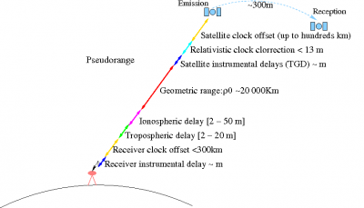
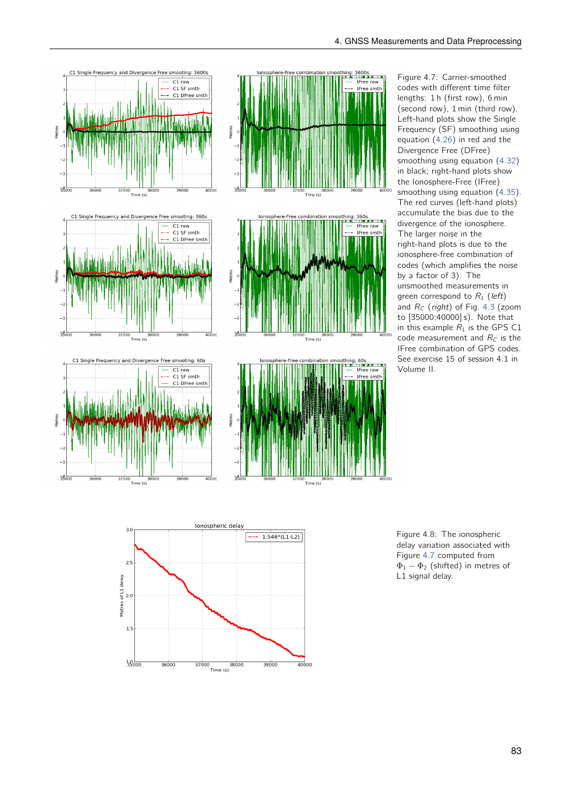
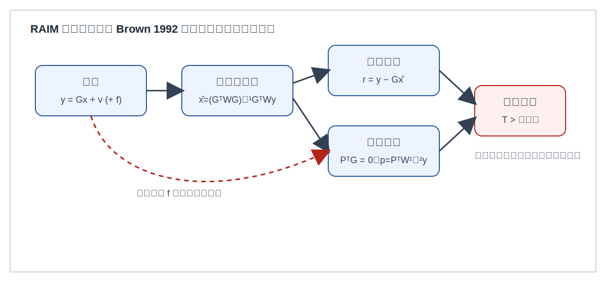

# 2026-07-14 GNSS 每日研究简报

## 今日快报

### 快报 1：Galileo E5a Quasi-Pilot 信号面向低功耗快捕获

- 主题：`galileo-low-power-snapshot`
- 来源 ID：`esa:galileo-e5a-quasi-pilot`
- 来源链接：https://www.esa.int/Applications/Satellite_navigation/Galileo/Galileo_signal_updated_for_internet-of-things_use
- 发表日期：2026-06-19
- 来源类型：ESA 官方资料
- 获取范围：开放官方页面
- 内容：ESA 报道 Galileo 在 12 颗卫星上部署 E5a Quasi-Pilot 组件。该信号保留导频便于捕获与跟踪，同时携带可预测的少量时间信息，目标是降低低功耗和 snapshot 接收机的首次定位成本。
- 结论：官方测试活动报告捕获时间可缩短约 3 倍、捕获所需运算量可降低约 8 倍；这些数字属于 ESA/产业测试结论，不等同于所有芯片、遮挡环境和信号强度下的保证值。
- 关注理由：它把信号设计直接连接到接收机功耗、首次定位时间和低成本 IoT 部署，但与传统导频信号相比，仍需评估覆盖、星座可见性和不同实现的兼容性。

### 快报 2：GPS III 激光后向反射器改善卫星轨道基准

- 主题：`gps-orbit-geodesy`
- 来源 ID：`nasa:gps-iii-laser-retroreflector`
- 来源链接：https://science.nasa.gov/centers-and-facilities/goddard/nasa-laser-reflecting-instrument-makes-gps-satellite-more-accurate/
- 发表日期：2026-03-19
- 来源类型：NASA 官方资料
- 获取范围：开放官方页面
- 内容：GPS III SV-09 搭载的激光后向反射器阵列于 2026 年 3 月投入运行。地面卫星激光测距站通过测量光脉冲往返时间，为卫星轨道和全球坐标基准提供独立观测。
- 结论：激光测距并不直接替代 GNSS 导航观测，而是帮助提高卫星轨道与全球参考框架之间的联系，从而改善后续 GPS 产品和地球观测任务的空间定位基础。
- 关注理由：接收机定位误差并不全来自用户端；卫星轨道、时钟和参考框架的质量会通过广播星历或精密产品传递到最终位置。

### 快报 3：Swing 小卫星监测会影响 GNSS 的电离层空间天气

- 主题：`gnss-space-weather`
- 来源 ID：`esa:swing-space-weather`
- 来源链接：https://www.esa.int/ESA_Multimedia/Images/2026/01/Swing_ESA_s_first_nanosatellite_for_space_weather_monitoring
- 发表日期：2026-01-22
- 来源类型：ESA 官方资料
- 获取范围：开放官方页面
- 内容：ESA 的 Swing 纳卫星用于监测电离层。电离层扰动会改变跨电离层无线电信号的传播特性，并影响卫星通信和 GNSS 导航服务。
- 结论：该任务的价值在于为近实时空间天气监测提供低成本补充观测；官方介绍没有给出某一次 GNSS 定位实验中的统一误差改善量，因此不能直接宣称其已经改善用户定位精度。
- 关注理由：单频接收机、电离层模型和完整性监测都依赖对电离层变化的合理约束，空间天气数据可作为异常检测和风险评估的外部信息。

### 快报 4：城市环境中的 GNSS、5G 与 INS 协同定位

- 主题：`urban-gnss-multisensor`
- 来源 ID：`doi:10.3390/rs18111764`
- 来源链接：https://doi.org/10.3390/rs18111764
- 发表日期：2026-06-01
- 来源类型：开放获取期刊论文
- 获取范围：论文摘要与开放页面
- 内容：论文提出面向城市环境的 GNSS、5G 和 INS 分层协同定位方法，并对不同来源的观测质量进行评估后再融合。
- 结论：论文在半遮挡室外场景报告水平 RMSE 1.61 m，相对 LSTM-UKF 基线定位 RMSE 降低 32.4%，定位中断率降低 49.5%。这些结果属于论文给定路线、遮挡条件和真值系统，不能外推为所有城市环境的固定精度提升。
- 关注理由：这与 GNSS 完好性和权阵设计相关：一个未经质量控制的额外观测可能增加模型自由度，却不一定增加可信信息。

### 快报 5：低功耗 Galileo/GNSS snapshot 定位的两步处理

- 主题：`low-power-snapshot-positioning`
- 来源 ID：`polyU:ultralow-power-gnss-l5-snapshot`
- 来源链接：https://doi.org/10.1109/JIOT.2026.3680038
- 发表日期：2026-06
- 来源类型：学术论文与作者机构记录
- 获取范围：作者机构摘要页面
- 内容：该工作面向超低功耗 GNSS L5 snapshot 接收机，提出完全相干的两步框架，先缩小 L5 码相位搜索范围，再进行位置估计；实验使用真实场景采集的中频信号。
- 结论：相对 L1 snapshot，论文在海岸和城市环境分别报告 CEP95 定位误差降低 81.2% 和 72.5%；相对传统 L5 snapshot，两步框架将码相位搜索范围缩小 92.71%。这些是论文实验设置下的结果，不等同于所有芯片和遮挡环境的功耗或精度保证。
- 关注理由：它与 E5a Quasi-Pilot 共同说明，低功耗定位的瓶颈不仅是捕获时间、时间信息获取和芯片侧运算预算。

## 深度研读

### 深读 1｜接收机基础｜GNSS 伪距与载波观测模型：误差如何进入导航方程

- 类别：`receiver-engineering`
- 学习层级：`foundation`
- 选题定位：`经典基础`
- 来源 ID：`navipedia:gnss-measurements-modelling`
- 来源链接：https://gssc.esa.int/navipedia/index.php/GNSS_Measurements_Modelling
- 发表日期：2011
- 来源类型：ESA GSSC 官方技术知识库
- 获取范围：完整开放技术页面
- 价值评分：94/100（相关性 20，经典价值 24，证据 19，教学价值 19，工程价值 12）

#### 为什么先学这个

7 月 15—19 日已经分别讨论了捕获、环路、时间字段和定位算法，但还缺少一个统一的观测层模型。本节回答：接收机实际输出的伪距和载波观测，究竟由哪些几何、时钟、传播和硬件项组成。

#### 先修知识

需要理解卫星与接收机之间的几何距离、接收机钟差、卫星钟差、对流层延迟、电离层延迟、多路径和测量噪声。载波相位还包含整数模糊度、周跳和天线相位中心等码观测没有的项。

#### 一句话逻辑

把每个观测拆成可建模项和不可避免的残差，再将残差线性化为位置、钟差和其他状态的函数，导航解算才有可解释的输入。

#### 研究问题与约束

ESA Navipedia 给出的双频码观测与载波观测模型可写为：

```math
R_i=\rho+c(\delta t_{rcv}-\delta t^{sat})+T_r+\tilde{\alpha}_i(I+K_{21})+\mathcal{M}_i+\varepsilon_i
```

```math
\Phi_i=\rho+c(\delta t_{rcv}-\delta t^{sat})+T_r-\tilde{\alpha}_i I+b_i+\lambda_iN_i+\lambda_iw+m_i+\epsilon_i
```

其中，$`\rho`$ 是几何距离，$`\delta t_{rcv}`$ 和 $`\delta t^{sat}`$ 分别是接收机与卫星钟差，$`T_r`$ 是对流层项，$`I`$ 是电离层项，$`K_{21}`$ 表示频间硬件延迟，$`N_i`$ 是整数模糊度，$`\mathcal{M}_i`$ 和 $`m_i`$ 是多路径项，$`\varepsilon_i`$ 和 $`\epsilon_i`$ 是噪声。

约束在于：不同项可能具有相同数量级或高度相关，不能仅靠一次观测把它们完全分离；必须依赖多颗卫星、多频观测、时间连续性和外部模型。

#### 核心方法论

第一步是根据卫星轨道、接收时刻和发射时刻计算几何距离。第二步是修正卫星钟差、地球自转、相对论和天线参考点。第三步是按观测类型加入电离层、对流层、硬件延迟和多路径模型。第四步把测量值减去当前预测，形成 prefit residual，再通过最小二乘或卡尔曼滤波估计状态改正量。

#### 关键公式逐步推导

从单颗卫星的几何关系开始：

```math
\rho=\left\|\mathbf r^{sat}-\mathbf r^{rcv}\right\|
```

对接收机位置在当前估计点附近线性化：

```math
\Delta\rho\approx-\mathbf u^T\Delta\mathbf r
```

其中 $`\mathbf u`$ 是从接收机指向卫星的视线单位向量。将位置改正和接收机钟差写入状态向量：

```math
\Delta y_k=\mathbf h_k\Delta\mathbf x+v_k
```

多颗卫星堆叠后得到：

```math
\Delta\mathbf y=\mathbf G\Delta\mathbf x+\mathbf v
```

最小二乘解为：

```math
\widehat{\Delta\mathbf x}
=
(\mathbf G^T\mathbf W\mathbf G)^{-1}
\mathbf G^T\mathbf W\Delta\mathbf y
```

这一步说明，观测模型错误会进入残差 $`\mathbf v`$，而几何矩阵 $`\mathbf G`$ 会把不同方向的测量误差映射成不同方向的位置误差。

#### 经典价值与创新边界

该资料不是新的定位算法，经典价值在于给出一个适用于 SPP、差分定位和精密定位的统一观测语言。它的创新边界也很清楚：页面提供模型框架，不替代具体接收机的硬件标定、天线校准、误差统计或完整性证明。

#### 整体逻辑链

原始信号 → 伪距/载波观测 → 几何与钟差模型 → 大气和硬件改正 → prefit residual → 线性化导航方程 → 状态估计 → 后验残差与质量控制。

#### 原文图表与结果分析

建议采用原文 Figure 1“Pseudorange measurements’ content”，保留原图的几何距离、钟差、大气延迟、硬件延迟、多路径和噪声标注。



> 图 1 来源：ESA Navipedia “GNSS Measurements Modelling”，Figure 1；从公开页面缩略图下载，未改动数据或标注。

图表解读应强调：该图是误差项结构示意，不是某个接收机的实测误差预算；它不能证明各项在实际环境中的大小关系，也不能直接给出定位精度。

#### 原文结果论述

原文指出，测量残差包含接收机位置误差、钟差、模型遗漏项和测量噪声；更准确的观测建模有助于在导航方程中分离这些误差。这里的“更准确”是建模原则，不是一个统一的百分比改善量。

#### 常见误区与适用边界

第一，把伪距当作几何距离，忽略钟差和传播延迟。第二，把载波相位乘波长后当成绝对距离，忽略整数模糊度。第三，只修正卫星钟差，不处理接收机时间标签和发射时刻。第四，把后验残差小误认为位置一定正确；几何退化或共同偏差仍可能隐藏在解中。

#### 工程实现步骤

1. 统一时间系统、坐标系和单位。
2. 根据发射时刻计算卫星位置与卫星钟差。
3. 计算地球自转改正和天线参考点距离。
4. 按观测类型加入电离层、对流层、硬件和多路径模型。
5. 生成逐星 prefit residual。
6. 进行加权最小二乘或滤波估计。
7. 保存逐星残差、权值和剔除原因，而不只保存最终坐标。

#### 复现实验设计

使用一组公开 RINEX 观测和广播星历，分别建立：

- 仅几何距离与钟差模型；
- 加入电离层和对流层模型；
- 再加入卫星天线、地球自转和观测质量控制。

比较三条处理链的逐星残差 RMS、位置误差、钟差估计和卫星剔除数量。实验必须单独报告静态开阔环境与城市环境，避免把模型改善误认为环境改善。

#### 与定位及低成本实现的联系

低成本接收机常见的问题并不是缺少复杂算法，而是观测字段、单位、时间和误差项没有被分层保存。统一模型能帮助判断误差来自信号、时间标签、卫星产品还是解算器。

#### 本节小结

伪距与载波不是“距离数字”，而是由多个物理和工程项叠加形成的观测。理解这层模型后，后续的双频组合、PPP、RTK 和完整性监测才有共同基础。

### 深读 2｜测量组合进阶｜双频电离层无关组合为何同时消除电离层又放大噪声

- 类别：`tracking`
- 学习层级：`intermediate`
- 选题定位：`基础进阶`
- 来源 ID：`esa:tm23-vol1-ionosphere-free`
- 来源链接：https://gssc.esa.int/navipedia/GNSS_Book/ESA_GNSS-Book_TM-23_Vol_I.pdf
- 发表日期：2013
- 来源类型：ESA GNSS Data Processing 官方教材
- 获取范围：开放 PDF，重点为第 5.4.1.1 节及第 4.2 节
- 价值评分：93/100（相关性 19，经典价值 23，证据 20，教学价值 18，工程价值 13）

#### 为什么先学这个

7 月 19 日讨论了双频手机 PPP 的实际边界，本节不重复讨论手机 PPP，而是回到更基础的测量组合：为什么两个频点可以消除一阶电离层项，以及为什么这个操作会放大观测噪声。

#### 先修知识

需要知道一阶电离层延迟近似与频率平方成反比：

```math
I_i=\frac{40.3\cdot STEC}{f_i^2}
```

其中 $`STEC`$ 是斜向总电子含量，单位通常为 TECU 或电子数每平方米；实际工程中还需明确单位换算。码观测中的电离层项为正，载波相位中的电离层项为负。

#### 一句话逻辑

按照频率平方设计线性系数，使几何距离项保留为一倍，而一阶电离层项相互抵消；代价是两个带噪声观测的线性组合会增加噪声和硬件偏差敏感性。

#### 研究问题与约束

对于两个频率 $`f_1`$ 和 $`f_2`$，希望构造：

```math
R_{IF}=aR_1+bR_2
```

并满足：

```math
a+b=1
```

以及：

```math
\frac{a}{f_1^2}+\frac{b}{f_2^2}=0
```

第一个条件保留几何距离，第二个条件消除一阶电离层项。该组合只消除一阶频率相关项，不能自动消除二阶电离层效应、天线效应、多路径和接收机硬件误差。

#### 核心方法论

ESA 教材给出的双频电离层无关组合为：

```math
R_{IF}
=
\frac{f_1^2R_1-f_2^2R_2}{f_1^2-f_2^2}
```

```math
\Phi_{IF}
=
\frac{f_1^2\Phi_1-f_2^2\Phi_2}{f_1^2-f_2^2}
```

代入 $`R_i=\rho+I_i+\varepsilon_i`$，并利用 $`I_i\propto 1/f_i^2`$，一阶电离层项相互抵消，几何项系数仍为一。

#### 关键公式逐步推导

令：

```math
a=\frac{f_1^2}{f_1^2-f_2^2},
\qquad
b=-\frac{f_2^2}{f_1^2-f_2^2}
```

显然有：

```math
a+b=1
```

而一阶电离层系数为：

```math
\frac{a}{f_1^2}+\frac{b}{f_2^2}
=
\frac{1}{f_1^2-f_2^2}
-
\frac{1}{f_1^2-f_2^2}
=0
```

若两个原始码观测噪声独立，标准差分别为 $`\sigma_1`$ 和 $`\sigma_2`$，则组合噪声方差为：

```math
\sigma_{IF}^2=a^2\sigma_1^2+b^2\sigma_2^2
```

因此，电离层消除不是“免费改正”：组合系数的绝对值可能大于 1，噪声也随之增大。ESA 教材以传统 GPS 信号为例指出，电离层无关载波平滑码的噪声约放大到原组合的 3 倍。

#### 经典价值与创新边界

电离层无关组合是双频 GNSS 处理的经典工具，也是 PPP 观测模型的重要组成部分。它的价值在于明确展示“消除系统误差”和“放大随机误差”之间的交换关系。

它不是新的电离层估计方法，也不意味着双频观测在所有环境下都优于单频观测；当多路径、硬件延迟、周跳或观测噪声占主导时，组合可能降低实际效果。

#### 整体逻辑链

频率相关的电离层延迟 → 设计满足两个约束的线性组合 → 一阶电离层项抵消 → 几何项保留 → 噪声与硬件项重新加权 → 进入双频导航或精密定位模型。

#### 原文图表与结果分析

建议采用 ESA 教材第 4.7 节中比较单频码平滑与电离层无关平滑的图，重点展示：



> 图 2 来源：ESA TM-23/1《GNSS Data Processing Vol. I》，Figure 4.7；从公开 PDF 第 95 页渲染，保留原图曲线、坐标轴和图注。

- 横轴：时间，单位为秒；
- 纵轴：码距离误差，单位为米；
- 单频平滑曲线：噪声较小，但会积累电离层发散；
- 电离层无关曲线：对电离层梯度不敏感，但噪声更大。

该图只能说明教材示例中的组合行为，不能推导出所有接收机、频点和环境下都固定为 3 倍噪声。

#### 原文结果论述

教材指出，双频组合可以去除一阶电离层折射；同时，电离层无关码组合会引入更大的测量噪声。教材还提醒，电离层无关平滑不受空间或时间电离层梯度影响，但传统 GPS 信号上的噪声放大约为 3 倍。

#### 常见误区与适用边界

第一，把“电离层无关”理解为“所有大气误差都消失”。第二，忽略组合后的噪声协方差。第三，直接把两个频点的载波相位整数模糊度当成一个原始整数。第四，忽略频间硬件延迟和卫星端差分码偏差。第五，把理论一阶消除效果直接外推到手机、低仰角或严重多路径场景。

#### 工程实现步骤

1. 读取两个频点的码和载波观测。
2. 统一单位，确保载波已转换为米。
3. 根据实际频率计算组合系数。
4. 同步处理观测质量、周跳和失锁标志。
5. 按组合系数传播噪声协方差。
6. 分别保存原始观测、组合观测和组合后的权值。
7. 对低仰角、多路径和异常频间偏差设置独立质量控制。

#### 复现实验设计

使用同一测站的双频 RINEX 数据，计算原始单频观测、几何无关组合和电离层无关组合。比较：

- 码观测标准差；
- 载波观测标准差；
- 电离层变化期间的残差漂移；
- 组合前后的噪声协方差；
- 低仰角卫星与高仰角卫星的差异。

再人为注入一个已知频间偏差，验证该偏差不会被电离层无关组合自动消除。

#### 与定位及低成本实现的联系

双频组合通常减少了对电离层模型的依赖，却增加了对频间硬件一致性和观测噪声建模的要求。对低成本接收机，是否使用电离层无关组合必须由信号质量、天线、多路径和产品质量共同决定，而不能只根据“有双频”这一条件决定。

#### 本节小结

电离层无关组合是一个精确但有代价的线性变换：它消除一阶电离层，却放大噪声并保留其他误差。工程上必须同时传播组合噪声和硬件偏差，而不是只保留“无电离层”这一标签。

### 深读 3｜定位完好性｜Brown 基线 GPS RAIM：残差、奇偶空间与报警门限

- 类别：`positioning`
- 学习层级：`advanced`
- 选题定位：`定位深入`
- 来源 ID：`ion:brown-1992-baseline-gps-raim`
- 来源链接：https://www.ion.org/publications/abstract.cfm?articleID=100185
- 发表日期：1992
- 来源类型：ION 同行评审论文
- 获取范围：官方摘要与书目信息；全文可能需要 ION 访问权限
- 价值评分：95/100（相关性 20，经典价值 25，证据 19，教学价值 18，工程价值 13）

#### 为什么先学这个

前两节解释观测如何形成以及如何进行双频组合。本节进一步回答：即使解算器给出了一个位置，接收机如何判断这个位置是否值得信任。RAIM 是纯 GNSS 完好性监测的经典入口，与 7 月 15 日的 Bancroft 位置求解不同，也不讨论 PPP、RTK 或多传感器融合。

#### 先修知识

需要理解线性化观测模型、最小二乘解、残差、协方差和虚警概率。RAIM 依赖冗余观测：未知状态数量之外必须还有额外观测，才能检验观测之间是否一致。

#### 一句话逻辑

如果测量冗余与当前模型不一致，接收机通过残差或奇偶空间统计量触发报警，并在具备足够冗余时尝试识别和排除故障卫星。

#### 研究问题与约束

Brown 论文提出一个可作为比较基线的 GPS RAIM 方案，并研究距离比较、最小二乘残差和奇偶空间三类方法之间的关系。统一线性模型写为：

```math
\mathbf y=\mathbf G\mathbf x+\mathbf v
```

若存在单星故障，则：

```math
\mathbf y=\mathbf G\mathbf x+\mathbf v+\mathbf f
```

其中 $`\mathbf f`$ 是故障向量。RAIM 的核心约束是：正常测量误差的统计模型、卫星几何、报警概率和保护水平必须同时满足要求。

#### 核心方法论

最小二乘解为：

```math
\hat{\mathbf x}
=
(\mathbf G^T\mathbf W\mathbf G)^{-1}
\mathbf G^T\mathbf W\mathbf y
```

残差为：

```math
\mathbf r
=
\mathbf y-\mathbf G\hat{\mathbf x}
```

其统计量可写为：

```math
T_r=\mathbf r^T\mathbf W\mathbf r
```

另一条路线是构造矩阵 $`\mathbf P`$，使其满足：

```math
\mathbf P^T\mathbf G=\mathbf 0
```

则奇偶空间向量为：

```math
\mathbf p=\mathbf P^T\mathbf W^{1/2}\mathbf y
```

在无故障时，奇偶空间主要包含测量噪声；故障投影到奇偶空间后会改变统计量。报警门限需由目标虚警率和噪声模型确定，而不能只凭经验选择固定残差阈值。

#### 关键公式逐步推导

在无故障假设下：

```math
\mathbf y=\mathbf G\mathbf x+\mathbf v
```

由于 $`\mathbf P^T\mathbf G=\mathbf 0`$：

```math
\mathbf p
=
\mathbf P^T\mathbf W^{1/2}\mathbf v
```

若噪声经白化后近似高斯，则奇偶空间统计量近似服从自由度为 $`m-n`$ 的卡方分布：

```math
T_p=\mathbf p^T\mathbf p
\sim\chi^2_{m-n}
```

存在故障时：

```math
\mathbf p
=
\mathbf P^T\mathbf W^{1/2}\mathbf v
+
\mathbf P^T\mathbf W^{1/2}\mathbf f
```

第二项是故障在奇偶空间中的投影。如果故障方向接近观测模型空间，投影可能很小，因而存在漏检风险；如果卫星几何较差，同样的测量故障可能造成更大的位置误差。

Brown 的核心结论不是某一种方法在所有条件下绝对更好，而是：在报警率相同的条件下，距离比较、最小二乘残差和奇偶空间 RAIM 方法可以得到等价的检测结果。论文明确将其方案定位为可工作的基线，并未声称其最优。

#### 经典价值与创新边界

这篇论文的经典价值有两点。第一，它把多个看似不同的 RAIM 实现放进统一的统计框架。第二，它提供了可以比较后续算法的基线。

创新边界也必须保留：这是单故障、给定噪声和几何条件下的经典模型。它不自动解决多故障、非高斯多路径、欺骗信号、未知模型偏差或现代多星座完整性风险。

#### 整体逻辑链

观测冗余 → 线性化导航方程 → 计算残差或奇偶空间向量 → 按虚警率设定门限 → 检测故障 → 逐星排除或重新计算 → 输出保护水平、报警状态和可用性。

#### 原文图表与结果分析

建议使用论文中的 RAIM 几何或奇偶空间示意图，并补充一张复现实验图：



> 图 3 为基于 Brown 1992 论文摘要与统一线性模型的概念重绘，不是原论文复印图；用于说明观测、残差/奇偶空间和门限检验的关系，未声称复现论文数值结果。

- 横轴：注入的单星伪距偏差，单位为米；
- 纵轴：RAIM 统计量或垂直位置误差；
- 曲线：不同卫星几何或不同权值模型；
- 水平线：由目标虚警率确定的检测门限。

图中应明确区分“统计量超过门限”和“位置误差超过保护限”。前者是检测事件，后者是导航风险，两者不能互相替代。

#### 原文结果论述

ION 官方摘要说明，Brown 提出的基线方案用于比较不同 RAIM 方法，并指出在相同报警率条件下，距离比较、最小二乘残差和奇偶空间方法会得到等价结果。摘要同时强调，该方案是简单、可工作的方案，并没有声称最优。

#### 常见误区与适用边界

第一，把 RAIM 报警当成位置一定错误；RAIM 检测的是观测一致性。第二，把没有报警理解为位置绝对正确；漏检和共同模式误差仍可能存在。第三，忽略卫星几何和权值对保护水平的影响。第四，把单故障 RAIM 直接用于多故障、欺骗或严重非高斯多路径场景。第五，只输出“可用/不可用”，不保存统计量、门限、排除卫星和几何信息。

#### 工程实现步骤

1. 构造带权线性观测模型。
2. 计算位置解、残差和残差协方差。
3. 根据目标虚警率设置检测门限。
4. 计算整体一致性统计量。
5. 触发报警后执行逐星排除或子集重算。
6. 评估排除后的几何、保护水平和连续性。
7. 保存报警原因、统计量、门限和被排除卫星。

#### 复现实验设计

设计一个六颗 GPS 卫星的静态场景，使用真实广播星历或公开 RINEX 数据。设置三组实验：

- 正常高斯测量噪声；
- 单颗卫星注入 0.5—50 m 的伪距偏差；
- 两颗卫星同时注入偏差或引入非高斯重尾噪声。

在固定虚警率下比较残差法、奇偶空间法和逐星排除法的检测率、漏检率、误排除率、水平/垂直位置误差和保护水平。实验必须报告卫星几何，因为相同故障量在不同几何下可能造成不同的位置风险。

#### 与定位及低成本实现的联系

RAIM 不需要额外射频硬件，但需要额外卫星冗余、稳定的观测噪声模型和足够的计算预算。低成本接收机可以实现简化版残差监测，但必须诚实报告其单故障假设、卫星数量限制和城市多路径边界。

#### 本节小结

RAIM 的核心不是“找出最大残差”，而是在给定噪声、几何和虚警约束下判断观测是否自洽。Brown 的基线工作值得学习之处，是把残差、距离比较和奇偶空间统一为可比较的统计检测问题。
