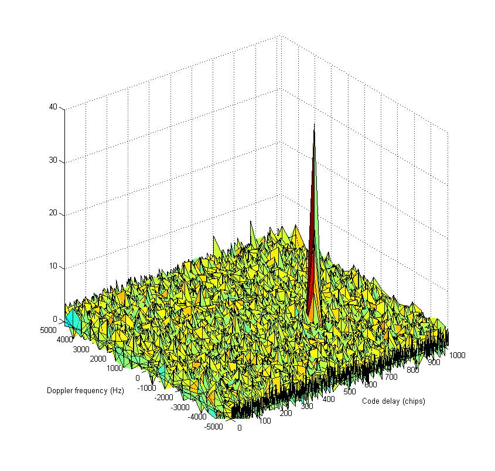
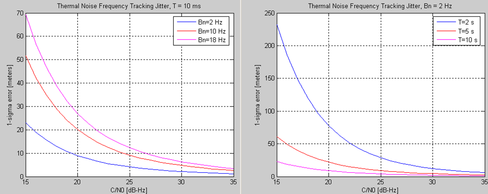
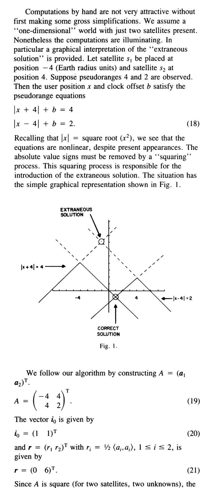

# 2026-07-15 GNSS 每日研究简报

## 今日快报

### 快报 1：GNSS-FM: A Self-Supervised Foundation Model for Daily GNSS Displacement Time Series

- 主题：`gnss-geodesy-ai`
- 来源 ID：`arxiv:2606.07725`
- 来源链接：https://arxiv.org/abs/2606.07725
- 发表日期：2026-06-05
- 来源类型：预印本
- 获取范围：开放预印本

**内容：** GNSS-FM 将全球 1.7 万余个测站的日位移与类似速度的增量组成双流输入，用掩码潜变量预测和矢量量化目标开展自监督预训练，再迁移到 90 天位移预测与地震阶跃定位。

**结论：** 预训练表征能够区分地震阶跃、构造漂移和季节项，并在两个下游任务上超过面向单任务训练的强基线，说明大量无标签测站数据可以先学习通用时序结构，再用少量标签适配任务。

**关注理由：** 这类模型可迁移到测站异常检测、对流层或多路径异常识别，但跨区域泛化和极端事件样本不均衡仍需独立验证。

### 快报 2：Foresight: Iterative Reasoning About Clues that Matter for Navigation

- 主题：`ai-robot-navigation`
- 来源 ID：`arxiv:2606.12550`
- 来源链接：https://arxiv.org/abs/2606.12550
- 发表日期：2026-06-10
- 来源类型：预印本
- 获取范围：开放预印本

**内容：** Foresight 让视觉语言模型在执行前交替提出图像空间运动方案并批判方案，利用人类反馈训练奖励模型，使规划逐轮发现与目标有关的环境线索。

**结论：** 论文报告任务成功率相对现有测试时推理基线平均提高 37%，人工干预减少 52%，并可在 Jetson AGX Orin 上实时运行。

**关注理由：** 它展示了定位不确定性、语义线索与路径决策的闭环，可启发把 GNSS 完整性和遮挡风险输入规划器，而非只传递单个坐标。

### 快报 3：Learning-Based Navigation for Indoor Mobile Robots

- 主题：`indoor-navigation`
- 来源 ID：`arxiv:2605.30468`
- 来源链接：https://arxiv.org/abs/2605.30468
- 发表日期：2026-05-28
- 来源类型：预印本
- 获取范围：开放预印本

**内容：** 该框架用代价感知 A* 轨迹监督训练全局规划器，并把局部 DWA 写成离散动作候选选择：先行为克隆，再用带可行性掩码的 PPO 细化。

**结论：** 仿真和真实室内实验表明，全局路线保持可行，局部控制可在障碍环境中完成目标导航；关键是把经典几何约束保留在动作空间中。

**关注理由：** 对 GNSS 拒止区的低成本平台，经典候选集加学习排序比完全端到端控制更容易验证，也适合室内外状态切换。

### 快报 4：GenAI for Energy-Efficient and Interference-Aware Compressed Sensing of GNSS Signals on a Google Edge TPU

- 主题：`gnss-interference-edge-ai`
- 来源 ID：`arxiv:2605.14839`
- 来源链接：https://arxiv.org/abs/2605.14839
- 发表日期：2026-05-14
- 来源类型：预印本
- 获取范围：开放预印本

**内容：** 作者将变分自编码器部署到 Google Edge TPU，用 8 位量化压缩原始 IQ、FFT 或人工特征，同时保留约 72 类干扰的分类信息。

**结论：** 报告压缩率超过 42 倍；重构信号分类 F2 为 0.915，接近原始信号的 0.923，说明边缘端可以先压缩再分析。

**关注理由：** 方案对应低功耗监测与众包干扰地图，但跨射频前端、量化尺度和未知干扰类型的泛化仍需测试。

### 快报 5：Bridging the Indoor-Outdoor Gap: Cross-Technology Ranging for Seamless Robot Navigation

- 主题：`gnss-uwb-wifi-ble`
- 来源 ID：`arxiv:2604.25541`
- 来源链接：https://arxiv.org/abs/2604.25541
- 发表日期：2026-04-28
- 来源类型：预印本
- 获取范围：开放预印本

**内容：** HYMN 数据集把 GNSS、UWB、Wi-Fi FTM 和 BLE 原始测量与毫米级真值同步，按区域分析可用率与测距残差，重点观察室内外过渡带。

**结论：** 卫星与地面无线测距总体互补，但建筑边界可能出现两类技术同时退化，简单硬切换会留下风险空窗。

**关注理由：** 同步原始量和真值可用于研究残差驱动权重、完整性监控和低成本多无线融合。

## 深度研读

### 深读 1｜信号捕获基础｜Generic Receiver Description：二维捕获面与相关峰

- 类别：`acquisition`
- 学习层级：`foundation`
- 选题定位：`经典基础`
- 来源 ID：`navipedia:generic-receiver-description`
- 来源链接：https://gssc.esa.int/navipedia/index.php?title=Generic_Receiver_Description
- 发表日期：2011
- 来源类型：ESA GSSC 官方工程知识库
- 获取范围：完整技术页面
- 价值评分：91/100（相关性 19，经典价值 24，证据 17，教学价值 18，工程价值 13）

#### 为什么先学这个

捕获论文很容易一上来就进入 GLRT、稀疏恢复或长时间积累，但所有方法最终都在回答同一个基础问题：在“码相位 × 多普勒”网格上，哪个单元最像目标卫星？先看懂二维相关面，才能理解为什么需要 FFT、为什么频率步长不能随意设、为什么峰值并不自动等于检测成功。这个问题小，却是后续捕获算法复杂度、检测概率和移交跟踪误差的共同起点。

#### 先修知识

只需要三个概念。第一，已知 PRN 码具有尖锐自相关峰：本地码与来波码对齐时相关大，错开时相关小。第二，卫星和接收机相对运动以及本机晶振偏差会产生多普勒，若本地载波频率不对，积分期间相位旋转会抵消相关能量。第三，GPS L1 C/A 码周期为 1 ms、1023 chip，所以未知码相位可落在一个码周期内，而未知频率通常在数 kHz 搜索范围内。

#### 一句话逻辑

接收机对每个候选多普勒先擦除载波，再与每个候选码移位做相关并取功率；正确的频率与码相位同时对齐时形成二维尖峰，峰值超过按虚警率设计的门限后才宣布捕获。

#### 研究问题与约束

复基带样本可简化写成

```text
r[n] = A * d[n] * c[n - tau_0] * exp(j * (2*pi*f_d*n*T_s + phi_0)) + w[n]
```

其中 `c` 是目标 PRN，`tau_0` 是未知码延迟，`f_d` 是未知多普勒，`d` 是导航数据位，`T_s` 是采样周期，`w` 是噪声。捕获必须估计 `tau_0` 和 `f_d` 的粗值，并判断信号是否存在。约束来自有限积分时间：时间太短，噪声大；时间太长，导航位翻转、残余频偏和动态会破坏相干性。二维网格越密，单格失配越小，但计算量和“多重比较”造成的总虚警概率越高。

#### 核心方法论

对候选频率 `f_m` 和候选码延迟 `tau_k`，计算

```text
Z(k,m) = sum(n=0..N-1) { r[n] * conj(c[n - tau_k]) * exp(-j*2*pi*f_m*n*T_s) }
P(k,m) = |Z(k,m)|^2
```

指数项把候选多普勒从来波中擦除，本地 PRN 把目标卫星解扩，求和完成相干积分，模平方消除未知载波初相。串行搜索逐个计算所有 `k,m`；并行码相位搜索利用“循环相关等于频域乘积的逆 FFT”，对每个频率单元用一次 FFT/IFFT 同时得到全部码相位。FFT 没有改变判决原理，只是改变相关的实现复杂度。

#### 关键公式逐步推导

若候选码相位正确，但残余频差为 `delta_f=f_d-f_m`，忽略数据位和噪声后，积分项近似为有限几何级数，其归一化幅度接近

```text
| sin(pi * delta_f * T_coh) / (N * sin(pi * delta_f * T_s)) |
    ~= | sinc(delta_f * T_coh) |
```

这说明频率栅格与相干积分时间绑在一起：`T_coh` 越长，主瓣越窄，频率步长必须更细。若最大频率失配取半个频率格，常见设计会把步长控制在约 `1/T_coh` 或更细，并按允许相关损失验证，而不是照抄固定 500 Hz。

码相位方向同理。BPSK 矩形码片的理想自相关主峰近似三角形，偏离一整个 chip 时主峰基本消失；使用半 chip 或更细步长可降低最坏码失配，但采样率决定了可表示的实际延迟分辨率。最后，`P(k,m)` 只是统计量。在无信号假设 `H_0` 下它由噪声决定，门限应依据单元虚警率、搜索单元总数和确认策略设计。只比较“最大峰比第二峰”虽然实用，却不是脱离网格数量的固定真理。

#### 经典价值与创新边界

这份资料本身不提出新捕获算法，它的经典价值在于用一张图把相关、二维搜索和峰值判决统一起来。几乎所有高级方法都只是在四处做文章：减少要搜索的单元、降低每个单元的相关成本、提高弱信号下的积累效率，或改善门限统计。把这四个位置认清，比直接记住某一种“快速捕获”名称更重要。

#### 整体逻辑链

PRN 自相关提供码延迟可辨识性 → 多普勒擦除避免相干积分抵消 → 枚举候选 `(tau,f)` 得到二维相关功率 → 正确单元形成主峰 → 门限把信号峰与最大噪声峰分开 → 粗估计送入 DLL/FLL/PLL → 跟踪环连续细化。任何一步参数不匹配都会在下一步表现为捕获失败、假峰或移交后迅速失锁。

#### 原文图表与结果分析



> 图源：Navipedia《Generic Receiver Description》Figure 2，[ESA GSSC 原页面](https://gssc.esa.int/navipedia/index.php?title=Generic_Receiver_Description)，截取用于研究评论；遵循原页面使用边界，未修改坐标、曲面或图例。

横轴之一是 0–1000 chip 左右的码延迟，另一轴是约 `-5000` 至 `+5000` Hz 的多普勒，竖轴是未标明归一化方式的相关强度。主峰位于约 650 chip、`-1750` Hz，与原文说明一致；峰高按图约 35，而周围大部分噪声地板在 0–10 附近。峰在码方向很窄，说明码相位错开少量 chip 就会明显损失；频率方向的宽度受积分时间控制，但图中没有给出积分时间，因此不能由外观反推出频率分辨率。

图中还有若干十几量级的随机尖峰。这一点非常重要：搜索器面对的不是“一个峰和全零背景”，而是“目标峰与搜索空间最大噪声峰”的竞争。该图没有画门限、峰比、虚警统计或重复验证，所以它只能说明这一次示例有清晰峰，不能证明某门限在所有 C/N0 下可靠，也不能据此给出检测概率。

#### 原文结果论述

原页面的结论是：不同码延迟和多普勒副本与输入相关，当二者同时匹配时相关输出达到最大，该参数对可用来初始化跟踪。这是接收机结构与原理说明，不是带置信区间的实验论文。直接读图可确认示例峰位置和峰噪分离；至于捕获概率、FFT 加速倍数和弱信号极限，原图没有提供证据，必须另做统计实验。

#### 常见误区与适用边界

第一，最高峰不必然是真卫星：多重搜索会抬高最大噪声峰，干扰和交叉相关也可能造峰。第二，FFT 搜索不是“更灵敏”，在相同积分和归一化下它主要更快。第三，频率步长不是只由预期多普勒范围决定，还受相干积分长度影响。第四，码相位输出通常是采样点或分数 chip，换算伪距前还涉及通道时间标记和整毫秒模糊。第五，本图展示的是单峰 BPSK 类直觉，BOC 多峰相关函数和二次码会引入额外模糊结构。

#### 工程实现步骤

最小并行码相位搜索可写成：①生成一个码周期本地 PRN 并计算其 FFT 共轭；②对每个候选多普勒把输入乘以本地复载波；③对擦频后的样本做 FFT；④与 PRN 频谱共轭逐点相乘并 IFFT；⑤取模平方得到全部码相位；⑥记录全局峰、次峰和噪声统计；⑦按门限与保护区外峰比确认；⑧在峰周围做码/频率细化，再移交跟踪。实现必须统一 FFT 归一化，否则不同长度和不同库的门限不可直接复用。

#### 复现实验设计

先生成 GPS L1 C/A 单星信号，采样率 4.092 MHz，真实码相位 650 chip，多普勒 `-1750` Hz，相干积分 1 ms。输出完整二维功率面，验证峰坐标。随后分别改变 C/N0、频率步长、码步长和相干时间，统计至少一万次噪声/信号试验的单元虚警率、全搜索虚警率、检测率和估计误差。再加入数据位翻转、1 kHz/s 频率斜率与一位量化，观察“理论相关峰”在真实约束下如何塌缩。

#### 与定位及低成本实现的联系

捕获只给粗同步，但它决定首次定位时间和后续观测量能否形成。低成本晶振扩大多普勒范围，增加频率单元；低采样率降低码相位分辨率；功耗限制又不允许无限延长搜索。理解二维面后，才能合理选择辅助信息缩窗、FFT 批处理、分层搜索和重捕获缓存，而不是盲目堆算力。

#### 本节小结

捕获的本质是二维匹配滤波加统计判决。先把码延迟、多普勒、积分损失、网格密度和总虚警的关系弄清楚，再学习 GLRT 或稀疏捕获，难度会低很多。原图最值得记住的不是峰坐标，而是目标峰周围始终存在随机峰，因此“相关最大”与“可靠检测”是两个不同问题。

### 深读 2｜信号跟踪基础进阶｜Frequency Lock Loop：经典 FLL 鉴频器

- 类别：`tracking`
- 学习层级：`intermediate`
- 选题定位：`经典基础`
- 来源 ID：`navipedia:frequency-lock-loop`
- 来源链接：https://gssc.esa.int/navipedia/index.php?title=Frequency_Lock_Loop_%28FLL%29
- 发表日期：2011
- 来源类型：ESA GSSC 官方工程知识库
- 获取范围：完整技术页面
- 价值评分：93/100（相关性 20，经典价值 25，证据 17，教学价值 19，工程价值 12）

#### 为什么先学这个

捕获得到的多普勒只是粗值，载波还会因卫星运动和晶振漂移继续变化。FLL 是“从两个相邻复相关向量估计相位变化率”的经典桥梁，数学只用叉积、点积和反正切，却同时包含无模糊范围、单位换算、数据位、积分时间和热噪声权衡。把这个小鉴频器讲透，比直接上联合矢量跟踪更适合建立环路直觉。

#### 先修知识

在码已基本对齐后，Prompt 相关输出可看作复向量 `P_k = I_k + j*Q_k = A_k*exp(j*phi_k) + n_k`。相邻两次输出相隔 `T` 秒；若残余频率在此期间近似恒定，则相位差 `delta_phi ~= 2*pi*delta_f*T`。点积反映两个向量夹角的余弦，二维叉积反映正弦，因此二者共同确定带象限的相位差。

#### 一句话逻辑

用相邻 Prompt 向量的 cross 和 dot 组成 `atan2`，恢复 `(-pi, pi]` 内的相位增量，再除以 `2*pi*T` 得到 Hz 频差；较长积分降低噪声，却按 `|delta_f| < 1/(2*T)` 缩小无模糊频率范围。

#### 研究问题与约束

FLL 不要求载波相位本身锁定，只需相邻相关向量仍包含稳定相位演化。目标是在较大初始频差下给 NCO 提供频率校正，同时避免相位绕回、导航位翻转和低 C/N0 噪声把方向判错。主要约束是残余频率在相邻积分间近似常值、码跟踪足够好、相邻输出时间戳准确，并且不能跨越未处理的数据位边界。

#### 核心方法论

对相邻两次 Prompt 输出定义

```text
cross = I_1*Q_2 - I_2*Q_1
dot   = I_1*I_2 + Q_1*Q_2
```

若忽略噪声且两次幅度为 `A_1,A_2`，代入 `I = A*cos(phi)`、`Q = A*sin(phi)` 可得

```text
cross = A_1*A_2*sin(phi_2 - phi_1)
dot   = A_1*A_2*cos(phi_2 - phi_1)
```

因此幅度乘积同时出现在两式中，使用

```text
delta_phi_hat = atan2(cross, dot)
delta_f_hat   = delta_phi_hat / (2*pi*T)
```

可在不显式估计幅度的情况下得到带符号频差。低复杂度近似只用 `cross/T`，小角度时因 `sin(delta_phi) ~= delta_phi` 有效，但大频差会压缩且对幅度敏感；`cross*sign(dot)` 扩大线性使用区；`atan2` 最稳健但计算最贵。

#### 关键公式逐步推导

复数形式更直接：

```text
P_2 * conj(P_1) = (I_2 + j*Q_2) * (I_1 - j*Q_1) = dot + j*cross
```

乘以共轭等价于相减相位，所以其辐角就是 `phi_2 - phi_1`。`atan2(y,x)` 返回 `(-pi, pi]`，由 `delta_phi = 2*pi*delta_f*T` 得

```text
-1/(2*T) < delta_f <= 1/(2*T)
```

这就是 FLL 无模糊范围。`T = 1 ms` 时约为 `±500 Hz`；`T = 10 ms` 时缩为 `±50 Hz`。长积分能增加相关器输出 SNR，却不能在仍有数百 Hz 初始误差时直接使用，因此工程上常先短积分拉入，再逐步延长积分或切换 PLL。

原页面把 `atan2(cross,dot)/(t_2-t_1)` 直接称为频差。严格说，若 `atan2` 输出弧度，该量单位是 rad/s；要得到 Hz 必须再除 `2*pi`。代码接口必须明确输出单位，不能让 rad/s、Hz 和 NCO 相位步进混用。

#### 经典价值与创新边界

cross/dot 鉴频器不是新算法，它的价值是把复相关器几何、离散相位差、频率混叠和环路参数连接在一起。现代自适应或矢量 FLL 最终仍要处理相同的单通道观测：何时可信、何时绕回、如何把频率误差转换为 NCO 控制。学习经典形式能为后续鲁棒权重和联合滤波提供可检查的基线。

#### 整体逻辑链

捕获给出粗多普勒 → Prompt 相关器产生相邻复向量 → 共轭乘积消除公共初相 → cross/dot 分别编码相位差的正弦/余弦 → `atan2` 还原象限 → 除以 `2*pi*T` 得 Hz → 环路滤波抑制热噪声 → NCO 校正残余频率 → 误差足够小时切换或辅助 PLL。若任何一次相位差越过 `pi`，鉴频结果会按 `2*pi` 折返。

#### 原文图表与结果分析



> 图源：Navipedia《Frequency Lock Loop (FLL)》Figure 1，[ESA GSSC 原页面](https://gssc.esa.int/navipedia/index.php?title=Frequency_Lock_Loop_%28FLL%29)，截取用于研究评论；保持原图坐标和图例不变。

两图横轴均为 C/N0，从 15 到 35 dB-Hz；纵轴标为 `1-sigma error [meters]`。左图固定标题中的 `T=10` ms，对比 `B_n=2,10,18` Hz：在约 20 dB-Hz 处三条曲线按图约为 9、20、28，带宽越宽，热噪声抖动越大；C/N0 增加后差距迅速缩小。右图固定 `B_n=2` Hz，对比不同积分时间，长积分曲线更低，说明累积提高了低 C/N0 下的相位差估计质量。

原图存在明显口径疑点：FLL 公式在页面中给出的量是速度型误差，纵轴却写 meters；右图图例写 `T=2 s/5 s/10 s`，与 GNSS 跟踪常用毫秒积分及左图 `T=10 ms` 不一致，极可能是标注缺少 `m` 或单位沿用错误。因此这里只采用“带宽增大使热噪声更大、积分变长使热噪声更小”的定性关系，不把图上纵轴数值当作可直接用于产品的米或米每秒指标。

#### 原文结果论述

原页面给出三种按计算量递增的鉴频器，并认为 `atan2` 形式性能最好；同时指出 FLL 热噪声受 C/N0、环路带宽和积分时间控制。公式还显示抖动近似与 `1/T` 成正比，并包含 `1/(TC/N_0)` 的弱信号修正项。直接读图支持这些趋势，但由于单位标注不一致，不能从图中可靠提取绝对速度精度。

本次分析额外强调 `2*pi` 单位换算和相位绕回，这是由公式维度与 `atan2` 定义推导出的工程结论。若具体实现的鉴频器本来输出 rad/s，则不应重复除 `2*pi`；必须以接口契约为准。

#### 常见误区与适用边界

第一，认为 FLL 对数据位完全免疫。若两次相关跨越一次符号翻转，复向量额外旋转 `pi`，会制造接近无模糊边界的假频差；必须确保同一数据位、做 wipe-off，或设计位翻转鲁棒组合。第二，只延长 `T` 降噪，却忽略无模糊范围按 `1/T` 缩小。第三，把 `cross` 当成已经归一化的频率；它还受幅度和正弦非线性影响。第四，忽略时间戳误差与 NCO 实际更新间隔。第五，图中“低带宽更好”只针对热噪声，动态应力下过窄带宽会跟不上频率变化。

#### 工程实现步骤

①保存上一次 Prompt `I_1,Q_1` 及时间戳；②得到当前 `I_2,Q_2`；③检查两次积分是否同一数据位、锁定指标和幅度是否有效；④用扩展位宽计算 cross/dot，防止定点乘加溢出；⑤调用 CORDIC 或查表 `atan2`；⑥除以 `2*pi*delta_t` 得 Hz；⑦做限幅、创新门控和环路滤波；⑧更新载波 NCO；⑨在频差和相位抖动进入阈值后切换 PLL。测试日志至少记录原始 cross、dot、角度、Hz 输出和饱和标志。

#### 复现实验设计

生成固定幅度复正弦并叠加 AWGN，设置 `T=1,5,10` ms，扫描真实残余频率从无模糊范围的 `-1.2` 倍到 `+1.2` 倍。比较 `cross`、`cross·sign(dot)` 和 `atan2` 三种鉴频器的平均误差、标准差和绕回点。随后加入随机导航位翻转、线性频率斜率和定点量化。最关键的图不是只有 RMSE，而是“真实频差—鉴频输出”S 曲线：它能直接显示线性区、符号、饱和和模糊边界。

#### 与定位及低成本实现的联系

FLL 输出既用于载波拉入，也可形成多普勒/伪距率观测，影响速度解算和动态定位。低成本 TCXO 的初始频偏与温漂更大，需要较宽拉入范围和分阶段积分；但 MCU/DSP 上 `atan2` 成本更高，可在大误差阶段使用低复杂度鉴频器，进入小角度后再切换精确形式。错误的 `2*pi` 或时间单位会按固定比例污染速度，属于最容易通过单元测试消灭的系统性错误。

#### 本节小结

经典 FLL 的核心只有一句：相邻复向量的角度差除以时间就是角频率差。但真正的工程价值藏在四个细节里——`atan2` 象限、`2*pi` 单位、`1/(2*T)` 无模糊范围和数据位边界。掌握这些，再看自适应或矢量跟踪，就能判断复杂算法究竟改进了哪一层，而不是被滤波器名称带走。

### 深读 3｜定位深入｜An Algebraic Solution of the GPS Equations

- 类别：`positioning`
- 学习层级：`advanced`
- 选题定位：`定位深入`
- 来源 ID：`doi:10.1109/taes.1985.310538`
- 来源链接：https://doi.org/10.1109/TAES.1985.310538
- 发表日期：1985-01
- 来源类型：经典 IEEE 论文
- 获取范围：公开可获取论文全文
- 价值评分：96/100（相关性 20，经典价值 25，证据 19，教学价值 18，工程价值 14）

#### 为什么先学这个

前两篇解决“信号在哪”和“频率如何连续跟随”，最终接收机要把多个通道的伪距变成三维位置和接收机钟差。常见教材直接给 Gauss–Newton 线性化，但 Bancroft 1985 提供了一个经典非迭代代数解：它迫使我们重新审视伪距方程为什么非线性、平方为何产生两个根、权阵如何进入、坏几何为什么难，以及一个位置解必须怎样回代验证。这比只会调用最小二乘更深入。

#### 先修知识

设卫星位置为 `s_i in R^3`，接收机位置为 `x in R^3`，已改正主要传播误差后的伪距为 `t_i`，接收机钟差折算成距离为 `b = c*delta_t_r`。基本方程是

```text
t_i = norm(x - s_i) + b + epsilon_i
```

四个未知量是 `x,y,z,b`，至少需要四颗卫星。多于四颗时方程超定，需要权阵 `W` 描述各伪距可信度。传统迭代法在初值附近线性化，用设计矩阵 `H` 解增量；Bancroft 则把平方后的二次结构保留下来，最终只需求广义逆和一个二次方程。

#### 一句话逻辑

把卫星三维坐标和伪距组成四维向量，使用“一正三正一负”的闵可夫斯基型内积把所有伪距方程写成同一个标量参数的线性形式，再由四维向量自身的二次约束求出两个候选根，最后回代原始未平方伪距方程剔除伪解。

#### 研究问题与约束

论文针对的是已知卫星位置与同一接收机钟差下的 GPS 伪距定位。它希望避免 Newton 法依赖初值和反复线性化，并支持超过四颗卫星的批处理。基础模型没有自动包含现代接收机中的多星座系统间偏差、对流层、电离层、地球自转传播修正、相对论修正、多路径和离群点；这些必须在形成输入伪距前处理或扩展状态。代数闭式解也不意味着有噪声时天然最优，权阵、数值尺度和候选验证仍决定结果。

#### 核心方法论

定义四维数据向量

```text
a_i = [s_i^T, t_i]^T
```

以及闵可夫斯基型内积

```text
inner_M(p, q) = p_1*q_1 + p_2*q_2 + p_3*q_3 - p_4*q_4
```

令矩阵 `A` 的第 `i` 行为 `a_i^T`，`1` 为全 1 向量，并定义

```text
r_i = 0.5 * inner_M(a_i, a_i)
```

对 `n>=4` 个观测构造加权广义逆

```text
B = inverse(A^T * W * A) * A^T * W
```

再算 `u = B*1`、`v = B*r`。所有候选四维解可以写成 `y = Lambda*u + v`。其中 `y = [x^T, -b]^T`，未知标量 `Lambda` 由同一个闵可夫斯基二次约束确定。

#### 关键公式逐步推导

从无噪声伪距式出发：

```text
(t_i - b)^2 = norm(x - s_i)^2 = x^T*x - 2*s_i^T*x + s_i^T*s_i
```

展开并整理得到

```text
s_i^T*x - t_i*b = 0.5*(x^T*x - b^2) - 0.5*(s_i^T*s_i - t_i^2)
```

左边正是 `a_i` 与 `y=[x^T,-b]^T` 的普通行向量乘积；右边的第一项对所有卫星相同。令

```text
Lambda = 0.5 * inner_M(y, y)
```

就可把全部观测堆叠成

```text
A*y = Lambda*1 + r
y   = B*(Lambda*1 + r) = Lambda*u + v
```

把 `y = Lambda*u + v` 代回 `Lambda = 0.5*inner_M(y,y)`，可化成论文给出的二次式

```text
E*Lambda^2 + 2*F*Lambda + G = 0
```

其中

```text
E = inner_M(u, u)
F = inner_M(u, v) - 1
G = inner_M(v, v)
```

求出两个 `Lambda` 后得到两个 `y`，也就是两个位置/钟差候选。产生双根的根源是对距离方程做了平方；平方丢失了原式中距离非负和符号分支的信息。正确做法不是凭“接近地球表面”盲选，而是把每个候选回代原始伪距式，计算残差、物理高度与钟差合理性。

#### 经典价值与创新边界

1985 年的创新是把 GPS 方程转成非迭代、可加权且支持批处理的代数算法，并讨论了坏 GDOP 和深空冷启动。今天它仍适合作为 SPP 冷启动器、迭代最小二乘初值、仿真真值核对和教学工具。不过现代高精度定位并不会只靠一次 Bancroft 解：实际系统还要估计更多偏差、拒绝离群值、处理动态和输出可信协方差，通常会继续进入加权最小二乘或 Kalman 滤波。

#### 整体逻辑链

多星伪距提供球面约束 → 接收机钟差把所有球半径共同平移 → 距离平方展开暴露共同二次项 → 四维内积把空间位置与钟差统一 → 广义逆把观测压缩成 `u,v` → 单个二次方程恢复两个候选 → 回代原始方程去除平方伪解 → 用权阵、残差和几何评估解质量 → 将代数解作为最终 SPP 或后续迭代初值。

#### 原文图表与结果分析



> 图源：Stephen Bancroft, “An Algebraic Solution of the GPS Equations,” Figure 1 及其相邻算例，[DOI:10.1109/TAES.1985.310538](https://doi.org/10.1109/TAES.1985.310538)；截取用于研究引用与算法评论，版权归原出版方。

原文把三维问题压成一维：两颗卫星位于 `-4` 和 `+4`，观测伪距为 4 和 2。方程为 `|x+4|+b=4`、`|x-4|+b=2`。图中的两条实线折线分别表示两式允许的 `(x,b)` 关系；它们在下方交点给出正确解 `x=1,b=-1`。平方后的延长分支又在上方产生 `x=-1,b=7` 的交点，标成 extraneous solution。

这个图比复杂三维卫星几何更能说明闭式解的风险：二次方程出现两个根并非数值算法“随机失败”，而是平方操作必然引入了原式不允许的符号分支。把伪解 `x=-1,b=7` 回代第一式得到 `|-1+4|+7=10!=4`，立即可以剔除；正确解回代两式均成立。原图是无噪声教学算例，没有展示米级误差、真实星座或统计分布，因此不能用它证明实际精度。

#### 原文结果论述

作者声称该方法非迭代、计算有效、数值稳定，支持扩展批处理，并在坏 GDOP 或深空冷启动场景具有优势。论文还从扰动方程说明加权最小二乘协方差近似为 `inverse(H^T*W*H)`，当 `W = I` 时其迹与 GDOP 相关；若按测量协方差的逆设置 `W`，高质量观测获得更大权重。作者报告计算机模拟中代数解在差几何区域优于一阶迭代，并给出月球表面单精度约四分之一海里的示例。

这些结果来自早期论文中的简要模拟描述，缺少现代意义的公开代码、数据集、误差分位数和消融，因此应视为作者报告，而不是已被本次复现实验确认的性能。当前最可靠、可直接验证的部分是算法代数结构、双根产生机制和回代筛选逻辑。

#### 常见误区与适用边界

第一，把“闭式”理解成“无须初值、所以总能给正确解”。当 `A^TWA` 病态、卫星几何差或伪距含粗差时，广义逆和二次根都可能数值不稳。第二，只选较靠近地球表面的根，不回代残差；在仿真、深空或坐标尺度异常时会误判。第三，直接使用原始伪距而不做卫星钟差、相对论、Sagnac、电离层和对流层改正。第四，在多星座中只估一个钟差，忽略系统间偏差。第五，认为权阵能消除多路径；错误权重只能改变影响大小，不能把有偏观测变成无偏。

#### 工程实现步骤

①把卫星发射时刻位置统一到接收时刻 ECEF，并完成主要传播与时钟改正；②将钟差统一用米表示；③按卫星高度角、C/N0、URA/健康度或经验方差构造对角权阵；④对坐标和伪距做尺度/中心化以改善条件数；⑤构造 `A,r`，用 QR/SVD 求加权广义逆，避免显式求逆；⑥计算 `u,v,E,F,G` 与二次判别式；⑦对每个实根恢复 `x,b`；⑧回代原始伪距，计算加权残差、位置半径和钟差合理性；⑨选择有效候选；⑩以此作为 Gauss–Newton/WLS 初值继续迭代并输出协方差、DOP 与完整性指标。

#### 复现实验设计

先严格复现论文一维双星例子，验证两个二次根以及回代剔除。再生成一个真实尺度的四星无噪声 ECEF 场景，比较 Bancroft 与 Gauss–Newton 解到毫米级一致。第三步加入 1–10 m 高斯伪距噪声，扩展到 6–12 星，比较等权、按高度角权和真实协方差权下的 3D RMSE、钟差误差、残差和条件数。第四步人为构造高 GDOP、100 m 粗差、错误系统间偏差和远离地球的初值，记录失败率与根选择。最后以 SVD 版本和显式逆版本对比单精度数值稳定性。

#### 与定位及低成本实现的联系

Bancroft 只需小型矩阵分解和二次方程，适合低成本接收机冷启动，也能避免 Gauss–Newton 因初值太差发散。更现实的架构是“Bancroft 给初值 + 稳健加权迭代精化 + 动态滤波”，而不是把闭式解当终点。手机伪距多路径和时钟不连续严重，必须在回代阶段加入残差门控和鲁棒权重；双频、RTK、PPP 则会引入载波模糊度和更多状态，已超出四未知量闭式结构，但同样需要理解几何、权阵、可观性和候选验证。

#### 本节小结

Bancroft 方法最值得学习的不是背诵 `E,F,G`，而是三层思想：把位置和钟差统一为四维代数结构；承认平方会产生多个候选；任何闭式解都必须回到原始观测方程验证。它是从基础 SPP 走向 RTK/PPP 前很好的定位思维训练——先理解观测模型和几何，再谈更复杂的状态与模糊度。
