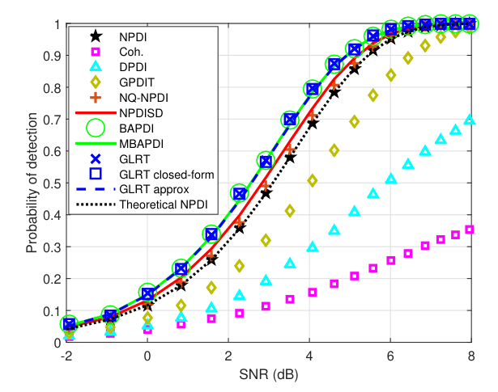
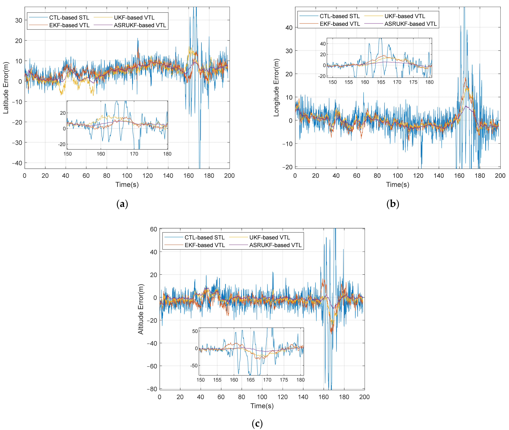

# 2026-07-15 GNSS 每日研究简报

## 今日快报

### 快报 1：GNSS-FM: A Self-Supervised Foundation Model for Daily GNSS Displacement Time Series

- 主题：`gnss-geodesy-ai`
- 来源 ID：`arxiv:2606.07725`
- 来源链接：https://arxiv.org/abs/2606.07725
- 发表日期：2026-06-05
- 来源类型：预印本
- 获取范围：开放预印本

**内容：** GNSS-FM 将全球 1.7 万余个测站的日位移与类似速度的增量组成双流输入，用掩码潜变量预测和矢量量化目标开展自监督预训练，再迁移到 90 天位移预测与地震阶跃定位。

**结论：** 预训练表征能够区分地震阶跃、构造漂移和季节项，并在两个下游任务上超过面向单任务训练的强基线，说明大量无标签测站数据可以先学“地球运动语法”，再用少量标签适配具体任务。

**关注理由：** 这类时序基础模型可迁移到测站异常检测、对流层/多路径异常识别和接收机健康监控，但跨区域泛化和极端事件样本不均衡仍需独立验证。

### 快报 2：Foresight: Iterative Reasoning About Clues that Matter for Navigation

- 主题：`ai-robot-navigation`
- 来源 ID：`arxiv:2606.12550`
- 来源链接：https://arxiv.org/abs/2606.12550
- 发表日期：2026-06-10
- 来源类型：预印本
- 获取范围：开放预印本

**内容：** Foresight 让视觉语言模型在执行前交替提出图像空间运动方案并批判方案，利用人类反馈训练奖励模型，使规划能够逐轮发现与语言目标有关、且依赖当前路线的环境线索。

**结论：** 在离线评测和 6 个真实环境中，任务成功率相对现有测试时推理基线平均提高 37%，每次任务的人工干预减少 52%，并可在 Jetson AGX Orin 上实时运行。

**关注理由：** 它不是 GNSS 算法，却展示了“定位不确定性—语义线索—路径决策”闭环；未来可把 GNSS 完整性、遮挡和多路径风险作为批判器输入，而非只向规划器提供单个坐标。

### 快报 3：Learning-Based Navigation for Indoor Mobile Robots

- 主题：`indoor-navigation`
- 来源 ID：`arxiv:2605.30468`
- 来源链接：https://arxiv.org/abs/2605.30468
- 发表日期：2026-05-28
- 来源类型：预印本
- 获取范围：开放预印本

**内容：** 该框架用代价感知 A* 轨迹监督训练全局规划器，并把局部 DWA 写成离散动作候选选择：先行为克隆，再用带可行性掩码的 PPO 细化。

**结论：** 仿真和真实室内实验均表明，全局路线保持可行，局部控制可在障碍环境中稳定完成目标导航；主要贡献是把经典几何约束保留在动作空间中，而不是完全交给端到端网络学习。

**关注理由：** 对 GNSS 拒止区的低成本平台，这种经典候选集加学习排序的方法比纯端到端控制更容易验证，也适合与室外 GNSS 航迹在建筑入口处做状态切换。

### 快报 4：GenAI for Energy-Efficient and Interference-Aware Compressed Sensing of GNSS Signals on a Google Edge TPU

- 主题：`gnss-interference-edge-ai`
- 来源 ID：`arxiv:2605.14839`
- 来源链接：https://arxiv.org/abs/2605.14839
- 发表日期：2026-05-14
- 来源类型：预印本
- 获取范围：开放预印本

**内容：** 作者将变分自编码器部署到 Google Edge TPU，用 8 位量化在接收机侧压缩原始 IQ、FFT 或人工特征，同时保留对约 72 类干扰的分类信息。

**结论：** 报告的压缩率超过 42 倍；重构信号上的分类 F2 为 0.915，接近原始信号的 0.923，说明边缘端可以先压缩再分析，而不必持续上传高吞吐 IQ 数据。

**关注理由：** 方案直接对应低功耗监测节点和众包干扰地图，但分类器是否能跨射频前端、量化尺度和未知干扰类型泛化，是落地前必须补做的域外测试。

### 快报 5：Bridging the Indoor-Outdoor Gap: Cross-Technology Ranging for Seamless Robot Navigation

- 主题：`gnss-uwb-wifi-ble`
- 来源 ID：`arxiv:2604.25541`
- 来源链接：https://arxiv.org/abs/2604.25541
- 发表日期：2026-04-28
- 来源类型：预印本
- 获取范围：开放预印本

**内容：** HYMN 数据集把 GNSS、UWB、Wi-Fi FTM 和 BLE 原始测量与毫米级真值同步，按区域分析测量可用率和测距残差，重点观察室内外过渡带。

**结论：** 卫星与地面无线测距总体互补，但建筑边界恰好可能出现两类技术同时退化；这意味着简单按“室外用 GNSS、室内用 UWB”硬切换会在入口处留下风险空窗。

**关注理由：** 公开同步原始量和真值比仅给最终轨迹更有价值，可用于研究残差驱动的自适应权重、完整性监控和低成本多无线融合。

## 深度研读

### 深读 1｜信号捕获｜Optimal Post-Detection Integration Technique for the Reacquisition of Weak GNSS Signals

- 类别：`acquisition`
- 来源 ID：`arxiv:1810.04085`
- 来源链接：https://arxiv.org/abs/1810.04085
- 发表日期：2018-10-09
- 来源类型：论文预印本
- 获取范围：开放预印本全文
- 价值评分：91/100（相关性 24，证据 24，深度 19，工程价值 17，新颖性 7）

#### 一句话逻辑

作者把弱 GNSS 重捕获中的未知数据位和未知载波相位视为干扰参数，用贝叶斯检测与 GLRT 推导更有效的后检测积累，再用高 SNR 近似把严格最优检测器压缩成无需 SNR 先验、无需组合枚举的闭式统计量。

#### 研究问题与约束

重捕获与冷启动捕获不同：接收机通常保留了上次码相位和多普勒估计，因此搜索窗口较小，主要困难变成弱信号、未知导航数据位以及未知载波相位。传统 NPDI 对每段复相关量取模平方后累加，稳健但丢弃了各段之间仍然存在的相位结构；纯相干累加又会被数据位翻转抵消。论文要解决的是：能否在保留这种结构的同时，让复杂度仍适合实时接收机。

模型把每个相干段输出写成受数据位符号调制的复信号加高斯噪声，并假定分析窗口内载波相位近似恒定、残余频率误差足够小。这些条件来自“已有先验的重捕获”，因此结论不能直接外推到全多普勒、全码相位的冷启动搜索。

#### 核心方法论

作者沿两条路线处理未知量：贝叶斯检测器对随机相位、数据位或幅度进行边缘化，GLRT 则以最大似然估计替代未知参数。严格形式会引入比特组合求和、贝塞尔函数或相位一维搜索。为降低复杂度，论文先从同相/正交相关量估计公共相位：

$$
\hat\phi=\frac{1}{2}\mathrm{atan2}\left(2\sum_k I_kQ_k,\sum_k I_k^2-\sum_k Q_k^2\right).
$$

其中 $I_k,Q_k$ 是第 $k$ 段相干积分输出，$\hat\phi$ 是数据位符号翻转不敏感的载波相位估计。在相关器输出 SNR 较高的区域，再用 $\ln\cosh(x)\approx |x|-\ln 2$ 化简似然，得到

$$
L=\sum_k\left|I_k\cos\hat\phi+Q_k\sin\hat\phi\right|.
$$

工程意义很直观：先把每段复向量投影到估计的信号轴，再取绝对值消除未知数据位正负号，最后累加形成检测统计量。

#### 创新点

1. 论文没有只提出一个经验积累器，而是在统一检测理论中给出 BAPDI、MBAPDI、严格 GLRT、闭式 GLRT 与高 SNR GLRT 近似，使“理论上最优”和“实现上可用”可以在同一框架比较。
2. 它利用了重捕获阶段的残余多普勒先验，把问题从大范围二维搜索转化为对少量候选的更优统计判决。
3. 高 SNR 近似不需要事先知道输出 SNR，并避免按数据位组合指数增长，给出了明确的性能—复杂度折中，而不是只报告检测概率提升。

#### 整体逻辑链

重捕获先验缩小搜索空间 → 多段短相干积分避免数据位边界造成长相干抵消 → 把数据位、相位和幅度写入似然模型 → 用积分或极大化消除干扰参数 → 推导严格检测器作为性能上界 → 再用闭式相位估计和 $\ln\cosh$ 近似降低运算量 → 以相同虚警率下的 ROC 与检测概率曲线比较传统 PDI → 最终选择性能接近严格方案但无需 SNR 先验的近似 GLRT 作为工程候选。

#### 原文图表与结果分析

> 图源：原文 Figure 6，[arXiv:1810.04085](https://arxiv.org/abs/1810.04085)，截取用于研究引用与结果评论；原文未在该页面声明可再许可的图像协议。

图中横轴是相关器输出 SNR，纵轴是在固定虚警概率 $P_{fa}=10^{-3}$、非相干段数 $N_{nc}=5$ 且存在数据位翻转时的检测概率。几条 BAPDI/MBAPDI/GLRT 曲线几乎重合，说明严格推导之间的理论差距在该实验设置下很小；真正拉开差距的是是否正确利用公共相位并处理比特符号。

按图读数，在 SNR 约 4 dB 时，新检测器的检测概率约 0.7，GPDIT 约 0.5，DPDI 约 0.3，传统相干积累约 0.15；到约 6 dB 时，新检测器接近 0.97，GPDIT 约 0.84，DPDI 约 0.5。提升集中发生在 2–6 dB 的门限过渡区，而不是极低 SNR 或已饱和的高 SNR 区。这正是重捕获最有价值的工作区间。不过这些数值是读图近似，不是论文提供的原始数据表，不能据此声称精确到百分位。

#### 原文结果论述

作者报告五种新检测器在多组 Monte Carlo ROC 中总体优于 NPDI、DPDI、GPDIT、NPDISD 与 NQ-NPDI，并指出严格 BAPDI/GLRT 的性能优势与复杂度代价并存；高 SNR GLRT 近似的核心吸引力是无需输出 SNR 先验且运算最轻。Figure 6 支持“在固定虚警率下更早进入高检测概率区”这一结论。

本次分析进一步认为，曲线重合意味着产品选择不应只按理论最优排序，而应优先比较相位估计、定点化和门限标定的代价。这个工程判断是基于图形与公式的推断，不是作者直接给出的硬件实测结论。

#### 局限与适用边界

实验主要是理想 AWGN Monte Carlo，窗口内相位恒定，未同时加入残余频偏、振荡器相噪、多路径、脉冲干扰、量化与高动态。闭式相位估计在真正低输出 SNR 时也会失稳，而所谓“高 SNR 近似”是在相关器输出域成立，不应与射频输入 C/N0 简单等同。它适合有较强先验的失锁恢复或辅助重捕获，不能替代冷启动二维搜索策略。

#### 工程复现建议

先严格复现 Figure 6：固定 $P_{fa}=10^{-3}$、$N_{nc}=5$、随机数据位和 AWGN，通过噪声样本分位数独立标定每种统计量门限，避免门限不公平。随后依次加入残余频偏、线性相位漂移、相干段跨数据位边界、1–4 bit 定点量化与非高斯干扰，报告 $P_d/P_{fa}$、每候选乘加次数、查表/反三角开销和重捕获延迟。若用于 StarTrack，还应将传统 NPDI 与闭式 GLRT 放在同一 IQ 回放和同一候选窗中做 A/B 测试。

#### 低成本与手机适用性

统计量只需要平方、乘加、一次 `atan2`、投影和绝对值累加，可用 CORDIC 或查表在定点 DSP/FPGA 上实现。对低成本晶振，残余频偏更可能破坏公共相位假设，因此需要缩短窗口或增加相位漂移模型。Android 应用层通常拿不到相关器复输出，无法直接复现；该方法更适合可编程基带、SDR 或芯片厂商的重捕获协处理器。

#### 结论

这篇论文的核心不是“换一个累加公式”，而是先用检测理论识别传统 PDI 丢失的信息，再把严格最优解系统地化简为可实现统计量。Figure 6 表明收益主要落在决定能否快速重捕获的中等输出 SNR 区，但真实接收机采用前必须重新验证相位漂移、量化和非高斯误差下的门限稳定性。

### 深读 2｜信号跟踪｜Performance Enhancement and Evaluation of a Vector Tracking Receiver Using Adaptive Tracking Loops

- 类别：`tracking`
- 来源 ID：`doi:10.3390/rs16111836`
- 来源链接：https://www.mdpi.com/2072-4292/16/11/1836
- 发表日期：2024-05-22
- 来源类型：开放获取论文
- 获取范围：全文
- 价值评分：90/100（相关性 24，证据 24，深度 18，工程价值 17，新颖性 7）

#### 一句话逻辑

作者用矢量跟踪把所有卫星通道耦合到公共导航状态，再用自适应平方根无迹 Kalman 滤波器依据 C/N0 与反馈多普勒误差动态调节测量噪声和过程噪声，从而缓解固定带宽标量环在高动态与短时遮挡下“抗噪声”和“跟动态”不可兼得的问题。

#### 研究问题与约束

传统 STL 的 DLL/PLL/FLL 各通道独立，环路带宽固定：带宽窄能抑制热噪声，却跟不上车辆动态；带宽宽能跟动态，却放大弱信号噪声。单星遮挡后，该通道也无法利用其他强星与接收机公共位置、速度、时钟状态。VTL 可以跨通道共享信息，但普通 EKF 受非线性近似影响，UKF 的协方差更新在有限精度下可能失去正定性，固定 $Q/R$ 又不能适应信号环境变化。

实验使用相同的 0.5 chip 相关器间隔、1 Hz DLL、10 Hz PLL、1 ms 相干积分和 100 ms 导航更新，并以 Trimble RTK 轨迹为 PVT 参考。比较成立于这组环路参数和一次车辆路线，不能自动推广到所有动态与遮挡类型。

#### 核心方法论

接收机把相关器 $I/Q$ 直接作为非线性测量，使用

$$
x_k=f(x_{k-1})+w_k,\qquad z_k=h(x_k)+v_k
$$

描述接收机公共运动/时钟状态与各通道相关器输出，其中 $Q_k=\mathrm{cov}(w_k)$、$R_k=\mathrm{cov}(v_k)$。UKF 用 sigma 点传播非线性分布，SRUKF 则直接更新协方差的平方根，减少数值舍入造成的非正定风险。

ASRUKF 在此基础上做两类自适应：根据各通道 C/N0 调整测量噪声 $R_k$，让弱信号测量降低权重；根据预测与反馈多普勒误差调整过程噪声 $Q_k$，在动态增强时允许状态更快变化。滤波器预测的码率和多普勒再反馈到全部通道，本质上让强星通过公共状态帮助短时受遮挡的弱星维持跟踪。

#### 创新点

1. 将平方根 UKF 的数值稳定性、自适应 $Q/R$ 与矢量跟踪通道耦合放进同一接收机，而不是只替换导航滤波器。
2. 自适应信息来自接收机可实时获得的 C/N0 与反馈多普勒误差，分别对应测量可信度和动态模型失配，逻辑上比单一残差膨胀更可解释。
3. 评估不仅给 PVT，还覆盖相关峰、速度和 150–180 s 遮挡段，使“环路改进如何传递到最终定位”有较完整证据链。

#### 整体逻辑链

固定带宽 STL 无法同时适应噪声与动态 → VTL 用公共状态建立跨星约束 → 非线性 I/Q 测量促使使用 UKF → 平方根形式保证协方差数值稳定 → C/N0 调 $R$、多普勒反馈误差调 $Q$ → 状态预测反哺各通道 NCO → 在同一路线中比较 STL、EKF-VTL、UKF-VTL 和 ASRUKF-VTL → 用遮挡期间曲线及全程 RMSE 检验从通道稳定到 PVT 的收益。

#### 原文图表与结果分析

> 图源：原文 Figure 10，[Remote Sensing 16(11), 1836](https://www.mdpi.com/2072-4292/16/11/1836)，文章采用 [CC BY 4.0](https://creativecommons.org/licenses/by/4.0/)；图片保持原始数据与图例，仅用于本次分析展示。

三幅子图纵轴分别是纬度、经度和高程绝对误差，横轴是实验时间；约 150–180 s 为遮挡区。蓝色 CTL-STL 在遮挡前后出现最密集、幅度最大的尖峰，说明独立通道丢失有效相关后，误差直接传入 PVT。三种 VTL 的曲线整体更紧，紫色 ASRUKF-VTL 尤其在经度与高程上保持最低包络；这与自适应滤波对弱测量降权、对动态模型增噪的设计方向一致。

需要注意，紫色曲线并非全过程都严格低于其他方法，纬度方向的差距也明显小于高程。图中还存在所有方法共同缓慢变化的误差成分，提示卫星几何、参考误差或共享模型偏差不会因更换滤波器完全消失。因此 Figure 10 支持“遮挡鲁棒性和部分方向 RMSE 改善”，不支持“消除所有系统误差”。

原文 Table 3 的关键 RMSE（m）如下，数值仅重排与本图对应的三列：

| 方法 | 纬度 | 经度 | 高程 |
|---|---:|---:|---:|
| CTL-STL | 8.54 | 8.72 | 17.16 |
| EKF-VTL | 5.94 | 4.07 | 6.57 |
| UKF-VTL | 5.84 | 3.46 | 4.81 |
| ASRUKF-VTL | 5.48 | 2.34 | 2.69 |

#### 原文结果论述

作者报告 ASRUKF-VTL 的纬度、经度和高程 RMSE 为 5.48、2.34、2.69 m；相对 UKF-VTL 的 5.84、3.46、4.81 m，分别下降 6.16%、32.37% 和 44.07%。东、北速度 RMSE 为 0.13、0.20 m/s，相对 UKF-VTL 的 0.14、0.22 m/s 也有较小改善。绝对值说明最大收益集中在高程与经度，而纬度增益有限，不能只用“平均更优”掩盖方向差异。

本次图形分析认为，VTL 带来的大部分跨越发生在 STL 到 EKF-VTL，ASRUKF 是在已有矢量耦合收益上继续优化。这意味着工程评估应做“是否矢量化”和“是否自适应平方根滤波”两个独立消融，而不能把全部收益归因于最终算法名称。

#### 局限与适用边界

原始 IQ、路线与遮挡装置未形成公开可复现实验包，天线、前端和城市环境的代表性有限。VTL 的公共反馈既能互助，也可能把错误星历、强多路径、欺骗或异常通道传播给所有卫星；论文主要报告精度，没有完整给出创新门控、故障隔离和完整性风险。UKF/ASRUKF 的 CPU、内存和能耗也未与嵌入式预算系统对照。

#### 工程复现建议

把系统拆成两组开关：STL/VTL 控制是否跨通道反馈，固定/自适应滤波控制 $Q/R$ 策略，形成四象限消融。固定同一 IQ 回放、积分时间、NCO 更新率和初值，注入单星衰减、多星同时遮挡、高动态、时钟跳变、错误多普勒与强多路径，输出每通道创新、C/N0、失锁时间、重捕获时间、PVT 50/95 百分位、协方差一致性和 CPU 占用。还必须设置通道创新门控与隔离，验证一颗异常星不会拖偏全部通道。

#### 低成本与手机适用性

低成本晶振和小天线使跨星时钟估计与短时互助更有价值，也让模型失配更频繁。平方根实现适合单精度嵌入式环境，但 sigma 点数量和矩阵分解仍比 EKF 昂贵，可降低公共导航状态更新率、保留通道高速 NCO。Android 应用层只开放伪距/载波观测而不开放相关器 I/Q 时，无法实现论文级 VTL；这更适合芯片基带、SDR 或有原始相关器接口的接收机。

#### 结论

论文用“跨星公共状态 + 非线性滤波 + 自适应噪声”逐层解决独立固定带宽环的弱信号和动态矛盾。Figure 10 与 Table 3 表明 ASRUKF-VTL 在该车辆遮挡实验中尤其改善高程和经度，但产品化价值取决于异常通道隔离、协方差一致性与实际算力，而不能只看一次路线的 RMSE。
