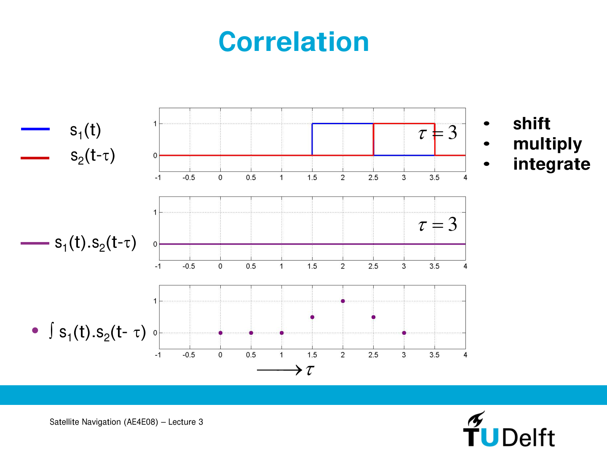
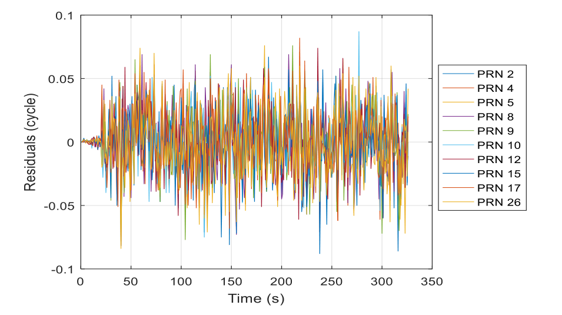
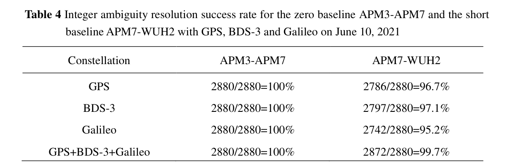

# 2026-07-16 GNSS 每日研究简报

## 今日快报

### 快报 1：单频 GNSS 借助相对运动观测实现分米级定位

- 主题：`low-cost-carrier-phase-fusion`
- 来源 ID：`arxiv:2606.29192`
- 来源链接：https://arxiv.org/abs/2606.29192
- 发表日期：2026-06-28
- 来源类型：预印本
- 获取范围：开放全文，8 页、7 图

**内容：** 作者把廉价单频接收机的连续载波相位与轮速计、相机或激光雷达给出的相对运动放进滑动窗口因子图。每颗卫星初次出现时建立“虚拟锚点”，后续历元相对该锚点形成载波相位约束，并配套周跳检测与恢复，不再依赖实体基准站。

**结论：** 论文报告多组低成本传感器实测中，单频 GNSS 从数米改善到分米级。这个结果不是厘米级 RTK 的等价替代：它依赖连续相位、相对运动传感器质量和锚点初始化，遮挡造成的长时失锁仍会削弱全局约束。

**关注理由：** 它把“廉价硬件缺少多频冗余”改写为“用时间连续性和异构相对运动补约束”，对机器人接收机的观测接口、周跳标志和因子图数据结构都有直接参考价值。

### 快报 2：利用恒包络调制互调分量认证民用 GNSS

- 主题：`gnss-signal-authentication`
- 来源 ID：`doi:10.3390/s26134047`
- 来源链接：https://doi.org/10.3390/s26134047
- 发表日期：2026-06-25
- 来源类型：开放获取期刊论文
- 获取范围：开放全文；版本记录显示 2026-07-03 更新了 HTML/PDF

**内容：** 论文利用恒包络复合信号中授权扩频码乘积形成的不可预测互调分量，为普通民用分量增加认证相关器。接收机先跟踪公开分量、擦除载波与动态，再用服务器提供或延迟估计的互调码做匹配滤波，并按噪声估计设置恒虚警门限。

**结论：** 方案在不修改现役民用信号体制的前提下，把认证化为“不可预测分量是否存在”的二元检测；但它仍需要数据链提供码材料，实时性、安全边界和缓冲长度随码生成方式变化，不能把相关峰本身当作端到端安全证明。

**关注理由：** 这是接收机相关器、检测理论与信号认证的直接交点，适合进一步核查互调分量功率、相干积累时间、门限校准和服务器延迟对认证可用率的共同影响。

### 快报 3：LEO 与 MEO 混合多普勒定位的降维解法

- 主题：`leo-gnss-doppler-positioning`
- 来源 ID：`doi:10.1038/s41598-026-56661-9`
- 来源链接：https://doi.org/10.1038/s41598-026-56661-9
- 发表日期：2026-06-24
- 来源类型：开放获取期刊论文
- 获取范围：开放全文的未编辑早期版本，页面明确提示后续仍会编辑

**内容：** 作者提出降参数的多普勒定位算法，并与传统线性化最小二乘比较；硬件在环仿真同时使用 MEO GNSS 与运动更快的 LEO 卫星，考察卫星速度差异如何改变多普勒几何与 DOP。

**结论：** 论文报告加入 LEO 后几何与精度均改善，误差降到约十米量级。这个数量级来自仿真和硬件在环条件，且当前页面是未编辑稿，不能直接外推到真实星历误差、振荡器漂移和复杂遮挡下的产品性能。

**关注理由：** 它提醒接收机设计者：多普勒定位不仅取决于频率测量噪声，还取决于卫星径向速度带来的几何可观性；LEO 的价值应通过设计矩阵与误差预算解释，而不是只按卫星数量判断。

### 快报 4：桥下 RTK 改正中断与 INS 连续性的实测基准

- 主题：`rtk-ins-continuity`
- 来源 ID：`arxiv:2606.06358`
- 来源链接：https://arxiv.org/abs/2606.06358
- 发表日期：2026-06-04
- 来源类型：会议录用预印本
- 获取范围：开放全文与公开实验数据，8 页、6 图

**内容：** 研究在内河无人艇传感器箱上比较独立 GNSS、GNSS/INS、RTK GNSS 与 RTK GNSS/INS，并结合桥下通过、静态基准和闭环路径跟踪，观察卫星遮挡与改正链路中断后的不确定度和恢复瞬态。

**结论：** 作者报告桥下改正中断会降低精度、抬高不确定度，并在恢复时产生超过 1 m 的状态跳变；INS 能维持短时连续，却可能引入漂移、偏差和不确定度突变，因此“有 INS”不等于输出在统计上连续一致。

**关注理由：** 公开数据适合复现改正龄期、固定解状态、创新序列和状态跳变的联合门控，也能检验上层控制器是否错误相信接收机自报协方差。

### 快报 5：不依赖 GNSS 预补偿的 6G 非地面网络同步

- 主题：`ntn-gnss-resilience`
- 来源 ID：`doi:10.1038/s44459-026-00032-3`
- 来源链接：https://doi.org/10.1038/s44459-026-00032-3
- 发表日期：2026-06-03
- 来源类型：开放获取期刊论文
- 获取范围：开放全文，含仿真、信道模拟器和在轨链路试验

**内容：** 方案把下行开环校正与上下行闭环时频跟踪结合，让终端无需 GNSS 位置和星历预补偿即可处理卫星运动引起的时延与多普勒。作者在 OpenAirInterface 上实现原型，并用 LEO/GEO 信道仿真和 MEO 透明转发链路测试。

**结论：** 高阶闭环在作者设定下可把稳态时频误差压近零，并允许把误差信令周期从 10 ms 放宽到 1 s；代价是初始捕获需覆盖更宽的频率与时延不确定度，检测计算量、随机接入干扰和环路稳定性成为新的系统约束。

**关注理由：** 这项工作从通信系统侧展示了“GNSS 拒止时如何继续同步”，可反向启发 GNSS 接收机的宽域捕获、时钟建模和失锁后分层重捕获设计。

## 深度研读

### 深读 1｜接收机相关基础｜从移位、相乘、积分到三角相关峰

- 类别：`receiver-engineering`
- 学习层级：`foundation`
- 选题定位：`经典基础`
- 来源 ID：`tudelft-ocw:ae4e08-lecture-3`
- 来源链接：https://ocw.tudelft.nl/course-lectures/satellite-navigation-gnss-receivers/
- 发表日期：2011
- 来源类型：TU Delft OpenCourseWare 官方课程资料
- 获取范围：完整讲义，课程页面声明 CC BY-NC-SA 4.0
- 价值评分：92/100（相关性 19，经典价值 25，证据 18，教学价值 19，工程价值 11）

#### 为什么先学这个

捕获、DLL、多路径抑制和伪距生成看起来是四个主题，底层却都从同一个动作开始：把接收信号与本地副本相对移动，逐点相乘，再在有限时间内求和。若不先看懂“重叠面积为什么随延迟形成峰”，后面很容易把 FFT、Early/Prompt/Late 或鉴别器公式当作黑盒。TU Delft 的讲义用两个宽度固定的矩形脉冲逐步演示这个过程，信息量不大，却正好把符号、单位和几何直觉对齐，所以适合作为今日学习阶梯的第一层。

#### 先修知识

只需知道三件事。第一，离散接收机把连续信号按采样周期 $`T_s`$ 变成样本；时间差 $`\tau`$ 可以用秒、样点或 chip 表示，换算时必须说明口径。第二，相乘检验两个序列在同一时刻是否同号或同形；积分或求和把整个观察窗内的局部匹配累积起来。第三，GPS L1 C/A 的码速率为 1.023 Mchip/s，因此 1 chip 约为 977.5 ns，对应真空传播距离约 293 m；相关器分辨的是码延迟，最终伪距还包含接收机钟差、传播延迟与整毫秒模糊。

#### 一句话逻辑

对每个候选延迟移动本地副本，重叠越多，乘积积分越大；矩形码片的重叠长度随延迟线性增减，于是理想自相关主峰呈三角形，峰顶给出对齐位置。

#### 研究问题与约束

设讲义中的两个单位幅度矩形脉冲分别为 $`s_1(t)`$ 与 $`s_2(t-\tau)`$，宽度均为 $`T_c`$ 秒。我们要回答的是：不同 $`\tau`$ 下，怎样用一个标量描述二者的相似度？约束是先讨论无噪声、幅度相同、矩形脉冲、无限前端带宽和完整积分窗；真实 GNSS 还会叠加载波、多普勒、导航数据位、滤波器、量化与噪声，这些因素不能从玩具图中消失，只是暂时冻结以突出延迟几何。

#### 核心方法论

连续时间互相关定义为

```math
R_{12}(\tau)=\int_{-\infty}^{+\infty}s_1(t)s_2(t-\tau)dt.
```

离散接收机在 $`N`$ 个样点上实现

```math
R_{12}[k]=\sum_{n=0}^{N-1}s_1[n]s_2[n-k].
```

$`k`$ 的单位是样点，物理延迟为 $`\tau_k=kT_s`$ 秒。若两脉冲幅度均为 1，乘积只在重叠区等于 1，因此积分值就是重叠时间；若除以 $`T_c`$，峰值归一化为 1。GNSS 码相关把单个矩形扩展为许多正负码片，本地 PRN 正确时同号项累加，错误码或错误延迟时正负项大体抵消。

#### 关键公式逐步推导

先把脉冲宽度归一为 1。两脉冲中心相差 $`e`$ 个脉冲宽度时，重叠长度为 $`1-|e|`$，但只在 $`|e|\leq1`$ 时非负，所以理想归一化相关为

```math
R(e)=
\begin{cases}
1-|e|,& |e|\leq1\\
0,& |e|>1.
\end{cases}
```

量纲检查很重要：归一化 $`R`$ 无量纲，未归一化积分的单位是“幅度平方乘秒”。若 $`e=\Delta\tau/T_c`$，则横轴从归一化延迟换回秒；再乘光速 $`c`$ 才得到米。对长度为 $`N_c`$ 的理想双极性 PRN，周期相关可写成

```math
R_c[k]=\frac{1}{N_c}\sum_{n=0}^{N_c-1}c[n]c[(n-k)modN_c].
```

接收机不会只计算一个点。设当前 Prompt 延迟为 $`\widehat{\tau}`$，Early–Late 总间隔为 $`d`$ chip，跟踪误差定义为 $`e=(\tau_{rx}-\widehat{\tau})/T_c`$。理想三角峰在线性区内给出 Early 与 Late 幅度，若选择符号使正误差要求本地码向后移动，可构造

```math
D(e)=\frac{L-E}{L+E}\approx\frac{2e}{2-d},
\qquad |e|<\frac{d}{2}.
```

$`d`$ 太大时采样点靠近主峰外侧，线性区和多路径响应变差；$`d`$ 太小时 $`L-E`$ 在噪声与量化下难以分辨。该式只在 BPSK 类单峰、码已接近锁定且相关器未饱和时成立，BOC 多峰不能照搬。

#### 经典价值与创新边界

“移位—相乘—积分”没有新颖性，价值恰恰在于它是匹配滤波、FFT 相关和 DLL 的共同基线。FFT 只把许多延迟的循环相关并行计算，并没有改变统计量；窄相关器、多相关器和 MEDLL 则是在相关峰周围采更多点或拟合多径。今天仍应学它，因为任何加速或学习算法都必须回答是否保持了峰位置、峰形和噪声统计。它不适合直接描述 BOC 副峰、严重带限、非相干积累或强多径，需要升级模型。

#### 整体逻辑链

已知码提供可复制结构 → 相对移动本地码枚举未知传播延迟 → 相乘把同号匹配变成正贡献 → 积分提高处理增益 → 延迟误差改变重叠量 → 相关峰给出粗延迟 → 峰两侧样点形成 DLL 误差信号 → NCO 调整本地码速率与相位 → 通道时间标记再进入伪距。若载波残差在积分内快速旋转，即使码延迟正确，正负相位也会抵消，所以实际相关前还要擦除多普勒。

#### 原文图表与结果分析



> 图源：TU Delft OpenCourseWare《Satellite Navigation — Lecture 3: GNSS Receivers》讲义第 19 页（PDF 页码），[课程与原讲义入口](https://ocw.tudelft.nl/course-lectures/satellite-navigation-gnss-receivers/)，课程页面声明 CC BY-NC-SA 4.0；本地文件仅把原 PDF 页无损渲染为 PNG，未改动坐标、曲线、文字或数据。

上图横轴是归一化位移 $`\tau`$，范围约为 -1 到 4，但讲义没有把它声明为秒或 chip，所以不能擅自补单位。顶部蓝、红矩形幅度为 0 或 1；在 $`\tau=3`$ 时二者仅在边界接触，乘积面积为 0。底部累计的离散相关样点在 $`\tau=1,1.5,2,2.5,3`$ 处约为 $`0,0.5,1,0.5,0`$，基线为 0，峰值相对基线增加 1，左右斜率幅值约为每单位延迟 1。拐点在 1、2、3，对应“开始重叠、完全重叠、结束重叠”。

直接读图只能确认理想矩形的三角重叠规律。图中没有噪声、负码片、采样抖动、C/N0、前端带宽或旁瓣，也没有误差条，因此不能用它推断捕获概率、DLL 热噪声、真实 PRN 交叉相关或伪距精度。它的纵轴也未显式标注归一化方式；本文把峰值解释为 1，是依据图中单位幅度与单位宽度，而非作者给出的工程标定。

#### 原文结果论述

讲义用逐页动画展示：当两个脉冲从无重叠移动到完全重叠，再移动到无重叠，乘积积分从 0 线性上升到 1 再线性下降。作者的教学结论是相关由 shift、multiply、integrate 三步组成。本文进一步把它映射到 GNSS：脉冲换成 PRN 码、本地位移换成候选码相位、积分换成相干累加。后半句是本简报的工程推断，不是该单页独立证明的接收机性能结论。

#### 常见误区与适用边界

第一，相关峰的横坐标不是天然的米，必须先从样点换成秒，再乘传播速度。第二，峰值高不等于检测可靠，搜索单元数量会抬高最大噪声峰。第三，图中的三角峰来自矩形脉冲和无限带宽；真实滤波会圆滑峰顶并改变鉴别器斜率。第四，缩小 Early–Late 间隔通常降低远端多径影响，却会加剧采样、量化和噪声分辨难题。第五，导航位翻转或残余多普勒会破坏相干积分。第六，BOC 类相关函数有副峰，单一 Prompt 最大值可能锁到错误峰。

#### 工程实现步骤

①统一采样时间、码 NCO 和通道时间标记；②生成一个本地 PRN 周期，并明确码片到样点的重采样方法；③对接收样本擦除候选载波；④分别用 Early、Prompt、Late 本地码相乘并在 $`T_{coh}`$ 秒内累加 I/Q；⑤用幅度或功率构造归一化鉴别器；⑥在有效线性区把鉴别器输出送入环路滤波器；⑦更新码 NCO；⑧监控 Prompt 功率、E/L 对称性和锁定指标；⑨发生数据缺口、饱和或副峰嫌疑时冻结或重捕获。所有累加器必须留出位宽余量，定点实现还要记录缩放因子。

#### 复现实验设计

先以 10 MHz 采样率生成宽度 1 µs 的单位矩形脉冲，每 0.1 µs 扫描一次延迟，比较数值求和与解析三角函数，峰值误差应只来自采样栅格。然后换成 GPS L1 C/A PRN，采样率 4.092 MHz，加入 45 dB-Hz 与 30 dB-Hz 两档 AWGN，分别比较 1 chip、0.5 chip 和 0.1 chip E–L 间隔的鉴别器均值、标准差和线性区。最后加入 0.3 chip、幅度 0.5 的单径，记录零交叉偏移。每个条件至少 10,000 次蒙特卡洛，输出绝对偏差、相对变化和置信区间。

#### 与定位及低成本实现的联系

码相关误差乘光速后直接进入伪距，所以 0.01 chip 对 L1 C/A 已约为 2.93 m 的码域尺度，必须靠环路平均、载波平滑和多星几何继续压低。低成本接收机受采样率、量化位数、晶振和算力限制，不能无限增加相关器或缩小间隔；但一旦理解重叠面积，就能按误差预算选择采样率、积分时间和多相关器数量，而不是照抄参数。下一篇把同样的“多通道共享信息”思想移到载波跟踪和廉价振荡器。

#### 本节小结

相关不是抽象的相似度按钮，而是可逐样本检查的移位、相乘和积分。理想矩形产生三角峰，峰的位置编码延迟，峰两侧差值编码校正方向。图中的无量纲玩具例子建立直觉，工程实现必须补回多普勒、噪声、带宽、采样和调制结构；只有把这些边界写清，相关输出才可能可靠地变成伪距。

### 深读 2｜低成本接收机进阶｜公共振荡器误差为何值得做矢量载波跟踪

- 类别：`low-cost-mobile`
- 学习层级：`intermediate`
- 选题定位：`经典基础`
- 来源 ID：`fig:9374`
- 来源链接：https://www.fig.net/resources/proceedings/fig_proceedings/fig2018/papers/ts04e/TS04E_gao_9374.pdf
- 发表日期：2018-05
- 来源类型：FIG Congress 2018 全文会议论文
- 获取范围：开放可读全文，9 页
- 价值评分：89/100（相关性 19，经典价值 22，证据 17，教学价值 18，工程价值 13）

#### 为什么先学这个

学完单个相关器后，下一步不是立即堆复杂滤波器，而是问一个窄问题：廉价 TCXO 的相位扰动同时进入所有卫星通道，为什么还要让每个 PLL 独立追它？传统标量环简单、隔离性好，但为了追踪公共晶振扰动常需放宽带宽，热噪声又随带宽增大。矢量结构把公共误差在多通道间合并估计，使每通道更多地处理卫星特有残差。这是从单通道几何走向接收机系统实现的合适中间层。

#### 先修知识

Prompt 相关器输出可写成复数 $`P_i=I_i+jQ_i`$，其相角包含卫星与接收机相对运动、接收机钟漂、传播变化和噪声。PLL 鉴相器在线性区把相位误差转为控制量，环路带宽 $`B_n`$ 的单位是 Hz；增大 $`B_n`$ 可跟踪更快动态，却让更多热噪声进入。1 cycle 等于 $`2\pi`$ rad；GPS L1 波长约 0.190 m，所以 0.05 cycle 约为 9.5 mm 的载波距离尺度，但图中的“残差”不等同于最终定位误差。

#### 一句话逻辑

把所有通道共同经历的接收机钟相位和频率漂移作为共享状态联合估计，再把卫星几何与传播的通道特有项留给各通道窄环，可在相似热噪声下提高廉价振荡器受振时的载波连续性。

#### 研究问题与约束

问题不是“矢量环是否永远优于标量环”，而是当公共振荡器误差占主导时，联合估计能否减少每通道为追踪公共动态而支付的噪声带宽。假设各通道时间戳对齐、至少若干卫星已捕获、导航解或几何预测可用、鉴相器处于小误差区，且公共晶振扰动确实在通道间高度相关。若多路径、遮挡或周跳是主导，错误通道可能通过共享状态污染其他通道，必须用创新检验和鲁棒权重隔离。

#### 核心方法论

把第 $`i`$ 颗卫星的相位残差分成

```math
z_i[k]=g_i^T[k]\delta x[k]+\delta b[k]+\delta_i[k]+v_i[k].
```

$`z_i`$ 可用 cycle 或 rad，但全系统必须统一；$`g_i`$ 是视线几何对接收机位置/速度误差的投影，$`\delta x`$ 是公共导航状态误差，$`\delta b`$ 是接收机公共钟相位，$`\delta_i`$ 是电离层、对流层、多路径和卫星钟残差等通道特有项，$`v_i`$ 是热噪声。标量 PLL 分别把全部误差吞进自己的 NCO；矢量结构用加权最小二乘或 EKF 从多颗卫星联合估计 $`\delta x,\delta b`$，再把预测反馈到各载波 NCO。

#### 关键公式逐步推导

把 $`m`$ 个通道堆叠成

```math
z[k]=H[k]x[k]+v[k],
\qquad E[vv^T]=R[k].
```

若只做单历元线性估计，

```math
\widehat{x}=(H^TR^{-1}H)^{-1}H^TR^{-1}z.
```

矩阵列至少包含钟相位，若还估位置或速度，卫星几何必须使 $`H`$ 满列秩。弱信号通道的方差较大，应在 $`R`$ 中给较小权重；直接等权会让低 C/N0 或多路径通道支配共享状态。动态滤波再加入

```math
x[k+1]=Fx[k]+w[k],
\qquad E[ww^T]=Q.
```

$`F`$ 可用钟相位—钟频率—钟漂移模型，$`Q`$ 由 TCXO Allan 偏差或振动实验标定。若钟相位用 cycle，钟频率状态单位为 cycle/s；反馈到 NCO 时乘 $`2\pi`$ 才变为 rad/s。小误差下 PLL 热噪声方差随 $`B_n/(C/N_0)`$ 增大，故把可预测的公共动态交给矢量状态后，可以收窄通道环；但 $`B_n`$ 太窄会跟不上未建模的卫星特有动态。

为防故障传播，创新

```math
\nu_i=z_i-h_i^T\widehat{x}^{-}
```

应以 $`S_i=h_i^TP^{-}h_i+R_i`$ 归一化。若 $`|\nu_i|/\sqrt{S_i}`$ 连续超门限，先降权或剔除该通道，而不是让公共钟状态追随一个周跳。

#### 经典价值与创新边界

共享钟状态、加权融合和窄带通道环是经典矢量跟踪思想。论文的工程价值在于把它放到廉价 TCXO、振动和载波连续性的矛盾中说明，而非宣称一种普适新架构。今天仍值得学，因为手机、无人机和软件接收机都共享同一前端时钟；即使最终采用深耦合 GNSS/INS，公共与通道特有误差的分解仍必须正确。它不适用于卫星数太少、几何退化、导航状态严重错误或多通道同时受欺骗的情形。

#### 整体逻辑链

低成本振荡器受温度与振动产生相位噪声 → 同一采样时钟把扰动注入所有通道 → 标量 PLL 为跟随它而增大带宽 → 热噪声与弱信号抖动上升 → 多通道联合估计公共钟和运动状态 → 各 NCO 先减去公共预测 → 窄环只处理通道特有残差 → 载波周跳概率下降 → 连续相位支持 RTK/PPP。链条成立的前提是共享误差可观、坏通道受控、反馈延迟足够小。

#### 原文图表与结果分析



> 图源：Yang Gao《Precise GNSS Positioning for Mass-market Applications》Figure 1，[FIG Congress 2018 原文](https://www.fig.net/resources/proceedings/fig_proceedings/fig2018/papers/ts04e/TS04E_gao_9374.pdf)；原文未声明开放再许可，本地仅裁取研究评论所必需的原图区域，保留坐标、单位、曲线与图例，不作数据修改，版权归原作者/出版方。

横轴为 0–350 s，纵轴为 residuals，单位 cycle，范围 -0.1 到 0.1；图例列出 10 颗 PRN。约前 20 s 残差贴近 0，随后多数样本处于约 ±0.05 cycle 内，少量尖峰接近 ±0.08 至 ±0.09 cycle。以 L1 波长 0.190 m 粗略换算，0.05 cycle 约 9.5 mm，但这是载波相位残差尺度，不是三维位置误差。曲线围绕零基线、未见整 1 cycle 的阶跃，和作者“未出现周跳”的陈述一致。

图中没有标出 C/N0、振动谱、TCXO 型号、环路带宽、积分时间或标量 PLL 对照曲线。因而它不能独立证明“矢量架构比标量架构降低多少误差”，也不能区分尖峰来自热噪声、振动还是多路径。前 20 s 方差突然变化可能是启动、静止段或绘图处理，但原图未解释，不能把它当作收敛时间。本文只使用“残差数量级与无整周跳”两项直接可见事实。

#### 原文结果论述

作者指出低成本 TCXO 会限制积分时间并增加 PLL 相位噪声，振动若处理不当会诱发周跳；公共振荡器和运动误差可在各通道相关器之前估计，从而允许减小通道环带宽。Figure 1 的作者结论是矢量架构的各卫星单差载波相位没有周跳，并声称标量架构会在多星出现周跳。后一个比较没有在该图给出对照数据，本文将其保留为作者陈述，而不当作直接读图结论。

#### 常见误区与适用边界

第一，共同钟误差不代表所有误差都共同：多路径、电离层残差和卫星特有故障必须留在通道层。第二，矢量环不是把所有 PLL 删除，工程上常保留通道鉴相与局部滤波。第三，窄带宽降低热噪声，却增加模型误差和反馈延迟风险。第四，错误导航解可能同时拉偏全部通道，故需独立锁定监测。第五，cycle、rad、Hz 和 NCO 相位步进容易混用。第六，图中无周跳不等于模糊度可固定；还要检查相位偏差、时间同步、基线模型与整数验证。

#### 工程实现步骤

①让所有相关器在同一历元输出 Prompt I/Q、C/N0、锁定标志和时间戳；②为每通道计算带符号相位创新并统一为 rad 或 cycle；③建立钟相位、钟频率、接收机速度等共享状态；④按 C/N0 与历史创新构造 $`R`$；⑤预测卫星几何和多普勒；⑥先做卡方或标准化创新门控，再更新 EKF；⑦把公共频率校正广播到各 NCO；⑧各通道保留局部残差环；⑨对周跳、半周、饱和和数据位边界单独处理；⑩记录标量旁路结果，便于 A/B 验证和故障降级。

#### 复现实验设计

同一低成本前端采集静止、手持步行和小型电机振动三段 L1 数据，至少 10 颗星、每段 10 min。实现两套跟踪：标量二阶 PLL 与共享钟状态的矢量 PLL，令两者在静止强信号段具有相近热噪声。逐档改变通道带宽 2、5、10、15 Hz，并注入已知 5–50 Hz 振动。统计每星相位残差 RMS、95% 分位、整周跳数、失锁时间和首次固定时间；同时画通道间残差相关矩阵，检验公共误差假设。再故意给一颗星注入 1 cycle 跳变，验证门控能否阻止故障扩散。

#### 与定位及低成本实现的联系

载波相位 0.01 cycle 在 L1 上约 1.9 mm，连续性比单历元小噪声更重要：一次未检测周跳就会破坏 RTK/PPP 整数状态。矢量跟踪用软件和多星冗余补偿廉价 TCXO，不要求换成昂贵 OCXO，适合手机、无人机和 SDR；代价是矩阵运算、状态标定和公共故障模式。下一篇进入定位层，讨论多星相位经过单差/双差、权阵与整数固定后如何变成厘米级基线。

#### 本节小结

矢量载波跟踪的核心不是“滤波器更高级”，而是误差归属更合理：公共钟与运动由多通道联合估计，通道环处理卫星特有残差。原图支持残差在约 ±0.1 cycle 内且无整周跳，却没有提供标量对照和完整参数。可靠实现必须同时管理带宽、单位、权重、创新门控和反馈延迟。

### 深读 3｜RTK 定位深入｜单差与双差观测、秩亏和多 GNSS 整数固定

- 类别：`positioning`
- 学习层级：`advanced`
- 选题定位：`定位深入`
- 来源 ID：`doi:10.5081/jgps.17.2.151`
- 来源链接：https://www.cpgps.org/wwwroot/issue202102/JoGPS_v17_Issue2_pp151-163.pdf
- 发表日期：2021
- 来源类型：同行评审期刊论文
- 获取范围：开放全文，13 页
- 价值评分：94/100（相关性 20，经典价值 24，证据 19，教学价值 18，工程价值 13）

#### 为什么先学这个

前两篇解决“怎样形成可靠码/相位观测”。RTK 的难点是下一步：两台接收机、多个卫星、多个频率之间应怎样消去钟差与公共传播误差，同时保留可估的整数模糊度？双差模型直观且满秩，却放大噪声并引入共享参考星相关性；单差保留可动态约束的接收机偏差，却天然秩亏。论文从双差走向单差，适合在掌握相关器和载波连续性后学习矩阵可观性、权阵和整数固定。

#### 先修知识

基站 $`b`$ 与流动站 $`r`$ 同时观测卫星 $`s`$。载波相位通常先乘波长写成米；$`\lambda_i`$ 是频点 $`i`$ 的波长，$`N`$ 是整数周。单差 $`\Delta`$ 表示两接收机相减，双差 $`\nabla\Delta`$ 再在卫星 $`s`$ 与参考星 $`q`$ 间相减。短基线意味着两端电离层和对流层高度相关，可以近似消去，但 1.7 km 也并非“误差必为零”。整数固定包含 float 解、协方差去相关搜索、候选验证和 fixed 回代四步，ratio 大不自动等于正确。

#### 一句话逻辑

双差用两次相减消去卫星钟和接收机钟，换来相关噪声；单差保留接收机偏差并通过 S-system 选基准消除秩亏，再利用偏差短期稳定性增强多 GNSS 整数固定。

#### 研究问题与约束

论文比较的是多 GNSS RTK 中 DD 与 SD 建模的结构差异，并重点利用接收机端 DCB、DPB 和 ISB 的短期稳定性。约束包括同步双接收机数据、已知基站坐标、可靠星历、同频观测、短到中等基线下可建模的大气残差，以及接收机偏差在选定时段内可视为常数或缓变。若接收机重启、温度突变、固件改变或跨设备类型，偏差稳定假设必须重新检验。

#### 核心方法论

以米为单位，未差载波观测的简化模型为

```math
L_{r,i}^{s}=\rho_r^s+c(dt_r-dt^s)-\mu_i I_r^s+T_r^s
+\lambda_iN_{r,i}^{s}+b_{r,i}-b_i^s+\epsilon_{L}.
```

$`\rho`$ 是几何距离，$`c`$ 为 m/s，$`dt`$ 为 s，$`I,T`$ 为 m，$`\mu_i`$ 是频率相关电离层比例，$`b`$ 是硬件偏差。基站与流动站相减会消除卫星钟和卫星端同频偏差；再对参考星相减会消除接收机钟和接收机端同频公共偏差。短基线双差线性化后可写成

```math
y=Gb+\Lambda a+\epsilon,
```

$`b`$ 是三维基线增量，单位 m；$`a`$ 是双差整数向量，单位 cycle；$`\Lambda`$ 把波长放到相应频点，单位 m/cycle。SD 模型额外保留接收机端频间偏差并出现秩亏，论文用 S-system 选取 S-basis 构造满秩可估参数。

#### 关键公式逐步推导

第一步，对接收机作差：

```math
\Delta L_i^s=L_{r,i}^s-L_{b,i}^s
=\Delta\rho^s+c\Delta dt-\mu_i\Delta I^s+\Delta T^s
+\lambda_i\Delta N_i^s+\Delta b_i+\Delta\epsilon_L.
```

卫星钟被消去，接收机钟 $`c\Delta dt`$ 仍在。第二步，对卫星作差：

```math
\nabla\Delta L_i^{s,q}=\Delta L_i^s-\Delta L_i^q.
```

接收机钟随之消失；短基线下大气双差较小，得到几何、整数和噪声主导的式子。第三步必须传播协方差。若每个未差相位独立且方差为 $`\sigma_0^2`$，接收机单差方差为 $`2\sigma_0^2`$，双差方差为 $`4\sigma_0^2`$；共享参考星的不同双差之间协方差为 $`2\sigma_0^2`$。因此 DD 权阵不是对角阵，忽略相关性会高估信息量并扭曲整数协方差。

第四步先忽略整数约束求 float 解 $`\widehat{a}`$ 与协方差 $`Q_{\widehat{a}}`$，再求整数最小二乘：

```math
\check{a}=\underset{z\in Z^n}{arg\,min}
(z-\widehat{a})^TQ_{\widehat{a}}^{-1}(z-\widehat{a}).
```

实际可用 LAMBDA/MLAMBDA 做整数保持变换与搜索。S-system 处理的是可估性：选择一组基准参数吸收秩亏，不能凭空增加信息；不同 S-basis 可改变参数解释，但可估组合与最终基线应保持一致。第五步用候选距离、成功率模型、ratio 或残差检验验证，再把固定整数回代：

```math
\check{b}=\widehat{b}-Q_{\widehat{b}\widehat{a}}
Q_{\widehat{a}}^{-1}(\widehat{a}-\check{a}).
```

单位仍为 m。若固定错误，这个条件更新会把厘米级协方差包装在有偏结果外面，所以必须有独立重置和残差监控。

#### 经典价值与创新边界

单差、双差、协方差传播和整数最小二乘是 RTK 经典骨架；论文的推进点是在多 GNSS 场景保留并动态约束接收机端偏差，讨论从 DD 到 SD 的模型收益。经典价值大于“新模型”标签：它迫使实现者面对秩亏、基准选择和相关权阵。短基线、同步同型接收机时 DD 仍是稳健基线；SD 更灵活，但状态更多、偏差模型更敏感，不应因理论信息保留更多就默认产品表现更好。

#### 整体逻辑链

载波跟踪产生连续相位 → 基站与流动站同步 → 接收机单差消除卫星公共项 → 卫星双差进一步消除接收机钟 → 线性化几何形成基线设计矩阵 → 正确协方差描述共享参考星相关性 → float 解给出实数模糊度 → LAMBDA 搜索整数候选 → 验证通过后回代 fixed 基线 → 残差、重初始化和独立真值检查防止误固定。SD 路径在第一次差分后保留接收机偏差，用 S-basis 解秩亏，再用偏差稳定性增强模型。

#### 原文图表与结果分析



> 图源：Mi、Zhang、Yuan《Multi-GNSS RTK positioning with integer ambiguity resolution: from double-differenced to single-differenced》Table 4，[开放全文 PDF](https://www.cpgps.org/wwwroot/issue202102/JoGPS_v17_Issue2_pp151-163.pdf)，DOI 10.5081/jgps.17.2.151；原文未在 PDF 中声明开放再许可，本地仅裁取研究评论必需的原表，保留标题、分母、百分比和基线名称，不修改数据，版权归原作者/期刊。

表的“横轴”是两个基线：APM3–APM7 为零基线，APM7–WUH2 为 1.7 km 短基线；“纵轴”是 GPS、BDS-3、Galileo 与三系统组合。度量是正确固定历元数/总历元数，共 2880 个历元。零基线四种组合均为 2880/2880，即 100%。短基线分别为 2786、2797、2742、2872 个正确历元，对应 96.7%、97.1%、95.2%、99.7%。

直接比较，三系统组合相对 GPS 提高 3.0 个百分点，失败历元从 94 降到 8，绝对减少 86，约减少 91.5%；相对 Galileo 提高 4.5 个百分点。BDS-3 单系统比 GPS 高 0.4 个百分点，作者归因于武汉可见 BDS-3 卫星更多。零基线与短基线的差距说明真实大气与多路径使固定更难。表没有误差条、不同日期重复试验、卫星数分布或错误固定严重度，且“成功率”使用作者的正确模糊度判据，因此不能推出任意地区、接收机或基线都能达到 99.7%，也不能由此表单独证明 SD 一定优于 DD。

#### 原文结果论述

作者报告接收机端 DCB、第一频点 DPB 和频间 DPB 具有良好短期稳定性，可在 SD RTK 中按常数估计；Table 4 显示零基线全部正确，1.7 km 短基线多 GNSS 组合达到 99.7%，优于三种单系统。作者还给出组合解的定位结果。本文的工程解释是：卫星冗余改善设计矩阵与整数可分辨性，同时偏差约束保留了 SD 模型的信息；但表本身没有隔离“卫星更多”和“SD 偏差约束”各自贡献，二者不能混为同一个因果证据。

#### 常见误区与适用边界

第一，双差消钟不等于消除一切；基线增长后电离层、对流层和轨道残差重新出现。第二，双差噪声不是独立，参考星切换还会改变模糊度基准。第三，单差参数更多且秩亏，随意删一列可能改变整数性。第四，ratio 门限不是跨场景常数，应结合维度、先验成功率和失效风险。第五，多星通常增强几何，也会引入更多低高度角、多路径和系统间偏差。第六，固定率高不等于完整性高；少量误固定可能造成厘米级外观下的分米偏差。第七，表的零基线不能代表真实空间分离。

#### 工程实现步骤

①解析双接收机同历元、同星、同频观测并统一时间系统；②按周跳、半周、锁定时长和 C/N0 做预筛选；③计算卫星位置、地球自转改正和几何距离；④建立未差观测及方差模型；⑤选择 DD 或 SD 参数化，DD 要构造完整相关协方差，SD 要显式做秩分析和 S-basis；⑥以 QR 或平方根信息法求 float 解，避免显式求逆；⑦把 $`Q_{\widehat{a}}`$ 送入 LAMBDA；⑧按成功率与残差验证候选；⑨固定后回代基线并输出 float/fixed 双解；⑩监控参考星切换、改正龄期、创新和固定保持时间，异常时回退 float 而非硬撑 fixed。

#### 复现实验设计

使用一对多频多 GNSS 接收机，先做共天线零基线，再做 1–2 km 开阔短基线，各采 24 h、1 Hz。实现四组：GPS、BDS-3、Galileo、三系统组合；再分别运行正确 DD 权阵、错误对角 DD 权阵和带常数接收机偏差的 SD 模型。以已知短基线或长时静态解为真值，统计正确固定率、误固定率、首次固定时间、E/N/U RMSE、条件数和归一化残差。随后按 5° 阶梯提高高度角截止角、人工注入一颗星 1 cycle 周跳，并在 12 h 处切换参考星，检查整数映射与重初始化。

#### 与定位及低成本实现的联系

低成本多 GNSS 芯片能看到更多星，却具有更强多路径、温漂与系统间偏差。SD 模型保留接收机偏差，理论上可利用其短期稳定性；但每台设备、每次重启和每个频点都要重新标定。双差实现更直接，适合作为产品基线。无论哪种模型，上一节的载波连续性决定整数状态能否跨历元保持；一旦廉价振荡器或遮挡造成周跳，定位层必须快速回退、重新搜索和验证，而不是仅看接收机的 RTK FIX 标志。

#### 本节小结

RTK 的厘米级结果来自一条不可跳步的链：正确观测模型、明确差分算子、完整权阵、可估参数化、整数搜索、候选验证和故障回退。双差以噪声相关换取消钟与简洁满秩，单差以更多状态换取偏差信息。原表显示多 GNSS 在特定 1.7 km 试验中把正确固定率推到 99.7%，但不提供跨环境保证；真正可迁移的是矩阵结构与验证纪律。
