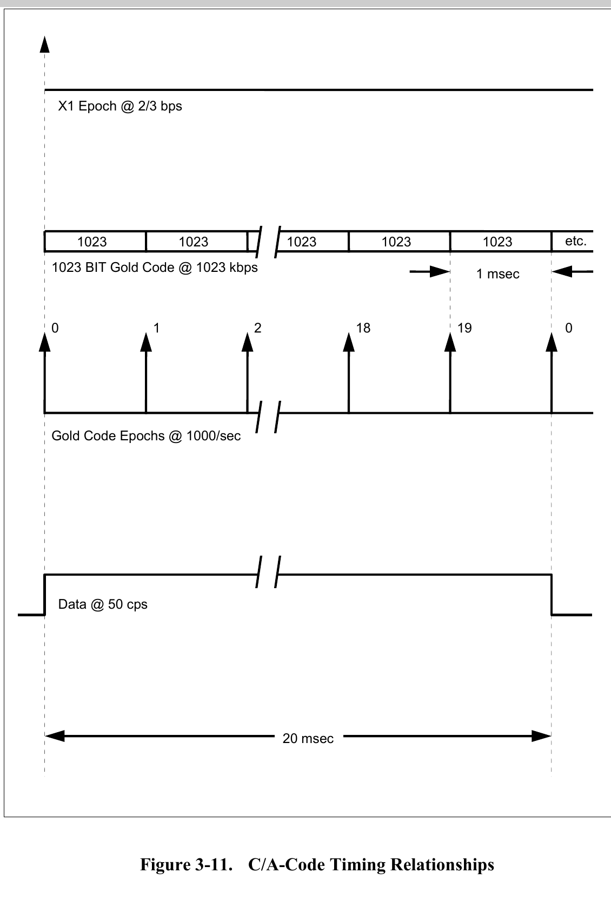
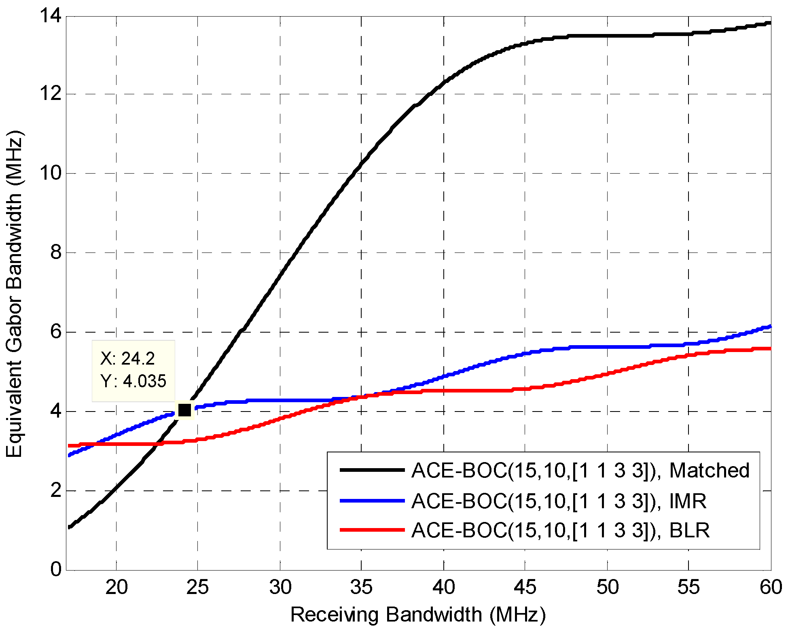
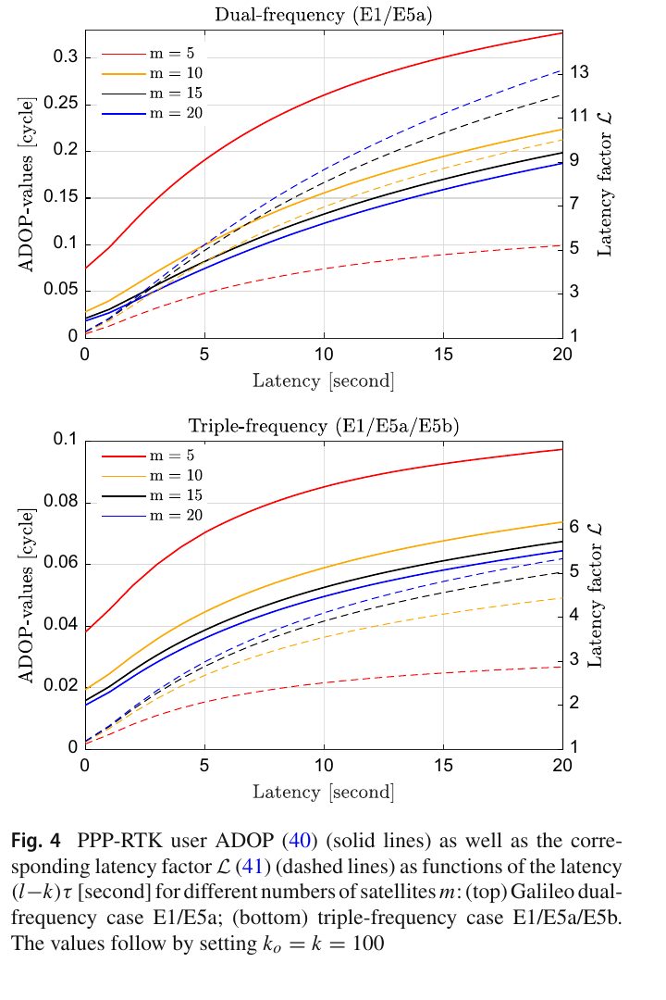

# 2026-07-17 GNSS 每日研究简报

## 今日快报

### 快报 1：GNSS 与多模态滑坡位移监测的能力边界

- 主题：`gnss-multimodal-landslide-monitoring`
- 来源 ID：`doi:10.1007/s44517-026-00006-w`
- 来源链接：https://doi.org/10.1007/s44517-026-00006-w
- 发表日期：2026-07-14
- 来源类型：开放获取综述论文
- 获取范围：开放全文，CC BY 4.0

**内容：** 综述先比较静态 GNSS、RTK、NRTK、PPP 与 PPP-RTK 在滑坡监测中的实时性、精度、基准站依赖和收敛约束，再梳理四条融合路线：GNSS 与加速度计覆盖从缓慢蠕变到高频运动，GNSS 与 InSAR 互补时间及空间采样，GNSS 与测斜仪等现场传感器融合，以及地表与地下观测联合建模。作者还讨论了机器学习和物理信息神经网络用于触发—响应解释的边界。

**结论：** GNSS 可连续给出全天候三维位移，但稀疏空间采样、多路径、山区基准站建设和大高差对流层残差限制了单一传感器方案。文中汇总的案例从毫米级静态或短基线结果到厘米级实时结果不等，不能把不同场景的精度直接横比；更稳妥的结论是多模态应按频段、空间覆盖和故障模式互补，而不是把数据简单拼接。

**关注理由：** 低成本监测节点往往先受供电、通信和站网密度约束。该综述适合用来建立“哪类位移由哪种传感器看见”的需求矩阵，并提醒定位算法同时输出时间同步、质量标志和可追溯协方差，才能进入预警链路。

### 快报 2：渐进搜索降低 FFT 捕获的硬件规模

- 主题：`progressive-fft-acquisition`
- 来源 ID：`doi:10.1186/s13634-026-01356-6`
- 来源链接：https://doi.org/10.1186/s13634-026-01356-6
- 发表日期：2026-07-09
- 来源类型：开放获取期刊论文
- 获取范围：开放全文的未编辑早期版本，CC BY-NC-ND 4.0

**内容：** 传统并行码相位捕获对整段数据做 FFT/IFFT，可一次得到全部码相位，却会随数据长度增加运算、存储和 FPGA 资源。论文把降采样与渐进搜索组合：先用较短数据和较高降采样率做粗搜索，再逐步缩短候选范围并调整降采样率，同时复用固定规模 FFT 结构。

**结论：** 作者的仿真表明方法在保留实用捕获精度的同时缩短捕获时间，FPGA 实现也显示硬件资源显著下降。当前页面明确标记为未编辑稿，摘要没有给出足以跨平台复核的统一百分比，因此本条只确认“固定 FFT 复用、渐进细化与资源下降”的方向，不把它改写成特定芯片上的保证。

**关注理由：** 它把算法复杂度落到 FFT 点数、片上存储和搜索调度三个可实现量上。对低成本接收机，下一步应核查降采样抗混叠、弱信号检测概率、强弱星互扰和最坏捕获时延，而不是只比较平均运行时间。

### 快报 3：海基 JPALS 的多基准布尔电离层梯度监测

- 主题：`jpals-ionospheric-integrity`
- 来源 ID：`doi:10.1186/s43020-026-00204-0`
- 来源链接：https://doi.org/10.1186/s43020-026-00204-0
- 发表日期：2026-07-07
- 来源类型：开放获取期刊论文
- 获取范围：开放全文；数据需向作者合理申请

**内容：** 海上舰载参考天线会同时经历结构挠曲、姿态运动与载波相位模糊度风险，单一基线监测可能出现几何死区。论文让多个参考接收机分别形成电离层梯度判决，再用布尔协同规则合并，以消除单监测器对特定梯度方向不敏感的问题，并把误警、漏检、模糊度固定失败和连续性风险放在同一完整性框架中分析。

**结论：** 在论文仿真条件下，当注入的电离层梯度幅度大于 22.7 cm 时，方法可约束完整性与连续性风险；相对传统监测方法，监测灵敏度提高 12.0%。作者同时指出观测噪声标准差显著影响灵敏度，本文聚焦瞬时监测，尚未用时间平均进一步抑噪。

**关注理由：** 这项结果提醒工程实现：多天线或多基准并不自动带来完整性，必须显式设计几何覆盖、相关噪声和组合判决。22.7 cm 是该仿真口径下的门限量级，不能脱离天线拓扑、噪声和风险分配直接移植。

### 快报 4：GNSS 天顶湿延迟改善极端降水预报

- 主题：`gnss-zwd-weather-foundation-model`
- 来源 ID：`arxiv:2607.05658`
- 来源链接：https://arxiv.org/abs/2607.05658
- 发表日期：2026-07-06
- 来源类型：开放预印本
- 获取范围：开放全文

**内容：** 地面 GNSS 信号穿过水汽后形成天顶湿延迟 ZWD，它是全天候柱状水汽观测。作者把 ZWD 作为新变量加入 Aurora 天气基础模型，并针对 6 h 累积降水微调，比较有无 ZWD 时的降水技巧和空间功率谱。

**结论：** 模型学习 ZWD 的技巧与原预训练变量相当；加入 ZWD 后，降水预报随事件严重程度增加而改善，在第 99 百分位阈值上 Equitable Threat Score 提高 8.8%，同时天气尺度与行星尺度的降水功率谱更接近参考。该百分比是特定模型、资料覆盖和阈值下的相对变化，不证明单个 GNSS 站能独立预报暴雨。

**关注理由：** 定位中常被当作误差项的湿延迟，在气象中正是信号。接收机和站网若保留高质量 ZTD/ZWD、天线信息和质量控制记录，就能把定位基础设施扩展为低成本环境感知网络。

### 快报 5：光钟把 PPP-RTK 改正保持时间从 10 s 推到 54 s

- 主题：`optical-clock-ppp-rtk-holdover`
- 来源 ID：`doi:10.1007/s10291-026-02123-8`
- 来源链接：https://doi.org/10.1007/s10291-026-02123-8
- 发表日期：2026-07-04
- 来源类型：开放获取期刊论文
- 获取范围：开放全文，CC BY 4.0；结果来自受控仿真

**内容：** 研究在约 10 km 的单站 PPP-RTK 框架中固定几何和观测条件，只改变四类在轨原子钟与三类候选光钟的 Allan 偏差模型，并人为延迟 SSR 改正。作者把模糊度成功率保持在 99% 以上的最大延迟定义为 holdover time，从而隔离卫星钟稳定度对改正中断的影响。

**结论：** 仿真中 GLONASS K1、GPS Block III、BDS-3 MEO、Galileo FOC 的保持时间约为 1、6、7、10 s；CROC 为 17 s，IMTS 与 SRL 达 54 s。SRL 与 IMTS 同为 54 s 暗示系统已受几何、对流层或用户观测噪声限制。论文明确将这些数值称为乐观估计，实验室光钟稳定度不能等同于在轨可用性。

**关注理由：** 结果把“时钟更稳”落实为改正链路可容忍延迟，而非泛泛的定位更准。它也为今日第三篇精读预热：PPP-RTK 用户必须传播改正协方差，不能只接收一个改正值。

## 深度研读

### 深读 1｜捕获基础｜为什么 C/A 码 1 ms 重复而相干积累不能盲跨 20 ms

- 类别：`acquisition`
- 学习层级：`foundation`
- 选题定位：`经典基础`
- 来源 ID：`is-gps-200n`
- 来源链接：https://archive.gps.gov/technical/icwg/IS-GPS-200N.pdf
- 发表日期：2022-08-01
- 来源类型：GPS 官方接口规范 IS-GPS-200N
- 获取范围：官方公开完整 PDF，248 页
- 价值评分：94/100（相关性 20，经典价值 25，证据 19，教学价值 19，工程价值 11）

#### 为什么先学这个

捕获常被介绍成“做一次 FFT 找最大峰”，但决定弱信号增益的第一道边界更朴素：本地 C/A 码每 1 ms 重复一次，LNAV 数据符号却每 20 ms 才可能翻转。若不知道这两个时标怎样嵌套，就会误以为把 20 个 1 ms 相关结果直接相加一定带来 20 倍幅度；一旦窗口跨过未知数据位边界，前后相关量可能符号相反并彼此抵消。先从官方时序图建立这个直觉，再学检测门限、非相干积累和比特擦除，顺序最稳。

#### 先修知识

GPS L1 C/A 码含 1023 chip，码率为 1.023 Mchip/s，因此一个码周期为 1 ms，一个 chip 时长约为 977.5 ns。用真空光速换算，一个 chip 约对应 293 m 的传播距离，但捕获估计的是码相位，不是已经改正钟差和大气的最终距离。LNAV 数据率为 50 bit/s，一个数据位持续 20 ms，恰含 20 个 C/A 码周期。相干积累保留复数相位和正负号；非相干积累在每段后取幅度或功率再相加，避免未知符号抵消，却失去跨段相位信息。

#### 一句话逻辑

先在每个 1 ms 码周期内做相干相关，再依据数据位同步决定能否带符号合并；不知道 20 ms 边界时，宁可非相干合并也不要假设所有 1 ms 结果同号。

#### 研究问题与约束

设接收机已选定一个 PRN，并在候选码延迟 $`\widehat{\tau}`$ 与候选多普勒 $`\widehat{f}`$ 上相关。我们只问：积累时间从 1 ms 增加到若干毫秒时，数据位翻转怎样改变相关输出？先假设 AWGN、前端未饱和、码和载波模型正确、导航位在自己的 20 ms 区间内恒定，且数据位边界与 C/A 码 epoch 对齐。真实接收机还要面对残余多普勒、振荡器相噪、次码、量化和比特边界未知；这些条件决定推导能否使用。

#### 核心方法论

复基带样本可写成

```math
r[n]=A d_m c[n-\tau]e^{j(2\pi \Delta f nT_s+\phi)}+w[n].
```

$`A`$ 是幅度，$`d_m`$ 是第 $`m`$ 个 1 ms 段所属的导航数据符号，取 $`+1`$ 或 $`-1`$；$`c`$ 是本地已知 PRN，$`\tau`$ 以样点或秒表示；$`\Delta f`$ 为候选擦除后的残余频率，单位 Hz；$`T_s`$ 为采样周期，单位 s；$`\phi`$ 为残余相位，单位 rad；$`w[n]`$ 为噪声。对每个 1 ms 段做码与载波擦除并求和，得到复相关量 $`Z_m`$。捕获器随后选择“直接相干相加”或“先取模再相加”。

#### 关键公式逐步推导

若每个 1 ms 段有 $`N_s`$ 个样点，码和频率完全对准，则

```math
Z_m=\sum_{n=0}^{N_s-1}r[n]c[n-\widehat{\tau}]e^{-j2\pi\widehat{f}nT_s}
\approx A N_s d_m e^{j\phi}+W_m.
```

忽略噪声时，连续合并 $`M`$ 个码周期得到

```math
Z_{coh}=\sum_{m=0}^{M-1}Z_m
=A N_s e^{j\phi}\sum_{m=0}^{M-1}d_m.
```

若全部 $`d_m`$ 相同，幅度从单段的 $`A N_s`$ 增为 $`M A N_s`$，理想功率统计量增为 $`M^2`$ 倍；噪声功率只按 $`M`$ 倍增长，所以处理增益随相干时间线性增加。若窗口内在第 $`q`$ 段后翻转一次，则归一化幅度只剩

```math
G_{bit}=\frac{|q-(M-q)|}{M}=\frac{|2q-M|}{M},
\qquad 0\leq q\leq M.
```

当翻转恰把窗口分成相等两半时，$`G_{bit}=0`$，理想信号完全抵消；这不是 C/N0 下降，而是符号模型错了。非相干统计量

```math
S_{nc}=\sum_{m=0}^{M-1}|Z_m|^2
```

对 $`d_m`$ 的正负不敏感，但其分布为非中心卡方叠加，门限不能沿用单段相干相关。残余多普勒也会造成相位旋转，矩形相干窗的幅度损失近似为

```math
G_f=\left|\frac{sin(\pi\Delta fT_{coh})}{\pi\Delta fT_{coh}}\right|,
```

其中 $`T_{coh}`$ 单位 s。该式在窗口内频率近似恒定时有效；$`T_{coh}`$ 越长，多普勒栅格必须越密。1 ms 相干窗不会在内部跨 LNAV 位边界；超过 1 ms 时，只有已知位边界、已做比特擦除或使用无数据导频，才可安全延长。

#### 经典价值与创新边界

1 ms 码周期、20 ms 数据位和“相干前必须知道符号”都是经典事实，没有算法新颖性，却是弱信号捕获、辅助 GNSS 和长相干积累的共同地基。现代方案用位预测、辅助数据、双分支假设、差分相干或导频通道绕过边界，本质都在处理 $`d_m`$。官方 ICD 只规定信号时序，不给出最优检测器、门限或捕获概率；本文的积累推导是基于该时序的接收机解释，不能冒充规范要求。

#### 整体逻辑链

卫星产生 1023-chip Gold 码 → 每 1 ms 重复一次并形成码 epoch → 20 个码 epoch 落在一个 50 bit/s 数据符号内 → 接收机按候选延迟和多普勒产生 1 ms 复相关 → 数据符号相同则复数向量同向累加 → 未知边界导致向量反向并抵消 → 接收机改用位同步、比特擦除、两种符号假设或非相干积累 → 检测统计量超过按搜索单元数校准的门限后才声明捕获 → 跟踪环继续细化码相位与载波。

#### 原文图表与结果分析



> 图源：IS-GPS-200N Figure 3-11 “C/A-Code Timing Relationships”，[官方完整规范](https://archive.gps.gov/technical/icwg/IS-GPS-200N.pdf)。该文件由 GPS 官方档案公开发布，图中未单列再许可条款；本地仅截取解释 1 ms/20 ms 关系所必需的原图区域，用于研究评论，未改动线条、文字、比例或数据，不据此主张对整份规范的再分发权。

图没有传统数值纵轴，纵向三层分别表示 X1 epoch、C/A Gold 码 epoch 与数据状态；横向是时间，明确标注一个码周期 1 ms 和一个数据位 20 ms。中层从 epoch 0 数到 19 后回到 0，给出 20:1 的直接基线关系；上层每个码块含 1023 chip、码率 1023 kchip/s，所以 $`1023/(1.023\times10^6)=1`$ ms。下层的高低电平只是示意符号状态，图没有给电压或功率单位，不能把高度当幅度读数。

图在 epoch 2 与 18 之间使用断裂符压缩版面，这不是时间缺口；从 18、19、0 的连续编号可看出码 epoch 正常延续。数量级上，数据位比码周期长 20 倍，比单 chip 长 20460 倍。图只显示时序，不显示相关峰、C/N0、多普勒、数据位翻转概率或比特极性，因此不能从它推出捕获概率，也不能证明 20 ms 相干积累总是可用。X1 epoch 标注为 2/3 bps，是系统码时标关系的一部分，不是用户应采用的捕获更新率。

#### 原文结果论述

规范直接规定 C/A 码为 1 ms 长、码率 1023 kchip/s，并用 Figure 3-11 表明 20 个 Gold 码 epoch 对应一个 50 bit/s 数据间隔。作者并未在该图中讨论接收机算法。本文由图得到的直接读数是 1 ms、20 ms 与 20:1；“未知位边界会使相干和抵消”来自 BPSK 符号代数，是基于规范时序的推论。二者必须分开标注，避免把接收机设计建议说成信号接口条款。

#### 常见误区与适用边界

第一，把“码每 1 ms 重复”误解为信号波形每 1 ms 完全相同，忽略数据符号和载波相位。第二，跨 20 ms 直接复数相加，却没有数据位同步或双符号假设。第三，只考虑位翻转，不考虑残余多普勒造成的 sinc 损失。第四，把非相干积分的次数直接换算成同等相干增益，忽略自由度增加和平方损失。第五，按单个搜索单元设计门限，却在数千个码相位—频率单元上取最大值。第六，把 L1 C/A 结论照搬到有导频、次码或 BOC 副峰的现代信号。第七，在定点实现中忘记 $`M`$ 段相加所需的累加器位宽。

#### 工程实现步骤

①按 PRN 生成一个 1023-chip 本地码周期并重采样到前端采样率；②把输入切成与码 epoch 对齐的 1 ms 复样本块；③对每个多普勒候选擦除载波并计算所有码相位相关；④保存每个候选的复数 $`Z_m`$，不要过早丢掉相位；⑤未知数据边界时按 $`|Z_m|^2`$ 非相干合并，或并行测试可能的位翻转位置；⑥已有导航位辅助或位同步后再延长相干时间；⑦按实际非相干次数、噪声估计和搜索单元数校准恒虚警门限；⑧对峰值比、邻近频率一致性和码相位重复性做二次检查；⑨把捕获的延迟、频率、统计量和位边界假设一并交给跟踪通道。

#### 复现实验设计

生成 4.092 Msps 的 GPS L1 C/A PRN 1，设置残余多普勒为 0、100、250、500 Hz，C/N0 为 25、30、35、40 dB-Hz。对每组做 10000 次蒙特卡洛，比较四种统计量：1 ms 相干、10 ms 直接相干、20 ms 直接相干、20 个 1 ms 功率非相干。分别让数据位无翻转、在第 5、10、15 ms 翻转，并记录检测概率、虚警率、峰均比和估计频率误差。实现正确时，第 10 ms 翻转会让 20 ms 直接相干的无噪声信号项接近零，而非相干统计量基本不受符号影响；再用 sinc 公式核对不同残余频率下的幅度损失。

#### 与定位及低成本实现的联系

捕获输出决定跟踪初始化，错误峰或虚警会污染伪距并增加重捕获功耗。低成本接收机常用较低采样率、小 FFT 和有限片上存储，更需要分段保存 1 ms 结果并按状态机组合，而不是用一个超长 FFT 硬跨数据位。辅助数据能换取更长相干时间，但引入网络时延和数据可信度问题。对定位层而言，应保留捕获统计量、相干长度和数据位处理方式，才能把“已捕获”转成可解释的观测质量。

#### 本节小结

C/A 码的 1 ms 与 LNAV 数据的 20 ms 不是两个孤立参数，而是捕获积分策略的边界条件。1 ms 相关结果可安全作为基本单元；更长相干增益必须用位同步、位擦除或符号假设换取。原图只给时序，接收机设计还要补回残余频率、噪声统计、门限和硬件位宽。下一篇把“不能只看名义带宽”推进到码跟踪：本地解扩波形是否匹配，同样会改变有效测距信息。

### 深读 2｜码跟踪进阶｜简化本地副载波时，前端带宽增加多少才值得

- 类别：`tracking`
- 学习层级：`intermediate`
- 选题定位：`经典基础`
- 来源 ID：`doi:10.3390/s16071128`
- 来源链接：https://doi.org/10.3390/s16071128
- 发表日期：2016-07-20
- 来源类型：Sensors 开放获取论文
- 获取范围：开放全文，CC BY 4.0
- 价值评分：91/100（相关性 20，经典价值 23，证据 19，教学价值 18，工程价值 11）

#### 为什么先学这个

第一篇说明积分时间不能脱离信号符号。进入跟踪后，另一个常见误区是“模拟前端越宽，码跟踪一定按比例更准”。现代 BOC/复合信号的高频结构确实携带更尖锐的时延信息，但低成本接收机可能只生成简化的本地副载波；此时新增频谱没有被匹配利用，带宽、采样率和算力的成本可能只换来很小收益。2016 年论文用等效 Gabor 带宽把这个问题压缩成一张曲线，适合作为中级、窄而具体的性能问题。

#### 先修知识

DLL 用 Early、Prompt、Late 相关器估计码延迟。接收信号经前端滤波器 $`H(f)`$ 后与本地解扩波形相关；若本地波形与接收波形一致，称匹配接收。论文还比较 IMR 与 BLR 两类简化、不匹配接收策略，它们减少本地波形复杂度，却丢弃部分频谱或谐波。接收带宽和等效 Gabor 带宽都用 MHz，但含义不同：前者是硬件放行的频率范围，后者是相关输出中对时间延迟敏感的均方频率扩展。Gabor 带宽越大，理想热噪声下的时延下界通常越小。

#### 一句话逻辑

扩大前端只在本地解扩波形能够利用新增高频结构时显著改善码跟踪；不匹配副本会让等效 Gabor 带宽提前平台化，因此应按边际收益选择模拟带宽、采样率和本地生成复杂度。

#### 研究问题与约束

问题限定为 ACE-BOC 复合信号的码跟踪：匹配、IMR、BLR 三种接收策略下，双边接收带宽变化怎样影响等效 Gabor 带宽？论文模型假设载波同步理想，噪声和干扰为宽平稳零均值过程，前端可用等效滤波器描述，相关器处于小误差工作区。图本身不包含量化、时钟抖动、动态应力、实际 C/N0、环路带宽或 FPGA 功耗，因此只能比较信号与接收策略的固有趋势，不能直接给出产品伪距 RMS。

#### 核心方法论

令接收波形频谱为 $`S(f)`$，本地解扩波形频谱为 $`L(f)`$，前端响应为 $`H(f)`$。相关所利用的交叉频谱可写成

```math
C(f)=H(f)S(f)L^*(f).
```

若频谱关于零频对称，等效 Gabor 带宽可用二阶频率矩表示为

```math
\beta_G^2=\frac{\int f^2|C(f)|^2df}{\int |C(f)|^2df}.
```

$`\beta_G`$ 单位 Hz。一般非对称情形还要减去一阶频率矩的平方。匹配接收令 $`L(f)`$ 最大程度贴合 $`S(f)`$；IMR 和 BLR 只生成较简单的波形，改变 $`C(f)`$ 的权重，因此同一模拟带宽不再对应同一有效测距带宽。

#### 关键公式逐步推导

时延 $`\tau`$ 在频域对应相位 $`e^{-j2\pi f\tau}`$。对 $`\tau`$ 求导会带出 $`-j2\pi f`$，所以高频成分对微小时延更敏感。AWGN、高信噪比和无偏估计条件下，时延方差的典型下界具有

```math
\sigma_\tau^2\geq\frac{1}{8\pi^2\beta_G^2\rho},
```

其中 $`\rho`$ 是相关观察窗内的无量纲信噪比，$`\sigma_\tau`$ 单位 s。距离标准差为 $`\sigma_r=c\sigma_\tau`$，单位 m。该式说明 $`\beta_G`$ 翻倍时，其他条件相同的时延标准差下界减半；但不匹配还会改变相关能量和 $`\rho`$，所以不能只最大化 $`\beta_G`$。

Early-minus-Late 功率鉴别器可写成

```math
D(e)=|R_{SL}(e-d/2)|^2-|R_{SL}(e+d/2)|^2,
```

$`R_{SL}`$ 是接收与本地波形的互相关，$`e`$ 和 $`d`$ 可用 chip 表示。锁定点附近线性化为 $`D(e)\approx K_de`$，$`K_d`$ 是鉴别器斜率；波形不匹配和带限都会改变 $`R_{SL}`$、$`K_d`$ 与无模糊范围。该线性化只在主峰附近、没有错误副峰锁定时有效。

图中论文给出的具体边际收益最能指导配置：BLR 从约 25 MHz 增到 35 MHz，等效 Gabor 带宽增加约 1.08 MHz；从 35 MHz 再增到 45 MHz，只增加约 0.214 MHz。若 ADC 采样率、抗混叠滤波器阶数和相关器吞吐随带宽同步上升，后一个 10 MHz 很可能不经济。

#### 经典价值与创新边界

匹配滤波、频率二阶矩与 DLL 小误差线性化都是经典基础。论文的贡献是把本地码片波形不匹配纳入统一模型，并提出与具体积分时间、SNR 和干扰强度解耦的评价量，用于比较复杂现代信号的低复杂度接收策略。今天仍值得学，是因为消费级芯片依旧要在射频带宽、ADC 功耗、存储和本地波形生成之间折中。它不替代端到端环路仿真，也不证明某种简化策略在多路径、干扰或所有 BOC 信号上最优。

#### 整体逻辑链

现代复合信号把测距信息分布到多个频谱分量 → 模拟前端决定哪些分量进入 ADC → 本地解扩波形决定哪些已进入分量真正相干参与相关 → 交叉频谱的二阶矩形成等效 Gabor 带宽 → 该带宽约束热噪声时延下界和鉴别器斜率 → 匹配策略随接收带宽继续吸收高频信息 → 简化 IMR/BLR 较早达到平台 → 工程师比较边际测距收益与采样率、功耗、逻辑资源 → 再用真实噪声、多路径和动态闭环验证最终参数。

#### 原文图表与结果分析



> 图源：Zhang、Yao、Lu（2016）Figure 3，[开放全文](https://doi.org/10.3390/s16071128)，CC BY 4.0。使用出版社提供的原始 PNG，未改变坐标、图例、曲线或数据；本地文件保留原图中的 24.2 MHz 标记。

横轴为双边接收带宽，图示约 17–60 MHz；纵轴为等效 Gabor 带宽，0–14 MHz。黑、蓝、红分别是匹配、IMR、BLR。零基线表示没有可用均方频率扩展，不是零伪距误差。约 24.2 MHz 处，原图标记 IMR 为 4.035 MHz；匹配曲线约 3.9 MHz、BLR 约 3.3 MHz，说明在窄带区“匹配”并不保证该单一二阶矩最大，因为滤波与波形结构共同加权频谱。

带宽超过约 24.2 MHz 后，黑线快速上升，在 35 MHz 附近约 10.2 MHz、45 MHz 附近约 13.4 MHz，随后接近平台；IMR 在 35、45、60 MHz 附近约为 4.3、5.5、6.1 MHz，BLR 约为 4.3、4.6、5.6 MHz。曲线的台阶感来自数值频谱和绘图分辨率，不能解读为硬件带宽跨过某一点会突然跳变。蓝红线在约 35 MHz 附近交会，也不证明两策略的 SNR、抗干扰或复杂度相同。

直接读图能确认匹配接收在宽带区保留更多时延信息，以及 BLR 的边际收益显著递减。图没有 C/N0、积分时间、环路带宽、误差条、计算量或定位误差轴，不能断言黑线对应的真实伪距 RMS 一定按比例优于蓝红线；也不能把 ACE-BOC 的数值直接套到 GPS L1 C/A、B1C 或 Galileo E1。

#### 原文结果论述

作者指出接收带宽超过 24.2 MHz 后，匹配接收相对 IMR/BLR 出现明显优势；在约 35 MHz 时，BLR 与 IMR 的性能接近，没有必要只为很小的等效带宽差异采用更复杂 IMR。作者还用 25→35 MHz 的 1.08 MHz 收益与 35→45 MHz 的 0.214 MHz 收益说明边际递减。本文进一步把该差值解释为 ADC 和相关器设计门槛，这是工程推断；原图没有给功耗或资源数据，必须另做硬件测量。

#### 常见误区与适用边界

第一，把模拟接收带宽等同于等效 Gabor 带宽。第二，只看 $`\beta_G`$，忽略不匹配造成的相关功率损失。第三，把理论下界当实际 DLL 抖动，忽略鉴别器、环路滤波和动态。第四，看到宽带匹配曲线高，就忽略更高采样率、ADC ENOB、抗混叠滤波和存储功耗。第五，把图中 24.2 MHz 标记当普适拐点，它只属于该信号和策略。第六，未检查 BOC 副峰与无模糊跟踪，主峰局部斜率好仍可能错误锁定。第七，用错误的单边/双边带宽口径比较论文和芯片规格。

#### 工程实现步骤

①从 ICD 生成目标信号的连续时间或高采样率参考波形；②建立实际模拟滤波器 $`H(f)`$，明确规格是单边还是双边；③为匹配、IMR、BLR 分别生成本地波形；④计算交叉频谱、相关能量和 $`\beta_G`$，同时记录相关峰损失；⑤在候选带宽上做边际收益曲线；⑥依据最高输入频率选择 ADC 采样率和抗混叠余量；⑦用定点 Early/Prompt/Late 相关器测量 $`K_d`$、饱和与量化噪声；⑧加入 AWGN、窄带干扰、多路径和频率动态做闭环 DLL；⑨把码误差乘光速并送入定位权阵，检查最终水平与高程影响；⑩以功耗、逻辑、失锁率和伪距 RMS共同决策。

#### 复现实验设计

按论文 ACE-BOC 参数重建频谱，双边前端带宽从 17 MHz 扫到 60 MHz，步长 1 MHz，复现匹配、IMR、BLR 三条 $`\beta_G`$ 曲线，并单独核验 24.2、25、35、45、60 MHz。随后固定 C/N0 为 35 和 45 dB-Hz，积分时间 1 ms，Early–Late 间隔取 0.1、0.2、0.5 chip，各做 10000 次噪声仿真；加入延迟 0.1–1.0 chip、幅度 0.1–0.5 的单径，输出热噪声标准差、零交叉偏差、错误副峰锁定率和每秒复乘次数。只有当理论排序与闭环结果一致，才把带宽选择交给硬件评审。

#### 与定位及低成本实现的联系

码延迟误差乘光速进入伪距，最终由卫星几何和权阵放大到位置域。低成本接收机无法无限扩大前端和采样率，但可选择更合适的本地波形、按 C/N0 自适应带宽或只在高质量通道启用复杂相关器。图中的平台化提示一种可操作策略：先找等效带宽的边际拐点，再把节省的算力用于多星、抗多路径或完整性监测。第三篇会把类似思想带到定位服务：改正值之外，协方差和传输延迟决定整数固定是否仍可信。

#### 本节小结

码跟踪性能由“信号频谱 × 前端 × 本地解扩波形”共同决定。匹配接收在宽带区能继续利用高频时延信息，简化 IMR/BLR 则较早出现边际递减。等效 Gabor 带宽提供清晰的第一层筛选，但不含真实 C/N0、量化、多路径和环路动态；工程上必须把理论曲线、闭环仿真和硬件成本三者合并。

### 深读 3｜定位深入｜PPP-RTK 改正延迟怎样进入模糊度协方差

- 类别：`positioning`
- 学习层级：`advanced`
- 选题定位：`定位深入`
- 来源 ID：`doi:10.1007/s00190-021-01490-z`
- 来源链接：https://doi.org/10.1007/s00190-021-01490-z
- 发表日期：2021-03-25
- 来源类型：Journal of Geodesy 开放获取论文
- 获取范围：开放全文、公式、图表与公开 GNSS 数据入口，CC BY 4.0
- 价值评分：95/100（相关性 20，经典价值 24，证据 20，教学价值 18，工程价值 13）

#### 为什么先学这个

前两日已从 SPP 走到短基线 RTK：消除或估计公共误差后，载波整数才能可靠固定。PPP-RTK 再向前一步，把轨道、钟差、相位/码偏差和可选大气信息封装为状态空间改正，让单接收机用户恢复整数性。真正困难不只是“收到改正”，而是改正从生成到使用已经过了多少秒，以及其预测协方差是否随值一起到达。先研究单站 PPP-RTK 的延迟问题，可以在最小模型里看清改正不确定度怎样进入模糊度，而不用一开始承担完整区域网络的全部复杂度。

#### 先修知识

伪距噪声通常为分米到米，载波相位乘波长后可到毫米到厘米，但含整数模糊度。PPP 使用精密轨道钟差并估计接收机钟、对流层和电离层等状态；PPP-RTK 还提供卫星相位/码偏差，使用户模糊度重新具有整数结构。SSR 传输各物理或可估状态，允许不同更新率；OSR 直接给某基准相关的观测改正。ADOP 是模糊度协方差行列式的几何平均尺度，单位 cycle，越小通常越容易固定，但它不替代整数候选验证和完整性评估。

#### 一句话逻辑

延迟使卫星钟和电离层等改正的预测协方差增长，用户必须把这部分协方差加到观测权阵后再求 float 模糊度；更多卫星与频率能抵消部分增长，但把过期改正当确定常数会产生过度自信和误固定。

#### 研究问题与约束

论文研究单站提供者和单接收机用户：改正延迟 $`\Delta t`$ 增加时，双频或三频、不同卫星数的 ADOP 怎样变化？模型使用多历元提供者滤波，图中设 $`k_o=k=100`$，并以 Galileo E1/E5a 或 E1/E5a/E5b 分析。它假设动态模型和随机模型正确，图是解析/数值结果，不是所有网络与环境的统计汇总。单站与用户距离增大后，电离层和对流层空间去相关会进一步恶化，不能只按图中的秒数设置产品 SLA。

#### 核心方法论

以米为单位的未组合观测可简化写成

```math
P_{u,j}^s=\rho_u^s+c(\delta t_u-\delta t^s)+T_u^s+\mu_j I_u^s+b_{u,j}-b_j^s+\epsilon_{P,j}^s,
```

```math
\Phi_{u,j}^s=\rho_u^s+c(\delta t_u-\delta t^s)+T_u^s-\mu_j I_u^s+\lambda_j(N_{u,j}^s+B_{u,j}-B_j^s)+\epsilon_{\Phi,j}^s.
```

$`P`$、$`\Phi`$、几何距离 $`\rho`$、钟差乘光速、对流层 $`T`$ 和电离层 $`I`$ 均为 m；$`\mu_j`$ 为频率相关系数；$`\lambda_j`$ 为 m/cycle；$`N`$ 为整数 cycle；$`b`$ 与 $`B`$ 是码和相位硬件偏差。用户单站观测无法独立分离卫星钟和卫星偏差。提供者用 S-basis 消除秩亏，发送可估的钟、偏差和可选电离层状态及其协方差；用户再形成满秩观测模型。

#### 关键公式逐步推导

把改正后的线性化用户模型写成

```math
y=Hx+Aa+v,
\qquad E[vv^T]=Q_y+Q_c(\Delta t).
```

$`x`$ 含位置、接收机钟、对流层等实数状态，$`a`$ 是 $`n_a`$ 维 float 模糊度，单位 cycle；$`H`$ 与 $`A`$ 是设计矩阵；$`Q_y`$ 为用户观测协方差；$`Q_c`$ 为时间预测后的改正协方差。若改正状态按

```math
c_{k+1}=Fc_k+w_k,
\qquad E[w_kw_k^T]=Q_w,
```

传播 $`h`$ 步，则

```math
Q_c(h)=F^hQ_c(0)(F^h)^T+\sum_{i=0}^{h-1}F^iQ_w(F^i)^T.
```

延迟为 $`\Delta t=h\tau`$ s，$`\tau`$ 是更新间隔。只要 $`Q_w`$ 非零，延迟通常使 $`Q_c`$ 增大。用 $`Q=Q_y+Q_c`$ 构造权阵 $`W=Q^{-1}`$，法方程分块为 $`N_{xx}=H^TWH`$、$`N_{xa}=H^TWA`$、$`N_{aa}=A^TWA`$。消去实数状态后，float 模糊度协方差为 Schur 补的逆：

```math
Q_{\widehat{a}}=(N_{aa}-N_{ax}N_{xx}^{-1}N_{xa})^{-1}.
```

实现时不应显式求逆，而应用带主元 QR、Cholesky 或平方根信息法，并检查设计矩阵秩和条件数。ADOP 定义为

```math
ADOP=\left(detQ_{\widehat{a}}\right)^{1/(2n_a)}.
```

单位为 cycle。论文指出 ADOP 小于约 0.14 cycle 时，bootstrap 成功率上界高于 99%；这是由协方差推得的概率界，不是对具体历元正确固定的保证。将 $`Q_c`$ 置零会让 $`W`$ 过大、$`Q_{\widehat{a}}`$ 过小，整数搜索椭球方向和尺度均错误。

#### 经典价值与创新边界

观测方程、协方差传播、Schur 补、ADOP 和整数最小二乘都是高精度定位的经典骨架。论文的具体贡献是为多历元单站 PPP-RTK 推导改正延迟与用户模糊度协方差的解析关系，并说明 SSR 与 OSR 的联系。今天仍值得学，因为实际改正流始终存在编码、排队、网络和解码延迟。它不是完整商业 PPP-RTK 网络的性能证明：区域大气建模、轨道误差、多系统偏差、数据中断和服务完整性仍需独立建模。

#### 整体逻辑链

提供者接收多频载波与伪距 → 原始参数存在钟差和硬件偏差秩亏 → 选择 S-basis 得到可估状态 → 卡尔曼滤波按各状态时间特性生成 SSR 与协方差 → 通信延迟使用户只能预测旧状态 → 状态转移把过程噪声累积进 $`Q_c`$ → 用户把 $`Q_c`$ 与自身观测 $`Q_y`$ 相加 → 几何矩阵、频率数和卫星数共同决定 float 模糊度协方差 → LAMBDA 搜索整数候选 → 成功率、残差与保护门限决定固定或回退 float → 固定解及协方差进入位置输出。

#### 原文图表与结果分析



> 图源：Khodabandeh（2021）Figure 4，[开放全文](https://doi.org/10.1007/s00190-021-01490-z)，CC BY 4.0。本地从原 PDF 页裁出 Figure 4 与完整图注，未改动坐标、曲线、颜色、文字或数据。

上下图横轴均为改正延迟 0–20 s。左纵轴是 ADOP，单位 cycle，实线对应卫星数 $`m=5,10,15,20`$；右纵轴是无量纲延迟因子 $`L`$，虚线颜色对应相同 $`m`$。上图为双频 E1/E5a，ADOP 约从 0 s 时的 0.07、0.025、0.018、0.015 cycle 增到 20 s 时的 0.33、0.22、0.195、0.18 cycle。下图为三频，$`m=5`$ 约从 0.037 增到 0.097 cycle，$`m=20`$ 约从 0.013 增到 0.063 cycle。

零延迟是时间预测误差的基线，不是零观测噪声；所有曲线在零点仍有非零 ADOP。延迟因子随延迟和卫星数上升，但实线 ADOP反而随卫星数增加而降低，因为更多观测带来的几何与整数约束收益超过延迟因子增长。论文据图给出：双频仅 5 星时，为保持 ADOP 低于约 0.15 cycle，延迟不宜超过约 3 s；约 10 星时可到约 10 s；三频时可超过 20 s。

图的双纵轴容易误读：虚线数值不能按左侧 cycle 轴读取。它也没有位置误差、误固定率或置信区间，且固定 $`k_o=k=100`$ 和特定随机模型。因此图不能证明“三频 20 s 一定固定”，也不能说明增加卫星永远允许更旧改正；低高度多路径星、系统间偏差和错误协方差可能让实测趋势偏离。

#### 原文结果论述

作者的解析结果把 PPP-RTK 用户 ADOP 写成单历元 RTK ADOP、多历元因子和延迟因子的乘积。多历元因子最多约改善 1.4 倍，其主要作用是使改正可预测；延迟因子则单调放大不确定度。数值结果表明卫星数与频率数能协同提高可容忍延迟。作者还警告，三频的低 ADOP可能主要来自频间宽巷类模糊度，并不自动意味着全部原始模糊度都可可靠固定，必要时应采用部分模糊度固定。

#### 常见误区与适用边界

第一，只传播改正值，不传播完整协方差和跨星、跨频相关项。第二，把 age of correction 当显示字段，不进入权阵。第三，把 ADOP 阈值当硬成功率保证，忽略整数验收和模型错误。第四，未用 S-basis 或其他基准约束处理秩亏，得到看似可逆但物理含义错误的法矩阵。第五，显式求逆放大病态几何。第六，多系统组合未估计系统间码偏差、相位偏差和时间基准差。第七，延迟很大仍保持 fixed 标志，不按创新和成功率回退。第八，把单站短距离结果外推到大区域，忽略大气空间去相关。

#### 工程实现步骤

①统一 SSR 生成时刻、参考时标和用户观测时刻，计算逐状态改正龄期；②解析轨道、钟、码偏差、相位偏差和大气改正，并保留质量标志；③按状态模型传播改正值与完整协方差；④建立未组合多频观测，统一米与 cycle 单位；⑤选择并记录 S-basis，做数值秩检查；⑥按仰角、C/N0、信号类型和改正协方差组成 $`Q`$；⑦用 QR 或平方根滤波求 float 解与 $`Q_{\widehat{a}}`$；⑧LAMBDA 去相关并搜索候选；⑨用成功率界、残差、比值、固定后位置跳变和保护级共同验收；⑩改正超龄、协方差缺失或创新异常时回退 float，并记录重新收敛时间。

#### 复现实验设计

先按论文设置生成 Galileo 双频和三频几何，$`m`$ 取 5、10、15、20，更新间隔 1 s，提供者滤波 100 epoch。令改正延迟取 0、3、5、10、15、20 s，按常速度钟差/电离层过程模型传播 $`Q_c`$，复现 Figure 4 的 ADOP 曲线。随后做两组 LAMBDA：A 组使用 $`Q_y+Q_c`$，B 组错误地令 $`Q_c=0`$；每个条件生成 100000 个 float 模糊度样本，统计正确固定率、误固定率和拒绝率。最后用 1 Hz 公共 GNSS 数据或自有基准站—用户短基线，人工延迟 SSR 包，并检查 ADOP、E/N/U 误差、固定保持时间、条件数和创新序列。

#### 与定位及低成本实现的联系

低成本终端常依赖蜂窝网络接收 PPP-RTK 改正，网络抖动、休眠唤醒和省流策略都会增加龄期。更多星与频率可提升容忍度，却意味着更多 RF 通道和功耗；另一条路是让服务端按状态变化率分配更新频率，并把协方差一起压缩传输。用户端必须把链路延迟当估计问题，而不是 UI 问题。今日快报中的光钟研究正是同一机制的上游版本：更稳卫星钟让 $`Q_c`$ 增长更慢，但不能消除大气、几何和终端噪声。

#### 本节小结

PPP-RTK 的关键不是“单机也能固定”这句口号，而是可估改正、时间预测、协方差传播和整数验收组成的完整链。Figure 4 清楚显示延迟使 ADOP 上升，更多卫星和频率能扩大时间余量；它同样提醒我们，过期改正必须降权，三频低 ADOP 不等于全部整数安全。把改正值和不确定度一起送达，才是低成本实时高精度定位可扩展的基础。
