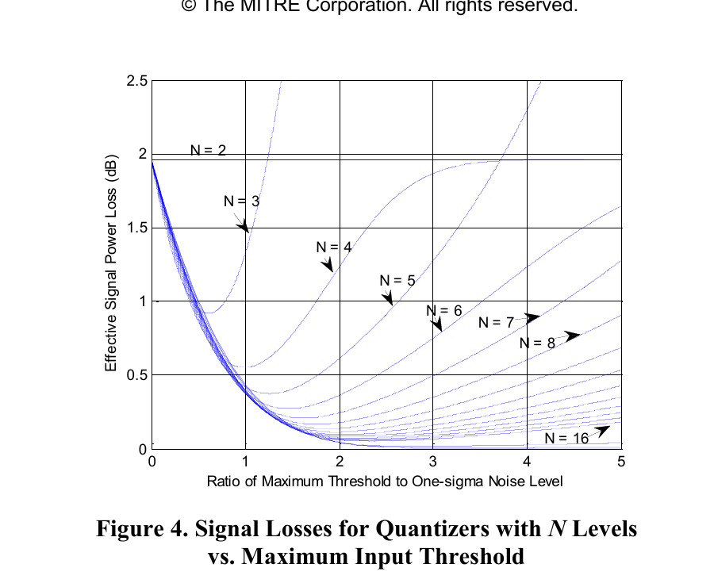
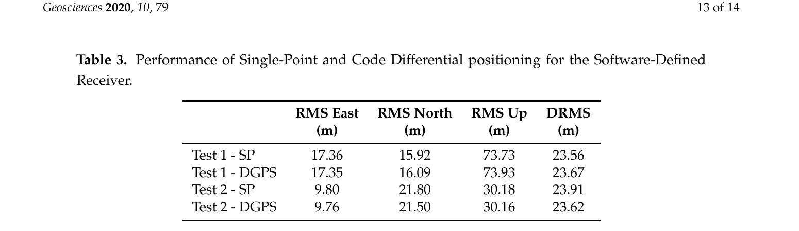
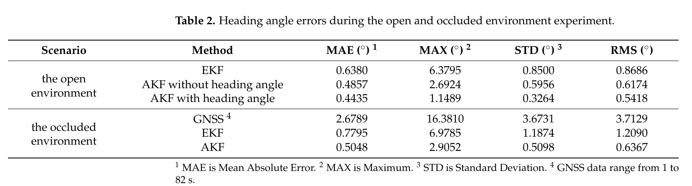

# 2026-07-18 GNSS 每日研究简报

## 今日快报

### 快报 1：Huber 自适应 RTS 平滑抑制海上 GNSS/INS 异常

- 主题：`marine-gnss-ins-robust-smoothing`
- 来源 ID：`doi:10.3390/s26134107`
- 来源链接：https://doi.org/10.3390/s26134107
- 发表日期：2026-06-28
- 来源类型：开放获取期刊论文
- 获取范围：开放全文，CC BY 4.0

**内容：** 论文面向海上平台遮挡造成的 GNSS 衰减与粗差，先用 21 维误差状态 EKF 前向估计，再在 RTS 后向平滑阶段以标准化新息和 Huber 阈值 1.345 构造等价权阵，重建前向增益并调制平滑增益。实船与陆车数据都以商业后处理结果为参考，比较 ESKF、普通 RTSS 和所提 ARTSS；量测维数为 6，新增矩阵求逆规模小于状态维数，整体复杂度仍由 21 维状态矩阵主导。

**结论：** 作者报告实船三维位置精度相对 ESKF 和 RTSS 分别提高 31.07% 与 6.97%，陆车分别提高 48.05% 与 8.67%。这些是特定数据、异常模型和后处理条件下的相对结果，不能直接外推到实时滤波；它更可靠地说明“在后向平滑里重新降权异常新息”能避免普通 RTSS 把前向粗差再次传播。

**关注理由：** 低成本 IMU 与海上多路径常让残差重尾化。该文给出了从新息标准化、等价权到平滑增益的完整实现链，适合转成离线质量控制基线，并检查实时鲁棒滤波与后处理平滑究竟在哪一层获得收益。

### 快报 2：L 波段 InSAR 与 GNSS 共同补齐高山滑坡监测

- 主题：`l-band-insar-gnss-slope-monitoring`
- 来源 ID：`doi:10.5194/nhess-26-2579-2026`
- 来源链接：https://doi.org/10.5194/nhess-26-2579-2026
- 发表日期：2026-06-04
- 来源类型：开放获取期刊论文
- 获取范围：开放全文，CC BY 4.0

**内容：** 研究比较 ALOS-2、SAOCOM-1 卫星 L 波段、车载地基 L 波段与 Sentinel-1 C 波段对三个阿尔卑斯大型边坡的探测能力。车载雷达轨迹由 GNSS 辅助 INS 和临时 GNSS 基准站精化，再进行时域反投影与地形改正；地表结果由现场 GNSS、全站仪等测量解释。作者同时使用 PSI、常规差分干涉、叠加与 SBAS，以覆盖从厘米每年到数米每年的不同速度区间。

**结论：** 林区内 L 波段持久散射体密度约为 C 波段的 5 倍，在有利条件下可超过 20 倍；但快速运动、阴影、叠掩、冬季失相干和不规则重访仍留下空洞，甚至 L 波段 PSI 也无法覆盖 Brienz 主滑体。结论应是多频、多视线、多技术互补，而不是“换成 L 波段即可连续预警”。

**关注理由：** 这项工作把 GNSS 从最终定位结果扩展到移动雷达轨迹标定和独立地面验证，展示了高精度定位在遥感测量链中的基础作用，也提醒工程人员区分视线位移、三维运动与真实滑坡速度。

### 快报 3：轮载 IMU 学习位移怎样补进 GNSS/EKF

- 主题：`wheel-imu-neural-gnss-fusion`
- 来源 ID：`arxiv:2606.03265`
- 来源链接：https://arxiv.org/abs/2606.03265
- 发表日期：2026-06-02
- 来源类型：完整预印本
- 获取范围：arXiv 全文，尚未经过期刊同行评审

**内容：** WMINet 利用轮上 IMU 的周期旋转主动调制偏置，并以双轮间距约束训练位移回归网络；网络位移在相邻 GNSS 更新之间作为额外位置量测进入误差状态 EKF。两个测试轨迹上，所提 WEKF 的平均位置 RMSE 为 1.15 m，普通轮载 EKF 为 2.12 m；总路程误差也从 17.65% 降到 9.58%。

**结论：** 作者给出的平均位置 RMSE 相对改善约 46%，说明受控周期运动能把低成本惯性信号变成可学习特征。不过训练与测试都依赖轮载安装和周期轨迹，网络不是无条件的 GNSS 中断替代物；跨轮径、滑移、路面和任意运动的泛化仍是公开问题。

**关注理由：** 这是“物理调制提高可观测性，再让小网络提供量测”的低成本路线。复现时应把网络输出协方差、GNSS 更新间隔和轮胎打滑分开评估，而不是只比较最终轨迹图。

### 快报 4：透射智能表面把卫星信号引入室内

- 主题：`tis-aided-indoor-satellite-navigation`
- 来源 ID：`arxiv:2605.26762`
- 来源链接：https://arxiv.org/abs/2605.26762
- 发表日期：2026-05-26
- 来源类型：完整预印本
- 获取范围：arXiv 全文，尚未经过同行评审

**内容：** 论文设想用可控透射智能表面重定向室外卫星信号，建立延伸视距链路；室内端以已知 TIS 阵列位置和到达角执行三阶段定位。作者还定义 TIS 位置精度衰减指标 TPDoP，用阵列质心偏离和阵列分布紧凑度解释几何，并把它与位置 RMSE 联系起来。

**结论：** 该工作给出可计算的几何与仿真框架，但仍依赖 TIS 位置、姿态、相位控制和到达角标定准确，且没有证明普通手机 GNSS 射频链能直接处理这类重定向信号。它目前更适合作为“可编程传播环境”的概念验证，而非已部署的室内 GNSS 服务。

**关注理由：** 传统室内定位常只优化接收机；这篇工作把环境本身纳入设计变量。对低成本实现最值得跟踪的是表面标定误差怎样进入几何矩阵，以及新增硬件成本是否真的低于 UWB、Wi-Fi RTT 或伪卫星基础设施。

### 快报 5：低成本 SDR 的 Galileo 自适应捕获与跟踪

- 主题：`galileo-sdr-adaptive-tracking`
- 来源 ID：`doi:10.1038/s41598-026-49269-6`
- 来源链接：https://doi.org/10.1038/s41598-026-49269-6
- 发表日期：2026-04-28
- 来源类型：开放获取期刊论文
- 获取范围：开放全文，CC BY-NC-ND 4.0

**内容：** 作者在 USRP N210 与主机软件接收机上组合圆相关 PCPS 捕获、自适应 DLL、混合 PLL/FLL 和类似 Kalman 的收敛调节，并与传统 SDR 链路比较。论文报告平均 PDOP 2.87，平均载噪密度由 40.8 dB-Hz 增至 46.5 dB-Hz，水平与垂直位置误差分别最多降低约 62% 与 53.5%，环路收敛时间减少超过一半。

**结论：** 结果说明自适应带宽和联合码/载波环能在该数据集上改善收敛与抖动，但论文没有开放原始数据或代码，且同时改动捕获、环路滤波和增益控制，无法从汇总指标单独识别每个模块的贡献。14% 的载噪密度增幅也应结合估计器偏差核查，而不能等同于前端真实信号功率增加。

**关注理由：** 低成本 SDR 最容易把“算法增益、估计器口径和硬件环境”混为一谈。该文适合用作消融实验清单：固定原始 I/Q，逐项替换 PCPS、环路带宽和状态滤波，才知道收益是否可迁移。

## 深度研读

### 深读 1｜接收机工程｜为什么 1 位量化只损失约 1.96 dB

- 类别：`receiver-engineering`
- 学习层级：`foundation`
- 选题定位：`经典基础`
- 来源 ID：`mitre:09-3995`
- 来源链接：https://www.mitre.org/sites/default/files/pdf/09_3995.pdf
- 发表日期：2009
- 来源类型：经典会议论文公开稿
- 获取范围：完整公开稿；Approved for Public Release，图表版权仍归 MITRE
- 价值评分：93/100（相关性 20，经典价值 25，证据 18，教学价值 18，工程价值 12）

#### 为什么先学这个

ADC 位数看似只是硬件规格，却决定每秒数据量、接口带宽、存储和相关器乘加复杂度。对埋在热噪声下的扩频信号，1 位量化并非把幅度信息全部毁掉：符号仍保留样本落在零点哪一侧的信息，长时间相关可以把这个微弱偏置累加出来。先算清 1.96 dB，读者才能判断“少一位省多少资源、要多积累多久”，也能避免把量化级数、采样率和模拟带宽三种损失混成一个经验常数。

#### 先修知识

设 ADC 输入实样本为 $`x=s+n`$，其中 $`s`$ 是一个相关周期内已知本地码投影后的微弱确定分量，单位 V；$`n`$ 是零均值高斯噪声，标准差 $`\sigma`$，单位 V。1 位量化器输出 $`y=sign(x)`$，只有 $`+1`$ 与 $`-1`$。载噪密度 $`C/N_0`$ 的单位是 Hz 的倒数，工程中写成 dB-Hz；这里讨论相关器输出有效信号功率相对理想线性量化器的损失。分贝功率比使用 $`10log_{10}(\cdot)`$，不是幅度比的 $`20log_{10}(\cdot)`$。

#### 一句话逻辑

弱信号只让高斯噪声越过零门限的概率产生一阶偏置，这个偏置的功率效率是 $`2/\pi`$，所以损失为 $`-10log_{10}(2/\pi)=1.961`$ dB。

#### 研究问题与约束

问题是：在热噪声主导、零门限对称、AGC 把噪声均值保持在零附近时，1 位硬限幅后相关器要付出多少有效信号功率？基础推导假设 $`|s|/\sigma \ll 1`$、噪声高斯且样本统计稳定、量化门限无直流偏置、相关积分跨越大量扩频码片。原文更完整的模型还允许任意量化级数、带限滤波、非整数采样率和宽平稳高斯干扰；但图 4 的“最低量化损失”假设前端带宽与采样率足够高，使滤波和采样对期望信号的额外衰减近似为零。离开这些条件，1.961 dB 只是下限附近的基准，不是保证值。

#### 核心方法论

把非线性量化器拆成“与输入中有用小信号同方向的线性分量”和不相关失真。对 1 位零门限，直接从概率出发即可求线性斜率；对 3、4、8 等多级均匀量化器，原文用量化区间概率计算相关器均值与方差，再把带限、采样、量化对信号和噪声的作用分别折算为有效 $`C/N_0`$。这比把量化误差简单当作与输入独立的均匀白噪声更可靠，因为 1 位量化显然不满足“误差小且独立”的高分辨率假设。

#### 关键公式逐步推导

第一步，量化输出均值等于落在门限两侧的概率差。令 $`\Phi`$ 为标准正态分布函数：

```math
E[y|s]=P(x\geq 0)-P(x<0)=2\Phi\left(\frac{s}{\sigma}\right)-1
```

第二步，在 $`s/\sigma=0`$ 附近作一阶展开。标准正态密度在零点为 $`1/\sqrt{2\pi}`$，因此：

```math
E[y|s]\approx \sqrt{\frac{2}{\pi}}\frac{s}{\sigma},\qquad \left|\frac{s}{\sigma}\right|\ll 1
```

理想线性归一化样本 $`x/\sigma`$ 的有用幅度是 $`s/\sigma`$；硬限幅后的相关均值只剩其 $`\sqrt{2/\pi}`$ 倍。第三步把幅度效率平方为功率效率，并转成分贝：

```math
\eta_{1bit}=\frac{2}{\pi}=0.63662,qquad L_{1bit}=-10log_{10}(\eta_{1bit})=1.961\ dB
```

这意味着要获得相同输出信噪比，1 位接收机需要约 $`1/\eta_{1bit}=\pi/2=1.571`$ 倍有效独立样本；若其余条件不变，相干或非相干观测时间也要相应增加约 57.1%。原文表 1 给出四电平，也就是常见每个实分量 2 位量化，在最佳最大门限约 $`0.996\sigma`$ 时最低损失 0.549 dB；相对 1 位可追回 1.412 dB，但数据率翻倍。

#### 经典价值与创新边界

经典价值在于它把“极弱 GNSS 为什么可以用很少的 ADC 位数”化成可核算的资源交换：1 位省接口与存储，代价不是无限大而是热噪声条件下约 1.96 dB。原文的贡献边界比这个教科书结果更宽：它统一建模带限、采样相位、任意级数量化与高斯宽平稳干扰，并指出通信接收机只积累一个符号所得损失不能直接套到积累 1023 个以上码片的 GNSS。今天仍应学习这一基线，但强窄带干扰、脉冲干扰、AGC 饱和、非高斯多径或门限漂移时，应使用样本直方图、Bussgang/弧正定律模型或蒙特卡洛实测，而不是只加 1.96 dB。

#### 整体逻辑链

微弱扩频信号进入模拟前端；AGC 决定噪声相对 ADC 门限的尺度；量化器把连续幅度映射为有限级；本地载波与码把同相有用偏置累积，而噪声大体抵消；量化降低相关均值，也改变输出噪声协方差；二者共同形成有效 $`C/N_0`$；有效 $`C/N_0`$ 再决定捕获检测概率、环路抖动和测距方差。因此工程决策不能停在“几位 ADC”，还要同时指定前端双边带宽、采样率是否与码率共整、AGC 目标、门限、干扰模型与积分时长。

#### 原文图表与结果分析



> 图源：Hegarty《Analytical Model for GNSS Receiver Implementation Losses》Figure 4，[公开稿](https://www.mitre.org/sites/default/files/pdf/09_3995.pdf)。文件标注 Approved for Public Release，但版权归 MITRE；此处仅保留分析所需图面，按研究评论边界引用，未改动坐标、曲线或图例。

横轴是“最大输入门限与一倍噪声标准差之比”，无量纲，范围 0 到 5；纵轴是有效信号功率损失，单位 dB，图示范围 0 到 2.5 dB。$`N=2`$ 即两电平/1 位曲线几乎水平停在约 1.96 dB，因为零门限符号量化没有可调外门限。$`N=3`$ 的谷底约 0.92 dB、横轴约 0.6；$`N=4`$ 谷底约 0.55 dB、横轴约 1.0；级数继续增加，最低损失迅速逼近 0，但门限选得过小会削顶，过大则把大多数噪声样本挤在中间少数码字，曲线两端都上升。图中浅蓝细线较密且部分标签靠近曲线，精确数值应以原文表 1 而非目测为准。它不能证明强干扰下的最优门限，也不能证明所有采样率都只有这些损失，因为图的基线排除了额外带限和采样衰减。

#### 原文结果论述

作者结论是：在宽带、高采样、长相关、噪声主导基线下，两电平最低损失 1.961 dB，四电平最低损失 0.549 dB；当接收机带宽不足或采样与码片边沿的相位特殊时，还要叠加相应损失。直接读图可见多级量化存在明确最佳门限，1 位则没有这个自由度。本次工程推断是：若存储或 USB 带宽是瓶颈，1 位仍可能使“可记录时长乘以通道数”最大；若目标是弱信号首次捕获或抗干扰，2 位增加的数据量往往值得，因为追回约 1.4 dB 并保留一定幅度信息供 AGC/干扰检测使用。

#### 常见误区与适用边界

第一，把 1.96 dB 当作任何场景的总实现损失；它不含天线、滤波、采样、时钟和本地码不匹配。第二，把“2 位”误解为 I/Q 合计两位；工程中常指 I、Q 每个分量各 2 位，数据率口径必须写清。第三，用高分辨率的均匀量化噪声公式处理 1 位符号量化。第四，门限偏置或 AGC 错误仍套用零均值推导。第五，只看平均 $`C/N_0`$，忽略窄带干扰使量化器饱和并改变样本相关性。第六，认为更多位总是改善定位；若跟踪误差已由多路径、振荡器或天线主导，增加 ADC 位数只增加功耗。

#### 工程实现步骤

1. 用无信号或已知低信号片段估计 I/Q 均值和 $`\sigma`$，检查直流偏置与 I/Q 不平衡。
2. 对 1 位设置零门限；对四电平先试外门限 $`\pm0.996\sigma`$ 和对称输出码字，再用相关峰信噪比微调。
3. 同一段浮点 I/Q 分别量化为 1、2、8 位，保持采样率、码、载波和积分时间完全一致。
4. 记录相关峰均值、旁瓣/噪声方差、检测概率、估计 $`C/N_0`$ 与每秒字节数。
5. 注入 CW、扫频和脉冲干扰，重新估计门限；若直方图明显非高斯，不再使用固定 1.96 dB 修正。
6. 在实时实现中给 AGC 饱和率、各码字占用率和门限漂移加遥测，避免损失只在离线定位端被发现。

#### 复现实验设计

生成 GPS L1 C/A 基带，采样率取 4.092 Msps，相干积分 1 ms，设 $`C/N_0`$ 从 30 到 50 dB-Hz 每 2 dB 一档；每档至少 10,000 次独立噪声试验。以浮点相关器为基线，比较零门限 1 位、最佳门限 2 位和 8 位。先在 AWGN 下验证 1 位峰值功率比接近 $`2/\pi`$、2 位损失接近 0.55 dB；再把前端双边带宽从 2.046 MHz 改到 10.23 MHz，比较带限与量化是否可分；最后加入不同干信比的 CW，绘制检测概率而非只看 $`C/N_0`$ 估计值。报告均值、95% 置信区间、假警率和每种格式的数据率。

#### 与定位及低成本实现的联系

量化损失首先抬高捕获门限，随后增大 DLL/PLL 热噪声抖动，最终进入伪距、载波相位和多普勒权阵。低成本接收机若用 1 位节省功耗，应把约 1.96 dB 计入信号质量到观测方差的映射；否则定位器会过度相信弱星。另一方面，少位宽允许同一存储带宽记录更多频点或更长时间，可能提升多频电离层改正和鲁棒性。真正的成本最优不是“位数最少”，而是前端功耗、数据吞吐、可用卫星数和最终定位误差的联合最小化。

#### 本节小结

1 位量化保留的是“越过零点的概率偏置”。在弱高斯信号基线下，相关功率效率为 $`2/\pi`$、损失 1.961 dB；四电平最佳门限可把损失降到约 0.549 dB。这个经典数值是接收机预算的起点，不是对带限、采样和干扰的免责条款。

### 深读 2｜低成本与移动端｜时钟校正为何改善可用性却未必改善 DRMS

- 类别：`low-cost-mobile`
- 学习层级：`intermediate`
- 选题定位：`经典基础`
- 来源 ID：`doi:10.3390/geosciences10020079`
- 来源链接：https://doi.org/10.3390/geosciences10020079
- 发表日期：2020-02-21
- 来源类型：开放获取期刊论文与开源接收机实验
- 获取范围：开放全文，CC BY 4.0
- 价值评分：90/100（相关性 20，经典价值 23，证据 18，教学价值 17，工程价值 12）

#### 为什么先学这个

上一节说明 ADC 如何把每个样本变成有限位；接下来要看这些样本何时被采。低成本 TCXO 的偏差不只表现为导航方程里的一个可估钟差，它还会推动接收机时间标签、码相位和观测历元逐渐错位。时钟校正是很具体的接收机机制：它可能几乎不改变水平 DRMS，却决定能否持续形成伪距。理解这个反直觉结果，是从“信号能相关”走向“观测能连续输出”的关键一步。

#### 先修知识

接收机时间相对 GNSS 系统时的偏差记为 $`\delta t_r`$，单位 s；乘光速 $`b=c\delta t_r`$ 后单位 m，作为定位状态更便于与伪距同量纲。频率相对误差 $`y_f=\Delta f/f_0`$ 无量纲，短时可近似使钟差线性增长。时间标签是观测被认为发生的完整历元；时间偏移是标签的小数部分；钟差则是接收机时标对系统时的物理偏离。这三个量有关但不能混写。SP 是单点码定位，DGPS 是码差分，DRMS 是二维水平误差的均方根组合，不包含 Up。

#### 一句话逻辑

定位最小二乘可以每历元吸收共同钟差，但前端时间标签漂到实现边界外时连一致伪距都生成不了，所以时钟校正首先保护连续性，而不是保证更小的坐标 RMS。

#### 研究问题与约束

论文使用 bladeRF x40 低成本前端和 GNSS-SDR，在高楼包围的退化场景中比较时钟校正开启与关闭，并后处理 SP 与码差分。GNSS-SDR 当接收机钟差超过默认 40 ms 时触发粗校正；文中引用的既有测试指出超过约 57 ms 时最小二乘可能失败。这里的 40 ms 不是物理常数，而是该实现的保护阈值。两个测试不是同一原始 I/Q 的随机对照，卫星几何、多路径和可用历元可能不同，因此表 3 更适合验证“DRMS 没有明显分离”，不能单独估计校正的因果精度收益。

#### 核心方法论

接收机持续估计 $`\delta t_r`$。高端设备可用反馈连续拉偏振荡器或数控时钟；低成本实现常允许钟差自由增长，到阈值后做一次反向 clock jump，同时在时间偏移和观测量上施加一致补偿。关键是不让校正制造伪距台阶、载波周跳或基准站与流动站的接收时刻错配。定位端则把 $`b`$ 作为公共状态列加入设计矩阵；只要观测仍来自同一物理历元，公共偏差可被四颗以上卫星估计。

#### 关键公式逐步推导

第 $`i`$ 颗卫星的码观测可写为：

```math
P_i=\rho_i+c\delta t_r-c\delta t_i+T_i+I_i+M_i+\epsilon_i
```

$`P_i,\rho_i,T_i,I_i,M_i,\epsilon_i`$ 均以 m 表示；$`\delta t_i`$ 是卫星钟差，单位 s。对近似位置 $`x_0`$ 线性化并把接收机钟差改写为 $`b=c\delta t_r`$：

```math
\Delta P_i=-u_{ix}\Delta x-u_{iy}\Delta y-u_{iz}\Delta z+\Delta b+\epsilon_i
```

$`u_i`$ 是接收机指向卫星的无量纲视线单位向量，$`\Delta x,\Delta y,\Delta z,\Delta b`$ 单位均为 m。堆叠后以权阵 $`W`$ 求解：

```math
\Delta X=(H^TWH)^{-1}H^TW\Delta P
```

设计矩阵最后一列全为 1，说明任意共同伪距平移优先进入 $`\Delta b`$，而不是必然污染位置。短时钟模型可写为：

```math
\delta t_r[k+1]=\delta t_r[k]+y_f[k]\Delta T+w_t[k]
```

其中 $`\Delta T`$ 单位 s，$`w_t`$ 是未建模相位噪声，单位 s。触发跳变时若校正量为 $`J_t`$ s，则时间标签减去 $`J_t`$，同时所有码观测必须减去 $`cJ_t`$ m；载波 NCO、累积多普勒和 RINEX clock offset 也要按同一符号约定更新。符号错一次，就会制造约 $`299792458J_t`$ m 的公共台阶。

#### 经典价值与创新边界

经典价值是区分“钟差可估”和“时间基准可运行”。四星定位确实能估一个接收机钟差，但这不意味着软件接收机可以无限容忍本地时钟漂移；缓冲区索引、导航电文时标、发射时刻回算和跨接收机差分都有有限一致性范围。论文不是新时钟模型，也没有证明 clock jump 优于所有连续校正；它的工程价值在于以开源 GNSS-SDR 和真实低成本前端展示：校正的主要收益是更多有效解，而不是显著更小的 DRMS。动态高精度载波差分、PPP 或时间传递不应直接照搬 40 ms 粗跳，应采用连续模型、硬件时间戳或严格的跳变传播。

#### 整体逻辑链

TCXO 频率误差积成钟差；钟差推动采样时间标签偏离 GPST；可用范围内，定位器通过公共状态 $`b`$ 吸收偏差；继续漂移会使码相位、发射时刻或软件观测构造不一致；阈值校正把时间基准拉回；若所有相关状态同步补偿，坐标精度主要仍由几何、多路径与码噪声决定，但解的空洞减少；若补偿不完整，就产生接收时刻错配、发射时刻错配、伪距台阶或载波不连续。最终工程指标应同时报告精度、完整率、最大连续空洞和跳变瞬态。

#### 原文图表与结果分析



> 图源：Cutugno 等《Low-Cost GNSS Software Receiver Performance Assessment》Table 3，[原文](https://doi.org/10.3390/geosciences10020079)，CC BY 4.0；仅裁出原表，未改动数值、单位或行列。

这是表格而非坐标图，因此没有横纵轴；列单位全部为 m，前三列分别是 East、North、Up 的 RMS，DRMS 是水平组合基线。Test 1 为校正开启，Test 2 为关闭；每个测试各比较 SP 与 DGPS。SP 的 DRMS 从开启时 23.56 m 到关闭时 23.91 m，只差 0.35 m，约 1.5%；DGPS 为 23.67 m 与 23.62 m，开启反而高 0.05 m，约 0.2%，都远小于分量间变化。East 在开启时约 17.36 m、关闭时 9.80 m，而 North 相反为 15.92 m 与 21.80 m；Up 更从约 73.7 m 变到 30.2 m。这种方向互换与垂向大差异说明两个测试的几何和环境不等价，不能把分量变化归因于开关。表中没有样本数、置信区间、可用解比例或时间轴，无法由它量化连续性收益；必须结合正文所述“关闭时出现较大解算空洞”。

#### 原文结果论述

作者结论是：时钟校正开启与关闭的水平 DRMS 基本相同，真正优势是提高解算可用性；复杂城市环境和原型软件限制了实验。直接读表支持“水平汇总指标接近”，却不支持“每个方向精度都改善”。本次工程推断是：定位器已经逐历元估计公共钟差，所以只要观测构造成功，粗校正不必明显降低水平误差；其价值出现在阈值附近的失效概率。若项目只保存成功历元再算 RMS，会把关闭时的失效样本删掉，形成幸存者偏差，因此必须把无解历元计入指标。

#### 常见误区与适用边界

第一，把接收机钟差、时间标签小数和振荡器频偏当成同一状态。第二，修改时间标签却不对伪距、载波累积量和 NCO 同步补偿。第三，用 DRMS 解释垂向；表 3 的 DRMS 不含 Up。第四，把两个不同时间的实测开关实验当配对 A/B。第五，只报告成功解 RMS，不报告成功率与最大空洞。第六，在基准站和流动站分别触发异步 clock jump，却未校正接收时刻与发射时刻错配。第七，认为频繁跳变越安全；阈值过小会增加瞬态和周跳风险，阈值过大又可能越过软件可构造观测的范围。

#### 工程实现步骤

1. 用 PVT 输出估计 $`\delta t_r`$ 与钟漂，并保存时间标签、time offset 和各通道码/载波状态。
2. 设两级阈值：预警阈值用于准备校正，硬阈值用于执行；加入滞回，避免边界抖动。
3. 生成一个原子 clock-jump 事务：更新接收机时标、伪距公共项、载波累积相位、导航电文发射时刻和输出 clock offset。
4. 校正前后用同一卫星计算观测预测残差；若公共码残差不连续或载波出现非整数异常，回滚该历元并标故障。
5. 差分模式记录基准与流动站实际接收时刻，按卫星速度和钟差做时间对齐。
6. 监控每小时跳变次数、无解率、最长空洞、跳变后 1 到 10 s 的创新和周跳告警，而不只监控平均位置。

#### 复现实验设计

使用同一份原始 I/Q 离线回放两次，唯一变量是 clock steering 开关，避免原论文两次现场测试的不可比性。给软件时钟注入 0、0.5、1、2 ppm 频偏和随机游走，阈值测试 5、20、40、60 ms。每种配置报告 SP 与 DGPS 的 East/North/Up RMS、DRMS、有效解比例、最长连续空洞、跳变后残差峰值和载波周跳数。再加入动态场景，检查 $`v_{sat}\Delta t`$ 引起的发射时刻误差。若要验证因果精度收益，所有分支必须使用完全相同的卫星、权阵和有效历元，同时另给包含失败历元惩罚的连续性分数。

#### 与定位及低成本实现的联系

廉价 TCXO 省硬件，却把成本转移到时间状态机、观测一致性和质量控制。SP 中公共钟差容易估计；RTK/PPP 中毫秒级错时会经卫星运动、钟差产品插值和载波连续性放大，不能只靠位置状态吸收。手机还会因省电暂停射频或切换时钟域，更需要把硬件时间戳、系统时钟和 GNSS 时标分层。好的低成本设计不是追求原子钟稳定度，而是在最小硬件下让每次时钟调整都可追踪、可补偿、可验证。

#### 本节小结

接收机钟差在导航方程里是公共未知数，但在接收机实现里还是时间标签和观测生成的运行边界。原文表 3 说明开启/关闭校正的水平 DRMS 近似相同；正文揭示校正主要减少无解空洞。评价低成本时钟机制必须把精度与可用性分开，并保证一次跳变在全部相关状态中同符号、同历元传播。

### 深读 3｜定位｜双天线载波相位如何从基线变成航向

- 类别：`positioning`
- 学习层级：`advanced`
- 选题定位：`定位深入`
- 来源 ID：`doi:10.3390/s24031034`
- 来源链接：https://doi.org/10.3390/s24031034
- 发表日期：2024-02-05
- 来源类型：开放获取期刊论文
- 获取范围：开放全文，CC BY 4.0
- 价值评分：92/100（相关性 20，经典价值 22，证据 19，教学价值 18，工程价值 13）

#### 为什么先学这个

前两节已经处理单个样本的幅度信息和单接收机的时间一致性；高级定位要把多通道观测组织成有几何含义的状态。双天线定向是一个边界清楚的例子：两天线位置差很短，共同卫星误差高度相关，载波相位能给出毫米级投影，但整数周未知。只有同时解决差分、模糊度、基线长度约束、坐标转换和误差传播，才能把“基线固定在车身上”变成静止时也可用的真北航向。

#### 先修知识

在本地东-北-天坐标中，主天线到从天线的基线为 $`b=[b_E,b_N,b_U]^T`$，单位 m，已知机械长度为 $`L`$。卫星视线单位向量 $`u^i`$ 无量纲；载波波长 $`\lambda`$ 单位 m，例如 GPS L1 约 0.1903 m；载波相位 $`\phi`$ 以 cycle 表示，乘 $`\lambda`$ 后为 m；整数模糊度 $`N`$ 单位 cycle。单差指同一卫星在两天线间相减，双差再对一颗参考卫星相减。航向角从真北顺时针为正，使用 $`atan2(b_E,b_N)`$；若产品采用从东轴逆时针或车体基线方向相反，符号和 180 度偏置必须另行标定。

#### 一句话逻辑

双差把两天线看到的共同钟差和近共同大气项消掉，整数固定后每颗卫星给出基线在一条视线差上的投影，多星加权求出三维基线，再以 $`atan2`$ 转成航向。

#### 研究问题与约束

目标是在车辆静止或低速时输出绝对航向，而不是用速度方向代替车头方向。短基线假设两天线到同一卫星的视线近似平行；两天线应同步观测同频信号，天线相位中心与电缆延迟要稳定。至少需要足够多的共同卫星使三维基线与双差模糊度可解，参考星切换必须重映射模糊度。原文把双天线航向作为 GNSS/INS/气压计自适应 Kalman 滤波的量测，并在开阔与遮挡路线比较；其表 2 反映的是整套融合系统，不是纯 GNSS 定向器的独立精度认证。

#### 核心方法论

先对主、从天线的同星载波做站间单差，消除卫星钟差并强烈削弱短基线电离层、对流层和轨道误差；若接收机时钟不共源，单差仍含接收机钟差，再对参考卫星做星间差消除它。以浮点加权最小二乘联合估计基线与模糊度，利用 LAMBDA/MC-LAMBDA 一类整数最小二乘搜索候选，并用已知 $`||b||=L`$、比值检验与残差检验确认。整数固定后回代得到基线协方差，转换为航向与俯仰；最后把航向作为 INS 误差状态量测，在 GNSS 失效时由惯性传播、气压高度和车辆非完整约束维持。

#### 关键公式逐步推导

天线 $`a`$ 对卫星 $`i`$ 的载波观测以 m 表示：

```math
\lambda\phi_a^i=\rho_a^i+c(\delta t_a-\delta t_i)+\lambda N_a^i-I_a^i+T_a^i+M_a^i+\epsilon_a^i
```

电离层对载波为相位超前，故这里写负号；对两天线同星单差，再对参考星 $`j`$ 双差。短基线一阶近似 $`\rho_2^i-\rho_1^i\approx -(u^i)^Tb`$，具体正负取决于基线定义。为避免混乱，定义双差观测方向后统一写成：

```math
y^{ij}=\lambda\nabla\Delta\phi^{ij}=(u^i-u^j)^Tb+\lambda\nabla\Delta N^{ij}+\epsilon^{ij}
```

$`y^{ij}`$ 和右侧基线投影单位 m，$`\nabla\Delta N^{ij}`$ 为整数 cycle。把所有非参考星堆叠为：

```math
y=Ab+\lambda N+\epsilon,\qquad Q_y=E[\epsilon\epsilon^T]
```

由于同一参考星进入每个双差，$`Q_y`$ 通常非对角；把双差当独立会过度乐观。先得到浮点解与协方差，再求整数最小二乘：

```math
\widehat{N}=argmin_{N\in Z^m}(N-\widehat{N}_f)^TQ_N^{-1}(N-\widehat{N}_f)
```

固定整数后，基线加权解为：

```math
\widehat{b}=(A^TPA)^{-1}A^TP(y-\lambda\widehat{N}),\qquad P=Q_y^{-1}
```

并检查 $`|\,||\widehat b||-L\,|`$ 是否在机械标定与相位噪声容差内。航向与俯仰为：

```math
\psi=atan2(b_E,b_N),\qquad \theta=atan2\left(b_U,\sqrt{b_E^2+b_N^2}\right)
```

有效范围通常把 $`\psi`$ 归一化到 0 到 360 度，$`\theta`$ 在 -90 到 90 度。令 $`h^2=b_E^2+b_N^2`$，航向误差的一阶雅可比为：

```math
J_\psi=\left[\frac{b_N}{h^2},-\frac{b_E}{h^2},0\right],\qquad \sigma_\psi^2=J_\psi Q_bJ_\psi^T
```

若水平基线误差近似各向同性为 $`\sigma_b`$，则 $`\sigma_\psi\approx\sigma_b/h`$ rad。1 m 水平基线、5 mm 横向误差约为 0.005 rad，即 0.286 度；基线缩短为 0.5 m，角误差近似翻倍。当天线接近竖直、$`h\to0`$ 时航向不可观，线性化也失效。

#### 经典价值与创新边界

经典部分是载波双差、整数模糊度和基线几何，它解释了双天线为什么在静止时仍能给真北航向，也解释了基线越长角度越稳。原文的新增部分是把双天线航向、RANSAC 初始航向、车辆横/垂向零速约束、气压计和自适应 Kalman 滤波组合，改善遮挡中的车辆航向。它没有发明双天线定向，也未证明其 AKF 对所有接收机、基线和城市环境普适。若只有单点位置、没有同步原始载波和可靠整数固定，两根天线坐标相减通常达不到该机制的角度精度。

#### 整体逻辑链

天线与前端输出同步载波相位；周跳检测保证每段弧连续；选共同卫星和参考星形成相关双差；浮点解给基线与模糊度中心；整数搜索利用协方差和已知长度排除候选；残差、比值和长度检验决定 fixed/float；固定基线经 ECEF 到 ENU 旋转；安装矩阵把天线基线转为车体轴；$`atan2`$ 输出真北航向并传播协方差；融合滤波根据航向质量动态赋权；遮挡或固定失败时停止使用 GNSS 航向，由 INS 传播并在恢复后做创新门限。任何一环缺质量标志，错误整数都可能成为“看起来很稳定”的错误航向。

#### 原文图表与结果分析



> 图源：Jiao 等《Improving Vehicle Heading Angle Accuracy Based on Dual-Antenna GNSS/INS/Barometer Integration Using Adaptive Kalman Filter》Table 2，[原文](https://doi.org/10.3390/s24031034)，CC BY 4.0；仅裁出原表，未改动数值、单位或脚注。

这是误差表，无横纵轴；所有 MAE、MAX、STD、RMS 单位均为度。开阔场景以 EKF 为基线：RMS 0.8686 度；AKF 不使用航向量测为 0.6174 度；加入双天线航向为 0.5418 度，相对 EKF 降 37.62%，相对不加航向的 AKF 再降约 12.2%。最大误差从 6.3795 度降到 1.1489 度，幅度约 82%。遮挡场景 GNSS 单独 RMS 为 3.7129 度，EKF 为 1.2090 度，AKF 为 0.6367 度；但脚注明确 GNSS 数据只覆盖 1 到 82 s，而整段方法不一定使用同样样本，因此不可把 82.8% 差值视为严格同历元算法增益。表中没有基线长度列、固定率、卫星数、模糊度比值或置信区间，也没有把“航向量测”与 RANSAC、气压计、非完整约束逐一消融，故不能由此断言纯双天线定向本身达到 0.5418 度。

#### 原文结果论述

作者报告 1 m 基线参考系统航向精度约 0.05 度，并认为加入 GNSS 航向量测的 AKF 在开阔环境最接近参考；遮挡中 GNSS 航向异常时，滤波器依靠其余量测维持，最终开阔与遮挡 RMS 分别约 0.542 度和 0.637 度。直接读表支持融合方案相对 EKF 的误差下降。本次工程推断是：双天线的最大价值不只是降低稳态 RMS，还在低速时为 INS 航向提供绝对可观测量；但遮挡段的收益主要来自“正确拒绝坏 GNSS 航向并依靠惯性/约束”，不应全部记到双天线硬件名下。

#### 常见误区与适用边界

第一，把航向等同于地速方向；车辆侧滑、倒车和静止时两者不同。第二，忽略主从天线方向，造成固定 180 度偏差。第三，把双差噪声当对角，忘记共享参考星带来的相关性。第四，只做 ratio test，不检查已知基线长度、残差与时间连续性。第五，参考星切换后沿用旧模糊度编号。第六，混用 degree 与 rad，或交换 $`atan2`$ 参数。第七，忽略天线相位中心变化、电缆温漂、近场耦合和车顶多路径。第八，在水平投影很短时仍输出航向。第九，错误整数固定后因曲线平滑就认为可信；稳定偏差往往比白噪声更危险。

#### 工程实现步骤

1. 硬件同步两路采样或使用共振荡器，标定电缆延迟、天线相位中心和主从基线方向。
2. 每历元筛选共同卫星，按高度角、$`C/N_0`$、锁定时间和周跳标志定权；参考星优先高仰角且保持稳定。
3. 构造完整双差协方差，求浮点 $`b,N`$；对病态 $`A^TPA`$ 用 QR/SVD，不直接求逆。
4. 整数搜索后同时做 ratio、后验残差、固定率历史和 $`||b||=L`$ 检验；失败则输出 float/invalid，不伪装 fixed。
5. 把 ECEF 基线旋转到 ENU，再乘安装标定矩阵；以 $`atan2(b_E,b_N)`$ 计算并归一化航向。
6. 用 $`Q_b`$ 传播 $`\sigma_\psi`$，将其作为滤波量测方差；接近竖直或几何退化时自动增大方差。
7. 融合端对 0/360 度创新先做环绕归一化；遮挡、周跳或固定丢失时冻结 GNSS 航向更新。
8. 输出卫星数、参考星、固定状态、ratio、长度残差、航向标准差与安装版本，保证结果可追溯。

#### 复现实验设计

在开阔场地把两根同型号天线刚性安装于可测转台，基线设 0.5、1.0、1.5 m，真值由全站仪或高等级姿态系统给出。每个长度在 0、45、90 度等 8 个方位静置 10 min，再做匀速旋转；记录双频原始相位、$`C/N_0`$ 和周跳。分别比较等权/仰角权、对角/完整双差协方差、无/有长度约束。报告固定率、首次固定时间、长度残差、航向偏差/RMS/95 分位和错误固定率。随后遮挡半边天空并注入单星周跳，验证质量控制是否拒绝错误固定。最后把同一数据送入 INS 融合，单独消融双天线航向、RANSAC、非完整约束和气压计，避免把组合收益错误归因。

#### 与定位及低成本实现的联系

双天线定向本质是一个移动短基线 RTK，因此能复用载波预处理、LAMBDA、周跳与权阵代码；它又比常规基线定位多一个强机械先验 $`L`$。对低成本车载和无人机，增加第二个接收通道与天线可能比升级高等级陀螺便宜，并在静止时提供绝对航向。但短基线角误差按 $`1/L`$ 放大，消费级天线多路径和相位中心不稳定会迅速吃掉优势。成本评估必须包含共时钟硬件、刚性安装、标定、车顶空间和错误固定保护，而不只是模块单价。

#### 本节小结

双天线航向来自“载波双差投影 + 整数固定 + 已知基线 + ENU 角度变换”，不是两个米级单点坐标简单相减。角精度近似随水平基线长度成反比，完整双差协方差、固定检验和安装标定决定结果是否可信。原文表 2 展示融合方案的明显收益，同时也提醒读者：融合 RMS 不能被当作纯 GNSS 双天线定向器的独立指标。
