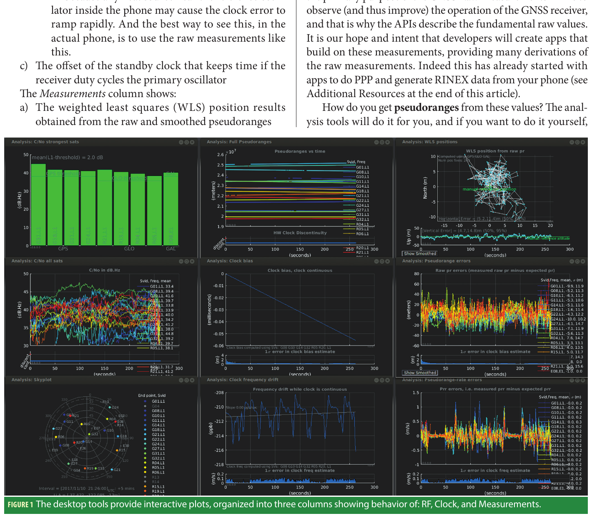
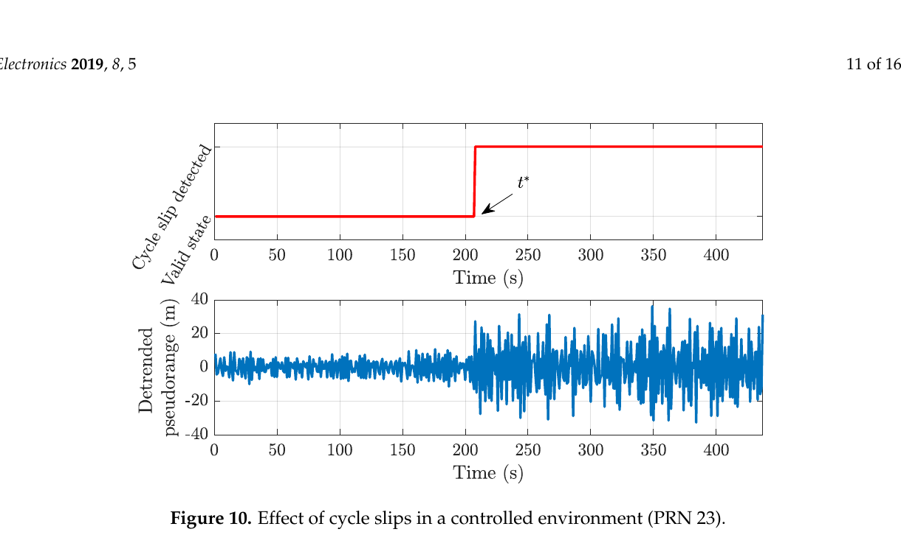
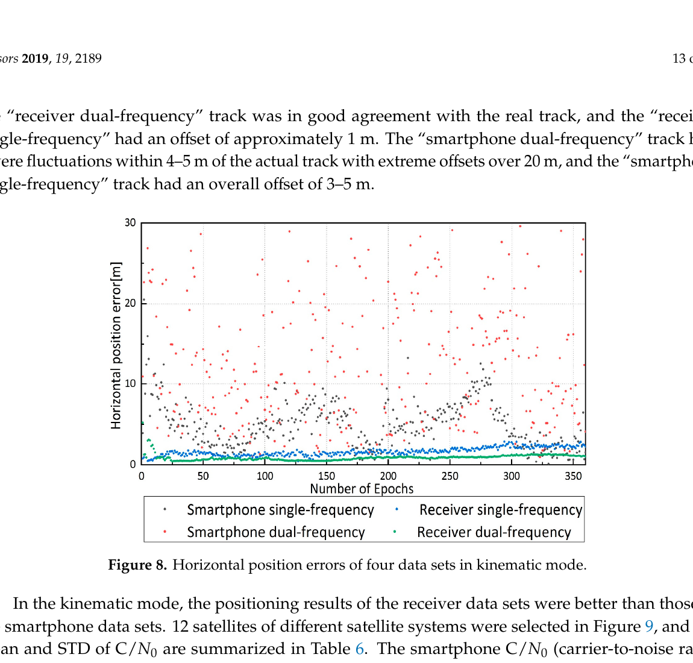

# 2026-07-19 GNSS 每日研究简报

## 今日快报

### 快报 1：地面台网追踪到跨洲影响的星载 GNSS 干扰源

- 主题：`space-based-gnss-interference-geolocation`
- 来源 ID：`arxiv:2606.03673`
- 来源链接：https://arxiv.org/abs/2606.03673
- 发表日期：2026-06-02
- 来源类型：完整预印本
- 获取范围：arXiv 全文，尚未经过期刊同行评审

**内容：** 论文汇集 2019—2026 年欧洲、格陵兰和加拿大地面 GNSS 参考站的接收功率异常，先以功率突增检测宽域瞬态事件，再把事件的时空、频谱规律与到达时差定位结合。作者进一步将估计轨迹与高椭圆 Molniya 轨道目标匹配，把多次事件归因于一组俄方早期预警卫星，而不是单一地面干扰机。

**结论：** 原文报告该源已造成数十次大范围干扰，并认为“功率覆盖形态 + TDOA + 轨道一致性”的证据链能支持源识别。归因仍来自预印本分析，站网分布、接收机增益一致性和可见轨道候选都会影响置信度；它不等同于对卫星载荷意图或发射机制的独立确认。

**关注理由：** 星载干扰的覆盖尺度和重复轨迹都不同于本地压制源。监测系统除记录告警时间，还应保留原始功率、频谱、站间同步质量和多站共同可见性，才能从“发现干扰”升级到可复核的空间源定位。

### 快报 2：用高时间分辨率弹性码偏差应对卫星 Flex Power

- 主题：`resilient-code-bias-flex-power`
- 来源 ID：`doi:10.1007/s00190-026-02056-7`
- 来源链接：https://doi.org/10.1007/s00190-026-02056-7
- 发表日期：2026-06-04
- 来源类型：开放获取期刊论文
- 获取范围：开放全文，CC BY 4.0

**内容：** 常规机构码偏差产品时间分辨率较低，遇到卫星 Flex Power 引起的短时码偏差变化时可能跟不上。论文以卡尔曼滤波实时估计高时间分辨率码偏差及其方差，把产品状态分为 normal、flex、warning、exceptional，并用弹性指标 RI 汇总准确性、完好性、鲁棒性、连续性和可用性。

**结论：** 作者在 BDS-2、BDS-3 与 GPS 的正常和 Flex Power 场景中展示了状态切换与自适应产品相对常规低频产品的优势。该框架的价值在“识别事件后改变产品更新模式”，但 RI 是作者定义的综合指标，阈值、参考真值和实时观测网密度会决定实际告警性能，不能直接当成通用完好性保证。

**关注理由：** 码偏差通常被当作静态或慢变改正；Flex Power 说明信号功率管理也会进入观测偏差。PPP、授时和多频电离层产品若只消费日级偏差文件，应增加短时一致性监测和异常状态传播。

### 快报 3：网络 RTK 的三载波逐级固定究竟怕什么

- 主题：`network-rtk-gf-tcar-ionosphere-sensitivity`
- 来源 ID：`doi:10.1186/s43020-026-00202-2`
- 来源链接：https://doi.org/10.1186/s43020-026-00202-2
- 发表日期：2026-06-22
- 来源类型：开放获取期刊论文
- 获取范围：开放全文，CC BY 4.0

**内容：** 研究分析网络 RTK 中几何无关三载波模糊度固定：先由码与载波构造超宽巷 EWL，再逐级固定宽巷 WL 和原始窄巷模糊度。作者把残余电离层、对流层、码噪声和相位噪声分别传播到以周为单位的固定误差，并在 9 m 短基线真实噪声上加入模拟大气误差；一小时数据包含超过 72,000 个星对样本。

**结论：** 理论与半仿真均显示 EWL 很稳健：码噪声标准差低于 1 m 时成功率接近 100%。WL/NL 对载波噪声更敏感，相位噪声从 5 mm 增到 10 mm 时成功率可降到约 70%；原始模糊度对残余电离层最敏感，接近 100% 的区间约要求其标准差低于 0.1 TECU。阈值基于指定频点、独立误差和逐级正确固定假设，不应跨星座原样套用。

**关注理由：** “超宽巷更长”不代表整条 TCAR 链都可靠。工程上必须分别记录 EWL、WL、NL 的固定状态，并把网络改正的系统偏差与随机方差分开；仅用平滑后的低方差评估成功率，会高估带偏改正的可靠性。

### 快报 4：环境上下文与 NLOS 检测自适应调节手机 RTK 权阵

- 主题：`smartphone-rtk-context-aware-covariance`
- 来源 ID：`doi:10.3390/s26113346`
- 来源链接：https://doi.org/10.3390/s26113346
- 发表日期：2026-05-25
- 来源类型：开放获取期刊论文
- 获取范围：开放全文，CC BY 4.0

**内容：** 论文用 Galaxy S21+ 原始观测实现速度辅助 EKF/RTK。第一层以载噪密度和 PDOP 构造连续环境指标 ECI-F，随环境恶化放大观测协方差；第二层联合归一化 `C/N0` 与码残差识别 NLOS 卫星，再进一步降权。试验覆盖开阔、半城市和城市峡谷，动态速度由 TDCP 提供，周跳时退回多普勒。

**结论：** 开阔环境达到亚米至分米级水平精度；半城市中 CEP95、CEP50、DRMS 相对基线约下降 8、2、4 m，城市峡谷单次试验约下降 15、2、5 m。结果说明上下文权阵主要削弱高分位粗差，但城市峡谷只有单个数据集，且实验关闭了 duty cycling、未标定厘米级杆臂，不能把结果外推为所有手机的固定精度。

**关注理由：** 与直接删除低 `C/N0` 卫星相比，自适应协方差保留了几何信息并限制坏量测的 Kalman 增益。复现时应把环境分类、NLOS 判别和周跳处理分别消融，防止多个保护机制的收益被合并计算。

### 快报 5：MAD 创新质量控制改善低成本多 GNSS PPP

- 主题：`low-cost-ppp-mad-quality-control`
- 来源 ID：`doi:10.1007/s10291-026-02047-3`
- 来源链接：https://doi.org/10.1007/s10291-026-02047-3
- 发表日期：2026-03-09
- 来源类型：开放获取期刊论文
- 获取范围：开放全文，CC BY 4.0

**内容：** 研究对低成本接收机 PPP 的码和相位创新分开做中位数绝对偏差 MAD 检测：码粗差直接从本次滤波更新移除，相位粗差则通过预测协方差膨胀重置对应模糊度。作者以离线回放的 MADOCA 实时轨钟产品处理静态与动态数据，并与后验/标准化残差方法及 IGG-III 鲁棒自适应 Kalman 滤波比较。

**结论：** 静态试验中两个创新质量控制方案都优于 IGG-III，GPS/GLONASS/Galileo 组合的三维 RMS 分别约 5.4 cm 与 6.0 cm，而 IGG-III 受卫星可见性和异常影响出现明显偏移。MAD 方案在所有多 GNSS 组合中把收敛后三维误差的上界控制在约 48.1、35.3、25.7、24.9 cm；这些数值依赖“3D 误差连续 15 min 小于 0.25 m”的收敛定义和该台接收机环境。

**关注理由：** 码粗差与相位粗差不能用同一种删除动作：后者通常意味着弧段状态失效。该文提供了可直接移植到 PPP 滤波器的分类处理框架，也提醒低成本多 GNSS 的冗余度本身就是鲁棒性资源。

## 深度研读

### 深读 1｜接收机工程｜从 Android 时钟字段构造可检验伪距

- 类别：`receiver-engineering`
- 学习层级：`foundation`
- 选题定位：`经典基础`
- 来源 ID：`android:gnss-analysis-tools`
- 来源链接：https://developer.android.com/develop/sensors-and-location/sensors/gnss/downloads/gnss_analysis_tools_from_google.pdf
- 发表日期：2018-03
- 来源类型：Android GNSS 团队公开技术文章
- 获取范围：Android 官方站点完整 PDF；公开阅读，图文版权归原作者与出版方
- 价值评分：94/100（相关性 20，经典价值 24，证据 18，教学价值 19，工程价值 13）

#### 为什么先学这个

手机 API 没有直接给出“真伪距”，而是给接收机硬件时钟、完整钟偏、卫星发射时刻和同步状态。若在这一层把纳秒、周模糊或符号写错，后面的平滑、RTK、PPP 都只是在优化一个错误观测。先从字段构造并验证伪距，才能理解为什么同一手机日志既能生成 RINEX，也会在硬件时钟跳变时出现整批卫星共同台阶。

#### 先修知识

伪距是接收时刻与发射时刻之差乘光速，单位 m；Android 字段大多以 ns 表示。GPS 周长为 604800 s，光在 1 ns 内传播约 0.2998 m。接收机硬件时钟 `TimeNanos` 并不等于 GPST，`FullBiasNanos` 是从 GPS 时间原点累积的大整数偏差，`BiasNanos` 是亚纳秒修正，`TimeOffsetNanos` 处理同一历元内异步量测。只有状态明确给出 TOW 已知或已解码时，才可直接按 GPS 周内时刻配对。

#### 一句话逻辑

先把接收机时钟搬到与卫星发射时刻相同的 GNSS 周内坐标，再作时间差；字段正确只是起点，星间共同残差和时钟连续性才是观测正确的证据。

#### 研究问题与约束

原文回答两类问题：怎样从 Android 原始字段形成伪距和最小方差平滑伪距，以及怎样用 RF、Clock、Measurements 三组诊断图观察手机接收机。简化公式只对 GPS 且 TOW 已知成立；Galileo、BeiDou、GLONASS 还涉及系统时差、日/周模运算和不同同步状态。手机厂商也可能在待机、温升或省电时切换时钟域，因此必须使用 `HardwareClockDiscontinuityCount` 分段。

#### 核心方法论

对每个历元先计算公共接收时刻，再为每颗星加入其 `TimeOffsetNanos`；用 `FullBiasNanos` 确定 GPS 周号并把绝对时间折回周内；检查 `State` 后与 `ReceivedSvTimeNanos` 相减。得到伪距后，不立即相信单星数值，而是用广播星历计算几何距离，以 WLS 同时估计位置和公共钟差，再观察各星残差、`C/N0`、钟频偏和时钟中断是否相互解释。

#### 关键公式逐步推导

令所有 Android 时间字段单位为 ns。GPS 周纳秒数为：

```math
T_w=604800\times10^9
```

由完整钟偏得到周号，并把接收机时刻变为 GPS 周内时间：

```math
n_w=floor\left(\frac{-FullBiasNanos}{T_w}\right)
```

```math
t_{Rx,ns}=TimeNanos+TimeOffsetNanos-(FullBiasNanos+BiasNanos)-n_wT_w
```

发射时刻为 `t_{Tx,ns}=ReceivedSvTimeNanos`。转换到秒后：

```math
P=c(t_{Rx,ns}-t_{Tx,ns})\times10^{-9}
```

其中 `c=299792458 m/s`。若时间差落在不合理范围，应先做周/毫秒模检查，而不是把结果截到“看起来像 2.4×10^7 m”。在线性化定位中：

```math
\Delta P_i=-u_i^T\Delta x+\Delta b+\epsilon_i
```

星间共同平移进入钟差 `\Delta b`，单星异常则留在后验残差。硬件时钟连续的弧段还可把码与伪距率/载波增量写成加权最小二乘 `Wy=WAx`，求得方差更小的平滑伪距。

#### 经典价值与创新边界

经典价值是把“手机给原始 GNSS”落实为可执行的时间账本：API 暴露的是生成观测所需的基本量，不是测绘接收机已经整理好的 RINEX 伪距。文章同时给出公开工具、诊断视图和源码入口，使字段解释可被实测验证。它不是完整的多星座 RINEX 规范，也没有覆盖所有厂商私有时钟行为；今天实现仍应以最新 Android API、RINEX 与各星座 ICD 为最终约束。

#### 整体逻辑链

GNSS 芯片锁定码与导航电文；API 输出卫星发射时刻、接收机硬件时钟和同步状态；时间转换形成周内接收时刻；二者相减产生伪距；广播星历与大气模型给预测值；WLS 分离位置与公共钟差；星间残差、`C/N0` 与时钟图定位误差来源；连续弧段再做码率/载波平滑；最终才输出 RINEX、SPP、RTK 或 PPP。任何时钟中断都应截断这条弧，而不是让平滑器跨过去。

#### 原文图表与结果分析



> 图源：van Diggelen 与 Khider《GNSS Analysis Tools from Google》Figure 1，[Android 官方 PDF](https://developer.android.com/develop/sensors-and-location/sensors/gnss/downloads/gnss_analysis_tools_from_google.pdf)。从 PDF 第 2 页按原边界渲染并裁切，未改动面板、坐标或曲线；非开放许可图件，仅保留研究评论所需范围。

图按三列组织：左列 RF 给出强星柱状图、全星 `C/N0` 时间序列和天空图；中列 Clock 展示伪距、接收机钟频偏与待机时钟行为；右列 Measurements 展示 WLS 结果以及码和伪距率残差。各子图单位并不统一，`C/N0` 为 dB-Hz、伪距/残差为 m、频偏通常以相对频率或换算值呈现，横轴多为历元或时间。直接读图可见同一日志能把“RF 变弱、时钟漂移、单星残差变大”并排对齐。截图不能证明任何一台手机达到某个定位精度，因为缺少可读真值、设备型号和统计区间；它证明的是可诊断链路，而不是性能认证。

#### 原文结果论述

原文强调两项直接收益：可用优于 1 ppb 的分辨率观察手机参考振荡器行为，并可查看每颗星的原始/平滑伪距及伪距率残差。文章还指出伪距必须由 `ReceivedSvTimeNanos` 与接收机时钟字段派生。本文的工程推断是：单看 WLS 轨迹会把时钟、RF 与观测异常混在一起；把三列按同一历元关联，才能判断应修时间转换、射频设计还是随机模型。

#### 常见误区与适用边界

第一，把 `TimeNanos` 直接当 GPS 时间。第二，漏掉 `FullBiasNanos` 的负号或把 ns 当 s。第三，不检查 TOW 状态就跨周/跨毫秒相减。第四，所有星分别做不同的周修正，破坏公共接收时刻。第五，硬件时钟计数变化后仍延续载波和平滑状态。第六，用“伪距落在 20,000 km 左右”作为唯一正确性检查；错误周模也可能偶然落在合理区间。第七，把设备融合位置当作原始观测 WLS 真值。

#### 工程实现步骤

1. 读取日志时按 `HardwareClockDiscontinuityCount` 分段，保存原始整数纳秒，避免先转浮点丢精度。
2. 对每个星座建立独立时间系统转换函数，并为每种 `State` 写单元测试。
3. 先计算单一历元公共 `tRx`，再应用各星 `TimeOffsetNanos`。
4. 对伪距做物理范围、星间钟差一致性、发射时刻连续性三重检查。
5. 用广播星历 WLS 估位置和钟差，输出逐星后验残差而不只输出坐标。
6. 平滑器在时钟中断、ADR reset/cycle slip、信号切换时清空；记录重初始化原因。
7. 将原始字段、派生伪距、模型改正和最终权值分层保存，保证问题可追溯。

#### 复现实验设计

在开阔场固定一台支持双频的 Android 手机和一台测地接收机，记录 30 min、1 Hz 数据。实现两条独立转换链：自编解析器与 Google Analysis Tools/RINEX 输出。逐星比较接收时刻、伪距、伪距率和载波增量，容差分别设为 1 ns、0.5 m、0.05 m/s 和设备噪声可解释范围。随后人为注入一个 GPS 周、1 ms、100 ns 和符号翻转错误，验证范围检查与公共钟差残差能否识别。最后触发屏幕休眠/恢复，检查时钟中断是否正确切弧。

#### 与定位及低成本实现的联系

正确的时间转换不花额外射频成本，却决定低成本手机数据是否能进入高精度定位。SPP 可把公共钟差吸收为状态，但 RTK/PPP 的发射时刻、轨钟插值、相位连续性更敏感；一个 100 ns 未建模时间偏差相当于约 30 m 公共码误差。工程上最便宜的改进往往不是更复杂滤波器，而是整数时间运算、状态机和逐星残差遥测。

#### 本节小结

Android 原始观测的第一道门是时间系统：`TimeNanos`、`FullBiasNanos`、`BiasNanos`、`TimeOffsetNanos` 与卫星发射时刻必须在同一周内坐标相减。正确公式还不够，必须用时钟连续性、WLS 公共钟差和逐星残差形成可检验证据。

### 深读 2｜低成本与移动端｜周跳为何让载波平滑从降噪器变成污染源

- 类别：`low-cost-mobile`
- 学习层级：`intermediate`
- 选题定位：`基础进阶`
- 来源 ID：`doi:10.3390/electronics8010005`
- 来源链接：https://doi.org/10.3390/electronics8010005
- 发表日期：2018-12-21
- 来源类型：开放获取期刊论文
- 获取范围：开放全文，CC BY 4.0
- 价值评分：92/100（相关性 20，经典价值 23，证据 19，教学价值 18，工程价值 12）

#### 为什么先学这个

上一节得到的是米级噪声的手机码观测；最自然的下一步是用厘米级载波增量平滑它。但手机省电会关闭或重置跟踪链，载波整数关系随之改变。若 Hatch 平滑器没有在周跳处重置，它会把一个确定的相位台阶以“低噪声增量”的名义缓慢注入许多后续码观测，比不平滑更稳定，也更错。

#### 先修知识

码伪距 `P` 单位 m，噪声通常为米级；载波相位乘波长后的 `\Phi=\lambda\phi` 也以 m 表示，连续弧内增量噪声可达 mm—cm 级，但含未知整数 `\lambda N`。周跳是 `N` 的整数变化，ADR 的 reset/loss-of-lock 标志表示连续性失效。Hatch 平滑使用载波历元差，不需要知道绝对 `N`，前提是窗口内没有周跳。

#### 一句话逻辑

载波增量能替代相邻历元间嘈杂的码变化，但它只在同一整数弧内可信；一次漏检周跳会被平滑递推记忆约一个窗口长度。

#### 研究问题与约束

论文在真实环境和消声室回放中比较 Nexus 9、Huawei P10/P10 Plus 与基准接收机，试图把传播环境与手机硬件效应分开。本文聚焦受控环境中约 210 s 出现的 duty-cycle/周跳事件。消声室减少了外部多径，却不能让不同手机的天线、芯片、固件与省电策略相同；单次 PRN 23 图也不能给出所有型号的周跳概率。

#### 核心方法论

先以码观测建立绝对尺度，再用连续载波增量传播上一历元平滑码；权重随窗口增长，达到上限后保持。每历元同时检查 `AccumulatedDeltaRangeState`、硬件时钟中断、码减载波变化和多普勒一致性。任一连续性条件失败，应结束旧弧并用当前码重新初始化，而不是试图用普通离群值门限吸收整数跳变。

#### 关键公式逐步推导

窗口上限为 `L`，第 `k` 历元有效样本数 `n_k=min(n_{k-1}+1,L)`。经典 Hatch 递推为：

```math
\bar P_k=\frac{1}{n_k}P_k+\left(1-\frac{1}{n_k}\right)
[\bar P_{k-1}+(\Phi_k-\Phi_{k-1})]
```

第一项缓慢锚定绝对码，方括号用低噪声载波增量传播。若码噪声独立、标准差为 `\sigma_P`，忽略载波噪声时平均可把随机码噪声约降为 `\sigma_P/\sqrt{L}`。若在 `k_0` 发生漏检周跳 `\Delta N`：

```math
\Phi_{k_0}-\Phi_{k_0-1}=\Delta\rho+\lambda\Delta N+\epsilon
```

平滑码立即引入近似 `(1-1/n_{k_0})\lambda\Delta N` 的台阶，并在后续窗口中逐渐衰减。对 GPS L1，一周约 0.1903 m；多周跳或跟踪重置足以制造米级污染。长窗口还存在码与载波电离层符号相反造成的 code-carrier divergence，不能无限增大 `L`。

#### 经典价值与创新边界

载波平滑是低成本接收机最划算的降噪方法之一；文章的经典价值在于用受控 RF 环境展示：即使外部信号相同，手机内部 duty cycling 仍能破坏连续性。论文不是新的周跳检测算法，也没有证明 ADR 标志永不漏报；不同 Android 版本后来提供“Force full GNSS measurements”，但厂商实现和热管理仍可能造成不连续。

#### 整体逻辑链

码观测提供绝对距离但噪声大；载波环提供高精度增量；连续性检查建立载波弧；Hatch 递推降低码噪声；省电关闭跟踪链导致 ADR 状态变化和整数重置；检测器触发窗口清空；新弧重新积累精度。若漏检，污染进入平滑码、权阵和位置；若误检过多，窗口反复重置，系统退化回原始码。设计目标因此是漏检损失与误警降噪损失的平衡。

#### 原文图表与结果分析



> 图源：Gogoi 等《A Controlled-Environment Quality Assessment of Android GNSS Raw Measurements》Figure 10，[原文](https://doi.org/10.3390/electronics8010005)，CC BY 4.0。从 PDF 第 11 页渲染并裁切，未改动曲线、坐标、标记或图注。

横轴为 0—约 430 s；上图是离散的 ADR/周跳状态标志，无物理单位，在 `t*=约210 s` 从一个状态跃迁到另一状态；下图是 PRN 23 去趋势码伪距偏差，单位 m，纵轴约 -40 至 40 m。跳变前曲线集中在零点附近，原文统计各 PRN 码噪声约在 2 m 内；跳变后幅度明显扩展到数十米。图只说明该受控回放、该设备与该星的同步事件，不能证明所有波动都由 duty cycling 唯一造成，也不能由一张图估计普遍周跳率。

#### 原文结果论述

作者报告 Huawei 设备在事件前去趋势码与载波伪距标准差分别在约 3 m 与 12 mm 内；Nexus 9 对应约 6 m 与 13 mm，且 10 min 内未出现周跳。Huawei 在约 210 s 后无法保持模糊度固定，位置稳定性同步恶化。本文直接读图确认状态跳变与噪声扩展同历元出现；工程推断是 ADR 标志应作为切弧的强证据，但仍需码相位、多普勒和时钟标志交叉验证。

#### 常见误区与适用边界

第一，认为载波平滑不估整数，所以周跳无关。第二，只检查 `HardwareClockDiscontinuityCount`，忽略跟踪芯片可重置而主时钟连续。第三，在周跳后保留旧窗口权重。第四，一味增大 `L`，忽略电离层发散和动态延迟。第五，把平滑后散布变小等同于准确度提高；固定偏差可能更明显。第六，以单星 ADR 状态代表所有频点和星座。第七，把 duty cycling、热降频、遮挡和普通失锁混成同一个原因码。

#### 工程实现步骤

1. 为每个“星座—卫星—频点”维护独立载波弧和窗口长度。
2. 联合检查 ADR valid/reset/cycle-slip、硬件时钟计数、锁定时间和信号频点变化。
3. 以 `|\Delta\Phi+\dot P\Delta t|`、码减载波和双频几何无关组合补充厂商标志。
4. 任一强告警发生时用当前码重新初始化，并把输出标记为 warm-up。
5. 根据动态、采样率和电离层变化限制 `L`；不要用同一窗口覆盖静态与高速场景。
6. 同时输出原始码、平滑码、窗口年龄、重置原因和创新，便于定位误警/漏警。
7. 定位权阵在新弧早期使用较大方差，随窗口积累逐步收紧。

#### 复现实验设计

用支持关闭 duty cycle 的手机，在同一开阔场分别记录“强制完整观测开/关”各 30 min，另接一台共址测地接收机。实现 `L=10、30、100` 的 Hatch 平滑，以及仅 ADR、ADR+多普勒、ADR+几何无关组合三种检测器。报告每星周跳真阳性/误警、窗口有效率、平滑码标准差、位置 RMS 和错误持续时间。再人工向载波注入 1、5、20 周跳，验证污染幅度是否与递推式一致，并检查恢复是否严格在一个窗口内完成。

#### 与定位及低成本实现的联系

载波平滑能在不解整数的前提下改善 SPP、差分码定位和 RTK 初始化权值，特别适合天线和码噪声受限的手机。但 RTK/PPP 真正使用载波状态时，周跳还会重置模糊度并延长收敛；因此同一连续性服务应同时供平滑器和定位滤波器消费。低成本不是降低质量控制，而是用少量状态机避免昂贵的长尾错误。

#### 本节小结

Hatch 平滑的收益来自连续载波增量，适用边界也是连续载波弧。原文受控实验在约 210 s 同时看到 ADR 状态跳变和观测噪声扩展；工程实现必须在这一刻切弧、重置窗口并降低新弧权重。

### 深读 3｜定位｜双频手机 PPP 为什么可能比单频更差

- 类别：`positioning`
- 学习层级：`advanced`
- 选题定位：`定位深入`
- 来源 ID：`doi:10.3390/s19092189`
- 来源链接：https://doi.org/10.3390/s19092189
- 发表日期：2019-05-13
- 来源类型：开放获取期刊论文
- 获取范围：开放全文，CC BY 4.0
- 价值评分：93/100（相关性 20，经典价值 23，证据 19，教学价值 18，工程价值 13）

#### 为什么先学这个

前两节解决“观测怎样形成”和“连续载波怎样降噪”。高级定位常见下一步是双频无电离层 PPP，但“多一个频点”只增加信息，不保证组合后信息更好。手机 L5/E5 可见星少、天线增益低、载波不连续时，无电离层组合会放大噪声并减少可用共同星；论文的反直觉结果正好说明规格表上的双频能力与可用双频 PPP 之间还有完整的数据质量门槛。

#### 先修知识

PPP 用单接收机的码、载波、精密轨钟估计坐标、接收机钟差、对流层和模糊度。双频无电离层组合以 `f_1^2`、`f_2^2` 消除一阶电离层，但同时线性放大两个频点噪声。手机载波模糊度通常保持浮点，收敛依赖连续弧、卫星几何和正确随机模型。双频解只能使用同一卫星同时有效的两个频点，卫星总数可能少于单频解。

#### 一句话逻辑

无电离层组合消掉的是系统误差项，却按系数叠加观测噪声；当第二频点弱且共同星少时，“模型更干净”会输给“数据更差”。

#### 研究问题与约束

论文比较 Xiaomi Mi 8 与测地接收机的 GPS/Galileo/GLONASS 单、双频 PPP，在屋顶静态与操场动态低多径条件下评估占空比、`C/N0`、多路径、残差、收敛和轨迹。研究时间较早，设备与固件代表第一代量产双频手机；没有高多径城市试验，动态图也只覆盖指定短轨迹。因此结果是机制案例，不是对今天所有双频手机的性能上限。

#### 核心方法论

先按信号质量、周跳和共同频点筛星，分别建立单频未组合与双频无电离层 PPP。滤波状态包含坐标、钟差、对流层和每星模糊度；使用精密轨钟、相位缠绕、潮汐等改正。比较时不能只看最终 RMS，还要同时统计共同星数、`C/N0`、残差、连续性和收敛时间，因为双频组合的可用样本集合与单频并不相同。

#### 关键公式逐步推导

以米为单位的双频码和载波观测可写为：

```math
P_i=\rho+c(dt_r-dt_s)+T+I_i+\epsilon_{P_i}
```

```math
\Phi_i=\rho+c(dt_r-dt_s)+T-I_i+\lambda_iN_i+\epsilon_{\Phi_i}
```

一阶电离层满足 `I_i\propto1/f_i^2`。定义：

```math
\alpha=\frac{f_1^2}{f_1^2-f_2^2},\qquad
\beta=-\frac{f_2^2}{f_1^2-f_2^2}
```

无电离层组合为：

```math
P_{IF}=\alpha P_1+\beta P_2,\qquad
\Phi_{IF}=\alpha\Phi_1+\beta\Phi_2
```

一阶 `I` 被消除，但独立噪声方差变为：

```math
\sigma_{IF}^2=\alpha^2\sigma_1^2+\beta^2\sigma_2^2
```

对 GPS L1/L5，`\alpha\approx2.26`、`\beta\approx-1.26`；若两频等噪声，标准差约放大到 `sqrt(2.26^2+1.26^2)=2.59` 倍。若 L5 更差，放大更严重。双频有效卫星集合还是交集：

```math
S_{IF}=S_{L1}\cap S_{L5}
```

因此几何矩阵条件数也可能恶化。双频 PPP 是否受益，取决于电离层消除收益能否超过噪声放大、星数下降和弧段重置成本。

#### 经典价值与创新边界

“无电离层组合放大噪声”是经典 PPP 事实；论文的重要价值是首次量产双频手机的并列实验把它具体化：测地接收机双频表现更好，而手机双频动态解反而更差。它没有否定双频手机路线，也未比较现代未组合 PPP、外部天线、PPP-RTK 或学习型随机模型。今天可用逐频估计电离层、频点自适应权重和更成熟硬件绕过部分问题，但数据质量门槛仍然存在。

#### 整体逻辑链

手机天线与前端决定各频点 `C/N0`；跟踪与省电决定载波弧；质量控制形成 L1 和 L5 有效集合；双频交集减少卫星数；无电离层系数消除一阶电离层并放大噪声；PPP 滤波估钟差、对流层和浮点模糊度；弱星、周跳和不正确权值延长收敛；动态时几何与环境继续变化，最终可能得到比单频更嘈杂的轨迹。改进必须从观测筛选和随机模型开始，而不是只在坐标输出后平滑。

#### 原文图表与结果分析



> 图源：Wu 等《Precise Point Positioning Using Dual-Frequency GNSS Observations on Smartphone》Figure 8，[原文](https://doi.org/10.3390/s19092189)，CC BY 4.0。从 PDF 第 13 页渲染并裁切，未改动点、坐标、图例或图注。

横轴为历元数，约 0—360，无量纲；纵轴为水平位置误差，单位 m，范围 0—30 m。四组点分别是手机单频、手机双频、测地接收机单频和双频。测地双频基本贴近零误差基线，测地单频约有 1 m 偏移；手机单频整体约 3—5 m，手机双频多数波动在约 4—5 m，并出现超过 20 m 的极端点。直接读图支持“这组手机双频动态解没有优于单频”。图没有同时画出每历元卫星数、PDOP、固定弧段或置信区间，不能仅凭颜色把每个尖峰归因于某颗 L5 卫星。

#### 原文结果论述

作者报告手机 `C/N0` 比测地接收机低约 10—15 dB-Hz，双频手机可形成的无电离层共同星较少；静态手机 PPP 可达到与测地单频可比的精度但收敛更慢，动态双频手机连续解困难，偏离真实轨迹约 4—5 m。原文也明确试验位于低多径环境。本文工程推断是：频点加入策略应按“边际信息增益”逐星决定，不能用设备支持双频就强制所有双频观测进入等权组合。

#### 常见误区与适用边界

第一，把消除电离层等同于降低总误差。第二，忽略组合系数对噪声和多路径的平方放大。第三，用单频全部可见星的 PDOP 代表双频交集几何。第四，把 `C/N0` 相同视为两个频点等方差。第五，比较不同有效历元的 RMS 却不报告成功率。第六，手机双频周跳后继续沿用旧浮点模糊度。第七，用 2019 年一款手机否定现代芯片；反过来，也不能用新芯片规格表忽略天线与固件。第八，在城市峡谷把无电离层组合当作多路径消除器。

#### 工程实现步骤

1. 分频点统计 `C/N0`、码/相位残差、周跳率和连续弧长度，不先合并成“该星质量”。
2. 每历元构造 L1、L5 与共同星集合，分别计算 PDOP/条件数。
3. 用实测残差估计 `\sigma_1,\sigma_2`，按组合公式传播协方差，禁止沿用单频权值。
4. 同时运行单频未组合、双频无电离层和逐频未组合三条解算支路。
5. 当第二频点短弧、低 `C/N0` 或使几何恶化时，保留单频支路而非强制组合。
6. 周跳后独立重置对应频点模糊度；只有双频都连续时才恢复 IF 组合。
7. 输出共同星数、每频残差、收敛状态、95 分位和无解历元，避免只报告均值。

#### 复现实验设计

选择三代不同 GNSS 芯片的 Android 手机，与共址测地天线/接收机在开阔、树荫、半城市各采集静态 60 min 和动态 20 min。关闭与开启 duty cycle 各做一组。固定同一精密轨钟，比较 L1 单频、L1/L5 IF、逐频未组合 PPP 和 PPP-RTK；对每种解报告共同星数、PDOP、`C/N0`、周跳/小时、首次达到 1 m/0.3 m 的时间、水平/垂直 RMS、95 分位与可用率。再逐星剔除最差 L5，画出边际信息增益，验证何时增加频点反而恶化。

#### 与定位及低成本实现的联系

双频仍是低成本高精度的重要能力：它能估电离层、增强周跳检测，并接入 PPP-RTK 改正。但手机的成本约束集中在小型线极化天线、共享射频与热/功耗管理，第二频点往往不是测地接收机同等级观测。最佳实现应让定位器知道“频点可用但质量不同”，以未组合状态、动态权值和回退路径利用信息，而不是把双频当成不可撤销的模式开关。

#### 本节小结

双频无电离层 PPP 同时做两件事：消除一阶电离层，并放大两频噪声、缩小共同星集合。原文动态图中手机双频出现 4—5 m 波动和超过 20 m 的极端误差，说明第二频点只有在连续性、权值和几何收益足以覆盖组合代价时才真正增益。
