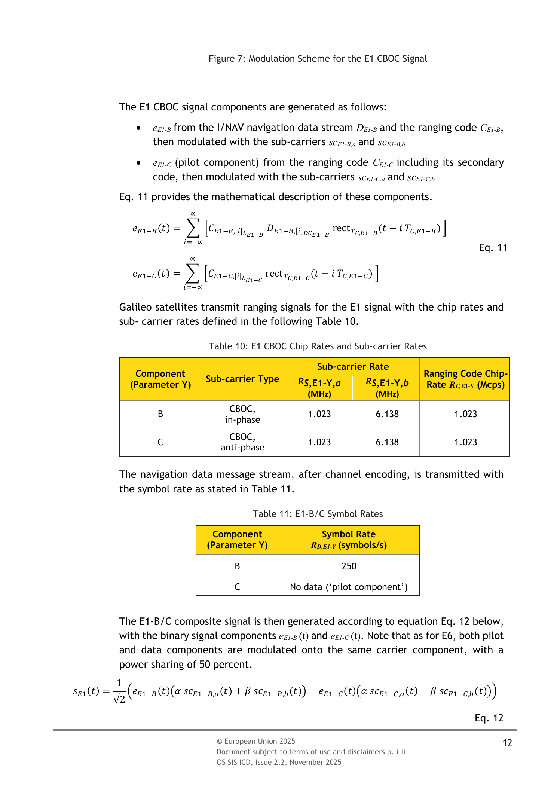
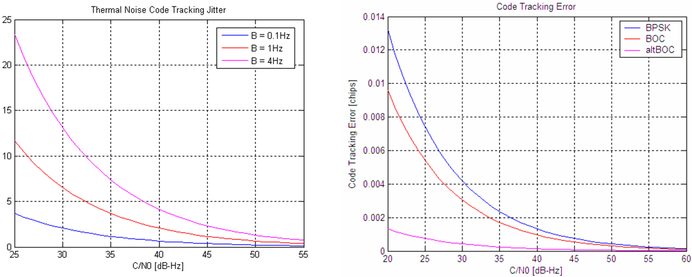
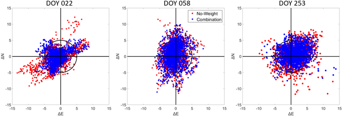

# 2026-07-20 GNSS 每日研究简报

## 今日快报

### 快报 1：Attention-GRU 在 GNSS 退化时生成伪观测

- 主题：`attention-gru-gnss-ins-degradation`
- 来源 ID：`doi:10.1093/comjnl/bxag067`
- 来源链接：https://doi.org/10.1093/comjnl/bxag067
- 发表日期：2026-07-17
- 来源类型：同行评审期刊论文
- 获取范围：出版商摘要与实验结果摘要；正文需订阅，以下数字均明确标为作者摘要报告

**内容：** 论文面向车辆安全测试中的遮挡与多路径，把 INS 序列送入带注意力门控的 GRU，在 GNSS 中断或受干扰时生成伪 GNSS 观测，再由 Kalman 滤波器与惯性状态融合。方法解决的不是“让神经网络直接输出最终轨迹”，而是给传统状态估计器补一个可切换的观测源；摘要称同时做了仿真、UrbanNav 公共数据和实车实验。

**结论：** 作者摘要报告，仿真中位置 RMSE 从传统 Kalman 滤波的 37.234 m 降到 2.672 m；UrbanNav 的中断与多路径场景分别得到 0.953 m 和 1.271 m RMSE，实车退化场景相对传统滤波误差下降超过 70%。由于未取得正文，无法核对中断长度、训练/测试划分、坐标维度与置信区间，不能把这些数字直接外推到其他 IMU、城市或退化模式。

**关注理由：** 这类“学习器产观测、滤波器管状态”的架构便于加入创新检验、协方差膨胀和回退逻辑。工程复现最应追问的是伪观测协方差如何标定，以及训练数据之外的长中断是否会把 INS 漂移包装成高置信度 GNSS。

### 快报 2：二维方位—高度角模型校准天线群时延变化

- 主题：`azimuth-dependent-antenna-group-delay`
- 来源 ID：`doi:10.1016/j.measurement.2026.122560`
- 来源链接：https://doi.org/10.1016/j.measurement.2026.122560
- 发表日期：2026-07-13
- 来源类型：期刊预出版稿（Journal Pre-proof）
- 获取范围：出版商摘要与 highlights；未取得全文，不引用未能核对的实验细节

**内容：** 群时延变化（GDV）作用在码观测上，既可能来自卫星端，也可能来自接收机天线。论文不再只把它写成高度角或天底角的一维函数，而是利用全球台站联合估计卫星端和接收机端的方位相关二维 GDV，再把二维改正送入 PPP。方法解决的是“一维天线模型把稳定的方位结构留在码残差里”的问题。

**结论：** 出版商摘要和 highlights 声称二维模型内部一致性达到厘米量级，并优于只依赖高度角的 PPP 模型；但当前获取范围不足以核对台站数量、频点、正则化、参考基准与显著性，因此本简报不复述百分比提升，也不把天线 GDV 与环境多路径视为已经完全分离。

**关注理由：** 对 PPP、时间传递和码偏差估计，厘米级系统项会在长时间平均后变得显眼。若接收机天线方位模型和站点遮挡图没有共同估计，二维图样很容易把安装环境“学进天线”，这正是复现时需要做天线旋转或换站交叉验证的地方。

### 快报 3：融合 Galileo HAS 与北斗 PPP-B2b 的轨钟产品

- 主题：`galileo-has-ppp-b2b-orbit-clock-fusion`
- 来源 ID：`doi:10.1016/j.asr.2026.04.026`
- 来源链接：https://doi.org/10.1016/j.asr.2026.04.026
- 发表日期：2026-07-15
- 来源类型：同行评审期刊论文
- 获取范围：出版商摘要与文章元数据；正文需订阅，未引用摘要之外的量化结果

**内容：** Galileo HAS 与北斗 PPP-B2b 都广播实时 PPP 改正，但支持星座、信号和参考口径不同。论文提出轨道与钟差组合策略，并在卫星端产品融合后建立多频、多 GNSS 的未组合 PPP（UC-PPP），用一条用户滤波链共同消费两个服务，而不是让两个独立定位解在坐标端再平均。

**结论：** 摘要支持“先统一轨钟产品、再进入多频未组合 PPP”的方法框架，却不足以判断跨服务偏差状态、产品龄期、故障隔离和服务中断时的收益。这里可确认的结论是：增加改正源必须同步处理参考系、时间基准、码/相位偏差与可用星集合，不能只把两组 SSR 数值拼接。

**关注理由：** 免费播发的全球/区域 PPP 服务正在变多，接收机的关键能力将从“能否解一个服务”转向“能否验证并组合多个服务”。低成本实现尤其需要记录每颗星的改正来源和 age-of-correction，避免服务切换在钟差或模糊度里留下不可见跳变。

### 快报 4：用 ADS-B 航迹一致性发现 GNSS 干扰事件

- 主题：`ads-b-track-consistency-gnss-rfi`
- 来源 ID：`arxiv:2607.09700`
- 来源链接：https://arxiv.org/abs/2607.09700
- 发表日期：2026-06-21
- 来源类型：完整预印本
- 获取范围：arXiv 全文，尚未经过期刊同行评审

**内容：** 论文把飞机视为移动 GNSS 传感器、众包 ADS-B 接收网视为广域观测网。三级流程先用恒加速度 Kalman 滤波筛出表观速度异常，再用同一飞机的局部样条航迹做留一残差检验以排除接收机时间戳错位，最后按当地交通密度自适应地聚类多机事件。数据为 2025 年 12 月至 2026 年 2 月东北亚 6.05 亿条 1090 MHz ADS-B 报文。

**结论：** 作者在 NOTAM RKRR Z1401/25 有效窗口内识别出 166 个事件簇，在前置对照期为 0；超过 99% 的确认异常仍处于较高 NIC/NACp 质量指标区间。全文证据支持“航迹自洽性补充机载质量字段”，但 NOTAM 的时间重合不是射频测向，不能单独证明每个事件的干扰源、类型或发射位置。

**关注理由：** 该方法不要求改装飞机，适合广域态势感知；同时它展示了一个重要完好性原则：设备自报质量可能滞后或失真，外部运动约束可形成独立交叉检查。部署时仍需保留原始接收时间、接收站 ID 和重复报文，才能控制众包网络自身的系统误差。

### 快报 5：路侧光纤振动为 GNSS 中断补连续位置

- 主题：`gnss-distributed-acoustic-sensing-fusion`
- 来源 ID：`doi:10.1109/icc59461.2026.11587254`
- 来源链接：https://doi.org/10.1109/ICC59461.2026.11587254
- 发表日期：2026-07-14
- 来源类型：IEEE ICC 2026 会议论文
- 获取范围：论文元数据与作者所在高校的公开项目说明；未取得 IEEE 正文，不引用未披露数值

**内容：** Joint DAS and GNSS（JDG）把既有路侧光纤当作分布式振动传感器：DAS 给出沿光纤的行人运动模式，GNSS 给出稀疏但有全球坐标基准的位置，两者进入深度学习模型。高校公开说明称，团队在英格兰南部同步记录步行者 GPS 与路侧光纤振动，并测试 GNSS 被遮挡、变噪或稀疏采样时的连续预测。

**结论：** 公开材料支持“真实光纤与 GPS 同步试验”和“在完全 GPS 中断时仍能延续预测”这两个定性陈述，但没有在可访问范围内给出数据规模、误差分位数、光纤覆盖外表现或独立测试划分。本简报因此把它视为有实测依据的架构验证，而不是已证明可普适部署的 GNSS 替代物。

**关注理由：** DAS 的位置只在已铺设、已标定的光纤走廊附近有意义，GNSS 则提供绝对坐标和走廊外覆盖；二者互补而非替代。下一步最关键的是处理多目标振动关联、光纤—地图标定漂移，以及 GNSS 恢复时如何无跳变地重新锚定。

## 深度研读

### 深读 1｜信号捕获｜从 Galileo E1 CBOC 结构决定捕获副本

- 类别：`acquisition`
- 学习层级：`foundation`
- 选题定位：`经典基础`
- 来源 ID：`eu:galileo-os-sis-icd-2.2`
- 来源链接：https://www.gsc-europa.eu/sites/default/files/sites/all/files/Galileo_OS_SIS_ICD_in_force.pdf
- 发表日期：2025-11
- 来源类型：欧盟 Galileo 在用接口控制文件（OS SIS ICD Issue 2.2）
- 获取范围：官方完整 PDF；允许信息、标准化、研发和商业用途，但复制必须遵守文件第 i—ii 页条款并保留版权声明
- 价值评分：94/100（相关性 20，经典价值 24，证据 20，教学价值 18，工程价值 12）

#### 为什么先学这个

捕获不是对“Galileo E1”这个名字做相关，而是对明确的数据/导频分量、主码、次码和副载波模型做匹配。副本少一个符号、把 CBOC 当成普通 BPSK，或在未知数据翻转上盲目延长相干积分，都可能让相关峰损失或分裂。先把 ICD 的信号生成图读成接收机中的本地副本，后续的 FFT、门限和细化才有物理对象。

#### 先修知识

E1-B 是承载 I/NAV 的数据分量，E1-C 是不承载导航数据的 pilot 分量；两者总功率按 50%/50% 分配。两者测距码速率均为 1.023 Mcps，主码长度均为 4092 chip，所以主码周期为 4 ms。E1-B 符号率为 250 symbol/s，恰好每 4 ms 一个符号；E1-C 还有长度 25 的次码，完整 tiered-code 周期为 100 ms。CBOC 同时使用 1.023 MHz 与 6.138 MHz 的副载波率。

#### 一句话逻辑

本地副本必须复制“码 × 数据/次码 × 两个加权副载波”的结构；捕获搜索只是在这个正确模板上估计码延迟和多普勒。

#### 研究问题与约束

问题是：如何从规范得到可复现的 E1-B/E1-C 捕获模板，并选择不跨未知符号或次码边界的积分长度。ICD 规定空中接口而不规定唯一接收机算法；它能证明信号结构、速率、功率分配和逻辑符号，不能证明某个 FFT 栅格或门限最优。实际前端还会引入带宽限制、采样相位、频率误差和模拟失真。

#### 核心方法论

对每颗候选卫星生成 4092-chip 主码，按采样率重采样；选择 E1-B 时乘未知数据符号假设，选择 E1-C 时可先只匹配 4 ms 主码并非相干合并多个周期，或在已搜索次码相位后做更长相干积分。每个多普勒格点先下变频，再用 FFT 实现循环相关，取二维相关功率最大值并与按假警率标定的门限比较。CBOC 副载波可做完整匹配，也可先用低复杂度近似捕获、再用完整模板确认；后一种需要实测近似损失。

#### 关键公式逐步推导

ICD 将两个二进制分量写成 E1-B 数据码乘积 $`e_B(t)`$ 与 E1-C pilot 码 $`e_C(t)`$。令低频和高频二进制副载波分别为 $`sc_a(t)`$ 与 $`sc_b(t)`$，权重为：

```math
\alpha=\sqrt{\frac{10}{11}},\qquad \beta=\sqrt{\frac{1}{11}}
```

省略分量下标后，E1 复合基带结构可按 ICD Eq. 12 写为：

```math
s_{E1}(t)=\frac{1}{\sqrt{2}}\left[e_B(t)(\alpha sc_{B,a}(t)+\beta sc_{B,b}(t))-e_C(t)(\alpha sc_{C,a}(t)-\beta sc_{C,b}(t))\right]
```

对选定分量的离散样本 $`x[n]`$ 和本地模板 $`c[n]`$，并行码相位搜索在多普勒格点 $`f_k`$ 上为：

```math
R_k[m]=\operatorname{IFFT}\left\{\operatorname{FFT}(x[n]e^{-j2\pi f_kn/f_s})\operatorname{FFT}(c[n])^*\right\}
```

检测统计量可取 $`T=\max_{k,m}|R_k[m]|^2`$。4 ms 相干积分的频率响应近似为 $`|sinc(\Delta f T_{coh})|`$；因此多普勒步长必须让最坏半格偏差的相关损失仍在预算内。这个公式是接收机设计推导，不是 ICD 的性能承诺。

#### 经典价值与创新边界

接口文件的经典价值是把发射端真值固定下来：E1-B/C 的码率、符号率、CBOC 权重与次码周期都可逐项测试。它不包含弱信号辅助、联合 B/C 捕获、BOC 歧义消除或机器学习检测器等算法创新。任何新算法若无法在官方模板、已知多普勒和无噪声输入上回收正确码相位，就还没有资格讨论复杂环境收益。

#### 整体逻辑链

卫星生成 E1-B 数据分量和 E1-C pilot 分量；两分量分别乘同相/反相 CBOC 副载波并等功率合成；前端滤波与采样得到 I/Q；捕获器选择分量和本地副本，在码相位—多普勒网格求相关；峰值过门限后把粗码相位、载波频率和分量类型交给跟踪器；跟踪器再利用 E1-C 次码或 E1-B 比特同步延长积分。链中任何“更长积分”都必须先解决符号边界。

#### 原文图表与结果分析



> 图源：European Union《Galileo Open Service Signal-In-Space Interface Control Document》Issue 2.2，PDF 印刷页 12，Figure 7、Table 10、Table 11 与 Eq. 11—12，[官方原文](https://www.gsc-europa.eu/sites/default/files/sites/all/files/Galileo_OS_SIS_ICD_in_force.pdf)。由官方 PDF 以 180 dpi 整页渲染，未裁切、未改动公式、表格、标签或版权行；转载与使用受原文第 i—ii 页条款约束。

图上半部的 Figure 7 从 E1-B 数据 $`D_{E1-B}`$ 和码 $`C_{E1-B}`$ 相乘开始，E1-C 支路只有码；两支路使用 CBOC 副载波后以 $`1/\sqrt2`$ 合成。Table 10 明确两支路码率均为 1.023 Mcps，两个副载波率为 1.023 MHz 与 6.138 MHz；Table 11 明确 E1-B 为 250 symbol/s、E1-C 无数据。图能证明模板结构与速率，不能证明某个接收机的捕获概率，因为没有给出噪声、前端带宽或门限。

#### 原文结果论述

官方规范给出的直接结果是：高频副载波两分量合计占 E1-B 与 E1-C 合计功率的 $`1/11`$，故 $`\alpha=\sqrt{10/11}`$、$`\beta=\sqrt{1/11}`$；E1-B 与 E1-C 等功率合成。结合主码表可得 4 ms 主码周期，结合 E1-C 的 25-chip 次码可得 100 ms 完整周期。本节工程推断是：冷启动可先用 4 ms 主码捕获，弱信号长相干需要把数据符号或次码相位显式纳入假设空间。

#### 常见误区与适用边界

第一，把 4092 chip 除以 1.023 Mcps 算成 1 ms。第二，E1-C 没导航数据就认为可以任意跨 4 ms 相干；次码仍会翻转。第三，用 BPSK(1) 副本却把所有损失归因于低 $`C/N_0`$。第四，将 BOC/CBOC 的多个相关峰都当成独立卫星。第五，联合 B/C 前忽略两支路的符号与副载波相位关系。第六，把规范的接收功率与自己的 ADC 功率直接对比，未计天线、滤波、AGC 和采样缩放。

#### 工程实现步骤

1. 从 ICD 电子附件读取目标 SVID 的 E1-B/E1-C 主码，验证首码片与长度。
2. 以 1.023 Mcps 码率和采样率生成 4 ms 本地码，并生成 1.023/6.138 MHz 两个副载波。
3. 分别实现完整 CBOC 与简化副本，先在无噪声、零多普勒下对齐峰位。
4. 搜索预期多普勒区间，记录频率步长、4 ms 相干时间、非相干次数与假警门限。
5. 对 E1-C 更长积分显式搜索或同步 25-chip 次码；E1-B 则处理 250 symbol/s 数据翻转。
6. 捕获后用完整模板在峰值附近细化，检查主峰歧义与错误锁定。

#### 复现实验设计

用 ICD 码生成 E1-B 和 E1-C 基带，采样率 12.276 Msps，注入多普勒 -5 kHz 到 +5 kHz、步长 125 Hz，码延迟均匀覆盖 0—4091 chip；$`C/N_0`$ 取 25—45 dB-Hz，每档 2000 次 Monte Carlo。比较完整 CBOC、只用低频副载波和错误 BPSK 模板；相干时间比较 4 ms、未同步的 8 ms、已同步次码后的 20/100 ms。固定假警率 $`10^{-3}`$，报告检测概率、码相位错误率、多普勒 RMSE、平均运算量和错误峰间隔。失败用例包括跨 E1-B 数据翻转、E1-C 次码翻转、半格多普勒与前端带宽不足。

#### 与定位及低成本实现的联系

捕获的多普勒和码相位误差会决定跟踪器初始拉入时间；错锁到 CBOC 旁峰则可能形成稳定但有偏的伪距。低成本芯片可以用简化模板降低 FFT 与存储，但必须把模板失配造成的检测损失、错峰率和再确认成本一起核算。E1-C pilot 允许数据擦除后的长积分，是低功耗周期唤醒和弱信号定位的重要入口。

#### 本节小结

Galileo E1 捕获的第一原则是复制正确的 CBOC 结构。官方 ICD 把 4 ms 主码、250 symbol/s 数据、25-chip E1-C 次码和两种副载波率锁定下来；FFT 只是高效计算相关，不能弥补错误模板。

### 深读 2｜信号跟踪｜DLL 的 Early/Late 间隔与带宽怎样换噪声

- 类别：`tracking`
- 学习层级：`intermediate`
- 选题定位：`基础进阶`
- 来源 ID：`navipedia:delay-lock-loop`
- 来源链接：https://gssc.esa.int/navipedia/index.php/Delay_Lock_Loop_%28DLL%29
- 发表日期：2011
- 来源类型：ESA/GMV Navipedia 技术条目
- 获取范围：公开全文与原始 GMV 图；页面未声明开放内容许可，按最小研究评论引用图 2
- 价值评分：92/100（相关性 20，经典价值 24，证据 18，教学价值 18，工程价值 12）

#### 为什么先学这个

捕获只给出一个粗码延迟，定位却需要每历元连续的码相位。DLL 用 Early、Prompt、Late 三组相关器把“峰在哪里”变成带符号的误差，再由环路滤波器控制码 NCO。它最重要的工程权衡不是某个固定鉴别器名字，而是 Early-Late 间隔、相干积分和环路带宽如何同时改变热噪声、动态跟随和多路径偏差。

#### 先修知识

令码片周期为 $`T_c`$，GPS L1 C/A 的码率 1.023 Mcps 对应 $`T_c\approx977.5`$ ns、一个 chip 的光程约 293.05 m。Early 与 Late 相对 Prompt 对称偏移，总间隔记为 $`\delta`$ chip。相关器输出有同相/正交分量 $`I_E,Q_E,I_P,Q_P,I_L,Q_L`$；包络 $`E=\sqrt{I_E^2+Q_E^2}`$、$`L=\sqrt{I_L^2+Q_L^2}`$ 对未知载波相位较稳健。

#### 一句话逻辑

Early 比 Late 大说明本地码峰偏向一侧，归一化差给出方向与大小；环路带宽决定相信这个噪声误差多快。

#### 研究问题与约束

目标是在载波环已足够稳定、相关峰附近工作时估计小码延迟误差。Navipedia 的热噪声表达式依赖前端双边带宽、信号功率谱、Early-Late 间隔、积分时间、$`C/N_0`$ 与环路噪声带宽。图 2 是教学曲线，不给仿真脚本；左图纵轴在原始位图中没有单位标签，因此只能可靠读取曲线次序和随 $`C/N_0`$ 的趋势，不能从左图声称具体米数。

#### 核心方法论

每个积分周期生成三个码副本并累积六个 I/Q 值。未可靠锁相时用非相干 Early-minus-Late 包络，锁相后可用点积鉴别器降低计算量。鉴别器输出经二阶或三阶环路滤波器形成码率/码相位校正。载波辅助可从多普勒预测码率，减少 DLL 必须追踪的动态，使较窄带宽成为可能；但载波失锁时要撤销或降权辅助。

#### 关键公式逐步推导

若真实码与本地 Prompt 的误差为 $`\tau_e`$、总 Early-Late 间隔为 $`\delta`$，忽略噪声时包络近似采样自相关函数：

```math
E\approx A\left|R_x\left(\tau_e-\frac{\delta}{2}\right)\right|,\qquad
L\approx A\left|R_x\left(\tau_e+\frac{\delta}{2}\right)\right|
```

归一化 Early-minus-Late 包络鉴别器为：

```math
D_{NEML}=\frac{1}{2}\frac{E-L}{E+L}
```

分母消除一阶幅度缩放，但在低 $`C/N_0`$ 时也会把随机小分母变成长尾误差，工程上要配合锁定检测与限幅。环路输出可抽象为：

```math
\hat\tau_{k+1}=\hat\tau_k+T\,\Delta\hat f_{code,k}+K_DF(z)D_{NEML,k}
```

其中 $`F(z)`$ 是环路滤波器，$`K_D`$ 把鉴别器单位映射为 chip。最终码测距扰动为：

```math
\Delta\rho=cT_c\Delta\tau_{chip}
```

对 C/A 码，0.01 chip 已约为 2.93 m；相关器级的小数码片抖动必须经过平滑、权值和多路径控制，才可能得到稳定伪距。

#### 经典价值与创新边界

Early/Late 零交叉是经典 DLL 的可解释基线：误差符号明确、计算量低、能在任意接收机上复现。窄相关器、double-delta、MEDLL、向量跟踪和学习型相关峰估计都在改善多路径或共享动态，但不能绕开热噪声—动态—偏差的三角权衡。Navipedia 图只展示理想热噪声趋势，不含真实城市多路径。

#### 整体逻辑链

捕获给出粗延迟；三个本地码副本形成 E/P/L 相关；鉴别器把不对称变成误差；环路滤波器在噪声与动态之间整形；NCO 改变下一周期码相位；累积码相位与发射时标形成伪距；伪距噪声进入定位权阵。载波辅助从 PLL/FLL 旁路到码 NCO，可减小动态应力，但也建立了故障传播路径。

#### 原文图表与结果分析



> 图源：GMV/Navipedia《Delay Lock Loop (DLL)》Figure 2，[原文页面](https://gssc.esa.int/navipedia/index.php/Delay_Lock_Loop_%28DLL%29)与[原始图文件](https://gssc.esa.int/navipedia/index.php?title=File:Dll_performance.png)。直接保存 1194×479 原图，未裁切或改动曲线、坐标、图例；页面未声明开放许可，按研究评论的最小必要范围引用。

两图横轴都是 $`C/N_0`$，单位 dB-Hz。左图比较环路噪声带宽 $`B=0.1、1、4`$ Hz：同一 $`C/N_0`$ 下带宽越宽曲线越高，说明放进环路的热噪声更多；但原图左纵轴无单位，只能读相对关系。右图纵轴明确为 code tracking error，单位 chip；在相同 $`C/N_0`$ 下，图示 AltBOC 曲线最低、BOC 次之、BPSK 最高，反映更宽有效频谱和更尖相关峰的热噪声优势。图没有多路径、动态或前端带宽曲线，不能证明 AltBOC 在窄带低成本前端里必然保持同样排序。

#### 原文结果论述

原文把 DLL 主要误差分为热噪声与动态应力，并指出载波辅助可显著降低后者；较低环路带宽和较长积分能降低热噪声。直接读右图，在约 30 dB-Hz 附近三种调制仍有明显分离，随 $`C/N_0`$ 增高都趋近零。本文工程推断是：先用实测相关器斜率把图中 chip 抖动映射到本机，而不是从教学曲线抄一个固定伪距方差。

#### 常见误区与适用边界

第一，认为越窄带宽总是越好，忽略加速度、振荡器和载波辅助错误。第二，缩小 Early-Late 间隔却不检查前端带宽是否保留相关峰高频成分。第三，用归一化鉴别器后认为振幅噪声完全消失。第四，把热噪声抖动当成总码误差，多路径和 NLOS 可产生更大偏差。第五，载波失锁后仍强制 carrier aiding。第六，把图左纵轴自行解释成 m 或 chip。第七，在 E/P/L 任一相关器饱和时仍使用线性 S 曲线标定。

#### 工程实现步骤

1. 在捕获峰附近生成 $`\delta=1.0、0.5、0.2、0.1`$ chip 的 E/P/L 副本。
2. 用无噪声扫延迟标定每种间隔的 S 曲线、线性区和鉴别器增益。
3. 在已知 $`C/N_0`$ 的 I/Q 上测鉴别器方差，禁止只套教科书常数。
4. 实现 0.2、1、4 Hz 等效噪声带宽并记录动态阶跃响应。
5. 加入载波多普勒辅助；PLL/FLL 失锁时切换到独立码率模型并膨胀方差。
6. 输出 E/P/L、鉴别器、锁定标志、码率与饱和标志，供定位端质量控制。

#### 复现实验设计

生成 GPS L1 C/A 和 Galileo E1 pilot 两类信号，采样率 12.276 Msps，前端双边带宽取 2.046、4.092、12 MHz；$`C/N_0`$ 25—50 dB-Hz，每档运行 300 s。比较 $`\delta=1.0、0.5、0.2、0.1`$ chip、带宽 0.2/1/4 Hz 和 1/4/10 ms 积分；基线为 0.5-chip、1 Hz DLL。分别注入 1 g 加速度对应的码动态、0.2-chip 单径反射和 PLL 失锁。报告码误差 RMS/95 分位、环路失锁率、阶跃稳态时间、伪距 m 误差与 CPU 开销。失败条件是归一化分母过小、错锁旁峰或载波辅助故障传播。

#### 与定位及低成本实现的联系

DLL 抖动直接进入码伪距，但定位端不应只看接收机报告的 $`C/N_0`$；Early-Late 不对称、鉴别器长尾和锁定状态都能提供额外权值信息。低成本前端常带宽较窄，理论上的窄相关器或宽带调制优势会被滤波削弱。更稳妥的策略是让跟踪器输出可观测质量量，再由 SPP/PPP 按历元动态加权。

#### 本节小结

DLL 用相关峰两侧的差把码延迟变成闭环误差。较窄带宽降低热噪声，却牺牲动态；较小 Early-Late 间隔可能减轻部分多路径，却依赖足够前端带宽。图中趋势是设计起点，不是本机伪距方差表。

### 深读 3｜定位｜把码残差与 C/N0 合成手机 SPP 权值

- 类别：`positioning`
- 学习层级：`advanced`
- 选题定位：`定位深入`
- 来源 ID：`doi:10.11003/jpnt.2025.14.1.11`
- 来源链接：https://doi.org/10.11003/JPNT.2025.14.1.11
- 发表日期：2025-03-15
- 来源类型：开放获取同行评审期刊论文
- 获取范围：完整 PDF 与 HTML，CC BY-NC 4.0
- 价值评分：93/100（相关性 20，经典价值 22，证据 19，教学价值 18，工程价值 14）

#### 为什么先学这个

上一节说明跟踪器怎样产生码误差；定位器下一步必须决定每条伪距可信多少。传统高程角或单一 $`C/N_0`$ 权值对手机并不总可靠，因为线极化小天线、机身姿态和多路径会让高仰角信号也很差。该文把 5 s 滑窗二次曲线残差作为“观测自身是否平滑”的指标，再与 $`C/N_0`$ 合成权值，正好连接相关器质量与 SPP 最小二乘。

#### 先修知识

SPP 用至少四颗卫星的码伪距估计接收机三维坐标和钟差。权阵 $`W`$ 通常是观测协方差 $`R`$ 的逆；权值越大，观测对解的影响越强。$`C/N_0`$ 衡量载波功率与噪声谱密度比，单位 dB-Hz，却不能直接识别所有 NLOS 偏差。Code-minus-carrier 可分析码噪声，但手机载波不连续，因此论文改用只依赖码观测的局部曲线残差。

#### 一句话逻辑

$`C/N_0`$ 告诉定位器“信号看起来多强”，短窗码残差告诉它“这条观测最近是否自洽”，两者相乘比单一指标更能抑制突发坏码。

#### 研究问题与约束

论文使用 Samsung Galaxy S21+，训练/特性数据在 2024-09-01 采 30 min，验证数据来自同一地点的 DOY 022、058、253 三个 30 min 时段；GPS L1 与 Galileo E1，参考坐标由 RTAP2U 与 VRS 得到。三个测试同地点、同机型，经验参数也用该环境标定，因此证据支持场内静态手机 SPP，不足以证明跨机型、手持姿态、高动态或城市峡谷泛化。

#### 核心方法论

对每颗卫星独立维护 5 s 滑窗，以二次多项式拟合最近伪距变化，用窗口末端观测减拟合值形成残差。把 $`C/N_0`$ 和残差分别经指数映射为 0—1 范围的质量权值，最终相乘，放入迭代加权最小二乘。这样坏观测必须同时通过“强度”和“短时自洽”两道门；但卫星运动、接收机钟跳或高动态若未建模，也可能被残差误判为噪声。

#### 关键公式逐步推导

线性化第 $`i`$ 条码伪距：

```math
v_i=P_i-\hat P_i\approx \boldsymbol h_i\Delta\boldsymbol x+\epsilon_i,
\qquad \Delta\boldsymbol x=[\Delta x,\Delta y,\Delta z,c\Delta t_r]^T
```

堆叠后，加权最小二乘更新为：

```math
\Delta\hat{\boldsymbol x}=(H^TWH)^{-1}H^TW\boldsymbol v
```

对每星最近 5 个 1 Hz 样本拟合 $`q(t)=a_0+a_1t+a_2t^2`$，末端残差 $`r=P(t_k)-q(t_k)`$。论文给出的指数映射可整理为随信号强度增大的权值与随残差绝对值衰减的权值：

```math
w_{C/N_0}=\exp(\alpha c\,C/N_0),\qquad
w_r=\exp(-b|r|),\qquad w=w_{C/N_0}w_r
```

原文经验参数为 $`\alpha=0.1`$、$`b=0.004`$、$`c=0.11`$，并把权值缩放到 0—1。实现时缩放不改变同一历元 WLS 的相对解，但会影响滤波器的绝对协方差解释，不能把归一化权值直接当成物理方差。

#### 经典价值与创新边界

WLS 是经典 SPP；创新在于用仅码观测的短窗曲线残差补充 $`C/N_0`$，避开手机载波频繁断裂。它不是多路径显式估计，也没有利用建筑地图、原始相关器或学习模型。二次曲线能吸收短时平滑几何与钟差，却无法区分持续 NLOS 偏差和真实平滑运动；若偏差稳定，残差可能很小而仍然错误。

#### 整体逻辑链

天线与环境决定信号强度和多路径；DLL 产生伪距；5 s 滑窗检查每星伪距的短时自洽；$`C/N_0`$ 与残差映射成权值；WLS 用几何矩阵传播到位置和钟差；残差重新计算直至收敛；位置误差再由独立 VRS 参考评估。这个闭环必须防止用当前解的后验残差反复把模型偏差掩盖掉。

#### 原文图表与结果分析



> 图源：Lee 等《Development of a Weighting Model Based on C/N0 and Code Pseudorange Residuals for Smartphone GNSS Positioning》Figure 10，[开放全文](https://doi.org/10.11003/JPNT.2025.14.1.11)，CC BY-NC 4.0。直接保存期刊网页提供的 680×231 原图，未裁切、重绘或改动散点、坐标和图例。

三个子图横轴 $`\Delta E`$、纵轴 $`\Delta N`$，原文说明单位为 m；红点是不加权，蓝点是组合权值，黑色椭圆表示散布轮廓。DOY 022 蓝点明显收紧且大幅减少左下长尾；DOY 058 红蓝高度重叠，说明该日边际收益较小；DOY 253 蓝点总体收紧但仍有右下异常点。图能直接显示精度分布变化，不能单独解释异常来自哪颗卫星，也没有时间顺序和置信区间。

#### 原文结果论述

Table 2 报告组合权值的水平 RMSE：DOY 022 从 5.84 m 降到 3.50 m，DOY 058 从 4.10 m 降到 3.67 m，DOY 253 从 6.06 m 降到 4.04 m；对应相对改善 40.1%、10.5%、33.3%。三维 RMSE 分别从 11.26、8.48、13.91 m 降到 7.43、7.01、10.39 m。原文也显示高程角权值在 DOY 058 的水平 RMSE 反而为 4.33 m，差于不加权 4.10 m，说明“传统权值一定有益”并不成立。

#### 常见误区与适用边界

第一，把拟合残差小等同于无多路径；稳定 NLOS 可同时平滑且有偏。第二，在高动态中仍用 5 s 二次曲线而不加入多普勒或运动模型。第三，跨机型直接复用 $`\alpha,b,c`$。第四，把同地点三天验证称作地理泛化。第五，只报告 RMSE，不报告 95 分位、可用率和坏历元持续时间。第六，让权值趋近零后仍把病态几何的协方差当可靠。第七，用后验定位残差训练同一历元权值造成信息循环。

#### 工程实现步骤

1. 按星座—卫星—频点维护独立 5 s 伪距窗口，周跳不是必需条件，但钟跳和缺测必须切窗。
2. 先改正卫星钟、相对论、地球自转、电离层和对流层，再对平滑剩余量拟合，避免把已知模型塞进权值。
3. 用 QR/SVD 做二次拟合，记录窗口条件数和末端残差。
4. 按机型、频点标定 $`C/N_0`$ 与残差尺度，限制最小/最大权值。
5. 在 WLS 前检查加权几何矩阵条件数；必要时恢复部分观测而不是全部置零。
6. 同时输出不加权、高程角、$`C/N_0`$、组合四条解，支持在线消融。
7. 用标准化创新和独立参考评估权值是否校准，而不只看坐标散点。

#### 复现实验设计

选择三款不同芯片手机和一台测地接收机，在开阔、树荫、城市峡谷各做静态 60 min 与步行 20 min，采样 1 Hz。基线为不加权、高程角权值和论文 $`C/N_0`$ 权值；实验组比较 3/5/10 s 一次、二次拟合，以及加入多普勒预测的残差。先在一台手机/一个地点标定参数，再冻结参数跨设备、跨地点测试。报告水平/垂直/三维 RMSE、50/95/99 分位、加权 GDOP、无解率、标准化残差一致性与每历元有效星数。失败用例包括稳定 NLOS、接收机钟跳、高速转弯和 5 s 内少于 4 个有效样本。

#### 与定位及低成本实现的联系

该方法只需要手机原始码与 $`C/N_0`$，不依赖双频或外部地图，适合低成本 SPP 的第一层稳健化。更高阶的 PPP/RTK 仍可复用残差质量状态，但必须为载波、码、频点分别建权，且不能让码残差权值直接控制模糊度。最佳接口是跟踪器输出相关器质量，定位器再把信号强度、短时残差和几何共同转成可校准协方差。

#### 本节小结

手机 SPP 的权值不应只由高程角决定。论文的 5 s 二次曲线残差与 $`C/N_0`$ 组合，在同机同址三天数据上把水平 RMSE 改善 10.5%—40.1%；收益真实但范围有限，跨设备和动态场景必须重新验证。
