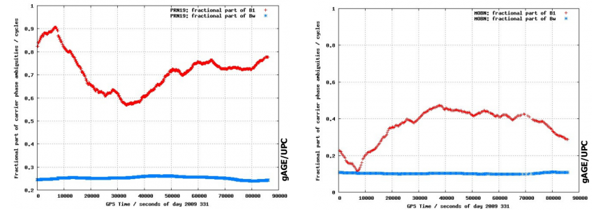
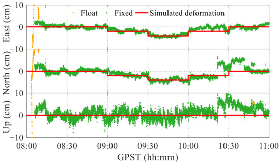
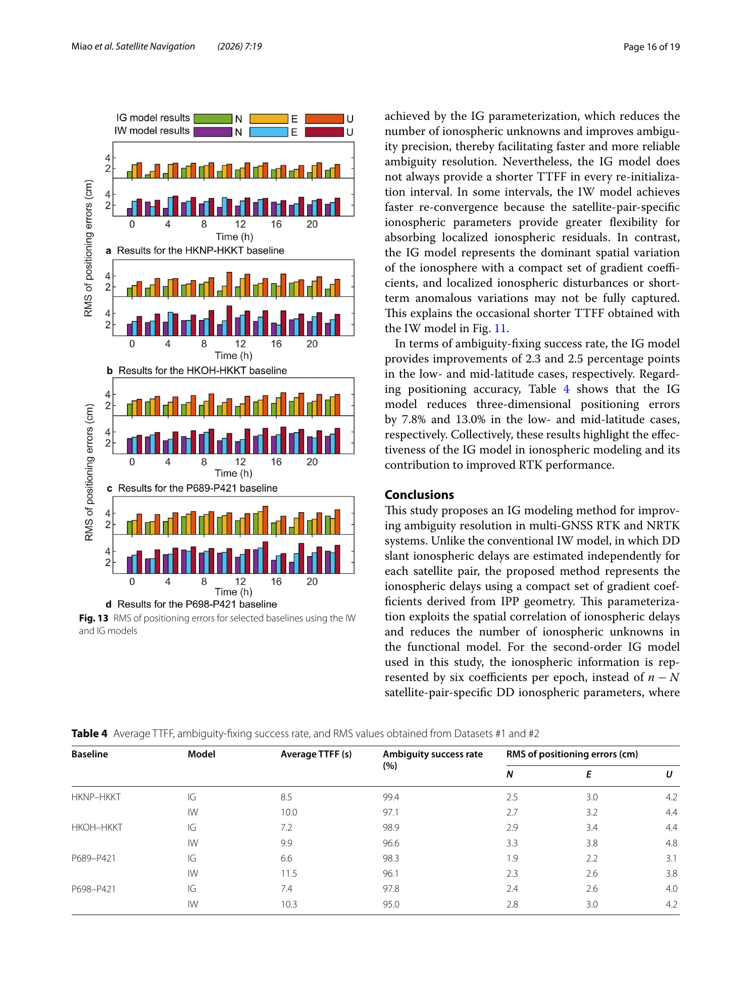

# 2026-07-21 GNSS 每日研究简报

## 今日快报

### 快报 1：格陵兰 71 站 GNSS 基岩位移资料形成开放长序列

- 主题：`greenland-gnet-bedrock-displacement-dataset`
- 来源 ID：`doi:10.5194/essd-18-5117-2026`
- 来源链接：https://doi.org/10.5194/essd-18-5117-2026
- 发表日期：2026-07-20
- 来源类型：同行评审开放数据论文
- 获取范围：开放全文、处理说明、代码与逐站数据 DOI；CC BY 4.0

**内容：** GNET 团队整理了 1995—2025 年格陵兰基岩连续 GNSS 数据和每日 PPP 坐标序列，并对 71 个台站的数据回传率、噪声谱与稳定性进行统一评估。处理链在 ENU 序列中拟合线性趋势、年周期和半年周期，显式处理硬件变更引起的不连续，再以残差功率谱指数区分白噪声、闪烁噪声和随机游走倾向。

**结论：** 原文显示，全网三个坐标分量的谱指数中位数落在分数高斯噪声范围；把每日解降采样为月均、年均会让速度趋势不确定度最高增加约一个数量级，短于约 5 年的序列也更容易成为趋势误差离群点。这说明“平均得更稀”并不自动等于长期速度估得更准。

**关注理由：** 该资料同时开放 RINEX、坐标、处理配置和质量分析代码，适合检验 PPP 长序列中的断点、季节项、彩色噪声与速度置信区间。对低成本连续站而言，它也提供了一个反例：数据完整率、时间跨度和噪声模型往往比单日坐标散布更决定长期监测能力。

### 快报 2：GNSS 反演陆地水储量并非网格越细越好

- 主题：`gnss-terrestrial-water-storage-slepian-green-function`
- 来源 ID：`doi:10.3390/rs18142392`
- 来源链接：https://doi.org/10.3390/rs18142392
- 发表日期：2026-07-18
- 来源类型：同行评审开放期刊论文
- 获取范围：开放全文与图表；CC BY 4.0

**内容：** 研究用 2010 年 9 月至 2024 年 9 月的 2839 个 GNSS 台站垂向位移，以 Green 函数（GF）和 Slepian 基函数（SBF）在 1°、0.5°、0.25° 网格反演美国本土及加拿大南部陆地水储量变化，再对 13 个流域与 GRACE/GRACE-FO mascon 产品比较。GF 保留较强局地变化，SBF 通过空间限域基函数提供更平滑的约束。

**结论：** 原文报告，GNSS 与 GRACE 的流域相关系数跨案例为 -0.37 至 0.92，RMSE 为 3.40—15.08 cm 等效水高；多数流域从 1°细化到 0.25°后相关性下降。Columbia 流域在 1°时 GF/SBF 相关系数为 0.92/0.88，到 0.25°降为 0.86/0.82，说明有效分辨率由台站密度、信号相干性和正则化共同决定，不是由输出格网名义尺寸决定。

**关注理由：** GNSS 形变反演是典型病态问题：更细状态向量会增加自由度，也会放大观测空洞和噪声。这个结论可迁移到电离层网格、网络 RTK 大气参数和城市误差图建模——报告分辨率时必须同时给分辨率矩阵、台站覆盖和正则化敏感性。

### 快报 3：SDR 试验台把“还能定位”与“定位可信”分开

- 主题：`sdr-gnss-receiver-jamming-spoofing-reacquisition`
- 来源 ID：`doi:10.3390/s26144551`
- 来源链接：https://doi.org/10.3390/s26144551
- 发表日期：2026-07-17
- 来源类型：同行评审开放期刊论文
- 获取范围：出版商元数据与作者摘要；全文下载受站点访问限制，以下不引用摘要之外的实验细节

**内容：** 作者用软件无线电构建可重复实验室链路，为五类商用接收机生成 GPS L1、Galileo E1 及窄带压制、静态欺骗和动态欺骗场景。评价量不只看坐标误差，还跟踪首次定位时间、攻击阶段是否持续出解以及攻击结束后的重新捕获时间，从而把接收机状态机纳入抗扰测试。

**结论：** 作者摘要报告，压制干扰通常使定位立即中断，而欺骗可能让接收机保持连续出解却输出持续错误；多频接收机在扩展场景中更多表现为延迟接受欺骗，而非完全拒绝欺骗。由于未取得全文，本简报不复述各机型概率和时间数字，也不能判断这些结果在真实天线、动态信道或不同固件上是否保持。

**关注理由：** “fix 仍为有效”不是完好性证据。接收机测试应同时记录 AGC、相关峰、创新、钟差、星座一致性和恢复轨迹，并在完全相同的 RF 回放下重复多次；否则一次成功恢复可能只是状态机随机路径，而不是可依赖的防护能力。

### 快报 4：低成本 Galileo HAS 开始进入动态形变监测验证

- 主题：`galileo-has-low-cost-dynamic-deformation-monitoring`
- 来源 ID：`doi:10.1007/s10291-026-02127-4`
- 来源链接：https://doi.org/10.1007/s10291-026-02127-4
- 发表日期：2026-07-10
- 来源类型：同行评审期刊论文
- 获取范围：作者机构公开书目与完整摘要；出版商正文访问受限，量化结果仅按作者摘要范围解释

**内容：** 论文把低成本 Galileo HAS 解与高成本 RTK、低成本 RTK、低成本实时 PPP 并排放到单轴振动台上，试验覆盖正弦运动、1989 Loma Prieta 与 1995 Kobe 强震波形回放，以及永久阶跃位移。LVDT 作为独立高精度参考，避免用另一条 GNSS 解互相认证。

**结论：** 作者摘要支持的边界是：HAS 能检出谐波主频，并在地震回放中比低成本实时 PPP 更一致，但误差仍大于 RTK；对永久位移，部分阶跃可被检出，较大位移的误差反而可能增大。正文不可访问，无法核对每段收敛状态、HAS 改正龄期和频域窗函数，因此不能把摘要结果直接转成工程告警阈值。

**关注理由：** 结构监测关心的是动态增量、延迟和断点，而不只是静态 PPP 的最终坐标。HAS 若要用于地震或桥梁监测，必须把未收敛期、改正中断、天线相位中心与参考传感器同步写进质量标志，不能把连续坐标流等同于连续可观测形变。

### 快报 5：多因子排序替代“按单一高度角删模糊度”

- 主题：`entropy-weighted-partial-ambiguity-resolution-ppp`
- 来源 ID：`doi:10.3390/s26144388`
- 来源链接：https://doi.org/10.3390/s26144388
- 发表日期：2026-07-10
- 来源类型：同行评审开放期刊论文
- 获取范围：出版商元数据、许可与作者摘要；未取得可核对版式的全文，不引用摘要之外数字

**内容：** MPAR 面向多 GNSS、多频未差未组合 PPP 的高维整数搜索，把信噪比、浮点模糊度方差和载波残差先做 min-max 归一化，再用信息熵自适应确定三项权重。候选模糊度按综合分数分成易固定和难固定集合；首次失败后继续迭代剔除差候选，而不是全体一次失败就退回浮点解。

**结论：** 作者摘要称，该法在 MGEX 全球站的三、四、五频配置上维持较高固定率，并改善宽巷/窄巷残差与收敛；但摘要不足以核查训练式阈值是否跨日稳定、熵权重在指标强相关时是否重复计数，以及固定解正确率是否由外部真值验证。本简报因此只确认“多证据排序加迭代子集”的方法贡献，不宣称其普遍优于所有 PAR 策略。

**关注理由：** 部分固定的关键不是留下多少整数，而是留下的集合是否仍有足够几何强度且错误固定风险受控。工程实现应把综合分数、被剔除原因、ratio/成功率检验和固定后残差一起输出，避免算法只优化 fix rate 而隐藏 false fix。

## 深度研读

### 深读 1｜接收机工程｜载波模糊度什么时候才真是整数

- 类别：`receiver-engineering`
- 学习层级：`foundation`
- 选题定位：`经典基础`
- 来源 ID：`navipedia:carrier-phase-ambiguity-fixing`
- 来源链接：https://gssc.esa.int/navipedia/index.php?title=Carrier_Phase_Ambiguity_Fixing
- 发表日期：2011
- 来源类型：ESA/GMV Navipedia 技术条目
- 获取范围：公开全文与原始低分辨率图；页面未声明开放内容许可，图仅作最小研究评论并保留原标识
- 价值评分：92/100（相关性 20，经典价值 24，证据 18，教学价值 18，工程价值 12）

#### 为什么先学这个

载波相位的毫米级精度常被简化成“求一个整数 `N`”，但接收机实际输出还含卫星端和接收机端的分数周硬件偏差。若没有通过双差消掉这些偏差，或没有用相位钟/相位偏差产品改正它们，直接把未差模糊度四舍五入为整数就是模型错误。先分清“整数物理量”和“可整数估计的参数”，才谈得上 LAMBDA、ratio test 与 RTK 固定。

#### 先修知识

以米为单位的载波观测包含几何距离、钟差、对流层、电离层相位超前、硬件延迟、整周模糊度、相位缠绕、多路径和噪声。GPS L1 波长约 0.1903 m，单周错误就是约 19 cm。单差在两个接收机间消卫星钟，双差再在两颗卫星间消接收机钟；只有各端硬件偏差能按“只依赖接收机”与“只依赖卫星”分离时，双差剩余模糊度才保持整数。

#### 一句话逻辑

模糊度的整数性不是相位观测天然交付的标签，而是经过一致的差分或偏差校准后，由观测模型保留下来的结构。

#### 研究问题与约束

Navipedia 条目讨论双差和未差两条固定路径。它能说明硬件分数偏差如何消除或广播，也展示某日卫星/接收机偏差的稳定性；但页面不是完好性规范，没有给出所有接收机、频点和温度条件下的偏差统计，更不能替代具体数据集上的固定失败率验证。

#### 核心方法论

双差路径把两个接收机、两颗卫星的相位组合起来，使接收机端和卫星端公共分数偏差相消，再在整数格点上搜索。未差 PPP-AR 路径则由参考网估计卫星相位偏差并广播，用户吸收自己的公共接收机偏差后恢复整数性。两条路径都先求浮点解与协方差，再做整数最小二乘和独立验证；“最近整数”只在一维、低相关的特殊情况下成立。

#### 关键公式逐步推导

将某接收机 `r` 对卫星 `s` 的模糊度项写成：

```math
B_r^s=\lambda N_r^s+b_r+b^s
```

其中 $`N_r^s\in\mathbb Z`$，$`b_r`$ 与 $`b^s`$ 是接收机端、卫星端分数相位偏差。对接收机 `r,r_0` 和卫星 `s,s_0` 做双差：

```math
\Delta\nabla B_r^s=B_r^s-B_{r_0}^s-(B_r^{s_0}-B_{r_0}^{s_0})
=\lambda\Delta\nabla N_r^s
```

$`b_r,b_{r_0},b^s,b^{s_0}`$ 成对消失，整数结构得以恢复。若浮点双差模糊度为 $`\hat{\mathbf a}`$、协方差为 $`Q_{\hat a}`$，整数最小二乘搜索是：

```math
\check{\mathbf a}=\arg\min_{\mathbf z\in\mathbb Z^n}
(\hat{\mathbf a}-\mathbf z)^TQ_{\hat a}^{-1}(\hat{\mathbf a}-\mathbf z)
```

这是本文根据加权最小二乘写出的工程形式；Navipedia 直接支持的是偏差分解与双差消除关系，不承诺某一验证门限。

#### 经典价值与创新边界

该条目的经典价值是把“为什么双差模糊度为整数”和“为什么 PPP-AR 需要卫星相位偏差”放在同一框架。现代多频组合、整数钟、可观性分析和部分模糊度固定继续扩展这套框架，但没有取消偏差一致性条件。任何声称无需改正即可固定未差原始相位的算法，都应先说明分数硬件偏差去了哪里。

#### 整体逻辑链

接收机跟踪载波并累计相位；失锁前未知整周保持常数；硬件链给相位加入端点相关分数偏差；差分或网络偏差产品恢复整数结构；浮点滤波给出模糊度均值和协方差；整数搜索产生候选；验证器控制错误固定；正确整数回代后，载波才成为无整周歧义的高精度距离约束。

#### 原文图表与结果分析



> 图源：Sanz Subirana、Juan Zornoza 与 Hernández-Pajares《Carrier Phase Ambiguity Fixing》Figure 1，[Navipedia 原文](https://gssc.esa.int/navipedia/index.php?title=Carrier_Phase_Ambiguity_Fixing)；原图注明来自 Juan et al. (2010) ESA PRTODTS 报告。下载页面提供的两幅 400 px 原图后仅按原页面语义并排，加 16 px 白色间隔；未裁切、重绘或改动坐标、曲线、图例和 UPC 标识。页面未声明开放许可，按最小研究评论引用，不主张再分发权。

两图横轴都是 2009 年第 331 日的 GPS 秒-of-day，范围约 0—90000 s；纵轴是载波相位模糊度分数部分，单位 cycle。左图 PRN19 的短巷/B1 红线约在 0.57—0.90 cycle 间缓慢变化，而宽巷蓝线约在 0.24—0.27 cycle；右图 MOBN 的红线约在 0.10—0.46 cycle，蓝线约在 0.08—0.11 cycle。图直接显示偏差随时间缓慢而非严格常数，也显示短巷与宽巷尺度不同；它不能证明任一用户能正确固定，因为未给浮点协方差、卫星几何或验证统计。

#### 原文结果论述

原文指出，双差会消去接收机端与卫星端分数偏差，保留整数周；未差固定则可由全球网估计相位偏差，用户只需获得卫星端改正。图中的宽巷分数偏差比短巷更平稳，支持先固定宽巷、再帮助窄巷的思路。本文从图上读取的数值只用于描述量级，不等于产品精度；缓慢变化也不代表可以跨设备重启或信号切换沿用旧偏差。

#### 常见误区与适用边界

第一，把载波“高精度”误写成“无偏”。第二，对未差模糊度直接 round。第三，双差后仍混用不同信号、不同接收机固件的偏差口径。第四，把 ratio 大等同于正确固定，忽略随机模型过于乐观。第五，参考星切换后不做整数参数变换。第六，周跳后继续保持旧整数。第七，把图中一天的平稳性外推到温漂、重启和硬件更换。

#### 工程实现步骤

1. 为每个“接收机—卫星—信号—连续弧”建立相位状态，失锁或时钟中断即切弧。
2. 明确选用双差 RTK 或未差 PPP-AR；不要在同一状态中混用两种偏差口径。
3. 构造浮点解和完整协方差，检查秩、参考星与频间偏差状态。
4. 用 LAMBDA 类整数最小二乘搜索候选，不逐维独立取整。
5. 结合 ratio、模型成功率、固定后残差和时间一致性做验证。
6. 固定回代后继续监测创新；参考星变化时做等价整数变换，而非清空或硬接。

#### 复现实验设计

生成 8 颗 GPS L1 卫星、两台接收机的 30 min、1 Hz 码相位数据，基线设 5、20、50 km；码噪声标准差 0.5 m、相位噪声 0.005 m，给每颗星和每台接收机注入 0—1 cycle 的缓慢分数偏差，并在第 900 s 注入 1 周周跳。比较三条链：未差直接取整、双差加 LAMBDA、未差加已知卫星偏差产品。每种基线与噪声档做 1000 次 Monte Carlo，报告整数成功率、错误固定率、ratio 分布、水平/垂直 RMS 和周跳后恢复时间。失败用例包括偏差产品滞后、参考星切换、协方差缩小一半和漏检周跳。

#### 与定位及低成本实现的联系

低成本硬件的相位噪声、频间偏差和重启更频繁，使“整数结构成立多久”比搜索速度更关键。RTK 可用短基线双差削弱端点偏差，PPP-AR 则依赖一致的外部相位产品；手机还需要按信号切弧和部分固定。先保证模型整数性，再优化搜索器，通常比提高一个 ratio 阈值更有效。

#### 本节小结

整周 $`N`$ 是整数，不代表接收机输出的未差模糊度参数天然可取整。双差通过消除端点分数偏差恢复整数性，PPP-AR 通过外部相位偏差产品实现同一目标；固定算法必须建立在这个可观测结构之上。

### 深读 2｜低成本与移动端｜手机 RTK 为什么要按频点定权并只固定好模糊度

- 类别：`low-cost-mobile`
- 学习层级：`intermediate`
- 选题定位：`基础进阶`
- 来源 ID：`doi:10.3390/app12010435`
- 来源链接：https://doi.org/10.3390/app12010435
- 发表日期：2022-01-03
- 来源类型：开放获取期刊论文
- 获取范围：开放全文与原始图；CC BY 4.0
- 价值评分：93/100（相关性 20，经典价值 22，证据 19，教学价值 18，工程价值 14）

#### 为什么先学这个

上一节说明了整数性条件，本节进入低成本数据：即使双差模型正确，手机 L5/E5a 的低 $`C/N_0`$、频繁周跳和小天线多路径仍会把浮点模糊度协方差拉长。把所有模糊度一次性固定，最差的一颗星就可能让整个集合失败；沿用测地接收机的统一高度角权值，也可能错误地高估第二频点。手机 RTK 要同时解决“观测如何定权”和“哪些整数值得固定”。

#### 先修知识

短基线双差可大幅消除轨钟和共同大气误差，剩余主要是几何、整数模糊度、多路径与测量噪声。$`C/N_0`$ 以 dB-Hz 表示信号强度相对噪声密度；同一高度角上，小型线极化天线的不同频点仍可能有完全不同的噪声。部分模糊度固定（PAR）只固定质量较好的子集，再利用浮点坐标与模糊度的相关性更新位置。

#### 一句话逻辑

先用频点感知的 $`C/N_0`$ 模型把协方差写实，再从低方差、连续弧中选择整数子集，才有机会把手机的“多星多频”变成增益而非搜索负担。

#### 研究问题与约束

论文使用 Xiaomi Mi 8、约 5 m 基线、屋顶开阔环境和 1 Hz 数据，重点验证内置天线的短基线后处理式 RTK 与模拟形变。结果代表该手机、Android 9、当天星座和静态竖直放置；fix-and-hold 还会引入时间相关约束。它不能证明运动手机、城市峡谷或其他芯片能保持同样固定率，更不能把后处理结果等同于有延迟和丢包的实时服务。

#### 核心方法论

先按频点统计 $`C/N_0`$ 与周跳，L1/G1/B1/E1 和 L5/E5a 使用不同的最大 $`C/N_0`$ 标尺；联合 loss-of-lock、Doppler、码相组合与双频几何无关组合检测周跳。浮点滤波后先尝试全部候选；若验证失败，逐次剔除方差最大的模糊度，直到 ratio 通过或剩余少于四个。作者还把高 ratio 的固定解作为强约束保持，但明确展示周跳仍会导致阶段性坐标偏移。

#### 关键公式逐步推导

用 $`\mathbf b`$ 表示基线、$`\mathbf a`$ 表示浮点模糊度，联合协方差写成：

```math
Q=
\begin{bmatrix}
Q_{bb} & Q_{ba}\\
Q_{ab} & Q_{aa}
\end{bmatrix}
```

选出子集 $`\mathbf a_F`$ 并固定为整数 $`\check{\mathbf a}_F`$ 后，条件更新为：

```math
\check{\mathbf b}=\hat{\mathbf b}-Q_{b a_F}Q_{a_Fa_F}^{-1}
(\hat{\mathbf a}_F-\check{\mathbf a}_F)
```

观测权值满足 $`w_i=1/\sigma_i^2`$。本文把作者的频点分组思想抽象为 $`\sigma_i^2=g_b(C/N_{0,i})`$，其中每个频段 `b` 有自己的单调下降函数和标尺；这不是对原文公式的逐字符转录。双差噪声方差则按四个原始观测传播：

```math
\sigma_{\Delta\nabla}^2=\sigma_{r,s}^2+\sigma_{r_0,s}^2+
\sigma_{r,s_0}^2+\sigma_{r_0,s_0}^2
```

因此手机端一条弱频点会真实进入候选协方差，而不是被“已经双差”掩盖。

#### 经典价值与创新边界

按 $`C/N_0`$ 定权和 PAR 都不是新概念，论文价值在于把二者针对手机频点差异组合起来，并用内置天线数据展示“增加第二频点反而降低固定率”的机制。它没有解决动态姿态下的天线相位中心、空间相关多路径、错误固定完好性或跨机型参数迁移；fix-and-hold 也不能替代周跳检测。

#### 整体逻辑链

手机天线决定各频点 $`C/N_0`$；跟踪与省电决定连续弧；质量控制为每条观测生成方差；双差形成短基线观测；滤波输出基线和相关浮点模糊度；PAR 剔除差候选并做整数搜索；验证通过后回代得到厘米级坐标；周跳或错误保持会把固定偏差直接写进形变序列，因此输出端仍需持续残差与断点监测。

#### 原文图表与结果分析



> 图源：Zeng、Kuang 与 Yu《Evaluation of Real-Time Kinematic Positioning and Deformation Monitoring Using Xiaomi Mi 8 Smartphone》Figure 15，[开放原文](https://doi.org/10.3390/app12010435)，CC BY 4.0。直接保存出版商提供的 550 px 原图，未裁切、重采样、重绘或改动点、坐标、图例和标签。

横轴为 GPS 时间 08:00—11:00；三行纵轴为 East、North、Up，单位 cm，约 -10 至 10 cm。红线是每 30 min 设置的模拟形变，东、北方向含 2 cm 级阶跃；绿色为 fixed，橙色为 float。08:30—10:00 绿色总体跟随水平阶跃，但 10:00 后北向出现数厘米偏移，上向散布长期显著大于水平。图能证明这次静态平台试验中的趋势可见和周跳后偏移，不能证明毫米级监测，也不能证明每个绿色历元都是正确整数。

#### 原文结果论述

作者报告第一频点的信号多集中在约 40 dB-Hz，L5/E5a 多在约 30 dB-Hz；L5/E5a 周跳比例明显更高。GPS+Galileo+BDS 单频组合且不固定 BDS 模糊度时，3 h 固定率约 90%，正确固定后水平/垂直可达约 1/2 cm，但收敛通常需 10—30 min。形变试验固定率为 96.2%，可识别 2 cm 趋势；作者同时明确指出 10:00 附近周跳造成偏移，且当前条件不足以支持实际毫米级监测。

#### 常见误区与适用边界

第一，认为 L5 码多路径较小就必然有更好相位连续性。第二，所有频点共用一个 $`C/N_0`$ 标尺。第三，星数越多就全部进入固定集合。第四，只报告固定率，不报告错误固定率和首次正确固定时间。第五，fix-and-hold 后关闭创新检查。第六，把绿色 fixed 标签当作真值。第七，用静态竖直手机结果外推动姿态。第八，忽略参考站与手机观测噪声共同进入双差协方差。

#### 工程实现步骤

1. 按星座—卫星—频点维护 $`C/N_0`$、连续弧、周跳原因和残差统计。
2. 用实测数据分别标定 L1/E1 与 L5/E5a 的方差映射，禁止复制测地机默认值。
3. 联合 loss-of-lock、Doppler、码相、几何无关组合切弧，并给新弧设 warm-up。
4. 先求完整浮点协方差，再按方差、$`C/N_0`$、弧长和几何影响排序候选。
5. 迭代 PAR 时记录每次剔除项；ratio 通过后再检验固定后残差和坐标跳变。
6. 只有高置信固定才进入 hold；任何强周跳或时钟中断立即解除。
7. 同时输出 float/fixed、候选数、固定集合、ratio、错误告警和收敛年龄。

#### 复现实验设计

共址架设测地参考站和三款双频手机，基线 5 m，开阔静态竖直放置，各采 3 h、1 Hz；再做 30 min 手持缓慢旋转。比较高度角权、统一 $`C/N_0`$ 权、频点分组权，以及 FAR、按方差 PAR、按“方差+$`C/N_0`$+弧长”PAR。统一用 10°截止角，测试 L1/E1 与 L5/E5a 不同阈值，并注入 1/5 周跳和 10 s 数据缺口。报告首次正确固定时间、固定/错误固定率、95 分位 ENU 误差、周跳恢复时间、有效固定集合大小和动态姿态退化；以共址测地解和人工注入真值判定，不用接收机 fix 标志自证。

#### 与定位及低成本实现的联系

手机不是“精度稍差的测地接收机”，其频点质量、天线方向图和连续性机制都不同。频点感知定权使协方差接近真实，PAR 防止最差观测拖垮整数集合；这两步既能服务 RTK，也能用于 PPP-AR。若硬件无法保持载波弧，可靠回退到 float/SPP 比维持一个错误厘米解更有价值。

#### 本节小结

手机 RTK 的瓶颈不是整数算法名称，而是观测方差和连续性是否写实。原文证明了分频点 $`C/N_0`$ 定权、周跳控制与部分固定可提升内置天线 RTK，但也用 2 cm 形变图清楚暴露了周跳、垂向噪声和长收敛边界。

### 深读 3｜定位｜用六个电离层梯度系数加速中长基线 RTK

- 类别：`positioning`
- 学习层级：`advanced`
- 选题定位：`定位深入`
- 来源 ID：`doi:10.1186/s43020-026-00207-x`
- 来源链接：https://doi.org/10.1186/s43020-026-00207-x
- 发表日期：2026-07-15
- 来源类型：同行评审开放期刊论文
- 获取范围：开放全文、原始图表与公开台站数据说明；CC BY 4.0
- 价值评分：95/100（相关性 20，经典价值 23，证据 20，教学价值 18，工程价值 14）

#### 为什么先学这个

短基线可近似消掉双差电离层，中长基线则不能。传统 ionosphere-weighted（IW）模型为每个星对各估一个斜电离层参数，灵活却随卫星数膨胀，削弱浮点模糊度精度。前两节已建立整数性和低成本候选控制，本节进一步问：能否用 IPP 空间相关性把电离层从“每星一个未知数”压缩成少量区域系数，从而更快得到可验证整数。

#### 先修知识

IPP 是卫星视线与单层电离层壳的交点；VTEC 经映射函数变成斜 TEC，电离层延迟与 $`1/f^2`$ 成正比。RTK 双差对每个星座选一颗参考星，若总卫星数为 `n`、星座数为 `N`，独立双差星对有 $`n-N`$ 个。IW 模型逐星对估计斜电离层，IG 模型则用区域 VTEC 的一阶、二阶空间梯度共同解释多个 IPP。

#### 一句话逻辑

把多个星对共享的电离层空间结构压成六个系数，可减少弱可观参数、收紧窄巷浮点模糊度并缩短 TTFF；代价是局地非线性扰动可能超出梯度模型。

#### 研究问题与约束

论文验证 2025 年 DOY 121—128 的 10 个低纬和中纬台站，采样 30 s，截止高度角 10°；这段时间 Kp 主要低于 5，属低到中等地磁活动。结论适用于所选台站几何、广播星历、GIM 约束与二阶模型，不能直接覆盖强磁暴、稀疏网络、极区或公里尺度局地电离层结构。作者也明确承认个别重初始化区间 IW 反而更快。

#### 核心方法论

采用高度 506.7 km 的单层壳，把每条视线映射到 IPP。在参考点附近以纬度差、经度差做二阶 VTEC 展开，状态含常数项、两个一阶梯度、两个纯二阶项和一个混合项，共六个系数。RTK/NRTK 滤波中用它替代 $`n-N`$ 个逐星对电离层参数；剩余低高度角残差仍可作为附加约束处理。整数链先固定 EWL/WL，再用其导出的电离层信息更新 NL，最后以 LAMBDA、ratio、模型成功率和 FFRT 验证。

#### 关键公式逐步推导

频率 $`f_1`$ 上某 IPP 的斜电离层延迟写成：

```math
I_r^s=\frac{40.308}{f_1^2}M(E_r^s)
V(\phi_{P,r}^s,\lambda_{P,r}^s;t)
```

在参考点 `C` 周围令 $`\Delta\phi=\phi_{IPP}-\phi_C`$、$`\Delta\lambda=\lambda_{IPP}-\lambda_C`$，二阶展开为：

```math
V=V_C+\Delta\phi g_\phi+\Delta\lambda g_\lambda
+\frac{1}{2}\Delta\phi^2g_{\phi\phi}
+\frac{1}{2}\Delta\lambda^2g_{\lambda\lambda}
+\Delta\phi\Delta\lambda g_{\phi\lambda}+R
```

把所有双差星对堆叠，可写成 $`\boldsymbol\iota=H\mathbf h`$，其中：

```math
\mathbf h=[V_C,g_\phi,g_\lambda,g_{\phi\phi},
g_{\lambda\lambda},g_{\phi\lambda}]^T
```

于是每历元电离层状态从 $`n-N`$ 个降为 6 个；当 16 颗星、2 个星座时由 14 降为 6。残差 $`R`$ 是模型边界：强局地结构若不能被二阶面表示，会偏置浮点模糊度，而不是凭空消失。

#### 经典价值与创新边界

用低阶多项式描述区域电离层并非新思想，创新在于把 IPP 几何驱动的二阶梯度模型直接嵌入多 GNSS RTK/NRTK 可解性与多频 IAR 链，并与逐星 IW 状态做同数据比较。它提高的是函数模型强度，不是新的整数搜索器；也没有证明固定解在强磁暴下仍安全，后者需要自适应模型阶次和更保守验证。

#### 整体逻辑链

参考站/流动站形成多频双差；视线映射到 IPP；区域 VTEC 六参数解释共同空间变化；Kalman 滤波联合估坐标、对流层、梯度和模糊度；较少电离层未知数收紧 NL 协方差；EWL/WL/NL 分级固定与验证；NRTK 服务端把紧凑大气信息播给用户；用户得到更快 TTFF。若残差显示高度角或方位相关结构，系统应降权、升阶或回退 IW，而不是强行固定。

#### 原文图表与结果分析



> 图源：Miao 等《Ionospheric gradient modeling for fast ambiguity resolution in multi-GNSS RTK and NRTK》，PDF Page 16，Figure 13 与 Table 4，[开放原文](https://doi.org/10.1186/s43020-026-00207-x)，CC BY 4.0。由出版商 PDF 以 180 dpi 整页渲染，未裁切、重绘或改动图例、坐标、表格和正文。

Figure 13 的横轴为小时 `Time (h)`，纵轴是 N/E/U 定位 RMS，单位 cm；每条基线分别对比 IG（绿/黄/橙）与 IW（紫/蓝/红）。多数时段 IG 三分量柱低于 IW，但差距随基线和时段变化。Table 4 给四条基线的平均 TTFF、固定成功率和 N/E/U RMS：例如 P689—P421 上 IG/IW 的 TTFF 为 6.6/11.5 s，成功率 98.3%/96.1%，RMS 为 1.9/2.2/3.1 cm 对 2.3/2.6/3.8 cm。整页同时保留作者关于局地异常可能让 IW 更快的限制，避免只截取有利数字。

#### 原文结果论述

作者汇总称，IG 的双差电离层建模残差平均标准差小于 4 cm；NRTK 的 NL 浮点模糊度精度改善 12.1%，平均收敛从 26.4 s 降到 9.9 s，固定成功率从 95.6% 升到 98.2%。RTK 平均 TTFF 从 10.4 s 降到 7.4 s，固定成功率从 96.2% 升到 98.6%，N/E/U RMS 从 2.8/3.2/4.3 cm 改善到 2.4/2.8/3.9 cm。以上均是选定低/中纬、低至中等地磁活动数据上的作者结果，不是服务保证。

#### 常见误区与适用边界

第一，把单层壳高度当成真实电子密度峰值。第二，以为六参数对任何网络都比逐星参数好。第三，只比较平均 TTFF，隐藏个别 IW 更快区间。第四，GIM 约束与区域观测使用不同码偏差口径。第五，星座参考星切换后不更新 `H`。第六，将低高度角系统残差塞进模糊度。第七，用 fix rate 代替正确固定概率。第八，把 Kp<5 的结果外推到强磁暴。

#### 工程实现步骤

1. 统一广播星历、频率、码相偏差和时间系统，按星座选择稳定参考星。
2. 以 506.7 km 单层壳计算每条视线 IPP 与映射函数，并对坐标单位做测试。
3. 构造六参数 $`H`$ 矩阵，检查 IPP 几何导致的条件数与秩。
4. 与 IW 支路并行滤波；对梯度系数设白噪声或随机游走，并记录 GIM 约束口径。
5. 先做 EWL/WL，再以改进的电离层状态更新 NL；固定必须通过 ratio、成功率和 FFRT。
6. 逐高度角/方位监测 IG 残差；结构化残差触发升阶、局部参数或 IW 回退。
7. NRTK 播发时记录参考点、模型阶次、有效区、更新时间和协方差，避免只播六个裸系数。

#### 复现实验设计

按原文取 Hong Kong 低纬 HKKT/HKWS/HKNP/HKOH 与 NGS 中纬 P421/P702/P689/P692/P693/P698，使用 2025 DOY 121—128、30 s 采样、10°截止角；相位/码天顶标准差设 3 mm/0.3 m，薄壳 506.7 km。并行跑 ionosphere-fixed、IW、一次 IG、二次 IG 四支路，每 2 h 重初始化。报告每基线 TTFF、正确固定/错误固定率、N/E/U RMS、NL 残差、$`H`$ 条件数和按高度角的电离层残差；再选择一段 Kp≥5 数据或注入局地高斯 TEC 异常，验证二次 IG 何时应回退 IW。固定真值用长弧后处理一致解与闭合检验交叉判定。

#### 与定位及低成本实现的联系

紧凑梯度模型减少网络服务端状态和播发量，也能让低成本用户更快拿到可用 NL 模糊度；但用户天线多路径不会被区域电离层模型消除。实际系统应把网络大气质量与用户观测质量分层：服务端给模型和协方差，终端仍做频点定权、PAR 和本地完好性检查。两层都可靠，TTFF 缩短才不会交换成错误固定风险。

#### 本节小结

二阶 IG 用六个 IPP 梯度系数代替逐星对电离层状态，在所测低/中纬数据上同时改善 NL 精度、TTFF、固定成功率和厘米级 RMS。它的收益来自更强的共享空间模型，边界也正是该共享假设：局地、强烈、非线性的电离层必须由残差触发自适应或回退。
