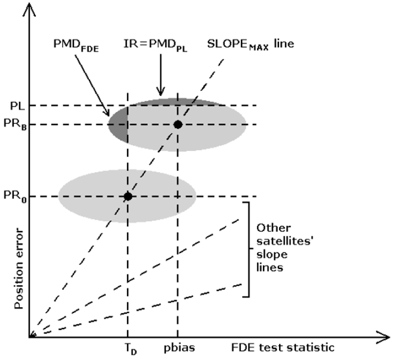
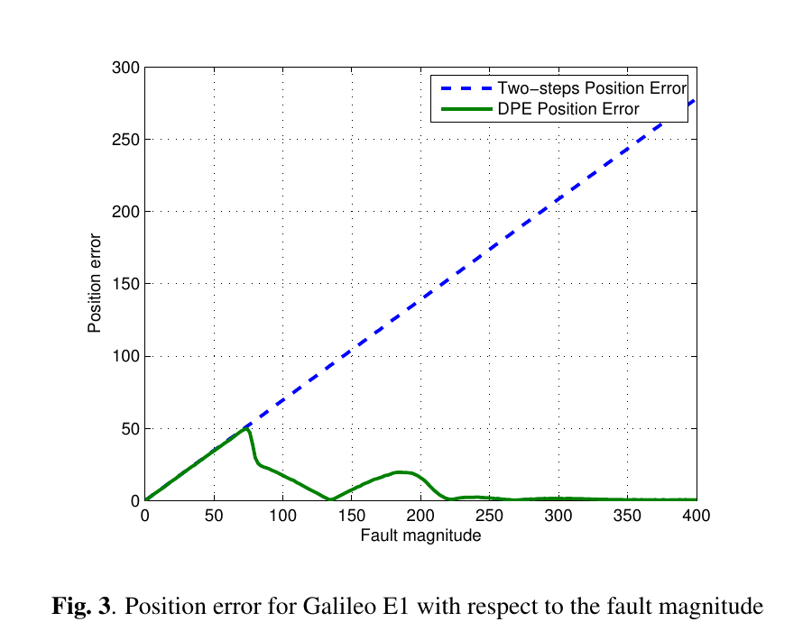
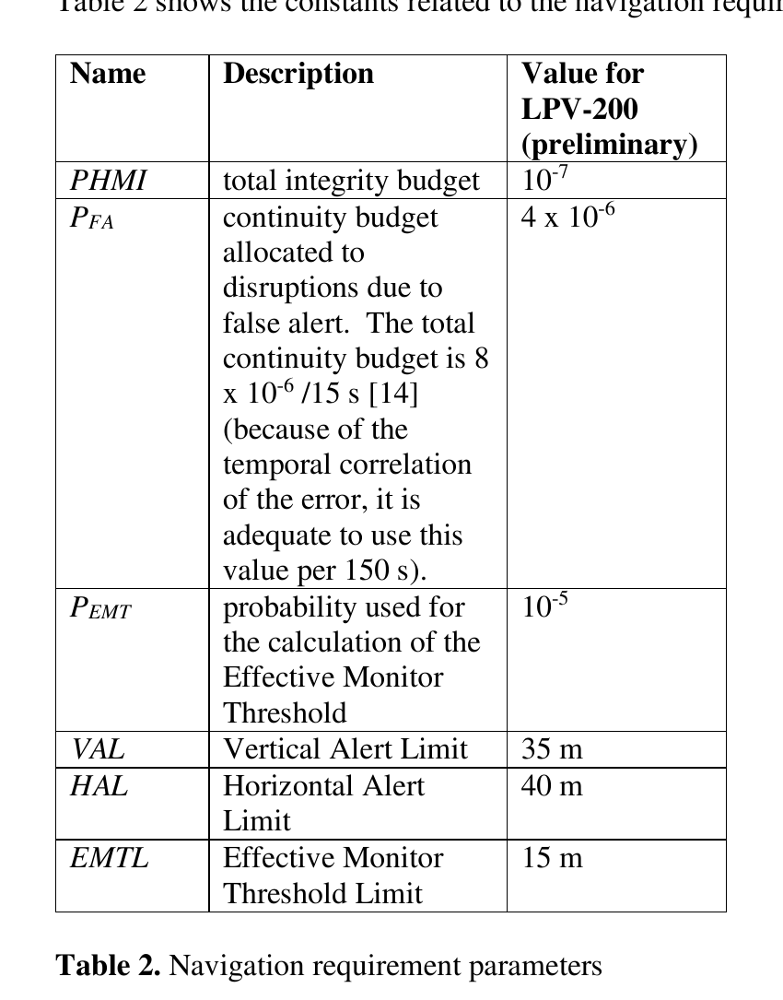

# 2026-07-22 GNSS 每日研究简报

## 今日快报

### 快报 1：随机森林同时权衡低仰角噪声与卫星几何

- 主题：`adaptive-elevation-mask-random-forest-static-gnss`
- 来源 ID：`doi:10.33003/fjs-2026-1011-5371`
- 来源链接：https://doi.org/10.33003/fjs-2026-1011-5371
- 发表日期：2026-07-17
- 来源类型：同行评审开放期刊论文
- 获取范围：开放全文与表格；CC BY 4.0

**内容：** 研究在尼日利亚 Yola 的开阔场地用双频接收机采集 12 h、5 s 间隔的静态数据，共 8640 个历元；先分别采用 0°、5°、10°、15°、20°、25°高度截止角处理，再以仰角、方位角、SNR、伪距残差、载波残差和 PDOP 训练 100 棵树的随机森林，80% 数据训练、20% 测试。它解决的不是“找一个永远正确的截止角”，而是在拒绝低仰角坏观测与维持可用卫星几何之间作数据驱动选择。

**结论：** 原文表 1—3 显示，传统处理的 RMSE 从 0°时 2.85 cm 降到 15°时 1.95 cm，25°又回升到 2.44 cm；随机森林预处理在 15°得到 1.30 cm RMSE，相对同角度传统处理改善 33.33%。但这些数值来自单站、开阔、长时静态试验，标签还直接使用 SNR、残差与坐标稳定性规则；它证明的是该数据集上的筛选收益，不是跨站点的通用最优角。

**关注理由：** 高度角掩码本质上同时改变随机模型和几何矩阵。工程上应把“被删观测的质量增益”与“卫星数、GDOP 和解的可用率损失”一起报告，并用独立日期、不同天线和遮挡场景外推；否则分类器可能只是学习了这 12 h 的场地特征。

### 快报 2：ANFIS 用载体坐标系误差补偿 60 s GNSS 中断

- 主题：`anfis-body-frame-mins-gnss-outage-prediction`
- 来源 ID：`doi:10.3390/electronics15143117`
- 来源链接：https://doi.org/10.3390/electronics15143117
- 发表日期：2026-07-15
- 来源类型：同行评审开放期刊论文
- 获取范围：开放全文、图表与实验说明；CC BY 4.0

**内容：** 论文针对低成本 MINS/GNSS 在失锁期间的惯导漂移，把 GNSS 不可用时长、加速度计数据和陀螺仪数据输入自适应神经模糊推理系统，以载体坐标系位置误差为输出；后件参数用最小二乘求解，前件参数用遗传算法搜索。实车链路使用 ADIS16470 MEMS IMU，CGI-610 集成导航系统的 RTK 输出作参考，并在行驶数据中人工选取 9 个、每段 60 s 的 GNSS 中断区间。

**结论：** 原文表 2 与结论报告：相对不做预测的 KF 链，所提方法在 6 个中断段把最大水平误差降低约 80%，另 3 段降低 31%、47% 和 35%；训练耗时在其实现中约 10—19 s。这里的“80%”是作者对 9 个指定路段的最大误差比较，不是所有失锁方向、车速和时间长度的置信下界；人工挑段和遗传算法随机性也限制了泛化解释。

**关注理由：** 载体坐标系输出能减轻转弯时东西/南北误差模式随航向旋转的问题，但它没有消除 IMU 偏置不可观。部署时应冻结参数做跨路线验证，并同时保留纯惯导、RBF、旧 ANFIS 与新模型，按中断时长、转弯率和温度分层报告误差尾部。

### 快报 3：列车定位把磁场序列从时间域重采样到空间域

- 主题：`train-gnss-ins-magnetic-spatial-sequence-matching`
- 来源 ID：`doi:10.1088/1361-6501/ae8c6e`
- 来源链接：https://doi.org/10.1088/1361-6501/ae8c6e
- 发表日期：2026-07-17
- 来源类型：同行评审期刊论文
- 获取范围：出版商元数据与作者摘要；正文访问受限，以下不复述摘要之外的量化结果

**内容：** 作者面向隧道、深谷和林冠下的列车连续定位，用高频 INS 速度把按时间采样的磁场序列重采样到沿轨空间坐标，再用局部尺度补偿修正惯导里程积分误差；通过置信度门控把磁匹配更新紧耦合进 EKF。方法针对传统时间序列磁匹配在速度变化时“同一空间纹理被拉伸或压缩”的问题。

**结论：** 作者摘要称，实车柴油机车线路试验中，空间序列匹配能抑制轨迹振荡，并在稀疏磁地图下保持连续定位能力。由于未取得全文，本文不引用摘要给出的线路长度、RMSE 和地图间隔数字，也无法核查磁传感器安装、重复运行间环境变化、基准轨迹精度与失锁段分布。

**关注理由：** 铁路的一维拓扑为磁匹配提供了强约束，但动态磁干扰可能来自牵引电流、车辆编组和设备温度。工程验证必须跨车次、跨季节留出测试，并把“匹配得分高但位置错误”的相似纹理区段作为专门失败用例。

### 快报 4：多中心精密产品评估开始把相位偏差纳入同一质量链

- 主题：`multi-gnss-precise-products-phase-bias-consistency`
- 来源 ID：`doi:10.1088/1361-6501/ae6a0e`
- 来源链接：https://doi.org/10.1088/1361-6501/ae6a0e
- 发表日期：2026-07-17
- 来源类型：同行评审期刊论文
- 获取范围：出版商元数据与作者摘要；正文访问受限，以下不引用摘要之外数字

**内容：** 研究把 CODE、GFZ、武汉大学和 CNES 的多 GNSS 轨道、钟差与相位偏差放在一个一致性框架中比较，同时用 Allan 偏差观察钟稳定性，并以不同系统、产品时效和定位模式检验产品进入用户解后的表现。它补足了只比较轨道与钟、却没有检验相位偏差是否足以支撑模糊度固定的缺口。

**结论：** 作者摘要支持的结论是：不同分析中心、星座和实时性档位并不存在一个处处最优的产品；GPS/Galileo 与 BDS/GLONASS 的一致性表现不同，相位偏差的可用信号覆盖也会限制模糊度解算。正文不可访问，本文不复述摘要中的厘米、分米或通过率数字，亦不把产品间一致性等同于对独立真值的绝对准确度。

**关注理由：** PPP/PPP-AR 不能只检查 SP3 轨道和 CLK 钟差。产品切换、信号偏差口径、整数钟定义和相位偏差缺测必须作为一个原子版本管理；否则轨钟看似连续，模糊度却可能因偏差基准变化而整体失去整数性。

### 快报 5：多任务网络联合高率 GNSS 与强震记录估计震源

- 主题：`high-rate-gnss-strong-motion-multitask-earthquake-source`
- 来源 ID：`doi:10.1785/0220260049`
- 来源链接：https://doi.org/10.1785/0220260049
- 发表日期：2026-07-16
- 来源类型：同行评审期刊论文
- 获取范围：出版商元数据与作者摘要；正文访问受限，量化结论不超出摘要范围且本简报不复述其数字

**内容：** MPMSE 用并行编码器处理高率 GNSS 位移波形和强震速度记录，加入台站几何条件，并把震级—破裂尺度经验关系作为先验；网络联合输出震级、破裂面积、最大滑移和空间滑移分布。方法试图把 GNSS 的长周期、非饱和位移约束与强震仪的高频动态信息放进同一多任务估计器。

**结论：** 作者摘要称，合成地震与日本俯冲带、2024 花莲地震案例支持其快速恢复主要震源特征，并强调尺度先验提升了多源结果的一致性。由于未取得全文，本文不引用摘要中的时间窗、误差与方差削减数值，也不能核对合成样本分布、真实事件是否进入调参过程、台站缺失敏感性和不确定度校准。

**关注理由：** 灾后快速反演最危险的不是平均误差，而是超出训练震级、破裂几何或台网覆盖后的自信错误。实用系统需要输出与震级、滑移场一起校准的置信区间，并在 GNSS 单源、强震单源、无尺度先验和台站掉线条件下做消融。

## 深度研读

### 深读 1｜接收机工程｜RAIM 保护级为什么不是残差阈值乘一个常数

- 类别：`receiver-engineering`
- 学习层级：`foundation`
- 选题定位：`经典基础`
- 来源 ID：`navipedia:raim-fundamentals`
- 来源链接：https://gssc.esa.int/navipedia/index.php/RAIM_Fundamentals
- 发表日期：2011
- 来源类型：ESA/GMV Navipedia 技术条目
- 获取范围：公开全文与原始示意图；页面未声明开放内容许可，图仅作最小研究评论并保留原标注
- 价值评分：92/100（相关性 20，经典价值 24，证据 17，教学价值 19，工程价值 12）

#### 为什么先学这个

定位误差小不等于定位可信。RAIM 要回答的是：在给定无故障噪声模型、卫星几何和故障假设下，未告警而位置误差超过界限的概率能否受控。若只把残差检验写成“残差低于阈值就安全”，就遗漏了误差从伪距投影到位置的几何放大，也遗漏了无故障噪声可能把一个真实故障部分抵消的漏检尾部。

#### 先修知识

伪距最小二乘把观测残差投影到位置与接收机钟差。至少 4 颗卫星只能解状态，没有冗余；经典快照 RAIM 的故障检测通常至少需要第 5 颗卫星，隔离还需要更多冗余。完整性风险、连续性、可用性和准确度是不同指标：保护级 PL 是用户算法给出的误差上界，告警限 AL 是具体运行允许的最大误差；只有检验通过且 $`PL<AL`$ 时，该运行才可用。

#### 一句话逻辑

RAIM 用残差判断观测是否自洽，再把“可能漏过的故障偏差”与“无故障噪声尾部”经最坏卫星几何一起映射成保护级。

#### 研究问题与约束

Navipedia 条目解释经典单故障 RAIM 中检测统计量、最大斜率和保护级的几何关系，并指出可推广到 K 个故障。它是教学示意，不是认证算法规范：页面没有给出某一接收机的具体随机模型、故障先验或实时实现，也不能证明高斯、零均值和最多单故障的假设在城市多路径或欺骗场景成立。

#### 核心方法论

对线性化伪距 $`\mathbf y=G\mathbf x+\boldsymbol\epsilon+\mathbf f`$，全视最小二乘给位置，残差投影矩阵把状态可解释部分去掉，剩余量构成检测统计量。每颗卫星的单独偏差在“检测统计量—位置误差”平面上对应一条斜率线；最大斜率卫星最难监测。先根据误警率设置检测阈值，再沿最大斜率加入满足漏检概率的故障偏差余量，最后加上无故障位置误差分布的尾部，得到 PL。

#### 关键公式逐步推导

加权最小二乘与残差分别为：

```math
\hat{\mathbf x}=(G^TWG)^{-1}G^TW\mathbf y,
\qquad
\mathbf r=\left[I-G(G^TWG)^{-1}G^TW\right]\mathbf y
```

若用标量检测统计量 $`T=\|W^{1/2}\mathbf r\|`$，无故障时按目标误警率 $`P_{FA}`$ 选择阈值 $`T_D`$。对卫星 `i` 的偏差，定义位置分量误差相对检测统计量的斜率 $`S_i`$；经典最坏情形取 $`S_{max}=\max_i S_i`$。教学化的保护级可写成：

```math
PL \approx S_{max}(T_D+p_{bias})+K_{IR}\sigma_{pos}
```

其中 $`p_{bias}`$ 控制故障存在时仍未触发检测的概率，$`K_{IR}\sigma_{pos}`$ 覆盖无故障噪声尾部。该式是根据原图整理的结构表达，不是对任何认证标准公式的替代；实际实现需按所选统计量和风险分配求分位数。

#### 经典价值与创新边界

最大斜率图把两个容易混淆的问题拆开：检测阈值约束误警，保护级约束危险误导信息。它说明“同样 1 m 伪距偏差”会因几何和残差可见性不同而产生不同完整性风险。边界是单故障、线性化与已知无故障统计；多星相关多路径、星座共模钟轨错误和模型外欺骗都不能靠这张图自动覆盖。

#### 整体逻辑链

接收机形成伪距与方差；定位器计算全视解；残差监测器用冗余量检验一致性；故障到位置与残差的映射决定斜率；风险预算决定阈值与噪声尾部；算法输出 PL；应用把 PL 与 AL 比较；不满足时必须告警或宣布不可用，而不是继续输出一个没有边界的坐标。

#### 原文图表与结果分析



> 图源：GMV《RAIM Fundamentals》原页“Protection Level Computation in a Classic RAIM Scheme”，[Navipedia 原文](https://gssc.esa.int/navipedia/index.php/RAIM_Fundamentals)。直接保存页面提供的 664×608 原始 PNG；未裁切、重绘或改动坐标、直线、椭圆与文字。页面未声明开放许可，按最小研究评论引用，不主张再分发权。

横轴是 FDE 检验统计量，纵轴是位置误差，图未给固定单位；不同彩线代表各卫星故障从检测域映射到位置域的斜率。垂线 $`T_D`$ 左侧是“检验通过”，斜率最大的黑线给最危险映射。下方灰椭圆说明：即使故障点接近阈值，无故障噪声仍可能把统计量推回阈值左侧，同时把位置误差推到 $`PR_0`$ 上方；因此要先移到 $`PR_B`$ 控制 FDE 漏检，再向上移到 PL 覆盖剩余位置误差尾部。图只解释构造逻辑，不给某组星座的实际 PL，也不能验证噪声分布。

#### 原文结果论述

原文把保护级的两部分明确区分为：可能存在的故障测量，以及其余无故障测量的统计误差。经典 RAIM 假设无故障误差零均值高斯且最多一个故障；推广到 K 故障时，最大斜率不再只枚举一颗卫星，而要枚举会造成最坏位置映射的卫星组合。这里的“最大”是相对于既定观测权和几何，不是卫星固定属性。

#### 常见误区与适用边界

第一，把低残差当作小位置误差；共模偏差可被钟差或位置状态吸收。第二，把 PL 当作实际误差估计；它是风险约束下的上界。第三，只在故障时计算 PL；无故障噪声尾部同样进入。第四，用样本 RMS 直接代替保守误差界。第五，在多路径相关、NLOS 或欺骗环境仍沿用独立高斯单故障假设。第六，PL 超过 AL 仍把坐标标成“有效”。第七，删星后不重算几何、权阵、阈值与 PL。

#### 工程实现步骤

1. 明确运行的 AL、目标完整性风险、误警预算、时间到告警和故障假设。
2. 对每条伪距建立可审计的无故障方差与偏差上界，禁止把经验权值直接当概率模型。
3. 用 QR/SVD 计算全视解、残差投影与秩，避免显式求逆造成数值误差。
4. 根据实际自由度和误警分配求检测阈值，不跨星座数量复用固定常数。
5. 枚举威胁模型中的故障，求位置敏感度、检测敏感度和最坏映射。
6. 计算 PL 并与 AL 比较；检测失败或 PL 超限均输出不可用状态。
7. 保存观测、权值、几何、故障假设、风险分配和阈值，支持事后重放。

#### 复现实验设计

模拟 GPS L1 C/A 单点定位：每历元 8 颗星，采样 1 Hz、持续 3600 s，码噪声标准差设 0.5、1.0、2.0 m 三档；分别构造均匀天空与低仰角聚集两种几何。在每颗卫星上扫描 0—100 m 单偏差，并做每档 100000 次 Monte Carlo。比较未监测 WLS、卡方残差检测、最大斜率 PL 三条链；报告误警率、漏检率、危险误导信息率、HPL/VPL、可用率和实际误差越界率。失败用例加入两颗同时偏差、0.4 相关系数、3 m NLOS 常偏和方差低估一半，检验名义风险是否失守。

#### 与定位及低成本实现的联系

低成本接收机的码噪声和多路径更大、更相关，PL 通常会变宽；若为了“好看”而缩小方差，风险只是被隐藏。手机或车载接收机可以先实现诚实的可用/不可用接口：每历元输出坐标、PL、AL、检验状态、有效星数和威胁模型版本，再逐步引入更合适的城市误差包络。

#### 本节小结

RAIM 的核心不是做一次残差门限，而是把漏检故障与无故障噪声共同映射成位置保护级。只有统计假设、几何与风险预算同时成立，$`PL<AL`$ 才有运行意义。

### 深读 2｜接收机工程｜直接定位没有伪距残差，怎样做解分离完整性监测

- 类别：`receiver-engineering`
- 学习层级：`intermediate`
- 选题定位：`基础进阶`
- 来源 ID：`stanford:closas-gusi-blanch-2017-dpe-integrity`
- 来源链接：https://web.stanford.edu/group/scpnt/gpslab/pubs/papers/closas_et_al_integrity-measures-direct_IONGNSS2017.pdf
- 发表日期：2017-09
- 来源类型：ION GNSS+ 2017 会议论文作者公开稿
- 获取范围：作者机构公开完整 PDF 与原图；页面未声明开放许可，图仅作最小研究评论
- 价值评分：93/100（相关性 20，经典价值 21，证据 18，教学价值 18，工程价值 16）

#### 为什么先学这个

上一节默认接收机先产生逐星伪距，再从伪距残差做 RAIM。直接位置估计 DPE 却从相关器或基带样本直接在 PVT 空间优化，不必显式输出逐星伪距；传统残差接口因此消失。解分离提供了一个架构无关的桥：只要能计算全视位置与“排除某故障源后的子集位置”，就能比较两种位置解并构造检验。

#### 先修知识

传统两步接收机先逐星估计时延，再用几何矩阵求 PVT。DPE 为候选 PVT 预测各星时延，把多星相关能量联合成代价函数并直接寻优。解分离 RAIM 对每个故障假设计算一个不受该故障影响的子集解 $`\hat x_i`$，再与全视解 $`\hat x_0`$ 比较；检验分布与子集位置误差分布在无故障条件下必须被建模或保守包络。

#### 一句话逻辑

把 RAIM 的接口从“伪距残差是否异常”改成“全视位置与每个排故障子集位置是否一致”，同一监测框架就能包住两步定位和 DPE。

#### 研究问题与约束

论文首次讨论在 DPE 架构中移植解分离 RAIM，并用 Galileo E1 BOC(1,1) 快照仿真与传统两步解对比。仿真只含 7 星、等强信号、单星测距偏差和开环处理，没有实测多路径、导航电文错误、钟轨共模故障或多故障。因此它展示“接口如何迁移”和一个反直觉机制，不足以形成认证级 DPE 完整性声明。

#### 核心方法论

对全视集合求 $`\hat x_0`$，再对每个单星故障假设排除对应卫星、求 $`\hat x_i`$。每个坐标比较 $`|\hat x_0-\hat x_i|`$ 与阈值 $`T_i`$；全部通过时，以各子集的阈值和位置误差标准差构成 PL。传统链的 $`\hat x`$ 来自 WLS，DPE 链的 $`\hat x`$ 来自联合相关代价最大值，监测器结构相同。关键变化是 DPE 的非线性相关函数使大故障信号可能脱离全局相关峰，位置反而不再随偏差线性恶化。

#### 关键公式逐步推导

对故障假设 `i`，解分离量是：

```math
d_i=\hat x_0-\hat x_i
```

无故障时令 $`\sigma_{ss,i}`$ 为 $`d_i`$ 的标准差，按分配的误警概率选 $`K_{FA,i}`$：

```math
T_i=K_{FA,i}\sigma_{ss,i}
```

论文采用的简化单坐标保护级形式为：

```math
PL=\max_i\left(T_i+K_{HMI,i}\sigma_i\right)
```

$`\sigma_i`$ 是相应子集位置误差的标准差，$`K_{HMI,i}`$ 由分配给故障模式 `i` 的完整性风险确定。DPE 只替换 $`\hat x_0,\hat x_i`$ 的估计器；若其误差非高斯或多峰，$`\sigma`$ 与高斯分位数不能未经验证直接沿用。

#### 经典价值与创新边界

论文价值在于把完整性监测从某个接收机模块解耦出来：没有显式伪距，也可以用位置域子集解做一致性检验。它还揭示“更鲁棒”与“更容易检测故障”并非同义：DPE 可能让故障信号退出联合峰，位置误差变小，同时解分离统计也不再触发。边界是仿真、单故障和简化 PL；真正 DPE 的优化失败、错误峰选择和相关器相关性需要新的概率包络。

#### 整体逻辑链

基带样本进入多星相关器；DPE 为候选 PVT 预测时延并联合累积能量；全视优化得到 $`\hat x_0`$；逐个排除卫星重算 $`\hat x_i`$；解分离检验故障；通过时计算 PL；失败时尝试排除或告警。相关函数形状既决定 DPE 的鲁棒性，也决定故障偏差在何时脱离主峰，因此信号层与完整性层不能完全分开标定。

#### 原文图表与结果分析



> 图源：Closas、Gusi-Amigó、Blanch《Integrity measures in direct-positioning》Figure 3，[作者公开稿](https://web.stanford.edu/group/scpnt/gpslab/pubs/papers/closas_et_al_integrity-measures-direct_IONGNSS2017.pdf)。将 PDF 第 6 页以 200 dpi 渲染后，仅裁取 Figure 3 及原题注；未重绘、改动曲线、坐标、图例或数值。页面未声明开放许可，按最小研究评论引用，不主张再分发权。

横轴是注入单星测距故障幅度 0—400 m，纵轴是位置误差，原文语境单位为 m。蓝色虚线两步 LS 误差近线性升到约 275 m；绿色 DPE 在约 75 m 前与其接近，随后下降，在约 140 m 附近到零、约 175—200 m 出现小峰，约 225 m 后接近零。原文用滤波后的 BOC(1,1) 自相关旁瓣解释这些非单调区间。图直接显示该仿真中的鲁棒形状，不能证明 DPE 在真实 NLOS、错误星历或错误初值下总会拒绝故障。

#### 原文结果论述

仿真设置为 Galileo E1、7 星、每星 $`C/N_0=60`$ dB-Hz、10 ms 相干积分、4 MHz 前端带宽、50 MHz 采样并 10 倍插值，单星故障从 0 扫到 400 m。作者报告：两种链在约 75 m 前位置误差相近；DPE 随故障相关峰离开联合最大值而变得不敏感。FDE 后两条链的位置误差均保持在 5 m 以下；但 DPE 在若干低位置误差区间不会检测到该故障。这里的“未检测”不等于危险，因为论文的相应位置误差仍低于 PL；也不等于任何大故障都安全。

#### 常见误区与适用边界

第一，把 DPE 鲁棒性当作完整性证明。第二，用传统伪距高斯方差直接套到非线性 DPE 多峰误差。第三，只重算全视 DPE，不真正对每个故障子集重新优化。第四，忽略不同子集优化器收敛到不同局部峰。第五，把未检出但误差小的情形计为检测失败，却不按 HMI 定义评估。第六，从等强 7 星仿真外推到弱信号、相关多路径。第七，排除一颗星后仍沿用全视解的阈值和协方差。

#### 工程实现步骤

1. 为 DPE 定义确定性的候选网格、初始化、停止条件和代价归一化，保证子集重放可复现。
2. 计算全视解与每个受监测故障模式的排除解，记录是否收敛及峰值间隔。
3. 在无故障数据上标定解分离分布，不只保存标准差，还检查偏度、厚尾与多峰。
4. 按故障模式分配误警和 HMI 风险，构造 $`T_i`$ 与 PL。
5. 检验失败时执行排除后必须重新建立故障列表、阈值和 PL。
6. 同时记录传统伪距 RAIM 与 DPE RAIM，定位差异来自信号估计还是完整性模型。
7. 对错误初值、局部峰和计算超时设显式告警，不能把“未收敛”当作正常不可用噪声。

#### 复现实验设计

先复刻论文：7 颗 Galileo E1 BOC(1,1)，$`C/N_0`$ 设 35、45、60 dB-Hz，10 ms 积分，4 MHz 带宽；对每颗星扫描 0—400 m 偏差，每个点做 1000 次噪声重复。比较两步 WLS、DPE、两者各自的解分离 RAIM；报告位置误差、检测概率、误警率、PL、HMI 计数和每历元计算量。再加入 50/100/200 m 延迟的双径、两星同时偏差、错误初值 300 m、积分时间 1/5/10 ms 和相关 $`C/N_0`$ 不等场景。基线还包括“DPE 无 RAIM”，以区分估计器鲁棒性与监测器贡献。

#### 与定位及低成本实现的联系

DPE 计算量大，但可在低成本 SDR 或手机基带无法稳定形成逐星伪距时利用多星联合增益。工程上可只对高风险故障模式或预筛选子集重算 DPE，并保留传统链作交叉检查。任何降算力近似都必须把遗漏故障模式的概率计入风险，而不能只用平均定位误差证明安全。

#### 本节小结

解分离把 RAIM 从伪距残差接口迁移到位置域，因此可以监测 DPE；但 DPE 的非线性与多峰性改变了误差分布。位置更鲁棒不代表监测自然完备，PL 仍需针对 DPE 重新包络。

### 深读 3｜定位深入｜ARAIM 怎样把多星与整星座故障装进同一个风险预算

- 类别：`positioning`
- 学习层级：`advanced`
- 选题定位：`定位深入`
- 来源 ID：`wg-c:araim-reference-add-v3.0`
- 来源链接：https://web.stanford.edu/group/scpnt/gpslab/website_files/maast/ARAIM_TSG_Reference_ADD_v3.0.pdf
- 发表日期：2017-11-15
- 来源类型：WG-C ARAIM 技术分组参考机载算法说明文件 v3.0
- 获取范围：技术组公开完整 PDF、公式与表格；文件未声明开放许可，表格仅作最小研究评论
- 价值评分：96/100（相关性 20，经典价值 24，证据 19，教学价值 17，工程价值 16）

#### 为什么先学这个

经典 RAIM 的“最多一颗星坏”在多星座、精密垂直引导中不够。ARAIM 还要考虑两颗或多颗卫星同时故障，以及同一星座的钟轨共因故障；如果把所有组合无条件枚举，计算量指数增长。参考算法的核心是用地面提供的完整性支持消息 ISM 建立故障先验，只监测风险不可忽略且接收机有能力隔离的模式，并把未监测模式的概率显式扣进总风险预算。

#### 先修知识

需要理解多星座双频无电离层伪距、加权最小二乘、解分离、正态尾函数 $`Q(\cdot)`$ 和风险分配。ISM 为每颗星或星座提供完整性用误差标准差与偏差上界、准确度/连续性用误差参数、单星故障先验 $`P_{sat}`$ 和星座故障先验 $`P_{const}`$。VPL/HPL 是算法输出，VAL/HAL 是运行门槛；FDE、PL 和可用性判断必须用同一套故障模式与参数版本。

#### 一句话逻辑

ARAIM 把每个可信故障组合变成一个“排除该组合后的子集解”，再将各模式的先验概率、检测阈值和位置误差尾部求和，寻找使总危险概率不超过预算的最小保护级。

#### 研究问题与约束

WG-C v3.0 文档给出用于可用性仿真的参考机载算法，包括 ISM 解释、故障模式生成、解分离、卡方监测、VPL/HPL、排除后 PL 与模拟参数。它是 2017 年参考描述，表中 LPV-200 数值标为 preliminary；不是当前适航认证材料，也不自动覆盖欺骗、城市 NLOS、接收机软件共因故障或未在威胁模型中的相关误差。

#### 核心方法论

先以完整性误差参数构造 $`C_{int}`$，以准确度参数构造 $`C_{acc}`$。从 ISM 的单星和星座独立事件形成组合故障模式，按概率由高到低加入监测列表；未监测模式概率 $`P_{\text{not monitored}}`$ 必须小于阈值并直接占用完整性预算。对每个模式 `k` 求故障容忍子集解、其与全视解的差及标准差，做东西天三个坐标的解分离检验；再解一个尾概率求和方程得到 VPL 和两个水平分量保护级，最终 $`HPL=\sqrt{HPL_1^2+HPL_2^2}`$。

#### 关键公式逐步推导

对卫星 `i`，完整性用伪距方差可写为：

```math
C_{int}(i,i)=\sigma_{URA,i}^2+\sigma_{tropo,i}^2+\sigma_{user,i}^2
```

全视与故障容忍子集分别给位置分量估计 $`\hat x_q^{(0)}`$、$`\hat x_q^{(k)}`$。模式 `k` 的解分离阈值为 $`T_{k,q}`$，名义偏差上界为 $`b_q^{(k)}`$，位置标准差为 $`\sigma_q^{(k)}`$。参考算法的垂直保护级通过求解下式得到：

```math
2Q\!\left(\frac{VPL-b_3^{(0)}}{\sigma_3^{(0)}}\right)
+\sum_{k=1}^{N_f}p_{fault,k}
Q\!\left(\frac{VPL-T_{k,3}-b_3^{(k)}}{\sigma_3^{(k)}}\right)
=P_{HMI,V,adj}
```

其中 $`P_{HMI,V,adj}`$ 已扣除未监测故障模式等预算。用二分搜索找到使左侧不超过预算的最小 VPL；水平两个分量同理，再合成为 HPL。该和式的意义是把无故障与各已监测故障模式的危险尾概率放回同一预算，而不是给每个模式单独报一个互不相干的“置信度”。

#### 经典价值与创新边界

参考算法把 ARAIM 从概念变成可互相核对的步骤：输入字段、模式生成、子集更新、阈值、风险方程、排除和数值求解都有明确定义。尤其重要的是把“算不起或无法监测的模式”变成显式概率账，而非默默丢弃。边界在于其威胁模型与参数必须由外部监测和安全论证支持；算法内部不能验证 ISM 本身是否诚实，也不能覆盖未定义威胁。

#### 整体逻辑链

地面网络估计星座名义性能与故障率；ISM 广播误差界和先验；接收机选择双频多星座观测；建立 $`C_{int}/C_{acc}`$；生成并裁剪故障模式；计算全视与各子集解；运行解分离和卡方检验；若一致则求 HPL/VPL、准确度与 EMT；与 HAL/VAL 比较；若检测失败则排除、重建模式并重算 PL；无法满足风险或算力条件时宣布不可用。

#### 原文图表与结果分析



> 表源：WG-C ARAIM Technical Subgroup《Reference Airborne Algorithm Description Document》v3.0，Table 2，[公开 PDF](https://web.stanford.edu/group/scpnt/gpslab/website_files/maast/ARAIM_TSG_Reference_ADD_v3.0.pdf)。将 PDF 第 4 页以 200 dpi 渲染后，仅裁取 Table 2 及原题注；未重排、重绘或改动表内文字与数值。文件未声明开放许可，按最小研究评论引用，不主张再分发权。

表把不同运行约束分开：总完整性预算 $`P_{HMI}=10^{-7}`$，分给机载误警造成中断的 $`P_{FA}=4\times10^{-6}`$；有效监测阈值概率 $`P_{EMT}=10^{-5}`$；垂直/水平告警限分别是 35 m/40 m，有效监测阈值限 15 m。它直接表明“误差小于 35 m”不是唯一条件：完整性概率、连续性误警和较小故障是否被及时监测是不同约束。表值标为 LPV-200 preliminary，只能解释该 v3.0 仿真口径，不能当成所有 GNSS 应用的通用门限。

#### 原文结果论述

文档给出一个数值核对例，按指定几何、误差参数和两类星座故障模式计算出 VPL 19.2 m、HPL 14.5 m，用于验证实现公式而非代表全球性能。它还要求输出 PL 在 $`TOL_{PL}`$ 内逼近尾概率方程解，并指出多故障模式、未监测概率、卡方模型外检验和排除后重新分配风险都进入完整流程。表中 35 m VAL 与例中 19.2 m VPL 的比较只能说明该样例在垂直保护级上低于门槛，不能外推可用率。

#### 常见误区与适用边界

第一，只枚举单星故障，忽略星座共因和多星组合。第二，为省算力删除模式却不扣除其概率。第三，把 $`P_{sat}`$ 当每秒概率，混淆“每次进近”的时间口径。第四，准确度协方差与完整性协方差混用。第五，只算 VPL，不做解分离与模型外卡方检验。第六，排除后沿用旧模式概率和旧 PL。第七，把 2017 preliminary 参数当现行规范。第八，把 ARAIM 用于城市车载或欺骗防护而不重新定义威胁模型。

#### 工程实现步骤

1. 版本化读取 ISM：逐星 $`\sigma_{URA},\sigma_{URE},b_{nom},P_{sat}`$ 与逐星座 $`P_{const}`$，校验龄期和缺测。
2. 分别构造完整性与准确度协方差，形成全视 WLS，并检查多星座钟差列的秩。
3. 从独立基本事件组合故障模式，按风险阈值裁剪，累计未监测概率。
4. 用秩一更新或 QR downdate 高效生成子集解，但以直接重算抽样核对数值一致性。
5. 为每个模式和坐标计算解分离标准差、名义偏差与阈值；补充卡方残差检验。
6. 用二分搜索求 HPL/VPL，并验证尾概率和、单调性与 $`TOL_{PL}`$。
7. 检测后执行排除时重建观测集、故障列表、风险分配和 PL；任何一步失败即不可用。

#### 复现实验设计

用 GPS+Galileo 双频模拟 24 h、30 s 历元的全球网格用户，每历元 10—18 星；实现 WG-C v3.0 参考算法，并用文档数值例做单元测试。实验组比较单故障 RAIM、完整多故障 ARAIM、只监测概率最高 20 个模式、错误地丢弃未监测概率四条链。注入单星 10—100 m 阶跃、同星座两星故障、整星座钟偏和 ISM 龄期超限；报告 HPL/VPL、实际位置误差越界率、风险方程余量、可用率、误警率、计算时间和模式数。至少做 $10^7$ 级重要抽样或方差缩减，避免用普通 Monte Carlo 声称验证 $10^{-7}$ 尾部。

#### 与定位及低成本实现的联系

ARAIM 的数学结构可迁移到车载、无人机和低成本接收机，但不能直接搬用航空风险数字与误差模型。低成本实现可按先验筛选高风险模式、复用矩阵分解并分层调度子集计算；节省的每个模式都要在 $`P_{\text{not monitored}}`$ 中记账。对手机 NLOS 和欺骗，应新增环境或攻击故障模式，或明确宣布现有 PL 不覆盖它们。

#### 本节小结

ARAIM 的高级之处不是“多算几个 RAIM”，而是把多星、星座共因、未监测模式、误警和位置尾部纳入同一风险总账。保护级只有在 ISM、威胁模型、模式裁剪和数值求解都可审计时才可信。
