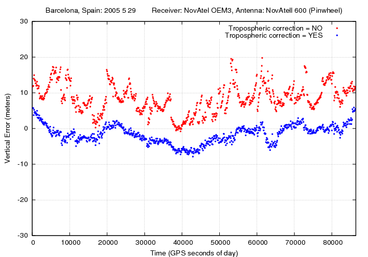
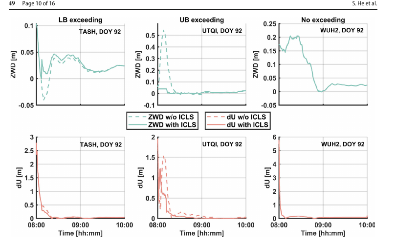
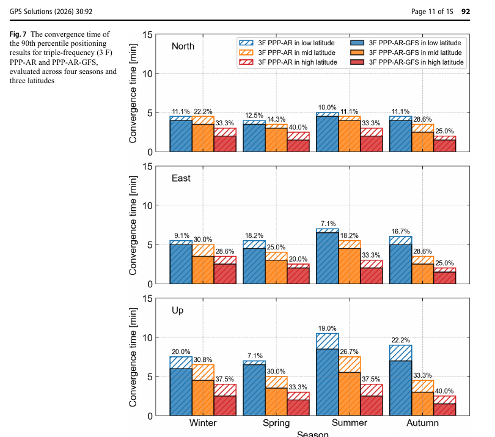

# 2026-07-23 GNSS 每日研究简报

## 今日快报

### 快报 1：台湾连续站把 15 年观测、元数据与质量指标封装成固定版本

- 主题：`taiwan-2010-2024-continuous-gnss-dataset`
- 来源 ID：`doi:10.1038/s41597-026-07876-y`
- 来源链接：https://doi.org/10.1038/s41597-026-07876-y
- 发表日期：2026-07-15
- 来源类型：同行评审开放数据论文（early-access 未编辑版本）
- 获取范围：开放全文 PDF、数据说明与质量统计；CC BY 4.0

**内容：** 作者整合台湾多机构 2010—2024 年连续 GNSS 观测，以 GipsyX/RTGx 对双频 GPS 做 PPP-AR，使用 JPL 最终轨钟与宽巷相位偏差，结果统一到 ITRF2020。处理采用 10°截止角和 300 s 采样，并同时维护接收机/天线变更、同震位移和未解释突变；产品除每日坐标外，还给出数据可用率、平均卫星可见率以及去除趋势、季节项和已知跳变后的 ENU 残差标准差。

**结论：** 原文技术验证从 537 个历史站中形成超过 300 站的固定版本；在进入网络级统计的 328 站中，268 站（82%）的数据可用率超过 90%，21 站（6%）低于 75%。这些比例衡量的是日文件连续性，不等同于每个历元的观测质量；固定版本使用 GPS-only、VMF1 与 FES2004，作者也提醒需要 IGS repro3 严格一致性的用户应自行处理模型差异。

**关注理由：** 长时序是否可复现，不只取决于坐标求解器，还取决于设备元数据、参考框架、跳变台账和质量定义是否随数据一起冻结。该资料适合用来测试速度场、同震/震后形变或水文负荷算法，但训练—验证划分必须按站点和时间隔离，不能让同一站的相邻日期同时进入两侧。

### 快报 2：IRI-Plas 同化 GIM 后，把电离层剖面模型转成更实用的单频改正

- 主题：`iri-plas-2020-gim-assimilation-vtec-spp`
- 来源 ID：`doi:10.1007/s42452-026-09108-9`
- 来源链接：https://doi.org/10.1007/s42452-026-09108-9
- 发表日期：2026-07-16
- 来源类型：同行评审开放期刊论文（early-access 未编辑版本）
- 获取范围：开放 early-access 页面与作者摘要；PDF 当前未由出版页提供，以下量化结论严格限于摘要；CC BY-NC-ND 4.0

**内容：** 研究用全球 124 个 GNSS 站的 VTEC，分别取低太阳活动的 2021 年和高太阳活动的 2024 年，对 IRI-Plas 2020 的原始配置与同化 GIM TEC 的配置做检验；随后在 2024 年选取平静和扰动各 30 d 窗口，比较两种 IRI-Plas 配置与 Klobuchar 对单频 SPP 的改正效果。方法解决的是“保留电离层—等离子层剖面一致性时，如何用实时或准实时 TEC 约束模型绝对量级”。

**结论：** 作者摘要报告：同化后全球平均 VTEC RMSE 在 2021 年由 4.999 TECU 降至 1.827 TECU，在 2024 年由 7.847 TECU 降至 2.369 TECU；相对 Klobuchar，三维 SPP RMSE 在平静窗按纬度带降低约 34%—41%，在扰动窗降低约 28%—49%。由于当前可取得内容是 early-access 摘要，本文不进一步复述站点名单、权值、截止角或各纬度分量结果，也不把 GIM 同化后的改进视为对独立绝对真值的完全验证。

**关注理由：** 一旦把 GIM 同化进经验模型，结果同时继承 GIM 的陆海站网不均、时间分辨率和风暴期误差。工程部署应保留“不采用同化”“Klobuchar”“同化 IRI-Plas”三条链，并按低纬、海岛、高纬和磁暴阶段分别报告误差，而不是只给一个全球均值。

### 快报 3：STEPPP 在同一滤波器里联合恢复三维湿折射率与站坐标

- 主题：`steppp-node-refractivity-simultaneous-ppp-tomography`
- 来源 ID：`doi:10.1007/s00190-026-02088-z`
- 来源链接：https://doi.org/10.1007/s00190-026-02088-z
- 发表日期：2026-07-17
- 来源类型：同行评审开放期刊论文
- 获取范围：开放全文、公式、图表与仿真设置；CC BY 4.0

**内容：** STEPPP 不再先按站估 ZWD、再把斜湿延迟送入层析反演，而是把三维网格节点湿折射率、20 个站的坐标、钟差、系统间偏差、电离层与模糊度放进一个卡尔曼滤波状态。作者对每条卫星—接收机射线穿过的体素做双线性插值和线积分，使节点折射率到 SWD 保持线性；试验使用 Spirent 生成的 GPS L1/L2 与 Galileo E1/E5a、30 s 间隔、12 h 数据，并构造均匀、时变、非均匀和加密网格情形。

**结论：** 作者仿真在剔除最初 2 h 收敛段后，零湿延迟试验的 N/E/U 坐标误差优于 0.1/0.2/0.3 mm；故意设错的节点湿折射率在 3 h 后恢复到 0.1 N-unit 以内。与传统层析比较时，12 h 后 STEPPP 的折射率 RMSE 低于 0.2 N-unit，而对照层析约 0.5 N-unit。当前 Matlab 实现以 8 核 3.5 GHz、32 GB 内存处理 20 站双星座时，每历元少于 4 s；这些是无真实仪器误差的模拟性能，不是业务网实时能力证明。

**关注理由：** 联合估计避免了“先验 PPP 已经把映射函数误差压进 ZWD，再把 ZWD 当独立观测”的双阶段信息损失，但代价是状态维数、可观性和协方差求逆压力。下一步必须用真实多路径、轨钟误差、站间缺测和错误先验检验，特别关注最底层节点缺少负仰角射线时的弱可观性。

### 快报 4：TRACERS 与地面 GPS 共址看到秒级极光闪烁和细尺度电流片

- 主题：`tracers-chain-gps-auroral-scintillation-field-aligned-current`
- 来源 ID：`doi:10.1029/2026GL123732`
- 来源链接：https://doi.org/10.1029/2026GL123732
- 发表日期：2026-07-18
- 来源类型：同行评审开放研究快报
- 获取范围：开放 HTML 全文、摘要与结果段；量化结论均来自作者公开正文

**内容：** 研究把 TRACERS SV2 在 2025-08-09 风暴亚暴期间的横向磁扰动，与 Canadian High Arctic Ionospheric Network 地面 GPS 接收机的相位/幅度闪烁作磁共轭配对。方法利用卫星沿轨的细尺度磁结构和地面穿刺点观测，判断场向电流片、极光电急流与接收机看到的载波相位和强度扰动是否在空间与时间上共同出现。

**结论：** 原文报告，约 1—16 km 尺度上横向磁扰动可达约 1000 nT，对应场向电流密度超过 150 μA/m²；局地 GPS 闪烁达到 $`\sigma_\phi>10\ \mathrm{rad}`$、$`S_4\simeq0.3`$，强度降低约 10 dB-Hz，最强段持续约 1.5 s，并伴随约 12 TECU 的 dTEC 增强。作者据形态与共时性认为 Farley–Buneman 过程可能占主导，同时不排除场向电流和梯度漂移不稳定性；“共址”支持关联，不单独证明唯一因果机制。

**关注理由：** 1.5 s 尺度的极端相位变化会同时挑战 PLL 带宽、周跳判定和 $`C/N_0`$ 平滑窗口。高纬接收机测试不应只回放分钟级 TEC，而应保留原始高率相位、幅度、锁定指示和环路状态，比较窄带 PLL、加宽带宽、矢量跟踪与失锁后重捕获的真实代价。

### 快报 5：十万幅干涉图与 673 条 GNSS 速度揭示天山沿走向伸展

- 主题：`tian-shan-insar-gnss-nascent-shear-zone`
- 来源 ID：`doi:10.1038/s41467-026-74965-2`
- 来源链接：https://doi.org/10.1038/s41467-026-74965-2
- 发表日期：2026-07-22
- 来源类型：同行评审开放期刊论文（early-access 未编辑版本）
- 获取范围：开放全文 PDF、补充方法与图表；CC BY 4.0

**内容：** 作者处理 8 年 Sentinel-1 数据形成约 100000 幅干涉图，并汇集 22 项研究的 673 条 GNSS 速度，把 InSAR 视线速度与水平 GNSS 约束联合为 500 m 分辨率的东向/垂向速度场，再求 5 km 分辨率的应变率与旋度场。方法针对单个断层或稀疏剖面难以覆盖整个造山带的问题，在大范围内寻找连续的形变带和旋转结构。

**结论：** 原文分析覆盖天山主体超过 160 万 km²；识别出东北走向、约 400 km 宽的分布式剪切区，其两侧速度变化超过 10 mm/yr，并把它解释为塔里木盆地顺时针旋转驱动的早期沿走向伸展。这个解释由速度梯度、旋度、地震和剪切波分裂共同支持，但作者也指出内部 GNSS 稀疏、InSAR 只直接提供东向和垂向分量，且冰川、地下水与冻土会污染垂向构造信号。

**关注理由：** GNSS 在这里不是给 InSAR “做一个偏置校正”，而是补足其北向弱敏感方向并稳定参考框架。复用该工作流时，应把 GNSS 速度的不同时段、参考框架和原论文协方差传播到融合结果，不能把 673 个向量视作同质、独立、同历元观测。

## 深度研读

### 深读 1｜接收机工程｜为什么对流层延迟不能靠双频消掉，还要从天顶映射到斜路径

- 类别：`receiver-engineering`
- 学习层级：`foundation`
- 选题定位：`经典基础`
- 来源 ID：`navipedia:tropospheric-delay`
- 来源链接：https://gssc.esa.int/navipedia/index.php?title=Tropospheric_Delay
- 发表日期：2011
- 来源类型：ESA/GMV Navipedia 技术条目
- 获取范围：公开全文与原始实验图；页面未声明开放内容许可，图仅作最小研究评论并保留原标注
- 价值评分：92/100（相关性 20，经典价值 22，证据 17，教学价值 19，工程价值 14）

#### 为什么先学这个

精密定位把载波相位做到毫米级，却仍要处理米级中性大气路径延迟。和电离层不同，对流层在 GNSS L 波段近似非色散：码和相位承受同号、近似同量的额外路径，双频线性组合不能把它消掉。先分清“天顶延迟有多大”和“低仰角怎样放大斜路径”，才能理解下一节为什么要约束 ZWD，以及最后一节为什么 NWM 约束主要改善 PPP 的垂向与收敛。

#### 先修知识

伪距与载波相位都包含几何距离、收发钟、对流层、电离层和本地误差。折射率 $`n`$ 略大于 1，折射度通常定义为 $`N=10^6(n-1)`$。中性大气分成较稳定的静力分量和快速变化的湿分量：海平面附近天顶静力延迟约 2.3 m，湿延迟通常为数厘米至数十厘米；到低仰角时，路径增长会把两者同时放大。

#### 一句话逻辑

先把中性大气积分压缩成天顶静力/湿延迟，再用各自映射函数按卫星仰角还原斜路径延迟，稳定部分建模、易变部分估计。

#### 研究问题与约束

Navipedia 条目给出折射度积分、静力/湿分解、面向 SPP 的 Collins 模型和面向 PPP 的 Niell 映射示例。它是教学技术条目，不是新算法对照试验；页面中的 Barcelona 单日接收机结果说明忽略对流层的数量级，却不能证明某个映射函数在所有气候、海拔和低仰角下最优。

#### 核心方法论

沿真实传播路径的超额距离由折射率积分决定。工程实现不直接为每条射线恢复完整三维大气，而先计算天顶静力延迟 $`ZHD`$、估计天顶湿延迟 $`ZWD`$，再分别乘以 $`m_h(E)`$ 与 $`m_w(E)`$。静力项可用气压和纬高模型预测；湿项随水汽快速变化，精密解中常作为随机游走状态与坐标一起估计。

#### 关键公式逐步推导

从真空几何路径相对实际传播速度的超额路径开始：

```math
T=\int (n-1)\,dl=10^{-6}\int N\,dl
```

把折射度分成静力与湿分量，并把每个积分按天顶值和仰角映射函数参数化：

```math
T(E)=ZHD\,m_h(E)+ZWD\,m_w(E)
```

最简单的平面大气近似是 $`m(E)\approx1/\sin E`$；它说明 $`E`$ 越低斜路径越长，但忽略地球曲率和垂向折射度剖面。实际 Niell/VMF 一类映射常用归一化连分式：

```math
m(E)=\frac{1+\frac{a}{1+\frac{b}{1+c}}}
{\sin E+\frac{a}{\sin E+\frac{b}{\sin E+c}}}
```

$`a,b,c`$ 由纬度、季节、高度或数值天气场确定；映射函数误差会和站高、ZWD、低仰角权值发生强相关。

#### 经典价值与创新边界

“静力模型 + 湿延迟状态 + 斜路径映射”把不可承受的三维大气反演压缩成少量状态，是 GNSS 精密处理长期沿用的基本接口。其边界也很清楚：水平梯度、强对流、锋面和近地层逆温会破坏方位对称；低仰角下映射误差、多路径和天线相位中心误差纠缠，不能把所有残差都归因于水汽。

#### 整体逻辑链

接收机形成码相观测；轨钟模型去掉空间段误差；静力模型由压力等先验给 $`ZHD`$；映射函数把天顶项投影到每颗星方向；滤波器联合估计坐标、钟差、$`ZWD`$ 和可选水平梯度；残差用于检查低仰角和天气异常；若映射或 ZWD 状态失真，最先显著恶化的通常是站高和收敛过程。

#### 原文图表与结果分析



> 图源：Sanz Subirana、Juan Zornoza 与 Hernández-Pajares《Tropospheric Delay》Figure 1 的垂向误差原始面板，[Navipedia 原文](https://gssc.esa.int/navipedia/index.php?title=Tropospheric_Delay)。直接保存页面提供的 720×504 PNG；未裁切、重采样、重绘或改动点、坐标、图例和标题。页面未声明开放许可，按最小研究评论引用，不主张再分发权。

横轴为一天内 GPS 秒，纵轴为垂向误差，单位 m；红点是不加对流层改正，蓝点是加改正，接收机与天线配置写在图顶。直接读图可见红点大多约在 0—20 m，蓝点大多约在 -8—5 m，说明忽略延迟会形成显著垂向偏差，而改正后仍有数米级结构性变化。图没有真值不确定度、水平分量或不同天气对照，不能据此量化某一映射函数的厘米级准确度。

#### 原文结果论述

条目指出，对流层对 GNSS 信号近似非色散，静力部分约占总延迟的 90%，天顶静力延迟约 2.3 m；在约 10°低仰角时总影响可到约 10 m。湿分量虽较小，却变化更快，因此高精度处理中通常与坐标一起估计。页面给出的 PPP 示例把初始天顶湿延迟设为 0.1 m，并以约 $`1\ \mathrm{cm^2/h}`$ 的过程噪声随机游走，这是教学实现参数，不是所有气候和采样率的固定常数。

#### 常见误区与适用边界

第一，把对流层当成可由双频消除的色散误差。第二，用同一个映射函数和随机模型处理静力、湿分量。第三，低仰角观测越多就必然越好；它同时增强几何、对流层敏感度和多路径。第四，把估计的 ZWD 当成纯水汽；静力模型残差也可能被吸收。第五，复制某站的过程噪声到所有纬度与天气。第六，用图中的蓝点证明“模型已经正确”，而忽略剩余偏差和真值链。

#### 工程实现步骤

1. 在码相模型中保留同号的对流层斜延迟项，不放进电离层无关组合的消除逻辑。
2. 由站点气压或可靠模型计算 $`ZHD`$，记录模型、气象源和潮汐高度口径。
3. 为静力与湿分量选择一致版本的映射函数系数，按每星仰角计算 $`m_h,m_w`$。
4. 在 PPP 滤波中把 $`ZWD`$ 设为随机状态；需要时加入南北、东西梯度。
5. 对低仰角观测使用与多路径/映射误差相符的权值，不只设硬截止角。
6. 保存每历元 ZHD、ZWD、梯度、映射值和残差，按天气与仰角审计。

#### 复现实验设计

选一座有气象站的 IGS 站，下载 7 个晴天和 7 个强湿过程的 30 s 双频数据。统一精密轨钟与 7°截止角，比较：不改正、单一 $`1/\sin E`$、Saastamoinen+Niell、Saastamoinen+VMF3 四条 PPP float 链；每条再测试固定 ZWD、5/10/20 mm/$`\sqrt{h}`$ 随机游走。报告首次进入水平/垂直 10 cm 的时间、24 h ENU RMS、ZWD 对外部产品差、残差随仰角分箱和解算失败率。失败用例包括气压缺测、20 hPa 偏置、只保留 15°以上观测和强对流 2 h 窗口。

#### 与定位及低成本实现的联系

手机和低成本接收机更依赖低成本气象先验，却又更容易在低仰角出现多路径。可先采用可靠静力模型、保守湿延迟状态与仰角/$`C/N_0`$ 联合定权；若算力有限，减少梯度状态也应同时提高垂向不确定度，不能只保留坐标而隐藏模型欠拟合。

#### 本节小结

对流层是码相共同的非色散延迟。工程核心不是“减去 2.3 m”，而是把静力和湿分量分别建模、从天顶映射到每条斜路径，并诚实处理低仰角与水汽快速变化留下的不确定度。

### 深读 2｜接收机工程｜用 ZWD 物理边界阻止 PPP 收敛初期把站高拖偏

- 类别：`receiver-engineering`
- 学习层级：`intermediate`
- 选题定位：`基础进阶`
- 来源 ID：`doi:10.1007/s00190-026-02075-4`
- 来源链接：https://doi.org/10.1007/s00190-026-02075-4
- 发表日期：2026-06-29
- 来源类型：同行评审开放期刊论文
- 获取范围：开放全文、公式与原始图；CC BY 4.0
- 价值评分：94/100（相关性 20，经典价值 20，证据 20，教学价值 18，工程价值 16）

#### 为什么先学这个

上一节把 ZWD 作为 PPP 随机状态，但滤波刚启动时几何、钟差、站高、模糊度和 ZWD 高度相关，无约束最小二乘可能暂时给出负 ZWD 或不现实的大值。直接把某个天气产品当强先验又可能把真实异常压掉。本节采用较弱但物理明确的条件：ZWD 至少非负，收敛期不超过由温湿条件推导的宽松上界。

#### 先修知识

加权最小二乘给出参数估计与协方差；线性不等式约束把可行域从整个参数空间缩成区间或凸集。KKT 条件由原始可行性、对偶可行性、驻点条件和互补松弛构成。参数条件更新利用 ZWD 与站高等状态的协方差：当 ZWD 被夹到边界时，其他相关状态也必须同步改正，而不是只改一个输出字段。

#### 一句话逻辑

若无约束 ZWD 落在物理区间外，就把它投影到最近边界，再用交叉协方差把这项信息传给站高等参数；区间内则完全保留原解。

#### 研究问题与约束

论文研究不依赖外部 SSR/ZWD 产品时，基于相对湿度极值推导的 ZWD 上下界能否改善 PPP 初始阶段。验证包含 12 个 GFZ 全球站的 3 d 实时和后处理数据，以及 2025 年台风 Krosa 的 GEONET 定性案例。三天、十二站不足以覆盖所有气候；实时数据实际被保存后按统一流程重放，不能等同于含真实网络抖动的在线部署。

#### 核心方法论

先运行普通 PPP 得到无约束 $`\hat{\mathbf x}`$ 与协方差。对 ZWD 施加 $`0\le ZWD\le UB(T,\phi,H,RH=100\%)`$；若越界，简化 ICLS 直接取对应边界。随后用 ZWD 与其余状态的交叉协方差做条件更新。收敛后停止使用上界作硬约束，只保留非负约束；上界转为天气异常诊断，避免把极端湿过程强行削平。

#### 关键公式逐步推导

普通加权最小二乘为：

```math
\hat{\mathbf x}=\arg\min_{\mathbf x}
(\mathbf y-A\mathbf x)^TP(\mathbf y-A\mathbf x)
```

加入逐参数边界后：

```math
\hat{\mathbf x}_c=\arg\min_{\mathbf a\le\mathbf x\le\mathbf b}
(\mathbf y-A\mathbf x)^TP(\mathbf y-A\mathbf x)
```

对单一 ZWD 约束，若 $`\hat z`$ 在区间外，凸二次问题的解落在最近边界：

```math
\check z=\min\!\left(b,\max(a,\hat z)\right)
```

再用条件估计更新未约束状态 $`\mathbf x`$：

```math
\check{\mathbf x}=\hat{\mathbf x}
-Q_{xz}Q_{zz}^{-1}(\hat z-\check z)
```

上式说明收益来自相关性：若站高与 ZWD 几乎不相关，边界对站高帮助也小。原文为保持在线实现简洁，没有在每次条件更新后缩小 $`Q_{xx}`$；这是计算折衷，应在一致性检验中单独检查。

#### 经典价值与创新边界

不等式约束最小二乘和 KKT 并不新，创新在于把 ZWD 的非负性与温湿物理上界做成 PPP 收敛阶段的轻量条件，并在收敛后把上界改作诊断。它不提供外部水汽真值，也不解决错误轨钟、多路径或错误固定；过紧边界仍会产生系统偏差并破坏高斯近似。

#### 整体逻辑链

PPP 预测得到状态与协方差；无约束更新形成 ZWD；边界模型由温度、纬度、高程及 0%/100% 相对湿度构造区间；活动集判断是否越界；越界时投影 ZWD 并条件更新站高等状态；收敛后撤去上界硬约束；运行监测把上界越界作为可能的极端水汽信号，而非自动删观测。

#### 原文图表与结果分析



> 图源：He 等《Physical constraints for zenith wet delay estimation via inequality constrained least squares in real-time PPP》Figure 4，[开放原文](https://doi.org/10.1007/s00190-026-02075-4)，CC BY 4.0。从论文 PDF 第 10 页以 110 dpi 渲染，仅裁取 Figure 4 图区；未重绘、重采样数据或改动坐标、曲线、图例和标签。

三列分别是 ZWD 下界越界、上界越界和不越界的代表站；横轴为 08:00—10:00，顶行纵轴为 ZWD（m），底行为 Up 偏差 $`dU`$（m）。虚线是不加 ICLS，实线是加 ICLS。直接读图：UTQI 的无约束 ZWD 初期峰值超过 0.5 m、对应 $`dU`$ 约达 1.5 m，约束后两者明显缩短；WU H2 未越界时两条线重合，说明区间内算法不改原解。图只展示三个挑选案例，不能单独证明 30% 的总体改进。

#### 原文结果论述

作者对 12 个站各 3 d 数据统计，报告 ICLS 使实时 PPP 的短时 Up 准确度平均改善约 30%，后处理短时 RMSE 改善约 20%。论文还用台风 Krosa 说明：极端天气下应只保留 ZWD 非负约束，把上界越界当诊断信号。这个台风部分是定性案例，不能据此声称已建立有检出率、误警率和提前量保证的气象预警器。

#### 常见误区与适用边界

第一，把 ZWD 上界当观测真值。第二，越界后只截断 ZWD，不更新相关站高。第三，收敛后仍永久强制上界，掩盖真实湿异常。第四，把三天平均改善外推到全球全年。第五，忽略温度模型或站高错误会移动上界。第六，在多个强相关受约束参数上直接逐项 clamp，违反简化法的低相关前提。第七，只看误差变小，不做 NEES/覆盖率检查。

#### 工程实现步骤

1. 保留普通 PPP 结果作基线，并输出 ZWD、站高交叉协方差与滤波年龄。
2. 依据站点纬度、高程和表面温度计算宽松 ZWD 上界，下界固定为 0。
3. 仅在无约束解越界时触发活动约束，并记录触发边界和持续时间。
4. 用 $`Q_{xz}Q_{zz}^{-1}`$ 条件更新其余状态；对协方差近似做一致性监控。
5. 以位置/模糊度稳定性定义收敛结束，随后撤去上界硬约束。
6. 对台风、强对流和断流重启单独配置策略，禁止把天气异常当坏数据自动删除。

#### 复现实验设计

选择低纬、中纬、高纬各 4 个 IGS/GFZ 站，含平静与强湿过程各 7 d，30 s GPS+Galileo 数据。每 2 h 重启一次 PPP，比较无约束、仅 $`ZWD\ge0`$、固定经验上界、温湿物理上界四条链。报告前 5/15/30/60 min 的 ENU RMSE、10 cm 收敛时间、ZWD 对 IGS 产品偏差、边界触发率、95% 区间覆盖率和 NEES；失败用例加入温度 +10 K 偏置、站高 +100 m、2 min 轨钟中断和对流突增。基线还应包含把外部 ZWD 当软约束的方案，区分“只排除不物理值”和“拉向外部真值”的差异。

#### 与定位及低成本实现的联系

ICLS 只增加少量区间判断和矩阵向量运算，适合算力有限的实时接收机。低成本设备最需要的是重启和短失锁后的诚实收敛，但其多路径可能让 ZWD 吸收模型外误差；因此应把边界触发、环境分类和残差共同用于降级，而不是用约束制造看似平滑的站高。

#### 本节小结

ZWD 物理边界是一种“只在明显不可能时介入”的弱先验。正确实现既要把越界信息通过协方差传给站高，也要在收敛后撤去上界，避免把真实大气异常误当滤波错误。

### 深读 3｜定位｜把 GFS 湿延迟按纬度定权，怎样缩短多频多 GNSS PPP-AR 收敛

- 类别：`positioning`
- 学习层级：`advanced`
- 选题定位：`定位深入`
- 来源 ID：`doi:10.1007/s10291-026-02053-5`
- 来源链接：https://doi.org/10.1007/s10291-026-02053-5
- 发表日期：2026-03-12
- 来源类型：同行评审开放期刊论文
- 获取范围：开放全文、原始图表与处理设置；CC BY 4.0
- 价值评分：95/100（相关性 20，经典价值 22，证据 20，教学价值 17，工程价值 16）

#### 为什么先学这个

前两节从斜路径模型走到 ZWD 的物理可行域，但“0 到一个宽上界”仍没有告诉滤波器当前湿延迟最可能在哪里。全球预报 NWM 可以给更窄的 ZWD 先验；若同时提供与纬度相符的方差，它可能在滤波早期减弱 ZWD—站高—模糊度耦合，帮助超宽巷、宽巷到窄巷的逐级固定。高级问题不是是否使用天气产品，而是怎样定权、何时有益以及错先验怎样回退。

#### 先修知识

PPP-AR 使用精密轨钟与相位偏差，在非差观测中恢复整数模糊度。三频层级固定通常先解超宽巷 EWL，再解宽巷 WL，最后解窄巷 NL；前级正确固定可形成精度高于码的无模糊组合。ZTD=$`ZHD+ZWD`$；静力项可准确建模，湿项与站高强相关。NWM 给出的 ZWD 必须作为带方差的伪观测，而不是无误差常数。

#### 一句话逻辑

用 GFS 预报给 ZWD 一个按纬度校准的软约束，先稳定垂向与大气状态，再让多频宽巷组合更快为窄巷固定提供高精度信息。

#### 研究问题与约束

论文用 2024 年近 400 站评估 GFS 对流层精度，再以 223 个 MGEX 站、1/4/7/10 月数据验证 GPS+Galileo+BDS-3 双频和三频 PPP-AR。定位试验每小时重启，收敛定义为 90 分位 NEU 误差低于 10 cm。它代表全球静态站和离线重放；没有覆盖运动天线、实时 GFS 断流、城市多路径或未被模型捕捉的局地强对流。

#### 核心方法论

先由 GFS 气象场计算 ZHD/ZWD 与映射函数，并把 GFS ZWD 与 IGS ZTD 对比。作者发现误差随纬度降低，在赤道附近更大，据此拟合纬度相关标准差。用户端仍估计 ZWD，但增加 $`ZWD_{GFS}`$ 伪观测；标准差越大，约束越软。三频链逐级固定 EWL/WL/NL，比较无增强 PPP-AR 与 PPP-AR-GFS 的 90 分位收敛和首次固定时间。

#### 关键公式逐步推导

把普通 PPP 线性化观测写成：

```math
\mathbf y=A\mathbf x+\boldsymbol\varepsilon,
\qquad
\mathbf x=[\mathbf r,\delta t,ZWD,\mathbf N,\ldots]^T
```

GFS 预报作为额外伪观测：

```math
z_{GFS}=ZWD+\varepsilon_G,
\qquad
\varepsilon_G\sim\mathcal N(0,\sigma_G^2)
```

原文用全年站网拟合纬度绝对值 $`|\phi|`$ 与 RMS（cm）的线性关系，并设 0.5 cm 下限：

```math
\sigma_G(\phi)=\max\left(0.5,\,-0.016|\phi|+1.940\right)\ \mathrm{cm}
```

于是伪观测权为 $`w_G=1/\sigma_G^2`$。这一步很关键：赤道附近预报误差约 2 cm，权值应低于高纬；若把所有站都设为 0.5 cm，会把热带未建模水汽强行写进坐标和整数状态。

#### 经典价值与创新边界

用外部对流层先验加速 PPP 不是新概念；本工作的价值是以近 400 站全年结果给 GFS 约束定权，并在 223 站、双/三频、季节和纬度分层的 PPP-AR 中检验。线性纬度模型仍是全球统计包络，不能描述山地、海岸、台风或某一小时的预报质量；它改善的是平均收敛，不构成错误固定完整性保证。

#### 整体逻辑链

服务端获取全球 GFS 预报并射线计算 ZHD/ZWD；用历史 IGS 产品标定纬度相关误差；用户接收轨钟、相位偏差和大气先验；PPP 滤波加入带方差 ZWD 伪观测；三频先固定 EWL/WL，再由更稳定的坐标—对流层状态推动 NL；固定后继续用残差和 ratio 监测；NWM 缺测或创新过大时增大方差并退回普通 PPP-AR。

#### 原文图表与结果分析



> 图源：Du 等《Accelerating multi-GNSS and multi-frequency PPP-AR convergence using global operational NWM forecasts》Figure 7，[开放原文](https://doi.org/10.1007/s10291-026-02053-5)，CC BY 4.0。从论文 PDF 第 11 页以 110 dpi 渲染，裁取 Figure 7、图题和完整坐标/图例；未重绘、重新计算或改动柱形、百分比和标签。

横轴为冬、春、夏、秋，三行纵轴分别为 North、East、Up 的收敛时间，单位 min；每组按低、中、高纬排列，斜线柱是普通三频 PPP-AR，实色覆盖是 PPP-AR-GFS，柱顶百分比为改善幅度。直接读图可见 Up 的收益普遍大于水平，且高纬实色柱最低；高纬 Up 四季标注改善约 33.3%—40.0%。图给的是季节/纬度汇总的 90 分位阈值，不显示失败尾部，也不能证明每个站都改善。

#### 原文结果论述

GFS 与 IGS ZTD 在三个代表站的全年相关系数均超过 0.96，差值 RMS 为 17.2、11.2 和 9.6 mm；近 400 站显示赤道附近约 2.0 cm、高纬优于 1.0 cm。对 223 站每小时重启的三频 PPP-AR，高纬 N/E/U 平均收敛时间由 2.6/2.8/3.4 min 降到 1.8/2.0/2.1 min，即改善 33.3%/27.3%/37.0%。但收敛后的 24 h 精度变化很小：双频 Up RMS 仅由 26.9 降至 25.4 mm，三频由 26.6 降至 25.3 mm，说明主要收益发生在滤波初期。

#### 常见误区与适用边界

第一，把相关系数高当作无偏和厘米级绝对准确。第二，只输入 GFS 初值却不持续约束；原文显示单纯换初值收益很小。第三，全球统一固定方差。第四，只报告平均收敛，不报告变差站点和错误固定。第五，把静态 MGEX 结果外推到车载动态。第六，NWM 创新过大时仍维持强权。第七，认为增强后 24 h 精度也会同等比例改善。第八，把更快 fix 标志当成更高整数正确率。

#### 工程实现步骤

1. 对 GFS 与 GNSS 轨钟/偏差产品统一时间系统、天线高和 ZHD 定义。
2. 从 NWM 计算站点 ZHD/ZWD 与映射函数，给每个产品附版本、预报时效和有效时间。
3. 用历史独立站按纬度、季节和天气标定 $`\sigma_G`$，至少保留原文 0.5 cm 下限。
4. 把 ZWD 作为伪观测加入滤波而非硬替换；监控归一化创新。
5. 三频按 EWL→WL→NL 逐级固定，每级保存候选数、ratio 与固定后残差。
6. 遇到 NWM 超时、创新异常或局地强对流时放大方差，平滑退回普通 PPP-AR。
7. 分别发布收敛时间、TTFF、错误固定率和收敛后精度，禁止合成一个“提升百分比”。

#### 复现实验设计

从 MGEX 选低/中/高纬各 10 站，取 2024 年四季各 7 d、30 s GPS+Galileo+BDS-3 数据；每小时重启。比较普通双频/三频 PPP-AR、仅换 GFS 初值、固定 1 cm 软约束、原文纬度权、按站点天气动态权五条链。统一 10 cm 的 90 分位收敛定义和连续 10 历元正确固定标准；报告 NEU 收敛时间、TTFF CDF、错误固定率、24 h RMS、ZWD 创新和降级次数。失败用例注入 15/30/60 min NWM 延迟、ZWD +3 cm 偏置、台风小时和一次错误相位偏差；以无大气增强 PPP-AR 为安全回退基线。

#### 与定位及低成本实现的联系

大气伪观测本身计算很轻，适合低成本终端；真正成本在可靠产品分发、版本一致性和异常回退。手机天线的多路径与周跳往往比 ZWD 更大，因此 NWM 只能缩短一个误差维度：仍须频点定权、连续弧管理和部分模糊度固定。若整数证据不足，快速得到可信 float 解优于快速输出错误 fixed 解。

#### 本节小结

GFS 湿延迟的价值主要是削弱 PPP-AR 初始阶段的对流层—垂向—模糊度耦合。按纬度给软约束定权可显著缩短三频收敛，尤其高纬垂向；收益不等于收敛后精度同比提高，也不能替代错误固定与 NWM 异常监控。
