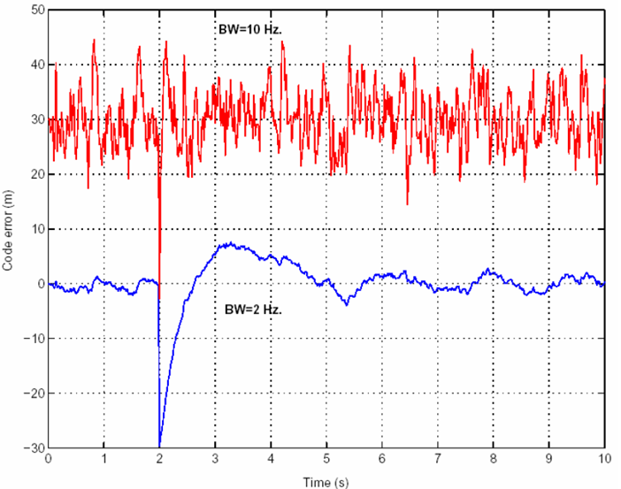
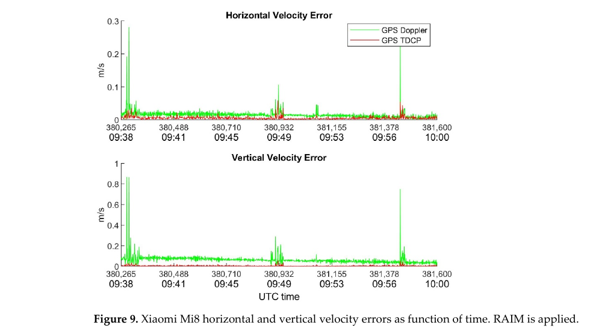
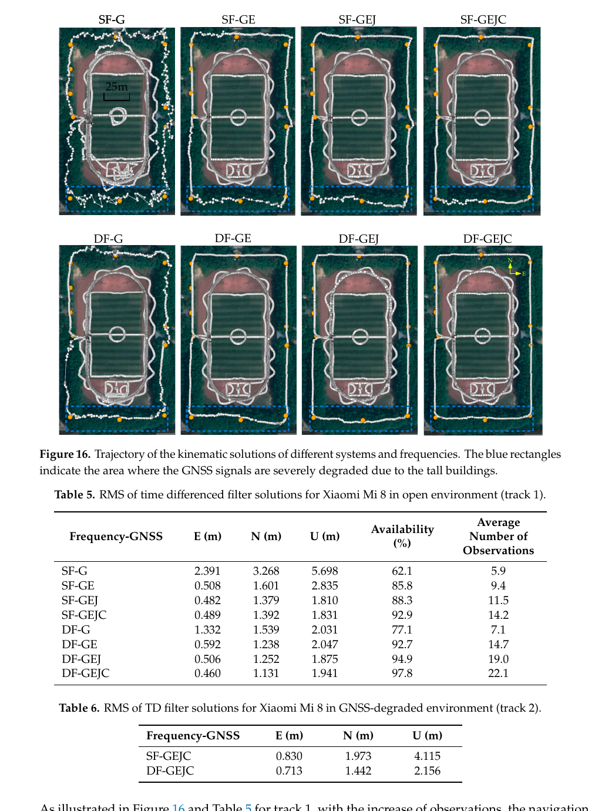

# 2026-07-24 GNSS 每日研究简报

## 今日快报

### 快报 1：模拟高率 GNSS 波形训练网络，Ridgecrest 震级在 30—35 s 内稳定

- 主题：`hr-gnss-deep-learning-rapid-earthquake-magnitude`
- 来源 ID：`doi:10.3390/rs18152444`
- 来源链接：https://doi.org/10.3390/rs18152444
- 发表日期：2026-07-23
- 来源类型：同行评审开放期刊论文（early-access 未编辑版本）
- 获取范围：开放的两页 early-access 原文，含摘要、亮点、版本日期与许可；CC BY 4.0

**内容：** 研究针对强震近场地震仪削波和短 P 波窗导致震级饱和的问题，用模拟的高率 GNSS（HR-GNSS）位移波形训练深度学习模型，再以 2019 年 Ridgecrest 地震序列检验。作者同时分析台站距离、数量与噪声，以判断网络部署怎样影响快速震级估计；当前公开版本尚未包含完整网络结构、合成目录和逐站误差表，因此这里只复述摘要与亮点明确给出的结果。

**结论：** 作者报告，单断层模拟中模型对 $`M_w\ge 6.3`$、复杂多断层系统中对 $`M_w\ge 7.0`$ 的事件表现出较高准确度；Ridgecrest 测试的估计在震后约 30—35 s 稳定到接近真值，最终误差小于 0.15 个震级单位。这些门槛来自模拟训练和特定真实序列验证，不能直接外推为全球任意断层与台网的报警保证。

**关注理由：** HR-GNSS 直接测位移、不易像加速度或速度记录那样在大振幅时削波，但实时产品仍受站钟、轨道、数据延迟、共模误差和近场台站分布限制。业务验证应保留“纯真实事件留出集”，并把首次稳定时间、漏报率和数据链延迟分开报告。

### 快报 2：五月超级磁暴让南半球中纬顶部电离层密度最高增至静日 17 倍

- 主题：`gannon-storm-midlatitude-ionosphere-dmsp-gitm`
- 来源 ID：`doi:10.3389/fspas.2026.1833885`
- 来源链接：https://doi.org/10.3389/fspas.2026.1833885
- 发表日期：2026-07-21
- 来源类型：同行评审开放期刊原始研究
- 获取范围：开放全文、图表、补充材料与方法；CC BY 4.0

**内容：** 作者把 DMSP F16/F17/F18 的原位离子密度、漂移和温度，与地面 GNSS VTEC、GRACE-FO 中性密度/风场、SSUSI O/N₂、SABER NO 辐射以及 GITM 模拟联合起来，追踪 2024-05-10 Gannon 超级磁暴在四个纬度—地方时扇区中的正、负相位。多平台链条用于区分电场抬升与高纬加热造成的正相位，以及成分变化和 NO 冷却相关的负相位。

**结论：** DMSP 黄昏侧观测显示，正相位顶部离子密度在北半球中纬最高约为静日的 4—5 倍，在南半球最高约 17 倍；随后北半球中纬出现相对静日最高约 50% 的密度亏损。原文将高纬能量输入、离子—中性耦合、O/N₂ 下降和 NO 冷却共同纳入解释；不同卫星地方时和 30—35 min 合成采样限制了对更快局地结构的归因。

**关注理由：** 极端磁暴不仅放大单频电离层延迟，还改变空间梯度、闪烁风险和多频组合的残余高阶项。定位测试不能只用平滑 GIM 回放，应把正相位突增、负相位耗空、不同地方时和南北半球不对称分别作为压力场景。

### 快报 3：12.8 Gcps 光学相关器在实验室验证亚皮秒时传与亚毫米测距

- 主题：`kepler-optical-inter-satellite-time-transfer-ranging`
- 来源 ID：`doi:10.1007/s10291-026-02064-2`
- 来源链接：https://doi.org/10.1007/s10291-026-02064-2
- 发表日期：2026-03-25
- 来源类型：同行评审开放期刊原始研究
- 获取范围：开放全文、实验参数、图表与许可；CC BY 4.0

**内容：** 面向 Kepler 型下一代 GNSS，研究把 12.8 Gcps 扩频序列、高分辨率光学相关跟踪和双向时传装进近似相干光通信硬件的收发机。实验在 30 m 自由空间链路上运行，并把接收光功率缩放到可模拟超过 50000 km 的 MEO 星间距离；链路预算示例采用 10 W 发射功率和 80 mm 口径。

**结论：** 静态实验在 20 ms 平均时间给出双向时传标准差 0.37 ps、测距标准差 121 μm；按 1 ms 读出外推约为 2 ps 和 600 μm。原文明确下一阶段才处理动态环境，因此这些数字证明的是静态实验室相关器与链路预算可行性，不是已经完成的在轨微振动、捕获和大多普勒验证。

**关注理由：** 若星座能在轨直接同步钟差并测星间距离，轨钟估计对全球地面网和预报的依赖会下降。但从静态光功率缩放走到在轨系统，还必须验证指向误差、热漂移、硬件延迟标定、跨轨道面多普勒以及失锁后的重捕获。

### 快报 4：实时 GIM 对单频 BDS-3 PPP 的收益会随磁活动强弱改变

- 主题：`rt-gim-bds3-single-frequency-realtime-ppp`
- 来源 ID：`doi:10.3389/fspas.2026.1891160`
- 来源链接：https://doi.org/10.3389/fspas.2026.1891160
- 发表日期：2026-07-03
- 来源类型：同行评审开放期刊原始研究
- 获取范围：开放全文、公式、图表与处理设置；CC BY 4.0

**内容：** 论文以 IGS 最终 GIM 为参考，评估 CAS、UPC、WHU、CNES、IGS0、IGS1 六种 2024 年实时 GIM，并在 18 个 IGS 站、DOY 278—298 的 21 d、30 s BDS-3 数据上测试单频实时 PPP。滤波器把 RT-GIM 作为外部电离层约束，并按日均 Kp 将日期分为平静和扰动组。

**结论：** 相对 IGS 最终 GIM，WHU/CAS/IGS1 年均 RMS 分别约 5.15/5.68/5.33 TECU，CNES 为 10.09 TECU。作者报告：所有测试合并后，外部约束平均缩短收敛时间 27.3%；平静期平均缩短 56.1%、三维精度改善 39.0%，扰动期对应为 42.9% 和 34.1%。最终 GIM 不是独立绝对电离层真值，日均 Kp 也会平滑短时风暴峰值，因此产品排序不应脱离参考和分组口径。

**关注理由：** “有 GIM 就强约束”会在风暴期把地图误差传给坐标。工程上应把产品年龄、区域 NRMSE、Kp/ROTI 与滤波方差联动，并保留无外部约束基线，分别报告收敛速度和收敛后的偏差。

### 快报 5：GPT3-e 优化相对延迟，把大高差 RTK 的系统垂向偏差压低

- 主题：`gpt3e-relative-troposphere-large-height-difference-rtk`
- 来源 ID：`doi:10.3389/fspas.2026.1821037`
- 来源链接：https://doi.org/10.3389/fspas.2026.1821037
- 发表日期：2026-04-17
- 来源类型：同行评审开放期刊原始研究
- 获取范围：开放全文、公式、图表、系数与实现仓库；CC BY 4.0

**内容：** GPT3-e 不追求每站绝对 ZTD 最优，而用 ERA5 学习 GPT3 随高度变化的误差剖面：静力部分用二阶、湿分量用三阶多项式，目标是减小基准站与流动站之间的相对对流层延迟。模型系数离线固化，接收机运行时不需要实时天气产品。

**结论：** 以 ERA5 为参考，全球年均最大相对 ZTD 误差由 GPT3 的 3.9 cm 降到 GPT3-e 的 2.6 cm，约改善 33%。在高差 388.8 m 的金龙山试验中，垂向 RMS 从冬季 4.5 cm 降到 1.6 cm、夏季 4.2 cm 降到 1.8 cm；水平误差改善可忽略。另一个高差超过 800 m 的 4 h 案例中，垂向 RMS 从 8.6 cm 降到 6.7 cm，仍不及直接 ERA5 改正的 3.6 cm。

**关注理由：** 短基线也不意味着大高差下对流层能被双差完全消除。离线增强的经验模型适合断网监测设备，但应在不同气候、高程带和极端水汽条件下独立验证；“相对延迟更准”主要改善垂向，不应包装成全分量等比例提升。

## 深度研读

### 深读 1｜载波跟踪｜带宽为什么同时决定 PLL 跟噪声与跟动态的能力

- 类别：`tracking`
- 学习层级：`foundation`
- 选题定位：`经典基础`
- 来源 ID：`navipedia:tracking-loops`
- 来源链接：https://gssc.esa.int/navipedia/index.php/Tracking_Loops
- 发表日期：2011
- 来源类型：ESA/GMV Navipedia 技术条目
- 获取范围：公开全文、公式与原始示意图；页面未声明开放内容许可，图仅作最小研究评论并保留原标注
- 价值评分：92/100（相关性 20，经典价值 22，证据 16，教学价值 19，工程价值 15）

#### 为什么先学这个

手机 TDCP 依赖相邻历元的载波相位连续；而相位首先不是由定位滤波器“算出来”，而是 PLL/FLL 从相关器 I/Q 输出持续跟踪得到。带宽太窄，热噪声小但遇到动态或振荡器漂移会滞后；带宽太宽，能追快变化却把更多噪声送进相位。先理解这个闭环权衡，才能判断后两节的手机相位突跳究竟是定位算法问题，还是观测量在前端已经失去连续性。

#### 先修知识

捕获阶段给出粗码延迟和多普勒，跟踪阶段用本地码与载波副本持续对齐来波。Prompt 相关器形成同相 $`I`$ 和正交 $`Q`$；鉴相器把它们变成相位误差，环路滤波器抑制噪声，数控振荡器（NCO）更新本地载波。DLL 跟码延迟，PLL 跟相位，FLL 跟频率；实际接收机常以 FLL 辅助拉入，再切到低抖动 PLL。

#### 一句话逻辑

闭环不断用“相关器误差 → 滤波 → NCO 修正”逼近来波，而噪声带宽决定它愿意相信多快的误差变化。

#### 研究问题与约束

Navipedia 条目给出跟踪环组成、相位阶跃响应、带宽/阶数约束、载波辅助和矢量处理概念。它是工程教学条目，不是特定芯片的压力测试；相位阶跃图说明典型二阶环的相对响应，不能替代实际手机的振荡器噪声、多路径、量化、AGC 和环路实现测量。

#### 核心方法论

对已去除粗多普勒和 PRN 码的信号，相关器在积分时间 $`T`$ 内累积 I/Q。小相位误差区可用 $`e_\phi\approx Q/I`$，更宽范围常用四象限 $`\operatorname{atan2}(Q,I)`$；数据位翻转时则采用 Costas 型鉴相器。环路滤波器把瞬时误差变成平滑的频率/相位控制量。较高阶环能跟踪更高阶动态，却需要更谨慎的稳定性与计算设计。

#### 关键公式逐步推导

理想 Prompt 相关器可写成：

```math
I_k=A\,\operatorname{sinc}(\Delta f_kT)\cos(\Delta\phi_k)+n_{I,k}
```

```math
Q_k=A\,\operatorname{sinc}(\Delta f_kT)\sin(\Delta\phi_k)+n_{Q,k}
```

因此在高信噪比、小误差区：

```math
e_{\phi,k}=\operatorname{atan2}(Q_k,I_k)\approx\Delta\phi_k
```

滤波器和 NCO 构成负反馈。对二阶 PLL，可把误差动态写成标准二阶形式：

```math
\ddot e_\phi+2\zeta\omega_n\dot e_\phi+\omega_n^2e_\phi
=\ddot\phi_{\mathrm{in}}+n_\phi
```

$`\omega_n`$ 与等效噪声带宽 $`B_n`$ 决定响应快慢和噪声积分量；离散实现还需满足条目强调的尺度条件：

```math
B_nT\ll1
```

载波辅助 DLL 时，载波环输出需按码率与载频缩放：

```math
SF=\frac{R_c}{f_L}
```

这让低噪声载波动态帮助码环，而不是把 Hz 直接当成 chip/s 使用。

#### 经典价值与创新边界

“鉴别器—滤波器—NCO”把连续波形同步问题转成可调的反馈控制，是所有传统 GNSS 标量跟踪通道的核心。它的边界是通道独立假设：强遮挡时单通道没有足够信息，矢量跟踪可借其他卫星和导航状态维持预测，但也可能让一个多路径异常污染多个通道。

#### 整体逻辑链

捕获得到粗频率和码相位；相关器生成 I/Q；PLL/FLL 估相位或频率误差；环路滤波器按带宽平衡噪声与动态；NCO 修正本地副本；累积 NCO 相位形成载波观测；若失锁或周跳，后端 TDCP 的整数消除前提立即破坏；定位层只能检测或降权，不能恢复未观测到的连续相位。

#### 原文图表与结果分析



> 图源：ESA/GMV Navipedia《Tracking Loops》Figure 2，[原文](https://gssc.esa.int/navipedia/index.php/Tracking_Loops)。直接保存页面提供的 702×553 PNG；未裁切、重采样、重绘或改动曲线、坐标、图例和标题。页面未声明开放许可，按最小研究评论引用，不主张再分发权。

横轴为时间（s），纵轴为归一化响应；输入在 2 s 发生相位阶跃，三条曲线对应二阶环的不同带宽。直接读图可见，10 Hz 环最快接近新相位但过渡最激烈，2 Hz 响应最慢，5 Hz 居中。图只展示确定性阶跃响应，没有同时画出热噪声、动态应力误差或失锁概率，因此不能单凭“最快”判定 10 Hz 最优。

#### 原文结果论述

条目指出，积分时间越长，相关输出噪声越低，但对高动态越不鲁棒；滤波器阶数越高，计算量和稳定性约束也更强，并给出三阶环噪声带宽通常需低于约 18 Hz 的实现提示。它还说明载波环抖动通常低于码环，可由三阶 PLL 辅助二阶 DLL；这些是架构原则和示例约束，不是对所有采样率、鉴相器和数字实现通用的固定参数。

#### 常见误区与适用边界

第一，把带宽当采样率或积分时间，两者有关但不是同一个量。第二，只看稳态噪声，不测加速度、钟漂和突变。第三，认为 PLL 输出连续就等于无周跳；弱信号下可能出现未标记的整周错误。第四，把 $`C/N_0`$ 相同视为相位质量相同，手机天线、多路径与振荡器仍会不同。第五，在矢量跟踪中忽略异常传播。第六，用一张阶跃图外推城市峡谷失锁率。

#### 工程实现步骤

1. 保存每通道 I/Q、鉴相器输出、NCO 频率、锁定指标和 $`C/N_0`$，不要只输出 RINEX 相位。
2. 以预计动态和振荡器 Allan 偏差设置 FLL 拉入、PLL 稳态两个工作区。
3. 对每组 $`T,B_n,\zeta`$ 检查 $`B_nT`$、离散极点和量化稳定性。
4. 注入相位阶跃、频率斜坡、功率衰落和数据位边界，测跟踪误差与失锁。
5. 需要载波辅助 DLL 时使用 $`R_c/f_L`$ 正确换算，并验证频点差异。
6. 将周跳、半周状态和重捕获事件传给 TDCP/定位层，禁止静默拼接。

#### 复现实验设计

用软件接收机回放同一段开放天空 L1/E1 IF 数据，再人工注入 2 s 时的 15°、45°、90°相位阶跃，0.5/2/5 Hz/s 频率斜坡，以及 2 s 的 6/12/18 dB 衰落。固定二阶 PLL 阻尼 $`\zeta=0.707`$，组合 $`T=1/5/10/20\ \mathrm{ms}`$ 与 $`B_n=2/5/10/15\ \mathrm{Hz}`$。报告相位 RMSE、95% 恢复时间、周跳/失锁率、载波辅助后的码误差和 CPU 负载。基线为 5 Hz 标量 PLL；另加 FLL-assisted PLL。失败用例包括数据位未知、错误初始多普勒、单星多路径和多星共同钟跳。

#### 与定位及低成本实现的联系

手机的嵌入式天线和廉价 TCXO 让“窄带低噪声”更容易换来动态应力与失锁。定位层可用 TDCP 残差、锁定时间和 ADR 状态做门控，但最有效的修复仍是前后端协同：前端报告真实环路状态，后端在相位不连续时立即断开因子，而不是把大残差强行吸收到速度或钟漂。

#### 本节小结

载波相位观测是闭环跟踪的输出。带宽越窄并非越好：它在热噪声与动态跟随之间交换性能；一旦环路连续性丢失，后端所有“相邻历元模糊度抵消”都不再成立。

### 深读 2｜低成本与手机｜TDCP 怎样消掉整数模糊度，又为什么仍怕周跳

- 类别：`low-cost-mobile`
- 学习层级：`intermediate`
- 选题定位：`基础进阶`
- 来源 ID：`doi:10.3390/s22218514`
- 来源链接：https://doi.org/10.3390/s22218514
- 发表日期：2022-11-04
- 来源类型：同行评审开放期刊原始研究
- 获取范围：开放全文、公式与原始图；CC BY 4.0
- 价值评分：94/100（相关性 20，经典价值 19，证据 19，教学价值 19，工程价值 17）

#### 为什么先学这个

上一节解释 PLL 如何形成连续相位。本节把同一颗卫星相邻历元的载波相位相减：只要没有周跳，固定整数模糊度自然消失，毫米级相位噪声可转成高精度位移/速度。手机的难点恰好也在这里——可见星和 $`C/N_0`$ 突降会让相邻历元不再属于同一连续相位弧。

#### 先修知识

载波相位以周或米表示，包含几何距离、收发钟、对流层、电离层、整数模糊度和本地误差。时间差分抑制慢变卫星轨钟和大气误差，但不会自动消除接收机钟跳、周跳、快速多路径和相邻历元几何变化。至少需要 4 颗共同可用卫星，才能同时估三维位移与接收机钟差变化。

#### 一句话逻辑

同一连续相位弧相邻历元作差，让常数模糊度抵消，再把每星斜距变化联合反演为接收机位移和钟差变化。

#### 研究问题与约束

论文比较 NovAtel 测地接收机、u-blox 多频接收机与 Xiaomi Mi 8 的 GPS TDCP 和多普勒测速，并在估计前用子集 RAIM 排除粗差。试验是约 22 min 的静态零速度场景，真值明确但动态多路径有限；结果不能证明步行、车载转弯或城市峡谷中仍有相同可靠度。

#### 核心方法论

先用广播星历计算相邻历元卫星位置并改正卫星钟、相对论和大气项；对每颗连续跟踪卫星形成相位时间差。把卫星自身运动和视线方向变化从斜距差中分离，未知量保留为接收机三维位移与钟差变化。WLS 按卫星高度角和 $`C/N_0`$ 定权，RAIM 子集法在解算前检测/排除疑似周跳粗差，最后用历元间隔把位移除成速度。

#### 关键公式逐步推导

以米为单位的载波相位观测为：

```math
L_k^s=\rho_k^s+c(\delta t_{r,k}-\delta t_k^s)
+T_k^s-I_k^s+\lambda N^s+\varepsilon_k^s
```

连续弧相邻历元相减：

```math
\Delta L_k^s=\Delta\rho_k^s+c\Delta\delta t_{r,k}
-c\Delta\delta t_k^s+\Delta T_k^s-\Delta I_k^s
+\lambda\Delta N^s+\Delta\varepsilon_k^s
```

若没有周跳，$`\Delta N^s=0`$；经卫星钟、大气和轨道改正后：

```math
y_k^s\approx
-{\mathbf e_k^s}^{T}\Delta\mathbf r_k
+c\Delta\delta t_{r,k}+\nu_k^s
```

把 $`m\ge4`$ 颗星叠成：

```math
\mathbf y_k=H_k
\begin{bmatrix}
\Delta\mathbf r_k\\
c\Delta\delta t_{r,k}
\end{bmatrix}
+\boldsymbol\nu_k
```

WLS 解与速度为：

```math
\hat{\mathbf x}_k=(H_k^TWH_k)^{-1}H_k^TW\mathbf y_k,
\qquad
\hat{\mathbf v}_k=\frac{\Delta\hat{\mathbf r}_k}{\Delta t}
```

周跳时 $`\lambda\Delta N^s`$ 直接变成粗差，必须由锁定标志、组合检测或 RAIM 发现。

#### 经典价值与创新边界

TDCP 用单接收机、单颗星的时间相关性换取高精度相对运动，不需要固定绝对模糊度，是速度、形变和窗口定位的重要构件。它不提供独立绝对位置；误差会随积分累积，且相邻历元共同卫星减少时几何会骤变。慢变误差“近似消除”也依赖短间隔，不能把大气和轨道项永远设为零。

#### 整体逻辑链

PLL 输出相位与锁定状态；预处理分割连续弧；相邻历元形成 TDCP；星历给出卫星运动；RAIM/质量控制排粗差；WLS 解位移和钟差变化；除以 $`\Delta t`$ 得速度；下一节把该位移作为滤波状态传播，再由未组合伪距锚定绝对位置。

#### 原文图表与结果分析



> 图源：Angrisano 等《Time-Differenced Carrier Phase Technique for Precise Velocity Estimation on an Android Smartphone》Figure 9，[原文](https://doi.org/10.3390/s22218514)，CC BY 4.0。由作者 PDF 第 14 页以 160 dpi 渲染后裁出 Figure 9 及标题；未重绘、重采样或改动曲线、坐标、图例和数值。

横轴同时给出 GPS 秒和 UTC（约 09:38—10:00），纵轴是静态接收机的水平/垂直速度误差，单位 m/s；绿线为多普勒，红线为 TDCP，图中已应用 RAIM。直接读图可见，多数时间红线比绿线更贴近 0；约 09:49 和 09:57 附近两者都有尖峰，垂直多普勒尖峰可达约 0.7—0.9 m/s。图只是一段静态测试，不能证明 TDCP 在动态遮挡下始终优于多普勒。

#### 原文结果论述

作者汇总称，Xiaomi Mi 8 的 TDCP 典型精度达到数 mm/s，最大误差不超过约 6 cm/s；应用 RAIM 后总体解可靠度约 89%。手机仍明显弱于测地接收机，论文把突发尖峰与可见星数和 $`C/N_0`$ 同时下降联系起来。这里的“可靠度”是该试验及其 RAIM 判据下的有效比例，不等同于安全完整性风险保证。

#### 常见误区与适用边界

第一，认为时间差分后所有误差都精确为零。第二，忘记卫星也在运动，只用 $`\Delta L/\Delta t`$ 当用户速度。第三，把 Android ADR 有值视为无周跳。第四，RAIM 检不出就当观测正确；多星同时异常和低冗余会形成漏检。第五，把静态零速度结果直接外推到车载。第六，连续积分 TDCP 位移而不让绝对观测重新锚定，导致漂移。

#### 工程实现步骤

1. 按卫星、星座、频点维护独立连续弧，检查 ADR 状态、半周与硬件钟重置。
2. 仅对相邻两历元都存在且间隔正常的观测形成 TDCP。
3. 用同一星历/钟差口径计算两历元卫星位置，保留卫星运动项。
4. 对残余大气、相对论和地球自转改正保持一致，不能前后历元换模型。
5. 以高度角、$`C/N_0`$ 和设备经验方差定权，运行 RAIM/鲁棒残差门控。
6. 输出位移、速度、钟差变化、共同卫星数、残差和被剔除原因。

#### 复现实验设计

同步采集 Xiaomi Mi 8、u-blox F9P 和测地接收机 1 Hz 数据：30 min 静态、20 min 步行、20 min 车载；另人工插入 1/5/10 周周跳和 1 s 缺测。比较 Android 多普勒、原始 TDCP、锁定标志门控 TDCP、RAIM-TDCP、Huber-TDCP。指标包括 ENU 速度 RMSE/95 分位、最大误差、粗差检测率/误报率、共同卫星数门槛和可用率。基线真值用短基线 RTK/INS；失败用例包括同历元两星周跳、接收机钟跳、1→2 s 采样间隔变化和树荫衰落。

#### 与定位及低成本实现的联系

TDCP 不要求手机完成整数固定，特别适合载波弧短、码噪声大的设备。它提供高精度短时运动约束，伪距提供低频绝对锚；下一节的滤波器正是用这种互补性在城市中平滑轨迹。若手机完全丢相位，系统应退回多普勒/码解并增大过程噪声，而不是维持虚假的厘米级速度方差。

#### 本节小结

TDCP 的精度来自载波相位，易用性来自模糊度在连续弧内抵消；它最脆弱的地方也正是连续性。手机实现的关键不是只写差分公式，而是可靠识别周跳、钟跳和共同卫星变化。

### 深读 3｜定位｜把 TDCP 位移作状态传播，双频多星座怎样稳定城市手机轨迹

- 类别：`positioning`
- 学习层级：`advanced`
- 选题定位：`定位深入`
- 来源 ID：`doi:10.3390/rs12040744`
- 来源链接：https://doi.org/10.3390/rs12040744
- 发表日期：2020-02-24
- 来源类型：同行评审开放期刊原始研究
- 获取范围：开放全文、公式、处理策略、原始图表；CC BY 4.0
- 价值评分：95/100（相关性 20，经典价值 19，证据 19，教学价值 18，工程价值 19）

#### 为什么先学这个

上一节的 TDCP 只给相邻历元运动，单独积分会漂；手机伪距能给绝对位置，却噪声大且城市多路径明显。本节把 TDCP 估出的历元间位置变化（IEPV）放进状态方程，用未组合 L1/E1 与 L5/E5 伪距做观测更新：载波负责短时平滑，码负责绝对锚定，多星座和第二频点负责补几何与可用性。

#### 先修知识

需要理解扩展卡尔曼滤波、未组合伪距、星座间接收机钟偏、过程噪声和观测权。L5/E5 码率与信号结构通常使码噪声和多路径优于 L1/E1，但手机不同频点的天线增益、可见星数和硬件偏差并不相同。双频电离层无关组合会放大码噪声；当手机码噪声超过待消除的电离层量级时，未组合模型更合适。

#### 一句话逻辑

用连续载波的时间差给滤波器“这一秒走了多少”，再用多星座双频伪距回答“现在绝对在哪里”。

#### 研究问题与约束

论文用 Xiaomi Mi 8 在开放天空静态、操场推车开放轨迹和高楼遮挡轨迹测试 GPS/Galileo/QZSS/BDS 的单、双频组合，并以 NovAtel SPAN GNSS/INS 轨迹作参考。设备和年代具有代表性但不是所有 Android 芯片；测试区域、握持方式、1 Hz 采样和当时星座可见性限制了对新手机与其他城市的外推。

#### 核心方法论

滤波先由相邻历元未组合载波估 IEPV；若有效共同相位不足，则标记 IEPV 不可用并增大传播不确定度。状态传播把上一历元位置加上 IEPV；观测更新使用各星座 L1/E1、L5/E5 伪距和独立接收机钟项。权值比较基于 SISRE 和 $`C/N_0`$ 的策略。这样避免高噪手机码进入电离层无关组合，同时让第二频点直接增加观测。

#### 关键公式逐步推导

对频点 $`f`$ 的未组合伪距：

```math
P_{f,k}^s=\rho_k^s+c(\delta t_{r,k}^{G}+\delta t_{r,k}^{sys}
-\delta t_k^s)+T_k^s+I_{f,k}^s+b_{f,k}^{sys}+\epsilon_{P,k}^s
```

载波时间差按上一节形成 IEPV：

```math
\Delta L_{f,k}^s\approx
-{\mathbf e_k^s}^{T}\Delta\mathbf r_k
+c\Delta\delta t_{r,k}^{sys}+\nu_{L,k}^s
```

状态传播可抽象为：

```math
\mathbf r_k^-=\mathbf r_{k-1}^+ + \Delta\hat{\mathbf r}_{k}^{TDCP}
```

```math
P_k^-=F_kP_{k-1}^+F_k^T+Q_k+G_kQ_{\Delta r,k}G_k^T
```

伪距创新与更新为：

```math
\mathbf v_k=\mathbf P_k-h(\mathbf x_k^-),\qquad
K_k=P_k^-H_k^T(H_kP_k^-H_k^T+R_k)^{-1}
```

```math
\mathbf x_k^+=\mathbf x_k^-+K_k\mathbf v_k
```

关键不是把 $`\Delta\hat{\mathbf r}`$ 当无误差控制量，而是把其协方差和失效状态一并传播。

#### 经典价值与创新边界

方法抓住低成本 GNSS 的互补误差谱：码绝对但噪，载波相对但连续性脆弱。它不解决 NLOS 的系统性偏差，也没有固定整数模糊度，因此不是 RTK/PPP 的替代品；当一群反射伪距方向一致时，普通滤波仍可能得到平滑却偏离真实道路的轨迹。

#### 整体逻辑链

跟踪环维持载波；质量控制分段连续弧；TDCP 估 IEPV；IEPV 驱动位置传播；未组合多频多星座伪距校正绝对位置与各系统钟偏；$`C/N_0`$/SISRE 定权抑制差观测；若相位不足则退化为码主导；输出轨迹与可用性。三节由此从信号闭环、观测差分走到完整定位滤波。

#### 原文图表与结果分析



> 图源：Guo 等《Characteristics Analysis of Raw Multi-GNSS Measurement from Xiaomi Mi 8 and Positioning Performance Improvement with L5/E5 Frequency in an Urban Environment》Figure 16 与 Tables 5–6，[原文](https://doi.org/10.3390/rs12040744)，CC BY 4.0。由作者 PDF 第 23 页以 160 dpi 渲染后裁出原图和原表；未重绘、重采样或改动轨迹、底图、标签、表格与数值。

上半部是不同系统/频点组合的运动轨迹：SF/DF 表示单/双频，G/E/J/C 表示 GPS/Galileo/QZSS/BDS；蓝框是高楼造成的严重退化区。下半部 Table 5 给开放轨迹 ENU RMS、可用率和平均观测数，Table 6 给遮挡轨迹 RMS。直接读表：开放环境由 SF-G 增至 DF-GEJC 后，可用率从 62.1% 升到 97.8%，E/N/U RMS 从 2.391/3.268/5.698 m 降到 0.460/1.131/1.941 m；遮挡区 DF-GEJC 相对 SF-GEJC 把 U RMS 从 4.115 m 降到 2.156 m。底图显示轨迹更平滑，但不能证明所有白点都在道路真值上，也不能分离“第二频点”与“更多有效观测”的各自贡献。

#### 原文结果论述

作者汇总开放环境双频多星座方案的水平 RMS 约 1.22 m、垂向约 1.94 m，可用率 97.8%；GNSS 退化环境中对应水平约 1.61 m、垂向约 2.16 m。论文还发现手机 L1/E1 相对测地天线的 $`C/N_0`$ 降幅明显、伪距异常和载波周跳频繁，因此不建议直接套用传统双频电离层无关组合。结果是特定 Xiaomi Mi 8、轨迹和权值下的滤波性能，不代表“L5/E5 天生免多路径”。

#### 常见误区与适用边界

第一，把双频等同于做电离层无关组合；本文恰恰采用未组合模型。第二，TDCP 失效时仍以小过程噪声传播。第三，只比较平滑轨迹外观，不算相对真值误差。第四，把增加星座和增加频点的收益混在一起。第五，忽略星座/频点间钟偏和硬件偏差。第六，用 $`C/N_0`$ 低权就认为 NLOS 已消除；强反射仍可能高 $`C/N_0`$。第七，只报平均 RMS，不报蓝框遮挡段。

#### 工程实现步骤

1. 解析 Android 每星每频点的伪距、ADR、多普勒、$`C/N_0`$、时钟和状态位。
2. 按连续弧形成多频 TDCP，先解 IEPV 及协方差；共同卫星不足时明确置为失效。
3. 状态包含 ECEF 位置、参考星座钟偏和其他星座系统间钟偏；按需加入速度/钟漂。
4. 用未组合伪距更新，对电离层保留模型或状态，不默认生成噪声放大的 IF 码。
5. 观测权联合使用频点、$`C/N_0`$、高度角、残差历史和 NLOS 检测。
6. 把 IEPV 协方差注入过程噪声；相位中断时切换到多普勒/码传播。
7. 按开放、树荫、街谷、蓝框遮挡分别统计 ENU、可用率和完整性指标。

#### 复现实验设计

选择支持 L1/L5/E1/E5 的两款新旧 Android 手机，在同一小车上与测地 GNSS/INS 真值同步 1 Hz 采集。路线含 15 min 开放环线、10 min 单侧高楼、10 min 双侧街谷和 5 次遮挡—重现。比较 SPP、码 EKF、单频 TDCP+码、双频 TDCP+码、双频多星座 TDCP+码、带 NLOS 鲁棒核的完整方案。报告每场景水平/垂直 RMS、95/99 分位、沿/横轨误差、可用率、连续性、IEPV 失效率和计算时延。消融第二频点、额外星座、$`C/N_0`$ 权和 TDCP 协方差；失败用例包括钟跳、频点间隔缺测、反射高 $`C/N_0`$ 和连续 10 s 无相位。

#### 与定位及低成本实现的联系

该方法是纯 GNSS 手机定位：不依赖 IMU、地图或基站，部署成本低，且在不固定模糊度时仍利用载波精度。现代手机星座更多、L5/E5 更普及，但天线姿态、机身遮挡和 Android 厂商状态位仍决定上限。产品化时应把“平滑”与“可信”分开：TDCP 改善短时连续性，完整性仍需 NLOS、残差与保护水平机制。

#### 本节小结

城市手机定位的有效组合不是简单做双频 IF，而是用 TDCP 提供短时相对运动、未组合多频多星座伪距提供绝对锚定，并在相位断裂时诚实增大不确定度。更多频点与星座提高可用性，但不会自动消除 NLOS 偏差。
