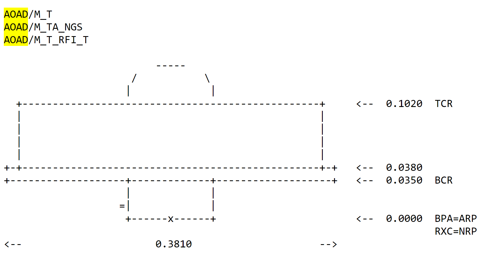
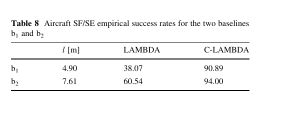
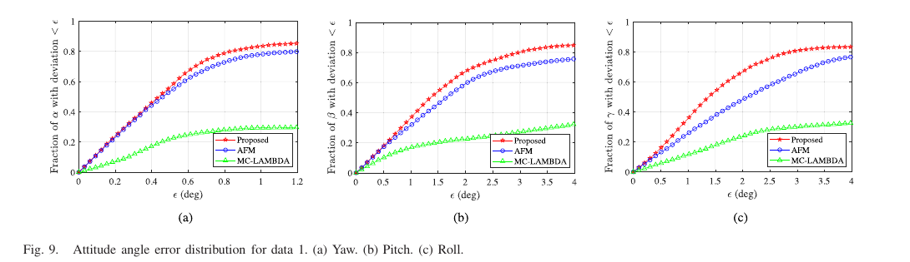

# 2026-07-25 GNSS 每日研究简报

## 今日快报

### 快报 1：RTK-SLAM 基准把“轨迹对齐后很准”与“全球坐标真的准”分开

- 主题：`rtk-slam-absolute-geodetic-benchmark`
- 来源 ID：`doi:10.5194/isprs-archives-xlix-b1-2026-83-2026`
- 来源链接：https://doi.org/10.5194/isprs-archives-XLIX-B1-2026-83-2026
- 发表日期：2026-07-22
- 来源类型：同行评审开放会议论文与公开数据集
- 获取范围：开放全文、数据、标定文件与评测脚本；CC BY 4.0

**内容：** 研究指出，常用 ATE 会先用一个最优 SE(3) 刚体变换把估计轨迹对齐到参考轨迹，因此可吸收整体平移、方位偏差和部分长期漂移，不适合直接回答 RTK-SLAM 的全球坐标是否正确。作者让 RTK 只作为系统输入，另用静态 GNSS 锚点和 Leica TS16 全站仪把独立控制点延伸到遮挡区与室内；数据含 2 个场景、4 条序列、相机/LiDAR/IMU/RTK，以及最长超过 400 s、约 150 m 的室内 GNSS 中断段。

**结论：** 表 4 显示，SE(3) 对齐最多可把绝对误差缩小 76%；完全失去 GNSS 时，单独 RTK 的误差达到 10—40 m，而 LiDAR 辅助 RTK-SLAM 的离线解仍保持分米级。该结果依赖离线全局优化能从中断前后双向传播约束；它不能证明同一算法的在线输出也达到相同水平。

**关注理由：** 定位系统若输出全球坐标，就必须同时报告“不对齐的绝对误差”和“对齐后的相对误差”。否则一个内部形状正确、整体却偏移数米的轨迹，可能被包装成厘米级 SLAM。

### 快报 2：集成相机的 NRTK 接收机能量测立面点，但内部水平精度指标偏乐观

- 主题：`gnss-camera-inaccessible-facade-points`
- 来源 ID：`doi:10.5194/isprs-archives-xlix-b2-2026-901-2026`
- 来源链接：https://doi.org/10.5194/isprs-archives-XLIX-B2-2026-901-2026
- 发表日期：2026-07-23
- 来源类型：同行评审开放会议论文
- 获取范围：开放全文、设备设置、控制点结果与点云比较；CC BY 4.0

**内容：** 作者用 Stonex S999 的 NRTK 坐标、IMU 姿态和内置相机，量测无法直接架杆到达的历史建筑立面点，并以全站仪坐标作参考。试验包含 20 个控制点、190 对三维点间距，还把相机影像经 SfM 生成的点云与 30 站 FARO 扫描点云比较。

**结论：** 设备给出的全局 HRMSE/VRMSE 均为 0.034 m；实测水平与垂向误差仍在约 3—5 cm 量级，但内部指标低估了真实水平误差，且北向出现系统偏移。点云比较中，49%/79%/91%/97% 的点分别落在 0.02/0.04/0.06/0.08 m 内；建筑转角附近因遮挡和多路径明显变差。结果支持亚分米级快速建档，不支持把它替代毫米级全站仪或 TLS。

**关注理由：** “接收机报告的 RMS”不是外部准确度真值。立面量测还叠加相机内参、姿态、杆高、投影交会和多路径，工程验收应保留独立控制点并检查分方向偏差。

### 快报 3：把天线—相机杆臂纳入平差，RTK 直接定向误差从厘米级系统纹理降到约 1—3 cm

- 主题：`rtk-close-range-photogrammetry-lever-arm`
- 来源 ID：`doi:10.5194/isprs-archives-xlix-b1-2026-315-2026`
- 来源链接：https://doi.org/10.5194/isprs-archives-XLIX-B1-2026-315-2026
- 发表日期：2026-07-22
- 来源类型：同行评审开放会议论文
- 获取范围：开放全文、平差流程、误差图与跨年度点云比较；CC BY 4.0

**内容：** 研究在塞浦路斯 Tomb 8 文化遗产场景比较 2022 年依赖地面控制点的模型与 2025 年 RTK-GNSS 触发相机的直接地理配准。关键不是“每张照片已有坐标”本身，而是把天线相位中心到相机投影中心的固定杆臂作为平差参数联合估计。

**结论：** 不估杆臂的两阶段处理，投影中心水平 RMSE 约 6—7 cm、垂向约 4 cm，并呈与相机方向相关的系统图样；联合估杆臂后，水平 RMSE 降至 1.3—1.4 cm、垂向 3.1 cm，估得杆臂约为 X=-0.9 cm、Y=20.6 cm、Z=7.8 cm。2022 与 2025 点云比较中，68% 的点在 1.1 cm 内、95% 在 2.7 cm 内；这是特定场景、设备和控制网下的结果。

**关注理由：** GNSS 与任何外部传感器融合都必须把“测量参考点”讲清楚。忽略杆臂会把姿态变化映射成位置系统误差，且这种误差不能靠增加照片数量自动平均掉。

### 快报 4：林下 RTK 约束改善手持 SLAM 点云一致性，但树冠指标仍由点密度与分割主导

- 主题：`rtk-gnss-handheld-lidar-forest-qsm`
- 来源 ID：`doi:10.5194/isprs-archives-xlix-b2-2026-261-2026`
- 来源链接：https://doi.org/10.5194/isprs-archives-XLIX-B2-2026-261-2026
- 发表日期：2026-07-23
- 来源类型：同行评审开放会议论文
- 获取范围：开放全文、两片林地、三类扫描器、TLS 参考与 QSM 指标；CC BY 4.0

**内容：** 作者在稠密与稀疏林冠样地比较 TLS、带 RTK-GNSS 的 CHCNAV RS10、ZEB Horizon 和 BLK2GO；同一 RS10 数据还分别用 RTK-GNSS SLAM 与不含 GNSS 的 SLAM 重处理，从而隔离绝对约束对拼接的影响。评价覆盖树高、胸径、树位、分枝、树冠和体积等指标。

**结论：** 稠密林冠中，RTK-GNSS SLAM 相对纯 SLAM 把分枝数平均误差从 -6100.25 改善到 -5369，把冠体积误差从 -492.75 m³ 改善到 -357.21 m³；闭环轨迹的点密度为 191.18 points/m³，高于开环的 114.22 points/m³。原文同时强调，低噪声并非由 RTK 本身造成，树冠遮挡、点密度、分割错误和传感器射程仍可支配 QSM 结果。

**关注理由：** RTK 主要约束扫描轨迹的全球一致性，并不直接补回未被激光看到的枝条。应把导航误差、点云覆盖和模型分割误差分账，而不是把所有改善都归因于“厘米级 GNSS”。

### 快报 5：INS 作为持续主状态，地图与视觉只做可失效的更新源

- 主题：`ins-centric-gnss-vio-hd-map-pointloc`
- 来源 ID：`doi:10.5194/isprs-archives-xlix-b1-2026-361-2026`
- 来源链接：https://doi.org/10.5194/isprs-archives-XLIX-B1-2026-361-2026
- 发表日期：2026-07-22
- 来源类型：同行评审开放会议论文
- 获取范围：开放全文、误差状态 EKF、两条实车路线与分场景基线；CC BY 4.0

**内容：** PointLoc 让 INS 持续传播位置、速度和姿态，GNSS、单目 VIO 速度以及 Lanelet2 高精地图匹配按可用性作为 EKF 更新，而不把任一外部模块的坐标直接当最终输出。这样地图覆盖消失时只少一个更新源，导航状态仍可退化运行。

**结论：** 台中 Shuinan 的地图覆盖 GNSS 中断段中，PointLoc 的三维 RMSE 为 0.258 m，GNSS/INS/VIO 为 1.331 m，主要收益来自垂向 RMSE 从 1.214 m 降到 0.039 m；但在台南 Shalun 的暗环境中断段，PointLoc 三维 RMSE 0.390 m，反而略差于 GNSS/INS/VIO 的 0.363 m。说明地图几何能稳住道路高度，却不保证所有场景的平面分量都改善。

**关注理由：** “优雅降级”需要逐场景报告：当 GNSS、视觉或地图分别不可用时，剩余更新到底约束了哪个方向。只给全路线平均值会掩盖高度漂移和地图关联失败。

## 深度研读

### 深读 1｜接收机工程｜天线相位中心为什么不是外壳上的一个固定点

- 类别：`receiver-engineering`
- 学习层级：`foundation`
- 选题定位：`经典基础`
- 来源 ID：`navipedia:antenna-phase-centre`
- 来源链接：https://gssc.esa.int/navipedia/index.php?title=Antenna_Phase_Centre
- 发表日期：2011（页面 2024-06-12 修订）
- 来源类型：ESA/GMV Navipedia 技术条目
- 获取范围：公开全文、公式与原始示意图；页面未声明开放内容许可，图仅作最小研究评论并保留原标注
- 价值评分：91/100（相关性 20，经典价值 22，证据 16，教学价值 18，工程价值 15）

#### 为什么先学这个

双天线航向并不是从两个塑料外壳中心连线得到，而是从两副天线对每颗卫星的载波相位差反演电气基线。若相位中心随频点、仰角和方位变化，观测中就会出现与姿态相关的相位偏差；后两节再强的整数搜索也不能把未建模的天线方向图自动变成白噪声。

#### 先修知识

天线参考点（ARP）是机械上可重复量测的基准；平均相位中心相对 ARP 的三维偏移称相位中心偏移（PCO）；单个来波方向相对平均中心的变化称相位中心变化（PCV）。ANTEX 文件按天线型号、频点、仰角和方位提供校准。载波相位以周或长度表示，L1 一周约 19 cm，因此毫米级方向相关误差已经会影响短基线姿态。

#### 一句话逻辑

接收机估计的是“来波方向所见的电气相位中心”，工程坐标却绑在 ARP；PCO/PCV 就是两者之间必须随方向与频点处理的映射。

#### 研究问题与约束

Navipedia 条目解释相位中心、PCO、PCV、相对/绝对校准和 ANTEX 的关系。它是基础技术条目，不是某一双天线产品的温度、安装面、互耦或车体遮挡实验；条目给出的毫米级描述针对高端天线，不能外推到任意低成本贴片天线。

#### 核心方法论

为每个频点把机械参考点加上 PCO，再把卫星视线方向对应的 PCV 投影到观测方向。两副天线形成基线时，必须让两端使用相容的绝对校准、同一姿态坐标约定和正确的天线朝向。若两天线同型号、同朝向且环境近似对称，一部分共模误差可在差分中抵消；不同安装、不同方向图或近场遮挡会留下差分残差。

#### 关键公式逐步推导

以机械标志点 $`\mathbf r_M`$ 为起点，接收天线实际用于观测的相位中心为：

```math
\mathbf r_{\mathrm{APC}}
=\mathbf r_M+\Delta\mathbf r_{\mathrm{ARP}}+\Delta\mathbf r_{\mathrm{PCO}}(f)
```

对卫星视线单位向量 $`\mathbf u^s`$，把方向相关 PCV 写进以米计的载波观测：

```math
L_f^s
=\rho^s+c(\delta t_r-\delta t^s)+T^s-I_f^s
+\lambda_f N_f^s
+\mathbf u^{sT}\Delta\mathbf r_{\mathrm{PCO}}(f)
+\mathrm{PCV}_f(\mathrm{az},\mathrm{el})+\varepsilon_L
```

同星在两天线 A、B 间作差，基线 $`\mathbf b=\mathbf r_B-\mathbf r_A`$ 进入：

```math
\Delta L_f^s
\approx \mathbf u^{sT}\mathbf b+\lambda_f\Delta N_f^s
+\Delta\mathrm{PCV}_f^s+\Delta\varepsilon_L
```

所以 PCV 差不是“固定坐标偏置”，而是会随卫星方向和平台姿态变化的观测项。

#### 经典价值与创新边界

ARP—PCO—PCV 分层把可量测机械几何与方向相关电磁响应分开，是精密 GNSS 可复现安装的基础。条目本身不提出新估计算法，也没有覆盖天线互耦、机体散射、温漂和低成本天线批次差异；这些必须用实际装机校准补足。

#### 整体逻辑链

机械安装给出 ARP；实验室或机器人校准生成各频点 PCO/PCV；接收机按每星方位、仰角改正载波；天线间差分留下真实几何基线与整数模糊度；若校准和姿态约定正确，后续 C-LAMBDA/C-WLS 才能把残差近似看成有界噪声。

#### 原文图表与结果分析



> 图源：Navipedia《Antenna Phase Centre》Figure 1，[原文](https://gssc.esa.int/navipedia/index.php?title=Antenna_Phase_Centre)。直接保存页面提供的 1811×950 PNG；未裁切、重采样、重绘或改动字符与数值。页面未声明开放内容许可，按最小研究评论引用，不主张再分发权。

图中用 ASCII 尺寸标注把天线型号的机械轮廓、BPA=ARP 等参考点和若干垂向尺寸联系起来。它直接说明“坐标参考”首先是可重复的机械定义，而不是把天线罩顶点当相位中心。图中没有给出随方位/仰角变化的 PCV，也没有频点标签，因此不能据此生成完整 ANTEX 校准。

#### 原文结果论述

条目指出，相位中心既随信号方向也随频率变化；IGS 自 GPS week 1400 起使用绝对天线相位中心校准，并警告不要混用相对与绝对 PCV。页面还说明，高端天线的方位 PCV 通常为数毫米量级；这只是量级说明，不是对本项目天线的误差上限。

#### 常见误区与适用边界

第一，把 ARP、几何中心和 APC 当成同一点。第二，只改 PCO，不改方向相关 PCV。第三，L1 与 L2/L5 共用一个相位中心。第四，ANTEX 型号或 radome 代码不匹配仍照套。第五，两天线朝向相反却假设误差共模。第六，用短基线差分“会消掉一切”掩盖车体散射和互耦。第七，校准后不再检查天线松动与热变形。

#### 工程实现步骤

1. 把 ARP、连接器方向、天线北向标记和机体坐标系写入安装图。
2. 读取与天线、radome、频点完全匹配的绝对 ANTEX PCO/PCV。
3. 由平台姿态把每星视线旋转到天线坐标系，再插值方位—仰角 PCV。
4. 对两天线分别改正后再形成单差/双差，保留未改正链作对照。
5. 记录温度、安装面、线缆和天线交换实验，检查差分残差是否随方位重复。
6. 将剩余方向相关误差并入观测方差或天线专属校准，而非硬塞进整数模糊度。

#### 复现实验设计

在开阔场地把两副同型号天线固定在 1.000 m 刚性梁上，采 24 h 的 1 Hz GPS+Galileo L1/L5 数据。设置四条链：无 APC、仅 PCO、PCO+无方位 PCV、完整 PCO+PCV；再把 B 天线旋转 180°重复。以全站仪基线和经校准双天线解为参考，报告每星相位残差随方位/仰角分箱、基线长度偏差、航向 RMSE、模糊度固定率和日内温度相关性。失败用例包括错 radome 代码、错天线朝向、5 mm ARP 高度误差和一侧近场金属板。

#### 与定位及低成本实现的联系

短基线航向的角误差近似满足 $`\sigma_\psi\approx\sigma_\perp/l`$；同样的横向基线误差在 0.3 m 基线上比 3 m 基线上放大十倍。低成本贴片天线既短基线又更易受机体方向图影响，因此“先把参考点与方向误差建模清楚”往往比换更复杂的整数搜索更有收益。

#### 本节小结

天线相位中心是随方向和频率变化的电气概念，ARP 才是机械可复现点。双天线定向要先正确处理 PCO/PCV，整数约束才能约束真实几何而不是吸收安装误差。

### 深读 2｜接收机工程｜把已知基线长度真正放进整数目标函数

- 类别：`receiver-engineering`
- 学习层级：`intermediate`
- 选题定位：`基础进阶`
- 来源 ID：`doi:10.1007/s10291-010-0164-x`
- 来源链接：https://doi.org/10.1007/s10291-010-0164-x
- 发表日期：2010-03-13（卷期 2011）
- 来源类型：同行评审开放期刊论文
- 获取范围：开放全文、公式、仿真、陆地/船舶/飞机实验与原始表格；PDF 未声明开放再许可，图表仅作最小研究评论
- 价值评分：95/100（相关性 20，经典价值 23，证据 20，教学价值 17，工程价值 15）

#### 为什么先学这个

上一节得到经天线校准的双差载波，但每颗非参考星仍带一个整数模糊度。标准 LAMBDA 先在无基线长度约束的浮点解附近搜索，再用长度做事后筛选，会浪费刚性平台已经知道的信息。C-LAMBDA 把 $`\|\mathbf b\|=l`$ 直接放进混合整数最小二乘，使球面约束在搜索阶段就参与定权。

#### 先修知识

双差消去接收机钟与卫星钟；短基线可近似忽略差分电离层和对流层。浮点解允许模糊度取实数，固定解要求其为整数。LAMBDA 用去相关降低整数搜索复杂度。基线长度约束是非线性的球面，不是简单的线性伪观测。

#### 一句话逻辑

不是“整数候选出来后量一下长度”，而是让每个整数候选都按其在已知半径球面上的最佳残差接受统一检验。

#### 研究问题与约束

论文检验无辅助、单频、单历元 GNSS compass 的最困难冷启动情形，覆盖仿真、两组静态、船舶与 Cessna Citation II 飞行。实验年代早、主要使用 GPS L1，接收机与计算平台也已过时；结果证明约束原理与当时数据上的鲁棒性，不代表现代多频接收机在城市峡谷必然达到同一固定率。

#### 核心方法论

把双差码相观测写成 $`E(\mathbf y)=A\mathbf a+B\mathbf b`$，其中 $`\mathbf a\in\mathbb Z^n`$、$`\mathbf b\in\mathbb R^3`$。已知刚性基线长度 $`l`$ 后，C-LAMBDA 对每个整数候选求球面约束下的最佳基线，并把浮点模糊度距离与基线约束代价共同组成非椭球目标；搜索过程中不断收缩上界。

#### 关键公式逐步推导

加权观测模型为：

```math
E(\mathbf y)=A\mathbf a+B\mathbf b,\qquad
D(\mathbf y)=Q_{yy}
```

GNSS compass 加入两个离散/几何条件：

```math
\mathbf a\in\mathbb Z^n,\qquad
\mathbf b\in\mathbb R^3,\qquad
\|\mathbf b\|=l
```

于是直接求解：

```math
\min_{\mathbf a\in\mathbb Z^n,\ \mathbf b\in\mathbb R^3,\ \|\mathbf b\|=l}
\|\mathbf y-A\mathbf a-B\mathbf b\|_{Q_{yy}}^2
```

消去连续参数后，整数目标可理解为：

```math
F(\mathbf a)
=\|\hat{\mathbf a}-\mathbf a\|_{Q_{\hat a\hat a}}^2
+\min_{\|\mathbf b\|=l}
\|\hat{\mathbf b}(\mathbf a)-\mathbf b\|_{Q_{bb}(\mathbf a)}^2
```

第一项偏好靠近浮点模糊度，第二项惩罚无法落到已知长度球面的候选；两者共同决定固定解。

#### 经典价值与创新边界

C-LAMBDA 的经典价值是把刚性基线的非线性几何信息以统计一致的方式纳入整数最小二乘，而不是事后阈值。它仍依赖正确的协方差、无周跳的单历元观测和可信的基线长度；多路径造成的系统偏差、错误天线校准与结构变形不会因“约束更强”自动消失。

#### 整体逻辑链

形成短基线双差码相；求无约束浮点模糊度和基线；以当前整数上界构造非椭球搜索空间；对候选做球面约束最小化；不断收缩搜索；通过验证后输出固定基线；再由 ENU 基线计算航向与俯仰。

#### 原文图表与结果分析



> 图源：Teunissen、Giorgi、Buist《Testing of a new single-frequency GNSS carrier phase attitude determination method: land, ship and aircraft experiments》Table 8，[原文](https://doi.org/10.1007/s10291-010-0164-x)。从 PDF 第 11 页以 144 dpi 渲染，仅裁取 Table 8；未重绘、重采样数据或改动字符与数值。PDF 未声明开放再许可，按最小研究评论引用。

表中基线 $`b_1`$、$`b_2`$ 长度分别为 4.90 m、7.61 m；标准 LAMBDA 固定率为 38.07%、60.54%，C-LAMBDA 为 90.89%、94.00%。这直接支持“长度约束在高动态、单频、单历元中显著收窄候选”。表没有给出错误固定造成的姿态尾部，也不能把较长基线的更高固定率单独归因于长度，因为两基线天线位置和多路径不同。

#### 原文结果论述

飞机在 2007-11-01 以 10 Hz 记录 154511 个历元，通常跟踪 8—9 颗卫星、平均 PDOP 约 2。C-LAMBDA 两条基线平均计算时间为 31.9 ms 和 19.4 ms，标准 LAMBDA 为 7.7 ms 和 7.5 ms，平台是 2.13 GHz Core 2 的 MATLAB 实现。与 INS 比较的角差经验标准差为航向 0.10°、俯仰 0.18°、横滚 0.18°。这些数值证明特定实验链，不是现代嵌入式实时预算或通用完整性保证。

#### 常见误区与适用边界

第一，把长度约束只当固定后的验差。第二，基线热胀或安装误差存在时仍使用毫米级硬约束。第三，只看固定率，不统计错误固定。第四，把单历元等同于可用过去状态的实时滤波。第五，忽略码噪声和双差相关性。第六，认为更长基线总更易固定，忘记两端多路径和结构柔性。第七，用固定后的平滑姿态掩盖错误整数的离散跳变。

#### 工程实现步骤

1. 用短基线共视卫星形成码相双差，显式构造完整协方差。
2. 量测刚性基线长度及温度系数，定义允许的不确定度。
3. 求浮点 $`\hat{\mathbf a},\hat{\mathbf b}`$ 与协方差，并进行去相关。
4. 为整数候选求球面约束的条件基线和目标函数上界。
5. 采用收缩—枚举—最小化流程，记录搜索节点数与耗时。
6. 用比值检验、残差、长度后验和姿态连续性联合验证，失败则保留 float。
7. 把固定状态、候选间隔与天线质量指标传给姿态/控制系统。

#### 复现实验设计

在转台上安装 0.5/1/2 m 三种基线，采 10 Hz GPS+Galileo L1/E1 数据；设置静止、10°/s 匀速、60°/s 转动和角加速度阶跃。比较标准 LAMBDA、事后长度筛选、C-LAMBDA 三条链，分别注入 1/3/5 mm 相位噪声、0/5/10 mm 长度偏差、单星 30 mm 多路径和随机周跳。报告正确固定率、错误固定率、首次固定时间、航向/俯仰 RMSE、95/99.9% 尾部、每历元节点数和 CPU 时间。基线真值由编码转台与全站仪联合给出。

#### 与定位及低成本实现的联系

已知长度是低成本双天线少数高质量先验之一，可在码噪声大时显著增强整数解。但低成本车体也更可能存在天线罩、柔性支架与热变形；工程上应把“长度已知”写成有方差的校准量并监测后验残差，不能用无限强约束制造虚假的高固定率。

#### 本节小结

C-LAMBDA 的关键不是多一个阈值，而是把基线球面约束写入整数目标函数。它用计算复杂度换取更高的单频单历元固定率，但收益成立的前提是长度、协方差和天线误差模型可信。

### 深读 3｜定位｜不先固定整数，直接在包裹相位上搜索姿态

- 类别：`positioning`
- 学习层级：`advanced`
- 选题定位：`定位深入`
- 来源 ID：`doi:10.1109/tim.2022.3193412`
- 来源链接：https://doi.org/10.1109/TIM.2022.3193412
- 发表日期：2022-07-25
- 来源类型：同行评审期刊论文
- 获取范围：机构存档的最终论文全文、公式、仿真与静态实验；页面未给出开放再许可，图仅作最小研究评论
- 价值评分：95/100（相关性 20，经典价值 20，证据 20，教学价值 17，工程价值 18）

#### 为什么先学这个

C-LAMBDA 在整数域中搜索并为每个候选解受约束基线；卫星少、噪声大或多基线维数升高时，依赖浮点解构造的整数搜索空间可能暴涨。C-WLS 换一个视角：观测真正可见的是载波相位的小数部分，整数只决定“绕了多少周”。若直接最小化包裹后的相位残差，就可先在单位球面/正交姿态空间搜索，再隐式恢复整数。

#### 先修知识

包裹算子把相位映射到 $`[-0.5,0.5)`$ 周；双差相位的整数部分在包裹后消失。单基线只给航向与俯仰两个自由度，多条不共线基线才能求完整三维旋转矩阵。刚性阵列在机体系中的基线矩阵 $`X_b`$ 已知，参考系基线满足 $`X=RX_b`$ 与 $`R^TR=I`$。

#### 一句话逻辑

用 `wrap(观测相位−几何相位)` 直接评价一个候选姿态，让整数模糊度由残差跨周次数隐式返回，而不把“先固定整数”设为必经步骤。

#### 研究问题与约束

论文研究多天线 GNSS 的单频、单历元姿态，提出 C-WLS 并与 AFM、C-LAMBDA/MC-LAMBDA 比较。仿真使用 2021-11-07 的 GPS 星座、10°截止角、1 m 基线和高斯噪声；实测为两组静态数据，且比较只用 GPS，真值却融合 GPS+GLONASS、IMU 和气压计的长时解。它尚未证明高动态、非高斯多路径和天线形变下的同等性能。

#### 核心方法论

把双差相位矩阵 $`\Psi`$、几何矩阵 $`H`$ 与机体系基线 $`X_b`$ 组合，直接在允许的旋转集合上最小化包裹残差。单基线时，各卫星观测把单位球面切成圆带，圆的交点产生粗候选，再做连续优化精化。多基线时先分别取候选，用已知基线夹角筛选组合，经 Wahba/SVD 投影到正交旋转矩阵，最后联合精化。

#### 关键公式逐步推导

以周为单位写双差相位：

```math
\Psi=HRX_b+N+E,\qquad N\in\mathbb Z^{S\times A}
```

对两边取包裹残差，整数矩阵消失：

```math
\operatorname{wrap}(\Psi-HRX_b)
=\operatorname{wrap}(E)
```

于是 C-WLS 直接求：

```math
\hat R
=\arg\min_{R\in\mathcal S}
\left\|\operatorname{wrap}\!\left[
\operatorname{vec}(\Psi-HRX_b)
\right]\right\|_{Q^{-1}}^2
```

其中单基线的 $`\mathcal S`$ 是单位球面，多基线的 $`\mathcal S`$ 是正交旋转集合。求得 $`\hat R`$ 后，整数可由最近整数恢复：

```math
\hat N
=\operatorname{round}\!\left(\Psi-H\hat R X_b\right)
```

包裹残差只在真实残差小于半周且噪声模型成立时与未包裹最小二乘一致；跨过边界会产生非凸多极值。

#### 经典价值与创新边界

C-WLS 把“模糊度整数性”转化为相位周期性约束，并利用单位球面、基线夹角和正交矩阵结构缩小搜索，避免完全依赖浮点模糊度。创新边界是其搜索仍依赖短米级基线、有限候选和残差界；复杂度不会凭空消失，而是从高维整数域转移到几何候选生成与非凸精化。

#### 整体逻辑链

天线校准后形成双差相位；由每条基线的已知长度生成球面候选；用包裹残差筛选；多基线用夹角约束组合候选；SVD 投影到正交旋转；连续精化；从最终姿态反推整数；输出航向、俯仰、横滚及残差质量。

#### 原文图表与结果分析



> 图源：Liu 等《Constrained Wrapped Least Squares: A Tool for High-Accuracy GNSS Attitude Determination》Figure 9，[原文](https://doi.org/10.1109/TIM.2022.3193412)。从机构存档最终 PDF 第 14 页以 144 dpi 渲染，仅裁取 Figure 9；未重绘、重采样数据或改动坐标、曲线、图例和标签。存档页未声明开放再许可，按最小研究评论引用。

三幅图横轴分别为 yaw/pitch/roll 误差阈值 $`\epsilon`$（deg），纵轴为绝对误差小于该阈值的历元比例；红、蓝、绿分别是 C-WLS、AFM、MC-LAMBDA。直接读图，遮挡较强的 Data 1 中，C-WLS 在较大的俯仰/横滚阈值范围内保持最高累计比例，MC-LAMBDA 的成功覆盖最低；航向在约 0.4°以前红蓝接近。图是条件累计分布，不显示错误固定的时间聚集，也不能证明动态转弯中的连续性。

#### 原文结果论述

两组静态数据以 5 Hz 采集：Data 1 约 9000 历元/30 min，周围有树木与建筑；Data 2 为 25500 历元、卫星视野较好。表 4 报告 MC-LAMBDA/AFM/C-WLS 成功率在 Data 1 分别为 25.85%/76.20%/83.18%，Data 2 为 99.28%/97.64%/99.33%。表 5 只对成功历元计算 RMSE，因此不能把低成功率方法的条件 RMSE当成全时段性能。

#### 常见误区与适用边界

第一，认为 wrap 后问题变成凸优化。第二，残差可能超过半周仍使用同一局部模型。第三，只报成功历元 RMSE，隐藏不可用时段。第四，把静态遮挡结果外推到高动态。第五，多基线共用天线时忽略双差相关。第六，机体系基线夹角校准错误却强制正交。第七，单位球面搜索步长太粗，误把没有候选当数据故障。第八，用长基线时不控制候选数增长。

#### 工程实现步骤

1. 标定机体系基线矩阵 $`X_b`$、长度、夹角和天线方向误差。
2. 形成双差相位与完整 $`Q`$，按原文条件设置 10°或经验证的截止角。
3. 单基线从球面圆交点生成候选，保留若干最优解而非只取一个。
4. 多基线按夹角门限组合，剔除不符合刚性阵列的候选。
5. 用 Wahba/SVD 得到正交初值，再最小化加权包裹残差。
6. 反推整数并以未包裹码相残差、长度、角度与时间连续性验证。
7. 输出成功标志、次优目标差、候选数和运行时间；失败时降级到 float/惯导。

#### 复现实验设计

搭建两条互相不共线的 1 m 基线，三接收机同步采 5 Hz GPS L1 载波。开放天空与建筑/树木遮挡各采 60 min，再用转台加入 0/5/30°/s 旋转。比较 AFM、C-LAMBDA/MC-LAMBDA、C-WLS；统一 10°截止角、同一双差参考星与协方差。报告全历元可用率、正确整数率、含失败历元的角度 RMSE、99.9% 误差、候选数、CPU 时间和连续失效长度。额外注入 1/3/5/7 mm 相位噪声、5 mm 基线长度误差、1°夹角误差、单星半周跳与天线 PCV 不匹配；基线真值由转台编码器和全站仪给出。

#### 与定位及低成本实现的联系

双天线航向在静止时也可观测，不依赖磁场且不随时间漂移，适合给低成本 IMU 校准偏置和约束 yaw。C-WLS 在卫星少、浮点解差时可能比整数域搜索更稳，但低成本实现必须控制球面网格、候选数与精化次数，并把失败检测置于“角度看起来平滑”之前。

#### 本节小结

C-WLS 不取消整数模糊度，而是利用相位周期性让整数从包裹残差中隐式恢复。它把双天线长度、夹角和旋转正交性统一进几何搜索，在遮挡静态实验中提高成功率；动态与模型失配仍需独立验证。
