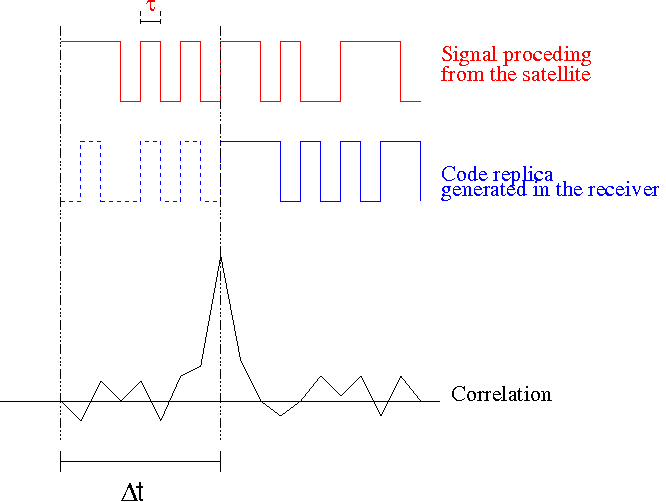
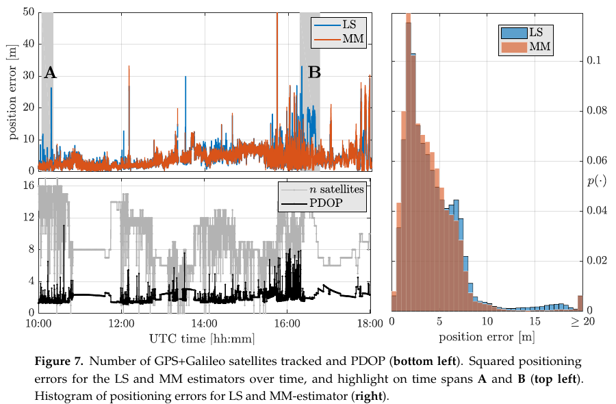
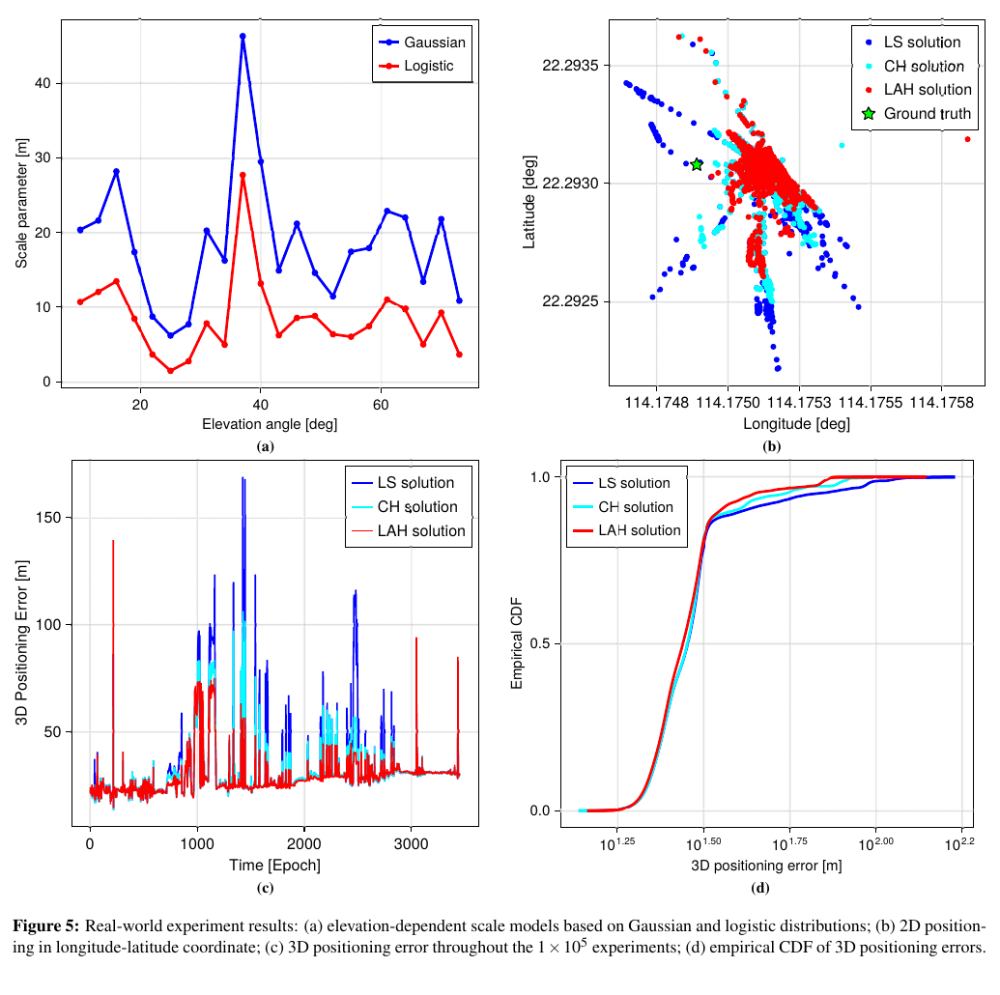

# 2026-07-26 GNSS 每日研究简报

## 今日快报

### 快报 1：用 VLBI 台站自身 GNSS 数据建区域电离层模型，准实时 UT1 更接近事后产品

- 主题：`gnss-regional-ionosphere-vlbi-ut1`
- 来源 ID：`arxiv:2607.15791`
- 来源链接：https://arxiv.org/abs/2607.15791
- 发表日期：2026-07-17
- 来源类型：期刊录用论文的作者预印本
- 获取范围：开放全文、公式、9 幅图和实验流程；预印本未声明开放再许可

**内容：** 面向单频 VLBI 测量 UT1 时全球预报电离层图时效与区域精度不足的问题，作者用吉林—喀什 VLBI 台站共址 GNSS 数据独立构建单站区域 VTEC 模型，再把视线电离层延迟改正送入 DiFX、AIPS/ParselTongue 和最小二乘 UT1 解算链。原文比较全球预报、全球事后与单站区域三类模型，实验窗口为 2024-12-17 15:00—17:00 UTC。

**结论：** 作者报告，区域模型改正后的 UT1 相对 USNO 参考值平均偏差为 −15.6 μs、RMS 偏差为 82.3 μs，均优于另外两类模型；其视线延迟的离散范围与全球事后模型接近。该结论来自一条基线、一个 2 h 观测任务，说明“共址 GNSS 可支撑准实时区域改正”，不能外推为所有纬度、季节和电离层扰动条件下的长期精度保证。

**关注理由：** GNSS 在这里不是直接给坐标，而是给 VLBI 的传播介质改正。工程上应继续检查模型更新延迟、低仰角映射函数、台站周围空间梯度和强磁暴条件；若把单任务结果投入业务，还需用独立日期与双频 VLBI 解作外部验证。

### 快报 2：把同一授时源下多基站的共同漂移相关起来，可在管理面暴露 GNSS 欺骗

- 主题：`gnss-spoofing-tdd-3gpp-management-correlation`
- 来源 ID：`arxiv:2607.11398`
- 来源链接：https://arxiv.org/abs/2607.11398
- 发表日期：2026-07-13
- 来源类型：机构作者预印本（仿真与标准框架提案）
- 获取范围：开放全文、算法、阈值、场景分析和 Monte Carlo 结果；预印本未声明开放再许可

**内容：** 论文针对 TDD 基站依赖 GNSS 驯服主时钟、但 3GPP 管理面缺少标准化欺骗告警的问题，提出三层框架：依据 TS 28.111/28.552 定义告警和性能计数器，按服务主时钟分组相关 gNB-DU 的漂移，并把确认事件桥接到 TR 33.894 的 SECHAND。仿真每组使用 5 min、15 s 间隔的 20 个样本，每个参数配置 10000 次试验，攻击漂移率为 0.1—5.0 ns/s。

**结论：** 在 $`\sigma_{\mathrm{PTP}}\le5\ \mathrm{ns}`$ 的良好 PTP 网络、相关阈值 0.85、最小漂移 10 ns 条件下，作者报告漂移率不低于 0.5 ns/s 时，5 min 窗内检测概率超过 95%，误报约 0.8%—0.9%。这些是高斯噪声和线性共同漂移下的 Monte Carlo 结果，不是硬件在环或运营商现场验证；论文也把实验室和实网试验列为后续工作。

**关注理由：** 单台接收机的 $`C/N_0`$ 或时钟告警很难区分欺骗、GNSS 失锁、PTP 路径变化与设备故障；拓扑相关提供了额外判别维度。但慢漂攻击可能低于本地振荡器漂移，维护操作也能产生共同阶跃，部署时必须保留维护窗口、独立振荡器和安全管理通道。

### 快报 3：两次 LEO 多普勒过境的误差椭圆夹角，可预测稀疏机会信号的互补性

- 主题：`leo-dual-pass-doppler-geometry-selection`
- 来源 ID：`arxiv:2607.10241`
- 来源链接：https://arxiv.org/abs/2607.10241
- 发表日期：2026-07-11
- 来源类型：作者预印本（实测验证、解析模型与仿真）
- 获取范围：开放全文、13 幅图、Iridium/ORBCOMM 实测设置和推导；预印本未声明开放再许可

**内容：** 研究把单次 LEO 多普勒过境的二维不确定度写成误差椭圆，并在信息域合并两次过境：接收机位置共用，而钟漂和时间改正作为各过境独立未知量。单次与双次模型先由 Iridium 实测检查；随后用 2026-03-29 至 04-09 的十日 ORBCOMM 观测，分析两椭圆长轴夹角与等待时间。

**结论：** 原文的解析关系和受控仿真表明，夹角增大通常提升互补性；约 20° 的夹角可对应约 50 m 的理论二维精度。十日数据还显示，合适的第二次过境通常可在约 30 min 内出现，但具体数据集的“最佳可达”曲线在数分钟内已低于 50 m。这里的 50 m 是基于协方差模型的理论量，不等于含星历、发射频率偏差和非高斯误差的端到端实测 95% 精度。

**关注理由：** “多等一颗星”未必有用，若两条轨迹提供近乎平行的弱观方向，信息仍然冗余。接收机可在第一条过境后预测候选误差椭圆，为扫描、功耗和等待策略排序；同时要把发射频率不确定度、低仰角过境与轨道误差纳入调度门限。

### 快报 4：月球南极卫星都聚在头顶时，三座近地平线信标比继续堆卫星更有效

- 主题：`lunar-south-pole-pnt-gdop-surface-beacons`
- 来源 ID：`arxiv:2607.06212`
- 来源链接：https://arxiv.org/abs/2607.06212
- 发表日期：2026-07-07
- 来源类型：作者预印本（建模研究）
- 获取范围：开放全文、模型参数、1 幅图、2 张表与局限声明；预印本未声明开放再许可

**内容：** 论文用代表性椭圆月球冻结轨道（半长轴 6142 km、偏心率 0.6、倾角 57.7°）扫描 4—24 星星座，并由视线单位向量和钟差列构造 $`H`$、计算 $`\mathrm{GDOP}=\sqrt{\operatorname{tr}[(H^TH)^{-1}]}`$。作者另为 −80° 纬度用户布设三座位于约 2 km 高地的地面测距信标，用近地平线方向补足轨道星的角度多样性。

**结论：** 模型中，6 星纯轨道方案的中位 GDOP 为 16.2，低于 GDOP 6 的时间占 15%；加入三信标后分别变为 1.6 和 100%。约 12 星时纯轨道中位 GDOP 才降到 5.2，24 星为 3.4。作者只验证了 GDOP 计算器的一致性；星座、信标和这些数字均为理想化建模，未包含完整摄动星历、地形遮挡、信标钟与测距误差。

**关注理由：** DOP 受方向张成空间控制，不由可见星数单独决定。月球无大气折射，信标的表面视距被几何地平线硬限制，因此选址、月球参考框架和信标坐标标定会成为系统级误差项；几何收益不能直接替代链路预算和完整误差预算。

### 快报 5：LEO 上先压缩时频数据再做延迟—多普勒匹配，1 GB 样本可缩到不足 1 MB

- 主题：`leo-quasi-direct-geolocation-gnss-jammer`
- 来源 ID：`arxiv:2607.02190`
- 来源链接：https://arxiv.org/abs/2607.02190
- 发表日期：2026-07-02
- 来源类型：ION GNSS+ 2026 投稿预印本（真实在轨试验）
- 获取范围：开放全文、数学框架、15 幅图和 Jammertest 2025 数据；预印本未声明开放再许可

**内容：** 作者利用改作频谱传感器的 OPS-SAT PRETTY GNSS-R 卫星，在 Jammertest 2025 一次过境中采集双贴片天线 I/Q。准直接地理定位（QDG）先用 STFT、8 bit 重量化和 $`P_{\mathrm{FA}}=0.001`$ 去噪压缩，再在量化时频域进行 FOA/PDOA 匹配；27 段各 1 s 采集的双天线约 1 GB 原始样本被压到不足 1 MB。

**结论：** 对挪威 Bleik 发射的 50 W L5 连续波测试干扰机，最大相关峰落在真值周围 0.5 km² 区域内；峰值处作者给出的 95% 最小尺度精度上界约 900 m，误差椭圆短半轴约 50 m，说明单次轨道几何高度各向异性。滤除强源后又出现与已知波罗的海干扰热点方向一致的低 SNR 能量，但这只是相关峰线索，不能视为已逐台确认的地面发射机清单。

**关注理由：** 该方法把“必须下传全部 I/Q”改成“在轨保留足够的时频内积”，适合下行和算力受限的小卫星。下一步仍需多星验证、实时低功耗实现，并系统测试发射频率偏差、地形高程误差和多源同频情况下的误定位概率。

## 深度研读

### 深读 1｜接收机工程｜伪距为什么不是几何距离，而是带钟差与传播误差的到达时间

- 类别：`receiver-engineering`
- 学习层级：`foundation`
- 选题定位：`经典基础`
- 来源 ID：`navipedia:gnss-basic-observables`
- 来源链接：https://gssc.esa.int/navipedia/index.php/GNSS_Basic_Observables
- 发表日期：2011
- 来源类型：ESA/GMV Navipedia 技术条目
- 获取范围：公开全文、公式与原始示意图；页面未声明开放内容许可，图仅作最小研究评论并保留原标注
- 价值评分：94/100（相关性 20，经典价值 23，证据 17，教学价值 19，工程价值 15）

#### 为什么先学这个

单点定位最终输入的不是“卫星到接收机真距离”，而是接收机把来波 PRN 码与本地码副本滑动相关后得到的传播时间。卫星钟、接收机钟、对流层、电离层、硬件延迟、多路径和热噪声都进入同一个码观测。先把观测量的物理来源拆开，才能理解下一节为什么普通最小二乘会被少数异常伪距拖走，以及第三节为什么需要为长尾误差重新标定 Huber 尺度。

#### 先修知识

卫星在发射时刻 $`T_1`$ 广播带 PRN 码的导航信号，接收机在接收时刻 $`T_2`$ 用同一 PRN 生成本地副本。相关峰所在的码延迟给出传播时间。坐标通常在 ECEF 中表示；一颗卫星的一条伪距给一个球面约束，三维位置外还要估接收机钟差，因此至少需要 4 颗几何不退化的卫星。

#### 一句话逻辑

用码相关估计“接收钟读数减发射钟读数”，乘光速得到伪距，再把所有可建模偏差改正后，用多星非线性几何共同估计位置与接收机钟差。

#### 研究问题与约束

条目给出码、载波和多普勒三类 GNSS 基本观测的形成与通用模型。本节只展开码伪距到 SPP 的链条。条目是教学性技术资料，不对应某款接收机、采样率或城市实测；“载波相位通常比码精密两个数量级”等表述是典型量级，不能替代具体信号和硬件的噪声测试。

#### 核心方法论

相关器在候选延迟上累积接收码与本地副本的乘积，峰值给 $`\Delta T`$。接收钟和卫星钟不完全同步，使 $`c\Delta T`$ 成为“伪”距离。SPP 先用广播星历和卫星钟改正构造每星计算伪距，再迭代线性化几何距离；残差中仍包含模型不完备和测量误差，权阵决定各星对更新量的影响。

#### 关键公式逐步推导

接收机直接形成的码观测为：

```math
R_P=c\,[t_r(T_2)-t^s(T_1)]
```

令两只钟相对 GNSS 系统时的偏差分别为 $`dt_r,dt^s`$，而真传播距离为 $`\rho=c(T_2-T_1)`$，则：

```math
R_P=\rho+c(dt_r-dt^s)
```

加入传播、硬件和环境项：

```math
R_P^s=\rho^s+c(dt_r-dt^s)+T^s+\alpha_f\,STEC^s
+K_{P,r}-{K_P}^s+\mathcal M_P^s+\varepsilon_P^s
```

卫星钟和可用模型改正后，对当前接收机近似位置 $`\mathbf r_0`$ 线性化：

```math
v^s\approx
-{\mathbf e^s}^{T}\delta\mathbf r+c\,\delta dt_r+\eta^s
```

把 $`m\ge4`$ 颗卫星叠成 $`\mathbf v=H\delta\mathbf x+\boldsymbol\eta`$，加权最小二乘更新为：

```math
\delta\hat{\mathbf x}
=(H^TWH)^{-1}H^TW\mathbf v,\qquad
\mathbf x=[x,y,z,c\,dt_r]^T
```

迭代更新坐标和钟差，直到位置增量与残差变化低于门限。

#### 经典价值与创新边界

“码延迟—伪距—多球交会”是所有 GNSS 绝对定位的入口，也是接收机最容易独立输出的观测。它的经典价值在于无需先固定整数模糊度即可给出全球绝对位置。边界是码观测噪声和多路径通常远大于载波；相关峰只说明本地副本与接收码最相似，并不保证峰来自直达路径，也不保证后端误差呈独立高斯分布。

#### 整体逻辑链

接收 RF 信号；下变频和采样；用 PRN 副本捕获并跟踪码延迟；解调导航电文得到广播轨道与卫星钟；改正传播项；按每星视线构造 $`H`$；WLS 估位置和接收钟；检查残差和几何；输出 PVT。异常相关峰若进入伪距，会通过 $`H`$ 和权阵传播到位置，这正是后两节鲁棒化的对象。

#### 原文图表与结果分析



> 图源：ESA/GMV Navipedia《GNSS Basic Observables》Figure 1，[原文](https://gssc.esa.int/navipedia/index.php/GNSS_Basic_Observables)。直接保存页面提供的 666×502 PNG；未裁切、重采样、重绘或改动波形、文字与标记。页面未声明开放许可，按最小研究评论引用，不主张再分发权。

上方红线是卫星来码，蓝线是接收机生成并滑移的码副本，黑线是相关输出；两条竖虚线之间的 $`\Delta t`$ 对应最大相关峰的延迟。图是概念示意，没有幅度单位、chip 横轴刻度、$`C/N_0`$、多径副峰或鉴别器间隔，因此只能说明“延迟由相关峰确定”，不能从峰宽直接读出某种信号的测距标准差。

#### 原文结果论述

条目明确把码伪距称为 apparent range，并列出几何距离、收发钟差、对流层、电离层、收发硬件延迟、多路径和接收噪声。它还指出载波相位含未知整数波长且失锁后会跳变；多普勒是载波相位的时间导数。这里没有实测结果或性能百分位，任何“几米精度”都不能从该条目单独推出。

#### 常见误区与适用边界

第一，把接收时刻的卫星位置直接用于几何距离，忽略约 70—90 ms 传播期间的卫星运动和地球自转。第二，只估三维坐标而忘记接收机钟差。第三，把电离层对码和载波的符号写成相同。第四，把高 $`C/N_0`$ 等同于无多路径。第五，用对角权阵默认各星独立，却忽略同方向反射或共同大气误差。第六，认为四星必然可解；共面或集中在同一方向时几何仍会病态。

#### 工程实现步骤

1. 从跟踪通道输出码相位、接收时刻、卫星 ID、频点、$`C/N_0`$ 与锁定状态。
2. 解析星历和钟参数，按发射时刻迭代卫星位置并做地球自转改正。
3. 应用卫星钟、相对论、群延迟、电离层和对流层模型，保留每项改正日志。
4. 以高度角、信号强度和已验证的设备模型生成初始方差。
5. 构造 $`H`$、WLS 迭代位置与钟差，限制最大迭代数和步长。
6. 输出每星预拟合/后拟合残差、DOP、条件数和剔除原因，禁止只保留坐标。

#### 复现实验设计

用开放天空静态测地站的 1 Hz GPS+Galileo RINEX 观测跑 60 min。先只用 GPS L1 C/A，再加入 Galileo E1；统一 10° 截止角，比较等权、高度角权和 $`C/N_0`$ 权。人工给一颗星注入 0/10/30/100 m 阶跃与 0.2 m/s 斜坡，并设置四星、八星和十二星子集。报告三维 RMSE、95% 误差、钟差误差、残差、PDOP、$`H^TWH`$ 条件数和迭代失败率。基线为无异常的普通 WLS；失败用例包括错误周数、旧星历、低仰角成簇和共模钟跳。

#### 与定位及低成本实现的联系

手机和低成本模块通常先靠码 SPP 给出绝对位置，再让载波、IMU 或地图提高连续性。若前端只输出被内部平滑过的伪距而不暴露跟踪状态，后端很难判断异常来自相关峰、钟差还是传播模型。工程推断是：保留原始质量指标与逐星残差，往往比单独更换非线性求解器更有诊断价值。

#### 本节小结

伪距是“由两只不同步时钟量得的传播时间乘光速”，不是纯几何距离。SPP 的任务是在多星冗余中同时分离位置、接收钟和未完全建模的误差；一旦误差具有长尾，普通 WLS 的高斯假设就需要重新审视。

### 深读 2｜接收机工程｜M、S、MM 估计怎样限制异常伪距对 SPP 的拉力

- 类别：`receiver-engineering`
- 学习层级：`intermediate`
- 选题定位：`基础进阶`
- 来源 ID：`doi:10.3390/s19245402`
- 来源链接：https://doi.org/10.3390/s19245402
- 发表日期：2019-12-07
- 来源类型：同行评审开放期刊论文
- 获取范围：开放全文、公式、仿真和约 800 km 车载数据；CC BY 4.0
- 价值评分：96/100（相关性 20，经典价值 22，证据 20，教学价值 18，工程价值 16）

#### 为什么先学这个

上一节的 WLS 把大残差平方，因此一条 100 m 异常伪距的代价是 10 m 异常的 100 倍，少数 NLOS 观测可把全解拖走。鲁棒估计不需要先准确判定哪颗星坏，而是让残差越过门限后影响增长变慢。先理解 M、S、MM 的影响函数、尺度与击穿点，才能评价第三节“把 Huber 参数绑到 Logistic 长尾统计”究竟改进了哪一步。

#### 先修知识

线性化 SPP 写成 $`\mathbf y=H\mathbf x+\boldsymbol\eta`$。LS 最小化残差平方和；IRLS 则反复按当前标准化残差更新权重再解 WLS。位置几何矩阵 $`H`$ 不是可随意回归的普通自变量，卫星数、星座钟差和几何冗余决定可识别性。

#### 一句话逻辑

把平方损失替换成有界影响或回降损失，并用稳健尺度标准化残差，使异常伪距不能无限拉动坐标，同时让正常高斯观测尽量保留效率。

#### 研究问题与约束

论文比较 Huber M、Tukey S、MM 与 LS，既有 10/40 观测、异常比例 0%—40%、异常尺度 1—100 的 $`10^4`$ 次 Monte Carlo，也有 2019-05-15 从 Koblenz 到 Neustrelitz、约 800 km、2 Hz 的车载实测。实测真值来自双频 GPS+GLONASS CSRS-PPP，在隧道或桥下最困难时段不可用，因此图中的比较不覆盖所有最坏历元。

#### 核心方法论

M 估计直接最小化 $`\sum\rho(r_i/s)`$；Huber 在中心为二次、尾部为线性，保持凸性但击穿点有限。S 估计选择使稳健尺度最小的参数，抗大量污染但高斯效率较低。MM 先用高击穿的 S 解初始化尺度和状态，再用高效率 M 估计精化，试图兼得抗异常与正常条件效率。三者都依赖残差标准化、初值和足够冗余。

#### 关键公式逐步推导

LS 目标为：

```math
\hat{\mathbf x}_{LS}
=\arg\min_{\mathbf x}\sum_{i=1}^{m}r_i^2,\qquad
r_i=y_i-\mathbf h_i^T\mathbf x
```

M 估计改为：

```math
\hat{\mathbf x}_{M}
=\arg\min_{\mathbf x}\sum_{i=1}^{m}
\rho\!\left(\frac{r_i}{s}\right)
```

Huber 损失和分数函数为：

```math
\rho_H(u)=
\begin{cases}
\frac12u^2,&|u|\le a\\
a|u|-\frac12a^2,&|u|>a
\end{cases},
\quad
\psi_H(u)=
\begin{cases}
u,&|u|\le a\\
a\,\operatorname{sgn}(u),&|u|>a
\end{cases}
```

IRLS 权重来自：

```math
w_i=\frac{\psi(u_i)}{u_i},\qquad
\mathbf x^{(k+1)}
=(H^TW^{(k)}H)^{-1}H^TW^{(k)}\mathbf y
```

MM 的概念链为：

```math
(\hat{\mathbf x}_S,\hat s_S)
\longrightarrow
\arg\min_{\mathbf x}
\sum_i\rho_M\!\left(\frac{r_i(\mathbf x)}{\hat s_S}\right)
```

论文仿真采用 Huber $`a=1.345`$、Tukey $`c=4.685`$、S 尺度参数 $`b=0.5`$。

#### 经典价值与创新边界

鲁棒回归把“异常值处理”从硬删除变为连续影响控制，适合可见星多但少数观测被多路径污染的 SPP。论文的重要边界是：当卫星可见性降低且多颗星同时污染时，MM 也会像 LS 一样偏；鲁棒性不能创造缺失几何。回降损失还会带来非凸局部极小，Huber 虽凸却不能提供任意高的污染击穿能力。

#### 整体逻辑链

先用普通 SPP 生成状态和残差；用 MAD 或 S 估计得到尺度；将残差标准化；由 Huber/Tukey 更新权重；重新解 WLS；检查状态、尺度和权重收敛；若几何或有效观测不足则拒绝输出；MM 用 S 初值避免坏初值，再用 M 精化正常效率。

#### 原文图表与结果分析



> 图源：Medina 等《Robust Statistics for GNSS Positioning under Harsh Conditions: A Useful Tool?》Figure 7，[原文](https://doi.org/10.3390/s19245402)，CC BY 4.0。从 PDF 第 14 页以 144 dpi 渲染，仅裁取 Figure 7 及原图注；未重绘、重采样数据或改动曲线、坐标、图例和标签。

左上横轴是 UTC 10:00—18:00，纵轴是三维位置误差（m），蓝/橙为 LS/MM；灰色 A、B 是后续展开的桥梁和林荫时段。左下给可用星数与 PDOP，右图横轴是位置误差（m）、纵轴为经验密度。直接读图，0—5 m 主体部分两法接近；LS 在 10—20 m 有明显长尾，而 MM 大幅压低该部分。但约 12:00 后及 15:30 附近两法都出现大误差，说明低可见性与多星污染时鲁棒估计失效。图不提供独立完整性风险，也因 PPP 真值缺失而排除了部分最困难历元。

#### 原文结果论述

仿真中 10% 污染时三类鲁棒法均能限制异常幅度；30% 污染时 S/MM 仍较稳定，而单星座 M 估计击穿；40% 污染时 10 观测的三类方法都失效，但 40 观测的 S/MM 仍受益于冗余。车载 GPS+Galileo L1、5° 截止角方案的导航可用时间约 96.5%；原文称 MM 对多数小于 5 m 的历元几乎无可见效率损失，并削弱了 LS 的 10—20 m 误差群。

#### 常见误区与适用边界

第一，把“有界影响”理解成“总能剔除坏星”。第二，用残差自身估尺度时忽略坏初值可能把尺度撑大。第三，只报 RMSE，不报拒绝率、尾部和可用性。第四，卫星数刚好够解时仍期望鲁棒法识别异常。第五，忽略星座间独立钟差会额外增加未知数。第六，用回降损失却不做多初值或收敛检查。第七，把 PPP 真值断档的时段当成算法成功。

#### 工程实现步骤

1. 保留普通 WLS 作为可解释基线，输出预拟合残差和几何诊断。
2. 用中位数绝对偏差或 S 步骤估初始尺度，并设最小尺度下限。
3. 对每星计算标准化残差，生成 Huber/Tukey 权重；记录权重而非静默删除。
4. 迭代 WLS，检查位置增量、尺度、目标函数和有效秩。
5. 有效星数、星座钟差或几何不足时直接拒绝，不用强约束制造坐标。
6. 同时输出 LS 与鲁棒解之差、最大标准化残差、有效观测数和尾部告警。

#### 复现实验设计

先按论文设置模拟 10 星/4 未知与 40 星/7 未知，健康噪声 $`\sigma=2\ \mathrm{m}`$，污染比例 0/10/30/40%，异常尺度 1/3/6/10/30/60/100，至少 $`10^4`$ 次 Monte Carlo。比较 LS、Huber M、Tukey S、MM，报告三维 RMSE、95/99.9% 误差、击穿率、迭代次数和无异常效率损失。再用公开车载 GPS+Galileo 1 Hz 数据复现，人工加入连续 NLOS 偏差和多星共同偏差；基线为等权 LS 与高度角 WLS。

#### 与定位及低成本实现的联系

低成本接收机码噪声更大、天线多路径更强，但可跟踪多星座，正好同时增加污染风险与鲁棒冗余。工程上不能把门限固定抄成 1.345 后结束：尺度若不反映设备、信号和环境，标准化残差就没有统一含义。第三节因此不改变 Huber 的形状，而是追问“尺度和门限应从哪种误差分布来”。

#### 本节小结

M、S、MM 通过限制大残差的影响保护 SPP；MM 用高击穿初值换取更高正常效率。但鲁棒估计依赖冗余、尺度和正确几何，卫星不足或多数观测同时受污染时仍会失败。

### 深读 3｜定位｜用 Logistic 长尾统计给 Huber 定尺度，城市 SPP 能否更稳

- 类别：`positioning`
- 学习层级：`advanced`
- 选题定位：`定位深入`
- 来源 ID：`arxiv:2603.19640`
- 来源链接：https://arxiv.org/abs/2603.19640
- 发表日期：2026-03-20（v2 更新于 2026-04-11）
- 来源类型：作者预印本
- 获取范围：开放全文、推导、仿真与香港城市 GPS L1 实测；预印本未声明开放再许可，图仅作最小研究评论
- 价值评分：95/100（相关性 20，经典价值 18，证据 19，教学价值 18，工程价值 20）

#### 为什么先学这个

上一节说明经典 Huber 常用 $`a=1.345`$ 以换取高斯条件下约 95% 渐近效率，但城市伪距误差常由多路径和 NLOS 形成长尾。若仍用高斯拟合得到尺度，极端样本会把 $`\sigma`$ 撑大，使真正异常残差在标准化后看起来“不够大”。该预印本用 Logistic 分布的尺度拟合长尾，再把 quasi-log-cosh 的分数函数与 Huber 在中心和尾部匹配，得到闭式 LAH 参数。

#### 先修知识

Huber 的尺度 $`\sigma_i`$ 把每条残差归一化，阈值 $`c_i`$ 决定从二次损失切到线性损失。Logistic 分布的负对数似然与 $`\log\cosh`$ 相关，分数函数为双曲正切，天然有界。渐近相对效率衡量正常高斯条件下相对 LS 的方差代价；gross-error sensitivity（GES）衡量单个极端残差的最大影响。

#### 一句话逻辑

先用每个高度角区间的 Logistic 尺度描述城市伪距长尾，再让 Huber 的小残差斜率和大残差饱和值匹配 quasi-log-cosh，从统计分布直接得到尺度与阈值。

#### 研究问题与约束

论文以标准 LS 和“高斯尺度 + 1.345 门限”的 conventional Huber（CH）为基线。仿真是 8 锚点、二维、每距 $`10^6\ \mathrm{m}`$、Student-t 两自由度噪声和 $`10^5`$ 次 IRLS；实测是一小时、1 Hz、u-blox F9P、香港城市环境、GPS L1，共 3451 个可评估历元。它是尚未同行评审的预印本，实测只覆盖一个地点、一台接收机和一小时，作者也明确要求更多环境验证。

#### 核心方法论

对每条观测，先拟合 Logistic 尺度 $`s_i`$。LQLC 分数在残差接近零时约为 $`r_i/(2s_i^2)`$，尾部饱和到 $`\operatorname{sgn}(r_i)/s_i`$。将这两处分别与 Huber 的 $`r_i/\sigma_i^2`$ 和 $`c_i\operatorname{sgn}(r_i)/\sigma_i`$ 对齐，得到 $`\sigma_i=\sqrt2s_i`$、$`c_i=\sqrt2`$。实现仍是计算简单的分段 Huber IRLS，而不是直接求含指数函数的 LQLC。

#### 关键公式逐步推导

Logistic 对应的 LQLC 损失和分数为：

```math
J_{\mathrm{LQLC}}(r_i;s_i)
=\ln\!\left[\cosh\!\left(\frac{r_i}{s_i}\right)+1\right],
\qquad
\psi_{\mathrm{LQLC}}
=\frac{1}{s_i}\tanh\!\left(\frac{r_i}{2s_i}\right)
```

小残差时：

```math
\psi_{\mathrm{LQLC}}
\approx\frac{r_i}{2s_i^2}
```

大残差时：

```math
\psi_{\mathrm{LQLC}}
\rightarrow\frac{1}{s_i}\operatorname{sgn}(r_i)
```

Huber 分数为：

```math
\psi_H(r_i;c_i,\sigma_i)=
\begin{cases}
\dfrac{r_i}{\sigma_i^2},&|r_i|/\sigma_i\le c_i\\
\dfrac{c_i}{\sigma_i}\operatorname{sgn}(r_i),&|r_i|/\sigma_i>c_i
\end{cases}
```

匹配中心斜率与尾部饱和值：

```math
\sigma_i^2=2s_i^2,\qquad
\frac{c_i}{\sigma_i}=\frac1{s_i}
\quad\Longrightarrow\quad
\sigma_i=\sqrt2s_i,\ c_i=\sqrt2
```

因此 LAH 不是“调一个更小的常数”，而是给每条观测生成与其长尾尺度相连的分段损失。

#### 经典价值与创新边界

创新点是把 Huber 的工程参数与一个可拟合的长尾分布通过分数函数匹配，而非经验网格搜索。作者理论分析称 LQLC 对 LAH 的相对效率约在 0.95—1.01，标准高斯矩估计下 LAH 效率约 91.95%。边界是 Logistic 也只是近似：不同高度角、街道方向、卫星方位与 $`C/N_0`$ 可能形成不同且非平稳的混合分布；离线高度角分箱会产生数据泄漏和跨城失配风险。

#### 整体逻辑链

采集带真值的城市伪距误差；按 3° 高度角分箱；分别拟合 Gaussian 与 Logistic 尺度；在在线 SPP 中由高度角查 $`s_i`$；设置 $`\sigma_i=\sqrt2s_i,c_i=\sqrt2`$；用 IRLS 更新逐星权重和位置；与 LS、CH 比较 RMSE、STD、最大尖峰和 CDF；跨设备、跨道路重新标定并验证。

#### 原文图表与结果分析



> 图源：Li、Yan、Hsu《Logistic-aided Huber M-estimator for robust GNSS positioning》Figure 5，[原文](https://arxiv.org/abs/2603.19640)。从 v2 PDF 第 11 页以 144 dpi 渲染，仅裁取 Figure 5 与原图注；未重绘、重采样数据或改动坐标、曲线、图例和标签。预印本未声明开放再许可，按最小研究评论引用。

图 (a) 横轴为高度角（deg），纵轴为尺度（m）；Gaussian 尺度在所有分箱高于 Logistic，约 38° 处分别接近 46 m 与 28 m。图 (b) 是经纬度散点，红色 LAH 较蓝色 LS 集中；图 (c) 横轴为历元、纵轴为三维误差（m），LAH 通常压低 700—2800 历元间尖峰但仍有孤立大误差；图 (d) 是三维误差经验 CDF。图只能证明该一小时数据上的相对分布，不显示跨城市泛化、计算时间、保护级或错误拒绝率；图注把 3451 实测历元误写成 $`10^5`$ experiments，正文的 3451 应作为实测样本数依据。

#### 原文结果论述

仿真中 LAH 的二维 RMSE/STD 为 3.60/2.13 m，CH 为 5.01/3.49 m，分别降低 28.03%/38.83%；LS 为 7.73/6.53 m。实测中 LAH 三维 RMSE/STD 为 30.68/9.32 m，CH 为 32.24/11.19 m，分别降低 4.85%/16.68%；LS 为 35.89/16.42 m。作者还报告第 1429 历元相对 CH 的最大误差降低 51.21%。这些百分比是基线相关的样本统计，不代表绝对定位已达到车道级，也不是完整性概率。

#### 常见误区与适用边界

第一，把 Logistic 拟合优于 Gaussian 当成所有城市通用定律。第二，在同一数据上拟合高度角尺度并评估，低估迁移误差。第三，只按高度角分箱，忽略方位、$`C/N_0`$、卫星系统和街谷方向。第四，认为有界分数函数就自动得到可信协方差。第五，把 RMSE 降低 4.85% 描述成位置误差普遍降低 4.85%。第六，图注与正文样本数冲突时不核对。第七，忘记 IRLS 仍可能受初值、几何病态和残差掩蔽影响。

#### 工程实现步骤

1. 用独立标定集按接收机、频点和环境计算伪距真误差，避免用评估集拟合。
2. 对高度角分箱设置最小样本数和置信区间，拟合 Logistic $`s_i`$ 并检查时变性。
3. 在线由高度角插值而非硬跳箱，设置 $`s_i`$ 上下限和超范围回退模型。
4. 由闭式关系生成 $`\sigma_i,c_i`$，用 IRLS 解 SPP，记录每星最终权重。
5. 对低秩、权重塌缩、尺度异常或坐标发散设置拒绝条件。
6. 用留城、留设备和留日期验证 RMSE、尾部、可用性、误拒绝与运行时间。

#### 复现实验设计

准备至少三类独立数据：开放天空、轻度街谷和深街谷；每类两条道路、两台 F9P 或一台 F9P 加手机、各 60 min、1 Hz。训练集按 3°/5° 分箱拟合 Logistic，验证集固定模型。比较等权 LS、高度角 WLS、CH（Gaussian 尺度、1.345）、LAH、直接 LQLC 和 MM。报告二维/三维 RMSE、STD、50/95/99.9% 分位、最大连续失效长度、可用率、逐星权重校准、CPU 时间与 bootstrap 置信区间。额外注入单星 10—100 m 偏差、多星同向 NLOS、低星数和尺度扩大 0.5/2 倍，检验失配。

#### 与定位及低成本实现的联系

该方法是纯 GNSS 单点定位，不依赖 IMU、地图、基站或差分改正，适合低成本接收机作为绝对位置底座。其代价主要在离线尺度标定和少量 IRLS，在线计算可控。真正部署价值取决于能否把尺度模型迁移到不同天线、城市与季节，并把鲁棒权重转成可校准的不确定度；否则“点位更集中”仍不足以支撑安全应用。

#### 本节小结

LAH 用 Logistic 长尾尺度和分数函数匹配，为 Huber 给出 $`\sigma_i=\sqrt2s_i,c_i=\sqrt2`$ 的闭式参数。预印本在一个香港城市 GPS L1 数据集上优于经典 Huber，但绝对误差仍为数十米，跨环境泛化与完整性尚未证明。
