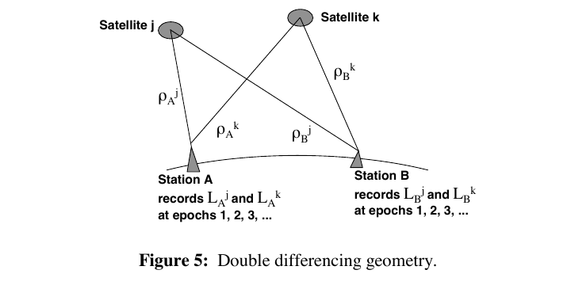
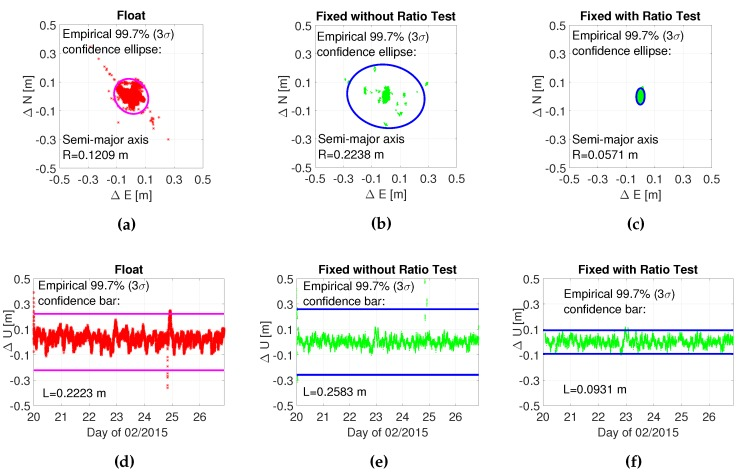
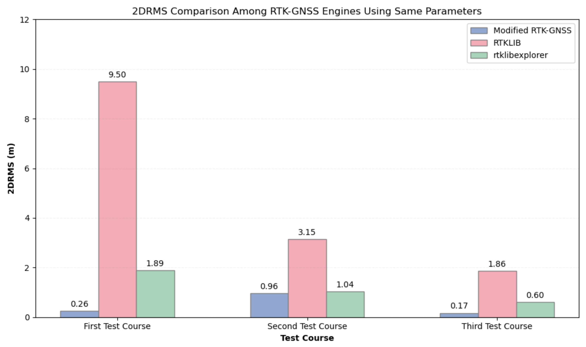

# 2026-07-27 GNSS 每日研究简报

## 今日快报

### 快报 1：PRX 把 RINEX、星历改正和逐星诊断量摊平成可检查的 CSV

- 主题：`rinex-preprocessing-python-prx`
- 来源 ID：`doi:10.1007/s10291-026-02129-2`
- 来源链接：https://doi.org/10.1007/s10291-026-02129-2
- 发表日期：2026-07-24
- 来源类型：同行评审期刊论文与作者维护的开源软件仓库
- 获取范围：论文摘要和出版页可读；MIT 许可代码、README、参数与输出字段开放；论文全文受订阅限制

**内容：** PRX 是一个 Python RINEX 预处理工具：读取 RINEX 3.05 观测与导航文件，把广播星历计算的卫星位置、速度、钟差与钟漂，以及相对论、Sagnac、对流层、卫星码偏差、载波频率、电离层、方位角/高度角和原始 C/D/L/S 观测写成逐历元 CSV。仓库把默认 `--prx_level 2` 定位为 SPP 所需输出，把 `--prx_level 1` 定位为适合 DGNSS/RTK 的较低层输出，并提供 Saastamoinen 与 UNB3m 对流层模型选项。

**结论：** 论文摘要称工具与 RTKLIB 做过对比，目标是降低从 RINEX 到定位输入的前处理门槛；开放仓库则足以核查输出字段和处理入口。但当前可访问证据没有给出可独立复算的全套精度、运行时间或跨版本统计，因此不能把“与 RTKLIB 比较”改写成“全面等价或更快”。遇到不规范 RINEX，仓库还明确建议先用 GFZRNX 修复，说明输入兼容性不是无条件保证。

**关注理由：** 对教学、算法原型和故障定位而言，透明中间量比只输出坐标更有价值：同一历元的星历哈希、每项改正和原始观测可以追溯残差从哪里来。工程接入前仍要锁定 PRX、RINEX 与星历版本，用已知基线分别核验时间系统、信号映射、码偏差和地球自转改正。

### 快报 2：低成本 NMEA 纬度误差呈偏斜长尾，单一高斯会低估尾部

- 主题：`low-cost-nmea-heavy-tail-normality`
- 来源 ID：`doi:10.3390/rs18152446`
- 来源链接：https://doi.org/10.3390/rs18152446
- 发表日期：2026-07-23
- 来源类型：同行评审开放期刊论文
- 获取范围：开放全文、数据流程、七种正态性检验、10000 次 bootstrap 与分布拟合；CC BY 4.0

**内容：** 作者把 L76X 低成本 GPS 模块放在城市建筑窗台、部分遮挡环境中，以 1 Hz 连续采集 48 h，得到 977532 条 NMEA 语句，其中 162922 条为 GPGGA；论文只对相对参考坐标的纬度残差做一维分析。七种正态性检验在不同样本量和显著性水平下各做 10000 次 bootstrap，并比较 Gaussian、Student-t 与 Gaussian–Student-t 混合模型。

**结论：** 该样本的纬度分布偏度为 2.1，均值、中位数、众数分别为 50.288643°、50.288586°、50.288511°，均偏离参考纬度 50.288339°；Student-t 和高斯—Student-t 混合模型对尾部的拟合优于单高斯，混合模型在作者报告的似然与 AIC 比较中最好。小样本下 Shapiro–Wilk 较敏感，约 10—30 个样本时 D’Agostino 也表现突出。证据来自一台接收机、一个窗台、一个 48 h 窗口和纬度单分量，不能推出所有 GNSS 原始观测都服从同一长尾分布。

**关注理由：** NMEA 坐标已混合卫星几何、接收机滤波、多路径和环境变化；它证明的是“该位置输出不能安全地假定为高斯”，不是某个伪距噪声模型的直接标定。用于完整性或置信区间时，应先按环境和解状态分层，再用留出时段验证尾部覆盖率，避免只凭一次正态性拒绝就选择复杂分布。

### 快报 3：四次快速电离层暴揭示相同持续时间并不意味着同一种定位误差方向

- 主题：`ionospheric-storm-circular-position-error`
- 来源 ID：`doi:10.26552/com.c.2026.043`
- 来源链接：https://doi.org/10.26552/com.C.2026.043
- 发表日期：2026-07-20
- 来源类型：同行评审开放期刊论文
- 获取范围：开放全文、四次事件数据处理、圆统计和定位误差结果；CC BY 4.0

**内容：** 论文在意大利 Trieste 附近的 IGS Sgonico 台站，选取 2015 年一次与 2017 年三次、每次三天的快速发展电离层暴，用 30 s GPS 数据构造单频商用级定位条件，按小时分析水平误差向量的幅值与方位，并用圆统计比较事件内部的方向集中性。研究问题不是再报一个平均误差，而是检验“持续不超过三天的快速暴”能否当作同一类扰动。

**结论：** 四次事件最大水平误差分别为 7.495 m、4.261 m、4.387 m 和 3.948 m，峰值时段与误差方向结构也不同；作者据此主张该类事件仍需细分。数据支持“这四次中纬度事件异质”，但不足以建立全球通用的暴分类法：它只有一个台站、四次历史事件，并依赖单频处理、广播电离层模型和具体卫星几何。

**关注理由：** 接收机告警若只看误差幅值，会漏掉具有方向性的系统残差；圆统计能把“误差往哪边偏”与地方时、几何和电离层变化联系起来。面向业务，应增加跨纬度台站、安静日配对、双频参考和 ROTI/VTEC 等外部指标，再检验子类是否可预测而非仅事后可分。

### 快报 4：手机 NMEA、Python HPL 与 WebGIS 串起低成本沿海完整性看板

- 主题：`coastal-gnss-integrity-webgis-low-cost`
- 来源 ID：`doi:10.21163/gt_2026.213.14`
- 来源链接：https://doi.org/10.21163/GT_2026.213.14
- 发表日期：2026-07-23
- 来源类型：同行评审期刊论文
- 获取范围：开放全文、系统架构、HPL 公式、实验数据表与航行结果

**内容：** 作者用 Android 15 的 Xiaomi 11T 输出 NMEA 0183 GGA/RMC/GSA/GSV，经 Bluetooth SPP 送入 Windows/Anaconda 上的 Python 模块，以 1 Hz 计算基于 RAIM SLOPE 的 HPL，同时写 PostgreSQL 并在 Leaflet WebGIS 中显示船位、保护圆、HDOP、PDOP 和卫星数。2026-06-18 在 Villa San Giovanni—Messina 渡轮航线采集 31 min 17 s，共 1877 个有效历元。

**结论：** 实验中 HDOP 始终低于 1.0、均值约 0.5，PDOP 通常低于 1.5；HPL 均值约 35 m、峰值低于 85 m，采集—计算—存储—显示链连续运行。论文明确把验证目标限定为端到端架构可行性，没有专业或认证航海接收机真值，因此这些 HPL 不能被解释为已验证的实际误差包络，也不能证明满足某项 IMO 告警概率。

**关注理由：** 低成本完整性系统最容易把“算出了保护级”误写成“保护级已校准”。下一步应同时记录伪距残差、噪声假设、误检概率、告警限与独立真值，在遮挡和故障注入下做覆盖率检验；离岸使用还要消除当前 4G 回传依赖。

### 快报 5：双通道闪烁预报提高召回，但 71 次误报显示它更像预警器而非判决器

- 主题：`gnss-scintillation-dual-channel-forecast`
- 来源 ID：`doi:10.3390/atmos17080711`
- 来源链接：https://doi.org/10.3390/atmos17080711
- 发表日期：2026-07-23
- 来源类型：同行评审开放期刊论文
- 获取范围：开放全文、时序拆分、特征、消融、bootstrap 与独立测试混淆矩阵；CC BY 4.0

**内容：** 模型用香港 HKOH 台站 2020-01-01 至 2024-03-21 的 1542 个日样本：06:00—11:00 UT 的空间天气量、时间特征、前一日状态和沿 120°E 的 13×6 TEC 网格，预测 11:00—14:00 UT 是否出现 GPS L1 振幅闪烁。XGBoost 通道处理原始 TEC、经纬/时间差分与背景量，Transformer–LSTM 提取日内结构；融合权重 0.84、阈值 0.06 都只在验证集选定，最终按时间顺序测试。

**结论：** 独立测试含 66 个事件日与 166 个非事件日，融合模型为 TP=58、FN=8、FP=71、TN=95，即召回 0.8788、精确率 0.4496、F1=0.5949、ROC-AUC=0.8263、PR-AUC=0.6097。相对 XGBoost，召回从 0.8030 增至 0.8788，配对 bootstrap 差值 0.0763 的 95% 区间为 [0.0156, 0.1452]；其他指标差异区间跨零。作者因此只把稳定优势落在召回，不声称全面优于基线。

**关注理由：** 训练、验证、测试事件率分别约 4.82%、11.69%、28.45%，且只有一个低纬站，说明阈值和先验概率会漂移。适合把结果当作“提前提高接收机跟踪裕度或加密监测”的触发器；若直接停用 GNSS，55.04% 的误报率会付出很高可用性成本。

## 深度研读

### 深读 1｜接收机工程｜从非差到双差：两次相减究竟消掉了什么

- 类别：`receiver-engineering`
- 学习层级：`foundation`
- 选题定位：`基础`
- 来源 ID：`blewitt:1997-gps-observation-equations`
- 来源链接：https://web.gps.caltech.edu/classes/ge111/Docs/GPSbasics.pdf
- 发表日期：1997
- 来源类型：经典 GNSS 教学专章
- 获取范围：公开可读 PDF、观测方程、差分推导和图示；原文保留版权，未声明开放再许可
- 价值评分：96/100（相关性 20，经典价值 24，证据 18，教学价值 19，工程价值 15）

#### 为什么先学这个

RTK 的“固定整数”不是从某个黑盒函数突然出现的。它来自载波观测中以周为单位的未知整周数；而单差、双差先把卫星钟和接收机钟等公共项移走，才形成适合短基线整数估计的模型。理解每次相减的对象和代价，是后两节讨论比率检验与复杂环境 RTK 的共同地基。

#### 先修知识

载波相位通常先乘波长写成米。$`\rho_r^s`$ 是接收机 $`r`$ 到卫星 $`s`$ 的几何距离，$`\delta t_r,\delta t^s`$ 是收、发钟差，$`T,I`$ 是对流层和电离层延迟，$`\lambda N`$ 是整数模糊度对应的距离。这里用 $`\Delta_{AB}`$ 表示同一卫星在接收机 A、B 间作差，用 $`\nabla^{jk}`$ 表示同一接收机差分量在卫星 j、k 间再作差。

#### 一句话逻辑

同星跨站相减消去卫星钟，再把两颗卫星的单差相减消去接收机间钟差；短基线下大气项也高度相关，于是双差载波主要剩相对几何、整数模糊度与相关噪声。

#### 研究问题与约束

Blewitt 的专章从 GPS 码与载波观测方程推导静态相对定位，成文于 1997 年。它清楚说明差分消项、短基线大气近似和协方差代价，但采用当时的 GPS/选择可用性背景，并不覆盖现代多频多 GNSS 的全部信间偏差、相位偏差产品或网络 RTK 状态空间表示。本文只把它当作观测方程基础，不把历史误差量级直接移植到今天的设备。

#### 核心方法论

先在同一卫星 j 上用 B 站观测减 A 站观测；若两站信号发射时刻足够接近，卫星钟差近似相同而被消去。单差仍含 A、B 的接收机钟差。再选参考卫星 k，以 j 的单差减 k 的单差，接收机钟差作为同历元公共项消失。若两站距离短，对流层、电离层也大部分抵消；剩余双差进入基线与整周模糊度联合估计。

#### 关键公式逐步推导

用现代符号写单站单星载波观测：

```math
\Phi_r^s=\rho_r^s+c(\delta t_r-\delta t^s)+T_r^s-I_r^s
+\lambda N_r^s+\varepsilon_r^s
```

同星 j 的站间单差为：

```math
\Delta\Phi_{AB}^{j}
=\Delta\rho_{AB}^{j}+c\,\Delta\delta t_{AB}
+\Delta T_{AB}^{j}-\Delta I_{AB}^{j}
+\lambda\Delta N_{AB}^{j}+\Delta\varepsilon_{AB}^{j}
```

其中卫星钟项消失。再以卫星 k 作差：

```math
\nabla\Delta\Phi_{AB}^{jk}
=\Delta\Phi_{AB}^{j}-\Delta\Phi_{AB}^{k}
=\nabla\Delta\rho_{AB}^{jk}
+\nabla\Delta T_{AB}^{jk}-\nabla\Delta I_{AB}^{jk}
+\lambda\nabla\Delta N_{AB}^{jk}
+\nabla\Delta\varepsilon_{AB}^{jk}
```

接收机钟差也消失；在同频、连续锁定且硬件分数偏差被正确处理时，$`\nabla\Delta N_{AB}^{jk}`$ 保持整数。线性化几何后可写为 $`\mathbf y=H\mathbf b+\lambda Z\mathbf n+\boldsymbol\epsilon`$，其中 $`\mathbf b`$ 是基线，$`\mathbf n\in\mathbb Z^q`$。

#### 经典价值与创新边界

双差把难以可靠建模的两类钟差通过代数消除，是经典相对定位能达到高精度的关键。代价也同样经典：它只能直接估相对位置；参考卫星变化会重排状态；共享参考星使多条双差相关。原文提醒，双差相对单差会放大未建模系统误差，随机噪声相对非差观测也会增加，因此“消项更多”不等于“信息无损”。

#### 整体逻辑链

两站同步观测同一组卫星；统一时间、坐标与信号；形成同星单差；选择参考卫星形成双差；按短基线或长基线条件建模残余大气；构造完整协方差；浮点估计基线和模糊度；整数搜索与验证；用固定整数回代坐标；持续监测周跳、参考星切换和残差。

#### 原文图表与结果分析



> 图源：Geoffrey Blewitt，《Basics of the GPS Technique: Observation Equations》（1997）Figure 5，[原文 PDF](https://web.gps.caltech.edu/classes/ge111/Docs/GPSbasics.pdf)。从 PDF 第 33 页以约 144 dpi 渲染，只裁出原图与原 caption；未重绘、改字或改变几何关系。原文未声明开放许可，按最小研究评论引用，不主张再分发权。

图中横向是两个地面站 A、B，上方是卫星 j、k，四条视线分别标成 $`\rho_A^j,\rho_A^k,\rho_B^j,\rho_B^k`$。双差的几何组合等价于 $`(\rho_B^j-\rho_A^j)-(\rho_B^k-\rho_A^k)`$。这是一幅拓扑示意，没有距离、仰角、基线长度或误差轴，因此不能从线段长度判断精度，也不能证明大气已经完全抵消。

#### 原文结果论述

专章的结果是代数与误差传播结论而非一次性能试验：单差去除或减弱卫星公共误差，但仍有接收机相对钟；双差再消掉接收机钟。作者给出的经验边界是，水平间距约 30 km 内差分对流层常可忽略但高差仍需建模；差分电离层是否可忽略依赖电离层状态与约 1—30 km 的距离，几公里以上宜用双频校准。这些是教学时代背景下的经验量级，工程阈值仍应由当天空间天气、频点和目标精度重估。

#### 常见误区与适用边界

第一，把“双差消钟”误写成消除所有卫星与接收机硬件偏差。第二，两个接收机使用不同信号或未校准相位偏差时仍默认模糊度为整数。第三，把短基线大气高度相关当成严格为零。第四，把所有双差当独立等权，忽略共享参考星带来的非对角协方差。第五，参考星切换后不做状态映射。第六，在周跳后沿用旧整数。第七，把双差直接用于超长基线却不估电离层、对流层和轨道残差。

#### 工程实现步骤

1. 对基准站与流动站统一历元、时间系统、卫星与信号标识。
2. 用同一星历、天线相位中心和潮汐模型计算两站的非差改正。
3. 先构造站间单差，保留原始观测到差分观测的索引。
4. 选择高仰角且连续锁定的参考星；参考星变化时显式变换模糊度状态。
5. 由非差方差传播出完整双差协方差，而非只给一个经验对角权。
6. 浮点解同时输出基线、模糊度、残差、条件数和协方差。
7. 周跳、失锁或大气残差超限时重置相应状态，禁止悄悄继承固定解。

#### 复现实验设计

在已知约 10 m 静态基线上采 1 Hz GPS L1 与 Galileo E1 共 60 min。分别实现非差带钟估计、单差和双差；给所有接收机观测注入 1 μs 公共接收钟跳，给一颗卫星注入 100 ns 卫星钟跳，并给每条载波叠加 3 mm 独立白噪声和 10 mm 低频多路径。报告各组合残差均值/标准差、双差协方差的非对角项、基线 RMSE、模糊度固定率与错误固定率。再把基线扩到 30 km 并关闭电离层估计，观察“短基线近似”何时破坏。

#### 与定位及低成本实现的联系

低成本双频板卡也能输出载波，但其振荡器、天线、信号跟踪和固件平滑可能让不同信号的噪声与偏差显著不同。双差可以抑制公共钟误差，却不能修复两站各自的多路径和周跳。对低成本 RTK，最重要的不是再做一次相减，而是保留逐信号锁定状态、$`C/N_0`$、多普勒一致性和差分协方差，让后续固定检验知道模型有多强。

#### 本节小结

单差与双差是“有条件的公共项消除器”：卫星钟、接收机钟按观测拓扑消失，大气只在空间相关假设下减弱，噪声与相关性反而增加。把这张误差账算清楚，才能为模糊度验证提供可信的浮点协方差。

### 深读 2｜接收机工程｜固定失败率比率检验：阈值应随模型强度变化

- 类别：`receiver-engineering`
- 学习层级：`intermediate`
- 选题定位：`基础进阶`
- 来源 ID：`doi:10.3390/s16070945`
- 来源链接：https://doi.org/10.3390/s16070945
- 发表日期：2016-06-23
- 来源类型：同行评审开放期刊论文
- 获取范围：开放全文、公式、25920 组模型的 Monte Carlo 拟合函数与 182.7 km 实测；CC BY 4.0
- 价值评分：97/100（相关性 20，经典价值 23，证据 20，教学价值 17，工程价值 17）

#### 为什么先学这个

第一节得到的是浮点模糊度与协方差，不是可以直接回代的整数。整数最小二乘会给出“最好”和“次好”候选，但最好候选仍可能错。固定一个经验比率阈值忽略卫星数、几何、噪声和模糊度维数的变化；FFRT 把可容忍错误固定率显式放进阈值选择。

#### 先修知识

线性混合整数模型写成 $`\mathbf y=A\mathbf a+B\mathbf b+\mathbf e`$，$`\mathbf a\in\mathbb Z^n`$ 是整数模糊度，$`\mathbf b`$ 是基线等实数参数。浮点解 $`\hat{\mathbf a}`$ 及其协方差 $`Q_{\hat a\hat a}`$ 定义模糊度空间中的距离。ILS 搜索距离最小的候选 $`\check{\mathbf a}_1`$ 和次小的 $`\check{\mathbf a}_2`$。

#### 一句话逻辑

不用一个永远不变的经验门限，而是根据模糊度维数和 ILS 失败率表征的模型强度，选择满足用户容许失败率的比率检验临界值。

#### 研究问题与约束

传统固定临界值可能在强模型时制造不必要拒绝，在弱模型时又不能控制错误接受。Hou、Verhagen 与 Wu 用大规模仿真拟合临界值与固定率函数，再以 182.7 km 基线验证。FFRT 控制的是所假设统计模型下的整数接受失败率；若浮点协方差、偏差、大气或周跳模型错误，名义失败率不自动等于真实错误固定率。

#### 核心方法论

先由 $`Q_{\hat a\hat a}`$ 计算或近似 ILS failure rate，作为模型强度指标；给定容许失败率 $`P_f^{tol}`$ 与模糊度维数 $`n`$，用论文拟合函数得到临界值 $`\mu`$。比率足够小时才接受最优整数。作者对 GPS/BDS 不同频数组合与几何生成 25920 个模型，每个模型抽取 $`10^6`$ 个浮点样本，覆盖 $`P_f^{tol}=0.0005`$ 至 0.01，并拟合临界值和接受后的条件成功率。

#### 关键公式逐步推导

候选的加权平方距离为：

```math
d_i=(\hat{\mathbf a}-\check{\mathbf a}_i)^T
Q_{\hat a\hat a}^{-1}
(\hat{\mathbf a}-\check{\mathbf a}_i),\qquad d_1\le d_2
```

论文采用“小者更好”的比率：

```math
RT=\frac{d_1}{d_2}
```

接受域为：

```math
RT<\mu\!\left(n,P_{f,\mathrm{ILS}},P_f^{tol}\right)
```

固定经验阈值只写 $`\mu=\mu_0`$；FFRT 则要求：

```math
P\!\left(\check{\mathbf a}_1\ne\mathbf a
\mid RT<\mu\right)\le P_f^{tol}
```

实际拟合函数是对 Monte Carlo 临界值面的工程近似，因此实现时应使用论文给定适用域并检查插值边界，不能把任意模糊度维数和任意失败率外推进去。

#### 经典价值与创新边界

价值在于把“阈值 2、3 或 0.25”这样的经验常数改写成可解释风险预算，并给出易实现拟合式。创新边界是它仍是 integer-aperture 验证的一种实现，不会替代周跳检测、随机模型标定和故障排除；拒绝错误候选会降低固定可用性，接受后的高精度也不表示所有历元都可用。

#### 整体逻辑链

双差观测与随机模型；浮点基线/模糊度估计；去相关与 ILS 搜索；计算第一、第二候选距离；由模型强度、维数和风险预算求 FFRT 阈值；接受或保持 float；若接受则条件约束模糊度并更新坐标；同时记录接受率、错误率和拒绝原因；模型状态改变时重新计算阈值。

#### 原文图表与结果分析



> 图源：Hou、Verhagen、Wu，《An Efficient Implementation of Fixed Failure-Rate Ratio Test for GNSS Ambiguity Resolution》Figure 8，[原文](https://doi.org/10.3390/s16070945)。直接保存论文开放全文提供的 737×472 JPEG；未裁切、重采样、重绘或改动点、椭圆、坐标轴和文字。CC BY 4.0。

三幅横向散点图依次是 float、无比率检验的 fixed、经过比率检验接受的 fixed；坐标轴单位为米，椭圆表示水平散布，右侧竖条表示高程的 3σ 范围。图中文字给出的水平半长轴分别为 0.1209 m、0.2238 m、0.0571 m，高程 3σ 长度分别为 0.2223 m、0.2583 m、0.0931 m。直接固定的散布反而大，显示错误整数会破坏“固定应更准”的直觉；经过检验的已接受子集最集中。但图没有把被拒历元画出来，不能从散点密度读出总体固定率，也不能单凭条件散布判断连续可用性。

#### 原文结果论述

论文摘要报告，在 182.7 km 实测基线中，FFRT 相对传统固定临界值可把固定率提高最多约 30%，同时保持已固定解相同量级的定位精度。大规模仿真的作用是标定不同 $`n`$、模型强度和容许失败率下的阈值面，不是证明所有真实误差都服从仿真。Figure 8 进一步显示，“不做验证直接固定”的水平与高程散布劣于 float，而通过检验的固定子集明显收紧。

#### 常见误区与适用边界

第一，混淆 $`d_1/d_2`$ 与 $`d_2/d_1`$ 两种约定，导致不等号反向。第二，把 ILS unconditional failure rate、接受后的 conditional failure rate 和固定率当成同一个量。第三，忽略模糊度维数变化仍缓存旧阈值。第四，协方差过于乐观时还相信名义风险预算。第五，只报已固定解精度，不报拒绝率和错误固定率。第六，把长基线残余电离层偏差当高斯零均值。第七，在部分模糊度固定后仍用全维阈值。

#### 工程实现步骤

1. 在每个候选集上保存 $`\hat a,Q_{\hat a\hat a}`$、维数和卫星/信号映射。
2. 用 LAMBDA 类方法取得前两名整数候选及其平方距离，统一比率定义。
3. 估计 ILS 模型失败率并检查拟合函数的训练域。
4. 由应用安全目标设置 $`P_f^{tol}`$，不要用“能多固定”倒推风险。
5. 计算动态阈值；模型、卫星或频点变化时立即更新。
6. 对接受解回代坐标，并以独立残差、时间一致性或子集检验二次守门。
7. 同时报 conditional failure target、fix rate、time-to-fix、错误固定和连续性。

#### 复现实验设计

先用 8、12、20 维三组相关模糊度协方差，分别缩放到强、中、弱模型；每组生成不少于 $`10^6`$ 个已知真整数的浮点样本。比较固定 $`RT<0.25`$、查表 FFRT 与拟合 FFRT，在 $`P_f^{tol}=10^{-3}`$ 下报告真实错误接受率、固定率和条件成功率。再用一条短基线和一条约 100 km 基线的真实双频数据，以高精度事后解作真值，按卫星数、PDOP 和电离层活动分箱；最后故意把载波方差缩小 50%，验证随机模型失配如何击穿名义失败率。

#### 与定位及低成本实现的联系

低成本接收机的卫星数可能很多，但多路径与机内相关让“维数高”不等于模型强。动态 FFRT 的前提是协方差可信；若只用高度角经验权，风险指标可能比固定阈值看起来更科学、实际却同样失准。可行路径是用零基线、短基线和遮挡分层标定噪声，再把 $`C/N_0`$、锁定时间、多普勒一致性和创新残差送入随机模型。

#### 本节小结

比率检验不是一个神奇常数，而是模型强度、整数维数与可接受风险之间的折中。FFRT 的真正贡献是让阈值可追溯；它的真正边界是风险控制只对被正确建模的随机世界成立。

### 深读 3｜定位｜复杂环境纯 GNSS RTK：用多普勒续接与后验双差门控减少误固定

- 类别：`positioning`
- 学习层级：`advanced`
- 选题定位：`综合应用`
- 来源 ID：`doi:10.3390/s24092712`
- 来源链接：https://doi.org/10.3390/s24092712
- 发表日期：2024-04-24
- 来源类型：同行评审开放期刊论文
- 获取范围：开放全文、算法流程、静态阈值试验、东京三条车载路线和多引擎对比；CC BY 4.0
- 价值评分：95/100（相关性 20，经典价值 18，证据 19，教学价值 18，工程价值 20）

#### 为什么先学这个

前两节解决“怎样形成整数模型、怎样决定是否接受候选”，但城市街谷还会短时失锁、卫星骤减和多路径偏置。该论文不借助 IMU、视觉或地图，而是在纯 GNSS RTK 内用多普勒速度延续先验位置，并在比率检验之后再检查由固定位置反算的双差模糊度，适合观察一套完整工程链怎样叠加多个守门条件。

#### 先修知识

需要理解双差载波/伪距、浮点与固定解、比率检验、PDOP、$`C/N_0`$、Doppler 速度、周跳和 2DRMS。2DRMS 是二维误差离散量，不等于 95% 完整性保护级；固定率是输出 fixed 的历元比例，也不等于正确固定率。

#### 一句话逻辑

在可见卫星不足或短时中断时用多普勒速度传播上一固定位置以稳住浮点解，候选通过比率检验后再按静态数据学习的双差模糊度偏差门限筛一遍，从而减少城市环境中的错误固定。

#### 研究问题与约束

研究用多星座双频 RTK 在东京三条车载路线比较 modified RTK-GNSS、u-blox F9P、RTKLIB 与 rtklibexplorer，参考轨迹来自 POSLV 620。方法保持纯 GNSS，但“复杂环境”只覆盖三条当地路线；比较结果依赖每个引擎的参数搜索与共同参数设置，不能等价于所有版本、所有天线和所有城市的普遍排名。

#### 核心方法论

首先按 10° 高度角、L1/L2 均不低于 35 dB-Hz 的 $`C/N_0`$ 等条件筛星，并用 PDOP 决定模糊度差门限：PDOP<1、1—2、>2 时分别为 0.1、0.2、0.3 cycle。定位短时断续时，由 GNSS Doppler 速度传播最近固定位置，作为浮点定位约束。整数候选通过普通比率检验后，算法用固定位置重算双差几何与模糊度，检查其与候选的差是否落在由屋顶静态试验确定的阈值内；不满足则拒绝。

#### 关键公式逐步推导

由 Doppler 得到的速度传播位置：

```math
\mathbf r^-_k=\mathbf r^{fix}_{k-1}
+\mathbf v^{dop}_k\Delta t
```

对卫星 j、参考星 k 的双差载波：

```math
\nabla\Delta\Phi^{jk}
=\nabla\Delta\rho^{jk}(\mathbf r)
+\lambda\nabla\Delta N^{jk}+\boldsymbol\eta^{jk}
```

候选整数 $`\check{\mathbf N}`$ 先满足：

```math
\frac{d_1}{d_2}<\mu_{ratio}
```

再由固定位置反算模糊度：

```math
\tilde N^{jk}
=\frac{\nabla\Delta\Phi^{jk}
-\nabla\Delta\rho^{jk}(\mathbf r^{fix})}{\lambda}
```

第二道门控为：

```math
\left|\tilde N^{jk}-\check N^{jk}\right|
<\tau(\mathrm{PDOP}),
\quad
\tau\in\{0.1,0.2,0.3\}\ \text{cycle}
```

这不是严格保护级推导，而是由静态实验与 PDOP 分段得到的经验一致性检验。

#### 经典价值与创新边界

经典组件包括差分 RTK、Doppler 速度、比率检验和残差门控；工程创新在于把它们串成针对短时断续的纯 GNSS 链，并以固定位置回查整数候选。边界是 Doppler 与载波仍受同一遮挡和多路径环境影响，后验检验并非独立证据；经验 cycle 门限没有给出目标错误固定概率，也不是安全完整性保证。

#### 整体逻辑链

基准站与车载多频观测；星历与差分同步；高度角/$`C/N_0`$ 筛选；Doppler 速度与最近 fixed 位置传播；双差 float 解；整数搜索；比率检验；固定位置回算双差模糊度；按 PDOP 分段门限复核；输出 fixed/float；以 POSLV 参考计算误差、固定率和 2DRMS；与三套引擎在相同或各自优化参数下比较。

#### 原文图表与结果分析



> 图源：Fredeluces、Ozeki、Kubo，《Modified RTK-GNSS for Challenging Environments》Figure 18，[原文](https://doi.org/10.3390/s24092712)。直接保存论文提供的 3104×1840 PNG；未裁切、重采样、重绘或改动柱、数值、坐标轴与图例。CC BY 4.0。

横轴是第一、第二、第三测试路线，纵轴是 2DRMS，单位 m；三种颜色分别为 modified RTK-GNSS、RTKLIB、rtklibexplorer，且本图限定“相同参数”。直接读数为：modified 0.26/0.96/0.17 m，RTKLIB 9.50/3.15/1.86 m，rtklibexplorer 1.89/1.04/0.60 m。量级差说明该数据和共同参数下 modified 输出的 fixed 子集更集中，但纵轴截到 10 m，且图不含 float 历元、沿途时间连续性、错误固定持续时间或置信区间，不能把柱高当总体导航可用性。

#### 原文结果论述

在相同参数下，论文表 7 报告 modified 三路线固定率 66.8%、60.1%、67.5%，RTKLIB 为 24.0%、25.1%、41.5%，rtklibexplorer 为 44.6%、50.7%、66.4%。用各引擎不同参数搜索后，后两者固定率会提高，第三路线 rtklibexplorer 达 72.5%，超过 modified 的 67.5%；这说明参数选择是比较的一部分。Figure 18 的 2DRMS 只评价相同参数、已进入比较集合的 fixed 结果，不应单独支持“所有条件全面优胜”。

#### 常见误区与适用边界

第一，把固定率当正确率。第二，只比较 fixed 子集 2DRMS，忽略 float 与无解时间。第三，把同参数当公平终点；不同引擎的最优噪声与门限可能不同。第四，把静态屋顶 95% 经验门限当城市动态风险上界。第五，Doppler 传播时间过长仍信任匀速。第六，参考固定位置本身错误时让第二道检验形成自洽错误。第七，把 2DRMS 当保护级。第八，把三条东京路线外推到不同频段、车辆、天线和基线长度。

#### 工程实现步骤

1. 保存原始码、载波、Doppler、锁定时间与逐频 $`C/N_0`$，统一基准站时间。
2. 用开放天空和遮挡数据分别标定 Doppler 速度噪声与传播最大时长。
3. 星选同时考虑高度角、双频信号强度、连续锁定和几何，不只追求数量。
4. 构造 float 协方差，记录比率的定义、候选距离和门限。
5. 对每个已接受整数用固定位置反算 cycle 残差，门限随独立验证集标定。
6. 设置固定位置老化、速度异常、参考星切换和周跳的强制降级规则。
7. 评估 fixed/float/no-solution 三种状态，输出错误固定持续时间和恢复时间。
8. 若用于安全相关场景，另建可校准的完整性监测，不把经验门控冒充保护级。

#### 复现实验设计

选择一条开放天空、一条树荫路和两条高楼街谷，车载双频多 GNSS 与独立 INS/测地 GNSS 参考同步采集，每条至少重复 10 次。对 modified、RTKLIB、rtklibexplorer 固定软件版本：先跑同参数，再在独立开发路线调参，测试路线只评一次。做四个消融：无 Doppler 传播、无后验门控、固定 PDOP 门限、完整方法。报告全历元水平/高程 50/95/99 百分位、fixed 正确率、错误固定最长持续时间、固定率、首次固定与重捕获时间、float/no-solution 比例，并按遮挡等级和基线长度分箱。

#### 与定位及低成本实现的联系

该方法不需要 IMU，是纯 GNSS 高级定位，适合硬件成本受限但能输出双频载波和 Doppler 的接收机。它也揭示低成本路线的关键：不是无限增加状态，而是把速度连续性、候选距离和物理一致性变成可记录的多道门。但全部门控仍共享 GNSS 数据，若要在城市安全应用中声称风险界限，仍需要独立传感器、故障假设或经过覆盖率验证的保护级。

#### 本节小结

复杂环境 RTK 可以用 Doppler 传播提高短时连续性，用后验双差 cycle 残差减少明显误固定；三路线结果显示了工程潜力，也显示参数与接受子集会显著影响指标。高级实现应把“更多 fixed”与“fixed 更可信”分开测量。
