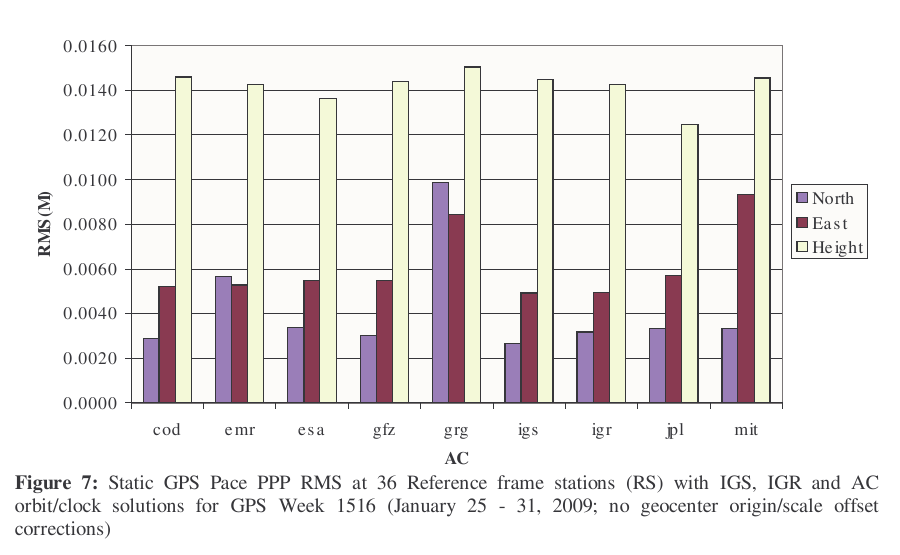
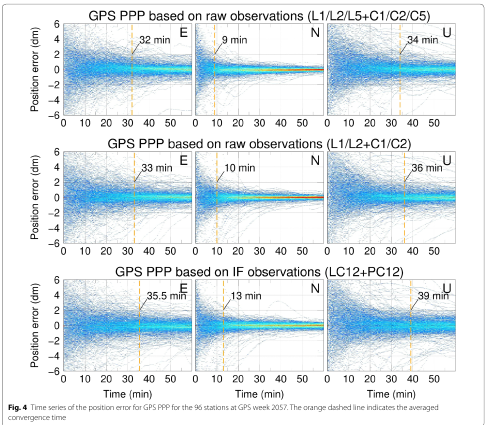
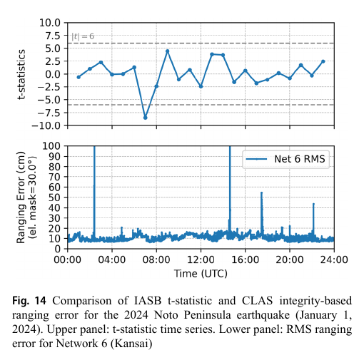

# 2026-07-28 GNSS 每日研究简报

## 今日快报

### 快报 1：OSNMA 运行一周年：认证导航电文，不等于认证测距或抵抗压制

- 主题：`galileo-osnma-first-year-boundary`
- 来源 ID：`euspa:osnma-one-year-2026`
- 来源链接：https://www.euspa.europa.eu/newsroom-events/news/celebrating-one-year-galileo-osnma-milestone-trusted-positioning
- 发表日期：2026-07-27
- 来源类型：EUSPA 官方服务运行更新
- 获取范围：官方全文、服务边界与后续演进说明；网页未给出逐设备采用量或检测性能数据

**内容：** EUSPA 回顾 Galileo 开放服务导航电文认证（OSNMA）自 2025-07-24 宣布初始服务以来的第一年。接收机通过公开密码材料验证 E1-B I/NAV 导航数据来自 Galileo 且未被篡改；官方同时说明，未来增强计划包括认证更多 Galileo 数据，并为 GPS 广播导航数据提供认证信息，另以 Galileo Signal Authentication Service 继续补足测距信号认证。

**结论：** 官方确认制造商正在把 OSNMA 集成进商用产品，但页面没有给出型号总数、认证延迟、误警率或现场攻击数据，因此只能据此确认“服务已运行且采用正在扩展”，不能量化部署覆盖。更重要的是，OSNMA 不阻止干扰压制，也不直接认证到达时间、功率或伪距；它能拒绝未通过认证的导航电文，却不能单独证明当前位置未被转发、合成信号或共频干扰影响。

**关注理由：** 接收机安全状态应至少拆成“电文认证通过、测距一致性、频谱/功率异常、位置解完整性”四层。把 OSNMA 的布尔结果与多天线、时钟、多普勒、惯导或网络交叉检查组合，才有机会覆盖从电文篡改到信号转发的不同威胁。

### 快报 2：SAT 33 与 SAT 34 入网，增加冗余但不自动等于用户精度跃升

- 主题：`galileo-sat33-sat34-entry-into-service`
- 来源 ID：`esa:galileo-sat33-sat34-service`
- 来源链接：https://www.esa.int/Applications/Satellite_navigation/Two_new_Galileo_satellites_enter_service
- 发表日期：2026-07-24
- 来源类型：ESA 官方任务与在轨测试更新
- 获取范围：官方全文、发射早期运行与在轨测试流程；未提供加入前后的用户误差统计

**内容：** ESA 说明 L14 任务的 SAT 33、SAT 34 已完成早期轨道运行、导航载荷首次在轨发射、原子钟/转发器/安全功能配置和测试，并机动到约 23222 km 的目标轨位。SAT 33 在 2026 年 5 月获准入网，SAT 34 于 2026-07-23 入网，完成本批两星部署。

**结论：** 新增在役卫星首先提高星座冗余和连续服务余量；官方页面没有发布入网前后 PDOP、SISRE、可用性或用户位置误差对照，因此不能把“增加两颗卫星”改写为“所有地点精度立即提高”。实际收益取决于用户天空视野、星历与健康状态、频点支持以及与既有卫星的几何互补。

**关注理由：** 接收机或服务评估应在同一地点、同一截止角下比较入网前后的可见星数、几何、信号连续性和解误差，而不是只数星。对多星座接收机，还应检查新增 Galileo 观测是否真正进入权阵与故障监测，而非仅显示在天空图中。

### 快报 3：BDS-3 星间链路削弱地心 Z 分量与轨道参数的耦合

- 主题：`bds3-isl-geocenter-multi-gnss`
- 来源 ID：`doi:10.1007/s10291-026-02117-6`
- 来源链接：https://doi.org/10.1007/s10291-026-02117-6
- 发表日期：2026-07-20
- 来源类型：同行评审期刊论文
- 获取范围：出版页、摘要、数据可用性与图题可读；全文受订阅限制，数值均按作者摘要表述

**内容：** 作者比较单系统和 BDS/GPS/GLONASS/Galileo 联合的 L 波段地心坐标解，并把 BDS-3 星间链路观测加入联合定轨与地心运动估计。研究重点是区分真实地心运动与太阳辐射压、轨道 Z 向和龙年周期等系统误差，而不是普通用户定位。

**结论：** 摘要报告：先验太阳辐射压模型使 BDS 地心坐标 X/Y/Z 标准差约降低 17%/20%/69%；将 BDS 加入其他单系统解，使 GPS、GLONASS、Galileo 的 Z 分量标准差分别降低 3.1 mm、7.0 mm、0.7 mm。相对仅 L 波段，加入星间链路后，BDS Z 分量与 SLR 解的一致性标准差按辐射压模型不同降低 23%—67%，形式误差约减半。由于当前只读到摘要，这些是作者报告值，不能独立检查时间跨度、滤波选择或全部显著性检验。

**关注理由：** 星间链路的价值不仅是“多一类测距”，而是改变可观测几何，削弱地心、轨道和经验辐射压参数的相关性。面向精密产品，应同时审计频谱中的龙年伪信号、与 SLR 的独立一致性以及形式误差是否诚实反映模型失配。

### 快报 4：W/X 双频段雷达与 GNSS 因子图让海上 SLAM 更连续，但真值边界要看清

- 主题：`maritime-multiband-radar-gnss-factor-graph`
- 来源 ID：`doi:10.5194/isprs-archives-xlix-b1-2026-647-2026`
- 来源链接：https://doi.org/10.5194/isprs-archives-XLIX-B1-2026-647-2026
- 发表日期：2026-07-22
- 来源类型：同行评审会议论文
- 获取范围：开放全文、公式、MOANA 单序列实验与消融；CC BY 4.0

**内容：** MRGF 用 76—77 GHz W 波段雷达 CFEAR 提供平移与一份航向增量，用 9.4—9.5 GHz X 波段雷达 LodeStar 提供另一份航向；质量分数决定连续融合权，跨传感器不一致时门控，再把融合里程计、GNSS、闭环和可选地图约束放进因子图。论文只在 MOANA 的 Near-Port 序列验证。

**结论：** 作者报告融合方案 RTE 均值/RMSE/标准差为 0.66/1.67/1.53 m；CFEAR-only RMSE 为 3.08 m，LodeStar-only 为 0.85 m。融合并非每个单项都最好，作者把优势限定为平移—旋转折中与稳定性。原表还给出 LodeStar-only 均值 0.99 m、RMSE 0.85 m；若二者基于同一组非负误差，这在数学上不成立，说明表格或统计定义至少有一处未交代。更关键的证据边界是：文中 Hemisphere V500 被写作参考轨迹，同时 GNSS 因子又被列为后端必选约束，未清楚说明评估轨迹和约束数据是否独立；因此 1.67 m 不能当作严格独立的绝对定位精度证明。

**关注理由：** 在雨雾和海杂波中，跨频段雷达互补很有工程意义，但融合评估必须避免“用同一 GNSS 既约束又判分”。复核时应留下 GNSS 因子、只雷达和独立岸基/全站仪真值三套实验，并同时报告 ATE、RTE、闭环误差和失效段。

### 快报 5：把 GNSS 有色噪声写进顺序滤波，城市多传感器融合不再假定每历元独立

- 主题：`adaptive-sequential-filter-colored-gnss-noise`
- 来源 ID：`doi:10.1088/1361-6501/ae8617`
- 来源链接：https://doi.org/10.1088/1361-6501/ae8617
- 发表日期：2026-07-03
- 来源类型：同行评审开放期刊论文
- 获取范围：出版元数据与完整摘要可读；CC BY-NC-ND，当前环境未取得全文，数值均按作者摘要表述

**内容：** 论文针对城市 GNSS/IMU/LiDAR 融合中两个常见简化：LiDAR 更新模式固定，以及 GNSS 噪声被当成白高斯。算法按实时质量在 scan-to-scan 位移和 scan-to-map 位置更新之间切换，为两种 LiDAR 模式分别配置协方差，并用自适应有色卡尔曼滤波把时相关 GNSS 运动学信息与 IMU 紧耦合。

**结论：** 摘要报告城市实测水平/三维 RMSE 为 1.452/1.494 m；相对 smoothing-and-mapping LiDAR 惯导里程计改善 51.8%/64.8%，相对常规 EKF 融合改善 28.7%/30.9%。由于全文实验路线、真值、消融和置信区间当前不可读，不能判断提升分别来自模式切换、协方差设定还是有色噪声模型，也不能外推到其他 LiDAR 或城市。

**关注理由：** 多路径和遮挡会让 GNSS 残差跨历元相关；若滤波器仍按白噪声反复“获得新信息”，协方差会虚假收紧。工程复现应画残差自相关与创新白化结果，并用相同传感器、相同初始化做模块消融。

## 深度研读

### 深读 1｜接收机工程｜IGS 精密轨道与钟差怎样把全球网络压缩成单站 PPP 输入

- 类别：`receiver-engineering`
- 学习层级：`foundation`
- 选题定位：`基础`
- 来源 ID：`igs:using-igs-products-v2.1`
- 来源链接：https://files.igs.org/pub/resource/pubs/UsingIGSProductsVer21_cor.pdf
- 发表日期：2015-09（更新版）
- 来源类型：International GNSS Service 官方技术指南
- 获取范围：公开可读完整 PDF、观测方程、模型清单与 IGS 产品实测；未声明开放再许可
- 价值评分：98/100（相关性 20，经典价值 24，证据 20，教学价值 18，工程价值 16）

#### 为什么先学这个

PPP 的“单站”只描述用户端不需要同时接收附近基准站数据，不代表系统没有网络。IGS 分析中心已用全球站网估计并组合卫星轨道、钟差和参考框架；用户把这些全局状态固定后，才可在单站方程里估位置、接收机钟、对流层湿延迟和载波偏差。先理解这条信息压缩链，第二节的原始多频观测与第三节的跨增强改正比较才不会变成黑箱。

#### 先修知识

需要知道码伪距噪声较大但无整周未知，载波相位精密但含模糊度；卫星位置在发射时刻计算，接收机钟差乘光速进入所有观测；对流层非色散，电离层一阶项与频率平方成反比。IGS 的 SP3/CLK、ANTEX、ERP 和参考框架是相互一致的一组产品，不能只替换其中一个文件而沿用另一套约定。

#### 一句话逻辑

全球网络先估出精密卫星轨道与钟差，单站再以非差双频码和载波估计本地状态；高精度来自“固定的全球产品 + 完整的厘米级模型 + 连续载波滤波”，不是“单站观测天然绝对精密”。

#### 研究问题与约束

Kouba 指南总结截至 2015 年的 GPS/GLONASS IGS 产品、PPP 方程、组合和模型约定，并用历史周解展示产品一致性。它是官方工程指南而非一次盲测；图中结果主要来自测地级接收机、静态日解和 GPS 时代的数据，不能直接代表 2026 年手机、城市动态、多 GNSS 实时 SSR 或未收敛状态。本文使用其结构和误差账，不把旧产品时延和性能数字当作当前服务承诺。

#### 核心方法论

分析中心先在全球网络中联合估轨道、卫星钟、站坐标、地球自转和传播参数，再把多个中心的解组合与质控。PPP 用户固定与参考框架一致的精密轨道/钟差，改正天线相位中心、潮汐、相对论、地球自转、相位缠绕和对流层等项；双频电离层无关组合移除一阶电离层，同时放大观测噪声。滤波器按历元估坐标、接收钟、ZWD 和每星连续弧段的实数载波偏差。

#### 关键公式逐步推导

令双频电离层无关组合系数为：

```math
\alpha=\frac{f_1^2}{f_1^2-f_2^2},\qquad
\beta=-\frac{f_2^2}{f_1^2-f_2^2}
```

则码与载波组合为：

```math
P_{\mathrm{IF}}=\alpha P_1+\beta P_2,\qquad
\Phi_{\mathrm{IF}}=\alpha\Phi_1+\beta\Phi_2
```

在卫星轨道、钟差和已知模型项已改正后，可把单站单星方程写成：

```math
P_{\mathrm{IF}}^s
=\rho^s(\mathbf x)+c(\delta t_r-\delta t^s)
+m_w^s Z_w+\varepsilon_P^s
```

```math
\Phi_{\mathrm{IF}}^s
=\rho^s(\mathbf x)+c(\delta t_r-\delta t^s)
+m_w^s Z_w+B_{\mathrm{IF}}^s+\varepsilon_\Phi^s
```

其中 $`B_{\mathrm{IF}}^s`$ 吸收组合模糊度与未分离相位偏差，传统 PPP 中不是整数。线性化为 $`\mathbf w+A\delta\mathbf X-\mathbf v=0`$，状态为：

```math
\mathbf X=
\begin{bmatrix}
x&y&z&c\delta t_r&Z_w&B_{\mathrm{IF}}^1&\cdots&B_{\mathrm{IF}}^n
\end{bmatrix}^{T}
```

加权最小二乘改正为：

```math
\delta\hat{\mathbf X}
=-\left(P_{X0}+A^TP_\ell A\right)^{-1}A^TP_\ell\mathbf w
```

指南提醒形式协方差常过于乐观；轨道、钟和未建模误差不应因为被“固定”就从完整不确定度中消失。

#### 经典价值与创新边界

PPP 的经典价值是把昂贵的全球联合解封装为可复用产品，使任意单站在同一参考框架内独立处理。它也暴露了边界：卫星状态被固定后，产品误差会直接投影到用户；传统 IF 浮点模糊度收敛慢；产品、天线模型、潮汐和参考框架不一致会产生毫米到厘米级系统差。指南没有解决现代 PPP-AR 的整数恢复，也没有提供安全完整性保证。

#### 整体逻辑链

全球站网采集观测；分析中心分别估计轨道/钟/ERP/站坐标；IGS 组合与质控；用户下载一致的 SP3、CLK、ANTEX、ERP；逐星计算发射时刻和精密卫星状态；应用传播与站星模型；构造 IF 码/载波；滤波位置、钟、ZWD 和模糊度；做周跳、残差与产品切换检查；在收敛后输出坐标及诚实协方差。

#### 原文图表与结果分析



> 图源：Jan Kouba，《A Guide to Using International GNSS Service (IGS) Products》，Updated September 2015，Figure 7，[IGS 原文 PDF](https://files.igs.org/pub/resource/pubs/UsingIGSProductsVer21_cor.pdf)。从 PDF 第 25 页以 144 dpi 渲染，仅裁取 Figure 7 与原 caption；未重绘、改字、重采样数据或改变坐标。文档未声明开放再许可，按最小研究评论引用，不主张再分发权。

横轴是九种分析中心或 IGS/IGR 轨道钟产品，纵轴是 36 个参考框架站静态 PPP 相对 IGS05 参考坐标的 RMS，单位 m；紫、红、浅黄分别为 North、East、Height。直接按刻度读图，多数解的水平 RMS 约 0.003—0.006 m，高程约 0.0125—0.0150 m；GRG 和 MIT 的部分水平分量更高。图对应 GPS Week 1516、静态周数据且未做地心原点/尺度偏差改正，只能比较该试验中产品一致性，不能证明动态实时 PPP、初始化阶段或任意用户都达到同一精度。

#### 原文结果论述

指南把 Figure 7 的改进归因于 2006 年以后轨道钟产品一致性增强，并指出 IGS Rapid 在该周表现与优良 Final 产品相当。作者还强调，PPP 能同时提供与固定产品参考框架一致的位置、ZWD 和接收机钟；但相位周跳编辑、产品约定和观测权重仍决定结果。图示 RMS 是对参考坐标的一致性，不是保护级，也没有覆盖遮挡、多路径或故障注入。

#### 常见误区与适用边界

第一，把“单站”误解为无需全球基准网络。第二，只换 SP3、不换配套钟、ANTEX 与参考框架。第三，用接收时刻卫星位置或忽略地球自转。第四，把 IF 组合消掉一阶电离层误写成消掉所有频率相关误差。第五，把传统 IF 组合偏差当整数固定。第六，用滤波形式协方差直接当外部精度。第七，产品跨日或分析中心切换时不检查钟基准和不连续。

#### 工程实现步骤

1. 锁定产品分析中心、参考框架、采样率和时间系统，验证文件完整性。
2. 由接收时刻和伪距迭代发射时刻，插值精密轨道与钟差并做地球自转和相对论改正。
3. 应用卫星/接收机 PCO/PCV、相位缠绕、固体潮、极潮、对流层等模型。
4. 形成 IF 码与载波，按误差传播生成权阵，不沿用原始频点方差。
5. 初始化坐标、钟、ZWD 和每星载波偏差；周跳时只重置受影响弧段。
6. 输出预拟合/后拟合残差、产品年龄、观测数、条件数和收敛标志。
7. 用独立坐标、不同产品中心和留出日期做外部验证。

#### 复现实验设计

选 12 个全球分布 IGS 站，下载连续 7 d、30 s 双频观测。固定 7° 截止角与同一模型，分别用广播星历、IGS Rapid、IGS Final 和一个独立分析中心产品跑 24 h 静态 PPP；每 2 h 重启一次检验收敛。报告 ENU 日 RMS、95% 分位、到 0.1 m/0.05 m 的收敛时间、ZWD 与 IGS 产品差、周跳恢复时间、残差自相关和实际误差/形式 sigma 比。故障用例包括钟文件偏移 1 ns、错误 ANTEX、跨日产品混用和断测 5 min。

#### 与定位及低成本实现的联系

低成本接收机可以消费同一精密产品，但码噪声、天线相位模型、周跳和多路径通常更差，收敛也更脆弱。精密产品解决的是卫星端与全球参考框架，不替用户修复本地观测。低成本实现应优先保证时间、信号 ID、产品一致性和质量日志，再谈滤波器复杂度。

#### 本节小结

PPP 是全球网络成果在单站端的再利用：精密轨道钟把卫星状态固定下来，用户端以完整模型和连续载波估本地状态。它减少基站依赖，但把产品一致性、模型完整性和收敛管理变成新的核心风险。

### 深读 2｜接收机工程｜保留原始多频观测：少放大噪声，代价是显式估电离层与偏差

- 类别：`receiver-engineering`
- 学习层级：`intermediate`
- 选题定位：`基础进阶`
- 来源 ID：`doi:10.1186/s43020-020-0009-x`
- 来源链接：https://doi.org/10.1186/s43020-020-0009-x
- 发表日期：2020-03-25
- 来源类型：同行评审开放期刊论文
- 获取范围：开放全文、公式、96 个 MGEX 站一周试验与多系统对比；CC BY 4.0
- 价值评分：96/100（相关性 20，经典价值 20，证据 20，教学价值 18，工程价值 18）

#### 为什么先学这个

第一节的双频 IF 组合方便：一阶电离层被代数消去，状态较少。但组合系数也把两个频点的噪声一起放大；当三频和四星座可用时，先组合再处理会丢掉频点级质量信息。原始观测 PPP 保留每个频点，显式估每星电离层与硬件偏差，换取较低噪声和更灵活的多频扩展。

#### 先修知识

电离层一阶延迟满足 $`I_k=(f_1^2/f_k^2)I_1`$，对码为正、对载波为负。IF 组合的方差为 $`\alpha^2\sigma_1^2+\beta^2\sigma_2^2+2\alpha\beta\,\mathrm{cov}_{12}`$。原始观测模型存在秩亏：接收钟、码偏差、电离层和模糊度不能全部无约束分开，必须选择基准、应用 DCB 产品或重参数化。

#### 一句话逻辑

不先做 IF 线性组合，而把各频点码和载波同时送入统一估计器，用电离层随机游走与偏差约束分离状态，从而避免 IF 噪声放大并利用第三频点。

#### 研究问题与约束

An、Meng、Jiang 用 2019 年 GPS Week 2057 的全球 MGEX 数据比较原始多频和双频 IF PPP。摘要与图题称 96 站，正文重收敛实验又写 95 站、7980 个两小时会话，存在一站计数不一致；本文保留这一边界。实验排除 BDS-2 GEO，未使用 BDS-3 三频，采用武汉大学精密产品且不做模糊度固定，因此结论是当时浮点 PPP 的模型对比，不是现代 PPP-AR 或全部星座服务承诺。

#### 核心方法论

对每个系统选参考频率 1；每星每频保留码和载波。把几何、钟和对流层合并为非色散距离项，把参考频率电离层 $`I_1`$ 设为 0.5 TECU/min 谱密度的一维随机游走；卫星 DCB 用产品改正，接收机 DCB 日常数估计；接收钟逐历元白噪声，GPS 时间为基准并估系统间偏差。对照组用双频 IF 消去一阶电离层。两组使用相同轨道钟、7° 截止角、30 s 采样和高度角权。

#### 关键公式逐步推导

把非色散距离、钟和对流层记为 $`\mu^s`$，参考频率码/载波写成：

```math
P_1^s=\mu^s+I_1^s+b_1^r+b_1^s+\varepsilon_{P_1}^s
```

```math
L_1^s=\mu^s-I_1^s+N_1^s+h_1^r+h_1^s+\varepsilon_{L_1}^s
```

频率 $`k`$ 的一阶电离层按 $`\gamma_k=f_1^2/f_k^2`$ 缩放：

```math
P_k^s=\mu^s+\gamma_k I_1^s+b_k^r+b_k^s+\varepsilon_{P_k}^s
```

```math
L_k^s=\mu^s-\gamma_k I_1^s+N_k^s+h_k^r+h_k^s+\varepsilon_{L_k}^s
```

若改做 IF 组合：

```math
P_{\mathrm{IF}}=\alpha P_1+\beta P_2,\qquad
\Phi_{\mathrm{IF}}=\alpha L_1+\beta L_2
```

在频点独立且等方差的简化下：

```math
\sigma_{\mathrm{IF}}
=\sqrt{\alpha^2+\beta^2}\,\sigma
```

论文给出的 GPS L1/L2、GLONASS G1/G2、BDS-2 B1/B2、Galileo E1/E5a 噪声放大因子分别为 2.978、2.958、2.898、2.588。原始模型没有免费午餐：它增加每星电离层和偏差状态，并依赖可验证的随机模型。

#### 经典价值与创新边界

原始观测模型把多频处理从“先组合后估计”改为“统一估计后按需要组合”，便于第三频点、不同信号权重和电离层约束。论文的全球实测说明收益不是只在单站案例出现。边界是其空间/时间电离层先验和 DCB 产品参与了结果；若先验失配、频间偏差不稳或产品较差，增加状态可能反而拖慢或偏置解。

#### 整体逻辑链

读取多频观测与信号 ID；统一天线与卫星产品；选各系统参考频率和钟基准；校正卫星 DCB、估接收 DCB；给每星电离层建随机游走；按频点构造码/载波残差；联合滤波位置、钟、ZWD、电离层、偏差和模糊度；与 IF 组在相同重启和阈值下比较收敛、残差与定位。

#### 原文图表与结果分析



> 图源：Xiangdong An、Xiaolin Meng、Weiping Jiang，《Multi-constellation GNSS precise point positioning with multi-frequency raw observations and dual-frequency observations of ionospheric-free linear combination》，Figure 4，[原文](https://doi.org/10.1186/s43020-020-0009-x)，CC BY 4.0。从 PDF 第 7 页以 144 dpi 渲染，只裁取 Figure 4 与原 caption；未重绘、改字、重采样数据或改变轴与颜色。

三行依次是 GPS 原始三频、原始双频、双频 IF；三列是 E/N/U。横轴时间 0—60 min，纵轴位置误差 dm，橙虚线是作者定义的平均收敛时刻。图中三频为 32/9/34 min，原始双频为 33/10/36 min，IF 为 35.5/13/39 min。曲线是多站叠加密度而非单次轨迹；虚线差约 2—4 min，不能证明每个站都同向获益，也不能显示错误收敛、保护级或更长时间稳定性。

#### 原文结果论述

论文报告 GPS 原始双频相对 IF 缩短约 2—3 min，加入 L5 后进一步小幅缩短；收敛后 IF 的 E/N/U 平均 RMS 为 2.47/1.79/3.35 cm，原始双频为 2.20/1.39/3.14 cm，原始三频为 2.11/1.34/3.09 cm。多 GNSS 主要把收敛压到 E/N 少于 15 min，U 通常再慢 3—10 min；原始多 GNSS E/N/U 为 2.01/1.35/2.82 cm，IF 为 2.09/1.50/2.94 cm。差值依赖当时产品、信号可用性和作者先验，不能视为算法常数。

#### 常见误区与适用边界

第一，把“原始观测”误解为不做任何偏差改正。第二，只增加状态却不给可辨识基准。第三，电离层随机游走过紧导致吸收真实变化，过松又拖累收敛。第四，忽略不同频点、星座和跟踪码噪声差异。第五，把 IF 方差放大因子照搬到相关噪声。第六，只看平均收敛，不报失败与尾部。第七，把浮点结果外推到 PPP-AR 整数固定。

#### 工程实现步骤

1. 建立 RINEX 信号到频率、波长、DCB/OSB 和天线改正的显式映射。
2. 选 GPS 钟基准，估其他星座系统间偏差，检查跨日连续性。
3. 对每星建立参考频率斜电离层状态并设置可调谱密度。
4. 对各频点分别建码/载波方差，低仰角权重由实测残差标定。
5. 对周跳只重置相应信号模糊度；保留电离层状态是否重置的策略日志。
6. 同时输出 raw 与 IF 残差、创新白化、状态相关系数和收敛标志。
7. 以相同产品、历元和重启策略与 IF 基线做配对比较。

#### 复现实验设计

选 20 个支持 GPS L1/L2/L5 与 Galileo E1/E5a/E5b 的 MGEX 站，采 7 d、30 s，每 2 h 重启。实现 IF、原始双频、原始三频三组；电离层谱密度取 0.1/0.5/2.0 TECU/min，截止角取 7°/15°。报告 E/N/U 到 0.1 m 与 0.05 m 的首次并连续 10 min 收敛时间、失败率、95% 时长、收敛后 RMS、残差 RMS/自相关、状态相关系数和 CPU/内存。故障用例包括 DCB 偏 0.5 ns、L5 断续、周跳和电离层暴。

#### 与定位及低成本实现的联系

低成本多频芯片经常出现频点不齐、信号间噪声差和偏差温漂，原始模型能逐信号降权或暂时停用，比固定 IF 更灵活。但状态更多、产品依赖更强；若固件只输出组合值或平滑后伪距，优势无法实现。手机端宜先离线标定频间偏差和周跳，再决定是否在线估电离层。

#### 本节小结

原始多频 PPP 用更多状态换取更少的线性组合噪声和更完整的频点信息。论文显示平均收敛可小幅改善，多星座贡献更大；真正工程成败取决于偏差基准、电离层随机模型和逐信号质量控制。

### 深读 3｜定位｜两个独立改正架构互相校验：IASB 怎样发现 PPP-RTK 静默失效

- 类别：`positioning`
- 学习层级：`advanced`
- 选题定位：`定位深入`
- 来源 ID：`doi:10.1007/s10291-026-02109-6`
- 来源链接：https://doi.org/10.1007/s10291-026-02109-6
- 发表日期：2026-06-22
- 来源类型：同行评审开放期刊论文
- 获取范围：开放全文、QZSS CLAS/CODE 数据、事件与安静日、故障隔离和图表；CC BY 4.0
- 价值评分：97/100（相关性 20，经典价值 19，证据 20，教学价值 18，工程价值 20）

#### 为什么先学这个

前两节建立了 PPP 产品和用户滤波，但“残差小、协方差稳”只说明模型内部一致。当本地 CORS 网因地震变形，底向上的 PPP-RTK 滤波器可能把站网几何错误吸收到卫星轨道、钟和大气改正里，内部指标仍正常。IASB 用另一个全球顶向下 PPP 架构作外部参照，专门寻找这种物理上错误、统计上自洽的静默失效。

#### 先修知识

SSR 分开广播轨道、钟、码/相位偏差和区域大气状态。QZSS CLAS 由日本密集站网联合估本地大气与卫星改正，属于 bottom-up；CODE 全球 PPP 产品依赖稀疏全球网，局部地壳变形对其影响较小，属于 top-down。完整性既要检测用户观测故障，也要检查改正生成过程本身。

#### 一句话逻辑

把同一颗卫星经 CLAS 与全球 PPP 改正后的视线距离相减，再看该差值的时间变化和跨星 RMS；两种独立架构若出现系统性分歧，就用时窗统计与本地大气指标判断是地震、气象、电离层还是处理异常。

#### 研究问题与约束

Shiono 与 Kubo 用 QZSS CLAS 存档和 CODE Rapid 产品回放 2023—2025 年地震、磁暴、改正交叉污染与 12 个安静日。它是事后可行性研究：CODE Rapid 有 3—15 d 时延，轨道 5 min 并插值到 5 s；真实实时部署尚未完成。论文正文写作 $`t>6`$，但图 14 明确画出 $`|t|=6`$ 双侧阈值且能触发的能登事件峰值约为 -8.5；本文因此按 $`|t|>6`$ 解读实现。该阈值、HDOP 相关阈值 0.16 和本地指标 z-score 3 均由该数据集选择，不能直接当全球认证门限。

#### 核心方法论

先将广播轨道和 CLAS RAC 改正转为卫星改正位置与钟，计算虚拟日本用户到卫星的 PPP-RTK SIS 距离；用 CODE SP3/钟计算全球 PPP 距离。绝对 IASB 含参考框架和天线常偏，因此取 5 s 差分得到 mm/s 量级的 $`\Delta IASB`$，再对 30° 以上公共卫星求 RMS。滤除 SSR IOD、导航 IODE 改变和相对跨星中值偏 5 cm 的钟跳。每个不重叠一小时时窗与前一小时做 Welch t 检验；告警后用 HDOP、STEC 残差变化和湿/干对流层方差隔离原因。

#### 关键公式逐步推导

对卫星 $`i`$ 和历元 $`t`$：

```math
IASB^i(t)=R_{\mathrm{PPP-RTK}}^i(t)-R_{\mathrm{PPP}}^i(t)
```

为抑制缓慢天线与参考框架常偏，取时间差分：

```math
\Delta IASB^i(t)
=\frac{IASB^i(t)-IASB^i(t-\Delta t)}{\Delta t}
```

对可用的 $`N_{\mathrm{sat}}`$ 颗公共卫星：

```math
RMS_{\Delta IASB}(t)
=\sqrt{\frac{1}{N_{\mathrm{sat}}}
\sum_{i=1}^{N_{\mathrm{sat}}}
\left(\Delta IASB^i(t)\right)^2}
```

设上一小时和当前小时样本均值、方差、数量为 $`\bar x_0,s_0^2,n_0`$ 与 $`\bar x_1,s_1^2,n_1`$，Welch 统计量为：

```math
t_W=
\frac{\bar x_1-\bar x_0}
{\sqrt{s_1^2/n_1+s_0^2/n_0}}
```

按图示实现，论文以 $`|t_W|>6`$ 触发，再按 $`\sigma_{RMS}`$、与 HDOP 的相关和本地大气 z-score 分类。这个 t 值衡量相邻时窗均值变化，不是位置误差保护级。

#### 经典价值与创新边界

经典完整性多从用户观测残差或服务自身协方差判断；IASB 的创新是用架构多样性做改正域外部一致性检查，计算量低且适合用户侧。边界同样清晰：若卫星钟跳或轨道故障以共模方式进入 CLAS 与 CODE，差分会抵消，IASB 对此结构性失明，仍需 URA、健康标志和 ARAIM；全球参考产品自身错误也会制造误警。

#### 整体逻辑链

接收 CLAS 与独立全球 PPP 改正；统一时间、坐标与天线定义；在共同卫星上投影到同一视线；形成 IASB 与 5 s 差分；跨星求 RMS；相邻一小时做 t 检验；先排 SSR/IODE 与几何伪差；检查 STEC 和对流层局部指标；输出异常类型；与 ARAIM/服务健康标志并行，而非替代它们。

#### 原文图表与结果分析



> 图源：Hayato Shiono、Nobuaki Kubo，《Inter-augmentation SIS bias (IASB): a novel integrity monitor for QZSS CLAS PPP-RTK》，Figure 14，[原文](https://doi.org/10.1007/s10291-026-02109-6)，CC BY 4.0。从 PDF 第 20 页以 144 dpi 渲染，仅裁取 Figure 14 与原 caption；未重绘、改字、重采样数据或改变坐标、阈值线和曲线。

上图横轴 UTC 0—24 h、纵轴 IASB t-statistic，灰虚线为 $`|t|=6`$；下图同一时间轴、纵轴是 Network 6 在 30° 截止角下由 CLAS 质量指标推得的 RMS ranging error（cm）。能登地震发生在 07:10 UTC 附近，上图 t 值下穿约 −8.5，而下图仍约 10 cm；另有 02:30、15:00 等明显测距误差尖峰却未对应地震。图直接支持“两个指标对不同异常敏感”，但不提供实际用户位置误差、漏警概率或告警时延分布。

#### 原文结果论述

12 个安静日的 $`RMS_{\Delta IASB}`$ 均值为 1.05—1.28 mm/s；能登 M7.6 事件最大 t 为 8.48，越过门限，而 CLAS 自身质量指标在震时保持约 10 cm。五个地震事件中三次低于门限；算法还把若干磁暴和改正异常检出，并在一个单星噪声日用 t 分母增大的机制抑制误警。Table 6 仍列出 6 个 FN，说明“高灵敏度”不等于完整覆盖。作者称能登事件用 15—30 min 窗仍可检出，但系统优化尚未完成。

#### 常见误区与适用边界

第一，把改正源分歧直接当成 CLAS 一方错误。第二，忽略参考框架、APC/CoM 与插值差异。第三，忽略正文 $`t>6`$ 与图示 $`|t|>6`$ 的实现歧义，或把理论尾概率当真实告警概率。第四，用同一分析中心产品既生成又校验。第五，认为 IASB 能检测共模卫星故障。第六，把地震检测等同于位置 HMI；两者还需误差传播。第七，只在日本阈值上调参后宣称全球适用。

#### 工程实现步骤

1. 并行接收区域 PPP-RTK 与至少一个独立全球 SSR 源，记录产品年龄和健康状态。
2. 统一卫星 APC/CoM、参考框架、相对论、时间系统和 RAC/RSW 符号。
3. 在共同卫星、共同 5 s 历元和 30° 截止角下计算两套 SIS 距离。
4. 过滤 IOD/IODE 更新和跨星不一致钟跳，保留被删历元审计日志。
5. 计算 $`\Delta IASB`$、跨星 RMS、相邻时窗 t 值和几何相关。
6. 用区域 STEC/对流层指标做故障隔离；共模 SIS 故障交给 ARAIM 与健康标志。
7. 输出告警、可能根因、涉及卫星/区域和数据新鲜度，不直接伪装成保护级。

#### 复现实验设计

先完全复现论文：获取其 12 个安静日、5 个地震日和非地震异常日的 CLAS、广播星历、CODE Rapid，使用 5 s 网格、30° 截止角、5 cm 中值滤波、1 h 窗，并分别测试正文单侧 $`t>6`$ 与图示双侧 $`|t|>6`$。报告逐事件 TP/TN/FP/FN、首次告警时刻、最大 $`|t|`$、数据缺失率和本地指标分类。再做真正前瞻测试：选未调参的 90 d，改用实时 MADOCA-PPP/Galileo HAS/IGS RTS，比较 15/30/60 min 窗和多参考源投票；对单星 0.5/1/5 m 钟跳、区域站网平移/剪切、STEC 暴和参考产品断流注入，报告检测概率、每小时误警率、时延与可用性。

#### 与定位及低成本实现的联系

IASB 只需两路广播改正和轻量统计，不要求低成本用户访问整张 CORS 网，适合边缘接收机。但双改正源增加通信、授权、时间对齐和产品一致性成本；手机若只能获得厂商封装位置而非 SSR 分量，就难以实现。最现实的部署是让接收机输出“改正域一致性告警”，由上层与位置保护级、地图匹配和惯导共同决策。

#### 本节小结

IASB 用独立改正架构之间的分歧发现服务内部自洽却物理错误的状态，补上了用户残差法看不到的一类风险。它对能登事件有效，但仍是事后、区域化的可行性证据；共模卫星故障、实时参考质量和应用级风险门限仍需独立机制。
