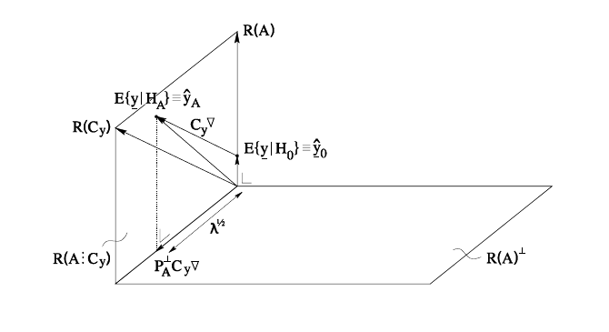
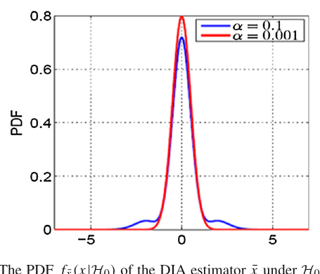
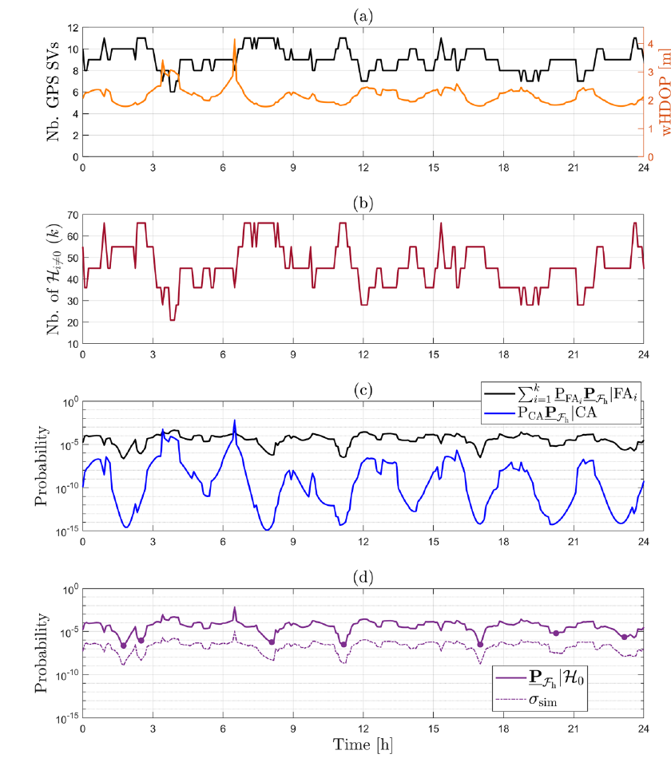

# 2026-07-29 GNSS 每日研究简报

## 今日快报

### 快报 1：EASA 再修订干扰与欺骗通告：从飞行报告到管制容量都要闭环

- 主题：`easa-gnss-jamming-spoofing-sib-r4`
- 来源 ID：`easa:sib-2022-02r4`
- 来源链接：https://ad.easa.europa.eu/blob/EASA_SIB_2022_02R4.pdf/SIB_2022-02R4_1
- 发表日期：2026-07-03
- 来源类型：EASA 官方安全信息通告
- 获取范围：10 页官方全文、受影响区域与运行建议；未给出事件总数、误差分布或因果归属

**内容：** Revision 4 汇总民航 GNSS 干扰（jamming）与欺骗（spoofing）的运行风险。EASA 称自 2022 年 2 月以来，事件的严重性、强度和复杂度总体上升，并列出南部与东部地中海、黑海、中东、波罗的海和北极等受影响区域。本次修订细化飞行员—ATC 用语、EFB/航电交叉检查、训练和报告流程，也提醒空管侧评估大范围退化对容量的影响。

**结论：** 通告给出的是风险识别和非强制性建议，不是带分母的事件数据库；因此可据此确认“风险持续且处置要求升级”，不能推导某地区发生概率，也不能把所有异常归因于同一行为方。核心处置思想是：尽早识别不可信 GNSS、切换到可用替代导航、向 ATC 报告并保留运行裕度。

**关注理由：** 接收机告警若不能进入机组操作、ATC 协同和航路容量决策，就只是局部诊断。工程团队应把射频监测、导航一致性、航电模式切换、事件记录和训练脚本作为一条链验证。

### 快报 2：墨尔本多传感器数据集开放原始观测，也暴露“真值”与同步边界

- 主题：`melbourne-multisensor-urban-positioning-dataset`
- 来源 ID：`doi:10.5194/isprs-annals-xi-1-2026-35-2026`
- 来源链接：https://doi.org/10.5194/isprs-annals-XI-1-2026-35-2026
- 发表日期：2026-07-03
- 来源类型：同行评审开放数据论文
- 获取范围：开放全文、七条路线、传感器配置和基准表；CC BY 4.0

**内容：** 数据集覆盖墨尔本七次城市采集，包含 VectorNav 战术级 INS、Leica GS18、u-blox F9P、Ouster OS1-128 激光雷达和四台 FLIR 相机，原始 GNSS、IMU、点云与图像以 ROS2 MCAP 发布。作者用 RTKLIB、Ginan 和激光里程计流程给出可运行基线，而不是只提供整理后的轨迹。

**结论：** 以 VectorNav VN300 内部解为参考，Leica GS18 的水平/垂直 RMSE 分别为：RTKLIB RTK 2.416/5.003 m、网络差分 RTK 1.709/4.805 m、Ginan PPP 2.385/5.720 m、Ginan RTK 2.975/5.956 m；u-blox+RTKLIB 为 16.840/23.717 m。大误差说明城市遮挡下“RTK 设备”并不自动等于厘米解。不过 VN300 不是更高等级独立真值，且除相机外各传感器未做硬件 GPS 时间同步，表格更适合验证处理链和暴露退化，不宜解释为传感器固有精度排名。

**关注理由：** 可复现融合需要原始观测、时间戳、标定和独立真值四者同时成立。使用者应先审计时基与参考轨迹，再比较算法，否则同步误差可能被错算成定位算法误差。

### 快报 3：GNSS 约束的闭式初始化，在视觉困难段仍会显著退化

- 主题：`gnss-constrained-vio-closed-form-initialization`
- 来源 ID：`doi:10.5194/isprs-annals-xi-1-2026-143-2026`
- 来源链接：https://doi.org/10.5194/isprs-annals-XI-1-2026-143-2026
- 发表日期：2026-07-03
- 来源类型：同行评审开放会议论文
- 获取范围：开放全文、闭式推导、两类场景与基线表；CC BY 4.0

**内容：** 方法把 GNSS 约束直接加入视觉—惯性初始化的线性运动估计，不依赖完整三维重建，也不做后续非线性精化。待估量包括尺度、重力和速度；对照 DRT-t 与 GVINS，目标是更快得到后端可用初值。

**结论：** 在 Sports Field 场景，本文方法的尺度误差均值/RMS 为 0.06/0.06，重力方向误差 0.77°/0.85°，速度误差 0.16/0.19 m/s；三项均优于表中基线。在 Complex Environment，尺度变为 0.12/0.47、重力 4.77°/6.22°、速度 0.52/0.70 m/s，显示间歇 GNSS 和困难视觉会同时削弱可观测性。这些是初始化指标，不能替代端到端轨迹精度、鲁棒性或计算量评估。

**关注理由：** “闭式”消除了迭代初值依赖，却没有消除坏几何和错误观测。实装时仍需质量门控、退化检测，以及初始化后由滑窗优化再次核验。

### 快报 4：GNSS 垂向序列识别干旱有潜力，但 2026—2029 只是情景外推

- 主题：`gnss-vertical-drought-ssa-cnn-transformer`
- 来源 ID：`doi:10.5194/isprs-annals-xi-3-2026-625-2026`
- 来源链接：https://doi.org/10.5194/isprs-annals-XI-3-2026-625-2026
- 发表日期：2026-07-08
- 来源类型：同行评审开放会议论文
- 获取范围：开放全文、单站时间序列、分类指标与外部对照；CC BY 4.0

**内容：** 研究对加州 P242 站 2005—2023 年日垂向 GNSS 序列做奇异谱分析（SSA），再用混合 CNN—Transformer 抽取局部与长时依赖，将月份分为干旱、正常、湿润。2024—2025 结果与美国干旱监测图做外部核对，2026—2029 则由输入特征的情景延伸得到。

**结论：** 论文报告总体准确率 83.3%；干旱类 precision/recall/F1 为 0.88/0.92/0.90，正常类 0.85/0.80/0.82，湿润类 0.70/0.65/0.67。证据来自单站，外部检验只有两年且按月聚合；未来段又不是基于水文—气象因果模型的独立预报。因此 2026—2029 只能称为模型情景，不应当作已经验证的干旱预测。

**关注理由：** GNSS 形变能补充地下水与地表负载信息，但高分类分数不等于跨区域泛化。下一步应做跨站留一验证，并与降水、地下水、温度和天线环境变化共同归因。

### 快报 5：手机 RTK 测点可到厘米级，内部协方差却明显过度自信

- 主题：`pix4dcatch-mobile-rtk-point-surveying`
- 来源 ID：`doi:10.5194/isprs-annals-xi-1-2026-455-2026`
- 来源链接：https://doi.org/10.5194/isprs-annals-XI-1-2026-455-2026
- 发表日期：2026-07-03
- 来源类型：同行评审开放会议论文
- 获取范围：开放全文、静态 RTK 对照、GNSS 拒止距离实验与协方差检验；CC BY 4.0

**内容：** PIX4Dcatch 将外接 RTK GNSS 与手机视觉、惯性信息送入 geofusion 和束平差，用手机对地籍类点位进行快速测量。实验把 191 个应用测点与 169 个静态 rover 点对照，并考察离开 GNSS 支撑后不同传播距离的误差。

**结论：** 理想条件下平面误差范数均值为 3.0 cm，97% 小于 10 cm；后处理为 2.9 cm、98%。但按内部协方差构造的卡方覆盖率明显不足：名义 68% 分位只覆盖 44%，名义 99% 只覆盖 82%，说明不确定度过度乐观。GNSS 拒止下，1.2/3.6/8.1 m 传播距离的中位误差为 6.0/8.4/18.5 cm，后处理把 8.1 m 降至 6.3 cm。作者团队包含 PIX4D 员工，且流程为专有实现；结论应限于该设备、点位和场景。

**关注理由：** 对测绘应用，均值好看仍不足以支撑质量承诺，协方差校准与尾部误差同样关键。部署验收应同时检查覆盖率、失效距离和独立控制点，而不是只报平均厘米数。

## 深度研读

### 深读 1｜接收机工程｜整体模型检验：先问“所有观测能否共同成立”

- 类别：`receiver-engineering`
- 学习层级：`foundation`
- 选题定位：`基础`
- 来源 ID：`doi:10.59490/tb.96`
- 来源链接：https://doi.org/10.59490/tb.96
- 发表日期：2024-06-20
- 来源类型：TU Delft OPEN 开放教材（第三版）
- 获取范围：完整教材、推导、图例与习题；CC BY 4.0
- 价值评分：99/100（相关性 20，经典价值 24，证据 20，教学价值 20，工程价值 15）

#### 为什么先学这个

定位滤波输出一个坐标，并不表示观测模型正确。整体模型检验（overall model test）先把残差压成一个有已知零假设分布的统计量，回答“这批观测与功能模型、随机模型能否共同成立”。这是后两节 DIA（检测、识别、适配）分布和多故障安全分析的起点。

#### 先修知识

需要线性化模型 $`\mathbf y=A\mathbf x+\mathbf e`$、协方差 $`Q_{yy}`$、加权最小二乘、秩与冗余度，以及卡方分布、显著性水平、检验功效。冗余度 $`r=m-n`$ 决定残差空间维数；无冗余时，即使坐标有误也不能从同一批观测内部检测。

#### 一句话逻辑

把估计后不能被参数吸收的残差能量，与零假设下的卡方阈值比较；超阈值则拒绝“模型整体正确”，再进入故障识别和适配。

#### 研究问题与约束

Teunissen 的教材系统建立线性模型检验、功效、最小可探测偏差（MDB）和可靠性理论。它是一般测量调整理论，不是某一 GNSS 设备实测；高斯误差、正确协方差和预先规定备择模型是推导条件。真实多路径、相关噪声或未建模偏差会让名义误警率失真。

#### 核心方法论

先按零假设估计 $`\hat{\mathbf x}`$，得到残差 $`\hat{\mathbf e}=\mathbf y-A\hat{\mathbf x}`$；再构造残差平方型 $`T=\hat{\mathbf e}^TQ_{yy}^{-1}\hat{\mathbf e}`$。给定误警率 $`\alpha`$ 选阈值；若 $`T`$ 未超阈值，只能说“证据不足以拒绝”，不是证明模型无故障。备择偏差通过非中心参数决定检出功效，再反求 MDB。

#### 关键公式逐步推导

加权最小二乘解为：

```math
\hat{\mathbf x}=(A^TQ_{yy}^{-1}A)^{-1}A^TQ_{yy}^{-1}\mathbf y
```

残差投影矩阵记为 $`R=I-A(A^TQ_{yy}^{-1}A)^{-1}A^TQ_{yy}^{-1}`$，于是：

```math
\hat{\mathbf e}=R\mathbf y,\qquad
T=\hat{\mathbf e}^TQ_{yy}^{-1}\hat{\mathbf e}
```

零假设成立且方差尺度已知时：

```math
T\mid\mathcal H_0\sim\chi_r^2,\qquad
P(T>\chi^2_{r,1-\alpha}\mid\mathcal H_0)=\alpha
```

若偏差为 $`\mathbf b=C\boldsymbol\nabla`$，则备择分布为非中心卡方：

```math
T\mid\mathcal H_a\sim\chi_r^2(\lambda),\qquad
\lambda=\mathbf b^TQ_{yy}^{-1}R\mathbf b
```

给定 $`\alpha`$ 和漏检率 $`\beta`$，由目标非中心参数 $`\lambda_0(\alpha,\beta,r)`$ 反求最小 $`\|\boldsymbol\nabla\|`$；它就是特定方向和几何下的 MDB。

#### 经典价值与创新边界

经典价值在于把误警、漏检、可探测偏差和几何明确连接起来，也把“内部可靠性”与偏差传到坐标的“外部可靠性”区分开。边界是整体检验只告诉你有不一致，不能定位哪颗星；若协方差失配，正确阈值也会给出错误覆盖。

#### 整体逻辑链

定义零假设和随机模型；检查秩与冗余；估计状态；形成残差平方型；按 $`\alpha`$ 判定；若拒绝则为每类候选偏差构造局部检验；按功效计算 MDB；把未检出偏差传播到位置域；最后决定排除、重加权或告警。

#### 原文图表与结果分析



> 图源：P. J. G. Teunissen，《Testing theory: an introduction》第三版，Figure 4.13，[TU Delft OPEN 原文](https://doi.org/10.59490/tb.96)，CC BY 4.0。从 PDF 物理第 108 页（印刷页 97）以 180 dpi 渲染，仅裁取原图；未重绘、改字或改变数据与标注。

图是概念关系图而非数值曲线：给定误警率 $`\alpha`$ 和功效 $`\gamma=1-\beta`$，临界值与非中心参数决定可探测偏差，再由模型几何映射到内部、外部可靠性。它没有横纵坐标、单位或 GNSS 基线，因此不能证明某个接收机的检测阈值或米级保护能力；它证明的是设计量之间的逻辑依赖。

#### 原文结果论述

教材强调，较小误警率会提高拒绝阈值，若偏差幅度不变则降低检出功效；为了维持同一功效，MDB 必须增大。观测几何和权阵决定同一偏差是否落在可检测残差空间，也决定漏检后对参数的影响。因此报告“通过卡方检验”必须同时给出 $`\alpha`$、冗余度、功效或 MDB。

#### 常见误区与适用边界

第一，把未拒绝 $`\mathcal H_0`$ 写成“证明无故障”。第二，调大观测方差后误警变少，就误认为系统更安全。第三，只报显著性水平，不报漏检率。第四，在检验后反复挑候选却仍沿用单次检验阈值。第五，忽略时间相关与方差估计带来的分布变化。第六，用残差小直接代替位置域安全。

#### 工程实现步骤

1. 固定观测模型、权阵、截止角和候选故障集合。
2. 每历元记录观测数、状态数、秩和冗余度。
3. 计算整体统计量与卡方阈值，保留预拟合和后拟合残差。
4. 用模拟或解析方法标定每类偏差的功效与 MDB。
5. 将未检出偏差传播到 ENU/保护级方向。
6. 对相关噪声先白化；用安静数据检查经验误警率。
7. 把拒绝、排除、重新估计和告警写入可审计日志。

#### 复现实验设计

选一座开阔 IGS 站 24 h、30 s 双频数据，构造 SPP 与码载波平滑 SPP 两组。按 5°、10°、15° 截止角运行；每 100 个历元向单星伪距注入 1、3、5、10 m 阶跃或 60 s 斜坡。报告名义/经验误警率、检出率、检测延迟、MDB、误排率及 ENU 最大漏检误差。失败基线包括等权、错误方差缩放和未白化的一阶相关噪声。

#### 与定位及低成本实现的联系

低成本码观测噪声大且随仰角、C/N0、机身姿态变化，固定测地级权阵会让卡方检验频繁误警。正确做法不是关闭检验，而是用独立安静数据标定随机模型，再保留功效和位置域后果。

#### 本节小结

整体模型检验把“残差看起来不大”变成可量化的统计判断；它是故障诊断入口，不是安全结论。误警率、功效、冗余和外部可靠性必须成套报告。

### 深读 2｜接收机工程｜DIA 的条件选择让估计误差出现非高斯尾

- 类别：`receiver-engineering`
- 学习层级：`intermediate`
- 选题定位：`基础进阶`
- 来源 ID：`doi:10.1007/s00190-017-1045-7`
- 来源链接：https://doi.org/10.1007/s00190-017-1045-7
- 发表日期：2017-07-06
- 来源类型：同行评审开放期刊论文
- 获取范围：开放全文、DIA 分布推导、数值示例与图表；CC BY 4.0
- 价值评分：98/100（相关性 20，经典价值 22，证据 20，教学价值 18，工程价值 18）

#### 为什么先学这个

第一节在“选定一个模型”条件下得到高斯估计和卡方检验。但 DIA 会根据同一批数据选择零假设、某个备择假设或排除方案；最终位置解是多个条件估计器的拼接。选择本身是随机的，因此输出误差一般不再是单一高斯。

#### 先修知识

需要正态密度、条件概率、假设检验、局部检验统计量，以及检测（Detection）、识别（Identification）、适配（Adaptation）的流程。还要区分估计精度的方差与完整性关心的尾概率：均值和 RMS 接近，尾部风险仍可相差很大。

#### 一句话逻辑

DIA 根据检验统计量落入哪个决策域来选择估计器，所以最终误差密度是被决策域截断、移位并重加权的分量组合，而非“排错后仍服从原高斯”。

#### 研究问题与约束

Teunissen 研究 DIA-estimator 的精确分布及其对误警率、偏差、相关性和模型选择的依赖。论文给出解析理论和算例，而不是特定 GNSS 动态道路试验；其候选备择模型必须预先定义，未知的复合故障或错误先验不自动受到保护。

#### 核心方法论

将数据空间划分为接受域 $`\mathcal P_0`$ 和各备择模型识别域 $`\mathcal P_i`$。在 $`\mathcal P_0`$ 使用零假设估计 $`\hat{\mathbf x}_0`$；在 $`\mathcal P_i`$ 使用适配估计 $`\hat{\mathbf x}_i`$。最终估计器用指示函数拼接。对每个真实假设，积分所有决策域，可得到估计误差 PDF、偏差、方差和超限概率。

#### 关键公式逐步推导

令 $`\mathbf 1_{\mathcal P_i}(\mathbf y)`$ 表示观测落在第 $`i`$ 个决策域，DIA 估计器为：

```math
\bar{\mathbf x}
=\sum_{i=0}^{k}\hat{\mathbf x}_i\,
\mathbf 1_{\mathcal P_i}(\mathbf y)
```

其误差分布不是简单按固定概率混合，因为估计量与“被选择”事件相关。对任意误差集合 $`\mathcal B`$：

```math
P(\bar{\mathbf x}-\mathbf x\in\mathcal B\mid\mathcal H_j)
=\sum_{i=0}^{k}
P(\hat{\mathbf x}_i-\mathbf x\in\mathcal B,\,
\mathbf y\in\mathcal P_i\mid\mathcal H_j)
```

对应密度可写成各决策域上的联合积分：

```math
f_{\bar x\mid\mathcal H_j}(v)
=\sum_{i=0}^{k}
\int_{\mathcal P_i}
\delta\!\left(v-\hat x_i(y)+x\right)
f_{y\mid\mathcal H_j}(y)\,dy
```

因此即使 $`\mathbf y`$ 高斯，每个 $`\mathcal P_i`$ 的截断和错误识别都会产生偏斜、旁瓣或厚尾。

#### 经典价值与创新边界

论文的关键贡献是把 DIA 后估计量作为一个整体随机变量，而不是只评价检验正确率或“排除后”的条件协方差。这使精度、偏差和完整性风险能在同一分布中计算。边界是分布依赖候选模型、阈值和先验；现实故障不在假设集中时，精确公式仍可能精确地回答了错误问题。

#### 整体逻辑链

设定零假设与备择集合；设计整体和局部检验；定义互斥决策域；对每个区域构造适配估计；形成 DIA-estimator；在每个真实假设下积分密度；计算均值、协方差与超限概率；最后联合误警、错识别和漏检调阈值。

#### 原文图表与结果分析



> 图源：P. J. G. Teunissen，《Distributional theory for the DIA method》，Figure 6，[Springer 原文](https://doi.org/10.1007/s00190-017-1045-7)，CC BY 4.0。从 PDF 第 9 页以 180 dpi 渲染，仅裁取原图；未重绘、改字或改变坐标、曲线与数据。

横轴是无量纲的标准化估计误差，纵轴是概率密度；蓝色对应 $`\alpha=0.1`$，红色对应 $`\alpha=0.001`$。直接读图，较激进的 0.1 检验形成明显旁瓣和更重侧尾，而 0.001 曲线更接近中心正态形状。密度单位为横轴倒数，曲线面积为 1。图是论文设定下的理论算例，不能证明“更小 $`\alpha`$ 总是更安全”，因为它同时可能增加真实故障的漏检。

#### 原文结果论述

作者证明 DIA-estimator 的均值、协方差和 PDF 会随检验大小与真实偏差改变，并可呈现多峰和长尾；仅用零假设协方差描述它通常不充分。Figure 6 直观显示，错误适配的概率质量可以远离中心。安全评价因此必须计算尾概率，而非只比较条件 RMS。

#### 常见误区与适用边界

第一，把适配后的协方差当无条件分布。第二，只统计检测率，不统计错识别。第三，看到 $`\alpha`$ 变小、曲线中心更像高斯，就忽略漏检上升。第四，用样本均值/RMS 推断极小超限概率。第五，让候选故障共享重叠决策域却不规定仲裁。第六，把单故障模型直接套到同时多故障。

#### 工程实现步骤

1. 明确每个候选故障向量和先验，不用模糊的“异常”标签。
2. 生成互斥、完备的检测与识别区域。
3. 保存每次决策、候选统计量、被排观测和适配解。
4. 以蒙特卡洛复核解析 PDF，特别检查旁瓣与尾部。
5. 同时报误警、漏检、错识别和危险误导信息概率。
6. 用多套 $`\alpha`$ 扫描风险权衡，不按 RMS 单目标调参。
7. 对未建模复合故障增加保守上界或告警状态。

#### 复现实验设计

构造 8 星单历元加权 SPP，几何固定，码噪声 0.7 m；候选为八个单星偏差。分别取 $`\alpha=10^{-1},10^{-2},10^{-3}`$，注入 0—15 m 偏差，每点蒙特卡洛 $`10^6`$ 次。比较“从不排除”、DIA 和知道故障星的 oracle；报告三维误差 PDF、95/99.9% 分位、误警、漏检、错识别和超过 10 m 的概率。再注入双星同向偏差作为失配用例。

#### 与定位及低成本实现的联系

低成本接收机常用残差门限后重新解算，却仍输出普通最小二乘协方差。DIA 理论说明，这个协方差没有包含随机模型选择的尾部。资源有限时，至少应离线建立按星数、几何和门限索引的经验尾部分布。

#### 本节小结

检测与排错会改变估计器本身的分布。DIA 的非高斯尾来自数据驱动模型选择；完整性设计必须把误警、漏检、错识别和适配后的尾概率一起计算。

### 深读 3｜定位｜多维模型失配下的 UAV GNSS 定位安全

- 类别：`positioning`
- 学习层级：`advanced`
- 选题定位：`定位深入`
- 来源 ID：`doi:10.1007/s10291-026-02029-5`
- 来源链接：https://doi.org/10.1007/s10291-026-02029-5
- 发表日期：2026-03-09
- 来源类型：同行评审开放期刊论文（已发布勘误）
- 获取范围：开放全文、真实星历几何、单/双观测故障假设、风险分解与图表；CC BY 4.0
- 价值评分：99/100（相关性 20，经典价值 19，证据 20，教学价值 20，工程价值 20）

#### 为什么先学这个

前两节说明怎样检验模型，以及为什么检测—识别—适配会形成非高斯尾。本节把理论落到 UAV 单历元 GPS 定位：同时考虑无故障却因误警/错适配超限，以及一维、二维故障未被正确处置的风险，并在全天真实卫星几何下检查 11 m 水平告警限。

#### 先修知识

需要伪距线性化、HDOP、DIA 决策域、先验故障概率、条件超限概率和全概率公式。完整性风险不是 RMS，而是“真实位置误差超过告警限且系统未及时告警”的概率；它必须对 $`\mathcal H_0`$ 和所有备择假设加权。

#### 一句话逻辑

枚举单星和双星伪距失配，用 DIA-estimator 的完整分布计算每种假设下水平超限概率，再乘先验求和，检验总风险是否低于 UAV 需求。

#### 研究问题与约束

论文使用 GPS L1 伪距、单历元几何和模拟噪声，研究 45 m 高 UAV 的水平安全。误差标准差按仰角加权，基准 $`\sigma_y=0.7`$ m、$`a_0=1.4`$、$`a_1=8`$、$`E_0=20^\circ`$，截止角 10°；水平告警限 11 m。真实 IGS 轨道来自 2024-05-24，每 5 min 取样 24 h，但观测与故障是模拟的，因此这是方法性安全分析，不是认证飞行试验。

#### 核心方法论

每个历元先建立四参数 GPS 伪距模型。备择集合包含每个单观测偏差和每对双观测偏差；八星时共有 36 个备择。DIA 先检测、再识别并适配。作者对每个假设下的位置误差分布积分 11 m 水平圆外概率，并以每观测故障先验 $`\pi=10^{-3},10^{-4},10^{-5}`$ 组合总风险；同时比较不同 $`\alpha`$。

#### 关键公式逐步推导

线性化伪距模型为：

```math
\Delta\mathbf y=A\Delta\mathbf x+\mathbf e+C_i\boldsymbol\nabla_i
```

其中 $`\Delta\mathbf x=[\Delta E,\Delta N,\Delta U,c\Delta t]^T`$，$`C_i\boldsymbol\nabla_i`$ 表示第 $`i`$ 个一维或二维模型失配。DIA 输出为决策域拼接：

```math
\bar{\mathbf x}
=\sum_{i=0}^{k}\hat{\mathbf x}_i
\mathbf 1_{\mathcal P_i}(\Delta\mathbf y)
```

水平危险事件为：

```math
\mathcal U=\left\{
\sqrt{(\bar E-E)^2+(\bar N-N)^2}>AL_H
\right\},\qquad AL_H=11\ \mathrm m
```

用全概率组合：

```math
P_{\mathrm{fail}}
=P(\mathcal U\mid\mathcal H_0)P(\mathcal H_0)
+\sum_{i=1}^{k}
P(\mathcal U\mid\mathcal H_i)P(\mathcal H_i)
```

若每观测独立以概率 $`\pi`$ 失配，$`P(\mathcal H_i)`$ 由故障维数和观测数得到；计算中必须避免把单、双故障先验重复归一化。

#### 经典价值与创新边界

创新点是用 DIA-estimator 的多维失配分布直接做位置域安全分解，而不是只给可检测偏差或高斯保护级。论文也显示无故障项可能因模型选择而主导风险。边界包括：只枚举至双故障、只用 GPS 单频单历元、先验独立且人为设定、没有真实多路径与时间相关，不能直接作为适航合规证据。

#### 整体逻辑链

由真实轨道生成全天卫星几何；按仰角构造伪距权；枚举零假设及一维、二维偏差；为各假设划分 DIA 决策域；形成适配位置分布；积分水平告警限外概率；乘故障先验并分解风险贡献；扫描 $`\alpha`$ 与 $`\pi`$；检查每个几何历元是否满足需求。

#### 原文图表与结果分析



> 图源：P. J. G. Teunissen、K. Wang，《DIA-Estimator and Multidimensional Model Misspecifications: GNSS-based Positioning Safety Analysis for UAVs》，Figure 12，[Springer 原文](https://doi.org/10.1007/s10291-026-02029-5)，CC BY 4.0；原文已有更正通知 DOI 10.1007/s10291-026-02074-0。从 PDF 第 15 页以 180 dpi 渲染，仅裁取四联图；未重绘、改字或改变坐标、曲线与数据。

横轴为 24 h GPS 时间（小时）。四联图依次给出可见星数、加权 HDOP（m）、备择假设数量 $`k`$ 和失败概率分量。可见星数约 7—11；wHDOP 多数约 2 m，在约 3.4 h、6.5 h 升至约 3.4 m、4.1 m；$`k`$ 随星数在 21—66 间变化。最下图为对数概率，无故障相关分量在多数历元占主导，几何最弱处其他分量上升。它说明风险随几何和候选数变化，不能证明实际 UAV 全天故障率，因为故障和噪声是模拟输入。

#### 原文结果论述

作者的最坏情形汇总显示：$`\alpha=10^{-3}`$ 时，所考察先验下没有方案达到 $`10^{-5}`$ 的风险要求；只有把 $`\alpha`$ 降至 $`10^{-5}`$ 且采用最乐观的 $`\pi=10^{-5}`$，所有选定历元才满足。论文还给出约 3—4 m 的平均水平 95% 圆精度、约 6 m 的垂向区间量级，但精度好不等于完整性合格。结果依赖 11 m 告警限和作者的先验。

#### 常见误区与适用边界

第一，用 HDOP 或 95% 精度替代 $`10^{-5}`$ 级尾风险。第二，只计算有故障项，漏掉无故障时误排造成的超限。第三，以单星故障覆盖双星共因事件。第四，把人为先验当实测发生率。第五，从若干代表历元外推全天合规。第六，忽略勘误版本。第七，把模拟分析称为认证或飞行验证。

#### 工程实现步骤

1. 从任务概念确定告警限、连续性和完整性风险需求。
2. 用接收机实测残差标定仰角/CN0 权阵与时间相关。
3. 建立包含共因、多星和接收钟异常的故障树及先验区间。
4. 按可见星数动态生成互斥候选集合和 DIA 决策域。
5. 在位置域积分而非用 RMS 外推极小尾概率。
6. 输出风险分量、主导假设、几何和告警状态。
7. 以重要抽样、分层蒙特卡洛和真实回放交叉验证解析结果。

#### 复现实验设计

复现 2024-05-24、10° 截止角和 5 min 网格，先验证 7—11 星、wHDOP 与 $`k`$。扫描 $`\alpha=10^{-3},10^{-4},10^{-5}`$、$`\pi=10^{-3},10^{-4},10^{-5}`$ 和告警限 8/11/15 m；每个代表几何做至少 $`10^7`$ 次重要抽样，注入单/双星阶跃、共模钟差和相关多路径。基线为普通 WLS、只单故障 RAIM 和 DIA；报告总风险、各假设贡献、置信上界、计算时延及无法判定比例。

#### 与定位及低成本实现的联系

低成本 UAV 的天线、时钟和机体多路径会让 $`\sigma_y=0.7`$ m 假设偏乐观，算力也限制候选数量。可通过分层筛选和离线风险表降低在线负担，但不能靠减少候选让账面风险变小；未覆盖故障必须进入保守上界或不可用状态。

#### 本节小结

多故障定位安全不是“残差门限 + 一个保护级”。它要求把 DIA 模型选择后的非高斯分布、每类故障先验、全天几何和位置告警限统一积分；在本文设定下，严格误警控制和极低故障先验缺一不可。
