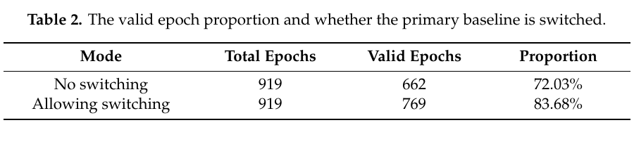
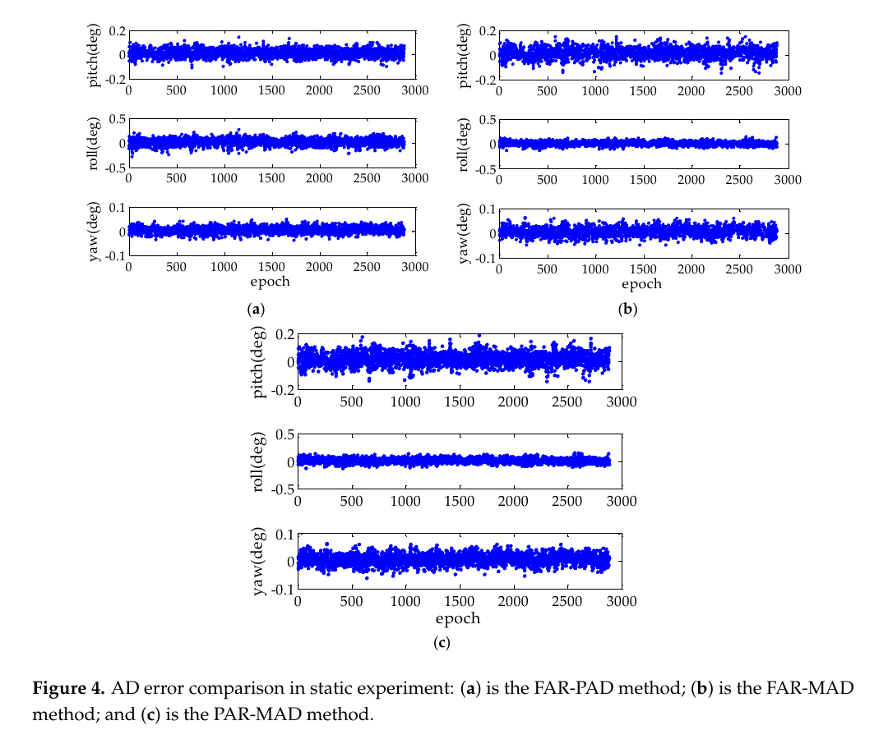
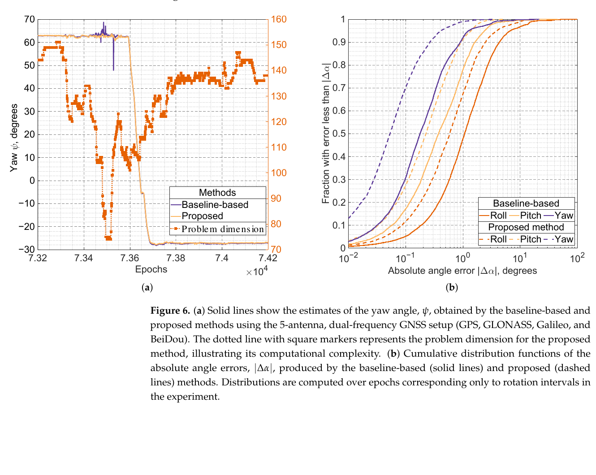

# 2026-07-30 GNSS 每日研究简报

## 今日快报

### 快报 1：星间相对 GNSS 原型从 TRL 2 走向 TRL 6，但厘米级仍是项目目标而非公开验收结果

- 主题：`navisp-sting-relative-gnss-space`
- 来源 ID：`navisp:el2-166-sting-final-presentation`
- 来源链接：https://navisp.esa.int/event/details/234/show
- 发表日期：2026-07-28
- 来源类型：ESA NAVISP 官方项目结题演示公告
- 获取范围：官方活动页全文；页面给出项目目标、技术路线与验证环境，但未公开演示文稿、误差曲线、样本数或验收阈值

**内容：** NAVISP EL2-166 的 STING 项目以合作航天器的差分 GNSS 信号处理实现空间相对导航，把算法集成到商用现成器件原型，并计划在高保真仿真环境中验证；项目成熟度目标是从 TRL 2 提升到 TRL 6。公告把“厘米级相对导航”写成项目聚焦方向，并说明结题演示将汇报性能指标。

**结论：** 该页可以证明项目范围、原型化路线和计划验证环境，不能证明厘米级精度已经在轨或已通过独立验收。活动页在会后仍未附结果文件，因此“厘米级”“TRL 6”都应保留为官方项目目标，而不是测得性能。

**关注理由：** 空间编队的短基线差分 GNSS 与地面双天线定向共享载波相位、整数模糊度和基线几何问题，但空间场景还叠加高速相对运动、天线视场、星载时钟与动态模型。评估时应要求公开真值来源、相对距离范围、固定成功率、失锁恢复时间和实时算力。

### 快报 2：LiDAR 辅助固定翼自主起降完成实飞，但没有独立真值就不能声称绝对着陆精度

- 主题：`lidar-fixed-wing-atol-gnss-degraded`
- 来源 ID：`doi:10.3390/drones10080559`
- 来源链接：https://doi.org/10.3390/drones10080559
- 发表日期：2026-07-23
- 来源类型：同行评审开放期刊论文
- 获取范围：CC BY 4.0 开放全文、SITL/HITL、同步机载日志与实飞讨论

**内容：** 论文在 5 kg 固定翼平台上融合向下 LiDAR、雷达高度计、气压计、INS/GNSS、光流和空速，经软件在环、硬件在环后完成准备跑道上的自主起降。最终进近/触地相关段中，LiDAR 与雷达的差值 RMSE 为 1.91 m，LiDAR 与气压计的差值 RMSE 为 8.17 m。

**结论：** 上述 RMSE 是传感器之间的一致性，不是相对外部真值的着陆误差；作者明确说明日志没有 RTK-GNSS、测量跑道网格或同步视频真值，因而没有报告纵向、横向或垂向绝对触地点误差。实飞能支持“系统完成并重复了自主起降”，不能支持“厘米级或米级绝对着陆精度”。

**关注理由：** GNSS 退化时把地形相对高度交给 LiDAR是合理的功能分工，但全球位置、航向与跑道坐标仍需独立约束。下一步应把 RTK/全站仪真值、不同跑道坡度、植被、雨雾和真正 GNSS 中断的消融加入同一实验。

### 快报 3：5 分钟 GNSS 与稀疏变点让慢滑移起止更清楚，但高采样率不自动等于高空间分辨率

- 主题：`boso-high-rate-gnss-slow-slip-change-point`
- 来源 ID：`doi:10.1029/2025JB032600`
- 来源链接：https://doi.org/10.1029/2025JB032600
- 发表日期：2026-07-21
- 来源类型：同行评审开放期刊论文
- 获取范围：开放全文、补充材料说明、处理数据与反演结果；正文及数据声明为 CC BY 4.0

**内容：** 研究使用房总半岛周边 40 个 GEONET 站的 5 min PPP 水平时间序列，先以稀疏分段线性回归在 50 个候选分段中识别慢滑移起止，再以 Hamiltonian Monte Carlo 和 horseshoe 先验反演 8×8 断层网格，比较 2011、2013—2014、2018、2024 四次事件。

**结论：** 作者发现四次事件虽准周期复发，起始深度、沿倾向传播和起止快慢并不相同：2011 年浅部快速开始、缓慢结束；2018 年从更深处向浅部传播且结束更陡。正文同时确认 5 min 解比日解更散，并用日解只验证趋势一致性；约 10 km 的断层单元与陆上站网几何仍限制空间解释。

**关注理由：** 高频 GNSS 的收益来自更细的时间采样与显式变点模型，而不是简单增加历元。工程上应同时报告时间分辨率、位置噪声、先验正则化和站网几何，否则更密时间序列可能只给出更密的噪声。

### 快报 4：北斗 GEO 与多 GNSS 看见 2—8 mHz 同震电离层波，但震前三日异常仍不能当预测器

- 主题：`myanmar-earthquake-bds-geo-multignss-ionosphere`
- 来源 ID：`doi:10.1093/gji/ggag294`
- 来源链接：https://doi.org/10.1093/gji/ggag294
- 发表日期：2026-07-22
- 来源类型：同行评审期刊已接受稿；开放预印本可复核
- 获取范围：GJI 接受稿元数据与 arXiv:2603.01881 全文、公式、图表和局限性

**内容：** 作者结合陆态网北斗 GEO 与多 GNSS TEC，用移动四分位距和太阳—地球环境指标筛震前异常，再以小波与带通滤波提取同震扰动，并用空间密度加权降低穿刺点分布不均对源反演的偏置。接受稿报告同震能量主要位于 2—8 mHz，表观传播速度约 1.2 km/s，向东南不对称传播。

**结论：** 文中把震前三日的负 TEC 异常解释为与震源区相关，但同时承认单事件、背景场与穿刺点几何带来的归因限制；约 32 km 的最小标准差位置应解释为电离层扰动能量表观质心，而非断层起裂点。该结果能支持事件后机理分析，不能建立可操作的地震预测率。

**关注理由：** 北斗 GEO 的固定投影几何有利于连续看同一区域，也会形成强烈空间采样偏置。监测系统应先以非地震日盲测误警率，再把太阳、磁暴、对流天气和其他声重力波源作为竞争解释。

### 快报 5：消费级加速度计在 5 英里样本上胜过 LiDAR，但 F1 优势受车辆与人工真值约束

- 主题：`road-anomaly-multigrade-gnss-ins-sensors`
- 来源 ID：`doi:10.3390/s26144645`
- 来源链接：https://doi.org/10.3390/s26144645
- 发表日期：2026-07-22
- 来源类型：同行评审开放期刊论文
- 获取范围：CC BY 4.0 开放全文、36 mile 多平台道路数据、人工复核协议、处理时间与失效讨论

**内容：** 研究把成像、测量级 LiDAR 和不同等级 GNSS/INS 中的垂向加速度映射到同一道路坐标，在人工复核的 5 mile 路段比较异常检测。CT-CrackSeg、LiDAR、Isolation Forest 与自适应阈值的 F1 分别为 88.5%、93.0%、95.2%、97.2%；加速度方案随后扩展到 36 mile 闭环道路。

**结论：** “100% precision”只出现在这段人工共识真值与特定阈值下；作者明确警告不能外推。加速度计只能发现车辆实际压过并引发足够振动的缺陷，结果会随速度、悬架、轮胎、安装和载荷改变；LiDAR 可跨车道描述几何，但同一 5 mile 处理接近 2 h。

**关注理由：** 这项工作提醒 GNSS/INS 并非只能输出轨迹，原始惯性量也可承载道路状态信息。低成本部署应保存车辆状态与定位协方差，用跨车辆、跨速度复测验证阈值迁移，而不是只比较单一 F1。

## 深度研读

### 深读 1｜接收机工程｜从双差载波基线到航向：主基线失效时怎样切换

- 类别：`receiver-engineering`
- 学习层级：`foundation`
- 选题定位：`基础`
- 来源 ID：`doi:10.3390/rs12050747`
- 来源链接：https://doi.org/10.3390/rs12050747
- 发表日期：2020-02-25
- 来源类型：同行评审开放期刊论文
- 获取范围：CC BY 4.0 开放全文、公式、自研四天线平台与道路试验
- 价值评分：96/100（相关性 20，经典价值 20，证据 19，教学价值 19，工程价值 18）

#### 为什么先学这个

双天线航向不是“两个单点坐标相减”这么简单：要用毫米级载波相位恢复短基线，先固定整数模糊度，再把导航坐标系中的基线投影映射到载体坐标系。多天线增加的价值，是在某根主基线失锁或固定失败时仍有替代几何。

#### 先修知识

需要载波相位观测、单差与双差、整数模糊度、ENU 坐标和旋转矩阵。短基线让两天线看到近似相同的卫星钟、轨道、对流层和电离层误差，但天线相位中心、多路径、不同步与本机噪声不会自动消失。

#### 一句话逻辑

先用双差载波解出若干固定基线向量，再由主基线给航向/俯仰、辅基线补横滚；主基线不可用时切到另一根已知夹角的基线，并用固定旋转关系换回原载体系。

#### 研究问题与约束

论文研究四天线车辆平台中直接姿态法的可用性：原定主基线固定失败时，能否使用另一根已知几何的基线继续输出同一载体系姿态。试验参考为 SPAN-FSAS 组合导航解，只有 919 个 1 s 历元；车辆、天线布局、门限与环境都固定，不能代表所有低成本接收机。

#### 核心方法论

对两接收机 $`r,b`$ 与两卫星 $`k,s`$ 构造载波双差；固定 $`\nabla\Delta N_{br}^{ks}`$ 后，以多颗卫星求基线 $`\mathbf b=[e,n,u]^T`$。原主基线在载体系沿 $`Y_b`$，所以航向和俯仰直接由 ENU 分量得到；非共线辅基线提供横滚。当另一根基线暂代主基线时，用两基线的已知夹角构造绕共同 $`Z_b`$ 轴的旋转矩阵，完成坐标系回转。

#### 关键公式逐步推导

单星载波以长度表示：

```math
L_r^s=\rho_r^s+c(\delta t_r-\delta t^s)-\lambda N_r^s
+\delta_{\mathrm{ion}}+\delta_{\mathrm{trop}}+\varepsilon_r^s+m_r^s
```

短基线双差后近似为：

```math
\nabla\Delta L_{br}^{ks}
=\nabla\Delta\rho_{br}^{ks}
-\lambda\nabla\Delta N_{br}^{ks}
+\nabla\Delta\varepsilon+\nabla\Delta m
```

若固定主基线在 ENU 中为 $`\mathbf b_1=[e_{12},n_{12},u_{12}]^T`$，论文约定下：

```math
h=\operatorname{atan2}(e_{12},n_{12}),\qquad
p=\operatorname{atan2}\!\left(u_{12},\sqrt{e_{12}^2+n_{12}^2}\right)
```

临时载体系与原载体系的已知夹角为 $`\alpha_0`$，则：

```math
R_{b_0}^{n}=R_{b_1}^{n}R_{b_0}^{b_1},\qquad
R_{b_0}^{b_1}=
\begin{bmatrix}
\cos\alpha_0&\sin\alpha_0&0\\
-\sin\alpha_0&\cos\alpha_0&0\\
0&0&1
\end{bmatrix}
```

最后从 $`R_{b_0}^{n}`$ 反算原定义的航向、俯仰与横滚。

#### 经典价值与创新边界

经典部分是“载波双差—固定基线—坐标旋转—欧拉角”的 GNSS 罗盘链。论文创新集中在直接法的主基线切换与工程实现，不是新的整数估计理论。它通过空间冗余提高有解比例，却不能挽救所有天线同时受遮挡、共同多路径或错误固定。

#### 整体逻辑链

同步采集多天线载波；逐基线双差；LAMBDA 固定；比率检验；计算可用基线；按优先级选择主/辅基线；若切换则乘已知旋转；输出姿态；对固定状态、基线长度闭合和参考差值做质量控制。

#### 原文图表与结果分析



> 图源：P. Zhang 等，《A Novel GNSS Attitude Determination Method Based on Primary Baseline Switching for A Multi-Antenna Platform》，Table 2，[Remote Sensing 原文](https://doi.org/10.3390/rs12050747)，CC BY 4.0。从 PDF 物理第 12 页以 180 dpi 渲染，仅裁取表题与表格；未重绘、改字或改变数值。

表中两行使用相同的 919 个历元：不切换时 662 个有效历元、72.03%；允许切换时 769 个、83.68%。直接差值是 107 个历元和 11.65 个百分点；论文所称“约提高 16.2%”是相对 662 个有效历元的增幅。表没有误固定数、天空视野或跨路线重复，因此只证明该次道路试验的可用性变化。

#### 原文结果论述

论文报告切换方案的航向、俯仰、横滚 RMS 为 0.52°、1.25°、1.16°。但切换主要增加有解历元，不能从表中推断每个新增历元都同样准确；第一段 265 个历元中只有 88 个有效，其中 84 个依赖切换，也说明共性遮挡仍会留下大量空洞。

#### 常见误区与适用边界

第一，把航向精度只归因于接收机，不看基线长度。第二，用 `atan` 而非 `atan2` 丢失象限。第三，切换后不变换回原载体系。第四，把比率检验通过等同于绝对正确。第五，忽略两接收机时间不同步与天线相位方向图。第六，车辆静止时仍用单天线速度方向作“真航向”基线。

#### 工程实现步骤

1. 标定每根基线在载体系中的三维坐标、长度和夹角。
2. 保证多接收机统一时标并记录每星每频点锁定状态。
3. 对每根候选基线独立形成双差、浮点解、整数固定和闭合残差。
4. 依据固定状态、比率、基线长度残差和卫星数排序。
5. 切换主基线后用固定外参旋转回统一载体系。
6. 对欧拉角解缠，并保存切换事件和被弃原因。
7. 同时输出姿态协方差与“无可靠基线”状态。

#### 复现实验设计

在车顶安装四套同步双频接收机，基线取 0.5、1.0、1.5 m 三档；开阔、林荫、楼群三条路线各跑 30 min、10 Hz。比较固定主基线、可切换直接法、全基线 Wahba/联合估计；指标为有效率、正确固定率、航向/俯仰/横滚 RMS 与 99.9% 误差、切换延迟。用双天线高端 GNSS/INS 或全站仪作为独立真值，并注入单天线 1—10 s 失锁与 5 ms 不同步作为失败用例。

#### 与定位及低成本实现的联系

短基线角误差近似为横向基线误差除以长度，因此消费级天线的小毫米偏差会在 0.2—0.5 m 基线上放大。多天线能换空间冗余，但增加时钟同步、射频互扰、杆臂标定和安装成本；两天线产品至少也应提供基线闭合与固定质量，而不只给一个航向数。

#### 本节小结

GNSS 航向的基础是可靠固定的载波短基线。主基线切换把“某一天线暂时不可用”转化为坐标变换问题，提升可用性，但不会消除共同遮挡和错误固定。

### 深读 2｜接收机工程｜在测量域联合解姿态与模糊度：为什么部分固定更稳

- 类别：`receiver-engineering`
- 学习层级：`intermediate`
- 选题定位：`基础进阶`
- 来源 ID：`doi:10.3390/s17020296`
- 来源链接：https://doi.org/10.3390/s17020296
- 发表日期：2017-02-05
- 来源类型：同行评审开放期刊论文
- 获取范围：CC BY 4.0 开放全文、静态与道路动态实验、完整公式和结果表
- 价值评分：97/100（相关性 20，经典价值 21，证据 19，教学价值 19，工程价值 18）

#### 为什么先学这个

第一节先逐基线定位，再用基线算姿态，会丢掉不同基线共享同一旋转矩阵的约束。本节直接把载体系已知基线、姿态矩阵和各频点整数模糊度放在同一测量模型中，让所有基线共同约束三个姿态角。

#### 先修知识

需要多基线双差模型、Kronecker 积、旋转矩阵线性化、加权最小二乘、LAMBDA 和整数成功率。还要区分 FAR（全模糊度固定）与 PAR（只固定满足可靠性标准的子集），以及位置域姿态法 PAD 与测量域姿态法 MAD。

#### 一句话逻辑

把 $`\mathbf x_k=C_n^eC_b^n\mathbf b_k`$ 直接代入每根基线的载波/码双差，联合估姿态和整数；当弱观测拖累全固定时，只固定条件方差足够小的模糊度子集。

#### 研究问题与约束

论文比较 FAR-PAD、FAR-MAD 与 PAR-MAD。静态实验用三根 5.75—9.47 m 基线、24 h GPS 双频数据、30 s 间隔；动态实验在高速公路上用两根 2.20 m 与 0.75 m 基线。长基线和测地级 Trimble 天线比消费级车载双天线更有利，2017 年单 GPS 场景也不代表现代多星座算力。

#### 核心方法论

每根基线的双差码和相位组成观测向量，基线在载体系的坐标 $`\mathbf b_k`$ 预先标定，未知姿态矩阵 $`C_b^n`$ 把它转到导航/ECEF 系。围绕当前姿态线性化，所有基线共同估三个小姿态改正和整数向量。模糊度去相关后按条件标准差排序，用 bootstrapped 成功率逐步选择满足最小成功率的最大子集。

#### 关键公式逐步推导

第 $`k`$ 根基线在 ECEF 中为：

```math
\mathbf x_k=C_n^e C_b^n(\boldsymbol\theta)\mathbf b_k
```

把它代入双差码/相位，可抽象成：

```math
\mathbf y_k
=G_k C_b^n(\boldsymbol\theta)\mathbf b_k
+A_k\mathbf z_k+\boldsymbol\varepsilon_k
```

围绕 $`\boldsymbol\theta_0`$ 线性化：

```math
\mathbf v=
\mathbf H_\theta\,\delta\boldsymbol\theta
+\mathbf H_z\,\delta\mathbf z
-\mathbf w
```

去相关后，若第 $`i`$ 个条件模糊度标准差为 $`\sigma_{\hat z_{i|I}}`$，bootstrapped 成功率近似：

```math
P_s=\prod_{i=1}^{n}
\left[
2\Phi\!\left(\frac{1}{2\sigma_{\hat z_{i|I}}}\right)-1
\right]
```

PAR 从条件精度最好的分量开始，选择使 $`P_s\ge P_0`$ 的最大子集；未固定分量继续作为实数状态。

#### 经典价值与创新边界

联合测量域模型利用了“多根基线属于同一个刚体”的冗余，PAR 则承认并非所有整数都同样可靠。论文的 PAR 以近似成功率为准，不包含多路径偏差的完整概率模型；名义成功率高也可能在系统误差下错误固定。

#### 整体逻辑链

标定基线；同步双差；构造联合测量域模型；线性化姿态；求浮点模糊度及协方差；去相关；按最低成功率挑子集；固定并回代姿态；检验残差与连续性；下一历元重新单历元求解，避免周跳跨历元传播。

#### 原文图表与结果分析



> 图源：L. Zhao 等，《Real-Time GNSS-Based Attitude Determination in the Measurement Domain》，Figure 4，[Sensors 原文](https://doi.org/10.3390/s17020296)，CC BY 4.0。从 PDF 物理第 9 页以 180 dpi 渲染，仅裁取原图及图题；未重绘、平滑或改变坐标、点与数值。

横轴为约 3000 个静态历元，纵轴均为角误差（degree）；(a) FAR-PAD，(b) FAR-MAD，(c) PAR-MAD。直接看图，三者俯仰和航向都集中在零附近，MAD 的横滚带明显收窄；PAR-MAD 并非每一轴散布最小，它用少固定部分模糊度换连续性。图没有置信区间，也不显示被拒历元，不能单独证明危险误固定率。

#### 原文结果论述

作者报告相对 PAD，MAD 的静态横滚标准差降低 0.03°，但俯仰、航向标准差分别增加 0.008°、0.013°；PAR-MAD 的连续性最多提高 18%。这说明联合模型的价值不是所有轴都更准，而是在精度、固定可靠性和可用性之间取得更平衡的工作点。

#### 常见误区与适用边界

第一，认为更多卫星必然让全固定更可靠；整数维数也同步上升。第二，只比较固定率，不检查错固定。第三，把 bootstrapped 成功率当实测真值。第四，忽略共用参考星造成的相关性。第五，基线外参有误却让姿态状态吸收。第六，将长基线测地级结果直接外推到 0.3 m 消费级天线。

#### 工程实现步骤

1. 用统一参考星和严格协方差构造所有基线、频点双差。
2. 将基线载体系坐标作为带不确定度的标定量保存。
3. 形成联合姿态—模糊度法方程并检查秩。
4. 对模糊度协方差做整数去相关。
5. 由条件方差累计成功率，选择满足 $`P_0`$ 的最大子集。
6. 固定后回代姿态，做残差、基线闭合和角速度一致性检查。
7. 同时报固定子集大小、名义成功率、连续性和错误告警。

#### 复现实验设计

四天线组成三根 0.5—1.5 m 非共线基线，GPS/Galileo/BDS 双频 20 Hz；开阔和城市各 20 min。比较 FAR-PAD、FAR-MAD、PAR-MAD 与全浮点；扫描 $`P_0=0.99,0.999,0.9999`$，注入单频 0.05、0.1、0.25 cycle 偏差。指标为各轴 RMS/99.9% 分位、正确/错误固定率、固定子集维数、连续性和计算时间；独立 GNSS/INS 作真值。

#### 与定位及低成本实现的联系

低成本多星座接收机往往“观测很多但质量不齐”。PAR 允许保留高仰角、高 C/N0、连续频点的整数贡献，而不被少数弱频点绑架；但选择准则必须纳入设备实测噪声和偏差，不能照搬测地天线的 $`P_0`$。

#### 本节小结

测量域联合模型把多基线刚体约束保留到整数估计中；部分固定则把可靠性作为显式资源。最优方案不是固定最多，而是固定足够可信且能改善姿态的子集。

### 深读 3｜定位｜高率多天线 GNSS 姿态跟踪：用上一历元把非线性整数问题线性化

- 类别：`positioning`
- 学习层级：`advanced`
- 选题定位：`定位深入`
- 来源 ID：`doi:10.3390/s25216761`
- 来源链接：https://doi.org/10.3390/s25216761
- 发表日期：2025-11-05
- 来源类型：同行评审开放期刊论文
- 获取范围：CC BY 4.0 开放全文、仿真、实测多天线多星座数据与计算时间
- 价值评分：98/100（相关性 20，经典价值 20，证据 20，教学价值 19，工程价值 19）

#### 为什么先学这个

前两节解决单历元“怎样从载波得到姿态”。连续运行还可利用上一历元姿态：若每个采样间隔的转角足够小，旋转矩阵在一阶近似下只剩三个小角度，原本带 $`SO(3)`$ 非线性约束的混合整数问题可变成标准线性整数最小二乘。

#### 先修知识

需要旋转群 $`SO(3)`$、Rodrigues 公式、反对称矩阵、混合整数最小二乘、LAMBDA/MLAMBDA、码与相位精度差异，以及采样率与角速度共同决定的单步转角。

#### 一句话逻辑

用上一历元 $`R'`$ 预测当前姿态，以 $`R\approx(I-[\delta]_\times)R'`$ 线性化；再用高精度相位和小角先验直接解 $`\delta`$ 与整数，不再让噪声较大的码决定浮点解。

#### 研究问题与约束

论文评估高率短基线多天线跟踪能否接近正交约束模型的准确度，同时把计算量降到普通 LAMBDA 级。仿真为 20 Hz、五星、0.2—2 m 基线和 30—360°/s 匀速旋转；实测主要是准静态板和六段人工旋转，约 92.5% 历元静止，并非车辆或飞行器高动态盲测。

#### 核心方法论

已知载体系基线 $`\mathbf b_i`$ 和上一历元姿态 $`R'`$。对当前双差载波减去 $`H_iR'\mathbf b_i`$，剩余量由三维小转角 $`\delta`$、整数 $`\mathbf a`$ 与噪声组成。再增加 $`\delta\sim\mathcal N(0,\sigma_\delta^2I)`$ 的三条先验方程，构成满秩混合整数最小二乘；MLAMBDA 固定后用 Rodrigues 公式更新姿态。

#### 关键公式逐步推导

小转角一阶近似：

```math
R=(I_3-[\delta]_\times)R',\qquad \|\delta\|\ll1
```

第 $`i`$ 根基线的校正后双差相位：

```math
\mathbf z_{\phi}^{i}-H_{\phi}^{i}R'\mathbf b_i
=H_{\phi}^{i}[R'\mathbf b_i]_\times\delta
+\mathbf a_i+\boldsymbol\varepsilon_{\phi}^{i}
```

堆叠所有基线并加入小角先验：

```math
\begin{bmatrix}
\mathbf 0\\
\boldsymbol\zeta_\phi
\end{bmatrix}
=
\begin{bmatrix}
I_3&0\\
\mathcal H_\phi&I_M
\end{bmatrix}
\begin{bmatrix}
\delta\\
\mathbf a
\end{bmatrix}
+
\begin{bmatrix}
\boldsymbol\varepsilon_\delta\\
\boldsymbol\varepsilon_\phi
\end{bmatrix}
```

于是求解：

```math
\min_{\delta\in\mathbb R^3,\ \mathbf a\in\mathbb Z^M}
\left\|
\boldsymbol\zeta-D\delta-A\mathbf a
\right\|_{P}^{2}
```

固定整数后得到 $`\hat\delta`$，再用完整 Rodrigues 公式更新 $`\hat R_k`$，避免长期累积一阶非正交。

#### 经典价值与创新边界

方法把集成导航中常见的小角误差状态引入纯 GNSS 载波姿态，并保留整数性，计算上有吸引力。边界也直接来自线性化：初始化错误、单步转角过大或长时间失锁会使 $`\delta`$ 先验失效；它是跟踪器，不是无条件全局姿态搜索器。

#### 整体逻辑链

获得一次可靠初始姿态；上一历元作预测；按仰角给相位定权；形成校正相位；加入小角先验；MLAMBDA 固定；回代小角；Rodrigues 更新；监控固定成功率、残差与单步转角；越界时退回全局初始化。

#### 原文图表与结果分析



> 图源：F. Kapralov、A. Kozlov，《Attitude Tracking Algorithm Using GNSS Measurements from Short Baselines》，Figure 6，[Sensors 原文](https://doi.org/10.3390/s25216761)，CC BY 4.0。从 PDF 物理第 16 页以 180 dpi 渲染，仅裁取原图及图题；未重绘、改字或改变曲线、坐标和图例。

左图横轴是历元，左纵轴是航向角（degree），右纵轴是问题维数；约 $`7.35\times10^4`$ 历元附近，传统逐基线法出现尖峰，本文法保持连续。右图横轴为绝对角误差（degree，对数尺度），纵轴为误差不超过横轴的经验累计比例；虚线为本文法，三个角的曲线整体更靠左。图只汇总六段人工旋转，且参考姿态也来自实验处理链，不能证明车载复杂环境下的完整性风险。

#### 原文结果论述

五天线、GPS/GLONASS/Galileo/BDS 双频配置中，作者报告至少一轴出现离群的历元占比由逐基线法 4.7% 降为 3.2%。静态低频误差 99.7 分位中，航向由 0.43° 降到 0.25°，而俯仰从 0.46° 略升到 0.50°；计算时间中位数为 0.011 s，论文采用的经典 MC-LAMBDA 实现为 1.80 s。后者是特定 MATLAB/CPU 与实现比较，不是算法复杂度定理。

#### 常见误区与适用边界

第一，写错单位：表中航向 0.25 是 degree，不是百分比。第二，把 20 Hz 当作充分条件；关键是角速度乘采样周期。第三，长期用一阶矩阵累乘而不回到 Rodrigues/四元数。第四，初始姿态失效后仍强行小角跟踪。第五，只看整数名义成功率，不监控多路径离群。第六，把多天线姿态叫“双天线三轴姿态”；双天线通常只直接提供航向和俯仰。

#### 工程实现步骤

1. 以全局 GNSS 姿态法或外部传感器初始化 $`R_0`$。
2. 依据最大角速度设置采样率和小角阈值。
3. 对每星按仰角、C/N0 和实测残差定权。
4. 构造相位校正量与三维小角先验。
5. 运行 MLAMBDA，并验证整数、残差和基线闭合。
6. 用 Rodrigues/单位四元数更新，不直接累乘一阶矩阵。
7. 连续失锁、创新过大或错误固定嫌疑时触发重新初始化。

#### 复现实验设计

采用四天线 0.4—1.0 m 刚性板、GPS/Galileo/BDS 双频，10、20、50 Hz；转台执行 30、60、120、240°/s 与阶跃反转，开阔和金属反射环境各重复 20 次。比较本文线性 ILS、MC-LAMBDA、逐基线法与 IMU 辅助法；报告各轴 RMS/99.7/99.99% 分位、离群率、重初始化时间、正确固定率和 CPU 延迟。失败用例包括 5°/15°/30° 初始误差、1—5 s 断锁、单天线 0.1 cycle 偏差。

#### 与定位及低成本实现的联系

高率廉价接收机若能输出同步原始载波，多天线阵列可提供无漂移姿态并减少磁力计依赖；上一历元姿态比噪声较大的码更适合约束短基线浮点解。但低价硬件最容易在共享时钟、天线相位图和射频串扰处失真，这些系统误差必须进入门限与重初始化逻辑。

#### 本节小结

高率姿态跟踪把时间连续性转换为小角先验，使非线性正交约束整数问题退化为标准线性 ILS。收益是速度与稳健性，代价是必须维护可信初始化和单步小转角条件。
