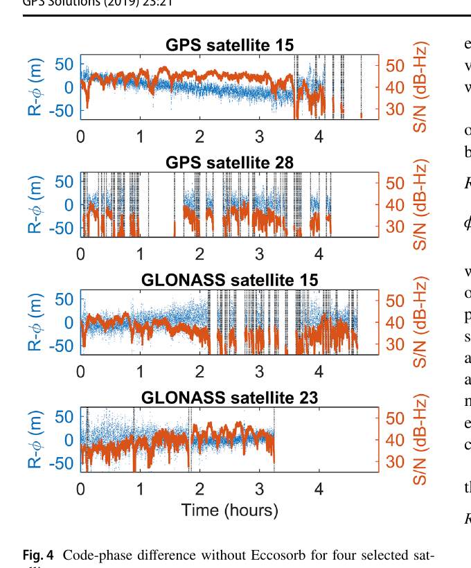
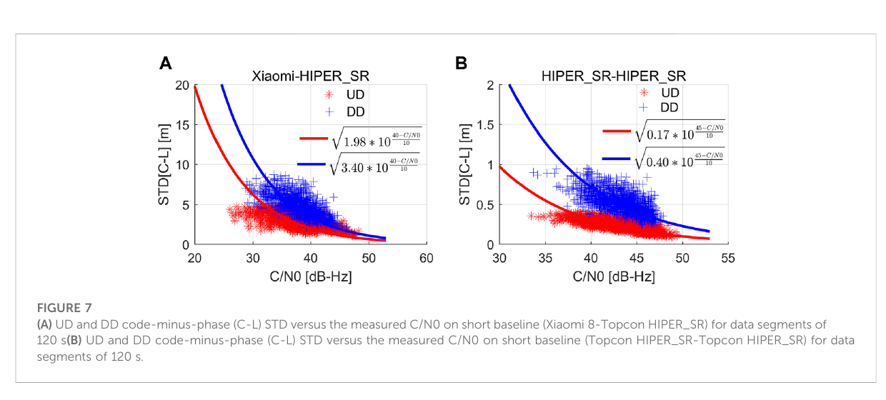
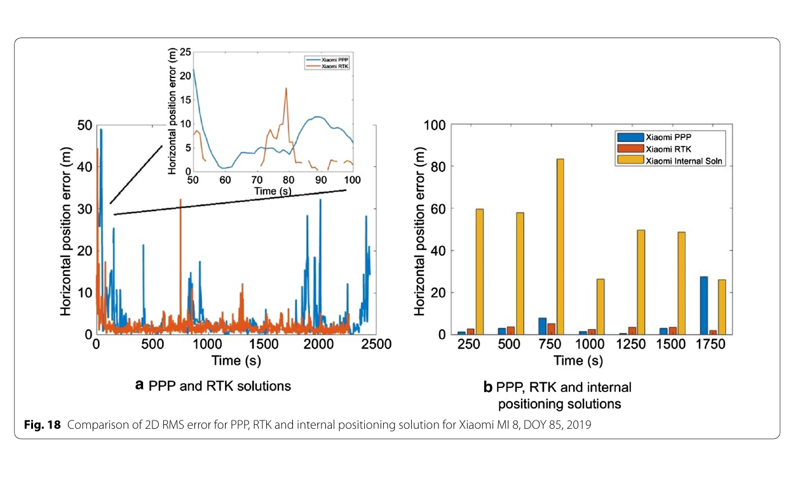

# 2026-07-31 GNSS 每日研究简报

## 今日快报

### 快报 1：MHM 加入格网内空间协方差后，遮挡场景提升不能外推到任意站点

- 主题：`mhm-lsc-spatial-covariance-multipath`
- 来源 ID：`doi:10.1016/j.asr.2026.06.096`
- 来源链接：https://doi.org/10.1016/j.asr.2026.06.096
- 发表日期：2026-07-02
- 来源类型：同行评审期刊在线校样
- 获取范围：出版商题录、摘要、要点与方法概述；未取得全文、格网尺度、训练/测试时段和完整显著性检验表

**内容：** 论文把多路径半球图 MHM 与最小二乘配置结合，在每个天空格网内显式利用残差的空间相关性，并比较 Gaussian、Hirvonen 和 Markov 三种协方差函数；后续实验采用双差残差建图。

**结论：** 出版商摘要称三种 MHM-L 在部分遮挡形变监测场景相对传统 MHM 的定位精度提升均超过 30%，Markov 版本最好；开阔屋顶仅小幅改善。由于全文未开放，这里不能核验“精度”的具体分量、统计窗口、训练与测试是否跨日，故只保留作者摘要结论。

**关注理由：** 固定站多路径具有重复天空轨迹，适合地图化；移动手机的姿态和环境快速变化，不能照搬。工程复现必须把建图日与评估日分离，并报告格网分辨率、协方差参数和环境变化后的退化。

### 快报 2：分布式阵列 DPE 用信号域联合似然换几何增益，但三接收机校园结果仍是场景证据

- 主题：`distributed-array-dpe-blockage-multipath`
- 来源 ID：`doi:10.1016/j.ast.2026.113114`
- 来源链接：https://doi.org/10.1016/j.ast.2026.113114
- 发表日期：2026-07-04
- 来源类型：同行评审期刊在线预出版
- 获取范围：出版商摘要与要点；可核验统一接收模型、等效导航域最大似然代价、CRLB、仿真和校园试验概况，未取得全文参数表

**内容：** 方法联合处理空间分离的多天线 GNSS L1 阵列原始信号，推导等效导航域最大似然代价和 Cramér-Rao 下界，以利用阵列内部相关性及接收机之间的几何差异。

**结论：** 出版商摘要报告三套阵列接收机的校园试验中，一套位于高楼严重遮挡处；所提方法的水平 RMSE 相对 GNSS-SDR 和分布式单天线 DPE 分别约降 43% 与 40%。这些是该试验相对基线的作者结果，不等于任意城市峡谷的绝对精度或实时吞吐能力。

**关注理由：** 信号域联合能在单节点失真时借其他节点补信息，但代价是同步、阵列标定、原始采样带宽和集中计算。应额外公开跨接收机时钟误差、通信延迟、基线几何消融及错误相关模型的敏感性。

### 快报 3：TDCP 给滑坡监测提供逐历元先验，也不能在长失锁后恢复绝对坐标

- 主题：`tdcp-prior-landslide-bp-iar`
- 来源 ID：`doi:10.1016/j.measurement.2026.122034`
- 来源链接：https://doi.org/10.1016/j.measurement.2026.122034
- 发表日期：2026-07-14
- 来源类型：同行评审期刊论文
- 获取范围：出版商摘要、要点、方法与实验章节预览；两组真实滑坡数据可确认，但完整结果表未开放

**内容：** 论文将 TDCP 逐历元位移与上一历元固定解相加，构造当前时刻位置先验，再用于 EKF 时间更新和基线预测辅助的整数模糊度解算；参考站短时中断时继续定位，长时中断时转为变形速度监测。

**结论：** 出版商正文预览支持“改善 EKF 状态估计、扩展 bp-IAR 适用范围和增强参考站中断时连续性”，但未在开放范围给出足以独立复算的数值表。TDCP 消除了常量模糊度，却会累积周跳、钟跳与模型误差，因此长期中断只能维持相对变化，不能凭自身重新锚定绝对位置。

**关注理由：** 这是把“可预测的滑坡时间序列先验”替换为“观测驱动的短时位移先验”。告警系统应同时监测周跳、共同卫星数、累计漂移和固定解重新接入时的跳变。

### 快报 4：浪高约束与 GRU-R 改善 USV 断星导航，但提升百分比依赖两组海况与比较对象

- 主题：`usv-wave-height-grur-gnss-ins-outage`
- 来源 ID：`doi:10.1016/j.oceaneng.2026.126530`
- 来源链接：https://doi.org/10.1016/j.oceaneng.2026.126530
- 发表日期：2026-07-30
- 来源类型：同行评审期刊论文
- 获取范围：出版商摘要、要点、实验章节预览；无开放全文，海况参数、断星长度与全部基线配置不可完整核验

**内容：** 论文先分析海面浪高与无人艇垂向运动/导航误差的耦合，把实时估计浪高作为垂向先验，再用带残差函数的 GRU-R 在 GNSS 中断期间预测并调节测量协方差。

**结论：** 摘要称近岸两项水平精度改善为 36.6% 和 23.2%，离岸为 37.3% 和 63.2%，相对普通 GRU 的垂向改善为 33.3% 和 59.1%。由于摘要没有在同一句中完整标明每个水平百分比的基线，这里不替作者补写比较对象，也不把两组数据外推为通用海况性能。

**关注理由：** 环境量进入滤波器应通过可解释约束或协方差，而非只当神经网络特征。落地前需验证浪高估计偏差、浪向变化、训练海况外推、长时间断星和模型失配时是否触发保守降级。

### 快报 5：Galileo EWSS 测试占用 OSNMA 的保留 ADKD，现有接收机应按 ICD 丢弃而非误解析

- 主题：`galileo-ewss-osnma-adkd2-test`
- 来源 ID：`gsc:sngu-2026006`
- 来源链接：https://www.gsc-europa.eu/sites/default/files/sites/all/files/Galileo-service-notice-28-v1.0.pdf
- 发表日期：2026-07-15
- 来源类型：欧盟委员会 Galileo 官方服务通知
- 获取范围：两页原始通知全文

**内容：** 2026-07-23 至 2026-11-30，Galileo 将零星播发紧急警告消息 EWM，并以新的 OSNMA `ADKD=2` 认证；通知发布时该值在 OSNMA SIS ICD 中仍定义为 Reserved。认证标签每子帧最多占 MACLT ID 34 的一个 FLX 槽。

**结论：** 现行接收机应照 ICD 完成 MACLT/FLX 检查并丢弃关联到保留 ADKD 的标签。通知明确称测试不影响 Galileo 其他服务，OSNMA 性能维持 SDD 规定；这不是 EWSS 已向公众正式提供服务的声明。

**关注理由：** 协议演进测试最容易暴露“未知字段当错误”或“保留值被私自解释”的兼容性缺陷。接收机应记录未知 ADKD、维持导航认证主流程，并用版本化解析器隔离试验消息。

## 深度研读

### 深读 1｜低成本与手机｜先看清观测：手机码噪声、失锁与硬件偏差怎样进入解算

- 类别：`low-cost-mobile`
- 学习层级：`foundation`
- 选题定位：`基础`
- 来源 ID：`doi:10.1007/s10291-018-0818-7`
- 来源链接：https://doi.org/10.1007/s10291-018-0818-7
- 发表日期：2018-12-28
- 来源类型：同行评审开放期刊论文
- 获取范围：CC BY 4.0 开放全文、两种多路径设置、GPS/GLONASS 原始观测、DGNSS 与 5 min 浮点相位解
- 价值评分：96/100（相关性 20，经典价值 20，证据 19，教学价值 19，工程价值 18）

#### 为什么先学这个

手机定位算法首先受观测本身约束。Android API 给出时间标签、载波相位、Doppler 和信号强度，却不保证天线方向图、连续跟踪、跨系统偏差和测地接收机相同；不先诊断这些量，后面的加权与 PPP 只是在错误模型上调参。

#### 先修知识

需要伪距、载波相位、整周模糊度、码减相组合、C/N0、单/双差和多路径。还要区分精密度与准确度：本研究用已知柱点和约 40 m 参考站基线评估准确度，但 Nexus 9 天线参考点本身仍有不超过设备尺度、约 0.1 m 的不确定性。

#### 一句话逻辑

在相同天空下比较“平板直接放置”与“下方加入微波吸收材料”，用码减相、双差相位和已知真值把多路径、失锁、码噪声及 GPS/GLONASS 硬件偏差逐项显露出来。

#### 研究问题与约束

数据来自 2018 年连续两天、每种设置约 5 h，设备为单频 GPS/GLONASS Nexus 9；最多跟踪 16 星，且优先 GPS。吸波材料是诊断工具，不是手机实际使用条件；单设备、静态屋顶和旧芯片不能代表现代双频手机。

#### 核心方法论

码减相消去几何距离、钟差和对流层，保留两倍电离层、码/相多路径、噪声、硬件偏差与模糊度。对连续段再相对初始历元作差，可消去常量模糊度；短基线双差进一步消去共同误差，用于估计 GPS/GLONASS 接收机间偏差和相位质量。

#### 关键公式逐步推导

以长度表示码与相位：

```math
R_r^s=\rho_r^s+c(\delta_r-\delta^s+B_r-B^s)+T_r^s+I_r^s+M_r^s+\varepsilon_R
```

```math
\phi_r^s=\rho_r^s+c(\delta_r-\delta^s+b_r-b^s)+T_r^s-I_r^s+m_r^s+\lambda N_r^s+\varepsilon_\phi
```

两式相减：

```math
R_r^s-\phi_r^s=c(B_r-B^s-b_r+b^s)+2I_r^s+M_r^s-m_r^s-\lambda N_r^s+\varepsilon_R-\varepsilon_\phi
```

连续无周跳时对 $`t_0,t`$ 作时间差，$`\lambda N`$ 消失；剩余趋势若远大于独立估计的 $`2I`$，就不能把手机码—相硬件偏差当常量。

#### 经典价值与创新边界

码减相和短基线双差是经典质量诊断。论文贡献是把它们用于 Android 原始观测，并发现 Nexus 9 的码—相漂移及 GPS/GLONASS 相对码偏差；结论是设备相关表征，不是所有 Android 硬件的固定常数。

#### 整体逻辑链

已知柱点布设；同步采集两种多路径设置；检查星数与 C/N0 天空图；形成码减相并识别失锁；以参考站估电离层趋势；检验硬件漂移；估 GPS/GLONASS IFB/ISB；比较 SPP、DGNSS 与 5 min 浮点相位解。

#### 原文图表与结果分析



> 图源：M. Håkansson，《Characterization of GNSS observations from a Nexus 9 Android tablet》，Figure 4，[GPS Solutions 原文](https://doi.org/10.1007/s10291-018-0818-7)，CC BY 4.0。从 PDF 物理第 5 页以 180 dpi 渲染，仅裁取 Figure 4 及图题；未改动曲线、坐标、颜色或数值。

横轴为约 0—4.5 h，蓝点是码减相 $`R-\phi`$（m），橙线是 S/N（dB-Hz）。GPS 28 和 GLONASS 15/23 出现长缺口，多处在信号强度降至约 30 dB-Hz 附近时失锁；码减相可摆动到数十米。图只展示四星且同时混有电离层、码噪声、多路径和硬件漂移，不能把每个摆动都归因于多路径。

#### 原文结果论述

作者在吸波设置中去趋势后估得 GPS 与 GLONASS 码噪声标准差分别为 6.6 m 和 11 m；无吸波设置的码误差可达数十米。5 min 浮点相位解在普通设置下不确定度低于 1 m，吸波后到数分米，但相位模糊度无法固定为整数。

#### 常见误区与适用边界

第一，把 API 可访问等同于测地级质量。第二，用高仰角自动赋高权，却忽略手机近球形、线极化方向图。第三，把丢观测当随机缺失。第四，异构基准站与手机做多系统差分时忽略 IFB/ISB。第五，用短时重复性声称绝对厘米级。第六，把吸波实验效果当可部署方案。

#### 工程实现步骤

1. 保存原始 Android 时标、状态位、C/N0、ADR 状态与各频点观测。
2. 按设备/信号画天空图、码减相和相位连续段。
3. 对每次钟跳、周跳、失锁和重捕获打标签。
4. 用零/短基线估码噪声、相位噪声和跨系统偏差。
5. 将硬件偏差设为设备与信号相关参数，而非常量“经验修正”。
6. 输出观测可用率及拒绝原因，避免只报最终坐标。

#### 复现实验设计

选三款现代双频手机与一套测地接收机，在已知点上以 1 Hz 各采 6 h；手机平放、竖放、手持和车内四种姿态，开阔/墙边各重复两天。比较仰角权、C/N0 权和等权；指标为每信号可用率、码减相 STD、相位连续段长度、IFB/ISB 稳定性和 5 min 浮点解误差。失败用例为重启、开启 duty cycle、遮挡 10 s 和跨型号基准站。

#### 与定位及低成本实现的联系

手机最危险的不是“噪声大”这一单一事实，而是噪声、偏差与缺测随姿态和环境变化。定位器应允许按设备在线重估权与偏差，并在相位不连续时诚实退回码/Doppler 模式。

#### 本节小结

精密手机定位从观测审计开始：码减相揭示码噪声和漂移，双差揭示相位与跨系统偏差，失锁统计决定哪些高级算法真正可用。

### 深读 2｜低成本与手机｜从 C/N0 到方差：给手机观测建立可估计的随机模型

- 类别：`low-cost-mobile`
- 学习层级：`intermediate`
- 选题定位：`基础进阶`
- 来源 ID：`doi:10.3389/feart.2022.1018420`
- 来源链接：https://doi.org/10.3389/feart.2022.1018420
- 发表日期：2022-09-27
- 来源类型：同行评审开放期刊论文
- 获取范围：CC BY 开放全文、8 h GPS L1 超短基线、码减相/双差噪声、SPP 与 RTK 浮点验证
- 价值评分：97/100（相关性 20，经典价值 19，证据 20，教学价值 20，工程价值 18）

#### 为什么先学这个

第一节说明传统“仰角越高越可靠”在手机上可能失效。本节把诊断变成协方差：不直接套测地接收机经验常数，而从手机自己的码减相与双差相位估计 C/N0—方差关系。

#### 先修知识

需要加权最小二乘、观测协方差、码减相、双差、C/N0 的 dB-Hz 表示及 SPP/RTK。权越大等于方差越小；若权模型失真，坐标可能更精密却更偏，并让质量检验过度自信。

#### 一句话逻辑

把 8 h 数据切成 120 s 无周跳片段，对每段计算噪声 STD 与平均 C/N0，再拟合指数方差曲线，分别为码和相位生成手机专属权。

#### 研究问题与约束

实验仅用一台竖直安装的 Xiaomi 8、两台 Topcon HIPER_SR 和 GPS L1；手机虽关闭 duty cycle，稳定 L5 少于 5 星。超短基线削弱共同误差但不能完全消除不同天线的多路径，因此拟合量仍包含场景成分。

#### 核心方法论

码噪声以无差码减相与手机—测地接收机双差码减相估计；相位噪声对无周跳双差段拟合低阶多项式后取残差。以 $`10^{-(C/N0-C/N0_T)/10}`$ 为自变量，用加权最小二乘估计幅度与相位噪声底。

#### 关键公式逐步推导

对第 $`i`$ 个 120 s 片段，令 $`q_i=10^{-(C/N0_i-C/N0_T)/10}`$。码观测可写成：

```math
\sigma_{P,i}^2=a_P q_i
```

相位保留噪声底：

```math
\sigma_{L,i}^2=a_L q_i+b_L
```

拟合后构成对角权阵：

```math
Q_y=\operatorname{diag}(\sigma_1^2,\ldots,\sigma_n^2),\qquad
P=Q_y^{-1}
```

论文为 Xiaomi 8 与 Topcon 分别取 $`C/N0_T=40`$、45 dB-Hz；这两个模板值是本文设定，迁移到新手机时应重新估计。

#### 经典价值与创新边界

经典部分是 C/N0 相关随机模型与 WLS。论文创新在于用手机实测片段分别拟合码/相位参数，并以 SPP、RTK 浮点解验证；它没有证明 C/N0 能解释 NLOS 偏差，也没有解决整数性破坏。

#### 整体逻辑链

关闭 duty cycle；采集超短基线；以 C/N0/仰角检查手机方向图；按 120 s 无周跳段计算码、相 STD；拟合方差曲线；替换权阵；比较仰角权、经验 C/N0 权和优化 C/N0 权的 SPP/RTK 浮点结果。

#### 原文图表与结果分析



> 图源：M. Sui、C. Gong、F. Shen，《An optimized stochastic model for smartphone GNSS positioning》，Figure 7，[Frontiers 原文](https://doi.org/10.3389/feart.2022.1018420)，CC BY。由 PDF 物理第 9 页以 180 dpi 渲染，仅裁取 Figure 7 及图题；未重绘、改字或改变点、曲线与数值。

横轴为 C/N0（dB-Hz），纵轴为 120 s 片段码减相 STD（m）；红色 UD、蓝色 DD。手机—Topcon 面板纵轴到 20 m，Topcon—Topcon 仅到 2 m，不能只按两图视觉斜率比较。40 dB-Hz 处论文表值为手机 UD 1.98 m、DD 3.40 m；测地接收机在 45 dB-Hz 为 0.17 m、0.40 m。曲线描述随机散布，不会自动校正系统性 NLOS 偏差。

#### 原文结果论述

全文报告 Xiaomi 8 码减相残差 STD 2.96 m，Topcon 为 0.20 m；双差码减相分别约 4.88 m 与 0.46 m。双差相位 STD 约 6 mm 与 3 mm。作者的两天 SPP/RTK 浮点试验显示优化模型总体优于两种常规模型，但增益依赖当日观测和浮点处理。

#### 常见误区与适用边界

第一，把 dB-Hz 直接线性映射为方差。第二，同一个参数用于码和相位。第三，包含周跳的片段仍用于拟合。第四，把 DD 方差当单观测方差。第五，用同一天训练和测试却声称泛化。第六，低 C/N0 观测一律删除造成几何骤降。第七，把较小 RMS 当协方差已校准。

#### 工程实现步骤

1. 按设备、星座、频点、码/相分别维护参数。
2. 以滑窗形成无周跳训练片段，并设置最少样本数。
3. 用稳健回归限制异常多路径对方差曲线的污染。
4. 给参数设置上下界和遗忘因子，避免单次环境永久改权。
5. 以标准化残差和覆盖率检查协方差校准。
6. 当几何或样本不足时退回保守先验。
7. 记录模型版本，保证轨迹可复算。

#### 复现实验设计

用三款手机在开阔、树下、玻璃幕墙旁各采 8 h、1 Hz；首日拟合，次日盲测。比较等权、仰角权、固定 C/N0 权、本文拟合和 C/N0+仰角模型；基线为 WLS SPP 与浮点 RTK。指标除 ENU RMS 外，还包括标准化残差方差、95% 区间覆盖率、有效星数和最大连续解空洞。失败用例包括姿态旋转、机型更换和强 NLOS。

#### 与定位及低成本实现的联系

可估计的随机模型让低成本设备输出的协方差更接近真实误差结构，是后续 PPP、RTK 和完整性监测的共同入口。但权只能表达不确定度，不能替代 NLOS 检测或偏差状态。

#### 本节小结

手机权阵不应复制测地经验。以码减相和双差相位从设备自身估计 C/N0—方差曲线，能改善加权，但必须跨日验证和单独处理系统偏差。

### 深读 3｜定位｜真实环境手机 PPP：用观测预测换连续性时要付什么代价

- 类别：`positioning`
- 学习层级：`advanced`
- 选题定位：`定位深入`
- 来源 ID：`doi:10.1186/s43020-021-00042-2`
- 来源链接：https://doi.org/10.1186/s43020-021-00042-2
- 发表日期：2021-04-19
- 来源类型：同行评审开放期刊论文
- 获取范围：CC BY 4.0 开放全文、Xiaomi Mi 8 静态/手持/车载数据、定制 York-PPP、RTK 与手机内部解对比
- 价值评分：98/100（相关性 20，经典价值 19，证据 20，教学价值 19，工程价值 20）

#### 为什么先学这个

前两节回答“观测有什么问题”和“怎样给权”。本节进入纯 GNSS 定位：在郊区车载真实环境中，手机相位频繁缺测，PPP 要同时决定如何加权和是否短时预测缺失观测，才能在精度与连续性之间取舍。

#### 先修知识

需要非组合 PPP 的卫星轨钟、码/相位、接收钟、对流层、斜电离层和浮点模糊度状态，理解收敛、RMS、STD 与可用率不同。还要知道预测出的载波不是新信息，只是动态连续性假设。

#### 一句话逻辑

按 C/N0 给手机观测赋权，对短缺口用前两历元线性外推，再让 PPP 联合估计坐标与误差状态；以 RTK 和手机内部解检查连续性收益是否伴随误差放大。

#### 研究问题与约束

数据来自 Xiaomi Mi 8 与 SwiftNav Piksi，含静态、手持、车内仪表台、停车场、郊区和树林；车内手机与车顶参考天线相位中心不重合。算法是后处理，预测只针对短缺口；部分结论以单条路线和特定 DOY 为基础，不能代表实时城市级服务。

#### 核心方法论

York-PPP 使用 GPS/Galileo L1/L5 码相观测、精密轨钟、10° 高度角和 20 dB-Hz C/N0 截止。先用 C/N0 函数设置码/相标准差，再对缺测历元以两点线性外推；预测误差进入权，而不是把预测量当真实同精度观测。

#### 关键公式逐步推导

论文采用的 C/N0 标准差模型为：

```math
\sigma=a+b\,10^{-\frac12(C/N0)/10}
```

其中码观测的 $`a`$ 取伪距多路径 RMS，$`b`$ 与码片长度相关；相位按波长并加入预测误差限制。两点线性外推：

```math
m=\frac{Y_{k-1}-Y_{k-2}}{X_{k-1}-X_{k-2}},\qquad
\hat Y_k=Y_{k-1}+m(X_k-X_{k-1})
```

进入 PPP 时仍应区分实测与预测方差：

```math
\sigma_{\text{pred}}^2=\sigma_{\text{meas}}^2+\sigma_{\text{model}}^2(\Delta t)
```

最后一式是按论文“预测误差补偿”作出的工程表达，不是原文逐字公式；其目的在于防止缺口越长权仍不变。

#### 经典价值与创新边界

PPP 状态模型与 C/N0 加权是经典方法；论文的工程价值在于面向真实手机缺测定制预测并比较多种解。两点外推不是通用运动模型，也不能修复周跳后的模糊度；100% 可用率不代表每历元可靠。

#### 整体逻辑链

按状态位筛观测；建立精密产品 PPP；用 C/N0 权代替仰角权；识别短缺口；两点预测并膨胀方差；持续浮点解；与 Piksi RTK、手机内部解对齐；分别报告静态收敛、动态 RMS、STD 与可用率。

#### 原文图表与结果分析



> 图源：G. Shinghal、S. Bisnath，《Conditioning and PPP processing of smartphone GNSS measurements in realistic environments》，Figure 18，[Satellite Navigation 原文](https://doi.org/10.1186/s43020-021-00042-2)，CC BY 4.0。从 PDF 物理第 16 页以 180 dpi 渲染，仅裁取 Figure 18 及图题；未重绘、平滑或改变坐标、曲线、柱与数值。

左图横轴约 0—2500 s、纵轴水平误差 0—50 m；PPP 与 RTK 多数在数米内，但均有尖峰。右图在若干时刻比较 PPP、RTK 和内部解，内部解多次约 25—85 m，PPP 在约 1750 s 也接近 28 m。图直接说明“持续有解”仍可能很差；柱是抽样时刻，不是全程分布。

#### 原文结果论述

DOY 85 全段表值：PPP 水平 RMS 6.84 m、可用率 2443/2443；RTK 为 4.55 m、2253/2443（92%）；内部解 42.33 m、100%。静态开阔数据中 PPP 水平/三维 RMS 约 0.2/0.3 m，SPP 为 2.0/3.0 m。作者所称动态 RMS 降 64% 是同一处理链加权与预测前后的相对结果，不是相对 RTK。

#### 常见误区与适用边界

第一，只报可用率，不报错误尾部。第二，将预测观测按实测同权。第三，跨周跳外推载波。第四，用车顶 RTK 天线真值却忽略与车内手机杆臂。第五，把后处理称实时。第六，用开阔静态分米结果宣传动态城市性能。第七，因 PPP 某段优于 RTK 就断言 PPP 普遍更准。

#### 工程实现步骤

1. 将缺测、周跳和低 C/N0 分为不同状态，不统一“补点”。
2. 仅对短、无周跳缺口预测，并随 $`\Delta t`$ 膨胀方差。
3. 预测值不参与重新初始化整数或重置模糊度。
4. 同时运行无预测影子解，监控创新和坐标分歧。
5. 设置最大预测长度、最大协方差和不可用门限。
6. 输出实测/预测观测比例、解龄与尾部误差指标。
7. 实时实现需额外核算轨钟延迟、CPU 和内存。

#### 复现实验设计

使用 Mi 8 同类双频手机在仪表台采 1 Hz GPS/Galileo 60 min，车顶独立 RTK/INS 给真值并标定杆臂。比较手机内部解、WLS SPP、无预测 PPP、两点预测 PPP 和常速度状态预测 PPP；最大缺口设 1/2/5/10 s。指标为水平/垂直 RMS、95/99.9% 分位、可用率、错误超过 10 m 的持续时间、收敛时间和实时因子。失败用例为 15 s 遮挡、周跳、急转弯和停车场出入口。

#### 与定位及低成本实现的联系

手机 PPP 的关键瓶颈从“有没有双频”转为“观测是否连续、权是否可信、预测是否保守”。低成本实现可以用短时预测换可用率，但必须显式输出解龄和预测占比，让上层应用知道何时只是惯性式延续而非新 GNSS 证据。

#### 本节小结

真实环境手机 PPP 能显著优于内部单点解，却未稳定胜过 RTK。C/N0 加权与短缺口预测提高连续性；尾部误差、杆臂和预测方差决定这种连续性是否可信。
