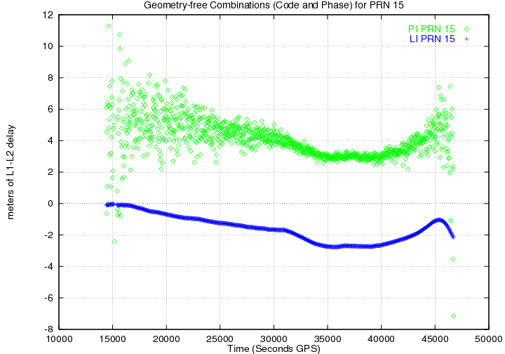
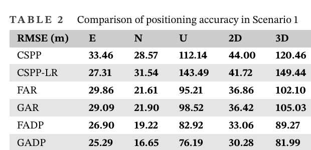
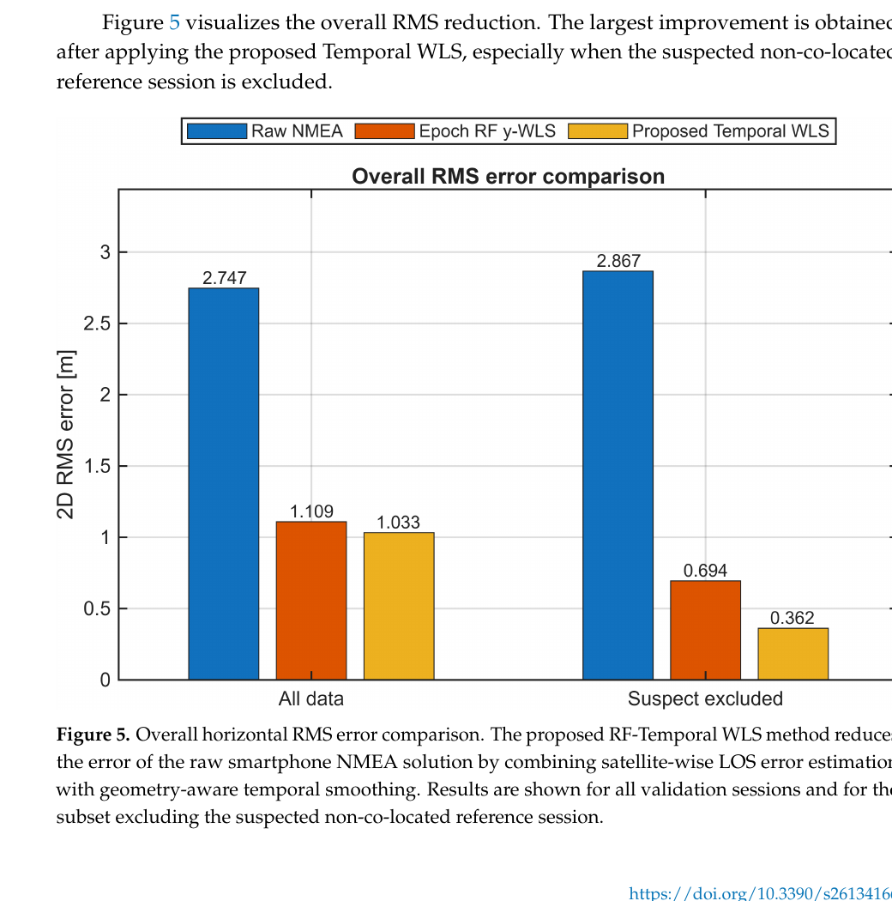

# 2026-08-01 GNSS 每日研究简报

## 今日快报

### 快报 1：19 年两期 GNSS 看见采空区持续沉降，但年均速率不是连续运动过程

- 主题：`long-term-post-mining-gnss-subsidence`
- 来源 ID：`doi:10.3390/mining6030057`
- 来源链接：https://doi.org/10.3390/mining6030057
- 发表日期：2026-07-30
- 来源类型：同行评审开放期刊论文
- 获取范围：CC BY 4.0 全文、2007/2026 两期测量、17 个复测点、方法与局限性

**内容：** 研究在罗马尼亚 Jiu Valley 的 Maleia 采煤区重占 2007 年控制点，以静态差分 GNSS 比较 2026 年高程；17 个仍可识别点每点观测约 20—30 min，再用 IDW 只做空间可视化。

**结论：** 两期差值在全部 17 点均为负，累计垂向变化为 −0.082 至 −3.853 m，均值 −1.919 m。作者把最大 −0.203 m/year 明确限定为 19 年累计量除以时长的归一化指标；只有两个时刻，不能恢复期间的加速、停滞或突变，而且 2007 年完整协方差已不可得，外围控制点的长期稳定性也是网络设计假设。

**关注理由：** 长时段 GNSS 差分能回答“最终移动了多少”，不能自动回答“何时移动”。工程监测若要告警，应增加连续站或更密复测，并用独立稳定基准、InSAR 与地质模型验证趋势。

### 快报 2：随机森林能给单频 Doppler 周跳判据做可靠性门控，但摘要结果仍不是修复能力

- 主题：`single-frequency-doppler-cycle-slip-reliability-rf`
- 来源 ID：`doi:10.1016/j.geomat.2026.100100`
- 来源链接：https://doi.org/10.1016/j.geomat.2026.100100
- 发表日期：2026-07
- 来源类型：同行评审开放期刊论文
- 获取范围：出版商题录、开放摘要、设备与特征说明；本次未取得可逐节核验的全文参数表

**内容：** 论文面向低采样率单频设备，以跨两历元的 Doppler 相位变化、C/N0 和高度角等特征训练随机森林，判断传统 Doppler 周跳检测结果所在历元是否“不可靠”；数据涉及 u-blox ZED-F9P 与 Pixel 4、7 Pro、8a。

**结论：** 出版商摘要称模型在挑战数据上能跨设备识别不可靠历元，并强调压低漏掉坏历元的风险。这里不复述摘要中的召回率为通用指标：全文的类别比例、周跳注入/真值、阈值和独立测试划分未能完整核验；而“判为不可靠”也不同于确定周跳整数大小并修复载波。

**关注理由：** 适合把机器学习放在经典检测器外层做质量门，而不是替换观测方程。部署时应分别报告漏检、误杀、定位中断率及修复后的闭合残差，并在钟跳、电离层快速变化和设备重启下盲测。

### 快报 3：带标签调权的聚类集成改善 LOS/NLOS 分类，但不是真正无监督也未直接验证定位收益

- 主题：`adaptive-weighted-clustering-gnss-los-nlos`
- 来源 ID：`doi:10.3390/a19070554`
- 来源链接：https://doi.org/10.3390/a19070554
- 发表日期：2026-07-07
- 来源类型：同行评审开放期刊论文
- 获取范围：CC BY 4.0 全文、公开数据、8 种聚类器、6 种元启发式调权与计算时间

**内容：** 方法先组合 GMM、K-means、DBSCAN 等聚类器，再用一小段有 LOS/NLOS 标签的数据优化各聚类器投票权；权值确定后才在未标注数据上工作。论文在含 GPS、GLONASS、Galileo、BDS 共 57 颗卫星的公开集上逐星评估。

**结论：** 表 3 中普通集成的平均分类准确率为 0.6697，DOLGWO 加权集成为 0.7365，约增 6.68 个百分点；各元启发式结果很接近，没有一个对每颗卫星都最好。该“泛化”仍来自同一公开数据集，且优化阶段依赖真值标签；论文没有把分类结果接入 SPP/RTK 后报告位置误差与可用率。

**关注理由：** 城市 GNSS 的分类器应以最终定位代价为目标，而不只追求标签准确率。需要验证错删 LOS 导致几何恶化、保留 NLOS 导致偏差，以及跨城市、天线、频点后的权值漂移。

### 快报 4：eLoran 给卫星不足时的 RAIM 增加冗余，当前证据仍是仿真而非运行保证

- 主题：`gnss-eloran-hybrid-raim-satellite-deficient`
- 来源 ID：`doi:10.3390/s26134295`
- 来源链接：https://doi.org/10.3390/s26134295
- 发表日期：2026-07-06
- 来源类型：同行评审开放期刊论文
- 获取范围：CC BY 4.0 全文、混合观测模型、卡方检验、解分离、故障注入与局限性

**内容：** 论文把 GNSS 伪距和 eLoran 等效距离放入协方差加权最小二乘，以全局卡方统计量报警，再用解分离识别并剔除单个故障观测；水平保护级由估计协方差构造。仿真覆盖卫星不足、GNSS/eLoran 单观测阶跃或斜坡故障，以及系统间钟偏。

**结论：** 所测场景中水平位置误差均被保护级包住；单观测故障可隔离，公共钟偏破坏单故障假设时则扩大保护级并报警，而不是强行归因。作者明确说明原始 eLoran 观测尚未用于验证，传播附加二次因子、空间相关误差与多故障也需扩展，因此不能把仿真包络当运营完整性声明。

**关注理由：** 异构冗余的价值不只在“多一条测距”，还在几何和故障模式不同。真正部署要校准两系统时标、eLoran ASF 相关性与站级共同故障，并用预先分配的完整性风险检验保护级覆盖率。

### 快报 5：短时断星学习补偿降低部分尾部漂移，但 30 m 级跨域误差仍只能算近似轨迹

- 主题：`imu-sequence-short-gnss-outage-delayed-switch`
- 来源 ID：`doi:10.3390/math14132423`
- 来源链接：https://doi.org/10.3390/math14132423
- 发表日期：2026-07-06
- 来源类型：同行评审开放期刊论文
- 获取范围：CC BY 4.0 全文、两套真实车载数据、跨域分段评估、消融、显著性与长断星外推

**内容：** 论文在 Transformer 基线之上设计运动门控/尾段读出 MGTR 与多尺度时间注意 TAMS，并让 Delayed-Switch 在断星前 6 s 保持基线，此后用经目标域一次标定的 Lasso 在两模型间选择。

**结论：** 24 个跨域断星段中，纯惯导平均二维 RMSE 为 40.02 m，Delayed-Switch 为 30.32 m；但只对 AT-LSTM 的优势在多重比较校正后显著，其他强基线的秩检验未显著。数据仅来自同一城市、同一传感器、两天；10—38 s 之外的冻结模型试验仍随断星时长快速漂移，方法缓解而不恢复 GNSS 精度。

**关注理由：** “相对改进 24.2%”不能掩盖绝对误差仍为数十米。产品应把预测龄、目标域标定状态和尾部误差暴露给上层，并在车轮速、转角或地图约束可用时做保守融合。

## 深度研读

### 深读 1｜接收机工程｜从直达与反射叠加开始：多路径怎样污染码和载波

- 类别：`receiver-engineering`
- 学习层级：`foundation`
- 选题定位：`基础`
- 来源 ID：`navipedia:multipath`
- 来源链接：https://gssc.esa.int/navipedia/index.php?title=Multipath
- 发表日期：2011
- 来源类型：ESA GNSS Science Support Centre 技术条目
- 获取范围：公开全文、路径差示意、GPS 码/相组合实测图与三日重复性说明
- 价值评分：96/100（相关性 20，经典价值 20，证据 18，教学价值 20，工程价值 18）

#### 为什么先学这个

城市 SPP 的学习模型最终仍在处理传播误差。先理解一条反射路径如何改变相关峰、码延迟和载波相位，才能判断 C/N0、极化差、残差与机器学习输出究竟是物理证据、代理特征，还是场景偶然相关。

#### 先修知识

需要 PRN 码相关、码片宽度、载波波长、Early/Prompt/Late 相关器、伪距与载波相位。还要区分 multipath 与 NLOS：前者通常是直达和反射同时到达，后者可能只有间接路径；两者都能引入正偏差，但接收机内部表现不完全相同。

#### 一句话逻辑

反射分量以额外时延、衰减和相位差叠加到直达分量，使相关函数不再对称，DLL 锁到偏移位置；同一叠加也会转动载波合成相位。

#### 研究问题与约束

Navipedia 给出单频 GPS 实测和理论量级：码多路径理论上可到 1.5 chip，GPS C1 对应约 450 m，但通常小于 2—3 m；载波相位理论上不超过四分之一波长，GPS L1/L2 约 5 cm，通常小于 1 cm。前者的巨大理论上限不是日常误差分布，后者也不等于载波定位天然免疫，因为毫米级目标会放大厘米偏差。

#### 核心方法论

把接收信号写成直达项和一个反射项。反射路径相对时延决定两个相关峰的横向错位，相对幅度与相位决定峰形是被抬高、压低还是拉偏。码跟踪器寻找 Early/Late 平衡点；载波环跟踪复数合成向量的相角，因此同一个反射体可同时产生码偏差与相位偏差。

#### 关键公式逐步推导

简化为单反射、忽略数据比特：

```math
r(t)=A,c(t-\tau)+\alpha A,c(t-\tau-\Delta\tau)e^{j\Delta\phi}+n(t)
```

与本地码相关后：

```math
R(\epsilon)=A R_c(\epsilon)+\alpha A e^{j\Delta\phi}R_c(\epsilon-\Delta\tau)
```

若 DLL 使用间隔为 $`d`$ 的非相干 Early-minus-Late 鉴别器：

```math
D(\epsilon)=|R(\epsilon-d/2)|^2-|R(\epsilon+d/2)|^2
```

无反射时 $`D(0)=0`$；有反射时零点移动到 $`\hat\epsilon\neq0`$，伪距偏差近似 $`c\hat\epsilon`$。载波相位偏差则来自合成向量：

```math
\delta\phi=\arg\!\left(1+\alpha e^{j\Delta\phi}\right),\qquad
\delta L=\frac{\lambda}{2\pi}\delta\phi
```

这些式子是按条目所述物理关系作的单反射教学模型，不是原页逐字公式；多反射、带宽和相关器结构会改变实际包络。

#### 经典价值与创新边界

多路径叠加和相关峰畸变是接收机设计的经典基础。Navipedia 的价值在于把理论量级、观测组合和恒星日重复性连在一起；它没有给出手机、现代多频信号或复杂城市移动场景的统一统计模型。

#### 整体逻辑链

识别反射几何；写出直达/反射叠加；形成相关函数；观察 DLL 零点和合成载波相位变化；以码—相组合隔离主要码噪声；检查高度角和恒星日重复性；再决定天线抑制、相关器改进、地图建模或观测降权。

#### 原文图表与结果分析



> 图源：J. Sanz Subirana、J. M. Juan Zornoza、M. Hernández-Pajares，《Multipath》，Figure 2 左图，[ESA Navipedia 原页](https://gssc.esa.int/navipedia/index.php?title=Multipath)。保存原页提供的 720×504 PNG，未裁切、重绘或改动曲线、坐标和图例；页面未标出独立开放许可，按研究评论引用，权利归原来源。

横轴为 GPS 秒约 10,000—50,000 s，纵轴为无几何 L1/L2 组合延迟（m）。绿色码组合在卫星升起和落下的两端散布可超过数米，中段收窄；蓝色相位组合平滑得多，图的 2 m 刻度下看不见厘米级相位多路径。它说明低高度角附近码噪声/多路径更强，但不能把绿色每个点都归因于单一反射，也不能由一颗 PRN 推出任意天线的误差分布。

#### 原文结果论述

条目还用三连续恒星日的码减相序列展示几何重复：把后两天分别平移 236 s 和 472 s 后，多路径特征重叠；整体漂移主要来自电离层项。这支持固定站按恒星日建图，但移动终端的姿态、位置和反射体都在变，重复性会迅速减弱。

#### 常见误区与适用边界

第一，把低 C/N0 等同于多路径；强镜面反射也可能有高 C/N0。第二，把 NLOS 与 multipath 混成同一标签。第三，因载波偏差小就忽略其对整数固定的影响。第四，把固定站恒星日重复性外推到车载/手持。第五，只提高高度角截止而不检查卫星几何。第六，把理论最大值当经验常态。

#### 工程实现步骤

1. 保存相关器形状、C/N0、锁定状态、码/相组合与天线姿态。
2. 按卫星、频点、高度角和方位角分层统计码减相残差。
3. 对固定站做恒星日对齐，验证特征是否跨日重复。
4. 比较窄相关器、天线地板、极化和观测降权的独立贡献。
5. 同时监控几何条件数，避免删星后解发散。
6. 让定位器输出被拒原因和剩余多路径风险，而非只输出坐标。

#### 复现实验设计

在开阔地、单墙边和街谷布设一套可输出多相关器的双频 SDR 与测地接收机，1 Hz 连续采三恒星日；对同一 PRN 形成码减相、MP1/MP2、相关峰不对称度和相位双差。比较等权、10°/20°/30° 截止、C/N0 权和峰形权；指标为码/相残差 RMS、95/99.9% 分位、SPP 误差、可用星数与跨日相关系数。失败用例为天线旋转、移动反射板和仅 NLOS 无直达。

#### 与定位及低成本实现的联系

低成本设备通常不给完整相关器，只给 C/N0、AGC、残差和状态位，因此后续算法只能用代理变量估计传播误差。理解代理量与真实相关峰之间的缺口，是避免机器学习把场景记忆误当物理规律的前提。

#### 本节小结

多路径是波形叠加问题：额外时延、幅度和相位共同扭曲码相关与载波相角。码误差通常更大，载波误差虽小却会威胁厘米级和整数固定；固定几何的重复性不能直接迁移到移动手机。

### 深读 2｜接收机工程｜从极化差到伪距改正：把反射特征接回观测方程

- 类别：`receiver-engineering`
- 学习层级：`intermediate`
- 选题定位：`基础进阶`
- 来源 ID：`doi:10.1002/navi.408`
- 来源链接：https://doi.org/10.1002/navi.408
- 发表日期：2021-01-12
- 来源类型：同行评审开放期刊论文
- 获取范围：CC BY 全文、24 h 香港静态城市数据、双极化天线、GA/FA-ANFIS、跨地点测试和计算时间
- 价值评分：97/100（相关性 20，经典价值 19，证据 20，教学价值 19，工程价值 19）

#### 为什么先学这个

第一节解释反射怎样产生误差。本节把可观测特征变成逐星伪距改正：右旋信号强度、左右旋强度差、高度角和解后残差共同输入回归器，输出仍回到物理观测量，而不是直接生成一个不透明坐标。

#### 先修知识

需要 RHCP/LHCP、镜面反射可能改变极化、非线性最小二乘、伪距残差、ANFIS 和训练/测试分离。残差受所有卫星和几何共同影响，并不等于该星的真实误差；真值标签也会含轨钟、大气和基准误差的残余。

#### 一句话逻辑

在已知点用原始伪距减几何距离构造误差标签，以四个互补特征训练 GA/FA 优化的 ANFIS，再从新伪距扣除预测误差后重新做 SPP。

#### 研究问题与约束

数据由两台 NovAtel OEM6 和 ZYACF-L004 双极化天线在香港静态街谷采 24 h，共 388,022 个样本；同地点测试集来自同一 24 h 内的 3 h，训练集也来自剩余数据。另有两个不同地点测试，但仍在同一城市与天线体系。论文用经验 5 m 把小/大误差分开采样，不是普适 LOS/NLOS 真值门限。

#### 核心方法论

四个输入为 RHCP C/N0、RHCP−LHCP C/N0、高度角和伪距残差。单变量与误差的 Spearman 相关绝对值均不高，因此使用 Sugeno 型 ANFIS 表达非线性组合，并以遗传算法或萤火虫算法优化隶属函数参数；预测出的逐星误差直接作为码改正。

#### 关键公式逐步推导

线性化 SPP：

```math
\mathbf G\,\Delta\mathbf x=\mathbf b+\boldsymbol\delta,qquad
\Delta\hat{\mathbf x}=(\mathbf G^T\mathbf G)^{-1}\mathbf G^T\mathbf b
```

解后残差为：

```math
\boldsymbol\delta=\mathbf G\Delta\hat{\mathbf x}-\mathbf b
```

已知站坐标时，论文用改正后伪距与几何距离之差标注第 $`i`$ 星误差：

```math
\Delta\rho_i=\rho_i^{c}-r_i
```

它仍含残余钟差、轨道、大气、NLOS/多路径和噪声。对第 $`j`$ 条 Sugeno 规则，写成教学形式：

```math
w_j=\prod_k\mu_{jk}(x_k),\qquad
\hat{\Delta\rho}=\sum_j\frac{w_j}{\sum_\ell w_\ell}(\mathbf a_j^T\mathbf x+c_j)
```

在线改正：

```math
\rho_i^{\mathrm{corr}}=\rho_i^{\mathrm{raw}}-\hat{\Delta\rho}_i
```

最后重建 $`\mathbf b`$ 并求 SPP。ANFIS 展开式是对论文五层结构的等价教学表达；实际隶属函数参数由 GA/FA 搜索。

#### 经典价值与创新边界

经典部分是“逐星误差改正后再最小二乘”，创新是把双极化信息和解后残差共同用于连续误差回归，而非只做 LOS/NLOS 二分类。边界在于标签需要已知点，静态同城训练易记住建筑几何；垂向还受香港 HK80 与 WGS84/垂直基准差异影响。

#### 整体逻辑链

同步采 RHCP/LHCP；算几何距离与误差标签；形成四特征；分训练/测试；建立 ANFIS；GA/FA 优化；逐星预测误差；改正 RHCP 伪距；运行 SPP；比较同地点与异地点；检查恶化历元和耗时。

#### 原文图表与结果分析



> 图源：R. Sun 等，《Using dual-polarization GPS antenna with optimized adaptive neuro-fuzzy inference system to improve single point positioning accuracy in urban canyons》，Table 2，[作者机构开放全文](https://ira.lib.polyu.edu.hk/bitstream/10397/90837/1/navi.408.pdf)，CC BY。从 PDF 物理第 11 页以 180 dpi 渲染，仅裁取 Table 2；未改字、重排或改变数值。

表列同地点场景的 E/N/U、2D/3D RMSE（m）。传统 CSPP 的 2D RMSE 为 44.00 m，双极化多特征 GA-ANFIS（GADP）为 30.28 m，差 13.72 m、相对降低约 31.2%；但垂向从 112.14 m 到 76.19 m 仍很大。表只对应一个静态街谷和同源时段，不能证明跨城市泛化；也显示简单极化差/高度角加权 CSPP-LR 的 3D 结果反而更差。

#### 原文结果论述

异地点场景中，论文报告二维改善约 13%—20%，低于同地点约 30%；场景 1 逐历元统计还有约 14%—15% 历元在二维上被 GA/FA 多特征方法恶化。GA-ANFIS 单样本测试约 0.018 s、FA-ANFIS 约 0.005 s，均是作者特定 MATLAB/CPU 实现，不能直接等同实时接收机预算。

#### 常见误区与适用边界

第一，把 LHCP 强就直接判 NLOS；材料与入射角会改变极化。第二，把解后残差当独立逐星真误差。第三，同一 24 h 切片就称跨日泛化。第四，只看平均 RMSE，不统计被恶化历元。第五，混用高度基准后解释垂向。第六，把经验 5 m 标签阈值当物理常数。第七，忽略双极化天线尺寸、标定与成本。

#### 工程实现步骤

1. 标定 RHCP/LHCP 两通道增益、时延和天线相位中心。
2. 保存逐星两极化 C/N0、高度角、残差和真值标签来源。
3. 让训练/测试按日期和地点隔离，避免建筑几何泄漏。
4. 预测逐星误差并设置幅值、变化率和几何条件门限。
5. 与不改正影子解并行，预测残差异常时回退。
6. 报告改好/改坏历元比例、尾部误差与执行时间。
7. 单独处理垂直基准和天线杆臂。

#### 复现实验设计

在三类街谷各布设 6 个已知点，两天训练、第三天盲测；双极化天线与普通 RHCP 天线同步 1 Hz 采 8 h。比较 CSPP、C/N0/高度角权、极化阈值、GA-ANFIS、梯度提升与无改正影子解。指标为逐星误差 MAE、E/N/U RMS、95/99.9% 分位、恶化历元比例、有效星数和实时因子。失败用例为玻璃强反射、公交车临时遮挡、天线旋转和跨天线迁移。

#### 与定位及低成本实现的联系

双极化提供接近传播机理的额外观测，能减少只靠 C/N0 猜测的歧义；但它增加射频与天线成本。手机通常没有 LHCP 通道，只能用 AGC、状态位、时间变化等弱代理，这正引出下一节的逐星特征学习与几何重建。

#### 本节小结

把机器学习输出定义为逐星伪距误差，比直接回归坐标更容易接回 GNSS 方程和做质量控制。双极化多特征在同地点明显改善二维 SPP，但跨地点收益下降且存在恶化历元，标签、基准和硬件边界必须显式保留。

### 深读 3｜定位｜手机时序加权 SPP：逐星 LOS 误差能否重建可信坐标改正

- 类别：`positioning`
- 学习层级：`advanced`
- 选题定位：`定位深入`
- 来源 ID：`doi:10.3390/s26134166`
- 来源链接：https://doi.org/10.3390/s26134166
- 发表日期：2026-07-02
- 来源类型：同行评审开放期刊论文
- 获取范围：CC BY 4.0 全文、Galaxy Z Fold5、6 个会话、26 特征、随机森林、逐历元/因果时窗 WLS 与完整局限性
- 价值评分：98/100（相关性 20，经典价值 19，证据 20，教学价值 19，工程价值 20）

#### 为什么先学这个

前两节从传播物理走到逐星改正。本节面对没有双极化、没有可靠载波连续性的手机：把已知水平位置误差投影到每颗卫星 LOS，学习标量目标，再借卫星几何把多个预测量重建为二维改正，并用因果时间窗抑制逐历元抖动。

#### 先修知识

需要局部 ENU、卫星高度/方位角、随机森林、加权最小二乘、遗忘因子和训练泄漏。必须区分“以 RTK 固定解生成监督标签”与“手机算法使用 RTK 改正”；本文只有前者，手机改正阶段不做 PPP、RTK、精密轨钟或载波模糊度固定。

#### 一句话逻辑

将手机 NMEA 相对 F9P 真值的二维误差投影为逐星 LOS 标签，用 26 个手机可见特征预测，再以 C/N0 和指数时间权在几何方程中反求平滑二维误差并从 NMEA 解扣除。

#### 研究问题与约束

设备为单一 Samsung Galaxy Z Fold5，参考为 ZED-F9P RTK 固定解；6 个室外开阔至半开阔会话按每会话前 70% 训练、后 30% 验证。训练与验证共享同一会话的卫星、环境和接收机行为，不是留一会话、跨日、跨地点或跨设备测试；专门的深街谷、森林和恶劣天气试验也没有做。

#### 核心方法论

先将 NMEA 与参考位置差转为东、北误差 $`\mathbf e_k`$，再用每星水平 LOS 单位向量 $`\mathbf u_{k,i}`$ 构造标签 $`y_{k,i}=-\mathbf u_{k,i}^T\mathbf e_k`$。500 棵树的随机森林用几何、C/N0、码域时间变化、时标/伪距率不确定度、AGC、状态位和历元统计共 26 特征预测 $`\hat y`$。逐历元 WLS 先解二维误差；最终时序 WLS 在因果窗中假设水平误差缓慢变化，每历元另设公共偏差。

#### 关键公式逐步推导

水平 LOS：

```math
u_E=\cos El\,\sin Az,\qquad u_N=\cos El\,\cos Az
```

监督标签：

```math
y_{k,i}=-u_{E,k,i}e_{E,k}-u_{N,k,i}e_{N,k}
```

逐历元观测方程与权：

```math
\hat y_{k,i}=-u_{E,k,i}\Delta E_k-u_{N,k,i}\Delta N_k+b_k+\epsilon_{k,i},
\qquad w_{k,i}=10^{(C/N0)_{k,i}/10}
```

```math
\hat{\mathbf z}_k=(H_k^TW_kH_k)^{-1}H_k^TW_k\hat{\mathbf y}_k,
\qquad \mathbf z_k=[\Delta E_k,\Delta N_k,b_k]^T
```

因果窗 $`S_K={K-M+1,\ldots,K}`$ 内增加时间权：

```math
w_{j,i}=10^{(C/N0)_{j,i}/10}\exp\!\left(-\frac{K-j}{\tau}\right)
```

论文最终取 $`M=480`$、$`\tau=720`$ 个历元，并解共同 $`E_0,N_0`$ 与逐历元 $`b_j`$；改正为 $`\mathbf e_K^{corr}=\mathbf e_K^{raw}-[\hat E_0,\hat N_0]^T`$。该平滑假设适合缓变误差，不适合急转、快速环境切换或长时间窗内真实误差突变。

#### 经典价值与创新边界

WLS、C/N0 权和指数遗忘是经典工具；创新是把位置域误差投影成逐星监督目标，再通过 LOS 几何重建，而不是直接让森林输出经纬度。边界很关键：标签来自原始 NMEA 坐标误差，不是独立伪距残差；模型可能学习 NMEA 平滑、会话和参考布设特征。

#### 整体逻辑链

同步手机/F9P；转 EN 误差；解析 GSV 几何；排除无有效 ADR 的载波特征；构造 26 特征；前 70% 训练森林；后 30% 预测逐星 LOS 误差；逐历元 WLS；因果时窗 WLS；从 NMEA 扣改正；逐会话检查异常参考与泛化边界。

#### 原文图表与结果分析



> 图源：K. Jang、K. Seo，《Random-Forest-Based Smartphone GNSS Position Correction Using Satellite-Wise LOS Projection Error Estimation and Exponential Temporal WLS》，Figure 5，[Sensors 原文](https://doi.org/10.3390/s26134166)，CC BY 4.0。从 PDF 物理第 15 页以 180 dpi 渲染，仅裁取 Figure 5、图题及紧邻说明；未改动柱、坐标、图例或数值。

横轴分别为全部 6 会话和排除疑似不共址会话的敏感性子集，纵轴是二维 RMS（m）。全部数据中原始 NMEA、逐历元 RF y-WLS、时间 WLS 分别为 2.747、1.109、1.033 m；时间窗在逐历元模型之上只再降 0.076 m。右侧 0.362 m 是排除一会话后的敏感性结果，不是预先定义的主结果；图不能证明跨会话或跨设备达到分米级。

#### 原文结果论述

随机森林的逐星标签验证 MAE、RMSE 和相关系数分别为 0.445 m、0.689 m、0.694。6 个会话中 5 个经时间 WLS 后优于逐历元 WLS；疑似不共址 S4 从 1.596 m 略恶化到 1.647 m。作者把全部数据 1.033 m 作为主结果，并明确说明 0.362 m 及最佳单会话 0.061 m 不能视为未见场景的厘米级泛化证据。

#### 常见误区与适用边界

第一，把 F9P 真值参与训练误写成手机实时用了 RTK。第二，把位置误差投影叫原始伪距误差。第三，把前 70/后 30 当跨会话验证。第四，排除异常会话后只报更漂亮数字。第五，忽略手机与参考天线杆臂；其 LOS 投影会污染标签。第六，时间窗越长越好；快速变化会被抹平。第七，把 NMEA 改进与原始观测 SPP 改进等同。

#### 工程实现步骤

1. 刚性固定手机与参考天线并测量 ENU 杆臂。
2. 按会话、日期、地点、设备建立不可泄漏的数据划分。
3. 保存 Android 原始量、NMEA/GSV、AGC、状态和参考质量。
4. 对每星构造 LOS 标签，限制缺失值替换并记录版本。
5. 训练模型后冻结；线上只输入手机可见特征。
6. WLS 前检查卫星数、条件数和预测离群；时窗突变时缩短或回退。
7. 并行输出原始 NMEA、逐历元改正和时间改正及其质量标志。

#### 复现实验设计

使用三款手机，在开阔、半开阔、深街谷各采 10 次 30 min、1 Hz 会话；按“留一设备×留一地点×留一天”三重外推。比较原始 NMEA、自建码 SPP、C/N0 WLS、直接坐标 RF、逐星 LOS RF-WLS、时间 WLS 与卡尔曼平滑；扫描 $`M=60/240/480`$、$`\tau=60/240/720`$。指标为二维 RMS、95/99.9% 分位、会话最坏值、恶化率、条件数、延迟和能耗。失败用例为 2 m 杆臂、急转、公交遮挡、5 s 无星及训练外机型。

#### 与定位及低成本实现的联系

方法只需手机已有的码域与质量字段，推理阶段不依赖外部改正，适合低成本 SPP 后处理；代价是训练阶段需要可靠共址真值，且输出仍继承原 NMEA 和训练分布。更可信的产品应把几何条件、会话外推检测和回退策略与坐标一起交付。

#### 本节小结

逐星 LOS 目标把数据驱动误差估计重新嵌入 GNSS 几何，时间 WLS再用短期一致性降抖。全部会话从 2.747 m 降到 1.033 m 是同会话时间验证证据；跨设备、跨地点与异常参考仍是决定能否部署的关键缺口。
