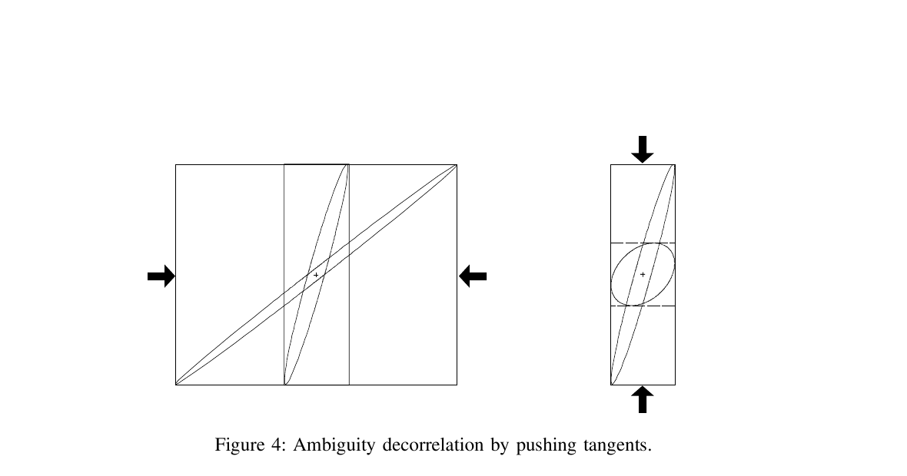
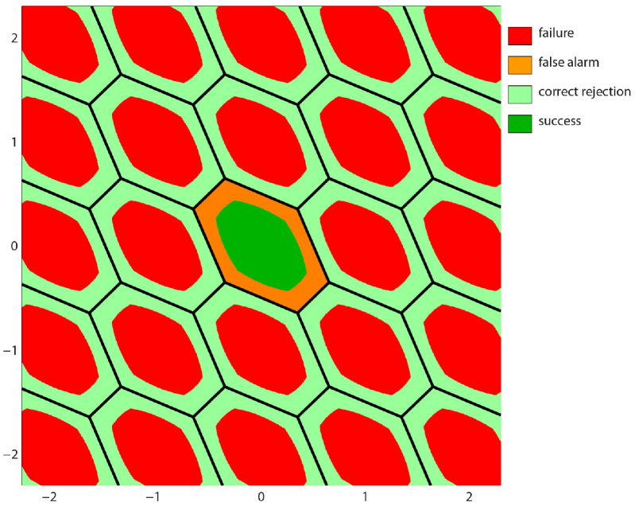
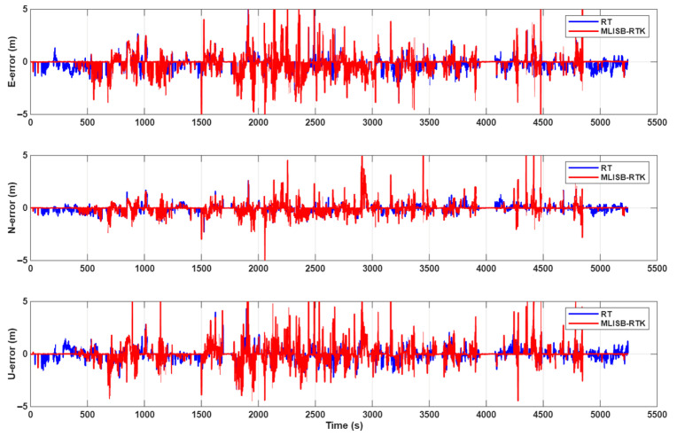

# 2026-08-02 GNSS 每日研究简报

## 今日快报

### 快报 1：重尾分布能让城市 RTK 验收更有韧性，但摘要结果仍不能替代错误固定率

- 主题：`heavy-tail-resilient-ambiguity-resolution-urban-rtk`
- 来源 ID：`doi:10.1016/j.asr.2026.05.021`
- 来源链接：https://doi.org/10.1016/j.asr.2026.05.021
- 发表日期：2026-08-01
- 来源类型：同行评审期刊论文
- 获取范围：出版商题录、摘要、方法概述与摘要结果；未取得全文的分布参数、阈值表和逐数据集错误固定统计

**内容：** 论文把批式韧性模糊度解算从隐含高斯误差扩展到多元 t、Laplace 和 Minmax 等分布，并按分数周偏差与候选数调整验收阈值；问题是城市观测残差具有长尾时，固定的高斯几何会低估异常候选的概率质量。

**结论：** 作者摘要报告多元 t 版本在中等和深度城市数据上优于整数最小二乘，并在多数场景优于传统韧性方案；Minmax 不适合所测数据。由于开放范围没有每种方法的错误固定率、拒绝率和完整阈值，这里不复述坐标改善百分比为通用性能，也不能由较小 RMS 推出更低的危险误固定概率。

**关注理由：** RTK 最危险的是“看似厘米级、实际固定错”。重尾似然值得进入候选排序和验收，但工程比较必须同时报告错误固定、正确拒绝、首次固定时间及最坏位置偏差，而不只报告成功输出后的 RMS。

### 快报 2：物理标签与软权能保住手机解可用性，设备编码占主导却提示域迁移风险

- 主题：`physics-guided-smartphone-multipath-soft-wls`
- 来源 ID：`doi:10.1016/j.rineng.2026.112194`
- 来源链接：https://doi.org/10.1016/j.rineng.2026.112194
- 发表日期：2026-07-25
- 来源类型：同行评审开放期刊在线预出版
- 获取范围：CC 开放题录、摘要、要点、数据与验证设计；本次未取得可逐页核验的全文参数表

**内容：** 研究用 Google Smartphone Decimeter Challenge 多设备原始观测，以几何和 NovAtel SPAN RTK 残差锚点构造不直接依赖信号特征的多路径标签；比较五类分类器、类别不平衡设置、留一设备验证，并把预测概率作为连续权接回 WLS，而非硬删星。

**结论：** 摘要支持“软权比硬排除保留更多可解历元”，也显示设备编码是最重要特征之一。后一点是警告而非胜利：分类器可能学习硬件家族；没有完整看到按路线、城市和时间隔离的表格前，不能把留一设备结果解释为未见环境泛化，也不复述摘要数值为部署保证。

**关注理由：** 物理独立标签和概率权都比用同一 C/N0 同时造标签、做特征更可信。落地时应移除设备 ID 做消融，按设备×地点×日期三重留出，并比较软权、硬删星和保守回退对尾部误差与可用率的共同影响。

### 快报 3：混合 LEO/MEO 只有先管住轨钟误差，增加可见星才可能转化为定位收益

- 主题：`hybrid-leo-meo-pseudorange-error-budget`
- 来源 ID：`doi:10.3390/s26144434`
- 来源链接：https://doi.org/10.3390/s26144434
- 发表日期：2026-07-13
- 来源类型：同行评审开放期刊论文
- 获取范围：CC BY 4.0 全文、1D 车辆仿真、TLE/POD、钟差、大气与多路径误差模型

**内容：** 论文在一维车辆轨迹上分别注入 MEO/LEO 的轨道、钟差、电离层、对流层和多路径误差，用最小二乘比较纯 MEO、纯 LEO 与混合构型；核心不是“LEO 几何一定更好”，而是把低轨快速几何和较弱轨钟产品放进同一误差预算。

**结论：** 全文仿真中，加入一颗以 TLE 和非原子钟建模的 LEO 并未自动改善结果；作者的特定设置要到三颗 LEO 才出现约 35% 的误差下降。该阈值来自一维、零均值随机误差与指定星座，不是“三颗即可”的工程定律，也没有覆盖真实轨钟相关误差、城市遮挡和接收机间偏差。

**关注理由：** 新星座的价值取决于新增观测的信息量减去新增系统误差。设计 LEO-PNT 接收机时，应把 POD 龄期、钟稳定度、系统间偏差与几何增益分别做消融，而不是只以可见星数评估增强效果。

### 快报 4：星载自适应序贯滤波能快速给出 LEO 预报轨道，广播星历受限时边界会显著放大

- 主题：`onboard-ultra-rapid-leo-orbit-gnss-filtering`
- 来源 ID：`doi:10.1016/j.asr.2026.06.114`
- 来源链接：https://doi.org/10.1016/j.asr.2026.06.114
- 发表日期：2026-07-03
- 来源类型：同行评审期刊在线预出版
- 获取范围：出版商摘要、三颗 LEO 的 48 h 星载 GNSS 验证概况与广播星历受限边界；未取得全文状态模型和完整灵敏度表

**内容：** 方法把序贯最小二乘改写成可频繁更新初始历元的自适应序贯滤波，不必持续累积长弧段，目标是在每个定轨弧完成后立即向用户提供短时预报轨道；验证对象为 Sentinel-6、Sentinel-3B 和 Swarm-A 的星载 GNSS 数据。

**结论：** 作者摘要称使用精密 GNSS 产品时，定轨和短时预报与独立精密轨道保持厘米至分米级一致；换成受限广播星历后，边界扩大到分米至米级。由于未取得全文，本条不复述各星数值，也不把“与参考轨道一致”写成地面用户定位精度。

**关注理由：** LEO-PNT 的广播轨道必须把星载计算、产品龄期和用户测距误差串起来。除了轨道 3D RMS，还应报告沿/横/径向误差、OURE、预报时长、滤波重启和广播星历异常时的保守完整性界。

### 快报 5：PPP-AR 垂向位移能追踪年际雪载，但单站沉降不是局地雪深的直接传感器

- 主题：`ppp-ar-vertical-displacement-interannual-snow-loading`
- 来源 ID：`doi:10.1016/j.geog.2026.06.010`
- 来源链接：https://doi.org/10.1016/j.geog.2026.06.010
- 发表日期：2026-07-01
- 来源类型：同行评审开放期刊在线预出版
- 获取范围：CC BY-NC-ND 4.0 摘要、2006—2023 数据范围、PPP-AR 与载荷改正流程；本次未取得全文回归系数和不确定度表

**内容：** 研究处理立山室堂 GEONET 站 2006—2023 日解，以 PPP-AR 得到垂向序列，扣除大气、非雪陆地水储量、非潮汐海洋载荷和长期构造趋势，再与附近年度雪深调查比较，并用约 900 m 外另一 GNSS 站检查区域一致性。

**结论：** 摘要支持“雪更深的年份对应更大下沉，邻站也呈相似季节变化”；它不支持把单站坐标直接换算成天线脚下雪深。残差仍可能含未建模水储量、共同模式误差和年度调查的时空不匹配，因此本条不复述摘要中的厘米幅值为普适转换系数。

**关注理由：** GNSS 观测的是弹性地壳对空间分布载荷的积分响应。把它用于雪量代理时，需要载荷格网、Green 函数、多个站点和独立雪水当量，而不能仅做单站位移—单点雪深回归。

## 深度研读

### 深读 1｜接收机工程｜LAMBDA：为什么不改变整数问题，也能把搜索从细长椭球变得可算

- 类别：`receiver-engineering`
- 学习层级：`foundation`
- 选题定位：`基础`
- 来源 ID：`curtin:teunissen-1995-lambda-method`
- 来源链接：https://gnss.curtin.edu.au/wp-content/uploads/sites/21/2016/04/Teunissen1995LAMBDA.pdf
- 发表日期：1995-09
- 来源类型：国际会议论文、作者研究机构公开全文
- 获取范围：8 页原文、整数最小二乘模型、去相关变换、条件搜索与双频短基线示例
- 价值评分：98/100（相关性 20，经典价值 20，证据 19，教学价值 20，工程价值 19）

#### 为什么先学这个

RTK 的厘米级来自载波整数约束，但“把浮点模糊度逐项四舍五入”只有在协方差近似对角时才成立。LAMBDA 的核心贡献是保持整数格点和目标函数等价，同时把高度相关、细长的搜索几何改写得更接近球形，让后续候选枚举真正可执行。

#### 先修知识

需要线性化最小二乘、协方差、双差载波、整数模糊度和条件估计。还要区分三件事：浮点解是允许模糊度取实数；整数最小二乘给出代价最小的整数候选；验收则决定是否敢使用该候选，后者留到第二节。

#### 一句话逻辑

用整数、可逆且体积保持的 $`Z`$ 变换把浮点模糊度协方差去相关，在变换后的格点上做条件最小二乘搜索，再映回原模糊度；最优整数不变，搜索盒却大幅收紧。

#### 研究问题与约束

原文以短基线、无多路径、对流层先验已改正且电离层可忽略为教学简化，实参数只有三维基线；作者明确说明理论不依赖这些简化。示例使用 2.2 km 基线、7 颗卫星、双频相位、单差相位先验标准差 3 mm；这些条件用于展示算法几何，不是现代城市 RTK 的性能保证。

#### 核心方法论

先解混合实数—整数模型的浮点最小二乘，得到 $`\hat{\mathbf a},\hat{\mathbf b}`$ 及协方差；然后最小化浮点模糊度到整数格点的 Mahalanobis 距离。LAMBDA 构造整数幺模变换 $`\mathbf Z`$，使 $`\mathbf Q_{\hat z}=\mathbf Z\mathbf Q_{\hat a}\mathbf Z^T`$ 的相关性降低，再按顺序条件方差逐层限定候选。

#### 关键公式逐步推导

线性混合模型写成：

```math
\mathbf y=\mathbf A\mathbf a+\mathbf B\mathbf b+\mathbf e,
\qquad \mathbf a\in\mathbb Z^m,\;\mathbf b\in\mathbb R^3
```

消去实参数后，整数步是：

```math
\check{\mathbf a}
=\arg\min_{\mathbf a\in\mathbb Z^m}
(\hat{\mathbf a}-\mathbf a)^T
\mathbf Q_{\hat a}^{-1}
(\hat{\mathbf a}-\mathbf a)
```

取整数幺模 $`\mathbf Z`$，令：

```math
\mathbf z=\mathbf Z\mathbf a,\qquad
\hat{\mathbf z}=\mathbf Z\hat{\mathbf a},\qquad
\mathbf Q_{\hat z}=\mathbf Z\mathbf Q_{\hat a}\mathbf Z^T
```

因 $`|\det\mathbf Z|=1`$ 且 $`\mathbf Z^{-1}`$ 仍为整数矩阵，整数格点一一对应，并有：

```math
(\hat{\mathbf a}-\mathbf a)^T\mathbf Q_{\hat a}^{-1}(\hat{\mathbf a}-\mathbf a)
=(\hat{\mathbf z}-\mathbf z)^T\mathbf Q_{\hat z}^{-1}(\hat{\mathbf z}-\mathbf z)
```

固定后实参数更新为：

```math
\check{\mathbf b}=\hat{\mathbf b}
-\mathbf Q_{\hat b\hat a}\mathbf Q_{\hat a}^{-1}
(\hat{\mathbf a}-\check{\mathbf a})
```

所以去相关只是更换整数坐标系，不是近似掉原目标函数。

#### 经典价值与创新边界

经典价值在于把 GNSS 模糊度固定明确为整数最小二乘，并把格基约化与条件搜索组合为通用流程。边界是 LAMBDA 解决“怎样高效找到最小代价整数”，不回答候选在偏差、NLOS 或错误随机模型下是否可信；候选最快也可能最快地固定错。

#### 整体逻辑链

形成双差观测；解浮点基线与模糊度；检查协方差；构造整数幺模变换；降低相关；按条件方差枚举候选；映回原整数；更新基线；最后另做独立验收和残差质量控制。

#### 原文图表与结果分析



> 图源：P. J. G. Teunissen、P. J. de Jonge、C. C. J. M. Tiberius，《The LAMBDA-Method for Fast GPS Surveying》，Figure 4，[Curtin GNSS Research Centre 公开 PDF](https://gnss.curtin.edu.au/wp-content/uploads/sites/21/2016/04/Teunissen1995LAMBDA.pdf)。从 PDF 物理第 6 页以 180 dpi 渲染，仅裁取 Figure 4 和原图题；未重绘、改字或改变几何。原文未标出独立开放许可，按最小必要研究评论引用，权利归原作者与来源。

图没有数值坐标或单位：左侧表示先把置信椭圆的竖直切线向内推到仍保持整数变换的位置，右侧再压缩水平切线；椭圆面积保持，而外接矩形缩小，搜索几何更接近圆。它直接说明去相关的几何意图，但不能量化运行时间、成功率或城市偏差下的可靠性；箭头也不是优化迭代的物理位移。

#### 原文结果论述

同一原文的示例显示，短时数据下原始条件标准差谱在第 3/4 个模糊度间有明显断层，去相关后谱被压平并降低；另一个 100 次、每次仅两历元且间隔 5 s 的示例中，浮点基线散布为数米，正确固定后的散布约 1 cm。后一个结果成立于作者的短基线和噪声模型，且以正确整数为前提，不能代表固定错误率。

#### 常见误区与适用边界

第一，把去相关当成删除观测相关性；它变换的是参数格。第二，使用普通 SVD/LDU 后直接取整；它们一般不保持整数性。第三，把最近整数舍入等同 ILS。第四，只输出最佳候选而不保留次优候选及距离。第五，用候选搜索成功代替统计验收。第六，忽略协方差失配会扭曲搜索椭球。

#### 工程实现步骤

1. 以双精度组装浮点法方程并保留 $`\mathbf Q_{\hat a}`$。
2. 对协方差做对称性、正定性和尺度检查。
3. 用整数 Gauss 变换与置换生成 $`\mathbf Z`$，记录可逆性。
4. 在变换域做 Schnorr–Euchner 式枚举，至少保留最佳与次优候选。
5. 映回原模糊度并重算固定坐标、残差和协方差。
6. 将搜索状态与验收状态分离，异常时输出浮点而非强制固定。

#### 复现实验设计

生成 7/12/20 星、单/双/三频的短基线双差模型，设相位噪声 3 mm、码噪声 0.3 m，观测窗取 1/5/30/300 s；分别运行逐项舍入、未去相关 ILS、LAMBDA/MLAMBDA。指标为节点访问数、运行时间、整数成功率、固定基线 RMS 与错误固定位置尾部；失败用例注入 0.05/0.10 m 相位偏差和协方差缩放 0.5/2。基线必须包括穷举可验证的低维真值。

#### 与定位及低成本实现的联系

低成本接收机的多系统多频观测会增加模糊度维数，也使协方差更不均匀；高效格搜索因此更重要。但手机相位间断和城市偏差使统计模型更脆弱，LAMBDA 应被视为候选生成器，而不是“厘米级按钮”。

#### 本节小结

LAMBDA 用保持整数格的一一变换降低模糊度相关性，使等价的整数最小二乘搜索变得高效。它保证搜索目标不变，却不保证模型正确或候选可信；下一节正是给“是否接受”建立可控的拒绝区域。

### 深读 2｜接收机工程｜从候选到可拒绝决定：整数孔径怎样把误固定与不固定分开

- 类别：`receiver-engineering`
- 学习层级：`intermediate`
- 选题定位：`基础进阶`
- 来源 ID：`doi:10.3390/s26072201`
- 来源链接：https://doi.org/10.3390/s26072201
- 发表日期：2026-04-02
- 来源类型：同行评审开放期刊理论论文
- 获取范围：CC BY 4.0 全文、整数孔径理论、Fourier 表示、IAB 成功/失败/未决概率与三维数值例
- 价值评分：98/100（相关性 20，经典价值 20，证据 20，教学价值 20，工程价值 18）

#### 为什么先学这个

第一节只负责找到代价最小的整数。实际 RTK 还需要第三种输出：证据不足时保留浮点，而不是在“最佳整数一定对”和“永远不固定”之间二选一。整数孔径（IA）把接受域缩在每个整数格的 pull-in 区域内，显式产生成功、失败与未决三类事件。

#### 先修知识

需要浮点模糊度分布、整数估计、Voronoi/pull-in 区域、概率积分和 Fourier 级数。必须分清论文中的 failure（接受了错误整数）、false alarm（真值候选区域内却拒绝固定）与 correct rejection（处于错误候选区域且正确拒绝）。

#### 一句话逻辑

给每个整数候选只保留一个可调接受子集 $`\Omega_z`$；浮点解落在其中才固定，否则输出浮点，再利用整数平移周期性把该决策写成 Fourier 级数并分析成功、失败与未决概率。

#### 研究问题与约束

论文是理论贡献，不是现场 RTK 试验。模型假设观测均值为混合整数—实参数，概率表达重点采用正态浮点模糊度；真实 NLOS 偏差、时变协方差和错误动力学不自动满足这些假设。Fourier 表示提供等价分析与混合计算，不意味着信号频谱中出现了新的 GNSS 频率。

#### 核心方法论

先由整数估计器把整个 $`\mathbb R^n`$ 分成格点区域 $`\mathcal P_z`$；IA 再取 $`\Omega_z\subseteq\mathcal P_z`$，且满足 $`\Omega_z=\Omega_0+z`$。接受域缩小会降低错误固定，也会增加未决。因为残差映射对整数平移周期不变，可用由 $`\Omega_0`$ 决定的 Fourier 系数表达所有格点的验收。

#### 关键公式逐步推导

混合模型为：

```math
\mathrm E(\mathbf y)=\mathbf A\mathbf a+\mathbf B\mathbf b,
\qquad \mathbf a\in\mathbb Z^n,\;\mathbf b\in\mathbb R^p
```

定义 IA 权函数 $`\omega_z(\hat{\mathbf a})`$：落入 $`\Omega_z`$ 时为 1，否则为 0；未决时返回浮点：

```math
\check{\mathbf a}
=\sum_{z\in\mathbb Z^n}z\,\omega_z(\hat{\mathbf a})
+\hat{\mathbf a}\left(1-\sum_{z\in\mathbb Z^n}\omega_z(\hat{\mathbf a})\right)
```

若真整数为 $`\mathbf a`$，三类概率可写为：

```math
P_s=\Pr(\hat{\mathbf a}\in\Omega_{\mathbf a}),\qquad
P_f=\sum_{z\ne\mathbf a}\Pr(\hat{\mathbf a}\in\Omega_z),
\qquad P_u=1-P_s-P_f
```

利用 $`\mathbb Z^n`$ 周期性，原文定理给出对称接受域的 Fourier 表示：

```math
\check{\mathbf a}=\hat{\mathbf a}
-\sum_{z\in\mathbb Z^n}\mathbf c(z)
\sin(2\pi z^T\hat{\mathbf a}),
\qquad
\mathbf c(z)=\int_{\Omega_0}\mathbf x\sin(2\pi z^T\mathbf x)\,d\mathbf x
```

接受域的形状进入 $`\mathbf c(z)`$，浮点解只进入相位项；这为高/低精度分量混合使用空间域与频域表示提供基础。

#### 经典价值与创新边界

经典部分是 IA 对“固定或拒绝”风险权衡的统一描述；新意是揭示 IA 残差的整数周期性，给出一般 Fourier 表示，并为整数孔径自举推导空间、频率和混合概率公式。论文没有声称 Fourier 验收已在城市车载数据上优于 FFRT，也没有给可直接复制到所有接收机的唯一阈值。

#### 整体逻辑链

求浮点模糊度；由整数估计器形成 pull-in 格；为每格设计接受子域；设定可容忍失败概率；计算成功/失败/未决；选择空间、频率或混合实现；通过才更新固定坐标；拒绝则保持浮点并继续积累观测。

#### 原文图表与结果分析



> 图源：P. J. G. Teunissen，《Fourier Ambiguity Validation for Carrier-Phase GNSS》，Figure 1，[Sensors/PMC 原文](https://doi.org/10.3390/s26072201)，CC BY 4.0。保存 PMC 提供的 799×636 原始 JPEG；未裁切、重绘或改变颜色、坐标和图例。

横纵轴是二维浮点模糊度坐标，单位为 cycle，范围约 −2.3 至 2.3；黑色六边形是整数估计器的 pull-in 格。中心真格内绿色为正确固定，橙色为误警；其他格中红色为错误固定，浅绿为正确拒绝。图表达区域分类而非概率大小：没有叠加浮点概率密度，所以不能从颜色面积直接读取 $`P_s`$ 或 $`P_f`$，也不能证明任何实测 RTK 改善。

#### 原文结果论述

论文的三维算例令 $`\hat{\mathbf a}=0`$，条件方差对角为 0.01、0.2、10，并取孔径尺度 $`\lambda=0.6`$。为达到约 $`10^{-12}`$ 截断精度，纯空间搜索需要 285 个整数向量；作者用该例说明精度高度异质时，混合空间—频率表达可以把不同维度交给更合适的域。它是计算表示的数值例，不是 285 候选的普适上限。

#### 常见误区与适用边界

第一，把“拒绝固定”记成算法失败；它可能是正确风险控制。第二，用接受区域面积代替概率积分。第三，仍用固定 ratio=3 却声称控制失败率。第四，把 failure 与 false alarm 互换。第五，把正态模型下的理论失败率直接用于长尾城市误差。第六，忽略验收后坐标更新也会传播候选偏差。

#### 工程实现步骤

1. 从 LAMBDA 保留最佳候选、次优候选与浮点协方差。
2. 明确产品允许的错误固定概率与最小可用率。
3. 在仿真中标定 IA/FFRT 阈值，不以经验常数代替风险目标。
4. 实时检查协方差缩放、创新长尾和模型偏差。
5. 通过时才施加整数约束；未决时继续输出带标志浮点解。
6. 分别累计成功、错误固定、误警、正确拒绝与无解历元。

#### 复现实验设计

构造二维和十二维高斯浮点模糊度，相关系数取 0/0.5/0.9，条件标准差跨 0.05—2 cycle；比较最近整数、ILS+固定 ratio、固定失败率 ratio、IAB 及 Fourier/混合 IAB。每组 Monte Carlo 运行至少 $`10^7`$ 次以估低概率尾部；指标为 $`P_s,P_f,P_u`$、CPU 时间和候选数。再加入 0.1—0.5 cycle 固定偏差与 t 分布噪声作为模型失配失败用例。

#### 与定位及低成本实现的联系

低成本接收机常在“偶尔能固定”和“不能信任固定”之间摇摆。IA 的三态输出比强制二态更适合上层融合：车辆控制可在未决时降级使用浮点/惯性，而不是接收一个无风险标志的错误厘米解。

#### 本节小结

整数孔径把候选生成与候选接受分开，通过可调接受域显式权衡错误固定与不固定。Fourier 表示利用整数周期性改善分析和异质精度下的计算，但可靠性仍取决于概率模型；第三节观察如何从 RTK 内部提取额外特征应对复杂环境。

### 深读 3｜定位｜跨系统偏差辅助 RTK：让机器学习检查固定，而不是直接生成坐标

- 类别：`positioning`
- 学习层级：`advanced`
- 选题定位：`定位深入`
- 来源 ID：`doi:10.3390/s26072080`
- 来源链接：https://doi.org/10.3390/s26072080
- 发表日期：2026-03-27
- 来源类型：同行评审开放期刊论文
- 获取范围：CC BY 4.0 全文、GPS/BDS 单频单历元 RTK、23 个 GNSS 特征、24 段 SmartPNT-POS 数据与两种切分实验
- 价值评分：97/100（相关性 20，经典价值 19，证据 20，教学价值 19，工程价值 19）

#### 为什么先学这个

前两节给出最优整数候选和统计接受框架；城市偏差破坏模型时，仅靠候选距离仍可能误判。本节不让随机森林回归坐标，而是利用跨系统双差中保留下来的差分系统间相位偏差（DISPB）、ratio、DOP、残差等 RTK 内部状态，判断候选是否值得固定。

#### 先修知识

需要 GPS/BDS 码相观测、站间单差/星间双差、系统间硬件偏差、LAMBDA、ratio test、随机森林与混淆矩阵。尤其要看清论文命名：其 false detection/false alarm 是把正确固定拒成浮点，可用率受损；miss detection 是让错误固定通过，可靠性受损。

#### 一句话逻辑

用一个跨星座参考星形成系统间双差并显式估 DISPB；正确固定时它应近似稳定，错误整数会把跳变灌入该参数，因此可与 ratio、DOP、C/N0、高度角和残差一起做二分类验收。

#### 研究问题与约束

实验采用 SmartPNT-POS 的 GPS/BDS 单频、单历元 RTK，共筛出 24 段、20,007 历元。第一组把全部历元随机打散后 80/20 切分，存在同一轨迹相邻历元泄漏；第二组只把最困难的 DATA17 留作测试，其余 23 段训练，比随机切分更可信，却不是对全部 24 段逐一留一验证。参考坐标来自商业软件 GNSS/INS 融合，不是独立全站仪真值。

#### 核心方法论

传统同系统双差会消去同系统硬件延迟；跨系统参考星保留差分系统间码偏差 DISCB 与相位偏差 DISPB。论文先用 LAMBDA 直接生成未验收固定候选，再提取卫星数、C/N0 统计、ratio、GDOP/PDOP/HDOP/VDOP、DISPB/DISCB、高度角统计和残差统计共 23 特征，用随机森林输出固定/浮点判定。

#### 关键公式逐步推导

同系统相位双差的教学形式为：

```math
\Delta\nabla\phi
=\Delta\nabla\rho+\lambda\Delta\nabla N+\Delta\nabla\varepsilon
```

跨系统 $`A/B`$ 选一个共同参考后，硬件项不再完全抵消；原文把码和相位硬件差分别并入：

```math
\Delta d_{br,j}^{B}-\Delta d_{br,i}^{A}=b_{\mathrm{DISCB}}
```

```math
(\lambda_j\Delta\Phi_{br,j}-\lambda_i\Delta\Phi_{br,i})
+(\lambda_j\Delta\delta_{br,j}^{B}-\lambda_i\Delta\delta_{br,i}^{A})
=\lambda_j b_{\mathrm{DISPB}}
```

不同频率还带参考单差模糊度项，论文最终提取的量可写成：

```math
\tilde b_{\mathrm{DISPB}}
=b_{\mathrm{DISPB}}
+\Delta\nabla N_{br}^{1^A1^B}
```

若整数候选正确，硬件偏差和常量整数合并后应在连续设备配置下近似稳定；固定错时，错误整数使 $`\tilde b_{\mathrm{DISPB}}`$ 偏离。分类评估为：

```math
R_{md}=\frac{FP}{FP+TN},\qquad
R_{fd}=\frac{FN}{FN+TP},\qquad
R_{acc}=\frac{TP+TN}{TP+TN+FP+FN}
```

符号沿用论文定义；实现时应在接口中写清每个正负类语义，避免把两类风险反报。

#### 经典价值与创新边界

经典部分是系统间双差、LAMBDA、ratio 与残差验收；创新是把 DISPB 当成候选正确性的物理特征，并让 ML 只做验收门。边界是随机森林没有失败概率保证；DISPB 也会受接收机重启、温度、频间偏差和参考星切换影响，稳定性不是自然常数。

#### 整体逻辑链

同步基准站/流动站观测；形成 GPS/BDS 跨系统双差；求浮点解；LAMBDA 生成候选；估 DISPB/DISCB；汇总 23 特征；分类固定可信度；通过则输出固定坐标，否则输出浮点；与独立质量基线比较混淆矩阵和位置误差。

#### 原文图表与结果分析



> 图源：R. Zhang、W. Zhao、X. Shao、M. Li，《MLISB-RTK: Machine Learning Based on Inter-System Biases to Improve the Performance of RTK in Complex Environments》，Figure 8，[Sensors/PMC 原文](https://doi.org/10.3390/s26072080)，CC BY 4.0。保存 PMC 提供的 764×492 原始 JPEG；未裁切、重绘或改变曲线、坐标、图例。

横轴为约 0—5,300 s，纵轴依次为 E/N/U error（m），范围 −5 至 5 m；蓝线是传统 RT，红线是 MLISB-RTK。两法在 700—3,500 s 与约 4,500 s 附近都有明显波动，红线也存在触及图界的尖峰。原文 Table 5 报告 MLISB 的 E/N/U RMS 为 0.88/0.52/0.80 m，RT 为 0.94/0.55/0.86 m；图上红线并不直观地处处更窄，说明不能只凭曲线观感归因，也需核验无解/浮点历元如何计入 RMS。

#### 原文结果论述

随机历元切分中，论文报告 RT 与 MLISB 的漏检率为 5.4%/1.4%、误警率为 25.6%/9.1%、分类准确率为 80.1%/93.0%。更严格的单组留出 DATA17 中，对应为 6.9%/5.6%、46.3%/17.5%、62.2%/85.0%。第二组的误警下降明显大于漏检下降，主要收益是少把正确固定拒掉；它不等于危险误固定已经受控到安全关键水平。

#### 常见误区与适用边界

第一，把 GNSS/INS 参考真值误写成运行时融合。第二，把随机历元切分当跨路线泛化。第三，把特征重要度当因果证明。第四，忽略参考星切换造成 DISPB 跳变。第五，把分类准确率当完整性风险。第六，只报 RMS 不报错误固定最大值。第七，未统一 false/miss 的正负类定义。第八，让模型直接覆盖 IA/FFRT 风险门而无保守回退。

#### 工程实现步骤

1. 固定接收机对、频点与参考星策略，建立 DISPB 正常漂移模型。
2. 同时输出 LAMBDA 两候选距离、协方差、残差与解状态。
3. 按连续任务分组训练/测试，禁止相邻历元跨集合。
4. 对参考星切换、重启和温度变化单独打状态标志。
5. 用概率校准后的 ML 分数辅助 IA/FFRT，不直接取代风险门。
6. 未通过时输出浮点与原因；记录危险漏检、保守误警和无解。
7. 在线监控特征漂移，超出训练域时禁用 ML 门。

#### 复现实验设计

下载 SmartPNT-POS，复现 GPS/BDS 单频单历元 RTK；采用按序列留一的 24 折验证，而不是随机历元切分。比较固定 ratio=3、FFRT、仅传统特征 RF、加入 DISCB、加入 DISPB 和 DISPB+IA 双门。指标为错误固定率、正确固定率、误警率、首次固定时间、ENU RMS/95/99.9% 与最坏误差；失败用例为参考星切换、接收机重启、人工 1 cycle 错误和训练外接收机。参考真值应再用全站仪或独立后处理轨迹交叉验证。

#### 与定位及低成本实现的联系

方法运行时只依赖 GNSS 内部量，仍属于纯 GNSS RTK；GNSS/INS 仅用于数据集参考。对低成本设备，DISPB 提供比设备 ID 更接近观测方程的特征，但不同芯片和固件的硬件偏差可能更不稳定，必须先做零/短基线标定与漂移检测。

#### 本节小结

MLISB-RTK 把机器学习放在固定验收门，而不是坐标生成器：跨系统偏差的稳定性为错误整数提供物理线索。单组留出试验主要减少保守误警，位置 RMS 只小幅改善；要成为可靠产品，还需任务级交叉验证、独立真值和可控失败率的统计门。
