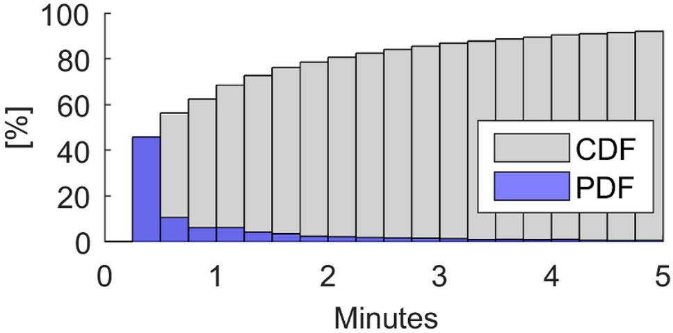
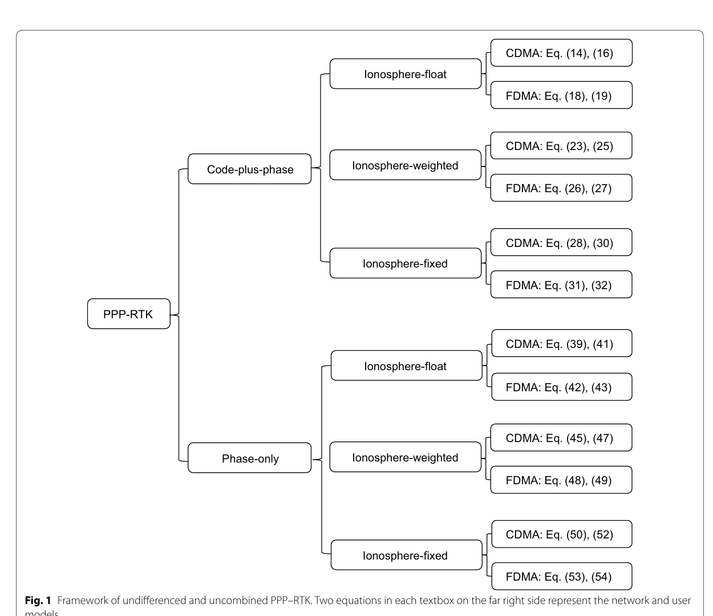
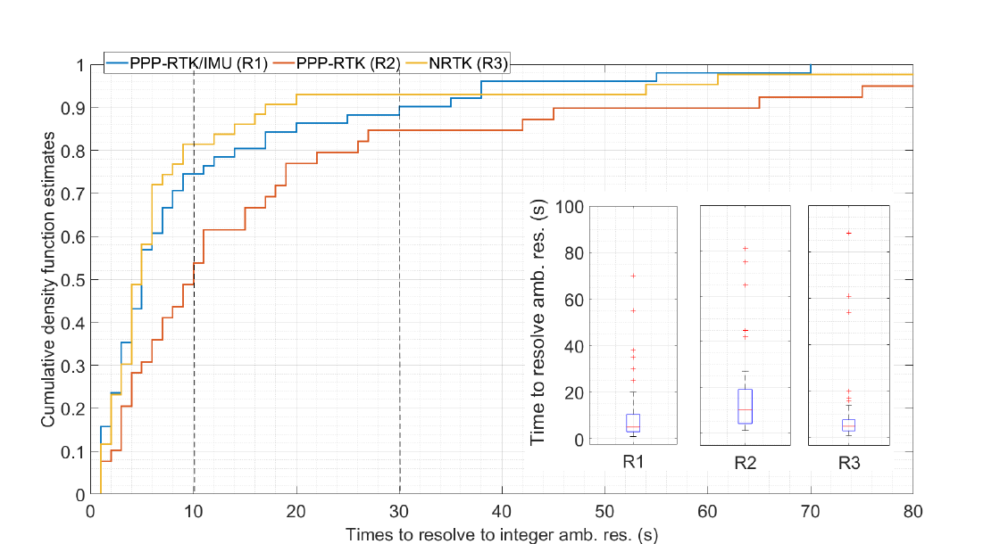

# 2026-08-03 GNSS 每日研究简报

## 今日快报

### 快报 1：手机纯载波相对定位可到厘米量级，但基线增长暴露设备与星座差异

- 主题：`smartphone-carrier-phase-only-mafa-relative-positioning`
- 来源 ID：`doi:10.1515/jag-2026-0063`
- 来源链接：https://doi.org/10.1515/jag-2026-0063
- 发表日期：2026-08-03
- 来源类型：同行评审开放期刊论文
- 获取范围：CC BY 4.0 题录与完整摘要；本次未取得可逐页核验的算法参数、路线图和全量误差表

**内容：** 论文让 Xiaomi Mi 8、Google Pixel 7 与 Samsung S24+ 只使用载波相位观测进入改进模糊度函数法（MAFA），比较超短基线与 5 km 基线、单星座与多星座解。MAFA 的目标是绕开手机相位频繁周跳与模糊度不连续对传统连续整数状态的破坏。

**结论：** 摘要报告 Pixel 的 BDS-2 北向标准差由超短基线的 2.5 cm 增至 5 km 时的 10.6 cm，东向由 1.4 cm 增至 2.9 cm；多星座解在两种基线之间的标准差差异小于 1 cm。作者同时指出长基线出现坐标偏差。因为尚未核验完整历元数、真值体系和失败率，这些是三台手机与指定场景的摘要结果，不能写成任意手机的连续厘米级可用率。

**关注理由：** 纯相位模型对码噪声大的手机有吸引力，但长基线会削弱大气误差共模性。工程验证必须同时报告无解比例、错误局部极值、周跳密度与基线相关偏差，不能只比较成功历元的标准差。

### 快报 2：按权重尾和截断候选可加速 BIE，但最优均方误差仍依赖分布模型

- 主题：`weight-constrained-bie-ambiguity-resolution`
- 来源 ID：`doi:10.1016/j.asr.2026.05.035`
- 来源链接：https://doi.org/10.1016/j.asr.2026.05.035
- 发表日期：2026-08-01
- 来源类型：同行评审期刊论文
- 获取范围：出版商题录、摘要、方法与摘要结果；未取得全文的权重阈值、维数配置和全部城市路线统计

**内容：** 最佳整数等变（BIE）估计不是只取一个整数候选，而是对整数格候选做概率加权平均；理论候选无限，传统按候选数截断的 CBIE 或按中心卡方空间截断的 SBIE 会在高维或方差尺度失配时面临计算量与精度冲突。论文把累计候选权重直接作为搜索停止条件，形成 WBIE。

**结论：** 摘要称实测城市数据上 WBIE 与 CBIE 的定位表现一致，平均用时为 0.394 ms；对照 ILS 为 0.708 ms、CBIE 为 2.614 ms。这个比较只约束论文的软件、处理器、模糊度维数和数据；BIE 的均方误差最优性以所用概率模型为前提，不能由较快平均时间推出长尾误差下仍最优。

**关注理由：** 高维多频多系统接收机必须控制候选枚举。实现时应公开权重尾界、最坏运行时间和分布失配试验，并把 WBIE 与 ILS/整数孔径在错误固定尾部而非仅均方误差上比较。

### 快报 3：可变维度序贯更新减少空算，但摘要尚未给出可移植的加速比

- 主题：`variable-dimension-sequential-kalman-gnss`
- 来源 ID：`doi:10.1007/s00190-026-02078-1`
- 来源链接：https://doi.org/10.1007/s00190-026-02078-1
- 发表日期：2026-07-14
- 来源类型：同行评审期刊论文
- 获取范围：出版商题录、完整摘要、数据可用性与图表目录；正文为订阅内容，未取得操作计数、处理器和逐场景耗时表

**内容：** 论文利用 GNSS 观测只与状态向量一部分参数耦合的稀疏结构，在逐观测序贯更新时只操作相关子状态；作者把该策略嵌入 U-D 分解滤波，得到 VD-UDF，并与标准 UDF、信息形式 KF 和平方根信息滤波比较。

**结论：** 作者摘要支持“在几乎不牺牲数值精度与稳定性的前提下提高时间效率”，但开放摘要没有给可复述的统一加速倍数，也没有说明不同卫星数、状态维数和缓存/向量化实现下的最坏耗时。因此这里不把摘要中的 superior efficiency 译成特定芯片上的实时保证。

**关注理由：** 手机和大众芯片既要处理更多星/频点，又受算力与功耗限制。可变维更新应以稀疏索引构造成本、数值等价误差、动态增删星和固定周期截止违约率共同评估。

### 快报 4：模糊度已解的显著性检验提升模型失配检出力，但尖峰功效需要显式缓解

- 主题：`ambiguity-resolved-parameter-significance-test-implementation`
- 来源 ID：`doi:10.33012/navi.778`
- 来源链接：https://doi.org/10.33012/navi.778
- 发表日期：2026-07-01
- 来源类型：同行评审期刊论文
- 获取范围：ION 官方题录、摘要与官方 PDF 元数据；本条只复述摘要可核验的方法比较，不转述未逐表复核的功效数值

**内容：** 论文实现模糊度已解参数显著性（ARs）与模糊度已解参数范数（ARn）检验，用功效随偏差幅度的函数，与把模糊度视为浮点的 AF 检验及模糊度已知基准比较；目标是让伪距粗差、载波周跳和大气延迟检验正确处理混合整数模型。

**结论：** 摘要称 ARs/ARn 在伪距粗差与周跳试验中表现相近且通常优于 AF；对电离层、对流层延迟，两者表现不同，ARs 功效曲线可能出现尖峰，论文给出两类缓解方法。该结论是统计功效分析，不等于现场完整性风险已经被界定，也不能忽略整数解错误时的检验分布失配。

**关注理由：** 高精度定位常在固定后继续沿用浮点残差门限，容易浪费整数约束或错误估计检出力。产品应按候选正确/错误、偏差方向和大气相关结构分别标定检验，而不是只调一个残差阈值。

### 快报 5：TurboUNet 改善加密码估计 BER，但论文研究的是攻击能力而非接收机防护

- 主题：`turbounet-noncooperative-encrypted-code-estimation`
- 来源 ID：`doi:10.1007/s10291-026-02118-5`
- 来源链接：https://doi.org/10.1007/s10291-026-02118-5
- 发表日期：2026-07-10
- 来源类型：同行评审期刊论文
- 获取范围：出版商题录、完整摘要、实验范围与摘要数值；正文为订阅内容，未取得训练集划分和全部 SNR/采样率曲线

**内容：** TurboUNet 把 Turbo 迭代中的软概率回馈与带门控融合的 U-Net 编解码结构组合，用于安全码估计与重放（SCER）攻击中的非合作 P(Y)/M 码估计；要解决的是低 SNR 与现代复杂调制非均匀星座相位导致的码比特估计困难。

**结论：** 摘要称实测中，相对传统方法，P(Y) 与 M 码 BER 最多降低 22% 和 27%；相对比较的深度学习方法最多降低 5.5% 和 6%。这些是“攻击端码估计器”的相对 BER 改善，且最多值不代表全 SNR 区间；论文未生成或分析公开数据集，也不能据此宣称某授权 GNSS 服务已被现实攻破。

**关注理由：** 防护研究需要理解攻击面的真实上限，但披露必须严格区分仿真、受控实测与可部署攻击。接收机侧还要测试信号认证、阵列空域判别、相关峰一致性和攻击者功率/同步约束。

## 深度研读

### 深读 1｜接收机工程｜从码相观测到 PPP 状态：为什么精密产品不等于瞬时精密坐标

- 类别：`receiver-engineering`
- 学习层级：`foundation`
- 选题定位：`基础`
- 来源 ID：`doi:10.1007/s10291-023-01488-4`
- 来源链接：https://doi.org/10.1007/s10291-023-01488-4
- 发表日期：2023-07-19
- 来源类型：同行评审开放期刊软件论文
- 获取范围：CC BY 4.0 全文、开源 raPPPid、码相模型、约 2300 个重置收敛段、手机示例与原图
- 价值评分：98/100（相关性 20，经典价值 19，证据 20，教学价值 20，工程价值 19）

#### 为什么先学这个

PPP-RTK 的“RTK”建立在 PPP 单站模型之上。先看清伪距、载波、轨钟、大气、硬件偏差与模糊度分别落在哪个状态中，才能理解为什么精密轨钟只消掉一部分误差，也才能理解下一节网络究竟要广播什么。

#### 先修知识

需要伪距与载波相位、卫星—接收机几何距离、钟差、对流层、电离层、频率与波长、Kalman 滤波。还要区分“精度”与“收敛”：坐标最终可很准，不意味着启动后第一秒就可用。

#### 一句话逻辑

用精密轨道、钟差和偏差产品改正未差分码相观测，在滤波器内同时估坐标、接收机钟、湿对流层、电离层与浮点模糊度；观测模型越完整，剩余状态越可辨，但初始化仍需信息积累或整数/大气外部约束。

#### 研究问题与约束

论文介绍 MATLAB 开源软件 raPPPid，并用 24 个全球 IGS MGEX 站的 1 Hz 数据在 2022-08-01 每 15 min 重置一次，形成约 2300 个收敛段。高质量试验是静态测地数据，不代表城市车载；手机试验只有两台设备、30 min、已知静态点和有利环境。

#### 核心方法论

原始频点模型保留码与相位的异号电离层项；传统模型先做双频无电离层组合，未组合模型则保留原始噪声并逐星估斜电离层。raPPPid 用迭代扩展 Kalman 滤波给出浮点解；PPP-AR 再用卫星相位偏差产品、星间单差和部分 LAMBDA 分步固定宽巷/窄巷。

#### 关键公式逐步推导

以米为单位，频点 $`i`$ 的码和相位为：

```math
P_i=\rho+c(\mathrm dt_R-\mathrm dt^S)+T+I_i+B_{R,i}-B_i^S+\varepsilon_{P,i}
```

```math
L_i=\rho+c(\mathrm dt_R-\mathrm dt^S)+T-I_i
+\lambda_i(N_i+b_{R,i}-b_i^S)+\varepsilon_{L,i}
```

电离层一阶项随频率平方反比，故双频无电离层系数为：

```math
P_{IF}=\frac{f_1^2P_1-f_2^2P_2}{f_1^2-f_2^2},\qquad
L_{IF}=\frac{f_1^2L_1-f_2^2L_2}{f_1^2-f_2^2}
```

它消掉一阶 $`I_i`$，却用大于 1 的系数组合噪声。未组合模型令 $`\gamma_{1i}=f_1^2/f_i^2`$，把 $`I_1`$ 作为逐星状态；浮点模糊度为：

```math
\widetilde N_i=N_i+b_{R,i}-b_i^S
```

所以硬件相位偏差未改正前，$`\widetilde N_i`$ 一般不能直接当整数。

#### 经典价值与创新边界

经典价值是把 PPP 的码相观测、无电离层/未组合模型、浮点与固定解连到一个可运行实现。创新在于灵活、开源、支持多 GNSS/多频与丰富诊断。边界是软件论文的配置结果不是 PPP 理论上限；实现当时未考虑 IFCB，未组合 PPP-AR 仍属实验功能。

#### 整体逻辑链

读 RINEX；下载精密轨钟/偏差/天线产品；改正相对论、相位缠绕、天线相位中心、固体潮与海潮负荷；选 IF 或未组合模型；设置随机模型；逐历元滤波；做周跳与残差质量控制；可用偏差产品时尝试 PPP-AR；分别输出浮点、固定坐标与收敛诊断。

#### 原文图表与结果分析



> 图源：M. F. Glaner、R. Weber，《An open-source software package for Precise Point Positioning: raPPPid》，Figure 4，[GPS Solutions 原文](https://doi.org/10.1007/s10291-023-01488-4)，CC BY 4.0。保存 Springer 提供的 968×479 原始 PNG；未裁切、重绘或改变曲线、坐标与图例。

横轴是重置后的正确固定时间（min），范围 0—5；纵轴是占全部收敛段的比例（%）。蓝柱是各时间箱首次正确固定的 PDF，灰柱是此前已正确固定的累计 CDF；约 0.5 min 的蓝柱最高，灰柱随后缓慢接近 90% 以上。图只展示前 5 min，且正确固定定义要求二维误差保持小于 5 cm；它不能显示错误固定率，也不能证明动态或遮挡环境同样收敛。

#### 原文结果论述

作者报告该配置的正确固定时间中位数为 33 s、均值为 1.36 min；15 min 内未正确固定为 2.61%，而浮点二维误差未稳定到 10 cm 的比例为 10.0%。15 min 后固定/浮点三维误差中位数分别为 2.81/5.86 cm。这些数字依赖 24 个高质量静态站、所选 CODE/WUM 产品和论文的持续阈值定义。

#### 常见误区与适用边界

第一，把精密轨钟当全部改正。第二，把 IF 组合称作“无电离层真值”；它只消一阶项并放大噪声。第三，忽略硬件偏差却强制整数。第四，用最后一历元过阈值代替持续收敛。第五，把静态 IGS 结果外推到城市移动。第六，固定成功后不再监控残差与周跳。

#### 工程实现步骤

1. 统一 RINEX、SP3/CLK、SINEX BIAS、ANTEX 和时标。
2. 对每项改正写开关、单位和日志，并做逐项消融。
3. 同时实现 IF 与未组合模型，比较法方程秩和噪声传播。
4. 将坐标、钟差、ZWD、电离层、DCB 与模糊度状态显式分块。
5. 对周跳重置单星模糊度，而非整滤波器无条件重启。
6. 浮点与固定解分开维护，并记录正确固定判据和失败原因。

#### 复现实验设计

取 24 个 MGEX 站的 1 Hz 一日数据，按论文每 15 min 重置；比较 IF 浮点、双频未组合+电离层伪观测、三频未组合与 PPP-AR。统一轨钟/天线产品，指标为达到并持续保持 0.10 m 二维浮点和 0.05 m 固定阈值的时间、15 min 三维误差、错误固定率、无解率与 CPU。失败用例为删去相位偏差、PCV、相位缠绕，注入 1 cycle 周跳及 30 s 产品中断。

#### 与定位及低成本实现的联系

低成本设备的码噪声大、频点不全、相位易断，未组合模型虽避免组合噪声，却增加电离层/DCB 状态并更依赖约束。PPP-RTK 的价值正是从网络端补充这些弱可观状态；但接收机仍需知道产品基准、龄期与协方差。

#### 本节小结

PPP 是精密产品加完整观测模型的递推估计，不是一次性坐标改正。收敛来自大气、钟差、偏差和模糊度逐步可辨；下一节把单站难以快速分离的部分转交给参考网络。

### 深读 2｜接收机工程｜从 PPP 到 PPP-RTK：网络广播的不是一个坐标差

- 类别：`receiver-engineering`
- 学习层级：`intermediate`
- 选题定位：`基础进阶`
- 来源 ID：`doi:10.1186/s43020-022-00064-4`
- 来源链接：https://doi.org/10.1186/s43020-022-00064-4
- 发表日期：2022-02-14
- 来源类型：同行评审开放期刊理论论文
- 获取范围：CC BY 4.0 全文、未差分未组合网络/用户模型、CDMA/FDMA、码相与纯相位、三类大气约束和原图
- 价值评分：98/100（相关性 20，经典价值 20，证据 20，教学价值 20，工程价值 18）

#### 为什么先学这个

第一节看见 PPP 模糊度被硬件偏差污染。本节问更根本的问题：参考网络能估出哪些组合、用户该接收哪些产品、哪些整数仍可估。若忽略可估性，只给每个物理误差起名字，会广播一组彼此相关甚至不可唯一确定的“改正数”。

#### 先修知识

需要未差分码相模型、矩阵秩亏、S-basis/基准选择、CDMA 与 GLONASS FDMA、整数可估性、对流层映射和斜电离层。要接受“可估参数通常是原始物理参数的线性组合”，而不是每个钟差/偏差都有绝对真值。

#### 一句话逻辑

先对网络模型选基准消除秩亏，得到可估的卫星钟、码/相偏差和大气组合；再把同一基准约束传给单用户，使用户的可估模糊度仍为整数线性组合，从而用状态空间改正实现单站快速固定。

#### 研究问题与约束

论文是统一函数模型与可估性分析，没有新车载数据。它系统比较码+相/纯相位、CDMA/FDMA，以及电离层浮点、加权、固定三类网络。性能论述主要依据模型强弱和既有试验，不应把“固定模型最好”脱离小网络、共同大气假设理解为普适结论。

#### 核心方法论

网络同时估卫星与接收机相关参数会秩亏；作者用 S-system theory 选一组不可估参数为基准，把其影响吸收到可估组合。电离层浮点模型不给大气外约束；加权模型约束站间电离层差为零均值随机量；固定模型假设各站映射后的对流层与电离层相同。网络和用户模型必须成对设计。

#### 关键公式逐步推导

以接收机 $`r`$、卫星 $`s`$、频点 $`j`$ 的教学简化模型表示：

```math
p_{r,j}^s=\rho_r^s+dt_r-dt^s+\mu_j l_r^s+m_r^s\tau_r+d_{r,j}-d_j^s+e_{p}
```

```math
\phi_{r,j}^s=\rho_r^s+dt_r-dt^s-\mu_j l_r^s+m_r^s\tau_r
+\delta_{r,j}-\delta_j^s+\lambda_j z_{r,j}^s+e_{\phi}
```

模型的零空间意味着同时平移某些钟/偏差/大气参数不改变观测。选第 1 站和第 1 星为基准后，CDMA 可估整数可写成双差：

```math
\Delta\nabla z_{r,j}^s=z_{r,j}^s-z_{1,j}^s-z_{r,j}^1+z_{1,j}^1\in\mathbb Z
```

电离层加权模型对站间差施加随机约束：

```math
l_r^s-l_1^s\sim\mathcal N(0,\sigma_{l,r,s}^2)
```

而非把它硬设为零。网络产品协方差 $`Q_c`$ 进入用户模型时，应与码相噪声共同加权；改正值本身不是无误差常数。

#### 经典价值与创新边界

经典价值是把 PPP-RTK 明确成网络—用户两端的可估参数传递与整数保持问题。论文贡献是统一原始未差分未组合模型，覆盖 CDMA/FDMA、码相/纯相位和三种大气约束。边界是函数模型不自动给随机模型、传输协议、完整性界或产品龄期策略。

#### 整体逻辑链

建立网络原始观测；识别秩亏；选择基准；形成可估卫星钟、码偏差、相位偏差与大气产品；保留完整协方差和基准定义；编码广播；用户按同一观测/基准模型应用；恢复可估整数；搜索与验收；输出坐标并监控改正龄期。

#### 原文图表与结果分析



> 图源：B. Zhang、P. Hou、J. Zha、T. Liu，《PPP–RTK functional models formulated with undifferenced and uncombined GNSS observations》，Figure 1，[Satellite Navigation 原文](https://doi.org/10.1186/s43020-022-00064-4)，CC BY 4.0。从 PDF 物理第 13 页以 180 dpi 渲染，仅裁取 Figure 1 及原图题；未重绘、改字或改变分支。

图是分类树，没有数值轴：第一层分码+相与纯相位，第二层分电离层浮点/加权/固定，最右再分 CDMA/FDMA，并给出各网络与用户方程号。它直接说明 PPP-RTK 不是单一公式，而是一组必须配对的模型；图不能比较实测精度、带宽或收敛时间，分支数量也不是方案优劣排名。

#### 原文结果论述

论文指出：大尺度网络适合电离层浮点模型；省域等中尺度网络可用合适随机模型的电离层加权方案；小尺度且站间大气近似一致时，电离层固定模型最强。纯相位模型在码多路径严重或接收机异构时可避免码相关偏差，但其电离层浮点模糊度波长组合可能更难固定。以上是模型条件与既有结果的综合，不是本文新实测百分比。

#### 常见误区与适用边界

第一，把 SSR 产品当每个物理误差的绝对真值。第二，网络和用户采用不同基准。第三，忽略改正协方差。第四，把电离层加权误写成固定为零。第五，把小网大气共模外推到广域。第六，用 CDMA 双差公式直接处理 FDMA。第七，认为纯相位天然比码相强。

#### 工程实现步骤

1. 对网络设计矩阵做秩与零空间检查。
2. 文档化 S-basis、参考站/星、符号和单位。
3. 分离 orbit/clock/bias/atmosphere 的更新率与龄期。
4. 输出产品全协方差或经过验证的保守近似。
5. 用户端按同一信号定义和基准恢复观测模型。
6. 对参考切换、卫星升落和 FDMA 通道变化做连续性测试。
7. 在缺产品时按可观性降级到 PPP 浮点，而非沿用过期固定。

#### 复现实验设计

构造 5/20/100 km 三类网络，GPS/Galileo CDMA 与 GLONASS FDMA，1 Hz 采 2 h；实现电离层浮点、加权（站间差标准差 0.02/0.10/0.50 m）和固定模型。比较码+相与纯相位。指标为秩、可估整数维数、网络产品 RMS、用户首次正确固定、错误固定、改正字节率与 CPU；失败用例为基准不一致、协方差忽略、10 cm 电离层梯度和参考星切换。

#### 与定位及低成本实现的联系

低成本用户不需要复制整张参考网，只需接收与自身模型兼容的状态改正。但更便宜的天线、码多路径和频点缺失会改变随机模型与可用分支；服务端“有产品”不代表终端“可估整数”。

#### 本节小结

PPP-RTK 的核心是把网络可估信息连同基准和不确定度交给用户，并保持用户模糊度的整数结构。模型越强，适用的空间范围和大气假设越苛刻；第三节用真实车辆检验这些理论收益如何受环境与硬件限制。

### 深读 3｜定位｜低成本车载 PPP-RTK：固定率、重收敛与环境热点必须一起看

- 类别：`positioning`
- 学习层级：`advanced`
- 选题定位：`定位深入`
- 来源 ID：`doi:10.3390/geomatics6030050`
- 来源链接：https://doi.org/10.3390/geomatics6030050
- 发表日期：2026-05-14
- 来源类型：同行评审开放期刊实测论文
- 获取范围：CC BY 4.0 全文、低成本 ZED-F9、PPP-RTK/NRTK、两圈异质路线、隧道、高速、PPK 真值、LiDAR DEM 与原图
- 价值评分：97/100（相关性 20，经典价值 18，证据 20，教学价值 19，工程价值 20）

#### 为什么先学这个

前两节解释单站状态和网络产品。本节把它们放进车辆：相同“分米级”平均精度下，PPP-RTK、PPP-RTK+IMU 与 NRTK 的固定占比、失锁后重收敛和空间重复热点不同。定位系统不能只用一个 RMS 排名。

#### 先修知识

需要 PPP-RTK/SSR、NRTK/OSR、整数固定/浮点/DGNSS 状态、沿轨/横轨/垂向误差、CDF、PPK 真值与 INS 航位推算。尤其要分清 R1 含 IMU、R2 是独立 PPP-RTK、R3 是纯 GNSS NRTK；R1 只能作为融合对照，不能证明纯 GNSS 隧道连续性。

#### 一句话逻辑

把三套低成本接收机刚性共架，用两台测地接收机 PPK 重建同一车辆真值，沿重复路线统计误差、解状态与失锁后重新固定时间，才能分开改正服务、惯性辅助和环境遮挡的贡献。

#### 研究问题与约束

主试验包含两圈相同路线、500 m 隧道、7 处跨越结构、林荫路和城市段。R1 为 ZED-F9R+PointPerfect+IMU，R2 为 ZED-F9P+PointPerfect，R3 为 ZED-F9P+Umbria NRTK；PointPerfect OCB 每 5 s、气象改正每 30 s 经 IP 接收。单地区、单日和商业服务条件限制了外推。

#### 核心方法论

两台 Topcon Hiper HR 位于刚性杆两端，以 UNPG CORS 做 PPK，并用固定杆长/方位约束交叉检查真值；三台低成本设备位于同一杆。作者按固定、浮点、DGNSS、无解/IMU 独立分类，计算沿轨、横轨、垂向误差、重新固定时间 CDF、空间误差重复性，并以 LiDAR DEM 独立检查垂向。

#### 关键公式逐步推导

把估计位置与参考轨迹差写成 ENU 向量 $`\Delta\mathbf p=[\Delta E,\Delta N,\Delta U]^T`$。由参考速度方向单位向量 $`\mathbf t=[t_E,t_N,0]^T`$ 和水平法向 $`\mathbf n=[-t_N,t_E,0]^T`$ 得：

```math
e_{ATE}=\mathbf t^T\Delta\mathbf p,\qquad
e_{XTE}=\mathbf n^T\Delta\mathbf p,\qquad
e_{VE}=\Delta U
```

水平误差为：

```math
HPE=\sqrt{e_{ATE}^2+e_{XTE}^2}
```

若每次失去固定后的恢复时间为 $`T_k`$，经验 CDF 为：

```math
\hat F_T(t)=\frac{1}{K}\sum_{k=1}^{K}\mathbf 1(T_k\le t)
```

固定占比 $`A_{fix}=N_{fix}/N_{all}`$ 必须与无解、浮点和 DGNSS 占比共同报告；它不是完整性概率。

#### 经典价值与创新边界

经典价值是把误差与解状态分层，并以共架真值做车辆比较。论文亮点是重复圈、环境热点、重新固定与独立 DEM 垂向验证。边界是品牌/固件/订阅服务耦合，R1 的优势混合了 IMU，R3 依赖本地区域网；研究未给安全完整性界，也未把所有接收机用同一原始观测送入统一算法。

#### 整体逻辑链

共架标定；记录三套实时解和两套真值观测；PPK 重建轨迹；同步并转沿/横/垂向；按状态分组；统计固定占比与误差；定位每次失锁并计算恢复时间；比较重复圈空间热点；用 DEM 复核垂向；最后把服务、惯性和环境影响分开解释。

#### 原文图表与结果分析



> 图源：L. Marconi 等，《Evaluating PPP-RTK and Network RTK for Vehicle-Based Kinematic Positioning in Urban and Suburban Environments》，Figure 9，[Geomatics 原文](https://doi.org/10.3390/geomatics6030050)，CC BY 4.0。从 PDF 物理第 14 页以 180 dpi 渲染，仅裁取 Figure 9 绘图区；未重绘、改字或改变坐标、曲线、箱线与图例。

主图横轴为重新整数固定时间 0—80 s，纵轴是经验累计比例 0—1；蓝/橙/黄分别为 R1/R2/R3。约 10 s 处，R3 和 R1 的累计比例均高于 R2；R2 到 30 s 仍只有约 0.85。内嵌箱线图显示 R2 中位数及离散度更大，三者都有约 70—90 s 的离群点。图不能把 R1 优势归给 PPP-RTK 本身，因为 R1 含 IMU；也不能从 CDF 推出错误固定是否安全。

#### 原文结果论述

全路线固定占比分别为 R1 69.6%、R2 58.7%、R3 75.3%；R2 浮点 33.7%，R1/R3 为 23.5%/14.5%。固定解沿轨/横轨标准差：R1 0.19/0.32 m，R2 0.25/0.32 m，R3 0.26/0.29 m；R2 固定垂向均值/标准差为 0.61/0.90 m，暴露初始垂向异常。高速试验的水平 R95：R1 0.23 m、R3 0.28 m；论文没有在相同段给 R2 同等级结果。所有数值只适用于该配置与路线。

#### 常见误区与适用边界

第一，把固定率当正确固定率。第二，把 R1 隧道连续性写成纯 GNSS。第三，只看均值/RMS 而忽略垂向偏差和无解。第四，把 NRTK 本地表现外推到无基站区。第五，忽略不同接收机内部滤波不可控。第六，把重复热点当随机噪声。第七，用 DEM 高程差替代严格三维同历元真值。

#### 工程实现步骤

1. 刚性共架并实测杆臂，统一天线相位中心。
2. 原始观测、改正流、产品龄期、解状态和 IMU 状态全部留档。
3. 用独立 PPK/全站仪重建真值并检查闭合。
4. 分 fixed/float/DGNSS/no-solution 统计误差和持续时间。
5. 把失锁事件按隧道、树遮、跨线桥、城市墙面与链路中断分类。
6. 报告错误固定、恢复时间 CDF、HPE 95/99.9% 和最大误差。
7. 对重复路线画空间热点并触发保守降级。

#### 复现实验设计

在同一原始 ZED-F9P 观测上并行运行 PointPerfect PPP-RTK、区域 NRTK 与离线统一基线算法；另设同型号+IMU 只作融合对照。路线含开阔、林荫、街谷、500 m 隧道与高速，各重复 10 圈、跨 3 天。指标为正确固定/错误固定、无解、ATE/XTE/VE 50/95/99.9%、恢复时间 CDF、改正龄期和 CPU；失败用例为 IP 断开 5/30/120 s、冷启动、参考切换和人为 1 cycle 偏差。

#### 与定位及低成本实现的联系

R2 与 R3 都是纯 GNSS 定位路径：一个消费 SSR，一个消费区域 NRTK 改正。低成本硬件在好环境可实现分米级，但产品的关键差异出现在遮挡、重收敛和垂向异常；这些状态应通过质量接口暴露给车辆，而非只输出“fixed”字符串。

#### 本节小结

低成本 PPP-RTK 的价值不能由单个平均精度概括。全路线中独立 PPP-RTK 的固定占比和重收敛弱于区域 NRTK，IMU 能改善连续性但改变了技术类别；可靠部署需要把精度、状态、恢复和环境重复性一起验证。
