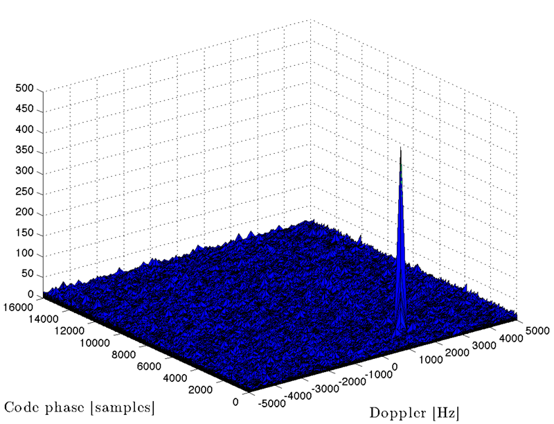
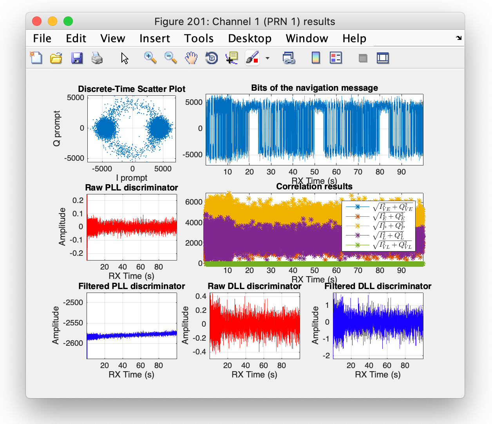

# 2026-08-03 GNSS 每日研究简报

## 今日快报

### 快报 1：手机纯载波相对定位可到厘米量级，但基线增长暴露设备与星座差异

- 主题：`smartphone-carrier-phase-only-mafa-relative-positioning`
- 来源 ID：`doi:10.1515/jag-2026-0063`
- 来源链接：https://doi.org/10.1515/jag-2026-0063
- 发表日期：2026-08-03
- 来源类型：同行评审开放期刊论文
- 获取范围：CC BY 4.0 题录与完整摘要；本次未取得可逐页核验的算法参数、路线图和全量误差表

**内容：** 论文让 Xiaomi Mi 8、Google Pixel 7 与 Samsung S24+ 只使用载波相位观测进入改进模糊度函数法（MAFA），比较超短基线与 5 km 基线、单星座与多星座解。MAFA 的目标是绕开手机相位频繁周跳与模糊度不连续对传统连续整数状态的破坏。

**结论：** 摘要报告 Pixel 的 BDS-2 北向标准差由超短基线的 2.5 cm 增至 5 km 时的 10.6 cm，东向由 1.4 cm 增至 2.9 cm；多星座解在两种基线之间的标准差差异小于 1 cm。作者同时指出长基线出现坐标偏差。因为尚未核验完整历元数、真值体系和失败率，这些是三台手机与指定场景的摘要结果，不能写成任意手机的连续厘米级可用率。

**关注理由：** 纯相位模型对码噪声大的手机有吸引力，但长基线会削弱大气误差共模性。工程验证必须同时报告无解比例、错误局部极值、周跳密度与基线相关偏差，不能只比较成功历元的标准差。

### 快报 2：按权重尾和截断候选可加速 BIE，但最优均方误差仍依赖分布模型

- 主题：`weight-constrained-bie-ambiguity-resolution`
- 来源 ID：`doi:10.1016/j.asr.2026.05.035`
- 来源链接：https://doi.org/10.1016/j.asr.2026.05.035
- 发表日期：2026-08-01
- 来源类型：同行评审期刊论文
- 获取范围：出版商题录、摘要、方法与摘要结果；未取得全文的权重阈值、维数配置和全部城市路线统计

**内容：** 最佳整数等变（BIE）估计不是只取一个整数候选，而是对整数格候选做概率加权平均；理论候选无限，传统按候选数截断的 CBIE 或按中心卡方空间截断的 SBIE 会在高维或方差尺度失配时面临计算量与精度冲突。论文把累计候选权重直接作为搜索停止条件，形成 WBIE。

**结论：** 摘要称实测城市数据上 WBIE 与 CBIE 的定位表现一致，平均用时为 0.394 ms；对照 ILS 为 0.708 ms、CBIE 为 2.614 ms。这个比较只约束论文的软件、处理器、模糊度维数和数据；BIE 的均方误差最优性以所用概率模型为前提，不能由较快平均时间推出长尾误差下仍最优。

**关注理由：** 高维多频多系统接收机必须控制候选枚举。实现时应公开权重尾界、最坏运行时间和分布失配试验，并把 WBIE 与 ILS/整数孔径在错误固定尾部而非仅均方误差上比较。

### 快报 3：可变维度序贯更新减少空算，但摘要尚未给出可移植的加速比

- 主题：`variable-dimension-sequential-kalman-gnss`
- 来源 ID：`doi:10.1007/s00190-026-02078-1`
- 来源链接：https://doi.org/10.1007/s00190-026-02078-1
- 发表日期：2026-07-14
- 来源类型：同行评审期刊论文
- 获取范围：出版商题录、完整摘要、数据可用性与图表目录；正文为订阅内容，未取得操作计数、处理器和逐场景耗时表

**内容：** 论文利用 GNSS 观测只与状态向量一部分参数耦合的稀疏结构，在逐观测序贯更新时只操作相关子状态；作者把该策略嵌入 U-D 分解滤波，得到 VD-UDF，并与标准 UDF、信息形式 KF 和平方根信息滤波比较。

**结论：** 作者摘要支持“在几乎不牺牲数值精度与稳定性的前提下提高时间效率”，但开放摘要没有给可复述的统一加速倍数，也没有说明不同卫星数、状态维数和缓存/向量化实现下的最坏耗时。因此这里不把摘要中的 superior efficiency 译成特定芯片上的实时保证。

**关注理由：** 手机和大众芯片既要处理更多星/频点，又受算力与功耗限制。可变维更新应以稀疏索引构造成本、数值等价误差、动态增删星和固定周期截止违约率共同评估。

### 快报 4：模糊度已解的显著性检验提升模型失配检出力，但尖峰功效需要显式缓解

- 主题：`ambiguity-resolved-parameter-significance-test-implementation`
- 来源 ID：`doi:10.33012/navi.778`
- 来源链接：https://doi.org/10.33012/navi.778
- 发表日期：2026-07-01
- 来源类型：同行评审期刊论文
- 获取范围：ION 官方题录、摘要与官方 PDF 元数据；本条只复述摘要可核验的方法比较，不转述未逐表复核的功效数值

**内容：** 论文实现模糊度已解参数显著性（ARs）与模糊度已解参数范数（ARn）检验，用功效随偏差幅度的函数，与把模糊度视为浮点的 AF 检验及模糊度已知基准比较；目标是让伪距粗差、载波周跳和大气延迟检验正确处理混合整数模型。

**结论：** 摘要称 ARs/ARn 在伪距粗差与周跳试验中表现相近且通常优于 AF；对电离层、对流层延迟，两者表现不同，ARs 功效曲线可能出现尖峰，论文给出两类缓解方法。该结论是统计功效分析，不等于现场完整性风险已经被界定，也不能忽略整数解错误时的检验分布失配。

**关注理由：** 高精度定位常在固定后继续沿用浮点残差门限，容易浪费整数约束或错误估计检出力。产品应按候选正确/错误、偏差方向和大气相关结构分别标定检验，而不是只调一个残差阈值。

### 快报 5：TurboUNet 改善加密码估计 BER，但论文研究的是攻击能力而非接收机防护

- 主题：`turbounet-noncooperative-encrypted-code-estimation`
- 来源 ID：`doi:10.1007/s10291-026-02118-5`
- 来源链接：https://doi.org/10.1007/s10291-026-02118-5
- 发表日期：2026-07-10
- 来源类型：同行评审期刊论文
- 获取范围：出版商题录、完整摘要、实验范围与摘要数值；正文为订阅内容，未取得训练集划分和全部 SNR/采样率曲线

**内容：** TurboUNet 把 Turbo 迭代中的软概率回馈与带门控融合的 U-Net 编解码结构组合，用于安全码估计与重放（SCER）攻击中的非合作 P(Y)/M 码估计；要解决的是低 SNR 与现代复杂调制非均匀星座相位导致的码比特估计困难。

**结论：** 摘要称实测中，相对传统方法，P(Y) 与 M 码 BER 最多降低 22% 和 27%；相对比较的深度学习方法最多降低 5.5% 和 6%。这些是“攻击端码估计器”的相对 BER 改善，且最多值不代表全 SNR 区间；论文未生成或分析公开数据集，也不能据此宣称某授权 GNSS 服务已被现实攻破。

**关注理由：** 防护研究需要理解攻击面的真实上限，但披露必须严格区分仿真、受控实测与可部署攻击。接收机侧还要测试信号认证、阵列空域判别、相关峰一致性和攻击者功率/同步约束。

## 深度研读

### 深读 1｜捕获｜二维搜索不是找最高点就结束：PCPS、GLRT 与 CFAR 门限

- 类别：`acquisition`
- 学习层级：`foundation`
- 选题定位：`经典基础`
- 来源 ID：`gnss-sdr:pcps-glrt-cfar`
- 来源链接：https://gnss-sdr.org/docs/sp-blocks/acquisition/
- 发表日期：2026-03-10
- 来源类型：官方开源接收机工程文档
- 获取范围：完整信号模型、PCPS 算法、GLRT/CFAR 说明、配置参数、可运行实现与原图；网页内容 CC BY 4.0
- 价值评分：97/100（相关性 20，经典价值 25，证据 20，教学价值 19，工程价值 13）

#### 为什么先学这个

接收机还不知道卫星信号的码延迟和多普勒时，跟踪环没有可用的线性工作点。捕获做的第一件事不是“精确测距”，而是在有限二维网格里回答“这个 PRN 是否存在”，并交出足够接近真值的粗码相位和粗频率。PCPS 把每个频率格上的所有码相位并行算出；GLRT 再把峰值与输入功率归一化，避免只因前端增益变大就宣布捕获。理解这两个动作，才能判断峰值、门限、网格和计算量之间的因果关系。

#### 先修知识

需要复数 I/Q 采样、采样率与采样周期、PRN 本地副本、复指数下变频、离散傅里叶变换、循环相关和最基本的假设检验。GPS L1 C/A 的码周期是 1 ms；图中 Galileo E1 主码周期是 4 ms。若采样率为 4 Msps，4 ms 缓冲区有 16000 个复样本。一个样本对应 0.25 μs 的时间格和约 75 m 的光程格，但“搜索格宽 75 m”不等于最终伪距精度只有 75 m，跟踪环会在峰顶附近继续插值和闭环细化。

#### 一句话逻辑

对每个候选多普勒先去载波，再用 FFT 循环相关一次得到全部码相位，将二维最大相关能量除以输入功率形成无量纲统计量，最后按全网格虚警概率设门限，而不是凭肉眼挑最高峰。

#### 研究问题与约束

输入模型在一个相干积分块内把幅度、码延迟、多普勒和载波初相视为常量，噪声先按零均值复 AWGN 处理；真实前端的滤波、量化、窄带干扰、数据位翻转和振荡器漂移会破坏这些理想条件。搜索范围必须覆盖接收机时钟误差与卫星/用户相对运动，多普勒步长必须让相邻格之间的相干损失可接受；码相位采用循环相关，因此缓冲区与本地码周期必须严格对齐，否则边界会把线性相关能量折回。

#### 核心方法论

对长度为 $`K`$ 的采样块，在每个候选频率 $`f_m`$ 上乘 $`e^{-j2\pi f_m kT_s}`$ 去除候选载波。频域乘积把时域逐延迟乘加改成一次 FFT、一次逐点乘和一次 IFFT；不同相关定义会把本地码频谱的共轭预先存入或在乘积时显式取共轭，工程实现必须用单元测试确认峰的延迟符号。得到所有 $`K`$ 个码相位后，记录能量最大单元 $`S_{max}`$，再与输入功率和门限比较。

#### 关键公式逐步推导

设真实码延迟为 $`\tau_0`$（s）、多普勒为 $`f_D`$（Hz）、采样周期为 $`T_s`$（s），接收块为：

```math
x[k]=A d(kT_s-\tau_0)e^{j(2\pi f_DkT_s+\phi)}+n[k],\quad k=0,\ldots,K-1
```

候选延迟 $`\tau_n`$ 与候选频率 $`f_m`$ 的交叉模糊函数估计为：

```math
\hat R_{xd}(f_m,\tau_n)=\frac{1}{K}\sum_{k=0}^{K-1}x[k]d^*(kT_s-\tau_n)e^{-j2\pi f_mkT_s}
```

$`x`$ 与 $`d`$ 若都以 ADC 计数表示，$`\hat R`$ 的量纲是计数平方；取模平方后是计数四次方。具体实现可把本地码归一化，使比例常数不同，所以门限不得跨实现照抄。对固定 $`f_m`$，令 $`X_m=FFT\{x e^{-j2\pi f_mkT_s}\}`$、$`D=FFT\{d\}`$，则：

```math
\mathbf r_m=IFFT\{X_mD^*\}/K
```

这一步一次给出全部循环延迟。输入功率估计为：

```math
\hat P_{in}=\frac{1}{K}\sum_{k=0}^{K-1}|x[k]|^2
```

GNSS-SDR 的 PCPS 实现使用统计量：

```math
\Gamma_{GLRT}=\frac{2KS_{max}}{\hat P_{in}}
```

其中 $`S_{max}=\max_{m,n}|\hat R_{xd}(f_m,\tau_n)|^2`$；在该实现的归一化下 $`\Gamma_{GLRT}`$ 无量纲。若噪声单元近似独立且单元统计量服从单位指数分布，$`N_c`$ 个搜索单元的全局虚警率近似为：

```math
P_{fa}=1-(1-e^{-\gamma})^{N_c}
```

于是 $`\gamma=-ln[1-(1-P_{fa})^{1/N_c}]`$。相邻码格和过采样频率格实际相关，非白噪声也会改变尾部，所以该式是门限初值，必须用噪声录制实测校准。相干积分时间 $`T_{coh}`$ 对残余频差 $`\Delta f`$ 的幅度损失近似为 $`|sinc(\pi\Delta fT_{coh})|`$；通常让最坏半格误差 $`|\Delta f|\le \Delta f_{bin}/2`$ 落在可接受损失范围内。

#### 经典价值与创新边界

PCPS 的经典价值是把逐码相位串行相关变成频率格外循环、码相位内并行：若有 $`M`$ 个频率格，直接法约需 $`M K^2`$ 级乘加，FFT 法约为 $`M KlogK`$，这仍是软件接收机和芯片捕获器的基本结构。GLRT 的价值是明确“检测”与“估计”是同一相关面的两个输出，并用功率归一化追求恒虚警。它不自动解决非高斯干扰、欺骗峰、多天线一致性、长相干积分的数据位翻转，也不保证网格最大值就是物理直达径。

#### 整体逻辑链

确定 PRN 和积分长度；估算需要覆盖的多普勒范围；按相干损失选择频率步长；生成并缓存本地码频谱；读取恰好一个或若干整码周期；逐频格去载波；FFT 相关得到整行码相位；形成二维能量面；估计输入功率；计算全网格最大值及门限；若通过则输出峰索引和峰旁比；由跟踪环验证锁定，否则按新数据块重试或进入非相干积累。

#### 原文图表与结果分析



> 图源：GNSS-SDR 官方 Acquisition 文档，页面未编号图“CAF”，[原始页面](https://gnss-sdr.org/docs/sp-blocks/acquisition/)，CC BY 4.0；保存官方 800×600 PNG，未裁切、重绘、改轴或改色。页面说明配置为 4 Msps、±5 kHz、250 Hz 步长、Galileo IOV PRN 11 与 E1B sinBOC 本地副本。

横轴 Doppler 为 −5000—5000 Hz，另一水平轴 Code phase 为 0—16000 samples，正好对应 4 Msps 下 4 ms；竖轴刻度 0—500，但图没有写统计量名称和单位，这是原图标注缺口。直接读图可见单一尖峰约 300，噪声地板多数低于约 30，峰/地板数量级约 10；峰大致位于负千赫兹附近和数千样本码相位，3D 透视不支持更精确读数。250 Hz 步长在 4 ms 积分下最坏半格 125 Hz，对应 $`|\Delta fT_{coh}|=0.5`$，已可能产生明显相干损失。图只展示一个成功样例，没有无信号基线、门限平面、重复次数或干扰条件，因此不能从峰高 300 推出既定 $`P_d`$、$`P_{fa}`$，也不能证明所有 PRN 都有相同余量。

#### 原文结果论述

官方文档把 ML 估计写成二维相关能量最大化，并明确 GLRT 通过输入功率归一化形成 CFAR 检测器；PCPS 算法输出正/负捕获以及粗码相位和多普勒。其工程接口允许配置 ±5000 Hz 默认范围、500 Hz 默认步长、1 ms 默认相干积分，并可用 `pfa` 覆盖固定阈值。图的可核验结果只是“该配置出现孤立主峰”，不是一组统计性能试验。

#### 常见误区与适用边界

第一，把最大峰存在当成通过门限。第二，按单个单元的虚警率设置全二维网格门限，忽略格数效应。第三，把 FFT 循环相关的峰索引符号与线性延迟直接等同。第四，频率步长只看覆盖范围，不看 $`T_{coh}`$ 的 sinc 损失。第五，跨导航位边界仍做长相干积累。第六，认为输入功率归一化能抵抗窄带干扰或 AGC 瞬态。第七，把一个样本的码相位格宽当成最终测距标准差。第八，低位宽前端饱和后仍沿用 AWGN 门限。

#### 工程实现步骤

1. 固定 FFT 长度、码周期和采样率，断言缓冲区完整覆盖整码周期。
2. 为每个 PRN 生成与前端带宽、采样率和调制一致的本地副本，缓存共轭频谱。
3. 根据最大动态与振荡器误差设置频率范围，以 $`T_{coh}`$ 约束频率步长。
4. 每块估计输入功率并记录 AGC、饱和率和量化位宽。
5. 逐频格计算相关行，保存最大值、次峰、峰旁比和边界标志。
6. 用噪声录制估计全网格经验门限，再用弱信号注入测 $`P_d`$。
7. 捕获后让 DLL/FLL/PLL 做独立确认；若短时间失锁，标记为假捕获而不是静默重试。

#### 复现实验设计

生成 Galileo E1B PRN 11，4 Msps、4 ms 一块，多普勒设 −1250 Hz、码延迟设 3200 samples；加入 25—45 dB-Hz 的复 AWGN。分别用 125/250/500 Hz 步长和 1/4/8 ms 相干积分，噪声假设下每组做 100000 次、含信号时每组做 10000 次。记录全网格虚警率、检测率、频率/码格误差、峰旁比、FFT 时间和内存。再加入一次数据位翻转、1 bit 与 8 bit 量化、窄带干扰和半块边界错位；验收条件是经验全局虚警接近设定值、粗频差落入跟踪拉入范围，并解释所有偏离独立指数模型的尾部。

#### 与定位及低成本实现的联系

捕获不直接输出坐标，却决定后续能否形成伪距和载波观测。假峰会把错误 PRN/码相位送入导航解，粗频差过大则让廉价振荡器上的跟踪环拉入失败。PCPS 适合 SIMD、GPU 或固定点 FFT；低成本实现可通过捕获重采样、两级频率网格和 PRN 调度降算力，但门限必须随有效搜索单元、位宽和前端环境重新标定。

#### 本节小结

二维相关峰只是捕获证据，PCPS 负责高效生成证据，GLRT/CFAR 负责把证据变成受虚警约束的决定。网格、积分时间、归一化和门限缺一不可；先把这个经典检测问题做对，下一节的 DLL 才有可信初值。

### 深读 2｜跟踪｜Early-Late 间隔为何不是越窄越好：归一化 DLL 的噪声与多路径折衷

- 类别：`tracking`
- 学习层级：`intermediate`
- 选题定位：`经典基础`
- 来源 ID：`gnss-sdr:dll-early-late-discriminator`
- 来源链接：https://gnss-sdr.org/docs/sp-blocks/tracking/
- 发表日期：2026-03-10
- 来源类型：官方开源接收机工程文档与实现
- 获取范围：完整跟踪模型、Early/Prompt/Late 鉴别器、滤波器参数、GPS L1 C/A 配置、输出变量、开源实现与原图；网页内容 CC BY 4.0
- 价值评分：98/100（相关性 20，经典价值 25，证据 20，教学价值 20，工程价值 13）

#### 为什么先学这个

上一节只把码相位放进一个采样格；DLL 要在每个积分周期内测出峰顶左右的微小偏差并反馈给码 NCO。Early-Late 鉴别器是最小的闭环测量机制：两个对称相关器既给出误差方向，也暴露相关器间隔、热噪声、多路径和捕获范围之间的折衷。先掌握这一条 S 曲线，再谈高阶滤波、窄相关、MEDLL 或向量跟踪，参数才不会变成经验魔数。

#### 先修知识

需要 BPSK 主峰的三角自相关、复相关器的 I/Q 与包络、码片和秒的换算、闭环负反馈、噪声等效带宽 $`B_n`$（Hz）和相干积分时间 $`T_{int}`$（s）。GPS L1 C/A 码率为 1.023 Mcps，1 chip 约 977.5 ns、对应光程约 293 m；0.1 chip 是约 97.8 ns 或 29.3 m 的相关器时移，但 DLL 稳态抖动可以远小于间隔本身。

#### 一句话逻辑

在 Prompt 两侧对称放 Early 与 Late，取包络差除以包络和形成与幅度近似无关的 S 曲线，再乘局部斜率标定成 chip 误差并经低通环路更新码 NCO；缩小间隔通常减轻短延迟多路径并改变噪声相关性，却同时压缩线性范围、放大采样与副本失配风险。

#### 研究问题与约束

聚焦的问题是：已捕获、已载波擦除的 BPSK 信号中，Early-Prompt 间隔 $`d`$ 从 0.5 chip 缩到 0.1 chip，码跟踪抖动和多路径偏差怎样变化。先假设直达信号、对称三角 ACF、积分内幅度/延迟不变、E/L 噪声同方差；真实前端会使 ACF 圆滑，E/L 噪声相关，BOC 有副峰，有限采样和定点插值会让两臂不完全对称。公式只在锁定点附近和主峰内有效，不能用作大误差捕获器。

#### 核心方法论

令本地 Prompt 延迟相对真实延迟的误差为 $`e=\hat\tau-\tau`$，单位 chip；$`e>0`$ 表示本地副本偏晚。Early 位于 $`\hat\tau-d`$，Late 位于 $`\hat\tau+d`$。对三角 ACF，在 $`|e|<d`$ 且 $`0<d\le0.5`$ 的局部范围内，Early 包络随 $`e`$ 增大、Late 包络随之减小，因此归一化差与 $`e`$ 同号。GNSS-SDR 对 BPSK 使用非相干 Early-minus-Late 包络归一化，并用 ACF 截距、斜率和间隔把无量纲输出标定回 chip。

#### 关键公式逐步推导

归一化 BPSK ACF 主瓣为：

```math
R(u)=1-|u|,\quad |u|\le1\ {chip}
```

在 $`|e|<d`$ 时，两臂的无噪声包络为：

```math
E=A(1-d+e),\qquad L=A(1-d-e)
```

$`A`$ 是相关峰幅度，单位取决于 ADC 与积分归一化。于是包络归一化鉴别器：

```math
D(e)=\frac{E-L}{E+L}=\frac{e}{1-d}
```

$`D`$ 无量纲；乘 $`g=1-d`$ 后得到 $`\hat e=gD`$，单位 chip。一般 ACF 的纵轴截距为 $`y_0`$、主瓣绝对斜率为 $`s`$（每 chip 的归一化幅度），GNSS-SDR 的标定形式为：

```math
\hat e=\frac{y_0-sd}{s}\frac{|E|-|L|}{|E|+|L|}
```

若定义误差方向相反或交换 Early/Late，符号会整体反转；NCO 反馈符号必须与单元测试一致。加入小噪声 $`n_E,n_L`$ 并在锁定点一阶线性化：

```math
\hat e\approx e+\frac{n_E-n_L}{2A}
```

因此：

```math
var(\hat e)\approx\frac{\sigma_E^2+\sigma_L^2-2cov(n_E,n_L)}{4A^2}
```

这条式子说明间隔变窄时不能只看 S 曲线斜率：$`A`$、两臂噪声方差及协方差都会随前端带宽、采样、积分时间和 $`d`$ 改变。环路再以噪声等效带宽 $`B_n`$ 低通；在静态小误差条件下，减小 $`B_n`$ 或增大 $`T_{int}`$ 通常降低热噪声抖动，却增加动态滞后和失锁风险。$`T_{int}`$ 必须短于未擦除数据位/次级码的符号边界，或在同步后正确延长。

#### 经典价值与创新边界

Early-Late DLL 的经典价值是用三个相关器构成可解释、低算力、幅度近似不敏感的码相位闭环，至今仍是消费级接收机基线。窄相关把 E/L 靠近峰顶，常能降低短延迟多路径包络畸变；但它不是免费精度：有限前端带宽会把主峰变圆，低采样率需要分数延迟插值，E/L 高相关会改变噪声模型，过窄间隔还缩小线性区。严重多路径、BOC 副峰、遮挡直达径或欺骗场景应使用多相关器、形状监测、bump-jump、MEDLL/DPE 等机制，不能仅继续缩小 $`d`$。

#### 整体逻辑链

捕获给出粗码相位；生成 E/P/L 三个本地副本；载波擦除并相干积分；取 E/L 包络以消除导航位符号；计算归一化差；按 ACF 局部斜率标定 chip 误差；环路滤波器在热噪声和动态间权衡；码 NCO 更新下一块副本；锁定检测器监控 $`C/N_0`$ 与连续失败；观测模块把累积码相位和接收时刻转成伪距。参数 $`d`$、$`B_n`$、$`T_{int}`$ 必须成组设计，而不是分别调优。

#### 原文图表与结果分析



> 图源：GNSS-SDR 官方 Tracking 文档，页面未编号图“Tracking results for a given channel”，[原始页面](https://gnss-sdr.org/docs/sp-blocks/tracking/)，CC BY 4.0；保存官方 1220×1020 PNG，未裁切、重绘或修改曲线、坐标和图例。

所有时序横轴约为 0—100 s。左上 I/Q Prompt 散点形成约 $`I=\pm4500`$、$`Q\approx0`$ 的两个簇，符合带数据位 BPSK 在载波锁定后沿 I 轴翻转；右上导航位序列幅度约 ±5000。中右五路相关包络中 Prompt 约 4000—6500，E/L 较低，VE/VL 接近底部；这只给单通道数量级，纵轴未注明物理单位，应理解为实现相关器计数而非伏特。Raw PLL 鉴别器大多在 ±0.1 附近，Raw DLL 多在 ±0.2、偶见约 ±0.4；底部 Filtered DLL 纵轴却约 −2—1.5，Filtered PLL 又在约 −2590—−2575 且都标作“Amplitude”。这些量显然不共享同一尺度，原图标签没有说明是滤波状态、频率还是 chip，不能跨面板直接计算“滤波增益”。图也没有给 $`d`$、$`B_n`$ 或多路径对照，因此不能由该图证明 0.1 chip 优于 0.5 chip；它能证明的是实现确实同时输出相关器、原始鉴别器和滤波状态，便于复现实验逐级定位问题。

#### 原文结果论述

官方文档规定 BPSK 使用非相干包络归一化 E-L 鉴别器，典型 E-P 或 P-L 间隔为 0.1—0.5 chip；GPS L1 C/A 实现默认 `early_late_space_chips=0.5`、DLL 带宽 2 Hz、二阶滤波器。页面还列出 `code_error_chips` 与 `code_error_filt_chips` 等导出变量，并给一阶、二阶、三阶滤波器参数。原图是软件输出示例，不是间隔扫描论文，因而作者没有给不同间隔的误差百分比。

#### 常见误区与适用边界

第一，把 0.1 chip 间隔误当成 0.1 chip 测距量化。第二，忘记鉴别器符号随误差定义和 E/L 排列变化。第三，在 $`|e|\ge d`$ 时仍使用局部线性标定。第四，只减小间隔，不同步验证采样率和分数延迟副本。第五，把包络归一化当成完全消除 $`C/N_0`$ 影响。第六，缩窄 $`B_n`$ 后只看静态 RMS，不测加速度、时钟漂移和失锁。第七，跨数据位延长积分却不擦除符号。第八，把 BPSK 三角 ACF 公式直接套到 BOC 多峰。第九，用单一相关器图判断直达径存在。

#### 工程实现步骤

1. 明确码误差正方向、E/P/L 延迟定义和 NCO 校正符号，并做 ±0.05 chip 注入测试。
2. 从实际前端滤波后的本地副本数值测 ACF 截距和斜率，不盲用理想三角值。
3. 以分数延迟插值生成 0.05—0.5 chip 间隔，检查两臂幅相对称和定点溢出。
4. 每积分块保存 E/P/L I/Q、包络、原始/滤波误差、NCO 码率和 $`C/N_0`$。
5. 联合配置 $`d`$、$`T_{int}`$、滤波阶数与 $`B_n`$，拉入阶段用宽环，稳定后再窄化。
6. 对分母过小、AGC 瞬态、饱和、次峰锁定和连续失锁设置显式状态机。
7. 通过伪距残差和共同钟差检查单星 DLL 异常，避免坏码观测直接污染 PVT。

#### 复现实验设计

用同一 GPS L1 C/A 复采样 IF 或合成信号，固定 4.092 Msps、2 MHz 前端双边带宽和 1 ms 初始积分；扫描 $`d=0.05,0.1,0.2,0.5`$ chip、$`B_n=0.25,0.5,1,2`$ Hz、$`C/N_0=25,30,35,40,45`$ dB-Hz。静态 AWGN 每组运行 300 s，报告稳态 chip/m 抖动、偏差、失锁率和 CPU。再加入单反射径：相对幅度 −3/−6/−10 dB、延迟 0.05—1.5 chip、相位 0/90/180°，画多路径误差包络；动态组施加 1/5/20 m/s² 等效码加速度和温补晶振漂移。最后把采样率降至 2.046/1.023 Msps并改用 8/4/2 bit，验证窄间隔是否被插值和量化误差吞没。比较时保持同一原始样本和同一失锁判据。

#### 与定位及低成本实现的联系

DLL 误差乘光速进入伪距；1 m 码偏差就是约 3.34 ns，多个卫星的非共模偏差会直接投影到位置，城市多路径尤其会拉大水平尾部。低成本接收机可以用窄相关降低部分短延迟偏差，但更便宜的前端带宽、采样率和振荡器稳定度又限制可用间隔与环宽。工程上应输出码误差、相关形状和锁定状态给 PVT 权阵或鲁棒滤波，而不是把每颗星都视作同方差。

#### 本节小结

归一化 Early-Late 鉴别器把相关峰左右不平衡变成 chip 误差；间隔越窄并非单调越好，因为线性范围、噪声协方差、前端带宽、插值、动态和多路径共同决定结果。把原始相关器到滤波状态全部可观测，才有资格为低成本硬件选择 $`d`$ 与 $`B_n`$。

### 深读 3｜定位｜低成本车载 PPP-RTK：固定率、重收敛与环境热点必须一起看

- 类别：`positioning`
- 学习层级：`advanced`
- 选题定位：`定位深入`
- 来源 ID：`doi:10.3390/geomatics6030050`
- 来源链接：https://doi.org/10.3390/geomatics6030050
- 发表日期：2026-05-14
- 来源类型：同行评审开放期刊实测论文
- 获取范围：CC BY 4.0 全文、低成本 ZED-F9、PPP-RTK/NRTK、两圈异质路线、隧道、高速、PPK 真值、LiDAR DEM 与原图
- 价值评分：97/100（相关性 20，经典价值 18，证据 20，教学价值 19，工程价值 20）

#### 为什么先学这个

前两节从捕获门限走到码跟踪误差，解释了低成本接收机怎样形成可用观测。本节再把观测放进车辆定位：相同“分米级”平均精度下，PPP-RTK、PPP-RTK+IMU 与 NRTK 的固定占比、失锁后重收敛和空间重复热点不同。定位系统不能只用一个 RMS 排名。

#### 先修知识

需要 PPP-RTK/SSR、NRTK/OSR、整数固定/浮点/DGNSS 状态、沿轨/横轨/垂向误差、CDF、PPK 真值与 INS 航位推算。尤其要分清 R1 含 IMU、R2 是独立 PPP-RTK、R3 是纯 GNSS NRTK；R1 只能作为融合对照，不能证明纯 GNSS 隧道连续性。

#### 一句话逻辑

把三套低成本接收机刚性共架，用两台测地接收机 PPK 重建同一车辆真值，沿重复路线统计误差、解状态与失锁后重新固定时间，才能分开改正服务、惯性辅助和环境遮挡的贡献。

#### 研究问题与约束

主试验包含两圈相同路线、500 m 隧道、7 处跨越结构、林荫路和城市段。R1 为 ZED-F9R+PointPerfect+IMU，R2 为 ZED-F9P+PointPerfect，R3 为 ZED-F9P+Umbria NRTK；PointPerfect OCB 每 5 s、气象改正每 30 s 经 IP 接收。单地区、单日和商业服务条件限制了外推。

#### 核心方法论

两台 Topcon Hiper HR 位于刚性杆两端，以 UNPG CORS 做 PPK，并用固定杆长/方位约束交叉检查真值；三台低成本设备位于同一杆。作者按固定、浮点、DGNSS、无解/IMU 独立分类，计算沿轨、横轨、垂向误差、重新固定时间 CDF、空间误差重复性，并以 LiDAR DEM 独立检查垂向。

#### 关键公式逐步推导

把估计位置与参考轨迹差写成 ENU 向量 $`\Delta\mathbf p=[\Delta E,\Delta N,\Delta U]^T`$。由参考速度方向单位向量 $`\mathbf t=[t_E,t_N,0]^T`$ 和水平法向 $`\mathbf n=[-t_N,t_E,0]^T`$ 得：

```math
e_{ATE}=\mathbf t^T\Delta\mathbf p,\qquad
e_{XTE}=\mathbf n^T\Delta\mathbf p,\qquad
e_{VE}=\Delta U
```

水平误差为：

```math
HPE=\sqrt{e_{ATE}^2+e_{XTE}^2}
```

若每次失去固定后的恢复时间为 $`T_k`$，经验 CDF 为：

```math
\hat F_T(t)=\frac{1}{K}\sum_{k=1}^{K}\mathbf 1(T_k\le t)
```

固定占比 $`A_{fix}=N_{fix}/N_{all}`$ 必须与无解、浮点和 DGNSS 占比共同报告；它不是完整性概率。

#### 经典价值与创新边界

经典价值是把误差与解状态分层，并以共架真值做车辆比较。论文亮点是重复圈、环境热点、重新固定与独立 DEM 垂向验证。边界是品牌/固件/订阅服务耦合，R1 的优势混合了 IMU，R3 依赖本地区域网；研究未给安全完整性界，也未把所有接收机用同一原始观测送入统一算法。

#### 整体逻辑链

共架标定；记录三套实时解和两套真值观测；PPK 重建轨迹；同步并转沿/横/垂向；按状态分组；统计固定占比与误差；定位每次失锁并计算恢复时间；比较重复圈空间热点；用 DEM 复核垂向；最后把服务、惯性和环境影响分开解释。

#### 原文图表与结果分析


> 图源：L. Marconi 等，《Evaluating PPP-RTK and Network RTK for Vehicle-Based Kinematic Positioning in Urban and Suburban Environments》，Figure 9，[Geomatics 原文](https://doi.org/10.3390/geomatics6030050)，CC BY 4.0。从 PDF 物理第 14 页以 180 dpi 渲染，仅裁取 Figure 9 绘图区；未重绘、改字或改变坐标、曲线、箱线与图例。

主图横轴为重新整数固定时间 0—80 s，纵轴是经验累计比例 0—1；蓝/橙/黄分别为 R1/R2/R3。约 10 s 处，R3 和 R1 的累计比例均高于 R2；R2 到 30 s 仍只有约 0.85。内嵌箱线图显示 R2 中位数及离散度更大，三者都有约 70—90 s 的离群点。图不能把 R1 优势归给 PPP-RTK 本身，因为 R1 含 IMU；也不能从 CDF 推出错误固定是否安全。

#### 原文结果论述

全路线固定占比分别为 R1 69.6%、R2 58.7%、R3 75.3%；R2 浮点 33.7%，R1/R3 为 23.5%/14.5%。固定解沿轨/横轨标准差：R1 0.19/0.32 m，R2 0.25/0.32 m，R3 0.26/0.29 m；R2 固定垂向均值/标准差为 0.61/0.90 m，暴露初始垂向异常。高速试验的水平 R95：R1 0.23 m、R3 0.28 m；论文没有在相同段给 R2 同等级结果。所有数值只适用于该配置与路线。

#### 常见误区与适用边界

第一，把固定率当正确固定率。第二，把 R1 隧道连续性写成纯 GNSS。第三，只看均值/RMS 而忽略垂向偏差和无解。第四，把 NRTK 本地表现外推到无基站区。第五，忽略不同接收机内部滤波不可控。第六，把重复热点当随机噪声。第七，用 DEM 高程差替代严格三维同历元真值。

#### 工程实现步骤

1. 刚性共架并实测杆臂，统一天线相位中心。
2. 原始观测、改正流、产品龄期、解状态和 IMU 状态全部留档。
3. 用独立 PPK/全站仪重建真值并检查闭合。
4. 分 fixed/float/DGNSS/no-solution 统计误差和持续时间。
5. 把失锁事件按隧道、树遮、跨线桥、城市墙面与链路中断分类。
6. 报告错误固定、恢复时间 CDF、HPE 95/99.9% 和最大误差。
7. 对重复路线画空间热点并触发保守降级。

#### 复现实验设计

在同一原始 ZED-F9P 观测上并行运行 PointPerfect PPP-RTK、区域 NRTK 与离线统一基线算法；另设同型号+IMU 只作融合对照。路线含开阔、林荫、街谷、500 m 隧道与高速，各重复 10 圈、跨 3 天。指标为正确固定/错误固定、无解、ATE/XTE/VE 50/95/99.9%、恢复时间 CDF、改正龄期和 CPU；失败用例为 IP 断开 5/30/120 s、冷启动、参考切换和人为 1 cycle 偏差。

#### 与定位及低成本实现的联系

R2 与 R3 都是纯 GNSS 定位路径：一个消费 SSR，一个消费区域 NRTK 改正。低成本硬件在好环境可实现分米级，但产品的关键差异出现在遮挡、重收敛和垂向异常；这些状态应通过质量接口暴露给车辆，而非只输出“fixed”字符串。

#### 本节小结

低成本 PPP-RTK 的价值不能由单个平均精度概括。全路线中独立 PPP-RTK 的固定占比和重收敛弱于区域 NRTK，IMU 能改善连续性但改变了技术类别；可靠部署需要把精度、状态、恢复和环境重复性一起验证。
