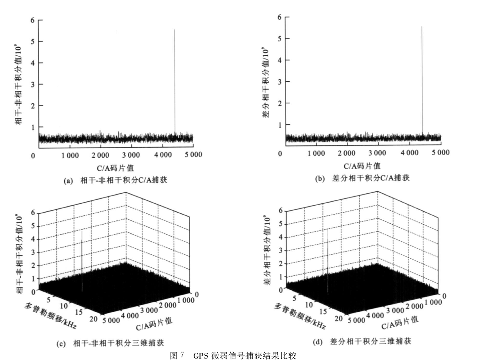
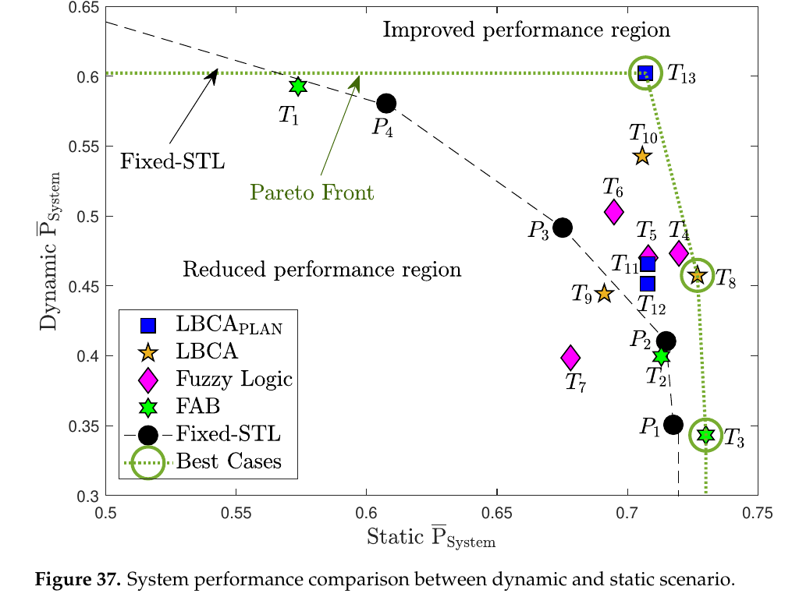
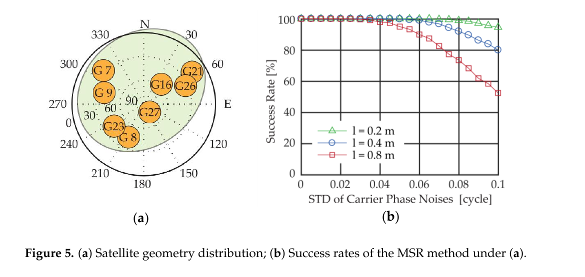

# 2026-08-04 GNSS 每日研究简报

## 今日快报

### 快报 1：用 PPS 同步全站仪直接检验无人机 RTK 与 PPK

- 主题：`uav-rtk-ppk-independent-ground-truth`
- 来源 ID：`doi:10.3390/s26154907`
- 来源链接：https://doi.org/10.3390/s26154907
- 发表日期：2026-08-03
- 来源类型：同行评审开放论文
- 获取范围：CC BY 4.0 全文、摘要与 PDF

**内容：** 研究把差分 GNSS、IMU 与 UTC 同步记录器集成到 VESTA 平台，并用 GNSS PPS 和受控移动的全站仪棱镜对齐两类时间序列。这样，RTK 与 PPK 不再只通过摄影测量成品间接比较，而是逐历元对照独立动态真值。试验同时保留解状态退化后的瞬态，因此评价对象包含名义精度和重新收敛。

**结论：** 在报告质量最优时，两者精度相近；但在该短基线数据和 RTKLIB-EX 配置下，PPK 在 GNSS 退化后更久停留于浮点或降级状态，瞬态误差大于实时 u-blox 解。作者据此强调，选择 RTK 或 PPK 不能只比较稳态厘米数，还要比较状态恢复。

**关注理由：** 它给低成本无人机测试提供了可迁移的“独立空间真值 + PPS 时间真值”基准，尤其适合查出平均 RMS 会掩盖的重收敛尾部。

### 快报 2：32 个 GNSS 站反演保加利亚陆地水储量

- 主题：`gnss-vertical-loading-terrestrial-water-storage`
- 来源 ID：`doi:10.1007/s12665-026-13067-0`
- 来源链接：https://doi.org/10.1007/s12665-026-13067-0
- 发表日期：2026-08-03
- 来源类型：同行评审开放论文
- 获取范围：CC BY-NC-ND 4.0 全文；只作非改编研究评论

**内容：** 作者对 2004—2025 年 32 个连续站的垂向位移做奇异谱分析，再用弹性 Green 函数和 Tikhonov 正则化反演等效水高，并与 GLDAS-Noah、GLWS、GRACE/GRACE-FO 对照。GNSS 反演的年振幅通常为 10—30 mm，局部超过 40 mm；月气候态在 2—4 月较高、8—10 月较低。

**结论：** GLDAS、GLWS 与 GRACE 的相关系数最高约 0.93，而 GNSS 反演与它们的一致性较弱。作者把差异主要归因于站网稀疏、非水文形变、不同观测物理与储量分量，而不是把 GNSS 结果包装成 GRACE 的等价替代品。

**关注理由：** 这是一则很好的反例：GNSS 垂向序列时间分辨率高，却必须经过空间反演才能变成水储量；正则化和非水文形变会进入最终产品的不确定度。

### 快报 3：一米定位误差为何要求纳秒级星载原子钟

- 主题：`gnss-atomic-clock-survey`
- 来源 ID：`doi:10.3390/atoms14080067`
- 来源链接：https://doi.org/10.3390/atoms14080067
- 发表日期：2026-08-02
- 来源类型：同行评审开放综述
- 获取范围：CC BY 4.0 全文、摘要与 PDF

**内容：** 综述从原子频率基准稳定本地振荡器的原理出发，比较 GPS、Galileo、GLONASS 与北斗已用的星载钟型，并延伸到 LEO-PNT。摘要给出一个直接尺度：光在 3 ns 内传播约 0.9 m，因此维持 1 m 级测距必须把相关时间不确定度压到约 3 ns 以下。

**结论：** 原子钟不是只服务于系统时间标签的后台器件；其稳定度通过卫星钟差直接进入伪距。文章同时指出新型钟与 LEO-PNT 是趋势，但综述证据不能替代具体星座在轨寿命、驯服策略和完好性统计。

**关注理由：** 它把“钟好一点”换算成接收机能感知的米和纳秒，适合作为卫星钟产品、PPP 收敛及多普勒定时研究的共同入口。

### 快报 4：GNSS-PWV 双分支 LSTM 提升 2—3 小时降雨召回

- 主题：`gnss-pwv-short-term-rainfall-forecast`
- 来源 ID：`doi:10.3390/geosciences16080309`
- 来源链接：https://doi.org/10.3390/geosciences16080309
- 发表日期：2026-08-02
- 来源类型：同行评审开放论文
- 获取范围：CC BY 4.0 全文、摘要与 PDF

**内容：** 模型把历史降雨放入一条 LSTM 分支，把 GNSS 反演 PWV、PWV 变化量、变化率和气温放入另一条分支；训练与测试数据来自台湾 18 个 GNSS—气象共址站的 2018—2019 年逐小时观测。对照组只使用历史降雨。

**结论：** 1—3 小时预报的准确率为 89%—91%、召回率为 88%—90%；在 2—3 小时提前量上，相对基线的召回率提升 6—11 个百分点、Threat Score 提升 4—8 个百分点。这里的“准确率高”仍需结合类别不平衡、独立年份和极端降雨分层检验。

**关注理由：** 这项工作展示了 GNSS 大气产品怎样进入业务模型，也提醒接收机到气象应用之间还隔着 ZTD/PWV 反演、共址质量控制和时间泄漏检查。

### 快报 5：改进 GNSS 速度场揭示大同盆岭分布式形变

- 主题：`gnss-intraplate-deformation-datong`
- 来源 ID：`doi:10.1093/gji/ggag308`
- 来源链接：https://doi.org/10.1093/gji/ggag308
- 发表日期：2026-07-31
- 来源类型：同行评审开放论文
- 获取范围：CC BY 4.0 全文、摘要与 PDF

**内容：** 研究把改进的 GNSS 速度场与弹性块体模型结合，分析华北大同盆岭远离板块边界的慢形变，并与地幔层析成像联系。作者报告多条断层共同容纳约 2 mm/yr 左旋剪切和约 1 mm/yr 西北—东南伸展，而不是由单一主断层吸收全部应变。

**结论：** 论文把分布式断层运动、块体旋转与大同下方低速异常联系起来，推测地幔上涌造成的热弱化会叠加印度—亚洲碰撞和太平洋板块回撤的远场应力。深浅耦合是物理解释，不等同于由 GNSS 单独证明因果。

**关注理由：** 毫米每年的速度看似小，却能改变活动构造危险性解释；这也是检验参考框架、共模误差和速度协方差是否被正确处理的代表案例。

## 深度研读

### 深读 1｜捕获｜从相干积累到差分相干：10 ms 频差损失与平方损失

- 类别：`acquisition`
- 学习层级：`foundation`
- 选题定位：`经典基础`
- 来源 ID：`doi:10.19818/j.cnki.1671-1637.2010.05.019`
- 来源链接：https://transport.chd.edu.cn/en/article/doi/10.19818/j.cnki.1671-1637.2010.05.019
- 发表日期：2010-10-25
- 来源类型：中文同行评审论文与期刊官网全文
- 获取范围：全文 HTML/PDF；期刊未标开放再许可，图 7 仅截取分析必需部分作研究评论
- 价值评分：96/100（相关性 20，经典价值 25，证据 18，教学价值 19，工程价值 14）

#### 为什么先学这个

捕获的本质不是“做一次 FFT 就找到卫星”，而是先把许多低于噪声底的同相样本加起来，再决定何时可以丢掉未知相位。相干积累、非相干积累和差分相干积累恰好对应三种证据保留程度：保留复相位、只保留能量、保留相邻块的相位差。它们决定灵敏度、对导航位翻转的容忍度和计算量。先把这三个积木弄清楚，后面学习 PCPS、辅助捕获或长码搜索时才知道“增益”究竟从哪里来、又在哪里损失。

#### 先修知识

只需知道复数基带、扩频码相关、白高斯噪声和载噪比。$`C/N_0`$ 的单位是 dB-Hz；换成线性量后单位为 Hz。相干时间 $`T_{coh}`$ 的单位为 s，理想相关后的单块信噪尺度由 $`(C/N_0)T_{coh}`$ 决定。GPS L1 C/A 码率为 1.023 Mcps，1 chip 约 977.5 ns、光程约 293 m；论文采样率 5 MHz，所以一个样本为 0.2 μs，约 0.2046 chip。捕获样本格不是最终伪距精度，DLL 会继续做亚码片跟踪。

#### 一句话逻辑

在码相位和多普勒假设正确时先做复数相干求和；当未知初相或数据位使不同块不能直接相加时，改为累加复幅度的平方，或把相邻复相关量共轭相乘后再累加，以换取相位鲁棒性，但必须接受平方损失、相邻块相关噪声和位翻转边界。

#### 研究问题与约束

设问题限定为 GPS L1 C/A、AWGN、一个静态或低动态接收机，搜索格内码率不变，单块内残余频差近似常数。论文仿真中中频为 21.25 MHz、采样率 5 MHz、真 C/A 码相位 903.0 chip、多普勒 57 Hz；比较条件为 $`C/N_0=34`$ dB-Hz、$`T_{coh}=10`$ ms、20 次后积累。10 ms 已长于一个 C/A 码周期，却短于 20 ms 导航数据位；若窗口跨位边界，理想增益会依窗口中正负码元比例下降。真实环境还会有振荡器相位噪声、码多普勒、量化、前端滤波、多径和干扰，本文图不能覆盖这些因素。

#### 核心方法论

接收信号与本地载波和本地 PRN 相乘，在一个候选码相位—频率格内得到第 $`k`$ 个复相关量 $`z_k=I_k+jQ_k`$。相干方法直接沿复平面相加，要求各块相位和数据符号一致；非相干方法求 $`|z_k|^2`$ 后相加，抛弃初相和符号；差分相干方法构造 $`z_kz_{k-1}^*`$，公共初相被消掉，只留下一个块间相位增量。后两者都允许跨块积累，但不是免费相干增益：能量统计量在低信噪比下有平方损失，差分统计量还把两个块的噪声相乘。

#### 关键公式逐步推导

把已下变频的一个 PRN 信号写成：

```math
r(t)=A d_k c(t-\tau) e^{j(2\pi\Delta f t+\phi)}+n(t)
```

$`A`$ 是复幅度，$`d_k\in\{-1,+1\}`$ 是第 $`k`$ 块的数据符号，$`c`$ 是无量纲扩频码，$`\tau`$ 以 s 计，$`\Delta f`$ 以 Hz 计，$`\phi`$ 以 rad 计。对候选延迟 $`\hat\tau`$ 和频率 $`\hat f`$ 积分：

```math
z_k=\int_0^{T_{coh}}r_k(t)c(t-\hat\tau)e^{-j2\pi\hat f t}dt
```

在单块内不跨数据位且码率误差可忽略时：

```math
z_k\approx A d_k T_{coh}R_c(\delta\tau)sinc(\pi\delta f T_{coh})e^{j\phi_k}+w_k
```

$`\delta\tau=\hat\tau-\tau`$，$`R_c`$ 是码自相关，$`\delta f=\Delta f-\hat f`$。这里 $`sinc(x)=sin(x)/x`$；功率损失是 $`sinc^2(\pi\delta fT_{coh})`$。当 $`T_{coh}=10`$ ms 时，残差 50 Hz 使 $`\pi\delta fT_{coh}=\pi/2`$，功率只剩约 $`(2/\pi)^2=0.405`$，即约 −3.92 dB；所以频格半间隔不能随意取大。

非相干统计量为：

```math
S_{nc}=\sum_{k=1}^{K}|z_k|^2
```

它对 $`\phi_k`$ 和 $`d_k`$ 不敏感，但噪声能量也始终为正，低信噪比下检测增益小于同总时长的理想相干积累。差分统计量可写成：

```math
S_{dc}=\sum_{k=2}^{K}Re\{z_kz_{k-1}^*\}
```

若相邻块无数据位翻转，信号项近似为 $`|A|^2T_{coh}^2cos(2\pi\delta fT_{coh})`$；无模糊频差区由余弦主瓣限定，且位翻转会把 $`d_kd_{k-1}`$ 变为 −1。工程实现可以取模、并行测试符号或已知导频，但必须重新推导门限，不能把差分统计量当作普通能量。

若一个相干窗口前 $`\alpha`$ 比例为 +1、后面为 −1，则幅度相对无翻转窗口近似乘 $`|2\alpha-1|`$；$`\alpha=0.5`$ 时完全抵消。这说明“10 ms 小于 20 ms”并不保证安全，窗口起点同样重要。

#### 经典价值与创新边界

经典价值在于揭示积累的三角关系：相干最有效但最挑相位，非相干最稳健但有平方损失，差分相干位于两者之间。论文把这些模块与 FFT 码搜索串成可实现的软件接收机，并给出同一条件下的数值比较。其创新边界也很清楚：今天的导频、二次码擦除、辅助数据、并行位假设和更严格的 GLRT 能做得更好；论文的经验“输出信噪比”不是标准检测概率，也没有以大量噪声试验给出固定虚警率。因此它适合教机制，不适合直接搬用门限。

#### 整体逻辑链

设置码相位与频率网格；每格擦除本地载波和 PRN；在 $`T_{coh}`$ 内复数求和；检查频差 sinc 损失和位边界；按已知信息选择复数相加、能量相加或相邻块共轭乘积；用噪声数据估计全搜索面的门限；峰值超过门限后输出粗码相位和频率；由 DLL/FLL/PLL 做二次确认；若短时锁定失败，回记为假捕获。只有最后的确认闭环完成，相关峰才变成可用观测链的起点。

#### 原文图表与结果分析



> 图源：上官伟等《GPS 微弱信号捕获跟踪算法》原文 Figure 7，[期刊全文页面](https://transport.chd.edu.cn/en/article/doi/10.19818/j.cnki.1671-1637.2010.05.019)。期刊页面未标开放再许可；此处仅保存 200 dpi 原页中 Figure 7 的最小完整裁片，未重绘、改字或改变坐标，限研究评论与定量核验。

上排横轴是 0—5000 的 C/A 码采样值，纵轴标作积分值除以 $`10^9`$，没有给伏特、计数或归一化单位；两种方法的峰都在约 4413 样本，基线噪声约为纵轴 0.3—0.7、峰约 5.5，说明峰很醒目，但不能跨接收机比较绝对幅值。以 5 MHz 采样换算，4413 样本对应约 902.9 chip，论文真值 903.0 chip，误差 −0.1 chip，等价粗光程约 −29 m；这只是捕获格误差，不是定位误差。

下排同时画 C/A 采样和“多普勒频移/kHz”轴，范围视觉上约 0—20 kHz。正文却说注入多普勒为 57 Hz，图中也没有标出峰的频率坐标，这是口径不一致：读者无法由图验证摘要所称小于 1.25 Hz 的频率误差。作者按去掉峰及周围 4 点后的面内均值定义噪声，得到相干—非相干 9.1 dB、差分相干 9.9 dB，即绝对提高 0.8 dB、线性功率比约提高 20%。这个自定义比值不是固定虚警率下的 $`P_d`$，也没有误差条，因此图只能证明该单次仿真中差分统计量的峰噪比较高，不能证明所有弱信号条件都稳定优 0.8 dB。

#### 原文结果论述

作者报告在 34 dB-Hz、10 ms 相干、20 次后积累条件下，两种方法都得到 4413 样本峰；差分相干的图内信噪比为 9.9 dB，相干—非相干为 9.1 dB。论文还声称仿真可捕获跟踪 25 dB-Hz 信号，并在摘要中给出频率误差小于 1.25 Hz、码误差小于 0.1 chip。前两个 Figure 7 数值可由正文和图互相核对；25 dB-Hz 检测率、频率误差分布与门限统计在图 7 中没有呈现，应保留为作者结论。

#### 常见误区与适用边界

第一，把积累次数翻倍直接写成 3 dB 检测增益，忽略统计量和门限不同。第二，只检查 $`T_{coh}`$ 是否短于数据位，不检查窗口是否跨边界。第三，用一条频率格覆盖 $`1/T_{coh}`$ 主瓣，却不限制最坏半格 sinc 损失。第四，差分共轭乘后忘记导航位翻转会改变符号。第五，把全二维最大峰与单格虚警率混为一谈。第六，把捕获采样格换算出的 29 m 当作最终伪距误差。第七，在 1 bit 量化、AGC 饱和、窄带干扰或多径下仍沿用 AWGN 标定。第八，把论文自定义峰噪比当成 $`C/N_0`$。

#### 工程实现步骤

1. 固定采样率、码周期、前端带宽和 FFT 长度，并记录每块是否跨数据位候选边界。
2. 依据振荡器误差和动态设置多普勒范围，再用允许的最坏 sinc 损失反推频格间隔。
3. 为每个 PRN 缓存本地码 FFT；每频格产生复相关行，保留 $`I_k,Q_k`$ 而不是过早取模。
4. 分别实现复相干、$`|z|^2`$ 非相干和 $`z_kz_{k-1}^*`$ 差分统计量，给每种统计量单独标定门限。
5. 输出最大峰、次峰、峰旁比、边界标志、累积方式和有效 $`T_{coh}`$。
6. 捕获后进入 FLL/DLL/PLL 确认；连续若干块锁定指标不通过则撤销捕获。

#### 复现实验设计

生成 GPS L1 C/A PRN，5 Msps、中频 1.25 MHz，真延迟 4413 样本；扫描 $`C/N_0=20,25,30,34,40`$ dB-Hz、$`T_{coh}=1,5,10,20`$ ms、后积累次数 1/5/10/20。残余频差取 0、0.25/$`T_{coh}`$、0.5/$`T_{coh}`$；数据位边界在窗口 0%、25%、50%、75% 处。噪声假设下每组做至少 100000 次以固定全网格虚警率 $`10^{-3}`$，含信号时做 10000 次估计检测率。报告检测率、错误峰率、码/频误差、乘加量和延迟；再加入 1/2/8 bit 量化、单音干扰和 0.3 chip 延迟多径。只有在相同全局虚警率下，9.9 dB 与 9.1 dB 的优势才有工程意义。

#### 与定位及低成本实现的联系

弱信号未捕获会减少卫星数并放大几何稀释，假峰则会把错误的码相位与多普勒送入跟踪和 PVT。差分或非相干积累可让低成本振荡器和有限算力接收机提高灵敏度，但长积累也增加 TTFF、内存和频格数。量产实现可以按辅助时间、星历和振荡器温度缩小搜索面，把节省的算力换成更多积累；门限仍须用真实前端噪声重标定。

#### 本节小结

相干积累保留最多信息，也最怕频差和位翻转；非相干积累用平方损失换相位鲁棒；差分相干利用相邻块的公共相位，但引入乘积噪声和块间符号问题。Figure 7 的 0.8 dB 是一个受条件约束的教学例子，真正可移植的是对 $`T_{coh}`$、频格、位边界和全局虚警的联合设计方法。

### 深读 2｜跟踪｜固定 PLL 带宽为何不能同时讨好弱信号与车载 jerk

- 类别：`tracking`
- 学习层级：`intermediate`
- 选题定位：`经典基础`
- 来源 ID：`doi:10.3390/s21020502`
- 来源链接：https://doi.org/10.3390/s21020502
- 发表日期：2021-01-12
- 来源类型：同行评审开放论文与硬件接收机试验
- 获取范围：CC BY 4.0 全文、数据说明、公式与原图
- 价值评分：98/100（相关性 20，经典价值 25，证据 20，教学价值 19，工程价值 14）

#### 为什么先学这个

捕获得到的频率和相位只是粗初值，PLL 必须逐块把 Prompt 相关器的相位误差变成 NCO 校正。最容易被忽略的参数是噪声等效带宽：窄带宽压低热噪声，却跟不上车辆 jerk 和振荡器漂移；宽带宽响应快，却把更多噪声送进相位。先研究固定带宽的这条一维折衷，再看自适应带宽，才能判断复杂算法究竟解决了什么，而不是把“自适应”当成必然更好。

#### 先修知识

需要理解负反馈、Prompt 复相关量 $`I_p+jQ_p`$、相位 rad、载波波长和 $`C/N_0`$。GPS L1 波长约 0.1903 m；相位误差 $`\delta\phi`$ 换成等效距离为 $`\lambda\delta\phi/(2\pi)`$。论文使用第三阶 Costas PLL、双象限反正切鉴别器、20 ms 相干积分和 50 Hz 输出率。噪声等效带宽 $`B`$ 单位 Hz，不等于更新率；归一化带宽 $`B_N=BT_{int}`$ 无量纲。

#### 一句话逻辑

PLL 带宽越窄，闭环对测量噪声的积分越小却对真实相位高阶变化滞后越大；带宽越宽则相反，所以固定 $`B`$ 在静态弱信号和高 jerk 场景之间形成不可同时最优的 Pareto 曲线。

#### 研究问题与约束

问题限定为已完成 FLL 拉入、已进入第三阶 Costas PLL 的 GPS L1 C/A 通道：把固定带宽从 5 Hz 增到 16 Hz，静态与高动态系统性能如何变化？试验由 Spirent GSS9000 生成 20 min 场景，$`C/N_0`$ 从 52 降到 24 dB-Hz、每 4 dB 一档，取最后 600 s；可见星最多 8 颗。动态场景以多颗卫星 LOS jerk 驱动。结论只对该 GOOSE 硬件、20 ms 积分、鉴别器、环阶和场景成立；对飞行器高旋转、不同振荡器、Galileo 导频或严重闪烁需重标定。

#### 核心方法论

每 20 ms 计算 Prompt $`I_p,Q_p`$，用双象限 $`atan(Q_p/I_p)`$ 得到数据位不敏感的局部相位误差，经第三阶 IIR 环路滤波器估计相位、频率与频率变化，再由 NCO 更新本地载波。固定带宽试验用 5、8、12、16 Hz；论文同时评价 FAB、模糊逻辑、LBCA 及其分段线性近似，但本节把它们作为对照，核心仍是固定 PLL 的经典静动折衷。

#### 关键公式逐步推导

在载波已接近锁定且 $`I_p`$ 未接近零时，鉴别器近似为：

```math
e_\phi[n]=atan\left(\frac{Q_p[n]}{I_p[n]}\right)\approx\phi_{in}[n]-\hat\phi[n]
```

$`e_\phi`$ 单位 rad；双象限局部无模糊范围约为 $`(-\pi/2,\pi/2)`$，导航位使 $`I,Q`$ 同时反号而比值不变。线性闭环可写成：

```math
H_c(z)=\frac{F(z)N(z)}{1+F(z)N(z)}
```

$`F(z)`$ 是环路滤波器，$`N(z)=T_{int}/(1-z^{-1})`$ 表示 NCO 积分。输入真实相位通过 $`1-H_c`$ 留下动态误差，鉴别器噪声通过 $`H_c`$ 进入估计；增大带宽会扩展 $`H_c`$ 的通带，动态残差下降、噪声方差上升。

论文把单块无偏相位估计的平方根 CRB 换成米：

```math
\sigma_{LB}=\frac{\lambda}{2\pi}\sqrt{\frac{1}{2T_{int}C/N_0}\left(1+\frac{1}{2T_{int}C/N_0}\right)}
```

这里 $`C/N_0`$ 必须用线性 Hz，$`T_{int}`$ 用 s；括号第二项是低信噪比的 squaring loss。取 $`T_{int}=0.02`$ s、$`C/N_0=30`$ dB-Hz 即 1000 Hz，得到 $`2T_{int}C/N_0=40`$，$`\sigma_{LB}`$ 约 4.8 mm。它是未平滑误差下界，不是最终载波观测 RMS。

双象限鉴别器的保守一倍标准差门限为：

```math
\sigma_{th}=\frac{1}{3}\frac{\pi}{4}\frac{\lambda}{2\pi}=\frac{\lambda}{24}
```

GPS L1 上约 7.9 mm。超过门限表示严重周跳或失锁风险上升，不是数学上必然失锁。系统指标把平均相位锁定指示器与被跟踪可见星比例相乘：

```math
P_{system}=\overline{PLI}\,\overline{N}_{sat}
```

它无量纲、范围接近 0—1；既惩罚单通道相位差，也惩罚星数丢失。

#### 经典价值与创新边界

固定 PLL 的价值是结构透明、算力低、稳定性可离线验证，至今仍是量产接收机的基线。论文的贡献是把多个自适应算法放进真实软硬件接口，在相同 RF 仿真下同时比较静态、动态和复杂度。边界在于 $`P_{system}`$ 是作者构造的综合指标，不是定位完整性或周跳概率；自适应算法也没有消灭物理折衷，只是在可观测的噪声与动态之间在线移动带宽。

#### 整体逻辑链

FLL 把残余频率拉进 PLL 范围；Costas 鉴别器测局部相差；环路滤波器按带宽在噪声与响应速度间取舍；NCO 反馈更新；PLI 和可见星数监控锁定；静态弱信号偏好窄带，高 jerk 偏好宽带；如果场景可识别，就估计均值代表动态、标准差代表噪声并在线调带宽；最终仍需用周跳、载波残差和 PVT 连续性验证。

#### 原文图表与结果分析



> 图源：M. L. García Crespillo 等《Evaluation of Adaptive Loop-Bandwidth Tracking Techniques in GNSS Receivers》原文 Figure 37，[Sensors 全文](https://doi.org/10.3390/s21020502)，CC BY 4.0。由 PDF 原页 200 dpi 渲染，仅裁出完整 Figure 37 与原 caption；未重绘、改轴或改变数据点。

横轴为静态平均 $`\overline P_{system}`$，纵轴为动态平均 $`\overline P_{system}`$，都无量纲。黑点 P1—P4 是固定 PLL：表 6 给出 5 Hz 的 P1 为 (0.718, 0.351)，8 Hz 的 P2 为 (0.715, 0.410)，12 Hz 的 P3 为 (0.675, 0.492)，16 Hz 的 P4 为 (0.608, 0.581)。从 5 增到 16 Hz，静态绝对下降 0.110，约 −15.3%；动态绝对提高 0.230，约 +65.5%。黑色虚线正是固定带宽的折衷基线，不存在一个同时位于右上角的固定点。

蓝方块 T13（LBCA 分段线性近似）约为 (0.707, 0.602)，在本场景中越过固定基线；但绿色 Pareto 线和“改进区”是基于这组候选及作者指标定义，不是普适稳定域。图没有给误差条、错误周跳数或位置误差，也没有分离各星几何权重，因此不能由 T13 的右上位置断言所有车辆定位都更安全。一个明显的图文边界是：横纵轴压缩在约 0.3—0.65 和 0.5—0.75，视觉距离会放大相对差异，必须回到表 6 报绝对数值。

#### 原文结果论述

作者指出静态场景中 5 Hz 固定 PLL 的平均系统性能最好，动态场景中 16 Hz 最好；固定带宽的最佳方向恰好相反。LBCA 的分段线性版本 T13 得到静态 0.707、动态 0.602，单次迭代约 92.8 ns，是标准滤波器的 1.5 倍；FAB 某些配置复杂度达 7.4 倍且未明显越过固定基线。这些是特定实现的作者结果，不能外推到不同 CPU、编译器或 RF 前端。

#### 常见误区与适用边界

第一，把环路带宽等同于输出更新率。第二，只以静态相位 RMS 调窄带宽，不做 jerk 或温漂应力。第三，把鉴别器 CRB 当闭环最终精度。第四，在失锁后继续把大误差解释成真实动态，导致自适应带宽冲到上限。第五，忽略 $`T_{int}`$ 与带宽共同决定离散稳定区；论文明确把带宽限制在 4.5—17.5 Hz。第六，把 PLI 接近 1 当成整周无错。第七，将 GPS L1 C/A 的 20 ms 结果直接套到导频或更长积分。第八，只比较平均性能，不检查尾部周跳、重捕获时间和错误载波观测。

#### 工程实现步骤

1. 固定相位误差正方向，向 NCO 注入 ±0.05 rad 验证反馈符号。
2. 保存每块 $`I_p,Q_p,e_\phi`$、滤波状态、NCO 频率、带宽、PLI 与 $`C/N_0`$。
3. 先用 8—15 Hz FLL/PLL 辅助拉入，确认位同步和载波锁定后才进入稳态带宽策略。
4. 用静态噪声估计鉴别器标准差，用滑动均值或 INS 预测残差估计动态；两者的窗口必须短于场景变化、长于相关噪声时间。
5. 对带宽设置上下限、变化率限幅和滞回；失锁状态禁止把鉴别器均值当动态。
6. 将周跳、载波残差和 PVT 可用星数作为独立验收，不只看算法内部指标。

#### 复现实验设计

用 GPS L1 C/A RF 仿真或同一组复采样数据，$`T_{int}=20`$ ms，固定第三阶 PLL 带宽 5/8/12/16 Hz；$`C/N_0`$ 取 24—52 dB-Hz、步长 4 dB。静态每组 600 s；动态注入 LOS 频率斜率和 jerk，使 5 Hz 环在高信噪比下也可能失锁。记录相位误差 mm、PLI、周跳、被跟踪星数、PVT 可用率和 CPU。再把 TCXO 频率随机游走放大 0.5/1/2 倍，并比较固定 5/16 Hz 与一个只在已锁定状态更新的带宽调度器。验收要求同时报告静态、动态和切换瞬态，不能只挑最优段。

#### 与定位及低成本实现的联系

载波相位 1 mm 误差在 L1 上约 0.033 rad；周跳则是整波长级突变，会直接破坏 RTK/PPP 模糊度连续性。低成本 TCXO 的漂移迫使最小带宽不能为零，车辆 jerk 又抬高最大带宽需求。若有 IMU，可把可预测动态前馈给 NCO，让 PLL 带宽主要对付未建模误差；这比盲目加宽更省噪声，但杆臂、时延和 IMU 偏置会成为新误差源。

#### 本节小结

固定带宽不是“调到一个最好值”就结束：5 Hz 在论文静态指标领先却在动态最差，16 Hz 正好相反。自适应带宽的真正价值是沿着噪声—动态折衷在线移动，而不是突破估计理论；任何右上角改进都必须带着场景、环阶、积分时间、复杂度和周跳验证一起解释。

### 深读 3｜定位｜低成本超短基线航向：MSR 无伪距整周搜索的成功率—精度矛盾

- 类别：`positioning`
- 学习层级：`advanced`
- 选题定位：`定位深入`
- 来源 ID：`doi:10.3390/s18072114`
- 来源链接：https://doi.org/10.3390/s18072114
- 发表日期：2018-07-01
- 来源类型：同行评审开放论文与低成本硬件试验
- 获取范围：CC BY 4.0 全文、公式、仿真、静动态实验与原图
- 价值评分：99/100（相关性 20，经典价值 24，证据 20，教学价值 20，工程价值 15）

#### 为什么先学这个

前两节解决“信号能否被找到”和“载波能否持续锁住”；现在把两副天线的载波相位差变成航向。超短基线有一个反直觉矛盾：基线越长，整周固定后角度精度通常越高；但论文的无伪距 MSR 搜索在相同相位噪声下，较长基线反而更容易选错整周。理解这个“固定成功率”和“固定后精度”分离，是设计低成本双天线罗经的关键。

#### 先修知识

需要 ECEF/ENU、卫星视线单位向量、单差/双差、载波相位 cycle、整数模糊度和最小二乘。两天线固定在刚体上，基线向量 $`\mathbf b=[b_E,b_N,b_U]^T`$，长度 $`l=\|\mathbf b\|`$ 已标定；航向可按 $`\psi=atan2(b_E,b_N)`$ 定义，范围可取 $`(-\pi,\pi]`$，俯仰由 $`atan2(b_U,\sqrt{b_E^2+b_N^2})`$ 给出。角度正方向必须与设备坐标系约定一致。

#### 一句话逻辑

把已知长度的基线限制在一个球面上，用每组双差载波相位的“小数周”形成一族候选圆面；遍历球面候选点，选择所有几何双差与实测小数周余数最一致的 MSR 谷，再恢复整数模糊度和基线方向。

#### 研究问题与约束

论文针对低成本接收机伪距噪声大、传统 LAMBDA 浮点模糊度难收敛的问题，只用载波相位和已知基线长度做单历元搜索。短基线假设同历元两天线的卫星钟、接收机共同时钟、大气和轨道误差经双差近似消除；天线必须刚性固定、相位中心稳定且时间同步。图 5 的仿真使用 7 颗 GPS 卫星、正常天空几何、每个噪声—基线组合 5000 次，载波相位噪声标准差 0—0.1 cycle，基线 0.2/0.4/0.8 m。它不包含持续周跳、天线互耦、硬件通道间偏差或城市 NLOS。

#### 核心方法论

对参考星 $`i`$ 和另一星 $`j`$，两天线间双差几何距离近似为视线差 $`(\mathbf e_j-\mathbf e_i)^T\mathbf b`$。实测载波相位的小数部分告诉我们这个投影除以波长后应落在哪个整数周附近，却不直接告诉整数是多少。已知 $`l`$ 后，$`\mathbf b`$ 只能落在半径为 $`l`$ 的球面；枚举航向/俯仰候选，对每颗星计算“几何周数减实测小数周”的最近整数余数，所有余数最小的候选就是最可能的交点。这样绕开了米级伪距对浮点模糊度的污染。

#### 关键公式逐步推导

双差载波观测以 cycle 表示：

```math
\nabla\Delta\Phi^{ij}=\frac{(\mathbf e_j-\mathbf e_i)^T\mathbf b}{\lambda}+\nabla\Delta N^{ij}+\varepsilon^{ij}
```

$`\mathbf e_i,\mathbf e_j`$ 无量纲，$`\mathbf b`$ 和波长 $`\lambda`$ 用 m，$`\nabla\Delta N`$ 为整数 cycle，$`\varepsilon`$ 为 cycle。对候选 $`\mathbf b_k`$，定义包裹到最近整数周的余数：

```math
v_k^{ij}=rem\left(\frac{(\mathbf e_j-\mathbf e_i)^T\mathbf b_k}{\lambda}-\nabla\Delta\widetilde\Phi^{ij}\right)
```

$`rem(x)`$ 取到约 $`[-0.5,0.5)`$ cycle，$`\nabla\Delta\widetilde\Phi`$ 是观测小数部分。把所有参考星对组成向量：

```math
MSR_k=\|\mathbf v_k\|_2^2
```

论文正文把目标称为 mean square residual，但排版公式写作 $`\|\mathbf v_k\|_2`$，没有明确平方和除以观测数；实现时必须固定到底比较 2 范数、平方和还是均方。对同一历元候选排序，单调变换不改最小点；跨星数设门限时口径会改变，不能忽略。

整数由最近周恢复：

```math
\widehat{\nabla\Delta N}^{ij}=round\left(\frac{(\mathbf e_j-\mathbf e_i)^T\mathbf b_k}{\lambda}-\nabla\Delta\widetilde\Phi^{ij}\right)
```

为保证最近候选与真值的单差几何周偏差小于 0.125 cycle，论文给出角网格上限：

```math
\Delta\theta<\frac{0.25\lambda}{l},\qquad
\Delta\psi<\left|\frac{0.25\lambda}{l\cos\theta}\right|
```

角度用 rad。GPS L1 $`\lambda\approx0.1903`$ m、$`l=0.267`$ m 时，$`\Delta\theta<0.178`$ rad，约 10.2°；这只是避免整周错配的充分网格上限，不是航向输出分辨率。固定整周后，一阶航向误差近似：

```math
\sigma_\psi\approx G\frac{\lambda\sigma_\Phi}{l\cos\theta}
```

$`G`$ 是卫星几何和双差相关性形成的无量纲因子，$`\sigma_\Phi`$ 为 cycle。这个式子显示固定正确后长基线降低角误差；Figure 5 则显示搜索阶段长基线的局部谷更多、整周成功率可下降，两者并不矛盾。

若残差协方差不等方差，定位模型应使用：

```math
J_k=\mathbf v_k^T\mathbf W\mathbf v_k,\qquad \mathbf W=\mathbf R_v^{-1}
```

参考星参与所有双差，$`\mathbf R_v`$ 非对角；直接令 $`\mathbf W=\mathbf I`$ 会重复计算参考星噪声。数值上应 Cholesky 白化，病态时用 SVD/QR 并监控条件数。

#### 经典价值与创新边界

双天线载波航向的经典价值是绝对、无漂移、低成本；基线长度约束把三维位置搜索变成二维球面搜索。论文的工程创新是用载波小数周 MSR 绕开低成本伪距，并给出接受检验和 INS 融合。边界是球面穷举数量约随 $`(l/\lambda)^2`$ 增长，基线变长后既增算力又出现更多可混淆谷；多频、多星座、C-LAMBDA 或流形优化在更大阵列上更合适。MSR 最小也不等于正确，必须有次谷比、基线闭合和时间连续性检验。

#### 整体逻辑链

同步两接收机并选参考星；形成双差载波小数周；用标定长度和可选 INS 俯仰生成球面/圆周候选；对每点计算包裹余数与加权代价；寻找最小和次小“谷”而不是相邻像素；用次谷比、基线长度和俯仰先验验收；恢复整周并以固定解重算基线；由 ENU 基线算航向/俯仰；将残差、条件数和正确固定概率送入滤波器；不通过则保持 INS 短时外推而不输出伪固定航向。

#### 原文图表与结果分析



> 图源：W. Li 等《A Low-Cost INS-Integratable GNSS Ultra-Short Baseline Attitude Determination System》原文 Figure 5，[Sensors 全文](https://doi.org/10.3390/s18072114)，CC BY 4.0。由 PDF 原页 200 dpi 渲染，仅裁出完整 Figure 5 与原 caption；未改变天空图、坐标、曲线或图例。

左图是卫星天空图：方位 0—360°、仰角由外圈 0° 向中心 90°，7 颗 GPS 分布在东、西两侧及南部，几何不算极端聚集。右图横轴是双差载波相位噪声标准差 0—0.1 cycle，纵轴是 5000 次试验中整数固定正确率 0—100%。直接读图：噪声约 0.04 cycle 前三条曲线都接近 99%—100%；到 0.06 cycle，0.2/0.4/0.8 m 约为 100%/98%/91%；到 0.1 cycle 约为 96%/80%/52%。在 L1 上 0.1 cycle 约 19 mm，0.8 m 曲线相对 0.2 m 低约 44 个百分点，错误风险从约 4% 增至约 48%，不是“小幅精度退化”。

参数影响呈非线性拐点：0.8 m 在 0.05 cycle 后快速下降，0.4 m 约在 0.06—0.07 后明显下降，0.2 m 到 0.08 后才缓慢下降。图只给这一正常几何；正文 Figure 6 明确指出极差几何下 0.2 m 反而可能低于 0.4 m，因此“越短越易固定”不是普遍单调律。图也没有角度误差轴、错误固定航向大小或置信区间，不能证明 0.2 m 航向精度优于 0.8 m；它只支持特定 MSR 搜索的整周成功率结论。

#### 原文结果论述

作者在正常几何仿真中观察到相位噪声越大成功率越低，且短基线整体更易用 MSR 找到正确交点；在只有 5 星且集中北天的差几何中，短基线不再必然更好。实机开阔环境使用 0.267 m 基线、6 颗 GPS，双差伪距噪声标准差 0.70—1.07 m，而双差载波小于 0.013 cycle；MSR 固定成功率 100%，航向和俯仰标准差为 0.42°、0.68°。多径环境中，Table 4 报告 MSR 全部历元成功率 91.48%，传统 LAMBDA 仅 1.04%；这是一组特定设备和接受门限结果，不代表通用错误固定概率。

#### 常见误区与适用边界

第一，把“短基线固定率高”误写成“短基线航向更准”。第二，把最小像素与次小像素的比当作两个独立谷的比；邻居可能属于同一谷。第三，忽略双差共享参考星导致残差相关。第四，在 NLOS 下仍假设大气和多径都由短基线消除。第五，把已知机械长度当作永远不变，忽略热胀、安装挠曲和天线相位中心。第六，不处理航向在 ±180° 的环绕。第七，在俯仰接近 ±90° 时仍用 $`1/\cos\theta`$ 的航向线性化。第八，以次谷比通过替代外部航向或时间连续性验证。第九，在不同可见星数之间直接比较未归一化 MSR。

#### 工程实现步骤

1. 用测量臂标定基线长度、ENU/车体系方向、两通道固定相位偏置和时间延迟。
2. 每历元按仰角、$`C/N_0`$、锁定时长和周跳状态选星；参考星切换时保持双差整数的一致变换。
3. 由 $`0.25\lambda/l`$ 给初始球面网格，先粗搜局部谷，再在每个谷内细化，避免全局超细网格。
4. 对包裹残差做协方差白化；保存最小谷、次谷、谷间比、条件数和基线闭合差。
5. 通过验收后恢复整数，以固定载波加权最小二乘重算 $`\mathbf b`$，再算航向/俯仰及协方差。
6. 用 IMU 只做搜索域压缩和短时保持；GNSS 恢复时做创新检验，禁止错误固定硬拉 INS。
7. 输出 fix-valid、估计正确固定概率、航向标准差和失效原因，而不是只输出一个角度。

#### 复现实验设计

先复现 Figure 5：7 星采用原图近似方位/仰角，L1 波长，基线 0.2/0.4/0.8 m，真航向均匀 0—360°、俯仰 −20—20°，双差相位高斯噪声 0—0.1 cycle，每点至少 5000 次；报告正确固定率、错误航向 95/99% 分位、运行时间和候选数。再把星集中到北天、逐步移除到 5/4 星，检验非单调现象。硬件试验用同一对低成本接收机在 0.2/0.4/0.8 m 可调刚性梁上采 24 h 开阔、树旁和墙旁数据，以测地接收机或全站仪给真航向；注入 1 cycle 周跳、参考星切换、5 ms 时间错位和 5 mm 长度误差。验收必须同时看正确固定率与固定后角度 RMS，不能用其中一个替代另一个。

#### 与定位及低成本实现的联系

双天线航向可在静止时给车辆、无人机和基站绝对方位，补足单天线速度航向在低速时不可观。低成本模块的伪距可能是米级，MSR 只用载波让单历元整周仍有机会固定；但相位多径、硬件偏置和少星几何会制造错误谷。工程设计应把更长基线带来的角度精度收益，与更高候选数、安装成本和整周风险一起优化；有 IMU 时，窄化搜索域通常比盲目缩短基线更划算。

#### 本节小结

MSR 方法把已知基线球面与载波小数周交会，绕开低成本伪距，却没有绕开整数可靠性。Figure 5 说明在同一正常几何和相位噪声下，0.8 m 的搜索成功率可比 0.2 m 低数十个百分点；误差传播又说明固定正确后长基线更精确。可靠双天线航向必须同时报告“能否固定、是否固定正确、固定后多准”三件事。
