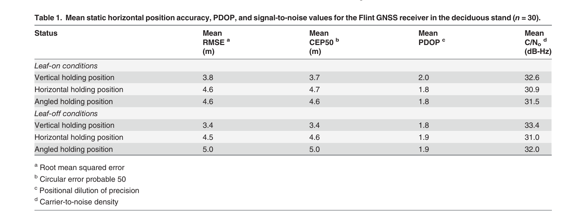
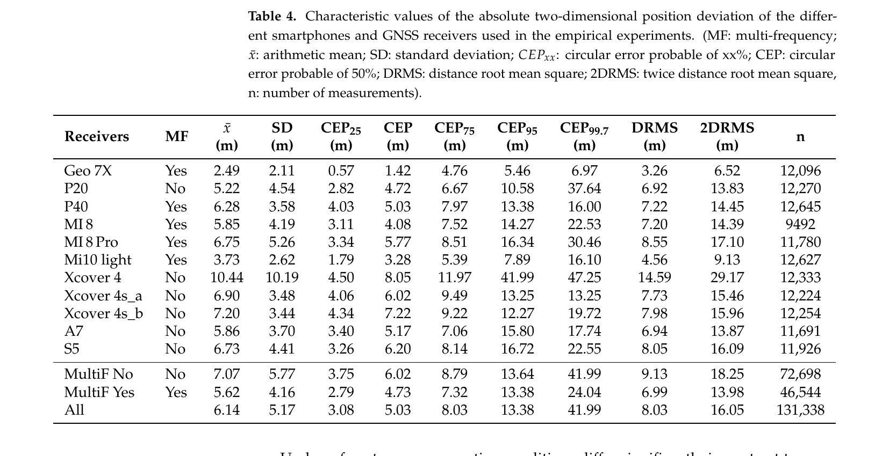
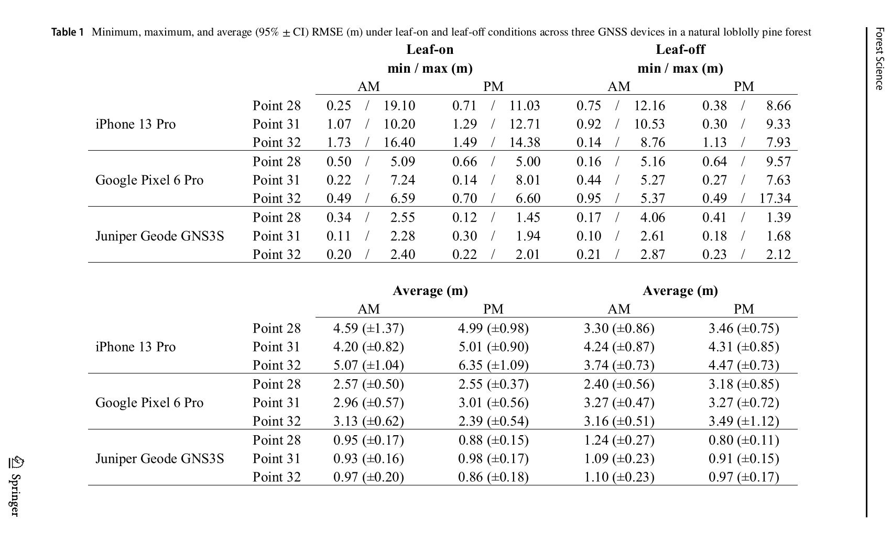

# 2026-08-05 GNSS 每日研究简报

## 今日快报

### 快报 1：多频相关器几何填补城市多路径检测盲区

- 主题：`multifrequency-correlator-multipath-detection`
- 来源 ID：`doi:10.1038/s44459-026-00064-9`
- 来源链接：https://doi.org/10.1038/s44459-026-00064-9
- 发表日期：2026-08-04
- 来源类型：同行评审开放论文；同时核验作者 CC BY 4.0 预印本与开放代码
- 获取范围：正式论文元数据、完整预印本、公式、仿真与实车结果

**内容：** 作者只使用接收机已有的 Early/Prompt/Late 六路 I/Q 相关器输出，构造单频互积面积 CPA，再把不同频点归一化、旋转到固定扇区并累加为 MF-CPA。无多路径假设下给出统计量分布和固定虚警率门限；验证包括陆家嘴三维场景的 Spirent Sim3D 硬件在环与同区域 2.7 km 实车数据。

**结论：** 仿真中 GPS、北斗和 Galileo 的多频组合通常达到约 50%—80% 检出率、误检率为几个百分点；不同码率与载频的盲区互补。作者也报告一个反例：GPS 多频组合约 63% 检出率，低于最强 L5Q 单频约 83%，但误检和空间断裂更少。实车结果只能证明检测空间形态与仿真相符，不能在没有逐样本独立真值时直接当作 80% 实测准确率。

**关注理由：** 该方法不改射频前端和环路结构，直接把现有相关器遥测变成可解释的多路径监视量；对量产多频芯片而言，工程门槛比专用阵列或环境依赖分类器低。

### 快报 2：模型失配门控抑制 Sage–Husa 过度自适应

- 主题：`dual-adaptive-sage-husa-gnss-ins`
- 来源 ID：`doi:10.3390/s26154925`
- 来源链接：https://doi.org/10.3390/s26154925
- 发表日期：2026-08-04
- 来源类型：同行评审开放论文
- 获取范围：CC BY 4.0 全文、开放车载数据说明、公式与多场景对照

**内容：** 论文把遗忘因子全局递推与自适应滑窗局部估计组合起来更新测量噪声协方差，并增加模型匹配检验与协方差上界。目的不是让滤波器对所有创新都快速增大 $`R`$，而是先区分 GNSS 观测噪声突变与车辆急加减速、转弯造成的动力学模型失配，避免传统 Sage–Husa 把后者错误吸收到测量噪声中。

**结论：** 在作者的高动态叠加瞬时 GNSS 干扰场景中，相对传统 Sage–Husa，上方向 RMS 降低 8.5%；持续弱观测场景中，北向 RMS 相对 EKF 与传统 Sage–Husa 分别降低 8.7% 与 2.5%，上方向相对传统 Sage–Husa 降低 15%。这些是给定 RTK/INS 数据、传感器和调参下的相对结果，不是城市峡谷通用百分比。

**关注理由：** 自适应滤波最危险的失败不是“不够自适应”，而是把模型错误当成噪声统计；这项工作把诊断门控放在协方差更新前，适合检查车载紧组合中的发散和恢复过程。

### 快报 3：几何感知回归在受控条件下桥接 30 分钟载波相位缺口

- 主题：`geometry-aware-carrier-phase-gap-prediction`
- 来源 ID：`doi:10.5194/isprs-archives-xlix-b4-2026-377-2026`
- 来源链接：https://doi.org/10.5194/isprs-archives-XLIX-B4-2026-377-2026
- 发表日期：2026-08-04
- 来源类型：同行评审开放会议论文
- 获取范围：CC BY 4.0 全文、数据流程、参数、表格与误差结果

**内容：** 研究用 TORI 永久站 24 h Galileo 数据、GFZ 最终轨道钟差与无电离层组合，迭代去除接收机钟、对流层和模糊度后注入 60—1800 s 的 1045 个合成缺口。三/五阶多项式、傅里叶增强多项式、带卫星高度角/方位角特征的梯度提升回归和高斯过程被置于同一上下文窗口比较。

**结论：** 几何感知梯度提升在 60 s、5 min、15 min 和 30 min 缺口的平均 RMS 分别为 4.4、9.4、14.4 和 21.4 mm；30 min 时与三阶多项式的 20.3 mm 基本相当，傅里叶外推则增至 151.1 mm。所有输入是测地级静态站、30 s 降采样和合成缺口，因此“低于 Galileo E1 半波长约 95 mm”是修复可行性的受控基线，不是手机实测结论。

**关注理由：** 结果说明机器学习只有在几何、钟差和对流层等确定项先被物理模型剥离后才更容易学到可外推的小残差，也给载波断裂修复提供了明确失败对照。

### 快报 4：600 欧元高山站能做厘米 RTK，也会产生隐蔽错固定

- 主题：`low-cost-alpine-rtk-ztd-reliability`
- 来源 ID：`doi:10.5194/isprs-archives-xlix-b5-2026-57-2026`
- 来源链接：https://doi.org/10.5194/isprs-archives-XLIX-B5-2026-57-2026
- 发表日期：2026-08-04
- 来源类型：同行评审开放会议论文
- 获取范围：CC BY 4.0 全文、RTKLIB 配置、六时段结果与 PPP 对流层产品

**内容：** 意大利 Prali 海拔约 2200 m 的站点采用 u-blox ZED-F9P、宽带低成本天线和 Raspberry Pi，总硬件成本低于 600 欧元。作者用专业 SPIN3 网络 VRS 改正，按六个互相重置的 2 h 前向动态会话模拟实时 RTK；另用 CSRS-PPP 最终产品估计 12 h ZTD。

**结论：** 夜间和下午固定率分别为 97.1% 与 89.7%，正确固定历元的水平精度为 8.2—11.2 mm；但全部 Q=1 解中有 9.9% 相对参考坐标偏差超过 50 mm，使可靠固定率由 63.7% 降至 57.4%。PPP 得到平均 ZTD 1811.2 mm、时间标准差 5.1 mm，平均 ZWD 40.8 mm；尚缺长期独立气象/测地级同址验证。

**关注理由：** 它同时给出“廉价硬件能到多准”和“状态标成 fixed 仍可能错”的两面证据；后者比只报告固定率更接近无人机、农业和监测系统的风险。

### 快报 5：尼日利亚 14 天低成本 SPP 中 GPS+北斗降低约 14% 误差

- 主题：`gps-beidou-low-cost-spp-nigeria`
- 来源 ID：`doi:10.1007/s44291-026-00260-5`
- 来源链接：https://doi.org/10.1007/s44291-026-00260-5
- 发表日期：2026-08-04
- 来源类型：同行评审开放论文
- 获取范围：CC BY-NC-ND 4.0 全文；只作非改编研究评论

**内容：** 作者在尼日利亚 Ogbomoso 用 u-blox ZED-F9P 以 4 Hz 连续观测 14 天，使用 RTKPOST 比较 GPS、北斗与 GPS+北斗 SPP。GPS 每历元可见星为 6—11 颗、日均 8.22±0.05；北斗为 4—8 颗、日均 6.05±0.11，但北斗平均高度角 29.06°，高于 GPS 的 25.71°。

**结论：** 组合解的平均 2DRMS、CEP、SEP 和 MRSE 分别为 3.93、1.64、3.66 和 4.83 m；相对 GPS 单系统分别改善约 14%，相对该数据中的北斗单系统改善约 46%—49%。单站、单接收机、2025 年 5 月的开放环境不能分离星座几何、系统间钟差建模、天线与当地电离层的贡献。

**关注理由：** 多星座收益不是“卫星数越多越好”的口号；该数据展示了 GPS 的稳定可见性和北斗较高仰角如何在同一低成本 SPP 中形成互补，同时保留了米级绝对误差边界。

## 深度研读

### 深读 1｜接收机工程｜手机拿法不是姿势问题：天线方向图、人体遮挡与米级偏差

- 类别：`receiver-engineering`
- 学习层级：`foundation`
- 选题定位：`经典基础`
- 来源 ID：`doi:10.1371/journal.pone.0124696`
- 来源链接：https://doi.org/10.1371/journal.pone.0124696
- 发表日期：2015-04-29
- 来源类型：同行评审开放论文与受控林地试验
- 获取范围：CC BY 4.0 全文、原始表格、统计方法与结果
- 价值评分：97/100（相关性 20，经典价值 25，证据 19，教学价值 19，工程价值 14）

#### 为什么先学这个

手机或手持接收机的“天线”不是理想各向同性点。设备内部天线有方向图、极化与机壳耦合，手和身体又会吸收、遮挡并反射 L 波段信号。若测试时设备姿态不固定，观测噪声、可见星集合与多路径会一起改变，后续再精巧的加权或滤波也无法判断误差来自算法还是拿法。本节先用一个简单受控试验把天线—人体—环境链条钉住。

#### 先修知识

需要理解平面坐标误差、RMSE、CEP50、PDOP 和 $`C/N_0`$。$`C/N_0`$ 单位为 dB-Hz，描述载波功率与噪声谱密度之比；PDOP 无量纲，只表示几何放大，不包含多路径和天线方向图。RMSE 与 CEP50 都以 m 计，但前者受大误差平方影响更强，后者是经验径向误差的中位半径。

#### 一句话逻辑

改变设备姿态会改变天线相对天空、人体与树冠的增益和极化响应，从而改变各卫星观测的有效权重与多路径；即使 PDOP 相近，最终水平误差仍可能变化。

#### 研究问题与约束

论文使用 Flint 映射级 GNSS 接收机，在美国佐治亚州的落叶林与针叶林控制点比较竖直、水平和倾斜三种手持姿态，并区分 leaf-on 与 leaf-off。每个表格单元 $`n=30`$，还记录 PDOP、卫星数、$`C/N_0`$ 和气象量。它研究的是单款映射级设备和特定林地，不是现代手机射频结构的直接标定；“竖直更好”也不是所有机型的普适方向。

#### 核心方法论

对每次访问得到的水平位置与已知控制点作距离误差，分别汇总 RMSE 与 CEP50；在相同林型和季节内比较三种姿态，并用 t 检验检查差异。与此同时观察 PDOP 与平均 $`C/N_0`$ 是否足以解释误差。关键设计是把姿态作为实验因子，而不是在数据采完后靠滤波器猜测。

#### 关键公式逐步推导

已知控制点为 $`(x_0,y_0)`$，第 $`i`$ 个解为 $`(x_i,y_i)`$，径向误差：

```math
r_i=\sqrt{(x_i-x_0)^2+(y_i-y_0)^2}\quad [m]
```

样本 RMSE 为：

```math
RMSE=\sqrt{\frac{1}{n}\sum_{i=1}^{n}r_i^2}
```

CEP50 是满足 $`Pr(r\le CEP_{50})=0.5`$ 的经验分位数。若线性化伪距模型为 $`\delta\rho=G\delta x+\epsilon`$，加权最小二乘协方差近似为：

```math
Q_{\hat x}=(G^TWG)^{-1}
```

姿态变化会进入 $`W`$：某方向天线增益下降、极化失配或人体遮挡会降低该星的 $`C/N_0`$ 并增大测距方差；反射路径还会产生非零均值偏差，所以仅由 $`G`$ 算出的 PDOP 不足以预测 RMSE。

#### 经典价值与创新边界

经典价值在于把“使用方式”提升为可重复的接收机误差源，并用同一控制点、姿态和季节做分层比较。创新边界是显著性并不强：在 $`\alpha=0.05`$ 下，12 组以竖直姿态为核心的比较中只有 leaf-off 落叶林竖直对倾斜达到显著，论文因此只称“弱到中等证据”。表中均值差可用于工程假设，不能包装成确定因果。

#### 整体逻辑链

固定控制点与设备；定义三种姿态；跨季节重复采样；计算每次水平误差；汇总 RMSE/CEP50；同步检查 PDOP 与 $`C/N_0`$；对姿态差异做统计检验；若均值差存在而几何相近，则把天线方向图、遮挡和多路径列为候选机制；换机型前重新标定。

#### 原文图表与结果分析



> 图源：Weaver 等《How a GNSS Receiver Is Held May Affect Static Horizontal Position Accuracy》Table 1，[PLOS ONE 原文](https://doi.org/10.1371/journal.pone.0124696)，CC BY 4.0。由原 PDF 第 8 页以 200 dpi 渲染后仅裁出表题、表体和脚注；未重绘、改字或改变数值。

落叶林 leaf-on 时竖直/水平/倾斜 RMSE 为 3.8/4.6/4.6 m，leaf-off 为 3.4/4.5/5.0 m；同一行 CEP50 几乎复现该排序。PDOP 仅在 1.8—2.0 之间，而平均 $`C/N_0`$ 的竖直姿态为 32.6 与 33.4 dB-Hz，高于水平姿态的 30.9 与 31.0 dB-Hz。表直接显示的是相关变化：竖直姿态均值更小且信号强度略高；它没有单星天线方向图、原始伪距或多路径真值，因此不能证明 1—1.6 m 差异全部由天线造成。

#### 原文结果论述

作者在落叶林观察到竖直姿态相对其他姿态最多约 1.5 m 的平均 RMSE 优势，针叶林最多约 1 m；但严格 $`p<0.05`$ 的姿态差异很少，放宽到 $`p<0.10`$ 才有更多组合。论文据此给出审慎结论：手持姿态可能影响静态水平精度，证据为弱到中等；季节和林型的证据更弱。

#### 常见误区与适用边界

第一，把竖直姿态当成所有手机的最佳姿态。第二，看到 PDOP 相近就断言误差应相近。第三，把平均 $`C/N_0`$ 提升直接换算成米级精度提升。第四，忽略姿态会同时改变人体遮挡和反射几何。第五，以一次最小误差代表可重复精度。第六，用 CEP50 掩盖长尾，或用 RMSE 忽略样本量。第七，把 $`p<0.10`$ 与 $`p<0.05`$ 混为一谈。

#### 工程实现步骤

1. 查明或实测设备 GNSS 天线位置，规定屏幕朝向、俯仰、方位和距人体距离。
2. 在已知控制点用夹具重复三到六个姿态，每姿态保存原始观测和 PVT。
3. 按卫星记录 $`C/N_0`$、仰角、使用状态、伪距残差和历元解状态。
4. 同时报告 CEP50、CEP95、RMSE、最大误差和失解率。
5. 用分层模型或配对检验隔离日期、几何和姿态，避免把不同时段直接相减。
6. 将验出的最佳姿态写进采集 SOP，并在换机型、外壳或握持附件后重测。

#### 复现实验设计

选开阔地、落叶林和建筑边各一个测量控制点；测试两款手机与一款外接天线。姿态取竖直、水平屏幕向上、45°、贴胸与离体 0.5 m，方位按北/东/南/西轮换。每组合做 30 次独立访问，每次冷启动后等待 2 min，记录 60 s、1 Hz 原始 GNSS 与 PVT。指标为 RMSE、CEP50/95、最大误差、可用星、$`C/N_0`$、残差和首次定位时间；基线为固定天线架。失败条件包括 AGC 饱和、辅助定位混入、设备热降频和无法确认天线位置。

#### 与定位及低成本实现的联系

低成本接收机不能靠更大天线、扼流圈和稳定相位中心兜底，姿态标准化就成为近乎零成本的质量控制。它既可改善单点定位的权重一致性，也能减少手机 RTK/PPP 中随手势变化的相位突跳。若产品必须支持自然手持，应把姿态、人体距离或屏幕方向作为质量标志，而不是假设用户始终按实验室姿态操作。

#### 本节小结

手持姿态通过天线方向图、极化、人体遮挡和多路径进入观测权重与偏差；PDOP 无法覆盖这条链。原文给出的不是“竖直必胜”，而是一个应被每款设备重新验证的工程假设。

### 深读 2｜低成本移动端｜多频不等于必胜：林下手机的 DRMS、长尾与个体差异

- 类别：`low-cost-mobile`
- 学习层级：`intermediate`
- 选题定位：`基础进阶`
- 来源 ID：`doi:10.3390/s22031289`
- 来源链接：https://doi.org/10.3390/s22031289
- 发表日期：2022-02-09
- 来源类型：同行评审开放论文与多设备林下静态试验
- 获取范围：CC BY 4.0 全文、原始表格、设备配置与统计结果
- 价值评分：98/100（相关性 20，经典价值 24，证据 20，教学价值 20，工程价值 14）

#### 为什么先学这个

上一节说明姿态会改变一台设备的表现；下一步要问，多频、多星座和更新硬件能否稳定消除林下误差。最容易犯的错误是把“支持 L5/E5”直接等同于更准。该研究把 10 款手机与修正型 Geo 7X 放到 15 个林下已知点重复采样，结果同时给出平均收益和巨大的机型差异，适合学习怎样从设备规格走向误差分布。

#### 先修知识

需要理解多星座增加可见星与几何冗余，多频可构造电离层组合并提供不同码率/多路径响应；但手机是否真正把每个频点用于最终 PVT 取决于芯片、天线、固件和系统 API。还需区分样本均值、标准差、CEP 分位数、DRMS 与 2DRMS。

#### 一句话逻辑

多频在总体上能增加林下可用信息并降低误差，但天线、固件选星、同型号个体差异和长尾会主导单机表现，所以频点数量只能作为候选解释，不能作为精度保证。

#### 研究问题与约束

作者在德国 15 个已知测量点，对 10 款手机和 Trimble Geo 7X 做 24 次、每次约 10 min 的静态自主定位，手机平放并保持相对控制点的固定布局。样本总数 131338。比较对象包含单频、多频、多星座设备，但硬件年代、天线、系统和固件并未完全配对；Geo 7X 使用修正服务，不是纯硬件公平对照。

#### 核心方法论

所有解先转到相同平面坐标，与已知控制点计算二维绝对偏差；对每台设备报告均值、标准差、CEP25/50/75/95/99.7、DRMS、2DRMS 和样本数，再把手机按是否多频聚合。这样既能看总体差异，也能检查均值是否被少数长尾设备或大量相关历元主导。

#### 关键公式逐步推导

令东、北误差分别为 $`e_i,n_i`$，样本均值偏差为 $`\bar e,\bar n`$。论文的距离均方根尺度可写为：

```math
DRMS=\sqrt{\frac{1}{N}\sum_{i=1}^{N}(e_i^2+n_i^2)}
```

若误差已去均值且两轴独立，则近似为：

```math
DRMS\approx\sqrt{\sigma_E^2+\sigma_N^2}
```

经验 $`CEP_p`$ 是径向误差 $`r_i=\sqrt{e_i^2+n_i^2}`$ 的 $`p`$ 分位数。常见“2DRMS 约 95%”只对零均值、近似二维高斯且两轴方差接近时成立；林下多路径长尾明显，应直接报告经验 CEP95，不能机械把 $`2DRMS`$ 当覆盖率。

#### 经典价值与创新边界

价值在于设备数、控制点数和误差指标都足以暴露“规格—性能”断裂：多频组总体更好，但同类设备内部仍可相差数倍。边界是历元并非完全独立，聚合样本会让统计显著性看起来很强；不同手机的应用与固件选星不可见，也没有逐卫星原始误差把改进归因到某一频点。

#### 整体逻辑链

建立林下控制点；统一设备布局与观测时长；记录各机型使用的星座/频点；计算逐历元二维误差；按设备生成完整分位数与 DRMS；再按多频/单频聚合；检查最佳、最差和同型号重复机；把总体多频收益与个体不确定性同时写入结论。

#### 原文图表与结果分析



> 图源：Purfürst《Evaluation of Static Autonomous GNSS Positioning Accuracy Using Single-, Dual-, and Tri-Frequency Smartphones in Forest Canopy Environments》Table 4，[Sensors 原文](https://doi.org/10.3390/s22031289)，CC BY 4.0。由原 PDF 第 13 页以 200 dpi 渲染并最小裁切表题、表体及紧邻解释文字；未改变数值或表头。

Geo 7X 的 DRMS 为 3.26 m；手机中 Mi10 lite 为 4.56 m，Xcover 4 达 14.59 m。多频手机聚合 DRMS 6.99 m，单频组 9.13 m，差约 2.14 m；但多频 Mi8 Pro 为 8.55 m，反而差于多个单频机。尾部更能暴露风险：Xcover 4 的 CEP95 为 41.99 m，而 Mi10 lite 为 7.89 m。表直接证明“多频组平均更好、单机差异很大”，不能证明频点数是唯一原因。

#### 原文结果论述

作者报告 Mi10 lite 相对最佳单频手机的绝对误差低约 34%，并指出多频组在林下总体显著优于单频组；但同型号或近同型号设备也出现不同精度，因此明确反对只按可用频点或星座数量泛化精度。新版设备也不必然优于旧设备。

#### 常见误区与适用边界

第一，把支持多频当成 PVT 实际使用多频。第二，只看平均误差，不看 CEP95/99.7。第三，把 Geo 7X 修正解当作未修正手机的同条件硬件比较。第四，把 13 万历元当成 13 万个独立环境样本。第五，忽略同型号个体与固件差异。第六，用 2DRMS 直接声称 95% 覆盖。第七，把林下静态结果外推到城市动态或手机 RTK。

#### 工程实现步骤

1. 由 Android GNSS API 或芯片日志确认每颗卫星实际跟踪与用于 PVT 的频点。
2. 以控制点为单位分组，避免把连续历元当独立重复。
3. 对每设备报告 bias、CEP50/95、DRMS、失解率和卫星使用率。
4. 画按站点和机型分层的误差分布，检查一个坏站点是否主导总体。
5. 对同型号至少测试两台，固定系统版本、外壳、姿态和功耗状态。
6. 对多频关闭/开启做同日交叉试验，才能更接近识别频点的增量价值。

#### 复现实验设计

选 15 个具有测量坐标的林下点，冠层开放度分三档；测试两款单频、两款双频、两款三频手机和一台测地接收机。每台每点做 24 个 10 min 会话、1 Hz 输出，访问顺序随机并按日期分块。基线为同机 L1-only 解；实验解为全部可用频点。指标包括会话级 CEP50/95、DRMS、可用率、$`C/N_0`$、卫星数和残差。失败情形包括系统 API 不报告选星、辅助网络位置混入、同一会话热启动相关和冠层季节变化。

#### 与定位及低成本实现的联系

对低成本产品，多频的正确价值是提供冗余观测、不同多路径响应和更好的质量判别，而不是自动输出厘米级坐标。工程上应把设备/固件标定放在算法之前：同一权重模型不能无条件跨机型复用。若 CEP95 超过业务容限，应触发外接天线、时间平均、差分服务或人工复测，而不是只显示一个乐观的系统“accuracy”字段。

#### 本节小结

林下多频组的 DRMS 从 9.13 m 降到 6.99 m，但单机从 4.56 m 到 14.59 m 的跨度更大。可迁移的结论不是某个品牌排名，而是必须用分布、设备个体和实际频点使用共同验收。

### 深读 3｜定位｜受控林地里的手机 SPP：2—6 m 常态与外接天线亚米边界

- 类别：`positioning`
- 学习层级：`advanced`
- 选题定位：`定位深入；纯 GNSS smartphone-low-cost`
- 来源 ID：`doi:10.1007/s44391-026-00081-9`
- 来源链接：https://doi.org/10.1007/s44391-026-00081-9
- 发表日期：2026-08-04
- 来源类型：同行评审开放论文与多年受控林地定位试验
- 获取范围：CC BY 4.0 全文、设备配置、统计检验与原始表格
- 价值评分：99/100（相关性 20，经典价值 24，证据 20，教学价值 20，工程价值 15）

#### 为什么先学这个

前两节分别解释姿态误差机制和多频设备差异；最后要把它们落到真实业务决策：专业林业人员拿手机等待两分钟后记录一个点，究竟应期待几米，何时值得接外部天线。该文使用公共受控林地 GPS 测试场、已知厘米级控制链、两款手机和一款外接天线，正好把接收机、环境与定位输出串成完整验收。

#### 先修知识

需要理解手机内部 GNSS 可能与 A-GPS、系统位置服务共同工作；本文关闭 Wi-Fi、保留蜂窝网络，使用 Esri Field Maps 且关闭位置平均。Juniper Geode GNS3S 是单频外部天线/接收机，通过蓝牙作为位置源并启用默认 SBAS。RMSE 为已知点与采集点的二维距离均方根，95% CI 是均值不确定性，不是单点 95% 误差圆。

#### 一句话逻辑

在统一应用、两分钟等待、已知控制点和季节分层下，内部手机仍呈设备相关的米级长尾；用更稳定的外接天线/接收机与 SBAS 可把平均 RMSE 压到约 1 m，但“亚米”是该场地和配置下的可能性，不是无条件保证。

#### 研究问题与约束

试验位于佐治亚大学 Whitehall Forest，37 个控制点由三个 OPUS 点和全站仪传递；本研究选老龄天然火炬松林 3 点、混交阔叶林 3 点，另设开阔点。设备为 iPhone 13 Pro、Google Pixel 6 Pro 和 Juniper Geode GNS3S。leaf-on/leaf-off 与 AM/PM 四个时段中，每个控制点每设备访问 30 次；到点后面朝北、夹具整平并等待 2 min 记录单点。结论只覆盖这些设备、系统位置链、SBAS 默认设置和佐治亚林型。

#### 核心方法论

每次访问只记录一个静态位置，把访问日期、点、设备、季节和时段作为分层因素；采集顺序与行走方向随机，不允许同一设备在一小时内重复访问，以增加星座几何变化。误差非正态，因此用 Mann–Whitney 检验设备和条件差异，并报告最小、最大、平均 RMSE 与 95% CI。外接天线被当作可购买的增强基线，而不是绝对真值。

#### 关键公式逐步推导

单次访问若只保存一个位置，$`n=1`$ 时原文 RMSE 退化为径向误差；一般式为：

```math
RMSE=\sqrt{\frac{1}{n}\sum_{i=1}^{n}\left[(x_i-x_0)^2+(y_i-y_0)^2\right]}
```

将误差分解为均值偏差与随机散布：

```math
E[r^2]=b_E^2+b_N^2+\sigma_E^2+\sigma_N^2
```

外接天线可能同时减小方向相关增益误差、人体遮挡、多路径与测量噪声，所以 RMSE 下降不能仅归因于“天线面积”；它还换用了独立接收机、SBAS 和不同位置源。若业务阈值为 $`T`$ m，更有用的指标是经验超限概率：

```math
P_{fail}(T)=\frac{1}{N}\sum_{i=1}^{N}\mathbf{1}(r_i>T)
```

原文主要报告 RMSE 分布与显著性，工程复现应额外给出 $`P_{fail}`$。

#### 经典价值与创新边界

价值在于把典型林业工作流、厘米级控制链、跨 2022—2025 年的季节采样和消费设备放在同一试验。它不是原始伪距算法比较：iOS 与 Android 的内部融合、频点使用和滤波不可见；外接 GNS3S 同时引入更好天线、独立接收机和 SBAS，因此只能回答“整套方案值不值得”，不能识别单一部件贡献。

#### 整体逻辑链

建立可追溯控制点；选择代表性林型；统一应用和辅助定位设置；按天线位置把设备固定在同一测杆；等待 2 min；跨季节、时段与卫星几何重复；计算逐访问误差；用非参数检验设备差异；将内部手机与外接方案的平均、长尾和成本一起转成采集决策。

#### 原文图表与结果分析



> 图源：Merry、Bettinger 与 Lowe《Smartphone GNSS Accuracy Approaches Mapping-Grade Receiver Capabilities in Forest Conditions, and Submeter Accuracy may be Possible using an External Antenna》Table 1，[Forest Science 原文](https://doi.org/10.1007/s44391-026-00081-9)，CC BY 4.0。原 PDF 第 11 页以 200 dpi 渲染、顺时针旋转 90°并最小裁切完整表格；数值、标签和置信区间未修改。

天然火炬松林中，iPhone 平均 RMSE 随点位/时段/季节约 3.30—6.35 m，Pixel 约 2.39—3.49 m，GNS3S 约 0.80—1.24 m。长尾不能忽略：Pixel 在 leaf-off PM 的 Point 32 最大误差为 17.34 m；外接设备同格最大 2.12 m。表中 ± 值是平均 RMSE 的 95% CI，不是单点误差上界。它直接支持外接方案在该林地更稳，却不能证明所有位置都亚米：多格均值略高于 1 m，最大值可达 4.06 m。

#### 原文结果论述

作者总结，在两类森林和 leaf-on/leaf-off 条件下，Pixel 6 Pro 通常比 iPhone 13 Pro 好 1—3 m；林业人员对两款手机可期待约 2—6 m 的平均水平精度。Juniper 外接方案在多个条件下平均接近或低于 1 m，因此作者措辞为“不使用 RTK 也可能达到亚米”，而非持续亚米保证。设备间多数条件达到 $`p<0.05`$ 差异，但个别时段/点位不显著。

#### 常见误区与适用边界

第一，把论文标题中的 may be possible 改写成 guaranteed。第二，把平均 RMSE 的 95% CI 当单点 95% 误差。第三，只比较手机品牌，不说明系统版本和位置服务。第四，忽略外接方案启用了 SBAS。第五，用单次最小 0.10 m 宣称厘米级。第六，把两分钟等待等同于两分钟坐标平均；论文关闭了 averaging。第七，把佐治亚林地外推到城市峡谷、热带密林或动态测量。

#### 工程实现步骤

1. 为业务定义阈值，例如地块导航 5 m、样地中心 2 m、边界测量 0.5 m。
2. 固定应用、精确位置权限、Wi-Fi/蜂窝、平均开关和外接位置源。
3. 用夹具把天线相位中心投影到控制点，记录设备姿态和等待时间。
4. 保存每次访问的单点误差、系统 accuracy 字段、卫星数和时间。
5. 按设备、点位、季节、时段报告中位数、RMSE、CEP95、最大值与超限率。
6. 只有当内部手机超限率无法满足业务时，才比较外接天线、SBAS、RTK 或重复平均的成本。
7. 对外接设备加入错差报警，避免把状态或标称精度当真值。

#### 复现实验设计

复用 6 个已知林下点与 1 个开阔点；两款 Android、两款 iPhone、一个低成本双频外接模块和一个 SBAS 映射级设备。每个 leaf-on/off × AM/PM 条件，每点每设备做 30 次独立访问；统一等待 0、30、120 和 300 s 四档，分别测试单点与 60 s 平均。基线为全站仪/测地控制坐标。报告 RMSE、CEP50/95、最大误差、$`P_{fail}(0.5,2,5m)`$、TTFF、功耗和成本。失败情形包括 A-GPS 网络差异、应用自动平滑、外接蓝牙断链、SBAS 改正中断与设备固件更新。

#### 与定位及低成本实现的联系

这是纯 GNSS 低成本定位的采购边界：对 5 m 级导航，内置手机可能足够；对 1 m 级资产或样地定位，外接位置源能显著压低均值和长尾；对法律边界或厘米测量，本文不能替代 RTK/后处理和测量程序。最重要的是把“更好设备”转换为超限率和重测成本，而不是只比较宣传页精度。

#### 本节小结

受控林地试验把内部手机的现实边界定在平均约 2—6 m，并显示外接 GNS3S/SBAS 方案可把多数条件压到约 1 m。亚米是条件化可能性；可靠工程结论必须同时看平均、长尾、位置源和业务阈值。
