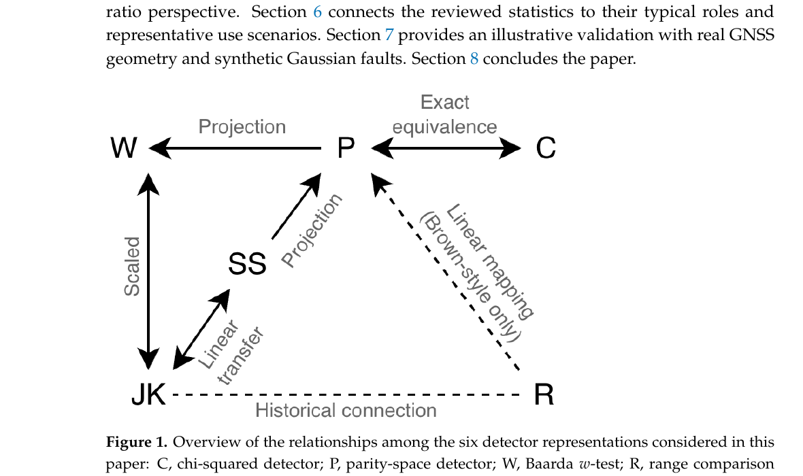
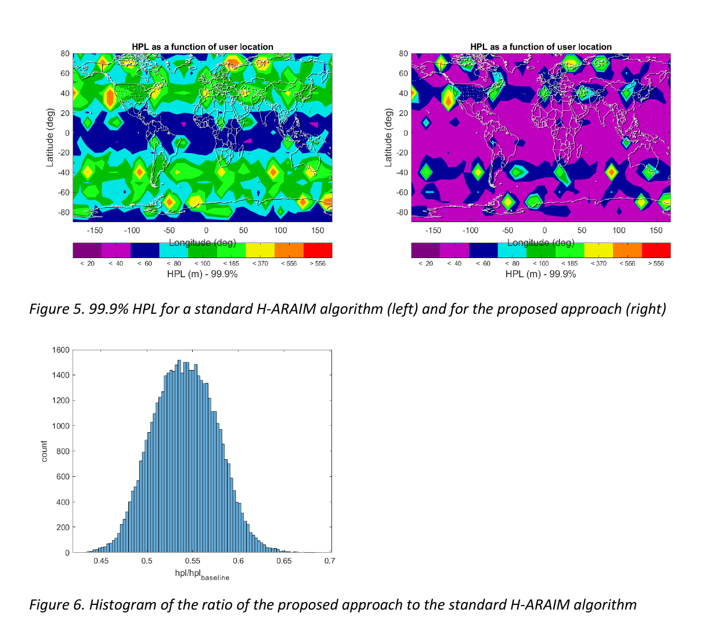
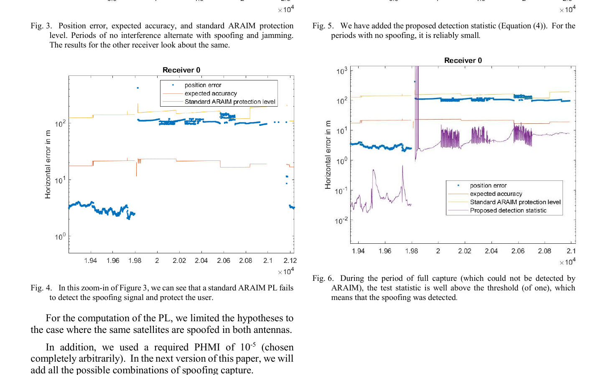

# 2026-08-06 GNSS 每日研究简报

## 今日快报

### 快报 1：DeepONet 把地基 GNSS 与掩星剖面接入全球电离层层析

- 主题：`deep-operator-ionospheric-tomography`
- 来源 ID：`doi:10.1360/ssi-2025-0375`
- 来源链接：https://doi.org/10.1360/SSI-2025-0375
- 发表日期：2026-08-05（线上；期刊卷期日期为 2026-02-01）
- 来源类型：同行评审论文
- 获取范围：出版社元数据与作者摘要；本次未取得可核验全文

**内容：** 作者用 DeepONet-TOMO 学习从 NeQuick2 模拟场、非差非组合 PPP 提取的实测 STEC，以及 COSMIC-2 与云遥掩星电子密度剖面到连续电子密度场的非线性算子。验证瞄准 2024 年 5 月强太阳活动，比较基础、加入实测层析和多源融合三种输入，而不是把每个体素独立回归。

**结论：** 作者摘要称，加入掩星剖面后，观测稀疏区的电子密度重构误差相对未加入掩星的方案降低约 25%—42%。由于本次只核验到出版社元数据和摘要，这一比例只能按作者摘要转述，不能据此判断训练/测试独立性、基准误差定义或对 GNSS 定位误差的直接改善。

**关注理由：** 电离层层析最缺的通常不是算法分辨率，而是射线路径覆盖；把地基 GNSS 的密集斜向积分与 LEO 掩星的垂向剖面融合，正面处理了观测几何互补问题。

### 快报 2：逆 Wishart 先承认噪声协方差会变，再做慢变欺骗检验

- 主题：`inverse-wishart-mlrt-spoofing-gnss-ins`
- 来源 ID：`doi:10.1108/aeat-02-2026-0073`
- 来源链接：https://doi.org/10.1108/AEAT-02-2026-0073
- 发表日期：2026-08-06
- 来源类型：同行评审论文
- 获取范围：出版社结构化摘要；正文受访问限制

**内容：** 标准边缘化似然比检验（MLRT）常把 GNSS/INS 的过程噪声与观测噪声统计视为已知常量。作者改用逆 Wishart 共轭先验描述协方差不确定性，使检验随数据自整定，再在松组合航空器仿真中注入缓慢增长的欺骗偏差。

**结论：** 出版社摘要报告该方法相对固定参数检测器缩短检测延迟并提高对慢变欺骗的敏感性，但没有在摘要中给出可审计的延迟、虚警率或传感器参数。本条因此只确认方法方向与仿真证据，不转述未见全文的性能数字。

**关注理由：** 缓慢欺骗最容易藏进滤波器对噪声统计的错误自信；把协方差不确定性纳入检验，比单纯调低阈值更能说明“为什么没有报警”。

### 快报 3：图感知扩散让百站 GNSS 网络用邻居消息逼近中心解

- 主题：`graph-aware-decentralized-gnss`
- 来源 ID：`doi:10.1038/s44459-026-00063-w`
- 来源链接：https://doi.org/10.1038/s44459-026-00063-w
- 发表日期：2026-08-05
- 来源类型：同行评审开放论文
- 获取范围：CC BY 4.0 全文、公式、仿真设置与结果

**内容：** 论文把 100 个选定 IGS 站位构成 182 条边的时变稀疏图，用受图拓扑约束的双随机矩阵作为深线性网络层，并以 masked Sinkhorn–Knopp 投影保持可行性；在线阶段由梯度跟踪扩散让各站只交换紧凑消息，同时估计接收机状态和全网卫星改正量。

**结论：** 示例 10 个历元中，分布式解与中心 BLUE 的最大欧氏差为位置 $`6.88\times10^{-9}`$ m、卫星偏差等效距离 $`5\times10^{-9}`$ m。这证明数值共识逼近中心基线，不是纳米级绝对定位；作者明确说明几何来自真实 IGS 站位，但当前试验隔离了真实 RINEX 预处理、异常观测、通信延迟与整数固定。

**关注理由：** PPP/PPP-RTK 服务的扩展瓶颈在网络联合估计与通信；该工作给出了“交换什么、图上混合几轮、何时收敛”的可分析结构，而不只是把中心服务器换成联邦学习口号。

### 快报 4：MSSM 门控异常值，分数阶状态承接更长的惯性记忆

- 主题：`adaptive-mssm-fractional-order-gnss-ins`
- 来源 ID：`doi:10.1088/1361-6501/ae8d49`
- 来源链接：https://doi.org/10.1088/1361-6501/ae8d49
- 发表日期：2026-08-05
- 来源类型：同行评审论文
- 获取范围：出版社元数据与完整结构化摘要；正文访问页未能稳定取得

**内容：** AMOFEKF 先依据创新统计在多种统计相似性代价之间自适应选择，以统一处理多维异常值；再用分数阶扩展卡尔曼模型表示超过一阶 Markov 假设的状态记忆。作者用车辆场试和人为连续粗差比较常规多异常鲁棒滤波、固定参数分数阶滤波与自适应版本。

**结论：** 出版社摘要给出差分伪距模式下的米级三维 RMSE 和若干相对改善，但本次未能阅读全文核对路线、真值、窗口与调参，因此不把这些百分比提升当作可迁移性能。可以确认的是：证据包含车辆数据与受控粗差，而不是仅有静态 Monte Carlo。

**关注理由：** 创新异常与惯导状态记忆是两个不同问题；分别由 MSSM 门控和分数阶动力学处理，有助于避免把所有收益都错误归因给“更鲁棒的卡尔曼滤波”。

### 快报 5：GNSS 标定补上 InSAR 看不见的南北向，也暴露自校验偏乐观

- 主题：`insar-gnss-leveling-horizontal-subsidence`
- 来源 ID：`doi:10.3390/rs18152612`
- 来源链接：https://doi.org/10.3390/rs18152612
- 发表日期：2026-08-05
- 来源类型：同行评审开放论文；同时核验作者公开预印本
- 获取范围：CC BY 4.0 正式元数据、完整预印本、方法、图表与结果

**内容：** 研究把 2015—2021 年 Sentinel-1 升降轨 SBAS-InSAR 分解为东西与垂向速度，再用连续/流动 GNSS 普通克里金校正东西向长波偏差，以 922 个水准点和 38 个连续 GNSS 站拟合垂向趋势；GNSS 还提供近极轨 InSAR 无法直接恢复的南北分量。

**结论：** 东西向校正后相对 GNSS 的 $`R^2`$ 从 0.147 升至 0.992、RMSE 从 4.24 降至 0.24 mm/yr；但论文自己指出克里金以同一批 GNSS 作为校正和主要验证，数值含自洽性。较独立的垂向水准检验仅把 RMSE 从 6.03 降至 4.85 mm/yr；图上水平速度 2—10 mm/yr 向沉降中心汇聚，仍不能替代高铁结构应力实测。

**关注理由：** 这是一则很好的“融合精度要问验证是否独立”的案例：GNSS 既补方向盲区，也可能在训练—验证共用时制造过于漂亮的校准指标。

## 深度研读

### 深读 1｜接收机工程｜先把检测器放回同一残差空间：RAIM 的卡方、奇偶与局部投影

- 类别：`receiver-engineering`
- 学习层级：`foundation`
- 选题定位：`经典基础`
- 来源 ID：`doi:10.3390/s26154938`
- 来源链接：https://doi.org/10.3390/s26154938
- 发表日期：2026-08-04
- 来源类型：同行评审开放教程论文与可重复仿真
- 获取范围：CC BY 4.0 全文、统一推导、真实城市星座几何与合成高斯故障
- 价值评分：97/100（相关性 20，经典价值 22，证据 19，教学价值 20，工程价值 16）

#### 为什么先学这个

RAIM 文献里的卡方残差、parity、Baarda $`w`$、range comparison、jackknife 与 solution separation 看起来像六套算法。若不知道它们共享什么信息，就会把坐标变换误当创新，也无法公平分配虚警率。本节先用白化线性模型把“全局能量、单方向投影、删星子集解”放回同一残差子空间。

#### 先修知识

需要掌握线性化伪距模型、加权最小二乘、协方差白化、卡方分布和一/二类错误。白化的作用是把不同卫星方差与相关性变成单位协方差；冗余度 $`q=n-m`$ 是观测数减状态维数，只有 $`q>0`$ 才有快照故障检测信息。

#### 一句话逻辑

先把可由位置与钟差解释的分量投影掉，剩余残差就是故障可见空间；不同 RAIM 检测器多数是在这个空间取范数、取方向投影或换到子集解坐标。

#### 研究问题与约束

论文固定单历元、线性化、协方差已知、名义高斯和单测量故障，统一推导六类统计量及最小可检偏差（MDB）。真实的是城市采集到的星座几何；噪声与偏差为合成高斯注入。因此它验证统计关系，不证明城市多路径满足高斯、独立、单故障假设。

#### 核心方法论

令 $`R=LL^T`$，把 $`y=Gx+\xi`$ 白化为 $`z=L^{-1}y=Hx+\varepsilon`$。投影矩阵 $`S=I-H(H^TH)^{-1}H^T`$ 消除未知状态，残差 $`r=Sz`$ 只保留不能由状态解释的分量。全局统计量用 $`\|r\|^2`$；局部统计量把 $`r`$ 投到指定故障方向；删一星方法把相同不一致性变换到预测残差或解分离坐标。

#### 关键公式逐步推导

白化残差与全局检验为：

```math
r=Sz,\qquad S=I-H(H^TH)^{-1}H^T,\qquad T_R=r^Tr
```

名义条件下 $`S`$ 的秩为 $`q=n-m`$，故：

```math
H_0:\;T_R\sim\chi_q^2,\qquad \gamma=F^{-1}_{\chi_q^2}(1-\alpha)
```

若第 $`k`$ 个白化观测含偏差 $`b`$，则：

```math
H_{1,k}:\;T_R\sim\chi_q^2(\lambda_k),\qquad \lambda_k=b^2S_{kk}
```

给定目标检出率 $`P_D^*`$，先数值求使 $`P(T_R>\gamma)=P_D^*`$ 的 $`\lambda^*`$，再得 $`MDB_k=\sqrt{\lambda^*/S_{kk}}`$。几何通过 $`S_{kk}`$ 进入可检性，不是只看卫星数。

#### 经典价值与创新边界

价值在于统一符号和“完整检验合同”：统计量、阈值、虚警分配、报警聚合与故障方向必须一起定义，MDB 才可比较。论文确认卡方与 parity 在白化模型下严格等价，Baarda 与 jackknife 对删一观测情形只差尺度。边界是教程的统一性依赖既定高斯快照模型，不能自动延伸到时序检验、相关多路径或多星故障。

#### 整体逻辑链

构造观测协方差；白化；线性化几何；形成残差投影；选择全局或方向统计量；按总虚警预算定阈值；在候选故障方向上算非中心参数；由检出率反解 MDB；最后才决定删星、报警或继续定位。

#### 原文图表与结果分析



> 图源：Yan 等《A Tutorial Review of Statistical Snapshot Detectors for GNSS/RAIM Fault Detection》Figure 1，[Sensors 原文](https://doi.org/10.3390/s26154938)，CC BY 4.0。由原 PDF 第 3 页以 180 dpi 渲染后仅裁出关系图与图注；未重绘或改动箭头、缩写和文字。

图中 C（卡方）与 P（parity）标为 exact equivalence，说明二者使用同一全局二次型；P 到 W、SS 是投影，表示一个标量监视量丢掉了部分 parity 向量信息；JK 与 W 是尺度变换，JK 与 SS 是线性传递。虚线只表示历史或特定构造联系，不是任意条件下等价。图没有比较检出率高低，因为阈值和多重检验策略不同。

#### 原文结果论述

附录用好、普通、差三组真实城市几何注入单星高斯偏差。GPS-only 的匹配局部 MDB 中位数分别为 4.381、5.240、5.984 个白化标准差；加入北斗后，对 26 个共同 GPS 故障方向的中位相对变化分别为 −3.51%、−11.25%、−13.64%。这表明额外星座在差几何时更能增加残差可见性，但单位是白化 $`\sigma`$，不能直接读成米。

#### 常见误区与适用边界

第一，把 parity 当成比残差卡方“更高级”的独立证据。第二，用每个局部检验的 $`\alpha`$ 代替整体虚警率。第三，只报 MDB 不报故障方向。第四，用 PDOP 代替 $`S_{kk}`$。第五，协方差未白化就套卡方阈值。第六，把单故障推导用于共模欺骗。第七，把合成高斯验证当作城市长尾验证。

#### 工程实现步骤

1. 用仰角、$`C/N_0`$ 与接收机标定建立 $`R`$，保留相关项。
2. 对 $`G`$ 做秩检查并以 Cholesky 白化。
3. 用 QR/SVD 形成 parity 基，避免直接求逆。
4. 先实现全局 $`\chi^2`$，再按故障候选实现局部投影。
5. 对多重局部检验分配整体虚警预算。
6. 记录每次报警的几何、阈值、统计量、候选星和删星后解。

#### 复现实验设计

取一段公开双星座原始伪距，选择好/普通/差三历元；分别用 10° 与 20° 截止高度角。以 $`\alpha=10^{-3}`$、目标 $`P_D=0.9`$，对每个可用观测注入 0—10 个白化标准差的偏差，每点做 $`10^5`$ 次 Monte Carlo。比较卡方、parity、Baarda、jackknife 与东西/南北 solution separation 的经验虚警、检出曲线和 MDB；基线为解析非中心卡方。失败条件包括 $`R`$ 奇异、线性化误差超过 0.1 m、相关噪声未建模和两个以上同时故障。

#### 与定位及低成本实现的联系

低成本设备的主要困难不是算不出投影，而是 $`R`$ 经常错误：手机天线、多路径和厂商平滑使误差相关且重尾。统一残差空间允许先用同一底座比较检测器，再把工程精力放到协方差标定、虚警预算与恢复逻辑，而不是重复实现等价统计量。

#### 本节小结

RAIM 快照检测的核心是一块由冗余观测形成的残差子空间。范数、方向投影和删星解是不同读法；是否真正更好，要连同阈值、假设和报警策略一起比较。

### 深读 2｜接收机工程｜不急着选哪颗星错：把故障检测与排除合成一个有界解区间

- 类别：`receiver-engineering`
- 学习层级：`intermediate`
- 选题定位：`基础进阶`
- 来源 ID：`doi:10.33012/2021.17954`
- 来源链接：https://doi.org/10.33012/2021.17954
- 发表日期：2021-09
- 来源类型：ION GNSS+ 2021 同行评审会议论文
- 获取范围：作者公开全文、解析证明、人工故障与 ARAIM 服务域仿真
- 价值评分：98/100（相关性 20，经典价值 24，证据 19，教学价值 19，工程价值 16）

#### 为什么先学这个

上一节回答“怎样检测不一致”，却没有回答报警后是否必须立刻挑一个排除解。传统 FDE 在检测与排除之间切换线性估计器，候选星模糊时会造成位置和保护级跳变。本节把输出从单点改成包含真值的区间，再以区间中心给解，让“还不能确定谁错”成为可量化状态。

#### 先修知识

需要理解 fault hypothesis、subset solution、solution separation、保护级（PL）、完整性风险 $`P_{HMI}`$ 与连续性/告警概率。保护级不是经验误差分位数，而是在已声明故障先验和名义误差上界下，使“误差越界且未告警”概率受限的边界。

#### 一句话逻辑

为每个故障假设构造一个随子集内部一致性收缩的可信区间，取所有区间的包络；只要包络非空且宽度不超过 $`2L`$，其中点就是连续、受保护的估计。

#### 研究问题与约束

论文采用 ARAIM 的有限故障假设集：名义噪声可由高斯上界描述，各故障模式的受影响测量集合已知而偏差任意。推导集中在单坐标，仿真用 GPS/Galileo L1/L5、既定星座先验与人工单星正弦故障。它不是对未知城市 NLOS 模式的无模型保证。

#### 核心方法论

对故障模式 $`H_i`$ 计算不受该故障影响的子集解 $`\hat x^{(i)}`$，并进一步计算双排除解 $`\hat x^{(ij)}`$。第 $`i`$ 个区间半径不是固定常数，而是 $`R_i=L-\max_j|\hat x^{(i)}-\hat x^{(ij)}|`$；子集内部越不一致，区间越收缩。所有区间的最小包络 $`\Gamma(y)`$ 被证明宽度不超过 $`2L`$，中心作为输出；空集触发告警。

#### 关键公式逐步推导

每个故障容错解在名义上界下满足：

```math
P\!\left(x\notin[\hat x^{(i)}-K\sigma_i,\hat x^{(i)}+K\sigma_i]\mid H_i\right)\le 2Q(K)
```

构造测量相关半径与包络：

```math
R_i(y)=L-\max_j\left|\hat x^{(i)}-\hat x^{(ij)}\right|,
\qquad
\Gamma(y)=\left[\min_i(\hat x^{(i)}-R_i),\;\max_i(\hat x^{(i)}+R_i)\right]
```

三角不等式给出 $`size(\Gamma)\le2L`$。论文用联合上界选择 $`L`$：

```math
P_{HMI,req}=4\sum_i p_i\sum_j Q\!\left(\frac{L}{\sigma_{ij}}\right)
```

并另以 solution-separation 标准差约束空包络概率。最终 $`L`$ 取完整性与连续性两项要求给出的较大者。

#### 经典价值与创新边界

经典价值是把 FDE 从“检测—选星—重算”的离散控制流改写成直接针对完整性和连续性的非线性估计器，并给出解析上界。边界包括联合上界可能保守、故障模式与先验必须预先定义、双排除组合带来计算量，且论文称结果为 preliminary。

#### 整体逻辑链

枚举故障模式；计算子集与双子集解；用内部 solution separation 缩放每个区间；形成包络；若为空则告警；若非空取中心；以所有模式的先验、标准差和连续性预算反解保护级；在服务域和注入故障上比较传统 FDE。

#### 原文图表与结果分析



> 图源：Blanch 与 Walter《A Fault Detection and Exclusion Estimator Designed for Integrity》Figures 5–6，[ION 书目信息](https://doi.org/10.33012/2021.17954)，作者公开全文由 [Stanford GPS Lab](https://web.stanford.edu/group/scpnt/gpslab/pubs/papers/Blanch_IONGNSS_2021_FDE.pdf) 提供。由原 PDF 第 14 页以 180 dpi 渲染后裁出两幅图及图注；属最小研究评论摘录，未改图，不暗示再分发权。

Figure 5 的经纬轴覆盖全球，色条为 99.9% HPL containment，单位 m；右图紫色低值区显著扩大。Figure 6 横轴是提议 HPL/传统 HPL，主体约在 0.5—0.6，作者据此概括 HPL 降低 35%—50%。这是 GPS-24/Galileo-24、10° 网格、每 10 min、24 h 的服务域模型结果，不是飞行误差降低比例。

#### 原文结果论述

单星正弦故障的 8 h、1 Hz 示例中，新估计器在传统方法检测或未检测时都给出更小、也更平滑的位置误差和 PL；全球服务域仿真中 HPL 比值与解析近似一致。论文没有报告独立飞行试验的实际 HMI 频率，因此“证明”限于给定误差上界下的数学保证与模拟覆盖。

#### 常见误区与适用边界

第一，把包络当交集；论文定义的是覆盖各候选区间的最小区间。第二，$`R_i<0`$ 时仍强行输出。第三，只满足完整性方程，不检查空包络概率。第四，把候选排除集与必须监测的故障集混为一谈。第五，忽略故障先验。第六，把 35%—50% HPL 缩减外推到任意星座和告警限。第七，未建立高斯上界就宣称解析完整性。

#### 工程实现步骤

1. 定义名义、单星、星座级及必要多故障假设和先验。
2. 缓存各假设的子集几何矩阵、协方差与解算权。
3. 计算 $`\hat x^{(i)}`$、$`\hat x^{(ij)}`$ 与 separation 标准差。
4. 按候选集合计算 $`R_i`$，形成最小覆盖区间。
5. 由完整性和连续性预算离线/在线求 $`L`$。
6. 输出中心、PL、最危险假设、包络宽度与告警状态。

#### 复现实验设计

用 GPS-24/Galileo-24 星历生成 24 h、30 s 服务域，网格 10°、截止高度角 5°。对传统 solution-separation FDE 与融合区间估计器使用同一 $`P_{sat}=10^{-5}`$、星座先验和误差上界；注入斜坡、正弦、阶跃三类单星偏差。指标为 HPL 99.9% containment、HPL 比、告警率、HMI 上界、位置跳变量和运算时间；失败条件包括包络空、候选集遗漏真故障、先验和不为 1、数值上界低于 Monte Carlo 置信上限。

#### 与定位及低成本实现的联系

低成本接收机的残差常在多个卫星之间同时可疑，硬删一星容易使几何骤变。区间式估计允许在歧义阶段平滑过渡，并显式告诉上层“可用但边界变宽”。代价是多子集计算和正确误差上界，适合先在服务器或高算力接收机验证，再做候选裁剪。

#### 本节小结

FDE 不一定要先作离散故障判决。把候选解变成受约束区间，可同时管理完整性、连续性与解的平滑性；收益成立的前提仍是故障集和误差上界可信。

### 深读 3｜纯 GNSS 定位｜共模欺骗让单天线 RAIM 失明：双天线如何把检测量变成保护级

- 类别：`positioning`
- 学习层级：`advanced`
- 选题定位：`定位深入`
- 来源 ID：`doi:10.1109/plans61210.2025.11028291`
- 来源链接：https://doi.org/10.1109/PLANS61210.2025.11028291
- 发表日期：2025-04
- 来源类型：IEEE/ION PLANS 2025 同行评审会议论文与实测干扰事件
- 获取范围：作者公开全文、完整推导、Jammertest 2024 双接收机数据
- 价值评分：99/100（相关性 20，经典价值 24，证据 20，教学价值 19，工程价值 16）

#### 为什么先学这个

单天线 RAIM 依赖卫星间不一致；单发射源若把所有跟踪环一起拖到自洽假解，残差仍可能很小。上一节的多假设 PL 框架可继续使用，但需要一个对共模欺骗可见的新观测。已知双天线基线提供空间约束：真实卫星来波方向各异，单点欺骗源却共享同一方向。

#### 先修知识

需要理解双天线几何、码/载波差分、加权残差投影、中心/非中心卡方、捕获假设和 HPL。文中实验用约 20 m 基线和码平滑观测；保护级计算假定单发射源、已知天线间向量和保守航空误差模型。

#### 一句话逻辑

把两天线观测都归算到同一参考点后，真实信号应服从各卫星 LOS 基线投影，单源欺骗则服从共同来向；二者的残差能量既可检测，也可在最坏捕获组合上反解位置保护级。

#### 研究问题与约束

论文问的是：双天线不仅“能否报警”，还能否给出欺骗条件下的最坏位置边界。它枚举真/假测量组合、欺骗偏差和来向，实测来自挪威 Jammertest 2024 的非定向欺骗/压制事件。当前 PL 实验只保留“两天线中相同卫星同时被欺骗”的假设，平台姿态最坏化留待后续，因此不是完整认证算法。

#### 核心方法论

对第 $`k`$ 天线、第 $`i`$ 星，已知基线 $`v^{(k)}`$。真实观测含 $`g_i^Tv^{(k)}`$，单源欺骗含 $`u^Tv^{(k)}`$。用对角矩阵 $`\Delta`$ 指定哪些测量被捕获，组合两接收机观测并计算加权最小二乘残差 $`\tau=y^TPy`$。名义下是中心卡方，欺骗下是非中心卡方；对造成给定用户偏差 $`\beta`$ 的所有欺骗偏差与来向取最小非中心参数，再对 $`\beta`$ 取最坏未检出风险，求 HPL。

#### 关键公式逐步推导

两天线归一参考点后的观测写成：

```math
y=G\begin{bmatrix}x\\t\end{bmatrix}+\Delta(hv^Tu-Hv+Fb)+\varepsilon
```

加权残差投影与检测量为：

```math
P=W-WG(G^TWG)^{-1}G^TW,\qquad \tau=y^TPy
```

在欺骗假设下：

```math
\tau\sim\chi^2_\nu(\lambda),\qquad
\lambda(b,u)=(Ab+f)^TP(Ab+f)
```

给定捕获矩阵 $`\Delta`$ 和用户偏差 $`\beta`$，先求 $`\lambda_\Delta(\beta)=\min_{b,u}\lambda(b,u)`$，再使：

```math
\max_\beta\min\left[F_{\chi^2_\nu(\lambda_\Delta(\beta))}(T),
Q\!\left(\frac{L-\beta}{\sigma}\right)\right]\le P_{HMI}
```

分别解东西 $`L_E`$、南北 $`L_N`$，得到 $`HPL_\Delta=\sqrt{L_E^2+L_N^2}`$，最终对所有 $`\Delta`$ 取最大值。

#### 经典价值与创新边界

创新在于把双天线欺骗检测从经验阈值提升为随几何、噪声和捕获假设变化的 PL，并用实测共模捕获展示传统 ARAIM 的盲区。边界很明确：单发射源、已知基线方向、部分捕获假设、任意选择的演示 $`P_{HMI}=10^{-5}`$，且 PL 计算昂贵。论文也没有声称满足航空认证。

#### 整体逻辑链

标定双天线基线与时钟；把观测归算到参考天线；建立共同误差与独立误差协方差；形成加权残差；由虚警需求定阈值；枚举捕获矩阵；对欺骗偏差和来向求最不易检情形；把检出概率与位置尾概率联合上界；取最坏 HPL；统计量越阈则告警并把 PL 置为不可用。

#### 原文图表与结果分析



> 图源：Blanch 等《Determining Protection Levels Using Multiple Antennas under Spoofing Conditions》Figures 4 与 6，[IEEE/ION 书目信息](https://doi.org/10.1109/PLANS61210.2025.11028291)，作者公开全文由 [Stanford GPS Lab](https://web.stanford.edu/group/scpnt/gpslab/pubs/papers/blanch_ION_IEEE_PLANS_2025_spoofing_protection_level.pdf) 提供。由原 PDF 第 7 页以 180 dpi 渲染并裁出对照图、图注及紧邻假设说明；属最小研究评论摘录，未改数据或图例，不暗示再分发权。

两图横轴为样本/时间索引，纵轴为对数刻度的水平误差（m）；左图在约 $`1.98\times10^4`$ 后位置误差约 $`10^2`$ m，而标准 ARAIM PL 仍为同量级且没有识别全捕获。右图加入紫色归一化检测量，完整捕获时远高于阈值 1。它证明该事件对双天线统计量可见，不证明所有多发射源或定向欺骗都可检。

#### 原文结果论述

两接收机相距约 20 m，2024-09-12 的 L1 C/A 码平滑观测交替经历无干扰、欺骗与压制。大部分部分捕获本来就被 ARAIM 检出；关键案例是全捕获产生自洽百米级假解，标准 ARAIM 失效，而双天线统计量越过阈值。提议 HPL 在统计量触发时变为无穷，正确表达“当前不能给有限安全边界”。

#### 常见误区与适用边界

第一，把两天线位置解之差接近零当成充分证明。第二，忽略天线时钟、共模误差和基线标定。第三，只枚举两端相同捕获集合。第四，把检测阈值 1 误认为 1 m；图中是归一化统计量。第五，报警后仍发布有限 PL。第六，把单发射源模型用于分布式欺骗阵列。第七，把任意 $`10^{-5}`$ 演示风险当认证要求。

#### 工程实现步骤

1. 刚性安装并在机体系标定双天线三维基线与不确定度。
2. 硬件同步或显式估计两接收机钟差。
3. 统一星历、平滑窗口和观测筛选，把两端观测归算到参考点。
4. 建模共同卫星误差与两端独立多路径/热噪声协方差。
5. 实时计算 $`\tau`$ 与阈值，并记录捕获候选。
6. 离线预计算几何/噪声格点上的最坏 HPL，在线插值并做保守上取整。
7. 阈值触发或假设未覆盖时输出不可用，而非继续报固定精度。

#### 复现实验设计

在开阔场架设 0.5、2、20 m 三种已知基线，双接收机同钟与独立钟各一组；用 GNSS 信号模拟器生成无欺骗、单星拉偏、部分捕获、全捕获和双发射源五场景，偏差斜率 0.1/1/10 m/s。每场 30 min、10 Hz，基线真值用全站仪。指标为整体虚警率、检测延迟、最大未检位置误差、HPL containment、不可用率与计算时间；基线为单天线 ARAIM 和简单双解距离检验。失败条件包括基线误差超过 5 mm、同步错位超过 1 ms、真实误差越过 HPL、未覆盖假设仍给有限 PL。

#### 与定位及低成本实现的联系

双天线并不要求每端单点解很准；价值来自空间一致性。汽车、无人机和测量杆已有双天线航向硬件时，可复用观测增加共模欺骗可见性。低成本实现的瓶颈是同步、相位连续性、基线与误差协方差，而不是二次型本身；短基线会削弱来向区分，长基线则增加安装和差分环境误差。

#### 本节小结

完整性不是“检测到了就安全”，而是最坏未检事件仍有可解释边界。双天线把单源共模欺骗重新映射成可见残差，再用非中心卡方和捕获假设把残差转成 HPL；任何未覆盖威胁都应表现为不可用，而非乐观数字。
