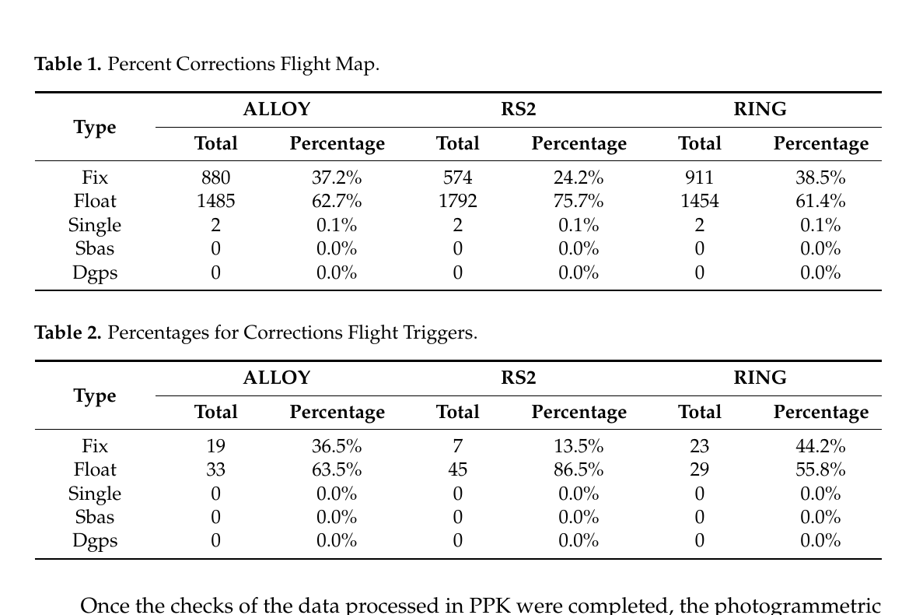
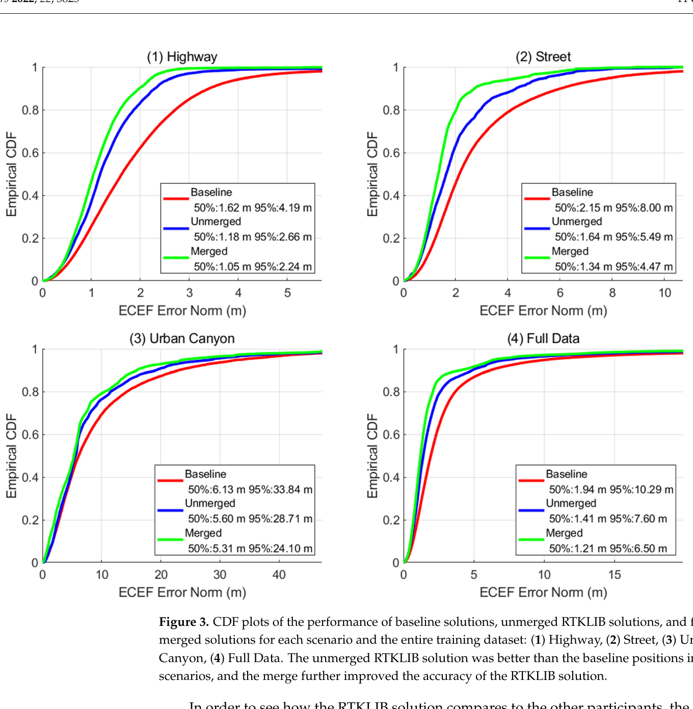
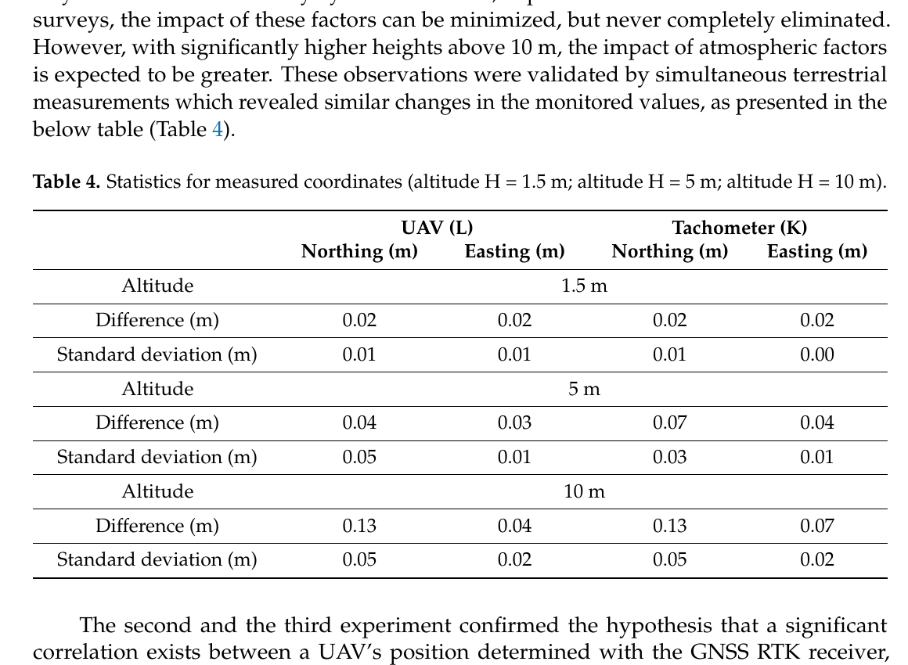

# 2026-08-07 GNSS 每日研究简报

## 今日快报

### 快报 1：八颗 LEO 组成星载双差网，把浮点定轨的 1D RMS 压到约 2—2.5 cm

- 主题：`leo-spaceborne-gnss-double-difference-network`
- 来源 ID：`doi:10.1007/s00190-026-02059-4`
- 来源链接：https://doi.org/10.1007/s00190-026-02059-4
- 发表日期：2026-08-07
- 来源类型：同行评审开放论文
- 获取范围：正式元数据、CC BY 4.0 许可记录与作者摘要；出版平台全文下载在本次运行环境中受客户端挑战限制，因此定量叙述严格限于摘要

**内容：** 研究不把每颗低轨卫星各自当作独立精密定轨用户，而是把 GRACE-FO C/D、Sentinel-3A/B、Sentinel-6A 与 Swarm A/B/C 共八星组成动态 GNSS 网络，以星间双差载波相位联合估计轨道。双差消去接收机与卫星钟的共同项，快速变化的星间几何则为网络参数提供额外可观性。

**结论：** 作者摘要报告：相对 SLR 的模糊度浮点网络解从三颗 LEO 时约 4 cm 的一维 RMS，改善到八颗 LEO 时约 2—2.5 cm；与外部模糊度固定零差轨道比较，八星网络的基线长度差为约 2—3 cm RMS。固定约 60%—70% 的高动态基线模糊度后，两类检核最多再改善约 0.5 cm。这些数值是八颗测地卫星、特定动力学与处理模型下的作者结果，不等于任意商业 LEO 星座可直接达到 2 cm。

**关注理由：** 它把“LEO 搭载 GNSS 接收机”从单星定轨扩展为可自主处理的空间基准网，为未来大星座共同估计轨道、GNSS 天线相位中心和低阶重力场参数提供了纯 GNSS 观测架构。

### 快报 2：LightGBM 把中国区域 GNSS 水汽 RMSE 相对传统模型再降约三成

- 主题：`lightgbm-near-real-time-gnss-pwv-china`
- 来源 ID：`doi:10.3390/rs18152637`
- 来源链接：https://doi.org/10.3390/rs18152637
- 发表日期：2026-08-06
- 来源类型：同行评审开放论文
- 获取范围：CC BY 4.0 全文、模型输入、训练/测试划分、公式、计算耗时与验证结果

**内容：** CLZP 分成两级：先在 15—55°N、73—135°E 的 0.5°×0.5° 网格上，用日期、小时与椭球高训练 LightGBM 估计天顶干延迟 ZHD；再把近实时 GNSS ZTD、位置、时间和 CTrop 平均温度共同输入统一的 PWV 残差补偿器。ZHD 以 2014—2017 年 ERA5 训练、2018 年测试；PWV 用 100 个 CMONOC 站训练、43 站测试，一次完整检索在作者硬件上约 1.33 s。

**结论：** 相对 GPT3-ZHD 与 CTrop-ZHD，CLZP-ZHD 在 ERA5 检验中的 RMSE 分别降低约 25.4% 与 28.2%，在独立探空检验中分别降低约 21.7% 与 23.0%；PWV 相对 GPT3-PWV 与 CTrop-PWV 的 RMSE 分别降低约 32.7% 与 38.2%。但 PWV 参考值仍由 ERA5 与 GNSS ZTD 构造，极端天气和跨气候区泛化尚未被独立长期站网充分检验。

**关注理由：** 方法不是用黑箱直接替代 GNSS，而是让物理模型先给出 ZHD、$`T_m`$ 与初始 PWV，再学习残差传播；这种“物理主链 + 数据驱动补偿”比端到端坐标或气象量回归更容易做运行监控。

### 快报 3：GNSS 垂向形变与 GRACE 联合反演识别七次中部中国干旱

- 主题：`gnss-grace-joint-terrestrial-water-storage-drought`
- 来源 ID：`doi:10.3390/rs18152633`
- 来源链接：https://doi.org/10.3390/rs18152633
- 发表日期：2026-08-06
- 来源类型：同行评审开放论文
- 获取范围：CC BY 4.0 全文、2011—2023 年数据流程、联合反演、棋盘检验与干旱事件表

**内容：** 研究把 GNSS 站的垂向弹性负载响应和 GRACE/GFO Mascon 的大尺度质量约束统一到 0.5° 网格，用 ABIC 选择两类观测权重，并以 Laplacian 正则化稳定陆地水储量 TWS 反演；再把联合 TWS 标准化为 Joint-DSI，与降水、蒸散、径流和 SPEI 对照。GRACE 虚拟站继承 Mascon 平滑尺度，因此提供的是大尺度约束，不是独立点观测。

**结论：** 2011 年 1 月至 2023 年 6 月间，Joint-DSI 标记出七次主要干旱；2017 年 4 月至 2018 年 11 月持续 20 个月，2022 年 8 月至 2023 年 6 月的事件最严重，峰值 TWS 缺额为 −142.303 km³。论文以联合解自身作部分一致性参照，并用合成棋盘检验空间恢复能力；这些证据支持事件识别与分辨率互补，不能把联合解当成逐网格独立水文真值。

**关注理由：** GNSS 不只输出坐标：毫米级垂向时间序列能反演区域质量负载。把高频但稀疏的 GNSS 与低频、平滑的重力卫星结合，展示了测地观测如何进入水资源风险监测。

### 快报 4：速度辅助导航避开加速度二次积分，但十分钟后仍会漂移

- 主题：`velocity-aided-navigation-gnss-denied`
- 来源 ID：`doi:10.3390/s26155006`
- 来源链接：https://doi.org/10.3390/s26155006
- 发表日期：2026-08-06
- 来源类型：同行评审开放论文
- 获取范围：CC BY 4.0 全文、误差推导、Cessna 飞行数据与半实物回放

**内容：** VAN 用外部水平/垂直速度与姿态把位移做一次积分，绕开传统捷联惯导对含偏置加速度的二次积分。作者用小型 Cessna 的 GNSS、MEMS IMU、速度和高度数据回放 65 s、250 s 与 500 s 三段遮断，并把 VAN 与标准 SINS 相对 GNSS 轨迹比较。

**结论：** 三段试验中 VAN 的线性坐标误差总体比独立 SINS 小数倍到一个数量级；500 s 段的高度 MAE 比值达到 328，但该比值也反映 SINS 高度快速发散。104 min 全程无外部校正时，VAN 水平 MAE 已累积到数千米，作者因此把适用窗口约束在 10 min 内。试验用已有飞行速度作为输入，是导航架构的半实物验证，不等价于真实低成本速度传感器端到端性能。

**关注理由：** 结果提醒工程上区分“降低漂移阶次”和“消除漂移”：速度量测能把 $`t^2`$ 型增长改成更慢的一次积累，却仍需要速度传感器标定、周期性 GNSS 回归或视觉/地形辅助。

### 快报 5：天目一号掩星在 8—30 km 偏差很小，三角帽也暴露低层与热带误差

- 主题：`tianmu-1-gnss-radio-occultation-three-cornered-hat`
- 来源 ID：`doi:10.3390/rs18152572`
- 来源链接：https://doi.org/10.3390/rs18152572
- 发表日期：2026-08-04
- 来源类型：同行评审开放技术论文
- 获取范围：CC BY 4.0 全文、2023 年 6—12 月数据、ERA5/探空/COSMIC-2 共址比较与三角帽误差表

**内容：** 论文把天目一号约每日 3 万条掩星廓线分别与 ERA5、全球探空和 COSMIC-2 共址，比较弯曲角与折射率；随后用三角帽法从三个误差近似独立的数据集差分中估计有效观测方差，并按高度与 10° 纬带统计。探空共址阈值为 200 km、2 h，空间代表性误差不能完全排除。

**结论：** 在上对流层—下平流层，天目一号相对 ERA5 的弯曲角/折射率偏差在 8—30 km 内分别不超过 ±0.19%/±0.09%；相对探空在 8—25 km 内不超过 ±0.40%/±0.21%，相对 COSMIC-2 在 8—30 km 内不超过 ±0.37%/±0.14%。三角帽估计显示低对流层和 ±30° 热带误差更大；由于三数据误差并非严格独立，该量应解释为包含反演、共址与代表性误差的“有效误差”，不是纯仪器噪声。

**关注理由：** 对数据同化而言，平均偏差小并不足够，还要知道误差随高度和纬度怎样变。该工作给商业 GNSS 掩星建立了可进入观测误差协方差的剖面，而非只给一个全局精度数字。

## 深度研读

### 深读 1｜接收机工程｜RTK 与 PPK 不是“实时或离线”这么简单：同一载波链上的固定率与基线效应

- 类别：`receiver-engineering`
- 学习层级：`foundation`
- 选题定位：`经典基础`
- 来源 ID：`doi:10.3390/s21113882`
- 来源链接：https://doi.org/10.3390/s21113882
- 发表日期：2021-06-04
- 来源类型：同行评审开放论文与低成本 UAV 实测
- 获取范围：CC BY 4.0 全文、接收机配置、三基站 PPK、RTKLIB 处理、GCP 与 DEM 结果
- 价值评分：96/100（相关性 20，经典价值 23，证据 19，教学价值 19，工程价值 15）

#### 为什么先学这个

RTK 与 PPK 共用基准站、流动站、载波双差和整数模糊度；差异主要在改正到达时间、可用产品和质量控制窗口。若只记成“RTK 实时、PPK 离线”，就会忽略真正决定结果的基线长度、共同可见星、固定率、相机触发时间和基准坐标。该试验用同一 UAV 原始观测对三个基站分别后处理，正好把这些因素拆开。

#### 先修知识

需要理解伪距、载波相位、单差/双差、整数模糊度、固定解与浮点解。固定解表示模糊度通过验证并约束为整数，不代表坐标绝对无错；浮点解保留实数模糊度，精度通常较差但可避免错误固定。还需区分天线轨迹精度、相机曝光中心精度与最终 DEM/GCP 精度。

#### 一句话逻辑

基准站和流动站同时观测同一卫星时，双差可消去两端钟差并压低短基线共同误差；PPK 把全段数据、精密产品和前后向处理留到事后使用，但能否固定仍由观测质量与几何决定。

#### 研究问题与约束

作者在意大利 Pesco Sannita 使用低成本双频多星座 UAV 接收机，以 Alloy、RS2 与 RING 三个不同基站作 PPK，并用七个 NRTK 测得的 GCP 检核 DEM。任务高度约 80 m，前后重叠 80%/70%。研究对象是一次开阔区航摄和特定 RTKLIB 配置，不能代表城市遮挡、长基线或高速机动。

#### 核心方法论

基准与流动站原始观测先统一时间与坐标；RTKLIB 对每个基站分别生成 PPK 轨迹并把解状态标为 Fix、Float、Single 等；相机触发点按轨迹插值；三套轨迹各自生成点云和 DEM；最后以相同七个 GCP 的高程差比较基站选择对产品的影响。这样把“解状态”和“最终产品误差”放进同一链条。

#### 关键公式逐步推导

接收机 $`r,b`$ 对卫星 $`i,j`$ 的载波双差可写为：

```math
\nabla\Delta\Phi_{rb}^{ij}=\nabla\Delta\rho_{rb}^{ij}+\lambda\nabla\Delta N_{rb}^{ij}+\nabla\Delta T^{ij}-\nabla\Delta I^{ij}+\varepsilon_{\Phi}
```

短基线下，轨道、电离层和对流层残差较小，估计基线向量 $`\mathbf b`$ 与浮点模糊度 $`\hat{\mathbf N}`$。整数固定求解：

```math
\check{\mathbf N}=\arg\min_{\mathbf n\in\mathbb Z^m}(\mathbf n-\hat{\mathbf N})^TQ_{\hat N}^{-1}(\mathbf n-\hat{\mathbf N})
```

通过独立验证后再以 $`\check{\mathbf N}`$ 回代得到固定基线。PPK 的优势不是改变方程，而是允许全弧数据、后验产品与双向滤波改善 $`Q_{\hat N}`$ 和异常检测。

#### 经典价值与创新边界

价值在于用三套基准站把“基站换了，解状态和 DEM 会怎样”做成可重复实验，并公开低成本硬件与 RTKLIB 工作流。创新边界是最终 GCP 只有七个，垂向差同时包含相机标定、摄影测量、触发同步与插值误差，不能全部归因于 GNSS。

#### 整体逻辑链

规划航线；同步记录 rover 与三基站 RINEX；核验共同星与采样；分别求 PPK；统计固定/浮点；把触发时刻映射到天线轨迹；做杆臂与相机时间改正；生成三套 DEM；用同一批 GCP 比较；定位差异来自基线、固定率还是摄影测量。

#### 原文图表与结果分析



> 图源：Angelats 等《A Test on the Potential of a Low Cost Unmanned Aerial Vehicle RTK/PPK Solution for Precision Positioning》Tables 1–2，[Sensors 原文](https://doi.org/10.3390/s21113882)，CC BY 4.0。由原 PDF 第 9 页以 200 dpi 渲染，仅裁出表题和表体；未重绘、改字或改变数值。

Table 1 是整段轨迹，Alloy/RS2/RING 固定率分别为 37.2%/24.2%/38.5%，浮点率为 62.7%/75.7%/61.4%；Table 2 只看相机触发点，固定率为 36.5%/13.5%/44.2%。表直接说明换基站会改变曝光时刻的固定可用性，而且“整段固定率”不能代替“任务事件固定率”。它没有给逐历元独立坐标真值，因此不能单凭固定标签判断厘米正确性。

#### 原文结果论述

作者报告不同基站生成的 DEM 均可用，但七个 GCP 的高程差范围随基站而变：Alloy 约 1—35 cm，RS2 约 2—30 cm，RING 约 5—56 cm。论文把低成本 PPK 视为减少难抵达地区 GCP 的可行方案，没有声称完全取消质量控制点。

#### 常见误区与适用边界

第一，把 Fix 当绝对正确。第二，只看全程固定率，不看曝光或控制事件。第三，认为 PPK 自动优于 RTK。第四，忽略基准坐标误差。第五，长基线仍假定电离层、对流层完全相消。第六，把天线位置当相机投影中心。第七，用七个 GCP 的一次结果概括所有地形。

#### 工程实现步骤

1. 固定基准站坐标、天线高、采样率与时间系统。
2. 对 rover/base 做共同卫星、周跳、$`C/N_0`$ 和时间连续性检查。
3. 保留每个历元的解状态、比率检验、卫星数和协方差，而不只输出坐标。
4. 对每个相机触发时刻插值轨迹并应用天线—相机杆臂。
5. 至少以独立 GCP/检查点报告水平、垂向 RMSE 与 95% 分位。
6. 若不同基站结果不一致，先比较固定集合、基线与基准坐标，再比较摄影测量设置。

#### 复现实验设计

选开阔地与树/建筑边缘各一块场地，设置三基站距离 0.5、10、30 km；同一双频 UAV 航线飞三次，5 Hz GNSS、曝光事件硬件打标。RTK 与 PPK 使用相同星座和截止高度角，另做前向、后向、组合三种 PPK。指标为触发点固定率、错误固定率、天线轨迹 3D RMSE、DEM 检查点 RMSE95 和处理延迟；真值用全站仪或独立测量级 PPK。失败条件包括时间错位超过 20 ms、杆臂未标定、基准坐标不统一或固定解相对真值越过 0.1 m。

#### 与定位及低成本实现的联系

低成本接收机最容易在固定率和数据链上暴露差异。PPK 能容忍实时链路中断，但不能修复不存在的载波、未记录的触发时刻或错误的天线偏移。对无人机、农业与移动测绘，解状态必须和任务事件一起存档。

#### 本节小结

RTK/PPK 的共同核心是载波相位与模糊度；离线处理扩大了质量控制窗口，却没有取消几何、基线、固定验证和时空标定。固定率应按真正消费坐标的事件统计。

### 深读 2｜低成本移动端｜让 RTKLIB 适配手机：先承认周跳、时钟断裂和长尾不是测地接收机噪声

- 类别：`low-cost-mobile`
- 学习层级：`intermediate`
- 选题定位：`基础进阶`
- 来源 ID：`doi:10.3390/s22103825`
- 来源链接：https://doi.org/10.3390/s22103825
- 发表日期：2022-05-18
- 来源类型：同行评审开放论文、开放代码与 GSDC 车载数据
- 获取范围：CC BY 4.0 全文、RTKLIB 方程、配置修改、训练集真值与 Kaggle 测试结果
- 价值评分：98/100（相关性 20，经典价值 23，证据 20，教学价值 19，工程价值 16）

#### 为什么先学这个

上一节的 UAV 接收机大多能连续输出双频载波；手机却会占空比休眠、硬件时钟跳变、频繁周跳，并以低增益天线接收强多路径。把测地接收机默认门限原样搬来，会出现两种相反失败：删掉太多观测，或把错误载波当成可固定信息。本节展示如何从观测质量出发改配置，而不是追逐一个“手机专用神参数”。

#### 先修知识

需要理解扩展卡尔曼滤波、双差观测、参考星、周跳、前后向组合和经验 CDF。GSDC 指标由位置误差的 50% 与 95% 分位组成；这比单一 RMSE 更能暴露城市峡谷长尾。

#### 一句话逻辑

手机 PPK 的关键不是放宽所有门限，而是识别时钟断裂和周跳、重设与观测质量匹配的随机模型，再利用前后向处理和同车多机冗余限制长尾。

#### 研究问题与约束

论文使用 2021 GSDC：训练集 29 条路线、73 部手机文件，测试集 19 条路线、45 个文件，真值来自 NovAtel SPAN ISA-100C。场景分 highway、street、urban canyon。作者修改的是 demo5 RTKLIB 分支并为竞赛调参；同车多机相距约 0.2 m，位置域合并利用了竞赛特殊冗余，不能直接复制到单手机产品。

#### 核心方法论

处理以基站双差 EKF 为主，加入加速度状态；把 elevation mask 设为 15°、$`C/N_0`$ 门限设为 24 dB-Hz；用 Doppler 与 geometry-free 组合检测周跳，把阈值调整到适配手机误差的量级；关闭不稳定的整数固定，采用前后向 combined/no-phase-reset；再按 RTKLIB 方差逆权合并同一车上的多机位置，并排除每历元硬件时钟断裂的文件。

#### 关键公式逐步推导

EKF 量测更新为：

```math
\hat x_k^+=\hat x_k^-+K_k\left(y_k-h(\hat x_k^-)\right),\qquad
K_k=P_k^-H_k^T(H_kP_k^-H_k^T+R_k)^{-1}
```

手机适配首先改变 $`R_k`$ 与数据门控，而不是改变滤波器名称。若多个同车手机解为 $`\hat p_q`$、RTKLIB 给出的方差为 $`\sigma_q^2`$，位置域合并近似为：

```math
\hat p=\frac{\sum_q w_q\hat p_q}{\sum_q w_q},\qquad w_q=\sigma_q^{-2}
```

但只有在误差估计与真实误差单调相关、设备间相关性受控时，逆方差权才有意义。

#### 经典价值与创新边界

价值在于把可复现的配置、代码改动、训练/测试划分和失败文件都公开，明确说明手机观测不能用测地默认值。边界是部分阈值通过训练集试错确定，整数固定被关闭，位置域多机合并利用了同车数据；它证明的是一套竞赛 PPK 工程基线，不是通用厘米级手机 RTK。

#### 整体逻辑链

转换 Android 原始观测；检查 RINEX 与硬件时钟；匹配邻近基站和星历；按频点建立随机模型；检测周跳；前后向 PPK；剔除无有效载波的文件；按协方差合并同车设备；分别计算开阔、街道、城市峡谷 CDF；最后在隐藏测试集验证是否过拟合。

#### 原文图表与结果分析



> 图源：Everett 等《Optimizing the Use of RTKLIB for Smartphone-Based GNSS Measurements》Figure 3，[Sensors 原文](https://doi.org/10.3390/s22103825)，CC BY 4.0。由原 PDF 第 11 页以 200 dpi 渲染后最小裁出四幅 CDF、坐标轴、图例和原图注；未重绘或修改曲线与数值。

横轴为 ECEF 三维误差范数，单位 m；纵轴为经验 CDF。绿色合并解在 highway 的 50%/95% 为 1.05/2.24 m，street 为 1.34/4.47 m，urban canyon 为 5.31/24.10 m，全训练集为 1.21/6.50 m；相对红色 Google baseline 均左移。城市峡谷到 95% 仍为 24.10 m，说明配置改进没有消除 NLOS 长尾。图比较的是不同引擎与同车多机合并后的竞赛结果，不能把 1.21 m 中位数解释为单机固定解精度。

#### 原文结果论述

隐藏测试集上，作者方案的 Kaggle 分数为 2.15 m，排名第 5；Google 基线为 5.42 m。训练集上，未合并 RTKLIB 已优于基线，合并进一步改善。论文同时报告时钟断裂文件可产生超过 100 m 的错误，因此先识别不可用观测比继续调滤波器更重要。

#### 常见误区与适用边界

第一，看到“PPK”就期待厘米级。第二，为增加可用率盲目降低 $`C/N_0`$ 门限。第三，参考星异常却不重选。第四，把周跳阈值调大后忘记漏检风险。第五，在训练路线调参后不看隐藏测试集。第六，把多手机位置合并当成单机算法。第七，只报中位数而隐藏 95% 长尾。

#### 工程实现步骤

1. 保存 Android 原始时钟字段、ADR 状态、载频与 $`C/N_0`$。
2. 转 RINEX 后逐历元核对时钟断裂和有效载波，不把缺失填成连续相位。
3. 以环境和频点分层估计码/相位方差，明确门限单位。
4. 同时运行 geometry-free、Doppler 和后验残差周跳检测。
5. 记录 float/fix/invalid、参考星变化与协方差校准曲线。
6. 报告 50/68/95/99% 分位、最大误差和不可用率，并单列城市峡谷。

#### 复现实验设计

选一款 Pixel、一款 Samsung 与一款 Xiaomi，车顶测量级天线/接收机作独立真值；每机在高速、普通街道、城市峡谷各跑 10 条 20 min 路线，1 Hz。比较原版 RTKLIB、论文配置、仅周跳改动、仅随机模型改动和全方案；基站距离 1—15 km。指标为 3D 误差 50/95%、错误固定率、时钟断裂检出率、周跳 precision/recall 和运算时间。失败条件包括隐藏路线 95% 误差变差、协方差过度自信或通过合并真值附近设备泄漏信息。

#### 与定位及低成本实现的联系

手机的可用信息不是“较差的测地观测”，而是带设备状态、频点缺失和非高斯长尾的新观测过程。工程上应把数据质量状态纳入定位状态机，并在无法证明整数正确时保留浮点或降级到码/多普勒解。

#### 本节小结

RTKLIB 适配手机的核心是可观测性与门控：先识别不能使用的载波，再给剩余数据匹配随机模型。训练集上的参数收益必须由独立路线和尾部误差验证。

### 深读 3｜纯 GNSS 定位｜厘米级宣传怎样落到动态真值：用全站仪审计无人机 RTK 航迹

- 类别：`positioning`
- 学习层级：`advanced`
- 选题定位：`定位深入`
- 来源 ID：`doi:10.3390/s23042092`
- 来源链接：https://doi.org/10.3390/s23042092
- 发表日期：2023-02-13
- 来源类型：同行评审开放论文与无人机野外试验
- 获取范围：CC BY 4.0 全文、DJI Matrice 300 RTK、双全站仪同步测量、三组任务与统计表
- 价值评分：97/100（相关性 20，经典价值 23，证据 19，教学价值 18，工程价值 17）

#### 为什么先学这个

前两节说明固定率与配置会改变轨迹，但仍缺独立动态真值。无人机厂商的“悬停 ±0.1 m”是规格，不是每次任务的误差。该研究把 360° 棱镜装在 UAV 上，由两台机器人全站仪与机载 RTK 同时测量，让我们学习如何把位置解、计划航点和外部轨迹分开比较。

#### 先修知识

需要理解 RTK 固定解、坐标系转换、杆臂、采样同步、水平/垂向误差和标准差。全站仪测的是棱镜中心，GNSS 给出天线相位中心；若二者杆臂和姿态未正确转换，即使各自无噪声也会出现运动相关偏差。

#### 一句话逻辑

把 RTK 天线解和独立全站仪棱镜轨迹变换到同一坐标、同一时刻与同一物理点，误差才能被解释为定位误差，而不是时间错位、杆臂或航控偏差。

#### 研究问题与约束

论文在开阔场对 DJI Matrice 300 RTK 设计三组试验：不同高度悬停、逐点停留航线和连续飞越航线；两台 Leica TS15 机器人全站仪跟踪 360° 棱镜，机载 AIRDATA 保存 GNSS RTK。作者主要以测量序列和计划航点比较，时间同步描述不如后续 PPS 架构严格，且样本量在高空悬停段较小。

#### 核心方法论

先测定全站仪与控制点坐标；把棱镜安装到 UAV；在 1.5、5、10 m 高度做悬停统计，再执行停留和连续飞越任务；对 AIRDATA、两台全站仪和计划航点做共同坐标转换，比较均值差、标准差与轨迹散布。独立传感器同时出现同方向变化时，作者把天气/平台运动列为共同机制，而非只归罪于 RTK。

#### 关键公式逐步推导

设 RTK 天线位置为 $`p_a(t)`$，棱镜杆臂在机体系为 $`\ell_{ap}^b`$，姿态矩阵为 $`R_b^n(t)`$，则棱镜预测位置：

```math
\hat p_p(t)=p_a(t)+R_b^n(t)\ell_{ap}^b
```

与全站仪位置 $`p_{TS}(t)`$ 比较：

```math
e(t)=\hat p_p(t)-p_{TS}(t),\qquad RMSE_{3D}=\sqrt{\frac{1}{N}\sum_{k=1}^N e_k^Te_k}
```

若存在时间偏差 $`\delta t`$，一阶近似会额外产生 $`v(t)\delta t`$；10 m/s 飞行时，20 ms 就是 0.2 m，因此动态验证必须显式估计或硬件同步时间。

#### 经典价值与创新边界

价值是把 UAV RTK 从静态控制点移到动态任务，并用独立测地仪器建立审计路径。边界是全站仪采样、GNSS 时间与姿态杆臂处理没有达到后续 PPS 同步方法的严密程度；文中部分“高度越高误差越大”的解释可能混有样本量、风和平台控制误差，不能直接归因于大气。

#### 整体逻辑链

标定控制网；统一坐标；测杆臂；同步记录；悬停建立低动态基线；停留任务检查航控稳定；连续任务检查动态延迟；分别比较 RTK—全站仪、RTK—航点、全站仪—航点；若误差随速度变化，优先排查时间；若随姿态变化，排查杆臂；剩余再讨论 RTK。

#### 原文图表与结果分析



> 图源：Ćwiąkała 等《Assessment of Accuracy in Unmanned Aerial Vehicle (UAV) Pose Estimation with the REAL-Time Kinematic (RTK) Method on the Example of DJI Matrice 300 RTK》Table 4，[Sensors 原文](https://doi.org/10.3390/s23042092)，CC BY 4.0。由原 PDF 第 16 页以 200 dpi 渲染后最小裁出表题、全部表体及紧邻解释文字；未重绘、改字或改变数值。

Table 4 的单位均为 m。1.5 m 高度时，UAV 与全站仪的北/东差均为 0.02 m；5 m 时 UAV 为 0.04/0.03 m，全站仪为 0.07/0.04 m；10 m 时分别为 0.13/0.04 m 与 0.13/0.07 m。两种系统的北向差同时随高度增大，说明表格不能把增量唯一归因于 GNSS。它直接支持“野外动态链条整体误差会超过名义厘米值”，但没有给出逐历元严格 PPS 同步后的天线—棱镜真误差。

#### 原文结果论述

作者认为大多数 UAV 与全站仪位置相对计划航迹的差不超过 0.05 m，少数更大但通常不超过 0.20 m；连续飞越的部分坐标与全站仪更一致，停留悬停受控制过程影响。论文也明确指出建成区、山地和 BVLOS 改正链路中断会降低稳定性。

#### 常见误区与适用边界

第一，把计划航点当位置真值。第二，忽略棱镜—天线杆臂。第三，用软件日志时间直接对齐全站仪。第四，把风致平台偏移当 RTK 误差。第五，只报告平均差，不看速度相关残差。第六，用开阔场结论外推城市或山地。第七，把制造商悬停规格当测量不确定度。

#### 工程实现步骤

1. 以同一控制网确定基站、全站仪和检查点坐标。
2. 测量天线相位中心、棱镜中心与机体参考点三维杆臂。
3. 用 PPS/硬件事件把 GNSS、全站仪、IMU 与相机统一到 UTC。
4. 对全站仪轨迹做遮挡和失锁标志，不插值掩盖空洞。
5. 将两条轨迹变换到同一物理点，再估计残余时间偏差。
6. 按速度、加速度、转弯、固定状态和卫星几何分层报告误差。
7. 若外部真值不可用，至少保留独立检查点与双向 PPK 交叉检验。

#### 复现实验设计

使用双频 RTK UAV、机器人全站仪和 360° 棱镜；GNSS/IMU 10/200 Hz，全站仪 10 Hz，PPS 统一时标。任务含 60 s 悬停、5/10/20 m/s 直线、半径 20 m 圆周和急停，各重复 10 次；RTK 基线 0.5/10/30 km。基线为厂商 RTK，比较同观测 PPK 与无杆臂/无时间校正消融。指标为水平/垂向 RMSE、95% 误差、时间偏差、固定率、错误固定率和失锁率；失败条件为真误差超过报告协方差 3σ、硬件时间漂移超过 5 ms、杆臂误差超过 5 mm 或全站仪遮挡未标记。

#### 与定位及低成本实现的联系

纯 GNSS RTK 的算法可能是最成熟的一环，系统误差却常来自时钟、杆臂、航控和真值链。低成本平台尤其应把“坐标精度”分解为观测解算、时间同步、安装标定和任务事件四个预算，并让上层只消费通过状态检查的坐标。

#### 本节小结

厘米级 RTK 需要厘米级验证链。全站仪动态真值能揭示计划航点和软件精度字段看不到的误差，但只有同一时标、同一坐标和同一物理点成立时，差值才真正属于定位。
