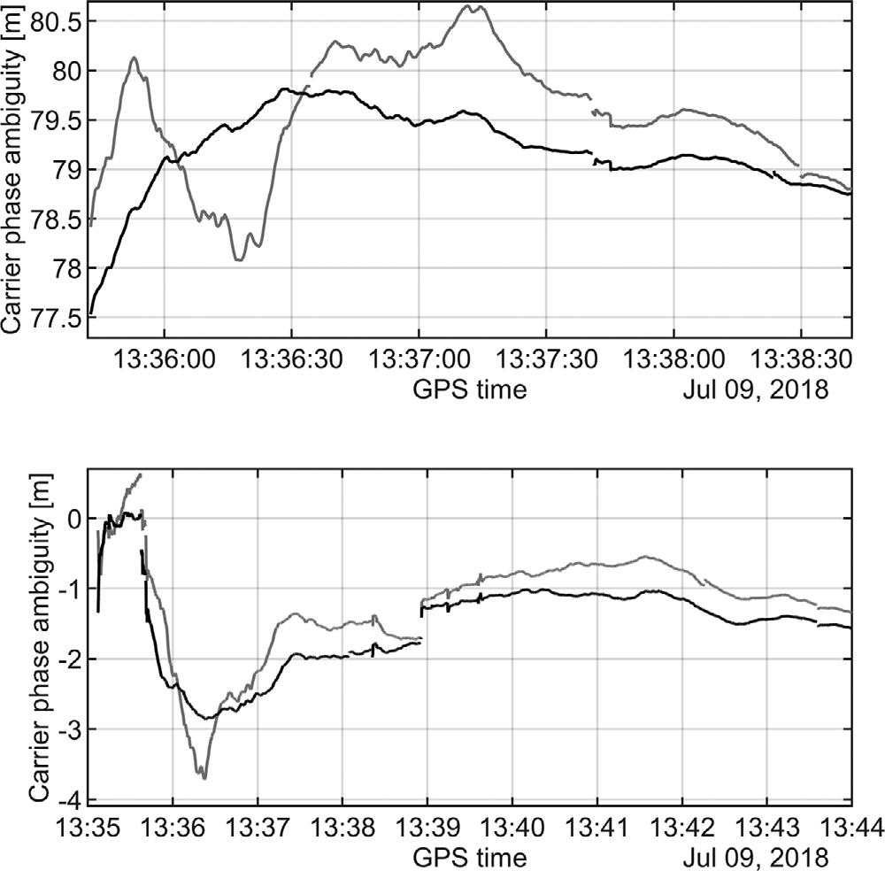
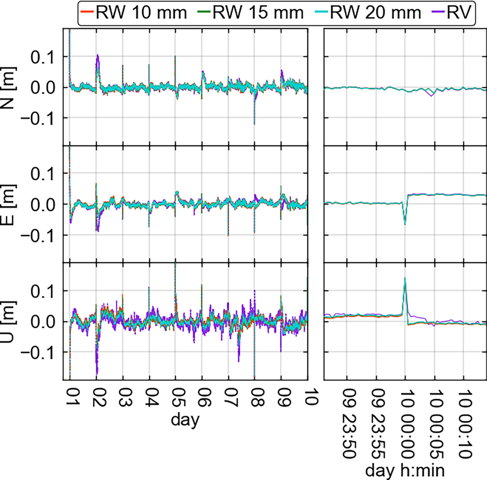
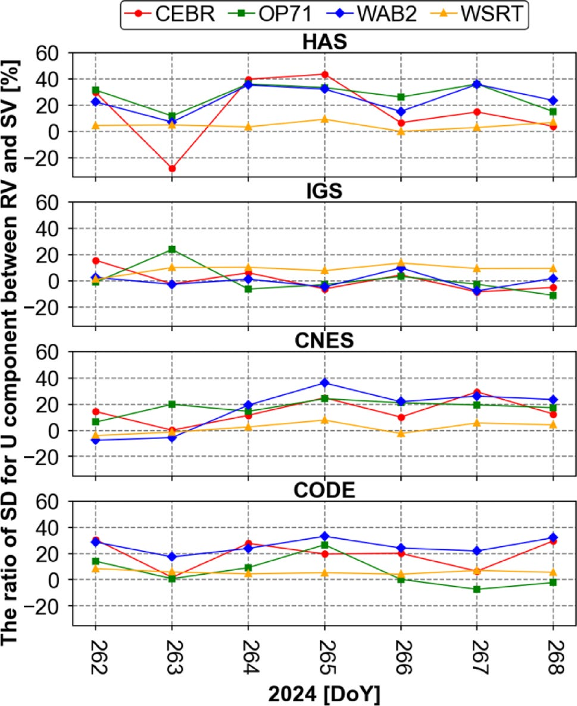

# 2026-08-08 GNSS 每日研究简报

## 今日快报

### 快报 1：GNSS 掩星折射率模型把成分变化和水凝物纳入可追溯误差预算

- 主题：`gnss-radio-occultation-refractivity-update`
- 来源 ID：`doi:10.5194/amt-19-5135-2026`
- 来源链接：https://doi.org/10.5194/amt-19-5135-2026
- 发表日期：2026-08-07
- 来源类型：同行评审开放论文
- 获取范围：CC BY 4.0 全文、公式、实验测量汇编与不确定度分析

**内容：** Aparicio 重新整理 L 波段大气折射率与空气密度、温度、水汽和成分的关系，更新主要气体的介电/磁性参数，并显式加入二氧化碳、氧气长期变化以及水凝物形状造成的弱双折射。方法解决的是旧经验式在大规模 GNSS 掩星同化中缺少成分可追溯性的问题。

**结论：** 作者的不确定度传播认为新表达式满足 0.01% 目标精度；成分与水凝物修正对主体折射率的改变量通常低于该阈值，但在高体量资料同化和气候趋势分析中不能继续默认严格常数。这里的 0.01% 是模型不确定度目标，不是单次掩星反演温度精度。

**关注理由：** 当接收机测得的弯曲角进入数值天气预报时，信号模型中的微小系统项会在大样本中积累；它展示了“改观测方程”与“调机器学习残差”之间应先做哪一步。

### 快报 2：Projected BIE 在混合整数模型中追求无偏且最小方差的连续参数估计

- 主题：`projected-bie-mixed-integer-gnss`
- 来源 ID：`doi:10.1007/s10291-026-02132-7`
- 来源链接：https://doi.org/10.1007/s10291-026-02132-7
- 发表日期：2026-08-07
- 来源类型：同行评审论文
- 获取范围：正式元数据、作者摘要、方法定义与出版平台可见公式；定量结论未越过可访问范围

**内容：** 论文针对连续坐标与整数模糊度耦合的 GNSS 模型，提出 projected best integer-equivariant estimator。它先利用整数等变结构形成 BIE，再把估计投影到无偏约束子空间，目标是在不强制一次硬固定的情况下减小连续参数方差。

**结论：** 作者将其定位为混合整数模型下新的无偏最小方差估计器，并与浮点、整数最小二乘和既有 BIE 类方法比较。摘要支持的是估计理论性质，不能直接推成任意 RTK 数据都会提高固定率。

**关注理由：** 它提醒工程实现不要把“整数搜索”与“坐标估计”混成同一步；错误固定风险较高时，软组合或等变估计提供了介于 float 与 hard-fix 之间的路径。

### 快报 3：稳健自适应 InSAR–GNSS 融合把三维形变与观测质量同时纳入

- 主题：`robust-adaptive-insar-gnss-3d-deformation`
- 来源 ID：`doi:10.1080/10106049.2026.2714639`
- 来源链接：https://doi.org/10.1080/10106049.2026.2714639
- 发表日期：2026-08-07
- 来源类型：同行评审论文
- 获取范围：正式元数据与作者摘要；全文访问受出版边界限制，因此不转述摘要之外的数值

**内容：** 研究把 InSAR 视线向高空间密度与 GNSS 三分量高时间稳定性放进同一稳健自适应融合框架，用观测残差动态调权并抑制异常点，解决单一 InSAR 对南北向不敏感、单一 GNSS 空间稀疏的问题。

**结论：** 作者摘要报告方法能改善三维地表形变恢复的稳定性，并减少异常观测对融合场的传播。由于摘要不足以审计每个试验区、参考真值和百分比，本简报不复述具体精度增益。

**关注理由：** 对形变监测而言，“更多传感器”只有在协方差、参考框架和异常门控同步处理时才有效；否则 GNSS 也可能只是在给 InSAR 自校准。

### 快报 4：GGM 加白噪声尝试用统一参数描述 GNSS 坐标时间序列的彩色噪声

- 主题：`ggm-white-noise-gnss-coordinate-series`
- 来源 ID：`doi:10.1088/1361-6501/ae96cb`
- 来源链接：https://doi.org/10.1088/1361-6501/ae96cb
- 发表日期：2026-08-07
- 来源类型：同行评审论文
- 获取范围：正式元数据、作者摘要与模型范围；出版许可未赋予全文再分发

**内容：** 论文评估 generalized Gauss–Markov plus white noise 是否能以一组统一参数覆盖 GNSS 坐标序列中从近白噪声到长记忆彩色噪声的变化，问题核心是速度和周期项不确定度不能继续按独立同分布残差计算。

**结论：** 作者把 GGM+WN 作为参数统一候选并检验不同站点序列的适配性；这不意味着所有站都共享同一个谱指数，也不能用拟合优度替代残差中的真实地球物理信号辨识。

**关注理由：** 速度场、季节项和形变告警的显著性都依赖噪声模型；低估时间相关性会让“毫米级趋势”显得过度确定。

### 快报 5：震前 GNSS-TEC 与 b 值空间对应是案例关联，不是地震预测器

- 主题：`gnss-tec-seismic-b-value-spatial-correspondence`
- 来源 ID：`doi:10.3390/rs18152574`
- 来源链接：https://doi.org/10.3390/rs18152574
- 发表日期：2026-08-04
- 来源类型：同行评审开放论文
- 获取范围：CC BY 4.0 全文、时空窗口、GNSS-TEC 处理与统计对照

**内容：** 作者把南加州与下加利福尼亚的地震 b 值低值区同震前 GNSS 总电子含量异常做空间对应，尝试检验应力局地化与电离层扰动是否在案例中共址。处理包含背景建模、异常阈值和空间重叠分析。

**结论：** 原文证据支持选定事件、窗口和处理链下的空间相关性；它不能排除空间天气、站网几何和多重试验造成的伪相关，也不构成前瞻预测能力。

**关注理由：** GNSS 遥感很容易把事后“重叠”写成因果。可操作的下一步应是预注册阈值、盲测未参与选参的事件，并同时报告未命中与误报。

## 深度研读

### 深读 1｜接收机工程｜接收机钟不是每历元都应自由漂：从钟噪声到 PPP 状态约束

- 类别：`receiver-engineering`
- 学习层级：`foundation`
- 选题定位：`经典基础`
- 来源 ID：`doi:10.1002/navi.444`
- 来源链接：https://doi.org/10.1002/navi.444
- 发表日期：2021-12-03
- 来源类型：同行评审开放论文与 10 Hz 城市车辆试验
- 获取范围：CC BY 4.0 全文、80 min 车辆数据、钟噪声谱、PPP/Kalman 模型与结果图
- 价值评分：96/100（相关性 20，经典价值 23，证据 19，教学价值 18，工程价值 16）

#### 为什么先学这个

单点 GNSS 同时解位置和接收机钟差；若每历元都把钟差当完全独立未知量，钟与垂向、对流层会高度相关。先理解振荡器稳定度怎样变成过程噪声，后面才能判断随机游走约束是在加入物理信息，还是在制造过强先验。

#### 先修知识

需要理解伪距/载波相位、接收机钟差、Kalman 滤波、Allan deviation、PPP 浮点模糊度和可检测偏差。稳定钟只减少接收机时间状态的不确定度，不能替代卫星钟产品、轨道、天线和大气改正。

#### 一句话逻辑

先用独立钟比对得到振荡器的谱特性，再把其允许变化写进状态转移协方差，滤波器便不必用坐标和对流层去吸收不合理的钟跳。

#### 研究问题与约束

Krawinkel 与 Schön 将被动氢钟接到多系统接收机，在城市与公路采集约 80 min、10 Hz 车辆数据，速度最高约 93 km/h。被动氢钟远优于量产 TCXO，论文证明的是物理钟先验的上限收益，不代表手机可以直接复制。

#### 核心方法论

作者先由功率谱/Allan deviation 估计氢钟的白频率与随机游走分量，在线性化 Kalman 滤波中分别构造 receiver-clock modeled（RCM）与每历元自由钟基线；两套方案使用相同 GNSS 观测和参考轨迹，再比较位置、速度、可靠性、对流层与模糊度。

#### 关键公式逐步推导

未组合载波观测中的接收机钟项为：

```math
L_i^s=\rho^s+c(\delta t_r-\delta t^s)+T^s-I_i^s+\lambda_iN_i^s+\varepsilon_i^s
```

把钟状态写成 $`x_c=[\delta t_r,\dot{\delta t}_r]^T`$，一步传播近似为：

```math
x_{c,k+1}=\begin{bmatrix}1&\Delta t\\0&1\end{bmatrix}x_{c,k}+w_k,\qquad w_k\sim\mathcal N(0,Q_c)
```

$`Q_c`$ 由实测钟噪声谱给出；设得无穷大就退回逐历元自由钟，设得过小则会把真实钟跳强迫进位置残差。

#### 经典价值与创新边界

论文把频率计量的噪声参数真正落到动态 PPP 滤波，而非仅在静态时间传递中讨论。边界是硬件使用被动氢钟、车辆试验只有一套环境，且 RCM 不会自动缩短模糊度重新收敛。

#### 整体逻辑链

外部比对振荡器；识别噪声类型；换算过程噪声；构建同观测双方案；用独立惯导参考；分开评估位置、速度、钟、对流层和模糊度；检查遮挡时是否出现过强约束。

#### 原文图表与结果分析



> 图源：Krawinkel 与 Schön《Improved high-precision GNSS navigation with a passive hydrogen maser》Figure 18，[NAVIGATION 原文](https://doi.org/10.1002/navi.444)，CC BY 4.0。由作者开放 PDF 直接提取原嵌入图像；未裁切数据区域、重绘曲线或修改标签。

横轴为 2018-07-09 的 GPS time，纵轴为载波模糊度，单位 m；上下图分别是 GPS G07 与 Galileo E09 的代表弧段，黑/灰线对应有/无 RCM。钟约束让短期轨迹更平滑，但两方案最终趋向相近值。图不能证明整数固定正确，也不能说明收敛时间普遍缩短。

#### 原文结果论述

作者报告在该车辆试验中，RCM 对位置精度、速度精度和外部可靠性的改善约为 15%、57% 和 30%；稀疏几何时可抑制大漂移。模糊度收敛时间没有改善，这与图 18 的“更平滑但终值近似”一致。

#### 常见误区与适用边界

第一，把稳定钟等同更多卫星。第二，把 $`Q_c=0`$ 当理想模型。第三，忽略系统间偏差。第四，用滤波器形式协方差代替外部误差。第五，把氢钟收益外推到 TCXO。第六，看到平滑曲线就宣称更准确。

#### 工程实现步骤

1. 记录 1 PPS/10 MHz 接口和接收机时标。
2. 以独立钟比对估计 Allan deviation。
3. 把噪声系数换算到实际采样间隔的 $`Q_c`$。
4. 对钟跳设置创新门控和重置逻辑。
5. 同时监测垂向、ZTD、ISB 与钟残差。
6. 用外部轨迹检验而非只看形式协方差。

#### 复现实验设计

同一双频接收机依次接 TCXO、OCXO、CSAC 和实验室氢钟，在开阔、树荫、城市峡谷各跑 10 条 20 min 路线，10 Hz；比较逐历元钟、随机游走钟和过强钟约束。指标为 3D RMSE、95% 误差、钟创新、错误告警率和遮挡后恢复时间；失败条件为真实钟跳漏检或 3σ 覆盖率显著不足。

#### 与定位及低成本实现的联系

低成本平台未必能安装氢钟，但可以先标定自身 TCXO 的温度和动态噪声，再按工况调 $`Q_c`$。收益主要来自不让钟、垂向和对流层互相“借误差”。

#### 本节小结

接收机钟是可建模的随机过程。物理先验能稳定 PPP，但先验强度必须来自实际振荡器，并保留钟跳降级路径。

### 深读 2｜接收机工程｜多系统 PPP 的共同钟与 ISB：随机游走约束必须成套设计

- 类别：`receiver-engineering`
- 学习层级：`intermediate`
- 选题定位：`基础进阶`
- 来源 ID：`doi:10.1007/s10291-023-01556-9`
- 来源链接：https://doi.org/10.1007/s10291-023-01556-9
- 发表日期：2023-10-27
- 来源类型：同行评审开放论文
- 获取范围：CC BY 4.0 全文、Galileo/多系统 PPP 模型、10 个氢钟站、30 s 数据与全部结果图
- 价值评分：97/100（相关性 20，经典价值 23，证据 20，教学价值 18，工程价值 16）

#### 为什么先学这个

上一节只有“稳定接收机钟”这一个先验；加入 GPS、Galileo、GLONASS、BDS 后，还会出现系统间偏差 ISB。若只约束共同钟而让 ISB 任意跳，或把两者同强度约束，钟信息都会被重新泄漏。

#### 先修知识

需要掌握未差未组合 PPP、系统特定接收机钟、ISB、静态/运动学状态设置和随机游走。还要区分坐标真实误差与同日解的 IQR/STD。

#### 一句话逻辑

共同钟提供跨历元稳定性，ISB 承接星座硬件差；两者的随机游走尺度应按硬件关系分配，而不是简单复制一个数。

#### 研究问题与约束

作者处理十个接氢钟 IGS 站的 Galileo-only 与 multi-GNSS 双频 30 s 数据，比较逐历元自由钟 RV 与不同随机游走约束。站点、钟类型和产品质量都较高，结论不是普通手机 PPP 的直接性能承诺。

#### 核心方法论

模型以 GPS 共同钟为参考并估计其他星座 ISB；分别只约束共同钟，或同时约束共同钟和 ISB，并测试不同强度比。运动学解看 N/E/U 稳定度，静态解看钟差时间传递和 ZTD。

#### 关键公式逐步推导

多系统接收机钟可分解为：

```math
\delta t_r^{M}=\delta t_r^{G}+ISB_M^G
```

随机游走增量满足：

```math
\delta t_{r,k+1}^{G}-\delta t_{r,k}^{G}\sim\mathcal N(0,q_c\Delta t),\quad
ISB_{M,k+1}^{G}-ISB_{M,k}^{G}\sim\mathcal N(0,q_{ISB}\Delta t)
```

论文比较不同 $`q_c:q_{ISB}`$；这个比值表达“共同钟更稳定、系统间硬件偏差可缓慢变化”的工程假设。

#### 经典价值与创新边界

价值在于把 clock/ISB 约束从单星座扩展到四系统，并给出约束比例消融。边界是氢钟站与 30 s 后处理，且改善主要在 U 与钟稳定性，不是所有水平分量都显著收益。

#### 整体逻辑链

统一观测模型；选择参考星座；估计共同钟和 ISB；施加候选随机游走；跑 Galileo-only 与 multi-GNSS；按钟类型分层；检查坐标、钟、ZTD 和日界连续性。

#### 原文图表与结果分析



> 图源：Mikoś 等《Stochastic modeling of the receiver clock parameter in Galileo-only and multi-GNSS PPP solutions》Figure 13，[GPS Solutions 原文](https://doi.org/10.1007/s10291-023-01556-9)，CC BY 4.0。由开放 PDF 直接提取原嵌入图像；未改变颜色、坐标轴或数值。

左列横轴为前九天，右列放大第 9/10 天边界；纵轴依次为 N/E/U，单位 m。RW 10/15/20 mm 与逐历元 RV 在水平近似重合，U 方向 RV（紫）更散；BRUX 的 U 标准差由 RV 的 32 mm 降到三种 RW 的约 28 mm。图不能证明约束对普通晶振同样有效。

#### 原文结果论述

多系统解中，氢钟站 AMC4、BRUX、CRO1、PTBB 的 U 分量通常受益；论文指出共同钟约束加常数 ISB，或 clock:ISB 约束约 1:100，表现相近，而 1:1 与 1:10 较差。非氢钟站不保证改善。

#### 常见误区与适用边界

第一，把 ISB 当全局常数。第二，所有星座共用一只钟就忽略前端硬件差。第三，只看一天边界。第四，以最小 STD 选参而不做外部检核。第五，把 30 s 随机游走直接复制到 1 Hz。

#### 工程实现步骤

1. 明确参考星座和每条频率链路。
2. 先自由估计 clock/ISB 取得增量统计。
3. 按采样率换算 $`q_c,q_{ISB}`$。
4. 用日界、温度变化和重启段做压力测试。
5. 分钟与小时尺度分别看 Allan/MDEV 和坐标误差。
6. 非稳定钟设备保留自动退回 RV 的门控。

#### 复现实验设计

选 6 个氢钟、6 个铷钟、6 个内置晶振 IGS 站，GPS+Galileo+BDS 三系统连续 30 天，1/30 s 两种采样。比较 RV、只约束钟、1:1、1:10、1:100；指标为 U 的 STD/IQR、外部坐标 RMSE、ISB 增量、日界跳变和 3σ 覆盖。失败条件为非稳定钟站改善来自过度平滑。

#### 与定位及低成本实现的联系

量产接收机最现实的做法不是强制稳定钟，而是在线识别时钟状态：温度平稳时收紧，重启或硬件不连续时放开，同时让 ISB 有独立状态。

#### 本节小结

多系统 PPP 的钟约束是一个成套随机模型问题；共同钟、ISB 与采样率必须一起标定。

### 深读 3｜纯 GNSS 定位｜实时 PPP 稳定性：把接收机钟模型跨 HAS、IGS、CNES 与 CODE 做外部检验

- 类别：`positioning`
- 学习层级：`advanced`
- 选题定位：`定位深入`
- 来源 ID：`doi:10.1007/s10291-026-02048-2`
- 来源链接：https://doi.org/10.1007/s10291-026-02048-2
- 发表日期：2026-03-05
- 来源类型：同行评审开放论文
- 获取范围：CC BY 4.0 全文、14 个氢钟站、HAS/IGS/CNES 实时与 CODE 最终产品、静态/运动学 PPP
- 价值评分：98/100（相关性 20，经典价值 23，证据 20，教学价值 18，工程价值 17）

#### 为什么先学这个

上一节证明随机游走在站网后处理可行；高级问题是产品误差、收敛段和实时改正不同会不会淹没钟模型收益。该论文把同一策略放进四类产品和十四站，接近部署前的交叉检验。

#### 先修知识

需要理解 Galileo HAS、IGS/CNES 实时产品、CODE 最终产品，静态与运动学 PPP，IQR/STD、形式误差和收敛剔除。HAS 是卫星播发改正，不等于接收机已经正确实现全部 PPP 模型。

#### 一句话逻辑

若钟先验是接收机侧真实物理信息，它的收益应在不同卫星产品上保留；若只在单一产品有效，就可能是在补偿该产品或实现的特定缺陷。

#### 研究问题与约束

研究使用 14 个接氢钟站，GPS+Galileo，比较逐历元钟 RV 与随机游走钟 SV；产品含 Galileo HAS、IGS 与 CNES 实时以及 CODE 最终轨钟。结论依赖高稳定氢钟，不覆盖手机或一般测量接收机内置晶振。

#### 核心方法论

两策略共享观测、权模型、对流层和产品；分别跑静态/运动学解，按站、产品、天和不同起算时长统计 U 与 3D 标准差、相邻历元差、异常值和形式误差，并检查去掉初始收敛段后的结果。

#### 关键公式逐步推导

逐历元自由钟相当于：

```math
Q_{c,k}\rightarrow\infty
```

随机游走钟使用有限 $`Q_{c,k}=q_c\Delta t`$。以垂向标准差比较收益：

```math
G_U=100\times\frac{\sigma_{U,RV}-\sigma_{U,SV}}{\sigma_{U,RV}}\ \%
```

$`G_U>0`$ 表示钟约束更稳定；它不是绝对精度，也必须与外部坐标和覆盖率同时解释。

#### 经典价值与创新边界

价值在跨四类产品、十四站和不同时间窗验证，而不是再给一个单站示例。边界是只研究氢钟、主要评价稳定度与离散度，不能把正百分比直接解释为同等绝对精度增益。

#### 整体逻辑链

选稳定钟站；统一 GPS+Galileo；接入四类产品；生成 RV/SV；按天统计；剔除/保留收敛段双算；检查形式误差与异常；分站解释负收益；形成可部署门控。

#### 原文图表与结果分析



> 图源：Mikoś 等《Improving the stability of real-time PPP solutions by receiver clock modeling》Figure 11，[GPS Solutions 原文](https://doi.org/10.1007/s10291-026-02048-2)，CC BY 4.0。由开放 PDF 直接提取原嵌入图像；未重绘、筛点或修改轴标签。

横轴为 2024 年第 262—268 日，纵轴为 U 标准差从 RV 到 SV 的改善比例，单位 %；四行依次为 HAS、IGS、CNES、CODE，颜色区分 CEBR、OP71、WAB2、WSRT。多数点为正，但 HAS/CEBR 第 263 日等出现负值，说明钟约束不是逐日必胜。图只覆盖四个代表站的周结果，不能代表全部十四站。

#### 原文结果论述

作者报告静态 PPP 前三小时 U 分量 IQR 的最大改善，HAS/IGS/CNES/CODE 分别可达 59%/21%/25%/38%；运动学 U 标准差最大改善分别可达 38%/50%/18%/26%。这些是跨站最大值而非平均承诺；图 11 的逐日负值说明必须保留站/产品门控。

#### 常见误区与适用边界

第一，把最大改善当均值。第二，把稳定度当绝对准确度。第三，忽略产品间钟基准差。第四，仅在收敛段比较。第五，用氢钟模型约束石英钟。第六，只报告正值日。

#### 工程实现步骤

1. 对每类产品统一卫星、偏差与参考框架。
2. 记录产品龄期、中断和解码状态。
3. 并行运行 RV/SV 影子解。
4. 在线计算钟创新白化和 U 覆盖率。
5. 负收益或钟跳时自动退回 RV。
6. 分产品、站和收敛时长出具周报。

#### 复现实验设计

复现 14 站 7 天并扩展至 30 天；加入模拟 30/120 s 产品中断与阶跃钟差。比较 HAS/IGS/CNES/CODE 下 RV、固定 SV、创新自适应 SV；指标为 U/3D RMSE、STD、95% 误差、可用率、错误约束检出率和计算量。失败条件为改善 STD 但外部 RMSE或 3σ 覆盖变差。

#### 与定位及低成本实现的联系

这是纯 GNSS PPP 的接收机侧增强，不需要基站或惯导；但低成本实现必须先有可标定振荡器。对普通硬件，更可行的是自适应钟模型加可靠退回，而非复制氢钟过程噪声。

#### 本节小结

跨产品验证表明稳定接收机钟可改善实时 PPP 垂向稳定性；部署判据应看逐站、逐日外部误差，并允许负收益时退出。
