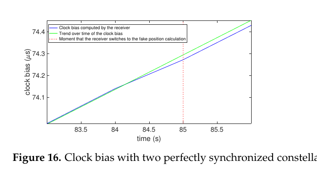
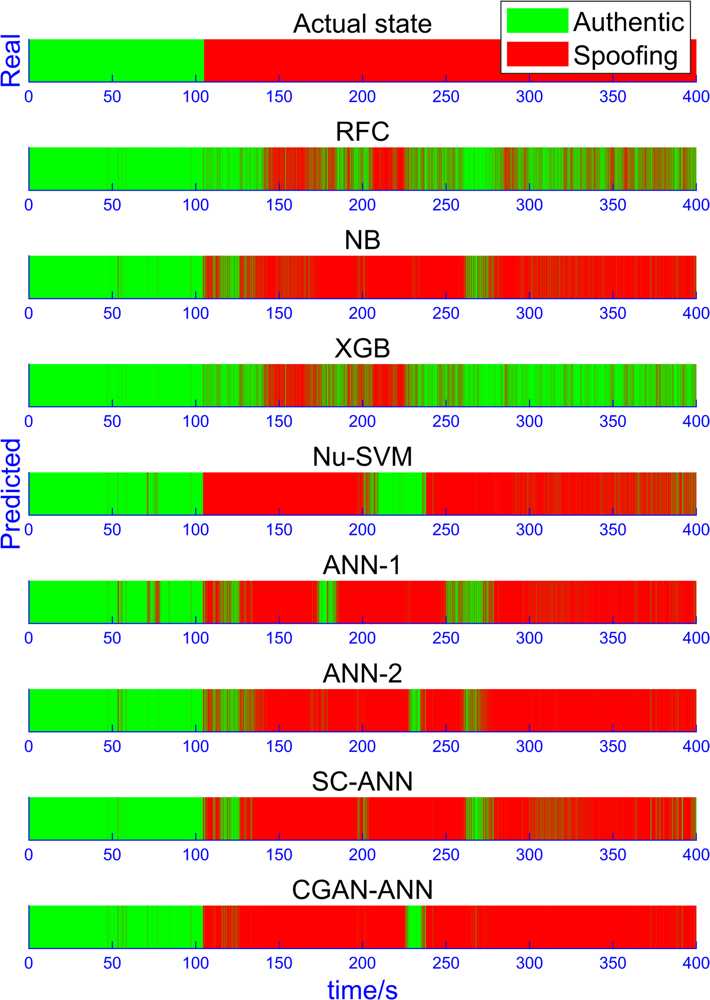
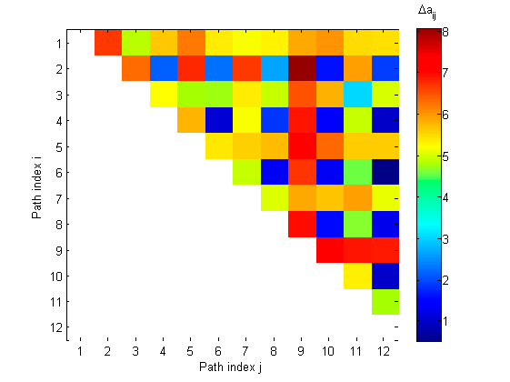

# 2026-08-09 GNSS 每日研究简报

## 今日快报

### 快报 1：车辆 SLAM 让 GNSS 拒止区的无线电地图从人工测绘转向随行采集

- 主题：`vehicle-slam-radio-map-gnss-denied`
- 来源 ID：`doi:10.3390/s26165049`
- 来源链接：https://doi.org/10.3390/s26165049
- 发表日期：2026-08-09
- 来源类型：同行评审开放论文
- 获取范围：CC BY 4.0 全文、车辆 SLAM、信号采集、地图生成与实测验证

**内容：** 方法让装有测距/惯性与无线信号接收设备的车辆同步估计轨迹和信号指纹，把传统逐点标定的 radio map 变为沿道路快速构建。它解决 GNSS 拒止区定位系统在部署前采集成本高、地图更新慢的问题。

**结论：** 原文实验证明随车 SLAM 轨迹可支撑无线电地图生成并用于后续匹配；性能依赖 SLAM 自身闭环、传感器标定和环境稳定性，不能把“有地图”解释为绝对坐标已经可追溯。

**关注理由：** GNSS 中断后的替代定位往往受制于先验地图。该工作把地图误差也纳入定位链条，而不是只比较在线算法。

### 快报 2：复杂工业区多模态 UAV 数据集把 GNSS 拒止、遮挡和结构重复放进同一基准

- 主题：`multimodal-uav-dataset-gnss-denied-industrial`
- 来源 ID：`doi:10.3390/drones10080611`
- 来源链接：https://doi.org/10.3390/drones10080611
- 发表日期：2026-08-09
- 来源类型：同行评审开放数据论文
- 获取范围：CC BY 4.0 全文、数据格式、传感器配置、场景说明与基准任务

**内容：** 数据集同步记录 LiDAR、相机、惯性和导航参考，覆盖重复钢结构、遮挡与 GNSS 不可用的工业环境，用于检验多模态 UAV 定位与建图。重点是把时间戳、外参和场景难度公开，而非只发布漂亮轨迹。

**结论：** 数据能支持算法间可重复比较，但参考轨迹、传感器失效模式和训练/测试区域仍限定可推广性；在同一园区拟合良好不等于跨工业设施泛化。

**关注理由：** 对 GNSS/INS/视觉融合，数据同步与真值通常比滤波器名字更决定结果。开放基准能暴露“测试轨迹就是训练轨迹”的隐性泄漏。

### 快报 3：地下采煤区 GNSS 站址选择加入多源遥感，不再只看天空开阔度

- 主题：`multisource-gnss-site-selection-mining-subsidence`
- 来源 ID：`doi:10.3390/s26165057`
- 来源链接：https://doi.org/10.3390/s26165057
- 发表日期：2026-08-09
- 来源类型：同行评审开放论文
- 获取范围：CC BY 4.0 全文、多源遥感因子、站址评价与矿区案例

**内容：** 研究把地形、地表覆盖、采动影响和遥感形变信息同 GNSS 可视条件组合，形成面向采煤沉陷区的多准则站址选择。它解决“信号好但地质代表性差”的监测站部署问题。

**结论：** 结果支持多源因子比单一几何筛选更能区分候选站，但权重与矿区条件相关；评分高不保证基础稳定、供电通信或长期天线环境合格。

**关注理由：** GNSS 监测误差预算从选址就开始。站网代表性错误无法靠后端 PPP 或滤波补救。

### 快报 4：Wiener 伪量测在短时 GNSS 中断中约束低成本 INS，但不会创造新真值

- 主题：`wiener-pseudomeasurement-low-cost-ins-gnss-outage`
- 来源 ID：`doi:10.1142/s2301385028500549`
- 来源链接：https://doi.org/10.1142/s2301385028500549
- 发表日期：2026-08-04
- 来源类型：同行评审论文
- 获取范围：正式元数据、作者摘要、滤波架构与可访问方法说明；未引用受限全文中的数值

**内容：** 方法在 GNSS 短时失锁期间用 Wiener 预测生成位置/速度伪量测，继续给低成本 INS 的 EKF 提供约束。它处理的是惯性误差快速增长，而不是恢复被遮挡的卫星观测。

**结论：** 作者报告瞬态中断下比纯惯导更稳健；伪量测与先前 GNSS/INS 状态高度相关，若当作独立观测会重复使用信息并低估协方差。

**关注理由：** 所有“补全 GNSS”的学习或滤波方法都应标注信息来源。预测可改善连续性，但不能升级完整性等级。

### 快报 5：RTK-GNSS 给南爪哇海岸阶地形貌定量，但地貌解释仍需要独立地质证据

- 主题：`rtk-gnss-coastal-terrace-morphology-java`
- 来源 ID：`doi:10.3390/geographies6030073`
- 来源链接：https://doi.org/10.3390/geographies6030073
- 发表日期：2026-08-04
- 来源类型：同行评审开放论文
- 获取范围：CC BY 4.0 全文、RTK 测线、地形剖面与地貌解释

**内容：** 作者用 RTK-GNSS 获取南爪哇沿岸台阶状地貌的高程与剖面，再与遥感和地质背景结合判断其海岸阶地特征。GNSS 解决的是几何量化，不直接决定形成机制。

**结论：** 测量支持阶地状高程分级和空间延续性；构造抬升、海平面变化或侵蚀贡献仍需年代学和沉积/构造证据约束。

**关注理由：** 这是“厘米级坐标不等于厘米级科学结论”的典型案例：观测精度与模型可辨识性必须分开报告。

## 深度研读

### 深读 1｜接收机工程｜先看接收机钟差：低成本 PVT 输出能发现哪类欺骗，又会漏掉哪类

- 类别：`receiver-engineering`
- 学习层级：`foundation`
- 选题定位：`经典基础`
- 来源 ID：`doi:10.3390/s23052735`
- 来源链接：https://doi.org/10.3390/s23052735
- 发表日期：2023-03-02
- 来源类型：同行评审开放论文、信号模拟器与商用接收机实验
- 获取范围：CC BY 4.0 全文、计算模型、静态/移动试验、钟差与钟漂结果
- 价值评分：96/100（相关性 20，经典价值 23，证据 19，教学价值 18，工程价值 16）

#### 为什么先学这个

许多低成本设备拿不到相关器或原始 IQ，只能读取 PVT、$`C/N_0`$、钟差和钟漂。钟差是所有伪距共同项，欺骗信号接管时常留下跳变；但攻击者若与真实系统高度同步，跳变可能很小。先学这个边界，才能避免把一个廉价检测量写成万能认证。

#### 先修知识

需要理解伪距中的接收机钟差、钟漂、同步欺骗、carry-off、虚假位置和 ROC。钟差由接收机联合估计，不是外部可信时钟。

#### 一句话逻辑

欺骗星座同真实星座的时间/空间不一致会投影成共同钟差突变；距离越远或时标越不同，越容易检测，完全同步时最难。

#### 研究问题与约束

作者用 Matlab 模型、Labsat/Spirent 模拟器和两代商用接收机，测试固定与移动目标、不同攻击位置和同步程度。实验主要是单一设备族与受控信号，不覆盖多发射机、复杂多路径或攻击者闭环适应检测器。

#### 核心方法论

先记录无攻击钟差/钟漂分布；构造真实与虚假星座切换；改变目标—欺骗位置距离及时钟同步；测量接管时钟差跳变与钟漂峰值；最后按阈值扫描得到检测概率和误警概率。

#### 关键公式逐步推导

伪距写作：

```math
P^s=\rho^s+c\delta t_r-c\delta t^s+\varepsilon^s
```

真实与虚假位置引起的共同范围差若被钟状态吸收，则近似：

```math
\Delta \delta t_r\approx\frac{\overline{\rho}_{spoof}-\overline{\rho}_{auth}}{c}+\Delta t_{spoofer}
```

检测统计量可取相邻钟差增量 $`T_k=|\delta t_{r,k}-\delta t_{r,k-1}|`$，阈值应由无攻击数据的尾部确定。

#### 经典价值与创新边界

价值是只用高层 PVT 状态构建可落地的低成本检测，并系统展示距离与同步的影响。边界是同步攻击会让检测量趋近正常，钟差异常也可能来自接收机重启、星座切换或温度。

#### 整体逻辑链

建立无攻击基线；模拟距离与同步；注入接管；提取 clock bias/drift；构造阈值；计算 ROC；在第二代接收机复验；列出同步攻击盲区。

#### 原文图表与结果分析



> 图源：Truong 等《Characterization of the Ability of Low-Cost GNSS Receiver to Detect Spoofing Using Clock Bias》Figure 16，[Sensors 原文](https://doi.org/10.3390/s23052735)，CC BY 4.0。由原 PDF 第 14 页以 180 dpi 渲染，仅裁出原图与图注；未重绘或改变曲线。

横轴是时间 s，纵轴是 clock bias，单位 μs；红虚线约 85 s 表示切换到虚假位置，蓝色接收机钟差只相对绿色趋势产生很小偏离。图直接展示完全同步星座会压低钟差突变可见性；它不能证明攻击毫无其他 RF/空间特征。

#### 原文结果论述

论文的模型与实验都显示钟差跳变幅度受欺骗位置距离和两套时标同步程度控制；同步越好，单钟差检测越弱。作者据此提出按设备、信号条件和预期攻击范围表征检测能力，而不是给通用阈值。

#### 常见误区与适用边界

第一，把接收机钟当可信外部钟。第二，用固定阈值跨设备。第三，把重启钟跳当攻击。第四，只测试突然接管。第五，不报告同步攻击。第六，用同一模拟器生成真实/虚假信号却外推真实威胁。

#### 工程实现步骤

1. 保存钟差、钟漂、星座切换和重启标志。
2. 分温度/场景建立无攻击增量分布。
3. 用鲁棒中位数与尾部分位设阈值。
4. 把钟差告警同 $`C/N_0`$、残差和 Doppler 交叉验证。
5. 告警后冻结可信状态并降级。
6. 对同步 carry-off 单独做红队测试。

#### 复现实验设计

两款低成本接收机、静态和车载各 20 次；攻击含突然接管、60 s 平滑接管、0/100/500 m 虚假位置和 0/0.1/1 μs 时差。指标为 ROC、检测延迟、最大未检位置误差和重启误警；失败条件是在位置误差超过 50 m 前仍无告警。

#### 与定位及低成本实现的联系

钟差检测几乎不增加硬件成本，适合作为完整性状态机的一层；它只能提供异常证据，不能验证信号来源。

#### 本节小结

接收机钟差是廉价但条件化的欺骗检测量；同步攻击和正常设备事件必须写进盲区。

### 深读 2｜接收机工程｜从手工 SQM 到轻量特征与 CGAN：未知欺骗场景仍要看时间定位

- 类别：`receiver-engineering`
- 学习层级：`intermediate`
- 选题定位：`基础进阶`
- 来源 ID：`doi:10.1007/s10291-025-01938-1`
- 来源链接：https://doi.org/10.1007/s10291-025-01938-1
- 发表日期：2025-07-24
- 来源类型：同行评审开放论文与多场景欺骗数据
- 获取范围：CC BY 4.0 全文、四组轻量特征、CGAN/ANN 架构、消融与未知场景测试
- 价值评分：97/100（相关性 20，经典价值 22，证据 20，教学价值 18，工程价值 17）

#### 为什么先学这个

钟差只看导航域共同项；相关峰、接收功率、early-late 和码—Doppler 一致性提供更早信号域证据。问题是手工阈值在新攻击功率、相位和动态下失效，因此需要学习器，但必须保留物理特征和时间级验证。

#### 先修知识

需要理解 E/P/L 相关器、功率变化、码相与 Doppler、一维卷积/ANN、GAN 数据增强、类别混淆矩阵。样本级准确率不能替代攻击起点检测延迟。

#### 一句话逻辑

用少量接收机已有特征覆盖功率、相关形状与运动一致性，再用 CGAN 补足未知组合，最终按时间序列输出 authentic/spoofing。

#### 研究问题与约束

作者从 RF/跟踪模块提取四类轻量特征，构造已知与未知欺骗场景，比较规则、NB、XGB、SVM、ANN 与 CGAN-ANN。场景仍来自特定数据/生成机制，CGAN 不能生成它没学到的物理攻击族。

#### 核心方法论

先以滑窗提取 received power、peak correlation symmetry、early-late power 和 pseudorange-Doppler consistency；做特征消融；训练 ANN；用 conditional GAN 生成稀缺场景伪样本；在未参与训练的攻击场景按时序比较输出。

#### 关键公式逐步推导

以码—Doppler 一致性为例：

```math
r_k=\frac{P_k-P_{k-1}}{\Delta t}+\lambda f_{D,k}
```

正常时 $`r_k`$ 仅含噪声和建模误差，欺骗牵引会产生持续偏离。分类器输出 $`p_k=P(y_k=spoof|z_k)`$，部署告警应要求连续 $`m`$ 个窗超过阈值，而非逐样本跳变。

#### 经典价值与创新边界

价值是特征来自普通相关器而非昂贵阵列，并把未知场景与特征消融列为主评估。边界是生成数据可能缩小真实域差，样本准确率也会被长时间正常段抬高。

#### 整体逻辑链

同步原始状态；提取四组特征；按攻击过程切分；训练基线；CGAN 扩增；整段未知场景推理；计算检测率、误警和延迟；检查缺失特征降级。

#### 原文图表与结果分析



> 图源：Chen 等《GNSS spoofing detection based on lightweight features and CGAN-ANN in unknown scenarios》Figure 13，[GPS Solutions 原文](https://doi.org/10.1007/s10291-025-01938-1)，CC BY 4.0。由开放 PDF 直接提取原嵌入图像；未重采样时间轴或修改分类颜色。

横轴为 0—400 s，绿色 authentic、红色 spoofing；真实状态约 105 s 后转为欺骗。RFC/XGB 在后段频繁回绿，NB 与若干 ANN 存在错分，CGAN-ANN 大体跟随真实状态但在约 225 s 附近仍短暂回绿。图能展示检测延迟与间歇漏检，不能从视觉直接计算独立部署误警率。

#### 原文结果论述

论文报告完整多参数特征的多种网络在已知场景检测率可超过 99%，但未知场景差异更能区分模型；CGAN-ANN 的时间输出更连续。99% 是论文数据上的样本结果，不是现场保证。

#### 常见误区与适用边界

第一，随机打散相邻窗造成数据泄漏。第二，只报 accuracy。第三，让 CGAN 训练/测试共享攻击轨迹。第四，忽略计算延迟。第五，把相关器输出可得性想当然。第六，不测试正常多路径。

#### 工程实现步骤

1. 明确接收机可输出的 E/P/L 与 Doppler。
2. 以整段路线分训练/测试。
3. 对每组特征做单位和缺失标记。
4. 校准概率并加持续窗门控。
5. 输出触发原因而非单一标签。
6. 在线监测域漂移和异常频率。

#### 复现实验设计

使用公开 TEXBAT 加本地模拟器与真实多路径路线；攻击参数整族留出测试。比较规则、XGB、ANN、CGAN-ANN；指标为事件级检测率、每小时误警、检测延迟、最大未检位置偏差和 Jetson/MCU 推理时间。失败条件为未知攻击或正常城市段误警显著恶化。

#### 与定位及低成本实现的联系

轻量特征比原始 IQ 更适合量产接收机，但需固件开放跟踪状态。模型输出应进入完整性门控，不能直接替代 PVT。

#### 本节小结

物理特征加数据驱动可扩展欺骗检测，但未知场景必须以整段时间行为和事件级指标验证。

### 深读 3｜纯 GNSS 定位｜多天线空间一致性：用到达方向分离真实卫星与同源欺骗

- 类别：`positioning`
- 学习层级：`advanced`
- 选题定位：`定位深入`
- 来源 ID：`doi:10.3390/s19102411`
- 来源链接：https://doi.org/10.3390/s19102411
- 发表日期：2019-05-27
- 来源类型：同行评审开放论文与阵列仿真
- 获取范围：CC BY 4.0 全文、阵列/导向向量模型、两种欺骗场景、检测与波束抑制
- 价值评分：97/100（相关性 20，经典价值 23，证据 19，教学价值 18，工程价值 17）

#### 为什么先学这个

前两节的时间、功率和相关特征都可能被精细控制；空间到达方向提供独立维度。真实卫星来自多个天空方向，而单点欺骗器的伪卫星往往共源，因此阵列能在不信任导航解的情况下做一致性检验。

#### 先修知识

需要理解阵列流形、导向向量、相位差、$`C/N_0`$、多路径、波束形成与几何姿态。阵列相位必须标定，且多发射机攻击会削弱“共源”假设。

#### 一句话逻辑

估计各已捕获信号的空间导向向量；若多颗“卫星”的向量过于接近，就判为同源欺骗，并在阵列权值中对该方向置零。

#### 研究问题与约束

论文使用 16 单元阵列仿真中间型欺骗，先让伪信号与真实峰对齐再牵引，研究检测、伪星分组和零陷抑制。证据是仿真，不包含真实阵列互耦、车体反射或分布式多源攻击。

#### 核心方法论

信号捕获后估计每个路径的导向向量；计算任意路径对的归一化距离；根据 $`C/N_0`$ 建立无欺骗距离分布与阈值；把过近路径聚成欺骗源；保留空间分散的真实方向，并设计零陷/波束权重抑制欺骗。

#### 关键公式逐步推导

阵列导向向量为：

```math
a(\theta,\phi)=\left[e^{-j\frac{2\pi}{\lambda}r_1^Tu},\ldots,e^{-j\frac{2\pi}{\lambda}r_M^Tu}\right]^T
```

两路径空间距离可写：

```math
d_{ij}=\min_{\alpha}\frac{\|a_i-\alpha a_j\|_2}{\|a_i\|_2}
```

同一欺骗发射机的多伪星方向近似相同，$`d_{ij}`$ 小；真实卫星方向不同，通常更大。

#### 经典价值与创新边界

价值是把检测与抑制串成同一空间处理链，并针对中间型接管而非仅强功率突入。边界是单点/少源欺骗假设、16 单元阵列成本和纯仿真验证。

#### 整体逻辑链

阵列校准；捕获路径；估计导向向量；按噪声设距离阈值；构建路径对矩阵；聚类真实/欺骗；形成零陷；重新跟踪；检查定位残差与保护级。

#### 原文图表与结果分析



> 图源：Magiera《A Multi-Antenna Scheme for Early Detection and Mitigation of Intermediate GNSS Spoofing》Figure 7，[Sensors 原文](https://doi.org/10.3390/s19102411)，CC BY 4.0。由开放 PDF 直接提取原嵌入图像；未改变矩阵单元、色标或索引。

横纵轴是 12 条路径索引，颜色为路径对导向向量距离 $`\Delta a_{ij}`$，色标约 1—8；上三角中成块的低值/高值关系用于区分同源伪星与方向分散路径。矩阵只显示论文场景 1 的估计关系，不能给出现实阵列的通用阈值。

#### 原文结果论述

作者在两种仿真场景中识别同源伪路径，并通过阵列权值对欺骗方向形成零陷，同时维持真实信号接收。结果支持方法链可行，不等于已在动态车辆或多欺骗器下达到完整性认证。

#### 常见误区与适用边界

第一，阵列未标定。第二，把多路径也当欺骗。第三，假定攻击永远单源。第四，忽略姿态变化。第五，用阵元数增加代替完好率分析。第六，抑制后不重算噪声协方差。

#### 工程实现步骤

1. 标定阵元位置、相位、互耦与温度漂移。
2. 用真实星历方向验证阵列流形。
3. 按 $`C/N_0`$ 分层估计 $`d_{ij}`$ 正常分布。
4. 将多路径延迟与空间距离联合判别。
5. 零陷后重新计算测量方差和可用星。
6. 把检测、排除和保护级写入同一状态机。

#### 复现实验设计

4/8/16 单元阵列，转台静态和车载动态；攻击含单发射机、两发射机、逐星方向合成及纯多路径。真值用信号模拟器与光学姿态；指标为路径分类 ROC、检测延迟、真实星损失、PVT 误差与保护级覆盖。失败条件为正常多路径误排导致不可用或多源攻击未检。

#### 与定位及低成本实现的联系

低成本设备可从双/四天线起步，空间维度仍能补强钟差与 SQM；但天线减少会降低方向分辨率，必须诚实扩大未检风险。

#### 本节小结

多天线把欺骗问题变为可观测的空间一致性问题；它对单源攻击强，但阵列校准、多路径与分布式攻击决定真实完整性边界。
