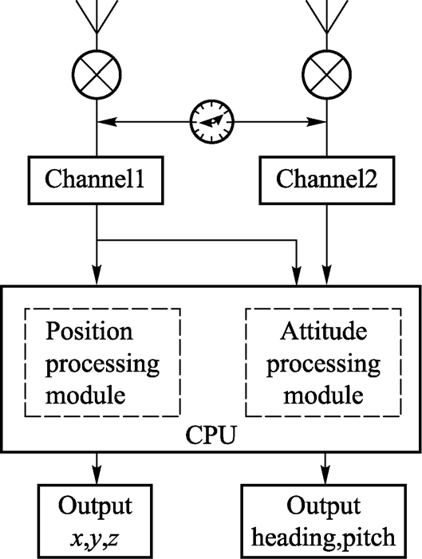
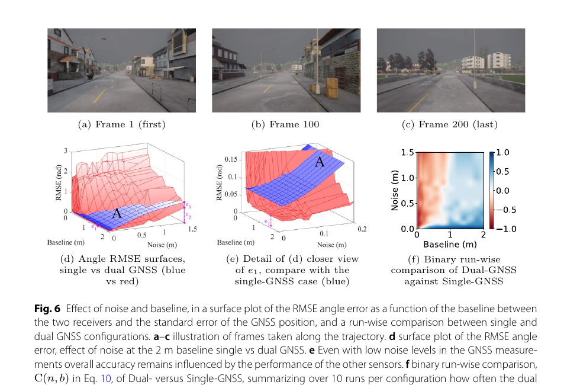
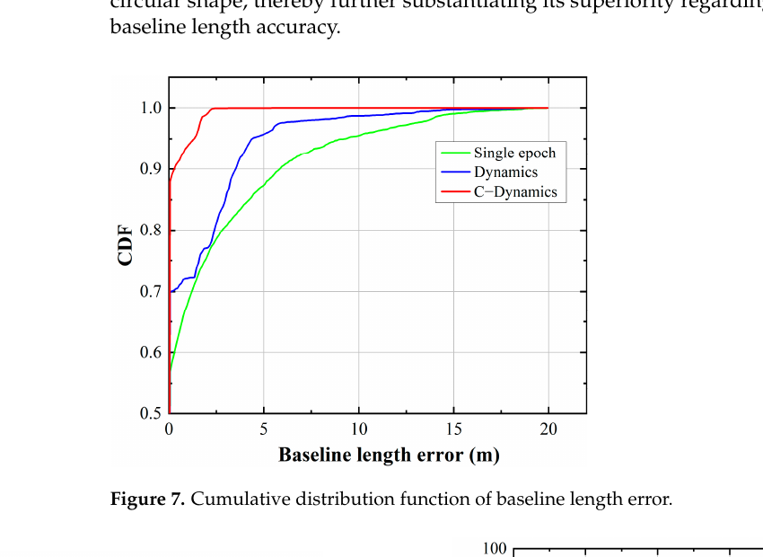

# 2026-08-10 GNSS 每日研究简报

## 今日快报

### 快报 1：异步地基测距加入 PPP，先解决时间同步成本再谈精度增益

- 主题：`asynchronous-ground-based-augmentation-ppp`
- 来源 ID：`doi:10.1186/s43020-026-00200-4`
- 来源链接：https://doi.org/10.1186/s43020-026-00200-4
- 发表日期：2026-06-12
- 来源类型：同行评审开放论文
- 获取范围：CC BY 4.0 全文、紧耦合模型、仿真与外场结果

**内容：** 论文把无需高精度站间同步的异步地基定位系统（A-GBPS）观测紧耦合进实时 PPP，以地面几何和额外测距缓解卫星遮挡及收敛慢的问题。方法重点是把每个地基站的时间偏差作为待估参数，而不是把它隐藏在“已同步”假设中。

**结论：** 原文的站数扫描显示，1—2 个地基站增益有限，增加到 3—5 个后改善更明显；六站在论文指定的 500—600 s 区间达到 0.1313 m RMSE。该数值只属于其几何、噪声与实验区间，不能外推为任意部署保证。

**关注理由：** 增强系统的价值不只由单站测距精度决定，时钟状态可观测性和站网几何同样决定 PPP 是否真正获益。

### 快报 2：LEO-PNT 硬件在环测试把“星座设想”推进到接收机与 PPP 联调

- 主题：`leo-pnt-hardware-in-loop-dynamic-ppp`
- 来源 ID：`doi:10.1007/1345_2026_353`
- 来源链接：https://doi.org/10.1007/1345_2026_353
- 发表日期：2026-05-12
- 来源类型：开放获取会议论文集章节
- 获取范围：开放全文、射频信号生成、Teseo VI 接收机与动态 PPP 测试架构

**内容：** JRC 团队搭建多层 LEO-PNT 射频信号生成、兼容接收机和可配置 PPP 的端到端硬件在环链路，用高动态车辆场景检查接收机测量与定位算法的接口。它验证的是实现链条，而非真实在轨星座服务。

**结论：** 作者报告 LEO 增强能改善挑战动态下的定位，并暴露接收机和算法待改进环节；由于信号与星座由测试台生成，结论必须标注为 HIL 证据，不能等同于真实传播、钟轨误差和运控条件。

**关注理由：** LEO-PNT 的工程风险常出现在捕获、跟踪、测量格式和滤波器之间。HIL 能在发射前重复施加高动态与故障，是比纯几何仿真更接近产品的中间层。

### 快报 3：分块相干积分结合神经鉴相器，提高弱 GPS 载波跟踪灵敏度

- 主题：`blocked-coherent-integration-neural-pll-weak-gps`
- 来源 ID：`doi:10.1007/s10291-026-02083-z`
- 来源链接：https://doi.org/10.1007/s10291-026-02083-z
- 发表日期：2026-05-04
- 来源类型：同行评审开放论文
- 获取范围：CC BY 4.0 全文、半解析模型、仿真与真实 GNSS 信号试验

**内容：** BCI-NPLL 将分块相干积分矩阵交给混合神经网络鉴相器，目标是在长积分受数据位和动态限制时仍提取载波相位。论文另给出闭环灵敏度评价方法，把鉴相输出放回跟踪环而非只做离线回归。

**结论：** 作者报告静态条件相对传统 PLL 提升 2—3 dB，在 1 g 和 2 g 加速度条件分别提升 4 dB、5 dB。改进来自论文特定训练和环路设置；不同前端带宽、振荡器与未见动态仍需重测。

**关注理由：** 弱信号算法若只提高离线分类准确率却不能闭环稳定，无法转化为观测量。该工作把学习鉴相器放回载波环评估，提供了更合适的验证路径。

### 快报 4：LEO 定轨观测中断时，保护级可能比位置误差更早失去可用性

- 主题：`leo-pod-integrity-observation-gaps`
- 来源 ID：`doi:10.1088/1361-6501/ae554c`
- 来源链接：https://doi.org/10.1088/1361-6501/ae554c
- 发表日期：2026-04-01
- 来源类型：同行评审开放论文
- 获取范围：开放全文、Sentinel-6A 七天真实 GNSS 数据、构造中断场景与完整性计算

**内容：** 研究用 Sentinel-6A 星载 GNSS 数据构造不同长度的下传/观测中断，比较估计分段随机加速度的 RD 模型与不估计该项的 CD 模型，考察近实时精密定轨保护级（PL）在空窗期如何增长。

**结论：** 原文 9 h 空窗案例中，RD 沿轨 PL 超过 20 m，而正常条件约 0.51 m；CD 在同一构造场景下低于 2 m，但恢复后收敛更慢。这是基于真实观测重放的模拟中断，不代表所有 LEO 轨道和实时产品。

**关注理由：** 面向 PNT 的 LEO 不只要轨道“平均准确”，还要在数据断续时给出可信界限。模型自由度越高并不必然带来更稳健的保护级。

### 快报 5：接收机类型相关信号畸变偏差会传入钟差、偏差产品和 PPP-AR

- 主题：`receiver-type-signal-distortion-bias-ppp-ar`
- 来源 ID：`doi:10.5194/egusphere-egu26-15669`
- 来源链接：https://doi.org/10.5194/egusphere-egu26-15669
- 发表日期：2026-03-14
- 来源类型：EGU 2026 开放会议摘要，非完整同行评审论文
- 获取范围：CC BY 4.0 摘要、方法概述、MGEX 数据规模与作者报告结果

**内容：** 作者提出几何无关组合辅助的多 GNSS 全频信号畸变偏差（SDB）标定，以突破宽巷模糊度取整的 ±0.5 周限制，并按接收机组输出 SINEX BIAS 改正。摘要还分析固件、天线和天线罩对 SDB 的关联。

**结论：** 摘要报告一个月、132 个 MGEX 站的试验中，不同接收机组 PPP-AR 收敛改善幅度不同；这些数字来自会议摘要，缺少完整方法与复现细节，应作为待正式论文验证的作者主张。

**关注理由：** 网络产品若混合不同接收机却忽略设备相关码偏差，会把硬件差异传给用户。设备元数据因此是高精度服务的一部分，而非资产清单。

## 深度研读

### 深读 1｜接收机工程｜同步多天线为何能用天线间单差同时消除卫星钟与接收机钟

- 类别：`receiver-engineering`
- 学习层级：`foundation`
- 选题定位：`经典基础`
- 来源 ID：`doi:10.1007/s11707-016-0559-2`
- 来源链接：https://doi.org/10.1007/s11707-016-0559-2
- 发表日期：2016-02-03
- 来源类型：同行评审论文与多项案例研究
- 获取范围：期刊开放阅读 PDF、系统结构、单差模型与应用案例；版权归 Higher Education Press 与 Springer-Verlag
- 价值评分：95/100（相关性 20，经典价值 24，证据 18，教学价值 18，工程价值 15）

#### 为什么先学这个

双天线航向不是“两个位置相减”这么简单。若两个通道真正共用采样时钟，天线间单差就能消除相同卫星钟误差，也消除共享接收机钟误差，使短基线载波相位直接约束基线向量。理解这一点，才能区分同步多通道与两台独立低成本接收机的能力边界。

#### 先修知识

需要理解伪距、载波相位、整周模糊度、卫星钟与接收机钟、天线相位中心，以及单差和双差。姿态由已知机体系基线在导航系中的方向确定，单基线通常提供航向与俯仰，不能完整确定滚转。

#### 一句话逻辑

同一时刻、同一卫星、共享时钟的两根天线观测相减，把共同钟项消掉，留下基线在卫星视线方向上的投影和整数差。

#### 研究问题与约束

论文讨论同步多天线接收机如何支持姿态、抑制多路径、标定相位中心变化与地面载波相位缠绕。案例展示潜力，但设备原型、天线环境和基线配置有限；“低成本”是相对多台测地接收机，并不自动包含消费级射频前端。

#### 核心方法论

多个射频通道共享本振、采样与 CPU；为同一卫星形成天线间单差；用已知短基线约束和整数搜索固定单差模糊度；将解得的基线向量转换为航向/俯仰；再利用多天线空间相关性估计多路径和天线系统误差。

#### 关键公式逐步推导

天线 $`a`$ 对卫星 $`s`$ 的载波相位（以米计）为：

```math
\Phi_a^s=\rho_a^s+c(\delta t_a-\delta t^s)+\lambda N_a^s+T_a^s-I_a^s+\varepsilon_a^s
```

对同步天线 $`a,b`$ 作单差，并令 $`\delta t_a=\delta t_b`$：

```math
\Delta_{ab}\Phi^s\approx-\mathbf u_s^T\mathbf b_{ab}+\lambda\Delta_{ab}N^s+\Delta_{ab}\varepsilon^s
```

其中 $`\mathbf b_{ab}`$ 是基线向量，$`\mathbf u_s`$ 是卫星视线单位向量。再用已知基线长度约束 $`\|\mathbf b_{ab}\|=L`$ 缩小整数搜索空间。

#### 经典价值与创新边界

经典价值是把同步硬件结构、等价双差数学和多个校准用途放在同一框架中。创新边界是它没有解决任意异步双接收机的时钟对准，也不消除每个通道独有的线缆、相位中心和多路径误差。

#### 整体逻辑链

共享时钟与时间标签；同星观测对齐；形成天线间单差；估计整数差；施加基线长度；求导航系基线；映射航向/俯仰；用剩余量诊断通道与环境误差。

#### 原文图表与结果分析



> 图源：Dong 等《Multi-antenna synchronized global navigation satellite system receiver and its advantages in high-precision positioning applications》Figure 1，[Frontiers of Earth Science 原文](https://doi.org/10.1007/s11707-016-0559-2)，© Higher Education Press 与 Springer-Verlag 2016。为研究评论从原 PDF 直接提取最小必要原图；未修改标签或结构，未主张开放再许可。

图中两根天线分别进入 Channel 1/2，但共同送入同一 CPU；位置模块使用一个主通道，姿态模块同时使用两通道，输出航向与俯仰。双向箭头表示固定基线。它能说明架构与信息流，不能证明特定噪声、固定率或动态性能。

#### 原文结果论述

论文指出，同步天线间单差在钟项处理上等价于传统双差，并以案例说明其在姿态、多路径、相位中心与相位缠绕标定上的用途。原文展示的是一类接收机结构的优势，不是所有“双天线”商品都满足的测试结论。

#### 常见误区与适用边界

第一，把两台独立接收机当同步多通道。第二，忽略通道间延迟。第三，用两个 SPP 位置差求厘米级航向。第四，短基线仍沿用远距离电离层差。第五，只约束长度却不检查天线杆变形。第六，把双天线航向当完整三轴姿态。

#### 工程实现步骤

1. 选择共享参考时钟和采样触发的多通道前端。
2. 标定每通道线缆群延迟和相位偏差。
3. 固定并测量天线基线长度与机体系方向。
4. 对同星同历元形成载波单差。
5. 以长度约束执行整数搜索和比值检验。
6. 输出姿态同时保留固定状态、残差和卫星几何。

#### 复现实验设计

用 0.5 m 与 1.5 m 两条刚性基线，静态转台每 15° 停留 60 s，再做 10°/s 连续旋转；比较同步单差、两台独立 RTK 和磁航向。指标为固定率、航向 RMSE、首次固定时间和温漂；故意加入 5 ns 通道偏差与单侧多路径，验证校准和残差告警。

#### 与定位及低成本实现的联系

共享时钟减少重复器件并简化整数模型，适合紧凑双天线板卡；真正成本来自多通道相位一致性、天线安装和校准，而不仅是芯片单价。

#### 本节小结

同步多天线的核心资产是共同时间基准；天线间单差能消钟，但不能消除通道与环境的非共同误差。

### 深读 2｜低成本与移动端｜两台标准精度接收机何时能改善航向，何时反而放大噪声

- 类别：`low-cost-mobile`
- 学习层级：`intermediate`
- 选题定位：`基础进阶`
- 来源 ID：`doi:10.1007/s44465-026-00004-5`
- 来源链接：https://doi.org/10.1007/s44465-026-00004-5
- 发表日期：2026-02-04
- 来源类型：同行评审开放论文、仿真与实车试验
- 获取范围：CC BY 4.0 全文、因子图、噪声/基线扫描与约 300 m 实车路线
- 价值评分：96/100（相关性 20，经典价值 21，证据 19，教学价值 18，工程价值 18）

#### 为什么先学这个

上一节依赖共享时钟和原始载波；本节故意降低接口，只使用两台标准接收机的位置输出。这样更容易集成，却让航向精度由“两个米级位置之差除以基线”决定，必须先回答基线是否足以压过噪声。

#### 先修知识

需要理解 NED 坐标、刚体外参、航向可观测性、因子图、GNSS CEP 与标准差差异、视觉惯性里程计和时间同步。松耦合输入是位置解，不是伪距/载波。

#### 一句话逻辑

两台接收机的位置差提供静止时也存在的航向线索，但只有基线相对位置噪声足够大时，这个线索才比单接收机加运动约束更可靠。

#### 研究问题与约束

作者扩展 IC-GVINS，将异步的两路 GNSS 位置、相机和 IMU 放入因子图，并用已知天线几何初始化全局航向。仿真系统扫描噪声与基线；实车采用两台 Holybro M9N 和 ZED 2i。约 300 m 路线和单一车辆限制跨设备泛化。

#### 核心方法论

先把两天线测得的位置变换到共同参考点；用两位置连线与机体系基线求初始 yaw；为每路 GNSS 建独立位置因子并允许异步到达；相机/IMU提供短时相对运动；最后在因子图联合优化位置、速度、姿态和偏置。

#### 关键公式逐步推导

水平基线观测 $`\Delta\mathbf p=[\Delta N,\Delta E]^T`$ 给出：

```math
\hat\psi=\operatorname{atan2}(\Delta E,\Delta N)-\psi_{b,\mathrm{mount}}
```

若两台位置水平噪声独立且各向同性，差分噪声约为 $`\sigma_\Delta=\sqrt{\sigma_1^2+\sigma_2^2}`$；小角度下：

```math
\sigma_\psi\approx\frac{\sigma_\Delta}{L}
```

因此基线 $`L`$ 加倍，航向标准差近似减半；但共模偏差、相关噪声和异步误差会破坏这个简式。

#### 经典价值与创新边界

价值在于作者没有默认“双机一定更好”，而是画出噪声—基线区域并展示失败区域。边界是松耦合位置丢失原始观测结构，不能执行载波差分，也难以区分两台接收机的相关多路径。

#### 整体逻辑链

测量安装基线；同步/标记两路位置；几何初始化航向；加入独立 GNSS 因子；融合视觉与 IMU；扫描噪声和基线；与单 GNSS 比较；用 RTK 参考检查实车轨迹。

#### 原文图表与结果分析



> 图源：Souza 等《Localization for car-like vehicles using loosely coupled dual-GNSS integration》Figure 6，[Discover Vehicles 原文](https://doi.org/10.1007/s44465-026-00004-5)，CC BY 4.0。由原 PDF 第 12 页以 150 dpi 渲染并裁出 Figure 6 与完整图注；未改变曲线、坐标或颜色。

图 (d)(e) 的横轴是基线 m、另一水平轴是位置噪声 m、竖轴是角度 RMSE rad；蓝面代表单 GNSS、红面代表双 GNSS，A 区是双机更优。图 (f) 以 -1/0/1 汇总十次运行。原文针对 1.5 m CEP 设备给出约 1.6 m 的仿真最小有效基线；该边界不是通用规格，也不证明实车达到 RTK 精度。

#### 原文结果论述

仿真显示低噪声、足够长基线时第二接收机改善方向精度和初始化；噪声相对基线过大时双机可能更差。实车两台标准接收机的个别偏差可达约 4 m 与 6 m，双机仍给出更好的 yaw，但所有配置都不是 RTK 级位置。

#### 常见误区与适用边界

第一，直接把 CEP 当一维标准差。第二，不校准天线到车体外参。第三，异步位置直接相减。第四，忽略附近电缆干扰。第五，只看平均轨迹不看航向初始化。第六，从一次 300 m 试验外推所有城市峡谷。

#### 工程实现步骤

1. 记录每台接收机独立时间戳和质量字段。
2. 测量基线、杆臂和车体安装角。
3. 在静止开阔场估计两路噪声及相关性。
4. 依据 $`\sigma_\psi\approx\sigma_\Delta/L`$ 先做可行性预算。
5. 因子图中按各自时刻插值状态，不伪造同步。
6. 以残差、基线一致性和视觉质量控制权重。

#### 复现实验设计

两台 M9N 以 0.5/1.0/1.6/2.0 m 基线安装，开阔场与树荫各跑 20 条 300 m 回路，含 60 s 静止启动；RTK/INS 作参考。比较单 GNSS、双 GNSS、VIO 和双 GNSS-VIO；指标为 yaw RMSE、初始化时间、位置 95% 误差和因子拒绝率；失败条件为双机在连续 10 s 内比单机 yaw 更差。

#### 与定位及低成本实现的联系

只读标准 NMEA/PVT 能降低接入门槛，但需要更长车体基线和更强时间管理。对于小型机器人，升级到原始载波双天线可能比机械延长基线更合理。

#### 本节小结

低成本双机航向是一笔明确的基线—噪声交易；第二台接收机不是免费信息，错误几何会让结果变差。

### 深读 3｜定位｜C-Dynamics 与约束 LAMBDA：用时间预测和基线几何稳住复杂环境双天线定姿

- 类别：`positioning`
- 学习层级：`advanced`
- 选题定位：`纯 GNSS 定位进阶`
- 来源 ID：`doi:10.3390/rs16214026`
- 来源链接：https://doi.org/10.3390/rs16214026
- 发表日期：2024-10-30
- 来源类型：同行评审开放论文与两组车载动态试验
- 获取范围：CC BY 4.0 全文、C-Dynamics 预测、CLAMBDA 模糊度固定与误差序列
- 价值评分：98/100（相关性 20，经典价值 22，证据 20，教学价值 18，工程价值 18）

#### 为什么先学这个

前两节分别建立同步载波模型和低成本位置级方案。高级纯 GNSS 定姿要在周跳、失锁和多路径下保持整数连续性：既利用上一历元运动信息，又不能让错误预测强行固定错误模糊度。

#### 先修知识

需要掌握双差载波、整数最小二乘、LAMBDA/CLAMBDA、基线长度约束、周跳、候选集检验、航向/俯仰映射和 CDF。动态模型是辅助约束，不是独立真值。

#### 一句话逻辑

C-Dynamics 用已固定历元预测下一历元基线，CLAMBDA 再用已知基线长度筛选整数候选；两层约束共同缩小复杂环境中的错误固定空间。

#### 研究问题与约束

论文面向低成本双天线在城市遮挡下的频繁失锁和多路径，比较单历元 LAMBDA、普通 Dynamics 和 C-Dynamics。两组车辆实验代表作者路线与硬件，不能覆盖所有天线间距、转弯角速度和干扰条件。

#### 核心方法论

先由多普勒/相邻历元或已固定基线建立动态预测；用预测残差检查当前观测；构造浮点基线与模糊度协方差；在 LAMBDA 降相关搜索后施加基线长度约束；若质量检验通过则更新动态状态，否则保留浮点或重新初始化。

#### 关键公式逐步推导

双差载波模型写作：

```math
\mathbf y=\mathbf A\mathbf b+\lambda\mathbf N+\boldsymbol\varepsilon
```

整数候选 $`\mathbf N`$ 的残差代价为 $`J_N`$，基线已知长度 $`L`$ 给出约束：

```math
\min_{\mathbf N\in\mathbb Z^n}J_N(\mathbf N),\qquad
\left|\|\hat{\mathbf b}(\mathbf N)\|-L\right|<\tau_L
```

动态预测 $`\mathbf b^-_k=\mathbf F\hat{\mathbf b}_{k-1}`$ 只应在上一解可信时参与候选排序；否则需增大协方差或重置，避免错误固定自我延续。

#### 经典价值与创新边界

价值是把基线几何和历元连续性同时放进整数搜索，并用复杂环境车辆数据比较。边界是动态先验与当前观测并非完全独立，若协方差过小会让保护性约束变成错误锁定。

#### 整体逻辑链

预处理与周跳检查；构造双差；得到浮点解；生成动态基线预测；LAMBDA 降相关与候选搜索；长度约束筛选；比值/残差验收；输出基线和姿态；可信固定后更新下一历元预测。

#### 原文图表与结果分析



> 图源：Xu 等《An Improved Low-Cost Dual-Antenna GNSS Dynamic Attitude Determination Method in Complex Environments》Figure 7，[Remote Sensing 原文](https://doi.org/10.3390/rs16214026)，CC BY 4.0。由原 PDF 第 12 页以 150 dpi 渲染并裁出 Figure 7 与图注；未重绘或改变坐标。

横轴为基线长度误差 m，纵轴为 CDF；绿色单历元、蓝色 Dynamics、红色 C-Dynamics。红线在接近零误差处上升最快，蓝线次之，表示本实验中 C-Dynamics 的大部分误差更集中。横轴仍延伸到 20 m，说明图不能证明所有历元安全，也不能替代固定错误率与完整性统计。

#### 原文结果论述

作者报告：城市试验相对 LAMBDA 固定率提高 5.6%，航向、俯仰和基线长度精度分别改善 66%、70.9%、84.2%；高遮挡试验固定率提高 43.5%，三项精度分别改善 76.4%、69.2%、94%。这些百分比均以论文特定对比和误差定义为准。

#### 常见误区与适用边界

第一，把固定率当正确固定率。第二，不报告比值阈值。第三，在急转弯仍使用过强匀速模型。第四，长度公差小于机械形变。第五，失锁后沿用旧整数。第六，只看 CDF 主体不看尾部灾难误差。

#### 工程实现步骤

1. 标定基线长度、相位中心与通道延迟。
2. 每历元执行周跳和双差残差筛选。
3. 根据车辆角速度调节动态过程噪声。
4. 生成多个整数候选并施加长度约束。
5. 同时要求比值、残差和姿态变化率通过。
6. 失败时退回浮点并隔离旧动态先验。

#### 复现实验设计

用 1 m 双天线低成本板卡在开阔、林荫、城市街谷和高架下各采 30 min，加入直线、8 字和急转弯；测地级 GNSS/INS 作参考。比较单历元 LAMBDA、Dynamics、C-Dynamics 与固定真值约束；报告正确固定率、错误固定率、TTFF、航向/俯仰 RMSE、95/99.9% 尾部和计算时延；失败判据为连续错误固定超过 2 s。

#### 与定位及低成本实现的联系

低成本接收机的主要收益来自利用刚体基线这一免费几何先验，但必须用动态自适应和失败回退保护。只追求固定率会把少量错误整数变成危险航向跳变。

#### 本节小结

时间连续性与基线长度能显著缩小整数搜索，但高级双天线定姿的核心指标仍是正确固定和尾部风险，而非固定率本身。
