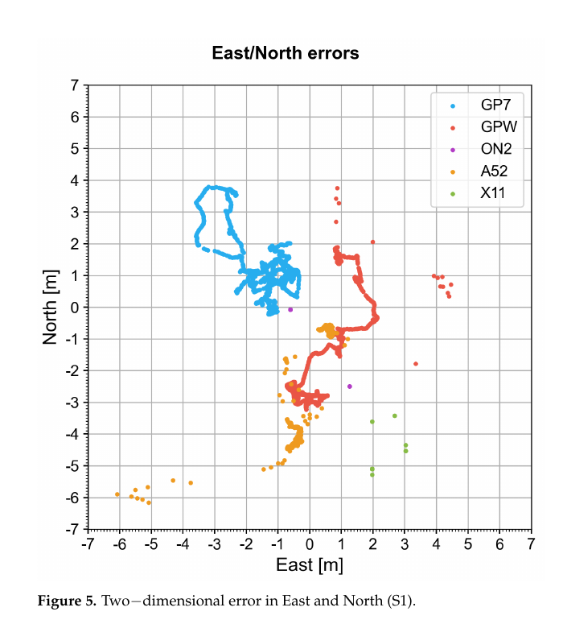
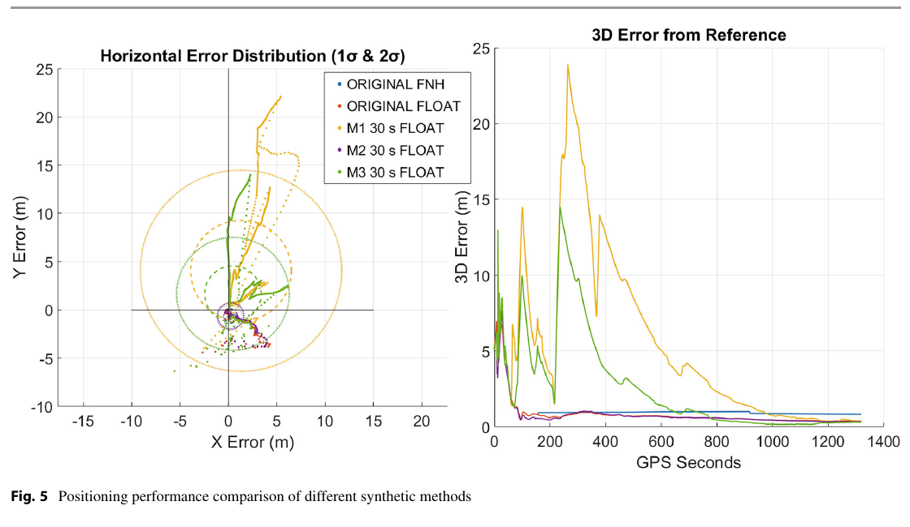
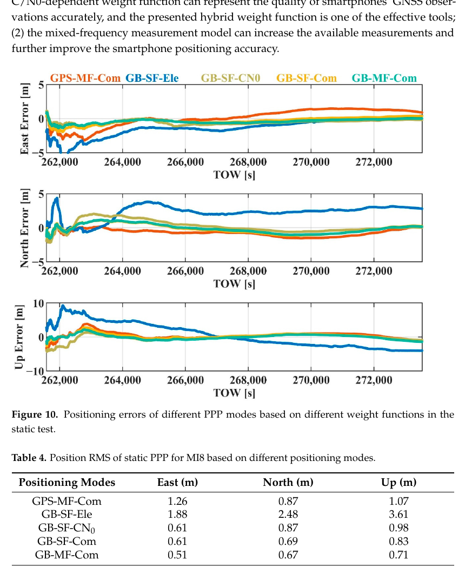

# 2026-08-11 GNSS 每日研究简报

## 今日快报

### 快报 1：分层地形—视觉校正能抑制无人机惯导漂移，但单轨迹仿真不是外场保证

- 主题：`layered-terrain-visual-navigation-gnss-denied-uav`
- 来源 ID：`doi:10.3390/electronics15163559`
- 来源链接：https://doi.org/10.3390/electronics15163559
- 发表日期：2026-08-11
- 来源类型：同行评审开放论文
- 获取范围：CC BY 4.0 全文、单轨迹仿真、误差模型与局部 CRLB 分析

**内容：** 架构用 TERCOM 周期性修正 GNSS 中断后的惯导位置，再以卫星影像场景匹配提供条件化精校正。案例使用青藏高原 1°×1° ASTER GDEM V2 瓦片，模拟一小时、127 km 飞行，并明确给出雷达高度计和 DEM 噪声。

**结论：** 作者报告该单次噪声实现中，TERCOM 将位置 RMS 从 1467 m 降至 317 m，理想无配准误差的场景匹配进一步降至 103 m。后者是最佳情形；单轨迹、理想视觉配准与简化温度模型限制推广。

**关注理由：** GNSS 拒止导航必须把“可用地图、地形信息量、配准失败”作为条件写出。分层结构的价值在于每层有独立边界，而非把融合结果描述成普适精度。

### 快报 2：信息形式更新把百维 GNSS 观测的计算负担与鲁棒性放进同一滤波器

- 主题：`robust-information-filter-high-dimensional-gnss-sins-uav`
- 来源 ID：`doi:10.3390/rs18162691`
- 来源链接：https://doi.org/10.3390/rs18162691
- 发表日期：2026-08-11
- 来源类型：同行评审开放论文
- 获取范围：CC BY 4.0 全文、GPS/BDS 多频紧组合、车载与飞行试验

**内容：** 方法面向小型无人机每历元超过 100 个伪距、伪距率和时差载波观测，用运动/静态信息滤波减少高维量测矩阵求逆，再以鲁棒自适应因子抑制离群与模型失配。

**结论：** 作者在车载和 UAV 试验中报告，相对常规批量或序贯紧组合卡尔曼滤波，总体计算效率提升超过 90% 且未损失其数据集上的精度。该百分比依赖处理器、实现和观测维度，需在目标飞控硬件重测时延尾部。

**关注理由：** 多系统多频增加冗余，也增加矩阵运算与异常入口。对资源受限接收机，“算得完且及时”与估计精度同样是导航性能。

### 快报 3：反射 GNSS 掠射路径可补高纬电离层层析的海洋与极区几何空白

- 主题：`gnss-reflectometry-high-latitude-ionosphere-tomography`
- 来源 ID：`doi:10.1029/2026JA035373`
- 来源链接：https://doi.org/10.1029/2026JA035373
- 发表日期：2026-08-08
- 来源类型：同行评审论文与概念星座仿真
- 获取范围：CC BY-NC-ND 4.0 全文、体素层析、模拟 GNSS-R/低仰角路径与误差对比

**内容：** 研究把 LEO 上 GNSS-R 的掠射反射路径和地面低仰角路径加入传统地面 GNSS、掩星与精密定轨链路，扩充高纬三维电子密度层析的穿越方向，并用体素相交统计解释几何改善。

**结论：** 模拟结果显示新增路径提高极区射线数量与方向多样性，并相对传统组合降低对模拟真值的重建误差。结论是任务概念证据，尚未包含真实反射点定位、海面粗糙度和接收机偏差。

**关注理由：** 层析反演首先受可观测几何约束。GNSS-R 的价值可能不是单条 TEC 更准，而是为地面站稀疏区提供此前缺失的视线方向。

### 快报 4：低纬闪烁的重尾延伸到“看似噪声”的高频段，单高斯模型会低估尾部

- 主题：`multiscale-heavy-tail-low-latitude-gnss-scintillation`
- 来源 ID：`doi:10.1029/2026JA035367`
- 来源链接：https://doi.org/10.1029/2026JA035367
- 发表日期：2026-08-08
- 来源类型：同行评审开放论文
- 获取范围：CC BY 4.0 全文、肯尼亚强闪烁事件、50 Hz 幅度/相位/IFLC 与多尺度分解

**内容：** 作者用快速迭代滤波把 50 Hz GNSS 幅度、相位和无电离层线性组合分解为本征模态分量，逐尺度检查概率分布、峰度与间歇性，而不是用一条功率谱把高频段全部归为热噪声。

**结论：** 该强事件中，Fresnel 频率以上仍保留明显尖峰重尾，高频分量更适合 Castaing 族分布；相位和 IFLC 也显示类似超额峰度。单事件不能定义全球闪烁统计，需多季节、多接收机复验。

**关注理由：** 完整性和鲁棒滤波若假设高斯尾，会低估闪烁下大误差概率。多尺度建模提示阈值应随频段和事件强度调整。

### 快报 5：货船上的测地级 GNSS 可补所罗门群岛外海海啸观测空白

- 主题：`cargo-ship-gnss-tsunami-detection-network`
- 来源 ID：`doi:10.1007/s11069-026-08352-x`
- 来源链接：https://doi.org/10.1007/s11069-026-08352-x
- 发表日期：2026-08-04
- 来源类型：同行评审开放论文与情景模拟
- 获取范围：CC BY 4.0 全文、2016 所罗门群岛事件重建、船舶轨迹与多情景评估

**内容：** 研究模拟 2016 年所罗门群岛海啸，并把航线、航向、水深、到时与预期海面振幅叠加，评估装有测地级 GNSS 的移动货船能否作为现有潮位站和 DART 的补充节点。

**结论：** 作者的情景结果表明船舶运动与航向不阻止检测，对 $`M_W>7.0`$ 的情景可改善外海覆盖。结论仍依赖船载天线垂向动态分离、实时通信、海况和船舶实际密度。

**关注理由：** 这是机会传感网络的典型问题：单船不是固定基准站，但大量既有平台可能以较低新增成本填补观测几何空洞。

## 深度研读

### 深读 1｜低成本与移动端｜同芯片不等于同观测：用开放 Android 数据集建立设备准入基线

- 类别：`low-cost-mobile`
- 学习层级：`foundation`
- 选题定位：`经典基础`
- 来源 ID：`doi:10.3390/electronics12234781`
- 来源链接：https://doi.org/10.3390/electronics12234781
- 发表日期：2023-11-25
- 来源类型：同行评审开放数据论文、开放应用与多场景实测
- 获取范围：CC BY 4.0 全文、四款手机与一款手表、GNSS/惯性/磁力计/气压计数据和测地参考
- 价值评分：97/100（相关性 20，经典价值 23，证据 20，教学价值 18，工程价值 16）

#### 为什么先学这个

Android API 能输出伪距、Accumulated Delta Range、Doppler 和 $`C/N_0`$，但同一芯片在手机与手表里可能启用不同频点，厂商 PVT 还可能内置强运动约束。先比较设备能力、原始观测和内置解，才能决定后续 RTK/PPP 可以依赖什么。

#### 先修知识

需要理解 Android GnssClock、伪距构造、ADR 与载波相位、Doppler、$`C/N_0`$、双时间差、设备内置 PVT 和真值轨迹。记录到“可见卫星”不等于该卫星被内置导航解使用。

#### 一句话逻辑

用同一开放采集流程和测地参考跨设备、跨静动态场景对齐数据，才能把型号差异从算法差异中分离出来。

#### 研究问题与约束

作者发布 Mimir 开源记录应用和数据集，覆盖 Pixel 7、Pixel Watch、OnePlus Nord 2、Samsung A52 5G、Xiaomi 11T，以及静态、步行、开阔和城市场景。数据提供设备多样性，但仍是一次地区性采集，且内置 PVT 算法不可见。

#### 核心方法论

先按双频、载波、导航电文和芯片多样性选设备；手机与手表用共同 Android 库记录 GNSS、运动与环境传感器；参考接收机和背包天线提供真值；将 Android 接收/发送时刻构成伪距，将 ADR 换成米制相位；再用时间差残差、可见性和内置 PVT 分别评估。

#### 关键公式逐步推导

Android 伪距由接收时刻与卫星发射时刻构成：

```math
P_k^s=c\left(t_{rx,k}-t_{tx,k}^s\right)
```

为弱化慢变卫星、钟轨和大气项，可对连续历元先作时间差：

```math
\Delta P_k^s=P_k^s-P_{k-1}^s
```

再减参考星的时间差形成双时间差，剩余量更接近接收机跟踪噪声与用户动态；它是质量诊断，不应被误当绝对测距误差。

#### 经典价值与创新边界

价值是同时开放采集应用、原始数据、处理脚本和测地参考，并首次系统纳入智能手表。边界是不同设备内置滤波器是黑箱，图中的平滑或固定输出不能反推原始观测一定更好。

#### 整体逻辑链

列设备能力；统一采集格式；同步参考；按场景分段；构造码与相位；计算时间差质量量；比较频点与可见性；评估内置位置；记录设备特有缺口；发布数据和分析笔记本。

#### 原文图表与结果分析



> 图源：Grenier 等《Towards Smarter Positioning through Analyzing Raw GNSS and Multi-Sensor Data from Android Devices: A Dataset and an Open-Source Application》Figure 5，[Electronics 原文](https://doi.org/10.3390/electronics12234781)，CC BY 4.0。由原 PDF 第 15 页以 150 dpi 渲染，仅裁出 Figure 5 与图注；未改变坐标、颜色或数据。

横轴 East、纵轴 North，单位均为 m；五种颜色对应 Pixel 7、Pixel Watch、OnePlus Nord 2、Samsung A52 与 Xiaomi 11T。部分设备形成长轨迹或离散簇，另一些几乎固定在单点，直接显示内置静态约束差异。图不能说明原始码/相位的独立噪声，也不能把“点更集中”自动解释为更准确。

#### 原文结果论述

作者发现 Pixel 7 与 Pixel Watch 的静态解围绕位置缓慢收敛，其他部分设备输出近似常值，显示更强运动模型。Pixel Watch 与 Pixel 7 使用相似芯片，但手表只记录 L1，说明终端功耗和固件配置可覆盖芯片标称能力。

#### 常见误区与适用边界

第一，按芯片型号推定频点。第二，把厂商 PVT 平滑度当原始精度。第三，忽略 Android 状态标志。第四，把所有可见星视为已参与解算。第五，跨手机共用噪声权。第六，只采一条路线就下设备排名。

#### 工程实现步骤

1. 启动时记录型号、系统、API、芯片与功耗模式。
2. 实测每星频点、ADR 和导航电文可用性。
3. 保存 GnssClock 与全部质量标志。
4. 将原始观测和厂商 PVT 分开存储。
5. 用参考站按静态/动态/遮挡分层统计。
6. 系统或固件升级后重新做设备准入。

#### 复现实验设计

选四款手机和一款手表，在同一背包上完成 60 min 静态、开阔步行和街谷回路各 10 次；测地接收机作参考。比较内置 PVT 与统一 SPP；指标为频点可用率、ADR 连续率、码/多普勒时间差 RMS、水平 95% 误差和恢复时间；失败条件为标称双频设备实际无第二频或状态字段缺失。

#### 与定位及低成本实现的联系

开放数据集让低成本算法在写代码前先选择真实可支持的设备状态。准入测试能防止把某款旗舰手机上的频点和载波能力误当 Android 通用能力。

#### 本节小结

手机 GNSS 的基础不是“Android 支持什么”，而是目标设备在目标功耗与场景下实际输出什么，并能否被重复验证。

### 深读 2｜低成本与移动端｜用 Doppler 合成短时载波相位：补数据可改善浮点解，也会伤害错误固定

- 类别：`low-cost-mobile`
- 学习层级：`intermediate`
- 选题定位：`基础进阶`
- 来源 ID：`doi:10.1007/1345_2026_390`
- 来源链接：https://doi.org/10.1007/1345_2026_390
- 发表日期：2026-06-19
- 来源类型：开放获取会议论文集章节、两组静态数据初步研究
- 获取范围：CC BY 4.0 全文、Pixel 5/Samsung S24、三种补洞方法与 RTKLIB demo5
- 价值评分：95/100（相关性 20，经典价值 20，证据 18，教学价值 18，工程价值 19）

#### 为什么先学这个

上一节说明手机载波常断。本节不假装恢复真实整数，而是问：能否用 Doppler 积分或插值填补短缺口，让滤波器保持更多连续观测？关键是把“可用于浮点跟踪”与“可用于整数固定”分开。

#### 先修知识

需要理解载波相位与 Doppler 的导数关系、RINEX、三次样条、接收机钟漂、RTK 浮点/固定解、Fix-and-Hold 与 instantaneous IAR。合成观测与原观测相关，不能按同等独立噪声加权。

#### 一句话逻辑

短缺口内积分 Doppler可延续相位趋势，但未知钟漂与模型偏差随时间积累，所以合成相位更适合弱权浮点约束，不应无条件参与整周固定。

#### 研究问题与约束

作者在 Pixel 5 树冠数据和 Samsung S24 半城市屋顶数据中，用三次样条（M1）、Doppler 积分（M2）和分段组合（M3）填 5/15/30 s 缺口，再以 RTKLIB demo5 静态前向滤波比较。样本短、设备少，作者明确称初步结果。

#### 核心方法论

解析 RINEX 相位缺口；M1 用全局三次样条；M2 积分 Doppler 相位变化；M3 对不超过 5 s 用样条、更长缺口用 Doppler；生成合成 RINEX；分别运行 Fix-and-Hold、instantaneous 和 float；以测量级接收机固定平均位置作参考。

#### 关键公式逐步推导

忽略符号约定差异，Doppler 与载波周数的关系近似：

```math
\Phi_k\approx\Phi_{k_0}-\sum_{i=k_0+1}^{k}D_i\Delta t
```

若 Doppler 含偏差 $`b_D`$，长度 $`T`$ 的缺口产生相位偏差约 $`b_D T`$ 周；映射到距离是 $`\lambda b_D T`$。因此合成观测方差应随缺口时长增长：

```math
\sigma_{syn}^2(T)=\sigma_{\Phi0}^2+T^2\sigma_{b_D}^2+T\,q_D
```

#### 经典价值与创新边界

价值是直接展示合成相位对不同 IAR 模式的相反影响，并保留“错误固定可能不如浮点”的工程结论。边界是全局样条使用缺口两侧数据，不适合未经修改的实时处理；接收机钟漂也未完整建模。

#### 整体逻辑链

标记相位缺口；按长度选择方法；生成合成相位与质量标志；构造 RINEX；运行多种 IAR；比较参考误差；检查有效卫星数；识别固定被偏差污染的场景；仅保留通过残差的合成观测。

#### 原文图表与结果分析



> 图源：Gogoi 与 Dabove《Exploring Synthetic Carrier-Phase Measurements in Ultra Low-Cost Smartphone GNSS Receivers》Figure 5，[Springer 原文](https://doi.org/10.1007/1345_2026_390)，CC BY 4.0。由原 PDF 第 7 页以 160 dpi 渲染并裁出 Figure 5 与图注；未改变曲线或坐标。

左图横纵轴是 X/Y error（m），椭圆给出 1σ/2σ 分布；右图横轴 GPS seconds、纵轴 3D error（m）。紫/洋红的 M2/M3 短缺口浮点曲线快速落到约 1 m 附近，M1 30 s 与 M3 30 s 的尾部明显更大。图来自一组静态样本，不能证明合成相位恢复了正确整数。

#### 原文结果论述

原始观测在 Fix-and-Hold 下整体最好，含时变偏差的合成相位会扭曲固定；instantaneous IAR 的 5 s M1/M2 在多数场景有潜力。作者给出的一个案例中，M2 3D RMS 为 1.144 m，优于原始文件的 1.323 m；跨数据集最稳定的趋势是 M2 浮点解与原始相近或略好。

#### 常见误区与适用边界

第一，把插值相位设成真实观测同权。第二，离线全局样条冒充实时。第三，合成相位参与固定却不标志。第四，30 s 阈值跨设备照搬。第五，只报补洞率。第六，把较小浮点 RMS 解释为整数可固定。

#### 工程实现步骤

1. 只处理两端相位均可信的封闭缺口。
2. 用梯形积分并估计 Doppler 偏差。
3. 让合成方差随缺口长度增长。
4. 在观测中保留 synthetic 标志与方法 ID。
5. 首先仅用于浮点滤波，不进入整数候选。
6. 以创新残差和真实相位恢复的一致性验收。

#### 复现实验设计

Pixel 5、S24 和另一款双频手机，在开阔/树荫/街谷各采 20 段 20 min 静态及步行数据；人为屏蔽 1/5/15/30 s 真相位以获得已知真值。比较样条、Doppler、钟漂校正 Doppler 与不补洞；指标为相位重建 RMSE、浮点位置、正确/错误固定率和计算延迟；错误固定一次即记失败。

#### 与定位及低成本实现的联系

合成相位可以在不改硬件时提高滤波连续性，尤其适合低成本浮点 RTK；若应用需要安全固定，应把它当预测而非测量，并与真实相位隔离。

#### 本节小结

补洞的收益来自连续趋势，不来自凭空恢复整数；对手机而言，一个诚实的浮点解往往优于被合成数据强迫的固定解。

### 深读 3｜定位｜手机实时 PPP-B2b：混频观测与 $`C/N_0`$—仰角混合权如何共同改善可用性

- 类别：`positioning`
- 学习层级：`advanced`
- 选题定位：`纯 GNSS 定位进阶`
- 来源 ID：`doi:10.3390/app15137169`
- 来源链接：https://doi.org/10.3390/app15137169
- 发表日期：2025-06-25
- 来源类型：同行评审开放论文、静态与车辆动态试验
- 获取范围：CC BY 4.0 全文、BDS PPP-B2b 改正、混频模型、混合权与 MI8 结果
- 价值评分：98/100（相关性 20，经典价值 22，证据 20，教学价值 18，工程价值 18）

#### 为什么先学这个

前两节解决“观测是否可用”和“缺口如何降级”。高级层把手机原始观测送入无需地面互联网的实时 PPP：卫星播发 PPP-B2b 钟轨改正，混频保留更多单频卫星，混合权再处理手机 $`C/N_0`$ 与仰角都不充分的问题。

#### 先修知识

需要理解 PPP 未差模型、BDS PPP-B2b SSR 轨道/钟差、单频电离层参数、混频观测、随机模型、$`C/N_0`$、仰角和收敛。PPP-B2b 当前服务区域与支持星座必须按接口文件确认。

#### 一句话逻辑

用卫星链路得到实时钟轨改正，用单/双频混合避免因手机第二频缺失而丢星，再让 $`C/N_0`$ 与仰角共同决定观测权，提升实际可用精度。

#### 研究问题与约束

论文针对手机实时 PPP 的两项限制：无互联网时缺少精密钟轨、单一仰角或 $`C/N_0`$ 权无法描述手机多路径。两组 MI8 静态/动态试验位于 PPP-B2b 覆盖环境；设备单一、数据按需提供，遮挡仍未解决。

#### 核心方法论

解码 PPP-B2b 对广播星历的径向/沿轨/法向和钟差改正；建立 GPS+BDS 单频/混频 PPP；为码、相位分别设置接收机钟与电离层等状态；由仰角和 $`C/N_0`$ 构造混合方差；比较五种组合并以 IGS 最终产品作离线参照。

#### 关键公式逐步推导

PPP-B2b 精密轨道由广播位置减去 RAC 改正：

```math
\mathbf r_{prec}=\mathbf r_{brdc}-[\mathbf e_r\ \mathbf e_a\ \mathbf e_c]
\begin{bmatrix}\delta O_r&\delta O_a&\delta O_c\end{bmatrix}^T
```

手机观测权可写成两种质量量的组合：

```math
\sigma_s^2=\alpha\,f^2(e_s)+(1-\alpha)\,g^2(C/N_{0,s})
```

$`\alpha`$ 及函数参数必须由设备残差估计；混频模型则为可用频点分别建模，而不是强迫所有卫星组成双频无电离层组合。

#### 经典价值与创新边界

价值是把卫星播发实时产品、手机观测缺频和设备相关随机模型组成完整纯 GNSS 链路。边界是 PPP-B2b 只改正支持卫星且受服务区约束，混合权仍是经验随机模型，不等于完整性保护。

#### 整体逻辑链

解析 Android 观测；解码 PPP-B2b；检查改正龄期和 IOD；改正广播钟轨；构造混频未差方程；按 $`C/N_0`$ 与仰角定权；滤波估计位置/钟/对流层/电离层；监测残差；与内置 SPP、传统 PPP 和不同权模型比较。

#### 原文图表与结果分析



> 图源：Gao 等《BDS-PPP-B2b-Based Smartphone Precise Positioning Model Enhanced by Mixed-Frequency Data and Hybrid Weight Function》Figure 10 与 Table 4，[Applied Sciences 原文](https://doi.org/10.3390/app15137169)，CC BY 4.0。由原 PDF 第 14 页以 150 dpi 渲染并裁出连续的原图与原表；未重绘或修改数值。

三幅横轴为 TOW（s），纵轴分别为东、北、天误差（m）；GB-MF-Com 是 GPS+BDS 混频加混合权。Table 4 给出静态 RMS：GB-MF-Com 为 0.51/0.67/0.71 m，GB-SF-Ele 为 1.88/2.48/3.61 m。图证明该试验组合更稳，不证明所有手机、城市遮挡或覆盖区外都能亚米。

#### 原文结果论述

作者报告静态混频混合权东/北/天 RMS 为 0.51/0.67/0.71 m；动态为 0.61/0.55/3.16 m。相对仅 $`C/N_0`$ 权，混合权三方向改善约 5.13%、18.00%、15.15%；相对仅仰角权改善更大。百分比以论文基线定义和单设备试验为准。

#### 常见误区与适用边界

第一，把卫星播发实时等同全球可用。第二，忽略改正 IOD/龄期。第三，混合频点却不估频间偏差。第四，把 $`C/N_0`$ 跨设备直接比较。第五，只看水平不报 3.16 m 动态垂向。第六，把 RMS 当 95% 或完整性界限。

#### 工程实现步骤

1. 验证手机输出频点、ADR 与独立钟状态。
2. 实时检查 PPP-B2b 改正完整性、IOD 和超时。
3. 按卫星/频点建立混频观测方程。
4. 用设备残差标定混合权参数。
5. 对周跳和 NLOS 采用鲁棒降权与重初始化。
6. 同时输出收敛状态、改正龄期和水平/垂向质量。

#### 复现实验设计

至少三款双频 Android 手机，在开阔、林荫和城市道路各做 10 次 40 min 静态/动态试验；测地 GNSS/INS 作参考。比较内置 SPP、广播 PPP、PPP-B2b 单频、混频仰角权、$`C/N_0`$ 权和混合权；指标为 2D/3D RMS、95% 误差、收敛时间、改正可用率与失锁恢复；故意中断改正 30/120 s 验证降级。

#### 与定位及低成本实现的联系

PPP-B2b 把精密产品送到无地面网络的手机级用户，但天线与观测质量仍决定上限。软件可通过混频和定权提高利用率，却不能修复物理遮挡。

#### 本节小结

手机实时 PPP 的完整方案不是单一算法：钟轨改正、频点可用性、随机模型和质量状态必须同时闭环。
