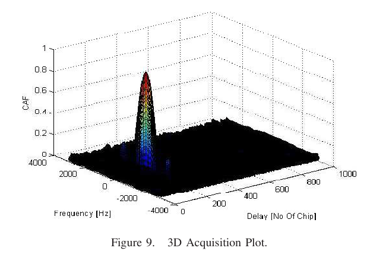
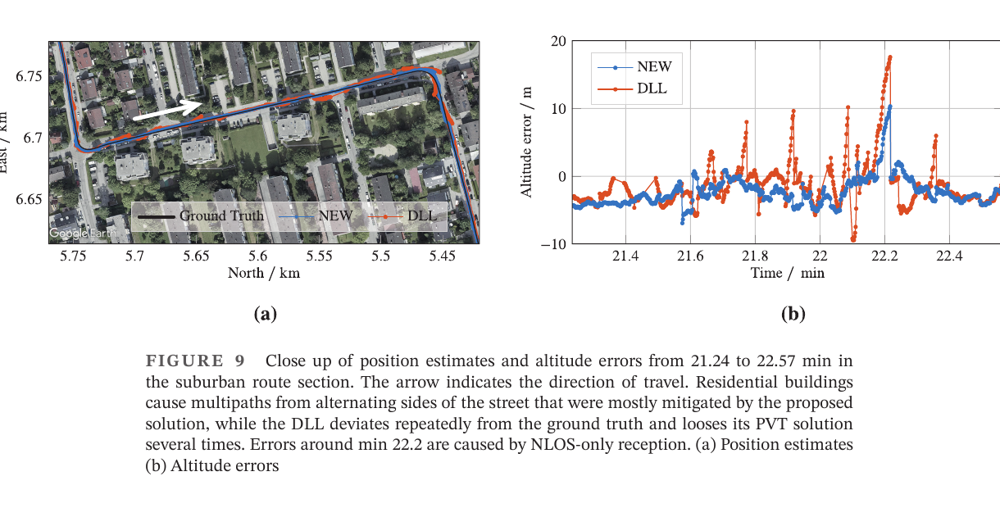
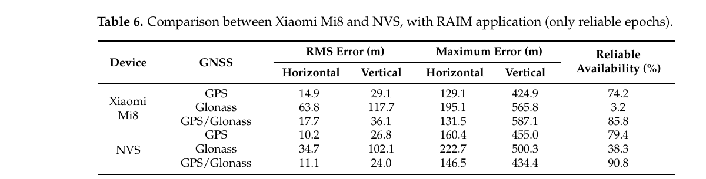

# 2026-08-12 GNSS 每日研究简报

## 今日快报

### 快报 1：Android 的 Galileo 伪距会跳整整一个 4 ms 码周期，状态位通过仍不够

- 主题：`android-galileo-four-millisecond-pseudorange-jumps`
- 来源 ID：`doi:10.1016/j.geomat.2026.100098`
- 来源链接：https://doi.org/10.1016/j.geomat.2026.100098
- 发表日期：2026-07-31
- 来源类型：同行评审开放论文
- 获取范围：CC BY 4.0 开放摘要、要点与书目信息；本次未取得可检索全文，未展开原文未公开的数值

**内容：** 论文检查 Xiaomi Mi8 与 Pixel 8 Pro 的 Android 原始观测，发现 Galileo E1 伪距偶发 4 ms 跳变，即一个 E1 码周期。作者先以相邻历元差检测连续跟踪中的跳变，再用观测减计算值（OMC）捕捉卫星初现或失锁恢复后无法由历元差发现的异常，并把修正规则加入 UofC CSV2RINEX。

**结论：** 作者报告：即使 Android 跟踪状态标记为 E1C 二级码已锁定，跳变仍可能出现；修正后其两款手机数据的水平误差 RMS 与中位数均改善。由于本次获取范围止于摘要，改善幅度不在此复述，且设备、系统版本与日志工具仍需逐一复验。

**关注理由：** 这是典型的观测生成层故障：若直接把状态位当质量真值，整码周期偏差会进入 PPP、SPP 与一致性检验。接收机工程必须同时检查状态、时间连续性与 OMC。

### 快报 2：约一万日元的单频 GNSS-IR 能测田块表层水分，但方位遮挡会改写相关性

- 主题：`low-cost-l1-gnss-ir-field-soil-moisture`
- 来源 ID：`doi:10.34467/jssoilphysics.163.0_29`
- 来源链接：https://doi.org/10.34467/jssoilphysics.163.0_29
- 发表日期：2026-07-20
- 来源类型：同行评审开放论文与田间观测
- 获取范围：CC BY 4.0 全文、L1 GPS/NMEA 低成本接收系统、介电探针参照与方位筛选

**内容：** 系统由 L1 GPS 天线、接收机和 Raspberry Pi 组成，总成本约 ¥10,000。作者从 SNR 干涉条纹估计相位偏移、信号幅度与有效反射深度，并与田间介电探针的体积含水量对照；Fresnel 区覆盖大部分试验田，但北向约 60° 没有卫星过境。

**结论：** 全方位数据中，相位偏移、幅度、反射深度与含水量的相关系数分别为 0.79、−0.43、−0.63；限制到较少受建筑影响的 120°—240° 方位后，后两者改善为 −0.75、−0.82。基于相位偏移的含水量 RMSE 为 0.03 m³/m³。结果只支持该田块、设备与观测期，不等于单频 NMEA 系统在所有土壤上都能达到同样精度。

**关注理由：** GNSS 反射遥感的误差不只来自估计器，也来自卫星过境方位与邻近反射体。低成本部署前应先画 Fresnel 覆盖与方位遮挡图，再谈回归精度。

### 快报 3：欺骗检测在同域随机切分中很好看，换到另一套 I/Q 数据便显著退化

- 主题：`gnss-spoofing-cross-domain-open-iq-generalization`
- 来源 ID：`doi:10.1109/access.2026.3693081`
- 来源链接：https://doi.org/10.1109/access.2026.3693081
- 发表日期：2026-07-07
- 来源类型：IEEE Access 同行评审开放论文
- 获取范围：CC BY 4.0 作者接受稿、机构库书目信息、TEXBAT/OAKBAT 开放 I/Q 场景与四类模型

**内容：** 研究以 TEXBAT 与 OAKBAT 的 GPS L1/Galileo E1 欺骗场景构造后相关特征，比较 kNN、随机森林、XGBoost 与 CNN 的混合样本切分、逐 PRN 测试及跨数据集测试。核心问题不是把已见场景分对，而是训练于一个试验库后能否识别另一试验库的射频与攻击差异。

**结论：** 作者报告四类模型在同域混合切分中表现很高，但逐 PRN 已下降，跨 TEXBAT/OAKBAT 测试又明显下滑。作者接受稿的日期栏尚未写入正式出版日，因此这里以机构库发布日记录；结论应读作“跨域泛化缺口的实证”，而不是可部署检测率保证。

**关注理由：** 欺骗检测最容易被随机切分泄漏同一次采集的硬件指纹。工程验收必须按设备、地点、攻击器和日期隔离训练与测试，并保留未知域拒判。

### 快报 4：复用蜂窝分布式天线可把 GNSS 信号引入地下车库，但它已是带锚点的室内系统

- 主题：`gnss-over-cellular-distributed-antenna-indoor-localization`
- 来源 ID：`doi:10.1016/j.dcan.2026.03.015`
- 来源链接：https://doi.org/10.1016/j.dcan.2026.03.015
- 发表日期：2026-03-27
- 来源类型：同行评审开放论文与真实地下车库试验
- 获取范围：CC BY-NC-ND 4.0 开放摘要、方法概述与书目信息；本次未取得可检索全文，未复述摘要之外的精度数字

**内容：** 被动分布式天线系统（DAS）把室外 GNSS 信号经不同室内天线重辐射，使天线成为已知锚点。手机跟踪这些转发信号后，从伪距残差和 Doppler 推断位置与速度；粒子滤波器同时使用锚点识别、区域约束、Doppler 运动更新与天线切换事件。

**结论：** 作者在真实地下停车场用商用手机报告了可扩展覆盖与较高定位精度。该结论来自摘要层信息；更重要的边界是：这里的“GNSS 室内定位”依赖 DAS 布设、锚点坐标与转发链路标定，并非原生卫星信号在室内恢复可见。

**关注理由：** 复用已有蜂窝基础设施可能降低大空间部署成本，但转发延迟、锚点混淆、切换区与法规约束都必须被当作定位系统状态，而不能藏在“信号增强”四个字里。

### 快报 5：拖拉机引导不存在一个通用“免费增强精度”，基线长度与重访时间决定量级

- 主题：`no-fee-gnss-augmentation-tractor-guidance-baseline-revisit`
- 来源 ID：`doi:10.1016/j.compag.2026.111612`
- 来源链接：https://doi.org/10.1016/j.compag.2026.111612
- 发表日期：2026-03-24
- 来源类型：同行评审开放论文、静态 24 h 与实车直线引导试验
- 获取范围：CC BY 4.0 全文、三档接收机、14 种接收机—增强组合与短/长期误差

**内容：** 作者比较无增强、EGNOS、GLIDE、单站 RTK、VRS-NRTK 与现场 RTK，使用低成本 Navilock、中档 NovAtel 和高端 Harxon 接收机。14 种组合先做 24 h 静态观测，再在 300 m 直线拖拉机路线中以另一台高精度接收机作参照，并区分 15 min 内的短期重复与长期重访。

**结论：** 作者报告无增强引导长期误差约 2—3 m，15 min 内可低于 1 m；EGNOS 平均改善约 41%；GLIDE 在 15 min 内低于 20 cm，但长期没有相同收益。RTK 随基线缩短从分米走向厘米，现场 RTK 约 1 cm。不同硬件与不同时间尺度混在一起排名会得到误导结论。

**关注理由：** 农机需要的是“下一条垄”和“下一季复走”两种不同稳定性。方案选型必须把基线、改正链路、固定状态与重访间隔一起写进验收条件。

## 深度研读

### 深读 1｜信号捕获｜从二维搜索格到唯一相关峰：捕获为什么同时估码延迟与多普勒

- 类别：`acquisition`
- 学习层级：`foundation`
- 选题定位：`经典基础`
- 来源 ID：`doi:10.1109/iccnit.2011.6020917`
- 来源链接：https://doi.org/10.1109/ICCNIT.2011.6020917
- 发表日期：2011-07-11
- 来源类型：同行评审会议论文作者稿
- 获取范围：Queen's University Belfast 机构库全文；© IEEE，未声明开放再许可，仅为研究评论截取最小必要原图
- 价值评分：94/100（相关性 20，经典价值 24，证据 16，教学价值 19，工程价值 15）

#### 为什么先学这个

导航解之前，接收机必须先回答“哪颗星、码从哪里开始、载波被 Doppler 推到哪里”。捕获给出码延迟和频移的粗估计，跟踪环才能在有限拉入范围内接管。先看清二维搜索，后面才不会把 DLL 的局部跟踪能力误当成全局找峰能力。

#### 先修知识

需要理解 PRN 扩频码、GPS L1 C/A 的 1 ms 周期、复数下变频、相关、离散傅里叶变换、Doppler、$`C/N_0`$ 与检测门限。捕获输出是粗估计和检测判决，不是伪距本身。

#### 一句话逻辑

把每个候选 Doppler 下的接收数据与所有循环码延迟并行相关，真正卫星在“频移—码延迟”平面形成显著峰值。

#### 研究问题与约束

论文比较串行搜索、时域并行 FFT 与频域并行 FFT，并用 N-FUELS/MATLAB 演示 GPS L1、1.5 kHz Doppler 下的相关模糊函数。它适合讲清结构，但试验规模小、硬件结论带有 2011 年实现背景，且没有给出统计检测概率或现代 SIMD/FPGA 基准。

#### 核心方法论

串行法逐个检查码相位与 Doppler 单元；时域并行法固定一个频率假设，通过 FFT/IFFT 一次得到全部循环码延迟；频域并行法固定码延迟并并行查看频率。所有方案都计算同一个相关目标，差异在搜索组织、内存、吞吐与频率分辨率。

#### 关键公式逐步推导

复基带化后，一颗卫星可写为：

```math
x[n]=A d[n-\tau_d]c[n-\tau]e^{j(2\pi f_d nT_s+\phi)}+w[n]
```

对第 $`k`$ 个 Doppler 假设 $`f_k`$ 去旋，再对码延迟 $`m`$ 相关：

```math
R_k[m]=\sum_{n=0}^{N-1}x[n]e^{-j2\pi f_knT_s}c^*[n-m]
```

利用循环相关定理，可一次得到全部 $`m`$：

```math
R_k[m]=\operatorname{IDFT}\left\{\operatorname{DFT}\!\left(x[n]e^{-j2\pi f_knT_s}\right)\,\operatorname{DFT}(c)^*\right\}
```

频率栅格基本分辨率为 $`\Delta f=f_s/N=1/T_{coh}`$；延长相干积分会缩细频率格，但数据位翻转、动态和振荡器误差会限制 $`T_{coh}`$。

#### 经典价值与创新边界

经典价值是把二维搜索、循环相关与三种实现策略放到一张接收机流程图里。创新边界是论文没有提出新的统计检测器，也没有证明串行法在现代硬件上必然更省成本；其“硬件较少使用 FFT”的判断不能跨越十五年直接照搬。

#### 整体逻辑链

确定 PRN；给定 Doppler 不确定区间；选相干积分和频率步长；逐频点去旋；FFT 相关全部码相位；计算峰值与噪声统计；门限判决；用邻点细化码/频率；交给 DLL/FLL/PLL；失败则扩展搜索或延长非相干积累。

#### 原文图表与结果分析



> 图源：Khan 等《Acquisition Strategies of GNSS Receiver》Figure 9，[Queen's University Belfast 机构库作者稿](https://doi.org/10.1109/ICCNIT.2011.6020917)，© IEEE。由机构库 PDF 第 6 页以 180 dpi 渲染，仅裁出 Figure 9 与原图注；未修改坐标、颜色或数据，未主张开放再许可。

纵轴为 CAF，两个水平轴分别为 Frequency（Hz）与 Delay（chip 数）。单个尖峰直接显示该模拟数据在一个频移—延迟单元高度相关，周围低平台是噪声与旁瓣。图没有给出门限、虚警率、Monte Carlo 样本，也不能证明在 30 dB-Hz 等弱信号条件仍稳定检测。

#### 原文结果论述

论文的 GPS L1 示例设置 1.5 kHz Doppler，三类搜索得到同一目标峰；作者指出并行时域/频域搜索因一次检查一整维而比逐单元串行搜索快。另两幅示例表明 30 dB-Hz 的峰比 50 dB-Hz 更难辨认，但原文没有给出检测概率，不能把“可见”换成统计保证。

#### 常见误区与适用边界

第一，把最大点自动当卫星。第二，门限不控制全搜索域虚警。第三，频率步长大于相干损失允许值。第四，跨数据位直接长积分。第五，用循环相关却忽略数据长度和码周期对齐。第六，把捕获频率粗估当精密 Doppler。第七，从单次 3D 图推断灵敏度。

#### 工程实现步骤

1. 按启动模式确定 PRN、时间与 Doppler 先验。
2. 选 $`T_{coh}`$ 和频率栅格并预算半格损失。
3. 预计算每个 PRN 的码 FFT 共轭。
4. 批量去旋并执行 FFT—乘积—IFFT。
5. 用峰均比或广义似然统计控制全域虚警。
6. 在峰邻域插值细化后再交给跟踪环确认。

#### 复现实验设计

生成 GPS L1 C/A 复采样数据：1.023 Mcps，采样率 4.092 MHz，相干积分 1/5/10 ms，Doppler −5 至 5 kHz、步长 250/500 Hz，$`C/N_0`$ 为 24—42 dB-Hz；每组 2000 次 Monte Carlo。比较串行、PCPS 与分段 FFT；指标为 $`P_d`$、每次搜索 $`P_{fa}`$、码/频率 RMSE、时延与峰值内存；数据位翻转、频率半格和 1 g 加速度分别作为失败注入。

#### 与定位及低成本实现的联系

低成本接收机的 TTFF、功耗和弱信号可用性首先受捕获搜索量支配。定位算法再先进，若捕获把旁瓣或反射峰交给跟踪，后续伪距会从错误起点开始。

#### 本节小结

捕获的本质是受统计门限约束的二维相关搜索；FFT 只改变如何算，不会消除频率栅格、相干时间与虚警控制的基本折衷。

### 深读 2｜信号跟踪｜多相关器加 EKF：显式估计信道冲激响应，何时能压住多路径、何时仍会追错反射

- 类别：`tracking`
- 学习层级：`intermediate`
- 选题定位：`基础进阶`
- 来源 ID：`doi:10.33012/navi.609`
- 来源链接：https://doi.org/10.33012/navi.609
- 发表日期：2023-08-04
- 来源类型：同行评审开放论文、仿真、硬件模拟与实车试验
- 获取范围：CC BY 4.0 全文、20 MHz I/Q、多相关器 EKF、GPS/Galileo 与 42 min 道路数据
- 价值评分：98/100（相关性 20，经典价值 23，证据 20，教学价值 18，工程价值 17）

#### 为什么先学这个

捕获只给粗峰；常规 DLL 用 Early/Prompt/Late 三点把峰持续居中。反射信号会扭曲相关函数，让 DLL 把混合峰当直达路径。本节把三点扩成相关器组，并把“直达路径 + 多条延迟副本”放进状态模型，为下一节在定位域处理剩余粗差建立观测来源。

#### 先修知识

需要理解 DLL、相关函数、扩展卡尔曼滤波、复数信道冲激响应（CIR）、LOS/NLOS、BPSK/BOC、码 Doppler、过程噪声与测量噪声。多相关器输出彼此相关，不能假设独立白噪声。

#### 一句话逻辑

密集采样相关峰并用 EKF 同时估码延迟、码速率和 CIR，让延迟副本进入模型，而不是让 DLL 把峰形畸变全部吸收到伪距。

#### 研究问题与约束

论文问：一个可实时递推的多相关器 EKF，能否在不精确知道前端波形的情况下比 0.5 Hz DLL 更抗多路径？证据含无噪声误差包络、Spirent 硬件模拟和慕尼黑附近 42 min 实车。关键约束是中心 CIR tap 被假定为最强 LOS；纯 NLOS 时该假设失效。

#### 核心方法论

每个同频导航分量建立对称相关器组；相关器间距与 CIR tap 间距相等。EKF 状态含码延迟、码 Doppler、各 tap 的复幅度；过程模型用恒速码延迟与 CIR 随机游走。附加约束把最大功率固定在中心 tap，输出尽量去除多路径的码延迟，再用快照最小二乘求 PVT。

#### 关键公式逐步推导

离散化的多径接收信号可写为：

```math
\mathbf y_k=\sum_{l=-L_h}^{L_h}h_k^{(l)}\mathbf s\!\left(\tau_k^{(0)}+lT_h\right)+\boldsymbol\eta_k
```

相关器组把接收向量投影到不同延迟：

```math
\tilde{\mathbf z}_k=\mathbf C^H\!\left(\hat\tau_k^{(0)}\right)\mathbf y_k
```

状态向量同时估计 LOS 时延与 CIR：

```math
\mathbf x_k=\left[\tau_k^{(0)},\dot\tau_k^{(0)},\Re\{\mathbf h_k\}^T,\Im\{\mathbf h_k\}^T\right]^T
```

中心 tap 约束近似最大化 $`|h_k^{(0)}|^2`$ 并抑制其他 tap；它解决“整体平移 CIR 与改变码延迟等价”的不可辨识，但也把“最强路径即 LOS”写进算法假设。

#### 经典价值与创新边界

价值是从信号模型、相关噪声协方差、约束可观测性一直走到仿真、射频硬件与实车。边界是 EKF 仍需 DLL 初始化，84 状态配置并非轻量芯片免费获得；中心 tap 约束不能识别完全消失的 LOS，且论文的 PVT 没有用户运动模型。

#### 整体逻辑链

DLL 初始锁定；建立多相关器组；估计相关噪声；初始化中心 LOS tap；EKF 预测码延迟/CIR；用相关器向量更新；施加中心 tap 约束；输出码延迟；快照 PVT 残差门控；遇到 NLOS-only 或隧道则告警/退化。

#### 原文图表与结果分析



> 图源：Siebert、Konovaltsev 与 Meurer《Development and Validation of a Multipath Mitigation Technique Using Multi-Correlator Structures》Figure 9，[NAVIGATION 原文](https://doi.org/10.33012/navi.609)，CC BY 4.0。由原 PDF 第 20 页以 180 dpi 渲染，仅裁出 Figure 9 与完整图注；未改变地图、曲线、坐标或数据。

左图是 North/East（km）轨迹，黑色为后处理参考，蓝色 NEW 为多相关器 EKF，橙色 DLL；右图横轴 21.24—22.57 min，纵轴高度误差 m。多数路段蓝线更贴近参考、尖峰更小；约 22.2 min 两者同时出现大误差，原文归因于 Galileo 31 只剩建筑反射。图既展示收益，也直接展示算法不能解决 NLOS-only。

#### 原文结果论述

合成 45 dB-Hz、50 m 延迟、3 dB LOS/多路径功率比案例中，DLL 约 10 s 后稳定在 10 m 偏差，EKF 在 3 s 内到约 0.5 m。硬件模拟中，多路径后 C/A DLL 位置 RMSE 稳定约 13 m，加入 L1C 为 8.1 m，EKF 单信号约 0.6 m。实车图中的常规 DLL 高度误差达约 15 m；但这些数字分别属于特定仿真、模拟器和路线，不能合并成统一提升率。

#### 常见误区与适用边界

第一，把相关器加密等同于增加独立信息。第二，忽略相关噪声协方差。第三，把最强 tap 永久当 LOS。第四，前端滤波误差被 EKF 当多路径。第五，只报平均 RMSE 不报 NLOS-only 尾部。第六，隧道全失锁仍要求纯 GNSS 连续。第七，用快照 PVT 结果替代正确固定/完整性分析。

#### 工程实现步骤

1. 用 DLL/FLL/PLL 获得稳态初值并保留回退路径。
2. 按前端带宽设置相关器间距，避免无意义过采样。
3. 标定本地模板和相关噪声协方差。
4. 联合估计码延迟、码速率与复 CIR taps。
5. 让约束强度随 LOS 可信度调整，监控创新量。
6. NLOS-only、隧道或状态发散时隔离卫星并通知定位层。

#### 复现实验设计

采样率 20 MHz；GPS L1 C/A 与 Galileo E1；相关器/tap 间距 0.05 chip、宽度 ±1 chip；DLL 基线为 0.5 Hz、0.1 chip；EKF 采用论文 84 状态初值。用 Spirent 或可复现信道注入延迟 5—650 m、相对功率 −3/−6/−10 dB、相位 0—360°，再采 10 条各 30 min 城市路线。指标为码误差包络、伪距 RMSE、PVT 95/99.9% 误差、失锁、CPU；失败条件含 LOS 移除、模板带宽错配和整段隧道。

#### 与定位及低成本实现的联系

多相关器 EKF 能在观测进入 SPP 前降低部分多路径偏差，但计算量、模板标定与 NLOS-only 风险使它不能取代定位域残差检验。低成本实现可先减少 taps 或按环境触发，再把剩余异常交给下一节的 RAIM-FDE。

#### 本节小结

显式建模峰形能把“相关畸变”变成可估状态；但一旦直达路径消失，最好的跟踪器仍可能稳定地跟错反射，因此必须有定位域一致性门控。

### 深读 3｜定位｜手机 SPP 的 RAIM-FDE：残差能剔除粗差，也会用可用率换可信历元

- 类别：`positioning`
- 学习层级：`advanced`
- 选题定位：`纯 GNSS 定位进阶`
- 来源 ID：`doi:10.3390/s22030786`
- 来源链接：https://doi.org/10.3390/s22030786
- 发表日期：2022-01-20
- 来源类型：同行评审开放论文、单点定位与城市静态试验
- 获取范围：CC BY 4.0 全文、Xiaomi Mi8/NVS 共址观测、GPS/GLONASS 与子集 RAIM-FDE
- 价值评分：97/100（相关性 20，经典价值 23，证据 19，教学价值 18，工程价值 17）

#### 为什么先学这个

上一节表明跟踪层会留下 NLOS-only 粗差。本节不再估波形，而是在纯 GNSS SPP 中检查多颗伪距是否相互一致：有冗余时检测并排除异常观测，没有冗余时必须承认无法检验，而不是强行输出“高可信”位置。

#### 先修知识

需要理解伪距、广播星历、接收机钟差、线性化 WLS、残差、卡方门限、冗余度、RAIM-FD/FDE、水平/垂直误差与可用率。论文的“可靠历元”是通过其残差规则，不是航空认证完整性保证。

#### 一句话逻辑

用冗余伪距的加权残差做全局检验；失败时遍历观测子集，找到通过门限的无粗差组合，再用减少后的卫星集重算 SPP。

#### 研究问题与约束

作者把 Xiaomi Mi8 与外接低成本贴片天线的 NVS NV08C-CSM 共址放在那不勒斯高楼区，只使用两机共同支持的 GPS/GLONASS 码观测，比较无 RAIM、全部历元 RAIM 解与仅可靠历元。试验是单点、单时段静态案例；参考点已知，但没有独立移动轨迹与故障真值标签。

#### 核心方法论

由广播星历计算卫星位置与钟差，校正相对论、电离层、对流层等项；对接收机坐标和钟差线性化，按测量协方差做 WLS。计算残差二次型并与门限比较；不通过时对可用观测的子集重复全局检验，保留通过的解并标记可靠性。

#### 关键公式逐步推导

第 $`s`$ 颗卫星伪距为：

```math
P^s=\rho^s(\mathbf x)+c\,\delta t+\varepsilon^s
```

在线性化点附近：

```math
\mathbf z=\mathbf H\Delta\mathbf x+\boldsymbol\varepsilon,\qquad
\widehat{\Delta\mathbf x}=(\mathbf H^T\mathbf W\mathbf H)^{-1}\mathbf H^T\mathbf W\mathbf z
```

残差与全局统计量为：

```math
\mathbf r=\mathbf z-\mathbf H\widehat{\Delta\mathbf x},\qquad
D=\mathbf r^T\mathbf W\mathbf r
```

若 $`D>T(\alpha,\nu)`$，则按给定虚警概率 $`\alpha`$ 与自由度 $`\nu=m-n`$ 判为不一致；FDE 再搜索通过门限的观测子集。删星会同时改变几何、自由度和漏检风险。

#### 经典价值与创新边界

价值是把最基础的 SPP、WLS、全局残差检验和子集排除完整落到 Android 原始码观测上，并同时报告误差与可靠可用率。边界是论文没有保护级、连续性风险或注入故障真值，不能把“RAIM 通过”解释为航空完整性。

#### 整体逻辑链

生成伪距；应用卫星/大气改正；质量筛选；WLS SPP；计算加权残差；全局门限；失败则逐子集 FDE；重算位置；输出误差与可靠标志；统计可靠可用率；无足够冗余时明确降级。

#### 原文图表与结果分析



> 表源：Angrisano 与 Gaglione《Smartphone GNSS Performance in an Urban Scenario with RAIM Application》Table 6，[Sensors 原文](https://doi.org/10.3390/s22030786)，CC BY 4.0。由原 PDF 第 10 页以 180 dpi 渲染，仅裁出 Table 6；未重排或改变任何表值。

表中 RMS/Maximum Error 单位为 m，Reliable Availability 为 %。Mi8 的 GPS-only 可靠历元水平 RMS 为 14.9 m、可靠率 74.2%；加入 GLONASS 后可靠率升到 85.8%，但水平 RMS 变为 17.7 m。NVS 的组合解为 11.1 m 与 90.8%。直接可见“更多星提高可检验历元”不等于误差必然更小；表也没有给出真实粗差标签，不能计算检测/漏检率。

#### 原文结果论述

作者比较全部可用历元时，Mi8 GPS-only 的水平/垂直 RMS 从无 RAIM 的 39.4/80.1 m 降到 25.5/50.7 m；GPS/GLONASS 从 42.1/94.7 m 降到 22.9/45.6 m。若只统计 RAIM 判可靠历元，误差进一步降低，但可用率随之下降；Mi8 GLONASS-only 因冗余和观测质量差，可靠率仅 3.2%。这是同一城市静态数据上的条件结果。

#### 常见误区与适用边界

第一，把通过检验当无故障。第二，只报可靠历元误差、不报丢弃比例。第三，权矩阵失配仍套卡方门限。第四，多颗相关 NLOS 被当单故障。第五，删星后不重算几何和门限。第六，卫星不足仍声称完成 FDE。第七，把静态单点结果外推到动态街谷。

#### 工程实现步骤

1. 保存每颗星的码观测、$`C/N_0`$、状态和改正项。
2. 用设备/环境残差估计 $`\mathbf W`$，不要只复制仰角模型。
3. 每历元运行全局残差检验并记录自由度与门限。
4. 失败时执行受限子集搜索，防止组合爆炸。
5. 重算几何、位置与可靠标志，输出被排除卫星。
6. 同时报位置误差分位数、可靠可用率和连续拒绝时长。

#### 复现实验设计

Pixel 8 Pro、Mi8 与 u-blox F9P 共址，在开阔、单侧高楼、双侧街谷各做 20 次 30 min 静态和 10 条步行回路；测地级 RTK/INS 作参考。比较无 RAIM、全局 FD、单故障子集 FDE、两故障贪婪 FDE 与 Huber WLS；按已知真值注入 10/30/100 m 单星和双星粗差。指标为检测/漏检/误排率、水平/垂直 95% 与 99.9%、可靠可用率、最长拒绝段和时延；错误通过 100 m 注入即记严重失败。

#### 与定位及低成本实现的联系

RAIM-FDE 只需同一接收机的冗余伪距，适合纯 GNSS 与低成本设备；代价是城市中本就有限的卫星会进一步减少。它应与跟踪层多路径指标、状态位和设备相关权模型组合，而不是单独承担所有完整性责任。

#### 本节小结

残差门控把“是否值得信”加入 SPP 输出；真正的高级用法不是追求更低的已筛选 RMS，而是同时管理误检、漏检、几何退化和可用率。
