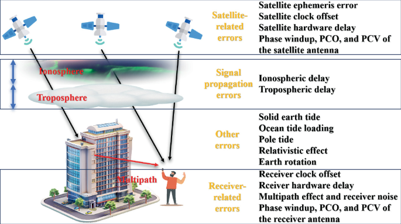
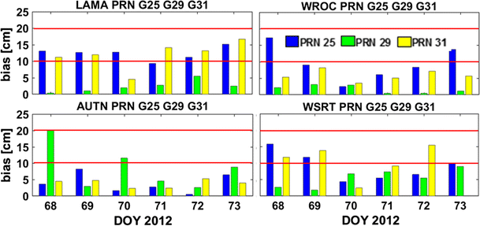
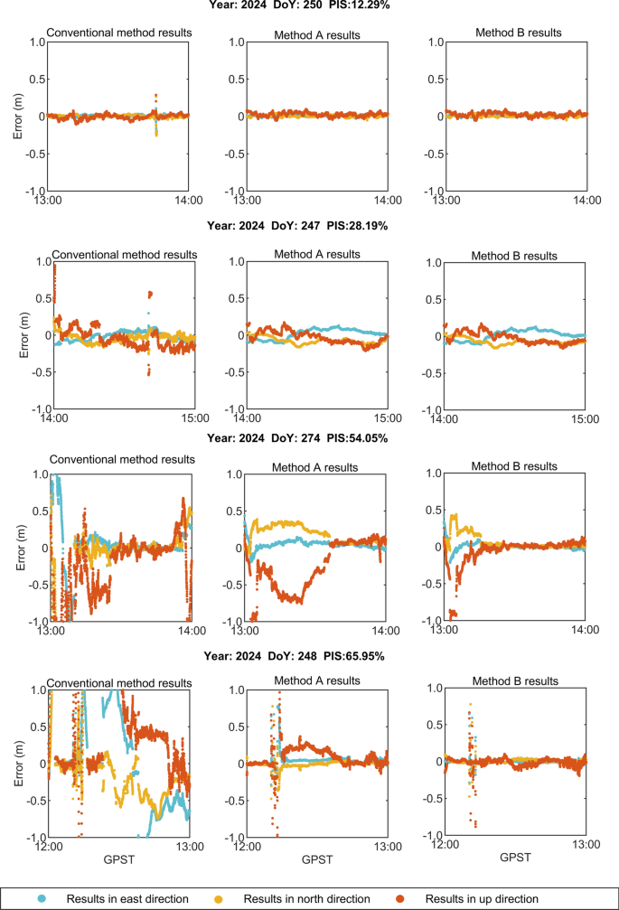

# 2026-08-13 GNSS 每日研究简报

## 今日快报

### 快报 1：残差网络不是总该出手：验证集决定是否修正一小时 TEC 预测

- 主题：`validation-gated-residual-fusion-low-latitude-tec`
- 来源 ID：`doi:10.3390/s26165104`
- 来源链接：https://doi.org/10.3390/s26165104
- 发表日期：2026-08-12
- 来源类型：同行评审开放论文与多年份网格数据试验
- 获取范围：CC BY 4.0 全文；CODE GIM、空间天气指数、XGBoost 与 CNN-BiLSTM 残差模型

**内容：** 作者先用历史 TEC、地方时及太阳—地磁变量训练 XGBoost，再让 CNN-BiLSTM 只学习按时间顺序生成的折外残差；验证集同时决定是否启用残差修正及修正强度，避免把残差网络默认叠到每个时段。数据来自 CODE 全球电离层图，主测点为 20°N、110°E，时间分辨率一小时，并用其他网格点检查空间迁移。

**结论：** 作者报告多变量模型在 2019 年的 RMSE 为 0.67 TECU，较单独 XGBoost 降低 20.2%，且在不同太阳活动条件和三个补充网格点上保持最低误差。这里的真值仍是 CODE GIM 网格而非独立接收机反演；近期 TEC 本身也是强预测量，因此不能把结果直接外推为低纬暴时的实时监测能力。

**关注理由：** 价值不只是“再加一个深度网络”，而是把是否融合交给严格的时序验证。GNSS 环境建模中，残差学习若没有折外生成和启用门控，很容易把未来信息或无效修正带入业务链。

### 快报 2：海上实时改正没有单一冠军：NRTK 横向更小，PPP-RTK 垂向更小

- 主题：`marine-real-time-gnss-correction-strategy-comparison`
- 来源 ID：`doi:10.3390/app16168017`
- 来源链接：https://doi.org/10.3390/app16168017
- 发表日期：2026-08-12
- 来源类型：同行评审开放论文与实船航迹试验
- 获取范围：CC BY 4.0 全文；PPP-RTK、NRTK、单基站 RTK 与 PPK 参照解

**内容：** 研究在同一海上路线比较 PPP-RTK、网络 RTK（NRTK）和单基站 RTK（SBL-RTK），以事后处理动态解作参照，并按 IHO S-44 的水平与垂直不确定度口径评估。它把实时链路、固定状态和海上几何置于同一试验，而不是只比较厂商标称精度。

**结论：** 95% 水平不确定度为 PPP-RTK 5.6 cm、NRTK 4.5 cm；垂直分别为 3.6 cm、6.8 cm，两者在该试验中均满足 IHO S-44。SBL-RTK 因更多浮点或单点状态而较弱。PPK 是高精度参照而非独立绝对真值，且单条路线、基站几何和通信覆盖不足以证明任一策略在所有海况占优。

**关注理由：** 工程选型应把横向、垂向、收敛、固定连续性和改正链路分别验收。只给一个三维 RMS 排名，会掩盖 PPP-RTK 与 NRTK 在不同分量上的真实取舍。

### 快报 3：无 GNSS 船队的鲁棒 EKF 有硬边界：瞬时离群可压，持续漂移仍被吸收

- 主题：`gnss-denied-usv-relative-localization-ekf-envelope`
- 来源 ID：`doi:10.3390/jmse14161490`
- 来源链接：https://doi.org/10.3390/jmse14161490
- 发表日期：2026-08-11
- 来源类型：同行评审开放论文、可观测性分析与四艇编队试验
- 获取范围：CC BY 4.0 全文；IMU、罗盘、UWB 测距与异常感知自适应 EKF

**内容：** 四艘无人艇在 GNSS 失效时，用 IMU、罗盘和艇间 UWB 测距估计相对位置。作者先分析队形运动的结构可观测性，再组合卡方检验、CUSUM、偏置漂移监测、测量噪声自适应和短时过程噪声增强，明确探查滤波器在不同异常类型下的工作包线。

**结论：** S 形运动的结构秩为 24，全局平移仍不可观；直线运动恰好再损失 7 个维度。对 3—10 倍距离噪声标准差的中等离群，作者报告误差改善 4.8%—13.4%；对 0.005—0.10 m/s 的纯偏置漂移，各 EKF 变体等效。后一个负结果说明：持续漂移会被运动状态吸收，单靠残差鲁棒化不能创造可观测性。

**关注理由：** “自适应”不是异常免疫。GNSS 拒止编队若没有绝对锚点、激励运动或专门的偏置状态，统计门限再精巧也无法恢复不可观方向。

### 快报 4：地下磁序列用两级匹配解别名，但它仍是 GNSS 失效后的替代链

- 主题：`deep-geomagnetic-sequence-matching-underground-positioning`
- 来源 ID：`doi:10.1088/1361-6501/ae8e98`
- 来源链接：https://doi.org/10.1088/1361-6501/ae8e98
- 发表日期：2026-08-04
- 来源类型：同行评审论文与真实地下设施试验
- 获取范围：出版社摘要、书目信息与方法概述；本次未取得可检索全文，不复述摘要之外的量化结果

**内容：** 方法先以多尺度导数动态时间规整（MS-DDTW）做粗粒度时序匹配，降低磁力计漂移和行进速度变化的影响；再用 CNN-GRU 孪生网络做语义验证，区分结构重复造成的磁序列别名。作者在真实地下设施中把它与 DTW、kNN 基线比较。

**结论：** 原始摘要报告两级方法优于所列基线，但本次获取不到全文，因而不转述摘要外的距离误差、数据规模或训练切分。它依赖预建磁地图、路线覆盖和传感器域一致性，不能被解释为 GNSS 信号在地下重新可用。

**关注理由：** 地下定位的关键常是“相似走廊是否被误认”，而非单点分类精度。粗匹配与语义复核的分工值得借鉴，但跨矿区、跨手机和地图老化仍须独立验证。

### 快报 5：旋转载体先把自转 Doppler 喂回 NCO，跟踪环才不用独扛动态

- 主题：`ins-aided-gnss-tracking-spinning-vehicle`
- 来源 ID：`doi:10.1016/j.ast.2026.112036`
- 来源链接：https://doi.org/10.1016/j.ast.2026.112036
- 发表日期：2026-08（卷期日期，Crossref 未提供日）
- 来源类型：同行评审论文、射频模拟与单轴转台试验
- 获取范围：出版社摘要、要点与书目信息；本次未取得可检索全文，数值仅限摘要明确披露范围

**内容：** 论文建模旋转天线带来的幅度、Doppler 和相位调制，用 INS 辅助 EKF 估计旋转动态，并把预测 Doppler 直接反馈到载波 NCO；组合滤波器还估计杆臂与时间延迟，避免机械旋转被整个压给跟踪环。验证包含 GNSS 模拟器与单轴转台。

**结论：** 摘要报告该环路在低速旋转时最多改善定位性能 83.0%，在角加速度升至 2000°/s² 的非匀速旋转中最多改善 75.3%。这些是作者摘要口径，全文参数、统计样本与基线定义本次无法审计，不能直接转成任意弹载平台的精度承诺。

**关注理由：** 高动态接收机需要把载体运动先验送到信号跟踪层，而不只是事后组合导航。杆臂、时延或姿态误差若未共同估计，辅助量本身也会变成相位误差源。

## 深度研读

### 深读 1｜接收机工程｜从未差分观测到双差：RTK 能消掉什么、还留下什么

- 类别：`receiver-engineering`
- 学习层级：`foundation`
- 选题定位：`经典基础`
- 来源 ID：`doi:10.1007/978-981-96-9116-6_2`
- 来源链接：https://doi.org/10.1007/978-981-96-9116-6_2
- 发表日期：2025-08-10
- 来源类型：开放获取学术专著章节
- 获取范围：CC BY-NC-ND 4.0 全文与 Figure 2.1 原图；仅原样引用必要图表
- 价值评分：97/100（相关性 20，经典价值 24，证据 18，教学价值 20，工程价值 15）

#### 为什么先学这个

RTK 的厘米级结果来自差分消项、误差空间相关性和整数固定共同作用。先把每个观测项写全，才能理解短基线为何容易、长基线为何必须建模，也能避免把“双差”误读成“所有误差归零”。

#### 先修知识

需要理解伪距、载波相位、卫星—接收机几何距离、接收机与卫星钟差、对流层、电离层、整周模糊度、单差与双差。相位单位在公式中换算为米；L1 等载波波长约为分米量级。

#### 一句话逻辑

在同历元、共视卫星间对两台接收机作双差，可消去共同钟差和大部分硬件偏差，但空间不相关的大气、轨道、天线和多路径残差仍进入基线解。

#### 研究问题与约束

章节系统梳理 RTK 的卫星端、传播路径、接收机端和其他误差，并解释其随基线长度的相关性。它是方法论章节，不是对某一品牌或网络的性能试验；误差量级是典型值，实际结果还受频点、纬度、天气、天线环境和改正延迟制约。

#### 核心方法论

先写接收机 $`r`$ 对卫星 $`s`$ 的未差分码与相位；同一卫星的接收机间单差消去卫星钟；再对参考卫星 $`q`$ 作星间差，消去接收机钟。对短基线，卫星轨道、大气和部分硬件项近似共模；基线增长后，这一近似逐渐失效。

#### 关键公式逐步推导

以米为单位，未差分码和载波相位可写为：

```math
P_r^s=\rho_r^s+c(\delta t_r-\delta t^s)+T_r^s+I_r^s+b_{P,r}^s+\epsilon_{P,r}^s
```

```math
\Phi_r^s=\rho_r^s+c(\delta t_r-\delta t^s)+T_r^s-I_r^s+\lambda N_r^s+b_{\Phi,r}^s+\epsilon_{\Phi,r}^s
```

两台接收机 $`a,b`$、两颗卫星 $`s,q`$ 的双差为：

```math
\nabla\Delta\Phi_{ab}^{sq}=\nabla\Delta\rho_{ab}^{sq}+\nabla\Delta T_{ab}^{sq}-\nabla\Delta I_{ab}^{sq}+\lambda\nabla\Delta N_{ab}^{sq}+\nabla\Delta\epsilon_{ab}^{sq}
```

钟差不再显式出现，但 $`\nabla\Delta T`$、$`\nabla\Delta I`$ 与非共模误差并不必然为零。整数固定的对象是变换后的 $`\nabla\Delta N`$，不是原始相位本身。

#### 经典价值与创新边界

价值在于把误差分类和差分代数接到同一条 RTK 逻辑链，适合作为实现前的误差预算清单。边界是它并未提出新的固定算法，也没有证明某个基线长度是普适阈值；“短基线可忽略大气残差”必须由当地双差残差验证。

#### 整体逻辑链

同步采样；选择共视卫星和参考星；生成站间单差；生成星间双差；按高度角与频点建权；估计浮点基线和模糊度；做整数搜索与比值/成功率检验；固定后重算坐标；用残差、重置次数和独立控制点监测错误固定。

#### 原文图表与结果分析



> 图源：Karaim 等《GNSS Real-Time Kinematic Positioning》第 2 章 Figure 2.1，[Springer 原文](https://doi.org/10.1007/978-981-96-9116-6_2)，CC BY-NC-ND 4.0。直接保存出版社网页原图；未裁剪、重绘或改变标签。

图把误差分为卫星相关、信号传播、接收机相关和其他四组。差分最擅长消除同步且空间相关的卫星钟、接收机钟和共同硬件项；电离层、对流层、轨道投影、天线相位中心与多路径的空间相关性不同，不能只因进入双差就从预算表删除。

#### 原文结果论述

章节用一个量级例子说明轨道误差的基线放大：基线 20 km、卫星距离约 20,000 km、轨道误差 1 m 时，单差轨道影响约为 1 mm；基线上百公里后可达厘米量级。作者也强调多路径是接收环境特有项，无法靠基准站共模消除。例子用于解释比例关系，不是任何场景的误差上限。

#### 常见误区与适用边界

第一，认为双差等于零误差。第二，基准站与流动站不同步仍直接作差。第三，长基线仍沿用短基线大气模型。第四，只看固定率，不检查错误固定。第五，把基站多路径当共同项。第六，忽略天线相位中心、潮汐和坐标框架。第七，用单一高度角权覆盖所有信号质量差异。

#### 工程实现步骤

1. 固定坐标框架、时间系统、天线模型与信号清单。
2. 对两站观测做历元、卫星和频点同步。
3. 标记周跳、失锁、半周与码异常。
4. 建立码/相位双差及完整协方差。
5. 按基线和环境启用电离层、对流层状态。
6. 浮点解稳定后才尝试整数固定，并保留独立完整性监测。

#### 复现实验设计

生成 GPS L1 双站一小时、1 Hz 观测，基线设 1、20、100 km；分别注入 1 m 卫星轨道误差、卫星/接收机钟、随距离增长的电离层与对流层梯度、两站独立多路径。比较未差分、单差、双差的各项 RMS、共模消除率、浮点基线误差与整数固定成功率。再注入 100 ms 不同步和基站强多路径，验证差分失效；随机种子、星历、噪声谱和每项注入量全部公开。

#### 与定位及低成本实现的联系

低成本 RTK 的瓶颈常不是双差公式，而是天线环境、时间同步、频点数、振荡器和改正延迟。明确哪些误差能共模消除，才能把有限算力放在周跳、随机模型和错误固定防护上。

#### 本节小结

双差消掉的是结构上共同的偏差，不是现实中的全部误差；RTK 误差预算必须随基线、同步性和接收环境重新评估。

### 深读 2｜接收机工程｜几何无关组合之后仍有常数偏置：如何把电离层与模糊度—硬件项拆开

- 类别：`receiver-engineering`
- 学习层级：`intermediate`
- 选题定位：`基础进阶`
- 来源 ID：`doi:10.1007/s10291-018-0711-4`
- 来源链接：https://doi.org/10.1007/s10291-018-0711-4
- 发表日期：2018-02-16
- 来源类型：同行评审开放论文、多站实测与边界连续性检验
- 获取范围：开放全文、GPS/GLONASS 观测与 Figure 5 原图；按原文开放许可作署名引用
- 价值评分：96/100（相关性 20，经典价值 22，证据 20，教学价值 18，工程价值 16）

#### 为什么先学这个

上一节的相位观测中，电离层与相位模糊度同时存在。双频几何无关组合能消去几何、钟差和对流层，却会把电离层与一个弧段常数偏置留在同一观测中；若不估这个偏置，精密 TEC 会出现弧间台阶。

#### 先修知识

需要理解双频载波相位、周跳、连续跟踪弧、色散电离层延迟、最小二乘、球谐电离层模型、单层映射函数及高度角截止。这里估计的是组合偏置，不等于单独识别每个硬件延迟和整数模糊度。

#### 一句话逻辑

用电离层时空模型作为公共部分，同时为每条无周跳相位弧估计一个常数，把几何无关相位中的电离层变化与模糊度—硬件偏置分离。

#### 研究问题与约束

作者研究 GPS/GLONASS 几何无关相位偏置能否仅凭相位网数据稳定估计，并用连续日边界检查精度。数据覆盖 2012 年 3 月 7 天、200 余站及一次 Dst 降至 −145 nT 的磁暴，但边界统计只用 12 站；单层与球谐参数化会限制对局地快速结构的描述。

#### 核心方法论

先以历元双差检测周跳并划分连续弧；每条弧分配一个常数偏置，电离层以太阳固定坐标下的球谐参数表示。偏置和电离层参数在同一最小二乘系统求解，之后用相邻日同一连续弧的两个独立偏置估计之差作为外部一致性检验。

#### 关键公式逐步推导

双频相位的几何无关组合为：

```math
L_{GF}=L_1-L_2=-\xi_{GF}I+B_{GF}+\varepsilon_{GF}
```

其中 $`I`$ 为某一参考频率的斜向电离层延迟，$`\xi_{GF}`$ 由两频率决定，$`B_{GF}`$ 汇集整周模糊度与相位硬件偏置。对连续弧内第 $`k`$ 个观测：

```math
L_{GF,k}=-\xi_{GF}M(E_k)VTEC(\varphi_k,\lambda_k,t_k)+B_{GF,arc}+\varepsilon_k
```

把 $`VTEC`$ 展开为球谐基函数 $`\mathbf a_k^T\boldsymbol\theta`$ 后：

```math
L_{GF,k}=-\xi_{GF}M(E_k)\mathbf a_k^T\boldsymbol\theta+\mathbf e_{arc,k}^T\mathbf B+\varepsilon_k
```

多站、多卫星和跨时刻的公共电离层结构提供秩，弧段指示向量则估常数 $`\mathbf B`$；单弧自身不能无条件分开两者。

#### 经典价值与创新边界

论文把组合偏置估计、周跳筛查、日边界检验和形式误差放在统一实测框架中。边界是方法依赖电离层参数化及足够网密度，不会把硬件偏置与整数模糊度分别恢复，也不直接输出用户位置。

#### 整体逻辑链

读取双频相位；清除粗差与短弧；以 30 s 历元差检查周跳；按连续弧编号；计算穿刺点和映射函数；构建电离层基函数与弧偏置联合法方程；每 1200 s 批处理估计；跨日比较同一弧偏置；把异常边界反馈给周跳和模型阶次。

#### 原文图表与结果分析



> 图源：Arikan 等《Carrier phase bias estimation of geometry-free linear combination of GNSS signals for ionospheric TEC modeling》Figure 5，[Springer 原文](https://doi.org/10.1007/s10291-018-0711-4)。直接保存出版社网页原图；未改变坐标、颜色、站名、卫星号或阈值线。

图示 LAMA、WROC、AUTN、WSRT 四站在 PRN 25、29、31 上的日边界偏置差，红线标出 ±10 cm 与 ±20 cm。大多数点集中在 ±10 cm 内，但个别边界接近或越过该带，说明“弧内常数”需要用连续日或外部模型核验，不能只看最小二乘形式精度。

#### 原文结果论述

30° 高度角截止时，日边界偏置 RMS 不超过 10 cm，84% 落在 ±10 cm、全部落在 ±20 cm；20° 截止使单日穿刺点从 1717 增至 1898，但 RMS 约增加 1 cm。一个 L1/L2 分别 −6/−5 周的组合周跳仅约 8 cm，可能通过 ±0.1 m 门限，并造成约 0.035 m 偏置和 0.3 TECU 垂直 TEC 影响。形式误差比实测 RMS 低 30%—40%，不能单独作为精度声明。

#### 常见误区与适用边界

第一，把几何无关理解为无偏。第二，认为组合偏置必为整数。第三，用形式协方差替代边界检验。第四，降低高度角门限只计数量、不计映射误差。第五，周跳门限只在单频设置。第六，跨天无缝就默认硬件恒定。第七，把 TEC 偏置改善直接等同于定位改善。

#### 工程实现步骤

1. 对相位做频间、历元间联合周跳检测。
2. 为每个站—星连续弧分配唯一偏置参数。
3. 固定壳层高度、坐标和球谐阶次并做灵敏度分析。
4. 用稀疏最小二乘联合估计电离层与弧偏置。
5. 以跨日连续弧和独立 GIM 检查偏差。
6. 对形式误差施加经验膨胀，输出可审计质量标志。

#### 复现实验设计

下载 2012 年 DOY 67—73 的 EPN 双频 RINEX，30 s 采样，分别采用 20°/30° 截止和 1200 s 批次；复现弧偏置—球谐联合解，并以日边界 RMS、±10/±20 cm 占比、穿刺点数量和相对参考 TEC 偏差评价。额外给 L1/L2 注入 −6/−5 周跳，比较 ±0.1 m 单门限与多组合检测；固定站表、精密轨道、DCB 产品、球谐阶次、随机种子和缺测规则。

#### 与定位及低成本实现的联系

几何无关组合常用于周跳、电离层监测和多频质量控制。低成本接收机相位间断更多、码噪声更大，更需要弧级偏置和可靠周跳标志；但若网密度不足，复杂电离层模型反而会与弧偏置互相吸收。

#### 本节小结

线性组合消掉了非色散几何，却留下电离层与弧常数的可辨识问题；可靠答案来自联合建模和跨边界验证，而非公式名本身。

### 深读 3｜定位｜把 ROTI 变成状态与权重：扰动期 NRTK 如何保住固定率

- 类别：`positioning`
- 学习层级：`advanced`
- 选题定位：`定位专题：RTK`
- 来源 ID：`doi:10.1186/s43020-025-00179-4`
- 来源链接：https://doi.org/10.1186/s43020-025-00179-4
- 发表日期：2025-10-06
- 来源类型：同行评审开放论文、香港 CORS 实测与 NRTK 对照试验
- 获取范围：CC BY 4.0 全文、站网数据、算法阈值与 Figure 11 原图
- 价值评分：98/100（相关性 20，经典价值 22，证据 20，教学价值 18，工程价值 18）

#### 为什么先学这个

双差在短基线下依赖电离层空间相关；几何无关组合又说明电离层与相位偏置必须被辨识。扰动期的网络内插误差会直接拖垮模糊度固定，因此高级 NRTK 不能只把所有残差交给固定权阵。

#### 先修知识

需要理解 VRS/NRTK、双差载波、整数模糊度、卡尔曼滤波、过程噪声、随机模型、相位闪烁、ROT/ROTI、穿刺点和固定率。ROTI 是 TEC 变化率离散度的代理，不是用户相位误差的直接观测。

#### 一句话逻辑

由服务端 30 s 观测计算 5 min ROTI，把扰动强度同时用于用户端残余电离层状态的过程噪声和高度角权重，并对严重闪烁卫星降权或剔除。

#### 研究问题与约束

论文问网络 RTK 在低纬电离层活动下能否以自适应函数模型和随机模型恢复固定可用性。数据来自香港四个 CORS、站间小于 30 km、流动站距主站约 16 km，比较 2019/2024 年 1 月和 9 月。阈值与相关性来自当地数据；它们不是全球通用常数。

#### 核心方法论

常规方案直接使用 VRS 改正。方法 A 在用户滤波器增加残余双差电离层状态，并由服务端扰动信息调节其过程噪声，使模型在平静期受约束、扰动期可快速变化。方法 B 再把 ROTI 与高度角结合进观测权：闪烁比例超过 50% 剔除，35%—50% 显著降权，其余按经验关系连续调权。

#### 关键公式逐步推导

卫星 $`s`$ 的 TEC 变化率与五分钟窗口 ROTI 可写为：

```math
ROT_k^s=\frac{STEC_k^s-STEC_{k-1}^s}{t_k-t_{k-1}},\qquad ROTI^s=\sqrt{\frac{1}{n-1}\sum_{k=1}^{n}(ROT_k^s-\overline{ROT}^s)^2}
```

在双差相位模型中显式加入残余电离层：

```math
\nabla\Delta\Phi^{sq}=\nabla\Delta\rho^{sq}+\nabla\Delta T^{sq}-\nabla\Delta I^{sq}+\lambda\nabla\Delta N^{sq}+\varepsilon^{sq}
```

令其随机游走过程噪声随扰动强度变化：

```math
\nabla\Delta I_k=\nabla\Delta I_{k-1}+w_{I,k},\qquad \operatorname{Var}(w_{I,k})=q_I(ROTI_k)\Delta t
```

观测方差再写成 $`\sigma_s^2=f(E_s,ROTI_s)`$。因此强扰动卫星既允许电离层状态快速变化，又不会凭相同权重主导整数固定。

#### 经典价值与创新边界

贡献是把服务端可计算的扰动指标真正接到用户端状态模型和权阵，而不止做事后告警，并以多个活动等级展示固定率变化。边界是经验阈值、香港站网密度和低纬环境高度特定；ROTI 与内插误差相关不等于因果充分，也可能把接收机周跳混入扰动指标。

#### 整体逻辑链

服务端清洗双频相位；计算 STEC、30 s ROT 与 5 min ROTI；估计网内电离层内插误差；向用户广播扰动指标；用户端添加残余电离层状态；按 ROTI 自适应过程噪声；按高度角与闪烁比例调权/剔除；浮点滤波；整数固定；用固定正确性、ENU 误差与可用性闭环监控。

#### 原文图表与结果分析



> 图源：Wang 等《Mitigating ionospheric disturbances impacts on NRTK positioning》Figure 11，[Satellite Navigation 原文](https://doi.org/10.1186/s43020-025-00179-4)，CC BY 4.0。直接保存出版社网页原图；未裁剪、重绘或修改数据。

四列对应约 12.29%、28.19%、54.05%、65.95% 的相位闪烁占比，三行分别为 East、North、Up。活动增强时，常规方案离散点和大误差明显增多；方法 A 收紧分布，方法 B 在高占比列进一步压缩异常。图也显示方法并未把所有误差压到零，且横轴只是 GPST 序列，不能从视觉上单独判定正确固定。

#### 原文结果论述

在高活动数据中，ROTI 与内插误差 RMS 的相关系数为 0.91，与固定率约为 −0.9。作者聚焦常规固定率低于 90% 的 87 个小时样本：平均固定率由 58.6% 提至方法 A 的 79.8% 和方法 B 的 84.1%，水平 RMS 由 6.93 cm 降至 5.42/4.32 cm；论文摘要报告垂向改善 41.6%。这些统计剔除了水平/垂直超过 50/100 cm 的粗差，故必须与剔除规则同时引用。

#### 常见误区与适用边界

第一，把 ROTI 当绝对电离层误差。第二，把本地 35%/50% 阈值全球复用。第三，降权后不重算整数成功率。第四，只报固定率、不查错固定。第五，用同一数据调阈值并验收。第六，忽略指标广播延迟。第七，粗差剔除后不披露全样本尾部。第八，把新增电离层状态无限放松导致与坐标、对流层互相吸收。

#### 工程实现步骤

1. 在服务端分离周跳、硬件异常与真实 TEC 变化。
2. 以滑窗计算每星 ROTI，并附时间戳、延迟和质量标志。
3. 用历史留出集标定 $`q_I(ROTI)`$ 与权函数。
4. 用户端增加残余电离层状态并限制可辨识性。
5. 在整数固定前传播完整协方差并做成功率检验。
6. 同时报全样本/清洗后误差、正确固定率和退化告警。

#### 复现实验设计

使用 HKKT、HKOH、HKST、HKWS 与论文流动站几何，30 s 采样、5 min ROTI 窗；按 2024 年 9 月 12:00—24:00 每小时重启，比较常规、方法 A、方法 B，复现 35%/50% 阈值。指标含正确固定率、TTFF、ENU RMS/95%、可用性、广播延迟和全样本尾部；以已知基线或独立后处理解判定错固定。2019 年与 2024 年 1 月/9 月分开调参与盲测，再在另一低纬站网做阈值迁移失败测试。

#### 与定位及低成本实现的联系

扰动期低成本多频接收机更容易因相位噪声和周跳放大固定困难。服务端指标能节省用户端建模成本，但广播协议、时延和质量标志必须可用；否则过期 ROTI 会给当前观测错误权重。

#### 本节小结

高级 NRTK 的关键不是发现“电离层很差”，而是把可审计的扰动量映射到状态自由度、观测权和剔除决策，并用独立时段验证固定正确性。

## 今日脉络

三篇深读形成一条完整链：未差分观测经双差消去共同钟差，但留下非共模大气与环境误差；双频无几何组合进一步隔离色散项，却必须联合估计弧段偏置；当低纬扰动破坏网络内插时，NRTK 再把 ROTI 映射到电离层状态和随机模型。共同原则是：线性组合不会让误差自动消失，任何“消项”都要说明留下了什么、凭什么可辨识、由什么独立证据验收。
