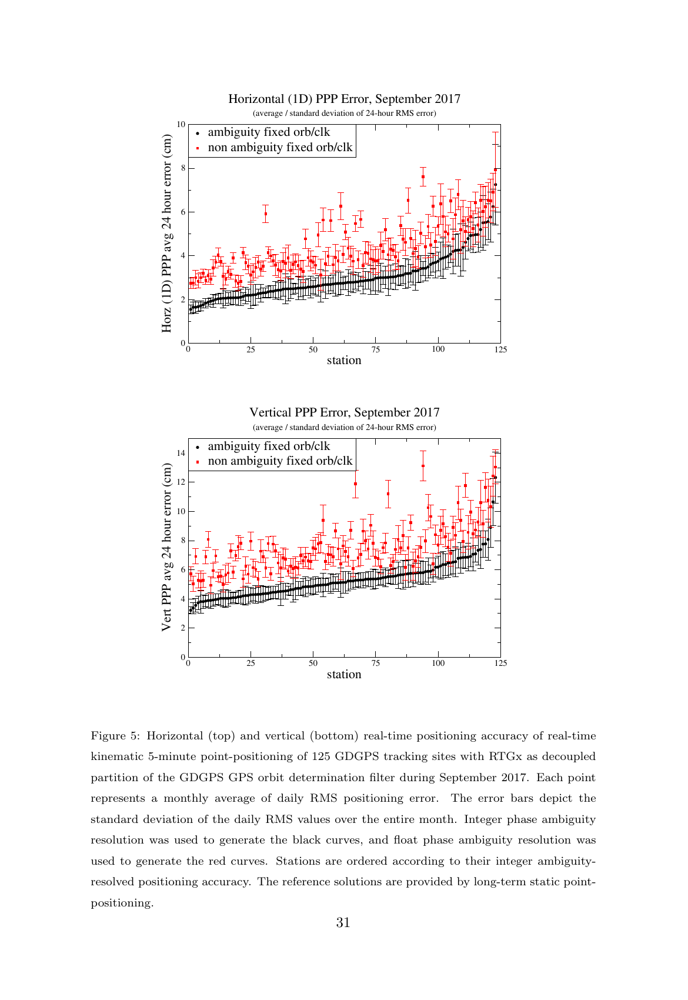
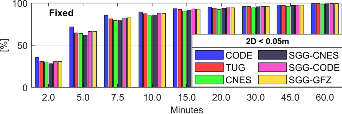
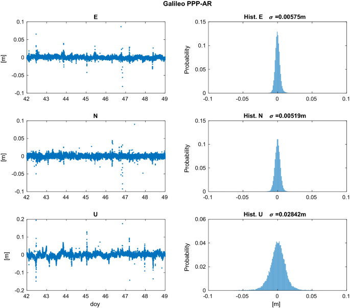

# 2026-08-14 GNSS 每日研究简报

## 今日快报

### 快报 1：跨十年比较 PPP，板块运动和参考框架可能比算法噪声更显眼

- 主题：`africa-multiepoch-static-multignss-ppp-frame-alignment`
- 来源 ID：`doi:10.1515/jag-2026-0050`
- 来源链接：https://doi.org/10.1515/jag-2026-0050
- 发表日期：2026-08-13
- 来源类型：同行评审论文与非洲 IGS 站多历元静态 PPP 研究
- 获取范围：出版社摘要、JATS 书目信息与方法概述；本次未取得可检索正文，因此不复述摘要中的量化精度

**内容：** 作者选取分布于不同地理与电离层环境的非洲 IGS 站，把 2013、2018 和 2023 年双频无电离层组合 PPP 结果转到站心 ENU 坐标，再区分区域大气、参考框架演进与努比亚—索马里板块长期位移。问题不是简单比较三个年份谁“更准”，而是先把真实地球运动从处理误差中拆开。

**结论：** 出版社摘要明确指出，未对齐板块运动和 IGS14/IGS20 等参考框架时，长期坐标残差会被地球物理位移显著污染；对齐后，剩余结果才适合解释为 PPP 的定位表现。由于本次未审计正文的站表、随机模型和统计检验细节，不转述具体厘米数，也不把“非洲站网”概括为整个大陆任意场景。

**关注理由：** PPP 软件验收不能把旧坐标直接当永久真值。跨年回放至少要统一参考历元、速度场、天线改正和产品框架，否则算法升级评测会把板块运动误判为定位漂移。

### 快报 2：伪卫星/GPS PPP 的随机模型不只看仰角和 C/N₀，还把几何与残差送入 LSTM

- 主题：`lstm-stochastic-model-pseudolite-gps-ppp`
- 来源 ID：`doi:10.1088/1361-6501/ae9175`
- 来源链接：https://doi.org/10.1088/1361-6501/ae9175
- 发表日期：2026-08-11
- 来源类型：同行评审论文、铁路与车辆实测、LSTM 自适应随机模型
- 获取范围：IOP 出版者接受稿摘要与书目信息；本次未取得可检索全文，不复述摘要中的百分比提升

**内容：** 传统伪卫星/GPS PPP 常用等权、仰角或 C/N₀ 单变量函数给观测赋权。作者把 C/N₀、仰角、单星对水平 DOP 的贡献和量测残差共同输入 LSTM，动态估计观测噪声，再把协方差送回卡尔曼滤波；试验覆盖青藏铁路数据和后续陆车数据的静态、动态片段。

**结论：** 出版者摘要报告该模型在两类试验中优于三种传统随机模型，但本次没有获得可核查的训练/测试切分、网络超参数与每段轨迹结果，因此只保留“在作者数据集上改善”这一有边界的结论。残差同时作为特征还可能形成反馈，跨路线泛化必须用整段留出而非随机历元切分验证。

**关注理由：** 随机模型决定滤波器相信谁。学习型赋权的工程价值在于融合多种质量线索，风险则是把滤波残差中的模型错误学回权阵；离线回放应同时检查精度、创新白化和协方差一致性。

### 快报 3：跨场景融合先估“传感器够不够”，再决定滤波、图优化和信息互信

- 主题：`goal-directed-synergistic-fusion-spatial-uncertainty`
- 来源 ID：`doi:10.1186/s43020-026-00208-w`
- 来源链接：https://doi.org/10.1186/s43020-026-00208-w
- 发表日期：2026-08-11
- 来源类型：同行评审开放论文、跨场景实测与多传感器因子图
- 获取范围：CC BY 4.0 出版社摘要、方法概述与书目信息；本次未取得可检索正文，不复述摘要中的轨迹长度与 RMS

**内容：** 方法把多源观测先统一为导航地标，用有效地标的数量与空间分布定义充分度（DoS），再按 DoS 切换或调节滤波与优化。随后用可观测度（DoO）评价信息可信度，以意见动力学协调不同来源，并在因子图中联合估计，目标是在 GNSS 拒止、视觉退化和 LiDAR 退化间平滑迁移。

**结论：** 摘要称真实跨场景试验优于所列基线与消融模型，但没有正文就无法审计真值系统、场景覆盖和失败历元。这里可确认的创新是把“信息是否足够”和“状态是否可观”显式进入融合逻辑，不能据此推断任意传感器组合都能在完全失去绝对约束时保持无漂移。

**关注理由：** 接收机或组合导航系统常只做故障开关，却不量化剩余几何。DoS/DoO 思路可转化为 GNSS 可用星数、方位覆盖、残差秩和外部地标分布的统一降级指标。

### 快报 4：BDSBAS 进近程序把定位解、保护级和障碍物评估面放进同一验收链

- 主题：`bdsbas-oas-constrained-approach-procedure`
- 来源 ID：`doi:10.3390/aerospace13080717`
- 来源链接：https://doi.org/10.3390/aerospace13080717
- 发表日期：2026-08-10
- 来源类型：同行评审开放论文、机场部署与动态飞行试验
- 获取范围：CC BY 4.0 出版社摘要与书目信息；本次未取得可检索全文，不复述摘要中的误差分位数或面积变化率

**内容：** 作者在局部笛卡尔坐标系中构造进近轨迹几何约束，以障碍物评估面（OAS）检查净空，同时联合处理 GNSS 观测和 BDSBAS 增强数据，计算位置、水平保护级和垂直保护级，并按准确性、完整性、连续性与可用性评估程序。

**结论：** 摘要给出的机场部署和飞行试验支持“该案例满足所设保护级与告警限”的作者结论；但没有正文就不能核查告警限数值、故障假设、连续性统计窗口和机场地形代表性，因此不外推为适航批准或所有复杂地形机场的替代方案。

**关注理由：** 航空 GNSS 不能只报位置 RMS。把 OAS、保护级和告警限联结起来，提醒工程团队同时验证定位误差是否被界包住，以及程序设计是否真的给障碍物留出安全余度。

### 快报 5：实测 LEO 同时增强 BDS-3 定轨与 PPP，但两条收益链不能混成一个数字

- 主题：`centispace-leo-bds3-integrated-pod-ppp`
- 来源 ID：`doi:10.1186/s43020-026-00212-0`
- 来源链接：https://doi.org/10.1186/s43020-026-00212-0
- 发表日期：2026-08-10
- 来源类型：同行评审开放论文、CENTISPACE™ 实测与 BDS-3/LEO 联合定轨定位
- 获取范围：CC BY 4.0 出版社摘要、方法与书目信息；本次未取得可检索正文，不复述摘要中的轨道精度和收敛时间百分比

**内容：** 研究把区域地面站接收的 BDS-3/CENTISPACE™ 下行观测与 LEO 星载 BDS-3 观测联合起来，同时估计 BDS-3 精密轨道钟差、LEO 轨道与接收机钟差、LEO 发射钟差；随后把这些产品用于 BDS-3/LEO 动态 PPP，形成“产品端增强—用户端定位”的两级实验。

**结论：** 摘要支持加入多颗实测 LEO 后改善区域 BDS-3 定轨并缩短所测 PPP 浮点解收敛的结论。它不等于仅靠 LEO 几何就能自动获得高精度：星载接收机、发射载荷硬件延迟、LEO 钟与轨道产品质量仍是共同前提。

**关注理由：** LEO-PNT 评测需要分别报轨道/钟产品质量与用户定位性能。若只报最终收敛时间，就看不出收益来自更强几何、更多观测，还是联合定轨本身已经改善了 BDS-3 产品。

## 深度研读

### 深读 1｜接收机工程｜从全局轨道钟到单站状态：GipsyX/RTGx 如何把 PPP 变成可运行业务链

- 类别：`receiver-engineering`
- 学习层级：`foundation`
- 选题定位：`经典基础`
- 来源 ID：`doi:10.1016/j.asr.2020.04.015`
- 来源链接：https://doi.org/10.1016/j.asr.2020.04.015
- 发表日期：2020-08
- 来源类型：同行评审开放论文、JPL GipsyX/RTGx 业务系统与全球站网实测
- 获取范围：作者公开完整稿、PPP/轨道钟业务章节与 Figure 5
- 价值评分：98/100（相关性 20，经典价值 25，证据 19，教学价值 20，工程价值 14）

#### 为什么先学这个

PPP 常被一句话概括为“单机加精密轨道钟”。真正实现时，码、相位、大气、钟、天线、潮汐和模糊度必须在同一观测模型中闭合；少一个项，滤波器就会把它吸收到坐标、钟差或模糊度。先把这条链写清，才能理解后两节为什么产品偏差定义会决定整数能否固定。

#### 先修知识

需要理解伪距、载波相位、卫星—接收机几何距离、卫星与接收机钟差、电离层色散、对流层延迟、天线相位中心、整周模糊度、无电离层组合、最小二乘和卡尔曼滤波。公式统一用米；相位周数通过波长换算。

#### 一句话逻辑

PPP 用精密轨道钟和逐项物理改正把未差分码/相位变成可估观测，再由序贯滤波同时求坐标、接收机钟、湿对流层和每星模糊度；收敛速度取决于这些状态能否被几何与外部约束分离。

#### 研究问题与约束

论文介绍 JPL 将 GIPSY 与 RTG 统一为 GipsyX/RTGx 后，如何在同一系统中生产精密轨道钟、实时差分改正与 PPP，并用全球站网业务数据评估。它是系统论文而非逐行开源实现；Figure 5 使用 2017 年 9 月 GDGPS 站网的 5 min 点定位，不能直接代表今天任意消费级接收机。

#### 核心方法论

先从每频点的码与相位写出几何、钟、大气、硬件、模糊度及噪声；应用精密轨道钟、相对论、天线、潮汐等确定性改正；双频时构造无电离层组合消去一阶电离层；将位置、钟、湿对流层与浮点模糊度放入线性化状态，通过历元递推让低噪声相位逐渐约束坐标。

#### 关键公式逐步推导

下面是为解释论文业务链而采用的标准 PPP 观测骨架（编辑部推导，不声称为原文逐式复刻）：

单频未差分观测可写为：

```math
P_i=\rho+c(\delta t_r-\delta t^s)+T+I_i+b_{P,i}+\varepsilon_{P,i}
```

```math
\Phi_i=\rho+c(\delta t_r-\delta t^s)+T-I_i+\lambda_iN_i+b_{\Phi,i}+\varepsilon_{\Phi,i}
```

双频无电离层组合为：

```math
X_{IF}=\frac{f_1^2X_1-f_2^2X_2}{f_1^2-f_2^2},\qquad X\in\{P,\Phi\}
```

应用确定性改正并在线性化点展开后：

```math
\mathbf z_k=\mathbf H_k\delta\mathbf x_k+\mathbf v_k,\qquad
\delta\mathbf x_k=[\delta\mathbf r,\ c\delta t_r,\ ZWD,\ \tilde N_1,\ldots]^T
```

无电离层组合消掉一阶电离层，却放大观测噪声；$`\tilde N`$ 还吸收相位硬件偏差，所以基础 PPP 先把它当实数估计。

#### 经典价值与创新边界

经典价值是展示精密产品生产与用户 PPP 不是两套互不相干的软件：轨道钟、参考框架、偏差固定和用户解必须共享模型约定。边界是 GipsyX/RTGx 的业务实现、网络与质量控制具有机构特定性，论文公开了架构和结果，不等于完整源码或实时服务保证。

#### 整体逻辑链

读取 RINEX 与精密产品；统一时间和参考框架；计算卫星发射时刻位置与钟；改正相对论、地球自转、天线、相位缠绕、潮汐和大气；组合或原始频点建模；质量控制；预测状态；更新坐标/钟/ZWD/模糊度；检查创新与协方差；输出收敛标志。

#### 原文图表与结果分析



> 图源：Bertiger 等《GipsyX/RTGx, a new tool set for space geodetic operations and research》Figure 5，[DOI 原文](https://doi.org/10.1016/j.asr.2020.04.015)与[作者公开稿](https://arxiv.org/abs/2004.13124)。公开稿页首标注 CC BY-NC-ND 4.0；由 PDF 第 31 页以 180 dpi 渲染，仅裁出完整 Figure 5 与图注，未修改坐标、图例、误差棒或数据。

上下图横轴都是按固定产品结果排序的 125 个站，纵轴分别为水平一维和垂直 24 h PPP 误差的月平均（cm）；误差棒是整月每日 RMS 的标准差。黑色为使用整数固定轨道钟产品，红色为非固定产品。多数站黑点低于红点，直接显示产品端模糊度固定可传到用户误差；站序不是地理或时间轴，图不能证明同一站每个历元都改善。

#### 原文结果论述

Figure 5 汇总 2017 年 9 月 125 个 GDGPS 跟踪站，每次用 5 min 实时动态点定位，参考为长期静态点定位。图中固定产品的水平结果约从 1.5 cm 上升到 7 cm，垂直约从 3 cm 到 11 cm；非固定产品整体更高且离散更大。这是按固定结果排序后的目测范围，不是作者给出的统一提升率，也不是独立于 GDGPS 的绝对真值。

#### 常见误区与适用边界

第一，把单站误读成不依赖网络产品。第二，只替换轨道钟，不统一天线和参考框架。第三，认为无电离层组合没有噪声代价。第四，把浮点模糊度强行取整。第五，用坐标变平就宣告收敛，而不看残差和协方差。第六，把外部电离层改正当无误差真值。第七，周跳后不重置对应弧段。

#### 工程实现步骤

1. 固定时间系统、坐标框架、信号与产品组合。
2. 为每个确定性改正编写开关和量级单元测试。
3. 同时保留原始频点与 IF 组合残差，检查符号和单位。
4. 建立坐标、钟、ZWD、系统间偏差和每弧模糊度状态。
5. 按高度角、C/N₀ 与信号类型构造协方差并做创新检验。
6. 以独立参考坐标和重启试验定义收敛，而非只看滤波内部方差。

#### 复现实验设计

选 20 个 MGEX 站、连续 30 d、30 s 数据；以同一 PPP 用户实现分别接入广播星历、普通精密轨道钟和支持整数恢复的成套产品。每 2 h 冷启动，指标为 ENU 24 h RMS、10 cm 持续到达时间、创新白化、ZWD 差与 CPU；注入 30/60 s 产品延迟、0.1 m 天线 PCO 错误、周跳和错误框架坐标。参考用独立周解坐标，避免拿同一用户解自证。

#### 与定位及低成本实现的联系

低成本双频接收机也可运行 PPP，但码噪声、天线相位稳定性、频点连续性和振荡器会延长状态分离。工程优化应优先保证观测与改正闭合，再考虑滤波器复杂化；模型错一项常比少一次矩阵优化更致命。

#### 本节小结

PPP 的“点”是用户不需要近邻基站，不是系统没有网络和产品依赖；高精度来自观测、改正、状态和质量控制的闭环。

### 深读 2｜接收机工程｜浮点模糊度为何不是整数：PPP-AR 产品必须与钟和偏差定义成套

- 类别：`receiver-engineering`
- 学习层级：`intermediate`
- 选题定位：`基础进阶`
- 来源 ID：`doi:10.1007/s10291-021-01140-z`
- 来源链接：https://doi.org/10.1007/s10291-021-01140-z
- 发表日期：2021-05-13
- 来源类型：同行评审开放论文、45 个 IGS MGEX 站与多分析中心产品对比
- 获取范围：CC BY 4.0 全文、公式、表格与 Figure 3 原图
- 价值评分：99/100（相关性 20，经典价值 24，证据 20，教学价值 18，工程价值 17）

#### 为什么先学这个

上一节的 PPP 相位模糊度吸收了卫星和接收机相位硬件偏差，因此不再是裸整数。本节解释网络端如何用 FCB/UPD 或“整数恢复钟”重新定义偏差，用户端又必须怎样匹配轨道、钟和偏差产品，才能把宽巷、窄巷依次固定。

#### 先修知识

需要理解无电离层组合、宽巷/窄巷、Melbourne–Wübbena 组合、星间单差、参考星、分数周偏差（FCB/UPD）、整数恢复钟（IRC）、LAMBDA、部分模糊度固定、协方差传播与 TTFF。

#### 一句话逻辑

PPP-AR 不是对浮点数直接四舍五入，而是先用与轨道钟严格一致的卫星偏差产品恢复整数结构，再以宽巷降低搜索难度、以窄巷和协方差完成联合验收。

#### 研究问题与约束

论文比较 CNES、CODE、SGG 和 TUG 的 GPS+Galileo PPP-AR 产品，问不同产品定义和质量如何影响固定收敛。数据为 2020 年 1 月 45 个全球 MGEX 站、30 s 采样，小时级反复冷启动；参考是每日 IGS 坐标。它评估的是静态站伪动态处理，不含真实车辆遮挡、通信中断和产品实时延迟。

#### 核心方法论

先以 IF 码/相位估计坐标、湿对流层、接收机钟、系统间钟差和浮点模糊度；按系统选择参考星做星间单差以消除接收机相位偏差；用 HMW 组合与宽巷偏差固定宽巷；由浮点 IF 模糊度、已固定宽巷和窄巷偏差构造窄巷浮点量，经 LAMBDA/部分固定验收；至少三条成功固定后，以高权伪观测重估坐标。

#### 关键公式逐步推导

浮点 IF 模糊度包含硬件相位偏差：

```math
\tilde N_{IF}=\bar N_{IF}+b_{IF,r}-b_{IF}^{s}
```

HMW 组合隔离宽巷整数与硬件偏差：

```math
HMW=\frac{f_1L_1-f_2L_2}{f_1-f_2}-\frac{f_1P_1+f_2P_2}{f_1+f_2}
=\lambda_{WL}(\overline{WL}+b_{WL,r}-b_{WL}^{s})
```

对参考星作单差后消去接收机项，再校正卫星宽巷偏差并取整：

```math
\overline{WL}_{SD}=\left\langle HMW_{SD}+b_{WL,SD}^{s}\right\rangle_n
```

随后由协方差约束的窄巷浮点量进入整数搜索：

```math
\overline{NL}_{SD}=\operatorname{LAMBDA}(\widetilde{NL}_{SD})
```

关键不是公式形式，而是 $`b^s`$ 必须与生成所用轨道和钟定义一致。

#### 经典价值与创新边界

论文把两类主流 PPP-AR 产品思想、用户端公式和跨分析中心实测放在同一框架中，适合做产品接入验收。它没有证明某分析中心永久优于其他中心；排名属于 2020 年该月、该软件、该 IF 双频配置，产品更新或改用 OSB/原始频点模型后可能改变。

#### 整体逻辑链

核对产品元数据；读取匹配轨道/钟/偏差；先跑浮点 PPP；每系统选参考星；平滑 HMW；校正并固定宽巷；传播窄巷协方差；部分 LAMBDA 固定与比率/成功率检验；固定坐标重算；独立残差和重启统计；产品切换时全部重置。

#### 原文图表与结果分析



> 图源：Glaner 与 Weber《PPP with integer ambiguity resolution for GPS and Galileo using satellite products from different analysis centers》Figure 3，[GPS Solutions 原文](https://doi.org/10.1007/s10291-021-01140-z)，CC BY 4.0。直接保存 Springer 官方完整 Figure 3；未裁剪、重绘或改变图例与数值。

横轴是重置后分钟数，纵轴是在该时刻已满足固定解二维误差小于 0.05 m 且之后不再越界的收敛周期比例（%）。六组产品在 2 min 时都只有约三成，在 5—10 min 快速上升，60 min 接近全部收敛。CODE 早期柱略高，但图也说明差异主要在收敛前段；它不能证明最终坐标精度有同等幅度差异。

#### 原文结果论述

试验产生超过 33,000 个一小时收敛周期。作者定义浮点收敛为二维误差低于 0.10 m 且余下时段不再越界，固定收敛为低于 0.05 m。CODE 产品平均 TTFF 为 5.52 min，SGG-CODE、SGG-GFZ 和 TUG 约 6 min，CNES 与 SGG-CNES 约 6.5 min；收敛后各产品精度相近。数字只对应 30 s GPS L1/L2 + Galileo E1/E5a、静态站伪动态处理。

#### 常见误区与适用边界

第一，把 float 模糊度直接 round。第二，混搭不同中心的轨道钟与偏差。第三，参考星切换不变换协方差。第四，只固定宽巷就称 PPP-AR。第五，忽略 NL FCB 直接进入固定坐标。第六，只报首次取整，不要求之后持续低于阈值。第七，把错误固定当快速收敛。第八，产品切换仍沿用旧弧状态。

#### 工程实现步骤

1. 为每套产品记录信号、组合、时标、基准与偏差定义。
2. 做无固定 float A/B，确保轨道钟本身一致。
3. 对 HMW 序列检查半周、周跳、平滑窗和参考星切换。
4. 从 float 协方差严格传播到 SD WL/NL 空间。
5. 实现部分固定、成功率/比值检验和固定后残差门控。
6. 按冷启动、产品空洞和错配注入统计 TTFF 与错误固定率。

#### 复现实验设计

复用 45 个 MGEX 站、2020 年 1 月、30 s 配置；再加 1 s 高率子集。对 CODE、CNES、SGG、TUG 逐套运行，每小时重启，基线为同产品 float PPP。指标为 5/10/30/60 min 收敛比例、TTFF 中位数/均值、3D 95% 误差、固定率和错误固定率。失败注入包括错配 NL 偏差、延迟 30/60 s、缺 5 min 产品、参考星切换和单星周跳。

#### 与定位及低成本实现的联系

低成本设备的码噪声会直接污染 HMW，短弧和频繁周跳又削弱窄巷协方差，因此网络端有高质量偏差产品仍不保证用户端快速固定。可先采用部分固定和更严格门控，把可用率让给错误固定风险。

#### 本节小结

PPP-AR 的整数性来自网络产品与用户模型共同定义；产品“成套、一致、可追溯”比简单宣称支持模糊度固定更重要。

### 深读 3｜定位｜Galileo-only PPP-AR：毫米级重复性来自什么，证据边界在哪里

- 类别：`positioning`
- 学习层级：`advanced`
- 选题定位：`纯 GNSS 定位进阶`
- 来源 ID：`doi:10.1186/s40623-019-1055-1`
- 来源链接：https://doi.org/10.1186/s40623-019-1055-1
- 发表日期：2019-07-12
- 来源类型：同行评审开放短文、Galileo-only 一周后处理动态 PPP/PPP-AR
- 获取范围：CC BY 4.0 全文、公式、表格与 Figure 3 原图
- 价值评分：97/100（相关性 20，经典价值 23，证据 19，教学价值 17，工程价值 18）

#### 为什么先学这个

前两节说明了 PPP 的观测闭合与产品一致性。本节把链条落到纯 Galileo：只用 E1/E5a、CNES/CLS 精密轨道与整数恢复钟，先固定宽巷，再固定无电离层窄巷，检验单一星座能否在接近完整部署时独立给出高精度动态解。

#### 先修知识

需要理解 Galileo E1/E5a、MW 组合、宽巷与窄巷波长、接收机/卫星宽巷偏差、整数恢复钟、相位缠绕、天线 PCV、后处理动态 PPP、固定站伪动态评估、ENU 重复性和 1σ。

#### 一句话逻辑

用与 Galileo 硬件偏差一致的精密轨道和整数恢复钟，先从 MW 组合固定宽巷，再在无电离层相位中按协方差逐个固定窄巷，可把单系统后处理动态 PPP 的横向散布进一步压小。

#### 研究问题与约束

研究使用 2019-02-11 至 17 日四个固定 IGS 站，以 30 s 采样做逐历元动态坐标，比较 Galileo-only PPP 与 PPP-AR。期间处理 24 颗 Galileo（含两颗椭圆轨道星）。固定站坐标提供重复性参照，但这不是车辆真实运动，也没有实时产品延迟、遮挡或独立动态真值。

#### 核心方法论

先计算 E1/E5a MW 组合，估计每历元接收机宽巷偏差与每星弧段宽巷模糊度，结合稳定的卫星宽巷偏差顺序固定；再建立码/相位无电离层方程，应用 CNES/CLS GRM 轨道和整数恢复钟。先求 float PPP，随后对满足协方差门限的 E1 窄巷参数顺序 bootstrap 固定，仅保留固定后的 IF 相位重算 PPP-AR。

#### 关键公式逐步推导

E1/E5a 的 Melbourne–Wübbena 组合为：

```math
MW=\frac{f_{E1}L_{E1}-f_{E5a}L_{E5a}}{f_{E1}-f_{E5a}}
-\frac{f_{E1}P_{E1}+f_{E5a}P_{E5a}}{f_{E1}+f_{E5a}}
```

其宽巷波长与窄巷波长为：

```math
\lambda_{WL}=\frac{c}{f_{E1}-f_{E5a}}=0.751\ \mathrm{m},\qquad
\lambda_{NL}=\frac{c}{f_{E1}+f_{E5a}}=0.109\ \mathrm{m}
```

弧段宽巷估计包含整数、接收机和卫星偏差：

```math
\tilde N_{WL}=(N_{E1}-N_{E5a})+\mu_r-\mu^s
```

校正稳定的 $`\mu^s`$、估计 $`\mu_r`$ 并固定宽巷后，整数恢复钟保持 IF 相位窄巷的整数结构；再按协方差门限逐个固定 $`N_{E1}`$。

#### 经典价值与创新边界

价值在于较早给出接近完整 Galileo 星座下单系统 PPP-AR 的端到端实证，并公开偏差、组合和固定顺序。边界是只有一周、四个固定站、后处理和固定天线；E5 地面天线 PCV 当时缺失，作者以 L2 映射替代并承认可能带来毫米级退化。

#### 整体逻辑链

读取 Galileo E1/E5a 与 GRM 产品；弧段/周跳筛选；估接收机宽巷偏差；校正卫星宽巷偏差；bootstrap 固定 WL；建 IF 码相位；估坐标/ZTD/梯度/钟/float NL；按协方差固定 NL；只用固定 IF 相位重算；转 ENU；与固定站坐标比较散布和异常尾部。

#### 原文图表与结果分析



> 图源：Katsigianni 等《Galileo millimeter-level kinematic precise point positioning with ambiguity resolution》Figure 3，[Earth, Planets and Space 原文](https://doi.org/10.1186/s40623-019-1055-1)，CC BY 4.0。直接保存 Springer 官方完整 Figure 3；未裁剪、重绘或改变坐标、直方图与数值。

左列横轴为 2019 年年积日 42—49，纵轴分别为 E/N/U 误差（m）；右列是概率直方图。图中文字直接给出 BRUX 固定解的 1σ：E 0.00575 m、N 0.00519 m、U 0.02842 m。水平分量集中在零附近但仍有厘米级尖峰，U 分布更宽且有长尾；图证明的是该站一周重复性，不是绝对准确度或实时完整性。

#### 原文结果论述

四站一周汇总中，作者报告 Galileo-only PPP 的 E/N/U 1σ 为 10/7/33 mm，PPP-AR 为 6/5/28 mm；BRUX Figure 3 与汇总量级一致。改进在东向最明显，符合模糊度固定增强载波几何的预期。固定率见原文 Table 1，但没有故障注入和保护级，不能把小 1σ 转成受界尾部风险。

#### 常见误区与适用边界

第一，把固定站伪动态重复性当真实车辆精度。第二，把 1σ 当 95% 或完整性界。第三，忽略异常尖峰只报高斯拟合。第四，认为 Galileo-only 天然优于多系统。第五，使用普通钟产品却沿用 IRC 固定。第六，E5 天线模型缺失仍声称毫米绝对准确。第七，短时产品中断后不重置相关模糊度。

#### 工程实现步骤

1. 锁定 Galileo 信号、天线模型与 CNES/CLS 产品版本。
2. 以 MW 弧段稳定性建立周跳和宽巷偏差质量控制。
3. 先验证 float PPP 与原文量级，再启用逐步固定。
4. 输出每星 WL/NL 状态、协方差、验收与拒绝原因。
5. 分 ENU 统计中位数、1σ、95/99.9% 和最大连续超限。
6. 加入产品延迟、遮挡与重捕获，验证真实动态可恢复性。

#### 复现实验设计

获取 2019-02-11 至 17 日 BRUX 等四站 30 s E1/E5a 数据与 CNES/CLS GRM 产品；实现 Galileo-only float PPP 与 IRC PPP-AR，固定站坐标作外部参照。指标为 ENU 均值、1σ、95/99.9%、固定率、错误固定率与重收敛时间。基线为同模型 float PPP；失败注入包括每小时切断一颗星 120 s、E5 PCV 替代/关闭、钟产品错日和 30 s 周跳。

#### 与定位及低成本实现的联系

单系统高精度可用于检查多系统解的系统间偏差，但低成本天线和短弧会削弱 MW 与窄巷固定。实际设备应把 Galileo-only 作为可观测的子解和故障隔离通道，而不是在卫星不足时强行维持高精度标志。

#### 本节小结

Galileo-only PPP-AR 在受控后处理中显示毫米至厘米级重复性；它依赖一致的整数产品、稳定弧段和完整天线模型，且重复性并不等于实时完整性。
