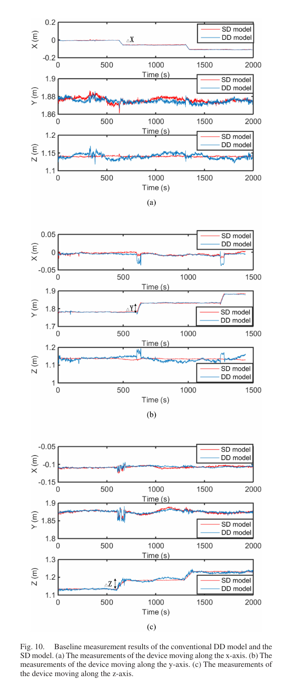
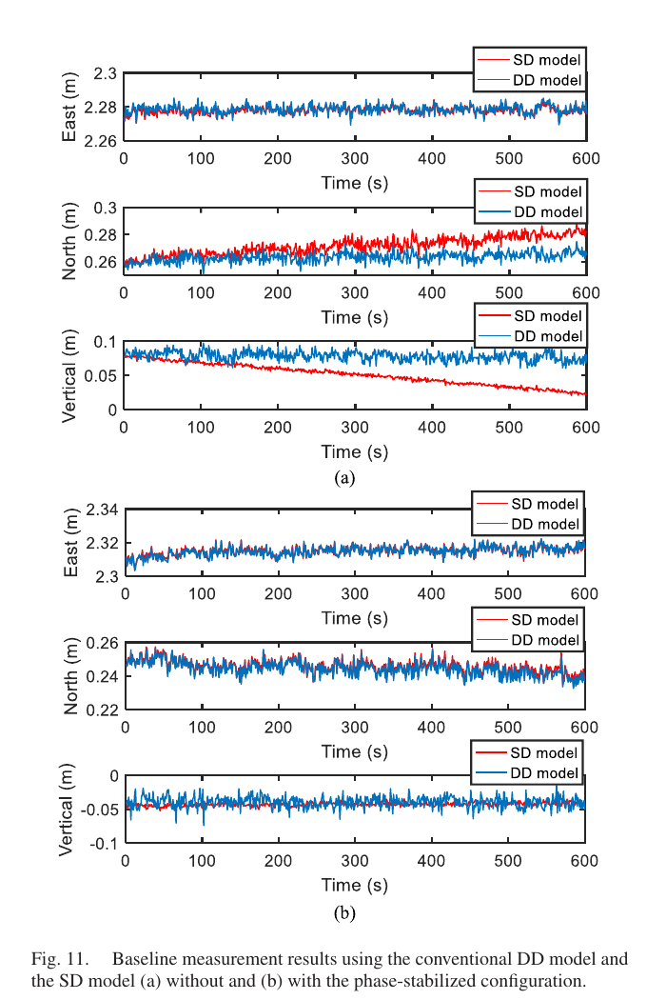
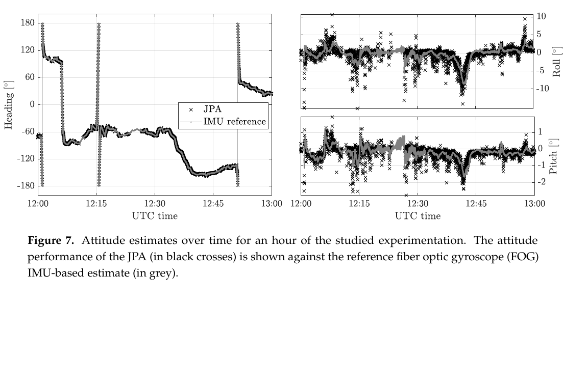

# 2026-08-15 GNSS 每日研究简报

## 今日快报

### 快报 1：GNSS 拒止无人机群先选“谁发起测距”，不能只按节点数量省资源

- 主题：`uwb-gdop-resource-aware-node-preselection`
- 来源 ID：`doi:10.3390/s26165164`
- 来源链接：https://doi.org/10.3390/s26165164
- 发表日期：2026-08-14
- 来源类型：同行评审开放论文、三维锚点自由 UWB 协同定位仿真
- 获取范围：CC BY 4.0 出版全文、算法、九组仿真与限制说明

**内容：** 作者让所有移动节点继续作为待估状态，只从中选出主动发起 UWB 测距的节点；所选节点再诱导出可用边集合。方法把节点数、链路数、测距时隙和一般资源预算分开，以去除整体平移/旋转自由度后的 Fisher 信息矩阵构造广义 GDOP，再用两阶段贪心与 Woodbury 低秩更新寻找可观且资源可行的子集。

**结论：** 在论文的节点预算试验中，所选节点从 6 增至 20 时，中位全状态刚体对齐 RMSE 从 0.550 m 降至 0.148 m，同时诱导链路从 109 增至 214；作者也明确证明 G-GDOP 只适合作同一拓扑局部线性化附近的信息质量排序，不能跨拓扑直接预测非线性恢复误差。全部结果来自受控仿真，尚无无人机飞行、硬件时隙或实测能耗证据。

**关注理由：** GNSS 拒止时，协同定位的瓶颈往往不是“有没有 UWB”，而是有限时隙里测哪些边。把可观测性与资源预算一起写进调度器，可避免只按距离或节点度数选链路造成几何退化。

### 快报 2：多天线光载 GNSS 用软件估链路时延，让单差不再依赖专用延迟监测硬件

- 主题：`software-delay-estimation-single-difference-gnss-over-fiber`
- 来源 ID：`doi:10.1364/oe.599387`
- 来源链接：https://doi.org/10.1364/OE.599387
- 发表日期：2026-08-14
- 来源类型：同行评审开放论文、多天线 GNSS-over-fiber 与共本振接收机实测
- 获取范围：Optica/Crossref 开放许可元数据与作者摘要；本次未取得可检索全文，不复述摘要中的毫米数和百分比

**内容：** 多个远端天线经波分复用光纤把 GNSS 信号送到中心节点，共用本振的接收机阵列保持通道间相位相干。作者利用星间共同、时间缓变的通道时延，在软件中估计并平滑路径偏差；先用双差得到可靠初始化，再把时延估计送回全单差观测，细化虚拟短基线与姿态。

**结论：** 作者摘要报告该方法在其实验有效历元中完成模糊度固定，并相对常规双差改善基线分量离散度和参考相对误差。由于本次未审计全文中的天线几何、滤波常数、真值构造与异常历元规则，这里不转述具体提升率，也不把“无需专用延迟硬件”解释为无需共本振、初始双差或链路温漂假设。

**关注理由：** 这项工作直接延伸今天两篇基础精读：硬件测延迟可换成软件状态，但必须保留可观测的初始化与慢变约束。它给长机身、船体或分布式天线平台提供了降低硬件复杂度的路线。

### 快报 3：Galileo HAS 断数后不要立即放飞接收机钟，恢复时也不要一步撤掉先验

- 主题：`adaptive-clock-galileo-has-ppp-time-transfer`
- 来源 ID：`doi:10.1088/1361-6501/ae9435`
- 来源链接：https://doi.org/10.1088/1361-6501/ae9435
- 发表日期：2026-08-14
- 来源类型：同行评审论文、Galileo HAS 静态 PPP 授时与站间时间传递试验
- 获取范围：IOP/Crossref 书目信息与完整摘要；本次未取得可检索全文，不复述摘要中的百分比和纳秒统计

**内容：** 方法把本地振荡器约束接入 HAS PPP 接收机钟：正常观测时抑制噪声，数据中断时依据既有钟差和频漂预测，观测恢复后逐步放松预测约束，避免从外推状态突然跳回自由钟。作者用全球 IGS 站比较 GPS、Galileo 和联合模式，并以 IGS 最终产品及 CNES 实时产品作不同角色的参考。

**结论：** 摘要支持“在作者静态站与模拟中断设置下，渐进恢复改善连续性和频率稳定性”的结论，但不能推出动态用户、任意振荡器或真实 HAS 广播长中断也有相同收益。模型若把未建模产品跳变误当钟漂，预测先验反而会延长偏差。

**关注理由：** 实时 PPP 授时的失败往往发生在断数和重收敛，而不是稳态。把钟模型设计成正常—中断—恢复三阶段，比单一随机游走更贴近服务连续性需求。

### 快报 4：超快速钟差预报把“钟频率里哪些项值得留下”交给稀疏建模

- 主题：`sparse-modeling-ultrarapid-clock-frequency-prediction`
- 来源 ID：`doi:10.1007/s40328-026-00515-3`
- 来源链接：https://doi.org/10.1007/s40328-026-00515-3
- 发表日期：2026-08-14
- 来源类型：同行评审论文、GNSS 超快速卫星钟差预报
- 获取范围：Crossref 与出版社书目元数据、题名和作者信息；本次未取得摘要或全文

**内容：** 论文题名表明作者不只对钟差序列拟合固定阶次多项式，而是借助卫星钟频率的稀疏建模选择预报项。该思路针对周期项、趋势项和噪声项全部塞进模型时容易过拟合的问题，让数据决定保留哪些系数。

**结论：** 当前可核查材料只足以确认研究问题、方法方向、期刊与发表日期；没有全文就不能声明使用了哪种稀疏惩罚、哪些星座/钟型、训练弧长、预测时长或相对基线的改进。因此本条不转述任何性能结论。

**关注理由：** 卫星钟误差乘光速后直接进入 PPP 距离域。稀疏模型可能减少无效周期项，但工程上线前必须按钟型、预测窗和产品切换边界分别验证，而不能只看全星平均 RMS。

### 快报 5：在线 GNSS 服务统计上“均值相近”，不等于参考框架和工程偏差可互换

- 主题：`ethiopia-online-gnss-service-geodetic-control-comparison`
- 来源 ID：`doi:10.1515/jag-2026-0018`
- 来源链接：https://doi.org/10.1515/jag-2026-0018
- 发表日期：2026-08-14
- 来源类型：同行评审论文、埃塞俄比亚控制网静态 GNSS 与在线服务对比
- 获取范围：De Gruyter/Crossref 书目信息与完整摘要；本次未取得可检索全文，不复述摘要中的厘米和毫米数

**内容：** 作者把同一批长时静态观测分别送入 AUSPOS、Trimble RTX、OPUS 和 CSRS-PPP，并以 BERNESE 解作为参考，比较服务间坐标一致性和均值差异。设计重点是把“统计检验是否显著”与“工程坐标是否存在系统偏差”分开。

**结论：** 摘要报告服务间平均坐标未呈现统计显著差异，但实际坐标差和系统偏差仍随服务而变。没有全文就无法审计天线模型、产品版本、参考历元、自由度和多重比较处理，因此不能据此给任意区域的服务排名，也不能把某服务输出直接混入本地控制网。

**关注理由：** 在线 PPP/网解结果常带有不同参考框架、历元和内部产品。控制测量验收应先做统一框架转换与独立点检核，再谈服务间厘米级差异是否有工程意义。

## 深度研读

### 深读 1｜接收机工程｜单差少一层噪声，却多一个链路偏差：光载多天线的观测账怎样闭合

- 类别：`receiver-engineering`
- 学习层级：`foundation`
- 选题定位：`经典基础`
- 来源 ID：`doi:10.1109/jlt.2019.2921865`
- 来源链接：https://doi.org/10.1109/JLT.2019.2921865
- 发表日期：2019-06-10
- 来源类型：同行评审论文、共钟多天线 GNSS-over-fiber 与室外位移台实测
- 获取范围：作者机构公开完整稿、公式、实验条件与 Figure 10；IEEE 版权材料仅截取评论所需最小图表
- 价值评分：97/100（相关性 20，经典价值 23，证据 20，教学价值 19，工程价值 15）

#### 为什么先学这个

多天线姿态首先是基线测量。常见双差能同时消去接收机钟和通道常数，却把两份观测噪声再次作差；若所有通道共用时钟，天线间单差可以少作一次星间差，但光纤、电缆和前端的相对延迟会原样进入基线。先弄清“少消一个什么、多估一个什么”，才知道后续为何必须测量或估计链路偏差。

#### 先修知识

需要理解载波相位、整周模糊度、卫星—接收机视线向量、天线间单差、星间双差、共本振、最小二乘和协方差传播。公式把载波周数乘波长后统一为米；链路延迟也用光速换成米。

#### 一句话逻辑

共钟让接收机钟在天线间单差中消失；若再准确测得通道相对延迟，单差就能以比双差更低的观测噪声估计三维基线，尤其改善卫星垂向几何较弱时的高度分量。

#### 研究问题与约束

论文研究一机多天线信号经光纤集中传输时，能否用微波光子测距实时校准通道偏差并发挥单差优势。试验使用两条约 200 m 单模光纤、共钟多通道接收机和三维位移台；它验证的是楼顶开阔环境的短时基线位移，不等于长机身动态姿态、遮挡环境或任意光纤温度循环。

#### 核心方法论

每个远端天线的 GNSS 射频经光调制送至本地；另一路线性调频辅助信号往返光纤，以拍频估计通道相对长度。共钟接收机产生载波相位，先用长时双差基线得到粗略整周，再把测得的链路偏差补入单差方程，以加权最小二乘求三维基线。

#### 关键公式逐步推导

天线 $`i`$ 对卫星 $`s`$ 的载波相位距离写成：

```math
\lambda\phi_i^s=\rho_i^s-I_i^s+T_i^s+c(\delta t_i-\delta t^s)+LB_i+\lambda N_i^s+\varepsilon_i^s
```

同一卫星在共钟天线 $`i,j`$ 间作差，短基线下传播项近似共模：

```math
\lambda\Delta\phi_{ij}^s\approx (\mathbf e^s)^T\mathbf b_{ij}+\Delta LB_{ij}+\lambda\Delta N_{ij}^s+\Delta\varepsilon_{ij}^s
```

再对参考卫星 $`r`$ 作星间差：

```math
\lambda\nabla\Delta\phi_{ij}^{sr}\approx(\mathbf e^s-\mathbf e^r)^T\mathbf b_{ij}+\lambda\nabla\Delta N_{ij}^{sr}+\nabla\Delta\varepsilon_{ij}^{sr}
```

双差消掉与卫星无关的 $`\Delta LB_{ij}`$，却让噪声多一次线性组合；单差只有在 $`\Delta LB_{ij}`$ 被独立校准到毫米量级时才真正占优。

#### 经典价值与创新边界

经典价值是把共钟、单差、链路偏差与基线协方差放在同一观测模型中，说明垂向改善不是“光纤更准”，而是校准后能保留单差的较低噪声。创新边界是专用线性调频测延迟模块、外调制光链路和实验接收机属于特定实现；论文没有证明所有一机多天线前端都具备相同相位稳定性。

#### 整体逻辑链

远端天线接收；射频转光；辅助信号测相对光程；共钟接收机输出相位；质量控制与周跳标记；双差给初始基线/模糊度；链路偏差换算成距离；建立单差方程；最小二乘估基线；由基线转换姿态；以位移台和双差结果交叉检查。

#### 原文图表与结果分析



> 图源：Jiang 等《A Multi-Antenna GNSS-Over-Fiber System for High Accuracy Three-Dimensional Baseline Measurement》Figure 10，[DOI 原文](https://doi.org/10.1109/JLT.2019.2921865)与作者机构公开稿。IEEE 版权；由 PDF 第 8 页以 180 dpi 渲染，只裁出完整 Figure 10、坐标、图例和图注，未重绘或改变数据。

三组分别让位移台沿 X、Y、Z 方向移动；横轴为时间（s），纵轴为三维基线分量（m），红色是校准链路偏差后的单差，蓝色是常规双差。目标轴的阶跃在两种解中一致，但蓝色在非目标分量尤其 Z 上更散；图直接支持单差垂向噪声较小，不能证明长距离光纤在无延迟监测时仍稳定，也不能把位移台阶跃当姿态角精度。

#### 原文结果论述

论文报告水平分量两种模型的标准差均小于约 2 mm；在两组水平移动试验中，Z 分量标准差分别由双差的 6.9 mm、12.8 mm 降至单差的 1.2 mm、2.7 mm。三段垂向移动中，Z 分量由 3.3/8.3/4.8 mm 降至 1.0/1.2/1.1 mm。数字依赖 200 m 光纤、开阔天空、共钟和专用延迟监测，不能外推为通用航向角指标。

#### 常见误区与适用边界

第一，把共钟等同于通道零偏相同。第二，认为单差一定比双差准。第三，链路偏差只校一次而忽略温漂。第四，用双差粗解自身作为独立真值。第五，周跳后沿用原模糊度。第六，只比较垂向 RMS，不检查偏差和阶跃响应。第七，把光纤低损耗误解为光程不变。

#### 工程实现步骤

1. 统一各通道本振、采样沿与信号定义。
2. 用零基线试验分别估接收机、光链和天线通道偏差。
3. 建立辅助测延迟到 GNSS 载波距离的可溯源换算。
4. 以双差初始化基线和模糊度，检查参考星切换。
5. 仅在链路偏差质量标志有效时启用单差更新。
6. 同时输出 SD/DD 解差，作为链路校准失效监测量。

#### 复现实验设计

配置两天线共钟 GPS L1/BDS B1 接收机、两条 200 m 光纤和三轴位移台，1 Hz 连续 2 h；每轴依次注入 50 mm 两次阶跃。比较 DD、未补偿 SD、一次校准 SD 和连续校准 SD，指标为每轴偏差/STD、阶跃幅值误差、链路延迟残差、周跳数与 CPU。另注入 5 ℃ 温变、1 ns 通道阶跃、参考星切换和本振失锁；独立真值用位移台编码器而非任一 GNSS 解。

#### 与定位及低成本实现的联系

双天线低成本航向也存在同样的电缆、射频开关和接收机通道偏差。若无法共钟或校准，双差更稳健；若硬件能稳定共享时钟并追踪相对延迟，单差可把有限载波精度更有效地投影到基线，尤其有利于短基线的俯仰/横滚。

#### 本节小结

单差的优势来自少作一次差，而不是自动消除更多误差；它用更低随机噪声交换了必须被测量和监控的通道偏差。

### 深读 2｜接收机工程｜长光纤不能每历元重测：慢速绝对校准与快速相位补偿怎样接力

- 类别：`receiver-engineering`
- 学习层级：`intermediate`
- 选题定位：`基础进阶`
- 来源 ID：`doi:10.1109/jlt.2021.3108566`
- 来源链接：https://doi.org/10.1109/JLT.2021.3108566
- 发表日期：2021-08-30
- 来源类型：同行评审论文、20 km 光纤相位稳定与三维基线实测
- 获取范围：作者公开完整稿、控制流程、实验参数与 Figure 11；IEEE 版权材料仅截取评论所需最小图表
- 价值评分：98/100（相关性 20，经典价值 22，证据 20，教学价值 18，工程价值 18）

#### 为什么先学这个

上一节假设通道偏差可以被连续准确测出。光纤增至公里级后，高精度绝对时延测量通常慢，而温度引起的相位变化却快；若每次都等待全量测距，GNSS 单差会出现不可用空窗。进阶问题因此是把“知道绝对在哪”和“快速不让它漂”拆成两个时间尺度。

#### 先修知识

需要理解单差链路偏差、相位与时延关系、相位 $`2\pi`$ 模糊、反馈控制、可变光延迟线、往返测量、共钟载波和延迟标定。还要区分时间延迟（s）、等效光程（m）和 GNSS 相位距离（m）。

#### 一句话逻辑

先用多频辅助信号慢速解出绝对光纤时延，再以最高频相位做快速闭环保持；补偿器越界时重新绝对标定，并在标定空窗临时退回不依赖链路偏差的双差解。

#### 研究问题与约束

论文问 20 km 光纤能否同时满足大范围、毫米级和持续单差基线测量。其证明是楼顶静态天线与实验室光链的概念验证；补偿范围、辅助频率、双向链路对称性和室内器件稳定性均为系统前提，未覆盖机载振动、光开关老化或多节点网络扩展。

#### 核心方法论

多组间隔逐渐增大的辅助频率先从粗到细消除相位周数，得到绝对往返时延；运行时以最高频辅助信号的相位变化驱动电动可变光延迟线，使相对光程保持不变。当控制量逼近范围边界，系统重测绝对时延并把延迟线移到新的工作点；这段时间单差无可靠链路偏差，改用双差保持输出。

#### 关键公式逐步推导

单频辅助信号的往返相位满足：

```math
\theta(f)=-2\pi f\tau+2\pi N+\nu_\theta
```

单频无法区分整数 $`N`$；用相邻频率差 $`\Delta f`$ 先得粗时延：

```math
\Delta\theta=-2\pi\Delta f\,\tau+2\pi\Delta N,\qquad
\hat\tau_{coarse}\approx-\frac{\Delta\theta+2\pi\Delta N}{2\pi\Delta f}
```

粗值确定更高频的周数后，细化为：

```math
\hat N_m=\operatorname{round}\!\left(-\hat\tau_{coarse}f_m-\frac{\theta_m}{2\pi}\right),\qquad
\hat\tau=-\frac{\theta_m+2\pi\hat N_m}{2\pi f_m}
```

闭环只跟踪相对变化 $`\delta\theta_m`$ 并令延迟线补偿 $`\delta\hat\tau=-\delta\theta_m/(2\pi f_m)`$；绝对周数仍由慢速多频步骤锚定。

#### 经典价值与创新边界

价值在于用双时间尺度控制解决高精度与大范围的矛盾，并明确给出补偿越界时的降级路径。边界是辅助信号与 GNSS 射频是否共经历完全相同的群时延仍需校准；闭环压住监测频率相位不代表所有 GNSS 频点的色散和器件延迟都同步不变。

#### 整体逻辑链

启动多频测相；从小频差到高频率解周数；标定绝对链路偏差；启用最高频相位反馈；可变延迟线快速补偿；持续检查相位残差与控制余量；越界前切换 DD；重新绝对测延迟；重置工作点；恢复 SD；用 SD/DD 解差做健康监测。

#### 原文图表与结果分析



> 图源：Jiang 等《Large-Scale 3D Baseline Measurement Based on Phase-Stabilized GNSS-Over-Fiber System》Figure 11，[DOI 原文](https://doi.org/10.1109/JLT.2021.3108566)与作者公开稿。IEEE 版权；由 PDF 第 7 页以 180 dpi 渲染，只裁出完整 Figure 11、坐标、图例和图注，未重绘或修改数据。

上下两组三行分别为 East、North、Vertical 基线（m），横轴 0—600 s；红色 SD、蓝色 DD。未启用稳定器的 (a) 中，SD 的 North 和 Vertical 出现随时间漂移，而 DD 基本稳定；启用后的 (b) 中两者重合度显著提高。图直接显示链路漂移如何按卫星几何投影到不同分量，不能单独证明长期绝对准确度或动态姿态性能。

#### 原文结果论述

论文的 20 km 试验中，延迟标定精度为 0.364 ps。启用相位稳定后，垂向基线标准差为 SD 2.82 mm、DD 8.61 mm；未补偿时 SD 垂向标准差增至 16.46 mm。作者还说明重新标定期间不能维持高精度 SD，建议临时使用 DD。所谓“205% 改善”是论文按相对差定义的表述，本简报保留原始 8.61/2.82 mm 便于直接比较。

#### 常见误区与适用边界

第一，把相位锁定当绝对时延已知。第二，只用一个辅助频率却忽略周数。第三，补偿器饱和后仍发布 SD。第四，默认往返时延严格等于两倍单程。第五，忽略辅助信号与 GNSS 频点的群时延差。第六，以 DD 稳定就判断链路正常。第七，只报 600 s 曲线而不做日温周期和掉电重启。

#### 工程实现步骤

1. 标定辅助频率源、相位计和可变延迟线的温度系数。
2. 设计频率阶梯，使粗测无模糊范围覆盖最长光纤。
3. 启动时解绝对时延并验证周数一致性。
4. 运行时以最高频相位闭环，记录控制余量。
5. 在越界前切 DD，并带时间戳执行重标定。
6. 恢复 SD 后检查 SD-DD 跃变和模糊度连续性。

#### 复现实验设计

使用 20 km 光纤、1 GHz 最高辅助频率、1 Hz GNSS 输出，连续运行 48 h；控制环境温度按 8 ℃ 日周期变化。比较 DD、未补偿 SD、单次标定 SD 和相位稳定 SD，指标为时延偏差/Allan deviation、ENU STD、SD-DD 跳变、重标定空窗和控制占空比。注入 100 ps 延迟阶跃、往返不对称、监测信号掉线和延迟线饱和；以独立光时域/频域测量作链路参考。

#### 与定位及低成本实现的联系

低成本双天线通常没有 20 km 光纤，但同样存在温漂电缆、射频开关和通道时延。工程上可借鉴“慢标定—快跟踪—失效退回 DD”的状态机；关键不是照搬光子器件，而是让偏差估计有独立锚点、动态模型和可审计降级模式。

#### 本节小结

长链路单差要靠两个时间尺度：绝对测量负责不走错周，快速闭环负责不在两次测量之间漂；任何一环失效都应明确退回双差。

### 深读 3｜定位｜位置与姿态不是两套滤波器：多天线 GNSS 如何共享双差相关性

- 类别：`positioning`
- 学习层级：`advanced`
- 选题定位：`定位专题：双天线/多天线定向`
- 来源 ID：`doi:10.3390/rs12121955`
- 来源链接：https://doi.org/10.3390/rs12121955
- 发表日期：2020-06-17
- 来源类型：同行评审开放论文、三天线纯 GNSS 联合位置姿态递推与船载实测
- 获取范围：CC BY 4.0 全文、算法、实测条件、Table 1 与 Figure 7
- 价值评分：98/100（相关性 20，经典价值 22，证据 20，教学价值 18，工程价值 18）

#### 为什么先学这个

前两节得到可信的天线间基线后，常见做法是用一套 RTK 滤波器求主天线位置，再用另一套滤波器求天线阵姿态。但两套双差共享主天线、参考星和原始观测，其噪声并不独立；拆开处理会丢掉交叉协方差。高级问题是把位置、速度、四元数和两类整数模糊度放回同一递推模型。

#### 先修知识

需要理解 RTK 双差、整数最小二乘与比率检验、多天线刚体几何、旋转矩阵/单位四元数、误差状态卡尔曼滤波（ESKF）、李群指数映射、观测交叉协方差和固定解。纯 GNSS 指滤波状态更新不融合 IMU；论文只用 FOG IMU 作姿态参考。

#### 一句话逻辑

用刚体旋转把已知体坐标基线接到主天线位置，在统一 ESKF 中保留位置双差与姿态双差的交叉协方差，再对联合浮点模糊度做整数固定和四元数约束更新。

#### 研究问题与约束

论文问联合位置姿态（JPA）是否比两个独立滤波器更充分利用多天线观测。数据来自德国科布伦茨一艘三天线船，GPS L1/L2、1 Hz、15° 截止，基站距离约 0.9—2.5 km，并经过多座桥；光学全站仪和 FOG IMU 分别提供位置与姿态参考。结果是单次五小时实测，不代表更长基线、多星座或低成本天线阵。

#### 核心方法论

主天线位置、速度和单位四元数构成连续状态，主—基站及从—主天线的双差模糊度构成整数状态。预测采用恒速与姿态误差随机过程；更新时同时堆叠定位和姿态双差，并构造包含共享主天线/参考星噪声的完整协方差。浮点更新后联合搜索整数，再在四元数流形上计算固定更新。

#### 关键公式逐步推导

从天线 $`j`$ 的全局位置由主天线与已知体坐标基线给出：

```math
{}^G\mathbf p_j={}^G\mathbf p_m+\mathbf R(\mathbf q)\,{}^B\mathbf b_{j,m}
```

定位与姿态双差统一写成：

```math
\mathbf y=
\begin{bmatrix}\mathbf y_{pos}\\\mathbf y_{att}\end{bmatrix}
=\mathbf h(\mathbf p_m,\mathbf q)+\mathbf A
\begin{bmatrix}\mathbf a_{pos}\\\mathbf a_{att}\end{bmatrix}+\mathbf v,
\qquad
\operatorname{Cov}(\mathbf v)=
\begin{bmatrix}
\mathbf Q_{pos}&\mathbf Q_{pos,att}\\
\mathbf Q_{att,pos}&\mathbf Q_{att}
\end{bmatrix}
```

ESKF 只在线性空间估计小姿态误差 $`\delta\boldsymbol\theta`$，再映回单位四元数：

```math
\delta\mathbf q=\operatorname{Exp}\!\left(\tfrac12\delta\boldsymbol\theta\right),\qquad
\mathbf q^+=\mathbf q^-\circ\delta\mathbf q
```

若强行令 $`\mathbf Q_{pos,att}=0`$，就退化为忽略共享观测相关性的并行解；联合解的收益来自正确协方差与刚体约束，而不是简单增加状态数。

#### 经典价值与创新边界

论文把多天线位置与姿态的混合整数、非线性旋转和递推估计连成统一框架，并用 ESKF 保持四元数单位范数。边界是联合模型也会被较弱的定位大气残差拖累；作者因此建议工程上并行保留姿态独立解与 JPA 解，而非宣称联合解在所有星数下都更好。

#### 整体逻辑链

同步基站/主/从天线观测；构造共同参考星；建立定位与姿态双差；传播原始观测到完整联合协方差；预测位置、速度、姿态和弧段模糊度；联合浮点更新；整数搜索与比率检验；固定位置和四元数；输出姿态独立解作旁路；用 JPA—旁路差和残差监控误固定。

#### 原文图表与结果分析



> 图源：Medina 等《On the Recursive Joint Position and Attitude Determination in Multi-Antenna GNSS Platforms》Figure 7，[MDPI 原文](https://doi.org/10.3390/rs12121955)，CC BY 4.0。由出版社 PDF 第 16 页以 180 dpi 渲染，仅裁出完整 Figure 7、坐标、图例和图注，未修改数据或标签。

横轴为 12:00—13:00 UTC；左图航向范围 −180°—180°，右上/右下分别为横滚和俯仰（°）。黑叉是纯 GNSS JPA 固定解，灰线是 FOG IMU 参考。航向大部分紧贴参考，横滚和俯仰散点更多，桥区附近有明显离群；图显示阵列几何对不同姿态轴的可观性不均，不能证明 IMU 已参与 JPA，也不能用固定解间隙掩盖无解历元。

#### 原文结果论述

全试验 JPA 固定率为 74.60%，分别处理的位置固定率为 63.84%，姿态固定率为 79.35%，而“位置与姿态同时固定”的交集为 57.11%。作者报告固定位置标准差接近 1 cm，但桥区仍有少数水平错误固定至 15 cm；所示一小时内航向标准差低于 1°，横滚错误可达 10°。这些数字必须与 GPS-only、三天线、1 Hz、比率检验和固定历元筛选一起引用。

#### 常见误区与适用边界

第一，把同一主天线生成的两组双差当独立。第二，直接线性更新四元数后不归一化。第三，只报固定率、不判错固定。第四，把姿态参考 IMU 误认为滤波输入。第五，星数少时仍强行联合固定。第六，用航向好推断横滚也好。第七，忽略杆臂、天线阵形变和不同接收机时间同步。第八，桥下无固定解仍插值成连续高精度轨迹。

#### 工程实现步骤

1. 精确测量天线阵体坐标和主天线—平台原点杆臂。
2. 在原始非差层建立各通道方差，再传播完整 DD 协方差。
3. 统一参考星与弧段管理，保留定位—姿态交叉项。
4. 用三维小角误差传播四元数，避免四参数协方差奇异。
5. 联合 ILS 后做成功率/比率与后验残差双重验证。
6. 并行运行姿态独立解，作为联合解降级和完整性旁路。

#### 复现实验设计

配置一基站、船载三天线、GPS L1/L2，1 Hz、15° 截止，重复论文的 0.9—2.5 km 航线；用全站仪和独立 FOG 只作真值。比较两个独立 ESKF、忽略交叉项的联合 ESKF、完整 JPA 和姿态旁路，指标为正确固定率、同时可用率、ENU 95%、航向/横滚/俯仰 STD、错固定尾部与 CPU。注入参考星切换、单通道 20 ms 不同步、5 mm 阵形误差、桥区 NLOS 和错误协方差缩放。

#### 与定位及低成本实现的联系

低成本多天线平台最缺的不是状态维数，而是可靠相位、同步和协方差。联合处理能把刚体几何和共享噪声变成信息，但也会传播某一子模型的错误；因此应保留独立姿态旁路、按星数和残差决定耦合强度，并让错误固定比“连续输出”更高优先级。

#### 本节小结

多天线纯 GNSS 的位置与姿态共享观测、几何和整数模糊度；联合解应共享这些信息，也必须保留旁路来隔离联合模型的误差传播。

## 今日脉络

三篇深读从同一个工程事实展开：多天线载波相位的精度只有在偏差、时间尺度和协方差都被正确建模时才会转化为姿态。第一篇说明共钟单差用较低噪声交换链路偏差；第二篇用慢速绝对测量与快速相位闭环把长光纤偏差保持可用；第三篇再把可信基线、刚体旋转和位置—姿态交叉协方差装进同一纯 GNSS 递推器。共同边界是：任何被省掉的差分、硬件或独立滤波器，都会以新的可观测性和完整性责任回来。
