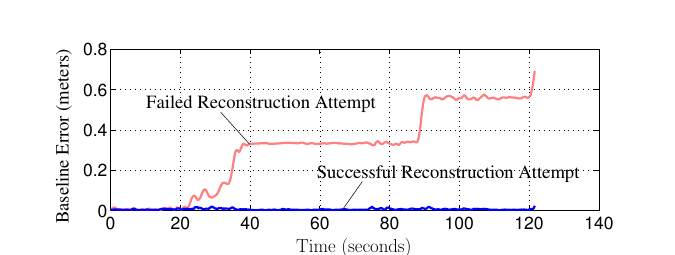
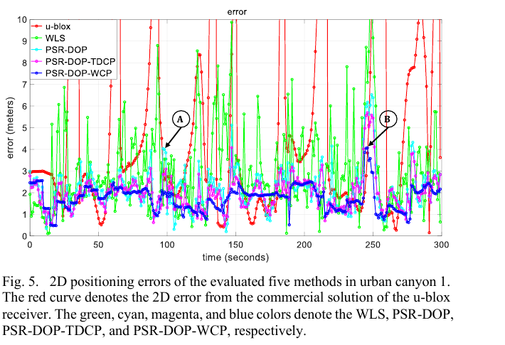
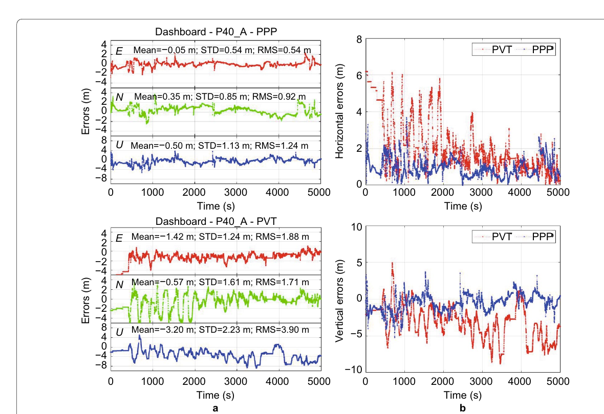

# 2026-08-16 GNSS 每日研究简报

## 今日快报

### 快报 1：多车协同 RTK 的收益先由 V2V 精度和网络几何决定

- 主题：`collaborative-multi-agent-v2v-rtk-ambiguity`
- 来源 ID：`doi:10.1007/1345_2026_404`
- 来源链接：https://doi.org/10.1007/1345_2026_404
- 发表日期：2026-08-15
- 来源类型：IAG Symposium 同行评审章节、静态与动态城市试验
- 获取范围：出版社摘要与 Crossref 书目信息；本次未取得可检索完整章节，因此量化结果仅按摘要转述

**内容：** 作者把多台 rover 的 GNSS 与车辆间相对观测放入同一 RTK 框架，并把原始 GNSS/V2V 量测变换为无偏高斯观测，用汉诺威静态与动态城市试验比较协同解和单车 RTK。核心不是简单“多一台车”，而是通过车辆间观测和代理间交叉相关改善载波浮点模糊度。

**结论：** 摘要报告，在所设 GNSS 质量、V2V 不确定度和网络几何下，协同解的二维误差优于单车解；即使 V2V 缺失或精度低，建模的代理间交叉相关仍可帮助模糊度估计。本次未审计完整章节，因此不转述摘要中的改善百分比，也不把案例结果外推到任意车队或非高斯 NLOS。

**关注理由：** 协同定位的首要验收量不是车辆数量，而是 V2V 量测是否比单车解足够精确、网络是否提供互补几何，以及共享误差有没有进入协方差。

### 快报 2：元强化学习用少量新场景数据适配 GNSS 误差分布

- 主题：`meta-reinforcement-spatiotemporal-gnss-correction`
- 来源 ID：`doi:10.33012/navi.784`
- 来源链接：https://doi.org/10.33012/navi.784
- 发表日期：2026-08-13
- 来源类型：NAVIGATION 同行评审论文、Google 公共数据集与元强化学习
- 获取范围：出版社完整摘要、方法概述与书目信息；正文需订阅，本节不扩写摘要未披露的训练划分和时延

**内容：** 方法从接收机关键参数构造环境特征，以 CNN 提取空间模式、LSTM 表达时间相关，再用 PPO 学习改正策略；随后通过模型无关元学习形成 CL-MPPO，使模型面对未见环境时用较少样本快速适配。

**结论：** 出版社摘要称 CL-MPPO 在 Google 公共数据集上优于所列对比方法，并相对原始 GNSS 改善挑战赛评分与平均误差。由于本次没有审计正文中的路线留出、设备隔离和实时硬件配置，不能把“新环境快速适配”外推为跨城市、跨手机的无条件泛化，也不转述摘要中的改善百分比。

**关注理由：** 城市 GNSS 的困难常是误差分布换场景后变化。元学习值得关注，但工程验收必须按整条路线和设备留出，避免同一路段相邻历元泄漏造成虚假的泛化。

### 快报 3：LEO MCSK 地面测试能否代表在轨，要分域检查而不是只给总分

- 主题：`leo-mcsk-space-ground-signal-consistency`
- 来源 ID：`doi:10.1049/rsn2.70213`
- 来源链接：https://doi.org/10.1049/rsn2.70213
- 发表日期：2026-08-11
- 来源类型：IET 同行评审开放论文、地面精测与在轨高增益天线监测
- 获取范围：CC BY 4.0 出版社摘要、书目信息和完整 XML/PDF 入口

**内容：** 研究为兼顾高速播报与高精度测距的多复合码移键控（MCSK）信号建立时间域、频率域、相关域、测量域和专属结构指标，再分别用 Pearson、Spearman 和互信息评估地面与在轨数据的线性、单调和一般统计依赖。

**结论：** 作者报告数字失真、工作带宽等指标呈强线性一致，而部分 S 曲线偏差只有弱相关或复杂依赖。这说明“地面通过”不能用一个相关系数概括；不同物理量对空间环境和链路状态的敏感性不同。摘要没有给出所有指标样本量，本节不补写显著性阈值。

**关注理由：** 导航载荷验收要把相关峰形、鉴别器偏差和测距误差分别闭环。地面—在轨一致性矩阵比总评分更能指出哪些指标可预测、哪些必须在轨重标定。

### 快报 4：通信星座若要兼做 Doppler 定位，构型优化必须把可测链路放进信息矩阵

- 主题：`multilayer-leo-communication-sop-doppler-constellation-optimization`
- 来源 ID：`doi:10.3390/electronics15163565`
- 来源链接：https://doi.org/10.3390/electronics15163565
- 发表日期：2026-08-11
- 来源类型：同行评审开放论文、多层 Walker 星座与非线性定位仿真
- 获取范围：CC BY 4.0 出版社摘要、方法概述与书目信息；本次未取得可检索全文

**内容：** 作者用 C/N₀ 门限先决定 Doppler 链路是否可测，再在多历元 Fisher 信息矩阵中纳入 Doppler 噪声，并边缘化接收机钟漂和频偏等干扰状态；随后联合优化覆盖、最佳链路速率和定位误差界，而不是用可见星数或普通 DOP 代替定位性能。

**结论：** 摘要报告，在固定总星数并采用统一接纳/噪声假设的仿真中，引入定位目标后，各测试星座规模的最佳定位指标均改善，并呈现覆盖、速率和定位之间的 Pareto 权衡。本次没有审计全文，因此不转述星数、噪声标准差和最大降幅，也不把仿真结果视为未来真实通信星座的保证。

**关注理由：** “能收到很多 LEO”不等于 Doppler 几何可解。系统设计应把链路预算、钟漂/频偏可观性与定位信息量同时前移到星座构型阶段。

### 快报 5：城市测量里 RTK 与手持 GPS 的差距会随遮挡条件改变

- 主题：`urban-control-points-navigation-gps-versus-gnss-rtk`
- 来源 ID：`doi:10.62305/alcon.v6i4.1216`
- 来源链接：https://doi.org/10.62305/alcon.v6i4.1216
- 发表日期：2026-08-14
- 来源类型：同行评审开放论文、城市控制点横断面对比
- 获取范围：CC BY-NC-SA 4.0 摘要、方法概述与全文入口；本节不转述摘要未给出的误差表数值

**内容：** 研究在厄瓜多尔 Jipijapa 城市区选取具有不同卫星可见条件的控制点，分别用导航型 GPS 与 GNSS RTK 采集坐标，计算平面和高程误差，并以描述统计和 Student t 检验比较两类设备。

**结论：** 摘要支持 RTK 在该控制点样本中明显优于导航型 GPS，同时指出后者误差随环境遮挡与干扰变化。研究只覆盖一个城市，且摘要未给出真值建立与重复观测细节，因此不能据此给所有手持机贴统一误差标签。

**关注理由：** 低成本设备验收必须按开阔、半遮挡和街谷分层；把所有点混成一个 RMS 会掩盖环境依赖，也会把 RTK 的改正链与普通单机解混为“硬件精度”。

## 深度研读

### 深读 1｜低成本与手机｜关掉跟踪环以后，怎样把间歇载波重新缝成连续相位

- 类别：`low-cost-mobile`
- 学习层级：`foundation`
- 选题定位：`经典基础`
- 来源 ID：`doi:10.1109/tsp.2014.2311967`
- 来源链接：https://doi.org/10.1109/TSP.2014.2311967
- 发表日期：2014-05
- 来源类型：IEEE 同行评审论文、混合实数/整数估计、仿真与实测演示
- 获取范围：作者公开完整预印本、公式、功耗分析与 Figure 6；IEEE 保留版权
- 价值评分：97/100（相关性 20，经典价值 24，证据 18，教学价值 19，工程价值 16）

#### 为什么先学这个

手机为了省电会周期性关闭射频和跟踪环。伪距再次启动仍能工作，但载波相位在每个 burst 开头多出未知整周或半周偏移；若直接连接，各段会落在错误的相位分支。先理解“连续性为什么丢、如何恢复”，才能理解下一节为何要在多历元窗口中消掉共享模糊度。

#### 先修知识

需要理解码与载波测量、单差/双差、波长、整周模糊度、锁相环、占空比、Kalman 滤波/平滑、整数最小二乘，以及 IMU 加速度误差怎样积分成星地距离预测误差。

#### 一句话逻辑

把每个短时载波 burst 视为“连续相位轨迹加一个未知整数台阶”，用双差消钟、IMU 预测 burst 间运动，再由整数最小二乘、滤波和平滑选择能让整条轨迹最连续的台阶组合。

#### 研究问题与约束

论文问：多历元载波差分定位能否不要求接收机连续跟踪，从而降低移动端功耗。方案需要参考接收机、无线数据链和持续工作的 IMU；实测演示约 120 s、7 条相位时序，作者明确提醒它只是一组数据，不足以代表长期城市手机表现。

#### 核心方法论

先对 rover/参考站和两颗卫星形成双差残余相位，以消除接收机钟和卫星钟。每个 burst 内估计连续相位及相位率，burst 间由 Gauss–Markov 动态和 IMU 预测；对每段未知整数偏移执行整数最小二乘，再用平方根信息滤波与平滑把前后测量共同用于“缝合”。

#### 关键公式逐步推导

作者的 burst 双差模型可压缩写成：

```math
y_i(t)=\widetilde{\nabla\Delta\phi}(t)+\frac{1}{M}n_i+v(t),\qquad t_i\le t<t_i+T_b
```

其中 $`T_b`$ 是开机测量时长，$`T_p`$ 是 burst 周期，$`M=1`$ 表示整周歧义；若数据位未擦除而使用平方型鉴相器，可出现 $`M=2`$ 的半周分区。连续实数状态按

```math
\mathbf x_k=[\nabla\Delta\phi_k,\ \dot{\nabla\Delta\phi}_k]^T,
\qquad \mathbf x_{k+1}=\mathbf F\mathbf x_k+\mathbf w_k
```

传播；整数向量通过

```math
\hat{\mathbf n}=\arg\min_{\mathbf n\in\mathbb Z^m}
\left\|\mathbf y-\mathbf H\hat{\mathbf x}(\mathbf n)-\mathbf A\mathbf n\right\|^2_{\mathbf R^{-1}}
```

选择。最后一式是编辑部按论文混合估计结构写出的教学表达，不是原文逐式复制；本质是错误整数会留下至少 $`1/M`$ 周的不可解释跃变。

#### 经典价值与创新边界

经典价值在于把“低功耗”和“厘米载波”从硬件二选一改写为可检验的整数估计问题，并给出成功概率上下界。边界是方案并非今天 Android API 的即插即用功能；参考站、IMU、云端双差、数据位处理和错误固定监控都构成系统成本。

#### 整体逻辑链

接收短 burst；形成接收机—卫星双差；用 IMU 推算 burst 间位移；估计相位及相位率；搜索每段整数台阶；平滑整条历史；计算重构成功概率；成功才将连续相位送入 CDGNSS，失败则回退伪距或重新初始化。

#### 原文图表与结果分析



> 图源：Pesyna Jr. 等《A Phase-Reconstruction Technique for Low-Power Centimeter-Accurate Mobile Positioning》Figure 6，[DOI](https://doi.org/10.1109/TSP.2014.2311967)与[作者预印本](https://radionavlab.ae.utexas.edu/images/stories/files/papers/Pesyna_PhaseReconstruction_submitted.pdf)。IEEE 保留版权；仅为研究评论从 PDF 第 12 页以 180 dpi 渲染并裁出完整曲线、坐标和原图标注，未改数据、图例或数值，再发布需权利人许可。

横轴是约 0—120 s，纵轴是基线误差（m）。蓝线为 7 条相位历史的模糊度全部正确，几乎贴近 0；红线一旦选错分支便阶跃到约 0.3 m，之后又升至约 0.56 m，末端接近 0.7 m。图直接显示整数错误会产生离散位置台阶；它不能给出真实手机环境的失败概率。

#### 原文结果论述

正确案例使用 $`T_b=0.05\ \mathrm{s}`$、$`T_p=1\ \mathrm{s}`$，即 5% 占空比，作者报告基线误差小于 1.5 cm；失败案例把周期改为 2 s，即 2.5% 占空比，并出现显著错误。两条曲线来自不同重构结果，不能把 5% 与 2.5% 的差直接解释为普适阈值。

#### 常见误区与适用边界

第一，把 burst 间断当普通周跳。第二，认为 IMU 预测可替代整数验收。第三，未擦除数据位却按整周建模。第四，参考站与 rover 不同步仍直接双差。第五，只看滤波内部方差，不监控错误整数的米级台阶。第六，把单组 120 s 演示外推到长时间城市环境。

#### 工程实现步骤

1. 明确射频、基带和 API 的实际占空状态及相位复位规则。
2. 同步参考站与 rover，统一信号和参考星。
3. 标定 IMU 噪声并传播为 burst 间 LOS 距离不确定度。
4. 对每条连续弧执行混合实数/整数平滑。
5. 以成功概率界、后验相位残差和位置跃变三重验收。
6. 失败时不输出固定解，增大占空比或重新初始化。

#### 复现实验设计

使用双频低功耗前端、参考站和消费级 IMU，设置 $`T_b=50\ \mathrm{ms}`$，测试 $`T_p=0.5/1/2/4\ \mathrm{s}`$；每档完成 100 次 10 min 车载回放。比较连续跟踪、间歇未重构和本文重构，指标为正确整数率、基线 95%、能耗、首次固定时间与错误固定尾部；注入数据位未擦除、10 ms 时间偏差、0.2 m/s² IMU 偏置、遮挡和参考星切换。

#### 与定位及低成本实现的联系

手机芯片的功耗策略可能把载波连续性破坏在应用层看不见的位置。工程团队应把 ADR 状态、硬件时钟、占空设置和相位复位日志纳入定位接口；如果无法证明重构整数正确，宁可保留浮点或伪距解，也不要把“相位看起来平滑”当厘米级保证。

#### 本节小结

间歇载波可重构，但节能不是免费午餐：省下的跟踪功耗会转化为整数搜索、IMU 预测和错误固定完整性责任。

### 深读 2｜低成本与手机｜TDCP 只连相邻两点，窗口载波怎样同时约束一段轨迹

- 类别：`low-cost-mobile`
- 学习层级：`intermediate`
- 选题定位：`基础进阶`
- 来源 ID：`doi:10.1109/taes.2022.3149730`
- 来源链接：https://doi.org/10.1109/TAES.2022.3149730
- 发表日期：2022-08
- 来源类型：IEEE 同行评审论文、因子图、香港城市峡谷车载与手机级接收机试验
- 获取范围：作者公开接受稿、完整公式、实验表与 Figure 5；IEEE 保留版权
- 价值评分：98/100（相关性 20，经典价值 23，证据 19，教学价值 19，工程价值 17）

#### 为什么先学这个

上一节通过整数估计把 burst 接回连续相位；但城市环境里载波仍会周跳、短时失锁。TDCP 每次只连接两个相邻历元，一次粗差就污染一条边。本节把同一连续弧内共享的模糊度投影掉，让一个窗口的载波共同约束多时刻位置。

#### 先修知识

需要理解伪距、Doppler、载波相位、TDCP、因子图、加权最小二乘、左零空间、协方差传播、M 估计、周跳和边缘化。

#### 一句话逻辑

把窗口内同一卫星的相位堆叠起来，用左零空间矩阵消掉共享模糊度，再保留投影后的跨历元相关协方差，将这条 WCP 因子与伪距、Doppler 一起送入因子图。

#### 研究问题与约束

论文问窗口载波相位（WCP）是否比相邻历元 TDCP 更能压住城市伪距粗差。主试验为香港两个城市峡谷，u-blox F9P 车规级数据；另以手机级 GNSS 接收机验证趋势。真值来自高等级组合导航系统。公开稿是接受版本，实验不覆盖所有手机型号、隧道或长时完全失锁。

#### 核心方法论

每星建立伪距、Doppler 和载波观测。对于连续跟踪的 $`N`$ 个历元，将载波向量表示为几何/钟差项、一个共享模糊度和噪声之和；构造满足 $`\mathbf G\mathbf 1=0`$ 的左零空间矩阵消掉模糊度，得到 WCP 残差及 $`\mathbf G\mathbf R\mathbf G^T`$ 协方差。Cauchy M 估计降低周跳或 NLOS 的权重。

#### 关键公式逐步推导

窗口内同一卫星的载波可写为：

```math
\boldsymbol\phi=\mathbf h(\mathbf x_{1:N})+\lambda N\mathbf 1+\boldsymbol\epsilon
```

选择左零空间矩阵 $`\mathbf G`$ 使 $`\mathbf G\mathbf 1=0`$，则

```math
\mathbf r_{WCP}=\mathbf G[\boldsymbol\phi-\mathbf h(\mathbf x_{1:N})],
\qquad \mathbf \Sigma_{WCP}=\mathbf G\mathbf R_\phi\mathbf G^T
```

共享模糊度被消掉，但投影后的残差彼此相关，不能把 $`\mathbf \Sigma_{WCP}`$ 对角化。总目标为

```math
\hat{\mathbf X}=\arg\min_{\mathbf X}
\sum\|\mathbf r_P\|^2_{\mathbf R_P^{-1}}+
\sum\|\mathbf r_D\|^2_{\mathbf R_D^{-1}}+
\sum\rho\!\left(\|\mathbf r_{WCP}\|^2_{\mathbf \Sigma_{WCP}^{-1}}\right)
```

其中 $`\rho`$ 是稳健核；若窗口只有两个历元，WCP 退化为 TDCP 型约束。

#### 经典价值与创新边界

价值在于把载波的时间相关从“两点差分”推广为“多状态因子”，且显式保留相关协方差。边界是窗口变长会增大计算与陈旧模型风险；若弧内存在未发现周跳，共享模糊度假设失效，强约束反而把错误传播到整窗。

#### 整体逻辑链

解析原始伪距/Doppler/载波；按卫星维护连续弧；检测失锁与周跳；截取最大窗口；构造左零空间投影；传播完整协方差；添加 WCP 因子；以 M 估计降权异常；优化窗口状态；边缘化旧状态并输出位置。

#### 原文图表与结果分析



> 图源：Bai、Wen 与 Hsu《Time-Correlated Window-Carrier-Phase-Aided GNSS Positioning Using Factor Graph Optimization for Urban Positioning》Figure 5，[DOI](https://doi.org/10.1109/TAES.2022.3149730)与[作者接受稿](https://www.polyu.edu.hk/aae/ipn-lab/us/publications/Fullpaper/Time-correlated%20Window%20Carrier-phase%20Aided%20GNSS%20Positioning%20Using%20Factor%20Graph%20Optimization%20for%20Urban%20Positioning.pdf)。IEEE 保留版权；仅为研究评论从 PDF 第 7 页以 180 dpi 渲染并裁出完整曲线、坐标、图例和原图注，未改数据或标签，再发布需权利人许可。

横轴为 0—300 s，纵轴为二维误差（m），红/绿/青/紫/蓝依次是 u-blox 商用解、WLS、伪距+Doppler、再加 TDCP、再加 WCP。蓝线大部分在约 1—3 m，红绿线多次冲出 10 m 上限；A、B 两处仍能看到所有方法的共同抬升。图表明 WCP 降低波动和尾部，但不能证明每个历元都优于 TDCP。

#### 原文结果论述

城市峡谷 1 的 Table 1 报告：u-blox/WLS/PSR-DOP/PSR-DOP-TDCP/PSR-DOP-WCP 的平均二维误差依次为 6.23/3.10/2.14/2.01/1.76 m，标准差为 7.31/1.95/1.01/0.82/0.57 m，最大误差为 38.53/11.23/6.52/5.69/4.06 m。结果属于约 300 s 的指定路线与参数，不等于跨城市普适排名。

#### 常见误区与适用边界

第一，把投影后残差当独立。第二，窗口跨过周跳仍共享一个模糊度。第三，窗口越长越好。第四，以 M 估计代替周跳检测。第五，拿车规 F9P 结果直接代表手机。第六，只报均值而不看最大误差。第七，因子图变平滑就忽略绝对偏差。

#### 工程实现步骤

1. 以 ADR/LLI、几何无关组合和创新共同分弧。
2. 按每星有效连续长度自适应窗口，不强凑固定 $`N`$。
3. 用 QR/SVD 稳定生成 $`\mathbf G`$，验证 $`\mathbf G\mathbf 1\approx0`$。
4. 保留投影后完整协方差并做白化。
5. 对 WCP 残差使用稳健核，但单独记录被降权比例。
6. 同时监控绝对伪距残差，避免平滑轨迹整体偏移。

#### 复现实验设计

使用一台双频手机与一台 F9P 同车采集 10 条各 20 min 城市路线，1 Hz 和 10 Hz 分别处理；比较 WLS、PSR-DOP、TDCP 与窗口 $`N=3/6/9/15`$ 的 WCP。指标为二维均值/95%/最大误差、残差白化、周跳后恢复时间和 CPU；注入每 60 s 一次 1 周跳、连续 5 s NLOS、错误对角协方差与窗口跨弧。真值用独立 INS/RTK，不参与任何权重训练。

#### 与定位及低成本实现的联系

手机载波常“短而不稳”，WCP 可以把每段短弧的信息利用得更充分，但必须让窗口服从数据连续性而非固定长度。实时实现可用增量平滑和稀疏消元控制计算量，并在窗口不足时退回 Doppler/伪距解。

#### 本节小结

WCP 的收益不是神奇滤波，而是正确利用一段连续弧的共享整数结构；同一个结构若跨过未检周跳，也会成为系统性错误通道。

### 深读 3｜定位｜车内手机实时 PPP：精密产品到达后为什么仍是米级而非测地级

- 类别：`positioning`
- 学习层级：`advanced`
- 选题定位：`定位专题：手机与低成本`
- 来源 ID：`doi:10.1186/s43020-022-00079-x`
- 来源链接：https://doi.org/10.1186/s43020-022-00079-x
- 发表日期：2022-08-22
- 来源类型：同行评审开放论文、四台华为手机、实时 SSR/VTEC 与两组城市车载试验
- 获取范围：CC BY 4.0 全文、公式、处理策略、Table 7 与 Figure 13
- 价值评分：99/100（相关性 20，经典价值 23，证据 20，教学价值 18，工程价值 18）

#### 为什么先学这个

前两节解决载波“能否连续”和“怎样跨历元使用”。高级问题是把不稳定手机码、相位、Doppler 与实时轨道钟、电离层产品装进一个可运行的 PPP。即使产品精密，车窗衰减、天线多路径、频点不全和码相钟差仍会把结果限制在米级。

#### 先修知识

需要理解未组合 PPP、实时 SSR、VTEC、电离层加权约束、码/相位分离钟、浮点模糊度、C/N₀ 随机模型、Doppler 平滑、RAIM/FDE、EKF 和百分位误差。

#### 一句话逻辑

以 SSR 改正广播轨道钟，用实时 VTEC 作为带不确定度的斜电离层伪观测，在未组合 EKF 中分别估计码钟与相位钟，并以 Doppler、C/N₀、ADR 状态和 RAIM 清洗手机观测。

#### 研究问题与约束

论文针对实际车载场景比较两台 Mate30 和两台 P40 的车顶与仪表台安装。真值是独立测地接收机的后处理固定 RTK。试验使用 GPS L1/L5、Galileo E1/E5a、GLONASS L1 和 BDS B1I，以及 CAS 实时轨道钟和 VTEC 流；结论不覆盖其他手机、其他实时产品或完全失去网络。

#### 核心方法论

Android API 生成伪距、载波、Doppler、C/N₀ 与 ADR 状态；先按不确定度、C/N₀ 和残差剔除粗差，用 Doppler 平滑伪距，结合 LLI、相位率与三阶差分检周跳。PPP 使用未组合观测，逐星估计电离层并用 VTEC 伪观测约束，坐标、接收机钟和模糊度在 EKF 中递推；异常历元再以 RAIM/FDE 隔离。

#### 关键公式逐步推导

未组合手机观测骨架为：

```math
P_{i}^{s}=\rho^s+c(\delta t_{P,r}-\delta t^s)+T^s+\mu_i I^s+b_{P,i}^s+\epsilon_{P,i}^s
```

```math
L_{i}^{s}=\rho^s+c(\delta t_{L,r}-\delta t^s)+T^s-\mu_i I^s+\lambda_iN_i^s+b_{L,i}^s+\epsilon_{L,i}^s
```

其中手机码与相位差不稳定，因此分别估计 $`\delta t_{P,r}`$ 与 $`\delta t_{L,r}`$。实时 VTEC 不被当真值，而作为

```math
I^s=I^s_{VTEC}+\nu_I^s,\qquad \nu_I^s\sim\mathcal N(0,\sigma_{I,s}^2)
```

加入；EKF 更新为

```math
\delta\hat{\mathbf x}_k=\mathbf K_k(\mathbf z_k-\mathbf h(\hat{\mathbf x}_k^-)),
\quad \mathbf K_k=\mathbf P_k^-\mathbf H_k^T(\mathbf H_k\mathbf P_k^-\mathbf H_k^T+\mathbf R_k)^{-1}
```

关键是 $`\mathbf R_k`$ 随 C/N₀ 与质量状态变化，模糊度保持浮点而非强行固定。

#### 经典价值与创新边界

论文把实时产品接入、Android 数据质量控制和车内/车外安装差异放到同一实验链，回答“可运行”而非只做静态后处理。边界是 SSR/VTEC 来自特定 CAS 流，真值与测试城市有限；PPP 改善相对厂商 PVT，并不意味着满足车道级完整性或无网络自主定位。

#### 整体逻辑链

读取 Android 原始量测；接收广播星历和 SSR/VTEC；检查 ADR/LLI/C/N₀；构造码相 Doppler；Doppler 平滑和粗差剔除；施加轨道钟与大气模型；运行未组合 EKF；以 RAIM/FDE 处理遗漏异常；对照厂商 PVT 与独立 RTK；按安装方式分别报告 RMS 与 95%。

#### 原文图表与结果分析



> 图源：Li 等《Real-time GNSS precise point positioning with smartphones for vehicle navigation》Figure 13，[Satellite Navigation 原文](https://doi.org/10.1186/s43020-022-00079-x)，CC BY 4.0。由出版社 PDF 第 19 页以 180 dpi 渲染，仅裁出完整 Figure 13 曲线、坐标与图例；未修改数据、标签或颜色。

横轴约 0—5000 s；左侧分别给 PPP/PVT 的 E、N、U 误差与均值、STD、RMS，右侧是水平和垂直误差。蓝色 PPP 在多数时段低于红色 PVT，尤其 PVT 垂向长期为负；但 PPP 仍有约数米尖峰，说明精密产品没有消除车内遮挡和多路径。

#### 原文结果论述

Figure 13/ Table 7 中，仪表台 P40_A 的 PPP 水平/垂直 RMS 为 1.06/1.24 m，95% 为 1.87/2.43 m；厂商 PVT 对应为 2.54/3.90 m 和 5.32/7.15 m。作者报告相对改善约 58%/68%（RMS）与 65%/66%（95%）。这些数字只属于该设备、路线、安装和实时流，不能当作所有手机 PPP 规格。

#### 常见误区与适用边界

第一，把 SSR/VTEC 当无误差真值。第二，码钟和相位钟强制相同。第三，双频稀疏时仍硬做 IF 组合。第四，把车顶结果当仪表台结果。第五，用 Doppler 平滑跨过真实周跳。第六，只报 RMS，不看 95% 与偏差。第七，PPP 优于 PVT 就宣称车道级。第八，实时网络中断后仍沿用陈旧改正。

#### 工程实现步骤

1. 固定信号列表、时间系统和 SSR issue-of-data 匹配。
2. 分设备标定码相钟差、C/N₀ 模型和天线安装方向。
3. 将 VTEC 以协方差约束输入，不作硬改正。
4. Doppler 平滑只在 ADR 连续且质量状态通过时更新。
5. 记录每次剔星、RAIM 告警、产品龄期和滤波重启。
6. 以车顶/仪表台、开阔/街谷和联网/断网分别验收。

#### 复现实验设计

选 4 款双频 Android 手机，每款两台，分别放车顶与仪表台；在开阔、普通城市和深街谷各跑 10 条 30 min 路线。比较厂商 PVT、广播星历 SPP、SSR PPP、SSR+VTEC PPP 和关闭码相分钟的消融，指标为水平/垂直 RMS、95%、最大误差、可用率、产品龄期和 RAIM 排除率；注入 5/30/120 s 网络断流、10 dB C/N₀ 衰减与 VTEC 2 TECU 偏差。

#### 与定位及低成本实现的联系

低成本定位的瓶颈不是“有没有精密产品”一个问题，而是产品、天线、观测连续性、随机模型和质量控制能否同时闭合。手机实时 PPP 的合理目标是稳定压缩米级尾部，并显式报告不可用与产品过期；厘米级固定仍需要更可靠载波、偏差产品和完整性验收。

#### 本节小结

实时 SSR/VTEC 能显著改善车内手机 PVT，但最终性能仍由最弱的观测链决定；精密产品把误差预算变小，不会把消费级硬件自动变成测地接收机。

## 今日脉络

三篇深读沿着手机载波的可用性逐层推进：第一篇把低功耗间歇跟踪造成的整数台阶显式化，用 IMU 与混合整数平滑重构连续相位；第二篇在连续弧内用左零空间消掉共享模糊度，让多个历元共同约束城市轨迹；第三篇再把码、相位、Doppler 与实时 SSR/VTEC 装进手机 PPP。共同结论是，低成本高精度不是换一个求解器，而是让相位连续性、跨历元协方差、产品龄期和错误固定监控形成可审计闭环。
