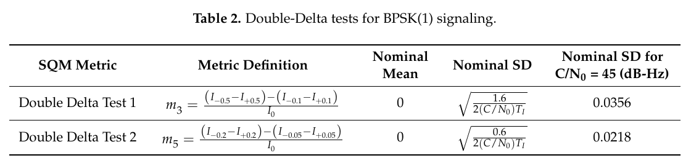
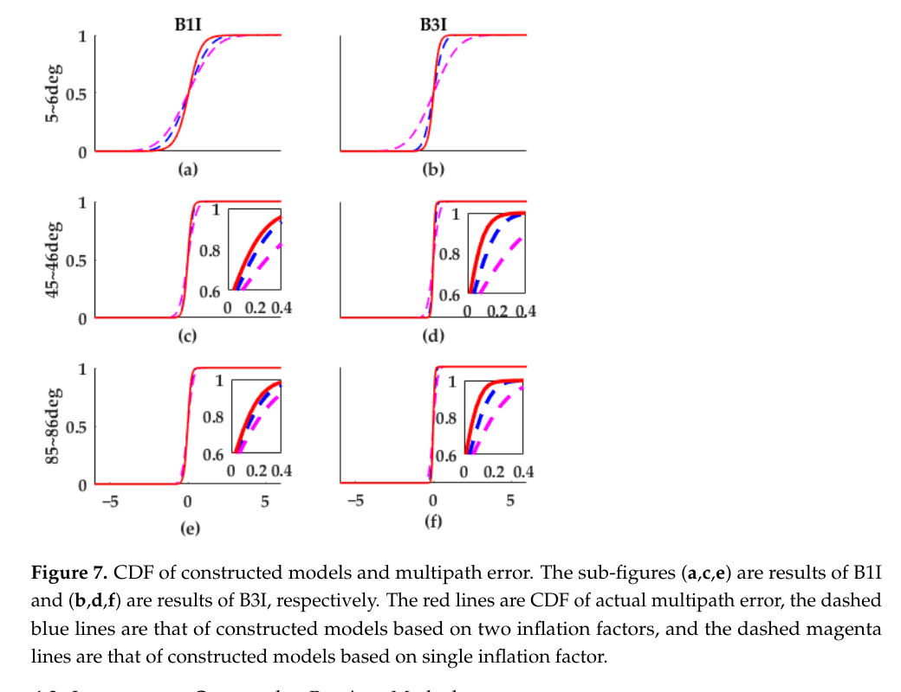
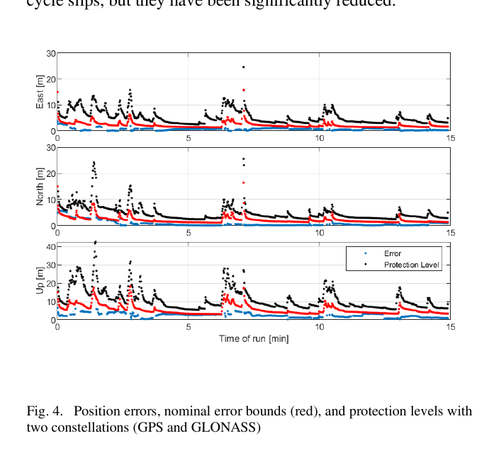

# 2026-08-17 GNSS 每日研究简报

## 今日快报

### 快报 1：电离层聚类不再固定网格，让上一时窗先验与本时窗证据闭环

- 主题：`adaptive-clustering-q4dim-ionosphere`
- 来源 ID：`doi:10.1186/s43020-026-00213-z`
- 来源链接：https://doi.org/10.1186/s43020-026-00213-z
- 发表日期：2026-08-17
- 来源类型：同行评审开放论文、多 GNSS STEC 建模与回放试验
- 获取范围：CC BY 4.0 出版全文、公式、两段各 30 d 的全球试验与限制说明

**内容：** BLAC-Q4DIM 不先把斜向总电子含量投到二维薄壳，而是在纬度、经度、高度角、方位角四维视线空间直接聚类 STEC。LSTM 用连续时窗的 15 个时空特征给出聚类参数先验，贝叶斯优化再按当前窗口后验修正；系统同时比较 4 个经典聚类器与 4 个稳健变体，并可选接入 Kp、Dst、AE 地磁驱动。

**结论：** 在论文选取的平静期和扰动期回放中，HDBSCAN 与 DPMEANS 变体相对固定参数 Q4DIM 和 GIM 基线均降低 STEC RMS，并在低纬、稀疏站网和地磁扰动分组中保持较稳定表现。该证据验证的是离线留站 STEC 拟合/预测，不是 PPP 坐标收敛、完整性风险或实时全球服务；贝叶斯优化的近实时耗时也依赖论文硬件与窗口规模。

**关注理由：** 电离层改正的工程难点不只是模型阶数，而是空间尺度会随站网、视线几何和空间天气变化。把参数选择变成“时序先验—当前证据—周期重训”的闭环，比长期固定网格更适合实时多 GNSS 改正服务。

### 快报 2：LEO 导航载荷的钟差之外，还要单独标定接收—发射硬件时延

- 主题：`leo-navigation-payload-time-synchronization`
- 来源 ID：`doi:10.1016/j.asr.2026.05.083`
- 来源链接：https://doi.org/10.1016/j.asr.2026.05.083
- 发表日期：2026-08-15
- 来源类型：同行评审论文、星载 GNSS 与地面观测联合授时及 LEO 增强 PPP 分析
- 获取范围：出版社书目信息、摘要、图文预览与结果概述；本次未取得可检索完整正文

**内容：** 星载 GNSS 接收机可以把 LEO 星钟对齐到 GNSS 时间，但接收机测量时刻到导航信号发射载荷之间仍夹着硬件链路时延。论文把星载 GNSS 定轨授时与地面站对 LEO 导航信号的观测联合起来，分离星钟和收发链时延，再评估校准后的 LEO 信号怎样进入 MEO/LEO 联合 PPP。

**结论：** 摘要支持“校准载荷链路时延后，论文模拟的 LEO 增强 PPP 收敛更快”的方向性结论；由于本次未审计完整正文，不转述具体分钟数，也不把仿真中的两颗 LEO、钟噪声、轨道误差和地面站布局外推为未来星座性能保证。

**关注理由：** LEO-PNT 若只发布星钟而忽略接收—处理—发射链时延，精密钟产品仍会带着固定或温漂偏差进入伪距。载荷级时延标定应与钟估计、信号发射时间标签和在轨监测共同设计。

### 快报 3：船载 PPP/INS 先做运动一致性检查，再决定哪颗 GNSS 星该降权

- 主题：`motion-consistency-marine-ppp-ins`
- 来源 ID：`doi:10.1016/j.oceaneng.2026.126813`
- 来源链接：https://doi.org/10.1016/j.oceaneng.2026.126813
- 发表日期：2026-08-15
- 来源类型：同行评审论文、近岸公开船载数据与 PPP/INS 紧组合试验
- 获取范围：出版社摘要、研究亮点与书目信息；本次未取得可检索完整正文

**内容：** 方法不只看单颗卫星的瞬时创新，而是比较 GNSS 更新隐含的运动变化与 INS 推演的船体运动状态；不一致的卫星被识别为可能受多路径影响，再进入稳健紧组合更新。设计目标是在近岸反射环境中同时保护位置和艏向，而不是用统一残差门限处理所有机动状态。

**结论：** 出版社摘要和亮点支持该方法在作者选用的公开近岸数据上改善 PPP/INS 位置并识别受多路径影响的观测，同时保持横滚、俯仰表现。本次没有正文，无法审计一致性阈值、真值独立性、海况和失效卫星标签，因此不转述百分比，也不声称它已形成完整性保护级。

**关注理由：** 船舶转弯、摇摆和低速漂移会改变创新分布。把运动状态作为质量控制条件，有助于区分真实机动与多路径粗差，但必须避免 INS 偏差被误当成 GNSS 故障。

### 快报 4：GNSS 基线与全站仪三维联合平差前，要把垂线方向从重力场搬到椭球法线

- 主题：`vertical-deflection-gnss-terrestrial-adjustment`
- 来源 ID：`doi:10.1016/j.measurement.2026.122262`
- 来源链接：https://doi.org/10.1016/j.measurement.2026.122262
- 发表日期：2026-08-15
- 来源类型：同行评审论文、GNSS 基线网与全站仪地面网实测联合平差
- 获取范围：出版社摘要、方法预览、结论条目和书目信息；本次未取得完整 PDF

**内容：** GNSS 基线工作在地心/椭球参考框架，全站仪水平角和天顶距却以当地铅垂线为基准；忽略垂线偏差会把参考方向差异塞进坐标残差。作者先比较多种高阶地球重力场的垂线偏差，再构造三种改正策略，并用方差分量估计协调 GNSS 与地面观测权重。

**结论：** 可检索结论指出，所测区域内多种高阶重力场给出的垂线偏差差异很小，而显式改正垂线偏差可改善三维联合平差。没有完整误差表就不能给出通用精度增益；结果还依赖重力场分辨率、局部重力异常、网形与全站仪系统误差。

**关注理由：** 工程网里“坐标都在三维”不等于观测方向基准相同。先统一物理参考方向，再做权重估计，能避免把可建模的系统量误判为 GNSS 或全站仪随机噪声。

### 快报 5：智能船态势感知以视觉为中心，但 GNSS、AIS 与雷达时间一致性决定融合是否可信

- 主题：`vision-centered-multisensor-marine-awareness`
- 来源 ID：`doi:10.1016/j.oceaneng.2026.126781`
- 来源链接：https://doi.org/10.1016/j.oceaneng.2026.126781
- 发表日期：2026-08-15
- 来源类型：同行评审论文、视觉—AIS—雷达—GNSS—罗经多传感器系统与数据集验证
- 获取范围：出版社摘要、研究亮点、方法概述与书目信息；本次未取得可检索完整正文

**内容：** NavEYE 以相机目标为主索引，按方位与距离约束把 AIS、雷达目标关联到视觉对象，并以距离相关权重融合空间信息、以时效衰减规则拼接异步更新。GNSS 和罗经给出本船位置与航向，使外部目标能落到统一海图/船体参考框架。

**结论：** 摘要支持作者已用配套多传感器数据集验证关联与融合流程，但未取得正文就不能审计漏检目标、AIS 欺骗、雷达杂波、时间戳偏差或 GNSS 异常下的失败率。它是态势感知证据，不是纯 GNSS 定位精度证明。

**关注理由：** 多传感器融合常把 GNSS 当“永远正确的坐标底板”。真实系统应记录 GNSS 龄期与质量、传感器时间偏差和目标关联置信度，否则视觉中心架构会把本船基准错误复制到全部目标。

## 深度研读

### 深读 1｜跟踪｜相关峰看起来不对，为什么仍可能看不见最危险的短时延多路径

- 类别：`tracking`
- 学习层级：`foundation`
- 选题定位：`经典基础`
- 来源 ID：`doi:10.3390/s17071579`
- 来源链接：https://doi.org/10.3390/s17071579
- 发表日期：2017-07-05
- 来源类型：同行评审开放论文、SQM 理论包络、楼顶静态与街谷车载实测
- 获取范围：CC BY 4.0 全文、公式、实验参数与 Table 2
- 价值评分：98/100（相关性 20，经典价值 23，证据 20，教学价值 19，工程价值 16）

#### 为什么先学这个

完整性算法最终看到的是伪距，但多路径先在相关函数里发生。若相关器层的检测量对某些延迟区间天然不敏感，后端再精致的剔星逻辑也没有输入证据。本节先把“相关峰畸变—SQM 检测量—码跟踪误差”三者分开，建立后续误差包络的物理入口。

#### 先修知识

需要理解 BPSK(1)/BOC(1,1) 自相关函数、Early/Prompt/Late 相关器、DLL、窄相关器（NC）、高分辨率相关器（HRC）、C/N₀、相干积分、虚警概率与 M-of-N 判决。距离与码片要分清：GPS L1 C/A 的 0.1 chip 约对应 30 m 反射相对路程。

#### 一句话逻辑

用多组监测相关器构造 Ratio、Delta 和 Double-Delta 指标，再把它们的多路径变化包络与 DLL 测距误差包络逐延迟比较；只有“指标过门限且测距误差非零”的区域，SQM 才既敏感又有剔除价值。

#### 研究问题与约束

论文问不同调制和跟踪鉴别器下，SQM 对单反射多路径究竟在哪些延迟、功率和相位组合中可见。理论部分假设单条反射、锁定 PLL、给定预相关带宽与高斯噪声；实测只覆盖 GPS L1 C/A、特定天线/前端、楼顶反射体和一条低速街谷路线，不代表多反射、散射或所有商用相关器。

#### 核心方法论

参考相关器维持码跟踪，额外监测相关器放在不同码延迟处。Ratio 看单侧幅度相对 Prompt 的变化，Delta 看左右不对称，Double-Delta 再扣除跟踪 Early-Late 对。作者先推导无多路径时的均值/方差，再扫描反射延迟、相位与 SMR 得到指标包络；最后以归一化指标、±3σ 门限和 M-of-N 判决处理静态、动态数据。

#### 关键公式逐步推导

锁定后，延迟为 $`c_iT_c`$ 的同相相关器输出近似为：

```math
I_{c_i}=\sqrt{C}\,R_\tau(c_iT_c)+\eta_{c_i}
```

以 Prompt $`I_0`$ 归一化，可写出三类基础指标：

```math
m_R=\frac{I_{+0.5}}{I_0},\qquad
m_\Delta=\frac{I_{-0.5}-I_{+0.5}}{I_0}
```

```math
m_{DD}=\frac{(I_{-0.5}-I_{+0.5})-(I_{-0.1}-I_{+0.1})}{I_0}
```

无畸变时，指标方差由相关器协方差传播：

```math
\sigma_m^2=\mathbf J\mathbf D\mathbf J^T
```

因此门限不能脱离 C/N₀、积分时间和相关器间距固定设置；相同多路径畸变在更低噪声下更容易越过门限。

#### 经典价值与创新边界

经典价值是明确区分 SQM 的“敏感性”和“有效性”：检测量偏离不代表伪距一定有害，伪距有害也不保证检测量可见。创新边界是包络来自单反射极值扫描，能说明结构性盲区，却不是街谷多路径概率分布；M-of-N 只平滑判决，不会创造原指标中不存在的信息。

#### 整体逻辑链

生成本地码；配置跟踪与监测相关器；估计 C/N₀；计算 Ratio/Delta/Double-Delta；按实机净空数据标定均值与协方差；建立每星动态门限；M-of-N 累积证据；把告警与测距误差包络联合解释；仅在几何仍可用时降权/剔除；把不可见区交给后端误差包络承担。

#### 原文图表与结果分析



> 表源：Pirsiavash、Broumandan 与 Lachapelle《Characterization of Signal Quality Monitoring Techniques for Multipath Detection in GNSS Applications》Table 2，[DOI 原文](https://doi.org/10.3390/s17071579)，CC BY 4.0。由出版社 PDF 第 12 页以 180 dpi 渲染，仅裁出完整表题、公式、单位和数值，未重绘或改写标签。

表中 Test 1 使用 ±0.5 与 ±0.1 chip 两对相关器，Test 2 收窄为 ±0.2 与 ±0.05 chip；两者名义均值均为 0。在论文设定的 C/N₀=45 dB-Hz 下，名义标准差分别为 0.0356 和 0.0218，直接说明收窄监测间距会改变噪声门限。表本身不能证明 Test 2 在所有延迟都更好，因为多路径引起的指标幅度也会随间距改变。

#### 原文结果论述

理论包络显示，相对延迟小于约 10 m 的多路径对所测 SQM 指标普遍不敏感。动态试验中，作者用 20 ms 相干积分、4 s C/N₀ 平滑和 2 s M-of-N 窗口；CMC 小于约 3 m 的中等多路径大多埋在指标噪声里，而约 5 m 及以上的强多路径更常触发检测。数值属于 PRN 21 和指定街谷路线，不能当作通用 3 m/5 m 产品门限。

#### 常见误区与适用边界

第一，相关峰对称就断言没有多路径。第二，只看 SQM 越门限，不检查对应码误差是否非零。第三，把 ±3σ 当固定常数而忽略 C/N₀。第四，认为更窄监测相关器总会提高检测率。第五，M-of-N 降低虚警后忽略报警延迟。第六，以 CMC 作绝对真值却不处理电离层、模糊度和载波多路径。第七，剔星后不检查几何恶化。

#### 工程实现步骤

1. 导出 Prompt 与至少两对对称监测相关器，不只保留最终伪距。
2. 用净空、分 C/N₀ 数据标定每种信号/前端的指标均值与协方差。
3. 依据当前 C/N₀ 和积分时间生成每星门限。
4. 同时维护 SQM 敏感性图与 DLL 测距误差包络。
5. 用 M-of-N 或序贯检测控制虚警，并显式输出报警延迟。
6. 对短时延盲区保留保守测距方差，不把“未报警”写成“无误差”。

#### 复现实验设计

用软件接收机采集 GPS L1 C/A，20 ms 相干积分；设置跟踪 Early-Late 为 0.2 chip，比较监测间距 ±0.5/±0.1 与 ±0.2/±0.05 chip。信号模拟器扫描反射延迟 0—1.5 chip、SMR 3/6/10 dB、相位 0—360°；实测包含静态反射板与 1 m/s 街谷路线。指标为 $`P_D/P_{FA}`$、检测延迟、未检伪距 95%/最大值和剔星后 HPL；注入 C/N₀ 快变、双反射、前端带宽变化与相关器偏置。

#### 与定位及低成本实现的联系

低成本芯片通常只输出伪距、C/N₀ 与少量状态位，相关器级证据可能在 API 前已丢失。若不能取得 SQM，定位层就应把环境类别、残差、仰角和历史统计组合成保守误差模型；若能修改基带，多相关器的价值首先是给完整性提供可解释证据，而不只是降低 RMS。

#### 本节小结

SQM 能看见部分相关峰畸变，但“没报警”不是“没多路径”；短时延反射正是需要后端概率包络继续承担的盲区。

### 深读 2｜接收机工程｜检测器看不见的多路径，怎样变成既包得住又不过宽的概率模型

- 类别：`receiver-engineering`
- 学习层级：`intermediate`
- 选题定位：`基础进阶`
- 来源 ID：`doi:10.3390/rs14092130`
- 来源链接：https://doi.org/10.3390/rs14092130
- 发表日期：2022-04-28
- 来源类型：同行评审开放论文、BDS-3 MEO 四个月多站数据与 CDF 包络优化
- 获取范围：CC BY 4.0 全文、公式、处理参数、Figure 7 与验证边界
- 价值评分：98/100（相关性 20，经典价值 22，证据 20，教学价值 19，工程价值 17）

#### 为什么先学这个

上一节留下一个不可消除的事实：短时延多路径可能产生伪距误差却不触发 SQM。完整性不能把不可见误差设为零，而要给它一个可进入保护级的概率上界。本节学习怎样用 CDF overbounding 包住长尾，同时避免单纯放大标准差把可用率全部吃掉。

#### 先修知识

需要理解码—载波多路径组合、仰角分箱、CDF/PDF、高斯混合、随机误差传播、完整性风险、保守包络、遗传算法、多目标优化和训练/验证分离。还要区分“拟合接近”与“尾部包住”：前者优化平均差，后者约束危险尾概率。

#### 一句话逻辑

把仰角无关和仰角相关两类高斯误差分别设置膨胀因子，再让多目标遗传算法同时最小化 CDF 距离与违反双侧包络的惩罚，从而自动寻找比单一膨胀因子更紧的完整性误差边界。

#### 研究问题与约束

作者用 2020 年 DOY 70—190 的 23 个 IGS MGEX 站、30 s 未平滑 BDS-3 MEO B1I/B3I 观测建立模型，按 1° 仰角和 0.03 m 误差分箱，另用 CUSV 站 DOY 201—203 验证。公开 BDS 天线 PCV 当时不可得，论文没有校正该项；地面站多路径也只被作者论证为可用于航空初始示范，并非真实机载认证数据。

#### 核心方法论

MP 组合提取码多路径后，作者把误差拆成仰角无关 $`\varepsilon_1`$、仰角相关 $`\varepsilon_2`$ 和长尾膨胀项。传统模型对两部分使用同一个放大倍数；新模型分别用 $`\alpha,\beta`$。遗传算法编码六个参数，在每个仰角/误差分箱同时检查左右尾 CDF 包络，并用 CDF 距离抑制过度保守。

#### 关键公式逐步推导

基础误差拆分为：

```math
\varepsilon=\varepsilon_1+\varepsilon_2+\varepsilon_3,
\qquad \varepsilon_3=\alpha\varepsilon_1+\beta\varepsilon_2
```

于是两因子模型为：

```math
\varepsilon=(1+\alpha)\varepsilon_1+(1+\beta)\varepsilon_2
```

若两分量独立，其标准差写成：

```math
\sigma(El)=\sqrt{(1+\alpha)^2\sigma_1^2+(1+\beta)^2\sigma_2^2(El)},
\qquad \sigma_2^2=a_2^2+b_2^2e^{-c_2El}
```

双侧 CDF 包络要求模型在负尾累计概率不小于实测、正尾累计概率不大于实测：

```math
F_o(x)\ge F_a(x),\ x\le0;\qquad
F_o(x)\le F_a(x),\ x\ge0
```

这让“包住尾部”成为硬方向约束，而平均 CDF 差负责控制边界宽度。

#### 经典价值与创新边界

价值在于把过去人工反复调膨胀因子的过程改成可复算的多目标搜索，并允许高斯峰与长尾使用不同膨胀强度。边界是所得模型仍假设零均值、对称、单峰并按仰角表达；城市 NLOS 的偏态、多模态和环境突变可能不满足这些条件，遗传算法收敛也不等于真实尾概率被充分采样。

#### 整体逻辑链

收集多站双频观测；质量控制；MP 组合提取误差；按仰角/数值分箱；检查偏差、对称性与单峰；定义两因子模型；编码六个参数；计算 CDF 距离与包络惩罚；遗传迭代并保留精英；用独立日期做距离域验证；将最终 $`\sigma(El)`$ 送入保护级误差预算。

#### 原文图表与结果分析



> 图源：Fang 等《Multipath Error Modeling Methodology for GNSS Integrity Monitoring Using a Global Optimization Strategy》Figure 7，[DOI 原文](https://doi.org/10.3390/rs14092130)，CC BY 4.0。由出版社 PDF 第 10 页以 180 dpi 渲染，仅裁出完整 Figure 7、坐标、图例说明与图注，未重绘或修改数值。

三行分别是 5—6°、45—46°、85—86° 仰角箱，左右列为 B1I/B3I；红线是实测 CDF，蓝虚线为两膨胀因子，品红虚线为单因子。低仰角两种模型都明显比实测宽；中高仰角蓝线更贴近红线，尤其 B3I 插图中差异清楚。图直接显示“包络仍在、冗余变小”，但只展示选定仰角箱，不能单独证明所有站、所有日期或飞行环境的完整性风险。

#### 原文结果论述

以最后 100 代平均 CDF 差计，B1I 从单因子的 0.193 降至两因子的 0.063，B3I 从 0.081 降至 0.040；作者换算为 67.4% 和 50.6% 的保守度指标改善。结果来自四个月地面数据与三天独立日期验证；它说明模型更紧，不等于位置保护级同比改善，也不消除未校正 PCV 和站点共性误差。

#### 常见误区与适用边界

第一，把样本标准差大于实测就当完成尾部包络。第二，只优化拟合误差而不检查双侧不等式。第三，把左右尾强制对称用于明显偏态 NLOS。第四，训练与验证使用相邻同站数据却宣称全球泛化。第五，忽略天线 PCV、码偏差和 MP 组合噪声。第六，把地面开放站模型直接送进城市或航空认证。第七，遗传算法只跑一次不检查随机种子稳定性。

#### 工程实现步骤

1. 按接收机、天线、信号和环境分别建库，保留元数据。
2. 清理周跳、异常码和低质量历元，再形成 MP 组合。
3. 在每个仰角箱检查均值、偏态、单峰性和有效样本尾数。
4. 以包络违反量和 CDF 距离构成双目标，不只拟合 RMS。
5. 多随机种子求解并对参数、包络失败箱做稳定性审计。
6. 用跨站、跨季节、跨设备数据验证，再转换到位置域保护级。

#### 复现实验设计

下载同一 23 个 MGEX 站的 BDS-3 B1I/B3I 观测，训练用 DOY 70—190、验证用 DOY 201—203；30 s 采样、5° 截止、1° 仰角箱、0.03 m 数值箱。比较样本 STD、单因子、两因子和分位数非参数包络；指标为每箱包络违反次数、平均 CDF 差、95%/99.9% 边界、HPL 与可用率。另做 PCV 可得/不可得、站点留一、100 个随机种子、偏态注入和城市数据外测。

#### 与定位及低成本实现的联系

低成本接收机的多路径长尾通常比测地站更强，直接照搬该参数并不安全；可借鉴的是方法：把基带可检测部分先剔除，把未检残差按设备/环境重新包络，再把包络传给 WLS、PPP 或 RAIM。边界越紧只能提高可用率，前提始终是尾部不被漏包。

#### 本节小结

完整性误差模型不是“最像数据的曲线”，而是在所有关键尾部先包住数据，再用额外自由度把不必要的宽度收回来。

### 深读 3｜定位｜PPP 记住过去观测以后，局部多路径故障要监控多少层子集

- 类别：`positioning`
- 学习层级：`advanced`
- 选题定位：`定位专题：完整性`
- 来源 ID：`doi:10.1109/plans46316.2020.9109953`
- 来源链接：https://doi.org/10.1109/PLANS46316.2020.9109953
- 发表日期：2020-04
- 来源类型：IEEE/ION PLANS 同行评审会议论文、多星座 PPP 解分离与城市/郊区车载数据
- 获取范围：作者公开完整稿、故障率推导、原型参数、Table IV 与 Figure 4；IEEE 保留版权
- 价值评分：99/100（相关性 20，经典价值 23，证据 19，教学价值 19，工程价值 18）

#### 为什么先学这个

上一节给出每颗卫星多路径误差的概率边界，但 PPP 滤波器会让历史观测持续影响当前坐标。某颗星过去短暂故障，即使现在恢复，也可能仍留在状态里；多颗星在不同时间发生故障还会在滤波记忆窗内重叠。高级问题因此不是“当前有几颗坏星”，而是“给定故障率、持续时间和滤波记忆，要并行监控到几故障子集”。

#### 先修知识

需要理解未组合/组合 PPP、EKF、全视解、解分离、故障检测与排除、保护级、PHMI、虚警率、正态分位数、状态记忆、周跳、码多路径和多星座观测。还要明确保护级是模型条件下的概率界，不是位置误差曲线的事后上包络。

#### 一句话逻辑

先用故障到达率、持续时间和滤波记忆算出 q 重故障在暴露时段内的概率；把概率高于完整性预算的故障深度全部建成子滤波器，再以全视解—子解分离量和协方差共同生成保护级。

#### 研究问题与约束

论文面向城市/郊区 PPP 的局部多路径、NLOS、未检周跳，假设每颗卫星测量序列以给定速率独立进入故障态并在有限时间内消退。所用 $`10^{-2}/h`$ 故障率、120 s 故障加滤波记忆、$`10^{-4}/h`$ PHMI 等均被作者明确称为概念性初值；城市数据仅 20 min、郊区 15 min，远不足以经验验证稀有完整性风险。

#### 核心方法论

PPP 原型同时估位置、速度、钟差、湿对流层、浮点模糊度、码多路径、载波误差和差分码偏差。每个子滤波器对一个或多个卫星故障假设保持容错；检测统计量是子解与全视解之差。为限制历史故障无限累积，系统使用有限批处理或两个交错重初始化滤波器，把有效记忆限制为 $`T_{filter}`$。

#### 关键公式逐步推导

若单星故障按泊松率 $`R_f`$ 到达，在时间窗 $`T`$ 内至少一次故障的概率为：

```math
P_f(T)=1-e^{-R_fT}\approx R_fT
```

考虑故障持续与滤波记忆，某星当前状态受故障影响的概率近似：

```math
P_{f,i}=R_{f,i}(T_{fault,i}+T_{filter})
```

若 n 颗星同率独立，q 重故障在暴露时间 $`T_{exp}`$ 内影响解的近似上界为：

```math
P_{\ge q}\approx {n\choose q}P_f^q
\left(1+q\frac{T_{exp}}{T_{fault}+T_{filter}}\right)
```

对需监控的第 i 个子集，简化解分离保护级写成：

```math
PL_{SS}\approx\max_i\left[T_i+
Q^{-1}\!\left(\frac{P_{HMI}}{N P_{f,i}}\right)\sigma^{(i)}\right]
```

其中 $`T_i`$ 由分配后的虚警概率和解分离标准差确定。故障率或记忆窗增大，会同时增加需监控的子集深度和保护级。

#### 经典价值与创新边界

价值在于把滤波记忆显式带入多故障概率，而不是把历元独立 RAIM 直接套到 PPP；同时用有限故障幅度模型避免冗余不足时保护级直接无穷大。边界是独立同率故障忽略同一建筑面造成的共模 NLOS，概念性概率也未被大样本校准；论文证明了算法构造与案例覆盖，不是认证级诚信证明。

#### 整体逻辑链

定义名义码/相位/Doppler 模型；按环境建立局部故障幅度与到达率；设定滤波记忆；计算未监控 q 重故障风险；选择子集深度；并行全视与故障容错滤波；计算解分离量；过门限则排除/重置；未报警时生成 PL；同时记录产品龄期、周跳和子集可用性；以独立真值做案例验证。

#### 原文图表与结果分析



> 图源：Blanch 等《Solution Separation-Based FD to Mitigate the Effects of Local Threats on PPP Integrity》Figure 4，[DOI](https://doi.org/10.1109/PLANS46316.2020.9109953)与[作者公开稿](https://web.stanford.edu/group/scpnt/gpslab/pubs/papers/blanch_PLANS2020_PPP_Integrity.pdf)。IEEE 保留版权；仅为研究评论从 PDF 第 5 页以 180 dpi 渲染并裁出完整 Figure 4、坐标、图例和图注，未修改数据或标签，再发布需权利人许可。

横轴是 0—15 min，三行分别为 East、North、Up 误差（m）；蓝点为位置误差，红点/线为仅名义模型边界，黑点为解分离保护级。黑色保护级在多数时刻显著高于红色名义界，垂向可到数十米；它覆盖蓝色误差但代价是可用性变差。图不能证明 $`10^{-4}/h`$ 风险，因为只有 15 min 数据且部分时刻缺少独立真值。

#### 原文结果论述

郊区数据主要受树冠遮挡，GPS+GLONASS 约有 10 星；加入 Galileo 后，作者报告精度和保护级均改善超过 50%，但周跳仍使 PL 偏大。城市 20 min 案例中，位置误差约有 10% 时段超过仅名义模型的界，解分离 PL 覆盖了所观测误差。作者同时承认真实威胁比假设更恶劣，不能据此宣称满足目标完整性风险。

#### 常见误区与适用边界

第一，把每历元坏星数当滤波记忆窗内故障数。第二，让 Kalman 滤波器无限记忆却仍只监控单故障。第三，用案例“曲线覆盖”代替 PHMI 验证。第四，假设不同卫星 NLOS 独立。第五，为得到有限 PL 人为截断故障幅度却无数据包络。第六，只看多星座使 PL 变小，不看周跳与跨系统偏差。第七，把 CSRS-PPP 参考当全时段高率独立真值。

#### 工程实现步骤

1. 分环境统计每星故障到达率、持续时间、幅度和跨星相关性。
2. 设定 $`T_{filter}`$，用交错重初始化或固定滞后平滑限制记忆。
3. 按 PHMI 预算计算必须监控的一故障、二故障及更深子集。
4. 共享昂贵的轨道、潮汐和相位中心计算，降低子滤波器成本。
5. 检测、排除和保护级使用一致的故障模型与协方差。
6. 当子集数、星数或 PL 不可接受时明确输出不可用，而非缩小风险预算。

#### 复现实验设计

采集 GPS/GLONASS/Galileo 双频车载 PPP：20 条郊区树冠路线和 20 条城市街谷路线，各 30 min、1 Hz，独立 INS/RTK 真值。比较名义 PPP、创新剔除、单故障解分离、双故障解分离与固定滞后版本；扫描 $`R_f=10^{-3}/10^{-2}/10^{-1}h^{-1}`$、记忆 30/120/600 s。指标为误差越 PL 次数、PL 95%、可用率、报警延迟、错误排除、CPU 和子集数；注入同墙面双星共模偏差、慢增长码错、周跳和精密产品跳变。

#### 与定位及低成本实现的联系

低成本设备更容易出现周跳和长尾码误差，解分离需要的子集会迅速增加。实用实现可先用基带 SQM、环境模型和残差门控降低进入 PPP 的故障率，再用有限记忆控制历史影响；仍无法满足预算时，应输出较大的 PL 或不可用，而不是把故障概率调小。

#### 本节小结

PPP 完整性不仅取决于当前冗余，还取决于滤波器记住多久；故障率、持续时间与记忆窗共同决定要监控多少层子集和付出多少可用率。

## 今日脉络

三篇深读把多路径完整性从信号层接到位置层：第一篇说明多相关器 SQM 能检测相关峰畸变，却对最短时延反射存在结构性盲区；第二篇把未检残差变成按仰角 CDF 包络的测距误差模型，并用两膨胀因子减少过度保守；第三篇再把故障率、持续时间和 PPP 记忆窗转成解分离子集深度与保护级。共同结论是：完整性不是“多做一次残差检验”，而是让可见故障被检测、不可见误差被包络、历史影响被有限记忆和风险预算共同约束。
