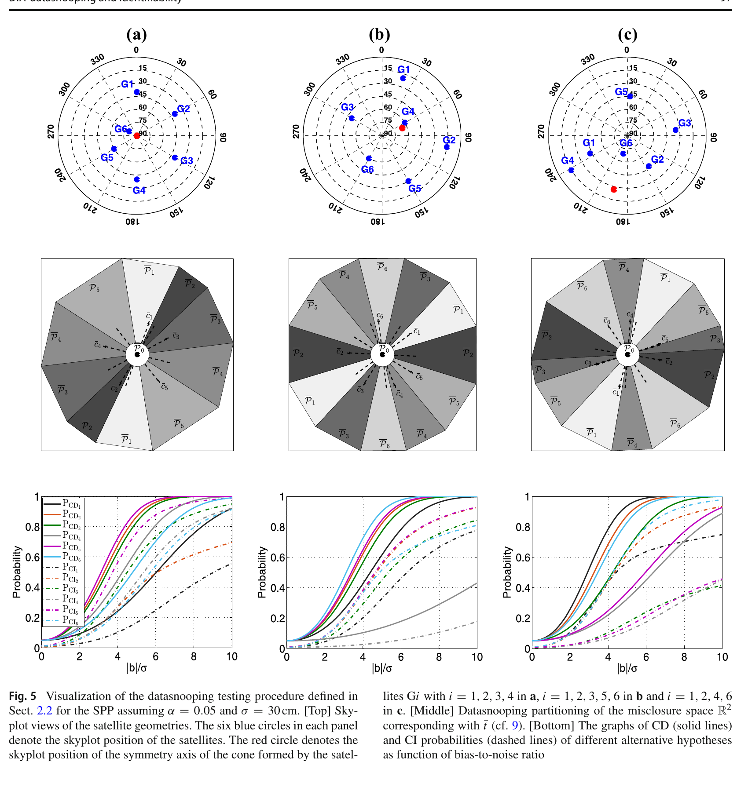
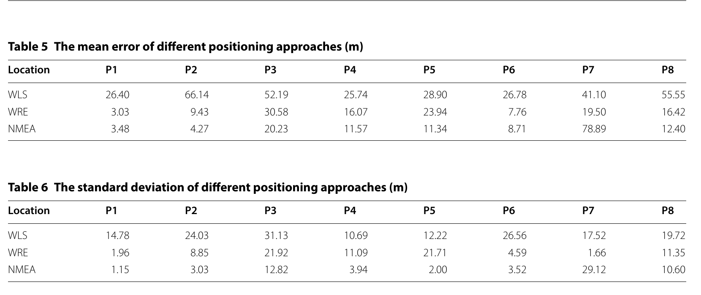
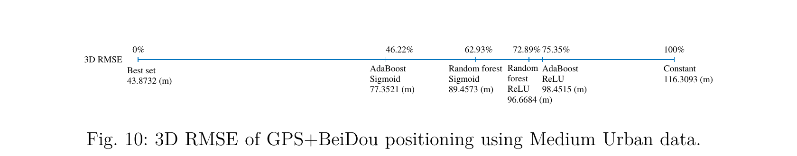

# 2026-08-18 GNSS 每日研究简报

## 今日快报

### 快报 1：膨胀土含水量反演要把空间邻接与时间记忆同时放进模型

- 主题：`gnss-r-expansive-soil-moisture-deformation`
- 来源 ID：`doi:10.3390/rs18162790`
- 来源链接：https://doi.org/10.3390/rs18162790
- 发表日期：2026-08-18
- 来源类型：Remote Sensing 同行评审开放论文、CYGNSS/SMAP/原位与 GNSS 垂向位移联合分析
- 获取范围：CC BY 4.0 出版社摘要、书目信息与全文入口；全文下载在本次获取时被站点拒绝，因此不扩写摘要未披露的划分与超参数

**内容：** 作者面向富含亲水黏土矿物的膨胀土，把空间邻接、时间演化与注意力组合成 ASTGCNet，从星载 GNSS-R 观测反演土壤含水量，再与 GNSS 垂向位移连接，检查干湿循环与地表沉降—回弹是否同步。

**结论：** 出版社摘要支持该模型在得克萨斯沿海研究区与 SMAP、原位观测保持较好一致，并观察到浅层膨胀土中非线性的含水量—形变响应。由于本次未审计全文中的数据泄漏控制、空间留出和三重配置，本节不转述摘要中的精度数字，也不把案例相关性解释为水分变化对形变的唯一因果证据。

**关注理由：** GNSS-R 与连续 GNSS 位移站能形成“环境状态—工程响应”闭环；真正的验收重点是时间对齐、土层深度代表性和跨区域外推，而不只是回归分数。

### 快报 2：全球电子密度 LSTM 在磁扰期仍要单独做误差预算

- 主题：`multi-gnss-ro-lstm-electron-density`
- 来源 ID：`doi:10.1007/s10509-026-04618-9`
- 来源链接：https://doi.org/10.1007/s10509-026-04618-9
- 发表日期：2026-08-18
- 来源类型：Astrophysics and Space Science 同行评审论文、多 GNSS 掩星与电离层测高仪/Swarm-A 验证
- 获取范围：出版社完整摘要、书目信息和方法概述；正文受订阅限制，本节不外推摘要中的定量结果

**内容：** 研究把长期多 GNSS 无线电掩星电子密度廓线与太阳、地磁活动指数输入 LSTM，和 GRU、普通 RNN 以及 IRI 比较，并用后续年份的电离层测高仪廓线与 Swarm-A 原位观测检查外推。

**结论：** 摘要报告 LSTM 的总体误差低于所列循环网络与 IRI 基线，但误差随高度、纬度和地磁状态变化，磁扰期明显增大。这支持“时序模型可补足经验模型”，不支持把一个全球平均指标当作低纬暴或磁暴期间的可靠性保证。

**关注理由：** 电子密度模型最终会影响电离层延迟改正与空间天气告警。产品接口应携带高度、纬度和活动状态分层的不确定度，而不是只输出单一电子密度场。

### 快报 3：TRITON 海面风同化补的是雷达看不到的近海低层风

- 主题：`triton-gnss-r-wind-assimilation-rainfall`
- 来源 ID：`doi:10.1007/s44195-026-00140-1`
- 来源链接：https://doi.org/10.1007/s44195-026-00140-1
- 发表日期：2026-08-17
- 来源类型：Progress in Earth and Planetary Science 同行评审开放论文、WRF 雷达集合资料同化个例
- 获取范围：CC BY 4.0 出版社完整摘要、书目信息与全文 HTML 入口

**内容：** 作者把 TRITON GNSS-R 反演的海面风加入雷达集合资料同化，在台湾近海强降雨个例中修正低层风与水汽。关键互补性来自海上近地面：地基雷达能约束降水系统，却缺少同位置的近海风观测。

**结论：** 原文摘要称，沿轨海面风恰好覆盖台湾海峡弱西南风和台湾东北侧梅雨锋两个关键区，增量同化改善了近海线状强降雨的位置与强度。证据仍是单一事件、轨迹采样且时间可用性有限，不能据此声称每次对流预报都会改善。

**关注理由：** GNSS-R 的价值不只在独立反演产品，也在与现有观测网互补。业务化前应按风暴类型、轨迹命中率和同化时延做统计，而不是只展示成功个例。

### 快报 4：磁强计受扰时，长期标定与短时门控应分两条链处理

- 主题：`gnss-vio-mag-adaptive-anti-interference`
- 来源 ID：`doi:10.1088/1361-6501/ae9ab7`
- 来源链接：https://doi.org/10.1088/1361-6501/ae9ab7
- 发表日期：2026-08-17
- 来源类型：Measurement Science and Technology 同行评审论文、GNSS/VIO/MAG 因子图与实测验证
- 获取范围：IOP 作者稿摘要、书目信息与方法说明；全文入口在本次获取时触发站点验证，量化结果不在本节复述

**内容：** GVIM 用 GNSS 伪距和 Doppler 把局部 VIO 轨迹接入全球坐标；长期软硬磁干扰由 IGRF-14、VIO 姿态和在线磁强计标定处理，短时干扰则依靠 VIO 的平滑外推建立磁场—姿态关系，再在统一因子图中融合。

**结论：** 作者摘要报告相对现有方法获得更稳健的全局位姿，但摘要没有给出所有路线、磁扰强度和失效持续时间。本节因此只接受“分时标定与门控”的方法贡献，不把“抗磁干扰”理解为在 GNSS 长时拒止、视觉退化和强磁扰同时发生时仍必然可观。

**关注理由：** 融合系统最危险的是多个传感器同时退化。把长期偏置与短时异常分开建模，有助于明确哪种状态由 GNSS 锚定、哪种状态只是在 VIO 先验下暂时维持。

### 快报 5：全球水汽分区在去季节后会从纬向带变成更难辨的异常结构

- 主题：`gnss-ro-era5-pwv-regime-clustering`
- 来源 ID：`doi:10.1029/2026ea005107`
- 来源链接：https://doi.org/10.1029/2026EA005107
- 发表日期：2026-08-13
- 来源类型：Earth and Space Science 同行评审论文、GNSS 掩星与 ERA5 聚类分析
- 获取范围：AGU 出版社完整摘要、书目信息与全文 XML/PDF 入口；本节只使用摘要可核验的定性结果

**内容：** 研究分别对含季节项和去季节异常的可降水量序列做层次聚类、k-means、k-medoids 与动态时间规整，并比较 GNSS 无线电掩星、ERA5 和更高分辨率 ERA5 的空间分区一致性。

**结论：** 摘要显示，原始水汽场在不同数据和算法下都有稳定的纬向分群；去季节后可辨分组更少，基于序列相异度的方法比欧氏特征呈现更连贯的经向结构。这里的“分区相似”是聚类结构一致性，不等于两套资料在局地极端水汽或长期趋势上无偏。

**关注理由：** GNSS 掩星产品做气候分区时，季节循环可能压过真正的异常动力学。训练/验证应同时报告保留季节项与去季节结果，避免把强纬度梯度误写成新气候机制。

## 深度研读

### 深读 1｜接收机工程｜残差报警以后，为什么还不能断言是哪一颗卫星坏了

- 类别：`receiver-engineering`
- 学习层级：`foundation`
- 选题定位：`经典基础`
- 来源 ID：`doi:10.1007/s00190-018-1141-3`
- 来源链接：https://doi.org/10.1007/s00190-018-1141-3
- 发表日期：2018-04-09
- 来源类型：Journal of Geodesy 同行评审开放论文、DIA 检验理论与 GPS SPP 几何算例
- 获取范围：CC BY 4.0 全文、完整公式、Figure 5 与附录
- 价值评分：98/100（相关性 20，经典价值 24，证据 20，教学价值 18，工程价值 16）

#### 为什么先学这个

SPP 常把“大残差”直接解释为“某星坏了”。但检测只回答无故障模型是否可信，识别还要在多个候选故障之间做选择；卫星几何可能让两个故障在残差空间中投影相同。先分清检测、识别和修正，才能判断下一节的稳健降权究竟解决了什么、没有解决什么。

#### 先修知识

需要理解线性化伪距模型、最小二乘残差、设计矩阵、协方差、卡方整体检验、标准正态检验、零空间、卫星天空图和概率中的虚警、漏检、正确检测与正确识别。

#### 一句话逻辑

先把观测投影到与位置/钟差无关的闭合差空间，再用整体检验决定“有没有错”，用各故障方向上的标准化投影决定“谁错了”；若两个方向共线，则再强的残差也不能把它们分开。

#### 研究问题与约束

论文把检测—识别—修正（DIA）写成统一估计器，并研究测量几何怎样改变闭合差空间分区、正确检测概率、正确识别概率、最小可探测偏差和最小可识别偏差。SPP 算例假设 6 颗 GPS、码观测互不相关且同精度，故障假设是单条伪距的均值偏差；真实接收机的相关误差、多星 NLOS 与错模型不在该简化算例内。

#### 核心方法论

在无故障假设 $`H_0`$ 下，观测满足 $`E(\mathbf y)=\mathbf A\mathbf x`$。选择 $`\mathbf B`$ 张成 $`\mathbf A^T`$ 的零空间，构造闭合差 $`\mathbf t=\mathbf B^T\mathbf y`$；整体卡方检验决定是否离开无故障区。若拒绝 $`H_0`$，对每个单星故障方向计算 Baarda 标准化统计量，最大者对应候选故障。最后只有在该假设可分且修正参数可估时才输出适配解。

#### 关键公式逐步推导

无故障与第 $`i`$ 个故障假设写成：

```math
H_0:E(\mathbf y)=\mathbf A\mathbf x,\qquad
H_i:E(\mathbf y)=\mathbf A\mathbf x+\mathbf c_i b_i
```

由 $`\mathbf A^T\mathbf B=0`$ 得：

```math
\mathbf t=\mathbf B^T\mathbf y,\qquad
\mathbf Q_{tt}=\mathbf B^T\mathbf Q_{yy}\mathbf B
```

整体检验用 $`\|\mathbf t\|^2_{\mathbf Q_{tt}}`$ 与卡方门限 $`k_\alpha`$ 比较；识别统计量为：

```math
w_i=\frac{\mathbf c_{t_i}^T\mathbf Q_{tt}^{-1}\mathbf t}
{\sqrt{\mathbf c_{t_i}^T\mathbf Q_{tt}^{-1}\mathbf c_{t_i}}},\qquad
\mathbf c_{t_i}=\mathbf B^T\mathbf c_i
```

SPP 中 $`m`$ 条伪距只估三维位置与钟差，冗余度是 $`r=m-4`$；6 星时闭合差只有二维，因此天空图不同并不自动意味着六种故障都有六个可分方向。

#### 经典价值与创新边界

经典价值是严格区分“探测到了异常”和“正确指出异常来源”，并证明故障不可分与相应参数不可估之间的关系。创新边界是它提供概率与几何诊断框架，不替代真实接收机的误差分布建模；若 $`\mathbf Q_{yy}`$ 错、故障不是高斯均值偏差或多星同时受扰，名义概率不再自动成立。

#### 整体逻辑链

线性化观测；构造闭合差；整体卡方检测；按候选故障方向分割闭合差空间；计算正确检测与正确识别概率；检查故障方向是否可分；可分则修正，不可分则重测、增加观测或宣布不可用。

#### 原文图表与结果分析



> 图源：Zaminpardaz 与 Teunissen《DIA-datasnooping and identifiability》Figure 5，[DOI 原文](https://doi.org/10.1007/s00190-018-1141-3)，CC BY 4.0。由 PDF 第 13 页以 240 dpi 渲染，仅裁出完整 Figure 5 与原图注，未重绘、改色或修改任何数值。

三列顶部是 6 星天空图，中部是二维闭合差空间分区，底部横轴为偏差—噪声比 $`|b|/\sigma`$、纵轴为概率；实线是正确检测，点划线是正确识别。图直接显示：相同的 6 星数量和 $`\sigma=30\ \mathrm{cm}`$ 并不产生相同识别能力；(a) 中 G5/G6 故障不可分，(c) 中若干识别曲线即使偏差增大仍明显受限。图不能证明真实多路径服从单星固定偏差，也不能给城市 SPP 一个通用门限。

#### 原文结果论述

Figure 5 使用 $`\alpha=0.05`$。作者指出检测概率曲线与识别概率曲线的排序可以不同：某故障较容易触发整体报警，却未必较容易被正确归因。对于锥形几何造成的共线故障方向，即使两个故障的检测敏感度不同，识别步骤仍不能可靠区分其来源。

#### 常见误区与适用边界

第一，用整体卡方越门限就直接剔除最大残差星。第二，把 MDB 当作 MIB。第三，只看卫星数而不看闭合差方向。第四，协方差仍按开阔环境设置却引用名义虚警率。第五，逐星故障模型用于多星共因 NLOS。第六，不可分时仍强行修正并输出完整三维坐标。

#### 工程实现步骤

1. 明确状态、观测和候选故障集合，计算真实冗余度。
2. 用当前权阵构造闭合差及整体检验门限。
3. 对每个候选故障计算方向夹角、CD/CI 概率或蒙特卡洛近似。
4. 将“已检测”“已识别”“已修正”作为三个独立状态输出。
5. 遇到近共线方向时合并假设、增加星座/频点或宣布不可用。
6. 用注入偏差验证经验虚警、漏检、错剔除和位置尾误差。

#### 复现实验设计

用 GPS 广播星历生成 6—12 星天空图，伪距噪声设 0.3/1/3 m；每种几何进行 10 万次高斯蒙特卡洛，单星注入 0—10$`\sigma`$ 偏差。比较“最大残差剔除”和完整 DIA，指标为虚警率、CD、CI、错剔除率、水平/垂直 95% 与最大误差；再注入双星同向 NLOS、相关误差和权阵失配，检查名义概率失效程度。

#### 与定位及低成本实现的联系

低成本接收机常同时面对少星、差几何和非高斯伪距。工程上应让 FDE 输出“候选集合”与可分性，而不是只输出一个 PRN；如果信息不足以区分两颗星，保留浮动权或宣布不可用往往比确定性剔星更诚实。

#### 本节小结

报警不是归因：SPP 的故障识别能力由冗余和卫星几何共同决定，无法分开的故障不能靠更自信的阈值变得可分。

### 深读 2｜接收机工程｜不硬剔卫星，怎样让大残差逐次失去话语权

- 类别：`receiver-engineering`
- 学习层级：`intermediate`
- 选题定位：`基础进阶`
- 来源 ID：`doi:10.1186/s43020-020-00016-w`
- 来源链接：https://doi.org/10.1186/s43020-020-00016-w
- 发表日期：2020-05-11
- 来源类型：Satellite Navigation 同行评审开放论文、香港城市静态实测与 SVM/Huber/阴影匹配
- 获取范围：CC BY 4.0 全文、完整公式、Tables 5–6 与实验边界
- 价值评分：97/100（相关性 20，经典价值 21，证据 20，教学价值 19，工程价值 17）

#### 为什么先学这个

上一节说明硬识别可能被几何卡住。稳健估计采取更连续的策略：不急着宣判某星有罪，而是让与当前模型不一致的观测在迭代中逐渐降权。本节再把 SNR 与仰角先验加入初始权，理解“模型先验”和“残差证据”怎样协作。

#### 先修知识

需要理解 SPP 线性化、WLS、迭代重加权最小二乘、Huber M 估计、标准化残差、SNR/C/N₀、仰角权、LOS/NLOS、SVM 分类和城市建筑模型。

#### 一句话逻辑

先用 SNR 与仰角给伪距一个名义方差，再用 Huber 规则按标准化残差反复压低异常观测权重，从而在不立即硬剔星的情况下得到更稳健的 SPP 初值。

#### 研究问题与约束

论文目标是为阴影匹配提供更好的初始坐标，并用线性 SVM 从 SNR、归一化伪距残差、仰角与伪距率一致性判别 LOS/NLOS。试验在香港 Hung Hom 的 8 个静态点使用 u-blox NEO-M8T，每点约 15—20 min；分类标签依赖 3D 建筑模型和真值，模型被作者明确限定为需要针对接收机重新训练。

#### 核心方法论

名义伪距方差随 SNR 增大而减小、随仰角降低而增大。以其倒数初始化权阵后，执行 Huber 迭代：小于门限的标准化残差保留原权，大于门限的权重按残差绝对值反比缩小。SVM 分类不直接替代坐标估计，而是为阴影匹配的可见性评分和问题卫星排除提供辅助。

#### 关键公式逐步推导

每次 WLS 迭代的增量为：

```math
\Delta\hat{\mathbf x}=(\mathbf H^T\mathbf W\mathbf H)^{-1}
\mathbf H^T\mathbf W\Delta\boldsymbol\rho
```

论文使用的初始伪距方差模型是：

```math
\sigma_{PR,i}^2=A^2\frac{10^{-SNR_i/10}}{\sin^2(El_i)},\qquad
w_i^{(0)}=\frac{1}{\sigma_{PR,i}^2}
```

Huber 迭代可按论文式 (11) 概括为：

```math
w_i^{(j)}=
\begin{cases}
w_i^{(j-1)}, & |r_i^{(j-1)}/\hat\sigma_0|\le k\\
w_i^{(j-1)}\,k/|r_i^{(j-1)}/\hat\sigma_0|, & |r_i^{(j-1)}/\hat\sigma_0|>k
\end{cases}
```

其中论文设 $`k=1.345`$。权重变小限制单条大残差的影响，但若多数观测共同偏向同一方向，残差本身也会被错误坐标吸收。

#### 经典价值与创新边界

价值在于把可解释的物理先验权和稳健统计组合，并展示它作为阴影匹配初值的作用。边界是 SNR、仰角和残差都不是 LOS 真值；SVM 使用建筑模型标注且接收机相关，Huber 只限制异常影响，并不提供完整性意义上的故障概率或保护级。

#### 整体逻辑链

读取 RINEX；计算卫星位置与仰角；由 SNR/仰角初始化权；迭代 WLS；按 Huber 残差更新权；收敛得到稳健 SPP；提取四类特征；SVM 估可见性；以稳健位置初始化阴影匹配；比较 WLS、WRE、NMEA 与真值初始化。

#### 原文图表与结果分析



> 图源：Xu 等《Machine learning based LOS/NLOS classifier and robust estimator for GNSS shadow matching》Tables 5–6，[DOI 原文](https://doi.org/10.1186/s43020-020-00016-w)，CC BY 4.0。由出版社 PDF 第 9 页以 240 dpi 渲染，仅裁出 Tables 5–6，保留原表标题、单位、行列与全部数值，未重排或改写。

Table 5 是 8 个点的平均位置误差（m），Table 6 是标准差（m）。WRE 在所有点都比普通 WLS 的平均误差小，例如 P1 从 26.40 m 降至 3.03 m，P7 从 41.10 m 降至 19.50 m；但 WRE 并非处处优于接收机 NMEA，P2—P5、P8 的 NMEA 平均误差更低。表直接证明“比该 WLS 基线稳”，不能证明算法在所有城市点、动态路线或接收机上优于厂商解。

#### 原文结果论述

作者报告 SVM 分类率在不同点从 45.4% 到 91.5%，排除问题卫星后可更稳定，但这也暴露了明显场景依赖。P7 只有两颗 LOS 星，NMEA 平均误差为 78.89 m，而 WRE 为 19.50 m；这是有利个例，不是低 LOS 数下总能可靠工作的保证。

#### 常见误区与适用边界

第一，把 Huber 降权叫作故障识别。第二，用同一接收机的 SNR 模型迁移到另一前端。第三，残差尺度被粗差污染仍固定 $`k`$。第四，先验权和残差权重复惩罚低仰角却不归一。第五，少星时把好星误降权。第六，用建筑模型标签训练后在未知城市无验证直接上线。第七，只看平均误差而不看长尾和不可用历元。

#### 工程实现步骤

1. 按信号、前端和天线标定 SNR/仰角方差模型。
2. 用稳健尺度而非普通 RMS 估计残差尺度。
3. 迭代更新位置、钟差和权重，设置收敛与最大迭代次数。
4. 输出每星最终权、标准化残差和几何贡献。
5. 少星或条件数恶化时限制降权幅度并触发不可用状态。
6. 分类器按接收机与环境独立验证，不把分类分数当概率直接使用。

#### 复现实验设计

用 UrbanNav 或自采 u-blox 数据设置开阔、单侧遮挡、双侧街谷和十字路口四类场景，1 Hz、每段 20 min。比较等权 LS、SNR/仰角 WLS、Huber-WRE、硬残差剔除和厂商 NMEA；指标为水平/三维中位数、95%、最大值、可用率与误降权好星比例。注入 SNR 偏置 3 dB、伪距共偏 20 m、两颗同向 NLOS 与卫星数降至 5，检查失效。

#### 与定位及低成本实现的联系

低成本接收机无法总是提供相关器级多路径证据，但通常能输出 C/N₀、仰角、伪距与 Doppler。WRE 因而是可落地的中间层：保留经典 WLS 的透明接口，同时允许异常观测连续降权；其输出仍需完整性监控，不能因“稳健”二字省略状态告警。

#### 本节小结

稳健估计把硬剔星改成连续影响控制；它能显著改善坏基线，却不会自动给出正确故障身份，也不会保证胜过厂商解。

### 深读 3｜定位｜把分类分数变成伪距权，激活函数为什么决定 SPP 成败

- 类别：`positioning`
- 学习层级：`advanced`
- 选题定位：`定位专题：SPP`
- 来源 ID：`arxiv:2605.21461`
- 来源链接：https://arxiv.org/abs/2605.21461
- 发表日期：2026-05-20
- 来源类型：arXiv v1 预印本、UrbanNav 香港/东京真实城市数据与纯 GNSS WLS
- 获取范围：作者公开完整预印本、公式、数据划分、Figure 10 与失败案例；尚未经同行评审
- 价值评分：96/100（相关性 20，经典价值 18，证据 18，教学价值 19，工程价值 21）

#### 为什么先学这个

上一节的 SNR/仰角权和 Huber 门限由工程师指定。本节让集成学习预测每条信号质量，再用激活函数把分数变成 WLS 权重。真正的高级问题不只是分类准不准，而是分数经过怎样的映射，才能在压低坏星与保持几何之间取得平衡。

#### 先修知识

需要理解伪距 WLS、卫星几何、C/N₀、伪距残差与多路径组合、随机森林/AdaBoost/梯度提升、分类概率校准、Sigmoid/ReLU、训练—测试划分、位置 RMSE 和枚举最优子集的上界含义。

#### 一句话逻辑

用六类信号质量指标训练集成分类器输出“好信号”分数，再让 Sigmoid 把窄分数区间拉成连续权重，从而同时压低多颗坏星并避免硬选择破坏几何。

#### 研究问题与约束

预印本使用 UrbanNav 的 GPS L1 C/A 与 BDS B1I；香港低成本 u-blox EVK-M8T 为 1 Hz，深/恶劣城市数据训练、中等城市数据测试；东京数据下采样到 1 Hz，用 Odaiba 或香港训练、Shinjuku 测试。15° 仰角截止。标签来自对全部可用卫星子集的枚举：能产生该历元最小三维误差的子集成员为好信号，因此它依赖真值且计算代价高，只适合作为离线监督标签。

#### 核心方法论

特征覆盖仰角、C/N₀、伪距残差、伪距率一致性和多路径等质量线索。随机森林、AdaBoost 与梯度提升输出分数 $`\hat p_i`$；常数、线性、单位阶跃、ReLU 与 Sigmoid 映射生成 $`w_i`$。常数是等权基线，阶跃等价硬选星，ReLU 只保留阈值以上并线性缩放，Sigmoid 用形状参数放大好坏权重差异。

#### 关键公式逐步推导

WLS 仍是经典形式：

```math
\Delta\hat{\mathbf x}=(\mathbf H^T\mathbf W\mathbf H)^{-1}
\mathbf H^T\mathbf W\Delta\boldsymbol\rho,\qquad
\mathbf W=\operatorname{diag}(w_1,\ldots,w_m)
```

若分类器给出质量分数 $`\hat p_i\in[0,1]`$，常数映射 $`w_i=1`$ 退化为 OLS；Sigmoid 可写为教学等价形式：

```math
w_i=\frac{1}{1+\exp[-b(\hat p_i-a)]}
```

$`a`$ 决定转折点，$`b`$ 决定斜率。硬门限把权直接置零，可能令 $`\mathbf H^T\mathbf W\mathbf H`$ 病态；过平的 Sigmoid 又会让权几乎相等。论文对 $`b`$ 在测试设置中搜索，因而报告的是经调参性能，不是无需标定的固定公式。

#### 经典价值与创新边界

价值在于没有用神经网络替换定位方程，而是把学习限制在可审计的权阵接口，并系统比较分数到权重的映射。边界是标签由位置真值和指数级子集枚举构造，测试集又参与形状参数选择；预印本尚未同行评审，跨城市结论仍受环境相似度、设备与数据集覆盖限制。

#### 整体逻辑链

读取双星座伪距；质量控制与 15° 截止；枚举子集生成离线标签；计算六类特征；训练集成分类器；输出每星分数；选择激活函数生成连续权；执行逐历元 WLS；与常数权、ReLU、随机森林、AdaBoost 和最优子集上界比较；跨城市检查失效。

#### 原文图表与结果分析



> 图源：Lee 与 Leib《A Machine Learning Framework for Weighted Least Squares GNSS Positioning based on Activation Functions》Figure 10，[arXiv v1](https://arxiv.org/abs/2605.21461)。预印本页面未声明开放再利用许可；仅为研究评论从 PDF 第 25 页以 240 dpi 渲染并裁出完整 Figure 10 与图注，未改数据、标签或数值，再利用需核对作者授权。

图横线不是时间轴，而是把三维 RMSE 从“每历元枚举最佳子集”43.8732 m 到“全部等权”116.3093 m 归一化。AdaBoost+Sigmoid 为 77.3521 m，随机森林+Sigmoid 为 89.4573 m；两种 ReLU 更靠近等权端。图直接说明分数映射会显著改变同一分类器的定位结果；“最佳子集”使用真值枚举，不是可在线实现的公平算法基线。

#### 原文结果论述

在香港中等城市 GPS+BDS 测试中，作者把 AdaBoost+Sigmoid 描述为从等权基线向枚举上界缩小 53.78% 的差距；这不是 RMSE 相对等权直接降低 53.78%。跨城时，用郊区 Odaiba 训练、密集 Shinjuku 测试的 AdaBoost+Sigmoid 为 125.586 m，而等权为 137.5587 m；ReLU 甚至到 236.13 m，并出现 8440.47 m 峰值。训练环境相似度显著影响安全边界。

#### 常见误区与适用边界

第一，把分类准确率当位置精度。第二，把枚举最优子集当在线可用基线。第三，在测试路线搜索 Sigmoid 参数后仍称完全留出。第四，权重置零后不检查几何条件数。第五，多星座增加星数就默认更准。第六，只报 RMSE 而隐藏 8 km 级峰值。第七，把跨相似城市的结果外推到任意设备与道路。第八，把预印本结果写成成熟产品证据。

#### 工程实现步骤

1. 明确在线可取得且时间因果的质量特征，禁止使用未来或真值派生量。
2. 按整条路线、城市和设备划分训练/验证/测试，避免相邻历元泄漏。
3. 在验证集完成分数校准与激活函数参数选择。
4. 对权阵设置下限、最大权比和几何条件数约束。
5. 同时输出分类校准误差、位置尾误差和不可用率。
6. 检测环境漂移；失配时回退到保守物理权或稳健估计。

#### 复现实验设计

复用 UrbanNav 的香港三路线和东京两路线，严格以城市留一：香港训练、Odaiba 验证、Shinjuku 测试，再反向轮换；只用当前及历史特征。比较等权、仰角+C/N₀、Huber、硬门限、ReLU、固定 Sigmoid 和验证集自适应 Sigmoid。指标为水平/三维 50%/95%/99.9%、最大误差、可用率、条件数、分数 ECE 与每历元耗时；注入少星、整星座 C/N₀ 偏置、接收机更换和 30 s 场景突变。

#### 与定位及低成本实现的联系

该方法保持纯 GNSS 与 WLS 主体，适合低成本芯片在应用处理器侧实现。上线门槛不是再提高几个百分点分类率，而是证明在分布漂移时不会把好星压成零权、不会产生几公里峰值，并为失败提供可触发回退的监控量。

#### 本节小结

学习型权阵的关键是“分数如何进入几何”：Sigmoid 能比硬门限平滑，但参数、校准与分布漂移决定它是改善 SPP，还是制造更危险的长尾。
