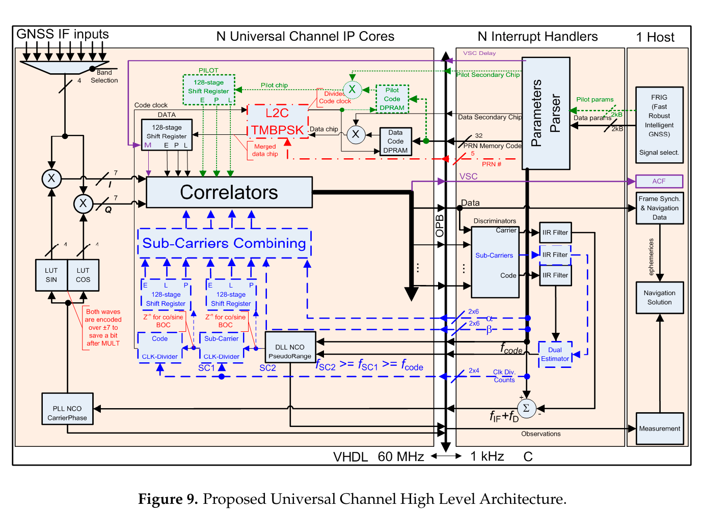
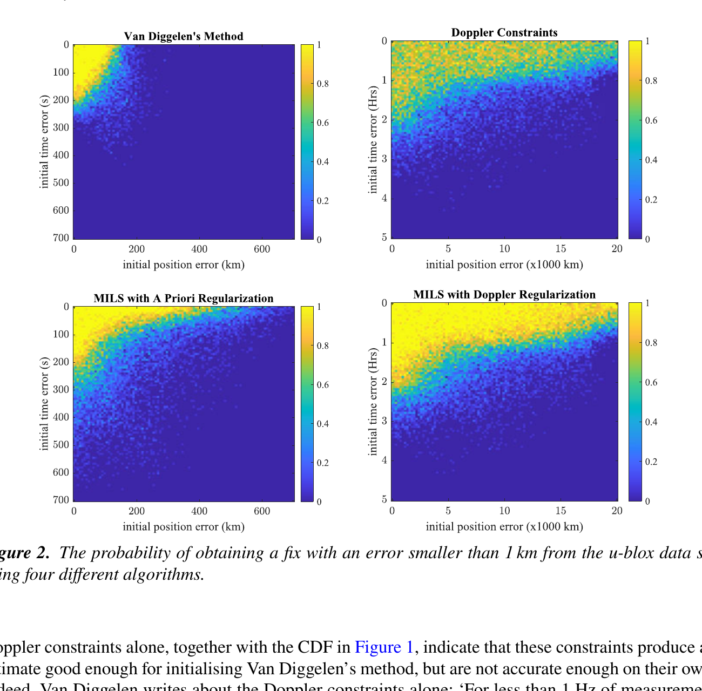
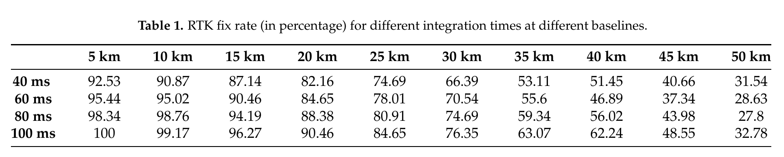

# 2026-08-19 GNSS 每日研究简报

## 今日快报

### 快报 1：暴雨前不只看水汽有多高，还要看它升得多快

- 主题：`dynamic-gnss-pwv-heavy-rainfall-cyprus`
- 来源 ID：`doi:10.3390/atmos17080793`
- 来源链接：https://doi.org/10.3390/atmos17080793
- 发表日期：2026-08-18
- 来源类型：同行评审开放论文、GNSS-PWV 与同址降雨事件统计
- 获取范围：CC BY 4.0 出版全文、公式、30 次事件数据定义、相关与回归结果

**内容：** 研究以塞浦路斯 CLOUDWATER GNSS 网和气象部门雨量记录构造 2020—2026 年的 30 次强降雨事件。作者把降雨前水汽累积阶段定义为 PWV 最低点到峰值的区间，同时比较静态峰值 PWV 与动态增长率 $`(PWV_{peak}-PWV_{min})/(t_{peak}-t_{min})`$，问哪一个更能描述峰值雨强。

**结论：** 在这 30 次事件中，PWV 增长率与峰值雨强的相关系数为 0.73，高于峰值 PWV 的 0.58；多元回归中只有增长率保持显著。论文同时报告两类指标都未与总雨量或降雨时序形成显著关系。证据规模小、区域单一且是事后事件筛选，不能把 0.73 外推为通用预报命中率。

**关注理由：** GNSS 水汽产品进入临近预报时，状态量和变化率应分开建模。动态指标可以提供对流前水汽输送线索，但仍需风场、稳定度与雷达证据约束虚警。

### 快报 2：没有站点气象传感器时，可让天气基础模型补齐 PWV 反演所需参数

- 主题：`graphcast-forecast-global-gnss-pwv`
- 来源 ID：`doi:10.22541/essoar.15007596/v1`
- 来源链接：https://doi.org/10.22541/essoar.15007596/v1
- 发表日期：2026-08-18
- 来源类型：ESS Open Archive v1 预印本、全球探空与 GNSS 数据评估
- 获取范围：预印本元数据与摘要；本次下载端点拒绝访问，未审计完整正文

**内容：** 方法用 GraphCast 预测加权平均温度 $`T_m`$ 与天顶静力延迟 ZHD，再与 GNSS 估计的天顶总延迟组合得到 PWV；基线包括 GPT3 与堆叠机器学习模型。它解决的是实时站点缺少气压、温度传感器时，ZHD 与湿延迟转换因子无法现场计算的问题。

**结论：** 摘要支持作者在全球探空和 GNSS 对照中观察到 GraphCast 方案优于两类基线，并称其对纬度、高程和时间变化的敏感性较低。本次未取得正文，因此不转述摘要中的毫米级 RMSE，也不判断训练资料与验证年份是否独立；该结果仍是 v1 预印本作者报告。

**关注理由：** 天气基础模型可以替代部分站端气象输入，却也把版本漂移、预报时效与场插值误差带进 GNSS 气象链。上线时应同时保存模型版本、起报时刻和传感器可用时的交叉校验残差。

### 快报 3：同一批静态观测交给不同后处理软件，厘米级并不意味着结果等价

- 主题：`static-gnss-postprocessing-software-benchmark-abuja`
- 来源 ID：`doi:10.33003/fjs-2026-1013-5505`
- 来源链接：https://doi.org/10.33003/fjs-2026-1013-5505
- 发表日期：2026-08-18
- 来源类型：同行评审论文、五套软件的同数据静态 GNSS 对比
- 获取范围：出版全文、12 个控制点、处理设置、残差、RMSE、固定率与 ANOVA 表

**内容：** 作者在 Abuja 的 12 个控制点采集双频多星座静态数据，每站观测超过 2 h、采样间隔 5 s、截止高度角 15°；同一 RINEX 数据分别交给 TBC、GrafNav、EZSurv、GNSS Explorer 和 GeoBon，并以 AUSPOS 坐标作参考。

**结论：** 论文表中 GrafNav 的水平/垂向 RMSE 为 0.009/0.014 m，模糊度固定率为 99.6%；TBC 精度接近且处理更快。不同软件的水平与垂向结果在单因素 ANOVA 中均有显著差异。这里的参考仍来自另一套 GNSS 后处理而非独立地面真值，样本只有 12 站，软件版本与默认实现也限制复现和外推。

**关注理由：** 商业软件给出“固定解”只是处理链的终点标签。工程验收应锁定软件版本、产品、天线模型、随机模型和验收门限，并用独立控制量验证，而不是只比较界面中的精度字段。

### 快报 4：把 GNSS-PWV 与前期降水合成一个指标，试图同时覆盖传统与次季节干旱

- 主题：`sapci-gnss-pwv-meteorological-drought-monitoring`
- 来源 ID：`doi:10.1175/jcli-d-25-0585.1`
- 来源链接：https://doi.org/10.1175/JCLI-D-25-0585.1
- 发表日期：2026-08-15
- 来源类型：同行评审论文、全球 1980—2022 年站点与网格回放
- 获取范围：出版社元数据与摘要；本次未取得可检索完整 PDF

**内容：** 作者提出标准化前期降水转换指数 SAPCI，把 GNSS 推导的 PWV 与降水组合，目标是在同一框架中识别持续时间较长的传统气象干旱和更短的次季节干旱；验证基线包含 SPEI、SPCI 与 SAPEI，并另检查 2015—2016 年 ENSO 相关事件。

**结论：** 摘要支持 SAPCI 与三类基线在多时间尺度上具有一致性，且能重现相似的全球干旱空间分布。由于没有正文，本期不转述摘要相关系数，也无法审计 PWV 来源、缺测处理、标准化基期和显著性空间自相关；这是一种回放型监测证据，不是实时旱情预报能力。

**关注理由：** GNSS-PWV 不只服务暴雨，也可描述水汽供给不足。真正部署时要防止同一再分析或降水资料同时进入目标与基线，造成看似独立的高一致性。

### 快报 5：运动背心之间的 GNSS 指标可以很相关，但高速段和加减速仍不能直接互换

- 主题：`wearable-gnss-between-system-agreement-australian-football`
- 来源 ID：`doi:10.1177/17479541261475069`
- 来源链接：https://doi.org/10.1177/17479541261475069
- 发表日期：2026-08-18
- 来源类型：同行评审论文、两套可穿戴 GNSS 系统的一致性试验
- 获取范围：出版社书目信息与完整摘要；本次未取得 PDF

**内容：** 研究让 30 名次精英级男子澳式足球运动员在一次训练中同时使用 K-AI 与此前验证过的 Vector S7，比较总距离、高速跑、冲刺、峰值/瞬时速度以及加减速计数，并同时报告绝对误差、比例误差、一致性界限与 ICC。

**结论：** 摘要显示各指标的 ICC 从很大到接近完美，但高速跑、冲刺和加减速的绝对/比例差异并不一致；因此“高度相关”不等于两系统逐次可替换。Vector S7 在这里是比较基准而非轨道/光学真值，单次训练也不能分离佩戴位置、滤波与运动类型的影响。

**关注理由：** GNSS 运动监测常把位置先经过厂商滤波，再聚合成阈值事件。设备迁移应在最终业务指标层做 Bland–Altman 与重复性检查，不能只看轨迹图或相关系数。

## 深度研读

### 深读 1｜捕获｜一条硬件通道怎样在不同星座、码率与调制之间切换

- 类别：`acquisition`
- 学习层级：`foundation`
- 选题定位：`经典基础`
- 来源 ID：`doi:10.3390/s16050624`
- 来源链接：https://doi.org/10.3390/s16050624
- 发表日期：2016-05-02
- 来源类型：同行评审开放论文、FPGA/ASIC 通用 GNSS 通道实现与实信号验证
- 获取范围：CC BY 4.0 出版全文、架构、资源/功耗估算、六类信号试验与 Figure 9
- 价值评分：96/100（相关性 20，经典价值 22，证据 19，教学价值 19，工程价值 16）

#### 为什么先学这个

快照定位首先要从短 IF 数据中找到卫星。不同 GNSS 信号的载频、码率、码长、数据/导频、BOC 子载波和二级码不同，但“本地载波去旋—本地码相关—积分—判决—转入跟踪”这条骨架相同。本节先把可复用骨架和信号专用配置分开，后两节才能讨论短数据中缺失整毫秒和绝对时间时怎样解算。

#### 先修知识

需要理解扩频码、BPSK/BOC、I/Q 下变频、相关器、相干与非相干积分、Doppler 搜索、DLL/PLL/FLL、NCO、数据/导频分量、二级码和导航电文帧同步。还要区分通道切换时间、首次捕获时间与 TTFF；三者不是同一指标。

#### 一句话逻辑

把载波、码、子载波、相关器间距、积分长度和鉴别器都参数化，在共享相关器与状态机上按信号配置重组，使一套通道能顺序捕获和跟踪多星座民用信号。

#### 研究问题与约束

论文问能否从 GPS L1 C/A 专用通道扩展出可处理不同频段、FDMA/CDMA、码率、码长与调制的通用通道，同时控制 FPGA/ASIC 资源和功耗。验证覆盖 GPS L1 C/A、L2C、L5、Galileo E1 B/C、GLONASS L1OF 与 BeiDou B1-I；2016 年当时尚未在轨或公开完整码的信号只用时序图或未正式测试，因此不能把“架构兼容”写成“所有现代信号均已实测”。

#### 核心方法论

IF 输入先选频带并生成 I/Q；可配置码与子载波发生器驱动相关器组。捕获阶段扫描码相位和 Doppler 单元，按信号码周期累积；跟踪阶段由载波/码鉴别器、IIR 环路滤波器和 NCO 闭环。参数解析器加载 PRN、FDMA 频点、相关器间距、数据/导频和二级码；主机只接收统一观测量与导航数据接口。

#### 关键公式逐步推导

对 Doppler 候选 $`f_d`$ 与码相位 $`m`$，一个通用离散相关量可写成：

```math
R(m,f_d)=\sum_{n=0}^{N-1}x[n]c^*[n-m]e^{-j2\pi f_dn/f_s}
```

捕获判决使用功率 $`|R|^2`$；延长相干积分会让同相信号幅度近似随 $`N`$ 增长，但若跨越未知数据位，符号翻转会抵消。因而通用通道必须把积分长度、数据擦除和二级码同步写成配置，而不是固定常数。进入跟踪后，Early/Late 码鉴别器可写为教学形式：

```math
D_{DLL}=\frac{|E|-|L|}{|E|+|L|}
```

鉴别器输出经环路滤波后驱动码 NCO；载波与子载波支路同理，但其鉴别器与带宽需按调制选择。

#### 经典价值与创新边界

经典价值是把“每种信号一条专用 RTL”改写为参数化信号处理积木，并展示捕获、跟踪、帧同步到观测量的完整边界。创新边界是资源/功耗来自特定 60 MHz VHDL 架构和 ASIC 推算，不代表今天任意工艺；顺序复用减少通道数会引入调度与重捕获风险，论文没有解决动态环境下的最优信号选择。

#### 整体逻辑链

选择 IF 频带；加载星座/PRN/FDMA 配置；生成载波、主码、二级码与子载波；扫描 Doppler—码相二维单元；通过门限后配置 Early/Prompt/Late；DLL/PLL/FLL 闭环；同步数据或导频二级码；解析电文和星历；生成伪距、载波与 Doppler；在信号质量下降时保存状态并切换下一配置。

#### 原文图表与结果分析



> 图源：Fortin 与 Landry《Implementation Strategies for a Universal Acquisition and Tracking Channel Applied to Real GNSS Signals》Figure 9，[DOI 原文](https://doi.org/10.3390/s16050624)，CC BY 4.0。由出版社 PDF 第 16 页以 240 dpi 渲染，仅裁出完整架构图与原图题，未重绘、改色或改标签。

图从左到右依次是 IF 选择与 I/Q、本地码/子载波、共享相关器、参数解析与鉴别器、主机导航解算。黑色是共同数据路，红色扩展 L2C TMBPSK，蓝色扩展 MBOC 子载波，绿色扩展导频/双分量，紫色是可变间距相关器。图直接证明的是模块如何复用，不是这些彩色扩展在同一时刻都能零代价运行；底部 60 MHz VHDL、1 kHz 中断与 C 主机也属于作者实现边界。

#### 原文结果论述

作者报告通道配置切换的平均时间为 1.07 ms，并估算 ASIC 实现约 3.5 mW/通道；相对 GPS L1 C/A 参考通道，加入现代化跟踪特性会增加资源与功耗。论文用六类真实信号验证兼容性，并指出 GPS L5 在相同 C/N₀ 下因码片率更高而呈现更低的 DLL 测距噪声。后两项结论依赖前端带宽、60 MHz 采样、相关器间距和作者硬件，不能外推为芯片规格保证。

#### 常见误区与适用边界

第一，把通用通道理解为所有信号并行处理。第二，把可配置码率误解为任意 RF 带宽都可接收。第三，跨数据位仍盲目延长相干积分。第四，BOC 只换本地码、不处理子载波与多峰。第五，只比较 LUT 数而忽略 RAM、时钟门控和主机中断。第六，把 1.07 ms 切换时间当首次捕获时间。第七，以 2016 年信号清单替代最新 ICD。

#### 工程实现步骤

1. 从目标 ICD 建立每个信号的载频、码率、码长、分量、二级码和符号周期配置表。
2. 固定共享接口：IF 输入、相关器阵列、鉴别器输出、观测量与状态快照。
3. 先用 GPS L1 C/A 回归捕获和环路，再逐项启用 BOC、导频和长码。
4. 对每种配置计算最大相干积分、Doppler 栅格与相关器间距。
5. 将资源、功耗、切换延迟、重捕获概率与漏检率一起纳入信号调度。
6. 用最新 ICD 和实信号重新验证，不继承论文当年的未公开信号假设。

#### 复现实验设计

用可重构 SDR/FPGA 接入 GPS L1 C/A、Galileo E1、BeiDou B1I 与 GPS L5 的同一 30—60 MHz 前端；每种信号采集 100 个 20 ms 片段，C/N₀ 扫描 25—50 dB-Hz，Doppler 扫描 ±5 kHz。比较专用与通用通道的 $`P_D/P_{FA}`$、码相误差、切换时间、FPGA 动态功耗和每次捕获能耗；注入数据位翻转、二级码错位、BOC 假峰、FDMA 频偏与时钟漂移。基线为逐信号专用 PCPS/DLL/PLL 实现。

#### 与定位及低成本实现的联系

低功耗终端可以用少量通用通道轮询多频多星座，把短暂激活的 RF 与基带结果送到云端；代价是同时观测数减少、跨历元载波连续性变差。若目标是下一节的快照定位，工程重点应从长期环路稳定转向短片段捕获概率、时间先验和可上传数据量。

#### 本节小结

通用通道的本质不是一套神奇算法，而是把共同相关骨架与信号专用配置分层；快照接收机正是把这条通道只打开很短时间。

### 深读 2｜接收机工程｜短快照没有导航时间戳，怎样把整码周变成可求的整数

- 类别：`receiver-engineering`
- 学习层级：`intermediate`
- 选题定位：`基础进阶`
- 来源 ID：`doi:10.1017/s0373463321000709`
- 来源链接：https://doi.org/10.1017/S0373463321000709
- 发表日期：2021-08-26
- 来源类型：同行评审开放论文、混合整数最小二乘与真实 u-blox 快照试验
- 获取范围：CC BY-NC-ND 4.0 出版全文、公式、694 历元试验、Figure 2 与运行时间说明
- 价值评分：98/100（相关性 20，经典价值 22，证据 20，教学价值 19，工程价值 17）

#### 为什么先学这个

上一节的相关器只能给出码周期内的相位。持续跟踪时，导航电文和本地钟把每个整毫秒接起来；快照只保存 256 ms RF，可能没有可靠发射时间。若把未知整码周留在观测里，它不是普通实数偏差，而是每颗星一个整数。本节学习怎样显式求这些整数，而不是先猜时间再勉强线性化。

#### 先修知识

需要理解卫星发射/接收时刻、几何距离、码周期、码相、Doppler、接收机钟差、非线性最小二乘、整数最小二乘、Gauss–Newton、先验正则化、协方差权阵与成功域。码相的单位可以是秒、chip 或米，推导中必须统一。

#### 一句话逻辑

把每颗卫星缺失的整码周期写成整数未知量，与位置、接收时间和钟差共同放入加权混合整数最小二乘；再用粗位置/时间或 Doppler 作为正则项扩大正确整数的收敛域。

#### 研究问题与约束

论文研究只知道码相、可能知道 Doppler、却不知道码发射时间的单点快照定位。真实数据来自一台采样率 4.092 MHz 的 u-blox 日志器，记录 256 ms 快照、约每 10 min 一次，共使用 694 个历元。试验环境、天线附近遮挡与真值生成限制普适性；“误差小于 1 km”被用作整数固定成功判据，不等于导航级精度。

#### 核心方法论

对卫星 $`i`$，观测码相只给出传播时间对码周期 $`T_c`$ 的余数；加入整数 $`n_i`$ 后才能恢复伪距。作者提出带位置/时间先验的 MILS，以及把 Doppler 方程作为正则约束的 MILS。求解器交替线性化连续变量、搜索整数，再用恢复的整码周计算位置；与 Van Diggelen 粗时定位和单独 Doppler 约束比较。

#### 关键公式逐步推导

忽略大气项的教学形式为：

```math
\rho_i(\mathbf x,t_{D,i})=\|\mathbf s_i(t_{D,i})-\mathbf x\|,
\qquad t_L-t_{D,i}=\frac{\rho_i}{c}+b
```

快照得到码相 $`\phi_i\in[0,T_c)`$，于是传播时间可写成：

```math
t_L-t_{D,i}=n_iT_c+\phi_i+\varepsilon_i,qquad n_i\in\mathbb Z
```

把连续未知量 $`\boldsymbol\theta=[\mathbf x,t_L,b]`$ 与整数向量 $`\mathbf n`$ 合并，可写成加权目标：

```math
\min_{\boldsymbol\theta,\mathbf n\in\mathbb Z^m}
\|\mathbf r(\boldsymbol\theta,\mathbf n)\|_{\mathbf W}^2+
\|\boldsymbol\theta-\boldsymbol\theta_0\|_{\mathbf P_0^{-1}}^2
```

若加入 Doppler，第二组残差约束几何距离率与钟漂。它不能单独给出高精度位置，却能削弱整码周组合的多解性。

#### 经典价值与创新边界

价值在于把粗时定位的隐式舍入写成清楚的混合整数估计问题，让先验、Doppler 和观测权都能进入同一个目标函数。边界是通用 MILS 比专用粗时法计算更重，且权阵、初值和整数搜索半径错误仍会固定到错误盆地；论文的 MATLAB 计时不是嵌入式最坏时延证明。

#### 整体逻辑链

从短 IF 数据捕获卫星；估计码相与 Doppler；读取辅助星历；给出粗接收时间/位置及协方差；构造每星整码周；线性化几何和钟项；执行 MILS 整数搜索与连续修正；回代生成位置；检查残差与整数一致性；若失败则扩大先验或等待下一快照，而不是输出无状态“固定解”。

#### 原文图表与结果分析



> 图源：Waserman 与 Toledo《A mixed-integer least-squares formulation of the GNSS snapshot positioning problem》Figure 2，[DOI 原文](https://doi.org/10.1017/S0373463321000709)，CC BY-NC-ND 4.0。由出版社 PDF 第 14 页以 240 dpi 渲染，裁出完整四幅热图、色标、坐标轴与图题；未改变像素、标签或数值，按原许可仅用于非商业研究评论。

四幅图颜色从 0 到 1 表示“最终误差小于 1 km”的比例。左列横轴到 700 km、纵轴到 700 s；右列把位置误差扩到 20,000 km、时间误差到 5 h。右下角 Doppler 正则 MILS 的黄色成功区明显最大，说明 Doppler 主要扩展初值容忍度。不同列坐标尺度不相同，不能凭黄色面积直接计算算法相对提升；图也不显示米级尾误差或错误固定概率。

#### 原文结果论述

作者对 694 个 u-blox 历元注入 20—21 s 初始时间误差和 20 km 水平初始误差；CDF 中 Van Diggelen 与先验正则 MILS 的精度接近，而单独 Doppler 约束更差。热图试验中，Doppler 正则 MILS 可在约 180 s 时间误差和全球尺度位置误差下保持较大成功域；当位置初值较好时，时间容忍度可继续扩大。一次 Gauss–Newton 修正的作者 MATLAB 测量约为先验 MILS 2.5 ms、Doppler MILS 0.6 ms；这不是完整搜索总时延或实时保证。

#### 常见误区与适用边界

第一，把码相余数直接当伪距。第二，给每颗星独立实数偏差而丢掉整数结构。第三，用 Doppler 单独定位后称其为最终精度。第四，用 1 km 成功判据掩盖错误固定。第五，卫星位置按错误发射时刻计算。第六，先验协方差写得过紧导致真值被排除。第七，只报平均时间，不报整数搜索尾时延。第八，忽略电离层、对流层、多路径和星历龄期。

#### 工程实现步骤

1. 对每颗星输出码相、Doppler、C/N₀ 和估计协方差，而不只输出捕获峰。
2. 从网络/RTC/上次位置构造粗时间和位置先验，并保留真实不确定度。
3. 用同一发射时刻模型迭代卫星坐标与地球自转改正。
4. 将整码周作为整数变量，设置可解释的搜索边界与超时。
5. 用码相和 Doppler 联合残差检查固定结果，保存第二候选代价。
6. 失败时输出不可用或继续采集，不把粗解包装成高精度解。

#### 复现实验设计

采集 1/4/16/256 ms GPS L1 C/A 快照，每个长度 500 历元；位置初值误差扫描 0—20,000 km，时间误差扫描 0—5 h，Doppler 噪声设 0.2/1/5 Hz。比较 Van Diggelen、先验 MILS、Doppler-only 和 Doppler 正则 MILS。指标为正确整数组合率、水平/三维 50%/95%/最大误差、运行时间 99.9%、失败可检测率；注入旧星历、单星 0.5 chip 多路径、钟漂和少至 5 星的几何退化。

#### 与定位及低成本实现的联系

快照把 RF 和基带常开功耗换成短采集、网络辅助和云端计算，适合追踪器与 IoT。MILS 说明低成本并不等于只能做启发式舍入：只要保留码相、Doppler 与先验协方差，云端可以承担整数搜索。下一节再把恢复的载波相位送进差分 RTK。

#### 本节小结

快照丢失的是时间标签，不是数学结构；把整码周显式保留为整数，Doppler 才能真正扩大可解域。

### 深读 3｜定位｜只上传一段单频 IF，云端怎样做单历元快照 RTK

- 类别：`positioning`
- 学习层级：`advanced`
- 选题定位：`定位专题：RTK`
- 来源 ID：`doi:10.3390/s21113688`
- 来源链接：https://doi.org/10.3390/s21113688
- 发表日期：2021-05-26
- 来源类型：同行评审开放论文、单频快照 RTK 实测与参数扫描
- 获取范围：CC BY 4.0 出版全文、时间恢复、单历元 LAMBDA、40—100 ms/5—50 km 试验与 Table 1
- 价值评分：98/100（相关性 20，经典价值 21，证据 20，教学价值 18，工程价值 19）

#### 为什么先学这个

上一节恢复了码的整周和粗位置，但 RTK 还需要纳秒级一致的发射时刻、可用载波相位和整数载波模糊度。常规接收机靠连续环路和历元时间标签维持这些量；快照必须在一次短采集中重建。本节把信号带宽、积分时间、上传大小、基线大气失配和单历元固定率串成完整工程预算。

#### 先修知识

需要理解码/载波联合模糊度、导航位翻转、二级码、粗时定位、单差/双差、短基线大气消除、LAMBDA、ratio 检验、Cramér–Rao 下界、Nyquist 采样、CEP/RMS 和固定率。还要区分“ratio 越门限”与“模糊度确实正确”。

#### 一句话逻辑

云端先从短 IF 联合估计码延迟、载波相位和 Doppler，再把粗时间逐级收紧到纳秒级统一标签，最后用参考站双差和单历元 LAMBDA 固定模糊度；带宽/积分提高观测质量，基线增长则破坏大气共模。

#### 研究问题与约束

论文研究单频、单历元快照能否在非零基线下获得 RTK 固定解，以及带宽、积分时长和基线距离如何影响固定率。屋顶天线采集 100 ms 原始快照，参考数据由虚拟参考站形成 5—50 km 基线；实验采用短基线简化模型，把未消除的大气延迟并入噪声。固定判定使用 LAMBDA ratio 阈值，未直接按已知整数审计错误固定概率。

#### 核心方法论

捕获器对每颗星保留导航位正反两种假设，避免长积分跨位翻转破坏相关峰和载波相位；粗时导航先从辅助时间的秒级误差降到毫秒级，再利用二级码边界、码延迟和几何传播时间建立统一全局时间标签。生成伪距与载波后，与参考站做双差；单历元浮点解进入 LAMBDA，最佳/次佳整数代价比 LRF 超门限即记为固定。

#### 关键公式逐步推导

短基线单频双差模型为：

```math
\nabla\Delta P=\nabla\Delta\rho+\nabla\Delta\varepsilon_P
```

```math
\nabla\Delta(\lambda\phi)=\nabla\Delta\rho+
\lambda\nabla\Delta N+\nabla\Delta\varepsilon_\phi
```

基线变长后，电离层与对流层不再充分抵消，却被简化模型塞进 $`\varepsilon`$，固定率自然下降。快照上传大小近似为：

```math
S=2QF_sT+A
```

其中 2 对应 I/Q，$`Q`$ 为每路量化位数，$`F_s`$ 为采样率，$`T`$ 为采集时长，$`A`$ 为元数据。延长 $`T`$ 同时改善载波/码估计并线性增加数据量；增加带宽主要改善码延迟，但也提高 $`F_s`$ 与上传成本。

#### 经典价值与创新边界

价值是把快照定位从米级粗时解推进到载波相位差分，并用参数扫描展示射频、网络和定位层之间的折衷。边界是单频、静态屋顶、后处理式云端、同一 RTK 配置和虚拟参考站；ratio 不是固定失败率检验，论文也没有蜂窝延迟、动态振荡器、城市多路径或真正电池能耗数据。

#### 整体逻辑链

终端按触发采集量化 I/Q；上传快照与粗时间/位置；云端载入星历和参考站；联合捕获码、载波、Doppler与位假设；粗时导航恢复 TOW；用二级码边界构造纳秒级全局标签；生成单频码/相位；与基站双差；估计单历元浮点基线；LAMBDA 搜索与验收；通过则输出固定坐标，否则回退粗解或请求新快照。

#### 原文图表与结果分析



> 表源：Liu 等《Cloud-Based Single-Frequency Snapshot RTK Positioning》Table 1，[DOI 原文](https://doi.org/10.3390/s21113688)，CC BY 4.0。由出版社 PDF 第 16 页以 240 dpi 渲染，仅裁出完整表题、行列标签和数值，未重绘或改写。

横轴是 5—50 km 基线，纵轴是 40/60/80/100 ms 积分，单元格为 LRF 越过作者门限的百分比。直接读表：5 km 时固定率从 40 ms 的 92.53% 升到 100 ms 的 100%；20 km 从 82.16% 升到 90.46%；50 km 只有 31.54% 与 32.78%，且中间时长并不单调。表说明基线影响远大于简单延长积分，也提醒这些是 ratio 固定率，不是经真值核验的正确固定率。

#### 原文结果论述

在 31.8 MHz 配置下，10 km 内所有测试时长的固定率均超过 90%；15 km 时 40 ms 为 87.14%，100 ms 为 96.27%。作者另报告 15 km、255 kB 快照组合可取得超过 93% 的潜在固定率。5 km、100 ms、31.8 MHz 的固定解水平 RMS 为 1.066 cm、三维 RMS 为 1.309 cm；这是成功固定子集的静态结果，不能包含未固定历元或错误固定风险。

#### 常见误区与适用边界

第一，把更长积分等同于无限增益，忽略导航位和动态。第二，带宽翻倍却不计上传与前端功耗。第三，把虚拟参考站基线当真实单基站网络。第四，在 50 km 仍使用短基线大气消除模型。第五，把 ratio 越门限当正确固定真值。第六，只统计固定子集厘米精度。第七，粗 TOW 错过半个二级码周期仍强行对时。第八，终端时钟、采样抖动与位假设出错不报警。

#### 工程实现步骤

1. 联合设计前端带宽、量化位数与触发长度，先给上传大小和能耗上限。
2. 快照同时保留 I/Q、粗 UTC、振荡器状态、天线与设备标识。
3. 对数据位正反、二级码边界和 Doppler 设置多假设，不提前硬判。
4. 逐级验证秒—毫秒—纳秒时间恢复，每级输出残差和备选解。
5. 按基线引入电离层/对流层状态，不能把 50 km 仍当短基线。
6. 以固定失败率、正确整数真值和全历元可用率替代单一 ratio 固定率。

#### 复现实验设计

同一终端采集 20/40/60/80/100 ms、6.36/12.72/31.8 MHz 的单频 I/Q，量化 1/2/4 bit；真实基站或可审计 VRS 形成 1/5/10/15/20/30/50 km 基线，每组合至少 1000 快照。比较粗时 SPP、浮点 SRTK、固定 SRTK 与连续 RTK。指标为正确固定率、错误固定率、全历元 95%/最大误差、上传 kB、端侧焦耳与云端 99.9% 时延；注入 10 m/s 动态、50 ms TOW 错误、单星位假设错误、区域电离层梯度与城市多路径。

#### 与定位及低成本实现的联系

快照 RTK 把参考数据、星历和整数搜索放到云端，让端侧只承担短时 RF 采集，适合低占空比资产追踪。真正产品化的关键不是“固定后能到厘米”，而是固定前后的全样本风险、网络离线回退和每次定位能量；若业务需要连续动态厘米级，持续跟踪仍可能更经济。

#### 本节小结

单频快照可以进入 RTK，但积分只改善观测噪声，无法抵消长基线大气失配；厘米级必须与正确固定率、上传成本和时间恢复失败一起报告。
