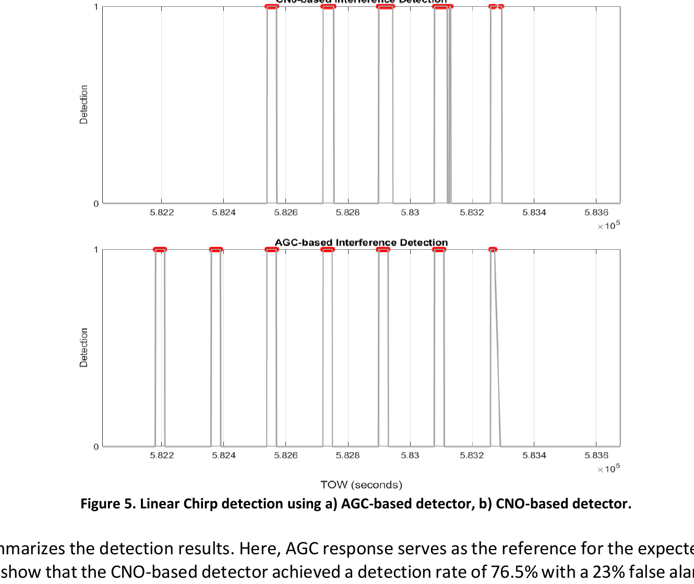
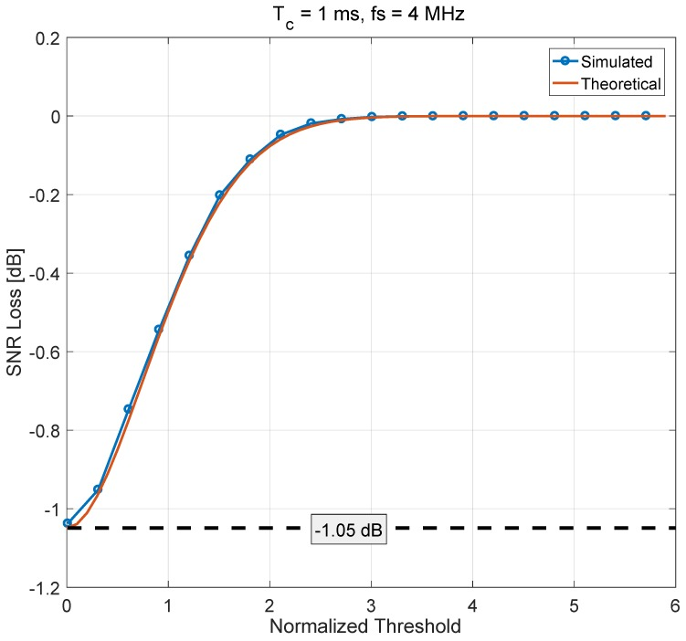
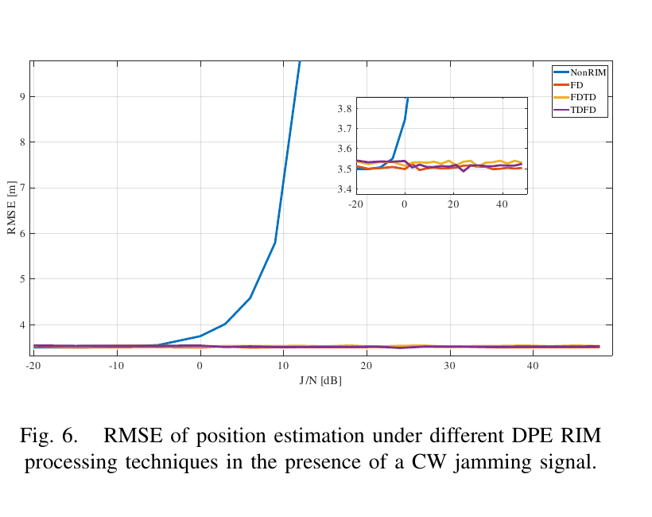

# 2026-08-20 GNSS 每日研究简报

## 今日快报

### 快报 1：台风过境时，水平对流层梯度补的是天顶延迟看不见的水汽非对称

- 主题：`gnss-ztd-gradient-typhoon-koinu-assimilation`
- 来源 ID：`doi:10.5194/egusphere-2026-4285`
- 来源链接：https://doi.org/10.5194/egusphere-2026-4285
- 发表日期：2026-08-19
- 来源类型：EGUsphere 讨论预印本、WRF 4.4.1/3DVAR 与台湾约 250 个 GNSS 站资料同化
- 获取范围：CC BY 4.0 完整预印本、公式、图表、代码与数据说明；尚未完成期刊同行评审

**内容：** 研究把 GNSS 天顶总延迟（ZTD）与南北、东西水平对流层梯度分别或联合送入 WRF 3DVAR，先做两个月统计，再以 2023 年超强台风“小犬”为个例，检查水汽场、引导气流、路径和最低海平面气压。方法要解决的问题是：ZTD 能约束柱积分水汽，却会压平台风周围具有方向性的湿度结构。

**结论：** 作者预印本报告，ZTD 使分析场 ZTD RMSE 下降约 58%，ZTD 与梯度联合约 60%，仅同化梯度也约下降 17%。个例中，控制试验平均路径误差为 64 km，梯度试验为 51 km；联合试验的最低气压 MAE/RMSE 为 5.56/7.06 hPa，而控制试验为 7.83/8.99 hPa。这是一个台风个例和预印本结果，不能外推为梯度同化对所有强对流都稳定增益。

**关注理由：** 连续站网不仅输出位置，也能输出具有方向性的湿延迟信息。业务验收应把站网密度、风暴是否穿过站网、同化窗口与多风暴统计显式列入，而不是只报单次路径改善。

### 快报 2：把多年 GNSS 速度场与震源机制叠在一起，才能区分刚块平移与带状剪切

- 主题：`slovenia-gnss-transpression-strain-field`
- 来源 ID：`doi:10.5194/egusphere-alpshop2026-23`
- 来源链接：https://doi.org/10.5194/egusphere-alpshop2026-23
- 发表日期：2026-08-19
- 来源类型：第 17 届 EGU Émile Argand 阿尔卑斯地质会议摘要、连续与流动 GNSS 速度场分析
- 获取范围：Copernicus 完整会议摘要与书目信息；没有论文级方法附录、协方差和完整图表

**内容：** 作者用斯洛文尼亚及周边 40 余个永久站的 2010—2025 年日坐标，以及 70 余个 1994—2016 年流动站结果，在欧亚参考框架下估计水平速度、插值应变率，并以速度剖面检查主要断层的弹性应变积累；2004—2024 年重定位地震与震源机制用于独立解释。

**结论：** 摘要把区域分成三个运动域：沿海亚得里亚微板块内部形变小于 1 mm/yr 并逆时针旋转；约 70 km 宽的中部走滑挤压带承担最高剪切；东北部以小于 1 mm/yr 向东北刚性平移。作者称西段约 40% 形变落在佩里亚得里亚断裂系，其余由迪纳里克断裂承担。由于只有会议摘要，本节不把插值后的百分比当作已完整审计的断层滑动率。

**关注理由：** GNSS 速度场的“平滑图”很容易掩盖参考框架、站点分布和插值先验。把速度剖面与地震机制并列，至少能检查一个高应变带是否有独立构造证据。

### 快报 3：实时震源反演要同时修位置层的共模偏移与模型层的过度自信

- 主题：`regard-mcmc-real-time-ppp-earthquake`
- 来源 ID：`doi:10.1186/s40623-026-02513-9`
- 来源链接：https://doi.org/10.1186/s40623-026-02513-9
- 发表日期：2026-08-19
- 来源类型：Earth, Planets and Space 同行评审开放论文、REGARD 实时系统升级与多年运行回放
- 获取范围：CC BY 4.0 全文、公式、近期日本地震案例与 5 年运行统计

**内容：** RUNE 用 MCMC 代替单一最大似然矩形断层解，输出震级与断层参数后验；定位层则由单参考站 RTK 转为实时 PPP，并以单站不确定度筛站、用远场站估计并移除全网平移趋势。它解决的不是“让一个点估计更漂亮”，而是让定位误差与反演似然的零均值假设更相容。

**结论：** 全文指出，自 2016 年以来 REGARD 触发事件中 99% 属于未检出真实地壳形变的低信噪场景，传统 VR 阈值会在噪声主导时过拟合。日本近期地震回放与长期统计显示，MCMC—PPP 组合减少了虚假断层模型，并与事后解保持一致；但 2025 年青森近海事件因实时轨道流中断而没有 PPP 结果，清楚表明算法稳健性不能替代精密产品冗余。

**关注理由：** 实时 GNSS 灾害产品需要把“观测是否连续、共模是否清除、后验有多宽”一起交付。单一震级或断层面没有这些元数据，很容易把系统故障误写成地球物理确定性。

### 快报 4：车队 GPS 欺骗的第一起碰撞由时距与攻击持续时间共同决定

- 主题：`gps-v2v-spoofing-cacc-collision-risk`
- 来源 ID：`doi:10.3390/app16168252`
- 来源链接：https://doi.org/10.3390/app16168252
- 发表日期：2026-08-19
- 来源类型：Applied Sciences 同行评审开放论文、十一车 CACC 方程仿真与稳定性校验
- 获取范围：CC BY 4.0 全文、模型方程、参数网格、代码可用性声明；纯仿真而非道路试验

**内容：** 研究把 GPS 与 V2V 两条输入同时受骗的情况放进含执行器滞后、PD 间距控制且经 Routh–Hurwitz 与字符串稳定性检查的十一车队列，扫描伪造位置幅值、持续时间和名义车头时距，并以首次碰撞前时间而非平均速度误差衡量风险。

**结论：** 作者仿真中，受攻击场景的最小 TTC 从 31.7 s 降到 64 个网格中 6 个发生碰撞；提高名义时距能降低但不能普遍消除风险，加入代表性的检测与弹性控制后才在所测范围内消除碰撞。峰值 jerk 在全部网格中仍处舒适范围，说明乘坐舒适度不能替代安全指标。证据只覆盖单车受攻击、纵向点质量模型且无传感器噪声。

**关注理由：** 把 GNSS 欺骗只看成定位误差会漏掉控制闭环放大。车头时距是网络安全参数，但仍需与检测、降级控制和真实车辆硬件在环联合验收。

### 快报 5：干扰分类与参数回归共用到第二层，延迟与任务冲突取得较好折衷

- 主题：`bds3-dual-branch-cnn-jamming-classification`
- 来源 ID：`doi:10.3390/s26165251`
- 来源链接：https://doi.org/10.3390/s26165251
- 发表日期：2026-08-19
- 来源类型：Sensors 同行评审开放论文、BDS-3 实验室仿真干扰与双分支 CNN
- 获取范围：CC BY 4.0 全文、数据生成、网络结构、消融与传统算法对比

**内容：** 双分支 CNN 先共享浅层时频特征，再分别输出干扰类别与连续物理参数；作者系统改变共享深度，检查分类所需的类间可分性与回归所需的连续细节何时发生梯度冲突。目标是让“识别是哪类干扰”和“给陷波/跟踪器配置什么参数”一次输出。

**结论：** Test Set 1 的五次试验均值中，共享两层的 Dual-Branch-2 分类准确率为 92.52%，CWI 中心频率 RMSE 为 0.267 MHz，推理 14.0 ms，峰值内存 240 MB；相较完全分支模型节省约 26.2% 峰值内存，但精度略低。论文数据来自实验室信号模型，真实复合干扰、RF 非理想与多路径尚未验证，因此这些数字是架构筛选证据，不是现场探测保证。

**关注理由：** 可部署反干扰系统最终需要的是带置信度的类别和参数，而不是单一准确率。现场验证还应覆盖未知类拒识、参数漂移、校准误差与错误分类后执行器的安全回退。

## 深度研读

### 深读 1｜接收机工程｜先看 AGC 还是 C/N₀：干扰进入接收机后留下哪些可观测痕迹

- 类别：`receiver-engineering`
- 学习层级：`foundation`
- 选题定位：`经典基础`
- 来源 ID：`arxiv:2602.12688`
- 来源链接：https://arxiv.org/abs/2602.12688
- 发表日期：2026-02-13
- 来源类型：arXiv v1 预印本、铁路 GPS L1 I/Q 回放与商用接收机试验，未经同行评审
- 获取范围：完整作者稿、检测公式、7 段 chirp 回放、Figure 5 与 Table 1；PDF 未声明开放再许可，图像仅作最小必要研究评论
- 价值评分：94/100（相关性 20，经典价值 19，证据 17，教学价值 20，工程价值 18）

#### 为什么先学这个

干扰抑制之前必须先知道异常在接收机哪一层可见。AGC 位于相关前，回答总输入功率是否异常；C/N₀ 来自相关和跟踪后，回答每个卫星通道的有用载波相对噪声是否下降。两者都能报警，却对温度、遮挡、多路径和环路恢复呈现不同混淆项。

#### 先修知识

需要理解射频前端、ADC 动态范围、自动增益控制、相关器 I/Q、GPS L1 C/A 的 1 ms 码周期与 20 ms 数据位、C/N₀ 的 dB-Hz 单位、虚警/漏检，以及扫频 chirp 的瞬时频率。

#### 一句话逻辑

外来功率先迫使 AGC 降低增益，再通过相关损失让多星 C/N₀ 同时下跌；前者更早但会受硬件温漂影响，后者更贴近可用卫星却会受遮挡与环路暂态影响。

#### 研究问题与约束

论文问：只读取商用 Septentrio AsteRx SBi3 的 AGC 与 C/N₀，能否识别 GPS L1 上的线性 chirp？试验把 SNCF 在 Auterive—Pamiers 铁路线采集的 I/Q 回放 30 min，插入 7 个各 30 s 的 chirp 区间，每区间功率增加 5 dB。它没有覆盖现场辐射、温度扫描、列车动态变化或多种干扰混合。

#### 核心方法论

AGC 基线由无干扰样本均值与标准差建立，观测低于基线门限就报警。C/N₀ 由 Prompt I/Q 的窄带/宽带功率比估计，再寻找多个卫星同时下降超过 5 dB 的区间。AGC 响应被作者用作预期干扰区间的参考，而不是外部校准的射频真值。

#### 关键公式逐步推导

AGC 门限写为：

```math
T_{\mathrm{AGC}}=\mu_{\mathrm{ref}}-3\sigma_{\mathrm{ref}}-T_{\mathrm{drop}},
\qquad T_{\mathrm{drop}}=2\ \mathrm{dB}
```

若 $`g_k<T_{\mathrm{AGC}}`$，则置干扰标志。C/N₀ 的教学形式可写成：

```math
\widehat{C/N_0}=10\log_{10}\!\left[
\frac{1}{T}\frac{\hat\mu_{NA}}{M-\hat\mu_{NA}}
\right]\ \mathrm{dB\!-!Hz}
```

其中 $`T=1\ \mathrm{ms}`$，$`M`$ 通常取 20 个码块。AGC 是前端共同量，C/N₀ 是逐星后相关量；工程上不能把二者当作同一个传感器重复投票。

#### 经典价值与创新边界

价值是用最少的商用接收机输出解释干扰在前端与通道层的传播顺序，并给出可复现门限。边界是 2026 年预印本的小型回放试验：AGC 的 7/7 命中由作者把自身 AGC 响应当参考得到，不是独立射频标签下的普遍检测概率。

#### 整体逻辑链

建立无干扰基线；监测总功率代理 AGC；监测逐星 C/N₀；寻找多星共模变化；对齐已知干扰区间；统计命中、漏检和恢复期虚警；若只见 C/N₀ 下降而 AGC 稳定，则优先检查遮挡或天线衰减；若两者共同下降，再升级干扰告警。

#### 原文图表与结果分析



> 图源：Kazim、Darwich 与 Marais《GNSS Jamming Detection with Automatic Gain Control (AGC) and Carrier-to-Noise Ratio Density (CNO) Observables from a COTS receiver》Figure 5，[arXiv 原文](https://arxiv.org/abs/2602.12688)。由作者稿 PDF 第 5 页以 240 dpi 渲染，仅裁出完整双面板图与原图题，未重绘、改色或修改标志；未确认开放图像许可，仅作研究评论的最小摘录。

横轴是 GPS 周内秒 TOW，纵轴是二值检测；上图 CNO、下图 AGC，红色短线标注作者的 7 个干扰区间。图直接显示 AGC 在 7 段都置位，而 C/N₀ 在低功率前两段没有稳定置位，恢复边缘还有额外跳变。原图题把 a/b 顺序写成 AGC/CNO，但面板标题实际相反；本简报按面板标题解释。图不能证明这些标志在温度变化或隧道遮挡中仍对应干扰。

#### 原文结果论述

Table 1 报告 AGC 7/7、C/N₀ 5/7；以作者定义计算，C/N₀ 检测率 76.5%、虚警率 23.0%。作者把较多虚警归因于干扰结束后跟踪环重新捕获和滤波器稳定时间。AGC 表中的 100% 仍受“AGC 自身作为参考标签”的评价设计限制。

#### 常见误区与适用边界

第一，AGC 下降就断言是恶意干扰。第二，单星 C/N₀ 下跌也按共模干扰处理。第三，用静态门限跨温度、天线和固件。第四，恢复期仍按稳态统计虚警。第五，把接收机报告的 AGC dB 当可溯源输入功率。第六，用已知七段回放的结果宣称未知干扰可检测。

#### 工程实现步骤

1. 在设备、天线、温度和增益模式固定时采集无干扰 AGC/C/N₀ 基线。
2. 同步保存 AGC、逐星 C/N₀、锁定状态、卫星仰角与前端状态。
3. 将 AGC 异常和“多数卫星共模 C/N₀ 下降”分开计算。
4. 为进入干扰、失锁和恢复分别设状态机与滞回时间。
5. 用频谱仪或已标定信号源提供独立标签，避免自证循环。
6. 报告按设备、温度、环境与干扰类型分层的 ROC，而非单一准确率。

#### 复现实验设计

复用 GPS L1 I/Q，注入 CW、chirp、脉冲与宽带噪声；每类 J/N 从 −20 到 30 dB、每档 100 段，每段 30 s。温度设 −10/20/50 °C，并加入隧道衰减和单侧遮挡。比较 AGC、逐星 C/N₀、多星共模 C/N₀ 与二者融合；指标为检测延迟、事件级 Pd/Pfa、恢复期虚警和失锁前提前量。基线包括固定阈值和按温度/仰角自校准阈值。

#### 与定位及低成本实现的联系

AGC 与 C/N₀ 几乎不增加射频成本，适合低成本终端做第一层健康监测。但它们只说明“接收链异常”，不能恢复被污染的码相，也不能给出可信位置；下一节需要在相关前直接限制异常样本的影响。

#### 本节小结

AGC 看总功率，C/N₀ 看逐星相关质量；把两者的时间顺序和混淆项分开，报警才不会把遮挡、温漂与干扰混成一类。

### 深读 2｜接收机工程｜不先猜干扰波形，Huber 非线性怎样限制异常采样的影响

- 类别：`receiver-engineering`
- 学习层级：`intermediate`
- 选题定位：`基础进阶`
- 来源 ID：`doi:10.3390/s18072217`
- 来源链接：https://doi.org/10.3390/s18072217
- 发表日期：2018-07-10
- 来源类型：Sensors 同行评审开放论文、稳健统计推导、仿真与真实 GNSS 信号试验
- 获取范围：CC BY 4.0 全文、公式、Figure 3 及后续仿真/实测结果
- 价值评分：97/100（相关性 20，经典价值 22，证据 20，教学价值 18，工程价值 17）

#### 为什么先学这个

上一节只能报警。传统干扰抵消要先检测并估计波形，模型猜错就可能把 GNSS 一起消掉。RIM 换一个问题：若干扰在时间域或某个变换域表现为少量大幅异常，能否让这些样本的影响饱和，同时尽量保留小幅热噪声与扩频信号？

#### 先修知识

需要理解复数基带采样、DFT/IDFT、扩频相关与 CAF、最小二乘、M 估计、Huber 损失、零记忆非线性、MAD 噪声尺度、SNR 与 dB。还要区分“抑制异常样本”和“估计并相消干扰波形”。

#### 一句话逻辑

先把采样变换到让干扰稀疏的域，再用 Huber 对幅度超过 $`T_h`$ 的复样本限幅，最后逆变换并照常相关；门限越小越稳健，但无干扰时效率损失越大。

#### 研究问题与约束

论文扩展 RIM 到变换域，并推导 Huber 非线性在无干扰条件下的效率损失；随后以合成和真实 GNSS 信号比较传统处理、脉冲消隐、complex signum、myriad 与 Huber。基本假设是干扰在所选域足够稀疏；与热噪声同样铺满带宽的干扰不满足这一结构。

#### 核心方法论

对长度 $`N`$ 的采样向量先做正交变换 $`\mathbf T_1`$，在变换域逐点施加复 Huber 非线性，再用 $`\mathbf T_1^H`$ 返回时间域。限幅后的样本进入普通捕获/跟踪相关器。门限按噪声尺度归一化，使相同调参可跨增益工作点比较。

#### 关键公式逐步推导

复 Huber 损失与对应非线性为：

```math
\rho(z)=
\begin{cases}
\tfrac12|z|^2,& |z|\le T_h\\
T_h|z|-\tfrac12T_h^2,& |z|>T_h
\end{cases}
```

```math
\psi(z)=
\begin{cases}
z,& |z|\le T_h\\
T_h\,z/|z|,& |z|>T_h
\end{cases}
```

处理链为 $`\bar{\mathbf x}=\mathbf T_1^H\psi(\mathbf T_1\mathbf x)`$。小样本保持线性，大样本只保留相位并把幅度截到 $`T_h`$；当 $`T_h\rightarrow\infty`$ 时退化为普通线性处理。

#### 经典价值与创新边界

经典价值是给“限幅会损失多少正常 GNSS 信息”一个可计算答案，并把时间域鲁棒处理推广到频域等正交域。边界是稳健不等于万能：变换选错时干扰不稀疏，限幅会同时伤害有用信号；门限估计受强干扰污染时，理论效率也会偏离。

#### 整体逻辑链

估计噪声尺度；判断潜在稀疏域；正交变换；Huber 限幅；逆变换；计算 CAF；比较相关峰、检测概率和输出 SNR；在无干扰数据上量效率损失；在多种 J/N 与干扰形态下量抑制增益；若没有稀疏域则回退或换空间滤波。

#### 原文图表与结果分析



> 图源：Borio、Li 与 Closas《Huber’s Non-Linearity for GNSS Interference Mitigation》Figure 3，[DOI 原文](https://doi.org/10.3390/s18072217)，CC BY 4.0。直接取得 PubMed Central 保存的原始 Figure 3 JPEG，仅无损转为 PNG；未裁剪、重绘、改色或修改坐标标签。

横轴是归一化门限 $`T_h/\sigma`$，纵轴是无干扰条件下 SNR 损失 dB；条件为 $`T_c=1\ \mathrm{ms}`$、$`f_s=4\ \mathrm{MHz}`$。理论橙线与仿真蓝点贴合：极小门限的损失约 −1.05 dB，门限超过约 $`3\sigma`$ 后接近 0 dB。图证明的是名义高斯噪声下的效率折衷，不能证明强干扰时门限越大越好，也不能给所有采样率同一个绝对幅度阈值。

#### 原文结果论述

论文后续仿真与真实信号试验显示，Huber 能在干扰稀疏域显著改善相关输出，并通常比硬脉冲消隐保持更平滑的效率—稳健折衷。作者给出的 −1.049 dB 下限对应极端限幅；这是无干扰代价，不是干扰抑制度。频域处理适合窄带/CW，时间域适合脉冲，选择依据来自结构而非算法名称。

#### 常见误区与适用边界

第一，把 Huber 用在残差域与原始采样域混为一谈。第二，门限不除噪声尺度。第三，频域窄带干扰却只做时间域限幅。第四，把 −1.05 dB 写成抑制增益。第五，FFT 非正交归一化却照搬推导。第六，强干扰污染 MAD 后仍信任门限。第七，只看相关峰而不看伪距/载波偏差。

#### 工程实现步骤

1. 固定 FFT 归一化并验证 Parseval 能量守恒。
2. 用干净窗口或稳健分位数估计 $`\sigma`$，保存置信度。
3. 按预期干扰选择时间、频率或两域处理。
4. 预先量化 $`T_h/\sigma`$ 对捕获 Pd/Pfa 与跟踪偏差的影响。
5. 让处理前后 AGC、C/N₀、相关峰形和观测残差同时进入健康监测。
6. 无法识别稀疏域时降低输出完整性等级，而不是无限加强限幅。

#### 复现实验设计

生成 GPS L1 C/A，$`f_s=4\ \mathrm{MHz}`$、相干积分 1 ms、C/N₀ 30—50 dB-Hz；注入 CW、扫频、10% 占空脉冲和宽带噪声，J/N −20—40 dB。比较线性、blanking、csign、myriad 与 Huber，$`T_h/\sigma`$ 扫 0.2—6。指标为无干扰 SNR 损失、捕获 Pd/Pfa、码偏差、载波偏差和运行时间；再以真实 I/Q 检查仿真排序是否保留。

#### 与定位及低成本实现的联系

Huber RIM 放在相关前，可服务所有卫星通道，适合 SDR 或带向量扩展的低成本基带。但它只生成更干净的采样；若后端仍逐星形成伪距再 WLS，通道级错误可能继续放大。下一节把稳健 CAF 直接接到位置搜索。

#### 本节小结

RIM 的关键不是“识别干扰”，而是找到干扰稀疏的表示域，并用可量化的名义效率换取大幅异常的有界影响。

### 深读 3｜定位｜把稳健 CAF 直接累加到位置域，为什么比逐星修补更完整

- 类别：`positioning`
- 学习层级：`advanced`
- 选题定位：`定位专题：SPP / 直接位置估计`
- 来源 ID：`doi:10.1109/taes.2023.3312350`
- 来源链接：https://doi.org/10.1109/TAES.2023.3312350
- 发表日期：2023-12-01
- 来源类型：IEEE Transactions on Aerospace and Electronic Systems 同行评审论文、DPE-RIM 理论与 GPS 仿真
- 获取范围：arXiv 作者稿全文、公式、5×10^4 次蒙特卡洛效率试验、CW/DME 仿真与 Figure 6；IEEE 图像再许可未独立确认，仅作最小必要研究评论
- 价值评分：97/100（相关性 20，经典价值 20，证据 18，教学价值 19，工程价值 20）

#### 为什么先学这个

上一节的稳健采样仍可接回“每星捕获—每星伪距—WLS”的两步链；若某通道在强干扰下先错误锁峰，后端位置解只能处理已经离散化的错误观测。DPE 直接以位置、速度和钟差生成所有卫星本地副本，把跨星几何约束放在相关阶段，因此可把 RIM 的收益延续到最终位置目标。

#### 先修知识

需要理解 CAF、码延迟与 Doppler、卫星位置/速度、接收机钟差/钟漂、最大似然、DPE 与两步定位（2SP）、Huber 非线性、Fisher 信息矩阵、Cramér–Rao 下界、MAD 与 J/N。

#### 一句话逻辑

对原始 I/Q 先在时间域或频域做 Huber RIM，再按候选 PVT 预测每星延迟和 Doppler，计算稳健 CAF 并跨星求和；这样异常样本在进入位置目标前已被限幅，弱星也能借几何共同约束参与搜索。

#### 研究问题与约束

论文推导 DPE-RIM 的无干扰效率损失，并在 CW 与 DME 干扰下比较单域、双域和无 RIM 的 DPE。结果全部来自静态、同 C/N₀ 的 7 星 I/Q 仿真；没有真实前端、动态轨迹、多路径、星历误差、搜索初值与最坏运行时间验证，因此属于算法可行性而不是导航完整性证明。

#### 核心方法论

普通 DPE 把候选状态 $`\boldsymbol\kappa`$ 映射为每星 $`\tau_i(\boldsymbol\kappa)`$ 与 $`f_{d,i}(\boldsymbol\kappa)`$，最大化 CAF 能量和。RIM 把输入 $`x[n]`$ 换成经过单域或时间—频率双域非线性后的 $`\bar x[n]`$，得到 robust CAF。CW 在频域最稀疏；DME 脉冲同时跨时间和频率，时间后频率的顺序更有效。

#### 关键公式逐步推导

普通接收信号的教学模型为：

```math
x[n]=\sum_{i=1}^{M}\alpha_i c_i(nT_s-\tau_i(\boldsymbol\kappa))
e^{j2\pi f_{d,i}(\boldsymbol\kappa)nT_s}+\eta[n]+i[n]
```

稳健 CAF 为：

```math
\mathcal C_{\rho,i}(\boldsymbol\kappa)=
\sum_{n=0}^{N-1}\bar x[n]c_i(nT_s-\tau_i(\boldsymbol\kappa))
e^{-j2\pi f_{d,i}(\boldsymbol\kappa)nT_s}
```

最终状态直接取：

```math
\hat{\boldsymbol\kappa}=\arg\max_{\boldsymbol\kappa}
\sum_{i=1}^{M}|\mathcal C_{\rho,i}(\boldsymbol\kappa)|^2
```

与 2SP 的关键差别是，$`\tau_i,f_{d,i}`$ 不先逐星硬判，而始终由同一个候选位置/速度/时钟生成。

#### 经典价值与创新边界

价值是把稳健统计、相关器和最终定位目标写进一个一致的最大似然框架，并证明 DPE 与 2SP 在给定 RIM 方案下共享相同的名义效率损失。创新边界是搜索复杂度和仿真模型：DPE 目标可能多峰，RIM 不提供全局搜索保证，也不自动处理多路径与欺骗的结构化假峰。

#### 整体逻辑链

载入星历和粗 PVT；生成候选状态网格/粒子；由几何预测所有星延迟与 Doppler；对 I/Q 做 TD、FD 或双域 Huber；计算每星 robust CAF；跨星累加；数值优化 PVT；检查最佳/次佳峰、残差与健康指标；若稳健与非稳健解分离过大，则输出降级状态而非静默切换。

#### 原文图表与结果分析



> 图源：Li、Tang、Wu 与 Closas《Robust Interference Mitigation Techniques for Direct Position Estimation》Figure 6，[DOI 记录](https://doi.org/10.1109/TAES.2023.3312350)，图像取自[作者 arXiv 稿](https://arxiv.org/abs/2308.05262)。由 PDF 第 7 页以 240 dpi 渲染，仅裁出完整 Figure 6 和原图题，未重绘、改色或修改数值；IEEE 图像再许可未独立确认，仅作研究评论的最小摘录。

横轴 J/N 为 −20 至约 48 dB，纵轴位置 RMSE 为米。无 RIM 蓝线在 J/N 接近 0 dB 后开始上升，约 10 dB 已到图中近 6 m，并很快超出纵轴；频域 FD、频率后时间 FDTD、时间后频率 TDFD 三条线在整段扫描中都约维持 3.5 m。内嵌放大图说明三种稳健处理仍有厘米级曲线差异。这里 3.5 m 的底噪来自仿真几何与信号设置，不是算法固有精度。

#### 原文结果论述

效率试验用 7 颗 GPS L1 C/A、50 MHz 采样、2 MHz 前端、DPE 44 dB-Hz 与 2SP 50 dB-Hz，平均 5×10^4 次蒙特卡洛。干扰试验改为 7 颗 GPS L5、每星 44 dB-Hz、20 MHz 前端、50 s 数据；Huber 门限 $`1.345\hat\sigma_n`$，$`\hat\sigma_n=\mathrm{MAD}/0.6745`$。CW 中 FD 最好；DME 的 J/N 扫 −4—56 dB 时，单域不足，时间后频率双域最好。两组都是仿真作者结论。

#### 常见误区与适用边界

第一，把 DPE 理解为不需要星历或粗时。第二，图中稳健曲线平坦就宣称无限抗干扰。第三，CW 结果外推到宽带噪声。第四，DME 仿真外推到所有脉冲源。第五，只报 RMSE，不报错误全局峰率。第六，忽略搜索网格和计算预算。第七，把 nominal LoE 与干扰增益相加减。第八，把 DPE-RIM 当作欺骗认证。

#### 工程实现步骤

1. 复用普通捕获器的码与 Doppler 生成器，增加 PVT 到各星参数的批量映射。
2. 实现 TD/FD Huber 与严格一致的 FFT 归一化。
3. 用粗 PVT 限制位置、速度和钟差搜索盒，保存第二峰。
4. 同时运行小规模 2SP 基线，监测两条链的解分离。
5. 对不同干扰类型选择 RIM 域，并把 AGC/C/N₀ 作为选择依据而非真值。
6. 输出位置、峰值比、域选择、门限、LoE 预算与计算超时状态。

#### 复现实验设计

先复现论文：7 星 GPS L5、C/N₀ 44 dB-Hz、20 MHz、50 s，CW J/N −20—48 dB、DME −4—56 dB，Huber $`1.345\hat\sigma`$；比较 NonRIM、TD、FD、FDTD、TDFD 与 2SP。指标包括三维 RMSE、95%/最大误差、错误全局峰率、运行时间 99.9% 与无干扰 LoE。再加入 20 m 粗位置误差、1 ms 钟误差、动态、星间 C/N₀ 不同、多路径和宽带噪声，检查论文排序是否保持。

#### 与定位及低成本实现的联系

DPE-RIM 让低成本 SDR 在保留原始 I/Q 时用跨星几何弥补单通道脆弱性，适合云端快照或算力可控的边缘接收机。代价是必须上传/保存 I/Q、维护星历和搜索状态，且计算量远大于普通 WLS；产品应按能耗、时延和不可用率，而不只按干扰下 RMSE 选择。

#### 本节小结

稳健采样若只停在相关器前，收益可能在逐星硬判中丢失；DPE 把 robust CAF 一直累加到位置域，但它仍需要可审计的搜索、失效检测与真实数据验证。
