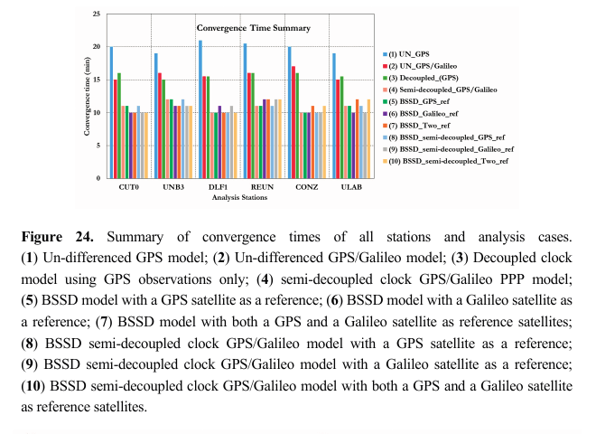
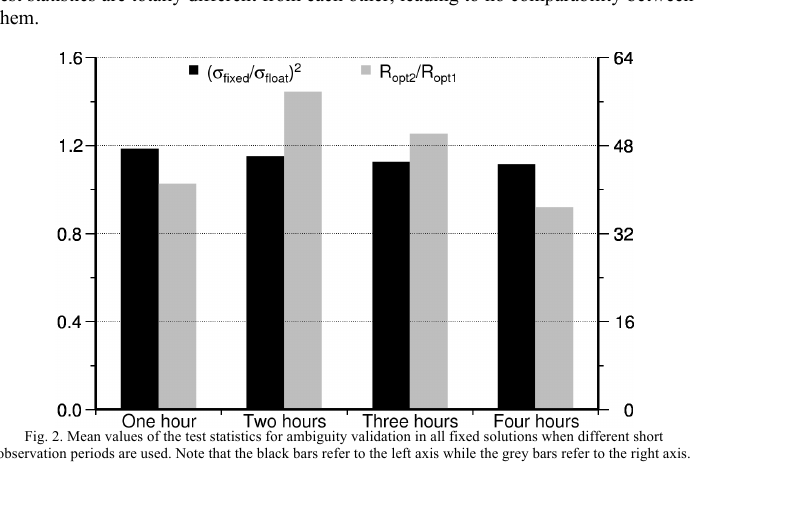
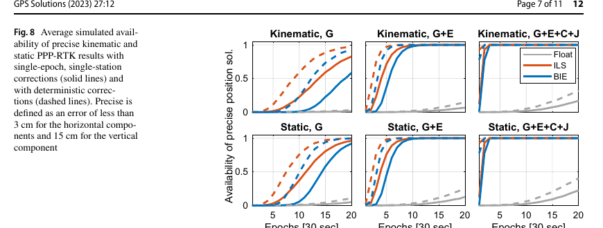

# 2026-08-21 GNSS 每日研究简报

## 今日快报

### 快报 1：全球重力模型给出长波基底，本地改正面负责补高频地形遗漏

- 主题：`ethiopia-gnss-leveling-hybrid-geoid-mlp`
- 来源 ID：`doi:10.1515/jag-2026-0056`
- 来源链接：https://doi.org/10.1515/jag-2026-0056
- 发表日期：2026-08-20
- 来源类型：同行评审论文、埃塞俄比亚 GNSS/水准与重力数据混合大地水准面拟合
- 获取范围：出版社元数据与完整摘要；正文 XML/PDF 端点本次未返回可审计内容

**内容：** 研究先在全球重力模型中选出适合埃塞俄比亚高原的长波基底，再用 92,433 个航空重力观测和 22,370 个地面重力点构造本地残差，比较六种改正面，其中包含多层感知机。它解决的是地形起伏和岩石圈非均匀导致全球模型遗漏高频重力信号、GNSS 椭球高难以直接转换为可靠正高的问题。

**结论：** 摘要报告，所选基底（摘要记作 GM2008）与 GNSS/水准控制的初始 RMSE 为 0.9239 m；MLP 改正后为 0.0532 m，对应作者给出的总体误差降幅 94.24%。这些数字来自摘要，正文未能取得，因而本期不判断训练/测试点的空间独立性、控制点数量、交叉验证方式或模型在无控制区的外推误差；结果应读作区域内作者报告，而不是全国任意位置的 5 cm 保证。

**关注理由：** GNSS 高程工程常把“坐标解得准”和“正高基准可靠”混为一谈。改正面可以吸收区域系统差，但也可能记住控制点分布；验收必须做空间留出、地形分层和独立水准线检查。

### 快报 2：把分类概率换成保形 p 值后，NLOS 卫星可以降权而不必一刀剔除

- 主题：`conformal-prediction-gnss-nlos-probabilistic-weighting`
- 来源 ID：`doi:10.1088/1361-6501/ae9c60`
- 来源链接：https://doi.org/10.1088/1361-6501/ae9c60
- 发表日期：2026-08-20
- 来源类型：同行评审论文、香港 UrbanNav 城市峡谷数据上的保形预测加权 SPP
- 获取范围：出版社元数据与完整摘要；PDF 端点触发反自动化验证，未审计正文

**内容：** CP-SPP 先用 GBDT 根据 C/N₀、仰角、伪距残差等十维特征区分 LOS/NLOS，再用目标域校准集生成逐星保形 p 值，并通过指数映射转成连续权重。它针对的是普通分类器概率未校准时，少数 NLOS 仍会获得过高权重；同时保留全部卫星，避免硬剔除直接削弱几何。

**结论：** 摘要报告，在使用 10% 已标注目标域样本的 UrbanNav 评估中，水平 RMSE/CEP 为 10.74/4.77 m；相对仰角加权分别改善 30.8%/53.2%，相对机器学习概率加权改善 14.6%/27.8%。作者还报告 97.1% 的判别可靠率，高于设定的 90% 目标。由于正文未取得，本期不审计路线切分是否泄漏、CEP 定义、校准样本代表性或同一城市跨日泛化；保形保证也依赖校准与测试近似可交换。

**关注理由：** 城市 GNSS 的关键不只是“识别 NLOS”，而是让置信度能进入随机模型。工程上应把校准覆盖率、位置误差和卫星几何一起回放，不能只看分类准确率。

### 快报 3：先模拟等离子体泡边界上的闪烁，再把失锁概率传到 GBAS 可用性

- 主题：`equatorial-plasma-bubble-dfmc-gbas-availability`
- 来源 ID：`doi:10.3389/fspas.2026.1893946`
- 来源链接：https://doi.org/10.3389/fspas.2026.1893946
- 发表日期：2026-08-20
- 来源类型：同行评审开放论文、EPB—闪烁—DFMC GBAS 可用性仿真链
- 获取范围：CC BY 4.0 出版全文、公式、模拟设置、图表与讨论

**内容：** 作者用降阶赤道等离子体泡模型给出耗空区轮廓，以相位梯度屏描述泡边界陡峭电子密度梯度产生的散射，再与 GISM 背景闪烁和时变电离层叠加；合成的闪烁指数被映射为逐星失锁概率，最后进入 Tenerife Norte 机场的 DFMC GBAS 卫星选择、平滑收敛和垂直保护级计算。

**结论：** 文中模拟场景里，地面站与约 3 km 外用户因地图分辨率而大多处于同一格点；稳态场景曾在约 23:30 暂时降到 12 颗可用卫星，所展示配置的 VPL 仍低于 VAL。这个结果依赖合成泡序列、安静空间天气背景、0.4/0.6 的敏感/稳健接收机闪烁阈值、60 s 图件分辨率和尚未定型的 GAST E 模型；论文明确说明它不是实测闪烁监测算法，也不能证明实际风暴期可用性。

**关注理由：** 完整性链必须把“空间天气强度”转换成接收机是否失锁、还剩几颗星以及保护级是否越界。只预测 TEC 或 S₄ 而不建接收机与平滑器模型，不能直接回答机场能否运行。

### 快报 4：车载天线不是绕极化轴转动时，短基线双差也未必能消掉相位缠绕

- 主题：`attitude-assisted-ground-phase-windup-rtk`
- 来源 ID：`doi:10.1038/s41598-026-66794-6`
- 来源链接：https://doi.org/10.1038/s41598-026-66794-6
- 发表日期：2026-08-17
- 来源类型：Scientific Reports 同行评审论文、任意天线姿态下地面相位缠绕建模与 RTK 试验
- 获取范围：出版社页面、完整摘要和复用声明；动态正文在本次获取中未完整展开

**内容：** 研究重新推导任意接收天线姿态下的 ground phase wind-up。若天线只绕极化轴转，相位缠绕近似共模，短基线双差可以抵消；若车体转轴与极化轴不一致，两个接收端的误差不再等同。作者因此引入外部姿态信息计算逐历元补偿，再进入 RTK 双差解算。

**结论：** 摘要报告，补偿后东、北、天坐标偏差 RMSE 分别改善 53%、34% 和 15%。正文未完整取得，因此本期不转述绝对 RMSE、基线长度、姿态源精度或运动轨迹，也不把相对降幅外推到所有车辆。该方法还新增对天线坐标系、姿态时间同步和杆臂标定的依赖。

**关注理由：** 高精度载波相位误差并不都能靠双差“自动消失”。车载、多天线和旋转平台应把天线姿态写进观测模型，并用关闭/开启改正的残差与固定率同时验收。

### 快报 5：四阵元 GNSS 阵列要先把互耦压下去，后端抗干扰自由度才可信

- 主题：`compact-four-element-gnss-array-mutual-coupling`
- 来源 ID：`doi:10.1080/09205071.2026.2716750`
- 来源链接：https://doi.org/10.1080/09205071.2026.2716750
- 发表日期：2026-08-19
- 来源类型：同行评审论文、紧凑四阵元 GNSS 阵列互耦抑制设计
- 获取范围：出版社书目信息与标题；全文/XML 端点本次拒绝访问

**内容：** 论文针对 110 mm 尺寸内的四阵元 GNSS 阵列处理互耦，并把端口隔离与阻抗带宽作为设计指标。问题不是单个天线能否收星，而是紧凑阵列中相邻单元相互加载后，幅相方向图、阵列流形和空域零陷是否仍可校准。

**结论：** 题名明确报告大于 20 dB 的隔离度和 60 MHz 阻抗带宽。由于摘要与正文均未取得，本期不推断具体去耦结构、频段覆盖、扫描角、效率、轴比或样机测量条件，也不把这两个题名指标等同于阵列抗干扰增益。

**关注理由：** 多天线欺骗检测和波束形成默认每个通道的相位中心与互耦可控。低成本阵列验收应同时保存 S 参数、嵌入式单元方向图、温漂和整机标定残差，而不是只报端口隔离峰值。

## 深度研读

### 深读 1｜接收机工程｜多系统 PPP 的第一步：把钟差、硬件偏差与单差相关性记在同一本账

- 类别：`receiver-engineering`
- 学习层级：`foundation`
- 选题定位：`经典基础`
- 来源 ID：`doi:10.3390/s150614701`
- 来源链接：https://doi.org/10.3390/s150614701
- 发表日期：2015-06-19
- 来源类型：Sensors 同行评审开放论文、GPS/Galileo 多种 PPP 函数模型与六站实测比较
- 获取范围：CC BY 4.0 出版全文、公式、处理设置、全部图表与 Figure 24
- 价值评分：96/100（相关性 20，经典价值 20，证据 19，教学价值 20，工程价值 17）

#### 为什么先学这个

PPP 不需要附近基站，却不是把广播星历换成精密星历就结束。码、载波、接收机钟、卫星钟、系统间偏差、差分码偏差和模糊度的定义必须与精密产品一致。多加一个星座会增加几何，也会增加时间基准与硬件偏差；先把这些项分清，下一节才有资格讨论为什么浮点模糊度能恢复整数性。

#### 先修知识

需要理解伪距、载波相位、卫星与接收机钟差、对流层映射、双频电离层无关组合、差分码偏差 DCB、系统间偏差 ISB、卫星间单差 BSSD、最小二乘协方差和模糊度。还要区分“观测相减消项”与“噪声独立”；做了单差以后，共用参考星会引入相关性。

#### 一句话逻辑

用精密轨道/钟改正空间段，把频率相关硬件偏差与时间基准显式放入观测方程；再按需要做卫星间单差消掉接收机公共项，并把新增相关性写回权阵。

#### 研究问题与约束

论文比较传统未差分、解耦钟、半解耦钟，以及 GPS/Galileo 紧组合和分星座 BSSD 模型。2013 年试验只有四颗可见 Galileo 卫星，使用当时的 IGS-MGEX 产品和 GPSPace；因此结果回答的是特定早期多系统产品、六个 IGS 站和一小时窗口中的模型差异，不代表今天完整星座与现代偏差产品的排序。

#### 核心方法论

先将 GPS L1/L2 与 Galileo E1/E5a 分别形成双频电离层无关码和相位；精密轨道、钟和 DCB 与产品定义一致地施加。传统模型估位置、公共接收机钟、ISB、湿对流层和浮点模糊度；解耦/半解耦模型改变码与相位钟—偏差的吸收关系。BSSD 选择一颗参考星，消除接收机公共钟和部分硬件项；跨系统紧组合保留 ISB，分星座松组合各选一颗参考星。

#### 关键公式逐步推导

双频码的电离层无关组合为：

```math
P_{IF}=\frac{f_1^2P_1-f_2^2P_2}{f_1^2-f_2^2}
```

载波同理。施加精密轨道/钟后，一个教学化未差分模型可写成：

```math
\begin{aligned}
P_{IF}^{s}&=\rho^{s}+c\,\delta t_r+m^{s}T_z+b_{P}^{s}+\varepsilon_P^{s},\\
\Phi_{IF}^{s}&=\rho^{s}+c\,\delta t_r+m^{s}T_z+\widetilde N_{IF}^{s}+\varepsilon_\Phi^{s}.
\end{aligned}
```

$`\widetilde N`$ 吸收了整数模糊度与未校准码/相位硬件偏差，所以通常是实数。若以参考星 $`r`$ 做 BSSD：

```math
\nabla P^{s,r}=P^s-P^r=(\rho^s-\rho^r)+(m^s-m^r)T_z+\nabla b^s+\nabla\varepsilon^s
```

接收机钟被消掉，但所有单差共享参考星噪声，故协方差不再是对角阵。

#### 经典价值与创新边界

价值在于把“加 Galileo 会更快”拆成可审计的钟、ISB、DCB、参考星和权阵选择，并用同一软件比较多种函数模型。边界是作者比较的偏差产品和解耦钟产品属于当时条件；BSSD 改善也同时来自公共项消除、观测数与权阵变化，不能只归因于星座数量。

#### 整体逻辑链

读取 RINEX；对齐 GPS/Galileo 时间；插值精密轨道与钟；应用 DCB、相位中心、潮汐、相位缠绕和相对论改正；形成 IF 组合；选择未差分或 BSSD；构建设计矩阵与完整协方差；估位置、钟、ISB、ZTD 和模糊度；用统一 3D 标准差门限定义收敛；跨站比较模型而非只展示一条好看的轨迹。

#### 原文图表与结果分析



> 图源：Afifi 与 El-Rabbany《Performance Analysis of Several GPS/Galileo Precise Point Positioning Models》Figure 24，[DOI 原文](https://doi.org/10.3390/s150614701)，CC BY 4.0。由出版 PDF 第 23 页以 100 dpi 渲染，裁出完整柱图、图例、坐标轴与图题；未重绘、改色或修改数值。

横轴是六个 IGS 站，纵轴是达到作者定义的收敛所需分钟数；十种颜色对应未差分、解耦钟、半解耦和多种 BSSD 参考星方案。蓝色未差分 GPS 在各站约 19—21 min，若干 BSSD 方案约 10—13 min；这支持“模型定义与差分结构会改变收敛”，但图中模型过多、只有一天一小时数据，也不能证明任意 BSSD 在现代数据上都快一倍。

#### 原文结果论述

作者把 3D 位置标准差达到 10 cm 定义为收敛，处理 2013-04-05 的六站数据，采样间隔 30 s、时长 1 h。论文报告，传统 GPS/Galileo、GPS 解耦钟和半解耦 GPS/Galileo 相对 GPS-only 未差分模型约缩短 25% 收敛时间；BSSD 相对 GPS-only 约缩短 50%。这些是六站汇总的作者结果，不是对绝对坐标误差或完好性的承诺。

#### 常见误区与适用边界

第一，把 IF 组合当成所有电离层效应都消失。第二，跨系统共用接收机钟却漏估 ISB。第三，做 BSSD 后仍用对角权阵。第四，随意混用不同分析中心的钟与偏差定义。第五，只报收敛时间，不说明 10 cm 门限是标准差还是真误差。第六，用今天的完整 Galileo 星座复现，却宣称严格重复 2013 年四星几何。

#### 工程实现步骤

1. 为每种星座/信号建立频率、码偏差、相位偏差和时间基准表。
2. 锁定轨道、钟、DCB/OSB、ANTEX 与地球潮汐版本，并记录产品分析中心。
3. 在未差分实现上先核对码/相位残差，再增加 ISB。
4. 做 BSSD 时显式构造差分矩阵 $`D`$ 与 $`Q_\nabla=DQD^T`$。
5. 参考星切换时保存模糊度重参数化关系，避免伪周跳。
6. 将坐标真误差、形式标准差、收敛门限和可用率分别输出。

#### 复现实验设计

从 IGS 档案取六个混合接收机站同一天 24 h 数据，30 s 采样，分别截取 24 个 1 h 窗口；用统一现代 MGEX 轨道/钟和 OSB 重建未差分 GPS-only、GPS/Galileo、分星座 BSSD 与紧组合 BSSD。指标为 3D 真误差首次持续低于 10 cm 的时间、形式标准差、ISB 稳定度、残差 RMS 和参考星切换次数；基线为未差分 GPS-only。失败场景包括少于四颗 Galileo、错误 OSB、参考星失锁、ISB 跳变和把相关权阵误设为对角阵。

#### 与定位及低成本实现的联系

PPP 的计算量不是低成本接收机的主要障碍，真正难点是产品一致性、连续载波和硬件偏差稳定。若浮点模糊度始终吸收未知偏差，坐标必须等它慢慢收敛；下一节将学习怎样由参考网估计 UPD，把单站模糊度的整数结构恢复出来。

#### 本节小结

多系统 PPP 先是一套偏差记账规则，才是一套坐标算法；钟、ISB、DCB 和差分权阵任何一项记错，更多卫星也可能只是更多不一致观测。

### 深读 2｜接收机工程｜把 UPD 从浮点模糊度里分离，短时段单站 PPP 才能安全定整

- 类别：`receiver-engineering`
- 学习层级：`intermediate`
- 选题定位：`基础进阶`
- 来源 ID：`doi:10.1179/003962610x12572516251682`
- 来源链接：https://doi.org/10.1179/003962610X12572516251682
- 发表日期：2010-04
- 来源类型：Survey Review 同行评审论文、欧洲参考网 UPD 与 1—4 h 静态 PPP-AR 实测
- 获取范围：作者机构仓储的审稿后稿全文、公式、五张表与 Figure 2；未发现开放复用许可
- 价值评分：97/100（相关性 20，经典价值 22，证据 20，教学价值 18，工程价值 17）

#### 为什么先学这个

上一节说明传统 PPP 的 $`\widetilde N`$ 被硬件偏差污染，不再是整数。若直接四舍五入，厘米级载波会被错误整数拉到错误位置。本节先用参考网估计宽巷和窄巷 UPD，再讨论整数候选如何验证、固定解何时真能胜过浮点解，为下一节“不硬固定也利用整数概率”的 BIE 铺路。

#### 先修知识

需要理解 Melbourne–Wübbena 宽巷组合、电离层无关窄巷、整数最小二乘、UPD/FCB、模糊度比率检验、浮点/固定协方差、ZTD 与高程相关性、参考网产品和静态 PPP。还要知道“固定成功”可以按整数真值、坐标误差或验收统计量定义，三者不能混用。

#### 一句话逻辑

用约 80 个参考站估计并发布卫星 UPD，在用户端从浮点模糊度中扣除它，先固定宽巷再固定窄巷，并用方差比与候选残差比拒绝不可靠整数。

#### 研究问题与约束

论文问 1、2、3、4 h 静态 PPP 在区域 UPD 支持下，定整效率、可靠性和坐标收益如何变化。参考网与测试网位于欧洲，数据是 2007 年第 245—251 日 GPS，截止高度角 7°；日解被当作坐标与整数对照，不是独立地面真值。作者的成功定义还要求浮点或固定 3D 误差优于 10 cm，不能直接等同于整数理论成功率。

#### 核心方法论

约 80 个 EPN 站估计日宽巷与窄巷 UPD，12 个未参与产品生成的 IGS 站作为用户。用户端以 CODE 最终轨道、钟、ERP 与 DCB 做 PPP；先用 MW 组合固定宽巷，再用电离层无关模糊度和 UPD 固定窄巷。验收同时检查固定/浮点后验方差比与最优、次优整数候选残差比。

#### 关键公式逐步推导

传统 PPP 的某星模糊度可概念化为：

```math
\widetilde N^s=N^s+\delta_r-\delta^s
```

$`N^s`$ 是整数，$`\delta_r`$ 与 $`\delta^s`$ 是接收机/卫星未校准相位延迟。卫星间作差消去接收机项，再由参考网估计卫星 UPD $`\widehat{\delta^s-\delta^r}`$，用户便得到近整数的：

```math
\widehat N^{s,r}_{corr}=\widetilde N^s-\widetilde N^r+\widehat{\delta^s-\delta^r}
```

整数搜索给出最优与次优残差 $`R_{opt1},R_{opt2}`$；一个常见验收量是：

```math
T_R=\frac{R_{opt2}}{R_{opt1}}
```

值大表示最佳候选相对次佳更突出，但其分布依赖维数与模型强度，跨不同时段直接比较均值并不严谨。

#### 经典价值与创新边界

价值是把“PPP 可以定整”落到参考网 UPD、用户端两级固定和失败分类，并系统比较 1—4 h 时段。边界是 GPS-only、事后最终产品和区域日 UPD；今天的 OSB/IRC 产品、多频多星座和实时延迟会改变收敛与故障模式。

#### 整体逻辑链

参考网清洗周跳；估宽巷 UPD；固定参考站宽巷；估窄巷 UPD；用户形成浮点 PPP；改正宽巷偏差并验收；回代形成窄巷候选；整数搜索与比率验收；固定模糊度并重估位置/ZTD；对比浮点、固定与日解；把未固定、错固定、离群和“正确固定但坐标变差”分别计数。

#### 原文图表与结果分析



> 图源：Geng、Meng、Teferle 与 Dodson《Performance of Precise Point Positioning with Ambiguity Resolution for 1- to 4-Hour Observation Periods》Figure 2，[DOI 原文](https://doi.org/10.1179/003962610X12572516251682)。由卢森堡大学作者审稿后稿第 7 页以 120 dpi 渲染，仅裁出完整双轴柱图与原图题；未重绘、改色或修改标签。原文未声明开放许可，本摘录限于最小必要的研究评论。

横轴是 1—4 h，黑柱读左轴，是固定与浮点后验方差比，约从 1.19 降到 1.12；灰柱读右轴，是 $`R_{opt2}/R_{opt1}`$，均远高于作者门限 3，但先升后降。图最重要的教学点不是“四小时更差”，而是作者明确提醒：不同时长整数维数和自由度不同，灰柱分布不可直接横比。

#### 原文结果论述

论文在 12 站、7 天中得到 1/2/3/4 h 的 1992/1001/667/501 个候选解；按作者定义，成功率为 97.9%/99.6%/100%/100%。表 3 报告固定解 3D 平均误差为 1.6/1.2/1.0/0.9 cm，浮点解为 5.0/2.9/1.9/1.4 cm；固定解水平分量在一小时后收益趋于饱和，高程仍随时长改善。日解既参与真值与整数审计，结果不是完全独立验证。

#### 常见误区与适用边界

第一，把浮点模糊度直接取整。第二，只固定窄巷而不检查宽巷。第三，把 $`T_R>3`$ 当通用概率保证。第四，把 100% 样本成功写成理论零失败。第五，忽略 UPD 参考网与用户的共同产品误差。第六，用固定解形式精度代替外部坐标误差。第七，看到整数正确就忽略 ZTD—Up 相关导致的坐标退化。

#### 工程实现步骤

1. 先用已知基线/仿真数据验证 MW 宽巷的符号、波长和偏差约定。
2. 参考网按卫星、信号、产品历元估 UPD，并发布方差与断点。
3. 用户端先门控周跳与 UPD 新鲜度，再生成整数候选。
4. 采用随模型强度标定的验收阈值，而非固定照搬 3。
5. 固定后重新计算码/相位残差、坐标跳变、ZTD 与保护统计量。
6. 把未固定、错固定、离群、正确固定但退化四类分别记录。

#### 复现实验设计

选 60—80 个欧洲参考站和 12 个空间独立用户站，连续 7 天、30 s 采样、7° 截止角；用 GPS-only 最终产品分别生成日 UPD 和 15 min 滚动 UPD。用户从每小时整点启动 1/2/3/4 h 静态 PPP，比较 float、固定阈值 ratio、固定失败率阈值三类；指标为宽/窄巷固定率、经验错误固定率、ENU/3D 误差、ZTD 偏差与退化解比例。注入 UPD 断点、参考星周跳、低仰角多路径和对流层突变；基线为不定整浮点 PPP。

#### 与定位及低成本实现的联系

PPP-AR 把参考网信息压缩成每星偏差产品，用户不必接收附近基站原始观测。但低成本终端的周跳、天线相位不稳和信号间偏差会让候选分布变弱；硬固定一旦错，代价比保持浮点更大。下一节用 BIE 对所有整数候选加权，在弱模型下平滑利用整数信息。

#### 本节小结

UPD 让单站模糊度重新接近整数，验收决定何时可以相信这个整数；“能固定”与“应该固定”是两道不同的门。

### 深读 3｜定位｜不硬押一个整数：BIE 怎样把两历元多星座 PPP-RTK 做到厘米级

- 类别：`positioning`
- 学习层级：`advanced`
- 选题定位：`定位专题：PPP / PPP-RTK`
- 来源 ID：`doi:10.1007/s10291-022-01341-0`
- 来源链接：https://doi.org/10.1007/s10291-022-01341-0
- 发表日期：2022-10-27
- 来源类型：GPS Solutions 同行评审开放论文、无外部大气改正的多星座 PPP-RTK 形式分析、仿真与实测
- 获取范围：CC BY 4.0 出版全文、公式、PERT/CUT*/NNOR 数据、表格与 Figure 8
- 价值评分：99/100（相关性 20，经典价值 21，证据 20，教学价值 19，工程价值 19）

#### 为什么先学这个

上一节的整数最小二乘 ILS 会选一个最优整数；模型弱时，它可能以很高置信度押错。BIE 不宣布唯一整数，而是按每个候选的后验概率加权坐标，在均方误差意义下从浮点平滑过渡到固定。多星座增加观测，PPP-RTK 钟/偏差改正提供整数结构，两者结合才可能在两个 30 s 历元内达到厘米级。

#### 先修知识

需要理解 PPP-RTK 钟与相位偏差改正、用户/参考站协方差、浮点模糊度及协方差、整数最小二乘 ILS、整数等变估计、条件最小二乘、ADOP、失败率、MSE/RMS、无大气改正的 ionosphere-float 模型和多星座 ISB。

#### 一句话逻辑

把所有有意义的整数候选按高斯浮点模糊度的后验权重求期望，再通过模糊度—坐标协方差映射到位置；模型弱时接近浮点，模型强时接近正确固定，从而避免早期 ILS 错固定的长尾。

#### 研究问题与约束

论文问：不提供外部电离层/对流层改正，只用几个 30 s 历元、四系统 GNSS 和单站或小阵列 PPP-RTK 改正，能否得到近瞬时厘米级。实验地点在西澳、BDS/QZSS 可见性好；结果高度依赖多星座数量、参考站接收能力、改正协方差和短基线大气相关性，不能直接外推到高纬、遮挡或跨洲产品。

#### 核心方法论

用户站 PERT 接收 GPS、Galileo、BDS-2/3 和 QZSS；改正来自 22.4 km 外 CUT0 或四站 CUT* 阵列，也使用 88.5 km 外 NNOR。每历元估钟/偏差改正及协方差，用户采用 ionosphere-float PPP-RTK，比较 ambiguity-float、ILS 与 BIE；形式分析、蒙特卡洛和 2022-04-01 实测使用同一 30 s 历元结构。

#### 关键公式逐步推导

设浮点解为 $`\widehat{\mathbf a}`$，协方差为 $`Q_{aa}`$，整数候选 $`\mathbf z\in\mathbb Z^n`$ 的未归一化权重为：

```math
w(\mathbf z)=\exp\!\left[-\tfrac12(\widehat{\mathbf a}-\mathbf z)^TQ_{aa}^{-1}(\widehat{\mathbf a}-\mathbf z)\right]
```

BIE 的整数等变估计不是一个整数，而是加权均值：

```math
\check{\mathbf a}_{BIE}=\frac{\sum_{\mathbf z\in\mathbb Z^n}\mathbf z\,w(\mathbf z)}{\sum_{\mathbf z\in\mathbb Z^n}w(\mathbf z)}
```

坐标由浮点解条件更新：

```math
\check{\mathbf x}_{BIE}=\widehat{\mathbf x}-Q_{xa}Q_{aa}^{-1}\left(\widehat{\mathbf a}-\check{\mathbf a}_{BIE}\right)
```

若一个候选权重占优，结果逼近固定解；若候选分散，加权修正很小，结果留在浮点附近。

#### 经典价值与创新边界

创新是把 BIE 的 MSE 最优性用于几历元、多星座、无外部大气改正的 PPP-RTK，并用实测验证两历元条件。边界是 BIE 最优只在给定统计模型和整数等变估计类内成立；若改正有未建模偏差、协方差过于乐观或候选截断不充分，理论权重也会错。

#### 整体逻辑链

参考站逐历元生成钟/相位偏差改正及协方差；用户应用改正；估计位置、钟、ISB、ZTD、每星电离层与浮点模糊度；去相关并枚举主要整数候选；分别计算 float、ILS、BIE；把候选权重通过 $`Q_{xa}`$ 传到坐标；按历元数统计 RMS 与精确解可用率；再用 CUT0、CUT* 和 NNOR 真实改正检查模拟结论。

#### 原文图表与结果分析



> 图源：Brack、Männel 与 Schuh《Two-epoch centimeter-level PPP-RTK without external atmospheric corrections using best integer-equivariant estimation》Figure 8，[DOI 原文](https://doi.org/10.1007/s10291-022-01341-0)，CC BY 4.0。由出版 PDF 第 7 页以 120 dpi 渲染，裁出完整说明、六幅子图、图例和坐标轴；未重绘、改色或修改数值。

横轴是 30 s 历元数，纵轴是达到“水平误差 <3 cm 且垂向 <15 cm”的模拟可用率；上/下排为运动/静态，列为 GPS、GPS+Galileo、GPS+Galileo+BDS+QZSS。灰色浮点在少历元几乎不可用；四系统 ILS/BIE 在约 1—3 个历元迅速接近 1，虚线理想改正通常快于实线单站改正。图证明的是给定噪声、可见星与改正模型下的平均模拟行为，不是全球两历元 SLA。

#### 原文结果论述

真实数据中，NNOR 改正下 BIE 的 1/2/3 历元 ENU RMS 为 11.2/11.4/83.6、2.2/1.4/8.5、0.6/0.6/5.8 cm；作者报告水平误差 <3 cm 的比例由 1 历元 87.6% 提高到 2 历元 99.7%。但 CUT* 接收机未跟踪 PRN>30 的 BDS 星，减少卫星后两历元厘米 RMS 不再成立，直接显示“多星座”收益受硬件跟踪清单制约。

#### 常见误区与适用边界

第一，把 BIE 均值误称为已固定整数。第二，只比较成功率，不比较 RMS 长尾。第三，忽略改正产品协方差。第四，把单站改正当成无噪声。第五，把 22.4/88.5 km 场景外推到任意距离。第六，终端少跟踪几颗 BDS/QZSS 却仍期待原文两历元性能。第七，水平厘米级成立便省略垂向 8.5 cm 的条件差异。

#### 工程实现步骤

1. 让改正服务器同时输出值、协方差、参考信号与断点标志。
2. 用户构造 ionosphere-float 多星座模型，核对 ISB 与每星电离层可观性。
3. 对 $`Q_{aa}`$ 做整数去相关并控制候选集合的遗漏概率。
4. 同时计算 float、ILS 与 BIE，输出候选权重集中度而非只给“FIX”。
5. 用创新序列检查改正偏差与协方差一致性，失配时退回 float。
6. 把水平/垂向阈值、历元数、卫星数和产品延迟写入可用率统计。

#### 复现实验设计

选用户站与 20、50、100 km 三类参考站，30 s 采样，分别启用 G、G+E、G+E+C+J；每 10 min 重启一次，累计 1—20 历元。比较 float、带 0.1% 失败率门限的 ILS 和 BIE；指标为 ENU RMS、水平 <3 cm/垂向 <15 cm 可用率、95/99.9 分位误差、候选数与耗时。注入 OSB 0.1 周跳变、改正协方差缩小 50%、缺失 BDS PRN>30、电离层扰动和 3 s/30 s 延迟；基线为同模型 float 与经典 ILS。

#### 与定位及低成本实现的联系

BIE 适合计算资源允许、却不能承受错固定长尾的终端或边缘服务器。低成本硬件若只支持少量频点、载波频繁断裂或不跟踪区域星座，模型强度会显著下降；这时 BIE 应平滑退回浮点，而不是用“多星座”标签掩盖观测缺口。

#### 本节小结

两历元厘米级不是单个技巧，而是多星座几何、可信 PPP-RTK 改正、完整协方差与 BIE 风险折衷共同成立的结果。
