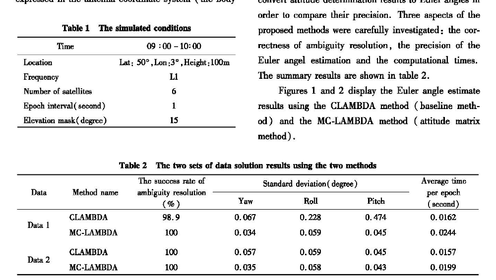
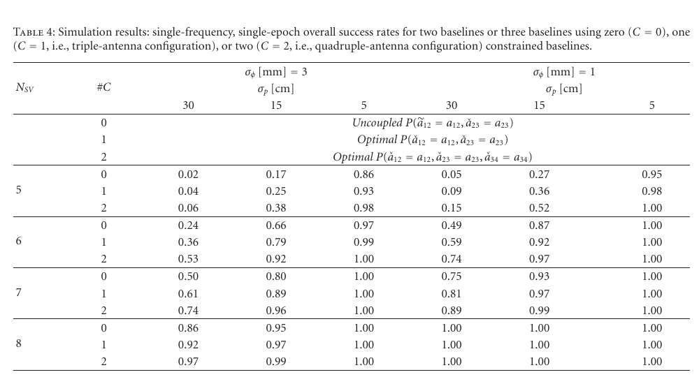
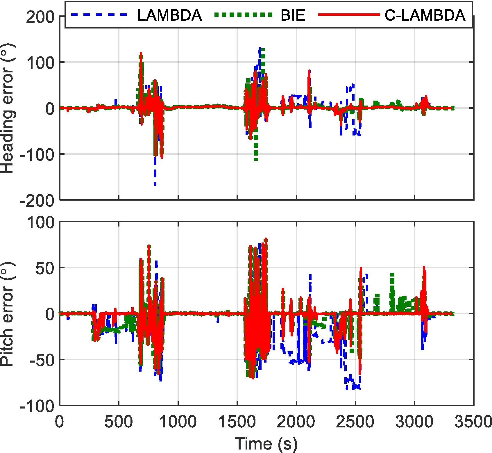

# 2026-08-22 GNSS 每日研究简报

## 今日快报

### 快报 1：把 GNSS 时间序列先搬到频域，强化学习才更容易分开长期规律与短时扰动

- 主题：`frequency-domain-drl-gnss-position-correction`
- 来源 ID：`doi:10.33012/navi.786`
- 来源链接：https://doi.org/10.33012/navi.786
- 发表日期：2026-08-17
- 来源类型：NAVIGATION 同行评审论文、频域状态序列增强的深度强化学习定位改正
- 获取范围：期刊元数据、官方完整摘要与同方法 ION GNSS+ 2025 会议版本的官方摘要；期刊正文未取得

**内容：** 作者把一段 GNSS 状态序列用离散时间傅里叶变换变到频域，增加一个辅助网络预测频域状态，再把长期趋势与短时扰动的表示交给深度强化学习策略做位置改正。它解决的是城市观测中多路径与遮挡随时间变化，而只在时域逐历元学习容易遗漏周期结构的问题。

**结论：** 官方摘要报告，在 Google Smartphone Decimeter Challenge 与广州 GNSS 数据上，相对模型驱动卡尔曼滤波定位精度约提高 18%，相对其所选数据驱动基线提高 6.5%。本期未取得期刊正文，不能审计训练/测试路线是否跨场景独立、百分比对应的具体误差指标、计算延迟或域外城市泛化；这些数字应视为作者在两套数据与既定基线上的报告。

**关注理由：** 频域特征可以让接收机显式看见周期多路径或慢变偏差，但它不是物理改正的替代品。工程复现应同时保存时域残差、频谱、路线切分与无学习卡尔曼基线，防止网络只记住道路或采样节奏。

### 快报 2：把闪烁指标从 100 秒缩到 1 秒，极光区短促的幅度闪烁才不会被平均掉

- 主题：`auroral-one-second-gnss-amplitude-scintillation`
- 来源 ID：`doi:10.1029/2025sw004885`
- 来源链接：https://doi.org/10.1029/2025SW004885
- 发表日期：2026-08
- 来源类型：Space Weather 同行评审论文、GNSS 阵列与极光成像联合观测
- 获取范围：Crossref 出版元数据与完整摘要；出版社全文本次未取得

**内容：** 研究用 1 s 闪烁指数重新检查此前由 100 s 指数认定为相位闪烁的极光时段，并将个例与同步极光图像对齐。方法针对的是高纬度幅度闪烁持续时间很短，长窗口平均会稀释峰值、把“没有看到”误写成“没有发生”。

**结论：** 摘要报告，单次相位和幅度闪烁大多短于 10 s；在先前按 100 s 指数识别出的相位闪烁时段中，29% 至少出现过一次幅度闪烁。个例显示衍射尺度结构与极光弧包和卷曲相关。正文未取得，因此本期不推断样本期数、事件独立性、接收机门限或 29% 的置信区间，也不把形态共现解释成唯一因果机制。

**关注理由：** 完整性与失锁评估依赖接收机真正经历的瞬时起伏。用分钟级指数驱动秒级跟踪环模型会漏掉尖峰，部署在高纬地区的监测站应并存原始高率幅相、1 s 指数和传统长窗指数。

### 快报 3：GNSS 与 Sentinel-1 共同约束裂谷几何，板块边界不必被预设成一条直线

- 主题：`krafla-gnss-insar-segmented-backslip`
- 来源 ID：`doi:10.1029/2026jb034040`
- 来源链接：https://doi.org/10.1029/2026JB034040
- 发表日期：2026-08
- 来源类型：JGR Solid Earth 同行评审论文、GNSS/InSAR 联合反演
- 获取范围：Crossref 出版元数据与完整摘要；摘要中的部分数学数值字段未正常下发，正文未取得

**内容：** 作者把 2002—2024 年 GNSS 长期速度场与 2015—2023 年 Sentinel-1 干涉图共同放入六段运动学 back-slip 模型，允许边界走向和锁固深度沿 Krafla 火山系统变化。它解决的是用一条直线、一个深度描述裂谷时，会把中央火山附近的局部流变与板块张裂混在一起。

**结论：** 摘要称优选边界穿过 Krafla 火山口中部并追随近期喷发裂隙，中央火山内及其南侧走向约 N1.2°—N10.8°E，北侧转为 NNW—SSE；锁固深度在火山口内及其北侧最浅。由于 Crossref 摘要漏失了扩张速率和部分深度数值，本期不补写这些字段，也不把残余垂向形变直接等同于岩浆体积变化。

**关注理由：** GNSS 的点状三维速度与 InSAR 的密集视线向形变互补，但参考框架、冰后均衡与大气残差都会进入构造解释。联合反演应公开先验、分段选择和不同轴线几何的后验敏感性。

### 快报 4：Galileo HAS 能改善无人机实时代码定位，但本次高程仍远弱于平面

- 主题：`galileo-has-uav-code-positioning`
- 来源 ID：`doi:10.12913/22998624/219009`
- 来源链接：https://doi.org/10.12913/22998624/219009
- 发表日期：2026-07-01
- 来源类型：同行评审开放论文、DJI Matrice 350 飞行实测与 Galileo HAS 改正
- 获取范围：CC BY 4.0 出版全文、处理链、图表和摘要

**内容：** 试验在 DJI Matrice 350 上安装 Septentrio Mosaic-X5，实时记录 HAS 的 SSR 改正；RTKLIB 用 GPS/Galileo 码观测、广播导航电文及转为 RTCM 的 HAS 改正计算 SPP，Emlid Studio 的双差载波相位轨迹作为参考。它检验的是不依赖地面差分链时，星基 HAS 对无人机实时代码定位能做到什么程度。

**结论：** 作者报告 HAS-SPP 的纬度、经度和椭球高分量 RMS 分别为 0.36 m、1.49 m 和 8.36 m。这里的经纬分量按论文报告保留，不能把角坐标名称误读为所有航向上的米级等方差；尤其 8.36 m 高程误差说明该配置尚不能支持需要可靠垂向间隔的航空任务。结果来自一次平台与处理链，也不是 HAS 的服务级保证。

**关注理由：** 星基改正“可收到”不等于三维位置“可用于安全控制”。无人机验收应分水平、垂向、连续性与中断恢复统计，并给 HAS 年龄、信号遮挡、码多路径和参考轨迹误差预算。

### 快报 5：对流层格网先分块稀疏化，再编码广播，远海用户不必下载整张全球模型

- 主题：`sparse-tropospheric-grid-broadcast`
- 来源 ID：`doi:10.1186/s43020-026-00210-2`
- 来源链接：https://doi.org/10.1186/s43020-026-00210-2
- 发表日期：2026-08-04
- 来源类型：Satellite Navigation 同行评审开放论文、对流层格网压缩—广播—按需重建
- 获取范围：CC BY 4.0 出版全文、算法、IGGtropS/VMF1 试验、图表与开放数据链接

**内容：** 方法用解析字典和分块稀疏表示替代需训练的字典，用 SAMP 估计稀疏系数、近零截断和二进制掩码编码压缩位置，再按用户所在格网只重建所需块。它把“模型压缩”接到类似 CLAS 的消息帧与用户端 ZTD 计算，目标是降低无网络地区的存储和星基广播负担。

**结论：** 作者在其设置下报告，IGGtropS 与动态 VMF1 的内存分别降低 63.49% 和 81.19%，重建 ZTD 的 RMSE 为 1.7 mm 和 2.1 mm；广播仿真将通信资源需求降低 50%，约 15 kbit/s 时全球 VMF1 约 30 s 传完。数字属于所选模型、稀疏门限、量化与帧设计，不能直接等同于 PPP 高程误差或实际链路可用率。

**关注理由：** 低带宽改正服务的瓶颈常在产品传输而非接收机算力。工程上应把重建 ZTD 误差继续传播到斜延迟和坐标，并测试丢包、版本切换与局部快速天气变化。

## 深度研读

### 深读 1｜接收机工程｜先解三条基线还是直接求姿态矩阵：两条 GNSS 定姿路线从哪里分叉

- 类别：`receiver-engineering`
- 学习层级：`foundation`
- 选题定位：`经典基础`
- 来源 ID：`doi:10.3724/sp.j.1246.2013.01016`
- 来源链接：https://doi.org/10.3724/SP.J.1246.2013.01016
- 发表日期：2013-02-01
- 来源类型：Geodesy and Geodynamics 同行评审开放论文、两类多天线 GPS 定姿仿真比较
- 获取范围：出版全文、公式、Tables 1—3 与 Figures 1—2；许可页标注开放获取，图表仅作最小研究评论摘录
- 价值评分：95/100（相关性 20，经典价值 21，证据 18，教学价值 20，工程价值 16）

#### 为什么先学这个

双天线航向并不是“两个 SPP 坐标相减”。真正有角度精度的是短基线载波双差，而载波先带着未知整数周。工程实现有两条路线：每条基线分别定整后再解旋转，或把全部基线和姿态矩阵一起放进一个混合整数问题。先看清这处分叉，才能理解后两节为什么要加入跨基线约束和车辆实测。

#### 先修知识

需要理解载波相位、星间与站间双差、整数模糊度、基线向量、旋转矩阵、欧拉角、LAMBDA、基线长度约束和正交矩阵。还要知道三维姿态至少需要两条不共线基线；双天线通常只能直接给航向与俯仰。

#### 一句话逻辑

基线法先用 C-LAMBDA 分别得到整数与基线，再用两坐标系中的基线拟合旋转；姿态法 MC-LAMBDA 则用已知天线阵列几何，把所有整数和正交姿态矩阵联合求解。

#### 研究问题与约束

论文比较代表两类方法的 C-LAMBDA 与 MC-LAMBDA。仿真采用 4 天线、3 条基线、6 颗 GPS、L1 单频、1 s 历元、15° 高度角截止；相位噪声 3 mm，码噪声分别 15 cm 和 9 cm，未注入多路径。结果回答的是理想静态高斯噪声下的算法结构差异，不代表车载城市环境。

#### 核心方法论

设 $`Y`$ 为多基线双差相位矩阵，$`A`$ 为整数模糊度矩阵，$`B`$ 为参考系中的基线矩阵，$`G`$ 为视线几何，$`R`$ 为从机体系到参考系的姿态矩阵。基线法逐列估计 $`A`$ 与 $`B`$，再做 Wahba/最小二乘旋转拟合；姿态法直接施加 $`B=RB_0`$ 与 $`R^TR=I`$，让不同基线互相约束整数候选。

#### 关键公式逐步推导

教学化双差载波矩阵模型为（$`G`$ 为视线几何，$`B_0`$ 为机体系基线矩阵）：

```math
Y=GRB_0+\lambda A+E,\qquad A\in\mathbb Z^{m\times q}
```

若机体系天线几何 $`B_0`$ 已标定，则 $`B=RB_0`$，且：

```math
R^TR=I,\qquad \det(R)=1
```

基线法先解 $`(\check A,\check B)`$，再求 $`\check R=\arg\min_{R\in SO(3)}\|\check B-RB_0\|_W^2`$；联合法则把整数残差与 $`SO(3)`$ 约束放进同一个目标函数。联合并不创造新观测，而是减少几何上不可能的候选。

#### 经典价值与创新边界

价值在于把“GNSS 定姿算法”拆成两类可对照的估计问题，并同时比较固定成功率、角度标准差和每历元时间。边界是仅有仿真、没有多路径和硬件偏差；论文数据 1 中的少数错误固定会制造巨大的欧拉角尖峰，恰好说明平均标准差不能替代定整可靠性。

#### 整体逻辑链

生成卫星几何与三条已知机体系基线；形成单频码相观测；构造浮点整数与协方差；分别运行 C-LAMBDA 或 MC-LAMBDA；固定整数；输出基线/姿态矩阵；转换为 yaw、roll、pitch；统计固定成功率、角度标准差和 CPU 时间；检查错误固定历元而不只看全段 RMS。

#### 原文图表与结果分析



> 图源：Wang Bing 等《Comparison of attitude determination approaches using multiple Global Positioning System (GPS) antennas》Tables 1—2，[DOI 原文](https://doi.org/10.3724/SP.J.1246.2013.01016)。由出版 PDF 第 5 页以 140 dpi 渲染后裁出完整表格、列名与相关试验说明；未重绘、改色或修改数值，仅作研究评论所需的最小摘录。

Table 2 的 Data 1 中，C-LAMBDA 固定成功率 98.9%，MC-LAMBDA 为 100%；前者 yaw/roll/pitch 标准差为 0.067°/0.228°/0.474°，后者为 0.034°/0.059°/0.045°。Data 2 两者都 100% 固定时，角度精度相近；MC-LAMBDA 每历元约 0.0199—0.0244 s，慢于 C-LAMBDA 的 0.0157—0.0162 s。表支持“联合约束主要在弱模型与错误固定时有价值”，不能证明所有数据上都显著更准。

#### 原文结果论述

作者指出 Data 1 的 C-LAMBDA 在 5 个历元固定到错误整数，而三条基线整体联合的 MC-LAMBDA 没有该问题；当码噪声降到 9 cm、两者都正确固定后，差距明显缩小。计算开销增加来自联合未知量和约束搜索，不是接收机前端成本。

#### 常见误区与适用边界

第一，把两个单点坐标相减当成载波短基线。第二，只用基线长度验收，却忽略多条基线之间的夹角。第三，看到固定率 98.9% 就忽略少数错误固定造成的百倍角度误差。第四，在双天线共线几何上声称完整三轴姿态。第五，把无多路径高斯仿真外推到城市车辆。

#### 工程实现步骤

1. 标定天线相位中心在机体系中的三维坐标与不确定度。
2. 对每系统选择参考星并构造完整双差协方差。
3. 先实现逐基线 C-LAMBDA，保存候选、比率与基线长度残差。
4. 再实现联合姿态约束，检查 $`R^TR-I`$ 与 $`\det R`$。
5. 用已知转台角或独立测量，而不是 GNSS 自身生成真值。
6. 分开记录正确固定、错误固定、拒绝输出与计算时延。

#### 复现实验设计

复现论文的 4 天线三基线几何，L1、1 Hz、6 颗星、15° 截止；码噪声扫 5—50 cm，相位噪声扫 1—10 mm，每档 10 万历元。比较逐基线 C-LAMBDA、MC-LAMBDA 和无约束 LAMBDA；指标为整数真值成功率、yaw/pitch/roll 误差的 95/99.9 分位、拒绝率和单历元时间。失败场景加入一条基线标定误差、多路径偏置与参考星切换。

#### 与定位及低成本实现的联系

多天线定姿不需要地面基站时，阵列自身的固定几何就是最重要的先验。低成本接收机的码噪声大，联合几何更有价值，但天线相位中心和不同接收机时钟也更难控制。下一节把“已知基线”扩展到两个移动平台之间的相对定位。

#### 本节小结

先解基线再求姿态简单快速，联合求姿态更能排除几何不可能的整数；两者差距最明显的地方不是正常历元的小数点后精度，而是弱模型下是否发生错误固定。

### 深读 2｜接收机工程｜已知短边怎样帮助未知长边：把多天线姿态约束传给跨平台相对定位

- 类别：`receiver-engineering`
- 学习层级：`intermediate`
- 选题定位：`基础进阶`
- 来源 ID：`doi:10.1155/2009/565426`
- 来源链接：https://doi.org/10.1155/2009/565426
- 发表日期：2009-11-08
- 来源类型：International Journal of Navigation and Observation 同行评审开放论文、三/四天线跨平台整数估计理论与仿真
- 获取范围：CC BY 出版全文、公式、Figures 1—4 与 Tables 1—4
- 价值评分：97/100（相关性 20，经典价值 22，证据 19，教学价值 19，工程价值 17）

#### 为什么先学这个

上一节所有天线都固定在同一刚体上。若两辆车、两架无人机或加油机—受油机各自只有一条已知短基线，而平台间基线未知，能否让短边的整数与长度约束帮助难解的跨平台长边？这一步把“GNSS 罗盘”推进到协同相对定位。

#### 先修知识

需要掌握短基线双差、整数最小二乘、条件协方差、基线长度约束、三/四天线构型、成功概率与噪声传播。还要区分受约束基线和未知长度基线，并理解相关性决定信息能否在两者之间传递。

#### 一句话逻辑

先用平台内部的已知基线约束其整数，再通过共享天线与协方差把整数改正传给平台间未知基线；两侧各有一条已知短边时，未知中间边得到最强约束。

#### 研究问题与约束

论文推导三天线与四天线的最优整数最小二乘、向量 bootstrapping 和完全解耦解，并用单频单历元仿真比较。设基线均为 2 m、5—8 颗卫星、码噪声 5/15/30 cm、相位噪声 1/3 mm，每格 10 万样本；忽略多路径与显著大气差，因此是方法强度测试而非动态实车验证。

#### 核心方法论

三天线时，平台 1 的 $`b_{12}`$ 长度已知，跨平台 $`b_{23}`$ 未知。联合解同时搜索 $`a_{12},a_{23}`$；四天线时另一平台再提供已知 $`b_{34}`$，未知 $`b_{23}`$ 同时受两侧条件改正。近似 bootstrapping 先定已知短边，再条件更新未知边，降低完整联合搜索成本。

#### 关键公式逐步推导

对未知边的浮点估计 $`\hat b_{23}`$，若一侧已知边给出改正，可写成教学化条件更新：

```math
\hat b_{23}(a_{23},b_{12})
=\hat b_{23}(a_{23})+\frac{1}{2}\left[\hat b_{12}(a_{12})-b_{12}\right]
```

两侧都有已知边时再加入 $`b_{34}`$ 的条件项。完整整数问题为：

```math
(\check a,\check b)=\arg\min_{a\in\mathbb Z^n,\ \|b_{12}\|=l_{12},\ \|b_{34}\|=l_{34}}
\left\|\begin{bmatrix}\hat a-a\\\hat b-b\end{bmatrix}\right\|_Q^2
```

论文给出的条件方差缩放说明，一侧约束可把未知边相关项的方差降到原来的约 $`3/4`$，两侧约束可进一步到约 $`1/2`$；这是给定模型下的协方差结果，不是任意几何的固定常数。

#### 经典价值与创新边界

经典价值是把姿态与相对定位从两个独立解算器变成一个可证明的信息传递模型，并说明低相关时近似 bootstrapping 几乎等于完整 ILS。边界是模拟基线仅 2 m、无大气和多路径，论文也明确把真实移动平台、遮挡和长基线残余误差留作未来工作。

#### 整体逻辑链

定义平台和天线拓扑；标记已知/未知基线；形成各基线浮点整数与协方差；对已知边运行基线约束 LAMBDA；按共享天线相关性条件更新未知边；运行联合或 bootstrapping 整数搜索；输出平台间相对向量；统计各基线与整体同时正确的成功率。

#### 原文图表与结果分析



> 图源：Buist、Teunissen、Giorgi 与 Verhagen《Multiplatform Instantaneous GNSS Ambiguity Resolution for Triple- and Quadruple-Antenna Configurations with Constraints》Table 4，[DOI 原文](https://doi.org/10.1155/2009/565426)，CC BY。由出版 PDF 第 12 页以 140 dpi 渲染后裁出完整表格及标题；未重绘、改色或修改数值。

表的横向条件是相位噪声 3/1 mm 与码噪声 30/15/5 cm，纵向为可见星数 $`N_{SV}`$ 和已知约束边数 $`C`$。最弱的 5 星、3 mm 相位、30 cm 码条件下，整体成功率从无约束的 0.02 提高到一侧约束 0.04、两侧约束 0.06；同为 5 星、3 mm、5 cm 码时则从 0.86 提高到 0.93 和 0.98。收益在弱模型更明显，但绝对成功率仍可能不足以安全使用。

#### 原文结果论述

作者总结，单侧约束对未知边成功率的改善在仿真中约 0—13 个百分点，两侧约束约 0—30 个百分点；整体同时正确的提升分别约 0—13 和 0—29 个百分点。最优 ILS 与向量 bootstrapping 最大经验差仅 0.1 个百分点，原因是所设基线间相关性低；这不是高相关构型下的普遍等价证明。

#### 常见误区与适用边界

第一，把已知边长度误差设为零。第二，认为多一根天线必然提高所有基线。第三，只看单条边固定成功，不看全部边同时正确。第四，低相关仿真中近似解接近最优，就取消完整协方差。第五，把 2 m、无大气仿真外推到公里级编队。

#### 工程实现步骤

1. 用图结构登记天线节点、已知短边和未知跨平台边。
2. 对时间同步、接收机间偏差和共享参考星建完整协方差。
3. 给已知长度设置测量方差而非硬编码绝对真值。
4. 先实现联合 ILS 作为离线基准，再评估 bootstrapping。
5. 每历元输出单边成功代理与整体联合验收量。
6. 平台拓扑变化时重建参数化，避免沿用旧整数。

#### 复现实验设计

复现 Table 4 的 5—8 星、1/3 mm 相位、5/15/30 cm 码噪声，每格 10 万蒙特卡洛样本；比较 $`C=0,1,2`$ 及联合/bootstrapping。再加入 1 cm 短边标定误差、0.1—2 km 跨平台距离、相关多路径和 10 ms 时间偏差。指标为单边及整体整数真值成功率、相对位置 99.9 分位、搜索节点数和延迟。

#### 与定位及低成本实现的联系

已知短边是无需外部基础设施的“物理先验”，可以帮助两平台相对定位；但低成本硬件的独立时钟、天线相位中心和同步误差可能比理论增益更大。下一节回到一辆车，检验 1.5 m 双天线和现成接收机在真实遮挡中能否把这类约束变成稳定航向。

#### 本节小结

已知短边能通过整数—基线相关性帮助未知跨平台边；两侧都有短边时模型更强，但信息增益取决于协方差、噪声和几何，不能只按天线数量计数。

### 深读 3｜定位｜1.5 米低成本双天线：基线长度约束怎样把错误整数挡在航向解之外

- 类别：`positioning`
- 学习层级：`advanced`
- 选题定位：`定位专题：双天线定向`
- 来源 ID：`doi:10.1016/j.measurement.2024.115492`
- 来源链接：https://doi.org/10.1016/j.measurement.2024.115492
- 发表日期：2024-08-12
- 来源类型：Measurement 同行评审论文、低成本独立接收机双天线车载实测
- 获取范围：出版社完整摘要、方法/试验/结果章节文本及原始高分辨率 Figures 1—15；出版 PDF 需订阅
- 价值评分：96/100（相关性 20，经典价值 18，证据 19，教学价值 19，工程价值 20）

#### 为什么先学这个

前两节说明联合几何为何能提高定整可靠性，但都以理想仿真为主。本节使用两台独立、现成低成本接收机和 1.50 m 车顶基线，在开阔、静止、动态与密集社区路线中比较普通 LAMBDA、C-LAMBDA 和 BIE，回答约束在真实遮挡里是否仍有用。

#### 先修知识

需要理解双差码相模型、独立接收机时钟、基线向量到航向/俯仰的变换、LAMBDA/C-LAMBDA、BIE、比率检验、广播星历、Saastamoinen/Klobuchar 改正、SNR 与共同可见卫星。

#### 一句话逻辑

先由双差码相得到浮点基线与整数，再把实测基线长度 $`l=1.50\ \mathrm m`$ 作为二次约束重排整数候选；只有通过定整与几何一致性检查的基线才转换为航向和俯仰。

#### 研究问题与约束

论文关注不共钟的两个独立低成本接收机。车载路线同时包含开阔与密集社区、静止和动态区段；低于 10° 或 SNR 小于 25 dB-Hz 的卫星暂不使用，比率阈值取 2。参考路线与误差分段受一次车辆、天线安装和 Calgary 路线约束，摘要的相对改进不能外推为安全等级。

#### 核心方法论

对同一卫星和参考星做站间—星间双差，接收机与卫星钟被消除，短基线大气项大幅抵消。无约束 LAMBDA 在浮点整数协方差中找最邻近整数；C-LAMBDA 在候选搜索中同时要求固定后基线长度接近实测 $`l`$；BIE 不硬选单一整数，而对多个候选按后验权重平均，降低错误固定代价但可能保留偏差。

#### 关键公式逐步推导

双差载波模型可写为：

```math
\lambda\nabla\Delta\phi^{ij}=({u}^{i}-{u}^{j})^Tb+\lambda\nabla\Delta N^{ij}+\varepsilon_\phi^{ij}
```

码双差提供较噪的绝对尺度，载波提供毫米级但含整数。浮点解 $`(\hat b,\hat a)`$ 后，无约束整数为：

```math
\check a=\arg\min_{a\in\mathbb Z^n}\|\hat a-a\|_{Q_{\hat a}}^2
```

C-LAMBDA 增加：

```math
\|b(a)\|_2=l,\qquad l=1.50\ \mathrm m
```

固定基线在 ENU 中的航向和俯仰为 $`\psi=\operatorname{atan2}(b_E,b_N)`$、$`\theta=\operatorname{atan2}(b_U,\sqrt{b_E^2+b_N^2})`$。角误差近似与横向基线误差成正比、与长度 $`l`$ 成反比。

#### 经典价值与创新边界

工程价值在于使用非共钟低成本设备、广播模型和真实车辆路线，并把普通整数、约束整数与 BIE 放在同一数据上比较。创新边界是基线长度约束本身并非新概念；论文贡献更多在面向低成本双天线的实现与场景评估。出版全文需订阅，本期只使用出版社可审计的章节文本、摘要和原始图。

#### 整体逻辑链

同步两接收机 RINEX；按高度角/SNR 选共同卫星；用广播星历与大气模型改正；构造双差码相与协方差；求浮点基线/整数；分别运行 LAMBDA、BIE、C-LAMBDA；应用比率与基线长度检查；转换航向/俯仰；按静止、开阔动态和密集社区分段统计。

#### 原文图表与结果分析



> 图源：Ding 等《Low-cost dual-antenna GNSS-based heading and pitch angles estimation considering baseline length constraint》Figure 13，[DOI 原文](https://doi.org/10.1016/j.measurement.2024.115492)。直接取得出版社保存的原始高分辨率 JPEG 并无损转为 PNG；未裁剪、重绘、改色或修改坐标、图例与数值。出版社未标示开放许可，本摘录限于最小研究评论，不主张再分发权。

横轴是全程时间 0—约 3350 s，纵轴分别是航向与俯仰误差（°）；蓝虚线、绿点线、红实线对应 LAMBDA、BIE、C-LAMBDA。约 650—900 s 与 1550—1800 s 三种方法都出现大误差，说明遮挡或几何退化不是长度约束可以凭空修复；约 2000—2600 s，C-LAMBDA 多数时刻比普通 LAMBDA 的持续偏差小。图不能证明红线所有历元最优，也不能把错误固定尖峰纳入“通常小于 5°”的正常固定解表述。

#### 原文结果论述

摘要报告，相对不使用基线长度约束的经典方法，所提方法在不同观测条件下的姿态角精度改善为 16.7%—84.0%，通过整数固定的姿态解误差主要小于 5°。章节文本显示结果按 SPP、浮点、固定状态和场景分段；这些是相对改进区间，不是 5° 完整性界或每历元保证。

#### 常见误区与适用边界

第一，认为长度正确就说明方向正确，球面上仍有大量同长度候选。第二，用普通 LAMBDA 比率阈值直接验收 C-LAMBDA，却不校准其统计分布。第三，把固定解“多数小于 5°”写成所有历元。第四，忽略两接收机时间同步。第五，天线安装不沿车体纵轴却不做杆臂/安装角标定。第六，在少于足够共同卫星时强行输出。

#### 工程实现步骤

1. 多次测量天线相位中心间距，并给长度先验设置方差。
2. 标定基线相对车体纵轴的安装角和高度差。
3. 对两接收机做时间标签、半周标志和系统间偏差一致性检查。
4. 同时保存无约束、C-LAMBDA 与 BIE 候选及残差。
5. 将固定验收、长度残差、共同星数和几何条件组合成状态机。
6. 失效时明确输出不可用，而不是沿用最后一个航向。

#### 复现实验设计

在车顶布置 0.3/0.5/1.0/1.5 m 四种基线，使用两台低成本双频接收机，10 Hz 采样；路线含静止、开阔直行、低速转弯、树荫、街谷和高架。比较 LAMBDA、C-LAMBDA、BIE 与双天线商业真值；指标为航向/俯仰 50/95/99.9 分位、正确固定率、错误固定率、拒绝率、首个可靠航向时间和 CPU 延迟。失败注入包括 1—5 cm 长度误标、10—50 ms 时间偏差、单天线周跳和相位中心温漂。

#### 与定位及低成本实现的联系

双天线航向静止时仍可观，不依赖车辆速度，是低成本 MEMS 航向漂移的重要绝对约束。但 GNSS 只提供沿基线的两自由度，不能替代完整姿态系统；安全应用还需把整数错误概率、遮挡拒绝与惯导桥接统一建模。

#### 本节小结

1.5 m 物理长度先验能显著压缩低成本双天线的整数候选，但它只能提高弱模型的可辨识性，不能修复没有共同卫星、严重多路径或错误标定；可靠航向必须允许拒绝输出。
