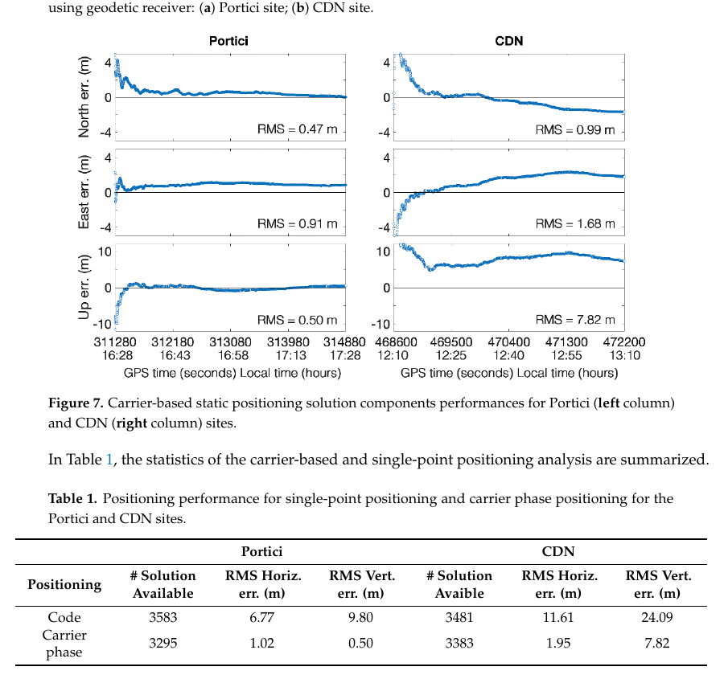
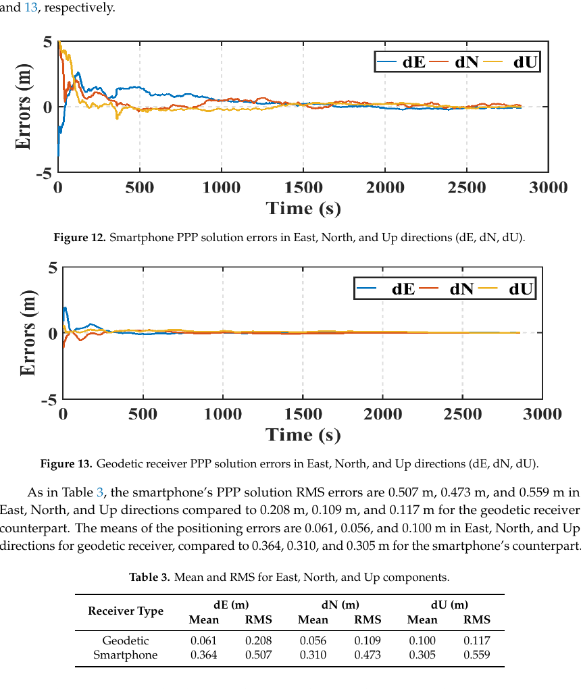
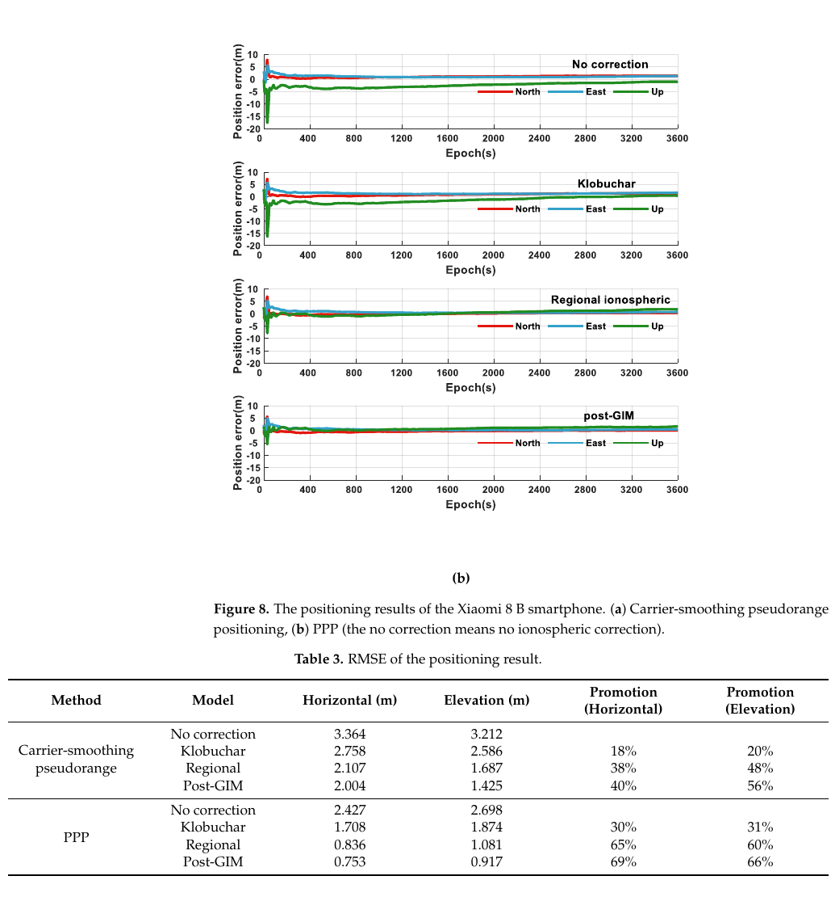

# 2026-08-23 GNSS 每日研究简报

## 今日快报

### 快报 1：VRS 没把完整协方差交给用户时，把多站观测集中估计可避免次优定权

- 主题：`centralized-uduc-network-rtk-covariance`
- 来源 ID：`doi:10.1088/1361-6501/ae9cd3`
- 来源链接：https://doi.org/10.1088/1361-6501/ae9cd3
- 发表日期：2026-08-21
- 来源类型：Measurement Science and Technology 同行评审论文、集中式多参考站 RTK
- 获取范围：出版社元数据与完整摘要；正文在本次获取中未取得

**内容：** 传统 VRS 把多站网络压成用户附近的虚拟观测，却不一定把虚拟观测误差的完整协方差一并下发。作者提出未差分、非组合的集中式 RTK，把参考站与用户观测放在同一估计框架内，直接保留站间相关性；它针对的是通信和算力充足、垂向精度又对随机模型敏感的应用。

**结论：** 摘要称蒙特卡洛和多类实测均显示集中式方案优于其传统对照，并且网络越大，利用完整协方差的收益越明显；摘要还报告更快的模糊度固定趋势。由于正文未取得，本期不转述摘要中的百分比区间，也不能审计参考站产品、协方差失配注入、固定验收或动态真值定义；“最优”只在高斯噪声且协方差正确指定的前提下成立。

**关注理由：** 网络 RTK 的信息损失不只发生在改正数插值，也发生在协方差被压扁时。工程对照应让 VRS、MAC 与集中式方法使用同一观测、同一固定门限，并分别统计整数正确率、垂向长尾和链路负载。

### 快报 2：先离线寻找噪声尺度，再用 Student-t 权重压住重尾伪距创新

- 主题：`student-t-qpso-ekf-heavy-tail-gps`
- 来源 ID：`doi:10.3390/app16168336`
- 来源链接：https://doi.org/10.3390/app16168336
- 发表日期：2026-08-21
- 来源类型：Applied Sciences 同行评审开放论文、GPS 伪距重尾噪声仿真
- 获取范围：CC BY 4.0 出版全文、公式、仿真设置、消融对照与图表

**内容：** ST-QPSO-EKF 用量子行为粒子群在离线标定阶段联合搜索过程噪声尺度、测量噪声尺度和 Student-t 自由度；在线阶段按归一化创新生成稳健权，异常伪距越不符合名义模型，等效测量方差越大。论文用常规 EKF、只调协方差的 QPSO-EKF 和只做 Student-t 更新的滤波器分开对照。

**结论：** 20 次独立蒙特卡洛中，作者报告 ST-QPSO-EKF 在 Student-t 重尾和离群污染场景的位置 RMSE 分别为 3.814 m 与 3.952 m；QPSO 在高斯场景更有利，而 Student-t 门控在非高斯场景发挥主要作用。全部证据来自非线性 GPS 仿真，卫星位置、噪声分布和离线调参数据均由作者设定，不能视为城市实测泛化或持续在线自适应证据。

**关注理由：** 稳健滤波常把“权重函数”和“协方差调参”混为一个黑盒。这篇工作用消融揭示两者作用不同；接收机复现还应加入真实 NLOS 偏差、相关多路径和未见城市，检查离线最优参数是否跨域失效。

### 快报 3：GNSS-RTK 可穿戴能复现累计跑动量，高速小样本指标仍最不稳定

- 主题：`gnss-rtk-dual-imu-wearable-agreement`
- 来源 ID：`doi:10.21203/rs.3.rs-10556619/v1`
- 来源链接：https://doi.org/10.21203/rs.3.rs-10556619/v1
- 发表日期：2026-08-14
- 来源类型：Research Square CC BY 4.0 预印本、GNSS-RTK/双 IMU 足球可穿戴系统验证
- 获取范围：预印本全文、方法、统计表与结果；尚未经过同行评审

**内容：** 30 名受训男性运动员在专项练习、模拟比赛和比赛场景中同时佩戴 GNSS-RTK/双 IMU 系统与商业 10 Hz GNSS。作者用配对检验、相关、Bland–Altman 和设备间 ICC/TEM 分别审计系统间一致性与同型设备可靠性，而不是只报告一条相关系数。

**结论：** 全文报告可见星数 9—14、HDOP 不高于 1.5；总距离、峰值速度和高速跑距离的相关系数为 0.89、0.84、0.81，而极高速跑距离降到 0.65，后者的典型误差为 11.2%—13.2%。这些是对另一套场地 GNSS 的一致性而非独立光学真值；预印本、单一人群、开阔卫星条件和速度区间样本量限制了外推。

**关注理由：** 厘米级 RTK 坐标并不自动保证由轨迹派生的“冲刺次数”可靠。应用层验收应把位置、速度阈值穿越、采样率、滤波延迟和设备间差异逐级传播，尤其警惕样本稀少的高强度指标。

### 快报 4：把 PPP-B2b 与 Galileo HAS 的互补星座放进同一 OSB 估计，用户端才有条件实时定整

- 主题：`ppp-b2b-has-integrated-phase-osb-ppp-ar`
- 来源 ID：`doi:10.1088/1361-6501/ae92a2`
- 来源链接：https://doi.org/10.1088/1361-6501/ae92a2
- 发表日期：2026-08-17
- 来源类型：Measurement Science and Technology 同行评审论文、卫星播发改正融合与实时 PPP-AR
- 获取范围：出版社元数据与完整摘要；正文在本次获取中未取得

**内容：** 作者先把 BDS-3 PPP-B2b 与 Galileo HAS 的实时轨道、钟改正统一基准，再用亚太参考站联合估计多频相位 OSB，构造 BDS-3/GPS/Galileo 的紧组合 PPP-AR。目标是让用户只接收卫星播发改正，在无地面数据链地区也能恢复模糊度整数性。

**结论：** 摘要基于 10 天、21 个参考站估 OSB，并用 11 个流动站验证；其四种方案中，PPP-B2b 的 BDS-3/GPS 加 HAS Galileo 组合表现最好。正文未取得，因此本期不复述摘要的厘米数与收敛百分比，也不审计固定错误率、重启策略、参考站独立性或 HAS GPS 中断的具体分布；证据仍属于所选亚太日期与站网。

**关注理由：** PPP-AR 的瓶颈不仅是轨道和钟，还包括与其基准一致的相位偏差。融合服务前必须先统一时间、坐标与偏差约定，再用独立用户站统计错固定，而不能只把更多星座拼进滤波器。

### 快报 5：太阳能 GPS 耳标的瓶颈同时在收星、回传和充电，三者不能用一条“续航”概括

- 主题：`solar-gps-lorawan-ear-tag-field-performance`
- 来源 ID：`doi:10.21203/rs.3.rs-10729693/v1`
- 来源链接：https://doi.org/10.21203/rs.3.rs-10729693/v1
- 发表日期：2026-08-18
- 来源类型：Research Square CC BY 4.0 预印本、静态控制点与野生动物部署试验
- 获取范围：预印本全文、静态与活体试验、统计模型、图表和伦理说明；尚未经过同行评审

**内容：** 研究在得州两处样地沿 LoRaWAN 网关距离梯度布设太阳能 GPS 耳标，用厘米级参考坐标计算水平误差，并联合建模木本覆盖、网关距离、电池电压和固定成功；随后给 10 只领西猯部署耳标，检验静态台架结论是否能穿过真实栖息行为。

**结论：** 两处静态固定成功率为 58.2% 与 51.2%，平均水平误差 21.7 m 与 26.9 m；活体部署中 1 枚未回传，其余 9 枚仅回传 3—7 天，平均固定成功率 41.0%，随后电压下降、传输停止。结果来自预印本、单一设备型号、两处灌木环境和小时级采样；“没收到点”还不能仅归因于 GNSS，因为充电与 LoRaWAN 回传也会造成缺测。

**关注理由：** 低功耗 GNSS 系统的可用率是捕获、定位、存储、回传与能源链的乘积。部署前应分别记录 fix attempt、有效坐标、排队消息、网关接收和电压，避免把非随机缺测误当成动物不在场。

## 深度研读

### 深读 1｜低成本与移动端｜E5a 抗多路径不是万能药：先看清手机观测、天线与环境的误差账

- 类别：`low-cost-mobile`
- 学习层级：`foundation`
- 选题定位：`经典基础`
- 来源 ID：`doi:10.3390/electronics8010091`
- 来源链接：https://doi.org/10.3390/electronics8010091
- 发表日期：2019-01-15
- 来源类型：Electronics 同行评审开放论文、小米 8 双频多系统观测质量与定位实测
- 获取范围：CC BY 4.0 出版全文、公式、两处一小时数据、全部图表与 Tables 1
- 价值评分：96/100（相关性 20，经典价值 19，证据 19，教学价值 20，工程价值 18）

#### 为什么先学这个

“手机支持双频”只说明芯片能输出 L1/E1 与 L5/E5a，不说明天线能像测地天线一样抑制反射，也不说明载波连续到可以安全定整。本节先把 C/N₀、码多路径、占空比、单点定位和浮点载波相对定位放到同一试验里，为后两节 PPP 与区域电离层改正建立观测边界。

#### 先修知识

需要理解伪距、载波相位、C/N₀、多路径、双频电离层色散、单点定位、站星双差、模糊度、RMS/DRMS、截止高度角与占空比。还要区分芯片跟踪能力和整机天线性能；手机线极化、人体与安装姿态会改变所有信号的幅相。

#### 一句话逻辑

在低多路径与城市峡谷各采一小时双频原始观测，用双频码相组合估计逐星码多路径，再用统一模型比较码 SPP 与单频浮点相对定位，观察环境而非“频点标签”如何控制最终误差。

#### 研究问题与约束

论文使用一台 Xiaomi Mi 8、1 Hz、一小时数据，Portici 为相对低多路径，Naples CDN 为建筑包围的强多路径。测地接收机与手机天线、可跟踪信号并不完全同构；载波相对定位因基站限制只能用 GPS L1，且得到浮点解。两次单日静态试验不能代表所有手机、持握姿态或动态城市路线。

#### 核心方法论

rinexON 输出 RINEX 3.03；TEQC 双频组合估码多路径并用 900 样本滑动平均去常数项；RTKLIB 用广播星历、Klobuchar 与 Hopfield 计算码 SPP。载波方案把手机当静态流动站，接入 Campania CORS，以单频 GPS、瞬时模糊度策略求浮点相对位置。另写同模型程序比较 Galileo E1 与 E5a 码定位。

#### 关键公式逐步推导

忽略高阶小项后，双频码相可把几何距离、钟和一阶电离层消去，得到含码多路径与常数的组合。论文对频率 1、5 写成：

```math
mp_1=P_1-\left(1+\frac{2}{\alpha-1}\right)\lambda_1\phi_1
+\frac{2}{\alpha-1}\lambda_5\phi_5,
\qquad \alpha=\left(\frac{f_1}{f_5}\right)^2
```

$`mp_1`$ 仍包含码噪声、模糊度与硬件常数，故论文用长窗去均值；它是“多路径加噪声代理”，不是可直接逐历元扣除的真多路径。

#### 经典价值与创新边界

价值在于较早把量产双频手机的双频原始量、城市多路径和真实定位放在一条证据链上，并揭示没有占空比不等于相位可以定整。边界是设备与数据很少，且码、多路径与天线方向图没有独立暗室真值；E5a 的优势同时受调制、带宽、可见星与几何影响。

#### 整体逻辑链

检查可见星与 C/N₀；构造双频码相多路径组合；按场景比较手机与测地接收机；用统一改正做 GPS-only 与多系统码 SPP；再做单频浮点相对定位；最后把误差按环境、观测类型和频点拆开，而不把所有收益归给“双频”。

#### 原文图表与结果分析



> 图源：Robustelli、Baiocchi 与 Pugliano《Assessment of Dual Frequency GNSS Observations from a Xiaomi Mi 8 Android Smartphone and Positioning Performance Analysis》Figure 7 与 Table 1，[DOI 原文](https://doi.org/10.3390/electronics8010091)，CC BY 4.0。由出版 PDF 第 10 页以 140 dpi 渲染，裁出完整六分量时序、图题与汇总表；未重绘、改色或修改标签与数值。

左列 Portici、右列 CDN；横轴为 GPS 秒/本地时间，纵轴依次为北、东、天误差（m）。载波浮点解在 Portici 的北/东/天 RMS 为 0.47/0.91/0.50 m，在 CDN 为 0.99/1.68/7.82 m；同页表中码解水平/垂直 RMS 从 6.77/9.80 m 恶化到 11.61/24.09 m。环境变化对垂向尤其致命，图不能证明浮点载波已达到厘米级，也不能分离天线与卫星几何的贡献。

#### 原文结果论述

论文报告 Portici 的 GPS/Galileo E1 多系统 SPP 水平 2DRMS 为 5.36 m，Galileo E5a 的最佳水平 DRMS 为 4.57 m；静态单频载波相对定位的水平 2DRMS 在两处分别为 1.02 m 与 1.95 m。作者把改善归因于 E5a 更好的码多路径表现与载波连续性，但仍明确只有浮点解，城市 CDN 的垂向漂移很大。

#### 常见误区与适用边界

第一，把“无占空比”写成“无周跳”。第二，把 E5a 码优于 E1 外推为所有接收机。第三，把浮点相对定位叫 RTK 固定。第四，忽略两场景日期、星座与几何不同。第五，把多路径组合当独立真值。第六，只报水平平均，掩盖 7.82 m 垂向 RMS。

#### 工程实现步骤

1. 保存 Android 时钟状态、ADR 状态、C/N₀、AGC、码与相位，不只导出 PVT。
2. 按设备、信号和天线姿态绘制 C/N₀—仰角与断弧统计。
3. 双频组合前检查频率、波长、硬件延迟和周跳。
4. 用低/高多路径固定点做 SPP、浮点与固定解分层统计。
5. 分别输出 ENU、3D、可用率、断弧与错误固定，禁止只给平均水平误差。
6. 外接天线对照时记录馈线、相位中心和手机 RF 路径变化。

#### 复现实验设计

选三款现代双频手机与一台低成本板卡、一个测地接收机；在开阔、树下、单侧建筑和峡谷各采 2 h、1 Hz，手机平放/手持/口袋三姿态。比较 E1/L1、E5a/L5、双频 IF、多系统码 SPP 与单频/双频浮点相对定位；指标为逐信号 C/N₀、断弧率、码多路径代理、ENU RMS/95 分位和固定错误率。基线为同天线板卡与测地接收机；失败场景包括温升、屏幕开关、占空比恢复、三秒缺测和参考星切换。

#### 与定位及低成本实现的联系

手机 PPP 的核心难点不是是否能写出观测方程，而是相位连续、码权可信、天线偏差稳定。下一节将同一类双频手机放入完整 PPP：即使精密轨道钟和 IF 组合齐全，观测质量仍决定收敛时间和误差下限。

#### 本节小结

双频增加了抗电离层和选优空间，却没有消除天线多路径与载波断裂；先审计原始观测，才有资格谈 PPP 或定整。

### 深读 2｜低成本与移动端｜精密产品不是魔法：手机双频 PPP 为什么仍慢于测地接收机

- 类别：`low-cost-mobile`
- 学习层级：`intermediate`
- 选题定位：`基础进阶`
- 来源 ID：`doi:10.3390/s19112593`
- 来源链接：https://doi.org/10.3390/s19112593
- 发表日期：2019-06-06
- 来源类型：Sensors 同行评审开放论文、Xiaomi Mi 8 GPS/Galileo 事后与实时 PPP
- 获取范围：CC BY 4.0 出版全文、公式、两套静态/运动试验与 Figures 12—25
- 价值评分：97/100（相关性 20，经典价值 19，证据 20，教学价值 19，工程价值 19）

#### 为什么先学这个

上一节看到载波连续和 E5a 码更干净，但相对定位依赖附近基站。本节取消本地基站改正，使用精密轨道、钟和双频 IF 组合做 PPP，直接检验同一算法在手机与 Trimble R9 上为何有不同收敛和稳态误差。

#### 先修知识

需要理解双频 IF、精密轨道钟、DCB、卫星/接收机天线相位中心、相位缠绕、对流层天顶湿延迟、系统间偏差 ISB、浮点模糊度、EKF 和 C/N₀ 定权。还要区分 PPP 内部形式精度、相对 DGNSS 参考坐标和真正独立地面真值。

#### 一句话逻辑

将手机 GPS L1/L5 与 Galileo E1/E5a 形成未差分 IF 码相观测，施加 MGEX 或 NAVCAST 精密产品，在同一个 EKF 中估位置、钟、ZWD、ISB 与浮点模糊度，并用 C/N₀ 降低弱手机观测的权。

#### 研究问题与约束

两套数据来自 Toronto 开阔环境；基站三小时，R9 流动站和手机各约一小时，手机水平放在测量基座上。手机精确天线参考点未知，因此作者用各自 DGNSS 结果作 PPP 对照。实时产品是当时的 NAVCAST，现代产品与星座状态已不同；短时开阔静态结果不能代表手持城市 PPP。

#### 核心方法论

GPS/Galileo 码相先形成双频 IF；GPS C1/L5 与产品 L1/L2 码钟基准不一致时施加 DCB 转换。对流层干项用 Saastamoinen，湿映射用 VMF/GPT2w；另改正相对论、Sagnac、相位中心、潮汐、海潮负荷和相位缠绕。EKF 静态位置与模糊度作常数，钟、ZWD、ISB 作随机游走，码相方差按 C/N₀ 建模。

#### 关键公式逐步推导

双频 IF 系数为：

```math
P_{IF}=\frac{f_1^2P_1-f_5^2P_5}{f_1^2-f_5^2},\qquad
\Phi_{IF}=\frac{f_1^2\Phi_1-f_5^2\Phi_5}{f_1^2-f_5^2}
```

施加精密产品后，GPS/Galileo 的教学化观测为：

```math
\begin{aligned}
P_{IF}^{s}&=\rho^s+b_r+m_w^sZWD+ISB^s+\varepsilon_P^s,\\
\Phi_{IF}^{s}&=\rho^s+b_r+m_w^sZWD+ISB^s+\widetilde N_{IF}^s+\varepsilon_\Phi^s.
\end{aligned}
```

$`ISB^s`$ 对 GPS 为零、对 Galileo 估计；$`\widetilde N_{IF}`$ 吸收硬件偏差，因此本研究保持浮点。

#### 经典价值与创新边界

价值在于较早证明量产双频手机可以进入完整事后/实时 PPP，并用同场测地接收机揭示“产品相同、观测端不同”。边界是开阔静态、未知手机天线参考点、短数据和无整数固定；厘米级宣传不能从测地接收机结果转移给手机。

#### 整体逻辑链

RINEX 质检；按 C/N₀ 建权；形成 GPS/Galileo IF；对齐精密钟的码偏差基准；施加地球物理和天线改正；EKF 估位置/钟/ZWD/ISB/浮点模糊度；用各自 DGNSS 坐标生成 ENU 误差；比较手机与 R9、事后与实时、静态与模拟运动模式。

#### 原文图表与结果分析



> 图源：Elmezayen 与 El-Rabbany《Precise Point Positioning Using World’s First Dual-Frequency GPS/GALILEO Smartphone》Figures 12—13 与 Table 3，[DOI 原文](https://doi.org/10.3390/s19112593)，CC BY 4.0。由出版 PDF 第 9 页以 140 dpi 渲染，裁出两幅完整 ENU 时序、图题、作者论述与汇总表；未重绘、改色或修改数值。

横轴为 0—约 3000 s，纵轴为东、北、天误差（m）。手机初始误差约数米并缓慢收敛，测地接收机更快贴近零；表中手机 E/N/U RMS 为 0.507/0.473/0.559 m，R9 为 0.208/0.109/0.117 m。图支持“同一 PPP 链下前端质量决定收敛”，但参考是各自 DGNSS 解，不能独立证明绝对坐标真值。

#### 原文结果论述

作者在静态事后 PPP 报告上述分量 RMS，并指出 R9 东向约 8 min 达到 0.2 m，而手机约需 25 min；实时静态仍达到分米级，运动处理为米级。这里“运动”来自其试验处理设置和短数据，且 NAVCAST、MGEX 产品质量与今天不同；结果不等于任意实时手机可持续分米。

#### 常见误区与适用边界

第一，用 IF 消电离层后忽略噪声放大。第二，混用 L1/L2 产品钟与 L1/L5 手机码而不做 DCB 基准转换。第三，GPS/Galileo 共用钟却漏估 ISB。第四，把手机外壳几何中心当相位中心。第五，用 DGNSS 自参考误差称绝对精度。第六，只看稳态末尾，不计首 20 min 的不可用时间。

#### 工程实现步骤

1. 锁定轨道、钟、Bias-SINEX、ANTEX 和天线改正版本。
2. 对每个手机信号核对码属性、频率、产品码钟基准和 DCB 符号。
3. 残差分码/相、星座、频点、C/N₀ 与仰角输出。
4. ISB、ZWD、钟与位置分别设置过程噪声并做敏感性回放。
5. 以独立坐标或短基线真值审计，不只用滤波形式协方差。
6. 把首次收敛、持续收敛、重收敛和全程 RMS 分开报告。

#### 复现实验设计

在一个已知 IGS 控制点放置三款手机、F9P 板卡和测地接收机，共用独立天线对照与各自内置天线对照，各采 24 h、1 Hz。用相同 MGEX 最终产品和实时 SSR，比较单频电离层约束、双频 IF、未组合 PPP；每小时重启。指标为 ENU/3D RMS、10/30/50 cm 首次持续收敛时间、残差、断弧、ISB/ZWD 稳定度和 CPU；失败注入包括 OSB/DCB 错配、产品中断、手机热重启与相位中心偏差。

#### 与定位及低成本实现的联系

手机可以运行与测地接收机同构的 PPP，但低 C/N₀、断弧和未知天线偏差延长收敛。若双频相位不够完整，工程上可能更适合保留单频、引入高质量区域电离层先验；下一节正是这条路线。

#### 本节小结

精密轨道钟只消除了空间段的大误差；手机 PPP 的剩余上限仍由观测连续性、偏差基准、天线和随机模型共同决定。

### 深读 3｜定位｜双频不够连续时：区域 CORS 电离层怎样把手机单频 PPP 拉到米级

- 类别：`positioning`
- 学习层级：`advanced`
- 选题定位：`定位专题：手机与低成本`
- 来源 ID：`doi:10.3390/s21113879`
- 来源链接：https://doi.org/10.3390/s21113879
- 发表日期：2021-06-04
- 来源类型：Sensors 同行评审开放论文、实时区域电离层建模与手机码平滑/单频 PPP
- 获取范围：CC BY 4.0 出版全文、公式、四台手机/四站 CORS 设置、全部图表与 Tables 3—4
- 价值评分：97/100（相关性 20，经典价值 18，证据 20，教学价值 19，工程价值 20）

#### 为什么先学这个

上一节用双频 IF 直接消一阶电离层，但手机第二频点数量少、相位断弧多，IF 还会放大码噪声。本节换一个工程取舍：由四个区域 CORS 实时估电离层，用户保留更可用的单频观测，把空间相关先验注入码平滑与 PPP。

#### 先修知识

需要理解斜/垂直 TEC、薄层映射、穿刺点、TECU、卫星与接收机 DCB、Hatch 码平滑、单频 PPP、Kalman 滤波、Klobuchar、GIM 和收敛门限。还要知道 CODE 事后 GIM 是对照产品而非完全独立电离层真值。

#### 一句话逻辑

四站 CORS 用双频几何无关组合每 5 s 估六参数区域 VTEC 面与硬件延迟；手机端将穿刺点 VTEC 映射成斜延迟，替换 Klobuchar，进入 30 历元码平滑或单频浮点 PPP。

#### 研究问题与约束

试验在南京区域，四台 Android 手机先做一小时观测质量比较，再选 Xiaomi 8 B 做定位；区域模型由四个 CORS 支撑，后处理 CODE GIM 被当作参照。地域、时间和电离层活动有限；手机控制点与 iRTK2 提供的参考、CORS 密度及 DCB 约束会共同影响结果。

#### 核心方法论

双频 CORS 先经 Hatch 平滑得到电离层观测，在薄层穿刺点上用纬度、经度二次多项式描述 VTEC；同时估站/星硬件延迟，用接收机延迟零均值解除秩亏。Kalman 每 5 s 更新区域参数。手机端采用 30 历元固定窗码平滑；单频 PPP 分开估码钟与相位钟，因周跳观测超过 20% 而不固定模糊度。

#### 关键公式逐步推导

区域 VTEC 可教学化写为穿刺点偏移的二次面：

```math
VTEC(\varphi,\lambda)=a_0+a_1\Delta\varphi+a_2\Delta\lambda
+a_3\Delta\varphi^2+a_4\Delta\varphi\Delta\lambda+a_5\Delta\lambda^2
```

用映射函数 $`M(E)`$ 得斜延迟，L1 伪距电离层米值为：

```math
I_{L1}=\frac{40.3\times 10^{16}}{f_{L1}^2}\,M(E)\,VTEC
```

码平滑递推为 $`\bar P_i=\frac1nP_i+\frac{n-1}{n}[\bar P_{i-1}+\Phi_i-\Phi_{i-1}]`$；固定窗限制手机码相增量不一致造成的累积漂移。

#### 经典价值与创新边界

价值在于把 CORS 电离层产品从“模型精度”一路传播到手机坐标与收敛，并正面承认手机双频可用率和相位周跳。边界是六参数小区域面、四站、一次区域试验；模型可能把 CORS DCB、空间尺度不足和 CODE GIM 误差混在一起，也没有完整性保证。

#### 整体逻辑链

CORS 双频质检；形成电离层观测与穿刺点；联合估区域多项式及硬件延迟；每 5 s 发布模型；手机按位置插值 VTEC 并映射成逐星斜延迟；分别运行无改正、Klobuchar、区域模型和事后 GIM；比较码平滑与单频 PPP 的 ENU RMSE 及重复重启收敛。

#### 原文图表与结果分析



> 图源：Liu 等《Smartphone Positioning and Accuracy Analysis Based on Real-Time Regional Ionospheric Correction Model》Figure 8(b) 与 Table 3，[DOI 原文](https://doi.org/10.3390/s21113879)，CC BY 4.0。由出版 PDF 第 13 页以 140 dpi 渲染，裁出完整四组 ENU 时序、图题与 RMSE 表；未重绘、改色或修改标签与数值。

四行依次为不改正、Klobuchar、区域模型、事后 GIM；横轴 0—3600 epoch，纵轴位置误差（m）。区域模型与事后 GIM 的 Up 线明显比前两者靠近零。表中单频 PPP 水平/高程 RMSE 从 Klobuchar 的 1.708/1.874 m 降到区域模型的 0.836/1.081 m；事后 GIM 为 0.753/0.917 m。图支持区域先验接近事后产品，但不证明它在区域外或电离层暴时同样稳定。

#### 原文结果论述

作者以 CODE GIM 为参照，报告区域模型各系统 VTEC 误差小于 5 TECU，Klobuchar 为 5—10 TECU。五次 10 min PPP 重启中，高程连续 20 s 变化范围小于 0.5 m 的门限下，Klobuchar 收敛为 83—99 s，区域模型为 42—59 s。这个门限是内部稳定性而非对真值的 0.5 m 误差保证。

#### 常见误区与适用边界

第一，把 GIM 当无误差真值。第二，把 VTEC 误差直接等同坐标误差。第三，用固定六参数面跨越锋面或等离子体泡。第四，忽略 DCB 秩亏和零均值基准。第五，码相增量不一致仍无限长 Hatch 平滑。第六，把“20 s 内变化小”写成“绝对误差小于 0.5 m”。第七，在区域外继续外推。

#### 工程实现步骤

1. CORS 端按星座/信号检测周跳、平滑几何无关组合并估计观测方差。
2. 明确薄层高度、坐标系、DCB 产品和站/星零均值约束。
3. 每次更新发布模型历元、有效区域、协方差、站数与残差质量标志。
4. 用户按模型年龄和穿刺点外推距离膨胀电离层方差。
5. 手机码平滑采用固定窗并在断弧、时钟跳变时重置。
6. PPP 同时输出真误差、内部收敛、模型龄期和无区域改正回退状态。

#### 复现实验设计

在 100×100 km 区域布 4/8/12 站三种密度，选安静日、日落梯度日和磁暴日；每站 1 s，产品 5/30/60 s 更新。20 个独立用户点用两款手机与 F9P，逐小时重启 10 min，比较 Klobuchar、广播电离层、区域二次面、区域格网和事后 GIM。指标为逐星斜延迟对双频真值残差、ENU RMSE/95 分位、内部/外部收敛、产品带宽和越界失败率；基线为不改正单频 PPP。

#### 与定位及低成本实现的联系

区域电离层把网络端高质量双频能力压成低带宽模型，让手机保留单频观测可用率；代价是依赖 CORS、数据链、区域有效性与误差广播。低成本实现应在“更多频点但更多断弧”和“单频加外部先验”之间按实时质量切换，而非永久固定一种模式。

#### 本节小结

当手机双频相位不够连续时，可信的区域电离层先验可以显著改善单频 PPP；真正可部署的系统还必须广播模型年龄、空间边界与不确定度。
