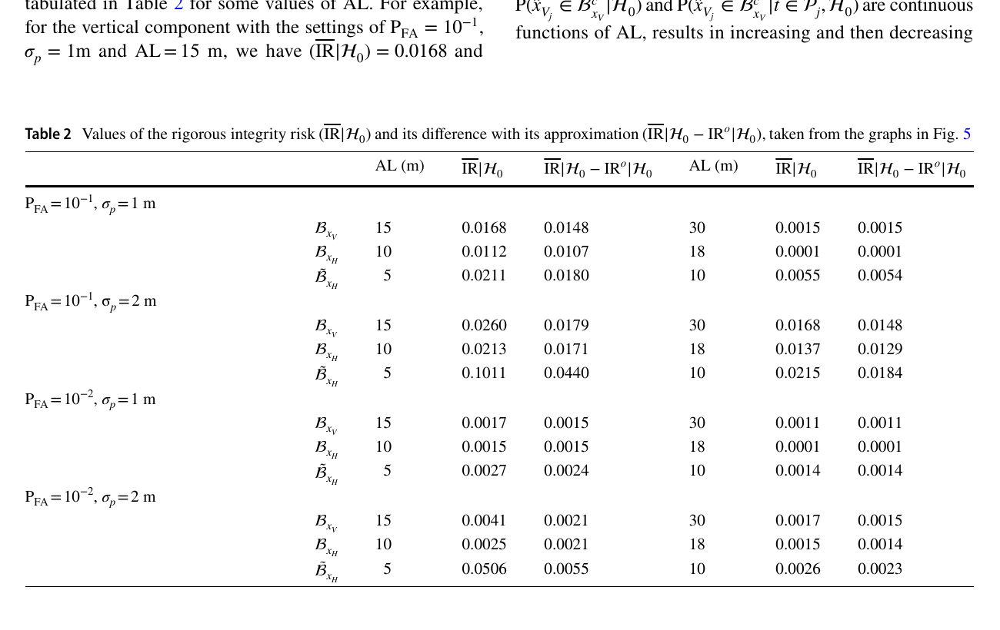
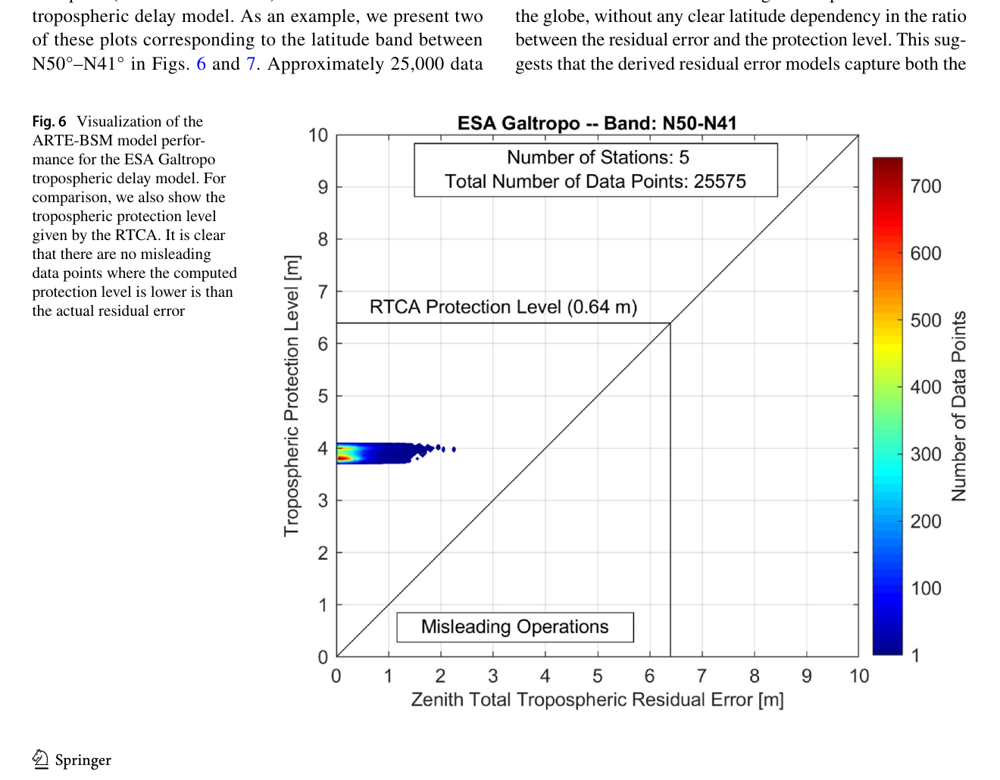
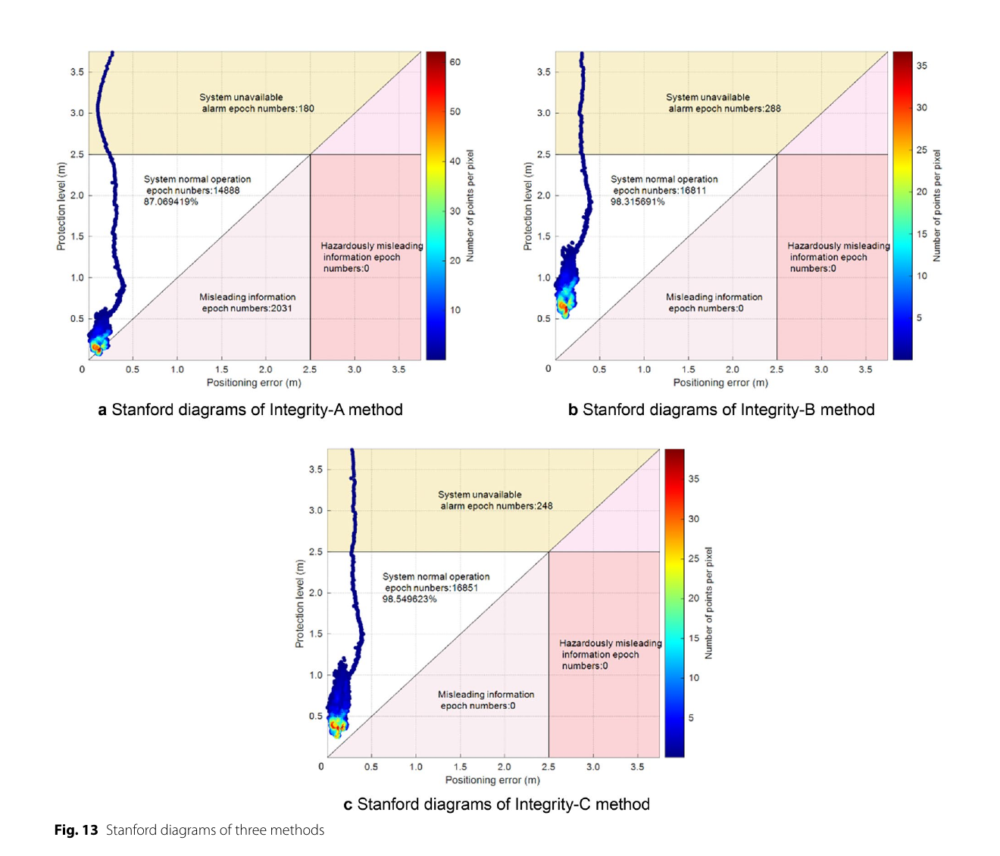

# 2026-08-24 GNSS 每日研究简报

## 今日快报

### 快报 1：延长积分与缩窄相关器间隔都能降噪，但切换瞬间可能先丢锁

- 主题：`tracking-loop-integration-spacing-transients`
- 来源 ID：`arxiv:2608.19927`
- 来源链接：https://arxiv.org/abs/2608.19927
- 发表日期：2026-08-20
- 来源类型：arXiv 预印本、GPS L1 实验接收机与 FPGA/实信号试验
- 获取范围：预印本全文、17 幅图、仿真参数与实信号结果；尚未经过同行评审

**内容：** 作者在自研接收机上改变相干积分时长、Early-Late 间隔和一至三阶环路滤波器。长积分降低相关输出噪声，窄间隔降低 DLL 码跟踪噪声；二阶滤波器面向低动态，三阶滤波器提高动态跟踪能力。论文还用约 44 dB-Hz 的 GPS L1 实信号检查 FPGA 输出，而非只画理想鉴相曲线。

**结论：** 全文显示，从 1 ms 切到更长积分时必须与导航数据位同步，切换会在 PLL/DLL 中引发瞬态甚至失锁；缩窄相关器间隔也会因环路带宽较窄产生持续数秒的瞬态。作者据仿真认为二阶环在低动态近似最优，高动态更适合三阶环，但稳定性必须另行审计。本文属于早期版本，缺少统一真值误差表和跨信号体制试验，不能据此给出通用参数。

**关注理由：** 接收机“稳态噪声更小”不等于“状态切换更安全”。实现时应把积分时长、相关器间隔和滤波阶次作为状态机联合调度，并单独统计切换后重捕获时间、周跳与失锁率。

### 快报 2：南北极海冰漂移的频谱形状相似，能量幅度却不能直接类比

- 主题：`polar-gnss-sea-ice-drift-spectra`
- 来源 ID：`arxiv:2608.18737`
- 来源链接：https://arxiv.org/abs/2608.18737
- 发表日期：2026-08-19
- 来源类型：arXiv 预印本、GNSS 海冰浮标旋转谱与主成分分析
- 获取范围：预印本全文、北极 2017—2024 合成序列、南极八次 2000—2022 航次数据与全部图表；尚未经过同行评审

**内容：** 研究把浮标 GNSS 轨迹转换为速度，按顺/逆时针旋转谱分解海冰漂移，再用 PCA 和浮标间相干性比较 Beaufort Gyre、Transpolar Drift 与八组南极航次。方法把“频谱形状接近”与“绝对能量接近”分开，避免归一化后把动力机制误判为相同。

**结论：** 作者发现两极的方差都主要集中在低于 0.5 cycle/day 与近惯性—半日频带，但南极航次的绝对谱能量常接近北极的一个数量级以上；北极前三个主成分解释 55%—75% 方差，南极前两个为 80%—100%，后者受浮标少和共同重叠窗口短而被抬高。论文据 Nyquist 条件建议至少 4 次/日的 GNSS 采样来覆盖两个主要频带，但明确不把它外推为形变、波浪或冰缘研究的布站规则。

**关注理由：** GNSS 环境监测的采样率应由目标频带反推，而不是沿用设备默认值。工程上还应把定位噪声谱、缺测插值和浮标间距一起放进观测系统模拟试验。

### 快报 3：让 LEO 充当空间参考站，可用稀疏地面网补足 GNSS 轨道与钟的几何可观测性

- 主题：`decentralized-ground-leo-gnss-reference-network`
- 来源 ID：`arxiv:2608.18636`
- 来源链接：https://arxiv.org/abs/2608.18636
- 发表日期：2026-08-19
- 来源类型：arXiv 预印本、地空分层图网络分布式估计仿真
- 获取范围：预印本全文、理论收敛分析、单历元蒙特卡洛设置与图表；尚未经过同行评审

**内容：** 论文把地面站和搭载 GNSS 接收机的 LEO 分成两个通信层：层内频繁交换，层间只在随机链路可用时传递紧凑估计摘要。数值试验模拟 30 颗 GPS、100 个稀疏全球站、400 颗 1000 km 高的 LEO 与五近邻图，用分布式迭代估轨道和钟误差。

**结论：** 五次单历元蒙特卡洛中，稀疏地面网单独解的 GPS 轨道/钟 RMSE 为 0.290/0.279 m，加入 LEO 后为 0.129/0.123 m；密集 529 站加 LEO 达 0.123/0.118 m。层间链路激活概率从 0.95 降至 0.01 仍收敛但更慢，0.001 时在给定迭代范围内留有明显残差。数字来自理想化仿真：码/相位标准差设为 0.015/0.001 m，未覆盖多历元动力学、大气、多路径、姿态和天线相位中心。

**关注理由：** 空间参考网的价值不是简单增加观测数，而是补上地面观测的方向与覆盖。下一步应以真实链路容量、星载钟、LEO 精密定轨误差和产品延迟做闭环预算。

### 快报 4：把 GNSS 与独立运动状态写成结构化叙述，小模型也能识别多类渐进欺骗

- 主题：`slm-structured-state-gnss-spoofing-detection`
- 来源 ID：`arxiv:2608.17092`
- 来源链接：https://arxiv.org/abs/2608.17092
- 发表日期：2026-08-17
- 来源类型：arXiv 预印本、车载 GNSS/惯性状态一致性与小语言模型分类
- 获取范围：预印本全文、KITTI 构造攻击、美国 Clemson 独立采集路线、模型与效率表；尚未经过同行评审

**内容：** 框架分别从 GNSS 与其他车载传感器形成速度、航向、加速度等驾驶状态，再按固定字段顺序转成短文本，让小语言模型区分无攻击、超前、停止、逐弯和错误转向五类。训练/留出测试基于 KITTI，Clemson 实车数据完全留作跨地域评估。

**结论：** Qwen3-1.7B 在原留出集的准确率与宏 F1 为 96.99% 和 97.18%，平均推理延迟 122.69 ms；在 Clemson 集为 95.89% 和 95.89%。这些攻击由真实运动数据后处理构造，且比较依赖独立传感器状态和给定文本模板；结果不能证明能识别未知攻击、共模传感器欺骗或真实 RF 捕获过程。

**关注理由：** 模型优势来自把物理不一致先显式编码，而不是让语言模型直接猜原始 IQ。部署应保留数值残差与传统门限基线，并测试模板扰动、传感器偏置和未见攻击。

### 快报 5：同场地近 99% 干扰分类准确率，换场地后可跌到个位数

- 主题：`jammertest-multisource-domain-shift`
- 来源 ID：`arxiv:2608.15819`
- 来源链接：https://arxiv.org/abs/2608.15819
- 发表日期：2026-08-16
- 来源类型：arXiv 预印本、Jammertest 2025 实地 GNSS 干扰数据集与 17 种模型基准
- 获取范围：预印本全文、单天线 E1/E5 与 2×2 CRPA 数据、分类/参数估计/方向图结果；尚未经过同行评审

**内容：** 数据集包含挪威两个室外试验区的 CW、PRN、chirp、sweep、欺骗、转发和多发射源事件，同时记录单天线接收机与 2×2 CRPA。作者比较 17 种时序模型，并用频谱分离系数把干扰功率与 GNSS 码谱重叠映射到有效 $`C_s/N_0`$ 损失。

**结论：** 匹配场地区域内，单天线/CRPA 分类准确率可达 99.56%/99.53%；只用区域 1 训练、区域 2 测试时跌到 21.86%/4.59%。纯 Sionna 仿真训练迁移到 Jammertest 的分类准确率仅 37.8%，而单天线开阔实测训练为 79.1%。这些结果清楚显示波形目录、环境、前端和标签映射的域偏移；CRPA 无精确无人机轨迹真值，方向角部分只能定性解读。

**关注理由：** 干扰分类器的最大风险可能不是训练集内精度，而是部署域从未出现。验收必须包含跨场地、跨前端和仿真到实测迁移，并把“检测到异常”与“正确估计带宽/功率/方位”分开计分。

## 深度研读

### 深读 1｜接收机工程｜剔除观测以后，为什么不能继续用剔除前的无条件正态分布算风险

- 类别：`receiver-engineering`
- 学习层级：`foundation`
- 选题定位：`经典基础`
- 来源 ID：`doi:10.1007/s10291-018-0812-0`
- 来源链接：https://doi.org/10.1007/s10291-018-0812-0
- 发表日期：2019-01-09
- 来源类型：GPS Solutions 同行评审开放论文、DIA 条件分布与 SPP 完整性风险
- 获取范围：CC BY 4.0 出版全文、数学证明、GPS/Galileo 几何案例、Figures 1—8 与 Tables 1—3
- 价值评分：97/100（相关性 20，经典价值 20，证据 20，教学价值 20，工程价值 17）

#### 为什么先学这个

完整性不是“残差没超门限，所以协方差可信”。检测、识别、剔除本身是一次数据驱动选择；一旦按残差选择了哪条观测被删，输出估计量的分布也随选择事件改变。本节先把这层条件概率讲清，后两节才能正确讨论误差包络和保护级。

#### 先修知识

需要理解线性最小二乘、设计矩阵、协方差、卡方检验、误警/漏检、数据探测（datasnooping）、置信域和全概率公式。还要区分“真实假设”与“检验作出的决策”，二者并不总相同。

#### 一句话逻辑

用闭合差向量划分接受/剔除区域，把每种检验结果对应的估计器拼成 DIA 估计器，再在“真实假设 + 实际决策区域”上计算越过报警限的条件概率，而不是把未条件化正态分布乘以决策概率。

#### 研究问题与约束

论文假设线性模型、正态观测误差和一次只有一条观测含偏差，先在一维例子证明零假设下严格风险大于近似风险，再用六星 GPS 与 GPS/Galileo SPP 几何说明多维趋势。多故障、相关重尾误差和连续多历元并未被数学证明覆盖。

#### 核心方法论

观测模型为 $`H_0:E(y)=Ax`$；单观测偏差假设为 $`H_i:E(y)=Ax+c_i b_i`$。用 $`t=B^Ty`$ 构造与参数估计正交的闭合差，卡方域 $`P_0`$ 接受零假设，其余区域按最大标准化 Baarda 统计量分给 $`P_i`$。若落入 $`P_i`$，输出剔除第 $`i`$ 条观测后的估计 $`\hat x_i`$。

#### 关键公式逐步推导

DIA 输出随检验区域切换：

```math
\bar x=\sum_{j=0}^{m}\hat x_j\,p_j(t),
\qquad t=B^Ty,
\qquad Q_{tt}=B^TQ_{yy}B
```

对真实假设 $`H_i`$，越出置信域 $`B_x`$ 的严格完整性风险是：

```math
IR\mid H_i=\sum_{j=0}^{m}
P\!\left(\hat x_j\in B_x^c\mid t\in P_j,H_i\right)
P\!\left(t\in P_j\mid H_i\right)
```

若把第一项错误替换为 $`P(\hat x_j\in B_x^c\mid H_i)`$，就丢掉估计与检验结果的相关性；被选择后的 $`\hat x_j`$ 通常不再服从原来的无条件正态分布。

#### 经典价值与创新边界

价值在于把“检验后估计”的选择偏差纳入完整性风险，并给出一维零假设下的严格不等式。创新边界是多维案例为数值例证而非通用证明；结论也不自动给出可直接部署的保护级算法。

#### 整体逻辑链

形成最小二乘与闭合差；按卡方门限检测；按 Baarda 统计识别；输出适配后的估计；写出所有决策区域上的混合分布；对每个真实假设求条件越限概率；乘故障先验后相加；再与忽略条件事件的近似风险比较。

#### 原文图表与结果分析



> 图源：Zaminpardaz、Teunissen 与 Tiberius《Risking to underestimate the integrity risk》Table 2，[DOI 原文](https://doi.org/10.1007/s10291-018-0812-0)，CC BY 4.0。由出版 PDF 第 11 页以 180 dpi 渲染后裁出完整表题、列名和数值；未重绘、改色或修改数据。

表中 $`P_{FA}=10^{-1}`$、$`\sigma_p=1\ \mathrm m`$、垂向报警限 15 m 时，严格风险为 0.0168，严格值与近似值之差为 0.0148，故近似值只有约 0.0020，过于乐观约 8 倍。横纵列同时说明差异依赖报警限、噪声与置信域形状；这不是航空认证设置，而是展示条件化影响的数值例子。

#### 原文结果论述

论文证明在其一维线性正态模型的零假设贡献下，严格风险必大于近似风险；六星 GPS 和五 GPS 加五 Galileo 的 SPP 案例中，严格减近似也保持为正。作者因此反对在完成检测/剔除后仍使用与决策无关的无条件估计分布。

#### 常见误区与适用边界

第一，把误警率当成完整性风险。第二，剔除粗差后只缩小协方差，不重算条件分布。第三，把正确检测等同于正确识别。第四，把一次单故障证明外推到连续多故障。第五，把示例的 0.1 误警率和 15 m 报警限当成规范要求。

#### 工程实现步骤

1. 保存每历元所有候选假设、检验统计量和决策区域。
2. 明确输出估计器与每个区域 $`P_j`$ 的映射。
3. 用重要抽样或数值积分计算条件越限概率。
4. 分开统计误警、漏检、错识别与正确识别。
5. 将故障先验、报警限与连续性预算配置化。
6. 用蒙特卡洛检查经验越限率是否包在计算风险内。

#### 复现实验设计

先复现六星 GPS 案例：伪距标准差取 1 m 和 2 m，$`P_{FA}`$ 取 $`10^{-1}`$、$`10^{-2}`$，垂向报警限扫 5—40 m，每档至少 $`10^7`$ 次重要抽样。比较严格条件风险、无条件近似和直接经验越限率；再加入两条同时偏差、Student-t 噪声和连续 60 s 缓变故障。失败判据是近似风险低于经验风险或数值积分不收敛。

#### 与定位及低成本实现的联系

低成本接收机常通过残差剔除改善 SPP，但动态选择会使剩余误差分布变形。下一节不再假设误差天然高斯，而是先为具体大气残差构造保守包络。

#### 本节小结

检验决定了使用哪一个估计器，也决定了它的条件分布；忽略这一步，完整性风险可能在数学上就被低估。

### 深读 2｜接收机工程｜误差不是高斯时：用极值与长期气象场构造仍保守但更紧的对流层包络

- 类别：`receiver-engineering`
- 学习层级：`intermediate`
- 选题定位：`基础进阶`
- 来源 ID：`doi:10.1007/s10291-020-01017-7`
- 来源链接：https://doi.org/10.1007/s10291-020-01017-7
- 发表日期：2020-08-07
- 来源类型：GPS Solutions 同行评审开放论文、对流层残差极值建模与 IGS 独立验证
- 获取范围：CC BY 4.0 出版全文、17 年数值天气场、17 年 IGS 验证、Figures 1—7 与 Tables 1—6
- 价值评分：98/100（相关性 20，经典价值 19，证据 21，教学价值 19，工程价值 19）

#### 为什么先学这个

上一节说明决策条件不能丢；但即使没有剔除，保护级仍依赖每个测距误差的统计模型。统一使用全球常数很安全却可能损失可用率。本节展示怎样从长期物理数据提取极端尾部，并保留地理和季节结构。

#### 先修知识

需要理解干/湿对流层延迟、天顶到斜距映射、数值天气模式、极值理论、重现期、标准差包络、保护级和 Stanford 图。还要区分拟合期数据与独立验证数据。

#### 一句话逻辑

用全球数值天气场射线追踪得到 Galtropo/GPT2w 的天顶残差，按纬度带和季节对标准化极值建模，再用另一套 IGS 天顶延迟长期序列检查保护量始终位于实际残差之上。

#### 研究问题与约束

训练使用 2000—2016 年四时次全球气象场，目标是盲模式单点定位的对流层模型残差；验证从约 300 个 IGS 站中选缺测最少且空间较均匀的 49 站，使用 2000-01-01 至 2017-10-31 每日 12:00 UTC 数据。81°—90° 纬带无站可验证，模型也不覆盖局地极端天气的实时修正。

#### 核心方法论

先把残差按纬度带拆成静力和湿分量，以位置尺度和季节项标准化；对标准化残差的极值分布外推 25 年重现期，得到最大标准差 $`\sigma_{n,\max}`$。ARTE-BSM 保留纬带和年/半年季节项，ARTE-BCM 只保留纬带常数，ARTE-GCM 再压成全球常数。

#### 关键公式逐步推导

先用年项与半年项拟合每日残差标准差，再将原始残差 $`\delta`$ 标准化：

```math
\sigma(DOY)=A_0+A_1\cos\!\left(2\pi\frac{DOY-DOY_0}{365.25}\right)
+A_2\cos\!\left(4\pi\frac{DOY-DOY_0}{365.25}\right),
\qquad \delta_n=\frac{\delta}{\sigma(DOY)}
```

分别拟合年度正、负极值并取较大绝对值，按 $`K=5.33`$（标准正态 $`1-10^{-7}`$ 分位）换算为 $`\sigma_{n,\max}`$；再把最大日均偏差 $`\Delta_0`$ 加回，得到：

```math
\sigma_{\max}(DOY)=\frac{\Delta_0}{K}
+\sigma(DOY)\,\sigma_{n,\max}
```

再通过斜延迟映射与几何投影进入保护级。论文参数表是模型定义的一部分，不能用日常样本标准差替代尾部外推量。

#### 经典价值与创新边界

价值在于把物理气象场、极值统计、独立 GNSS 验证和完整性包络接成闭环，并量化“保守但不过分保守”。边界是结果针对两个盲模式对流层模型和选定时段，25 年重现期也不等于所有应用的完整性风险预算。

#### 整体逻辑链

从天气场射线追踪真值；计算模型残差；按纬带分组；拟合季节尺度；标准化并做极值外推；形成 BSM/BCM/GCM 三档复杂度；用 IGS ZTD 独立验证；绘制残差—保护量 Stanford 图；比较 RTCA 固定常数与新模型的裕量。

#### 原文图表与结果分析



> 图源：Rózsa 等《An advanced residual error model for tropospheric delay estimation》Figure 6，[DOI 原文](https://doi.org/10.1007/s10291-020-01017-7)，CC BY 4.0。由出版 PDF 第 12 页以 180 dpi 渲染，裁出完整图、图题与原始轴标；未重绘、改色或修改标签及数据。

横轴是 IGS 参考天顶总对流层残差（m），纵轴是 ARTE-BSM 对流层保护量（m），示例为北纬 50°—41°、5 站、25,575 点；样本均位于 $`y=x`$ 安全侧。原图的 RTCA 横线在纵轴上绘于约 6.4 的位置，但线内标签和正文都写 0.64 m，存在十倍尺度不一致；本期保留原图且不自行裁决。图只验证该纬带、时次和站样本无误导点，不能证明未观测气候下绝不越界。

#### 原文结果论述

49 站长期验证中，各纬带最大残差/保护量比约不超过 0.61，说明仍有裕量；相对 RTCA 固定模型，ARTE-BSM 对流层保护量按纬带降低 39%—55%。这是对流层分量的改善，不等于最终三维位置保护级同幅降低。

#### 常见误区与适用边界

第一，把均方根误差当极端尾部包络。第二，用训练数据同时声称独立验证。第三，把天顶残差直接当用户斜距误差。第四，忽略纬带 81°—90° 无验证站。第五，把没有误导点写成已证明 $`10^{-9}`$ 风险。第六，把大气包络收益直接等同坐标可用率。

#### 工程实现步骤

1. 固定对流层模型版本、输入气象场和射线追踪配置。
2. 按干湿分量、纬带与年积日保存残差。
3. 用独立时段拟合并检查极值重现期稳定性。
4. 输出 BSM、BCM、GCM 三档参数与版本号。
5. 经映射函数转换到每颗星的斜距方差。
6. 以 Stanford 图和最大残差/保护量比审计越界。

#### 复现实验设计

选 ERA5 2000—2019 训练、2020—2025 验证，按论文纬带对 Galtropo 与 GPT2w 射线追踪；比较 RTCA 常数、ARTE-GCM/BCM/BSM 和简单 99.999% 分位。指标为验证越界数、最大残差/保护量比、平均保护量、各纬带可用率与参数漂移；失败场景包括台风、强对流、极地少站与映射函数失配。

#### 与定位及低成本实现的联系

低成本码观测噪声通常大于测地接收机，但完整性预算仍不能忽略低仰角系统偏差。下一节把“每颗星误差先包住”的思想用于海上多路径，再通过 MHSS 投影成 RT-PPP 水平保护级。

#### 本节小结

更紧的保护级不是把标准差调小，而是用长期数据证明新的尾部模型仍包住残差，并明确未验证区域。

### 深读 3｜定位｜海面多路径不是同一把尺：分仰角包络怎样压紧 RT-PPP 水平保护级

- 类别：`positioning`
- 学习层级：`advanced`
- 选题定位：`定位专题：完整性`
- 来源 ID：`doi:10.1186/s43020-026-00194-z`
- 来源链接：https://doi.org/10.1186/s43020-026-00194-z
- 发表日期：2026-03-11
- 来源类型：Satellite Navigation 同行评审开放论文、海上双频 GPS/BDS RT-PPP 完整性实测
- 获取范围：CC BY 4.0 出版全文、两步 CDF 包络、MHSS、近海与远海试验、Figures 1—13 与 Tables 1—10
- 价值评分：97/100（相关性 20，经典价值 17，证据 20，教学价值 19，工程价值 21）

#### 为什么先学这个

前两节分别解决“检验后分布”和“误差尾部”问题。本节进入纯 GNSS 定位：海面和船体反射让低仰角多路径强且非高斯，如果所有卫星都乘同一个最坏包络系数，保护级虽安全却长期越过报警限；若不包络，又会出现误导信息。

#### 先修知识

需要理解双频无电离层 PPP、实时轨道钟、码/相位多路径、CDF、Gaussian overbounding、卷积、MHSS、HPE/HPL、报警限、完整性风险、连续性风险和 Stanford 图。

#### 一句话逻辑

从海试观测提取 IF 多路径，按 10° 仰角分八档分别求左右 CDF 的高斯包络系数，用它膨胀每颗星的观测方差，再由 MHSS 对所有故障子集取最坏水平保护级。

#### 研究问题与约束

论文采用 GPS L1/L2 与 BDS B1I/B3I、1 Hz；近海试验为 2024-03-14 00:53—02:52 UTC，流动船到基站最大约 18 km，另有远海航段。IMO 水平报警限取 2.5 m，完整性风险 $`10^{-5}/(3\ \mathrm h)`$。同一航次数据既估包络系数又做定位评估，缺乏跨航次独立校准；多路径独立卷积假设和实时产品故障也需另审计。

#### 核心方法论

Integrity-A 不做包络；Integrity-B 用所有仰角中的最大统一系数；Integrity-C 为 10°—20° 到 80°—90° 八档分别求系数。每档先把经验 CDF 转成对称单峰 CDF，再分别找左、右高斯包络标准差，取较大值；在线按卫星仰角查表膨胀码相方差，最后计算 MHSS HPL。

#### 关键公式逐步推导

每个仰角档 $`h`$ 的包络尺度为：

```math
\sigma_h=\max(\sigma_{L,h},\sigma_{R,h}),
\qquad f_h=\frac{\sigma_h}{\sigma_{m,h}}
```

CDF 约束要求左尾 $`G_{ob,h}(x)\ge G_{su,h}(x)\ge G_{a,h}(x)`$（$`x\le0`$），右尾镜像处理。将包络后的子集位置标准差代入 MHSS：

```math
HPL=\max_i\left[
Q^{-1}\!\left(\frac{P_{cont,i}}{N-1}\right)\sigma_{ss,o}^{(i)}+
Q^{-1}\!\left(\frac{P_{IR,i}}{N P(H_i)}\right)\sigma_o^{(i)}
\right]
```

第一项包住全视解与故障子集解的分离，第二项包住该假设下的位置误差；$`HPL\ge2.5\ \mathrm m`$ 时必须报警。

#### 经典价值与创新边界

创新在于把成熟两步包络按卫星仰角分层，并落到真实海上 RT-PPP 的 MHSS 保护级。边界是包络表与评估数据非独立、只有两次航段，论文证明的是样本内无 MI 与可用率改善，不是服务级认证或跨海况保证。

#### 整体逻辑链

解算 RT-PPP 与参考轨迹；提取码多路径；按仰角分档；形成左右经验 CDF；求高斯包络系数；在线膨胀观测协方差；构造全视与故障子集解；计算 HPL；与 HPE 和 2.5 m 报警限组成 Stanford 图；统计正常、不可用、MI 与 HMI。

#### 原文图表与结果分析



> 图源：Yang 等《Overbounding observation errors considering elevation-related distribution characteristics for maritime RT-PPP integrity monitoring》Figure 13，[DOI 原文](https://doi.org/10.1186/s43020-026-00194-z)，CC BY 4.0。由出版 PDF 第 15 页以 180 dpi 渲染，裁出完整三联图、坐标、色条与图题；未重绘、改色或修改数据。

横轴为 HPE（m），纵轴为 HPL（m），水平线是 2.5 m 报警限，对角线下方为 HPL 小于误差的误导区域。A 无包络，2,031 个历元落入 MI，正常运行率 87.07%；B 用统一最坏系数，无 MI，但不可用 288 历元；C 按仰角分档，也无 MI，不可用降为 248 历元，正常运行率 98.55%。图展示的是该远海样本，不能证明总体 MI 概率为零。

#### 原文结果论述

论文报告 Integrity-C 相比统一包络在近海和远海的可用率分别提高 16.18% 和 11.88%；近海 HPL/HPE 比降低 20.45%。远海 A 的水平 MI 比例为 11.88%，B/C 在样本中均无 MI。可用率收益来自高仰角卫星不再沿用低仰角最坏系数，而不是放松 2.5 m 报警限。

#### 常见误区与适用边界

第一，把样本内零 MI 写成完整性风险已达 $`10^{-5}`$。第二，用同一航次拟合和验证却声称独立泛化。第三，忽略卫星误差相关性，直接依赖卷积包络。第四，把 HPL 当实际误差估计。第五，把码多路径系数无条件套给载波。第六，只报可用率，不检查 HMI。

#### 工程实现步骤

1. 固定接收机、天线、船体安装和海况元数据。
2. 用独立校准航次提取逐星 IF 码/相位残差。
3. 每 10° 仰角档检查样本数、左右尾和时间相关。
4. 版本化保存 $`f_h`$ 并设置稀疏档回退规则。
5. 在线按仰角膨胀完整观测协方差，保留星间相关项。
6. MHSS 输出 HPL、主导故障子集和报警原因。
7. 用独立航次统计 MI/HMI、首次可用时间和长尾。

#### 复现实验设计

用三次独立海试做“训练一航次、验证两航次”，GPS/BDS/Galileo 双频、1 Hz、至少各 4 h；比较 A、统一 B、分仰角 C 和按方位/海况二维分箱。固定 2.5 m 报警限与同一 MHSS 风险预算，指标为 MI/HMI、正常运行率、首次可用时间、HPL/HPE 95/99.9 分位及计算时延。故障注入包括低仰角 5 m 偏差、轨道钟阶跃、相关镜面反射和实时改正中断。

#### 与定位及低成本实现的联系

RT-PPP 无需用户附近基站，适合远海和低基础设施区域；但低成本天线、船体反射和产品链路会放大模型不匹配。真正可部署的完整性链必须同时保留第一节的检验条件化、第二节的独立尾部验证和本节的多假设位置域投影。

#### 本节小结

分仰角包络能在不改变报警限的前提下压紧 HPL、提高样本可用率；它的安全性仍取决于独立数据、相关误差和未监控故障是否被完整覆盖。
