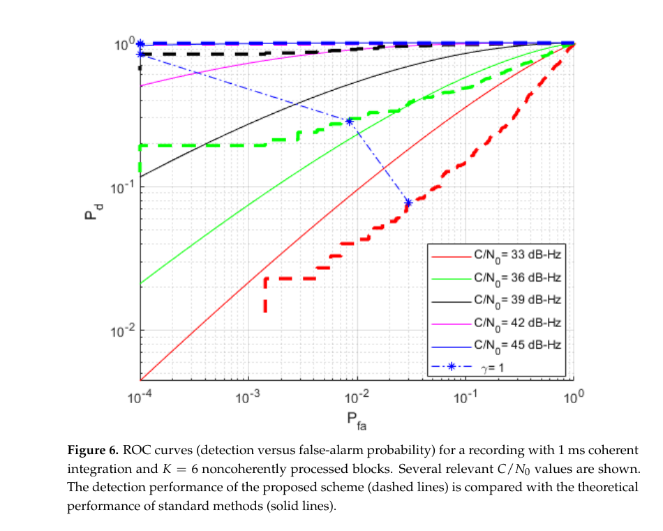
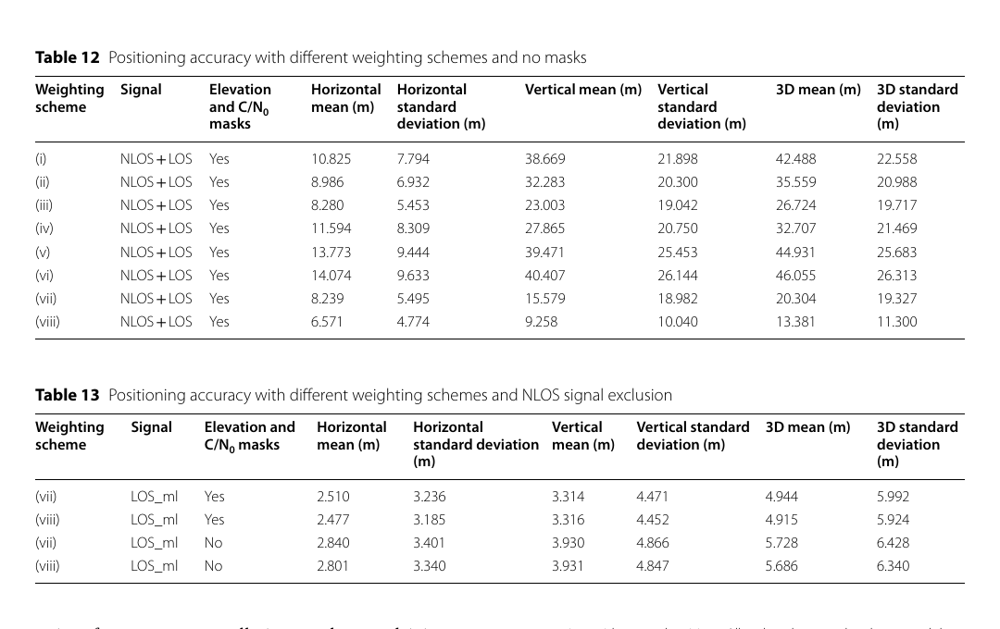
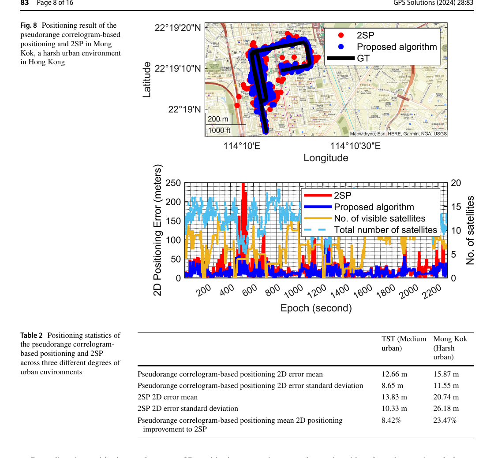

# 2026-08-25 GNSS 每日研究简报

## 今日快报

### 快报 1：信号中断时，不只预测钟差，还要把预测方差作为伪观测送回 PPP

- 主题：`cnn-lstm-bds-rtppp-time-transfer-outage`
- 来源 ID：`doi:10.1088/1361-6501/ae9da7`
- 来源链接：https://doi.org/10.1088/1361-6501/ae9da7
- 发表日期：2026-08-24
- 来源类型：Measurement Science and Technology 同行评审开放论文、BDS 实时 PPP 授时
- 获取范围：CC BY 4.0 出版元数据与完整摘要；正文在本次获取中未取得

**内容：** 作者用 CNN 提取局部钟差特征、LSTM 建模时间相关性，在 GNSS 中断期预测接收机钟差；预测值及其方差不是直接替换滤波状态，而是作为 PPP 卡尔曼滤波的伪观测。模型分别在氢钟、铯钟和铷钟站测试，并与白噪声、随机游走、移动平均和二次多项式钟模型比较。

**结论：** 摘要称独立日期试验和低动态船载试验均显示改善，且不同钟型收益不同。由于正文未取得，本期不转述摘要中的改善百分比，也不能审计中断长度分布、训练/测试站独立性、预测方差标定和改正产品中断是否同时发生；证据支持“学习钟动态可补短时观测缺口”，不支持任意中断下保持授时精度。

**关注理由：** 学习模型若只给点预测而不给可信方差，滤波器会把外推当观测真值。工程实现应同时检查钟差 RMSE、MDEV、伪观测创新一致性，以及不同原子钟和廉价振荡器之间的域迁移。

### 快报 2：EXIF 里的速度跳变能像欺骗，却无法仅凭照片元数据判定攻击来源

- 主题：`smartphone-exif-gnss-integrity-flight`
- 来源 ID：`doi:10.3390/geomatics6050094`
- 来源链接：https://doi.org/10.3390/geomatics6050094
- 发表日期：2026-08-23
- 来源类型：Geomatics 同行评审开放论文、消费手机飞行 EXIF 完整性
- 获取范围：CC BY 4.0 出版全文、两次航班与地面对照、七指标完整性检查

**内容：** 研究分析 Samsung Galaxy A72 在两次欧洲商业航班的 455 张照片和 275 张地面对照照片，用位置、时间、高度、相邻点速度、幻影定位与 JPEG 结构组成七指标检查；它审计的是相机保存后的 EXIF 结果，不是射频样本或接收机原始观测。

**结论：** 全文报告专用时间戳相机与原生相机的 GPS 捕获率分别为 100% 和 83.3%，最高记录 11,439 m WGS84；两处 1560—1875 km/h 速度尖峰在 EXIF 层与位置跳跃式欺骗不可区分。飞行中幻影定位为 0/442，地面对照为 37.3%；单设备、非独立照片和无 IMU/NMEA 日志限制了因果判断。

**关注理由：** 应用层异常不是攻击归因。无人机影像链应保存原始 GNSS、IMU、相机触发和哈希，再把“坐标异常”“文件异常”“信号攻击”分层报警，避免把 JPEG 编码差异误判成导航欺骗。

### 快报 3：相机给交通流量，增强 GPS 给轨迹；融合前必须承认 1 Hz 与米级定位的分辨率

- 主题：`camera-waas-gps-traffic-calming-kinematics`
- 来源 ID：`doi:10.3390/s26175340`
- 来源链接：https://doi.org/10.3390/s26175340
- 发表日期：2026-08-24
- 来源类型：Sensors 同行评审开放论文、相机/GPS 交通减速设施试验
- 获取范围：CC BY 4.0 出版全文、现场轨迹、微观仿真与宏观容量模型

**内容：** 研究用视频计数器统计 12 h 分车道流量，以 WAAS/EGNOS 增强 GPS 的 1 Hz 轨迹重建 30 条质控后的自由流车辆轨迹，再由 $`a=v\,dv/dx`$ 把空间速度剖面换成减速与恢复加速度，用现场结果校准 VISSIM。

**结论：** 全文报告 GPS 标称水平 3D RMS 为 5 m；四处设施的仿真平均速度校准误差不超过 0.71%，独立行程时间误差为 5.7%—12.1%。这些数字验证的是给定道路、探测器与仿真链的一致性，不证明 1 Hz GPS 能解析轮胎级瞬态，也不能把仿真容量当直接现场测量。

**关注理由：** GNSS 应用常把定位误差、采样误差和模型误差混在一个拟合指标里。复现应对轨迹重采样、差分求导平滑和设施位置误差分别做敏感性分析。

### 快报 4：多频 PPP-AR 的偏差产品若分开估计，时间分辨率与基准一致性会一起受损

- 主题：`high-rate-unified-osb-ppp-ar-bias`
- 来源 ID：`doi:10.21203/rs.3.rs-10109480/v1`
- 来源链接：https://doi.org/10.21203/rs.3.rs-10109480/v1
- 发表日期：2026-08-24
- 来源类型：Research Square CC BY 4.0 预印本、多频 GNSS 偏差统一估计
- 获取范围：预印本全文与摘要；尚未经过同行评审

**内容：** 作者把传统上分开的 DCB、UPD 与 IFCB 重写为未差分、非组合框架内的码 OSB、相位 OSB 和时变相位 OSB，并设计统一估计软件，使同一产品链共享参考基准和较高时间分辨率。

**结论：** 论文主张高时间分辨率能捕捉低分辨率产品漏掉的卫星偏差变化，从而改善多频 PPP 模糊度恢复。由于这是首版预印本，本期只采纳其模型与软件设计，不把作者的定位改善概括为服务级保证；分析中心网形、钟差基准、产品延迟和独立用户验证仍决定可迁移性。

**关注理由：** PPP-AR 的“整数性”来自轨道、钟和偏差基准共同闭合。用户端应版本化记录 OSB 间隔、插值、断档和参考信号，不能把高频产品简单当作低频产品的加密采样。

### 快报 5：GPS 绩效数字既能支持自我调节，也会在公开比较中变成心理压力源

- 主题：`gps-wearable-feedback-adolescent-football`
- 来源 ID：`doi:10.1038/s41598-026-68155-9`
- 来源链接：https://doi.org/10.1038/s41598-026-68155-9
- 发表日期：2026-08-23
- 来源类型：Scientific Reports 同行评审开放早期版本、GPS 可穿戴反馈的质性研究
- 获取范围：CC BY-NC-ND 4.0 出版全文、访谈设计、主题分析与伦理说明

**内容：** 研究对 15—18 岁国家级青少年足球运动员中的 11 名球员和 4 名教练做半结构化访谈，以自我决定理论和反思性主题分析考察 GPS 跑动指标如何影响动机、身份认同和压力。

**结论：** 参与者叙述显示，当反馈用于自主目标和个体进步时，GPS 指标可支持自我调节与胜任感；当指标公开排序并与选拔绑定时，又会强化社会比较和绩效依赖型自我价值。小样本质性证据解释体验机制，不估计效应量，也不证明 GPS 测量本身准确或导致心理结果。

**关注理由：** 定位技术的工程正确不等于部署伦理正确。团队应把数据访问、比较范围、误差说明和未成年人同意写入流程，避免把有测量不确定性的负荷指标变成单一评价标签。

## 深度研读

### 深读 1｜信号捕获｜先把 CAF 看成统计检验：神经网络为什么能利用相关峰周围的形状

- 类别：`acquisition`
- 学习层级：`foundation`
- 选题定位：`经典基础`
- 来源 ID：`doi:10.3390/s23031566`
- 来源链接：https://doi.org/10.3390/s23031566
- 发表日期：2023-02-01
- 来源类型：Sensors 同行评审开放论文、GPS L1 C/A 仿真捕获
- 获取范围：CC BY 4.0 出版全文、公式、训练设置、Figures 1—9 与 ROC
- 价值评分：96/100（相关性 20，经典价值 18，证据 18，教学价值 21，工程价值 19）

#### 为什么先学这个

接收机不是先“测距”再找卫星，而是先在码延迟—多普勒二维网格判断某颗星是否存在。本文用神经网络替换峰值判决，但它的输入仍是经典 CAF；因此很适合借新方法反推捕获的统计基础。

#### 先修知识

需要理解扩频码、码相位、多普勒、相干/非相干积分、复高斯噪声、假设检验、虚警概率 $`P_{fa}`$、检测概率 $`P_d`$、ROC 和 CNN。还要区分“检出卫星”与“正确定位峰值网格”。

#### 一句话逻辑

先计算 CAF，再把峰值附近的二维纹理切成重叠小图交给并行 CNN，输出 $`H_1/H_0`$ 后验比，并把多段非相干结果按概率规则融合。

#### 研究问题与约束

论文用 GPS L1 C/A 仿真 I/Q、4 MHz、1 ms 相干积分训练，3000 对监督样本、7 个卷积层和 3 个全连接层；信号与噪声模型由仿真器给定。结果没有真实城市多路径、强近远效应、欺骗相关峰或跨接收机量化误差验证。

#### 核心方法论

标准法在每个 $`(\tau,f_d)`$ 计算 CAF 幅度并取最大值；数据驱动法把全 CAF 分成以候选格点为中心的小图，各 CNN 输出类别后验，再形成概率比图。$`K`$ 段输出相乘，相当于在条件独立假设下做非相干证据融合。

#### 关键公式逐步推导

对第 $`i`$ 颗星，离散 CAF 为：

```math
\mathcal C_i(\tau,f_d)=\frac{1}{N}\sum_{n=0}^{N-1}y[n]c_i(nT_s-\tau)e^{-j2\pi f_dnT_s}
```

经典最大似然给出 $`(\hat\tau,\hat f_d)=\arg\max|\mathcal C_i|^2`$，并以 $`|\mathcal C_i|^2\gtrless\beta`$ 判 $`H_1/H_0`$。网络改用后验比：

```math
\Lambda(Z)=\frac{p(H_1\mid Z)}{p(H_0\mid Z)}\gtrless\gamma,
\qquad \Lambda_K=\prod_{k=1}^{K}\Lambda(Z_k)
```

它没有取消二维搜索，而是把“只看单个最大值”改为“看峰附近的联合形状”。

#### 经典价值与创新边界

教学价值在于把 CAF、GLRT、ROC 与 CNN 后验统一起来；创新是重叠子图并行和概率融合。边界是网络超过理论曲线只说明它利用了基准峰值统计量未使用的邻域信息，不代表超过同一完整观测下的最优检测器。

#### 整体逻辑链

生成 I/Q；构造 CAF 网格；切分重叠子图；监督训练二分类器；每格输出后验比；融合 $`K`$ 段；取概率图最大格；扫描 $`\gamma`$ 得 ROC；与经典 CAF 峰值法比较。

#### 原文图表与结果分析



> 图源：Borhani-Darian 等《Deep Learning of GNSS Acquisition》Figure 6，[DOI 原文](https://doi.org/10.3390/s23031566)，CC BY 4.0。由开放 PDF 第 14 页以 150 dpi 渲染，裁出完整 ROC、坐标、图例与图题；未重绘、改色或修改数据。

横轴为 $`P_{fa}`$、纵轴为 $`P_d`$，均为对数尺度；实线是标准理论曲线，虚线是 1 ms 相干加 $`K=6`$ 段网络融合。高 $`C/N_0`$ 时虚线贴近 $`P_d=1`$，低 $`C/N_0`$ 时仍明显退化。图只支持特定仿真分布与固定网络，不证明未知干扰下 ROC 保持。

#### 原文结果论述

作者报告训练验证准确率为 93%，并指出 $`\gamma=1`$ 在 $`C/N_0>36\ \mathrm{dB\!-!Hz}`$ 时兼顾低虚警与高检测；六段非相干融合比单段更能分开 $`H_0/H_1`$ 统计量。这些是仿真分类结果，不是首次定位时间或硬件功耗实测。

#### 常见误区与适用边界

第一，把验证准确率当 ROC 全貌。第二，把网络判有信号当码相位一定正确。第三，训练集和测试集来自同一仿真器却声称跨域。第四，忽略相关子图使独立性假设失真。第五，把 $`C/N_0`$ 收益外推到多路径、欺骗和量化削顶。

#### 工程实现步骤

1. 固定采样率、积分时间、码相位与多普勒网格。
2. 保存 CAF 与真实 $`H_0/H_1`$、峰格标签。
3. 按场景而非随机片段切训练/验证集。
4. 同时标定 $`P_d`$、$`P_{fa}`$ 与峰格误差。
5. 测量 CPU/GPU/FPGA 延迟和功耗。
6. 对未见干扰设置经典 GLRT 回退路径。

#### 复现实验设计

GPS L1 C/A，4 MHz，$`C/N_0=27—48\ \mathrm{dB\!-!Hz}`$，多普勒 $`\pm5\ \mathrm{kHz}`$、500 Hz 步进，1 ms 相干并比较 $`K=1,2,6,10`$。基线为串行峰值、PCPS-GLRT 和相同 CAF 上的轻量 CNN；指标为固定 $`P_{fa}=10^{-3}`$ 的 $`P_d`$、码格/频格正确率、TTFF、延迟与能耗。失败场景加入数据位翻转、CW、扫频、双峰多路径和 2 bit 量化。

#### 与定位及低成本实现的联系

捕获提供的是可进入跟踪的候选信号；城市中即使捕获成功，直达、反射和 NLOS 仍会生成质量不同的伪距。下一节把接收机质量指标变成路径状态概率。

#### 本节小结

神经网络的增益来自利用 CAF 峰周围结构，而非绕开相关；部署前必须把检测、峰定位和跨场景标定分开验收。

### 深读 2｜接收机工程｜不要只按 C/N₀ 一刀切：把 NLOS 概率同时用于选星与定权

- 类别：`receiver-engineering`
- 学习层级：`intermediate`
- 选题定位：`基础进阶`
- 来源 ID：`doi:10.1186/s43020-023-00101-w`
- 来源链接：https://doi.org/10.1186/s43020-023-00101-w
- 发表日期：2023-05-10
- 来源类型：Satellite Navigation 同行评审开放论文、城市车载 GNSS NLOS 分类与伪距定位
- 获取范围：CC BY 4.0 出版全文、开放数据、质量指标、Figures 1—27 与 Tables 1—13
- 价值评分：97/100（相关性 20，经典价值 18，证据 20，教学价值 20，工程价值 19）

#### 为什么先学这个

上一节只回答“有没有这颗星”。城市接收机更难的问题是“这条观测是否直达、应给多大权”。单阈值会把低仰角 LOS 删掉，也可能保留构造性多路径下的高 $`C/N_0`$ NLOS。

#### 先修知识

需要理解伪距 WLS、设计矩阵、DOP、$`C/N_0`$、仰角/方位角、测量标准差、锁定时间、随机森林、假阳性和概率校准。

#### 一句话逻辑

从接收机质量指标预测每条信号的 NLOS 概率，再用阈值做选星，同时以 $`1-P_{NLOS}`$ 连续缩放传统权值。

#### 研究问题与约束

研究使用 Chemnitz University of Technology 开放车载数据和其固定标签；输入受既有接收机可输出字段限制，场景、星座与路线不独立扩展。分类与定位评估来自同一数据域，不能证明跨城市、天线和固件泛化。

#### 核心方法论

作者比较决策树、随机森林、GBDT 与 Bagging；候选指标含码/多普勒标准差、$`C/N_0`$、仰角、卫星方位与车辆航向差等。随机森林输出 $`P_{NLOS}`$，阈值 0.5 分类；新权值在仰角—$`C/N_0`$ 模型上乘 $`1-P_{NLOS}`$。

#### 关键公式逐步推导

线性化伪距为 $`z=Hx+\varepsilon`$，WLS 解：

```math
\hat x=(H^TWH)^{-1}H^TWz
```

若传统模型给第 $`i`$ 条观测权 $`w_{0,i}`$，论文的概率定权思想可写成：

```math
w_i=w_{0,i}\left(1-P_{NLOS,i}\right)
```

硬剔除是 $`P_{NLOS,i}>t`$ 时移除观测；连续权与阈值共同改变误差和几何，因此不能只优化分类准确率。

#### 经典价值与创新边界

价值是仅用民用接收机质量字段串联分类、选星与定位，不依赖 3D 地图或 LiDAR。边界是标签和特征均有场景依赖，随机森林概率也未必校准；改善百分比不能直接迁移到新路线。

#### 整体逻辑链

时间同步观测与标签；分析每个质量指标；筛选特征；训练多种树模型；扫分类阈值；输出 NLOS 概率；构造权阵与选星集；计算伪距 WLS；比较水平、垂直、3D 均值和标准差。

#### 原文图表与结果分析



> 图源：Li 等《Machine learning based GNSS signal classification and weighting scheme design in the built environment: a comparative experiment》Tables 12—13，[DOI 原文](https://doi.org/10.1186/s43020-023-00101-w)，CC BY 4.0。由出版 PDF 第 21 页以 150 dpi 渲染，裁出两张完整原表；未重绘、改色或修改数据。

Table 12 保留 NLOS+LOS 时，新方案 (viii) 的水平/垂直/3D 平均误差为 6.571/9.258/13.381 m；Table 13 经随机森林剔除后，(viii) 且保留传统掩码时为 2.477/3.316/4.915 m。表支持同一路线内概率与剔除联合有益，但不能分离分类、几何变化和权值三者的独立贡献。

#### 原文结果论述

最佳随机森林分类准确率 93.430%、假阳性 2.810%；作者报告分类剔除和新权方案分别改善水平、垂直与 3D 定位。这里“准确率”受 LOS/NLOS 类别比例影响，且定位改善是在固定开放数据上的结果。

#### 常见误区与适用边界

第一，把高 $`C/N_0`$ 等同 LOS。第二，只优化分类而不看 DOP。第三，把随机森林投票比例当已校准概率。第四，训练/测试随机拆历元导致同一路线泄漏。第五，把 NLOS 剔除后的均值改善外推到星少峡谷。

#### 工程实现步骤

1. 统一各接收机质量字段、单位和缺失码。
2. 用场景/路线分组切数据。
3. 做可靠性图和 Brier score 概率校准。
4. 联合搜索阈值与最小卫星数/DOP 上限。
5. 输出每星概率、权值、剔除理由。
6. 设置无模型或域外样本的保守回退。

#### 复现实验设计

在开阔、林荫、单侧建筑和峡谷各采 3 条独立路线，GPS/Galileo/BDS、1 Hz；以鱼眼相机和 3D 模型双标签。比较仰角权、$`C/N_0`$ 权、随机森林硬剔除、概率定权及二者结合。指标为 AUROC、假阳性、Brier score、HDOP、水平/垂直 95 分位和可用率；失败场景含新接收机、雨天、反向行驶、构造性多路径和可见星少于 6。

#### 与定位及低成本实现的联系

概率定权仍属于传统“先测伪距、再定位”的两步链；一旦个别伪距偏差达到数十米，残差最小化仍会被拖走。下一节在候选位置域合成每星伪距相关图，让不一致相关峰无法共同形成全局最大值。

#### 本节小结

NLOS 概率的价值不只是删星，而是连续表达不确定性；任何收益都要与几何损失一起报告。

### 深读 3｜定位｜不回到 IF 采样：用伪距相关图把 DPE 的联合峰思想带进城市 SPP

- 类别：`positioning`
- 学习层级：`advanced`
- 选题定位：`定位专题：SPP`
- 来源 ID：`doi:10.1007/s10291-024-01627-5`
- 来源链接：https://doi.org/10.1007/s10291-024-01627-5
- 发表日期：2024-03-11
- 来源类型：GPS Solutions 同行评审开放论文、城市纯 GNSS 伪距相关图定位
- 获取范围：CC BY 4.0 出版全文、UrbanNav 实测、IF 仿真、Figures 1—21 与 Tables 1—3
- 价值评分：98/100（相关性 20，经典价值 18，证据 20，教学价值 19，工程价值 21）

#### 为什么先学这个

前两节从相关图检出卫星，再以质量概率处理伪距。本节把两条线合并：保留两步接收机已经输出的伪距，却在位置—钟差候选空间为每颗星构造“伪相关”，用联合最大似然替代单点 WLS 残差最小化。

#### 先修知识

需要理解 SPP 伪距方程、WLS、接收机钟差、DPE、最大似然、候选网格、插值、$`C/N_0`$ 定权、NLOS 和 UrbanNav 真值。

#### 一句话逻辑

把每个候选 PVT 预测的码相位与实测伪距比较，生成逐星高斯形伪距相关曲线；把所有星的加权相关相加，在网格中取全局最大值。

#### 研究问题与约束

实测使用香港 UrbanNav 的 u-blox M8T、GPS L1/Galileo E1/BDS B1、1 Hz，SPAN-CPT RTK/惯导作真值；中等城市尖沙咀与严苛城市旺角各一条数据。算法 MATLAB 运行，初始化仍依赖 2SP，搜索边界和钟漂模型需要调参。

#### 核心方法论

每颗星把预测—实测伪距差映射为相关值，并按 $`C/N_0`$ 加权；各星曲线在候选经纬高与钟差空间叠加。插值代替逐候选迭代生成曲线；连续历元缩小搜索窗，黑障后用 2SP 重置并放大到水平/钟差 $`\pm200`$ m、高程 $`\pm50`$ m。

#### 关键公式逐步推导

候选状态 $`x`$ 对卫星 $`i`$ 的预测伪距为 $`\hat\rho_i(x)`$，残差 $`r_i(x)=P_i-\hat\rho_i(x)`$。教学化的伪相关与联合目标可写成：

```math
c_i(x)=\exp\!\left[-\frac{r_i(x)^2}{2\sigma_i^2}\right],
\qquad \hat x=\arg\max_{x\in\mathcal G}\sum_i w_i c_i(x)
```

大偏差 NLOS 的峰若与多数星不在同一候选位置重合，其贡献不会像平方残差那样持续拉动解；但 $`\sigma_i`$、$`w_i`$ 和网格范围决定实际鲁棒性。

#### 经典价值与创新边界

创新是不用原始 IF 也能借用 DPE 的联合相关峰思想，把计算量降到商用伪距可处理范围。边界是伪相关由模型人工生成，不等于真实相关器输出；在 LOS 丰富时，WLS 可能更精确，且网格边界会截断真解。

#### 整体逻辑链

2SP 初始化；设候选位置/钟差网格；预测逐星伪距；生成并插值伪相关；按 $`C/N_0`$ 加权求和；取全局最大；更新下一历元小窗；黑障后重置；以 UrbanNav 和 IF 仿真比较 2SP。

#### 原文图表与结果分析



> 图源：Vicenzo 等《GNSS direct position estimation-inspired positioning with pseudorange correlogram for urban navigation》Figure 8 与 Table 2，[DOI 原文](https://doi.org/10.1007/s10291-024-01627-5)，CC BY 4.0。由出版 PDF 第 8 页以 150 dpi 渲染，裁出完整轨迹、误差时序、坐标轴、图例和统计表；未重绘、改色或修改数据。

上图红色 2SP 在部分街段偏离黑色真值，蓝色方法更贴近；下图横轴为历元秒，左轴为 2D 误差（m），右轴为卫星数。旺角平均 2D 误差从 20.74 m 降到 15.87 m，标准差从 26.18 m 降到 11.55 m，平均改善 23.47%；图也显示仍有大误差历元，不能证明全程车道级定位。

#### 原文结果论述

尖沙咀平均改善 8.42%，旺角 23.47%；作者指出低可见星和 2SP 发散时收益更明显，而 LOS 丰富时 2SP 可能更好。IF 仿真中最大改善约 91%，但仿真模型与实测城市复杂度不同，不能并列当作现场性能。

#### 常见误区与适用边界

第一，把“DPE-inspired”写成真正 IF-DPE。第二，只看平均改善不看搜索窗截断。第三，忽略初始化来自 2SP。第四，把 RTK/惯导组合真值当完全无误差。第五，把香港两条路线外推到所有城市。第六，忽略网格分辨率与实时性折衷。

#### 工程实现步骤

1. 统一伪距、卫星钟、大气和地球自转改正。
2. 用 2SP 与钟漂预测初始化候选网格。
3. 预计算逐星伪相关模板并插值。
4. 以质量指标设 $`w_i,\sigma_i`$。
5. 检查最大值是否触碰网格边界。
6. LOS 丰富时允许 WLS/相关图自适应切换。
7. 输出搜索窗、次峰比和计算延迟。

#### 复现实验设计

使用 UrbanNav 香港与东京公开数据，GPS/Galileo/BDS、1 Hz；比较 WLS、Huber-WLS、概率 NLOS 定权、伪距相关图和 IF-DPE 小样本基准。网格水平步长 1/2/5 m、钟差步长 1/5/10 m，连续窗 $`\pm20`$ m、重启窗 $`\pm200`$ m。指标为 2D/3D 中位数、95/99 分位、>50 m 占比、边界命中、首次恢复时间与每历元延迟；失败场景含 10 s 黑障、钟漂突变、多数 NLOS 和错误初始化。

#### 与定位及低成本实现的联系

方法只需伪距、星历和 $`C/N_0`$，比 IF-DPE 更接近低成本接收机可部署条件；若接上第二节的概率权值，可让路径状态和联合峰互补。但工程上必须保留 WLS 回退、边界监控和域外质量检测。

#### 本节小结

伪距相关图以联合峰抑制不一致观测，在严苛城市比 2SP 更稳；它不是免费 DPE，收益由伪相关模型、搜索窗和初始化共同决定。
