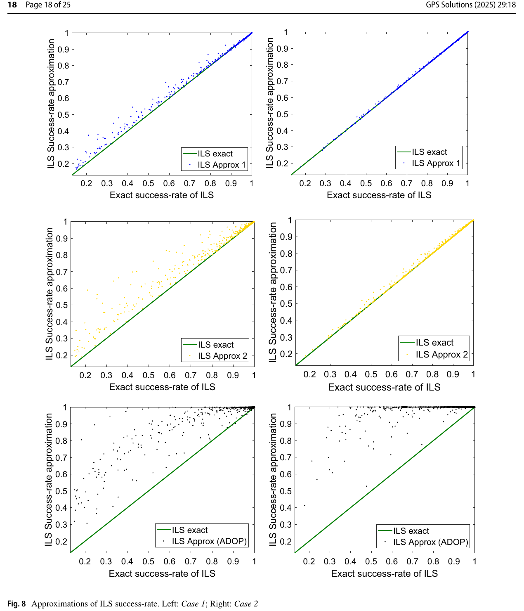
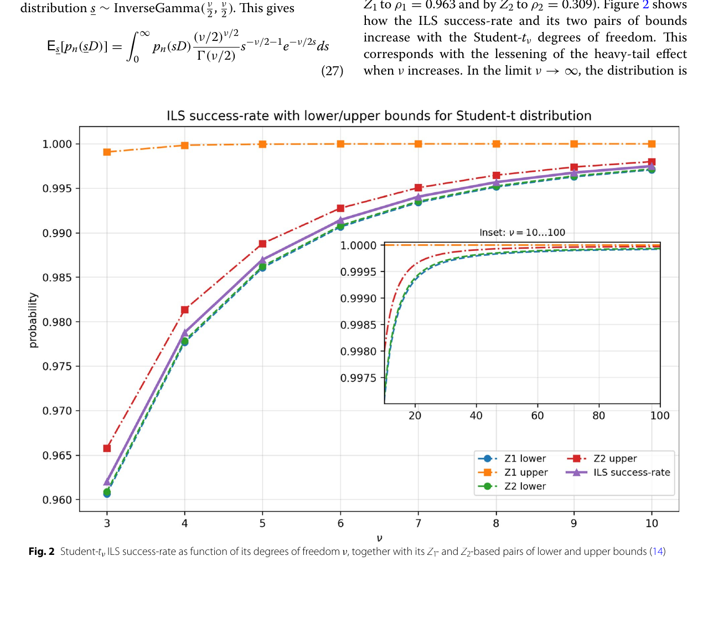
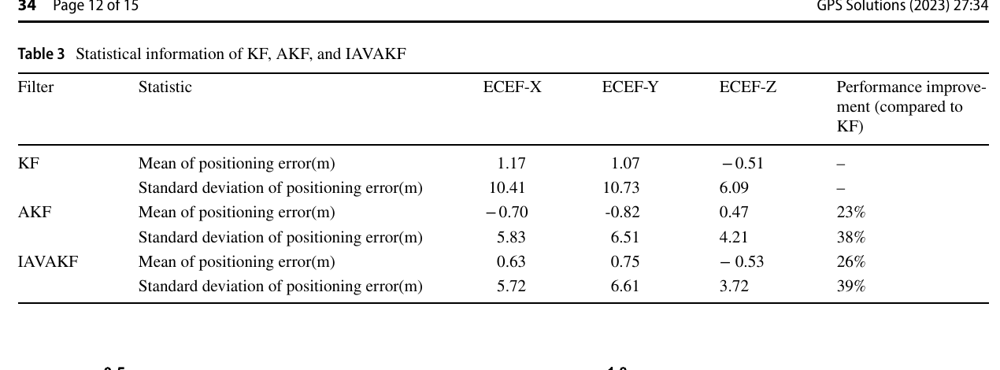

# 2026-08-26 GNSS 每日研究简报

## 今日快报

### 快报 1：没有无误差真值时，用三套仪器互相闭合也要检查“误差独立”是否成立

- 主题：`gnss-mwr-radiosonde-iwv-triple-collocation`
- 来源 ID：`doi:10.3390/atmos17090821`
- 来源链接：https://doi.org/10.3390/atmos17090821
- 发表日期：2026-08-25
- 来源类型：Atmosphere 同行评审开放论文、GNSS/MWR/探空综合水汽三重配置分析
- 获取范围：CC BY 4.0 出版全文、2025-03 至 2026-03 数据、方法、Figures 1—4 与 Tables 1—5

**内容：** 论文把塞浦路斯尼科西亚同一站点的 GNSS、微波辐射计（MWR）和无线电探空综合水汽（IWV）严格时间配准，用 Three-Cornered Hat（TCH）与 Triple Collocation Analysis（TCA）在不指定“绝对真值”的情况下分解三者误差；再以 10,000 次非参数 bootstrap 给置信区间和零截断比例，把无法稳定分离的结果明确标成不稳定。

**结论：** 326 组三元样本中，干季 TCH 误差标准差为 GNSS 1.69、MWR 0.60、探空 0.38 kg/m²；湿季为 GNSS 3.53、MWR 5.79 kg/m²，而探空分量有 98.8% bootstrap 样本需把负方差截为零，不能解释成“探空无误差”。作者还说明 MWR 与探空若在降雨时共享正相关误差，会压低两者估计并抬高 GNSS 估计，因此湿季 GNSS 值更接近上界、MWR 值更接近下界，而不是三套仪器的绝对标定真值。

**关注理由：** GNSS 气象产品的误差评估不能只换一个“参考仪器”就结束。工程上应同时报告配准规则、误差相关性、bootstrap 稳定性和天气分层，否则三角闭合也可能把共模误差分错对象。

### 快报 2：CORS 网设计的毫米级标准误差是部署前传播结果，不是新站已实测的定位精度

- 主题：`egypt-cors-network-extension-adjustment`
- 来源 ID：`doi:10.1038/s41598-026-67304-4`
- 来源链接：https://doi.org/10.1038/s41598-026-67304-4
- 发表日期：2026-08-25
- 来源类型：Scientific Reports 同行评审开放论文、国家级 CORS 网扩展设计与平差仿真
- 获取范围：CC BY 4.0 出版全文、现网 GNSS 数据、网络设计、Figures 1—7 与 Tables 1—9

**内容：** 作者从埃及现有 49 个 GPS/GLONASS CORS 的实际观测估计基线精度系数，再为五个开发区设计三角形或四边形约束网，提出增加 66 站、把网络扩至 115 站；新站间距为 15—95 km，并通过协因数传播求东、北、天与三维位置标准误差。

**结论：** 模型传播得到所有拟建站三维位置标准误差小于 1.8 cm；但这些站尚未建成，论文没有拟建站现场观测，结果只验证给定基线精度模型和约束结构内部一致。Galileo/BDS、当地多路径、通信与站址稳定性也未进入实测验收。

**关注理由：** 参考网规划应把“几何与协方差可行”同“建站后服务可用率”分成两道关。下一阶段必须以真实站址、天线环境、跨季节坐标重复性和用户端 RTK/NRTK 结果复核预测值。

### 快报 3：星载时钟校正若只给更小预测误差，还不足以证明时间保持链可用

- 主题：`bds3-onboard-clock-patchtst-tcn-attention-gru`
- 来源 ID：`doi:10.3389/fspas.2026.1915192`
- 来源链接：https://doi.org/10.3389/fspas.2026.1915192
- 发表日期：2026-08-25
- 来源类型：Frontiers in Astronomy and Space Sciences 已接收原创研究、BDS-3 精密钟差与混合时序网络
- 获取范围：CC BY 出版元数据与完整摘要；最终排版全文在本次获取时尚未发布

**内容：** 方法先用带时间衰减权的最小二乘多项式分离慢变老化漂移，再以 ReVIN 和分块、通道独立 PatchTST 提取局部结构，最后让 TCN—多头注意力—GRU 建模高频残差的长短期相关。

**结论：** 摘要称该模型在真实 BDS-3 精密钟差上优于所选基线，并在训练数据受限时保持稳定；但最终全文、数据切分、预测跨度、各钟型独立性和误差数字尚不可审计，本期不转述任何改善百分比，也不把离线钟差预测等同于星上实时守时认证。

**关注理由：** 时间链部署需要同时核对相位/频率误差、外推不确定度、异常跳变、计算资源和失去外部校准后的保持时间。没有可校准方差的点预测不应直接进入导航钟差产品。

### 快报 4：低空斜视图里，先判“几何上能否共视”再匹配，比只追显著特征更稳

- 主题：`depth-guided-uav-cross-view-visual-localization`
- 来源 ID：`arxiv:2608.22289`
- 来源链接：https://arxiv.org/abs/2608.22289
- 发表日期：2026-08-23
- 来源类型：arXiv 预印本、GNSS 拒止环境低空 UAV 视觉定位
- 获取范围：预印本全文、AnyVisLoc/OrthoLoC 基准、公式、Tables 1—6 与 Figures 1—6；尚未经过同行评审

**内容：** DECO 从单目深度恢复局部表面方向，估计无人机图像特征在正射参考图中的共视可能性，再把几何共视分数与检测器显著性联合排序；保留的 2D 特征与 DSM 中的 3D 点匹配后，以 PnP-RANSAC 解相机位置。

**结论：** 在作者固定的 SuperPoint+LightGlue 设置下，加入 DECO 后 AnyVisLoc 四个场景的 3 m 内成功率分别提高 4.4、10.2、2.8 和 1.8 个百分点；OrthoLoC 跨域/同域提高 0.6/0.4 个百分点。AnyVisLoc 参考块使用真值航向旋转且中心近对齐，OrthoLoC 又把航向差限制在 45° 内，因此结果证明的是受控候选区内的匹配增益，不是无先验全球重定位。

**关注理由：** GNSS 失效后的视觉备份最怕把立面显著点硬匹配到只含屋顶/地面的正射图。共视先验能减少结构性错配，但实装仍需独立评估航向先验错误、DSM 老化、季节变化和算力延迟。

### 快报 5：干扰地图可以复用通信塔与参考站，但“项目已启动”不能写成“检测性能已证实”

- 主题：`esa-navisp-distributed-gnss-interference-monitoring`
- 来源 ID：`esa:2026-no-signal-left-behind`
- 来源链接：https://www.esa.int/Applications/Satellite_navigation/No_signal_left_behind_new_ways_to_detect_jamming_and_spoofing
- 发表日期：2026-08-25
- 来源类型：ESA 官方项目综述、NAVISP GNSS 干扰监测活动
- 获取范围：官方全文与三个项目的阶段说明；不是同行评审性能报告

**内容：** ESA 汇总三条分布式监测路线：SINTEF 的 ARFIDAAS 监听 Galileo/GPS/GLONASS 频段并近实时告警；Dimetor 复用电信塔上的 GNSS 接收机形成国土级传感网；onocoy 在去中心化参考站网内用模拟与采集的欺骗数据训练真假信号分类器。

**结论：** 页面给出了 ARFIDAAS 参与追踪跨欧洲、格陵兰和加拿大的空间干扰事件，以及 onocoy 第一阶段已完成数据模拟、采集和试验；但 Dimetor 与 onocoy 的全国/全球地图、分类器和服务仍以“可望”或未来阶段描述，页面没有统一虚警、漏检、定位误差和跨前端验证表。

**关注理由：** 大范围干扰监测的核心不是单节点报警，而是时间同步、站间一致性和可解释定位。验收应要求共享事件格式、独立真值、跨设备校准和对未见波形的拒判机制。

## 深度研读

### 深读 1｜接收机工程｜整数模糊度不只是“取最近整数”：不同距离决定不同正确固定概率

- 类别：`receiver-engineering`
- 学习层级：`foundation`
- 选题定位：`经典基础`
- 来源 ID：`doi:10.1007/s10291-024-01749-w`
- 来源链接：https://doi.org/10.1007/s10291-024-01749-w
- 发表日期：2024-11-07
- 来源类型：GPS Solutions 同行评审开放论文、IR/IB/ILS 正确估计概率与 PPP 实测
- 获取范围：CC BY-NC-ND 4.0 出版全文、两站 24 h 数据、Figures 1—10 与 Tables 1—9
- 价值评分：97/100（相关性 20，经典价值 19，证据 19，教学价值 20，工程价值 19）

#### 为什么先学这个

RTK/PPP-AR 的厘米级结果来自把实数模糊度映射到整数格点；但逐项舍入、条件舍入和整数最小二乘的“最近”并不是同一种距离。先理解拉入域与正确估计概率，后面才能判断重尾误差怎样改变成功率、又怎样把成功率反馈给动态滤波。

#### 先修知识

需要理解线性最小二乘、协方差矩阵、载波相位整数模糊度、正态分布、条件方差、LAMBDA 去相关、PPP/RTK 浮点解和部分模糊度固定。还要区分模型驱动成功率与数据驱动 ratio 检验。

#### 一句话逻辑

把每种整数估计器写成“将浮点模糊度映射到某个整数格点”的拉入域，正确固定概率就是浮点误差密度落在真实整数拉入域内的积分。

#### 研究问题与约束

论文统一比较 integer rounding（IR）、integer bootstrapping（IB）与 integer least-squares（ILS），提出界与近似并以 GPS、GPS+Galileo 双频 PPP 验证。概率推导假定浮点模糊度正态且协方差可信；两站、单日、静态 PPP 和仿真式“真成功率”不能覆盖城市多路径、接收机故障或真实错固定标签。

#### 核心方法论

IR 用普通欧氏距离逐项舍入；IB 用 $`Q_{\hat a\hat a}=LDL^T`$ 的条件结构顺序舍入；ILS 在完整协方差诱导的 Mahalanobis 距离内搜索整数。作者从拉入域给三者成功率界，并比较新近似、ADOP 近似与蒙特卡洛参考值。

#### 关键公式逐步推导

线性化混合整数模型写为 $`E(y)=Aa+Bb`$、$`D(y)=Q_{yy}`$。先忽略整数约束得到 $`\hat a`$ 与 $`Q_{\hat a\hat a}`$，ILS 再解：

```math
\check a_{ILS}=\arg\min_{z\in\mathbb Z^n}
(\hat a-z)^TQ_{\hat a\hat a}^{-1}(\hat a-z)
```

若真实整数为 $`a`$、对应拉入域为 $`S_a`$，正确估计概率为：

```math
P_s=P(\check a=a)=\int_{S_a}f_{\hat a}(x\mid a)\,dx
```

平移不变性允许把真实整数移到零；ILS 使用全部相关性，IB 使用条件相关性，IR 不使用相关性，因此在同一正态模型下有 $`P_{IR}\le P_{IB}\le P_{ILS}`$。

#### 经典价值与创新边界

经典价值是用一个几何对象——拉入域——统一三类常用整数估计器。论文的新贡献是若干成功率上界、排序与带界近似；它没有改变 LAMBDA 搜索，也没有证明近似在非高斯误差下仍有效。

#### 整体逻辑链

建立混合整数模型；求浮点模糊度与协方差；定义三类拉入域；在正态密度下积分成功率；以易算上下界和近似替代高维积分；LAMBDA 去相关；按成功率做部分固定；用 PPP 数据比较精度、紧度与计算时间。

#### 原文图表与结果分析



> 图源：Wu 等《A study on three commonly used GNSS integer estimators with probability of correct estimation》Figure 8，[DOI 原文](https://doi.org/10.1007/s10291-024-01749-w)，CC BY-NC-ND 4.0。由出版 PDF 第 18 页以 180 dpi 渲染，仅裁出完整 Figure 8、坐标、图例与图题，作为研究评论的最小必要摘录；未重绘、改色或修改数据。

横轴是蒙特卡洛“精确”ILS 成功率，纵轴是近似成功率；左列为单 GPS 双频 Case 1，右列为 GPS+Galileo 双频 Case 2。Approx 1（蓝）最贴近 $`y=x`$，Approx 2（黄）次之，ADOP 近似（黑）在中低成功率区明显偏高。Table 7 进一步给出 Case 2 中误差不超过 1% 的历元比例为 95.7%、93.9% 和 49.5%。图只评价给定正态协方差与同源蒙特卡洛，不证明实际错固定率已被校准。

#### 原文结果论述

作者用两个 IGS 站各 24 h、30 s 采样并每小时重置 EKF；每历元从浮点协方差抽取 $`10^5`$ 个正态模糊度样本作参考。新 ILS 近似比常用 ADOP 近似更接近参考值，新上界在高维 Case 2 中也比需要多向量搜索的 PS-LAMBDA 上界更适合实时计算。

#### 常见误区与适用边界

第一，把成功率当成 ratio 检验后验概率。第二，忽略协方差失配。第三，认为 LAMBDA 去相关会改变精确 ILS 解。第四，用高模型成功率替代独立正确固定标签。第五，把两站静态 PPP 结论外推到动态 RTK。第六，在重尾误差下继续直接使用正态成功率。

#### 工程实现步骤

1. 从浮点滤波器导出 $`\hat a,Q_{\hat a\hat a}`$。
2. 先做 LAMBDA 整数可逆去相关并保留变换矩阵。
3. 计算 IB 下界、所选 ILS 上界与近似值。
4. 成功率不足时缩小固定子集而非强制全固定。
5. 同时记录 ratio、残差与独立基线真值。
6. 按场景回放经验错固定率，审计协方差一致性。

#### 复现实验设计

选两个 IGS 站，GPS 单系统与 GPS+Galileo 双系统，双频、30 s、24 h；按论文使用码/相位标准差 0.3/0.002 m、5° 截止角、每小时重置，成功率阈值 0.995。每历元 $`10^5`$ 次蒙特卡洛，比较 IR/IB/ILS、ADOP 与两种近似；指标为相对偏差、运行时间、正确固定率和 10 cm 内收敛比例。失败场景加入协方差缩放 0.5/2、相关重尾噪声和卫星快速升落。

#### 与定位及低成本实现的联系

成功率提供“这组浮点模糊度在当前模型下有多可固定”的先验质量；低成本接收机协方差更易失配。下一节不再假定误差严格正态，而是把重尾写成随机尺度混合并重新求成功率界。

#### 本节小结

整数固定的可靠性由拉入域和浮点误差分布共同决定；ILS 最优不等于任何近似成功率都可信。

### 深读 2｜接收机工程｜重尾不必重写 LAMBDA：对随机尺度条件化，再把成功率界平均回来

- 类别：`receiver-engineering`
- 学习层级：`intermediate`
- 选题定位：`基础进阶`
- 来源 ID：`doi:10.1186/s43020-026-00211-1`
- 来源链接：https://doi.org/10.1186/s43020-026-00211-1
- 发表日期：2026-08-25
- 来源类型：Satellite Navigation 同行评审开放论文、椭圆分布下 ILS 成功率理论
- 获取范围：CC BY 4.0 出版全文、定理、Student-t/污染正态算例与 Figures 1—3
- 价值评分：98/100（相关性 20，经典价值 20，证据 19，教学价值 20，工程价值 19）

#### 为什么先学这个

上一节的成功率依赖正态浮点误差；城市多路径、间歇遮挡、接收机异常和大气扰动会产生重尾。如果直接把正态方差塞进成功率公式，罕见大误差导致的错固定概率会被系统低估。

#### 先修知识

需要理解 ILS/IB、LAMBDA、条件概率、协方差尺度、Student-t 分布、污染正态、逆 Gamma 分布、Gauss-Laguerre 求积，以及下界、上界与精确成功率的区别。

#### 一句话逻辑

把重尾椭圆分布表示成“协方差乘随机正尺度 $`s`$”的高斯混合；给定 $`s`$ 时沿用原高斯 ILS 界，最后只对 $`s`$ 做一维期望。

#### 研究问题与约束

论文证明适用于一类 Gaussian scale mixture，包括多元 Student-t、污染正态、variance-gamma、generalized hyperbolic 与 Cauchy。理论要求椭圆等密度结构和公共正尺度；方向性离群、非对称 NLOS、星间不同污染率与时间相关并不自动满足。

#### 核心方法论

条件模型为 $`y\mid s\sim N(Aa+Bb,sQ_{yy})`$。BLUE、ILS、IB 与拉入域对正尺度缩放不变，所以算法无需改写；概率随 $`s`$ 改变。用 IB 条件成功率作下界，再用整数向量构成的对偶协方差给上界，对尺度分布取期望即可。

#### 关键公式逐步推导

随机尺度模型为：

```math
y\mid s\sim\mathcal N_m(Aa+Bb,sQ_{yy}),
\qquad s\sim f_s(s),\ s>0
```

若 $`Q_{\hat a\hat a}=L D L^T`$，给定尺度的 IB 成功率为：

```math
P(\check a_{IB}=a\mid s)=
\prod_{i=1}^{n}\left[2\Phi\!\left(\frac{1}{2\sqrt{s d_i}}\right)-1\right]
```

因此 ILS 下界是上式对 $`s`$ 的期望；上界同理。重尾影响只进入一维积分 $`E_s[\cdot]`$，而整数搜索本身保持不变。

#### 经典价值与创新边界

价值在于把成熟的高斯 ILS 理论扩展到重要重尾家族，同时保留计算可行性。创新边界是理论稳健性分析，不是自动估计尺度分布的在线算法，也没有真实 RTK 错固定实验。

#### 整体逻辑链

写出混合整数模型；证明估计映射对尺度不变；用随机尺度生成椭圆分布；调用椭圆分布下 ILS 最优性；给定尺度套用高斯 IB/ILS 界；对尺度一维积分；以 Student-t 和污染正态演示尾部对成功率的影响。

#### 原文图表与结果分析



> 图源：Teunissen《Generalized integer least-squares success-rate bounds under heavy-tailed distributions》Figure 2，[DOI 原文](https://doi.org/10.1186/s43020-026-00211-1)，CC BY 4.0。由出版 PDF 第 7 页以 180 dpi 渲染，裁出完整原图、轴、图例、图题及紧邻的定义说明；未重绘、改色或修改数据。

横轴是 Student-t 自由度 $`\nu`$，纵轴是成功概率；紫色为精确 ILS，蓝/绿为两种下界，橙/红为两种上界。$`\nu=3`$ 时精确成功率约 0.962，随自由度增大逼近高斯极限；LAMBDA 给出的 $`Z_2`$ 把相关系数从 0.998 降至 0.309，其上下界紧贴精确曲线，而仍高相关的 $`Z_1`$ 上界接近 1、辨别力很差。该图使用二维手册协方差算例，不是现场错固定统计。

#### 原文结果论述

作者指出高斯极限的成功率比 $`\nu=3`$ 的 Student-t 情形约高 4%；这说明同一名义协方差下，忽略尾厚会过度乐观。论文也展示污染正态的少量大尺度分量会降低 IB 成功率，且损失随污染比例和尺度增大。

#### 常见误区与适用边界

第一，把 Student-t 自由度当调参而不估计。第二，认为 LAMBDA 去相关消除了重尾。第三，把上界接近 1 当成功率接近 1。第四，把公共尺度混合外推到单星非对称 NLOS。第五，把理论概率当经 ratio 门控后的错固定率。第六，忽略时间相关使有效样本减少。

#### 工程实现步骤

1. 以固定解残差或独立数据拟合高斯、Student-t、污染正态候选。
2. 检查对称性、星间相关和时间相关，确认尺度混合是否合理。
3. LAMBDA 去相关后计算条件 IB/ILS 界。
4. 用 Gauss-Laguerre 或自适应求积完成一维尺度期望。
5. 同时输出高斯与重尾成功率差、参数置信区间。
6. 模型不适配时回退到经验错固定校准或拒绝固定。

#### 复现实验设计

采用论文二维协方差 $`[[0.1680,0.2152],[0.2152,0.2767]]\ \mathrm{cycles}^2`$，比较原参数、$`Z_1`$ 与 LAMBDA $`Z_2`$；扫 $`\nu=3—100`$，以一维求积和 $`10^7`$ 次蒙特卡洛比较精确 ILS、IB 下界、两种上界与正态近似。再用污染正态污染率 0—0.10、尺度 1—100。指标为界宽、相对偏差、运行时间；失败判据是数值积分不收敛或经验成功率落在界外。

#### 与定位及低成本实现的联系

低成本动态 RTK 的遮挡会让固定质量随时间变化。下一节把成功率作为在线门控和遗忘因子，动态调整观测噪声；但也必须审计它仍沿用了正态成功率这一模型边界。

#### 本节小结

重尾改变概率，不必改变整数搜索；正确做法是对随机尺度条件化并平均，而不是继续套用单一高斯方差。

### 深读 3｜定位｜让模糊度成功率调节观测噪声：动基线 RTK 的自适应滤波闭环

- 类别：`positioning`
- 学习层级：`advanced`
- 选题定位：`定位专题：RTK`
- 来源 ID：`doi:10.1007/s10291-022-01367-4`
- 来源链接：https://doi.org/10.1007/s10291-022-01367-4
- 发表日期：2022-12-05
- 来源类型：GPS Solutions 同行评审开放论文、纯 GNSS 动基线 RTK 与完整性监测
- 获取范围：CC BY 4.0 出版全文、静态与双车动态试验、Figures 1—15 与 Tables 1—4
- 价值评分：96/100（相关性 20，经典价值 17，证据 19，教学价值 19，工程价值 21）

#### 为什么先学这个

前两节给出“模型下正确固定概率”。动态 RTK 还需要决定怎样使用这个概率：成功率高时可相信固定解，成功率下降时应更快忘掉旧噪声统计并提高对新观测变化的响应。

#### 先修知识

需要理解双差码/载波、部分模糊度固定、ILS/IB 成功率、Kalman 滤波、创新、测量噪声阵 $`R_k`$、遗忘因子、ECEF/ENU 坐标、保护级（PL）与位置误差（PE）。

#### 一句话逻辑

只在模糊度成功率超过门限时把它映射为遗忘因子，用当前创新更新测量噪声阵和 Kalman 增益；成功率不足则回退到传统自适应滤波。

#### 研究问题与约束

论文面向双车 moving-base RTK：短基线差分减弱钟差和大气误差，剩余遮挡、硬件与多路径使固定噪声模型失配。方法仍用正态 IB 成功率、0.95 门限和高斯位置误差构造 PL；单次约 40 min 车试、最多 15 km，参考轨迹来自另一 NovAtel RTK 解，不是独立全站仪/惯导真值。

#### 核心方法论

先以 PAR/LAMBDA 得到固定子集与条件标准差，计算 $`P_s`$。若 $`P_s>0.95`$，令遗忘因子随 $`P_s`$ 改变，利用创新外积减去预测测量协方差更新 $`R_k^*`$；再重算 $`K_k^*`$ 与状态协方差，并投影到水平/垂直 PL。

#### 关键公式逐步推导

论文采用 IB 形式的模型成功率：

```math
P_s=\prod_{i=1}^{m}\left[2\Phi\!\left(\frac{1}{2\sigma_{i\mid I}}\right)-1\right]
```

将其映射为遗忘因子并更新测量噪声：

```math
\beta_k=\frac{\beta_{k-1}}{\beta_{k-1}+P_s},
\qquad
R_k^*=(1-\beta_k)R_{k-1}^*+
\beta_k(y_ky_k^T-H_kP_kH_k^T)
```

然后在 $`K_k^*=P_k^-H_k^T(H_kP_k^-H_k^T+R_k^*)^{-1}`$ 中使用新噪声阵。$`P_s`$ 越小，$`\beta_k`$ 越大，滤波更快响应新噪声；但低于门限时不使用该闭环。

#### 经典价值与创新边界

工程价值是把模糊度质量从“固定/不固定”二值门控扩展为噪声自适应量，并同时检查位置域 PL。边界是成功率本身仍依赖正态协方差，创新外积更新也可能产生非正定或被故障污染的 $`R_k^*`$；论文未给多日、多接收机或真实注入故障验证。

#### 整体逻辑链

构造移动基站双差模型；求浮点模糊度；PAR/ILS 固定；计算成功率；门限判定；更新遗忘因子与 $`R_k^*`$；重算 Kalman 增益；输出 moving-base RTK；由状态协方差算 HPL/VPL；与位置误差和 KF/AKF 基线比较。

#### 原文图表与结果分析



> 图源：Wang 等《Adaptive Kalman filter based on integer ambiguity validation in moving base RTK》Table 3，[DOI 原文](https://doi.org/10.1007/s10291-022-01367-4)，CC BY 4.0。由出版 PDF 第 12 页以 180 dpi 渲染，裁出完整表题、列名与数值；未重绘、改色或修改数据。

表中 KF 的 ECEF-X/Y/Z 平均误差为 1.17/1.07/−0.51 m，标准差为 10.41/10.73/6.09 m；IAVAKF 为 0.63/0.75/−0.53 m 与 5.72/6.61/3.72 m。作者汇总改善为平均误差 26%、稳定性 39%。这些数值相对另一台接收机的 RTK 轨迹，且“均值误差”保留符号，不能直接视为三维 RMSE 或绝对精度。

#### 原文结果论述

动态试验在山东东营进行约 40 min，最大基线 15 km，至少 8 颗 GPS 可见；600—800 s 和 1100—1300 s 附近树木引起卫星数跳变。2,164 个历元中，论文 Table 4 报告 KF 垂直/水平 PE>PL 为 40/53 历元，IAVAKF 样本内均为 0；这只是无注入故障、同一试验下的经验结果，不等于已证明目标完整性风险。

#### 常见误区与适用边界

第一，把模型成功率当独立验收概率。第二，把参考 RTK 解当零误差真值。第三，用带符号平均误差计算“精度改善”。第四，创新含故障时仍直接更新 $`R_k`$。第五，不检查 $`R_k^*`$ 对称正定。第六，把样本内零 PE>PL 写成安全认证。第七，忘记门限以下应回退。

#### 工程实现步骤

1. 统一基站/流动站观测、时间与双差参考星切换。
2. 以 PAR 选择高质量模糊度子集并计算条件方差。
3. 同时计算正态与重尾成功率，记录模型分歧。
4. 通过门限后更新 $`\beta_k,R_k^*`$，并做正定投影和上下限约束。
5. 失败时回退 AKF/浮点解，禁止沿用可疑固定。
6. 输出固定状态、成功率、创新、HPL/VPL 和主导风险源。

#### 复现实验设计

双频 GPS，基线 0—15 km，1 Hz，40 min；比较 KF、Sage-Husa AKF、原 IAVAKF 与重尾成功率门控 IAVAKF。固定门限扫 0.95/0.99/0.999，加入 20 s 树遮、单星 0.2/0.5 周相位偏差、码多路径 5/20 m 与参考星切换。真值用独立战术级 INS/RTK 或全站仪。指标为错固定率、ECEF/ENU RMSE、95/99 分位、PE>PL、可用率、恢复时间、$`R_k^*`$ 条件数与计算延迟。

#### 与定位及低成本实现的联系

纯 GNSS moving-base RTK 可用于车队相对定位和动态基线测量；低成本接收机更需要噪声自适应，但也更易出现非高斯、多星相关误差。把第二节的重尾成功率接入本节门控，比单纯调低固定门限更有物理依据。

#### 本节小结

成功率可成为滤波器的连续质量信号，但闭环安全取决于成功率模型、噪声阵约束和独立真值，而不是样本内零越界。
