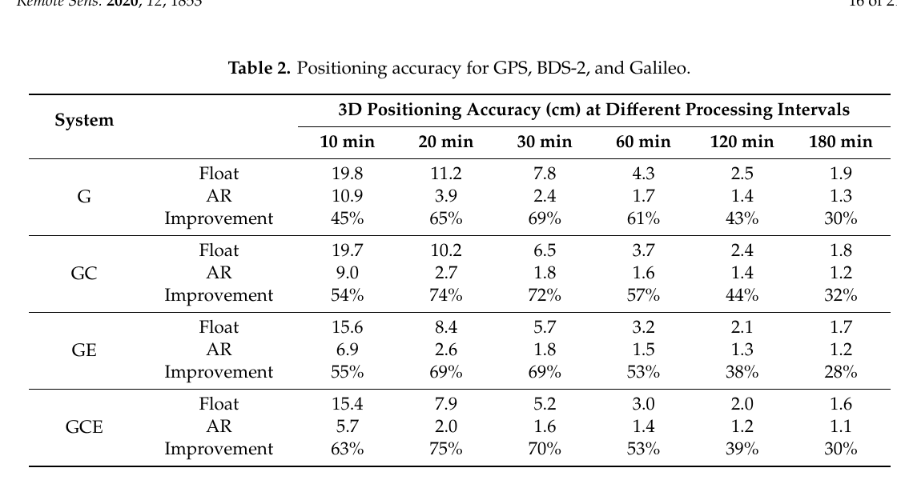
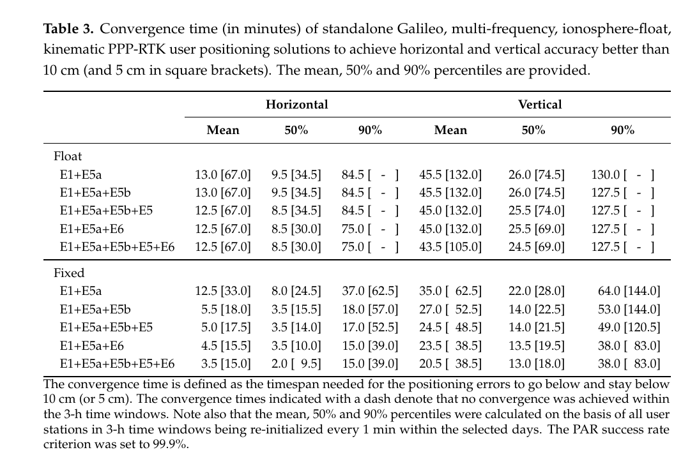
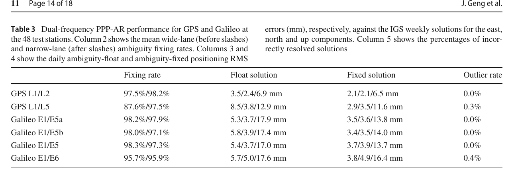

# 2026-08-27 GNSS 每日研究简报

## 今日快报

### 快报 1：BDS 失锁时引入 eLoran，先保证“仍有外部时间约束”，再谈保持精度

- 主题：`bds-eloran-tcxo-three-layer-time-fusion`
- 来源 ID：`doi:10.3390/s26175397`
- 来源链接：https://doi.org/10.3390/s26175397
- 发表日期：2026-08-26
- 来源类型：Sensors 同行评审开放论文、TCXO/BDS/eLoran 多源授时受控仿真
- 获取范围：CC BY 4.0 出版全文、24 h 仿真、实际 30 s BDS RINEX 质量指标、Figures 1—9

**内容：** 方法以数字温补 TCXO 提供短期连续输出，以 Allan 方差构造过程噪声；BDS 可靠度由 $`C/N_0`$、可用星数、DOP 与码率残差等共同决定并自适应放大观测协方差。BDS 不可靠或中断时切换至 30 s 更新的 eLoran，滤波创新还可在门控条件满足时反馈到温补系数。

**结论：** 在作者设定的 24 h 受控仿真中，12—16 h 的 BDS 中断使仅靠 TCXO 预测的最大中断误差达到 13.47—13.52 µs；加入模拟 eLoran 后降至约 254—255 ns。这个数字依赖发射台同步、传播延迟和附加二次相位因子（ASF）的建模与标定；真实 RINEX 只用于质量指标，TCXO、BDS 授时观测与 eLoran 观测仍是受控构造，不能写成实物系统验收结果。

**关注理由：** 韧性 PNT 的首要问题是源失效后是否仍可观测，而不是只比较稳态 RMSE。工程验收应把外部冗余、传播偏差标定、切换跳变和振荡器自由保持分别统计。

### 快报 2：用 IMU 时序修 GNSS/INS 跳变，特定试验域改善不能替代跨城泛化验证

- 主题：`cnn-gru-gnss-ins-position-jump-correction`
- 来源 ID：`doi:10.3390/s26175370`
- 来源链接：https://doi.org/10.3390/s26175370
- 发表日期：2026-08-25
- 来源类型：Sensors 同行评审开放论文、城市峡谷车载 GNSS/INS 与 CNN-GRU 校正
- 获取范围：CC BY 4.0 出版全文、15 维误差状态模型、车载试验、消融与敏感性分析、Tables 1—5

**内容：** 论文先用 15 维误差状态 EKF 分解伪距畸变、惯导漂移与增益失配三条跳变路径，再让一维 CNN 提取多轴 IMU 跨通道特征、改进 GRU 学习时间演化；迟滞质量因子与分段 Huber 损失分别处理大跳变和轻微抖动。

**结论：** 在作者的城市峡谷数据上，CNN-GRU 将 RMSE 从原始 GNSS 的 1.24 m 降至 0.70 m，最大跳变为 0.48 m，论文定义的跳变抑制率为 43.5%，单帧推理 11.8 ms；5 s、10 Hz 历史窗是其选择的折衷。数据需向通信作者申请，训练/验证域并未覆盖新城市、新天线或新固件，因此这些数字是同一实验域内的比较，不是通用车规保证。

**关注理由：** 学习型校正可利用 IMU—GNSS 不一致，但最危险的是把路线记忆当成误差机理。部署前应按路线、天气、接收机和日期隔离数据，并保留残差门控与经典滤波回退。

### 快报 3：两颗新 Galileo 星的质量、质心、ARP 与多频 PCO 已进入官方元数据

- 主题：`galileo-gsat0233-gsat0234-precise-metadata`
- 来源 ID：`gsc:2026-gsat0233-gsat0234-metadata`
- 来源链接：https://www.gsc-europa.eu/news/updated-metadata-information-for-galileo-satellites-gsat0233-and-gsat0234
- 发表日期：2026-07-24
- 来源类型：European GNSS Service Centre 官方技术更新、Galileo 卫星元数据与 ANTEX
- 获取范围：官方页面全文、质量/质心/ARP/PCO 表与 ANTEX 更新说明

**内容：** GSAT0233（SVID 28）和 GSAT0234（SVID 32）在 2025-12-17 发射后，GSC 增补了质量、质心、机械坐标系与 ANTEX 坐标系下的天线参考点，以及 E1、E5a、E6、E5b、E5 的相位中心偏移；ANTEX 同时加入相位中心变化图。

**结论：** 例如两星质量分别为 708.216 kg 和 705.601 kg；GSAT0233 的 E1 天线坐标系 PCO 为 $`(-1.56,0.02,37.35)`$ mm，而 GSAT0234 为 $`(0.78,1.78,84.00)`$ mm。页面给的是卫星级校准输入，不是使用这些参数后 PPP 精度改善的独立对照试验。

**关注理由：** 精密定轨与 PPP 不应长期沿用缺省卫星模型。产品生成端和用户端必须同步元数据版本，否则姿态、天线和钟偏差可能在不同中心间形成毫米至厘米级不一致。

### 快报 4：PRIDE PPP-AR 3.2.10 把全频定整、50 Hz 高动态和多日处理放进同一开源链

- 主题：`pride-pppar-3-2-10-multignss-all-frequency`
- 来源 ID：`github:pridelab-pride-pppar-v3.2.10`
- 来源链接：https://github.com/PrideLab/PRIDE-PPPAR
- 发表日期：2026-07-12
- 来源类型：武汉大学 PRIDE Lab 官方开源项目页、GPLv3 GNSS PPP-AR 软件
- 获取范围：官方 README、3.2.10 更新说明、功能与产品依赖清单；不是独立性能论文

**内容：** 版本页列出 GPS、GLONASS、Galileo、BDS-2/3 与 QZSS，多日最多 108 d（30 s 采样）、最高 50 Hz、高动态平台、LEO 运动学定轨、Bias-SINEX/ORBEX/RINEX 4，以及基于 WUM 快速轨道/钟/偏差/ERP/四元数产品的任意双频组合 PPP-AR。

**结论：** 这些是项目维护者声明的能力边界与输入要求，不是同一版本在所有系统、频率、平台和 50 Hz 负载下的统一验收数据。尤其“全频”仍要求相容的 WUM 产品；软件能接受某种输入不等于该输入的质量或可用率已被证明。

**关注理由：** 可复现 PPP-AR 不只需要论文公式，还需要版本化的软件、精密产品和格式约定。工程基准应同时锁定提交号、配置、产品中心、信号组合与站点列表。

### 快报 5：Galileo 季报把 OS、HAS、OSNMA 与 SAR 分开验收，不能用一个“系统可用率”概括

- 主题：`galileo-q1-2026-service-performance-reports`
- 来源 ID：`gsc:2026-q1-performance-reports`
- 来源链接：https://www.gsc-europa.eu/news/galileo-performance-reports-for-q1-2026-are-now-available
- 发表日期：2026-06-04
- 来源类型：European GNSS Service Centre 官方 2026 年第一季度服务性能报告入口与摘要
- 获取范围：官方页面全文、OS/HAS/OSNMA/SAR 分项指标与最低性能水平对照

**内容：** 官方按开放服务测距、HAS 改正覆盖、OSNMA MAC 可用性和 SAR 检测/定位分别核对最低性能水平（MPL），避免把不同服务、时间窗和置信水平混成单一可用率。

**结论：** 页面报告双频单星月均测距精度为 0.15—0.57 m、全星座按信号平均不劣于 0.29 m；OSNMA ADKD0 在 30 s 内至少四星可用达到 95% MPL。SAR 单次突发 5 km 内定位准确率在 La Réunion 与 Kerguelen 的部分一月统计低于 90% MPL，而多次突发大多满足门限，说明“总体超标”仍需保留局地、月份与服务分项例外。

**关注理由：** 用户算法的验证门限必须对应实际服务定义。把星历测距、改正覆盖、认证消息和搜救链路混成一个健康标志，会隐藏真正的失败模式。

## 深度研读

### 深读 1｜接收机工程｜未组合 PPP 为什么还能定整：先把系统间偏差与分数周偏差分开估

- 类别：`receiver-engineering`
- 学习层级：`foundation`
- 选题定位：`经典基础`
- 来源 ID：`doi:10.3390/rs12111853`
- 来源链接：https://doi.org/10.3390/rs12111853
- 发表日期：2020-06-10
- 来源类型：Remote Sensing 同行评审开放论文、GPS/BDS-2/Galileo 未组合 PPP-AR
- 获取范围：CC BY 4.0 出版全文、24/316 个 MGEX 站、公式、Figures 1—18 与 Tables 1—4
- 价值评分：96/100（相关性 20，经典价值 18，证据 19，教学价值 20，工程价值 19）

#### 为什么先学这个

PPP 不做站间差分，接收机与卫星硬件偏差会进入原始模糊度；若直接把滤波器里的实数模糊度送入 LAMBDA，“整数”前提并不成立。本节先建立未组合观测账本，理解系统间偏差（ISB）、宽巷/窄巷分数周偏差（FCB）和用户端单差怎样恢复整数性。

#### 先修知识

需要理解伪距与载波相位、接收机钟和卫星钟、对流层/电离层、宽巷与窄巷组合、卫星间单差、协方差传播、LAMBDA、GPS/BDS/Galileo 频率与接收机系统间偏差。

#### 一句话逻辑

保留每个频点的原始观测，显式估计系统间偏差，用参考网把卫星相关的模糊度小数部分压缩成 FCB，再在用户端卫星间单差消去接收机公共偏差并固定整数。

#### 研究问题与约束

论文要回答未组合多 GNSS PPP-AR 是否能同时保持模型灵活性与快速收敛。它以 2019-09-03 的 24 个站研究 ISB，以 316 个 MGEX 站估 FCB，再用 90 个站和分段重启解评估定位。BDS-2 可见性和 GEO 几何有限，产品与用户数据同属 MGEX 生态，结论不能直接外推到 BDS-3、新信号或城市低成本前端。

#### 核心方法论

双频原始码与相位分别建模，GPS 接收机钟作基准，BDS-2/Galileo 通过 ISB 接入；宽巷 FCB 从 Melbourne—Wübbena 型组合的小数部分估计，窄巷 FCB 从电离层无关模糊度估计。用户端先做卫星间单差，再固定宽巷和窄巷，最后把整数约束反馈到位置、钟差、对流层和电离层状态。

#### 关键公式逐步推导

对系统 $`s`$、频率 $`j`$ 的未组合相位，可写成：

```math
L_{r,j}^{s}=\rho_r^s+c(\delta t_r-\delta t^s)+T_r^s-\mu_j I_r^s
+\lambda_j N_{r,j}^{s}+b_{r,j}^{s}-b_{j}^{s}+\varepsilon_{L}
```

滤波得到的 $`\hat N`$ 包含接收机与卫星相位/码偏差。选参考星 $`q`$ 后，卫星间单差 $`\Delta_{sq}`$ 消去同系统接收机公共项；再用服务端 FCB $`f_s-f_q`$ 校正：

```math
\tilde N_{r,sq}=\Delta_{sq}\hat N_r-\left(f_s-f_q\right),
\qquad \check N_{r,sq}\in\mathbb Z
```

多系统时还需把 ISB 作为接收机相关状态，而不是误塞进某颗卫星的 FCB。

#### 经典价值与创新边界

价值在于把“组合后定整”展开回每个原始频率，展示 ISB、FCB 与模糊度之间的可估关系。创新边界是 GPS/BDS-2/Galileo 双频案例；它没有提供跨分析中心产品互操作，也没有解决任意多频信号的统一偏差基准。

#### 整体逻辑链

写原始码/相位模型；选钟与 ISB 基准；参考网估浮点模糊度；提取宽巷/窄巷 FCB；用户端应用产品；卫星间单差；LAMBDA 固定；整数约束回代；比较单系统、双系统和三系统的固定率、定位误差与收敛时间。

#### 原文图表与结果分析



> 表源：Zhang 等《GPS/BDS-2/Galileo Precise Point Positioning Ambiguity Resolution Based on the Uncombined Model》Table 2，[DOI 原文](https://doi.org/10.3390/rs12111853)，CC BY 4.0。由出版 PDF 第 16 页以 180 dpi 渲染，仅裁出完整 Table 2；未重绘、改色或修改数据与标签。

表列出 10—180 min 不同处理时长下的三维 RMS，G/GC/GE/GCE 分别表示 GPS、GPS+BDS-2、GPS+Galileo、三系统。10 min 时 GCE 浮点/固定为 15.4/5.7 cm，固定解改善 63%；30 min 为 5.2/1.6 cm。表直接支持在该数据和产品下多系统加整数固定更快，但各方案可见星数、几何与偏差产品同时改变，不能把全部收益归因于某一个星座。

#### 原文结果论述

作者以三维 RMS 持续低于 10 cm 定义收敛；G、GC、GE、GCE 的浮点收敛为 22、20.5、16.5、16 min，固定后为 10.5、9.5、8、7.5 min。10 min 的成功固定率由 GPS 单系统 75.5% 升至三系统 99.0%，但这是同一处理框架内的样本比例，不是固定错误概率的独立完整性界。

#### 常见误区与适用边界

第一，把原始模糊度天然视为整数。第二，混淆接收机 ISB 与卫星 FCB。第三，认为未组合模型不需要基准约束。第四，只报固定率而不报错固定。第五，把多星座几何收益与定整收益重复计数。第六，认为旧 BDS-2 结果自动代表 BDS-3。

#### 工程实现步骤

1. 明确每个 RINEX 观测码与频率。
2. 固定卫星钟、码偏差和相位偏差所用基准。
3. 逐系统估接收机钟与 ISB。
4. 参考网按连续弧段估宽巷/窄巷 FCB。
5. 用户端选稳定参考星并传播单差协方差。
6. 先宽巷后窄巷定整，失败时保留浮点解。
7. 用独立坐标审计固定率、错固定率和重收敛。

#### 复现实验设计

取 30 个 MGEX 参考站与 10 个不重叠用户站，GPS/BDS-2/Galileo 双频、30 s、24 h；生成日 FCB，用户端每 30 min 重启。比较 G、GC、GE、GCE 的浮点/固定解；指标为 10/30/60 min 三维 RMS、首次持续低于 10 cm 时间、宽巷/窄巷固定率和已知坐标下错固定率。失败场景加入单系统断星、ISB 随机游走、FCB 断点与伪距多路径。

#### 与定位及低成本实现的联系

未组合模型适合多系统多频前端，但低成本码噪声会直接污染宽巷。下一节进一步问：频率越多是否一定越快，还是频率间隔和额外码偏差产品更关键。

#### 本节小结

PPP 定整的核心不是“调用 LAMBDA”，而是先用明确的钟与偏差基准恢复模糊度整数性。

### 深读 2｜接收机工程｜多一个频点不等于多一份信息：PPP-RTK 收敛更看频率间隔

- 类别：`receiver-engineering`
- 学习层级：`intermediate`
- 选题定位：`基础进阶`
- 来源 ID：`doi:10.3390/rs13163077`
- 来源链接：https://doi.org/10.3390/rs13163077
- 发表日期：2021-08-05
- 来源类型：Remote Sensing 同行评审开放论文、五频 Galileo PPP-RTK 形式与实测分析
- 获取范围：CC BY 4.0 出版全文、澳大利亚网络与 7 个用户站、Figures 1—7 与 Tables 1—4
- 价值评分：98/100（相关性 20，经典价值 19，证据 20，教学价值 20，工程价值 19）

#### 为什么先学这个

上一节说明怎样恢复整数性，但“加频率”会同时增加观测与待定模糊度。只有新增频率相对已有频率提供足够不同的电离层尺度和宽巷几何，模型强度才会明显提高。

#### 先修知识

需要理解未组合 PPP-RTK、S 基准、整数最小二乘成功率、部分模糊度固定（PAR）、电离层浮点模型、卫星码偏差、Kalman 滤波收敛和 Galileo E1/E5a/E5b/E5/E6 频点。

#### 一句话逻辑

在相同观测噪声下，第三频率离基准双频越远，生成的宽巷越长、模糊度与电离层越容易分离；因此 E6 或 E5b 可比“更近但更多”的频点带来更大收敛收益。

#### 研究问题与约束

论文用形式成功率与澳大利亚实测回答频率数量、间隔和卫星码偏差对收敛的相对作用。实测为开阔参考站、固定产品网络和 3 h 滑窗，90% 分位依赖站网、噪声模型和 PAR 门限 99.9%；它不是城市、手机或全球实时服务保证。

#### 核心方法论

网络端用未差未组合模型估轨钟外的 PPP-RTK 改正；用户端保留斜电离层。作者先改变假设中的第三频率，计算全固定成功率、条件标准差和 PAR 可用率，再以真实 E1/E5a/E5b/E5/E6 数据逐步加频，统计水平/垂直误差持续低于 10 cm 与 5 cm 的时间。

#### 关键公式逐步推导

对频率 $`f_j`$，一阶电离层比例为 $`\mu_j=f_1^2/f_j^2`$。两频 $`j,k`$ 的几何自由相位组合包含：

```math
L_j-L_k=-(\mu_j-\mu_k)I
+\lambda_j N_j-\lambda_k N_k+\varepsilon_{jk}
```

若频率间隔增大，$`|\mu_j-\mu_k|`$ 与相应整数线性组合的可辨识结构改变。对浮点模糊度 $`\hat a`$ 及协方差 $`Q_{\hat a\hat a}`$，固定仍解：

```math
\check a=\arg\min_{z\in\mathbb Z^n}
(\hat a-z)^TQ_{\hat a\hat a}^{-1}(\hat a-z)
```

新增频率只有在改善 $`Q_{\hat a\hat a}`$ 的条件精度时才真正加速固定；否则只增加维数和算力。

#### 经典价值与创新边界

经典价值是把“多频更好”改写为可检验的模型强度问题，并同时考察码偏差产品。创新边界是 Galileo 主导的特定 S 基准和澳大利亚数据；未覆盖频率相关多路径、信号间硬件相关性或不同厂家噪声。

#### 整体逻辑链

建立网络/用户未组合模型；选择 S 基准；分析额外码偏差可估性；扫描虚拟第三频率；计算成功率和 PAR；确定 E5b/E6 候选；生成真实改正；逐频点回放 3 h 用户解；统计分位收敛；再加入 GPS 检验几何与冗余收益。

#### 原文图表与结果分析



> 表源：Psychas、Teunissen 与 Verhagen《A Multi-Frequency Galileo PPP-RTK Convergence Analysis with an Emphasis on the Role of Frequency Spacing》Table 3，[DOI 原文](https://doi.org/10.3390/rs13163077)，CC BY 4.0。由出版 PDF 第 15 页以 180 dpi 渲染，仅裁出完整 Table 3；未重绘、改色或修改数据与标签。

表中圆括号外为持续优于 10 cm 的时间，方括号内为 5 cm；每列给均值、50% 与 90% 分位。双频 E1+E5a 固定解水平 90% 收敛需 37.0 min，加入 E5b 降为 18.0 min，加入 E6 的三频解与五频解均为 15.0 min。直接读数说明远间隔 E6 已获取主要收益，但不证明 E6 在所有天线、噪声和地区下都优于其他组合。

#### 原文结果论述

五频 Galileo 水平 90% 收敛为 15 min；卫星码偏差作为外部改正时，部分组合还可再缩短最多 4 min。GPS+Galileo 后，水平误差持续低于 10 cm 的平均/90% 时间为 3/5 min。该联合结果仍来自同一澳大利亚网络改正和站点样本，不代表无需区域大气约束就能全球瞬时固定。

#### 常见误区与适用边界

第一，按频点数量而非间隔选信号。第二，忽略额外频点的码偏差。第三，把形式成功率当实测正确率。第四，只看均值不看 90% 尾部。第五，把 3 h 滑窗的重启样本当完全独立。第六，把参考站结果外推到手机。

#### 工程实现步骤

1. 计算所有可用频率的 $`\mu_j`$ 与有效宽巷。
2. 从前端实测码/相位噪声构造协方差，而非统一常数。
3. 分别评估 E1+E5a、加 E5b、加 E6 和五频。
4. 检查服务端是否发布对应码/相位偏差。
5. 以固定失败率门限做 PAR，而非强制全固定。
6. 同时报 50%/90% 收敛、错固定与计算负载。

#### 复现实验设计

选 20 个澳大利亚参考站与 7 个不重叠用户站，30 s、三天，3 h 窗每 1 min 重启；比较 E1+E5a、+E5b、+E6、五频及 GPS+Galileo。基线为双频浮点、双频 PAR 和不提供额外码偏差；指标为 10/5 cm 的均值/50%/90% 收敛、PAR 成功率、错固定率、状态维数和每历元耗时。失败场景加入 E6 缺测、第三频点码偏差 0.5 ns 阶跃与低仰角多路径。

#### 与定位及低成本实现的联系

低成本接收机通道有限时，应优先保留能最大化模型强度且有相容偏差产品的信号。下一节把这种“信号选择自由”推进到产品层：如何用一套基准钟和逐观测量 OSB 支持任意双频组合。

#### 本节小结

多频 PPP-RTK 的收益由频率几何、偏差产品和观测质量共同决定；五频并不必然优于选对的三频。

### 深读 3｜定位｜把相位偏差发到每个观测量：一套钟怎样支持全频 PPP-AR

- 类别：`positioning`
- 学习层级：`advanced`
- 选题定位：`定位深入`
- 来源 ID：`doi:10.1007/s00190-022-01602-3`
- 来源链接：https://doi.org/10.1007/s00190-022-01602-3
- 发表日期：2022-02-04
- 来源类型：Journal of Geodesy 同行评审开放论文、GPS/Galileo 全频 OSB PPP-AR
- 获取范围：CC BY 4.0 出版全文、122 个产品站与 48 个独立测试站、30 d、Figures 1—9 与 Tables 1—3
- 价值评分：99/100（相关性 20，经典价值 20，证据 20，教学价值 20，工程价值 19）

#### 为什么先学这个

前两节仍让用户服从产品中心规定的频率组合。现代接收机可能跟踪 GPS L1/L5 或 Galileo E1/E6；若偏差只按传统宽巷/窄巷组合发布，换频率就要重新转换卫星钟，容易破坏基准一致性。

#### 先修知识

需要理解未组合 PPP、码/相位 OSB、Bias-SINEX、模糊度固定卫星钟、基准频率、频间钟偏差（IFCB）、Melbourne—Wübbena、接收机类型相关码偏差和日解 RMS。

#### 一句话逻辑

先让码 OSB 与传统卫星钟共享同一偏差基准，再在基准频率固定模糊度并重估相位钟，最后为每个第三频率求相位 OSB，于是用户可直接从原始观测扣偏差并任选频率定整。

#### 研究问题与约束

论文要实现 GPS L1/L2/L5 和 Galileo E1/E5a/E5b/E5/E6 的任意双频 PPP-AR。产品端用 122 个全球站，用户端用不重叠的 48 站，覆盖 2020 年 11 月 30 d。测试主要是静态日解，GPS L5 星数少且部分 Trimble 伪距出现类型相关偏差；全频能力不等于所有接收机/信号同质。

#### 核心方法论

第一步，以与传统钟相容的码 OSB 解耦基准频率码偏差。第二步，固定基准频率未差模糊度并重估卫星相位钟。第三步，在固定相位钟条件下估第三频率相位 OSB；随时间变化的 IFCB 用 15 min 分段线性参数。用户端直接改正原始码相位，按所选两频构造宽巷/窄巷并固定。

#### 关键公式逐步推导

对观测码 $`q`$，改正后的相位写为：

```math
L_{i,q}^{k}+D_q^k
=\rho_i^k+c(t_i-\bar t^k)-\mu_q I_i^k
+\lambda_q\tilde N_{i,q}^{k}+\varepsilon_{L,q}
```

其中 $`D_q^k`$ 为码 OSB，$`\bar t^k`$ 是与基准码 OSB 一致且已固定模糊度的卫星钟。论文的 Equation (15) 要求用户按观测量直接校正：

```math
\hat P_{i,q}^{k}=P_{i,q}^{k}-D_q^k,
\qquad
\hat L_{i,q}^{k}=L_{i,q}^{k}-\lambda_q\tilde b_q^k
```

这里 $`\tilde b_q^k`$ 是含时变 IFCB 的第三频率相位 OSB。真正关键不是减法本身，而是码 OSB、相位 OSB 与 $`\bar t^k`$ 必须处于同一秩亏基准。

#### 经典价值与创新边界

价值是把组合专用偏差改成观测量专用产品，让 RINEX 原始观测可直接改正，并与 Bias-SINEX 思路一致。创新边界是 GPS/Galileo 和指定月份；没有验证 BDS、GLONASS FDMA、实时产品延迟或动态用户。

#### 整体逻辑链

选择基准频率；对齐码 OSB 与传统钟；参考网固定基准模糊度；重估相位钟；估第三频率 OSB/IFCB；回灌 122 站查模糊度残差；用 48 个独立站逐组合定整；按接收机类型定位异常；比较浮点/固定日解与离群率。

#### 原文图表与结果分析



> 表源：Geng 等《GNSS observable-specific phase biases for all-frequency PPP ambiguity resolution》Table 3，[DOI 原文](https://doi.org/10.1007/s00190-022-01602-3)，CC BY 4.0。由出版 PDF 第 14 页以 180 dpi 渲染，仅裁出完整 Table 3；未重绘、改色或修改数据与标签。

表中固定率斜线前后分别为宽巷/窄巷；浮点与固定列依次为东/北/天日解 RMS，离群定义为水平偏离 IGS 周解超过 5 cm。GPS L1/L5 宽巷固定率 87.6%，明显低于 L1/L2 的 97.5%，但窄巷仍为 97.5%；Galileo 各组合宽窄巷多在 95.7%—98.3%。这揭示前端码偏差可伤害宽巷，却不能由同一表证明异常全部来自 Trimble 硬件。

#### 原文结果论述

122 个产品站中，各组合约 95% 的宽巷/窄巷残差分别落在 $`\pm0.25`$ 与 $`\pm0.15`$ cycle；48 个独立站的平均固定率约 95%。固定使各双频方案东向日解 RMS 改善 30%—60%，水平离群率不超过 0.4%。GPS L1/L2 仍因可见星和模型成熟度取得最好绝对 RMS，说明“可定整”不等于各频率性能相等。

#### 常见误区与适用边界

第一，认为 OSB 可与任意中心的钟混用。第二，把码 OSB 与相位 OSB 的基准混为一谈。第三，忽略第三频率 IFCB 的时间变化。第四，只看平均固定率掩盖接收机类型偏差。第五，把静态日解外推到动态快速收敛。第六，把离群阈值 5 cm 当完整性保证。

#### 工程实现步骤

1. 解析 Bias-SINEX 观测码、单位、时间间隔和基准。
2. 检查轨道、钟、码 OSB、相位 OSB 与四元数来源一致。
3. 对第三频率建 IFCB 分段参数并监控断点。
4. 逐观测量改正原始 RINEX，不在组合后重复扣偏差。
5. 按接收机型号统计宽巷残差与固定率。
6. 错配产品或偏差缺失时自动回退浮点 PPP。
7. 用独立站和独立中心周解验收。

#### 复现实验设计

用 60 个参考站生成 GPS L1/L2/L5 与 Galileo 五频 OSB，另选 20 个不重叠站，连续 30 d、30 s；比较 L1/L2、L1/L5、E1/E5a、E1/E5b、E1/E5、E1/E6。基线为组合 FCB、无第三频率 IFCB、错配另一中心钟；指标为 $`\pm0.15/0.25`$ cycle 残差比例、宽窄巷固定率、东/北/天 RMS、5 cm 离群率与产品连续性。失败场景加入 OSB 15 min 断点、钟基准错配和特定接收机 L5 码偏差。

#### 与定位及低成本实现的联系

OSB 让用户按前端真实可用信号选频，适合频点不齐的低成本设备；但码噪声和型号相关偏差仍会先伤害宽巷。产品可移植性必须以基准一致和接收机分型验证为前提。

#### 本节小结

全频 PPP-AR 的本质是统一偏差基准后逐观测量改正；“一套钟支持多频”成立的条件比公式本身更重要。
