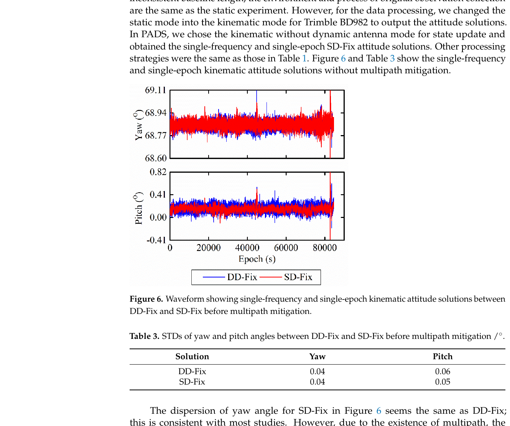
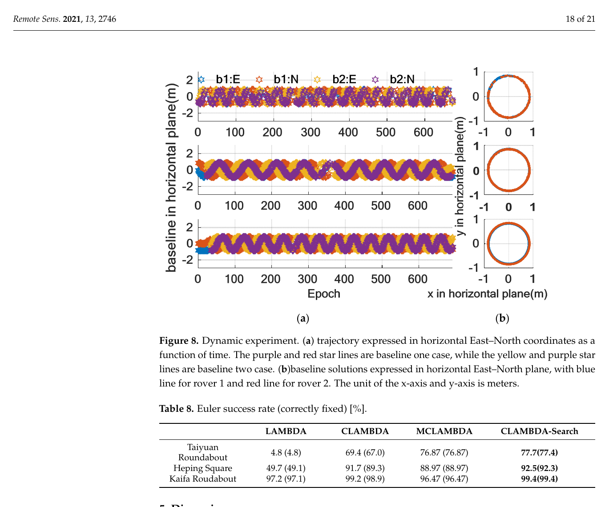
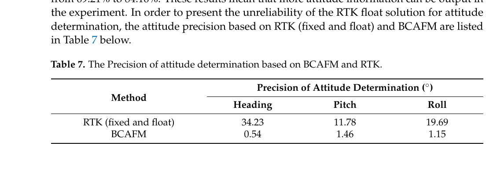

# 2026-08-28 GNSS 每日研究简报

## 今日快报

### 快报 1：低成本 RTK 能把油棕种植点放进 10 cm 容差，但通信距离与正射底图仍是同一条误差链

- 主题：`low-cost-oil-palm-rtk-lora-orthophoto`
- 来源 ID：`doi:10.5614/itbj.ict.res.appl.2026.20.2.4`
- 来源链接：https://doi.org/10.5614/itbj.ict.res.appl.2026.20.2.4
- 发表日期：2026-08-27
- 来源类型：Journal of ICT Research and Applications 同行评审论文、低成本 RTK/LoRa/无人机正射图田间系统
- 获取范围：出版页面、完整摘要、系统构成、10—100 m 通信试验与种植布点结果；本次未取得可逐页审计的出版 PDF

**内容：** 作者以 ArduSimple RTK2B、多频天线、Raspberry Pi、LoRa E220 和手机端 SW Maps 组成基准站—流动站系统；RTCM 经 LoRa 传输，ArcGIS 设计的方形与三角形种植点叠加到无人机正射图上，再由流动站引导现场放样。测试把基准点精度、10—100 m 分段的包交付率/丢包率、两种布点形态和商业园区实况分开评价。

**结论：** 摘要报告流动站水平误差 8.95 cm；方形布点平均误差 8.40 cm、RMSE 9.3 cm，三角形为 7.78 cm、RMSE 9.1 cm，均低于作者采用的 10 cm 容差。这里的数字来自该场地、该底图和该短距 LoRa 链，不能单独证明密林遮挡、坡地正射误差或更长回传距离下仍满足 10 cm。

**关注理由：** 精准农业的“低成本厘米级”不只是接收机指标。工程验收应同时记录固定解比例、改正龄期、LoRa 丢包、底图地面分辨率与高程起伏，否则通信或底图误差会被误写成 GNSS 本体误差。

### 快报 2：多传感器姿态分支共享同一运动信息，直接相乘协方差会把置信度算得过高

- 主题：`correlation-aware-split-cif-multiantenna-gnss-ins-attitude`
- 来源 ID：`doi:10.1038/s41598-026-67980-2`
- 来源链接：https://doi.org/10.1038/s41598-026-67980-2
- 发表日期：2026-08-27
- 来源类型：Scientific Reports 已接收开放论文、多天线 GNSS/INS 分层 Split Covariance Intersection Filter
- 获取范围：CC BY-NC-ND 4.0 早期出版全文页面、完整摘要、方法说明与郊区—城市车辆结果；最终排版版本仍可能编辑更新

**内容：** 方法让陀螺、加速度计与多天线 GNSS 姿态先进入两个局部滤波器，再由主滤波器用 Split CIF 合并；它把可确认独立的测量信息与可能相关的传播信息拆开，避免把共享平台动力学和互相辅助形成的相关性当成独立证据重复计权。

**结论：** 作者报告原始源间俯仰/横滚误差相关较弱（$`|r|\le0.19`$），但陀螺与天线航向误差相关达 0.975；局部滤波器输出的俯仰、横滚、航向相关分别为 0.805、0.361、0.989。相同输入和 SPAN-FSAS 后处理参考下，Split CIF 的俯仰/横滚/航向 RMSE 为 0.192°/0.447°/0.105°，平均姿态 RMSE 相对集中式 EKF 降低 60.9%。这些是单条郊区—城市路线的作者结果，不是跨车辆、跨天线布局的完整性保证。

**关注理由：** 多天线 GNSS 与 INS 融合的关键不仅是“多一个传感器”，还要追踪交叉协方差来源。若实现无法维护完整交叉协方差，CIF 类保守融合比假设独立更可信，但也需量化保守性造成的信息损失。

### 快报 3：GPS 拒止飞行里，光流尺度要看相机实际看到的表面，而不是只查机下一个地面高程点

- 主题：`gps-denied-uav-dsm-optical-flow-dead-reckoning`
- 来源 ID：`doi:10.3390/s26175421`
- 来源链接：https://doi.org/10.3390/s26175421
- 发表日期：2026-08-27
- 来源类型：Sensors 同行评审开放论文、GPS 拒止 UAV 光流/航位推算改进
- 获取范围：CC BY 4.0 出版摘要与方法/试验元数据；三次 PX4 实飞、7.3 min 数据及作者报告的独立验证结果

**内容：** 论文把单点离地高度替换为相机足迹内 DTM/DSM 面平均，并统一用可见表面 DSM 给光流做米制缩放；再以带创新门限的一维 Kalman 滤波压制地形突变速度尖峰，最后用光流、纹理和地形描述量估计乘性速度校正。GPS 速度只在校准和离线评价中提供标签，拒止运行阶段不依赖 GPS。

**结论：** 三次实飞中 Log 258 用于校准，Logs 259—260 独立验证。混合林地—农田的 Log 260 上，速度 MAE 从 1.04 降至 0.30 m/s（作者称降低 71%），航位推算位置 MAE 从 59.8 降至 7.1 m（降低 88%）；平坦开放的 Log 259 基本不变。结果支持“地表尺度错配”这一特定机制，不能证明 7.3 min 样本已覆盖季节纹理、阴影、急转弯和长时间漂移。

**关注理由：** GNSS 备份链的标定必须防止标签泄漏。复现时应严格按飞行架次切分校准/验证，并把 GPS 仅作为训练真值和评测参考；若在线仍调用 GPS 速度，就不再是拒止导航。

### 快报 4：海上 GPS 浮标先压缩遥测载荷能省卫星信用点，但“零丢包”只属于本次天气与航段

- 主题：`iridium-smart-buoy-float32-gps-telemetry`
- 来源 ID：`doi:10.31763/iota.v6i3.1210`
- 来源链接：https://doi.org/10.31763/iota.v6i3.1210
- 发表日期：2026-08-26
- 来源类型：Internet of Things and Artificial Intelligence Journal 研究论文、GPS/Iridium 智能浮标遥测
- 获取范围：Crossref 出版元数据与完整摘要；硬件、编码、不同天气/开阔海域试验及作者报告指标

**内容：** 系统以 Arduino ATmega2560、u-blox NEO-M8L GPS、RockBLOCK Mk2 和网页看板组成，把位置与传感器字段由字符串改为 Float32 二进制，再通过 Iridium Short Burst Data 回传。方法解决的是海上链路的载荷与费用约束，而不是提高 GPS 定位精度。

**结论：** 作者摘要报告载荷由 85 B 减至 48 B，缩小 43.53%，每次发送少用 1 个 SBD credit；本次不同天气和开阔海域试验记录 0% 包丢失，网关到服务器平均延迟 0.5 s，降雨时信号质量下降。这里的 0% 是有限试验样本读数，不能外推为 Iridium 服务可用率或极端海况保证。

**关注理由：** PNT 设备的工程可用性包含“坐标能否按预算送回来”。建议同时记录 GPS 解类型/龄期、Iridium 重试次数、能耗和断链缓存深度，避免只优化字节数却遗漏定位质量与恢复行为。

### 快报 5：BDSBAS、ARAIM 与 RAIM 应按飞行阶段逐级回退，而不是把单一算法硬撑到所有服务状态

- 主题：`bdsbas-araim-raim-multilevel-airborne-integrity`
- 来源 ID：`doi:10.7527/s1000-6893.2026.33643`
- 来源链接：https://doi.org/10.7527/S1000-6893.2026.33643
- 发表日期：2026-08-18
- 来源类型：航空学报在线论文、北斗机载多级完整性监测
- 获取范围：期刊官方完整摘要、策略切换条件、车辆与飞行验证结论；本次未取得可逐页核查的全文

**内容：** 精密进近时，双频 BDSBAS 可用则再做 RAIM 验证，不可用则回退到垂直 ARAIM 或单频 BDSBAS；航路与非精密进近阶段则依次考虑水平 ARAIM、单频 BDSBAS 和 RAIM。方法针对南方强电离层影响、增强服务不均与 GPS L5 星座尚不完整造成的完整性空洞。

**结论：** 官方摘要称正常条件下达到 APV-I 完整性监测服务；相对单一策略，有效导航历元比例最多提高 0.36%，用户完整性监测可用性提高 6.84%。由于本期获取范围没有完整试验矩阵、告警限和风险预算，不能据摘要判断所有故障模式、地区或季节均满足适航要求。

**关注理由：** 多级监测的价值在可审计的降级路径。实现应把当前飞行阶段、服务状态、保护级、告警限和回退原因同时输出，避免算法切换后仍向上层呈现同一个“导航有效”标志。

## 深度研读

### 深读 1｜接收机工程｜共用一个钟以后，天线间单差为何更安静、又为什么仍不能直接把模糊度当整数

- 类别：`receiver-engineering`
- 学习层级：`foundation`
- 选题定位：`经典基础`
- 来源 ID：`doi:10.3390/rs13193977`
- 来源链接：https://doi.org/10.3390/rs13193977
- 发表日期：2021-10-05
- 来源类型：Remote Sensing 同行评审开放论文、共钟多天线单差姿态与模糊度替代
- 获取范围：CC BY 4.0 出版全文、静态/运动/车辆试验、Figures 1—11 与 Tables 1—5
- 价值评分：97/100（相关性 20，经典价值 19，证据 20，教学价值 20，工程价值 18）

#### 为什么先学这个

短基线定向常从“双差能消钟”开始，但共钟多天线在接收机硬件层已经消掉天线间钟差；若仍机械地再做星间差分，会增加观测噪声并减少一颗星的冗余。本节先把单差观测账本列清，同时指出共钟并没有消掉天线通道的未校准相位延迟（UPD）。

#### 先修知识

需要理解载波相位、整周模糊度、接收机钟与卫星钟、天线间单差和星间双差、短基线共模误差、相位硬件延迟、秩亏、LAMBDA、基线向量到航向/俯仰的转换。

#### 一句话逻辑

共钟单差保留比双差更多且噪声更低的观测；把参考星的整数吸收到公共 UPD，再把其余模糊度改写成相对参考星的整数差，就能同时去掉秩亏和恢复整数性。

#### 研究问题与约束

论文比较共钟单差固定解（SD-Fix）与同一 Trimble BD982 输出的双差固定解（DD-Fix），并给出一套单步 ambiguity substitution。静态试验基线约 6.44 m、GPS L1、1 Hz、10° 截止角；车辆试验基线 1.75 m、10 Hz。厂家 DD 内部平差和定整方法不可见，因此比较不仅改变差分形式，也含软件实现差异。

#### 核心方法论

先由两天线同星载波相位作单差。共钟消去接收机钟差，短基线近似消去星钟、轨道与大气共同项，但保留天线通道 UPD。选一颗参考星，把其模糊度 $`\Delta N_1`$ 与 $`\Delta b`$ 合并成新的公共参数；其余整数改写为 $`\Delta N_i-\Delta N_1`$，再用 Kalman 滤波和 LAMBDA 固定。

#### 关键公式逐步推导

共钟天线间单差相位（长度单位）可写为：

```math
\Delta\phi_i^s=\Delta\rho^s+\lambda_i\Delta N_i^s
+\lambda_i\Delta b_i+\Delta\varepsilon_i^s
```

$`\Delta b_i`$ 对同频各星公共，直接与每颗 $`\Delta N_i^s`$ 同时估计会秩亏。选参考星 1 后定义：

```math
\widehat{\Delta b}=\Delta b+\Delta N_1,
\qquad
\widehat{\Delta N_i}=\Delta N_i-\Delta N_1, i=2,\ldots,n
```

右式模糊度天然是整数差；公共参数吸收参考星整数后不再要求为整数。于是单差低噪声与 $`n`$ 星观测冗余得以保留，而非通过再做星间差分消掉 UPD。

#### 经典价值与创新边界

经典价值是把“共钟能省一次差分”落实成可估模型，并明确 UPD 与整数之间的基准选择。创新边界是特定共钟硬件、短基线与 GPS L1；它不等于任意两台独立接收机都能使用同一模型，也没有给出安全关键错固定概率。

#### 整体逻辑链

写未差相位账本；做天线间单差；利用共钟消接收机钟；识别 UPD—整数秩亏；选参考星重参数化；Kalman 输出浮点基线和整数差；LAMBDA 固定；转 ENU 基线为航向/俯仰；以静态、运动与车载桥梁坡度试验比较 SD-Fix/DD-Fix。

#### 原文图表与结果分析



> 图表源：Zhang 等《High-Accuracy Attitude Determination Using Single-Difference Observables Based on Multi-Antenna GNSS Receiver with a Common Clock》Figure 6 与 Table 3，[DOI 原文](https://doi.org/10.3390/rs13193977)，CC BY 4.0。由出版 PDF 第 13 页以 180 dpi 渲染，裁出完整 Figure 6、Table 3、坐标、图例和题注；未重绘、改色或修改数据。

横轴为历元秒，纵轴为航向/俯仰角（°）；蓝色 DD-Fix、红色 SD-Fix。Table 3 的未做多路径抑制结果中，航向 STD 同为 0.04°，俯仰为 0.06° 与 0.05°，并非所有分量都有“两倍改善”。图在约 84,000 s 附近还同时出现尖峰，说明差分形式没有消除共同环境或处理异常。

#### 原文结果论述

多日静态 Table 2 给出 SD-Fix 航向/俯仰 RMSE 均为 0.004°，DD-Fix 为 0.02°/0.06°；基线长度 RMSE 为 1.1/5.05 mm。作者另在车辆路线上跨过五座约 2°—4° 的缓坡桥，称 SD 解能辨识而 DD 解未能稳定辨识。后者依赖特定设备、路线和 FOG-INS 参考，不应变成一般设备性能保证。

#### 常见误区与适用边界

第一，把“共钟”误解成所有硬件延迟都消失。第二，把参考星吸收后的公共参数继续要求为整数。第三，忽略两天线方向、PCO/PCV 与电缆差。第四，把 SD 与厂家黑盒 DD 比较当成纯算法消融。第五，只报角度 STD 不报错固定和失锁。第六，把长基线条件下未消净的大气误差套进短基线模型。

#### 工程实现步骤

1. 确认多天线射频链确实共享采样钟，并测量通道延迟稳定性。
2. 同频同星做天线间单差，保留每星观测索引。
3. 选择高仰角、连续跟踪的参考星，把其整数并入 UPD。
4. Kalman 联合估计基线、UPD 和其余整数差。
5. 用 LAMBDA、ratio 与基线长度残差共同门控固定。
6. 参考星切换时显式变换整数基准，不能直接重置。
7. 按天线对、温度与车辆姿态记录残差和错固定标签。

#### 复现实验设计

搭建一台共钟双天线接收机，基线 1.5 m，GPS L1，10 Hz；采集 6 h 静态和包含 2°—5° 坡道的 30 min 车辆数据。比较 SD-Float、SD-Fix、DD-Fix 与“错误地忽略 UPD”的 SD 解；指标为航向/俯仰 RMSE、基线长度 RMSE、固定率、独立参考下错固定率和每历元耗时。失败场景加入 5 ns 通道延迟阶跃、参考星切换、单星周跳和一侧天线遮挡。

#### 与定位及低成本实现的联系

共钟可以降低差分噪声，却不能替代整数可靠性与几何约束。下一节转到常见低成本独立接收机：没有共钟优势时，怎样用刚体多基线几何把单频单历元的弱模型补强。

#### 本节小结

共钟消的是接收机钟差，不是 UPD；正确重参数化后，单差才同时保留低噪声、冗余和整数结构。

### 深读 2｜接收机工程｜一条基线先固定后，车体只剩一个角度自由度可搜：低成本单历元定姿怎样借刚体几何补强

- 类别：`receiver-engineering`
- 学习层级：`intermediate`
- 选题定位：`基础进阶`
- 来源 ID：`doi:10.3390/rs13142746`
- 来源链接：https://doi.org/10.3390/rs13142746
- 发表日期：2021-07-13
- 来源类型：Remote Sensing 同行评审开放论文、低成本单频单历元 CLAMBDA-search
- 获取范围：CC BY 4.0 出版全文、三台 u-blox M8T、开阔/退化静态与三段车辆试验、Figures 1—8 与 Tables 1—8
- 价值评分：98/100（相关性 20，经典价值 19，证据 20，教学价值 20，工程价值 19）

#### 为什么先学这个

上一节依赖共钟硬件；低成本多接收机往往各自有钟，且单频、单历元、短基线使码噪声和模糊度搜索更弱。刚体上两条基线的长度与夹角预先已知，一条基线正确固定后不应让另一条基线在三维空间任意漂浮。

#### 先修知识

需要理解双差码/相位、LAMBDA 与 C-LAMBDA、基线向量、车体坐标系、Euler 航向/俯仰/横滚、模糊度目标函数、ratio 检验、PDOP、单历元解和几何约束验证。

#### 一句话逻辑

先固定主基线得到两个姿态角，再沿剩余一个 Euler 角扫描副基线；每个候选角都重建双差模型并最小化约束模糊度目标，从而把三维搜索压成一维。

#### 研究问题与约束

论文用三台 u-blox M8T 与贴片天线，比较 LAMBDA、C-LAMBDA、MC-LAMBDA 和 CLAMBDA-search；静态布局含 0.3—2.0 m 多组基线，动态三段约 10 min、1 Hz、车速约 30 km/h。正确性用已知刚体几何和圆轨迹判定，原始数据未公开；完整性监测被作者列为后续工作。

#### 核心方法论

对两条非共线基线先做 Kalman 浮点估计和 C-LAMBDA。若主基线正确固定，它在车体坐标中的已知方向给出航向与俯仰；副基线只能绕主基线对应的剩余自由度运动。算法按角步长扫描，逐候选重建副基线双差观测，选使模糊度目标函数全局最小且通过长度、夹角和姿态验证的解。

#### 关键公式逐步推导

设车体系已知基线为 $`b_1^b,b_2^b`$，导航系基线满足同一旋转：

```math
b_1^n=R(\psi,\theta,\gamma)b_1^b,
\qquad
b_2^n=R(\psi,\theta,\gamma)b_2^b
```

主基线固定后可求 $`\hat\psi,\hat\theta`$，只剩 $`\gamma`$。对离散候选 $`\gamma_k`$ 构造 $`b_{2,k}^n`$，并在双差模型中求：

```math
J(\gamma_k)=
\min_{z\in\mathbb Z^m}
\left\|\hat z(\gamma_k)-z\right\|_{Q_{\hat z}(\gamma_k)}^2,
\qquad
\hat\gamma=\arg\min_{\gamma_k}J(\gamma_k)
```

固定长度和两基线夹角再作为验收条件。角步长越小，候选姿态更细，但计算量近似按候选数增长。

#### 经典价值与创新边界

价值是把车辆刚体几何从事后检查推进到模糊度搜索内部，并展示一维姿态搜索的可实现折衷。创新边界是低速地面车辆、两条基线和 Euler 参数；它没有给出连续概率完整性界，近奇异姿态和高速转动也未充分覆盖。

#### 整体逻辑链

标定车体系基线；建双差多基线模型；Kalman 得浮点解；先尝试主/副基线 C-LAMBDA；主基线固定后降自由度；扫描剩余角；重建观测与整数搜索；几何/姿态验收；输出姿态；以开阔、树下、城市转盘对比四种算法。

#### 原文图表与结果分析



> 图表源：Wang 等《An Improved Single-Epoch Attitude Determination Method for Low-Cost Single-Frequency GNSS Receivers》Figure 8 与 Table 8，[DOI 原文](https://doi.org/10.3390/rs13142746)，CC BY 4.0。由出版 PDF 第 18 页以 180 dpi 渲染，裁出完整 Figure 8、Table 8、坐标、图例与题注；未重绘、改色或修改数据。

图 (a) 横轴为历元，纵轴为两条基线东/北分量（m）；图 (b) 是 EN 平面轨迹，已知固定长度的旋转应形成圆。Table 8 括号外为输出成功率、括号内为正确固定率：重遮挡 Taiyuan 场景中 LAMBDA 为 4.8%/4.8%，CLAMBDA-search 为 77.7%/77.4%；Heping 为 49.7%/49.1% 对 92.5%/92.3%；开阔 Kaifa 为 97.2%/97.1% 对 99.4%/99.4%。差值说明几何约束在弱场景最有用，也显示仍存在少量“输出但不正确”的历元。

#### 原文结果论述

1.5 m 退化静态组中，角步长从 20° 缩至 1.25°，成功率/正确固定率从 61.1%/60.1% 升至 69.7%/68.4%，平均耗时从 20.80 增至 330.18 ms。作者选择的 2.5° 步长对应 68.4%/67.4% 与 161.82 ms，清楚体现搜索精细度、算力和可靠性的折衷。

#### 常见误区与适用边界

第一，主基线错固定后仍启动角度搜索。第二，把固定率当正确固定率。第三，忽略车体基线标定误差和结构形变。第四，在 Euler 奇异区继续均匀扫角。第五，把同一路线相邻历元视为独立样本。第六，只用圆轨迹自证，而不引入独立高等级姿态参考。

#### 工程实现步骤

1. 用全站仪或长时静态 GNSS 标定两条车体系基线与夹角。
2. 每历元构造 GPS/BDS 双差并传播完整协方差。
3. 先以 ratio、长度残差和成功率门控主基线。
4. 主基线通过后计算两个姿态角，枚举剩余角。
5. 每个角候选重建副基线模型并做 C-LAMBDA。
6. 以目标函数、长度、夹角和上一历元角速度联合验收。
7. 无候选通过时输出“不可用”，不要回填浮点姿态。

#### 复现实验设计

使用三台 u-blox M8T、两条约 0.85 m 非共线基线，GPS L1+BDS B1、1 Hz；选择开阔、树下和高楼转盘各 10 min。比较 LAMBDA、C-LAMBDA、MC-LAMBDA、CLAMBDA-search，角步长扫 20°/10°/5°/2.5°/1.25°。指标为输出率、独立参考下正确固定率、三角 RMSE、每历元耗时；失败场景加入主基线错固定、5 mm 标定误差、单星半周跳和 60 km/h 快速转向。

#### 与定位及低成本实现的联系

低成本定姿的有效信息不只来自更多星，也来自设备刚体几何。下一节进一步处理“部分天线只有浮点或错误固定”的车载情况：不在整数域继续硬搜，而在坐标域用多条已知基线压制模糊函数伪峰。

#### 本节小结

一条基线正确固定后，副基线不应再拥有三维自由；把刚体几何放进搜索能显著提高弱场景可用性，但不能替代错固定监测。

### 深读 3｜定位｜RTK 浮点天线不能直接拿来定姿：多条已知边怎样在坐标域压掉模糊函数伪峰

- 类别：`positioning`
- 学习层级：`advanced`
- 选题定位：`定位深入`
- 来源 ID：`doi:10.3390/mi13010064`
- 来源链接：https://doi.org/10.3390/mi13010064
- 发表日期：2021-12-30
- 来源类型：Micromachines 同行评审开放论文、四天线 BCAFM 纯 GNSS 车辆定姿
- 获取范围：CC BY 4.0 出版全文、约 15 min 车辆试验、Figures 1—14 与 Tables 1—7
- 价值评分：98/100（相关性 20，经典价值 19，证据 20，教学价值 20，工程价值 19）

#### 为什么先学这个

前一节要求至少一条主基线已经正确固定；实际四天线系统常出现某些天线固定、另一些只有浮点甚至错固定。把浮点坐标直接代入姿态会产生十几到几十度误差，而标准 ambiguity function method（AFM）在大三维网格中又容易慢且多峰。

#### 先修知识

需要理解 RTK 固定/浮点解、双差载波、整数周相位、模糊函数、坐标网格搜索、多天线刚体基线、后验位置标准差、指数惩罚、航向/俯仰/横滚直接解法和独立姿态参考。

#### 一句话逻辑

用第一条已知基线把三维搜索盒缩成薄球壳，用第二条基线差通过指数项压低伪峰，再用第三条基线验收候选，最后才把恢复的天线坐标送入姿态解算。

#### 研究问题与约束

论文搭建四天线 0.3 m×0.3 m 平台（对角线约 0.424 m），接收 GPS L1/L2 与 BDS B1/B2/B3，车载约 15 min、1 Hz，并用 NovAtel SPAN-FSAS 作参考。短基线放大角度噪声；路线、平台和阈值单一，BCAFM 也没有概率化的错峰风险界。

#### 核心方法论

标准 AFM 对候选坐标计算实测与几何计算双差相位之差的余弦平均，整数一致处形成峰。BCAFM 以已有固定天线为球心、已知基线为半径，并按固定解后验标准差给薄壳宽度和步长；再将候选到第二固定天线的基线长度误差放进指数分母，长度不符的伪峰迅速衰减，第三条边作阈值验收。

#### 关键公式逐步推导

标准模糊函数值为：

```math
AFV(p)=\frac{1}{n}\sum_{i=1}^{n}
\cos\left(2\pi[\phi_{i,\mathrm{real}}-\phi_{i,\mathrm{cal}}(p)]\right)
```

若固定天线位置为 $`p_j`$、已知边长 $`l_i^j`$、后验标准差 $`\sigma_j`$，候选只在薄壳内搜索：

```math
l_i^j-\kappa\sigma_j\le\|p_i-p_j\|
\le l_i^j+\kappa\sigma_j,
\qquad \kappa\ge3
```

再用第二条已知边 $`l_i^m`$ 加权：

```math
BCAFV(p_i)=
\frac{AFV(p_i)}
{\exp\left(\left|\|p_i-p_m\|-l_i^m\right|\right)}
```

真实候选的长度差接近零，分母接近 1；伪峰即使相位余弦较高，只要刚体边长不符就被压低。

#### 经典价值与创新边界

价值在于把多天线几何分工成“缩范围—压伪峰—独立验收”，为固定解不齐时提供明确降级路径。创新边界是确定性坐标搜索和经验阈值；指数惩罚没有概率标定，不能把最大 BCAFV 直接解释为正确峰概率。

#### 整体逻辑链

RTK 解各天线；识别固定/浮点组合；选后验方差最小的固定天线；第一条边建薄壳；计算各候选 AFV；第二条边形成 BCAFV；第三条边验收；恢复缺失天线坐标；由两条非共线基线解三姿态角；与 SPAN-FSAS 和边长残差比较。

#### 原文图表与结果分析



> 表源：Zhao 等《An Optimization Method of Ambiguity Function Based on Multi-Antenna Constrained and Application in Vehicle Attitude Determination》Table 7，[DOI 原文](https://doi.org/10.3390/mi13010064)，CC BY 4.0。由出版 PDF 第 16 页以 180 dpi 渲染，仅裁出完整 Table 7 及紧邻说明；未重绘、改色或修改数据。

表中“RTK (fixed and float)”把固定与浮点天线坐标直接混用，航向/俯仰/横滚精度为 34.23°/11.78°/19.69°；用 BCAFM 恢复不可靠天线后为 0.54°/1.46°/1.15°。这证明浮点坐标不能直接充当短基线姿态几何，但对照同时改变了坐标恢复和历元门控，不能把差值全部归因于指数惩罚一项。

#### 原文结果论述

全试验有 616 个历元四天线均获可靠固定；BCAFM 后有效历元增至 749，占比从 69.21% 升至 84.16%，增加 14.95 个百分点。单历元搜索时间小于 0.5 s，0.424 m 基线残差 RMS 为 3.8 mm。作者同时指出 BCAFM 辅助时仍有少数大姿态误差，受噪声、多路径与短基线角度放大影响。

#### 常见误区与适用边界

第一，把 AFV 最大峰当后验正确概率。第二，用浮点天线坐标直接解姿态。第三，用同一条边既约束又验收，造成自证。第四，忽略钢板热胀、天线相位中心和安装变形。第五，把 0.5 s 后处理时间视为所有嵌入式平台实时保证。第六，在唯一固定天线也错固定时继续相信薄壳中心。

#### 工程实现步骤

1. 预先标定所有天线对的边长、方差和车体系坐标。
2. 每历元按固定状态与后验方差选择主天线。
3. 第一条边生成 $`\kappa\sigma`$ 薄壳，禁止大立方体盲搜。
4. 逐候选计算 AFV，以第二条边形成 BCAFV。
5. 用未参与评分的第三条边与阈值 $`T`$ 验收。
6. 恢复至少两条非共线基线后才输出三姿态角。
7. 记录峰间距、边长残差、参考差和降级原因。

#### 复现实验设计

构建四天线 0.3 m 方阵，GPS+BDS 多频、1 Hz，车辆行驶 20 min；用高等级 GNSS/INS 作独立参考。比较“固定历元才输出”、固定+浮点直接定姿、标准 AFM、BCAFM，以及去掉第二/第三条边的消融。指标为有效历元率、三姿态 RMSE、边长 RMS、错峰率和 95% 计算时延；失败场景加入主固定天线错固定、5/10 mm 边长标定误差、温度形变、树遮和单边周跳。

#### 与定位及低成本实现的联系

双天线/多天线航向是纯 GNSS 定位能力的一部分，特别适合低速车辆在没有速度航向时提供绝对方向。BCAFM 展示了低成本系统应如何显式降级：可靠固定不足时用可验证几何恢复，而不是悄悄把浮点坐标当厘米级。

#### 本节小结

多天线刚体边长既能缩小搜索空间，也能区分模糊函数真假峰；但最大峰仍需独立边和外部参考验证，不能被包装成概率完整性。
