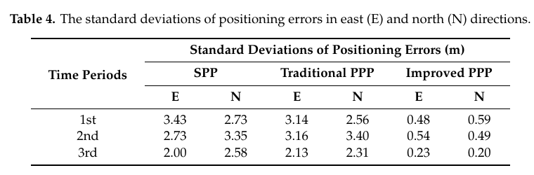
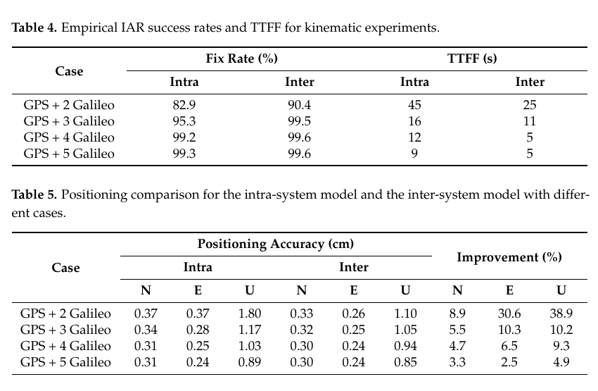
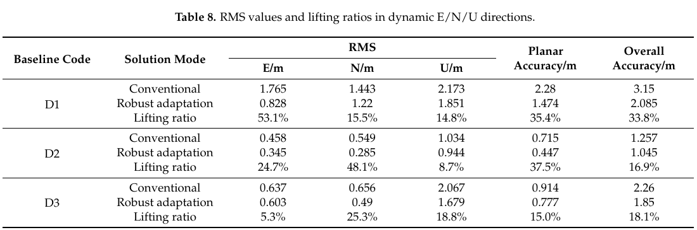

# 2026-08-29 GNSS 每日研究简报

## 今日快报

### 快报 1：给速度增量加“车辆运动形状”，隐蔽欺骗更容易从低成本 IMU 噪声里分离

- 主题：`motion-model-vidc-gnss-imu-spoofing`
- 来源 ID：`doi:10.33012/navi.789`
- 来源链接：https://doi.org/10.33012/navi.789
- 发表日期：2026-08-28
- 来源类型：NAVIGATION 同行评审开放论文、GNSS/IMU 车辆欺骗检测
- 获取范围：CC BY 4.0 出版全文、理论推导、仿真、两组车辆实测欺骗数据与 Tables 1—6

**内容：** 传统速度增量直接比较（VIDC）在一个时间窗内比较 GNSS 与 IMU 的速度变化，但低成本 IMU 噪声会把小而缓慢的欺骗偏差淹没。论文用一阶、二阶等车辆运动模型把偏差投影到低维、可解释的时间基上，再以给定虚警率的统计量判定欺骗；模型阶次需要在“降维增益”和“模型失配损失”之间选择。

**结论：** 2025-01-16 清华园车辆试验使用 u-blox ZED-F9P、Xsens MTi-300，以及大偏差轨迹与 5 s 延迟小偏差两组回放欺骗。在 GNSS 2 Hz、窗口 10 个历元、虚警率 $`10^{-3}`$ 的配置下，一阶模型相对传统 VIDC 的检测概率分别提高约 45% 和 23%，二阶模型提高约 37% 和 18%；这不是“任何工况固定提高 30%”，最优阶次随偏差形状和窗口变化。

**关注理由：** 车载反欺骗不应只问残差是否变大，还要问残差是否符合车辆可实现的运动。部署时必须同时验证急转弯、强多路径和 IMU 标度误差，因为严重多路径造成的速度偏差也可能触发虚警。

### 快报 2：积分时间、环路阶次和 Early-Late 间距必须联动切换，不能各自单独调优

- 主题：`fpga-gnss-tracking-loop-integration-spacing`
- 来源 ID：`doi:10.18469/ikt.2026.24.1.08`
- 来源链接：https://doi.org/10.18469/ikt.2026.24.1.08
- 发表日期：2026-08-27
- 来源类型：Infokommunikacionnye tehnologii 同行评审论文、实验接收机跟踪环实现
- 获取范围：俄文出版全文、软件仿真、Vivado 仿真与 MAX2769/FPGA 实际 GPS 信号跟踪

**内容：** 论文把 PLL/DLL 的积分时间、二/三阶滤波器、带宽以及 Early-Late 间距放在同一实现链中。弱信号时从 1 ms 扩到 10 ms 可降噪和减轻处理器中断负担，但要先找准导航数据位边界；高动态时三阶环更能跟随频率变化，而从 0.5 chip 收窄到约 0.1 chip 会改善码跟踪，却会产生持续数秒的切换瞬态。

**结论：** 在作者 $`C/N_0\approx39`$ dB-Hz 的仿真中，10 ms 积分时三阶 DLL 的频率标准差为 0.07 Hz，二阶类方案为 0.11—0.12 Hz；0.5→0.1 chip 的间距切换使二阶 DLL 指标约由 0.07 降至 0.036。真实 GPS 试验在约 44 dB-Hz 下先用 1 ms、PLL/DLL 25/3 Hz，约 2 s 后切到 10 ms、5/0.8 Hz并逐步收窄间距；这些值是该 FPGA 架构的调参证据，不是跨信号体制的通用最优值。

**关注理由：** 跟踪环失锁往往来自切换瞬态而不是稳态噪声。工程状态机应把位同步、积分时长、环路带宽、滤波器阶次和相关器间距作为一个原子配置更新，并保留切换后的锁定监视窗口。

### 快报 3：NLOS 概率和双差残差各管一种异常，联合重定权比单一路径更完整

- 主题：`random-forest-nlos-igg3-rtk-robust-weighting`
- 来源 ID：`doi:10.1007/s00190-026-02103-3`
- 来源链接：https://doi.org/10.1007/s00190-026-02103-3
- 发表日期：2026-08-27
- 来源类型：Journal of Geodesy 同行评审论文、随机森林 NLOS 概率与 IGG3 鲁棒 RTK
- 获取范围：出版社元数据与完整正式摘要；正文受订阅限制，因此本条不复述正文数值和未核验实验细节

**内容：** 方法先用 GNSS 原生质量特征训练随机森林得到每颗星的 NLOS 概率，再把该概率与双差标准化残差送入五段式权函数。前者针对持续但未必在单历元形成大残差的遮挡，后者针对离群粗差，从而避免只靠机器学习或只靠统计残差的单点失效。

**结论：** 正式摘要报告了静态监测和动态城市导航，并比较原始、IGG3、仅 NLOS 与联合方案；联合方案在作者数据中整体最优，且在城市峡谷、树荫和高架附近进一步减少异常点。因未取得正文，本条不把摘要中的分类率和方向改进百分比解释成跨城市泛化或错误固定率证据。

**关注理由：** 分类概率不是测量方差，残差也不是传播环境标签。落地时应分别校准概率、检查双差相关性，并在固定模糊度前审计错误固定而不只是坐标 RMS。

### 快报 4：NeQuick 顶侧尺度高度分段时，800 km 边界必须连续

- 主题：`nequick-topside-continuity-height-segmented-isis2`
- 来源 ID：`doi:10.1007/s10291-026-02135-4`
- 来源链接：https://doi.org/10.1007/s10291-026-02135-4
- 发表日期：2026-08-28
- 来源类型：GPS Solutions 同行评审论文、ISIS-2 顶侧电离层与 NeQuick 修正
- 获取范围：出版社元数据与完整正式摘要；正文受订阅限制，因此只作方法级摘要

**内容：** 论文用 1976—1979 年 ISIS-2 顶侧探测剖面，把 NeQuick 有效尺度高度在 800 km 上下分段，并在分界处施加连续性约束；不同太阳活动条件分别估计，比较线性与二次的上部模型，再把修正传播到电子密度重建和 TEC。

**结论：** 正式摘要指出，上部顶侧在低太阳活动时呈更明显的非线性，而连续分段线性方案在两类太阳活动样本间更稳健。由于正文不可访问，本条不复述摘要中的误差百分比，也不能判断 1970 年代探测器标定、纬度覆盖与现代 GNSS TEC 验证之间的全部依赖。

**关注理由：** 单频定位的电离层约束依赖的不只是地面 VTEC；顶侧密度如何外推会进入斜 TEC。模型分段若不连续，会把人工跳变变成滤波器的伪动态。

### 快报 5：分布式 LEO 定轨若忽略星间链路相关性，会把“多了一条量测”误当成独立信息

- 主题：`correlation-consistent-distributed-leo-orbit-ephemeris`
- 来源 ID：`doi:10.1007/s10291-026-02136-3`
- 来源链接：https://doi.org/10.1007/s10291-026-02136-3
- 发表日期：2026-08-28
- 来源类型：GPS Solutions 同行评审论文、LEO 分布式自主定轨与广播星历
- 获取范围：出版社元数据、完整正式摘要与附录标题；正文受订阅限制，因此只作方法级摘要

**内容：** 两步框架先让每颗 LEO 只用星载 GNSS 独立定轨，保持各星状态互不相关；第二步才用星间链路修正轨道和动力学参数、做轨道预报与 21 参数广播星历拟合，而时间更新只传播第一步的 GNSS 解，避免未显式建模的交叉相关在星座内循环放大。

**结论：** 正式摘要报告 GRACE-FO 实测 GPS/KBR 与 Walker 120/12/0 仿真，并与 GPS-only、传统分布式和集中式策略比较，作者称相关一致方案改善广播星历用户测距误差。正文不可访问，因此本条不复述摘要百分比，也不把仿真星座结果视为在轨 LEO-PNT 服务验收。

**关注理由：** 分布式滤波最危险的不是少用一条量测，而是重复计算同一信息。通信量、算力和一致性必须一起设计，并用集中式解和保守协方差作为基线。

## 深度研读

### 深读 1｜低成本与手机｜双频观测凑不齐时：用外部电离层约束把单频手机 PPP 先做稳

- 类别：`low-cost-mobile`
- 学习层级：`foundation`
- 选题定位：`经典基础`
- 来源 ID：`doi:10.3390/s20205917`
- 来源链接：https://doi.org/10.3390/s20205917
- 发表日期：2020-10-20
- 来源类型：Sensors 同行评审开放论文、Android 单频 PPP 与观测质量试验
- 获取范围：CC BY 4.0 出版全文、Mate30/V20/Trimble R8 三组同步静态观测、Figures 1—11 与 Tables 1—4
- 价值评分：97/100（相关性 20，经典价值 18，证据 20，教学价值 20，工程价值 19）

#### 为什么先学这个

手机标称支持双频，不等于每个历元都有足够连续的双频码相观测。先从单频 PPP 的可观测性出发，才能看清外部电离层产品、伪距平滑和周跳检测分别补了哪一个缺口。

#### 先修知识

需要理解伪距与载波相位、接收机钟、对流层湿延迟、单频一阶电离层、浮点模糊度、Kalman 滤波、Doppler、周跳、MGEX 精密轨钟和 CODE GIM。

#### 一句话逻辑

把 GIM 电离层值作为带方差的虚拟观测约束斜电离层，再用 Doppler 平滑高噪声伪距、用单频码相与 Doppler 检测周跳，使手机单频 PPP 不再只靠噪声很大的码观测分离电离层和模糊度。

#### 研究问题与约束

论文问 Mate30 与 V20 的原始观测为什么难以直接双频 PPP，以及外部电离层约束能否改善静态水平解。三组试验均为静态、开阔环境，定位结果重点报告 Mate30 水平分量；没有动态城市峡谷、实时产品延迟、错误固定或独立完整性检验。

#### 核心方法论

GPS/BDS 单频码和相位进入静态 Kalman 滤波，精密轨钟、DCB、天线相位中心、相对论、潮汐与相位缠绕按标准模型改正。电离层既是每星状态，又由 CODE GIM 给出虚拟观测；码用 75 历元 Doppler 积分平滑，周跳由码相比较与 Doppler 积分共同检测，模糊度保持浮点。

#### 关键公式逐步推导

对一颗星，把码、相位和电离层虚拟观测写成同一线性系统：

```math
\begin{bmatrix}p\\ \phi\\ \tilde I\end{bmatrix}
=
\begin{bmatrix}
\mathbf u&1&M&1&0\\
\mathbf u&1&M&-1&\lambda\\
0&0&0&1&0
\end{bmatrix}
\begin{bmatrix}\delta\mathbf x\\ \delta t\\ Z_w\\ I\\ N\end{bmatrix}
+\begin{bmatrix}\varepsilon_p\\ \varepsilon_\phi\\ \varepsilon_I\end{bmatrix}.
```

码与相位中的一阶电离层符号相反；$`\tilde I`$ 不是无误差真值，而以 $`Q_I`$ 控制约束强度。Doppler 平滑码可写成：

```math
\bar P_i=\frac{1}{m}P_i+\frac{m-1}{m}
\left(\bar P_{i-1}+\lambda\int_{t_{i-1}}^{t_i}D(t)\,dt\right),\qquad m=75.
```

#### 经典价值与创新边界

经典价值是把“手机 PPP 不稳”拆成双频缺测、码噪声、失锁和电离层不可分四件事，并给出可实现的单频闭环。创新边界是 2020 年两款手机和离线快速产品；现代手机、实时 SSR 或区域电离层服务需要重新估计权重。

#### 整体逻辑链

同步采集手机与测地接收机；检查可见星、双频连续性、$`C/N_0`$ 与多路径；建立单频 PPP；引入 GIM 虚拟观测；Doppler 平滑码；检测周跳；对比 SPP、传统 PPP 与改进 PPP；用分时段 E/N 标准差验证。

#### 原文图表与结果分析



> 表源：Wang 等《Ionosphere-Constrained Single-Frequency PPP with an Android Smartphone and Assessment of GNSS Observations》Table 4，[DOI 原文](https://doi.org/10.3390/s20205917)，CC BY 4.0。由出版 PDF 第 12 页以 150 dpi 渲染，仅裁出完整 Table 4；未重绘、改色或修改数据与标签。

表中单位为 m，三行对应三个观测时段，列为 SPP、传统 PPP 和改进 PPP 的东/北标准差。传统 PPP 的 E/N 仍在 2.13—3.40 m，而改进 PPP 为 0.20—0.59 m；这直接说明在该数据上，精密轨钟本身不足以克服手机码噪声和失锁，约束与预处理共同起作用。表没有单独消融 GIM、Doppler 平滑和周跳检测，因此不能把全部改善归因于电离层约束。

#### 原文结果论述

作者指出两款手机的双频星数全天不够稳定，手机 $`C/N_0`$ 与高度角关系也弱于 Trimble R8，码多路径标准差约为 R8 的十倍。Mate30 三段改进 PPP 水平分量均保持亚米标准差，但这是静态水平精度，不代表三维动态导航或实时收敛保证。

#### 常见误区与适用边界

第一，把“硬件支持双频”当成“连续双频可用”。第二，把 GIM 当无误差真值。第三，认为精密轨钟自动带来高精度。第四，忽略 Doppler 自身钟漂与采样一致性。第五，只报收敛后的标准差而不报收敛时间。第六，把外部电离层约束的改善写成纯单机能力。

#### 工程实现步骤

1. 按 Android 时钟字段构造伪距并剔除时间不一致观测。
2. 逐星统计双频连续弧、失锁、$`C/N_0`$ 和码多路径。
3. 接入同一时间基准的精密轨钟、DCB 与 GIM。
4. 为 $`\tilde I`$ 设置随纬度、地方时和产品龄期变化的方差。
5. 用 Doppler 平滑码并在失锁处重置窗口。
6. 用码相/Doppler 双检测周跳，失败时重置相位模糊度。
7. 同时报 SPP、无约束 PPP 与约束 PPP 的收敛、E/N/U 与可用率。

#### 复现实验设计

选择一台测地接收机与两款 Android 手机，共用开阔屋顶，1 s 采样、3 个各 3 h 时段。比较 SPP、传统单频 PPP、仅 GIM 约束、仅 Doppler 平滑、完整方案；参数固定 $`m=75`$、10°截止角，并扫描 GIM 标准差 0.5/1/2/5 TECU。指标为 E/N/U RMS、首次持续低于 1 m 时间、周跳漏检/误报、连续历元率；失败场景加入 GIM 2 TECU 偏置、30 s 产品延迟与 60 s 相位缺口。

#### 与定位及低成本实现的联系

这一步解决“单频怎样先可用”，但多系统 RTK 还会遇到手机通道相关相位偏差和系统间偏差。下一节进入跨系统差分，判断哪些偏差能作为稳定状态增强几何。

#### 本节小结

手机单频 PPP 的关键不是盲目相信精密产品，而是用带不确定度的外部电离层约束和针对手机连续性的预处理闭合观测模型。

### 深读 2｜低成本与手机｜跨系统差分之前先量偏差：稳定 DISB 才能把 Galileo 真正并入手机 RTK

- 类别：`low-cost-mobile`
- 学习层级：`intermediate`
- 选题定位：`基础进阶`
- 来源 ID：`doi:10.3390/rs15061476`
- 来源链接：https://doi.org/10.3390/rs15061476
- 发表日期：2023-03-07
- 来源类型：Remote Sensing 同行评审开放论文、手机多 GNSS 差分系统间偏差
- 获取范围：CC BY 4.0 出版全文、Huawei P40 零/短基线与低动态试验、Figures 1—12 与 Tables 1—5
- 价值评分：98/100（相关性 20，经典价值 18，证据 20，教学价值 20，工程价值 20）

#### 为什么先学这个

上一节用外部约束补单频可观测性；RTK 若要把 GPS 与 Galileo 共同差分，还必须确认手机每通道相位偏差和差分系统间偏差（DISB）是否稳定，否则“共用一个钟”会把未建模偏差塞进整数模糊度。

#### 先修知识

需要理解接收机间单差、卫星间双差、CDMA 星座、参考星、整数模糊度、系统间偏差、卡方稳定性检验、IAR 固定率、首次固定时间（TTFF）和外接天线/射频屏蔽箱试验。

#### 一句话逻辑

先用零/短基线隔离手机通道相关偏差，再验证同频或近同频系统间相位 DISB 的时间稳定性；只有检验通过的 DISB 才作为跨系统公共钟模型中的状态实时估计，从而增加可共同差分的卫星数。

#### 研究问题与约束

论文针对 Huawei P40，使用外置测地天线和射频转发来压低内置天线多路径，研究 GPS、BDS-2/3、Galileo、QZSS 的通道偏差和 DISB，再做 0.4—0.6 km、25 min、最高约 6 km/h 的低动态 RTK。结论不代表手机内置天线、城市高速或任意芯片。

#### 核心方法论

同一系统先各估一个接收机钟，称为系统内模型；跨系统模型则共享参考系统钟，并显式加入相位 DISB。重叠频率的 DISB 可直接比较，非重叠频率还混入参考星初始模糊度，必须实时估计。作者以 $`\alpha=5\%`$ 的卡方检验判断观测时段内是否稳定。

#### 关键公式逐步推导

对系统 A/B 的接收机单差相位，省略已改正项后可写成：

```math
\Delta L_{ab,j}^{As}=\Delta\rho_{ab}^{As}+\Delta dt_{ab,jl}^{A}
+\lambda_j^A\Delta N_{ab,j}^{As}+\Delta\phi_{ab,j}^{As}+\varepsilon,
```

若 B 系统共享 A 的钟，则相位中出现：

```math
\Delta L_{ab,j}^{B1}=\Delta\rho_{ab}^{B1}+\Delta dt_{ab,jl}^{A}
+\lambda_j^A\delta_{ab,jl}^{AB}+\varepsilon.
```

对 $`n`$ 个 DISB 估值，以协方差加权均值 $`\bar\delta`$ 构造：

```math
T=\sum_{t=1}^{n}\frac{(\delta(t)-\bar\delta)^2}{\sigma_\delta^2(t)},
\qquad T<\chi^2_{0.05}(n-1)
```

才把它视为该时段稳定；这不是证明跨天、跨温度稳定。

#### 经典价值与创新边界

价值在于不把“手机偏差”笼统当噪声，而是区分通道相关码偏差、通道相关相位偏差和系统间相位 DISB。边界是单款 HP40、外置天线、短时低动态；非重叠频率的通用参数化仍未解决。

#### 整体逻辑链

搭建零/短基线；固定已知坐标；估通道相关码相偏差；对重叠/非重叠频率估 DISB；做时序和卡方稳定性检验；选择 GPS/Galileo 同频组合；实时估 DISB；按 Galileo 星数逐步加星；比较系统内/跨系统固定率、TTFF 和坐标。

#### 原文图表与结果分析



> 表源：Shang 等《Multi-GNSS Differential Inter-System Bias Estimation for Smartphone RTK Positioning: Feasibility Analysis and Performance》Tables 4—5，[DOI 原文](https://doi.org/10.3390/rs15061476)，CC BY 4.0。由出版 PDF 第 14 页以 150 dpi 渲染，仅裁出完整 Tables 4—5；未重绘、改色或修改数据与标签。

Table 4 的横轴不是时间而是 GPS 加 2—5 颗 Galileo 的方案；固定率单位为 %，TTFF 为 s。最弱的 GPS+2 Galileo 中，跨系统模型固定率 82.9→90.4%，TTFF 45→25 s。Table 5 的 N/E/U 单位为 cm，同一方案 U 从 1.80 降至 1.10 cm。随着 Galileo 增至 5 颗，两模型都接近饱和，收益缩小，说明 DISB 的价值主要在几何不足时显现。

#### 原文结果论述

作者报告 HP40 各星通道相关相位偏差标准差低于 0.002 cycle；GPS L1/QZSS L1 与 BDS-2 B1I/BDS-3 B1I 的相位 DISB 接近零，GPS L1/Galileo E1 虽非零但标准差低于 0.005 cycle，而 GPS L1/BDS B1I 不稳定。跨系统模型的方向精度改善范围为 3—38.9%，但真值来自同车 CHCNAV i90 固定解，并非独立全站仪轨迹。

#### 常见误区与适用边界

第一，默认所有系统间偏差恒定。第二，混淆码 DISB 与相位 DISB。第三，把非重叠频率差直接当硬件常数。第四，不先校正通道相关偏差。第五，用同一车辆上的高端 RTK 当完全独立真值。第六，把外接天线结果宣传为手机内置天线性能。

#### 工程实现步骤

1. 对每种手机/固件建立零基线偏差验收。
2. 分系统、分频点、分连续弧估通道相位偏差。
3. 对候选 DISB 保存均值、标准差、温度和重启时间。
4. 用卡方或变点检验门控“可共享钟”状态。
5. 稳定时启用跨系统参考星，失稳时退回系统内模型。
6. 在 IAR 中传播 DISB 协方差，不把估值当常数真值。
7. 同时报固定率、TTFF、错误固定和真值独立性。

#### 复现实验设计

选 HP40 及另一款芯片手机，共用测地天线做 2 h 零基线，再以 1 s、30 min 低动态小车采集 GPS/Galileo。比较系统内、固定 DISB、随机游走 DISB 和失稳回退四种模型；扫描截止角 15/25/35°、温度冷/热启动与 2/3/4/5 颗 Galileo。指标为 DISB Allan 偏差、卡方通过率、TTFF、经验固定率、错误固定率、E/N/U RMS；失败场景加入 0.02 cycle 阶跃和参考星切换。

#### 与定位及低成本实现的联系

跨系统偏差建模增强了几何，但真实手机动态数据仍同时存在粗差和运动模型失配。下一节把观测侧鲁棒定权与状态侧自适应预测合并到纯 GNSS 单频 RTK。

#### 本节小结

多系统手机 RTK 的前提不是“多星”，而是先证明跨系统相位偏差在当前设备、频点和时段内足够稳定，并把剩余不确定度带进滤波器。

### 深读 3｜定位｜手机纯 GNSS RTK 怎样不断线：四分位降粗差，再按运动突变放松预测

- 类别：`positioning`
- 学习层级：`advanced`
- 选题定位：`定位深入`
- 来源 ID：`doi:10.3390/rs14246388`
- 来源链接：https://doi.org/10.3390/rs14246388
- 发表日期：2022-12-17
- 来源类型：Remote Sensing 同行评审开放论文、手机单频四系统鲁棒自适应 RTK
- 获取范围：CC BY 4.0 出版全文、Xiaomi 8/Huawei P40 六组数据、Figures 1—16 与 Tables 1—9
- 价值评分：98/100（相关性 20，经典价值 18，证据 20，教学价值 20，工程价值 20）

#### 为什么先学这个

前两节已让单频模型可用、跨系统模型更强；最后的动态定位仍会被两类异常击穿：观测粗差污染量测更新，急转弯或加减速使恒速模型预测滞后。两类错误必须在不同协方差通道处理。

#### 先修知识

需要理解单频四系统 RTK、双差观测、Kalman 预测/更新、创新与标准化创新、IGG III 权函数、四分位距（IQR）、过程噪声、位置/速度状态差异统计和动态参考轨迹。

#### 一句话逻辑

用四分位数从本历元创新中自适应生成粗差门限、膨胀异常观测方差；再用位置与速度状态差异分别生成自适应因子，放松错误的运动预测，让量测与模型两条误差路径不互相冒充。

#### 研究问题与约束

论文用 Huawei P40 和 Xiaomi 8，处理 GPS L1、GLONASS R1、Galileo E1、BDS-3 B1I 单频数据；三组静态数据按动态模式回放，另有步行、手推车和车辆实测。Xiaomi 8 关闭 duty cycle，参考为 CHC P5 接收机；没有报告跨手机型号泛化、错误固定概率或城市高楼峡谷。

#### 核心方法论

量测侧以创新 $`v_i`$ 的 Q1、Q3 和 IQR 生成动态双阈值，小残差不降权、中间残差连续降权、大残差近似剔除；状态侧把位置和速度分开，比较鲁棒当前解与预测解，分别调节预测协方差。这样粗差增大 $`R`$，运动失配增大 $`P^-`$，二者作用位置不同。

#### 关键公式逐步推导

四分位阈值可写为：

```math
\tilde k_0=\min(|Q_1|,|Q_3|),\qquad
\tilde k_1=\min(|Q_1-3IQR|,|Q_3+3IQR|).
```

据 $`|v_i|`$ 计算等价权 $`\gamma_i`$，再令方差膨胀 $`\lambda_i=1/\gamma_i`$，更新后的量测协方差进入：

```math
K_k=P^-_kH^T\left(HP^-_kH^T+\bar R_k\right)^{-1}.
```

状态差异统计按位置/速度分别构造，例如：

```math
\Delta x_k=\frac{\|\tilde X_k-\hat X^-_k\|}{\sqrt{\operatorname{tr}(P^-_k)}},
\qquad
\bar P^-_k=\alpha^{-1}\left(A P_{k-1}A^T+Q\right).
```

$`\alpha<1`$ 时放大预测协方差，使突变时量测获得更大权重。

#### 经典价值与创新边界

价值在于把鲁棒与自适应明确分工，并用无需先验分布的 IQR 适配手机少量、重尾观测。边界是经验阈值、广播星历/Klobuchar/Saastamoinen 的特定实现，以及参考轨迹和数据规模有限；“连续”不等于完整性有界。

#### 整体逻辑链

手机单频四系统预处理；构造常规 RTK Kalman；用创新四分位估门限；膨胀异常量测方差；计算位置/速度状态差异；分类调整预测协方差；分别做模拟动态和真实步行/推车/车辆回放；对比常规、仅鲁棒、鲁棒自适应的 E/N/U RMS 与轨迹。

#### 原文图表与结果分析



> 表源：Liu 等《A Robust Adaptive Filtering Algorithm for GNSS Single-Frequency RTK of Smartphone》Table 8，[DOI 原文](https://doi.org/10.3390/rs14246388)，CC BY 4.0。由出版 PDF 第 17 页以 150 dpi 渲染，仅裁出完整 Table 8；未重绘、改色或修改数据与标签。

表中 E/N/U、平面和总体精度单位均为 m。D1 步行遮挡场景的平面精度由 2.28 降至 1.474 m，总体由 3.15 降至 2.085 m；D2 手推车平面由 0.715 降至 0.447 m；D3 车辆由 0.914 降至 0.777 m。改善随场景明显变化，U 分量仍为 0.944—1.851 m，不能据此宣称“手机 RTK 已稳定厘米级”。

#### 原文结果论述

模拟动态中，四分位鲁棒模型对 Xiaomi 8 与 Huawei P40 的总体精度分别改善超过 80% 和 25%；真实动态全时段总体改善为 D1 33.8%、D2 16.9%、D3 18.1%。作者把 D1 较大收益归因于起始高差、后续遮挡和粗差更多；这同时说明百分比受基线难度影响，不能只横向比较算法优劣。

#### 常见误区与适用边界

第一，用同一个鲁棒因子同时修量测和过程模型。第二，样本很少时仍用均值/标准差定门限。第三，把近零权重当作删除后仍不检查几何。第四，关闭 duty cycle 后把结果外推到默认手机行为。第五，只报改进百分比不报绝对米级误差。第六，把 CHC P5 同场解当无误差真值。第七，忽略固定/浮点状态切换。

#### 工程实现步骤

1. 在双差前完成周跳、失锁与不确定度字段检查。
2. 每历元按有效创新计算 Q1、Q3、IQR，并设置最小样本保护。
3. 只在量测通道膨胀 $`R`$，记录被强降权卫星。
4. 用鲁棒更新后的当前位置/速度构造状态差异。
5. 分别调节位置与速度预测协方差，限制 $`\alpha`$ 下界。
6. 若降权后卫星数或几何不足，退回浮点/单点而非强制固定。
7. 输出坐标、固定状态、创新、权重、自适应因子和报警原因。

#### 复现实验设计

使用一台 Xiaomi 8 和独立测地真值，关闭 duty cycle，1 Hz 采集 GPS/GLO/Galileo/BDS-3 单频数据；设计开阔直线、急转弯、树荫步行和短时遮挡四段。比较常规 RTK、固定阈值 IGG3、四分位鲁棒、完整鲁棒自适应；扫描 IQR 倍数 1.5/3/4.5、过程噪声和最小卫星数。指标为 E/N/U RMS、95%误差、最大连续失效时长、错固定率、重收敛时间和每历元耗时；失败场景注入 10 m 伪距粗差、0.2 cycle 相位阶跃及急停。

#### 与定位及低成本实现的联系

这是一条纯 GNSS 手机定位链：不依赖 IMU 或视觉，但依赖参考站、连续载波和可靠退化策略。与前两节合用时，应把电离层约束、DISB 状态和鲁棒权重放在同一协方差账本中，避免重复放大置信度。

#### 本节小结

手机动态 RTK 的稳健性来自“异常属于哪一层”的正确分流：粗差改量测权，运动突变改预测权，几何不足则明确降级。
