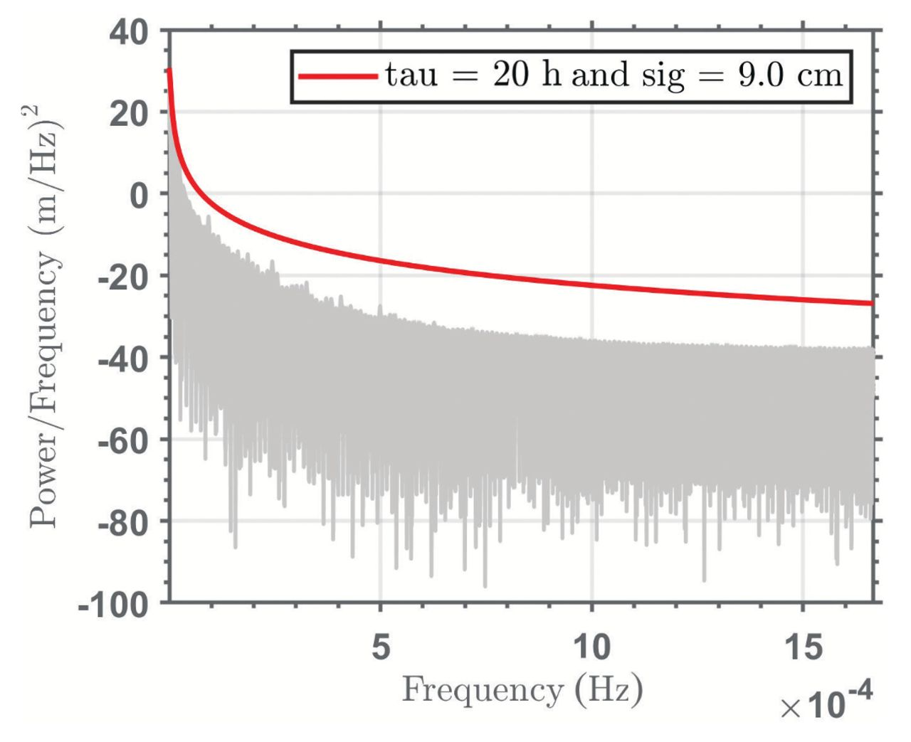
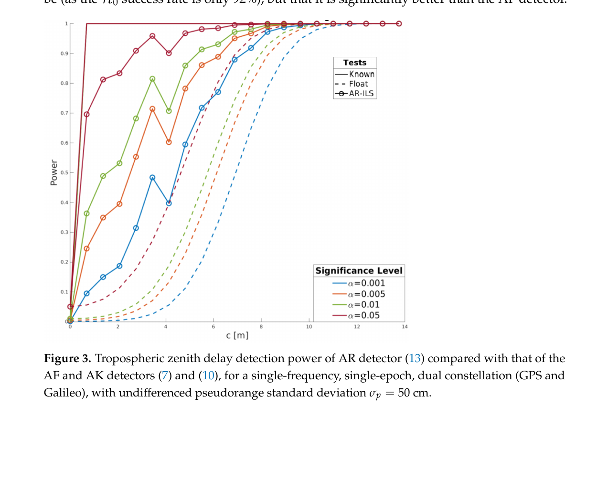
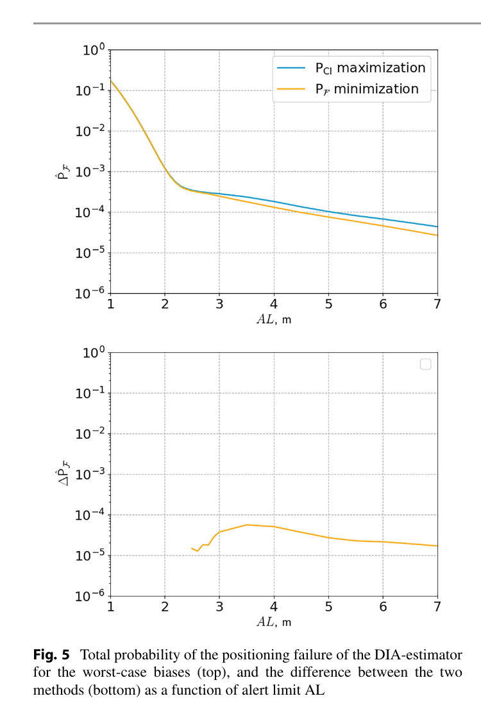

# 2026-08-30 GNSS 每日研究简报

## 今日快报

### 快报 1：自监督预训练不直接学坐标，而是先学卫星间空间关系，再把改正与不确定度送回 WLS

- 主题：`self-supervised-gnss-multipath-dle-pvt`
- 来源 ID：`arxiv:2608.25674`
- 来源链接：https://arxiv.org/abs/2608.25674
- 发表日期：2026-08-26
- 来源类型：arXiv v1 预印本、自监督 GNSS 多路径改正与深度学习增强 PVT
- 获取范围：完整预印本；模型结构、训练配置、24 h 自采车辆数据、PPC/UrbanNav 开放数据及跨域试验均可核查，尚未经同行评审

**内容：** 作者把每颗卫星的码残差、方位/仰角、$`C/N_0`$ 等组成 token，先以 JEPA 式遮挡预测做自监督预训练，再用有标签数据微调码距改正和不确定度。推理时网络不直接输出位置，而是把逐星改正与方差交给因子图/WLS PVT。训练和测试按完整行驶场景切分；主训练域是法国图卢兹，重度域外测试来自东京 PPC 与香港 UrbanNav。

**结论：** 作者采用“3D 定位误差第 50 与第 95 百分位的平均值”作为单一指标。固定 100 万 token 训练集时，基线在同域/轻度域外/重度域外场景为 4.98/9.16/28.76 m，自监督预训练加微调为 2.64/7.72/18.96 m；重度域外指标相对基线下降约 34%。这是多个随机种子合并后的预印本结果，参考轨迹仍来自共天线 GNSS/INS 后处理，不能据此宣称任意城市或任意芯片都获得同样收益。

**关注理由：** 工程上更值得借鉴的是接口：学习器负责逐星改正和置信度，几何与时钟仍由可审计的 PVT 解算器处理。上线前应保留纯 WLS 回退、场景级隔离、域外分层指标和不确定度校准，避免网络把初始残差复制成“改正”。

### 快报 2：量子重力地图匹配能约束海上惯导漂移，但当前是海里级导航，不是 GNSS 精度替代品

- 主题：`quantum-gravity-map-matching-gnss-free-maritime-navigation`
- 来源 ID：`arxiv:2608.25563`
- 来源链接：https://arxiv.org/abs/2608.25563
- 发表日期：2026-08-26
- 来源类型：arXiv v1 预印本、船载量子重力仪与 GNSS-free 重力地图匹配实测
- 获取范围：完整预印本；29 m 船舶平台、83 km 无 GNSS 导航段、海况 1—4 测量、56 h 静态稳定性与方法附录

**内容：** 系统把原子干涉重力计与经典加速度计混合，用原子通道稳定长期偏置；导航级 IMU 独立机械编排，测得的重力异常与预装卫星重力图做序贯地图匹配，再把位置改正反馈给 INS。作者刻意把导航示范中的 GNSS 从传感、倾斜改正、地图匹配和状态校正全链路排除；另设 GNSS 参考模式评价重力测量，而不把两种模式混为一谈。

**结论：** 约 6 h、45 nmi（83 km）航段末端误差为 2.2 nmi（4.0 km），论文将整体定位表现称为“海里量级”；图中的 1 nmi 横线只是距离参照，并非报告的 DRMS 数值。独立重力测量得到约 300 m 沿程尺度结构，作者称比所用卫星地图半功率波长细约 50 倍；56 h 静态试验中，原子参考长期漂移约比经典通道低 70 倍。后两项验证传感器稳定性，不等同于 83 km 导航精度。

**关注理由：** 这项工作展示了一条真正无外部射频信号的漂移约束链，但地图分辨率、重力梯度可观测性和初始位置不确定度仍决定定位能力。与 GNSS 互补时，应分开记录“量子传感精度”“地图误差”和“导航闭环误差”，不能用 sub-mGal 测量指标替代位置误差。

### 快报 3：城市视觉定位把 GPS 降级成候选区提示，最终位姿由立面几何决定

- 主题：`spotter-facade-visual-localization-gps-degraded`
- 来源 ID：`arxiv:2608.23290`
- 来源链接：https://arxiv.org/abs/2608.23290
- 发表日期：2026-08-24
- 来源类型：arXiv 预印本、面向可穿戴设备的城市立面视觉全局定位
- 获取范围：完整预印本；巴塞罗那 20 段步行数据、GPS 噪声消融、GPS-free 对照、速度与内存评价，尚未经同行评审

**内容：** 离线阶段从 Google Street View 全景中分割建筑立面，用多视图深度和道路图建立紧凑的三维地标库；在线阶段用检索缩小候选，再以局部特征、PnP/RANSAC 和二维 Kalman 平滑求全局相机位置。GPS 只控制检索半径，不直接决定最终姿态；失败后搜索半径扩张，成功后收缩。

**结论：** 数据集含 20 条序列、15,616 帧、约 52 min 与近 4 km 路程。无附加噪声时 SpotterGPS 的平均绝对位置误差（APE）为 8.13 m、45.5 FPS；注入 $`\sigma=30\ \mathrm{m}`$ GPS 噪声后为 13.80 m、$`R@10\mathrm{m}=42.0\%`$，而 OSMLocGPS 为 36.43 m。完全无 GPS 的 Spotter 平均 APE 为 12.17 m、$`R@10\mathrm{m}=64.4\%`$；DPVO 的 9.78 m 依赖事后用真值作全局 Sim(2) 对齐，不能在线直接复现。

**关注理由：** 对 GNSS/视觉融合，关键是规定谁提供“粗范围”、谁提供“度量位姿”。把 GPS 当候选筛选器能减弱城市多路径对最终解的直接污染，但仍需解决立面重复、动态遮挡、季节变化和地图许可/更新问题。

### 快报 4：果园 GNSS 拒止导航用时空体素稳住几何地图，再把语义风险只放进局部规划代价

- 主题：`citranav-gnss-denied-orchard-spatiotemporal-voxel-mppi`
- 来源 ID：`doi:10.3390/agriculture16171868`
- 来源链接：https://doi.org/10.3390/agriculture16171868
- 发表日期：2026-08-28
- 来源类型：Agriculture 同行评审开放论文、GNSS 拒止果园 LiDAR/视觉/IMU 定位与语义规划
- 获取范围：CC BY 4.0 出版全文；Isaac Sim、14 条实地序列、语义消融、运行时和地图规模结果

**内容：** CitraNav 以多层体素保存平面统计量和跨帧支持度，抑制风吹叶片等瞬态点进入全局几何地图；状态估计沿用 IESEKF 与点到平面约束。语义分支把 RGB-D 分割映射成可通行、目标植被、风险地面和障碍等超类，只改变 MPPI 局部规划的软代价，不把高频语义点持续灌入定位地图，也不放松硬碰撞约束。

**结论：** 五段仿真中平均平移 RMSE 为 0.075 m，语义规划相对纯几何规划把碰撞率从 14.0% 降至 4.0%，但这是仿真标签和场景下的结果。14 条实地序列共 2967.0 m、26.48 min，论文摘要报告平均平移/航向 RMSE 为 0.151 m/1.13°；平均在线处理 31.72 ms，最终几何地图单元数比对照少 72.3%—87.4%。这些数据覆盖草地、农路、森林和果园，不代表所有作物季节与泥水条件。

**关注理由：** 该架构把“定位稳定性”和“任务偏好”拆开：全局图只保存可重复几何，语义只服务短时决策。GNSS 恢复后也可沿用这一分层，让 RTK 负责全局锚定，而不让偶发固定解直接重写局部可通行语义。

### 快报 5：GNSS、SLR 与 LEO 观测同层联合时，采样率和权重不一致可能抵消“多一种观测”的收益

- 主题：`esa-cool-observation-level-gnss-slr-leo-combination`
- 来源 ID：`doi:10.1007/1345_2026_409`
- 来源链接：https://doi.org/10.1007/1345_2026_409
- 发表日期：2026-08-27
- 来源类型：International Association of Geodesy Symposia 开放技术论文、ESA 观测层空间大地测量联合处理
- 获取范围：CC BY 4.0 完整章节；一年期 Galileo/MGNSS、SLR、ILRS 与 Sentinel-6A 组合试验、轨道重叠、ERP 和地心结果

**内容：** ESA 的 COOL 路线不是先各自出产品再平均，而是在同一估计系统中逐步加入 Galileo、GPS/GLONASS/BDS/QZSS、Galileo/LEO 的 SLR、ILRS 炮弹卫星和 Sentinel-6A 星载 GNSS。日解弧长 24 h，配置最多使用约 200 个 IGS 站和 30 个 SLR 站，并比较观测层联合与法方程堆叠。

**结论：** 一年轨道重叠显示，在当前权重下，加入 Sentinel-6A 与 SLR 可进一步改善 Galileo 和 Sentinel-6A 的轨道一致性；但把 Galileo 与其他星座都降到 300 s 采样时，Galileo 重叠反而变差，把 Galileo 保持在 30 s 后才回到或优于单系统水平。ERP 结果没有单一组合稳定胜出，作者明确要求继续检查力模型、PCO、SLR 链路偏差与相对权重。这是 Genesis 前期方法验证，不是四技术联合已达到 1 mm/0.1 mm·yr⁻¹ 目标。

**关注理由：** “多源”不会自动增加独立信息。GNSS 精密处理应把采样密度、法方程权重、基准约束与共享系统误差列为显式设计量，否则结果变好或变坏都无法归因。

## 深度研读

### 深读 1｜接收机工程｜时间相关误差不能只报一个标准差：先在频域包住输入，滤波协方差才有保守含义

- 类别：`receiver-engineering`
- 学习层级：`foundation`
- 选题定位：`经典基础`
- 来源 ID：`doi:10.33012/navi.729`
- 来源链接：https://doi.org/10.33012/navi.729
- 发表日期：2026-01
- 来源类型：NAVIGATION 同行评审开放论文、非平稳时相关 GNSS/INS 误差的 PSD 完好性包络
- 获取范围：CC BY 4.0 全文、100 个全球站 2018 年对流层残差、STIM-300 静态 IMU 数据、Figures 1—6 与 Table 1
- 价值评分：98/100（相关性 20，经典价值 20，证据 20，教学价值 20，工程价值 18）

#### 为什么先学这个

完整性算法最终比较的是“真实误差超过告警限且未告警”的概率。若输入误差随时间相关，给 Kalman 滤波器一个瞬时标准差并不能说明累计后的状态协方差仍保守；低频误差会被滤波器反复当成新信息。先学功率谱密度（PSD）包络，才能理解后两节的模型检验为什么必须建立在可信随机模型上。

#### 先修知识

需要理解均值、方差、自相关函数（ACF）、傅里叶变换、功率谱密度、白噪声、随机游走、一阶 Gauss–Markov 过程、线性时不变/时变滤波器、Kalman 状态增广，以及“准确模型”和“保守上界”的区别。

#### 一句话逻辑

若模型 PSD 在每个频率都不低于真实误差 PSD，那么任何稳定线性滤波器对该输入形成的输出误差方差也被模型预测方差包住；非平稳数据则按变化类型分段或改用周期图，再对所有运行条件取上包络。

#### 研究问题与约束

论文针对航空 GNSS/INS 的时序完整性建模，把非平稳过程分为三类：ACF 缓慢变化、ACF 快变但 PSD 时间不变、以及 PSD 本身随时间快速变化。前两类给出包络方法，第三类如暴风雨造成的阶跃被视为应实时检测/剔除的故障。理论针对线性或充分线性化且输出稳定的滤波器；实验数据必须覆盖预期运行域，未观测到的环境不能被公式自动保证。

#### 核心方法论

对宽平稳或准平稳误差，先估 ACF，以平滑窗保留任务时长内的滞后信息、衰减更长滞后，傅里叶变换得到 PSD；再选状态空间可实现的白噪声、随机游走或一阶 Gauss–Markov 组合，使模型曲线在全频带高于所有样本 PSD。对 1/f 等不稳定过程，ACF 随观测时长发散，直接从多个等长记录计算周期图并取频域上包络。

#### 关键公式逐步推导

对稳定线性滤波器，输入 $`x`$、输出 $`y`$ 与频率响应 $`H`$ 满足：

```math
S_{yy}(f,t)=|H(f,t)|^2S_{xx}(f).
```

因此输出方差是全频带能量积分：

```math
\sigma_y^2(t)=\int_{-\infty}^{\infty}|H(f,t)|^2S_{xx}(f)\,df.
```

若构造模型 $`\overline S_{xx}(f)\ge S_{xx}(f)`$ 对所有 $`f`$ 成立，因为 $`|H|^2\ge0`$，便有：

```math
\overline\sigma_y^2(t)-\sigma_y^2(t)
=\int_{-\infty}^{\infty}|H(f,t)|^2
[\overline S_{xx}(f)-S_{xx}(f)]\,df\ge0.
```

ACF 缓慢变化时，把长记录分成 $`N`$ 个准平稳片段，工程上取：

```math
\overline S_{xx}(f)\ge
\max_{1\le k\le N}\widehat S_{xx}(f,t_k).
```

论文经验要求每段观测时长至少约为相关时间常数的 10 倍；这是数据设计条件，不是无条件数学定理。

#### 经典价值与创新边界

经典价值在于把“协方差要保守”转成逐频率可审计的不等式，并能映射回 Kalman 状态增广。创新在于将既有平稳 PSD 包络扩展到两类非平稳过程。边界是：样本频带由采样间隔和记录长度决定，谱泄漏会抬高包络；真实 PSD 快速随时间变化时，随机模型不再是合适的安全措施。

#### 整体逻辑链

定义完整性风险；指出单时刻分布包络不能处理时序滤波；分类平稳性；从 ACF 加窗得到样本 PSD；证明逐频率输入包络传递为输出方差包络；慢变过程分段取最大；不稳定过程改用周期图；用可实现随机过程拟合上界；把快变阶跃移交故障检测。

#### 原文图表与结果分析



> 图表源：Gallon、Joerger 与 Pervan《High-Integrity Modeling of Nonstationary Noise Processes for GNSS/INS Integration》Figure 4，[DOI 原文](https://doi.org/10.33012/navi.729)，CC BY 4.0。下载出版页面提供的 `F4.large.jpg`，仅转换为 PNG；未裁剪、重绘、改色或修改坐标、图例与数据。

横轴是频率（Hz），标注量级到 $`1.6\times10^{-3}\ \mathrm{Hz}`$；纵轴是功率/频率 $`(\mathrm{m}/\sqrt{\mathrm{Hz}})^2`$ 的对数式刻度值。灰色是 100 个站、多个准平稳片段的样本 PSD 叠加，红线是一阶 Gauss–Markov 包络，图例参数为相关时间 $`\tau=20\ \mathrm{h}`$、标准差 $`\sigma=9.0\ \mathrm{cm}`$。红线全频段位于灰色包络之上，直接展示“保守”；它不能证明未采集的极端天气仍被覆盖，也不能说明 9 cm 是定位误差。

#### 原文结果论述

对流层示例使用 2018 年 100 个全球站的 MOPS/GPT2w 校正残差；BADG 站在年积日 117—270 方差明显增大，因此被切成三个准平稳片段。IMU 示例则使用 STIM-300 在 125 Hz 下的多段 10 h 静态记录，五段满足恒温要求的数据以周期图估谱；厂家平均规格曲线未能包住全部样本，作者另用白噪声、随机游走和一阶 Gauss–Markov 之和构造上界。两类实验说明“拟合平均情况”与“给完整性上界”是不同任务。

#### 常见误区与适用边界

第一，把 Allan 方差或厂家标称直接当 PSD 上界。第二，只在若干离散频点比较曲线，遗漏频点间穿越。第三，用很短记录估低频噪声。第四，先分段后只保留平均 PSD，而非最坏包络。第五，把温度、振动或风暴阶跃埋进平稳噪声。第六，把输入方差上界误认为任意非线性滤波器都自动安全。第七，忽略过度保守会损害连续性和可用性。

#### 工程实现步骤

1. 按接收机型号、天线、环境、温度和动态工况设计采集矩阵。
2. 去除已知确定项，保留每个误差源的独立残差时间序列。
3. 用滑窗均值/方差和 ACF 变化率判断宽平稳、慢变或故障型快变。
4. 慢变段长度设为至少相关时间常数的 10 倍，并保留任务时长所需滞后。
5. 对 ACF 加平滑窗后变换，或对不稳定误差直接计算周期图。
6. 在全频带拟合可状态增广的 PSD 上界，并检查曲线交叉。
7. 用该模型生成滤波协方差，再以留出数据验证状态误差覆盖率。
8. 为超出训练域的阶跃建立独立检测、隔离与降级逻辑。

#### 复现实验设计

采集两类数据：20 个 GNSS 站连续 90 d、30 s 对流层残差，以及 3 台低成本 IMU 各 10 段 12 h、100 Hz 静态数据，覆盖 0/25/50 °C 与轻振动。比较“单一白噪声”“厂家参数”“平均 PSD 拟合”“逐频包络”四种模型；指标为样本 PSD 穿越次数、95/99.9 百分位归一化创新、状态误差超过 $`3\sigma`$ 的频率和可用率损失。失败场景加入 2 cm 对流层阶跃、温度突变和窄带振动，要求随机模型方案触发故障通道而非继续声称覆盖。

#### 与定位及低成本实现的联系

低成本接收机和 MEMS IMU 的温漂、振动与多路径通常比测地设备更非平稳。频谱包络可以把这些现象转换成可部署的状态噪声模型，但它只解决“误差如何保守传播”。下一节进一步处理“观测模型是否已经坏掉”：当载波模糊度是未知整数时，检验统计量不能仍按浮点模型设计。

#### 本节小结

完整性随机模型的目标不是贴合平均 PSD，而是在可声明的运行域内逐频率包住真实 PSD；无法被随机过程覆盖的快速变化，应转成故障检测问题。

### 深读 2｜接收机工程｜载波模型检验也要尊重整周结构：浮点残差会把最有价值的相位信息稀释掉

- 类别：`receiver-engineering`
- 学习层级：`intermediate`
- 选题定位：`基础进阶`
- 来源 ID：`doi:10.3390/app15073531`
- 来源链接：https://doi.org/10.3390/app15073531
- 发表日期：2025-03-24
- 来源类型：Applied Sciences 同行评审开放论文、载波相位 GNSS 混合整数模型检验理论
- 获取范围：CC BY 4.0 出版全文；检测、识别、显著性和整数性检验推导，单历元 GPS/Galileo 仿真与 Figures 1—5
- 价值评分：98/100（相关性 20，经典价值 19，证据 20，教学价值 20，工程价值 19）

#### 为什么先学这个

上一节建立了可信随机模型，但错误观测、未建模对流层或硬件偏差仍会改变观测均值。常规整体模型检验把载波模糊度当实数，等于主动丢弃整数结构；反过来，假定模糊度完全已知又不具可操作性。混合整数模型（MIM）检验位于二者之间，显式传播“整周估计也可能错”的不确定性。

#### 先修知识

需要理解线性高斯模型、最小二乘残差、零假设/备择假设、显著性水平、检验功效、非中心卡方分布、载波相位整周模糊度、ILS/LAMBDA、整数成功率、拉入域与部分模糊度固定。

#### 一句话逻辑

分别在无故障与有故障模型下估计整数模糊度，用两套“整数约束后的加权残差平方”之差做统计量，并用其真实混合分布定门限，便能利用载波精度而不把模糊度假装成已知常数。

#### 研究问题与约束

论文考虑 $`y\sim\mathcal N(Aa+Bb,Q_{yy})`$，其中 $`a\in\mathbb Z^n`$ 是模糊度、$`b`$ 是实参数；备择模型再加入 $`Cc`$。研究覆盖故障检测、故障识别、参数显著性与整数性检验。结果主要是理论和单历元仿真，且门限通常需离线通过混合分布或 Monte Carlo 计算；未给真实城市动态错误固定率或认证级风险预算。

#### 核心方法论

先在 $`H_0`$ 与 $`H_a`$ 下分别求浮点残差，再用可接受的整数估计器（ILS、IB、IR 等）得到 $`\check a_0,\check a`$。MIM 统计量衡量两假设在整数约束后的拟合改善；检测时只需在 $`H_0`$ 下定整，识别通常两边都要定整。论文同时给出两个参照极限：AF 把模糊度当实数，AK 把它当已知整数；可运行的 AR 检验应在成功率足够时从 AF 向 AK 靠近。

#### 关键公式逐步推导

定义两假设下、给定整数候选的加权残差为 $`\hat e_0(a_0)`$ 与 $`\hat e_a(a)`$，MIM 统计量为：

```math
T(\check a_0,\check a)=
\|\hat e_0(\check a_0)\|_{Q_{yy}}^2-
\|\hat e_a(\check a)\|_{Q_{yy}}^2.
```

显著性水平 $`\alpha`$ 的门限必须满足：

```math
P\{T(\check a_0,\check a)>\tau_\alpha\mid H_0\}=\alpha.
```

对最宽松备择，$`\hat e_a\equiv0`$，检测统计量可拆成浮点失配与整数残差两项：

```math
T(\check a_0,\bullet)=
\|t_0\|_{Q_{t_0t_0}}^2+
\|\hat a_0-\check a_0\|_{Q_{\hat a_0\hat a_0}}^2.
```

第二项正是 AF 检验丢失的信息；但它的分布是由各整数拉入域拼接出的混合分布，不能简单套普通卡方门限。

#### 经典价值与创新边界

经典价值是把估计理论中的“整数性”带入模型验证，并统一 AF、AK 与 AR 三类统计量。创新边界在于给出了检验分布、极限分布及多种应用形式，而非一套完整接收机告警系统。整数结构能提高检验功效，但不会消除错固定；若成功率低，AR 分布会远离理想 AK。

#### 整体逻辑链

写出混合整数零/备择模型；分解残差；定义 MIM 检验；用 AF 与 AK 建立性能上下参照；推导 AR 检测；分析整数残差混合 PDF；扩展到识别与显著性检验；用部分固定提高备择下成功率；最后把检验专门化为“模糊度是否仍为整数”。

#### 原文图表与结果分析



> 图表源：Teunissen《Ambiguity-Resolved Model Tests for Carrier-Phase GNSS》Figure 3，[DOI 原文](https://doi.org/10.3390/app15073531)，CC BY 4.0。出版 PDF 第 8 页以 200 dpi 渲染，裁出完整 Figure 3、坐标、图例和题注；未重绘、改色或修改数据。

横轴 $`c`$ 是对流层天顶延迟偏差（m），纵轴是检测功效；颜色对应 $`\alpha=0.001,0.005,0.01,0.05`$，线型分别是已知整数 AK、浮点 AF 与圆点 AR-ILS。单频、单历元 GPS+Galileo、未差伪距标准差 50 cm 时，$`H_0`$ 模糊度成功率仅 92%，所以 AR 曲线出现非单调凹口且达不到 AK；但多数偏差区间仍明显高于同色 AF。图能证明该模拟几何下的功效差异，不能证明 92% 定整适合直接输出固定位置。

#### 原文结果论述

论文另一组单历元三频 Galileo 电离层检验中，部分模糊度固定把备择下成功率从 38.4% 提高到 99.6%，相应功效显著接近 AK 上界。这说明检验所需的定整策略可不同于最终坐标固定：不必固定全部整数，也不一定需要达到定位固定解的极高成功率；但门限和功效必须按实际选择的整数子集重新计算。

#### 常见误区与适用边界

第一，用固定解坐标的 ratio 门限替代模型检验显著性。第二，把 AK 曲线当可运行算法。第三，AR 后仍沿用 AF 卡方门限。第四，只报检出率，不固定虚警率 $`\alpha`$。第五，在 $`H_a`$ 下模糊度成功率骤降时仍全固定。第六，把硬件相位偏差造成的非整数性当普通粗差。第七，认为功效提高等于完整性风险已被上界化。

#### 工程实现步骤

1. 明确定义 $`H_0`$、故障参数 $`c`$ 与候选故障集合。
2. 在两假设下生成浮点模糊度及协方差，做去相关。
3. 依据成功率选择 ILS、IB 或部分模糊度子集。
4. 计算整数约束后的残差差统计量。
5. 用离线 Monte Carlo/数值积分为每类几何和成功率求 $`\tau_\alpha`$。
6. 在线保持 AF 回退；当预测成功率低于设计域时禁用 AR 门限。
7. 分别记录虚警、漏检、误识别和错固定，不合并成单一“成功率”。
8. 对跨系统或手机相位，增加整数性检验和硬件偏差状态。

#### 复现实验设计

构造单频单历元 GPS+Galileo 双差仿真，未差伪距噪声 0.50 m、相位噪声 0.005 m，扫描对流层偏差 0—14 m 与 $`\alpha=0.001/0.005/0.01/0.05`$。比较 AF、理想 AK、AR-ILS 与 PAR-AR；每点至少 $`10^6`$ 次 Monte Carlo，指标为经验虚警率、功效、$`H_0/H_a`$ 整数成功率和计算时延。失败场景加入 0.2 cycle 接收机相位偏差、卫星遮挡及协方差低估 30%，检查门限失配。

#### 与定位及低成本实现的联系

低成本接收机常同时面对码噪声大和载波硬件偏差不稳；AR 检验可以在不放弃载波精度的前提下监测模型，但输出仍只是“选哪个模型”。下一节把决策后果直接放进目标：同样一次误识别，对一个 2 m 安全区和一个 7 m 安全区造成的定位风险并不相同。

#### 本节小结

载波相位模型检验不能在“全浮点”和“整数已知”之间二选一；MIM/AR 统计量显式传播整数估计不确定性，才是可运行的中间层。

### 深读 3｜定位｜完整性决策不只问“哪颗星坏了”：应直接问“选这个模型后，位置会不会落出安全区”

- 类别：`positioning`
- 学习层级：`advanced`
- 选题定位：`定位深入`
- 来源 ID：`doi:10.1007/1345_2026_412`
- 来源链接：https://doi.org/10.1007/1345_2026_412
- 发表日期：2026-08-27
- 来源类型：International Association of Geodesy Symposia 同行评审开放章节、GNSS SPP 惩罚检验与定位失效概率灵敏度分析
- 获取范围：CC BY 4.0 完整章节；DIA 理论、对称 GNSS 单历元模拟、重要抽样、Figures 1—10 与公式
- 价值评分：99/100（相关性 20，经典价值 19，证据 20，教学价值 20，工程价值 20）

#### 为什么先学这个

前两节分别保证随机模型可保守传播、检验能利用整周结构，但传统检测—识别往往仍以“识别正确的概率最大”作为目标。安全应用真正关心的是结果是否越过用户定义的安全区。某次识别虽然统计上“错了”，采用其对应的修正解却可能仍在安全区内；另一次“最可能正确”的选择反而可能造成更大位置后果。

#### 先修知识

需要理解 SPP 伪距模型、最小二乘、DIA（检测—识别—适配）、闭合差/误差子空间、贝叶斯后验、先验故障概率、告警限、安全区、条件概率、最坏偏差、重要抽样和完整性风险。

#### 一句话逻辑

为“选择模型 $`H_j`$ 而真实模型是 $`H_\alpha`$”分配一个条件定位失效概率作为惩罚，再选择后验平均惩罚最小的模型，便把检验目标从“认对故障标签”改成“尽量不让位置越过安全区”。

#### 研究问题与约束

论文比较两种惩罚检验：Option 1 最大化正确识别概率，Option 2 最小化定位失效概率。示例为水平 SPP、圆形安全区、对称六星几何、独立同方差伪距、单星偏差候选；基准 $`\sigma_y=0.65\ \mathrm{m}`$、每个故障先验 $`10^{-4}`$、告警限 7 m，并扫描偏差 0—20 m、告警限 1—7 m。结果是合成灵敏度分析，不是实车或适航认证。

#### 核心方法论

由 Tienstra 变换把观测分成无故障解 $`\hat x_0`$ 与闭合差 $`t`$。闭合差空间被不重叠区域 $`\mathcal P_i`$ 划分；落在哪个区域就选哪个假设并用相应偏差估计修正位置。一般惩罚检验对每个候选决策 $`j`$ 计算 $`\sum_\alpha r_{j\alpha}(t)P(H_\alpha|t)`$。Option 1 的惩罚只是 0/1 标签错误；Option 2 的惩罚是选 $`j`$ 后位置落出圆形安全区的条件概率。

#### 关键公式逐步推导

零假设与单星偏差备择可写为：

```math
H_0:y\sim\mathcal N(Ax,Q_{yy}),\qquad
H_i:y\sim\mathcal N(Ax+C_ib_i,Q_{yy}).
```

若水平位置 $`\theta=F^Tx`$，圆形安全区为：

```math
\mathcal B_\theta=
\{\xi:\|\xi-\theta\|_2^2\le AL^2\},\qquad
P_F=P\{\hat\theta\notin\mathcal B_\theta\}.
```

一般惩罚决策选择：

```math
i=\arg\min_j\sum_{\alpha=0}^{k}
r_{j\alpha}(t)P(H_\alpha\mid t).
```

Option 2 令：

```math
r_{j\alpha}(t)=
P\{\hat\theta_j\notin\mathcal B_\theta\mid H_\alpha,t\}.
```

未知真实偏差时用闭合差反演的偏差近似设计检验；评价则在每个假设下扫描真实偏差，并以先验加权各自最大条件失效概率，得到保守总量：

```math
\widehat P_{F,\max}=
\sum_{\alpha=0}^{k}
\max_{b_\alpha}\widehat P
\{\hat\theta\notin\mathcal B_\theta\mid H_\alpha\}
P(H_\alpha).
```

#### 经典价值与创新边界

价值在于把应用后果嵌入统计检验，而不是检验后再用一个独立保护级补救；同时显式合并估计不确定性与错误识别不确定性。边界是最优性依赖故障先验、噪声模型、偏差近似和安全区定义；论文只展示对称几何与单故障，不能外推到多故障、相关 NLOS 或动态滤波。

#### 整体逻辑链

建立 SPP 零/备择模型；用闭合差分区完成 DIA；定义圆形安全区与定位失效；写一般后验惩罚决策；分别代入标签错误和位置越界惩罚；未知偏差用估计值近似；以重要抽样计算极低概率；扫描真实偏差找最坏点；再扫描告警限、先验、仰角定权和噪声水平。

#### 原文图表与结果分析



> 图表源：Kaplev、Teunissen 与 Verhagen《Sensitivity Analysis of GNSS Single Point Positioning with Penalized Testing and User-Defined Safe Area》Figure 5，[DOI 原文](https://doi.org/10.1007/1345_2026_412)，CC BY 4.0。出版 PDF 第 6 页以 200 dpi 渲染，裁出完整 Figure 5、坐标、图例和题注；未重绘、改色或修改数据。

上图横轴是告警限 AL（1—7 m），纵轴是最坏偏差下总定位失效概率的对数刻度；蓝线最大化正确识别概率，橙线最小化定位失效。两线在 AL 约 2.5 m 以下几乎重合，随后橙线逐渐更低。下图给两者绝对差，直接读图在 AL 约 3.5—4 m 附近达到约 $`5\times10^{-5}`$ 的量级，之后缓慢下降。该差值与作者列举的 $`10^{-7}`$—$`10^{-5}`$ 级应用要求相比不可忽略；但曲线只属于给定对称几何、先验和高斯噪声。

#### 原文结果论述

作者用重要抽样以 $`10^5`$ 个样本估计低概率，模拟标准差约比报告概率低两个数量级。对某颗卫星，真实偏差增至约 10 m 后，正确假设后验已占主导，两个目标的决策趋同；小偏差更容易误识别，后果导向决策才有空间改善。告警限小于 2.5 m 时，安全区过紧，各候选修正都容易越界，Option 2 也退化为选择最大后验假设。更高故障先验或更小观测噪声会降低出现收益所需的最小安全区尺寸。

#### 常见误区与适用边界

第一，把检测到故障等同于位置安全。第二，只算给定偏差的条件风险，不对偏差取最坏值。第三，把设计时使用的近似偏差当真实偏差。第四，忽略闭合差与位置估计之间的依赖。第五，用图中六星对称结果制定任意道路告警限。第六，只报平均风险，不传播故障先验。第七，把 AL 越小理解为算法一定更容易满足完整性；安全区变小会直接提高越界概率。

#### 工程实现步骤

1. 从应用定义水平/垂直安全区、告警限和时间完整性预算。
2. 建立伪距观测、协方差及可枚举的单/多故障模式。
3. 用闭合差计算每个故障模式后验和偏差估计。
4. 对每个候选适配解计算条件越界概率，而非只算残差大小。
5. 选择后验平均越界惩罚最小的解，并同时输出选择原因。
6. 离线扫描偏差、卫星几何、先验和噪声，构建最坏风险查表。
7. 在线若模型超出查表域，扩大保护级或宣布不可用。
8. 用独立真值审计危险误导信息、虚警、连续性与可用率。

#### 复现实验设计

先复现论文六星水平 SPP：$`\sigma_y=0.65\ \mathrm{m}`$、单星先验 $`10^{-4}`$、AL 1—7 m、偏差 0—20 m，Option 1/2 各用重要抽样 $`10^5`$ 次，重复 20 个随机种子。随后换成真实 24 h 多 GNSS 星历，仰角定权 $`0.65\times1.02/(\sin El+0.02)\ \mathrm{m}`$，加入单星 1—20 m 阶跃。指标为最坏总 $`P_F`$、危险误导信息率、正确识别率、虚警率和可用率；失败场景加入双星相关 NLOS、先验错设 10 倍与协方差低估 30%。

#### 与定位及低成本实现的联系

这是一条纯 GNSS SPP 完整性路线：无需相机或 IMU，也不靠平均精度替代安全判断。低成本设备可先用有限故障集和二维安全区做查表实现，但必须承认真实城市误差的相关、重尾和多故障特性；第一节的误差包络与第二节的高功效检验正好为这些扩展提供输入模型和检测工具。

#### 本节小结

最可能的故障标签不一定带来最安全的位置；惩罚检验把“选错以后会不会越过用户安全区”直接写进决策目标，才真正对齐完整性需求。
